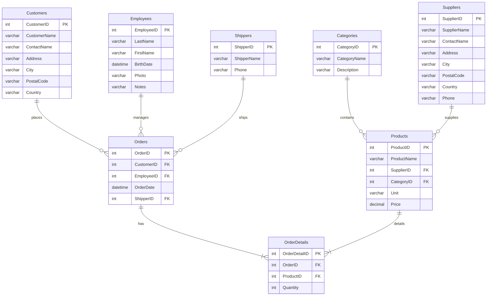

# Diagrama de Entidad-Relación de Northwind (Formato Mermaid)

Este archivo contiene el código en formato Mermaid para generar un diagrama visual de la base de datos `Northwind`. Puedes copiar y pegar este bloque de código en un editor compatible con Mermaid para ver el gráfico.

