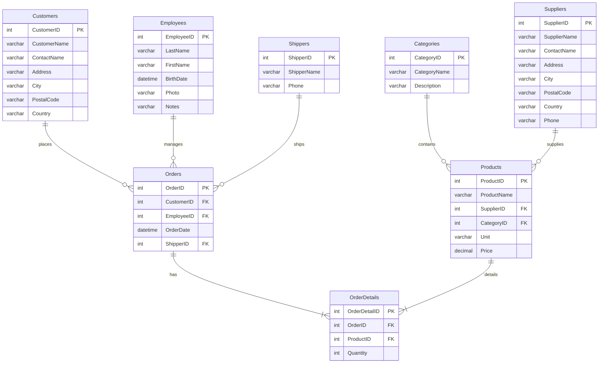

# Diagrama de Entidad-Relación de Northwind (Formato Mermaid)

Este archivo contiene el código en formato Mermaid para generar un diagrama visual de la base de datos `Northwind`. Puedes copiar y pegar este bloque de código en un editor compatible con Mermaid para ver el gráfico.



# SQL Básico: Fundamentos y Consultas Simples

Esta sección cubre los comandos más fundamentales de SQL. Son la base para construir consultas más complejas.

## 1. Selección de Datos (`SELECT`)

### `SELECT *`

**Objetivo:** Seleccionar **todas** las columnas de una tabla.

1.  **Ver todos los clientes:**

    ```sql
    SELECT * FROM Customers;
    ```

2.  **Ver todos los productos:**

    ```sql
    SELECT * FROM Products;
    ```

3.  **Ver todos los empleados:**
    ```sql
    SELECT * FROM Employees;
    ```

### `SELECT` con Columnas Específicas

**Objetivo:** Seleccionar solo las columnas que te interesan.

4.  **Obtener el nombre y teléfono de los clientes:**

    ```sql
    SELECT ContactName, Phone FROM Customers;
    ```

5.  **Obtener el nombre del producto y su precio unitario:**
    ```sql
    SELECT ProductName, UnitPrice FROM Products;
    ```

### `AS` (Alias)

**Objetivo:** Renombrar una columna en el resultado de la consulta.

6.  **Mostrar el nombre del producto con el alias "NombreDeProducto":**
    ```sql
    SELECT ProductName AS NombreDeProducto FROM Products;
    ```

## 2. Filtrado de Datos (`WHERE`)

### Operadores de Comparación (`=`, `!=`, `>`, `<`)

**Objetivo:** Filtrar filas basadas en una condición.

7.  **Encontrar todos los productos del proveedor con ID 1:**

    ```sql
    SELECT * FROM Products WHERE SupplierID = 1;
    ```

8.  **Listar productos con un precio superior a $50:**

    ```sql
    SELECT * FROM Products WHERE UnitPrice > 50;
    ```

9.  **Listar todos los pedidos que no fueron enviados por el transportista con ID 2:**
    ```sql
    SELECT * FROM Orders WHERE ShipVia != 2;
    ```

### `LIKE`

**Objetivo:** Buscar un patrón en una columna de texto.

10. **Encontrar clientes cuyo nombre de contacto empieza con 'A':**

    ```sql
    SELECT * FROM Customers WHERE ContactName LIKE 'A%';
    ```

11. **Encontrar clientes cuyo país contiene la palabra 'land':**
    ```sql
    SELECT * FROM Customers WHERE Country LIKE '%land%';
    ```

### `IN`

**Objetivo:** Filtrar por una lista de valores posibles.

12. **Seleccionar clientes de 'Germany', 'France' o 'UK':**
    ```sql
    SELECT * FROM Customers WHERE Country IN ('Germany', 'France', 'UK');
    ```

### `BETWEEN`

**Objetivo:** Filtrar un rango de valores.

13. **Seleccionar productos con un precio entre $10 y $20:**
    ```sql
    SELECT * FROM Products WHERE UnitPrice BETWEEN 10 AND 20;
    ```

### `IS NULL` / `IS NOT NULL`

**Objetivo:** Encontrar filas con valores nulos o no nulos.

14. **Encontrar clientes que no tienen especificada una región:**
    ```sql
    SELECT * FROM Customers WHERE Region IS NULL;
    ```

### Operadores Lógicos (`AND`, `OR`, `NOT`)

**Objetivo:** Combinar múltiples condiciones en un `WHERE`.

15. **Clientes de Alemania que viven en Berlin:**

    ```sql
    SELECT * FROM Customers WHERE Country = 'Germany' AND City = 'Berlin';
    ```

16. **Productos que están descontinuados O tienen 0 unidades en stock:**
    ```sql
    SELECT * FROM Products WHERE Discontinued = 1 OR UnitsInStock = 0;
    ```

## 3. Ordenamiento de Resultados (`ORDER BY`)

**Objetivo:** Ordenar el conjunto de resultados por una o más columnas.

17. **Listar productos ordenados por precio, del más barato al más caro:**

    ```sql
    SELECT * FROM Products ORDER BY UnitPrice ASC;
    ```

18. **Listar productos ordenados por precio, del más caro al más barato:**

    ```sql
    SELECT * FROM Products ORDER BY UnitPrice DESC;
    ```

19. **Listar clientes ordenados por país y luego por nombre:**
    ```sql
    SELECT * FROM Customers ORDER BY Country, ContactName;
    ```

## 4. Limitación de Resultados (`LIMIT`)

**Objetivo:** Limitar el número de filas devueltas.

20. **Obtener los 5 productos más caros:**
    ```sql
    SELECT * FROM Products ORDER BY UnitPrice DESC LIMIT 5;
    ```

## 5. Valores Únicos (`DISTINCT`)

**Objetivo:** Devolver solo valores diferentes en una columna.

21. **Listar los países únicos de los clientes:**
    ```sql
    SELECT DISTINCT Country FROM Customers;
    ```

## 6. Funciones de Agregación

### `COUNT`

**Objetivo:** Contar el número de filas.

22. **Contar el número total de clientes:**

    ```sql
    SELECT COUNT(*) FROM Customers;
    ```

23. **Contar cuántos productos están descontinuados:**
    ```sql
    SELECT COUNT(*) FROM Products WHERE Discontinued = 1;
    ```

### `SUM`

**Objetivo:** Sumar los valores de una columna numérica.

24. **Calcular el valor total del inventario (unidades en stock \* precio):**
    ```sql
    SELECT SUM(UnitsInStock * UnitPrice) AS TotalInventoryValue FROM Products;
    ```

### `AVG`

**Objetivo:** Calcular el promedio de los valores de una columna.

25. **Calcular el precio promedio de los productos:**
    ```sql
    SELECT AVG(UnitPrice) FROM Products;
    ```

### `MIN` y `MAX`

**Objetivo:** Obtener el valor mínimo y máximo de una columna.

26. **Encontrar el producto más barato y el más caro:**
    ```sql
    SELECT MIN(UnitPrice) AS Cheapest, MAX(UnitPrice) AS MostExpensive FROM Products;
    ```

## 7. Agrupación de Datos (`GROUP BY`)

**Objetivo:** Agrupar filas que tienen los mismos valores en columnas específicas en filas de resumen.

27. **Contar cuántos clientes hay en cada país:**

    ```sql
    SELECT Country, COUNT(*) AS NumberOfCustomers FROM Customers GROUP BY Country;
    ```

28. **Calcular el precio promedio de productos por cada categoría (ID):**

    ```sql
    SELECT CategoryID, AVG(UnitPrice) FROM Products GROUP BY CategoryID;
    ```

29. **Obtener el número de pedidos gestionados por cada empleado:**
    ```sql
    SELECT EmployeeID, COUNT(OrderID) AS TotalOrders FROM Orders GROUP BY EmployeeID;
    ```

## 8. Uniones de Tablas (`JOIN`)

### `INNER JOIN`

**Objetivo:** Combinar filas de dos o más tablas basadas en una condición de unión.

30. **Mostrar los productos y los nombres de sus proveedores:**

    ```sql
    SELECT p.ProductName, s.ContactName AS Supplier
    FROM Products p
    INNER JOIN Suppliers s ON p.SupplierID = s.SupplierID;
    ```

31. **Listar los pedidos con el nombre del cliente que los realizó:**

    ```sql
    SELECT o.OrderID, c.ContactName
    FROM Orders o
    INNER JOIN Customers c ON o.CustomerID = c.CustomerID;
    ```

32. **Obtener detalles de un pedido (producto y cantidad) para el pedido 10248:**

    ```sql
    SELECT p.ProductName, od.Quantity
    FROM OrderDetails od
    INNER JOIN Products p ON od.ProductID = p.ProductID
    WHERE od.OrderID = 10248;
    ```

33. **Ver qué empleado gestionó qué pedido:**

    ```sql
    SELECT o.OrderID, e.FirstName, e.LastName
    FROM Orders o
    INNER JOIN Employees e ON o.EmployeeID = e.EmployeeID;
    ```

34. **Listar los productos y la categoría a la que pertenecen:**
    ```sql
    SELECT p.ProductName, c.CategoryName
    FROM Products p
    INNER JOIN Categories c ON p.CategoryID = c.CategoryID;
    ```
