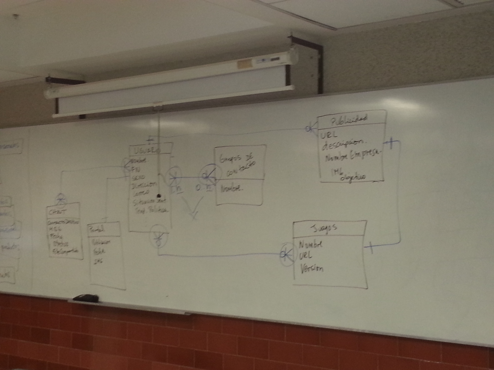
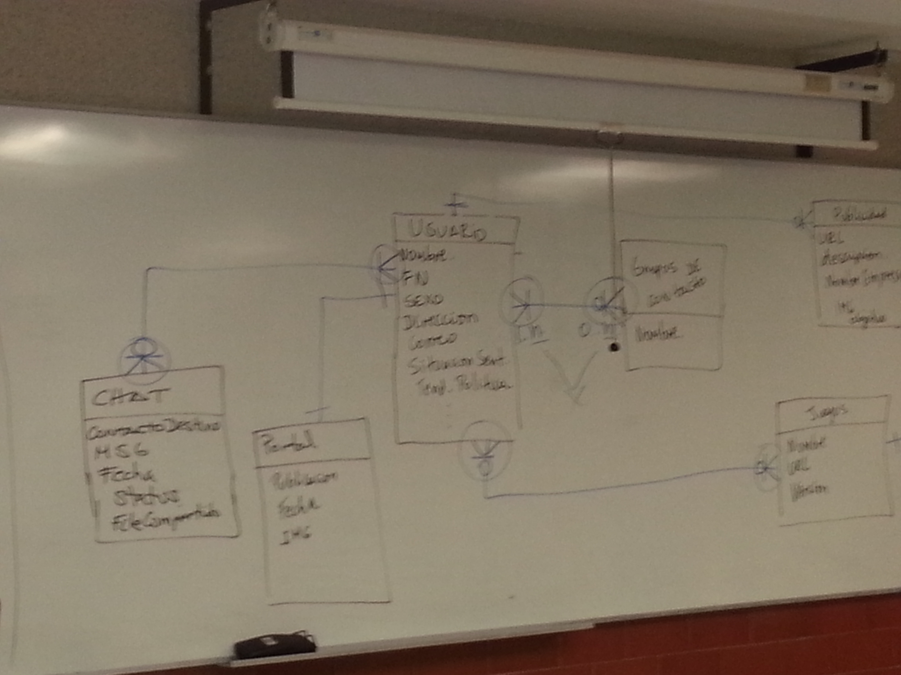
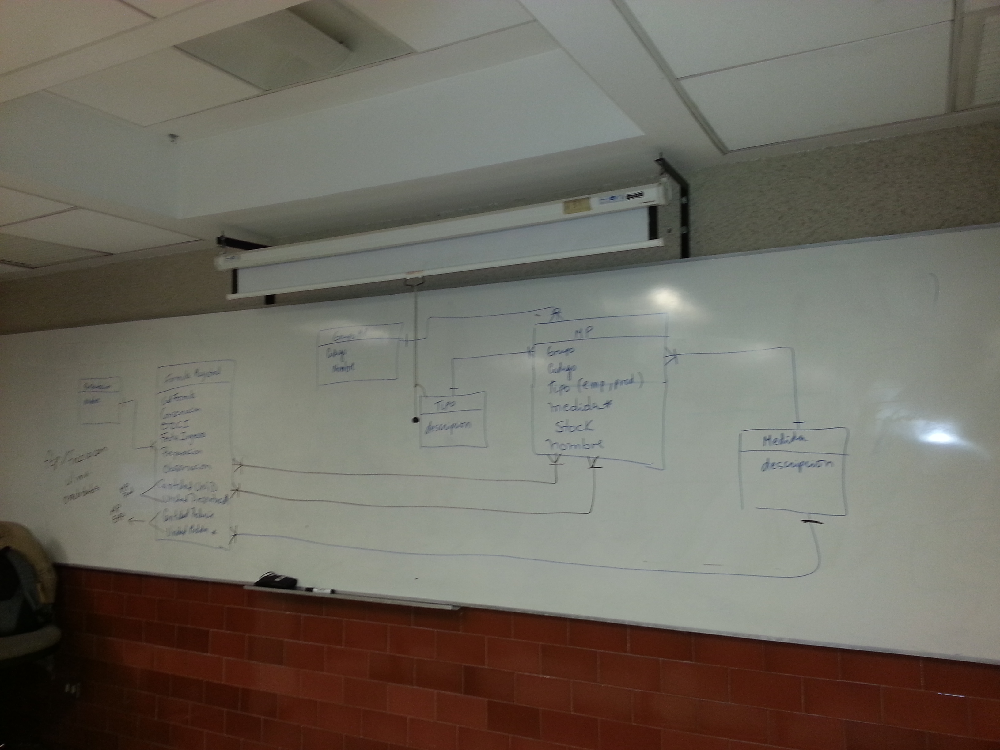
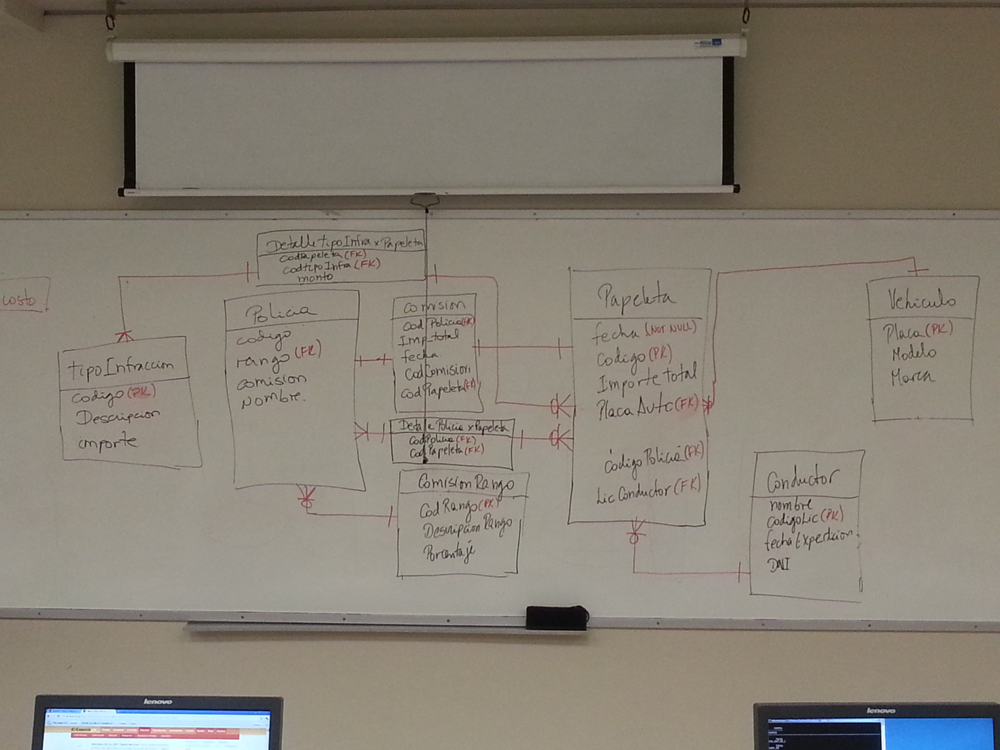

# Clase 02: Sistema de Gestión de Base de Datos (SGBD)

**Fecha:** Noviembre 18, 2025 (Inferido del periodo del curso)

---

## Notas Generales

### Concepto de SGBD

Un Sistema de Gestión de Base de Datos (SGBD o DBMS por sus siglas en inglés) es un software que permite a los usuarios definir, crear, mantener y controlar el acceso a la base de datos. Actúa como una interfaz entre las aplicaciones del usuario y los datos físicos, proporcionando una forma estructurada y eficiente de interactuar con ellos.

### Funciones Principales de un SGBD

1.  **Definición de Datos (DDL - Data Definition Language):** Permite especificar la estructura interna y externa de los datos, así como las restricciones de integridad. Esto se realiza a través de un lenguaje de definición de datos.
    *   Ejemplos: `CREATE TABLE`, `ALTER TABLE`, `DROP TABLE`.
2.  **Manipulación de Datos (DML - Data Manipulation Language):** Facilita la inserción, modificación, eliminación y recuperación de datos de la base de datos.
    *   Ejemplos: `INSERT`, `UPDATE`, `DELETE`, `SELECT`.
3.  **Control de Acceso y Seguridad:** Gestiona quién puede acceder a qué datos y qué operaciones pueden realizar. Incluye mecanismos de autenticación, autorización y encriptación.
4.  **Integridad de Datos:** Asegura que los datos almacenados sean correctos y consistentes, aplicando reglas y restricciones definidas (ej. claves primarias, claves foráneas, restricciones `CHECK`).
5.  **Recuperación y Respaldo:** Proporciona mecanismos para restaurar la base de datos a un estado consistente después de fallos (ej. copias de seguridad, logs de transacciones).
6.  **Control de Concurrencia:** Permite que múltiples usuarios accedan y modifiquen los datos simultáneamente sin interferir entre sí, manteniendo la consistencia de los datos.
7.  **Catálogo del Sistema (Metadatos):** Un diccionario de datos que almacena información sobre la estructura de la base de datos (tablas, columnas, índices, usuarios, etc.).

### Ventajas de Usar un SGBD

*   **Reducción de Redundancia de Datos:** Minimiza la duplicidad de datos.
*   **Mejora de la Consistencia de Datos:** Aplica reglas para mantener la integridad.
*   **Compartición de Datos:** Permite que múltiples usuarios y aplicaciones accedan a los mismos datos de forma controlada.
*   **Seguridad de Datos:** Control centralizado del acceso.
*   **Mantenimiento de la Integridad de Datos:** Aplicación de reglas y restricciones.
*   **Independencia de Datos:** Separa la definición lógica de los datos de su almacenamiento físico.
*   **Reducción del Tiempo de Desarrollo de Aplicaciones:** Las funciones del SGBD simplifican la programación.

### Componentes de un SGBD

*   **Motor de Base de Datos:** El corazón del SGBD, responsable de almacenar, recuperar y actualizar los datos.
*   **Lenguajes de Base de Datos:** DDL, DML, DCL (Data Control Language - GRANT/REVOKE), TCL (Transaction Control Language - COMMIT/ROLLBACK).
*   **Procesador de Consultas:** Interpreta y optimiza las sentencias SQL.
*   **Gestor de Transacciones:** Asegura la atomicidad, consistencia, aislamiento y durabilidad (propiedades ACID) de las transacciones.
*   **Utilidades:** Herramientas para administración, monitoreo, respaldo, recuperación.

---

## Pistas y Keywords

*   **SGBD (DBMS):** Software para gestionar bases de datos.
*   **Definición de Datos (DDL):** `CREATE`, `ALTER`, `DROP`.
*   **Manipulación de Datos (DML):** `SELECT`, `INSERT`, `UPDATE`, `DELETE`.
*   **Control de Acceso:** Permisos de usuario.
*   **Integridad de Datos:** Consistencia y validez.
*   **Recuperación/Respaldo:** Protección contra fallos.
*   **Control de Concurrencia:** Acceso multiusuario.
*   **Metadatos:** Datos sobre datos (Catálogo del Sistema).
*   **Propiedades ACID:** Atomicidad, Consistencia, Aislamiento, Durabilidad.

---

## Resumen Final Crítico

El Sistema de Gestión de Base de Datos (SGBD) es una tecnología fundamental en la informática moderna, actuando como el intermediario esencial entre los usuarios, las aplicaciones y los datos. Proporciona un conjunto robusto de funcionalidades para la definición, manipulación, control de acceso, seguridad y mantenimiento de los datos. Gracias a sus capacidades, los SGBD resuelven problemas como la redundancia, la inconsistencia y la seguridad que surgirían en un manejo manual de archivos. Entender sus funciones y componentes es clave para cualquier profesional que trabaje con información y sistemas.

---

## Conexiones con Clases Anteriores y Siguientes

*   **Conexiones Anteriores:** Esta clase se basa en los "Fundamentos de Administración de Información" (Clase 01), explicando cómo un SGBD implementa y facilita esa administración al manejar eficientemente los datos.
*   **Conexiones Siguientes:** Es la base directa para comprender las "Bases de Datos Relacionales" (Clase 03), la "Administración de RDBMS" (Clase 04), y las clases de SQL (Clase 05, 10 y 11), ya que SQL es el lenguaje estándar para interactuar con la mayoría de los SGBD relacionales. También sienta las bases para el modelamiento de datos y la normalización.

---
**Nota:** El contenido de esta clase ha sido inferido del título del curso y conocimientos generales sobre la materia, dado que el archivo `.ppt` original no pudo ser procesado directamente.

