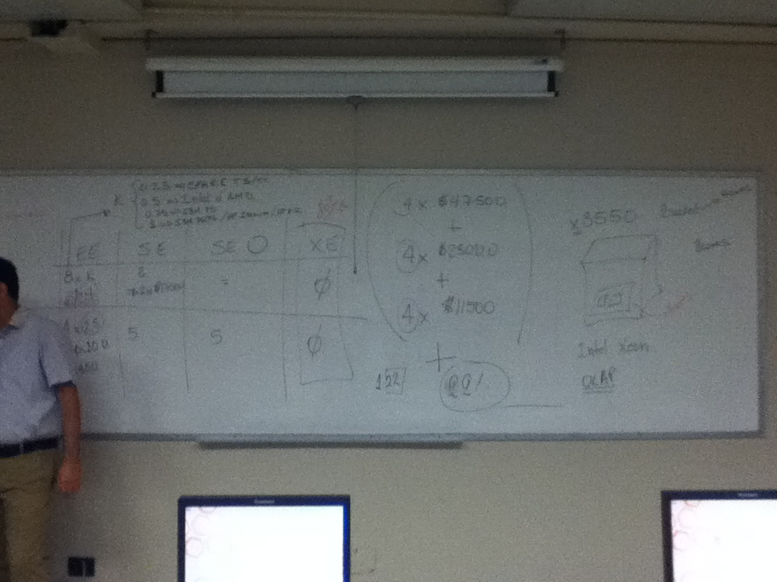
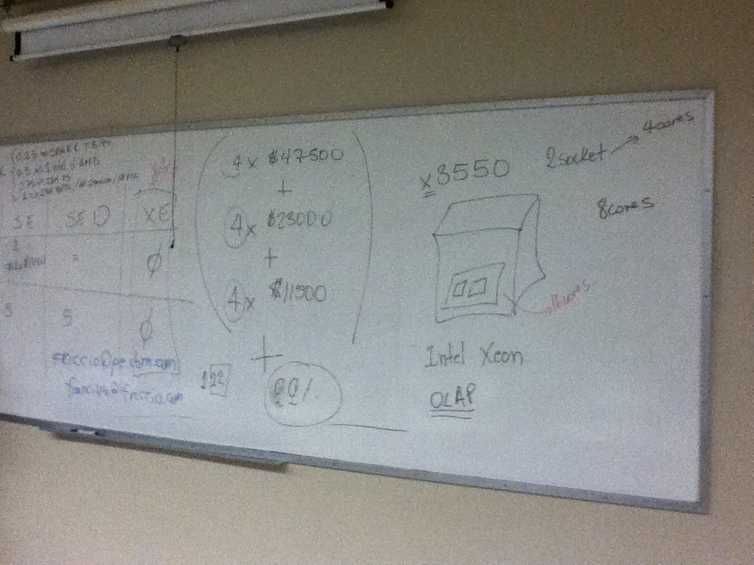
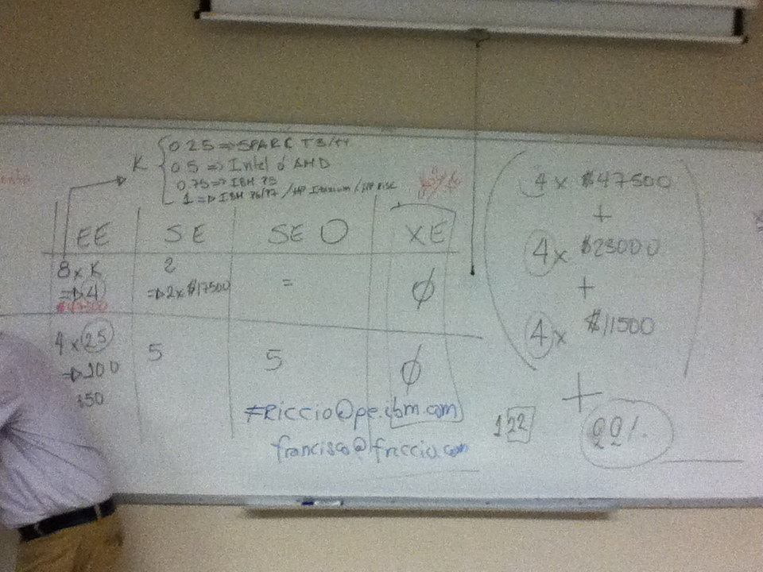

# Clase 06: Modelamiento de Datos en la Empresa

**Fecha:** Noviembre 18, 2025 (Inferido del periodo del curso)

---

## Notas Generales

### Concepto de Modelamiento de Datos

El modelamiento de datos es el proceso de crear un modelo de datos para un sistema de información, a menudo un sistema de bases de datos. Un modelo de datos es una representación abstracta de cómo se organizan los datos, cómo se relacionan entre sí y qué reglas rigen su uso. Es una etapa crucial en el ciclo de vida de desarrollo de un sistema.

### Tipos de Modelos de Datos

Existen varios niveles de abstracción en el modelamiento de datos:

1.  **Modelo Conceptual de Datos:**
    *   **Propósito:** Describe la estructura de los datos tal como la percibe el usuario final. Independiente de cualquier SGBD o implementación física.
    *   **Elementos:** Entidades, atributos, relaciones.
    *   **Notación Común:** Diagramas de Entidad-Relación (DER).
    *   **Entidad:** Representa un objeto o concepto del mundo real (persona, lugar, evento, cosa) sobre el cual se desea almacenar información. Ej: `CLIENTE`, `PRODUCTO`.
    *   **Atributo:** Una propiedad o característica de una entidad. Ej: `CLIENTE` tiene `Nombre`, `Dirección`, `Email`.
    *   **Relación:** Una asociación entre dos o más entidades. Ej: `CLIENTE` realiza `PEDIDO`.
    *   **Cardinalidad:** Describe el número de instancias de una entidad asociadas con el número de instancias de otra entidad en una relación (uno a uno, uno a muchos, muchos a muchos).
    *   **Opcionalidad:** Indica si la participación en una relación es obligatoria u opcional.

2.  **Modelo Lógico de Datos:**
    *   **Propósito:** Describe los datos con mayor detalle, definiendo la estructura de datos que se puede implementar en un SGBD específico. Sigue las reglas de un modelo de datos particular (ej. relacional), pero aún es independiente de la implementación física.
    *   **Elementos:** Tablas, columnas, claves primarias, claves foráneas, restricciones de integridad.
    *   **Conversión:** Un modelo conceptual se mapea a un modelo lógico (ej. entidades a tablas, atributos a columnas, relaciones a claves foráneas).
    *   **Normalización:** Proceso de refinar el modelo lógico para reducir la redundancia y mejorar la integridad de los datos. (Se profundizará en clases posteriores).

3.  **Modelo Físico de Datos:**
    *   **Propósito:** Describe cómo se implementarán los datos en un SGBD concreto, incluyendo detalles de almacenamiento físico. Es dependiente del SGBD y del entorno hardware.
    *   **Elementos:** Tipos de datos específicos del SGBD, índices, particiones, vistas, procedimientos almacenados, gatillos (triggers), ubicación física de los archivos.
    *   **Optimización:** Incluye decisiones sobre cómo optimizar el rendimiento y el uso del almacenamiento.

### Herramientas de Modelamiento

*   **Herramientas CASE (Computer-Aided Software Engineering):** Software que ayuda en el diseño y la documentación de modelos de datos (ej. ER/Studio, Oracle SQL Developer Data Modeler, MySQL Workbench). Permiten dibujar DERs y generar el código SQL para crear la base de datos.
*   **Notación:** Diagramas de Entidad-Relación (Chen, Crow's Foot), UML (Unified Modeling Language).

### Importancia del Modelamiento de Datos

*   **Claridad:** Proporciona una visión clara y concisa de los datos del negocio.
*   **Comunicación:** Sirve como un lenguaje común entre usuarios de negocio y desarrolladores técnicos.
*   **Consistencia:** Ayuda a asegurar la consistencia y la integridad de los datos.
*   **Diseño Óptimo:** Facilita el diseño de bases de datos eficientes y escalables.
*   **Documentación:** Actúa como documentación fundamental para el sistema.

---

## Pistas y Keywords

*   **Modelamiento de Datos:** Proceso de diseño de la estructura de datos.
*   **Modelo Conceptual:** Visión de alto nivel, DER.
*   **Entidad:** Objeto/Concepto del mundo real.
*   **Atributo:** Propiedad de una entidad.
*   **Relación:** Asociación entre entidades.
*   **Cardinalidad:** Grado de asociación (1:1, 1:N, N:M).
*   **Modelo Lógico:** Estructura para SGBD, tablas, claves.
*   **Normalización:** Reducir redundancia en modelo lógico.
*   **Modelo Físico:** Implementación específica del SGBD.
*   **Herramientas CASE:** Software para modelamiento.

---

## Resumen Final Crítico

El modelamiento de datos es una disciplina esencial que sirve como puente entre los requisitos de negocio y la implementación técnica de una base de datos. A través de sus tres niveles de abstracción (conceptual, lógico y físico), permite a los diseñadores comprender, comunicar y construir sistemas de información robustos y eficientes. Un modelo de datos bien diseñado es la base para asegurar la integridad, consistencia y utilidad de la información de una empresa, evitando problemas futuros de rendimiento y mantenibilidad.

---

## Conexiones con Clases Anteriores y Siguientes

*   **Conexiones Anteriores:** Esta clase se basa en los fundamentos de "Bases de Datos Relacionales" (Clase 03) y su administración (Clase 04), proporcionando las metodologías para diseñar estas estructuras.
*   **Conexiones Siguientes:** Es la introducción directa a la "Normalización" (Clase 07 y 09), donde se refinarán los modelos lógicos de datos. También es crucial para entender por qué las sentencias DML (Clase 05) y las consultas SQL (Clase 10 y 11) se escriben de cierta manera, ya que operan sobre las estructuras definidas por el modelamiento.

---

---

## Caso Práctico: Modelamiento para un Gimnasio

A continuación se resumen los requerimientos y reglas de negocio extraídos del documento del proyecto "Aplicativo Web de Inscripción y atención al usuario para un gimnasio". Este es un ejemplo práctico de los requisitos que informan el proceso de modelamiento de datos.

### Entidades Principales Identificadas
-   **Sucursal**
-   **Personal** (con cargos como Administrador, Recepcionista, Entrenador, etc.)
-   **Socio** (Cliente)
-   **Servicios** (Entrenamiento, Aeróbicos, Baile, Nutrición, etc.)
-   **Paquetes** (Diario, Inter-diario, Fines de semana)
-   **Matrícula**
-   **Cita** (con Médico o Nutricionista)
-   **Hoja de Vida del Socio** (historial de medidas, peso, etc.)
-   **Horario de Clases**

### Reglas de Negocio Clave
1.  El gimnasio tiene varias sucursales.
2.  Cada sucursal tiene personal con diferentes cargos.
3.  Los servicios se ofrecen en forma de paquetes (Diario, Inter-diario, Fines de semana).
4.  Al matricularse, el socio escoge un paquete.
5.  Tras la matrícula, se programa una cita inicial con un médico para registrar el estado inicial del socio (medidas, peso) en su "Hoja de Vida".
6.  Esta revisión médica se realiza mensualmente.
7.  El socio puede sacar citas adicionales con el nutricionista.
8.  Un socio puede pagar extra por un "Personal Trainer" que le será asignado.
9.  Un servicio (ej. Baile) puede tener varios horarios en un mismo día.
10. Cada servicio en un horario específico es impartido por un solo profesional.

### Requerimientos Funcionales
*   **Sistema:**
    *   Registrar clientes.
    *   Actualizar información de clientes.
    *   Registrar y actualizar horarios de clases.
    *   Generar reportes y consultas (horarios, clases, clientes).
    *   Permitir que Nutricionistas, Médicos y Entrenadores accedan al historial del socio.
*   **Clientes (Socios):**
    *   Ingresar al sistema con usuario y clave.
    *   Consultar horarios de clases.
    *   Consultar su historial de avance.
    *   Sacar citas.

### Requerimientos No Funcionales
*   El sistema debe ser accesible desde cualquier dispositivo (responsive design).
*   Debe solicitar autenticación para todos los usuarios.
*   Debe ser amigable (fácil de usar).

Estos requerimientos y reglas de negocio son la base para construir el **Modelo Conceptual** (identificando entidades, atributos y relaciones) y el **Modelo Lógico** (definiendo tablas, claves y aplicando normalización).