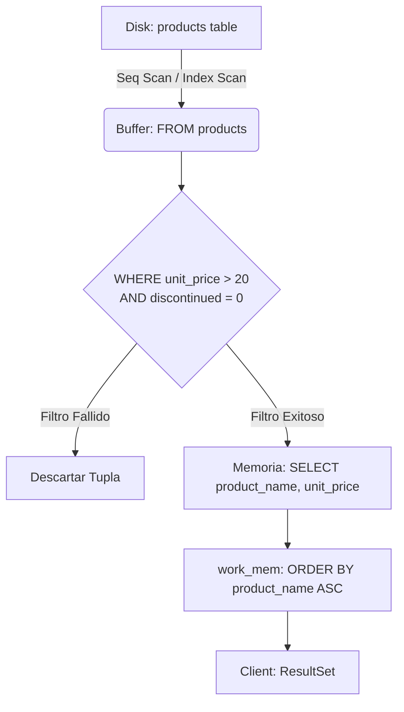
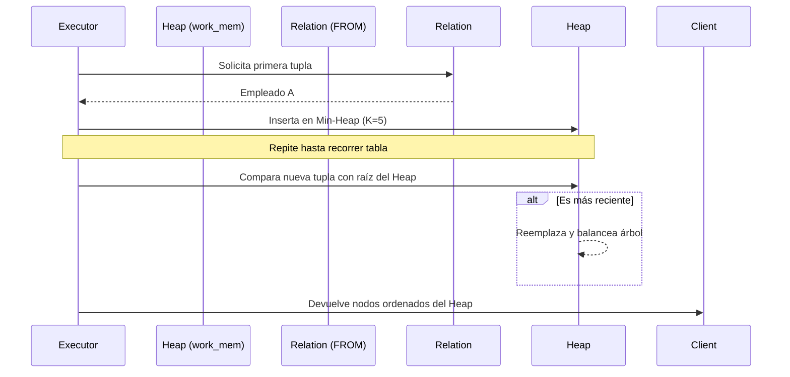
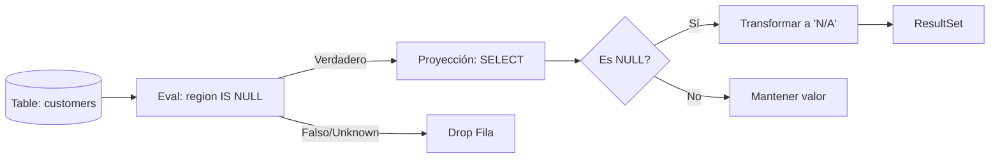

# Fase 1: SQL Básico y Mecánica de Motor de Base de Datos

Esta sección cubre la capa fundacional del procesamiento relacional en PostgreSQL. Nos enfocaremos en las fases iniciales del *Logical Query Processing* y cómo el motor planifica el escaneo de relaciones base (Heap Scans).

---

## Ejercicio 1: Extracción y Filtrado con Predicados Simples
**Enunciado de Negocio / Pregunta de Entrevista:** Extraiga todos los productos activos de la tabla `products` cuyo precio unitario sea mayor a $20, ordenados alfabéticamente por su nombre.

### 🏫 Explicación Sencilla (Nivel Secundaria)
> **La analogía del estante de juguetes:**
> Imagina que estás en una juguetería frente a un estante gigante lleno de juguetes (`FROM products`). Tu mamá te dice: "Tráeme solo los juguetes que cuesten más de $20 y que todavía se sigan fabricando" (`WHERE unit_price > 20 AND discontinued = 0`). 
> 
> Para cumplir el encargo:
> 1. Vas al estante (`FROM`).
> 2. Miras juguete por juguete; si cuesta $20 o menos, o si ya no se fabrica, lo dejas ahí. Solo te quedas en las manos con los que cumplen la regla (`WHERE`).
> 3. De los juguetes que tienes en la mano, solo anotas en un papel su nombre y su precio (`SELECT`).
> 4. Finalmente, ordenas esa listita de la A a la Z para entregársela a tu mamá (`ORDER BY`).

### 🧠 1. Marco Conceptual del Optimizador
En una consulta básica de filtrado, el optimizador de PostgreSQL evalúa la disponibilidad de índices (B-Tree) versus un *Sequential Scan* (Seq Scan). Si no existe un índice aplicable sobre la columna `unit_price`, el motor leerá cada página de 8KB (bloque) de la tabla desde el disco hacia los *shared buffers* (memoria), aplicando el filtro evaluando fila por fila. 

El orden lógico de operaciones es:
1. `FROM`: Identificar y acceder a la relación base.
2. `WHERE`: Aplicar el predicado para reducir el volumen de datos en memoria.
3. `SELECT`: Proyectar únicamente las columnas solicitadas.
4. `ORDER BY`: Ejecutar un algoritmo de ordenamiento (ej. *QuickSort* si cabe en `work_mem`, o *External Merge* en disco) sobre el set resultante.

### 📊 2. Diagrama de Flujo de Datos


### 💻 3. Solución SQL (Validada para AWS EC2/Docker)
```sql
EXPLAIN (ANALYZE, BUFFERS)
SELECT 
    product_name,
    unit_price
FROM 
    products
WHERE 
    unit_price > 20
    AND discontinued = 0
ORDER BY 
    product_name ASC;
```

### 💡 Tips del Profesor (Cloud & Data Architect)
*   **Gotcha de Rendimiento (No uses SELECT *):** Nunca traigas columnas que no necesitas. Traer todos los campos (como la imagen binaria o descripciones largas) satura el ancho de banda y la memoria cache (`shared_buffers`), haciendo la consulta lenta.
*   **Regla de Negocio:** En esta base de datos Northwind, la columna `discontinued` es de tipo entero (`integer`), donde `0` significa activo y `1` descontinuado. Por eso comparamos con `= 0`.

---

## Ejercicio 2: Paginación y Optimización de Sort Nodes
**Enunciado de Negocio / Pregunta de Entrevista:** ¿Cuáles son los 5 empleados contratados más recientemente? Devuelva sus nombres completos y fecha de contratación.

### 🏫 Explicación Sencilla (Nivel Secundaria)
> **La analogía de la bandeja de 5 documentos:**
> Imagina que tienes una pila gigante con las hojas de vida de 1,000 empleados y quieres encontrar los 5 más nuevos. 
> 
> En lugar de ordenar toda la pila completa de 1,000 hojas en tu escritorio (lo cual tomaría mucho espacio y tiempo), pones una bandeja pequeña a tu lado donde caben exactamente **5 hojas** (`LIMIT 5`). 
> 
> Tomas la primera hoja y la pones en la bandeja. Conforme vas revisando las demás hojas del montón:
> - Si la hoja que tienes en la mano es de alguien contratado después (más nuevo) que el más antiguo de tu bandeja de 5, sacas al más viejo de la bandeja y metes el nuevo.
> - Al terminar de revisar la pila, en tu bandeja pequeña te habrán quedado los 5 más nuevos sin haber tenido que ordenar los otros 995. Esto en computación se llama **Top-N Heapsort**.

### 🧠 1. Marco Conceptual del Optimizador
Este ejercicio evalúa la combinación de ordenamiento y limitación. Al solicitar un `LIMIT 5` junto a un `ORDER BY`, PostgreSQL puede emplear una optimización conocida como *Top-N Heapsort*. En lugar de ordenar toda la tabla y luego cortar los primeros 5 registros, el motor mantiene un *min-heap* en memoria (limitado a 5 elementos). Esto reduce drásticamente el consumo de `work_mem` y el tiempo de CPU, transformando una complejidad `O(N log N)` en `O(N log K)`, donde `K = 5`.

### 📊 2. Diagrama de Flujo de Datos


### 💻 3. Solución SQL (Validada para AWS EC2/Docker)
```sql
EXPLAIN (ANALYZE, BUFFERS)
SELECT 
    first_name || ' ' || last_name AS full_name,
    hire_date
FROM 
    employees
ORDER BY 
    hire_date DESC
LIMIT 5;
```

### 💡 Tips del Profesor (Cloud & Data Architect)
*   **Uso de Memoria (`work_mem`):** Al usar `LIMIT`, PostgreSQL evita escribir en el disco si el tamaño de los datos a ordenar supera la memoria de trabajo temporal (`work_mem`). Si quitas el `LIMIT`, podrías ver en el plan de ejecución que el motor hace un ordenamiento externo en disco (*external merge*), lo cual es 10 veces más lento.
*   **Concatenación Segura:** El operador `||` une textos en PostgreSQL. Ten cuidado: si alguno de los campos es `NULL`, toda la concatenación se convertirá en `NULL`. En este caso, `first_name` and `last_name` son obligatorios (`NOT NULL`), por lo que es seguro usarlo.

---

## Ejercicio 3: Lógica Trivalente y Manejo de Ausencia de Datos (NULL)
**Enunciado de Negocio / Pregunta de Entrevista:** Identifique a los clientes (`customers`) que no tienen una región asignada. Formatee la salida para que, en lugar del valor NULL, se muestre la cadena 'N/A' en la región.

### 🏫 Explicación Sencilla (Nivel Secundaria)
> **La analogía de la pregunta confusa:**
> En el mundo real, si te preguntan "¿cuánto dinero tiene Juan en el bolsillo?" y no lo sabes, tu respuesta es "no lo sé" (eso es un `NULL`).
> 
> Si luego te preguntan: "¿Tiene Juan la misma cantidad de dinero que Pedro (de quien tampoco sabes cuánto tiene)?" tu respuesta no puede ser "Sí" ni "No"; tu respuesta sigue siendo "no lo sé".
> 
> En las bases de datos pasa igual. No puedes preguntar `region = NULL` porque el motor responderá "no lo sé" (`UNKNOWN`) y no te mostrará nada. Tienes que preguntar específicamente: "¿La región está vacía/sin datos?" usando **`IS NULL`**.
> Además, usamos un traductor llamado `COALESCE` que dice: "si este dato es desconocido (`NULL`), escribe 'N/A' en su lugar".

### 🧠 1. Marco Conceptual del Optimizador
El estándar ANSI SQL opera bajo una lógica trivalente (Verdadero, Falso, Desconocido). Comparar un `NULL` mediante el operador `=` siempre resultará en `UNKNOWN` (Desconocido), por lo que el predicado de filtro descartará la fila. Es imperativo utilizar la función `IS NULL`. Para el formateo en la proyección (SELECT), PostgreSQL evalúa funciones escalares como `COALESCE` durante la fase de transformación de salida, fila por fila. `COALESCE` cortocircuita y devuelve el primer argumento no nulo.

### 📊 2. Diagrama de Flujo de Datos


### 💻 3. Solución SQL (Validada para AWS EC2/Docker)
```sql
EXPLAIN (ANALYZE, BUFFERS)
SELECT 
    company_name,
    country,
    COALESCE(region, 'N/A') AS formatted_region
FROM 
    customers
WHERE 
    region IS NULL;
```

### 💡 Tips del Profesor (Cloud & Data Architect)
*   **¡Error de Novato Típico!** Jamás escribas `WHERE region = NULL`. En SQL, `NULL = NULL` es `UNKNOWN` (Falso para filtros). Si ejecutas esa consulta, la base de datos te devolverá cero filas y pensarás que no hay datos, cuando en realidad hay muchos registros con región vacía.
*   **Índices parciales:** Si en producción tienes millones de filas y muchas tienen región, pero solo te interesan las que no tienen región (`IS NULL`), puedes crear un índice parcial: `CREATE INDEX idx_cust_region_null ON customers(customer_id) WHERE region IS NULL;`. Esto hace que el índice pese casi nada y la consulta sea ultra rápida.
