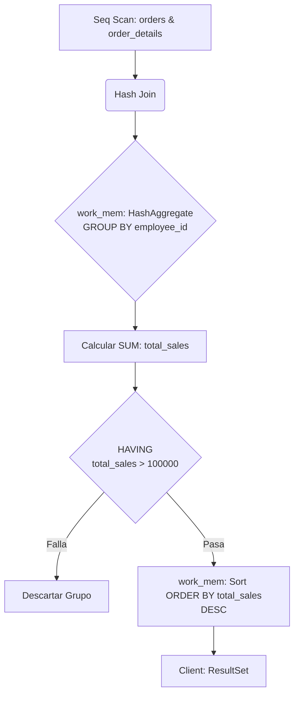
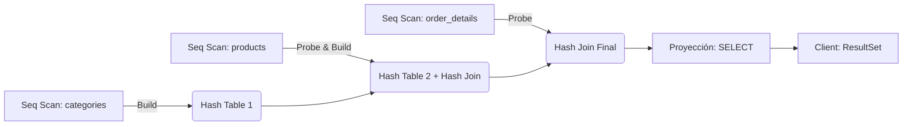
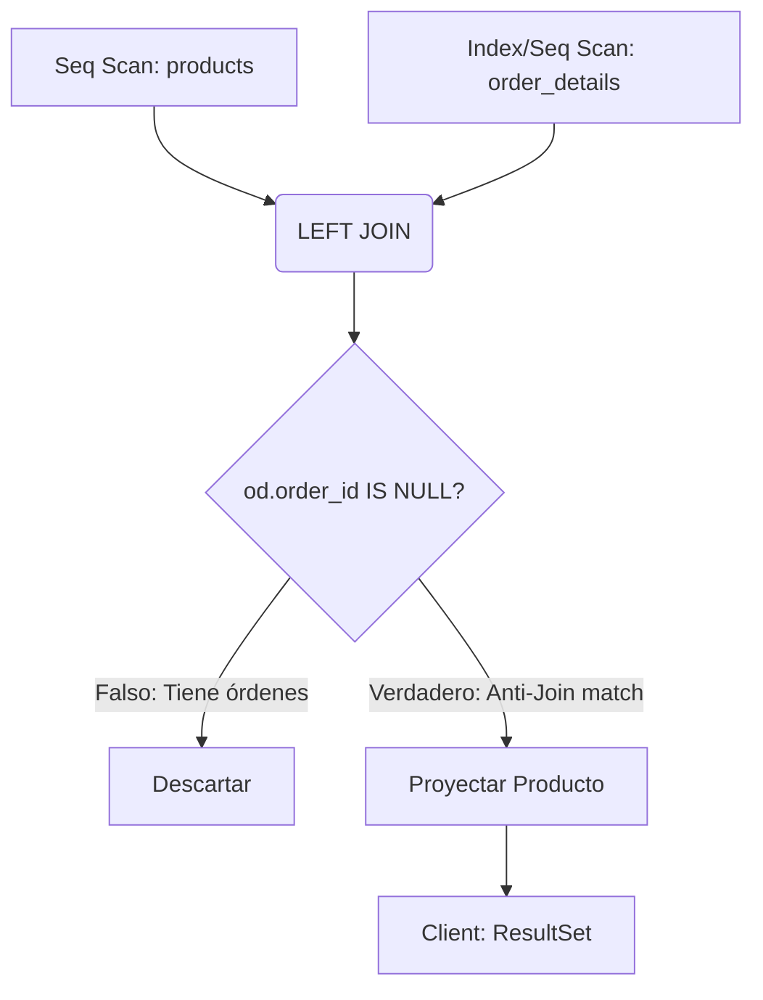

# Fase 2: SQL Intermedio, Agrupaciones y Estrategias de Join

Esta sección profundiza en las operaciones relacionales de proyección agrupada y combinación de conjuntos. El enfoque técnico recae sobre cómo el optimizador de PostgreSQL decide entre algoritmos de agregación y métodos de *Join* físicos según las estadísticas de cardinalidad.

---

## Ejercicio 1: Agrupación Estricta y Filtrado Post-Agregación
**Enunciado de Negocio / Pregunta de Entrevista:** Determine el monto total de ventas (sin descuento) por cada empleado, considerando únicamente a aquellos empleados cuyas ventas totales superen los $100,000. Ordene el resultado de mayor a menor.

### 🏫 Explicación Sencilla (Nivel Secundaria)
> **La analogía del festival de ventas del colegio:**
> Imagina que varios alumnos vendieron rifas para el viaje de promoción. Cada vez que hacían una venta, se anotaba en una lista gigante (`FROM orders JOIN order_details`). Al final del día, el profesor quiere premiar solo a los alumnos que recaudaron más de $100,000 en total.
> 
> Para resolverlo:
> 1. Juntas todas las rifas vendidas y las apilas según el nombre del alumno que las vendió (`GROUP BY employee_id`).
> 2. Sumas el dinero de cada pila para saber el total de cada alumno (`SUM(unit_price * quantity)`).
> 3. El profesor va fila por fila de alumnos: si la pila tiene $100,000 o menos, la descarta. Solo se queda con los que superaron la meta (`HAVING`).
> 4. Finalmente, acomoda las pilas de los ganadores de mayor a menor recaudación (`ORDER BY`).

### 🧠 1. Marco Conceptual del Optimizador
Al utilizar `GROUP BY`, PostgreSQL debe agrupar tuplas que comparten la misma clave de agrupación. El motor seleccionará entre un *HashAggregate* (construyendo una tabla hash en memoria si cabe en `work_mem`) o un *GroupAggregate* (que requiere que los datos estén previamente ordenados). La cláusula `HAVING` actúa como un filtro secundario aplicado *después* de la agregación, a diferencia de `WHERE`, que filtra *antes*. Si el volumen de grupos es pequeño, el *HashAggregate* es típicamente el plan elegido por su menor costo de I/O.

### 📊 2. Diagrama de Flujo de Datos


### 💻 3. Solución SQL (Validada para AWS EC2/Docker)
```sql
EXPLAIN (ANALYZE, BUFFERS)
SELECT 
    o.employee_id,
    SUM(od.unit_price * od.quantity) AS total_sales
FROM 
    orders o
JOIN 
    order_details od ON o.order_id = od.order_id
GROUP BY 
    o.employee_id
HAVING 
    SUM(od.unit_price * od.quantity) > 100000
ORDER BY 
    total_sales DESC;
```

### 💡 Tips del Profesor (Cloud & Data Architect)
*   **Diferencia Crítica (`WHERE` vs `HAVING`):** Recuerda que `WHERE` filtra registros individuales antes de que se agrupen (ej. "solo ventas del año 1997"), mientras que `HAVING` filtra totales agrupados después de la suma. Intentar poner `WHERE SUM(...) > 100000` dará un error sintáctico inmediato.
*   **Indices y Joins:** Si la consulta corre lenta en producción, revisa que la tabla `order_details` tenga un índice en la columna `order_id`. Al ser una llave primaria compuesta `(order_id, product_id)`, PostgreSQL crea el índice automáticamente, lo que optimiza el `JOIN`.

---

## Ejercicio 2: Combinación de Conjuntos Multitabla (Joins)
**Enunciado de Negocio / Pregunta de Entrevista:** Genere un reporte que muestre el ID de la orden, el nombre del producto, el nombre de la categoría y la cantidad vendida. Se requiere cruzar información de tres tablas principales.

### 🏫 Explicación Sencilla (Nivel Secundaria)
> **La analogía de las piezas de rompecabezas:**
> Tienes tres cajas con información incompleta:
> 1. La caja de "Boletas de compra" (`order_details`) que dice: "Se vendieron 5 unidades del producto #42 en la orden #10248".
> 2. La caja de "Catálogo de Productos" (`products`) que dice: "El producto #42 se llama 'Queso Cabrales' y pertenece a la categoría #4".
> 3. La caja de "Categorías" (`categories`) que dice: "La categoría #4 se llama 'Lácteos'".
> 
> Para armar el reporte final, usas un pegamento llamado **`JOIN`** que une las piezas usando los códigos en común:
> - Pegas las boletas con los productos usando el `product_id`.
> - Pegas ese resultado con las categorías usando el `category_id`.
> Al final, tienes una sola gran tabla que dice: "Orden #10248 | Queso Cabrales | Lácteos | 5 unidades".

### 🧠 1. Marco Conceptual del Optimizador
La resolución de múltiples *JOINs* requiere que el motor determine el orden óptimo de combinación (Join Tree). Para unir `order_details`, `products` y `categories`, el planificador evaluará estadísticas. Generalmente, elegirá un *Hash Join* si las tablas internas caben en memoria, construyendo un *Hash Table* sobre la relación más pequeña (ej. `categories` o `products`) y escaneando la más grande (`order_details`) para encontrar coincidencias. Si existen índices efectivos y alta selectividad, podría optar por un *Nested Loop Join*.

### 📊 2. Diagrama de Flujo de Datos


### 💻 3. Solución SQL (Validada para AWS EC2/Docker)
```sql
EXPLAIN (ANALYZE, BUFFERS)
SELECT 
    od.order_id,
    p.product_name,
    c.category_name,
    od.quantity
FROM 
    order_details od
INNER JOIN 
    products p ON od.product_id = p.product_id
INNER JOIN 
    categories c ON p.category_id = c.category_id;
```

### 💡 Tips del Profesor (Cloud & Data Architect)
*   **Alias de Tablas:** Usa alias cortos (`od`, `p`, `c`) para hacer el código legible y evitar confusiones en bases de datos con cientos de tablas. Esto evita el error de ambigüedad si dos tablas tienen columnas con el mismo nombre.
*   **Order of Joins:** Aunque escribas el `FROM` en un orden, el motor de PostgreSQL (el Optimizador) decidirá en qué orden real unir las tablas según el peso de cada una. No te preocupes por el orden de los `INNER JOIN` en el código, el motor siempre buscará el más eficiente.

---

## Ejercicio 3: Anti-Joins y Detección de Ausencias
**Enunciado de Negocio / Pregunta de Entrevista:** Encuentre todos los productos que nunca han sido ordenados. Utilice una combinación externa.

### 🏫 Explicación Sencilla (Nivel Secundaria)
> **La analogía del inventario que junta polvo:**
> Tienes una lista de todos los productos de tu tienda (`products`) y una caja llena de boletas de productos vendidos (`order_details`). Quieres saber cuáles de tus productos nunca se han vendido.
> 
> Lo que haces es poner la lista completa de productos sobre la mesa, y al costado colocas la boleta de venta si es que existe (`LEFT JOIN products con order_details`).
> - Para los productos vendidos, verás el número de boleta al lado.
> - Para los productos que **nunca se vendieron**, el espacio de la boleta estará completamente vacío o en blanco (`IS NULL`).
> Al final, solo filtras tu lista para quedarte con los que tienen ese espacio vacío en la boleta.

### 🧠 1. Marco Conceptual del Optimizador
Para resolver consultas de exclusión o "ausencia de", el patrón clásico es un `LEFT JOIN` acoplado con una validación `IS NULL` sobre la llave foránea del lado derecho. A nivel de ejecución lógica, el motor procesa un *Anti-Join*. Un *Hash Anti Join* o *Merge Anti Join* es altamente eficiente, ya que el motor puede detener la búsqueda para un producto tan pronto como encuentra la primera orden asociada, descartando la tupla inmediatamente y emitiendo solo aquellas que jamás encontraron coincidencia.

### 📊 2. Diagrama de Flujo de Datos


### 💻 3. Solución SQL (Validada para AWS EC2/Docker)
```sql
EXPLAIN (ANALYZE, BUFFERS)
SELECT 
    p.product_id,
    p.product_name
FROM 
    products p
LEFT JOIN 
    order_details od ON p.product_id = od.product_id
WHERE 
    od.order_id IS NULL;
```

### 💡 Tips del Profesor (Cloud & Data Architect)
*   **LEFT JOIN + IS NULL vs NOT EXISTS:** Ambas opciones son válidas en PostgreSQL y el optimizador suele transformarlas en el mismo plan físico (*Hash Anti Join*). Sin embargo, `NOT EXISTS` suele ser más legible para otros desarrolladores. Evita usar `NOT IN` si hay columnas que pueden contener `NULL`, ya que podría devolver cero registros inesperadamente.
*   **Filtro correcto:** Siempre debes aplicar el filtro `IS NULL` en una columna que sea obligatoria (`NOT NULL`) en la tabla de la derecha (como la llave primaria `order_id`). Si usas una columna opcional, podrías tener falsos positivos si esa columna era nula por otras razones.
