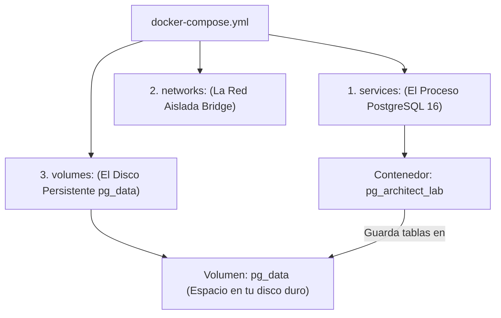

# 🚀 Laboratorio: Despliegue de Arquitectura de Datos en AWS EC2 con Docker (End-to-End)

**Instructor:** Principal Data Architect & Cloud Engineer  
**Enfoque:** Conectividad Segura, Persistencia de Datos, Orquestación con Docker Compose y Ciclo de Vida en la Nube.  
**Dataset:** Northwind Database canónica (`pthom/northwind_psql`).

---

## 🗺️ Arquitectura del Despliegue

```text
+-------------------------------------------------------------------------+
| TU COMPUTADORA LOCAL                                                    |
|                                                                         |
|  [VSCode / DBeaver] ------------ Conexión TCP :5432 (SSL disable) --->+ |
|  [PowerShell / Bash] ----------- SSH/SCP :22 (key_u_docker.pem) ---->+ | |
+----------------------------------------------------------------------|-|+
                                                                       | |
                                   Internet (Restringido a Tu IP /32)  | |
                                                                       v v
+-------------------------------------------------------------------------+
| AWS EC2 (Amazon Linux 2023 / Ubuntu 24.04 LTS)                          |
|                                                                         |
|  Security Group: Inbound Port 22 (SSH) & Port 5432 (PostgreSQL)         |
|                                                                         |
|  Directorio: ~/postgres-lab/                                            |
|   ├── docker-compose.yml                                                |
|   ├── .env (POSTGRES_USER, POSTGRES_PASSWORD, POSTGRES_DB, PGPORT)       |
|   └── db_northwind.sql (Read-Only Mount)                                |
|                                                                         |
|  +-------------------------------------------------------------------+  |
|  | Contenedor Docker: pg_architect_lab (postgres:16-alpine)          |  |
|  |                                                                   |  |
|  |  Puerto: 5432:5432                                                |  |
|  |  Healthcheck: pg_isready                                          |  |
|  |  Volumen Persistente: pg_data -> /var/lib/postgresql/data         |  |
|  |  Inicialización: /docker-entrypoint-initdb.d/01_db_northwind.sql   |  |
|  |  Red: pg_network (Bridge) | Límite RAM: 512MB                     |  |
|  +-------------------------------------------------------------------+  |
+-------------------------------------------------------------------------+
```

---

## 1. Introducción y Prerrequisitos

El objetivo de este laboratorio es desplegar un motor de base de datos relacional **PostgreSQL 16** de nivel empresarial en una máquina virtual en la nube (**AWS EC2**), orquestado mediante **Docker Compose**, cargando automáticamente el esquema y los datos del negocio canónico **Northwind**.

Aprenderás y aplicarás el estándar de la industria para arquitecturas desacopladas:
1. **Infraestructura declarativa:** Manifiesto `docker-compose.yml`.
2. **Seguridad y secretos:** Variables de entorno en `.env` aisladas del control de versiones.
3. **Persistencia e inicialización:** Volúmenes nombrados y montajes de solo lectura (`:ro`) para scripts SQL.
4. **Seguridad perimetral:** Reglas de firewall (Security Groups) de acceso mínimo privilegiado (`/32`).

### 🔑 Datos de Acceso y Credenciales de Laboratorio
| Recurso | Identificador / Valor | Propósito |
| :--- | :--- | :--- |
| **AWS Console URL** | `https://629017097739.signin.aws.amazon.com/console` | Consola web de administración AWS |
| **IAM User** | `u_docker` | Usuario con permisos EC2 |
| **IAM Password** | *Proporcionada por el instructor* | Autenticación en consola AWS |
| **Llave SSH** | `Credenciales/key_u_docker.pem` | Par de llaves RSA para acceso SSH/SCP |
| **PostgreSQL User** | `slinkter` | Superusuario configurado en `.env` |
| **PostgreSQL Pass** | `postgres123` | Contraseña configurada en `.env` |
| **PostgreSQL DB** | `northwind` | Base de datos relacional canónica |
| **PostgreSQL Port** | `5432` | Puerto estándar del motor relacional |

---

## 🔒 Fase 0: Seguridad y Permisos de la Llave SSH Privada

Los clientes OpenSSH (tanto en Windows 10/11, macOS y Linux) rechazan terminantemente el uso de llaves privadas si otros usuarios del sistema operativo tienen permisos de lectura sobre el archivo (`UNPROTECTED PRIVATE KEY FILE!`).

Antes de conectarte, ejecuta la configuración de permisos según tu sistema operativo local:

### Opción A: Windows PowerShell (Ubicado en la raíz del repositorio)
```powershell
# 1. Deshabilitar herencia de permisos en el archivo .pem
icacls ".\Credenciales\key_u_docker.pem" /inheritance:r

# 2. Otorgar permisos exclusivos de lectura únicamente a tu usuario actual
icacls ".\Credenciales\key_u_docker.pem" /grant:r "$($env:USERNAME):(R)"
```

### Opción B: Linux, macOS o WSL (Ubicado en la raíz del repositorio)
```bash
# Otorgar permisos de solo lectura al propietario (400 = r--------)
chmod 400 ./Credenciales/key_u_docker.pem
```

---

## 🏗️ Fase 1: Lanzamiento de la Infraestructura en AWS EC2

### 1.1 Crear la Instancia EC2
1. Inicia sesión en la **Consola de AWS** y asegúrate de estar en la región `us-east-1` (N. Virginia) o tu región asignada.
2. Navega a **EC2** $\rightarrow$ **Instances** $\rightarrow$ Haz clic en **Launch instances**.
3. Configura los siguientes parámetros:
   - **Name:** `postgres-docker-lab`
   - **Application and OS Images (Amazon Machine Image):**
     - **Opción Recomendada:** **Amazon Linux 2023 AMI** (`al2023-ami-*-kernel-6.1-x86_64`)
     - **Opción Alternativa:** **Ubuntu Server 24.04 LTS** (`Noble Numbat`)
   - **Instance Type:** `t3.micro` (o `t2.micro`, aptos para la Capa Gratuita / Free Tier).
   - **Key pair (login):** Selecciona el par de llaves existente `key_u_docker`.

### 1.2 Configuración de Red y Firewall (Security Group)
En la sección **Network settings**, haz clic en **Edit**:
- **VPC:** Utiliza la VPC por defecto (`default`).
- **Subnet:** Cualquier subred pública disponible (o `No preference`).
- **Auto-assign public IP:** **`Enable`** *(Obligatorio: sin IP pública no habrá forma de conectarse a la instancia por Internet)*.
- **Firewall (Security Groups):** Selecciona **Create security group**.
  - **Security group name:** `postgres-lab-sg`
  - **Description:** `Permitir SSH y PostgreSQL unicamente desde mi IP publica`
  - **Inbound Security Group Rules:**
    1. **Regla 1 (SSH):**
       - **Type:** `SSH` | **Port range:** `22` | **Source type:** `My IP` (`<Tu_IP_Publica>/32`)
    2. **Regla 2 (PostgreSQL):**
       - **Type:** `Custom TCP` | **Port range:** `5432` | **Source type:** `My IP` (`<Tu_IP_Publica>/32`)

> ⚠️ **Advertencia de Seguridad de Red:**  
> **NUNCA** configures el origen como `Anywhere-IPv4` (`0.0.0.0/0`) en el puerto 5432. Exponer un puerto de base de datos a todo Internet provoca ataques automatizados de fuerza bruta y escaneos de vulnerabilidades en cuestión de minutos. El filtro `/32` garantiza que solo tu máquina física pueda interactuar con el servidor.  
> *Nota sobre IP Dinámica:* Si tu proveedor de internet (ISP) reinicia tu router y cambia tu IP pública, deberás editar estas dos reglas en el Security Group seleccionando nuevamente `My IP`.

### 1.3 Automatización de Instalación vía User Data (cloud-init)
Despliega la sección **Advanced details** al final de la página. En el cuadro de texto **User data**, pega el script correspondiente a la distribución seleccionada. Este script se ejecutará con privilegios de `root` al encender la máquina por primera vez:

#### Script User Data para Amazon Linux 2023:
```bash
#!/bin/bash
dnf update -y
dnf install -y docker
systemctl enable --now docker
usermod -aG docker ec2-user
mkdir -p /usr/local/lib/docker/cli-plugins
curl -SL https://github.com/docker/compose/releases/latest/download/docker-compose-linux-$(uname -m) -o /usr/local/lib/docker/cli-plugins/docker-compose
chmod +x /usr/local/lib/docker/cli-plugins/docker-compose
```

#### Script User Data para Ubuntu 24.04 LTS:
```bash
#!/bin/bash
apt-get update -y
apt-get install -y docker.io docker-compose-v2
usermod -aG docker ubuntu
systemctl enable --now docker
```

4. Haz clic en el botón naranja **Launch instance**.
5. Ve a la lista de instancias y copia la **Public IPv4 address** (ejemplo: `54.160.20.100`).

---

## 📡 Fase 2: Conexión SSH e Inspección de Inicialización

### 2.1 Conexión SSH desde tu Terminal Local
Abre tu terminal local (**PowerShell** o **Bash** en la raíz del proyecto) y ejecuta el comando de conexión reemplazando `<IP_AWS_EC2>` por la IP pública de tu instancia:

#### Para Amazon Linux 2023:
```powershell
ssh -i ".\Credenciales\key_u_docker.pem" ec2-user@<IP_AWS_EC2>
```

#### Para Ubuntu 24.04 LTS:
```powershell
ssh -i ".\Credenciales\key_u_docker.pem" ubuntu@<IP_AWS_EC2>
```

### 2.2 Verificar la Finalización de `cloud-init`
`cloud-init` instala Docker en segundo plano durante el primer minuto de vida del servidor. Para verificar que la instalación finalizó con éxito antes de ejecutar comandos Docker:

```bash
# Inspeccionar el log de inicialización del sistema
tail -f /var/log/cloud-init-output.log
# Presiona Ctrl + C cuando observes los mensajes de finalización

# Validar que Docker y Compose están listos
docker --version
docker compose version
```

---

## 🌐 Fase 3: Transferencia de Archivos (Local $\rightarrow$ AWS EC2 con SCP)

Transferiremos directamente los archivos desde tu computadora hacia la estructura de carpetas de la instancia remota sin pasos intermedios ni comandos de movimiento ambiguos.

Abre una **segunda pestaña o ventana de PowerShell en tu máquina local**, ubicada en la raíz del repositorio (`C:\Users\...\ApuntesSQL`):

### 3.1 Crear la Estructura de Directorios Remota vía SSH
```powershell
# Para Amazon Linux 2023:
ssh -i ".\Credenciales\key_u_docker.pem" ec2-user@<IP_AWS_EC2> "mkdir -p ~/postgres-lab"

# Para Ubuntu 24.04:
# ssh -i ".\Credenciales\key_u_docker.pem" ubuntu@<IP_AWS_EC2> "mkdir -p ~/postgres-lab"
```

### 3.2 Subir Manifiestos, Variables y Datos Directamente

#### Para Amazon Linux 2023 (`ec2-user`):
```powershell
# 1. Subir docker-compose.yml a ~/postgres-lab/
scp -i ".\Credenciales\key_u_docker.pem" .\Lab\Lab01\1.Guia\Material\docker-compose.yml ec2-user@<IP_AWS_EC2>:~/postgres-lab/

# 2. Subir .env a ~/postgres-lab/
scp -i ".\Credenciales\key_u_docker.pem" .\Lab\Lab01\1.Guia\Material\.env ec2-user@<IP_AWS_EC2>:~/postgres-lab/

# 3. Subir db_northwind.sql a ~/postgres-lab/
scp -i ".\Credenciales\key_u_docker.pem" .\Lab\Lab01\1.Guia\Material\db_northwind.sql ec2-user@<IP_AWS_EC2>:~/postgres-lab/
```

#### Para Ubuntu 24.04 (`ubuntu`):
```powershell
# 1. Subir docker-compose.yml
scp -i ".\Credenciales\key_u_docker.pem" .\Lab\Lab01\1.Guia\Material\docker-compose.yml ubuntu@<IP_AWS_EC2>:~/postgres-lab/

# 2. Subir .env
scp -i ".\Credenciales\key_u_docker.pem" .\Lab\Lab01\1.Guia\Material\.env ubuntu@<IP_AWS_EC2>:~/postgres-lab/

# 3. Subir db_northwind.sql
scp -i ".\Credenciales\key_u_docker.pem" .\Lab\Lab01\1.Guia\Material\db_northwind.sql ubuntu@<IP_AWS_EC2>:~/postgres-lab/
```

---

## 🚀 Fase 4: Orquestación y Ciclo de Vida del Motor con Docker Compose

Regresa a la terminal remota SSH en la instancia EC2 (o en tu terminal local).

### 4.1 Validar la Estructura en el Servidor
```bash
cd ~/postgres-lab
ls -la
```
Debes observar los 3 archivos esenciales en la carpeta:
- `~/postgres-lab/docker-compose.yml` (El manifiesto de infraestructura)
- `~/postgres-lab/.env` (Las credenciales y variables de entorno)
- `~/postgres-lab/db_northwind.sql` (El script DDL/DML canónico de 355 KB)

---

### 4.2 Anatomía y Arquitectura de `docker-compose.yml`

Para dominar la infraestructura, desglosamos cada bloque del manifiesto que orquesta el contenedor:



#### 🔍 Explicación Detallada Línea por Línea:

| Bloque / Parámetro | Valor Configurado | Propósito Técnico y de Ingeniería |
| :--- | :--- | :--- |
| **`image`** | `postgres:16-alpine` | Imagen oficial de PostgreSQL 16 basada en **Alpine Linux**. Pesa solo ~40 MB (frente a ~400 MB de Debian), permitiendo descargas y arranques ultrarrápidos. |
| **`container_name`** | `pg_architect_lab` | Estandariza el nombre del contenedor para que comandos como `docker exec` sean siempre predecibles. |
| **`restart`** | `unless-stopped` | Resiliencia: si la instancia EC2 se reinicia o el proceso cae, Docker lo levanta automáticamente. |
| **`environment`** | `${POSTGRES_USER:-slinkter}` | Inyección de secretos desde el archivo `.env` con valor de respaldo (*fallback*) por seguridad. |
| **`ports`** | `"${PGPORT:-5432}:5432"` | Mapeo de puertos `Host:Contenedor`. Abre el puerto `5432` en el host para conexiones externas (VSCode / DBeaver). |
| **`deploy.limits`** | `memory: 512M` | Hardening: acota la RAM a 512 MB para evitar que consultas analíticas pesadas saturen la máquina `t2.micro` / `t3.micro`. |
| **`logging`** | `max-size: 10m, max-file: 3` | Rotación de logs: previene que los archivos de registro crezcan indefinidamente y llenen el almacenamiento EBS. |
| **`healthcheck`** | `pg_isready` | Sondeo periódico cada 10s para verificar que el socket de PostgreSQL está aceptando conexiones reales. |

---

### 4.3 La Regla de Oro de los Volúmenes: Host $\leftrightarrow$ Contenedor

La sección `volumes:` de Docker sigue estrictamente este principio:

$$\Large \mathbf{\underbrace{\text{TU COMPUTADORA / SERVIDOR EC2 (Host)}}_{\text{Lado Izquierdo}} : \underbrace{\text{DENTRO DEL CONTENEDOR (Docker)}}_{\text{Lado Derecho}}}$$

```yaml
    volumes:
      - pg_data:/var/lib/postgresql/data
      - ./db_northwind.sql:/docker-entrypoint-initdb.d/01_db_northwind.sql:ro
```

```mermaid
flowchart LR
    subgraph Host["💻 TU SERVIDOR EC2 / HOST"]
        V["Disco Virtual Persistente<br/><b>pg_data</b>"]
        F["Archivo SQL en disco:<br/><b>./db_northwind.sql</b>"]
    end

    subgraph Contenedor["🐳 DENTRO DEL CONTENEDOR (PostgreSQL 16)"]
        P1["Directorio de Datos Binarios:<br/><b>/var/lib/postgresql/data</b><br/><i>(Tablas Heap, Índices, WAL)</i>"]
        P2["Directorio de Inicialización Mágica:<br/><b>/docker-entrypoint-initdb.d/</b><br/><i>(Ejecuta scripts al primer arranque)</i>"]
    end

    V ===|1. Named Volume (Persistencia Total)| P1
    F ===|2. Bind Mount en Solo Lectura (:ro)| P2
```

1. **Línea 1 (`pg_data:/var/lib/postgresql/data` - Named Volume):**
   - **Analogía de la USB:** El contenedor es como una laptop y `pg_data` es como una **memoria USB / disco externo** conectada a ella. Si destruyes la laptop (el contenedor), los datos en la USB siguen a salvo. Al crear un nuevo contenedor, simplemente le conectas el volumen `pg_data` y recuperas todas tus tablas.
2. **Línea 2 (`./db_northwind.sql:/docker-entrypoint-initdb.d/01_db_northwind.sql:ro` - Bind Mount):**
   - Proyecta tu archivo `db_northwind.sql` directamente dentro de la carpeta de inicio de PostgreSQL.
   - **`:ro` (*Read-Only*):** Garantiza que PostgreSQL solo pueda **leer** el archivo, protegiéndolo contra modificaciones o eliminaciones accidentales.

---

### 4.4 Las 3 Reglas de Inicialización de `docker-entrypoint-initdb.d/`

La imagen oficial de Docker de PostgreSQL sigue esta lógica interna en su punto de entrada (*Entrypoint*):

```mermaid
sequenceDiagram
    autonumber
    actor Dev as Desarrollador
    participant Docker as Motor Docker
    participant Disk as Volumen Persistente (pg_data)
    participant PG as PostgreSQL 16 (pg_architect_lab)

    Dev->>Docker: docker compose up -d
    Docker->>PG: Inicia contenedor postgres:16-alpine
    PG->>Disk: ¿Existe la carpeta /var/lib/postgresql/data con datos?
    alt 🟢 Regla 1: Primer Arranque (Base de datos vacía)
        PG->>PG: Ejecuta initdb (Crea catálogo del sistema)
        PG->>PG: Lee /docker-entrypoint-initdb.d/ en orden alfabético
        PG->>PG: Ejecuta 01_db_northwind.sql (Crea las 14 tablas y 2155 registros)
        PG->>PG: Emite: "PostgreSQL init process complete; ready for start up."
    else 🟡 Regla 2: Arranques Posteriores (Reinicios)
        PG->>Disk: Detecta datos previos en pg_data
        PG->>PG: OMITE /docker-entrypoint-initdb.d/ (Protege datos existentes contra sobreescritura)
    end
    PG->>PG: Abre puerto 5432
    Docker->>PG: Ejecuta pg_isready (Healthcheck -> Healthy)
    Docker-->>Dev: Contenedor 100% operativo
```

* **🟢 Regla 1 (Primer Arranque):** Si la base de datos está vacía, ejecuta automáticamente todos los scripts `.sql` o `.sh` de `/docker-entrypoint-initdb.d/` en orden alfabético.
* **🟡 Regla 2 (Arranques Posteriores):** Si el contenedor se apaga y vuelve a encender, PostgreSQL detecta que ya existen tablas en `pg_data` y **omite la carpeta de inicialización**, evitando duplicar o alterar datos ya existentes.
* **🔴 Regla 3 (Reset Total / Recreación Limpia):** Si deseas borrar todo y forzar a PostgreSQL a ejecutar `db_northwind.sql` de nuevo desde cero:
  ```bash
  docker compose down -v   # El flag -v destruye el volumen pg_data
  docker compose up -d     # Reconstruye todo limpio
  ```

---

### 4.5 Levantar el Servicio y Monitorear los Logs

Ejecuta Docker Compose en segundo plano:
```bash
docker compose up -d
```

Inspecciona los logs en vivo para verificar la ejecución de `01_db_northwind.sql` y el estado saludable (*healthy*):
```bash
docker compose logs -f db
# Presiona Ctrl + C para salir del seguimiento de logs
```

---

### 4.6 Verificación de Integridad de Datos en `psql`
Ingresa directamente a la línea de comandos interactiva de PostgreSQL dentro del contenedor:

```bash
docker exec -it pg_architect_lab psql -U slinkter -d northwind
```

Ejecuta las siguientes consultas de control de integridad:

```sql
-- 1. Listar todas las tablas cargadas (deben figurar 14 tablas en el esquema public)
\dt

-- 2. Validar conteos exactos del negocio Northwind
SELECT count(*) AS total_empleados FROM employees;     -- Resultado esperado: 9
SELECT count(*) AS total_ordenes FROM orders;          -- Resultado esperado: 830
SELECT count(*) AS total_productos FROM products;      -- Resultado esperado: 77
SELECT count(*) AS total_clientes FROM customers;      -- Resultado esperado: 91
SELECT count(*) AS total_detalles FROM order_details;  -- Resultado esperado: 2155

-- Salir de psql
\q
```

---

## 🖥️ Fase 5: Conexión desde Clientes Locales (VSCode & DBeaver)

### 5.1 Conexión en Visual Studio Code
1. Abre VSCode en tu computadora local e instala la extensión **PostgreSQL** (de Chris Kolkman o Microsoft).
2. En la barra lateral izquierda, haz clic en el icono de **PostgreSQL** $\rightarrow$ **Add Connection** (`+`).
3. Ingresa los parámetros de conexión:
   - **Host / Server:** `<IP_AWS_EC2>`
   - **Database user:** `slinkter`
   - **Password:** `postgres123`
   - **Port:** `5432`
   - **Database name:** `northwind`
   - **Display name:** `AWS Northwind Lab`
4. **Configuración SSL Crítica:** En los ajustes avanzados de la conexión, establece **SSL Mode** en `disable` (o `prefer`).
5. Abre un nuevo archivo `.sql` en VSCode y ejecuta:
   ```sql
   SELECT product_name, unit_price 
   FROM products 
   ORDER BY unit_price DESC 
   LIMIT 5;
   ```

### 5.2 Conexión en DBeaver (Cliente Universal de Bases de Datos)
1. Abre DBeaver $\rightarrow$ **Database** $\rightarrow$ **New Database Connection**.
2. Selecciona **PostgreSQL** $\rightarrow$ **Next**.
3. En la pestaña **Main**:
   - **Host:** `<IP_AWS_EC2>`
   - **Port:** `5432`
   - **Database:** `northwind`
   - **Username:** `slinkter`
   - **Password:** `postgres123`
4. En la pestaña **SSL**: Desmarcar *Use SSL* (o establecer en `disable`).
5. Haz clic en **Test Connection ...** $\rightarrow$ Debe mostrar `Connected` con `PostgreSQL 16.x`.
6. Haz clic en **Finish**.

---

## 💰 Fase 6: Gestión de Costos y Ciclo de Vida en AWS (Stop vs Terminate)

Para evitar cargos inesperados en tu cuenta de AWS tras finalizar tu sesión de estudio, sigue estas directrices de ciclo de vida de instancias EC2:

| Acción | Estado en AWS | Facturación de Cómputo | Persistencia de Datos (EBS y Docker) | Dirección IP Pública IPv4 | Caso de Uso |
| :--- | :--- | :--- | :--- | :--- | :--- |
| **Stop Instance** (Detener) | `Stopped` | **$0.00 / hora** (Se detiene el cobro de vCPU y RAM) | **Persiste 100%** (El disco EBS conserva tus contenedores y datos) | **Cambia al volver a iniciar** (Se asigna una nueva IP pública) | Al terminar tu sesión de estudio del día para continuar mañana. |
| **Terminate Instance** (Terminar) | `Terminated` | **$0.00 / hora** | **Se destruye** (Se borra la máquina virtual y el volumen EBS) | **Se libera de inmediato** | Al finalizar el curso o cuando ya no necesites el laboratorio. |

### Procedimiento para Pausar el Servidor (Fin del Día):
1. Consola AWS $\rightarrow$ **EC2** $\rightarrow$ **Instances**.
2. Selecciona `postgres-docker-lab` $\rightarrow$ **Instance state** $\rightarrow$ **Stop instance**.
3. *Al día siguiente:* Selecciona la instancia $\rightarrow$ **Instance state** $\rightarrow$ **Start instance**.
4. Copia la **nueva IP pública** generada por AWS y actualiza la IP en tu conexión de VSCode/DBeaver y en tu comando SSH. Como configuraste `restart: unless-stopped` en Docker Compose, el contenedor PostgreSQL iniciará automáticamente junto con el servidor.

---

## 🛠️ Fase 7: Matriz de Troubleshooting y Resolución de Errores

| Síntoma / Error | Causa Raíz Probable | Solución Paso a Paso |
| :--- | :--- | :--- |
| `ssh: connect to host ... Connection timed out` | El Security Group de AWS no permite tráfico en el puerto 22 desde tu IP actual, o tu ISP cambió tu IP pública dinámica. | Ve a la consola AWS $\rightarrow$ EC2 $\rightarrow$ Security Groups $\rightarrow$ Edita las reglas de entrada de `postgres-lab-sg` y vuelve a asignar `My IP` en la regla SSH (puerto 22). |
| `UNPROTECTED PRIVATE KEY FILE! Permission denied` | Los permisos del archivo `key_u_docker.pem` son demasiado permisivos para el cliente SSH. | Ejecuta en PowerShell: `icacls ".\Credenciales\key_u_docker.pem" /inheritance:r` y luego `icacls ".\Credenciales\key_u_docker.pem" /grant:r "$($env:USERNAME):(R)"`. En Linux/Mac: `chmod 400 ./Credenciales/key_u_docker.pem`. |
| `docker: command not found` tras conectar por SSH | Te conectaste en los primeros 30 segundos y el script `User Data` aún está instalando paquetes vía `cloud-init`. | Ejecuta `tail -f /var/log/cloud-init-output.log` y espera a que aparezca la finalización de los scripts antes de reintentar. |
| `Connection refused` en el puerto 5432 | El contenedor no ha terminado de arrancar o Docker Compose no se ha iniciado. | Ejecuta `docker compose ps` en `~/postgres-lab/` para verificar el estado `healthy`, y revisa logs con `docker compose logs db`. |
| `password authentication failed for user "slinkter"` | Discrepancia entre la contraseña enviada por el cliente y el valor inicializado en `.env`. | Revisa el archivo `~/postgres-lab/.env` en el servidor y asegúrate de escribir `postgres123` en el cliente. Si modificaste el `.env` después del primer arranque, debes reiniciar el volumen: `docker compose down -v && docker compose up -d`. |
| `relation "orders" does not exist` | El script `db_northwind.sql` no se ejecutó durante el arranque inicial porque el volumen `pg_data` ya contenía datos previos. | Ejecuta `docker compose down -v` para purgar el volumen huérfano, valida que `~/postgres-lab/init/db_northwind.sql` exista, y vuelve a levantar con `docker compose up -d`. |
| `no pg_hba.conf entry for host` | PostgreSQL bloqueó la conexión entrante por directivas de autenticación. | La imagen estándar `postgres:16-alpine` permite conexiones remotas por defecto si se especifica usuario y contraseña. Verifica que no estés intentando autenticarte sin contraseña. |

---

## 💡 Apéndice: Método Alternativo Standalone (`docker run` Directo)
*Utiliza este método únicamente si deseas realizar una prueba rápida sin orquestación de Docker Compose.*

Dentro de la sesión SSH en la instancia EC2:
```bash
# Crear directorio y asegurar que db_northwind.sql esté presente
mkdir -p ~/postgres-lab/init
# (Asegúrate de haber transferido db_northwind.sql a ~/postgres-lab/init/db_northwind.sql)

# Lanzar contenedor standalone
docker run -d \
  --name pg_architect_lab \
  --restart unless-stopped \
  -e POSTGRES_USER=slinkter \
  -e POSTGRES_PASSWORD=postgres123 \
  -e POSTGRES_DB=northwind \
  -v pg_data:/var/lib/postgresql/data \
  -v $HOME/postgres-lab/init/db_northwind.sql:/docker-entrypoint-initdb.d/01_db_northwind.sql:ro \
  -p 5432:5432 \
  postgres:16-alpine

# Validar logs
docker logs -f pg_architect_lab
```
