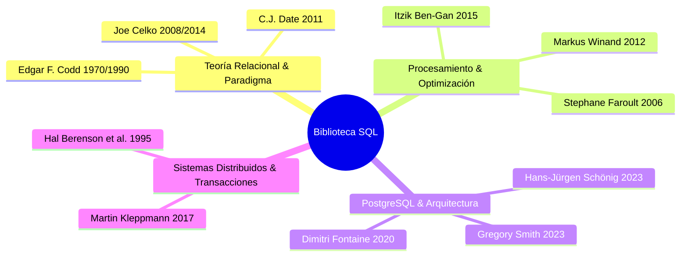

# 📚 Biblioteca Canónica y Guía de Libros de Consulta: SQL & PostgreSQL Mastery

Esta guía reúne y sintetiza los **13 tratados, libros canónicos y papers académicos más prestigiosos e influyentes** en la historia de las bases de datos relacionales, la optimización de motores de consulta (*Query Engines*) y la arquitectura interna de **PostgreSQL**.

Cada referencia incluye sus autores, los capítulos o conceptos fundamentales a estudiar y su aplicación directa en este laboratorio.

---

## 🏛️ Índice de Obras Canónicas

---

## 1. Fundamentos Matemáticos y Teoría Relacional

### 1.1 *A Relational Model of Data for Large Shared Data Banks* (1970) & *The Relational Model for Database Management: Version 2* (1990)
* **Autor:** Dr. Edgar F. Codd (Premio Turing 1981, Creador del Modelo Relacional).
* **Capítulos / Conceptos Clave:**
  - Definición formal de Relación, Tupla, Atributo y Dominio.
  - Álgebra Relacional vs. Cálculo Relacional de Tuplas.
  - Introducción formal de la Lógica Trivalente (3VL) con valores nulos como ausencia de información.
* **Aplicación en el Lab:**
  - Entender por qué una tabla es un conjunto desordenado de filas sin ordenamiento inherente a menos que se invoque explícitamente `ORDER BY`.
  - Comprender por qué `NULL` no es un valor, sino un estado de información faltante o inaplicable.

---

### 1.2 *SQL and Relational Theory: How to Write Accurate SQL Code* (2ª Edición, 2011)
* **Autor:** C.J. Date (Co-creador de los fundamentos de bases de datos junto a E.F. Codd).
* **Editorial:** O'Reilly Media.
* **Capítulos Esenciales:**
  - **Capítulo 3:** *Tuples and Relations, Rows and Tables*.
  - **Capítulo 4:** *No Duplicates, No Nulls* (Crítica constructiva a los desvíos del estándar SQL frente al modelo relacional puro).
  - **Capítulo 6:** *The Logic of SQL* (Análisis profundo de la lógica trivalente 3VL).
* **Cita Magistral:**
  > *"A relation has no duplicate tuples, no top-to-bottom ordering of tuples, and no left-to-right ordering of attributes. In 3VL, UNKNOWN is not a third truth value; it is the truth value of an expression whose operand value is missing."*
* **Aplicación en el Lab:**
  - Demostración formal de por qué `COUNT(columna)` ignora los nulos mientras que `COUNT(*)` cuenta la cardinalidad del conjunto de tuplas.

---

## 2. Paradigma Declarativo y Pensamiento en Conjuntos

### 2.1 *Joe Celko's Thinking in Sets: Auxiliary, Temporal, and Virtual Tables in SQL* (2008)
* **Autor:** Joe Celko (Miembro histórico del comité del estándar ANSI SQL por más de 20 años).
* **Editorial:** Morgan Kaufmann.
* **Capítulos Esenciales:**
  - **Capítulo 1:** *Thinking in Sets* (Transición mental de la programación imperativa procedural a la programación declarativa relacional).
  - **Capítulo 2:** *The All-at-Once Operation Principle* (Evaluación conceptualmente simultánea de todas las expresiones en una cláusula SQL).
  - **Capítulo 7:** *Auxiliary Tables and Lookups*.
* **Cita Magistral:**
  > *"SQL is a set-oriented declarative language. Programmers who come from procedural backgrounds make the fundamental mistake of thinking in steps and loops, rather than specifying the characteristics of the set of data they want to obtain."*
* **Aplicación en el Lab:**
  - Desbloquea la comprensión de por qué los alias del `SELECT` no pueden ser leídos por otras expresiones en el mismo `SELECT`.

---

### 2.2 *Joe Celko's SQL for Smarties: Advanced SQL Programming* (5ª Edición, 2014)
* **Autor:** Joe Celko.
* **Editorial:** Morgan Kaufmann.
* **Capítulos Esenciales:**
  - **Capítulo 6:** *NULLs and Missing Data* (Comportamiento de agregados, operadores de comparación y `COALESCE`).
  - **Capítulo 15:** *Outer Joins and Full Joins* (Preservación de filas y generación de nulos sintéticos).
  - **Capítulo 29:** *Hierarchies and Trees in SQL* (Modelado de árboles genealógicos y estructuras organizacionales).
* **Aplicación en el Lab:**
  - Manejo de la tabla auto-referenciada `employees` (`reports_to` $\to$ `employee_id`) y cálculo de jerarquías organizacionales con CTEs recursivas.

---

## 3. Procesamiento Lógico del Motor & Funciones de Ventana

### 3.1 *T-SQL Querying* (2015) & *High-Performance SQL Using Window Functions*
* **Autor:** Itzik Ben-Gan (Reconocido mundialmente como el mayor experto pedagógico en procesamiento lógico de SQL).
* **Editorial:** Microsoft Press.
* **Capítulos Esenciales:**
  - **Capítulo 1:** *Logical Query Processing* (El desglose canónico de las 12 fases del motor de base de datos).
  - **Capítulo 5:** *Window Functions* (Particionado, ordenamiento, encuadre de marcos `ROWS` vs `RANGE` vs `GROUPS`).
* **Concepto Clave del Pipeline:**
  $$\text{FROM} \to \text{ON} \to \text{JOIN} \to \text{WHERE} \to \text{GROUP BY} \to \text{HAVING} \to \text{WINDOW} \to \text{SELECT} \to \text{DISTINCT} \to \text{SET OPS} \to \text{ORDER BY} \to \text{LIMIT}$$
* **Aplicación en el Lab:**
  - Todo el andamiaje del laboratorio utiliza el pipeline de Ben-Gan como estándar arquitectónico.

---

## 4. Indexación, Rendimiento Físico y SARGabilidad

### 4.1 *SQL Performance Explained: Everything Developers Need to Know about SQL Performance* (2012)
* **Autor:** Markus Winand (Creador del portal canónico *Use The Index, Luke!*).
* **Capítulos Esenciales:**
  - **Capítulo 1:** *Anatomy of an Index* (Estructura interna del B-Tree: Nodos raíz, ramas y páginas hoja doblemente enlazadas).
  - **Capítulo 2:** *The Where Clause* (Predicados SARGables, concatenación de columnas en índices compuestos e impacto de funciones).
  - **Capítulo 4:** *Partial and Expression Indexes* (Índices parciales y funcionales en PostgreSQL).
* **Cita Magistral:**
  > *"An index seek traverses the B-tree to pinpoint the first matching leaf node. Wrapping an indexed column in a function blinds the optimizer and triggers an exhaustive full table scan."*
* **Aplicación en el Lab:**
  - Optimización de filtros de fecha: sustituir `WHERE EXTRACT(YEAR FROM order_date) = 1997` por el rango SARGable `WHERE order_date >= '1997-01-01' AND order_date < '1998-01-01'`.

---

### 4.2 *The Art of SQL* (2006)
* **Autor:** Stephane Faroult & Peter Robson.
* **Editorial:** O'Reilly Media.
* **Principio Fundamental:**
  > *"The first rule of query tuning is to reduce the volume of data as early as possible. Every join multiplies work; filter at the source."*
* **Aplicación en el Lab:**
  - Aplicación de filtros tempranos en el `WHERE` y uso de CTEs con filtrado antes de ejecutar `JOINs` masivos con `order_details`.

---

## 5. Arquitectura Interna de PostgreSQL

### 5.1 *The Art of PostgreSQL: The Definitive Guide to SQL Mastery* (4ª Edición, 2020)
* **Autor:** Dimitri Fontaine (Contribuidor principal de PostgreSQL y autor de `pgloader`).
* **Capítulos Esenciales:**
  - **Capítulo 5:** *Data Manipulation and Advanced SQL* (Uso intensivo de funciones de ventana analíticas y agregados avanzados).
  - **Capítulo 6:** *PostgreSQL Data Types* (JSONB, Arrays, Rangos `tsrange` / `daterange`, Enums).
  - **Capítulo 7:** *PostgreSQL Concurrency: Isolation and Locking*.
* **Aplicación en el Lab:**
  - Uso de marcos de ventana avanzados, `LATERAL Joins`, y agregaciones estructuradas (`jsonb_agg`, `string_agg`).

---

### 5.2 *Mastering PostgreSQL 16* (5ª Edición, 2023)
* **Autor:** Hans-Jürgen Schönig (CEO de CYBERTEC PostgreSQL International).
* **Editorial:** Packt Publishing.
* **Capítulos Esenciales:**
  - **Capítulo 4:** *Advanced SQL and Performance Tuning* (CTEs y optimización en PG12+: Inlining vs `AS MATERIALIZED`).
  - **Capítulo 8:** *Understanding Index Types: B-Tree, Hash, GIN, GiST, BRIN*.
  - **Capítulo 11:** *PostgreSQL Internals and Memory Architecture* (`shared_buffers`, `work_mem`, `maintenance_work_mem`).
* **Aplicación en el Lab:**
  - Diagnóstico de memoria en planes de ejecución `EXPLAIN (ANALYZE, BUFFERS)` para detectar desbordamientos de `work_mem` a disco (*External Sort / Spill*).

---

### 5.3 *PostgreSQL 16 High Performance* (3ª Edición, 2023)
* **Autor:** Gregory Smith & Ibrar Ahmed.
* **Editorial:** Packt Publishing.
* **Capítulos Esenciales:**
  - **Capítulo 3:** *Hardware and OS Configuration for PostgreSQL*.
  - **Capítulo 6:** *Query Planning and Execution Analysis*.
  - **Capítulo 7:** *Index Tuning and Vacuuming*.
* **Aplicación en el Lab:**
  - Despliegue endurecido en Docker/AWS EC2 y monitoreo con `pg_stat_statements`.

---

## 6. Transacciones, Aislamiento y Concurrencia

### 6.1 *Designing Data-Intensive Applications: The Big Ideas Behind Reliable, Scalable, and Maintainable Systems* (2017)
* **Autor:** Martin Kleppmann (Investigador en la Universidad de Cambridge).
* **Editorial:** O'Reilly Media.
* **Capítulos Esenciales:**
  - **Capítulo 7:** *Transactions* (ACID en profundidad, niveles de aislamiento, Read Skew, Write Skew, Phantom Reads, 2PL vs 2PC vs SSI).
* **Cita Magistral:**
  > *"Snapshot isolation eliminates phantom reads for read-only queries, but concurrent write transactions can still suffer from write skew—an anomaly where two transactions read the same data, make independent decisions, and write updates that together violate an integrity invariant."*
* **Aplicación en el Lab:**
  - Comprender cómo PostgreSQL implementa MVCC (Multi-Version Concurrency Control) y por qué `Repeatable Read` es en realidad *Snapshot Isolation*, requiriendo `Serializable` con SSI para evitar anomalías de *Write Skew*.

---

### 6.2 *A Critique of ANSI SQL Isolation Levels* (1995)
* **Autores:** Hal Berenson, Philip Bernstein, Jim Gray, Jim Melton, Elizabeth O'Neil, Patrick O'Neil.
* **Publicación:** ACM SIGMOD Record, 24(2), 1–10.
* **Aporte Histórico:**
  - Demostró formalmente las limitaciones y ambigüedades del estándar ANSI SQL-92.
  - Tipificó fenómenos críticos que ANSI omitió: **Dirty Write ($G0$)**, **Lost Update ($P4$)**, **Read Skew ($A5A$)** y **Write Skew ($A5B$)**.
* **Aplicación en el Lab:**
  - Base teórica de la sección de transacciones y concurrencia en [0.prerrequisitos.md](file:///C:/Users/luisj/Github/ApuntesSQL/Lab/Lab01/2.Ejercicios/0.prerrequisitos.md).

---

## 7. 📖 Resumen de Consulta Rápida por Tema

| Si deseas dominar... | Consulta este libro / autor | Capítulos / Secciones |
| :--- | :--- | :--- |
| **El Pipeline del Motor y Orden Lógico** | Itzik Ben-Gan (*T-SQL Querying*) | Capítulo 1 |
| **Pensamiento en Conjuntos vs Procedural** | Joe Celko (*Thinking in Sets*) | Capítulos 1 y 2 |
| **Lógica Trivalente (3VL) y NULLs** | C.J. Date (*SQL and Relational Theory*) | Capítulos 4 y 6 |
| **Indexación B-Tree y SARGabilidad** | Markus Winand (*SQL Performance Explained*) | Capítulos 1 y 2 |
| **Funciones de Ventana y SQL Avanzado** | Dimitri Fontaine (*The Art of PostgreSQL*) | Capítulo 5 |
| **Optimizador de PostgreSQL y CTEs** | Hans-Jürgen Schönig (*Mastering PostgreSQL 16*) | Capítulo 4 |
| **ACID, Write Skew y Aislamiento SSI** | Martin Kleppmann (*Designing Data-Intensive Apps*) | Capítulo 7 |

---
*Este documento constituye la base académica y bibliográfica oficial del Laboratorio PostgreSQL Lab01.*
