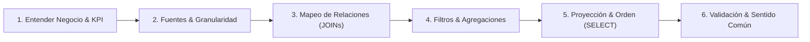

# STANDARD.md — Manual de Estándar Pedagógico y Técnico (PostgreSQL Lab01)

> **Propósito:** Definir los lineamientos editoriales, pedagógicos, analíticos y técnicos obligatorios para todos los ejercicios, guías y soluciones del laboratorio PostgreSQL Northwind.

---

## 🧠 1. Marco Metodológico: "Cómo Pensar como un Analista de Datos" (6 Pasos)

Para transformar una consulta SQL de un simple ejercicio de sintaxis a una solución analítica de nivel profesional, cada problema debe resolverse siguiendo este modelo mental estructurado de 6 pasos:



### Paso 1: Comprender el Objetivo de Negocio y el KPI
- ¿Qué pregunta comercial, financiera u operativa se está respondiendo?
- ¿Qué decisión estratégica o táctica habilita este resultado?
- ¿Cuál es la métrica clave (Ticket promedio, Churn, Margen bruto, Lead time)?

### Paso 2: Identificar las Fuentes de Datos y la Granularidad
- ¿En qué tablas del modelo relacional reside la información requerida?
- ¿Cuál es la clave primaria (PK) y qué representa exactamente una fila en cada tabla (granularidad: por orden, por producto, por cliente, por día)?

### Paso 3: Mapear Relaciones y Cardinalidad (JOINs & Claves Foráneas)
- ¿Cómo se conectan las tablas involucradas (PK $\leftrightarrow$ FK)?
- ¿Qué tipo de JOIN es necesario para no perder registros (`LEFT JOIN`) ni duplicar métricas por productos cartesianos involuntarios?

### Paso 4: Definir Filtros y Agregaciones (WHERE / GROUP BY / HAVING)
- **Filtro de fila (`WHERE`):** ¿Qué registros deben descartarse antes de procesar o agregar datos?
- **Nivel de agrupación (`GROUP BY`):** ¿A qué nivel de detalle agrupamos las métricas?
- **Filtro de grupo (`HAVING`):** ¿Qué condiciones deben cumplir los grupos resultantes?

### Paso 5: Proyectar, Transformar y Ordenar la Salida (SELECT / ORDER BY / LIMIT)
- ¿Qué columnas exactas, conversiones de tipo o cálculos escalares (`CASE WHEN`, `COALESCE`, funciones de fecha) se deben proyectar?
- ¿Qué alias descriptivos (`AS`) hacen legible el reporte para stakeholders?
- ¿Cómo ordenar (`ORDER BY`) y delimitar (`LIMIT`) el resultado para destacar insights prioritarios?

### Paso 6: Validar la Lógica y Verificar la Coherencia del Resultado
- ¿Los totales numéricos tienen sentido de negocio (por ejemplo, ¿los precios son positivos?, ¿las fechas de entrega son posteriores a la orden?)?
- ¿Aparecen valores `NULL` inesperados debido a `LEFT JOIN`s no controlados?
- ¿El conteo de filas coincide con los registros canónicos de Northwind?

---

## ⚙️ 2. Motor de Ejecución Lógica de PostgreSQL (Logical Query Processing)

A diferencia de los lenguajes imperativos (Python, Java) que se ejecutan secuencialmente de arriba a abajo, SQL es un lenguaje **declarativo**. El motor de PostgreSQL procesa las cláusulas en un orden lógico estricto, totalmente diferente al orden en que se escriben:

```text
Orden Sintáctico (Cómo se escribe):    Orden Lógico del Motor (Cómo se procesa):
1. SELECT                              1. FROM (+ ON / JOIN)
2. DISTINCT                            2. WHERE
3. FROM                                3. GROUP BY
4. JOIN / ON                           4. HAVING
5. WHERE                               5. WINDOW (OVER)
6. GROUP BY                            6. SELECT
7. HAVING                              7. DISTINCT
8. WINDOW                              8. SET OPERATORS (UNION, INTERSECT, EXCEPT)
9. UNION / INTERSECT                   9. ORDER BY
10. ORDER BY                           10. LIMIT / OFFSET
11. LIMIT / OFFSET
```

### Detalle de Fases del Procesamiento Lógico:

1. **`FROM` & `JOIN` / `ON`:** Se identifican las tablas base y se calculan los productos cartesianos filtrados por las condiciones de unión. Es la fase que genera el conjunto de datos virtual de trabajo.
2. **`WHERE`:** Se evalúan predicados booleanos sobre cada fila individual. Se descartan las filas que no cumplen.  
   *Regla de oro:* En `WHERE` **no** se pueden usar alias definidos en `SELECT` ni funciones de agregación (`SUM`, `COUNT`), porque aún no han sido calculadas.
3. **`GROUP BY`:** Las filas supervivientes se colapsan en grupos según las columnas especificadas. A partir de este momento, solo están disponibles las columnas de agrupación o expresiones agregadas.
4. **`HAVING`:** Se aplican predicados sobre los grupos agregados generados en el paso anterior.
5. **`WINDOW`:** Se evalúan funciones de ventana (`ROW_NUMBER()`, `DENSE_RANK()`, `LAG()`, `LEAD()`, `SUM() OVER (...)`) sobre particiones, preservando la granularidad de las filas individuales.
6. **`SELECT`:** Se evalúan las expresiones escalares, formateos y se asignan los nombres de alias a las columnas proyectadas.
7. **`DISTINCT`:** Si se especificó, el motor elimina las tuplas duplicadas de la proyección.
8. **Operadores de Conjuntos (`UNION`, `INTERSECT`, `EXCEPT`):** Se combinan múltiples conjuntos de resultados de consultas independientes.
9. **`ORDER BY`:** Se ordenan las filas finales.  
   *Regla de visibilidad:* Dado que `SELECT` ya fue evaluado, en `ORDER BY` **sí** es válido referenciar alias de columnas y números de posición ordinal.
10. **`LIMIT` / `OFFSET`:** Se recorta el número de tuplas finales que se enviarán a través del protocolo de red al cliente.

---

## 📋 3. Plantillas de Formato Estándar por Nivel

### 3.1 Nivel Básico (`1.basico.md`)

```markdown
## Ejercicio N: [Título Descriptivo y Atractivo]

### 🎯 Enunciado y Objetivo de Negocio
[Descripción del requerimiento comercial o analítico concreto. Qué información se necesita extraer de Northwind y para qué propósito].

### 🎓 Explicación del Profesor
**Analogía:** [Analogía cotidiana, intuitiva y visual de máximo 3 líneas].  
**Concepto Central:** [Explicación técnica clara, accesible y rigurosa del concepto SQL, máximo 4 líneas].

> 💡 **Tip del Profesor:** [Consejo práctico sobre errores comunes, trampas de sintaxis o comportamiento de tipos de datos].

### 🧠 Marco de Razonamiento del Analista
- **Objetivo:** [Métrica o KPI a resolver].
- **Fuentes:** [Tablas requeridas y clave primaria].
- **Filtros & Transformación:** [Condiciones WHERE y funciones utilizadas].

### 💻 Código de Solución SQL
```sql
SELECT 
    columna_a,
    columna_b,
    SUM(monto) AS total_monto
FROM esquema.tabla
WHERE condicion = 'valor'
ORDER BY total_monto DESC;
```

### 📊 Resultado Esperado
```text
 columna_a | columna_b | total_monto 
-----------+-----------+-------------
 Alpha     | Norte     |     1520.00
 Beta      | Sur       |      980.50
(2 rows)
```

> 🛠️ **Nota del Ingeniero de Datos:** [Detalle técnico opcional: impacto de índices B-Tree, comportamiento de tipos de datos en PostgreSQL, escaneo secuencial vs index scan].
---
```

---

### 3.2 Nivel Intermedio (`2.intermedio.md`)

```markdown
## Ejercicio N: [Título Descriptivo y Métricas de Negocio]

### 🎯 Enunciado y Caso de Uso
[Escenario de análisis de datos: cálculo de KPIs agregados, combinación de entidades o cruces relacionales].

### 🎓 Explicación del Profesor
**Analogía:** [Analogía pedagógica contextualizada].  
**Concepto Central:** [Mecánica de JOINs, agregaciones GROUP BY o filtros HAVING].

### ⚙️ Desglose del Motor de Ejecución (Logical Query Processing)
1. **FROM & JOIN:** [Cómo se combinan las tablas en memoria].
2. **WHERE:** [Filtro preliminar de filas antes de agregar].
3. **GROUP BY:** [Criterio de agregación y granularidad resultante].
4. **HAVING:** [Filtro post-agregación sobre las métricas].
5. **SELECT & ORDER BY:** [Proyección de columnas finales y ordenamiento].

### 💻 Código de Solución SQL
```sql
SELECT 
    c.category_name,
    COUNT(p.product_id) AS total_productos,
    ROUND(AVG(p.unit_price)::numeric, 2) AS precio_promedio
FROM categories c
INNER JOIN products p ON c.category_id = p.category_id
WHERE p.discontinued = 0
GROUP BY c.category_name
HAVING COUNT(p.product_id) >= 5
ORDER BY total_productos DESC;
```

### 📊 Resultado Esperado
```text
 category_name  | total_productos | precio_promedio 
----------------+-----------------+-----------------
 Beverages      |              12 |           37.98
 Condiments     |              12 |           23.06
 Seafood        |              12 |           20.64
(3 rows)
```

> 🛠️ **Nota del Ingeniero de Datos:** [Análisis de Hash Join vs Nested Loop, estadísticas de pg_class y rendimiento de agregación en memoria vs temp files].
---
```

---

### 3.3 Nivel Avanzado (`3.avanzado.md`)

```markdown
## Ejercicio N: [Título Avanzado: CTEs, Ventanas Analíticas o Recursión]

### 🎯 Enunciado y Reto Analítico Complejo
[Problema empresarial avanzado: ranking particionado, análisis de cohortes, diferencias período a período o jerarquías organizacionales].

### 🎓 Explicación del Profesor & Modelo Mental
**Analogía:** [Analogía de sistemas o procesos complejos].  
**Fundamento Analítico:** [Explicación de marcos de ventana ROWS/RANGE, CTEs materializadas o recursión con UNION ALL].

### ⚙️ Ciclo de Ejecución y Plan del Optimizador
[Explicación del plan de ejecución `EXPLAIN`: WindowAgg, HashAggregate, Index Scans y consumo de buffers].

### 💻 Código de Solución SQL
```sql
WITH ventas_por_cliente AS (
    SELECT 
        c.customer_id,
        c.company_name,
        SUM(od.unit_price * od.quantity * (1 - od.discount)) AS total_ventas
    FROM customers c
    INNER JOIN orders o ON c.customer_id = o.customer_id
    INNER JOIN order_details od ON o.order_id = od.order_id
    GROUP BY c.customer_id, c.company_name
)
SELECT 
    customer_id,
    company_name,
    ROUND(total_ventas::numeric, 2) AS total_ventas,
    DENSE_RANK() OVER (ORDER BY total_ventas DESC) AS ranking_ventas
FROM ventas_por_cliente
ORDER BY ranking_ventas
LIMIT 10;
```

### 📊 Resultado Esperado
```text
 customer_id |        company_name        | total_ventas | ranking_ventas 
-------------+----------------------------+--------------+----------------
 QUICK       | QUICK-Stop                 |    110277.31 |              1
 ERNSH       | Ernst Handel               |    104874.98 |              2
 SAVEA       | Save-a-lot Markets         |    104361.95 |              3
(3 rows)
```

> 🛠️ **Nota del Ingeniero de Datos:** [Evaluación de memoria de trabajo `work_mem`, estrategias de particionamiento y evitación de ordenamientos en disco `Sort Method: external merge`].
---
```

---

### 3.4 Examen / Pregunta de Entrevista (`4.examen_entrevista.md`)

```markdown
### Pregunta N — Nivel: [Junior / Mid-Level / Senior / Principal Data Analyst]

**Contexto de Negocio:**  
[Escenario realista de empresa: métricas financieras, detección de anomalías o análisis de retención].

**Enunciado de la Prueba:**  
[Requerimiento técnico exacto y restricciones impuestas en la entrevista].

**🧠 Guía de Pensamiento en la Entrevista:**  
- **Clarificación de Requisitos:** [Qué preguntas clave debe hacer el candidato al entrevistador].
- **Estrategia Algorítmica:** [Por qué elegir CTE sobre subconsultas o funciones de ventana sobre self-joins].

<details>
<summary><b>🔍 Ver Solución Óptima y Explicación</b></summary>

#### Código SQL Óptimo:
```sql
-- Solución para PostgreSQL 16
SELECT ...
```

#### 📊 Salida de Control:
```text
 ...
```

#### 🎓 Criterio de Evaluación del Entrevistador:
- **Lo que busca el entrevistador:** [Capacidad de modelar, manejo de casos borde como NULLs y duplicados, dominio de la sintaxis estándar].
- **Trampa / Error Común:** [El error típico que comete el 80% de los postulantes].
- **Complejidad y Performance:** [Complejidad temporal $O(N \log N)$ y uso eficiente de memoria].

> 🛠️ **Nota del Ingeniero de Datos:** [Patrones de producción, soporte en PostgreSQL vs Snowflake/BigQuery].

</details>

---
```

---

## 📐 4. Reglas Estrictas de Estilo y Formato

1. **Acentos y Ortografía en Español:** Obligatorio el uso riguroso de tildes (Código, Solución, Explicación, Básico, Guía, Optimización, Categoría, Período, Análisis).
2. **Palabras Clave SQL en MAYÚSCULAS:** Todas las palabras reservadas (`SELECT`, `FROM`, `WHERE`, `INNER JOIN`, `LEFT JOIN`, `ON`, `GROUP BY`, `HAVING`, `ORDER BY`, `LIMIT`, `CASE`, `WHEN`, `THEN`, `ELSE`, `END`, `OVER`, `PARTITION BY`, `COALESCE`, `NULLIF`, `WITH`, `AS`) deben escribirse estrictamente en mayúsculas sostenidas.
3. **Nombres de Tablas y Columnas en minúsculas:** `customers`, `orders`, `order_details`, `unit_price`, `quantity`.
4. **Punto y Coma Final (`;`):** Todo bloque de código SQL debe finalizar obligatoriamente con `;`.
5. **Alias Explícitos con `AS`:** Nunca omitir `AS` al definir alias de columnas o tablas (`COUNT(*) AS total_ordenes`, `FROM customers AS c`).
6. **Tablas ASCII de Salida Exactas:**
   - La cabecera, los separadores (`+`, `-`, `|`) y los datos deben reflejar la salida verídica del motor PostgreSQL sobre el dataset canónico de Northwind.
   - En conjuntos de datos grandes (>15 filas), mostrar las primeras filas significativas seguidas de `...` y el resumen final `(N rows)`.
7. **Diagramas Mermaid:** Utilizar diagramas de flujo o grafos únicamente cuando aporten claridad conceptual (árboles de decisión, pipelines de datos, cruces de conjuntos).
8. **Enfoque Pedagógico Progresivo (Andragogía):** Primero la intuición mediante analogías del mundo real, luego la formalización técnica y finalmente la optimización y validación.