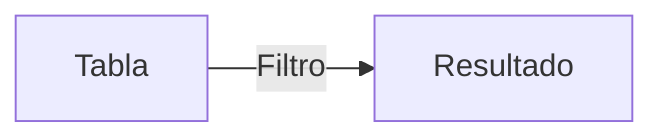
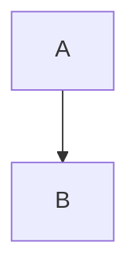

# STANDARD.md — Template de Referencia para Ejercicios Lab01

## Formato Único por Nivel

### Nivel Básico (1.basico.md)

```markdown
## Ejercicio N: Título Descriptivo

### 🎓 Explicación del Profesor

**Analogía:** [una analogía cercana a la vida real, máxima 3 líneas]

**Concepto:** [definición clara y sencilla del concepto SQL, máxima 4 líneas]

> 💡 **Tip del Profesor:** [consejo pedagógico, error común, o advertencia]

### Código de Solución

```sql
SELECT columna1, columna2
FROM tabla
WHERE condicion
ORDER BY columna;
```

> 🛠️ **Nota del Ingeniero de Datos:** [solo cuando aplica: performance de índices, buenas prácticas en producción, diferencias MySQL vs PostgreSQL, advertencias técnicas]

### Diagrama de Flujo (Mermaid)


[solo cuando el concepto lo amerita: JOINs, GROUP BY, subconsultas, flujo de ejecución]
---
```

### Nivel Intermedio (2.intermedio.md)

```markdown
## Ejercicio N: Título Descriptivo

### 🎓 Explicación del Profesor

**Analogía:** [analogía]

### Marco Conceptual del Optimizador

[explicación técnica del plan de ejecución, algoritmos, estructuras de datos]

### Diagrama de Flujo (Mermaid)



### Código de Solución

```sql
SELECT ...
```

> 🛠️ **Nota del Ingeniero de Datos:** [nota adicional: performance, alternativas, advertencias]

### Criterio de Evaluación del Entrevistador

[lo que el entrevistador evalúa + error común]

---
```

### Nivel Avanzado (3.avanzado.md)

[ mismo formato que Intermedio ]

### Examen de Entrevista (4.examen_entrevista.md)

```markdown
### Pregunta N - Nivel: [Junior/Mid/Senior]

**Contexto:** [escenario real]

**Enunciado:** [qué debe hacer el candidato]

<details>
<summary>Solución</summary>

```sql
...
```

**Explicación:** [por qué funciona + error común]

> 🛠️ **Nota del Ingeniero de Datos:** [contexto técnico adicional]

</details>
---
```

## Reglas de Estilo

1. **Acentos obligatorios:** Código, Solución, Explicación, Básico, Guía, Profesor, Ingeniero, Optimización, Proyección, Segmentación, etc.
2. **SQL en MAYÚSCULAS:** SELECT, FROM, WHERE, JOIN, GROUP BY, ORDER BY, HAVING, LIMIT, etc.
3. **`;` al final** de todo bloque SQL
4. **Alias con `AS`:** Siempre explícito (`COUNT(*) AS total`)
5. **Ing. Datos:** Solo notas relevantes, NO forzar. Si no hay nada técnico que decir, omitir.
6. **Mermaid:** Solo cuando aporta claridad visual (flujos, pipelines, JOINs, árboles). NO en cada ejercicio.
7. **Profesor primero, Ing. Datos después:** Primero la explicación pedagógica, luego la nota técnica.
8. **Idioma:** Español consistente. No mezclar con inglés en las explicaciones.