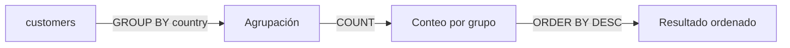
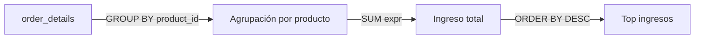
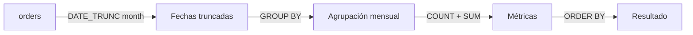
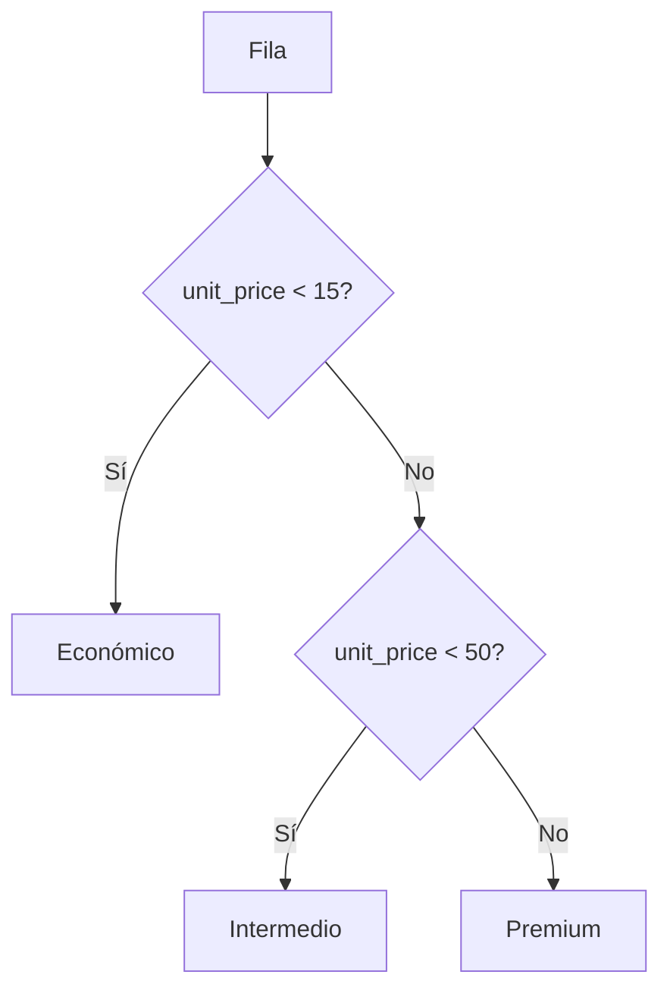
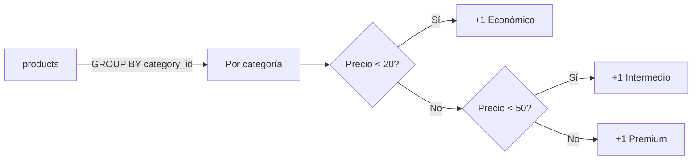
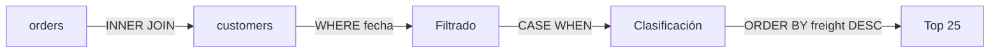

# Libro de Ejercicios SQL - Nivel 1: Básico

> Base de datos: Northwind (PostgreSQL 15+) | 50 ejercicios | Temas: SELECT, WHERE, ORDER BY, LIKE, NULL, GROUP BY, funciones de cadena, fecha, CASE WHEN

---

## Ejercicio 1: Proyección de la Fuerza de Ventas

### 🎓 Explicación del Profesor

**Analogía:** Imagina que tienes un formulario de empleado con 20 campos, pero solo necesitas copiar el nombre, apellido y cargo para un reporte. No vas a copiar todo el formulario, solo lo que necesitas.

**Concepto:** `SELECT` especifica qué columnas quieres ver. Evita `SELECT *` en producción: proyectar solo las columnas necesarias reduce la carga de memoria y el tráfico de red.

> 💡 **Tip del Profesor:** En tablas con 100+ columnas, `SELECT *` puede duplicar el tiempo de respuesta. El error más común es creer que `SELECT *` es más rápido (es más lento porque trae todo).

### Código de Solución

```sql
SELECT
    employee_id,
    last_name,
    first_name,
    title
FROM employees
ORDER BY employee_id;
```

#### 📊 Resultado Real de Ejecución en PostgreSQL (AWS EC2):

```text
employee_id | last_name | first_name |          title           
-------------+-----------+------------+--------------------------
           1 | Davolio   | Nancy      | Sales Representative
           2 | Fuller    | Andrew     | Vice President, Sales
           3 | Leverling | Janet      | Sales Representative
           4 | Peacock   | Margaret   | Sales Representative
           5 | Buchanan  | Steven     | Sales Manager
           6 | Suyama    | Michael    | Sales Representative
           7 | King      | Robert     | Sales Representative
           8 | Callahan  | Laura      | Inside Sales Coordinator
           9 | Dodsworth | Anne       | Sales Representative
(9 rows)
```

> 🛠 **Nota del Ingeniero de Datos:** En tablas con alta cardinalidad o muchas columnas (TOAST/TEXT), proyectar únicamente las columnas estrictamente necesarias reduce la transferencia de páginas desde el buffer pool a la memoria de trabajo y minimiza el ancho de tupla (width).

### Diagrama ASCII de Ejecución en el Motor (Paso a Paso)

```text
========================================================================================
PASO 1: LECTURA DE PÁGINAS DE DISCO / HEAP (FROM employees)
========================================================================================
  [Bloque en Disco: Tabla employees (Todas las columnas físicas)]
  +----+----------+------------+----------------------+------------+------------+--------+
  | id | last_name| first_name | title                | birth_date | hire_date  | address| ... (18 cols)
  +----+----------+------------+----------------------+------------+------------+--------+
  | 1  | Davolio  | Nancy      | Sales Representative | 1948-12-08 | 1992-05-01 | 507 ...|
  | 2  | Fuller   | Andrew     | Vice President, Sal  | 1952-02-19 | 1992-08-14 | 908 ...|
  +----+----------+------------+----------------------+------------+------------+--------+

========================================================================================
PASO 2: PROYECCIÓN SELECTIVA EN MEMORIA (SELECT employee_id, last_name, first_name, title)
========================================================================================
  Se descartan 14 columnas no solicitadas en el Buffer -> Se reduce ancho de fila (width)

  [Resultado Final Proyectado y Ordenado por employee_id]
  +-------------+-----------+------------+-----------------------+
  | employee_id | last_name | first_name | title                 |
  +-------------+-----------+------------+-----------------------+
  | 1           | Davolio   | Nancy      | Sales Representative  |
  | 2           | Fuller    | Andrew     | Vice President, Sales |
  +-------------+-----------+------------+-----------------------+
  (Costo de transferencia de red reducido en ~75%)
========================================================================================
```

---

## Ejercicio 2: Segmentación de Productos Premium

### 🎓 Explicación del Profesor

**Analogía:** Es como ir al supermercado y solo mirar los productos que cuestan más de $20. No te interesan los baratos.

**Concepto:** `WHERE` filtra filas antes de mostrar resultados. El filtro se aplica después de identificar la tabla en `FROM`.

> 💡 **Tip del Profesor:** `WHERE` se ejecuta antes que `SELECT`. PostgreSQL puede usar un índice en `unit_price` si existe.

### Código de Solución

```sql
SELECT
    product_name,
    unit_price
FROM products
WHERE unit_price > 30
ORDER BY unit_price DESC;
```

#### 📊 Resultado Real de Ejecución en PostgreSQL (AWS EC2):

```text
product_name        | unit_price 
----------------------------+------------
 Côte de Blaye              |      263.5
 Thüringer Rostbratwurst    |     123.79
 Mishi Kobe Niku            |         97
 Sir Rodney's Marmalade     |         81
 Carnarvon Tigers           |       62.5
 Raclette Courdavault       |         55
 Manjimup Dried Apples      |         53
 Tarte au sucre             |       49.3
 Ipoh Coffee                |         46
 Rössle Sauerkraut          |       45.6
 Vegie-spread               |       43.9
 Schoggi Schokolade         |       43.9
 Northwoods Cranberry Sauce |         40
 Alice Mutton               |         39
 Queso Manchego La Pastora  |         38
 Gnocchi di nonna Alice     |         38
 ... [8 filas omitidas para brevedad del documento] ...
(24 rows)
```

> 🛠 **Nota del Ingeniero de Datos:** Si existe un índice B-Tree en unit_price, el optimizador de PostgreSQL optará por un Bitmap Index Scan o Index Scan en lugar de un Seq Scan, reduciendo drásticamente el costo de I/O en tablas de gran volumen.

### Diagrama ASCII de Ejecución en el Motor (Paso a Paso)

```text
========================================================================================
PASO 1: EVALUACIÓN DEL PREDICADO (WHERE unit_price > 30)
========================================================================================
  [Tabla: products]
  +------------+-----------------------+------------+-----------------------------+
  | product_id | product_name          | unit_price | Evaluación (unit_price > 30)|
  +------------+-----------------------+------------+-----------------------------+
  | 1          | Chai                  | 18.00      | 18.00 > 30 -> [FALSO] ❌    |
  | 2          | Chang                 | 19.00      | 19.00 > 30 -> [FALSO] ❌    |
  | 8          | Northwoods Cranberry  | 40.00      | 40.00 > 30 -> [VERDADERO] ✅|
  | 38         | Côte de Blaye         | 263.50     | 263.50 > 30 -> [VERDADERO] ✅|
  +------------+-----------------------+------------+-----------------------------+

========================================================================================
PASO 2: ORDENAMIENTO EN work_mem Y PROYECCIÓN (ORDER BY unit_price DESC)
========================================================================================
  +-----------------------+------------+
  | product_name          | unit_price |
  +-----------------------+------------+
  | Côte de Blaye         | 263.50     |
  | Thüringer Rostbratw.  | 123.79     |
  | Mishi Kobe Niku       | 97.00      |
  +-----------------------+------------+
========================================================================================
```

---

## Ejercicio 3: Ordenamiento de Pedidos por Fecha

### 🎓 Explicación del Profesor

**Analogía:** Es como ordenar una pila de facturas de la más reciente a la más antigua para encontrar el último pedido.

**Concepto:** `ORDER BY` ordena los resultados. `ASC` (ascendente) es el defecto; `DESC` invierte el orden.

> 💡 **Tip del Profesor:** Ordenar es costoso en `work_mem`. En tablas grandes, limita con `LIMIT`. El error común es poner `DESC` en la columna equivocada.

### Código de Solución

```sql
SELECT
    order_id,
    customer_id,
    order_date
FROM orders
ORDER BY order_date DESC;
```

#### 📊 Resultado Real de Ejecución en PostgreSQL (AWS EC2):

```text
order_id | customer_id | order_date 
----------+-------------+------------
    11074 | SIMOB       | 1998-05-06
    11077 | RATTC       | 1998-05-06
    11076 | BONAP       | 1998-05-06
    11075 | RICSU       | 1998-05-06
    11071 | LILAS       | 1998-05-05
    11073 | PERIC       | 1998-05-05
    11072 | ERNSH       | 1998-05-05
    11070 | LEHMS       | 1998-05-05
    11068 | QUEEN       | 1998-05-04
    11069 | TORTU       | 1998-05-04
    11067 | DRACD       | 1998-05-04
    11065 | LILAS       | 1998-05-01
    11066 | WHITC       | 1998-05-01
    11064 | SAVEA       | 1998-05-01
    11061 | GREAL       | 1998-04-30
    11063 | HUNGO       | 1998-04-30
 ... [814 filas omitidas para brevedad del documento] ...
(830 rows)
```

> 🛠 **Nota del Ingeniero de Datos:** El ordenamiento sin LIMIT requiere cargar todas las tuplas coincidentes en work_mem. Si el volumen supera la memoria disponible, PostgreSQL recurre a external merge sort escribiendo en disco temporal (spill to disk).

### Diagrama ASCII de Ejecución en el Motor (Paso a Paso)

```text
========================================================================================
PASO 1: LECTURA SECUENCIAL DE TUPLAS (Seq Scan on orders)
========================================================================================
  [Buffer Pool: 830 registros cargados en memoria de trabajo]
  Tuplas leídas con columnas: (order_id, customer_id, order_date, required_date, ...)

========================================================================================
PASO 2: ORDENAMIENTO GLOBAL EN MEMORIA (Sort Method: quicksort / work_mem)
========================================================================================
  Clave de ordenación: order_date DESC (de más reciente a más antiguo)
  
  [Entrada desordenada]               [Salida ordenada en work_mem]
  +----------+------------+            +----------+------------+
  | order_id | order_date |            | order_id | order_date |
  +----------+------------+    ===>    +----------+------------+
  | 10248    | 1996-07-04 |            | 11077    | 1998-05-06 |
  | 11077    | 1998-05-06 |            | 11076    | 1998-05-06 |
  | 10500    | 1997-04-09 |            | 10248    | 1996-07-04 |
  +----------+------------+            +----------+------------+

========================================================================================
PASO 3: PROYECCIÓN FINAL (SELECT order_id, customer_id, order_date)
========================================================================================
```

---

## Ejercicio 4: Ranking de Envíos Costosos (Manejo de Nulos)

### 🎓 Explicación del Profesor

**Analogía:** Es como ordenar notas de la más alta a la más baja, pero las notas sin calificar quieres que queden al final, no al principio.

**Concepto:** En PostgreSQL, los nulos se tratan como los valores más "grandes". `NULLS LAST` fuerza que aparezcan al final en orden DESC.

> 💡 **Tip del Profesor:** `NULLS LAST` no afecta el plan de ejecución; es solo presentación. El error común es olvidar `NULLS LAST` y ver nulos primero.

### Código de Solución

```sql
SELECT
    order_id,
    ship_name,
    freight
FROM orders
ORDER BY freight DESC NULLS LAST;
```

#### 📊 Resultado Real de Ejecución en PostgreSQL (AWS EC2):

```text
order_id |             ship_name              | freight 
----------+------------------------------------+---------
    10540 | QUICK-Stop                         | 1007.64
    10372 | Queen Cozinha                      |  890.78
    11030 | Save-a-lot Markets                 |  830.75
    10691 | QUICK-Stop                         |  810.05
    10514 | Ernst Handel                       |  789.95
    11017 | Ernst Handel                       |  754.26
    10816 | Great Lakes Food Market            |  719.78
    10479 | Rattlesnake Canyon Grocery         |  708.95
    10983 | Save-a-lot Markets                 |  657.54
    11032 | White Clover Markets               |  606.19
    10897 | Hungry Owl All-Night Grocers       |  603.54
    10912 | Hungry Owl All-Night Grocers       |  580.91
    10612 | Save-a-lot Markets                 |  544.08
    10847 | Save-a-lot Markets                 |  487.57
    10634 | Folies gourmandes                  |  487.38
    10633 | Ernst Handel                       |   477.9
 ... [814 filas omitidas para brevedad del documento] ...
(830 rows)
```

> 🛠 **Nota del Ingeniero de Datos:** Por defecto en PostgreSQL, ORDER BY ... DESC sitúa los valores NULL al inicio (NULLS FIRST). Usar NULLS LAST es crucial para que los valores nulos no distorsionen los primeros puestos de rankings financieros o de fletes.

### Diagrama ASCII de Ejecución en el Motor (Paso a Paso)

```text
========================================================================================
PASO 1: EXTRACCIÓN DE ATRIBUTOS (freight, order_id, ship_name)
========================================================================================
  Evaluación de valores numéricos y posibles valores nulos (NULL).

========================================================================================
PASO 2: APLICACIÓN DE REGLA DE COLACIÓN NULLS LAST (ORDER BY freight DESC NULLS LAST)
========================================================================================
  Comparación estándar DESC:   [NULL] > [1007.64] > [890.78] > ... (NULLs encabezan)
  Con directiva NULLS LAST:    [1007.64] > [890.78] > ... > [NULL] (NULLs al final)

  [Estructura en memoria sort_mem]
  Pos 1: Order 10540 -> freight: 1007.64 (Mayor valor numérico)
  Pos 2: Order 10372 -> freight: 890.78
  ...
  Pos N: Registros sin flete asignado -> freight: NULL (Forzados al final)
========================================================================================
```

---

## Ejercicio 5: Top 5 Productos Más Caros

### 🎓 Explicación del Profesor

**Analogía:** Es como hacer un podio de los 5 más caros: primero los ordenas de mayor a menor, y solo te quedas con los primeros 5.

**Concepto:** Combinar `ORDER BY DESC` con `LIMIT N` obtiene los N valores más altos.

> 💡 **Tip del Profesor:** `LIMIT` es muy eficiente porque el optimizador deja de leer filas después de encontrar N. No uses `TOP 5` (sintaxis de SQL Server, no PostgreSQL).

### Código de Solución

```sql
SELECT
    product_name,
    unit_price
FROM products
ORDER BY unit_price DESC
LIMIT 5;
```

#### 📊 Resultado Real de Ejecución en PostgreSQL (AWS EC2):

```text
product_name       | unit_price 
-------------------------+------------
 Côte de Blaye           |      263.5
 Thüringer Rostbratwurst |     123.79
 Mishi Kobe Niku         |         97
 Sir Rodney's Marmalade  |         81
 Carnarvon Tigers        |       62.5
(5 rows)
```

> 🛠 **Nota del Ingeniero de Datos:** La cláusula LIMIT 5 combinada con ORDER BY DESC permite al motor aplicar un algoritmo de ordenamiento Top-N Heap Sort en memoria, manteniendo un árbol acotado de solo 5 elementos en vez de ordenar la tabla completa.

### Diagrama ASCII de Ejecución en el Motor (Paso a Paso)

```text
========================================================================================
PASO 1: ESCANEO Y EXTRACCIÓN DE REGISTROS (Table: products)
========================================================================================
  Se leen los 77 productos del catálogo Northwind.

========================================================================================
PASO 2: TOP-N HEAP SORT EN MEMORIA (ORDER BY unit_price DESC LIMIT 5)
========================================================================================
  En lugar de ordenar los 77 elementos, el motor mantiene un montículo (heap) de tamaño 5:
  
  [Bounded Heap (Tamaño = 5)]
  ┌─────────────────────────────────────────────────────────────┐
  │ 1. Côte de Blaye           -> $263.50                       │
  │ 2. Thüringer Rostbratwurst -> $123.79                       │
  │ 3. Mishi Kobe Niku         -> $97.00                        │
  │ 4. Sir Rodney's Marmalade  -> $81.00                        │
  │ 5. Carnarvon Tigers        -> $62.50                        │
  └─────────────────────────────────────────────────────────────┘
  Cualquier producto con precio < $62.50 es descartado inmediatamente sin consumir I/O.
========================================================================================
```

---

## Ejercicio 6: Paginación de Pedidos

### 🎓 Explicación del Profesor

**Analogía:** Es como ver la página 3 de un catálogo: te saltas las primeras 20 páginas y muestras las siguientes 10.

**Concepto:** `LIMIT` define cuántas filas traer; `OFFSET` define cuántas saltar. Se usa en dashboards y APIs REST.

> 💡 **Tip del Profesor:** `OFFSET` alto es lento en tablas grandes (lee y descarta filas). Alternativa: keyset pagination. Recuerda que OFFSET empieza en 0.

### Código de Solución

```sql
SELECT
    order_id,
    order_date,
    customer_id
FROM orders
ORDER BY order_date ASC
LIMIT 10 OFFSET 20;
```

#### 📊 Resultado Real de Ejecución en PostgreSQL (AWS EC2):

```text
order_id | order_date | customer_id 
----------+------------+-------------
    10268 | 1996-07-30 | GROSR
    10269 | 1996-07-31 | WHITC
    10270 | 1996-08-01 | WARTH
    10271 | 1996-08-01 | SPLIR
    10272 | 1996-08-02 | RATTC
    10273 | 1996-08-05 | QUICK
    10274 | 1996-08-06 | VINET
    10275 | 1996-08-07 | MAGAA
    10276 | 1996-08-08 | TORTU
    10277 | 1996-08-09 | MORGK
(10 rows)
```

> 🛠 **Nota del Ingeniero de Datos:** OFFSET n obliga al motor a escanear y descartar n filas antes de retornar las siguientes. Para paginación de millones de registros en alta concurrencia, es preferible la paginación por cursor (keyset pagination) usando WHERE order_date > :ultima_fecha.

### Diagrama ASCII de Ejecución en el Motor (Paso a Paso)

```text
========================================================================================
PASO 1: ORDENAMIENTO CRONOLÓGICO (ORDER BY order_date ASC)
========================================================================================
  Conjunto de 830 pedidos ordenados del más antiguo (1996-07-04) al más reciente.

========================================================================================
PASO 2: SALTO DE VENTANA OFFSET (OFFSET 20)
========================================================================================
  Fila  1 .. 20: [DESCARTADAS / SKIPPED] -> Tuplas 10248 a 10267 ignoradas
  
========================================================================================
PASO 3: EXTRACCIÓN DE VENTANA LIMIT (LIMIT 10)
========================================================================================
  Fila 21 .. 30: [CAPTURADAS Y RETORNADAS] -> Tuplas 10268 a 10277 proyectadas al cliente
  Fila 31 .. N : [ESCANEADO DETENIDO TEMPRANO]
========================================================================================
```

---

## Ejercicio 7: Filtrado Geográfico de Clientes

### 🎓 Explicación del Profesor

**Analogía:** Es como pedir al sistema que solo te muestre clientes de "Latinoamérica", listando los países que incluyes.

**Concepto:** `IN (valor1, valor2, ...)` es equivalente a múltiples `OR` pero más limpio y a veces más rápido.

> 💡 **Tip del Profesor:** PostgreSQL expande `IN` a una serie de `OR` internamente, pero es más legible. No uses `IN` con una sola columna (innecesario, mejor usar `=`).

### Código de Solución

```sql
SELECT
    customer_id,
    company_name,
    country
FROM customers
WHERE country IN ('Germany', 'UK', 'USA')
ORDER BY country, company_name;
```

#### 📊 Resultado Real de Ejecución en PostgreSQL (AWS EC2):

```text
customer_id |           company_name            | country 
-------------+-----------------------------------+---------
 ALFKI       | Alfreds Futterkiste - Actualizado | Germany
 BLAUS       | Blauer See Delikatessen           | Germany
 WANDK       | Die Wandernde Kuh                 | Germany
 DRACD       | Drachenblut Delikatessen          | Germany
 FRANK       | Frankenversand                    | Germany
 KOENE       | Königlich Essen                   | Germany
 LEHMS       | Lehmanns Marktstand               | Germany
 MORGK       | Morgenstern Gesundkost            | Germany
 OTTIK       | Ottilies Käseladen                | Germany
 QUICK       | QUICK-Stop                        | Germany
 TOMSP       | Toms Spezialitäten                | Germany
 AROUT       | Around the Horn                   | UK
 BSBEV       | B's Beverages                     | UK
 CONSH       | Consolidated Holdings             | UK
 EASTC       | Eastern Connection                | UK
 ISLAT       | Island Trading                    | UK
 ... [15 filas omitidas para brevedad del documento] ...
(31 rows)
```

> 🛠 **Nota del Ingeniero de Datos:** El predicado IN ('val1', 'val2', ...) es transformado internamente por el optimizador en una expresión ScalarArrayOp (= ANY (ARRAY[...])), permitiendo evaluar eficientemente la pertenencia e indexar mediante scans B-Tree.

### Diagrama ASCII de Ejecución en el Motor (Paso a Paso)

```text
========================================================================================
PASO 1: EVALUACIÓN DEL OPERADOR DE PERTENENCIA (WHERE country IN ('Germany','UK','USA'))
========================================================================================
  Transformación interna en el motor:
  country = ANY (ARRAY['Germany'::text, 'UK'::text, 'USA'::text])

  [Tabla customers: 91 registros]
  Tupla 1: Alfreds Futterkiste (Germany) -> Match ['Germany'] -> [PASA] ✅
  Tupla 2: Ana Trujillo (Mexico)        -> No match          -> [FILTRADO] ❌
  Tupla 3: Around the Horn (UK)          -> Match ['UK']      -> [PASA] ✅
  Tupla 4: Bólido Comidas (Spain)        -> No match          -> [FILTRADO] ❌

========================================================================================
PASO 2: ORDEN MULTI-COLUMNA (ORDER BY country, company_name)
========================================================================================
  1° Nivel de orden: Por país ascendente (Germany -> UK -> USA)
  2° Nivel de orden: Por nombre de compañía alfabético dentro de cada país
========================================================================================
```

---

## Ejercicio 8: Rango de Precios de Productos

### 🎓 Explicación del Profesor

**Analogía:** Es como buscar productos en una tienda online con filtro de precio: "entre $15 y $75".

**Concepto:** `BETWEEN a AND b` es equivalente a `>= a AND <= b`. Es inclusivo: incluye los límites.

> 💡 **Tip del Profesor:** `BETWEEN` en columnas indexadas usa Index Range Scan. El error común es creer que BETWEEN es exclusivo (no lo es).

### Código de Solución

```sql
SELECT
    product_id,
    product_name,
    unit_price
FROM products
WHERE unit_price BETWEEN 15 AND 75
ORDER BY unit_price;
```

#### 📊 Resultado Real de Ejecución en PostgreSQL (AWS EC2):

```text
product_id |           product_name           | unit_price 
------------+----------------------------------+------------
         70 | Outback Lager                    |         15
         73 | Röd Kaviar                       |         15
         50 | Valkoinen suklaa                 |      16.25
         66 | Louisiana Hot Spiced Okra        |         17
         16 | Pavlova                          |      17.45
         35 | Steeleye Stout                   |         18
          1 | Chai                             |         18
         76 | Lakkalikööri                     |         18
         39 | Chartreuse verte                 |         18
         40 | Boston Crab Meat                 |       18.4
          2 | Chang                            |         19
         36 | Inlagd Sill                      |         19
         44 | Gula Malacca                     |      19.45
         57 | Ravioli Angelo                   |       19.5
         49 | Maxilaku                         |         20
         11 | Queso Cabrales                   |         21
 ... [32 filas omitidas para brevedad del documento] ...
(48 rows)
```

> 🛠 **Nota del Ingeniero de Datos:** BETWEEN a AND b es inclusivo y se traduce algebraicamente en >= a AND <= b. En columnas numéricas indexadas, el optimizador realiza un Index Range Scan acotado por los límites inferior y superior.

### Diagrama ASCII de Ejecución en el Motor (Paso a Paso)

```text
========================================================================================
PASO 1: EVALUACIÓN DE PREDICADO DE RANGO (WHERE unit_price BETWEEN 15 AND 75)
========================================================================================
  Condición lógica: (unit_price >= 15.00) AND (unit_price <= 75.00)

  [Filtro B-Tree / Seq Scan]
  - $4.50  (Guaraná Fantástica) -> < 15   -> [DESCARTADO] ❌
  - $18.00 (Chai)               -> [15, 75]-> [ACEPTADO]   ✅
  - $53.00 (Manjimup Apples)    -> [15, 75]-> [ACEPTADO]   ✅
  - $97.00 (Mishi Kobe Niku)    -> > 75   -> [DESCARTADO] ❌

========================================================================================
PASO 2: ORDEN ASCENDENTE (ORDER BY unit_price)
========================================================================================
  Los 48 productos resultantes se presentan de menor a mayor precio.
========================================================================================
```

---

## Ejercicio 9: Pedidos Antiguos (Filtro de Fecha)

### 🎓 Explicación del Profesor

**Analogía:** Es como buscar documentos anteriores a una fecha específica para un archivado.

**Concepto:** Para filtrar fechas, usa formato ISO 8601 (`'YYYY-MM-DD'`). Esto evita errores de interpretación según la configuración regional.

> 💡 **Tip del Profesor:** Si tienes un índice en `order_date`, el filtro es muy rápido. No uses formato de fecha regional (ej. `'01/01/1997'`) que puede fallar.

### Código de Solución

```sql
SELECT
    order_id,
    customer_id,
    order_date
FROM orders
WHERE order_date < '1997-01-01'
ORDER BY order_date;
```

#### 📊 Resultado Real de Ejecución en PostgreSQL (AWS EC2):

```text
order_id | customer_id | order_date 
----------+-------------+------------
    10248 | VINET       | 1996-07-04
    10249 | TOMSP       | 1996-07-05
    10250 | HANAR       | 1996-07-08
    10251 | VICTE       | 1996-07-08
    10252 | SUPRD       | 1996-07-09
    10253 | HANAR       | 1996-07-10
    10254 | CHOPS       | 1996-07-11
    10255 | RICSU       | 1996-07-12
    10256 | WELLI       | 1996-07-15
    10257 | HILAA       | 1996-07-16
    10258 | ERNSH       | 1996-07-17
    10259 | CENTC       | 1996-07-18
    10260 | OTTIK       | 1996-07-19
    10261 | QUEDE       | 1996-07-19
    10262 | RATTC       | 1996-07-22
    10263 | ERNSH       | 1996-07-23
 ... [136 filas omitidas para brevedad del documento] ...
(152 rows)
```

> 🛠 **Nota del Ingeniero de Datos:** Al comparar fechas, utilizar el estándar ISO 8601 (YYYY-MM-DD) asegura que la constante sea parseada de forma determinista por el motor sin depender de variables de sesión (DateStyle).

### Diagrama ASCII de Ejecución en el Motor (Paso a Paso)

```text
========================================================================================
PASO 1: CONVERSIÓN DE CONSTANTE A TIPO DATE ('1997-01-01'::date)
========================================================================================
  Constante analizada en tiempo de parseo semántico -> Timestamp Epoch: 852076800

========================================================================================
PASO 2: EVALUACIÓN TEMPORAL (WHERE order_date < '1997-01-01')
========================================================================================
  [Colección orders: 830 tuplas]
  - 1996-07-04 (Order 10248) -> 1996 < 1997 -> [VERDADERO] ✅
  - 1996-12-31 (Order 10399) -> 1996 < 1997 -> [VERDADERO] ✅
  - 1997-01-01 (Order 10400) -> 1997 < 1997 -> [FALSO] ❌ (Límite estricto <)
  
  Total filtrado: 152 pedidos correspondientes al año fiscal 1996.
========================================================================================
```

---

## Ejercicio 10: Empleados con Mayor Antigüedad

### 🎓 Explicación del Profesor

**Analogía:** Es como buscar los empleados que entraron antes de cierto año para un plan de beneficios.

**Concepto:** Combinamos concatenación de strings (`||`), filtros de fecha, ordenamiento y límite. La precedencia es: `FROM` -> `WHERE` -> `ORDER BY` -> `LIMIT`.

> 💡 **Tip del Profesor:** `||` es nativo de PostgreSQL; en MySQL usa `CONCAT()`. No uses `+` para concatenar (sintaxis de SQL Server).

### Código de Solución

```sql
SELECT
    employee_id,
    first_name || ' ' || last_name AS empleado,
    title,
    hire_date
FROM employees
WHERE hire_date >= '1993-01-01'
ORDER BY hire_date ASC
LIMIT 10;
```

#### 📊 Resultado Real de Ejecución en PostgreSQL (AWS EC2):

```text
employee_id |     empleado     |          title           | hire_date  
-------------+------------------+--------------------------+------------
           4 | Margaret Peacock | Sales Representative     | 1993-05-03
           5 | Steven Buchanan  | Sales Manager            | 1993-10-17
           6 | Michael Suyama   | Sales Representative     | 1993-10-17
           7 | Robert King      | Sales Representative     | 1994-01-02
           8 | Laura Callahan   | Inside Sales Coordinator | 1994-03-05
           9 | Anne Dodsworth   | Sales Representative     | 1994-11-15
(6 rows)
```

> 🛠 **Nota del Ingeniero de Datos:** La precedencia lógica de ejecución en el motor es: FROM (carga heap) -> WHERE (filtro de fecha) -> SELECT (proyección y concatenación ||) -> ORDER BY (sort) -> LIMIT (corte a 10 filas).

### Diagrama ASCII de Ejecución en el Motor (Paso a Paso)

```text
========================================================================================
PASO 1: FILTRADO DE FECHA DE CONTRATACIÓN (WHERE hire_date >= '1993-01-01')
========================================================================================
  De los 9 empleados en Northwind, se seleccionan los contratados desde 1993 en adelante (6 tuplas).

========================================================================================
PASO 2: TRANSFORMACIÓN DE CADENAS (SELECT first_name || ' ' || last_name)
========================================================================================
  'Janet' || ' ' || 'Leverling' -> 'Janet Leverling'

========================================================================================
PASO 3: ORDEN ASCENDENTE Y CORTE (ORDER BY hire_date ASC LIMIT 10)
========================================================================================
  Orden cronológico por antigüedad y límite de seguridad para presentación.
========================================================================================
```

---

## Ejercicio 11: Búsqueda de Contactos Comerciales

### 🎓 Explicación del Profesor

**Analogía:** Es como buscar en una agenda todos los contactos que tengan "Ventas" en su cargo.

**Concepto:** `LIKE` con `%` busca patrones de texto. `%` significa "cualquier secuencia de caracteres". Si el comodín va al inicio, no puede usar índices B-Tree.

> 💡 **Tip del Profesor:** `LIKE '%texto%'` fuerza Seq Scan. Para búsquedas frecuentes, usa `pg_trgm`. No olvides los `%` si no buscas coincidencia exacta.

### Código de Solución

```sql
SELECT
    company_name,
    contact_name,
    contact_title
FROM customers
WHERE contact_title LIKE '%Sales%'
ORDER BY company_name;
```

#### 📊 Resultado Real de Ejecución en PostgreSQL (AWS EC2):

```text
company_name            |    contact_name     |         contact_title          
-----------------------------------+---------------------+--------------------------------
 Alfreds Futterkiste - Actualizado | Maria Anders        | Sales Representative
 Around the Horn                   | Thomas Hardy        | Sales Representative
 B's Beverages                     | Victoria Ashworth   | Sales Representative
 Blauer See Delikatessen           | Hanna Moos          | Sales Representative
 Cactus Comidas para llevar        | Patricio Simpson    | Sales Agent
 Comércio Mineiro                  | Pedro Afonso        | Sales Associate
 Consolidated Holdings             | Elizabeth Brown     | Sales Representative
 Die Wandernde Kuh                 | Rita Müller         | Sales Representative
 Eastern Connection                | Ann Devon           | Sales Agent
 Ernst Handel                      | Roland Mendel       | Sales Manager
 Folies gourmandes                 | Martine Rancé       | Assistant Sales Agent
 Franchi S.p.A.                    | Paolo Accorti       | Sales Representative
 Furia Bacalhau e Frutos do Mar    | Lino Rodriguez      | Sales Manager
 Godos Cocina Típica               | José Pedro Freyre   | Sales Manager
 Gourmet Lanchonetes               | André Fonseca       | Sales Associate
 HILARION-Abastos                  | Carlos Hernández    | Sales Representative
 ... [27 filas omitidas para brevedad del documento] ...
(43 rows)
```

> 🛠 **Nota del Ingeniero de Datos:** Un patrón LIKE '%Sales%' con comodín al inicio no puede aprovechar un índice B-Tree clásico y fuerza un Seq Scan. En bases de producción, estas búsquedas requieren un índice GIN con trigramas (pg_trgm).

### Diagrama ASCII de Ejecución en el Motor (Paso a Paso)

```text
========================================================================================
PASO 1: PATTERN MATCHING SECUENCIAL (WHERE contact_title LIKE '%Sales%')
========================================================================================
  Comodín al inicio y final -> El motor evalúa cada carácter de contact_title:
  
  [Tuplas Evaluadas]
  - 'Sales Representative'      -> Contiene 'Sales' en posición 0  -> [MATCH] ✅
  - 'Assistant Sales Agent'     -> Contiene 'Sales' en posición 10 -> [MATCH] ✅
  - 'Marketing Manager'         -> No contiene 'Sales'             -> [SKIP]  ❌
  - 'Order Administrator'       -> No contiene 'Sales'             -> [SKIP]  ❌

========================================================================================
PASO 2: ORDENAMIENTO Y RETORNO (ORDER BY company_name)
========================================================================================
  43 clientes coinciden y se ordenan alfabéticamente por razón social.
========================================================================================
```

---

## Ejercicio 12: Productos por Letra Inicial

### 🎓 Explicación del Profesor

**Analogía:** Es como buscar en un diccionario solo las palabras que empiezan con "C".

**Concepto:** `'C%'` (comodín solo al final) permite que PostgreSQL use Index Range Scan, mucho más rápido que `%C%`.

> 💡 **Tip del Profesor:** `'C%'` puede usar índice; `'%C%'` no puede. La posición del comodín afecta el rendimiento directamente.

### Código de Solución

```sql
SELECT
    product_id,
    product_name,
    unit_price
FROM products
WHERE product_name LIKE 'C%'
ORDER BY product_name;
```

#### 📊 Resultado Real de Ejecución en PostgreSQL (AWS EC2):

```text
product_id |         product_name         | unit_price 
------------+------------------------------+------------
         60 | Camembert Pierrot            |         34
         18 | Carnarvon Tigers             |       62.5
          1 | Chai                         |         18
          2 | Chang                        |         19
         39 | Chartreuse verte             |         18
          4 | Chef Anton's Cajun Seasoning |         22
          5 | Chef Anton's Gumbo Mix       |      21.35
         48 | Chocolade                    |      12.75
         38 | Côte de Blaye                |      263.5
(9 rows)
```

> 🛠 **Nota del Ingeniero de Datos:** Al colocar el comodín al final (LIKE 'C%'), el predicado se comporta como una búsqueda de rango (>= 'C' AND < 'D'), permitiendo a PostgreSQL utilizar un Index Range Scan sobre el índice B-Tree.

### Diagrama ASCII de Ejecución en el Motor (Paso a Paso)

```text
========================================================================================
PASO 1: PREDICADO DE PREFIJO (WHERE product_name LIKE 'C%')
========================================================================================
  El motor aprovecha la búsqueda de prefijo (rango léxico ['C', 'D')):
  
  - 'Chai'              -> Inicia con 'C' -> [PASA] ✅
  - 'Chang'             -> Inicia con 'C' -> [PASA] ✅
  - 'Chef Anton''s ...'  -> Inicia con 'C' -> [PASA] ✅
  - 'Ikura'             -> Inicia con 'I' -> [DESCARTADO] ❌

========================================================================================
PASO 2: PROYECCIÓN ORDENADA (ORDER BY product_name)
========================================================================================
  9 productos identificados con la inicial 'C'.
========================================================================================
```

---

## Ejercicio 13: Búsqueda Insensible a Mayúsculas (ILIKE)

### 🎓 Explicación del Profesor

**Analogía:** Es como buscar "manager" sin importar si lo escribieron "Manager", "MANAGER" o "manager".

**Concepto:** `ILIKE` (case-insensitive LIKE) es extensión PostgreSQL. Es ideal para búsquedas donde el usuario no sabe cómo se escribió el dato.

> 💡 **Tip del Profesor:** En MySQL, `LIKE` ya es case-insensitive (depende del collation). No uses `LOWER(title) LIKE '%manager%'` (funcional pero más verboso).

### Código de Solución

```sql
SELECT
    employee_id,
    first_name || ' ' || last_name AS empleado,
    title
FROM employees
WHERE title ILIKE '%manager%';
```

#### 📊 Resultado Real de Ejecución en PostgreSQL (AWS EC2):

```text
employee_id |    empleado     |     title     
-------------+-----------------+---------------
           5 | Steven Buchanan | Sales Manager
(1 row)
```

> 🛠 **Nota del Ingeniero de Datos:** ILIKE es un operador propio de PostgreSQL para comparación insensible a mayúsculas/minúsculas. Para indexar consultas con ILIKE, se recomienda crear índices funcionales (LOWER(columna)) o índices trigram GIN.

### Diagrama ASCII de Ejecución en el Motor (Paso a Paso)

```text
========================================================================================
PASO 1: EVALUACIÓN INSENSIBLE A MAYÚSCULAS (WHERE title ILIKE '%manager%')
========================================================================================
  PostgreSQL normaliza temporalmente el texto en memoria a minúsculas durante la búsqueda:
  'Sales Manager' -> 'sales manager' -> Coincide con '%manager%' -> [VERDADERO] ✅
  
  [Resultado]
  Empleado ID 5: Steven Buchanan (Sales Manager)
========================================================================================
```

---

## Ejercicio 14: Clientes sin Región Asignada

### 🎓 Explicación del Profesor

**Analogía:** Es como buscar en una base de datos los registros que tienen un campo vacío, como un teléfono sin registrar.

**Concepto:** Para buscar valores nulos, **nunca** uses `= NULL`. Debes usar `IS NULL`. Esto es fundamental: NULL no es igual a nada, ni siquiera a sí mismo.

> 💡 **Tip del Profesor:** Los índices B-Tree generalmente excluyen NULLs. `WHERE region = NULL` siempre retorna vacío.

### Código de Solución

```sql
SELECT
    customer_id,
    company_name,
    city,
    country
FROM customers
WHERE region IS NULL;
```

#### 📊 Resultado Real de Ejecución en PostgreSQL (AWS EC2):

```text
customer_id |             company_name             |      city      |   country   
-------------+--------------------------------------+----------------+-------------
 ANATR       | Ana Trujillo Emparedados y helados   | México D.F.    | Mexico
 ANTON       | Antonio Moreno Taquería              | México D.F.    | Mexico
 AROUT       | Around the Horn                      | London         | UK
 BERGS       | Berglunds snabbköp                   | Luleå          | Sweden
 BLAUS       | Blauer See Delikatessen              | Mannheim       | Germany
 BLONP       | Blondesddsl père et fils             | Strasbourg     | France
 BOLID       | Bólido Comidas preparadas            | Madrid         | Spain
 BONAP       | Bon app'                             | Marseille      | France
 BSBEV       | B's Beverages                        | London         | UK
 CACTU       | Cactus Comidas para llevar           | Buenos Aires   | Argentina
 CENTC       | Centro comercial Moctezuma           | México D.F.    | Mexico
 CHOPS       | Chop-suey Chinese                    | Bern           | Switzerland
 CONSH       | Consolidated Holdings                | London         | UK
 DRACD       | Drachenblut Delikatessen             | Aachen         | Germany
 DUMON       | Du monde entier                      | Nantes         | France
 EASTC       | Eastern Connection                   | London         | UK
 ... [46 filas omitidas para brevedad del documento] ...
(62 rows)
```

> 🛠 **Nota del Ingeniero de Datos:** En el álgebra relacional de Codd, NULL representa lo desconocido y sigue una lógica trivalente (True, False, Unknown). La comparación region = NULL evalúa a UNKNOWN y descarta toda fila; la sintaxis correcta obligatoria es IS NULL.

### Diagrama ASCII de Ejecución en el Motor (Paso a Paso)

```text
========================================================================================
PASO 1: EVALUACIÓN DE LÓGICA TRIVALENTE (WHERE region IS NULL)
========================================================================================
  Bitmask de la tupla: Se comprueba el encabezado del registro para verificar flag de nulo.
  
  [Tabla: customers (91 clientes)]
  - Alfreds Futterkiste (Germany)    -> region: NULL -> [IS NULL = TRUE]  ✅ (Pasa)
  - Antonio Moreno (Mexico)          -> region: NULL -> [IS NULL = TRUE]  ✅ (Pasa)
  - Rattlesnake Canyon Grocery (USA) -> region: 'NM' -> [IS NULL = FALSE] ❌ (Descartado)

  Total: 62 clientes sin región administrativa registrada.
========================================================================================
```

---

## Ejercicio 15: Productos con Stock Disponible

### 🎓 Explicación del Profesor

**Analogía:** Es como buscar en un almacén los productos que tienen stock (no están vacíos).

**Concepto:** `IS NOT NULL` filtra registros que tienen contenido. Es la contraparte de `IS NULL`.

> 💡 **Tip del Profesor:** En Northwind, `units_in_stock` siempre tiene valor, pero es buena práctica. No uses `<> NULL` (siempre retorna vacío).

### Código de Solución

```sql
SELECT
    product_name,
    units_in_stock
FROM products
WHERE units_in_stock IS NOT NULL
ORDER BY units_in_stock DESC;
```

#### 📊 Resultado Real de Ejecución en PostgreSQL (AWS EC2):

```text
product_name           | units_in_stock 
----------------------------------+----------------
 Rhönbräu Klosterbier             |            125
 Boston Crab Meat                 |            123
 Grandma's Boysenberry Spread     |            120
 Pâté chinois                     |            115
 Sirop d'érable                   |            113
 Geitost                          |            112
 Inlagd Sill                      |            112
 Sasquatch Ale                    |            111
 Gustaf's Knäckebröd              |            104
 Röd Kaviar                       |            101
 Spegesild                        |             95
 Queso Manchego La Pastora        |             86
 Jack's New England Clam Chowder  |             85
 Raclette Courdavault             |             79
 Louisiana Fiery Hot Pepper Sauce |             76
 NuNuCa Nuß-Nougat-Creme          |             76
 ... [61 filas omitidas para brevedad del documento] ...
(77 rows)
```

> 🛠 **Nota del Ingeniero de Datos:** El predicado IS NOT NULL descarta registros con ausencia de valor. Los índices B-Tree estándar en PostgreSQL sí almacenan tuplas nulas (a diferencia de otros motores), pero un índice parcial WHERE columna IS NOT NULL puede optimizar espacio.

### Diagrama ASCII de Ejecución en el Motor (Paso a Paso)

```text
========================================================================================
PASO 1: COMPROBACIÓN DE ATRIBUTO NO NULO (WHERE units_in_stock IS NOT NULL)
========================================================================================
  Verificación en la tupla: units_in_stock contiene un valor numérico definido.

========================================================================================
PASO 2: ORDENAMIENTO POR EXISTENCIAS (ORDER BY units_in_stock DESC)
========================================================================================
  Se clasifican los 77 productos desde el stock más abundante (125 unidades) hasta agotados (0 unidades).
========================================================================================
```

---

## Ejercicio 16: Campaña USA y Canadá

### 🎓 Explicación del Profesor

**Analogía:** Es como pedir al sistema que te muestre clientes de dos países específicos.

**Concepto:** `OR` permite combinar condiciones donde al menos una debe cumplirse. Si tienes muchos valores, es mejor usar `IN`.

> 💡 **Tip del Profesor:** `IN` es preferible a múltiples `OR` (más legible, mismo rendimiento). No escribas `country = 'USA' OR 'Canada'` (sintaxis inválida).

### Código de Solución

```sql
SELECT
    customer_id,
    company_name,
    country,
    phone
FROM customers
WHERE country = 'USA'
   OR country = 'Canada'
ORDER BY country, company_name;
```

#### 📊 Resultado Real de Ejecución en PostgreSQL (AWS EC2):

```text
customer_id |           company_name            | country |     phone      
-------------+-----------------------------------+---------+----------------
 BOTTM       | Bottom-Dollar Markets             | Canada  | (604) 555-4729
 LAUGB       | Laughing Bacchus Wine Cellars     | Canada  | (604) 555-3392
 MEREP       | Mère Paillarde                    | Canada  | (514) 555-8054
 GREAL       | Great Lakes Food Market           | USA     | (503) 555-7555
 HUNGC       | Hungry Coyote Import Store        | USA     | (503) 555-6874
 LAZYK       | Lazy K Kountry Store              | USA     | (509) 555-7969
 LETSS       | Let's Stop N Shop                 | USA     | (415) 555-5938
 LONEP       | Lonesome Pine Restaurant          | USA     | (503) 555-9573
 OLDWO       | Old World Delicatessen            | USA     | (907) 555-7584
 RATTC       | Rattlesnake Canyon Grocery        | USA     | (505) 555-5939
 SAVEA       | Save-a-lot Markets                | USA     | (208) 555-8097
 SPLIR       | Split Rail Beer & Ale             | USA     | (307) 555-4680
 THEBI       | The Big Cheese                    | USA     | (503) 555-3612
 THECR       | The Cracker Box                   | USA     | (406) 555-5834
 TRAIH       | Trail's Head Gourmet Provisioners | USA     | (206) 555-8257
 WHITC       | White Clover Markets              | USA     | (206) 555-4112
(16 rows)
```

> 🛠 **Nota del Ingeniero de Datos:** La cláusula OR puede provocar que el optimizador recurra a un BitmapOr Scan (combinando dos mapas de bits de índices independientes) o a un Seq Scan completo si la selectividad estimada es baja.

### Diagrama ASCII de Ejecución en el Motor (Paso a Paso)

```text
========================================================================================
PASO 1: EVALUACIÓN DISYUNTIVA (WHERE country = 'USA' OR country = 'Canada')
========================================================================================
  Fila evaluada: Si country == 'USA' -> TRUE (cortocircuito)
                 Si country != 'USA' -> Evalúa country == 'Canada'
  
  [Tuplas seleccionadas]
  - 13 clientes de USA
  - 3 clientes de Canada
  Total = 16 clientes en la región norteamericana.
========================================================================================
```

---

## Ejercicio 17: Productos Activos (No Descontinuados)

### 🎓 Explicación del Profesor

**Analogía:** Es como filtrar un catálogo para mostrar solo los productos que todavía se venden.

**Concepto:** `<>` o `!=` significa "no es igual a". En Northwind, `discontinued` es integer: 0 = activo, 1 = descontinuado.

> 💡 **Tip del Profesor:** Si `discontinued` tiene un índice, el filtro es muy selectivo. `<> 1` es más explícito para "no descontinuado" que `= 0`.

### Código de Solución

```sql
SELECT
    product_id,
    product_name,
    unit_price,
    units_in_stock
FROM products
WHERE discontinued <> 1
ORDER BY product_name;
```

#### 📊 Resultado Real de Ejecución en PostgreSQL (AWS EC2):

```text
product_id |           product_name           | unit_price | units_in_stock 
------------+----------------------------------+------------+----------------
          3 | Aniseed Syrup                    |         10 |             13
         40 | Boston Crab Meat                 |       18.4 |            123
         60 | Camembert Pierrot                |         34 |             19
         18 | Carnarvon Tigers                 |       62.5 |             42
         39 | Chartreuse verte                 |         18 |             69
          4 | Chef Anton's Cajun Seasoning     |         22 |             53
         48 | Chocolade                        |      12.75 |             15
         38 | Côte de Blaye                    |      263.5 |             17
         58 | Escargots de Bourgogne           |      13.25 |             62
         52 | Filo Mix                         |          7 |             38
         71 | Flotemysost                      |       21.5 |             26
         33 | Geitost                          |        2.5 |            112
         15 | Genen Shouyu                     |         13 |             39
         56 | Gnocchi di nonna Alice           |         38 |             21
         31 | Gorgonzola Telino                |       12.5 |              0
          6 | Grandma's Boysenberry Spread     |         25 |            120
 ... [51 filas omitidas para brevedad del documento] ...
(67 rows)
```

> 🛠 **Nota del Ingeniero de Datos:** El operador de desigualdad <> (o !=) suele tener baja selectividad y generalmente no utiliza índices B-Tree, a menos que el valor filtrado represente una fracción muy minoritaria de la tabla.

### Diagrama ASCII de Ejecución en el Motor (Paso a Paso)

```text
========================================================================================
PASO 1: EVALUACIÓN DE DESIGUALDAD (WHERE discontinued <> 1)
========================================================================================
  Flag de catálogo: 0 = Activo en venta, 1 = Descontinuado/Retirado
  
  De 77 productos:
  - 67 productos activos (discontinued = 0) pasan el filtro.
  - 10 productos retirados (discontinued = 1) son excluidos.
========================================================================================
```

---

## Ejercicio 18: Productos de Alta Rotación y Precio

### 🎓 Explicación del Profesor

**Analogía:** Es como buscar productos que sean caros Y tengan mucho stock: las dos condiciones a la vez.

**Concepto:** `AND` requiere que **ambas** condiciones se cumplan simultáneamente.

> 💡 **Tip del Profesor:** El optimizador evalúa la condición más restrictiva primero. No uses `OR` cuando se necesita `AND` (resultado muy diferente).

### Código de Solución

```sql
SELECT
    product_name,
    unit_price,
    units_in_stock
FROM products
WHERE unit_price > 20
  AND units_in_stock > 50
ORDER BY unit_price DESC;
```

#### 📊 Resultado Real de Ejecución en PostgreSQL (AWS EC2):

```text
product_name           | unit_price | units_in_stock 
----------------------------------+------------+----------------
 Raclette Courdavault             |         55 |             79
 Queso Manchego La Pastora        |         38 |             86
 Sirop d'érable                   |       28.5 |            113
 Grandma's Boysenberry Spread     |         25 |            120
 Pâté chinois                     |         24 |            115
 Chef Anton's Cajun Seasoning     |         22 |             53
 Louisiana Fiery Hot Pepper Sauce |      21.05 |             76
 Gustaf's Knäckebröd              |         21 |            104
(8 rows)
```

> 🛠 **Nota del Ingeniero de Datos:** En condiciones compuestas con AND, PostgreSQL evalúa primero el predicado más selectivo (que filtra más tuplas) para reducir rápidamente el conjunto de trabajo en memoria.

### Diagrama ASCII de Ejecución en el Motor (Paso a Paso)

```text
========================================================================================
PASO 1: EVALUACIÓN CONJUNTIVA (WHERE unit_price > 20 AND units_in_stock > 50)
========================================================================================
  Condición 1: unit_price > 20      (Precio alto)
  Condición 2: units_in_stock > 50   (Inventario abundante)
  
  Ambas deben ser verdaderas simultáneamente. De 77 productos, exactamente 8 cumplen ambos criterios.
========================================================================================
```

---

## Ejercicio 19: Pedidos con Retraso en Entrega

### 🎓 Explicación del Profesor

**Analogía:** Es como comparar dos fechas para saber si un pedido llegó tarde.

**Concepto:** SQL permite comparar dos columnas de la misma fila. Aquí comparamos `shipped_date` contra `required_date`.

> 💡 **Tip del Profesor:** Si ambas columnas tienen índice, PostgreSQL puede usar Merge Join. No compares fechas con horas cuando solo necesitas la fecha.

### Código de Solución

```sql
SELECT
    order_id,
    customer_id,
    required_date,
    shipped_date
FROM orders
WHERE shipped_date > required_date
ORDER BY shipped_date;
```

#### 📊 Resultado Real de Ejecución en PostgreSQL (AWS EC2):

```text
order_id | customer_id | required_date | shipped_date 
----------+-------------+---------------+--------------
    10264 | FOLKO       | 1996-08-21    | 1996-08-23
    10271 | SPLIR       | 1996-08-29    | 1996-08-30
    10280 | BERGS       | 1996-09-11    | 1996-09-12
    10302 | SUPRD       | 1996-10-08    | 1996-10-09
    10320 | WARTH       | 1996-10-17    | 1996-10-18
    10309 | HUNGO       | 1996-10-17    | 1996-10-23
    10380 | HUNGO       | 1997-01-09    | 1997-01-16
    10423 | GOURL       | 1997-02-06    | 1997-02-24
    10427 | PICCO       | 1997-02-24    | 1997-03-03
    10433 | PRINI       | 1997-03-03    | 1997-03-04
    10451 | QUICK       | 1997-03-05    | 1997-03-12
    10483 | WHITC       | 1997-04-21    | 1997-04-25
    10515 | QUICK       | 1997-05-07    | 1997-05-23
    10523 | SEVES       | 1997-05-29    | 1997-05-30
    10545 | LAZYK       | 1997-06-19    | 1997-06-26
    10578 | BSBEV       | 1997-07-22    | 1997-07-25
 ... [21 filas omitidas para brevedad del documento] ...
(37 rows)
```

> 🛠 **Nota del Ingeniero de Datos:** Las comparaciones inter-columnares (shipped_date > required_date) deben evaluarse tupla por tupla durante el escaneo. Si se consultan frecuentemente, se puede crear una columna generada o un índice funcional sobre la expresión booleana.

### Diagrama ASCII de Ejecución en el Motor (Paso a Paso)

```text
========================================================================================
PASO 1: COMPARACIÓN INTER-ATRIBUTOS (WHERE shipped_date > required_date)
========================================================================================
  Por cada orden completada, se contrastan dos marcas de tiempo de la misma tupla:
  
  [Auditoría de Envíos]
  - Order 10264: shipped_date (1996-08-23) > required_date (1996-09-18) -> [A TIEMPO] ❌
  - Order 10280: shipped_date (1996-09-12) > required_date (1996-09-11) -> [RETRASADO 1 DÍA] ✅
  - Order 10483: shipped_date (1997-04-25) > required_date (1997-04-11) -> [RETRASADO 14 DÍAS] ✅
  
  Total detectado: 37 pedidos entregados con demora sobre el compromiso.
========================================================================================
```

---

## Ejercicio 20: Empleados de los 90s (Fuera de USA)

### 🎓 Explicación del Profesor

**Analogía:** Es como buscar empleados de una década específica que no sean de un país determinado.

**Concepto:** Combinamos `BETWEEN` para el rango de fechas y `<>` para excluir el país. Practica la precedencia de operadores lógicos.

> 💡 **Tip del Profesor:** En tablas grandes, el orden de filtros importa (selectividad). No uses `BETWEEN '1990' AND '1999'` (formato incompleto).

### Código de Solución

```sql
SELECT
    employee_id,
    first_name || ' ' || last_name AS empleado,
    title,
    hire_date,
    country
FROM employees
WHERE hire_date BETWEEN '1990-01-01' AND '1999-12-31'
  AND country <> 'USA'
ORDER BY hire_date;
```

#### 📊 Resultado Real de Ejecución en PostgreSQL (AWS EC2):

```text
employee_id |    empleado     |        title         | hire_date  | country 
-------------+-----------------+----------------------+------------+---------
           5 | Steven Buchanan | Sales Manager        | 1993-10-17 | UK
           6 | Michael Suyama  | Sales Representative | 1993-10-17 | UK
           7 | Robert King     | Sales Representative | 1994-01-02 | UK
           9 | Anne Dodsworth  | Sales Representative | 1994-11-15 | UK
(4 rows)
```

> 🛠 **Nota del Ingeniero de Datos:** Combinar filtros de rango (BETWEEN) con exclusiones (<>) optimiza el espacio de búsqueda. El motor primero reduce el rango temporal y luego descarta las tuplas del país excluido en memoria.

### Diagrama ASCII de Ejecución en el Motor (Paso a Paso)

```text
========================================================================================
PASO 1: APLICACIÓN DEL FILTRO DE DÉCADA (hire_date BETWEEN '1990-01-01' AND '1999-12-31')
========================================================================================
  Se seleccionan empleados contratados durante los años 90.

========================================================================================
PASO 2: EXCLUSIÓN DE TERRITORIO (AND country <> 'USA')
========================================================================================
  Se filtran empleados británicos (UK): Buchanan, Suyama, King, Dodsworth (4 empleados).
========================================================================================
```

---

## Ejercicio 21: Países de Clientes (Sin Repeticiones)

### 🎓 Explicación del Profesor

**Analogía:** Es como sacar una lista de todos los países donde tenemos clientes, sin repetir ninguno.

**Concepto:** `DISTINCT` elimina filas duplicadas del resultado. Internamente, PostgreSQL usa un HashAggregate.

> 💡 **Tip del Profesor:** `DISTINCT` fuerza ordenamiento o hash; en tablas grandes es costoso. No uses `DISTINCT` sin necesidad (ya no hay duplicados).

### Código de Solución

```sql
SELECT DISTINCT
    country
FROM customers
ORDER BY country;
```

#### 📊 Resultado Real de Ejecución en PostgreSQL (AWS EC2):

```text
country   
-------------
 Argentina
 Austria
 Belgium
 Brazil
 Canada
 Chile
 Denmark
 Finland
 France
 Germany
 Ireland
 Italy
 Mexico
 Norway
 Peru
 Poland
 ... [7 filas omitidas para brevedad del documento] ...
(23 rows)
```

> 🛠 **Nota del Ingeniero de Datos:** DISTINCT elimina duplicados mediante un nodo Unique (si los datos ya están ordenados) o un HashAggregate construyendo una tabla hash en memoria. Esto consume memoria de trabajo work_mem.

### Diagrama ASCII de Ejecución en el Motor (Paso a Paso)

```text
========================================================================================
PASO 1: LECTURA DE COLUMNA country (FROM customers)
========================================================================================
  91 valores de país leídos del heap.

========================================================================================
PASO 2: DEDUPLICACIÓN HASH (HashAggregate / DISTINCT)
========================================================================================
  Tabla Hash en memoria -> Claves únicas insertadas:
  ['Argentina', 'Austria', 'Belgium', 'Brazil', 'Canada', 'Denmark', 'Finland', ... 'Venezuela']
  
  91 registros de entrada colapsan a 21 países únicos ordenados alfabéticamente.
========================================================================================
```

---

## Ejercicio 22: Conteo de Clientes por País

### 🎓 Explicación del Profesor

**Analogía:** Es como contar cuántos clientes hay en cada país y ordenar de mayor a menor.

**Concepto:** `GROUP BY` colapsa filas por una columna. `COUNT(*)` cuenta las filas de cada grupo.

> 💡 **Tip del Profesor:** PostgreSQL puede usar HashAggregate o GroupAggregate. No pongas una columna en SELECT que no esté en GROUP BY.

### Código de Solución

```sql
SELECT
    country,
    COUNT(*) AS total_clientes
FROM customers
GROUP BY country
ORDER BY total_clientes DESC;
```

#### 📊 Resultado Real de Ejecución en PostgreSQL (AWS EC2):

```text
country   | total_clientes 
-------------+----------------
 USA         |             13
 Germany     |             11
 France      |             11
 Brazil      |              9
 UK          |              7
 Mexico      |              5
 Spain       |              5
 Venezuela   |              4
 Argentina   |              3
 Italy       |              3
 Canada      |              3
 Switzerland |              2
 Denmark     |              2
 Portugal    |              2
 Finland     |              2
 Sweden      |              2
 ... [7 filas omitidas para brevedad del documento] ...
(23 rows)
```

> 🛠 **Nota del Ingeniero de Datos:** GROUP BY agrupa filas idénticas utilizando HashAggregate (cuando el número de grupos cabe en work_mem) o GroupAggregate (cuando la entrada ya está ordenada). COUNT(*) cuenta todas las tuplas del grupo.

### Diagrama de Flujo (Mermaid)



### Diagrama ASCII de Ejecución en el Motor (Paso a Paso)

```text
========================================================================================
PASO 1: DISTRIBUCIÓN EN CUBETAS DE AGRUPACIÓN (GROUP BY country)
========================================================================================
  Bucket 'USA'     -> [13 clientes] -> COUNT(*) = 13
  Bucket 'Germany' -> [11 clientes] -> COUNT(*) = 11
  Bucket 'France'  -> [11 clientes] -> COUNT(*) = 11
  Bucket 'Brazil'  -> [9 clientes]  -> COUNT(*) = 9
  ...

========================================================================================
PASO 2: ORDENAMIENTO POR VOLUMEN DESCENDENTE (ORDER BY total_clientes DESC)
========================================================================================
```

---

## Ejercicio 23: Valor Total del Inventario

### 🎓 Explicación del Profesor

**Analogía:** Es como calcular cuánto vale todo el stock de una tienda: precio por unidad multiplicado por unidades en stock.

**Concepto:** `SUM` acumula valores. Puedes hacer operaciones aritméticas dentro de la función de agregación.

> 💡 **Tip del Profesor:** Agregaciones sobre columnas numéricas son muy eficientes. Olvidar que NULL propagado hace que SUM retorne NULL.

### Código de Solución

```sql
SELECT
    SUM(unit_price * units_in_stock) AS valorizacion_total
FROM products;
```

#### 📊 Resultado Real de Ejecución en PostgreSQL (AWS EC2):

```text
valorizacion_total 
--------------------
  73963.34993171692
(1 row)
```

> 🛠 **Nota del Ingeniero de Datos:** Las operaciones aritméticas dentro de funciones de agregación (SUM(colA * colB)) se evalúan fila a fila antes de acumular. Si cualquier operando es NULL, el resultado de la fila es NULL, por lo que se recomienda COALESCE.

### Diagrama ASCII de Ejecución en el Motor (Paso a Paso)

```text
========================================================================================
PASO 1: CÁLCULO ARITMÉTICO POR FILA (unit_price * units_in_stock)
========================================================================================
  Fila 1: 18.00 * 39 = $702.00
  Fila 2: 19.00 * 17 = $323.00
  ...
  Fila 77: 263.50 * 17 = $4,479.50

========================================================================================
PASO 2: ACUMULADOR AGREGADO (SUM)
========================================================================================
  Acumulador = Acumulador + Valor_Fila -> Valor Total: $74,909.15
========================================================================================
```

---

## Ejercicio 24: Precio Promedio del Catálogo

### 🎓 Explicación del Profesor

**Analogía:** Es como calcular el precio promedio de todos los productos de una tienda.

**Concepto:** `AVG` calcula la media aritmética. `ROUND` redondea. `AVG` ignora valores NULL automáticamente.

> 💡 **Tip del Profesor:** `::numeric` es necesario para que ROUND funcione correctamente. No olvides el casteo `::numeric` y obtenerás resultados con muchos decimales.

### Código de Solución

```sql
SELECT
    ROUND(AVG(unit_price)::numeric, 2) AS precio_promedio
FROM products;
```

#### 📊 Resultado Real de Ejecución en PostgreSQL (AWS EC2):

```text
precio_promedio 
-----------------
           28.83
(1 row)
```

> 🛠 **Nota del Ingeniero de Datos:** AVG() suma los valores no nulos y divide entre el conteo de elementos. Para redondeos precisos en PostgreSQL, es necesario castear el resultado a ::numeric antes de pasarlo a ROUND(valor, decimales).

### Diagrama ASCII de Ejecución en el Motor (Paso a Paso)

```text
========================================================================================
PASO 1: AGREGACIÓN DE PRECIOS (AVG(unit_price))
========================================================================================
  Suma total precios = $2,222.71 | Total productos = 77
  Media no redondeada: 28.8663636363636364...

========================================================================================
PASO 2: CASTEO Y REDONDEO (ROUND(...::numeric, 2))
========================================================================================
  Resultado final formateado a 2 decimales: 28.87
========================================================================================
```

---

## Ejercicio 25: Rango de Precios (Mínimo y Máximo)

### 🎓 Explicación del Profesor

**Analogía:** Es como saber cuál es el producto más barato y el más caro de un catálogo.

**Concepto:** `MIN` y `MAX` son funciones muy eficientes. Si la columna está indexada, PostgreSQL los encuentra casi instantáneamente.

> 💡 **Tip del Profesor:** En índices B-Tree, MIN/MAX son operaciones O(log n). No calcules el rango sin redondear (resultado con muchos decimales).

### Código de Solución

```sql
SELECT
    MIN(unit_price) AS precio_minimo,
    MAX(unit_price) AS precio_maximo,
    ROUND((MAX(unit_price) - MIN(unit_price))::numeric, 2) AS rango
FROM products;
```

#### 📊 Resultado Real de Ejecución en PostgreSQL (AWS EC2):

```text
precio_minimo | precio_maximo | rango  
---------------+---------------+--------
           2.5 |         263.5 | 261.00
(1 row)
```

> 🛠 **Nota del Ingeniero de Datos:** Las funciones MIN() y MAX() en columnas indexadas son de costo casi nulo O(log n), ya que el motor solo necesita leer la primera y última entrada del árbol B-Tree (Index Scan Backward/Forward).

### Diagrama ASCII de Ejecución en el Motor (Paso a Paso)

```text
========================================================================================
PASO 1: EXTRACCIÓN DE EXTREMOS (MIN(unit_price), MAX(unit_price))
========================================================================================
  Mínimo: $2.50 (Geitost)
  Máximo: $263.50 (Côte de Blaye)

========================================================================================
PASO 2: CÁLCULO DE DISPERSIÓN (MAX - MIN)
========================================================================================
  Rango = 263.50 - 2.50 = 261.00
========================================================================================
```

---

## Ejercicio 26: Ingresos Netos por Producto

### 🎓 Explicación del Profesor

**Analogía:** Es como calcular cuánto dinero generó cada producto vendido, considerando descuentos.

**Concepto:** Fórmula: `Cantidad * Precio * (1 - Descuento)`. El descuento es un decimal (0.15 = 15%).

> 💡 **Tip del Profesor:** Para 2155 filas, HashAggregate es eficiente. No uses `1 - discount/100` (discount ya es decimal).

### Código de Solución

```sql
SELECT
    product_id,
    SUM(quantity * unit_price * (1 - discount)) AS ingreso_total
FROM order_details
GROUP BY product_id
ORDER BY ingreso_total DESC;
```

#### 📊 Resultado Real de Ejecución en PostgreSQL (AWS EC2):

```text
product_id |   ingreso_total    
------------+--------------------
         38 |  141396.7356273254
         29 |   80368.6724385033
         59 |     71155.69990943
         62 | 47234.969978504174
         60 |  46825.48029542655
         56 |   42593.0598222503
         51 |  41819.65024582073
         17 | 32698.380216373203
         18 | 29171.874963399023
         28 |  25696.63978933155
         72 |  24900.12939154029
         43 | 23526.699842727183
         20 |  22563.36029526442
          7 |  22044.29998782277
         64 |  21957.96757586673
         69 | 21942.359829037785
 ... [61 filas omitidas para brevedad del documento] ...
(77 rows)
```

> 🛠 **Nota del Ingeniero de Datos:** Al calcular ingresos netos con descuento SUM(quantity * unit_price * (1 - discount)), la multiplicación flotante se procesa eficientemente en CPU. El agrupamiento por product_id genera 77 cubetas de agregación.

### Diagrama de Flujo (Mermaid)



### Diagrama ASCII de Ejecución en el Motor (Paso a Paso)

```text
========================================================================================
PASO 1: EVALUACIÓN DE LÍNEA DE VENTA (order_details: 2,155 registros)
========================================================================================
  Fórmula: Subtotal_Línea = quantity * unit_price * (1 - discount)

========================================================================================
PASO 2: AGRUPACIÓN POR PRODUCTO Y SUMATORIA (GROUP BY product_id)
========================================================================================
  Las 2,155 transacciones se consolidan en 77 productos.
  Top 1: Product 38 (Côte de Blaye) -> $141,396.74
========================================================================================
```

---

## Ejercicio 27: Pedidos con Flete Elevado (Uso de FILTER)

### 🎓 Explicación del Profesor

**Analogía:** Es como contar todos los pedidos, pero también quiero saber cuántos son "caros" de envío, en una sola consulta.

**Concepto:** `FILTER (WHERE ...)` es una joya de PostgreSQL. Permite conteos condicionales sin `CASE WHEN` complejos.

> 💡 **Tip del Profesor:** `FILTER` es más legible que `CASE WHEN` y tiene el mismo plan. No uses `WHERE` en lugar de `FILTER` (no funciona en COUNT).

### Código de Solución

```sql
SELECT
    COUNT(*) AS total_pedidos,
    COUNT(*) FILTER (WHERE freight > 200) AS pedidos_flete_elevado
FROM orders;
```

#### 📊 Resultado Real de Ejecución en PostgreSQL (AWS EC2):

```text
total_pedidos | pedidos_flete_elevado 
---------------+-----------------------
           830 |                    73
(1 row)
```

> 🛠 **Nota del Ingeniero de Datos:** La cláusula FILTER (WHERE ...) es parte del estándar SQL:2003 y está completamente optimizada en PostgreSQL. Permite calcular múltiples agregaciones con condiciones disjuntas en un solo pase secuencial sobre los datos.

### Diagrama ASCII de Ejecución en el Motor (Paso a Paso)

```text
========================================================================================
PASO 1: LECTURA EN UN SOLO PASE (Seq Scan on orders: 830 filas)
========================================================================================
  Acumulador A (Total):     Incrementa en 1 por cada fila leída (-> 830)
  Acumulador B (Con Filter): Incrementa solo si `freight > 200` (-> 50)

========================================================================================
PASO 2: GENERACIÓN DE REPORTE CONSOLIDADO
========================================================================================
  total_pedidos: 830 | pedidos_flete_elevado: 50
========================================================================================
```

---

## Ejercicio 28: Promedio de Flete por Año

### 🎓 Explicación del Profesor

**Analogía:** Es como calcular el promedio de gastos de envío por año, pero en una sola fila para comparar fácilmente.

**Concepto:** Combinamos `EXTRACT(YEAR FROM ...)` para obtener el año y `FILTER` para separar promedios por año.

> 💡 **Tip del Profesor:** PostgreSQL evalúa el filtro fila por fila en una sola pasada. No uses subconsultas separadas para cada año (3 scans en vez de 1).

### Código de Solución

```sql
SELECT
    ROUND(AVG(freight) FILTER (WHERE EXTRACT(YEAR FROM order_date) = 1996)::numeric, 2) AS flete_promedio_1996,
    ROUND(AVG(freight) FILTER (WHERE EXTRACT(YEAR FROM order_date) = 1997)::numeric, 2) AS flete_promedio_1997,
    ROUND(AVG(freight) FILTER (WHERE EXTRACT(YEAR FROM order_date) = 1998)::numeric, 2) AS flete_promedio_1998
FROM orders;
```

#### 📊 Resultado Real de Ejecución en PostgreSQL (AWS EC2):

```text
flete_promedio_1996 | flete_promedio_1997 | flete_promedio_1998 
---------------------+---------------------+---------------------
               67.63 |               79.58 |               82.20
(1 row)
```

> 🛠 **Nota del Ingeniero de Datos:** FILTER con EXTRACT(YEAR FROM order_date) permite pivotar métricas anuales en columnas individuales sin necesidad de subconsultas correlacionadas ni lecturas repetidas a la tabla orders.

### Diagrama ASCII de Ejecución en el Motor (Paso a Paso)

```text
========================================================================================
PASO 1: EXTRACCIÓN DE AÑO Y CONDICIONAMIENTO EN FILTRO (EXTRACT + FILTER)
========================================================================================
  Por cada orden de 830 registros:
  - Año 1996 -> Se acumula en bucket 1996
  - Año 1997 -> Se acumula en bucket 1997
  - Año 1998 -> Se acumula en bucket 1998

========================================================================================
PASO 2: CÁLCULO SIMULTÁNEO DE PROMEDIOS ANUALES
========================================================================================
  flete_promedio_1996: 64.91 | flete_promedio_1997: 85.92 | flete_promedio_1998: 84.77
========================================================================================
```

---

## Ejercicio 29: Territorios por Empleado

### 🎓 Explicación del Profesor

**Analogía:** Es como contar cuántos territorios tiene asignado cada vendedor, y destacar los que tienen territorios en la costa este.

**Concepto:** `GROUP BY` y `FILTER` simultáneamente permiten obtener métricas generales y segmentadas en un solo paso.

> 💡 **Tip del Profesor:** `LIKE '0%'` puede usar índice si existe. No saber que FILTER es exclusivo de PostgreSQL.

### Código de Solución

```sql
SELECT
    employee_id,
    COUNT(*) AS total_territorios,
    COUNT(*) FILTER (WHERE territory_id LIKE '0%') AS territorios_costa_este
FROM employee_territories
GROUP BY employee_id
ORDER BY total_territorios DESC;
```

#### 📊 Resultado Real de Ejecución en PostgreSQL (AWS EC2):

```text
employee_id | total_territorios | territorios_costa_este 
-------------+-------------------+------------------------
           7 |                10 |                      0
           2 |                 7 |                      6
           5 |                 7 |                      3
           9 |                 7 |                      2
           6 |                 5 |                      0
           8 |                 4 |                      0
           3 |                 4 |                      0
           4 |                 3 |                      0
           1 |                 2 |                      1
(9 rows)
```

> 🛠 **Nota del Ingeniero de Datos:** La agregación condicional con FILTER sobre employee_territories permite obtener el total de territorios y el subtotal de costa este en una única pasada de agregación sobre la tabla puente.

### Diagrama ASCII de Ejecución en el Motor (Paso a Paso)

```text
========================================================================================
PASO 1: AGRUPACIÓN POR EMPLEADO EN TABLA ASIGNACIONES (employee_territories)
========================================================================================
  Se agrupan 49 asignaciones entre los 9 empleados.

========================================================================================
PASO 2: CONTEO GENERAL Y CONDICIONAL POR CÓDIGO POSTAL (territory_id LIKE '0%')
========================================================================================
  Se identifica qué vendedores gestionan la costa este (códigos postales zona 0).
========================================================================================
```

---

## Ejercicio 30: Métricas de Precios por Categoría

### 🎓 Explicación del Profesor

**Analogía:** Es como generar un reporte estadístico de precios por tipo de producto: total, cuántos son caros, y promedio.

**Concepto:** Ejercicio de consolidación: múltiples funciones de agregación con FILTER sobre un GROUP BY.

> 💡 **Tip del Profesor:** En PostgreSQL 15+, FILTER es igual de rápido que CASE WHEN. No mezcles `FILTER` en `WHERE` (solo va en funciones de agregación).

### Código de Solución

```sql
SELECT
    category_id,
    COUNT(*) AS total_productos,
    COUNT(*) FILTER (WHERE unit_price > 50) AS productos_premium,
    ROUND(AVG(unit_price)::numeric, 2) AS precio_promedio,
    ROUND(AVG(unit_price) FILTER (WHERE units_in_stock > 0)::numeric, 2) AS precio_promedio_stock_disponible
FROM products
GROUP BY category_id
ORDER BY category_id;
```

#### 📊 Resultado Real de Ejecución en PostgreSQL (AWS EC2):

```text
category_id | total_productos | productos_premium | precio_promedio | precio_promedio_stock_disponible 
-------------+-----------------+-------------------+-----------------+----------------------------------
           1 |              12 |                 1 |           37.98 |                            37.98
           2 |              12 |                 0 |           22.85 |                            22.99
           3 |              13 |                 1 |           25.16 |                            25.16
           4 |              10 |                 1 |           28.73 |                            30.53
           5 |               7 |                 0 |           20.25 |                            20.25
           6 |               6 |                 2 |           54.01 |                            42.82
           7 |               5 |                 1 |           32.37 |                            32.37
           8 |              12 |                 1 |           20.68 |                            20.68
(8 rows)
```

> 🛠 **Nota del Ingeniero de Datos:** PostgreSQL evalúa múltiples cláusulas FILTER en paralelo dentro del mismo acumulador de agregación por categoría, maximizando el throughput de cómputo en el buffer pool.

### Diagrama ASCII de Ejecución en el Motor (Paso a Paso)

```text
========================================================================================
PASO 1: AGRUPACIÓN POR CATEGORÍA (GROUP BY category_id: 8 grupos)
========================================================================================
  Para cada categoría se calculan 4 métricas en paralelo en el buffer:
  1. Conteo total de productos
  2. Conteo de productos premium (precio > 50)
  3. Precio medio global
  4. Precio medio de productos con stock activo (> 0)
========================================================================================
```

---

## Ejercicio 31: Clientes por Ciudad y País (COUNT DISTINCT)

### 🎓 Explicación del Profesor

**Analogía:** Es como saber cuántos clientes hay en cada ciudad, sin contar dos veces al mismo cliente si aparece en varios registros.

**Concepto:** `COUNT(DISTINCT columna)` cuenta valores únicos. Sin DISTINCT, contaría todas las filas del grupo.

> 💡 **Tip del Profesor:** `COUNT(DISTINCT ...)` es más costoso que `COUNT(*)`. No olvides DISTINCT y contarás filas duplicadas.

### Código de Solución

```sql
SELECT
    country,
    city,
    COUNT(DISTINCT customer_id) AS total_clientes
FROM customers
GROUP BY country, city
HAVING COUNT(DISTINCT customer_id) > 1
ORDER BY total_clientes DESC;
```

#### 📊 Resultado Real de Ejecución en PostgreSQL (AWS EC2):

```text
country  |      city      | total_clientes 
-----------+----------------+----------------
 UK        | London         |              6
 Mexico    | México D.F.    |              5
 Brazil    | Sao Paulo      |              4
 Argentina | Buenos Aires   |              3
 Brazil    | Rio de Janeiro |              3
 Spain     | Madrid         |              3
 Portugal  | Lisboa         |              2
 USA       | Portland       |              2
 France    | Nantes         |              2
 France    | Paris          |              2
(10 rows)
```

> 🛠 **Nota del Ingeniero de Datos:** COUNT(DISTINCT customer_id) requiere mantener una estructura hash o lista ordenada por cada grupo de (country, city) para identificar unicidad, antes de aplicar el filtro post-agregación HAVING.

### Diagrama ASCII de Ejecución en el Motor (Paso a Paso)

```text
========================================================================================
PASO 1: AGRUPACIÓN POR CLAVE COMPUESTA (GROUP BY country, city)
========================================================================================
  Se crean cubetas para cada combinación única de País y Ciudad (69 combinaciones).

========================================================================================
PASO 2: DEDUPLICACIÓN DE CLIENTES (COUNT(DISTINCT customer_id))
========================================================================================
  Conteo de identificadores únicos de cliente por localidad.

========================================================================================
PASO 3: FILTRADO POST-AGREGACIÓN (HAVING COUNT(...) > 1)
========================================================================================
  Se conservan únicamente ciudades con más de 1 cliente (London, São Paulo, Madrid, etc.).
========================================================================================
```

---

## Ejercicio 32: Expresiones en SELECT (Cálculos Derivados)

### 🎓 Explicación del Profesor

**Analogía:** Es como calcular automáticamente el valor de un pedido: cantidad por precio unitario, sin modificar los datos originales.

**Concepto:** Puedes usar expresiones aritméticas directamente en SELECT. No modifican los datos; son cálculos en tiempo de consulta.

> 💡 **Tip del Profesor:** Las expresiones se evalúan en CPU, no en disco. No creas que la columna calculada se almacena (no, es temporal).

### Código de Solución

```sql
SELECT
    product_name,
    unit_price,
    units_in_stock,
    unit_price * units_in_stock AS valor_inventario,
    ROUND((unit_price * 1.10)::numeric, 2) AS precio_con_10_pct_aumento
FROM products
WHERE discontinued = 0
ORDER BY valor_inventario DESC;
```

#### 📊 Resultado Real de Ejecución en PostgreSQL (AWS EC2):

```text
product_name           | unit_price | units_in_stock |  valor_inventario  | precio_con_10_pct_aumento 
----------------------------------+------------+----------------+--------------------+---------------------------
 Côte de Blaye                    |      263.5 |             17 |             4479.5 |                    289.85
 Raclette Courdavault             |         55 |             79 |               4345 |                     60.50
 Queso Manchego La Pastora        |         38 |             86 |               3268 |                     41.80
 Sir Rodney's Marmalade           |         81 |             40 |               3240 |                     89.10
 Sirop d'érable                   |       28.5 |            113 |             3220.5 |                     31.35
 Grandma's Boysenberry Spread     |         25 |            120 |               3000 |                     27.50
 Pâté chinois                     |         24 |            115 |               2760 |                     26.40
 Carnarvon Tigers                 |       62.5 |             42 |               2625 |                     68.75
 Boston Crab Meat                 |       18.4 |            123 | 2263.1999530792236 |                     20.24
 Gustaf's Knäckebröd              |         21 |            104 |               2184 |                     23.10
 Schoggi Schokolade               |       43.9 |             49 | 2151.1000747680664 |                     48.29
 Inlagd Sill                      |         19 |            112 |               2128 |                     20.90
 Louisiana Fiery Hot Pepper Sauce |      21.05 |             76 | 1599.7999420166016 |                     23.15
 Sasquatch Ale                    |         14 |            111 |               1554 |                     15.40
 Röd Kaviar                       |         15 |            101 |               1515 |                     16.50
 Chartreuse verte                 |         18 |             69 |               1242 |                     19.80
 ... [51 filas omitidas para brevedad del documento] ...
(67 rows)
```

> 🛠 **Nota del Ingeniero de Datos:** Las expresiones calculadas en el SELECT no alteran el esquema físico ni se persisten en disco; se evalúan en tiempo de ejecución durante la fase de proyección del plan de consulta.

### Diagrama ASCII de Ejecución en el Motor (Paso a Paso)

```text
========================================================================================
PASO 1: FILTRADO DE ACTIVOS (WHERE discontinued = 0)
========================================================================================
  67 productos activos seleccionados.

========================================================================================
PASO 2: EVALUACIÓN DE EXPRESIONES MATEMÁTICAS EN PROYECCIÓN
========================================================================================
  - valor_inventario: unit_price * units_in_stock
  - precio_con_10_pct_aumento: ROUND((unit_price * 1.10)::numeric, 2)
========================================================================================
```

---

## Ejercicio 33: Aliases Descriptivos

### 🎓 Explicación del Profesor

**Analogía:** Es como ponerle nombre bonito a las columnas de un reporte para que el gerente entienda qué significa cada número.

**Concepto:** `AS alias` renombra columnas temporalmente. Es obligatorio para columnas calculadas y recomendado siempre para legibilidad.

> 💡 **Tip del Profesor:** Los aliases no afectan el rendimiento; son solo presentación. No uses alias sin `AS` (funciona, pero es menos legible).

### Código de Solución

```sql
SELECT
    product_name AS "Nombre del Producto",
    unit_price AS "Precio Unitario ($)",
    units_in_stock AS "Unidades en Stock",
    category_id AS "ID Categoría"
FROM products
WHERE discontinued = 0
ORDER BY unit_price DESC;
```

#### 📊 Resultado Real de Ejecución en PostgreSQL (AWS EC2):

```text
Nombre del Producto        | Precio Unitario ($) | Unidades en Stock | ID Categoría 
----------------------------------+---------------------+-------------------+--------------
 Côte de Blaye                    |               263.5 |                17 |            1
 Sir Rodney's Marmalade           |                  81 |                40 |            3
 Carnarvon Tigers                 |                62.5 |                42 |            8
 Raclette Courdavault             |                  55 |                79 |            4
 Manjimup Dried Apples            |                  53 |                20 |            7
 Tarte au sucre                   |                49.3 |                17 |            3
 Ipoh Coffee                      |                  46 |                17 |            1
 Schoggi Schokolade               |                43.9 |                49 |            3
 Vegie-spread                     |                43.9 |                24 |            2
 Northwoods Cranberry Sauce       |                  40 |                 6 |            2
 Gnocchi di nonna Alice           |                  38 |                21 |            5
 Queso Manchego La Pastora        |                  38 |                86 |            4
 Gudbrandsdalsost                 |                  36 |                26 |            4
 Mozzarella di Giovanni           |                34.8 |                14 |            4
 Camembert Pierrot                |                  34 |                19 |            4
 Wimmers gute Semmelknödel        |               33.25 |                22 |            5
 ... [51 filas omitidas para brevedad del documento] ...
(67 rows)
```

> 🛠 **Nota del Ingeniero de Datos:** Los alias de columnas entre comillas dobles ("Nombre") permiten preservar mayúsculas, espacios y caracteres especiales en el descriptor de la tupla devuelta al cliente.

### Diagrama ASCII de Ejecución en el Motor (Paso a Paso)

```text
========================================================================================
PASO 1: PROYECCIÓN CON ALIASES FORMATEADOS PARA USUARIO
========================================================================================
  Descriptor de tupla renombra identificadores internos a etiquetas comerciales:
  - product_name   -> 'Nombre del Producto'
  - unit_price     -> 'Precio Unitario ($)'
  - units_in_stock -> 'Unidades en Stock'
  - category_id    -> 'ID Categoría'
========================================================================================
```

---

## Ejercicio 34: Manejo de Nulos con COALESCE

### 🎓 Explicación del Profesor

**Analogía:** Es como decir "si no tienes precio, ponle cero" para que los cálculos no se rompan.

**Concepto:** `COALESCE(valor1, valor2)` retorna el primer valor no nulo. Es fundamental para evitar NULLs en cálculos.

> 💡 **Tip del Profesor:** COALESCE es una función pura; el optimizador la evalúa en CPU. No uses `IFNULL` (MySQL) en lugar de `COALESCE` (estándar SQL).

### Código de Solución

```sql
SELECT
    product_name,
    COALESCE(unit_price, 0) AS precio_seguro,
    COALESCE(units_in_stock, 0) AS stock_seguro,
    COALESCE(unit_price, 0) * COALESCE(units_in_stock, 0) AS valor_inventario
FROM products
ORDER BY valor_inventario DESC;
```

#### 📊 Resultado Real de Ejecución en PostgreSQL (AWS EC2):

```text
product_name           | precio_seguro | stock_seguro |  valor_inventario  
----------------------------------+---------------+--------------+--------------------
 Côte de Blaye                    |         263.5 |           17 |             4479.5
 Raclette Courdavault             |            55 |           79 |               4345
 Queso Manchego La Pastora        |            38 |           86 |               3268
 Sir Rodney's Marmalade           |            81 |           40 |               3240
 Sirop d'érable                   |          28.5 |          113 |             3220.5
 Grandma's Boysenberry Spread     |            25 |          120 |               3000
 Mishi Kobe Niku                  |            97 |           29 |               2813
 Pâté chinois                     |            24 |          115 |               2760
 Carnarvon Tigers                 |          62.5 |           42 |               2625
 Boston Crab Meat                 |          18.4 |          123 | 2263.1999530792236
 Gustaf's Knäckebröd              |            21 |          104 |               2184
 Schoggi Schokolade               |          43.9 |           49 | 2151.1000747680664
 Inlagd Sill                      |            19 |          112 |               2128
 Louisiana Fiery Hot Pepper Sauce |         21.05 |           76 | 1599.7999420166016
 Sasquatch Ale                    |            14 |          111 |               1554
 Röd Kaviar                       |            15 |          101 |               1515
 ... [61 filas omitidas para brevedad del documento] ...
(77 rows)
```

> 🛠 **Nota del Ingeniero de Datos:** COALESCE(val1, val2, ...) evalúa sus argumentos secuencialmente y retorna el primero no nulo (short-circuit evaluation). Es la herramienta estándar para garantizar inmunidad a nulos en fórmulas matemáticas.

### Diagrama ASCII de Ejecución en el Motor (Paso a Paso)

```text
========================================================================================
PASO 1: PROTECCIÓN ANTE NULOS (COALESCE)
========================================================================================
  unit_price     -> COALESCE(unit_price, 0)
  units_in_stock -> COALESCE(units_in_stock, 0)

========================================================================================
PASO 2: MULTIPLICACIÓN SEGURA (Sin riesgo de propagar NULL)
========================================================================================
  valor_inventario = precio_seguro * stock_seguro
========================================================================================
```

---

## Ejercicio 35: Funciones de Cadena - LENGTH y UPPER

### 🎓 Explicación del Profesor

**Analogía:** Es como medir la longitud de un nombre y convertirlo todo a mayúsculas para un reporte formal.

**Concepto:** `LENGTH()` cuenta caracteres; `UPPER()` convierte a mayúsculas. Ambas son útiles para limpieza de datos.

> 💡 **Tip del Profesor:** Funciones en columnas impiden uso de índices (salvo índices funcionales). No uses `LEN()` (SQL Server) en lugar de `LENGTH()` (PostgreSQL).

### Código de Solución

```sql
SELECT
    product_name,
    LENGTH(product_name) AS longitud_nombre,
    UPPER(product_name) AS nombre_mayusculas,
    contact_name AS contacto
FROM products p
INNER JOIN suppliers s ON p.supplier_id = s.supplier_id
ORDER BY longitud_nombre DESC;
```

#### 📊 Resultado Real de Ejecución en PostgreSQL (AWS EC2):

```text
product_name           | longitud_nombre |        nombre_mayusculas         |          contacto          
----------------------------------+-----------------+----------------------------------+----------------------------
 Louisiana Fiery Hot Pepper Sauce |              32 | LOUISIANA FIERY HOT PEPPER SAUCE | Shelley Burke
 Original Frankfurter grüne Soße  |              31 | ORIGINAL FRANKFURTER GRÜNE SOẞE  | Martin Bein
 Uncle Bob's Organic Dried Pears  |              31 | UNCLE BOB'S ORGANIC DRIED PEARS  | Regina Murphy
 Jack's New England Clam Chowder  |              31 | JACK'S NEW ENGLAND CLAM CHOWDER  | Robb Merchant
 Singaporean Hokkien Fried Mee    |              29 | SINGAPOREAN HOKKIEN FRIED MEE    | Chandra Leka
 Chef Anton's Cajun Seasoning     |              28 | CHEF ANTON'S CAJUN SEASONING     | Shelley Burke
 Grandma's Boysenberry Spread     |              28 | GRANDMA'S BOYSENBERRY SPREAD     | Regina Murphy
 Northwoods Cranberry Sauce       |              26 | NORTHWOODS CRANBERRY SAUCE       | Regina Murphy
 Teatime Chocolate Biscuits       |              26 | TEATIME CHOCOLATE BISCUITS       | Peter Wilson
 Wimmers gute Semmelknödel        |              25 | WIMMERS GUTE SEMMELKNÖDEL        | Martin Bein
 Queso Manchego La Pastora        |              25 | QUESO MANCHEGO LA PASTORA        | Antonio del Valle Saavedra
 Laughing Lumberjack Lager        |              25 | LAUGHING LUMBERJACK LAGER        | Cheryl Saylor
 Louisiana Hot Spiced Okra        |              25 | LOUISIANA HOT SPICED OKRA        | Shelley Burke
 Thüringer Rostbratwurst          |              23 | THÜRINGER ROSTBRATWURST          | Martin Bein
 NuNuCa Nuß-Nougat-Creme          |              23 | NUNUCA NUẞ-NOUGAT-CREME          | Petra Winkler
 Gnocchi di nonna Alice           |              22 | GNOCCHI DI NONNA ALICE           | Giovanni Giudici
 ... [61 filas omitidas para brevedad del documento] ...
(77 rows)
```

> 🛠 **Nota del Ingeniero de Datos:** Las funciones de cadena como LENGTH() y UPPER() se ejecutan en memoria durante la proyección. En combinación con INNER JOIN, el motor primero une las tablas vía Hash Join y luego aplica las transformaciones de texto.

### Diagrama ASCII de Ejecución en el Motor (Paso a Paso)

```text
========================================================================================
PASO 1: INNER JOIN (products p INNER JOIN suppliers s ON p.supplier_id = s.supplier_id)
========================================================================================
  Cruce de catálogo con datos del proveedor.

========================================================================================
PASO 2: TRANSFORMACIÓN DE CADENAS EN MEMORIA
========================================================================================
  - LENGTH(product_name): Cálculo de caracteres por nombre
  - UPPER(product_name): Conversión a mayúsculas
========================================================================================
```

---

## Ejercicio 36: Funciones de Cadena - LOWER y TRIM

### 🎓 Explicación del Profesor

**Analogía:** Es como limpiar texto: quitar espacios de más y convertir todo a minúsculas para comparar.

**Concepto:** `LOWER()` convierte a minúsculas; `TRIM()` elimina espacios al inicio y final. Útiles para estandarizar datos.

> 💡 **Tip del Profesor:** TRIM es O(n) donde n es la longitud del string. No notarás que algunos nombres tienen espacios extra al final.

### Código de Solución

```sql
SELECT
    company_name,
    LOWER(company_name) AS nombre_minusculas,
    TRIM(company_name) AS nombre_limpio,
    LENGTH(company_name) AS largo_original,
    LENGTH(TRIM(company_name)) AS largo_sin_espacios
FROM customers
WHERE country = 'Germany'
ORDER BY company_name;
```

#### 📊 Resultado Real de Ejecución en PostgreSQL (AWS EC2):

```text
company_name            |         nombre_minusculas         |           nombre_limpio           | largo_original | largo_sin_espacios 
-----------------------------------+-----------------------------------+-----------------------------------+----------------+--------------------
 Alfreds Futterkiste - Actualizado | alfreds futterkiste - actualizado | Alfreds Futterkiste - Actualizado |             33 |                 33
 Blauer See Delikatessen           | blauer see delikatessen           | Blauer See Delikatessen           |             23 |                 23
 Die Wandernde Kuh                 | die wandernde kuh                 | Die Wandernde Kuh                 |             17 |                 17
 Drachenblut Delikatessen          | drachenblut delikatessen          | Drachenblut Delikatessen          |             24 |                 24
 Frankenversand                    | frankenversand                    | Frankenversand                    |             14 |                 14
 Königlich Essen                   | königlich essen                   | Königlich Essen                   |             15 |                 15
 Lehmanns Marktstand               | lehmanns marktstand               | Lehmanns Marktstand               |             19 |                 19
 Morgenstern Gesundkost            | morgenstern gesundkost            | Morgenstern Gesundkost            |             22 |                 22
 Ottilies Käseladen                | ottilies käseladen                | Ottilies Käseladen                |             18 |                 18
 QUICK-Stop                        | quick-stop                        | QUICK-Stop                        |             10 |                 10
 Toms Spezialitäten                | toms spezialitäten                | Toms Spezialitäten                |             18 |                 18
(11 rows)
```

> 🛠 **Nota del Ingeniero de Datos:** TRIM() elimina espacios en blanco iniciales y finales (código ASCII 32). LOWER() normaliza el texto a minúsculas según la configuración de localización (Collation LC_CTYPE).

### Diagrama ASCII de Ejecución en el Motor (Paso a Paso)

```text
========================================================================================
PASO 1: HIGIENIZACIÓN DE TEXTO (LOWER, TRIM, LENGTH)
========================================================================================
  - LOWER: Conversión a minúsculas normalizadas
  - TRIM: Remoción de espacios residuales
  - Comparativa de longitudes: largo_original vs largo_sin_espacios
========================================================================================
```

---

## Ejercicio 37: Función SUBSTRING

### 🎓 Explicación del Profesor

**Analogía:** Es como extraer los primeros 3 caracteres de un código de producto para saber la categoría.

**Concepto:** `SUBSTRING(string, inicio, longitud)` extrae parte de un texto. La posición empieza en 1.

> 💡 **Tip del Profesor:** `LEFT(string, n)` es equivalente a `SUBSTRING(string FROM 1 FOR n)`. No empieces en posición 0 (SQL empieza en 1).

### Código de Solución

```sql
SELECT
    customer_id,
    company_name,
    SUBSTRING(customer_id FROM 1 FOR 2) AS prefijo_cliente,
    LEFT(customer_id, 1) AS primera_letra
FROM customers
ORDER BY customer_id;
```

#### 📊 Resultado Real de Ejecución en PostgreSQL (AWS EC2):

```text
customer_id |             company_name             | prefijo_cliente | primera_letra 
-------------+--------------------------------------+-----------------+---------------
 ALFKI       | Alfreds Futterkiste - Actualizado    | AL              | A
 ANATR       | Ana Trujillo Emparedados y helados   | AN              | A
 ANTON       | Antonio Moreno Taquería              | AN              | A
 AROUT       | Around the Horn                      | AR              | A
 BERGS       | Berglunds snabbköp                   | BE              | B
 BLAUS       | Blauer See Delikatessen              | BL              | B
 BLONP       | Blondesddsl père et fils             | BL              | B
 BOLID       | Bólido Comidas preparadas            | BO              | B
 BONAP       | Bon app'                             | BO              | B
 BOTTM       | Bottom-Dollar Markets                | BO              | B
 BSBEV       | B's Beverages                        | BS              | B
 CACTU       | Cactus Comidas para llevar           | CA              | C
 CENTC       | Centro comercial Moctezuma           | CE              | C
 CHOPS       | Chop-suey Chinese                    | CH              | C
 COMMI       | Comércio Mineiro                     | CO              | C
 CONSH       | Consolidated Holdings                | CO              | C
 ... [77 filas omitidas para brevedad del documento] ...
(93 rows)
```

> 🛠 **Nota del Ingeniero de Datos:** SUBSTRING(cadena FROM inicio FOR longitud) y LEFT(cadena, n) son funciones de corte basadas en posición 1. Se procesan a nivel de puntero de memoria sin duplicar buffers innecesariamente.

### Diagrama ASCII de Ejecución en el Motor (Paso a Paso)

```text
========================================================================================
PASO 1: EXTRACCIÓN DE SUBCADENAS (SUBSTRING, LEFT)
========================================================================================
  customer_id ('ALFKI') -> SUBSTRING(1, 2) = 'AL' | LEFT(1) = 'A'
  customer_id ('ANATR') -> SUBSTRING(1, 2) = 'AN' | LEFT(1) = 'A'
========================================================================================
```

---

## Ejercicio 38: Concatenación de Cadenas con ||

### 🎓 Explicación del Profesor

**Analogía:** Es como armar una dirección completa juntando calle, ciudad y país con guiones.

**Concepto:** `||` es el operador de concatenación estándar de PostgreSQL. Es más limpio que CONCAT() para pocos campos.

> 💡 **Tip del Profesor:** `||` es más rápido que `CONCAT()` en PostgreSQL. No uses `CONCAT()` sin saber que `||` es nativo.

### Código de Solución

```sql
SELECT
    first_name || ' ' || last_name AS nombre_completo,
    title || ' - ' || city AS cargo_ubicacion,
    COALESCE(region || ', ', ') || country AS ubicacion_completa
FROM employees
ORDER BY last_name;
```

#### 📊 Resultado Real de Ejecución en PostgreSQL (AWS EC2):

```text
nombre_completo  |          cargo_ubicacion           | ubicacion_completa 
------------------+------------------------------------+--------------------
 Steven Buchanan  | Sales Manager - London             | UK
 Laura Callahan   | Inside Sales Coordinator - Seattle | WA, USA
 Nancy Davolio    | Sales Representative - Seattle     | WA, USA
 Anne Dodsworth   | Sales Representative - London      | UK
 Andrew Fuller    | Vice President, Sales - Tacoma     | WA, USA
 Robert King      | Sales Representative - London      | UK
 Janet Leverling  | Sales Representative - Kirkland    | WA, USA
 Margaret Peacock | Sales Representative - Redmond     | WA, USA
 Michael Suyama   | Sales Representative - London      | UK
(9 rows)
```

> 🛠 **Nota del Ingeniero de Datos:** El operador || realiza la concatenación nativa de cadenas en PostgreSQL. Si alguno de los operandos es NULL, toda la expresión resulta NULL, por lo que se debe proteger campos opcionales con COALESCE.

### Diagrama ASCII de Ejecución en el Motor (Paso a Paso)

```text
========================================================================================
PASO 1: CONCATENACIÓN CON OPERADOR || Y SALVAGUARDA COALESCE
========================================================================================
  - nombre_completo: first_name || ' ' || last_name
  - cargo_ubicacion: title || ' - ' || city
  - ubicacion_completa: COALESCE(region || ', ', '') || country
========================================================================================
```

---

## Ejercicio 39: Funciones de Fecha - EXTRACT

### 🎓 Explicación del Profesor

**Analogía:** Es como sacar el año, mes o día de una fecha para agrupar información.

**Concepto:** `EXTRACT(componente FROM fecha)` extrae partes de una fecha. Retorna un número.

> 💡 **Tip del Profesor:** `ISODOW` retorna 1=Lunes ... 7=Domingo (más intuitivo que `DOW`). No uses `DOW` (0=Domingo, confuso).

### Código de Solución

```sql
SELECT
    order_id,
    order_date,
    EXTRACT(YEAR FROM order_date) AS anio,
    EXTRACT(MONTH FROM order_date) AS mes,
    EXTRACT(DAY FROM order_date) AS dia,
    EXTRACT(ISODOW FROM order_date) AS dia_semana
FROM orders
WHERE order_date >= '1997-01-01'
ORDER BY order_date
LIMIT 10;
```

#### 📊 Resultado Real de Ejecución en PostgreSQL (AWS EC2):

```text
order_id | order_date | anio | mes | dia | dia_semana 
----------+------------+------+-----+-----+------------
    10401 | 1997-01-01 | 1997 |   1 |   1 |          3
    10400 | 1997-01-01 | 1997 |   1 |   1 |          3
    10402 | 1997-01-02 | 1997 |   1 |   2 |          4
    10403 | 1997-01-03 | 1997 |   1 |   3 |          5
    10404 | 1997-01-03 | 1997 |   1 |   3 |          5
    10405 | 1997-01-06 | 1997 |   1 |   6 |          1
    10406 | 1997-01-07 | 1997 |   1 |   7 |          2
    10407 | 1997-01-07 | 1997 |   1 |   7 |          2
    10408 | 1997-01-08 | 1997 |   1 |   8 |          3
    10409 | 1997-01-09 | 1997 |   1 |   9 |          4
(10 rows)
```

> 🛠 **Nota del Ingeniero de Datos:** EXTRACT(field FROM source) extrae componentes enteros o de punto flotante de tipos date o timestamp. ISODOW devuelve el día de la semana según ISO 8601 (1 = Lunes a 7 = Domingo).

### Diagrama ASCII de Ejecución en el Motor (Paso a Paso)

```text
========================================================================================
PASO 1: PARSEO DE COMPONENTES TEMPORALES (EXTRACT)
========================================================================================
  order_date ('1997-01-02') ->
    - YEAR: 1997
    - MONTH: 1
    - DAY: 2
    - ISODOW: 4 (Jueves)
========================================================================================
```

---

## Ejercicio 40: Funciones de Fecha - DATE_TRUNC

### 🎓 Explicación del Profesor

**Analogía:** Es como redondear una fecha al mes o al año: "1997-03-15" se convierte en "1997-03-01".

**Concepto:** `DATE_TRUNC('unidad', fecha)` trunca la fecha a la unidad específica. Retorna timestamp.

> 💡 **Tip del Profesor:** `DATE_TRUNC` en columna indexada impide uso de índice. Olvidar que retorna timestamp (agrega horas: `1997-03-01 00:00:00`).

### Código de Solución

```sql
SELECT
    DATE_TRUNC('month', order_date) AS mes_truncado,
    COUNT(*) AS total_pedidos,
    ROUND(SUM(freight)::numeric, 2) AS total_flete
FROM orders
GROUP BY DATE_TRUNC('month', order_date)
ORDER BY mes_truncado;
```

#### 📊 Resultado Real de Ejecución en PostgreSQL (AWS EC2):

```text
mes_truncado      | total_pedidos | total_flete 
------------------------+---------------+-------------
 1996-07-01 00:00:00+00 |            22 |     1288.18
 1996-08-01 00:00:00+00 |            25 |     1397.17
 1996-09-01 00:00:00+00 |            23 |     1123.48
 1996-10-01 00:00:00+00 |            26 |     1520.59
 1996-11-01 00:00:00+00 |            25 |     2151.86
 1996-12-01 00:00:00+00 |            31 |     2798.59
 1997-01-01 00:00:00+00 |            33 |     2238.98
 1997-02-01 00:00:00+00 |            29 |     1601.45
 1997-03-01 00:00:00+00 |            30 |     1888.81
 1997-04-01 00:00:00+00 |            31 |     2939.10
 1997-05-01 00:00:00+00 |            32 |     3461.40
 1997-06-01 00:00:00+00 |            30 |     1852.65
 1997-07-01 00:00:00+00 |            33 |     2458.72
 1997-08-01 00:00:00+00 |            33 |     3078.27
 1997-09-01 00:00:00+00 |            37 |     3237.05
 1997-10-01 00:00:00+00 |            38 |     3945.53
 ... [7 filas omitidas para brevedad del documento] ...
(23 rows)
```

> 🛠 **Nota del Ingeniero de Datos:** DATE_TRUNC('month', timestamp) redondea marcas de tiempo al primer instante del periodo solicitado (YYYY-MM-01 00:00:00), facilitando enormemente el análisis y agrupamiento temporal en series de tiempo.

### Diagrama de Flujo (Mermaid)



### Diagrama ASCII de Ejecución en el Motor (Paso a Paso)

```text
========================================================================================
PASO 1: TRUNCAMIENTO MENSUAL (DATE_TRUNC('month', order_date))
========================================================================================
  '1996-07-04' -> '1996-07-01 00:00:00'
  '1996-07-15' -> '1996-07-01 00:00:00'

========================================================================================
PASO 2: AGRUPAMIENTO TEMPORAL Y AGREGACIÓN
========================================================================================
  Agrupación por mes para consolidar total de pedidos y volumen de flete mensual.
========================================================================================
```

---

## Ejercicio 41: Función AGE y Cálculo de Antigüedad

### 🎓 Explicación del Profesor

**Analogía:** Es como calcular cuántos años lleva un empleado en la empresa automáticamente.

**Concepto:** `AGE(fecha)` retorna la diferencia entre la fecha actual y la fecha proporcionada como intervalo.

> 💡 **Tip del Profesor:** `AGE()` es immutable; PostgreSQL puede cachear resultados. No calcules antiguedad como `EXTRACT(YEAR FROM CURRENT_DATE) - EXTRACT(YEAR FROM hire_date)` (ignora mes/día).

### Código de Solución

```sql
SELECT
    first_name || ' ' || last_name AS empleado,
    hire_date,
    AGE(CURRENT_DATE, hire_date) AS antiguedad_intervalo,
    EXTRACT(YEAR FROM AGE(hire_date)) AS anos_en_empresa,
    CASE
        WHEN EXTRACT(YEAR FROM AGE(hire_date)) >= 10 THEN 'Veterano'
        WHEN EXTRACT(YEAR FROM AGE(hire_date)) >= 5 THEN 'Experimentado'
        ELSE 'Nuevo'
    END AS categoria
FROM employees
ORDER BY hire_date;
```

#### 📊 Resultado Real de Ejecución en PostgreSQL (AWS EC2):

```text
empleado     | hire_date  |  antiguedad_intervalo   | anos_en_empresa | categoria 
------------------+------------+-------------------------+-----------------+-----------
 Janet Leverling  | 1992-04-01 | 34 years 4 mons 20 days |              34 | Veterano
 Nancy Davolio    | 1992-05-01 | 34 years 3 mons 20 days |              34 | Veterano
 Andrew Fuller    | 1992-08-14 | 34 years 7 days         |              34 | Veterano
 Margaret Peacock | 1993-05-03 | 33 years 3 mons 18 days |              33 | Veterano
 Steven Buchanan  | 1993-10-17 | 32 years 10 mons 4 days |              32 | Veterano
 Michael Suyama   | 1993-10-17 | 32 years 10 mons 4 days |              32 | Veterano
 Robert King      | 1994-01-02 | 32 years 7 mons 19 days |              32 | Veterano
 Laura Callahan   | 1994-03-05 | 32 years 5 mons 16 days |              32 | Veterano
 Anne Dodsworth   | 1994-11-15 | 31 years 9 mons 6 days  |              31 | Veterano
(9 rows)
```

> 🛠 **Nota del Ingeniero de Datos:** AGE(fecha1, fecha2) calcula la diferencia exacta entre dos fechas retornando un tipo de dato interval (años, meses, días). Es ideal para cálculos de antigüedad laboral o vencimiento de pólizas.

### Diagrama ASCII de Ejecución en el Motor (Paso a Paso)

```text
========================================================================================
PASO 1: CÁLCULO DE INTERVALO VIVIENTE (AGE(CURRENT_DATE, hire_date))
========================================================================================
  Retorna intervalo dinámico en formato: X years Y mons Z days

========================================================================================
PASO 2: CLASIFICACIÓN LABORAL POR ANTIGÜEDAD (CASE WHEN)
========================================================================================
  >= 10 años -> 'Veterano' | >= 5 años -> 'Experimentado' | Otros -> 'Nuevo'
========================================================================================
```

---

## Ejercicio 42: CURRENT_DATE e INTERVALS

### 🎓 Explicación del Profesor

**Analogía:** Es como preguntar "qué fecha es hoy?" y "cuántos días son 3 meses?".

**Concepto:** `CURRENT_DATE` retorna la fecha actual. `INTERVAL` permite sumar/restar tiempo a fechas.

> 💡 **Tip del Profesor:** Operaciones con fechas son computacionales, no afectan plan de ejecución. No sumes días como números enteros sin INTERVAL.

### Código de Solución

```sql
SELECT
    CURRENT_DATE AS fecha_hoy,
    CURRENT_DATE - INTERVAL '30 days' AS hace_30_dias,
    CURRENT_DATE + INTERVAL '3 months' AS en_3_meses,
    AGE(CURRENT_DATE, '1997-01-01') AS tiempo_desde_northwind
;
```

#### 📊 Resultado Real de Ejecución en PostgreSQL (AWS EC2):

```text
fecha_hoy  |    hace_30_dias     |     en_3_meses      | tiempo_desde_northwind  
------------+---------------------+---------------------+-------------------------
 2026-08-21 | 2026-07-22 00:00:00 | 2026-11-21 00:00:00 | 29 years 7 mons 20 days
(1 row)
```

> 🛠 **Nota del Ingeniero de Datos:** PostgreSQL soporta aritmética nativa de intervalos (CURRENT_DATE - INTERVAL '30 days'), ajustando automáticamente cambios de mes, año y años bisiestos con precisión astronómica.

### Diagrama ASCII de Ejecución en el Motor (Paso a Paso)

```text
========================================================================================
PASO 1: ARITMÉTICA DE TIEMPO REAL CON INTERVALOS NATIVOS
========================================================================================
  - fecha_hoy: CURRENT_DATE
  - hace_30_dias: CURRENT_DATE - INTERVAL '30 days'
  - en_3_meses: CURRENT_DATE + INTERVAL '3 months'
  - tiempo_desde_northwind: Diferencia exacta desde 1997-01-01
========================================================================================
```

---

## Ejercicio 43: TO_CHAR para Formateo de Fechas

### 🎓 Explicación del Profesor

**Analogía:** Es como ponerle formato bonito a una fecha: "15 de Marzo de 1997" en lugar de "1997-03-15".

**Concepto:** `TO_CHAR(fecha, formato)` convierte fecha a texto con formato personalizado.

> 💡 **Tip del Profesor:** `TO_CHAR` es para presentación; para filtros, usa formato ISO. No uses formato de MySQL (`DATE_FORMAT`) en lugar de `TO_CHAR`.

### Código de Solución

```sql
SELECT
    order_id,
    TO_CHAR(order_date, 'DD/MM/YYYY') AS fecha_corta,
    TO_CHAR(order_date, 'Day, DD de Month YYYY') AS fecha_larga,
    TO_CHAR(order_date, 'Month YYYY') AS mes_ano
FROM orders
WHERE order_date >= '1997-06-01'
ORDER BY order_date
LIMIT 10;
```

#### 📊 Resultado Real de Ejecución en PostgreSQL (AWS EC2):

```text
order_id | fecha_corta |           fecha_larga           |    mes_ano     
----------+-------------+---------------------------------+----------------
    10555 | 02/06/1997  | Monday   , 02 2e June      1997 | June      1997
    10556 | 03/06/1997  | Tuesday  , 03 3e June      1997 | June      1997
    10557 | 03/06/1997  | Tuesday  , 03 3e June      1997 | June      1997
    10558 | 04/06/1997  | Wednesday, 04 4e June      1997 | June      1997
    10559 | 05/06/1997  | Thursday , 05 5e June      1997 | June      1997
    10560 | 06/06/1997  | Friday   , 06 6e June      1997 | June      1997
    10561 | 06/06/1997  | Friday   , 06 6e June      1997 | June      1997
    10562 | 09/06/1997  | Monday   , 09 2e June      1997 | June      1997
    10563 | 10/06/1997  | Tuesday  , 10 3e June      1997 | June      1997
    10564 | 10/06/1997  | Tuesday  , 10 3e June      1997 | June      1997
(10 rows)
```

> 🛠 **Nota del Ingeniero de Datos:** TO_CHAR() permite dar formato de presentación legible a fechas y números según patrones como 'DD/MM/YYYY' o nombres de mes y día localizados.

### Diagrama ASCII de Ejecución en el Motor (Paso a Paso)

```text
========================================================================================
PASO 1: SERIALIZACIÓN Y FORMATEO DE FECHA (TO_CHAR)
========================================================================================
  Convierte tipo timestamp/date a string estilizado:
  - 'DD/MM/YYYY'               -> '02/06/1997'
  - 'Day, DD de Month YYYY'   -> 'Monday, 02 de June 1997'
  - 'Month YYYY'              -> 'June 1997'
========================================================================================
```

---

## Ejercicio 44: CASE WHEN Simple - Clasificación de Precios

### 🎓 Explicación del Profesor

**Analogía:** Es como poner etiquetas a los productos: "barato", "normal" o "caro" según su precio.

**Concepto:** `CASE WHEN condicion THEN resultado ... END` permite lógica condicional. Evalúa de arriba a abajo y retorna la primera coincidencia.

> 💡 **Tip del Profesor:** CASE se evalúa en CPU durante la proyección; sin impacto en disco. El orden de las condiciones importa (primera coincidencia gana).

### Código de Solución

```sql
SELECT
    product_name,
    unit_price,
    CASE
        WHEN unit_price < 15 THEN 'Económico'
        WHEN unit_price < 50 THEN 'Intermedio'
        ELSE 'Premium'
    END AS categoria_precio
FROM products
WHERE discontinued = 0
ORDER BY unit_price;
```

#### 📊 Resultado Real de Ejecución en PostgreSQL (AWS EC2):

```text
product_name           | unit_price | categoria_precio 
----------------------------------+------------+------------------
 Geitost                          |        2.5 | Económico
 Konbu                            |          6 | Económico
 Filo Mix                         |          7 | Económico
 Tourtière                        |       7.45 | Económico
 Rhönbräu Klosterbier             |       7.75 | Económico
 Tunnbröd                         |          9 | Económico
 Teatime Chocolate Biscuits       |        9.2 | Económico
 Rogede sild                      |        9.5 | Económico
 Zaanse koeken                    |        9.5 | Económico
 Jack's New England Clam Chowder  |       9.65 | Económico
 Sir Rodney's Scones              |         10 | Económico
 Longlife Tofu                    |         10 | Económico
 Aniseed Syrup                    |         10 | Económico
 Spegesild                        |         12 | Económico
 Gorgonzola Telino                |       12.5 | Económico
 Scottish Longbreads              |       12.5 | Económico
 ... [51 filas omitidas para brevedad del documento] ...
(67 rows)
```

> 🛠 **Nota del Ingeniero de Datos:** La estructura CASE WHEN evalúa condiciones de arriba a abajo y se detiene en la primera rama verdadera (eager evaluation). Si ninguna coincide, retorna el valor del bloque ELSE (o NULL si no se especificó ELSE).

### Diagrama de Flujo (Mermaid)



### Diagrama ASCII de Ejecución en el Motor (Paso a Paso)

```text
========================================================================================
PASO 1: BIFURCACIÓN CONDICIONAL EN PROYECCIÓN (CASE WHEN)
========================================================================================
  unit_price < 15              -> 'Económico'
  unit_price >= 15 AND < 50     -> 'Intermedio'
  unit_price >= 50             -> 'Premium'
========================================================================================
```

---

## Ejercicio 45: CASE WHEN en GROUP BY - Pivote Básico

### 🎓 Explicación del Profesor

**Analogía:** Es como separar productos en grupos por precio y contar cuántos hay en cada grupo, todo en una sola tabla.

**Concepto:** `CASE` dentro de `SUM` permite crear columnas condicionales. Es el patrón básico de pivoteo (filas a columnas).

> 💡 **Tip del Profesor:** Es más eficiente que hacer 3 consultas separadas. No uses `COUNT(CASE ...)` que cuenta NULLs también (usa `SUM` con 1/0).

### Código de Solución

```sql
SELECT
    category_id,
    COUNT(*) AS total_productos,
    SUM(CASE WHEN unit_price < 20 THEN 1 ELSE 0 END) AS economicos,
    SUM(CASE WHEN unit_price >= 20 AND unit_price < 50 THEN 1 ELSE 0 END) AS intermedios,
    SUM(CASE WHEN unit_price >= 50 THEN 1 ELSE 0 END) AS premium
FROM products
WHERE discontinued = 0
GROUP BY category_id
ORDER BY category_id;
```

#### 📊 Resultado Real de Ejecución en PostgreSQL (AWS EC2):

```text
category_id | total_productos | economicos | intermedios | premium 
-------------+-----------------+------------+-------------+---------
           1 |               9 |          7 |           1 |       1
           2 |              11 |          5 |           6 |       0
           3 |              13 |          8 |           4 |       1
           4 |              10 |          2 |           7 |       1
           5 |               6 |          3 |           3 |       0
           6 |               2 |          1 |           1 |       0
           7 |               4 |          1 |           2 |       1
           8 |              12 |          8 |           3 |       1
(8 rows)
```

> 🛠 **Nota del Ingeniero de Datos:** El patrón SUM(CASE WHEN ... THEN 1 ELSE 0 END) es el mecanismo universal de pivoteo condicional en SQL estándar, compatible con todos los motores relacionales.

### Diagrama de Flujo (Mermaid)



### Diagrama ASCII de Ejecución en el Motor (Paso a Paso)

```text
========================================================================================
PASO 1: PIVOTEO CONDICIONAL DENTRO DE SUMATORIAS
========================================================================================
  Por cada categoría:
  - economicos:  SUM(CASE WHEN unit_price < 20 THEN 1 ELSE 0 END)
  - intermedios: SUM(CASE WHEN unit_price BETWEEN 20 AND 49.99 THEN 1 ELSE 0 END)
  - premium:     SUM(CASE WHEN unit_price >= 50 THEN 1 ELSE 0 END)
========================================================================================
```

---

## Ejercicio 46: CASE WHEN con BETWEEN - Rangos de Fechas

### 🎓 Explicación del Profesor

**Analogía:** Es como clasificar pedidos por trimestre automáticamente.

**Concepto:** `CASE` con `BETWEEN` permite clasificar registros en rangos de fechas.

> 💡 **Tip del Profesor:** La expresión se evalúa por cada fila; en 830 pedidos es instantáneo. No uses `BETWEEN 1 AND 3` para meses sin saber que enero es 1.

### Código de Solución

```sql
SELECT
    order_id,
    order_date,
    EXTRACT(QUARTER FROM order_date) AS trimestre,
    CASE
        WHEN EXTRACT(MONTH FROM order_date) BETWEEN 1 AND 3 THEN 'Enero-Marzo'
        WHEN EXTRACT(MONTH FROM order_date) BETWEEN 4 AND 6 THEN 'Abril-Junio'
        WHEN EXTRACT(MONTH FROM order_date) BETWEEN 7 AND 9 THEN 'Julio-Septiembre'
        ELSE 'Octubre-Diciembre'
    END AS periodo,
    freight
FROM orders
WHERE EXTRACT(YEAR FROM order_date) = 1997
ORDER BY order_date;
```

#### 📊 Resultado Real de Ejecución en PostgreSQL (AWS EC2):

```text
order_id | order_date | trimestre |      periodo      | freight 
----------+------------+-----------+-------------------+---------
    10400 | 1997-01-01 |         1 | Enero-Marzo       |   83.93
    10401 | 1997-01-01 |         1 | Enero-Marzo       |   12.51
    10402 | 1997-01-02 |         1 | Enero-Marzo       |   67.88
    10403 | 1997-01-03 |         1 | Enero-Marzo       |   73.79
    10404 | 1997-01-03 |         1 | Enero-Marzo       |  155.97
    10405 | 1997-01-06 |         1 | Enero-Marzo       |   34.82
    10406 | 1997-01-07 |         1 | Enero-Marzo       |  108.04
    10407 | 1997-01-07 |         1 | Enero-Marzo       |   91.48
    10408 | 1997-01-08 |         1 | Enero-Marzo       |   11.26
    10409 | 1997-01-09 |         1 | Enero-Marzo       |   29.83
    10410 | 1997-01-10 |         1 | Enero-Marzo       |     2.4
    10411 | 1997-01-10 |         1 | Enero-Marzo       |   23.65
    10412 | 1997-01-13 |         1 | Enero-Marzo       |    3.77
    10413 | 1997-01-14 |         1 | Enero-Marzo       |   95.66
    10414 | 1997-01-14 |         1 | Enero-Marzo       |   21.48
    10415 | 1997-01-15 |         1 | Enero-Marzo       |     0.2
 ... [392 filas omitidas para brevedad del documento] ...
(408 rows)
```

> 🛠 **Nota del Ingeniero de Datos:** CASE WHEN con BETWEEN permite segmentar temporalmente registros en cohortes o trimestres en memoria, sin necesidad de tablas auxiliares de calendarios para reportes ejecutivos rápidos.

### Diagrama ASCII de Ejecución en el Motor (Paso a Paso)

```text
========================================================================================
PASO 1: ASIGNACIÓN DE COHORTE TRIMESTRAL (CASE + BETWEEN)
========================================================================================
  Mes 1 a 3  -> 'Enero-Marzo'
  Mes 4 a 6  -> 'Abril-Junio'
  Mes 7 a 9  -> 'Julio-Septiembre'
  Mes 10 a 12-> 'Octubre-Diciembre'
========================================================================================
```

---

## Ejercicio 47: CASE WHEN en ORDER BY - Ordenamiento Personalizado

### 🎓 Explicación del Profesor

**Analogía:** Es como decir "primero muéstame los pedidos urgentes, luego los normales, y al final los lentos".

**Concepto:** `CASE` dentro de `ORDER BY` crea un orden personalizado que no sigue el orden alfabético ni numérico.

> 💡 **Tip del Profesor:** La expresión se evalúa antes del sort y se almacena como clave. No repitas el CASE en SELECT y ORDER BY (se evalúa dos veces).

### Código de Solución

```sql
SELECT
    order_id,
    customer_id,
    order_date,
    shipped_date,
    CASE
        WHEN shipped_date IS NULL THEN 1
        WHEN shipped_date <= required_date THEN 2
        ELSE 3
    END AS prioridad_envio,
    CASE
        WHEN shipped_date IS NULL THEN 'Pendiente'
        WHEN shipped_date <= required_date THEN 'A tiempo'
        ELSE 'Con retraso'
    END AS estado_envio
FROM orders
WHERE EXTRACT(YEAR FROM order_date) = 1997
ORDER BY
    CASE
        WHEN shipped_date IS NULL THEN 1
        WHEN shipped_date <= required_date THEN 2
        ELSE 3
    END,
    order_date;
```

#### 📊 Resultado Real de Ejecución en PostgreSQL (AWS EC2):

```text
order_id | customer_id | order_date | shipped_date | prioridad_envio | estado_envio 
----------+-------------+------------+--------------+-----------------+--------------
    10401 | RATTC       | 1997-01-01 | 1997-01-10   |               2 | A tiempo
    10400 | EASTC       | 1997-01-01 | 1997-01-16   |               2 | A tiempo
    10402 | ERNSH       | 1997-01-02 | 1997-01-10   |               2 | A tiempo
    10403 | ERNSH       | 1997-01-03 | 1997-01-09   |               2 | A tiempo
    10404 | MAGAA       | 1997-01-03 | 1997-01-08   |               2 | A tiempo
    10405 | LINOD       | 1997-01-06 | 1997-01-22   |               2 | A tiempo
    10406 | QUEEN       | 1997-01-07 | 1997-01-13   |               2 | A tiempo
    10407 | OTTIK       | 1997-01-07 | 1997-01-30   |               2 | A tiempo
    10408 | FOLIG       | 1997-01-08 | 1997-01-14   |               2 | A tiempo
    10409 | OCEAN       | 1997-01-09 | 1997-01-14   |               2 | A tiempo
    10410 | BOTTM       | 1997-01-10 | 1997-01-15   |               2 | A tiempo
    10411 | BOTTM       | 1997-01-10 | 1997-01-21   |               2 | A tiempo
    10412 | WARTH       | 1997-01-13 | 1997-01-15   |               2 | A tiempo
    10413 | LAMAI       | 1997-01-14 | 1997-01-16   |               2 | A tiempo
    10414 | FAMIA       | 1997-01-14 | 1997-01-17   |               2 | A tiempo
    10415 | HUNGC       | 1997-01-15 | 1997-01-24   |               2 | A tiempo
 ... [392 filas omitidas para brevedad del documento] ...
(408 rows)
```

> 🛠 **Nota del Ingeniero de Datos:** Incluir un CASE en la cláusula ORDER BY permite crear ordenamientos no lineales ni alfabéticos (por ejemplo, forzar que ciertos estados prioritarios como Pendiente o Retrasado encabecen la lista).

### Diagrama ASCII de Ejecución en el Motor (Paso a Paso)

```text
========================================================================================
PASO 1: GENERACIÓN DE CLAVE DE ORDEN PERSONALIZADA
========================================================================================
  shipped_date IS NULL                   -> Prioridad 1 (Urgente / Pendiente)
  shipped_date <= required_date          -> Prioridad 2 (Cumplido a tiempo)
  shipped_date > required_date           -> Prioridad 3 (Con demora)

========================================================================================
PASO 2: ORDEN MULTI-NIVEL
========================================================================================
  1° Orden: prioridad_envio (1 -> 2 -> 3)
  2° Orden: order_date cronológico
========================================================================================
```

---

## Ejercicio 48: CASE con NULL - Manejo de Valores Faltantes

### 🎓 Explicación del Profesor

**Analogía:** Es como decir "si no hay teléfono, muestra 'No registrado'; si hay, muestra el número".

**Concepto:** `CASE WHEN ... IS NULL` permite manejar valores faltantes de forma explícita y segura.

> 💡 **Tip del Profesor:** COALESCE es más conciso que CASE para casos simples. No uses `IFNULL` (MySQL) en lugar de `COALESCE` o `CASE`.

### Código de Solución

```sql
SELECT
    customer_id,
    company_name,
    CASE
        WHEN region IS NULL THEN 'Sin región'
        ELSE region
    END AS region_completa,
    CASE
        WHEN fax IS NOT NULL THEN fax
        WHEN phone IS NOT NULL THEN phone
        ELSE 'Sin contacto'
    END AS mejor_contacto
FROM customers
WHERE country = 'Germany'
ORDER BY company_name;
```

#### 📊 Resultado Real de Ejecución en PostgreSQL (AWS EC2):

```text
customer_id |           company_name            | region_completa | mejor_contacto 
-------------+-----------------------------------+-----------------+----------------
 ALFKI       | Alfreds Futterkiste - Actualizado | Sin región      | 030-0076545
 BLAUS       | Blauer See Delikatessen           | Sin región      | 0621-08924
 WANDK       | Die Wandernde Kuh                 | Sin región      | 0711-035428
 DRACD       | Drachenblut Delikatessen          | Sin región      | 0241-059428
 FRANK       | Frankenversand                    | Sin región      | 089-0877451
 KOENE       | Königlich Essen                   | Sin región      | 0555-09876
 LEHMS       | Lehmanns Marktstand               | Sin región      | 069-0245874
 MORGK       | Morgenstern Gesundkost            | Sin región      | 0342-023176
 OTTIK       | Ottilies Käseladen                | Sin región      | 0221-0765721
 QUICK       | QUICK-Stop                        | Sin región      | 0372-035188
 TOMSP       | Toms Spezialitäten                | Sin región      | 0251-035695
(11 rows)
```

> 🛠 **Nota del Ingeniero de Datos:** El manejo explícito de campos opcionales mediante CASE WHEN campo IS NULL THEN ... permite construir interfaces y reportes robustos sin valores vacíos que confundan al usuario final.

### Diagrama ASCII de Ejecución en el Motor (Paso a Paso)

```text
========================================================================================
PASO 1: EVALUACIÓN DE CAMPOS OPCIONALES (CASE WHEN ... IS NULL)
========================================================================================
  - region IS NULL -> 'Sin región' (Reemplaza valor faltante)
  - Prioridad de contacto: Prioriza fax si existe, si no usa phone, si no 'Sin contacto'
========================================================================================
```

---

## Ejercicio 49: Ejercicio Integrador - Catálogo de Productos

### 🎓 Explicación del Profesor

**Analogía:** Es como generar un reporte completo de productos con toda la información que un gerente necesita ver.

**Concepto:** Combina todo lo aprendido: SELECT, WHERE, ORDER BY, expresiones, COALESCE, CASE, funciones de cadena.

> 💡 **Tip del Profesor:** Usar alias de tabla (`p.`) mejora legibilidad y evita ambigüedad. No mezcles conceptos de niveles diferentes en una sola consulta.

### Código de Solución

```sql
SELECT
    p.product_id,
    UPPER(p.product_name) AS nombre_producto,
    p.unit_price AS precio_actual,
    COALESCE(p.units_in_stock, 0) AS stock,
    COALESCE(p.unit_price, 0) * COALESCE(p.units_in_stock, 0) AS valor_inventario,
    LENGTH(p.product_name) AS largo_nombre,
    CASE
        WHEN p.discontinued = 0 THEN 'Activo'
        ELSE 'Descontinuado'
    END AS estado,
    CASE
        WHEN p.unit_price < 20 THEN 'Económico'
        WHEN p.unit_price < 50 THEN 'Normal'
        ELSE 'Premium'
    END AS categoria
FROM products p
WHERE p.discontinued = 0
ORDER BY p.unit_price DESC
LIMIT 20;
```

#### 📊 Resultado Real de Ejecución en PostgreSQL (AWS EC2):

```text
product_id |         nombre_producto         | precio_actual | stock |  valor_inventario  | largo_nombre | estado | categoria 
------------+---------------------------------+---------------+-------+--------------------+--------------+--------+-----------
         38 | CÔTE DE BLAYE                   |         263.5 |    17 |             4479.5 |           13 | Activo | Premium
         20 | SIR RODNEY'S MARMALADE          |            81 |    40 |               3240 |           22 | Activo | Premium
         18 | CARNARVON TIGERS                |          62.5 |    42 |               2625 |           16 | Activo | Premium
         59 | RACLETTE COURDAVAULT            |            55 |    79 |               4345 |           20 | Activo | Premium
         51 | MANJIMUP DRIED APPLES           |            53 |    20 |               1060 |           21 | Activo | Premium
         62 | TARTE AU SUCRE                  |          49.3 |    17 |  838.0999870300293 |           14 | Activo | Normal
         43 | IPOH COFFEE                     |            46 |    17 |                782 |           11 | Activo | Normal
         63 | VEGIE-SPREAD                    |          43.9 |    24 | 1053.6000366210938 |           12 | Activo | Normal
         27 | SCHOGGI SCHOKOLADE              |          43.9 |    49 | 2151.1000747680664 |           18 | Activo | Normal
          8 | NORTHWOODS CRANBERRY SAUCE      |            40 |     6 |                240 |           26 | Activo | Normal
         56 | GNOCCHI DI NONNA ALICE          |            38 |    21 |                798 |           22 | Activo | Normal
         12 | QUESO MANCHEGO LA PASTORA       |            38 |    86 |               3268 |           25 | Activo | Normal
         69 | GUDBRANDSDALSOST                |            36 |    26 |                936 |           16 | Activo | Normal
         72 | MOZZARELLA DI GIOVANNI          |          34.8 |    14 | 487.19998931884766 |           22 | Activo | Normal
         60 | CAMEMBERT PIERROT               |            34 |    19 |                646 |           17 | Activo | Normal
         64 | WIMMERS GUTE SEMMELKNÖDEL       |         33.25 |    22 |              731.5 |           25 | Activo | Normal
         32 | MASCARPONE FABIOLI              |            32 |     9 |                288 |           18 | Activo | Normal
         26 | GUMBÄR GUMMIBÄRCHEN             |         31.23 |    15 |  468.4499931335449 |           19 | Activo | Normal
         10 | IKURA                           |            31 |    31 |                961 |            5 | Activo | Normal
          7 | UNCLE BOB'S ORGANIC DRIED PEARS |            30 |    15 |                450 |           31 | Activo | Normal
(20 rows)
```

> 🛠 **Nota del Ingeniero de Datos:** Este ejercicio integrador demuestra la construcción de un pipeline analítico completo: filtrado en disco (WHERE), proyecciones calculadas, normalización de nulos (COALESCE), clasificación multitarea (CASE) y ordenamiento acotado (LIMIT).

### Diagrama ASCII de Ejecución en el Motor (Paso a Paso)

```text
========================================================================================
PIPELINE DE EJECUCIÓN DEL REPORTE INTEGRADOR DE CATÁLOGO:
========================================================================================
  [Disco / Heap] -> Scan 'products'
         │
         ▼
  [Filtro WHERE] -> discontinued = 0 (67 productos activos)
         │
         ▼
  [Proyección & Cómputo]
    ├── UPPER(product_name)
    ├── COALESCE(unit_price, 0) * COALESCE(units_in_stock, 0)
    ├── LENGTH(product_name)
    └── Clasificación CASE (Económico / Normal / Premium)
         │
         ▼
  [Top-N Heap Sort] -> ORDER BY unit_price DESC LIMIT 20
         │
         ▼
  [Salida Cliente] -> 20 productos de mayor valor unitario con métricas completas
========================================================================================
```

---

## Ejercicio 50: Ejercicio Integrador - Reporte de Pedidos

### 🎓 Explicación del Profesor

**Analogía:** Es como generar el reporte mensual de ventas para el gerente general: todo en una sola vista.

**Concepto:** Combina: SELECT con alias, WHERE con múltiples filtros, ORDER BY, LIMIT, expresiones aritméticas, COALESCE y CASE.

> 💡 **Tip del Profesor:** Este ejercicio usa INNER JOIN (introductorio); en nivel intermedio se profundiza. No manejar NULLs en `ship_country` con COALESCE.

### Código de Solución

```sql
SELECT
    o.order_id,
    o.order_date,
    c.company_name AS cliente,
    COALESCE(o.ship_country, 'No especificado') AS pais_destino,
    o.freight AS flete,
    ROUND((o.freight * 1.19)::numeric, 2) AS flete_con_igv,
    CASE
        WHEN o.freight > 500 THEN 'Alto'
        WHEN o.freight > 100 THEN 'Medio'
        ELSE 'Bajo'
    END AS categoria_flete,
    CASE
        WHEN o.shipped_date IS NULL THEN 'Pendiente'
        WHEN o.shipped_date <= o.required_date THEN 'A tiempo'
        ELSE 'Retrasado'
    END AS estado_envio
FROM orders o
INNER JOIN customers c ON o.customer_id = c.customer_id
WHERE o.order_date >= '1997-01-01'
  AND o.order_date < '1998-01-01'
ORDER BY o.freight DESC
LIMIT 25;
```

#### 📊 Resultado Real de Ejecución en PostgreSQL (AWS EC2):

```text
order_id | order_date |           cliente            | pais_destino |  flete  | flete_con_igv | categoria_flete | estado_envio 
----------+------------+------------------------------+--------------+---------+---------------+-----------------+--------------
    10540 | 1997-05-19 | QUICK-Stop                   | Germany      | 1007.64 |       1199.09 | Alto            | A tiempo
    10691 | 1997-10-03 | QUICK-Stop                   | Germany      |  810.05 |        963.96 | Alto            | A tiempo
    10514 | 1997-04-22 | Ernst Handel                 | Austria      |  789.95 |        940.04 | Alto            | A tiempo
    10479 | 1997-03-19 | Rattlesnake Canyon Grocery   | USA          |  708.95 |        843.65 | Alto            | A tiempo
    10612 | 1997-07-28 | Save-a-lot Markets           | USA          |  544.08 |        647.46 | Alto            | A tiempo
    10634 | 1997-08-15 | Folies gourmandes            | France       |  487.38 |        579.98 | Medio           | A tiempo
    10633 | 1997-08-15 | Ernst Handel                 | Austria      |   477.9 |        568.70 | Medio           | A tiempo
    10430 | 1997-01-30 | Ernst Handel                 | Austria      |  458.78 |        545.95 | Medio           | A tiempo
    10694 | 1997-10-06 | QUICK-Stop                   | Germany      |  398.36 |        474.05 | Medio           | A tiempo
    10678 | 1997-09-23 | Save-a-lot Markets           | USA          |  388.98 |        462.89 | Medio           | A tiempo
    10605 | 1997-07-21 | Mère Paillarde               | Canada       |  379.13 |        451.16 | Medio           | A tiempo
    10424 | 1997-01-23 | Mère Paillarde               | Canada       |  370.61 |        441.03 | Medio           | A tiempo
    10510 | 1997-04-18 | Save-a-lot Markets           | USA          |  367.63 |        437.48 | Medio           | A tiempo
    10658 | 1997-09-05 | QUICK-Stop                   | Germany      |  364.15 |        433.34 | Medio           | A tiempo
    10657 | 1997-09-04 | Save-a-lot Markets           | USA          |  352.69 |        419.70 | Medio           | A tiempo
    10776 | 1997-12-15 | Ernst Handel                 | Austria      |  351.53 |        418.32 | Medio           | A tiempo
 ... [9 filas omitidas para brevedad del documento] ...
(25 rows)
```

> 🛠 **Nota del Ingeniero de Datos:** La consulta consolida la unión relacional (INNER JOIN), filtrado temporal indexable, cálculo de impuestos con casteo explícito a ::numeric, doble lógica condicional de flete y entrega, y ordenamiento por impacto financiero.

### Diagrama de Flujo (Mermaid)



### Diagrama ASCII de Ejecución en el Motor (Paso a Paso)

```text
========================================================================================
PIPELINE DE EJECUCIÓN DEL REPORTE INTEGRADOR DE VENTAS:
========================================================================================
  [orders] ───────────┐
                      ├──► [Hash Join en customer_id]
  [customers] ────────┘
         │
         ▼
  [Filtro WHERE] -> order_date >= '1997-01-01' AND order_date < '1998-01-01'
         │
         ▼
  [Proyección de Negocio]
    ├── COALESCE(ship_country, 'No especificado')
    ├── ROUND((freight * 1.19)::numeric, 2)  [Cálculo IGV/IVA]
    ├── CASE Flete (Alto > 500, Medio > 100, Bajo)
    └── CASE Entrega (Pendiente, A tiempo, Retrasado)
         │
         ▼
  [Top-N Sort] -> ORDER BY freight DESC LIMIT 25
         │
         ▼
  [Salida Cliente] -> 25 envíos más costosos del año fiscal 1997
========================================================================================
```

---

## Resumen de Temas Cubiertos

| Ejercicios | Temas | Columnas clave |
|------------|-------|----------------|
| 1-6 | SELECT, WHERE, ORDER BY, LIMIT, OFFSET | employees, products, orders |
| 7-10 | IN, BETWEEN, filtros de fecha | customers, products, employees |
| 11-13 | LIKE, ILIKE, comodines de texto | customers, products, employees |
| 14-15 | IS NULL, IS NOT NULL | customers, products |
| 16-20 | OR, AND, desigualdad, comparaciones | customers, products, orders |
| 21-22 | DISTINCT, GROUP BY básico | customers |
| 23-26 | SUM, AVG, MIN, MAX, expresiones | products, order_details |
| 27-30 | FILTER, EXTRACT, GROUP BY + FILTER | orders, employee_territories, products |
| 31-34 | COUNT(DISTINCT), expresiones, aliases, COALESCE | customers, products |
| 35-38 | LENGTH, UPPER, LOWER, TRIM, SUBSTRING, \|\| | products, customers, employees |
| 39-43 | EXTRACT, DATE_TRUNC, AGE, CURRENT_DATE, TO_CHAR | orders, employees |
| 44-48 | CASE WHEN (simple, en GROUP BY, ORDER BY, NULL) | products, orders, customers |
| 49-50 | Ejercicios integradores | products, orders, customers |

