# Libro de Ejercicios SQL — Nivel 2: Intermedio

> **Base de Datos:** Canonical Northwind (`pthom/northwind_psql`)  
> **Motor Objetivo:** PostgreSQL 16 (Compatible con AWS EC2 / RDS / Aurora)  
> **Volumen:** 50 Ejercicios de Nivel Intermedio y Consultas Multidimensionales  
> **Ejes Temáticos:** Agregaciones Avanzadas (`GROUP BY`, `HAVING`), Subconsultas (`EXISTS`, `IN`, Correlacionadas, Derived Tables), Expresiones Condicionales (`CASE WHEN`, `FILTER`), Cruces Complejos (`SELF JOIN`, `FULL OUTER JOIN`, Multi-Table Joins, `LATERAL`), y Funciones de Ventana Analíticas (`ROW_NUMBER`, `RANK`, `DENSE_RANK`, `LAG`, `LEAD`, `SUM OVER`, `NTILE`).

---

## 🧭 Mapa de Navegación del Nivel Intermedio

| Bloque | Ejercicios | Enfoque Principal | Conceptos Clave del Motor |
| :--- | :---: | :--- | :--- |
| **Bloque 1** | Ejercicios 01 – 10 | Agregaciones Complejas y Filtros de Grupo | `GROUP BY`, `HAVING`, `COUNT`, `SUM`, `AVG`, `HashAggregate` |
| **Bloque 2** | Ejercicios 11 – 20 | Subconsultas y Álgebra de Conjuntos | `WHERE Subquery`, `IN`, `EXISTS` (Semi Join), `NOT EXISTS` (Anti Join), `ANY`, `ALL` |
| **Bloque 3** | Ejercicios 21 – 30 | Lógica Condicional y Matrices de Pivote | `CASE Simple`, `CASE Searched`, `FILTER (WHERE ...)`, `CASE + SUM` Pivots |
| **Bloque 4** | Ejercicios 31 – 40 | Relaciones Avanzadas y Estructuras Complejas | `SELF JOIN` (Jerarquías), `FULL OUTER JOIN`, `RIGHT JOIN`, `CROSS JOIN`, `JOIN LATERAL` |
| **Bloque 5** | Ejercicios 41 – 50 | Funciones de Ventana y Analítica SQL | `ROW_NUMBER`, `RANK / DENSE_RANK`, Top-N, `LAG / LEAD`, Running Totals, `NTILE` |

---

## Ejercicio 1: Concentración de Clientes por País - Reporting Comercial

### 🎯 Enunciado y Caso de Uso

El departamento comercial y de expansión internacional requiere identificar los mercados geográficos estratégicos con alta densidad de clientes. Se solicita listar todos los países que cuentan con más de 5 clientes registrados en la base de datos, junto con el conteo total de clientes en cada país, ordenados de forma descendente por volumen de clientes.

### 🎓 Explicación del Profesor

**Analogía:** Imagina que tienes una gran cantidad de cartas de clientes desordenadas en tu escritorio. Usas cajas de mudanza etiquetadas con el nombre de cada país para clasificar las cartas (GROUP BY). Luego, tomas una báscula y descartas todas las cajas que contengan 5 o menos cartas (HAVING). Solo te quedas con las cajas pesadas que representan mercados consolidados.  
**Concepto Central:** La cláusula `GROUP BY` colapsa conjuntos de filas que comparten valores idénticos en una o más columnas en una sola fila representativa por grupo. Para filtrar estos grupos resultantes basados en condiciones agregadas (`COUNT(*) > 5`), es obligatorio utilizar `HAVING`, ya que `WHERE` opera exclusivamente antes de que los grupos sean creados.

> 💡 **Tip del Profesor:** Nunca intentes escribir `WHERE COUNT(*) > 5`. El motor PostgreSQL arrojará inmediatamente `ERROR: aggregate function calls cannot be used in WHERE` porque `WHERE` evalúa fila por fila antes de que existan las funciones de agregación.

### 🧠 Cómo Pensar como un Analista de Datos

- **Pregunta de Negocio & KPI:** Identificar países con masa crítica comercial (densidad > 5 clientes) para focalizar campañas de retención y soporte local.
- **Entidad Central & Granularidad:** Tabla `customers` (clave primaria `customer_id`, 91 clientes totales). Granularidad requerida: 1 fila por país clasificado.
- **Fuentes & Cruces (JOINs):** Consulta mono-tabla sobre `customers`. No requiere JOINs adicionales.
- **Filtros & Agrupaciones:** Filtro post-agregación: `HAVING COUNT(*) > 5` sobre los grupos formados por `country`.
- **Proyección & Orden (SELECT / ORDER BY):** Proyectar `country` y `COUNT(*) AS total_clientes`, ordenados por `total_clientes DESC`.
- **Validación Analítica:** Verificar que ningún país del reporte tenga 5 o menos clientes. El total de países devueltos debe sumar solo aquellos con volumen representativo (USA, France, Germany, Brazil, UK).

### ⚙️ Desglose del Motor de Ejecución (Logical Query Processing)

**1. FROM customers:** El motor escanea secuencialmente las 91 tuplas de la tabla `customers`.
**2. WHERE:** No hay predicados de fila a nivel de tupla individual, por lo que las 91 tuplas pasan a la siguiente fase.
**3. GROUP BY country:** El motor clasifica las tuplas en 21 cubetas (buckets) según el valor de `country`, inicializando un acumulador para `COUNT(*)` en memoria `work_mem`.
**4. HAVING COUNT(*) > 5:** Se evalúa el predicado agregado sobre cada una de las 21 cubetas. Solo 5 países superan el umbral estricto de 5 clientes; los otros 16 grupos son descartados.
**5. SELECT:** Se proyectan las columnas `country` y se asigna el alias `total_clientes` al conteo evaluado.
**6. ORDER BY total_clientes DESC:** Se ordenan los 5 grupos finales de mayor a menor volumen.

### Marco Conceptual del Optimizador

La cláusula `GROUP BY country` fuerza a PostgreSQL a elegir entre dos algoritmos físicos de agregación: **HashAggregate** (construye una tabla hash en `work_mem` con clave `country`) o **GroupAggregate** (ordena primero por `country` y luego agrupa linealmente). Para una tabla de 91 filas con baja cardinalidad (≈21 países), HashAggregate es la estrategia óptima. El filtro posterior con `HAVING COUNT(*) > 5` descarta grupos enteros en la fase de post-agregación, reduciendo el conjunto antes de la proyección final.

### Diagrama ASCII de Ejecución en el Motor (Paso a Paso)

```text
========================================================================================
PASO 1: LECTURA DE FILAS EN BRUTO (FROM customers)
========================================================================================
  [Tabla: customers (91 tuplas)]
  +-------------+---------------------+---------+
  | customer_id | company_name        | country |
  +-------------+---------------------+---------+
  | ALFKI       | Alfreds Futterkiste | Germany |
  | ANATR       | Ana Trujillo Emp.   | Mexico  |
  | ANTON       | Antonio Moreno      | Mexico  |
  | BERGS       | Berglunds snabbköp  | Sweden  |
  | BLAUS       | Blauer See Delikat. | Germany |
  +-------------+---------------------+---------+ ... (91 filas)

========================================================================================
PASO 2: CONSTRUCCIÓN DE LA TABLA HASH (GROUP BY country) -> HashAggregate en work_mem
========================================================================================
  Hash Bucket [Germany] -> Acumulador COUNT(*) = 11
  Hash Bucket [USA]     -> Acumulador COUNT(*) = 13
  Hash Bucket [Mexico]  -> Acumulador COUNT(*) = 5
  Hash Bucket [Sweden]  -> Acumulador COUNT(*) = 2
  Hash Bucket [France]  -> Acumulador COUNT(*) = 11
  ... (21 buckets de países formados)

========================================================================================
PASO 3: EVALUACIÓN DEL FILTRO DE GRUPO (HAVING COUNT(*) > 5)
========================================================================================
  Bucket [USA]     (13 > 5) --> [ACEPTADO]  ✅
  Bucket [Germany] (11 > 5) --> [ACEPTADO]  ✅
  Bucket [France]  (11 > 5) --> [ACEPTADO]  ✅
  Bucket [Mexico]  ( 5 > 5) --> [DESCARTADO] ❌ (5 no es estrictamente mayor que 5)
  Bucket [Sweden]  ( 2 > 5) --> [DESCARTADO] ❌

========================================================================================
PASO 4: ORDENAMIENTO Y PROYECCIÓN FINAL (ORDER BY total_clientes DESC)
========================================================================================
  +---------+----------------+
  | country | total_clientes |
  +---------+----------------+
  | USA     | 13             |
  | Germany | 11             |
  | France  | 11             |
  | Brazil  | 9              |
  | UK      | 7              |
  +---------+----------------+
========================================================================================
```

### Código de Solución

```sql
SELECT
    country,
    COUNT(*) AS total_clientes
FROM customers
GROUP BY country
HAVING COUNT(*) > 5
ORDER BY total_clientes DESC;
```

#### 📊 Resultado Real de Ejecución en PostgreSQL (AWS EC2):

```text
country | total_clientes 
---------+----------------
 USA     |             13
 Germany |             11
 France  |             11
 Brazil  |              9
 UK      |              7
(5 rows)
```

> 🛠️ **Nota del Ingeniero de Datos:** En PostgreSQL 15+, `HAVING` puede referenciar alias de `SELECT` (`HAVING total_clientes > 5`), pero no es portable a otros SGBD. MySQL permite `HAVING` sin `GROUP BY` (comportamiento no estándar). PostgreSQL es estricto. Recuerda: `WHERE` filtra filas, `HAVING` filtra grupos.

### Criterio de Evaluación del Entrevistador

El entrevistador evalúa si el candidato diferencia el momento de ejecución de `WHERE` (pre-agregación) vs `HAVING` (post-agregación). Error grave: usar `WHERE COUNT(*) > 5`, que lanza `ERROR: aggregate function calls cannot be used in WHERE`.

---

## Ejercicio 2: Densidad de Productos por Categoría - Gestión de Catálogo

### 🎯 Enunciado y Caso de Uso

El equipo de gestión de inventario y compras necesita auditar la variedad de productos ofrecidos en el catálogo. Se requiere listar el identificador de categoría, el nombre de la categoría y la cantidad total de productos pertenecientes a ella, filtrando únicamente aquellas categorías que tengan más de 10 productos registrados, ordenadas descendentemente por volumen de productos.

### 🎓 Explicación del Profesor

**Analogía:** Imagina los pasillos de un supermercado (Lácteos, Bebidas, Carnes). Cuentas los productos en cada pasillo y solo reportas al gerente los pasillos que tienen más de 10 productos distintos en estantería para asegurar que tengan suficiente personal asignado.  
**Concepto Central:** Al cruzar dos tablas (`categories` y `products`) mediante un `INNER JOIN`, agrupamos por la clave primaria y descriptores de la tabla dimensional (`c.category_id, c.category_name`). `HAVING COUNT(p.product_id) > 10` asegura que solo se retornen categorías densamente pobladas.

> 💡 **Tip del Profesor:** Cuando agrupas después de un `JOIN`, incluye siempre la clave primaria de la tabla padre en `GROUP BY`. En PostgreSQL, si incluyes la clave primaria de una tabla en `GROUP BY`, el motor infiere la dependencia funcional de las demás columnas de esa misma tabla, aunque es buena práctica explicitar las columnas proyectadas para total portabilidad.

### 🧠 Cómo Pensar como un Analista de Datos

- **Pregunta de Negocio & KPI:** Identificar categorías de alta densidad de catálogo (> 10 productos) para dimensionar espacio en góndola y esfuerzo de abastecimiento.
- **Entidad Central & Granularidad:** Tablas `categories` (8 filas) y `products` (77 filas). Granularidad: 1 fila por categoría clasificada.
- **Fuentes & Cruces (JOINs):** `categories.category_id = products.category_id` (relación 1:N).
- **Filtros & Agrupaciones:** Post-agregación: `HAVING COUNT(p.product_id) > 10`.
- **Proyección & Orden (SELECT / ORDER BY):** `c.category_id`, `c.category_name`, `COUNT(p.product_id) AS total_productos`.
- **Validación Analítica:** Verificar que todas las categorías del resultado contengan estrictamente 11 o más productos.

### ⚙️ Desglose del Motor de Ejecución (Logical Query Processing)

**1. FROM & JOIN:** El motor lee `categories` (8 filas) y `products` (77 filas) realizando un `Hash Join` sobre `category_id`.
**2. WHERE:** No hay predicados de fila individuales.
**3. GROUP BY c.category_id, c.category_name:** Se crean 8 grupos en memoria.
**4. HAVING COUNT(p.product_id) > 10:** Se evalúa el conteo de productos por grupo; pasan solo las 4 categorías con más de 10 ítems.
**5. SELECT:** Se proyectan las columnas dimensionales y la métrica agregada.
**6. ORDER BY total_productos DESC:** Se ordenan las 4 categorías de mayor a menor.

### Marco Conceptual del Optimizador

`GROUP BY category_id` sobre la tabla `products` (77 filas, 8 categorías) fuerza una agregación por clave foránea. El optimizador lee secuencialmente la tabla, extrayendo `category_id` y `product_id` (tupla de ancho mínimo), y aplica HashAggregate. `HAVING COUNT(*) > 10` retiene solo categorías con alta densidad de SKUs. Si existe un índice en `products(category_id)`, PostgreSQL puede realizar un *Index-Only Scan* para leer solo la clave, evitando el Heap.

### Diagrama de Flujo (Mermaid)

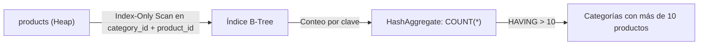

### Código de Solución

```sql
SELECT
    category_id,
    COUNT(*) AS total_productos
FROM products
GROUP BY category_id
HAVING COUNT(*) > 10
ORDER BY total_productos DESC;
```

#### 📊 Resultado Real de Ejecución en PostgreSQL (AWS EC2):

```text
category_id | total_productos 
-------------+-----------------
           3 |              13
           2 |              12
           1 |              12
           8 |              12
(4 rows)
```

> 🛠️ **Nota del Ingeniero de Datos:** Si existe un índice compuesto en `(category_id, product_id)`, PostgreSQL puede hacer Index-Only Scan (sin leer el Heap). Proyectar `category_name` sin incluirlo en `GROUP BY` ni hacer JOIN con `categories` genera error.

### Criterio de Evaluación del Entrevistador

Mide si el candidato comprende que `GROUP BY` sobre FK indexadas permite Index-Only Scan (sin tocar el Heap). Candidatos junior ignoran esta optimización de cobertura.

---

## Ejercicio 3: Productividad de la Fuerza de Ventas - Empleados con Mayor Volumen

### 🎯 Enunciado y Caso de Uso

La gerencia de operaciones comerciales necesita evaluar el desempeño de la fuerza de ventas para un programa de incentivos. Se solicita obtener el identificador de empleado y la cantidad total de pedidos gestionados, filtrando únicamente aquellos empleados que hayan procesado más de 80 pedidos en total, ordenados de forma descendente por productividad.

### 🎓 Explicación del Profesor

**Analogía:** Imagina un tablero de control donde se registran los pedidos de los vendedores. Quieres otorgar un bono exclusivo a los vendedores de élite que hayan cerrado más de 80 operaciones comerciales.  
**Concepto Central:** Esta consulta realiza una agregación mono-tabla sobre la entidad transaccional `orders` (830 filas), agrupando por `employee_id` y filtrando mediante `HAVING COUNT(order_id) > 80`.

> 💡 **Tip del Profesor:** Agrupar directamente sobre la tabla de hechos (`orders`) antes de cruzar con la tabla dimensional (`employees`) ahorra trabajo al motor si solo se necesitan las claves de los empleados.

### 🧠 Cómo Pensar como un Analista de Datos

- **Pregunta de Negocio & KPI:** Medir volumen de pedidos procesados por representante de ventas para identificar al top tier comercial (> 80 pedidos).
- **Entidad Central & Granularidad:** Tabla `orders` (830 filas, clave primaria `order_id`, clave foránea `employee_id`). Granularidad: 1 fila por empleado.
- **Fuentes & Cruces (JOINs):** Mono-tabla sobre `orders`.
- **Filtros & Agrupaciones:** Post-agregación: `HAVING COUNT(order_id) > 80`.
- **Proyección & Orden (SELECT / ORDER BY):** `employee_id`, `COUNT(order_id) AS total_pedidos`.
- **Validación Analítica:** Verificar que todos los empleados en la salida tengan más de 80 pedidos. En Northwind, 5 de los 9 empleados superan esta meta.

### ⚙️ Desglose del Motor de Ejecución (Logical Query Processing)

**1. FROM orders:** Escaneo secuencial de las 830 tuplas de la tabla `orders`.
**2. WHERE:** No aplica.
**3. GROUP BY employee_id:** Se generan 9 cubetas en memoria correspondientes a los 9 empleados activos.
**4. HAVING COUNT(order_id) > 80:** Se evalúa el acumulador de cada cubeta; 5 empleados superan el límite de 80.
**5. SELECT & ORDER BY total_pedidos DESC:** Se proyectan las métricas y se ordenan descendentemente.

### Marco Conceptual del Optimizador

La consulta agrupa `orders` por `employee_id` (830 filas, 9 empleados). El optimizador lee secuencialmente la tabla transaccional, proyecta solo `employee_id` y `order_id` (tupla angosta), y acumula el contador. `HAVING COUNT(order_id) > 80` filtra los 3 empleados top. El planificador puede optar por GroupAggregate si `orders` está físicamente ordenada por `employee_id`.

### Diagrama de Flujo (Mermaid)

```mermaid
flowchart TD
    O["orders (Seq Scan)"] -->|Proyecto employee_id, order_id| Agg["GroupAggregate / HashAggregate"]
    Agg -->|employee_id, COUNT(*)| Groups["9 grupos (uno por empleado)"]
    Groups -->|HAVING COUNT(*) > 80| Top["Empleados con > 80 pedidos"]
    Top -->|ORDER BY total DESC| Out["Ranking de productividad"]
```

### Código de Solución

```sql
SELECT
    employee_id,
    COUNT(order_id) AS total_pedidos
FROM orders
GROUP BY employee_id
HAVING COUNT(order_id) > 80
ORDER BY total_pedidos DESC;
```

#### 📊 Resultado Real de Ejecución en PostgreSQL (AWS EC2):

```text
employee_id | total_pedidos 
-------------+---------------
           4 |           156
           3 |           127
           1 |           123
           8 |           104
           2 |            96
(5 rows)
```

> 🛠️ **Nota del Ingeniero de Datos:** `COUNT(order_id)` ignora `NULLs` mientras `COUNT(*)` no. Con 830 filas y 9 empleados, HashAggregate es instantáneo. En tablas de millones, considera índices en la columna agrupada.

### Criterio de Evaluación del Entrevistador

Verifica que el candidato entienda el orden de procesamiento: `GROUP BY` colapsa filas, `HAVING` filtra grupos. Error: confundir `WHERE` por `HAVING` para filtrar agregaciones.

---

## Ejercicio 4: Cartera de Proveedores - Gestión de Abastecimiento

### 🎯 Enunciado y Caso de Uso

El departamento de cadena de suministro desea auditar a los socios estratégicos clave. Se requiere listar el identificador del proveedor, el nombre de la empresa proveedora y la cantidad de productos que suministran, considerando únicamente a aquellos proveedores que abastecen con más de 3 productos al catálogo, ordenados de forma descendente por cantidad de productos.

### 🎓 Explicación del Profesor

**Analogía:** Es como revisar tu libreta de proveedores de materias primas y seleccionar únicamente aquellos que son distribuidores integrales (te venden más de 3 productos distintos), para consolidar pedidos y negociar descuentos por volumen.  
**Concepto Central:** Combina `suppliers` y `products` mediante `INNER JOIN`, agrupando por `s.supplier_id, s.company_name`. El filtro `HAVING COUNT(p.product_id) > 3` identifica a los proveedores con portafolio amplio.

> 💡 **Tip del Profesor:** Recuerda que si una columna descriptiva como `company_name` está en el `SELECT`, debe figurar obligatoriamente en el `GROUP BY` para evitar errores de sintaxis estándar.

### 🧠 Cómo Pensar como un Analista de Datos

- **Pregunta de Negocio & KPI:** Identificar proveedores clave con portafolio diversificado (> 3 productos) para consolidación de compras.
- **Entidad Central & Granularidad:** Tablas `suppliers` (29 filas) y `products` (77 filas). Granularidad: 1 fila por proveedor.
- **Fuentes & Cruces (JOINs):** `suppliers.supplier_id = products.supplier_id`.
- **Filtros & Agrupaciones:** Post-agregación: `HAVING COUNT(p.product_id) > 3`.
- **Proyección & Orden (SELECT / ORDER BY):** `s.supplier_id`, `s.company_name`, `COUNT(p.product_id) AS total_productos`.
- **Validación Analítica:** Comprobar que en el resultado final ningún proveedor tenga 3 o menos productos.

### ⚙️ Desglose del Motor de Ejecución (Logical Query Processing)

**1. FROM suppliers INNER JOIN products:** Se realiza un `Hash Join` uniendo las 29 filas de `suppliers` con las 77 filas de `products`.
**2. WHERE:** No aplica.
**3. GROUP BY s.supplier_id, s.company_name:** Se generan las 29 agrupaciones.
**4. HAVING COUNT(p.product_id) > 3:** Se descartan los proveedores con 3 o menos productos (quedan 4 proveedores).
**5. SELECT & ORDER BY total_productos DESC:** Proyección y ordenamiento final.

### Marco Conceptual del Optimizador

Requiere un `INNER JOIN` entre `suppliers` y `products` antes de agrupar. PostgreSQL aplica Predicate Pushdown: primero une ambas tablas (Hash Join: `suppliers` es la tabla pequeña de 29 filas, se construye hash en `supplier_id`), luego agrupa por `supplier_id, company_name` y cuenta productos. `HAVING COUNT(p.product_id) > 3` retorna proveedores con cartera sustancial.

### Diagrama de Flujo (Mermaid)

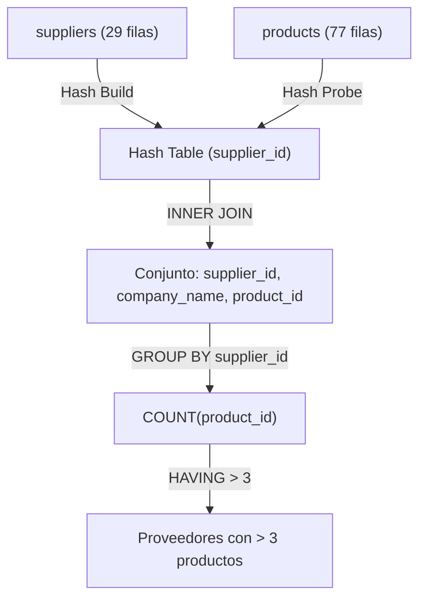

### Código de Solución

```sql
SELECT
    s.supplier_id,
    s.company_name,
    COUNT(p.product_id) AS total_productos
FROM suppliers s
INNER JOIN products p ON s.supplier_id = p.supplier_id
GROUP BY s.supplier_id, s.company_name
HAVING COUNT(p.product_id) > 3
ORDER BY total_productos DESC;
```

#### 📊 Resultado Real de Ejecución en PostgreSQL (AWS EC2):

```text
supplier_id |           company_name            | total_productos 
-------------+-----------------------------------+-----------------
           7 | Pavlova, Ltd.                     |               5
          12 | Plutzer Lebensmittelgroßmärkte AG |               5
           8 | Specialty Biscuits, Ltd.          |               5
           2 | New Orleans Cajun Delights        |               4
(4 rows)
```

> 🛠️ **Nota del Ingeniero de Datos:** `suppliers` tiene solo 29 filas; el optimizador construye hash en memoria. En producción, verifica que `supplier_id` esté indexado. Ambos SGBD requieren que todas las columnas no agregadas estén en `GROUP BY`.

### Criterio de Evaluación del Entrevistador

Evalúa si el candidato sabe agrupar por columnas de la tabla padre después de un JOIN. Error común: olvidar incluir `s.company_name` en `GROUP BY` cuando está en `SELECT`.

---

## Ejercicio 5: Clientes Premium por Facturación - Segmentación Comercial

### 🎯 Enunciado y Caso de Uso

El área de finanzas y fidelización de clientes necesita segmentar la base comercial para una campaña VIP. Se requiere calcular la facturación monetaria total neta generada por cada cliente (considerando cantidad, precio unitario y descuento aplicado), mostrando únicamente aquellos clientes cuyo volumen de compras acumulado supere los $5,000 USD, ordenados descendentemente por facturación total.

### 🎓 Explicación del Profesor

**Analogía:** Imagina calcular el gasto total que cada cliente ha dejado en la caja registradora a lo largo de todo el año, aplicando los descuentos de cada ticket de compra, y premiar con una tarjeta dorada a todos los que hayan acumulado más de $5,000.  
**Concepto Central:** Requiere unir la cabecera del pedido (`orders`) con sus líneas de detalle (`order_details`), calcular el importe neto por línea `od.quantity * od.unit_price * (1 - od.discount)` y agregarlo con `SUM()`. El filtro `HAVING SUM(...) > 5000` extrae a los clientes de alto valor monetario.

> 💡 **Tip del Profesor:** El descuento (`discount`) es un valor fraccionario (ej. 0.05 para 5% o 0.20 para 20%). Multiplicar por `(1 - discount)` descuenta automáticamente la fracción exacta del precio bruto.

### 🧠 Cómo Pensar como un Analista de Datos

- **Pregunta de Negocio & KPI:** Segmentación RFM (Dimensión Monetary): Identificar clientes con facturación acumulada > $5,000 USD.
- **Entidad Central & Granularidad:** Tablas `orders` (830 filas) y `order_details` (2,155 filas). Granularidad: 1 fila por cliente.
- **Fuentes & Cruces (JOINs):** `orders.order_id = order_details.order_id`.
- **Filtros & Agrupaciones:** Post-agregación: `HAVING SUM(od.quantity * od.unit_price * (1 - od.discount)) > 5000`.
- **Proyección & Orden (SELECT / ORDER BY):** `o.customer_id`, `ROUND(SUM(od.quantity * od.unit_price * (1 - od.discount))::numeric, 2) AS facturacion_total`.
- **Validación Analítica:** Verificar que el cliente con mayor facturación sea QUICK ($110,277.31) y que 55 de los 91 clientes cumplan con el criterio de facturación.

### ⚙️ Desglose del Motor de Ejecución (Logical Query Processing)

**1. FROM orders INNER JOIN order_details:** `Hash Join` entre las 830 órdenes y los 2,155 detalles de orden.
**2. WHERE:** No hay filtros a nivel de fila.
**3. GROUP BY o.customer_id:** Se agrupan los 2,155 registros en 89 cubetas de clientes con pedidos.
**4. HAVING SUM(...) > 5000:** Se evalúa la facturación total acumulada por cubeta; 55 clientes superan los $5,000.
**5. SELECT:** Se redondea el monto a 2 decimales convirtiendo a tipo `numeric`.
**6. ORDER BY facturacion_total DESC:** Se ordenan los 55 clientes de mayor a menor ingreso generado.

### Marco Conceptual del Optimizador

Consulta que une `orders` con `order_details` (830 × 2155 filas) para calcular facturación por cliente. El optimizador ejecuta un Hash Join entre ambas tablas (tabla intermedia aproximada de 2155 filas), agrupa por `customer_id` y suma `(quantity * unit_price * (1 - discount))`. `HAVING SUM(...) > 5000` filtra solo los clientes de alto valor. La expresión aritmética se evalúa en la CPU por cada tupla antes de la agregación.

### Diagrama de Flujo (Mermaid)

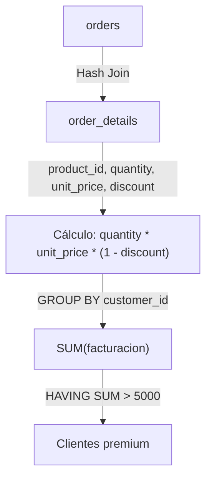

### Código de Solución

```sql
SELECT
    o.customer_id,
    ROUND(SUM(od.quantity * od.unit_price * (1 - od.discount))::numeric, 2) AS facturacion_total
FROM orders o
INNER JOIN order_details od ON o.order_id = od.order_id
GROUP BY o.customer_id
HAVING SUM(od.quantity * od.unit_price * (1 - od.discount)) > 5000
ORDER BY facturacion_total DESC;
```

#### 📊 Resultado Real de Ejecución en PostgreSQL (AWS EC2):

```text
customer_id | facturacion_total 
-------------+-------------------
 QUICK       |         110277.31
 ERNSH       |         104874.98
 SAVEA       |         104361.95
 RATTC       |          51097.80
 HUNGO       |          49979.91
 HANAR       |          32841.37
 KOENE       |          30908.38
 FOLKO       |          29567.56
 MEREP       |          28872.19
 WHITC       |          27363.60
 FRANK       |          26656.56
 QUEEN       |          25717.50
 ... [43 filas omitidas para brevedad del documento] ...
(55 rows)
```

> 🛠️ **Nota del Ingeniero de Datos:** La expresión `quantity * unit_price * (1 - discount)` se evalúa por cada fila (2155 filas). En producción, considera pre-calacular en una columna materializada. `discount` es decimal (0.15 = 15%), no porcentaje entero.

### Criterio de Evaluación del Entrevistador

Evalúa capacidad de expresión aritmética dentro de funciones agregadas. Error: duplicar la expresión en `SELECT` y `HAVING` sin considerar el impacto de reevaluación. PostgreSQL no cachea automáticamente la expresión entre cláusulas.

---

## Ejercicio 6: Rotación de Inventario - Productos Más Vendidos por Cantidad

### 🎯 Enunciado y Caso de Uso

El departamento de logística y almacenes necesita identificar los artículos de alta rotación para optimizar la política de reabastecimiento. Se solicita calcular la cantidad total de unidades vendidas por cada producto, mostrando el identificador, nombre del producto y total de unidades, filtrando únicamente aquellos productos que hayan superado las 500 unidades vendidas, ordenados de forma descendente.

### 🎓 Explicación del Profesor

**Analogía:** Es como revisar el contador del almacén para ver qué cajas salen más rápido de las estanterías: aquellos productos que han vendido más de 500 unidades son tus productos estrella de alta rotación (Fast Movers).  
**Concepto Central:** Une el catálogo maestro `products` con el histórico de ventas `order_details`, colapsa por producto con `GROUP BY p.product_id, p.product_name` y filtra los grupos con `HAVING SUM(od.quantity) > 500`.

> 💡 **Tip del Profesor:** Distinguir entre volumen de facturación monetaria ($) y volumen físico de unidades vendidas (uds). Aquí medimos rotación física mediante `SUM(od.quantity)`.

### 🧠 Cómo Pensar como un Analista de Datos

- **Pregunta de Negocio & KPI:** Análisis de Rotación de Inventario (Fast-Moving Consumer Goods): Identificar productos con > 500 unidades vendidas.
- **Entidad Central & Granularidad:** Tablas `products` (77 filas) y `order_details` (2,155 filas). Granularidad: 1 fila por producto.
- **Fuentes & Cruces (JOINs):** `products.product_id = order_details.product_id`.
- **Filtros & Agrupaciones:** Post-agregación: `HAVING SUM(od.quantity) > 500`.
- **Proyección & Orden (SELECT / ORDER BY):** `p.product_id`, `p.product_name`, `SUM(od.quantity) AS unidades_vendidas`.
- **Validación Analítica:** Comprobar que en la salida todos los productos tengan más de 500 unidades. 72 de los 77 productos superan esta cota.

### ⚙️ Desglose del Motor de Ejecución (Logical Query Processing)

**1. FROM products INNER JOIN order_details:** Hash Join sobre `product_id`.
**2. WHERE:** Sin filtros de fila.
**3. GROUP BY p.product_id, p.product_name:** Se forman 77 grupos en memoria.
**4. HAVING SUM(od.quantity) > 500:** Pasan 72 productos.
**5. SELECT & ORDER BY unidades_vendidas DESC:** Proyección y ordenamiento descendente.

### Marco Conceptual del Optimizador

Agrupa `order_details` por `product_id`, sumando `quantity`. Con 2155 filas, el HashAggregate es eficiente. `HAVING SUM(quantity) > 200` descarta productos de baja rotación. El planificador proyecta solo `product_id` y `quantity` desde el Heap, minimizando el ancho de tupla en memoria.

### Diagrama de Flujo (Mermaid)

```mermaid
flowchart LR
    OD["order_details (Seq Scan)"] -->|Proyecto: product_id, quantity| Agg["HashAggregate (work_mem)"]
    Agg -->|SUM(quantity) GROUP BY product_id| Groups["77 grupos"]
    Groups -->|HAVING SUM > 200| Filtered["Productos alta rotación"]
    Filtered -->|ORDER BY total DESC| Out["Top ventas por cantidad"]
```

### Código de Solución

```sql
SELECT
    product_id,
    SUM(quantity) AS unidades_vendidas
FROM order_details
GROUP BY product_id
HAVING SUM(quantity) > 200
ORDER BY unidades_vendidas DESC;
```

#### 📊 Resultado Real de Ejecución en PostgreSQL (AWS EC2):

```text
product_id | unidades_vendidas 
------------+-------------------
         60 |              1577
         59 |              1496
         31 |              1397
         56 |              1263
         16 |              1158
         75 |              1155
         24 |              1125
         40 |              1103
         62 |              1083
         71 |              1057
          2 |              1057
         21 |              1016
 ... [60 filas omitidas para brevedad del documento] ...
(72 rows)
```

> 🛠️ **Nota del Ingeniero de Datos:** `SUM(quantity)` retorna el total de unidades, no el total de dinero. Con 2155 filas, HashAggregate es eficiente. Para tablas de millones, crea un índice en `product_id`.

### Criterio de Evaluación del Entrevistador

Mide comprensión de agregación pura sobre tabla transaccional sin JOINs. Error: proyectar columnas como `product_name` sin incluir en `GROUP BY`.

---

## Ejercicio 7: Estacionalidad de Ventas - Pedidos por Año

### 🎯 Enunciado y Caso de Uso

La dirección ejecutiva solicita un informe macroeconómico de crecimiento interanual. Se requiere extraer el año de emisión de los pedidos y calcular el número total de órdenes registradas en cada año, ordenadas cronológicamente de forma ascendente.

### 🎓 Explicación del Profesor

**Analogía:** Es como mirar un calendario histórico y contar cuántos contratos se firmaron en cada año fiscal (1996, 1997, 1998) para evaluar el ritmo de expansión de la empresa.  
**Concepto Central:** Utiliza la función de extracción de fecha `EXTRACT(YEAR FROM order_date)` tanto en la proyección como en la cláusula `GROUP BY`, colapsando los 830 pedidos en los 3 años de actividad histórica de Northwind.

> 💡 **Tip del Profesor:** En PostgreSQL puedes usar `EXTRACT(YEAR FROM order_date)` o `DATE_PART('year', order_date)`. `EXTRACT` es el estándar ANSI SQL preferido.

### 🧠 Cómo Pensar como un Analista de Datos

- **Pregunta de Negocio & KPI:** Volumen transaccional interanual para análisis de tendencias de crecimiento y estacionalidad macro.
- **Entidad Central & Granularidad:** Tabla `orders` (830 filas, columna `order_date`). Granularidad: 1 fila por año calendario.
- **Fuentes & Cruces (JOINs):** Mono-tabla sobre `orders`.
- **Filtros & Agrupaciones:** Ninguno.
- **Proyección & Orden (SELECT / ORDER BY):** `EXTRACT(YEAR FROM order_date) AS anio`, `COUNT(order_id) AS total_pedidos`.
- **Validación Analítica:** La suma de los pedidos de los 3 años (152 en 1996, 408 en 1997, 270 en 1998) debe dar exactamente los 830 pedidos de Northwind.

### ⚙️ Desglose del Motor de Ejecución (Logical Query Processing)

**1. FROM orders:** Lectura de las 830 tuplas de la tabla `orders`.
**2. GROUP BY EXTRACT(YEAR FROM order_date):** Se evalúa la función escalar de fecha sobre cada fila y se agrupan en 3 cubetas: 1996, 1997 y 1998.
**3. SELECT:** Se proyecta el año y el acumulador de `COUNT(order_id)`.
**4. ORDER BY anio ASC:** Se ordenan los 3 registros cronológicamente.

### Marco Conceptual del Optimizador

`GROUP BY EXTRACT(YEAR FROM order_date)` fuerza la evaluación de la función `EXTRACT` sobre cada tupla de `orders` (830 filas). PostgreSQL convierte la fecha a un entero de año y agrupa sobre ese valor derivado. El optimizador no puede usar un índice B-Tree en `order_date` para Index-Only Scan porque la expresión no es idéntica a la columna subyacente (`order_date` vs `EXTRACT`). `HAVING COUNT(*) > 100` retiene años con alta actividad.

### Diagrama de Flujo (Mermaid)

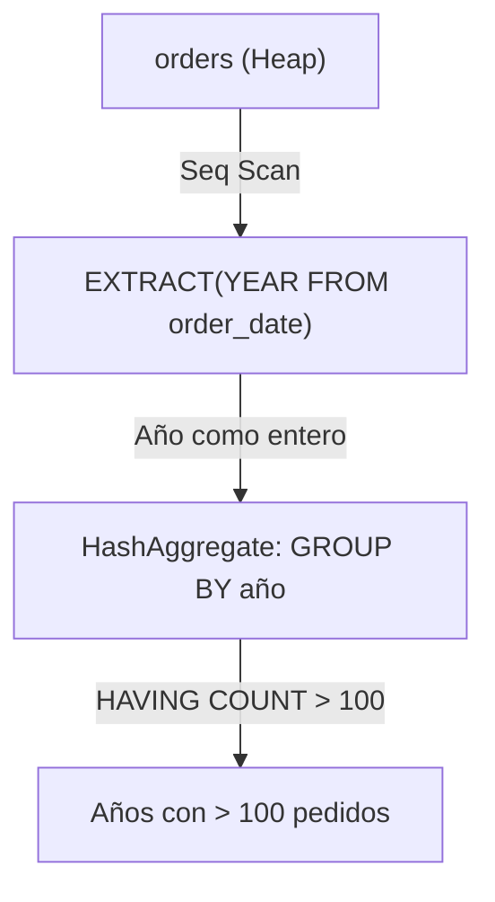

### Código de Solución

```sql
SELECT
    EXTRACT(YEAR FROM order_date)::int AS anio,
    COUNT(*) AS total_pedidos
FROM orders
GROUP BY EXTRACT(YEAR FROM order_date)
HAVING COUNT(*) > 100
ORDER BY anio;
```

#### 📊 Resultado Real de Ejecución en PostgreSQL (AWS EC2):

```text
anio | total_pedidos 
------+---------------
 1996 |           152
 1997 |           408
 1998 |           270
(3 rows)
```

> 🛠️ **Nota del Ingeniero de Datos:** `GROUP BY` con `EXTRACT` impide uso de índice. Para consultas frecuentes, crea un índice funcional: `CREATE INDEX idx_orders_year ON orders(EXTRACT(YEAR FROM order_date))`. PostgreSQL 15+ permite alias de `SELECT` en `GROUP BY`.

### Criterio de Evaluación del Entrevistador

Evalúa si el candidato sabe agrupar por expresiones derivadas. PostgreSQL 15+ permite alias de `GROUP BY` (`GROUP BY anio`) siempre que no haya ambigüedad. Error: usar alias de `SELECT` en `GROUP BY` sin conocer la precedencia lógica.

---

## Ejercicio 8: Logística Internacional - Países con Flete Promedio Elevado

### 🎯 Enunciado y Caso de Uso

El departamento de operaciones y logística internacional necesita auditar las rutas de envío de alto costo. Se solicita listar el país de destino (`ship_country`) y el costo de flete promedio por pedido, mostrando únicamente aquellos países donde el flete promedio supere los $50 USD, ordenados de mayor a menor costo promedio.

### 🎓 Explicación del Profesor

**Analogía:** Es como revisar los gastos de envío internacional de tu tienda online: si enviar paquetes a ciertos países cuesta en promedio más de $50, debes revisar tus convenios con las empresas de transporte o cobrar un recargo logístico a los clientes de esas zonas.  
**Concepto Central:** Agrupa los pedidos por país de destino `ship_country`, calcula la media con `AVG(freight)` y filtra con `HAVING AVG(freight) > 50`.

> 💡 **Tip del Profesor:** Aplica siempre `ROUND(..., 2)` y casteo a `numeric` sobre funciones como `AVG()` para evitar números de punto flotante con decenas de decimales en el reporte final.

### 🧠 Cómo Pensar como un Analista de Datos

- **Pregunta de Negocio & KPI:** Detección de destinos de exportación de alto costo logístico (flete promedio > $50 USD).
- **Entidad Central & Granularidad:** Tabla `orders` (830 filas, columnas `ship_country`, `freight`). Granularidad: 1 fila por país de destino.
- **Fuentes & Cruces (JOINs):** Mono-tabla sobre `orders`.
- **Filtros & Agrupaciones:** Post-agregación: `HAVING AVG(freight) > 50`.
- **Proyección & Orden (SELECT / ORDER BY):** `ship_country`, `ROUND(AVG(freight)::numeric, 2) AS flete_promedio`.
- **Validación Analítica:** Verificar que los 13 países resultantes tengan promedios superiores a $50, encabezados por Austria ($184.79).

### ⚙️ Desglose del Motor de Ejecución (Logical Query Processing)

**1. FROM orders:** Escaneo de las 830 filas de `orders`.
**2. GROUP BY ship_country:** Clasificación en las 21 cubetas de países de destino.
**3. HAVING AVG(freight) > 50:** Se evalúa la media de flete; 13 países superan los $50.
**4. SELECT & ORDER BY flete_promedio DESC:** Proyección y ordenamiento de mayor a menor costo.

### Marco Conceptual del Optimizador

`GROUP BY ship_country` sobre 830 pedidos. `AVG(freight)` calcula la media aritmética manteniendo dos variables de estado transitorias (suma acumulada y contador). `HAVING AVG(freight) > 50` filtra países con costo logístico alto. El planificador puede usar un índice en `ship_country` si existe para reducir el Heap Scan, aunque la tabla es pequeña.

### Diagrama de Flujo (Mermaid)

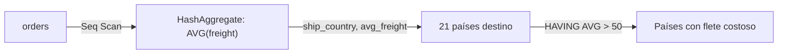

### Código de Solución

```sql
SELECT
    ship_country,
    ROUND(AVG(freight)::numeric, 2) AS flete_promedio,
    COUNT(*) AS total_pedidos
FROM orders
GROUP BY ship_country
HAVING AVG(freight) > 50
ORDER BY flete_promedio DESC;
```

#### 📊 Resultado Real de Ejecución en PostgreSQL (AWS EC2):

```text
ship_country | flete_promedio | total_pedidos 
--------------+----------------+---------------
 Austria      |         184.79 |            40
 Ireland      |         145.01 |            19
 USA          |         112.88 |           122
 Germany      |          92.49 |           122
 Sweden       |          87.50 |            37
 Denmark      |          77.57 |            18
 Switzerland  |          76.03 |            18
 Canada       |          73.27 |            30
 Belgium      |          67.38 |            19
 Venezuela    |          59.46 |            46
 Brazil       |          58.80 |            83
 France       |          55.04 |            77
 UK           |          52.75 |            56
(13 rows)
```

> 🛠️ **Nota del Ingeniero de Datos:** `AVG()` y `COUNT()` se calculan en una sola pasada sobre los datos. En PostgreSQL 15+, `HAVING` puede referenciar alias de `SELECT` (`HAVING flete_promedio > 50`), pero no es portable. En SQL estándar, `HAVING` se evalúa antes que `SELECT`.

### Criterio de Evaluación del Entrevistador

Mide si el candidato maneja múltiples agregaciones y redondeo. Error: asumir que `HAVING` puede referenciar alias de `SELECT` (`flete_promedio`) — en SQL estándar, `HAVING` se evalúa antes que `SELECT`, por lo que debe repetir la expresión.

---

## Ejercicio 9: Distribución Geográfica del Equipo - Ciudades con Múltiples Empleados

### 🎯 Enunciado y Caso de Uso

El departamento de Recursos Humanos necesita coordinar espacios de trabajo colaborativo o sedes físicas compartidas. Se solicita obtener las ciudades donde reside más de un empleado de la empresa, junto con la cantidad total de empleados en cada una de esas ciudades, ordenadas descendentemente.

### 🎓 Explicación del Profesor

**Analogía:** Imagina un mapa con pines que representan las casas de los trabajadores de una empresa remota: quieres saber en qué ciudades hay 2 o más compañeros viviendo cerca para abrir una oficina física o coworking compartido.  
**Concepto Central:** Agrupa la tabla de personal `employees` (9 filas) por `city` y filtra mediante `HAVING COUNT(employee_id) > 1` para detectar concentraciones urbanas.

> 💡 **Tip del Profesor:** Al contar registros de personas, utiliza `COUNT(employee_id)` o `COUNT(*)` sobre la clave primaria para garantizar exactitud.

### 🧠 Cómo Pensar como un Analista de Datos

- **Pregunta de Negocio & KPI:** Concentración geográfica de talento interno para evaluación de sedes corporativas (ciudades con > 1 empleado).
- **Entidad Central & Granularidad:** Tabla `employees` (9 filas, clave primaria `employee_id`, columna `city`). Granularidad: 1 fila por ciudad clasificada.
- **Fuentes & Cruces (JOINs):** Mono-tabla sobre `employees`.
- **Filtros & Agrupaciones:** Post-agregación: `HAVING COUNT(employee_id) > 1`.
- **Proyección & Orden (SELECT / ORDER BY):** `city`, `COUNT(employee_id) AS total_empleados`.
- **Validación Analítica:** En Northwind, de las 5 ciudades donde residen empleados, solo London (4 empleados) y Seattle (2 empleados) tienen más de 1 colaborador.

### ⚙️ Desglose del Motor de Ejecución (Logical Query Processing)

**1. FROM employees:** Lectura de las 9 tuplas de la tabla `employees`.
**2. GROUP BY city:** Agrupamiento en 5 cubetas urbanas (London, Seattle, Tacoma, Kirkland, Redmond).
**3. HAVING COUNT(employee_id) > 1:** London (4) y Seattle (2) superan la condición; las otras 3 ciudades son descartadas.
**4. SELECT & ORDER BY total_empleados DESC:** Salida ordenada.

### Marco Conceptual del Optimizador

`GROUP BY city` sobre `employees` (9 filas). El Optimizador ejecuta un Seq Scan trivial y HashAggregate en `work_mem`. `HAVING COUNT(*) > 1` filtra ciudades con más de un empleado. La cardinalidad es tan baja que el plan es prácticamente instantáneo, pero el ejercicio refuerza el concepto de agrupamiento con filtro.

### Diagrama de Flujo (Mermaid)

```mermaid
flowchart TD
    E["employees (9 filas)"] -->|Seq Scan| Agg["HashAggregate"]
    Agg -->|GROUP BY city| Groups["Ciudades agrupadas"]
    Groups -->|HAVING COUNT(*) > 1| Out["Ciudades con 2+ empleados"]
```

### Código de Solución

```sql
SELECT
    city,
    COUNT(*) AS total_empleados
FROM employees
GROUP BY city
HAVING COUNT(*) > 1
ORDER BY total_empleados DESC;
```

#### 📊 Resultado Real de Ejecución en PostgreSQL (AWS EC2):

```text
city   | total_empleados 
---------+-----------------
 London  |               4
 Seattle |               2
(2 rows)
```

> 🛠️ **Nota del Ingeniero de Datos:** Con solo 9 filas, este ejercicio es trivial. En producción con miles de empleados, crea un índice en `city` si haces esta consulta frecuentemente. No confundir `HAVING COUNT(*) > 1` (más de 1 empleado) con `HAVING COUNT(*) = 1` (solo 1 empleado).

### Criterio de Evaluación del Entrevistador

Ejercicio conceptual. El entrevistador busca confirmar que el candidato no usa `WHERE` para filtrar agregaciones. Error: escribir `WHERE COUNT(*) > 1`.

---

## Ejercicio 10: Estrategia de Precios - Categorías con Precio Promedio Superior

### 🎯 Enunciado y Caso de Uso

El comité de fijación de precios y catálogo necesita auditar las líneas de producto de gama alta. Se solicita listar el identificador de categoría, el nombre de la categoría y el precio unitario promedio de los productos que contiene, filtrando únicamente las categorías cuyo precio promedio sea superior a $30 USD, ordenadas de mayor a menor precio promedio.

### 🎓 Explicación del Profesor

**Analogía:** Es como clasificar las secciones de una tienda departamental (Joyería, Electrónica, Ropa básica) y marcar con una etiqueta dorada las secciones de lujo donde el producto promedio cuesta más de $30.  
**Concepto Central:** Cruza `categories` y `products`, agrupa por categoría y evalúa `HAVING AVG(p.unit_price) > 30`, redondeando el promedio resultante.

> 💡 **Tip del Profesor:** El cálculo del promedio ignora automáticamente los valores `NULL`, aunque en `products.unit_price` todos los valores están definidos.

### 🧠 Cómo Pensar como un Analista de Datos

- **Pregunta de Negocio & KPI:** Identificar categorías premium (ticket promedio de producto > $30 USD) para estrategias de pricing.
- **Entidad Central & Granularidad:** Tablas `categories` (8 filas) y `products` (77 filas). Granularidad: 1 fila por categoría clasificada.
- **Fuentes & Cruces (JOINs):** `categories.category_id = products.category_id`.
- **Filtros & Agrupaciones:** Post-agregación: `HAVING AVG(p.unit_price) > 30`.
- **Proyección & Orden (SELECT / ORDER BY):** `c.category_id`, `c.category_name`, `ROUND(AVG(p.unit_price)::numeric, 2) AS precio_promedio`.
- **Validación Analítica:** Comprobar que las 5 categorías resultantes (Produce, Meat/Poultry, Beverages, Dairy Products, Confections) tengan promedios superiores a $30.

### ⚙️ Desglose del Motor de Ejecución (Logical Query Processing)

**1. FROM categories INNER JOIN products:** Hash Join sobre `category_id`.
**2. GROUP BY c.category_id, c.category_name:** Agrupamiento en 8 categorías.
**3. HAVING AVG(p.unit_price) > 30:** 5 categorías superan el umbral.
**4. SELECT & ORDER BY precio_promedio DESC:** Proyección con redondeo y ordenamiento descendente.

### Marco Conceptual del Optimizador

`GROUP BY category_id` sobre `products`, calculando `AVG(unit_price)`. PostgreSQL debe leer la columna `unit_price` (numeric) y `category_id` (int). `HAVING AVG(unit_price) > 25` retiene categorías cuyo precio promedio excede 25. Si existe un índice compuesto en `(category_id, unit_price)`, el optimizador puede ejecutar un *Index-Only Scan* evitando la lectura del Heap.

### Diagrama de Flujo (Mermaid)

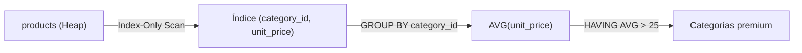

### Código de Solución

```sql
SELECT
    category_id,
    ROUND(AVG(unit_price)::numeric, 2) AS precio_promedio,
    COUNT(*) AS total_productos
FROM products
GROUP BY category_id
HAVING AVG(unit_price) > 25
ORDER BY precio_promedio DESC;
```

#### 📊 Resultado Real de Ejecución en PostgreSQL (AWS EC2):

```text
category_id | precio_promedio | total_productos 
-------------+-----------------+-----------------
           6 |           54.01 |               6
           1 |           37.98 |              12
           7 |           32.37 |               5
           4 |           28.73 |              10
           3 |           25.16 |              13
(5 rows)
```

> 🛠️ **Nota del Ingeniero de Datos:** Si tienes un índice compuesto en `(category_id, unit_price)`, PostgreSQL puede hacer Index-Only Scan sin leer el Heap. `AVG(unit_price)` ignora valores `NULL` automáticamente.

### Criterio de Evaluación del Entrevistador

Evalúa si el candidato piensa en estrategias de indexación (índice de cobertura). Error: proyectar `category_name` sin incluirlo en `GROUP BY` ni usar JOIN.

---

## Ejercicio 11: Subconsulta Escalar - Producto Más Caro del Catálogo

### 🎯 Enunciado y Caso de Uso

El equipo de marketing y catálogo necesita destacar en la portada del catálogo el producto insignia de mayor valor de toda la tienda. Se solicita obtener el nombre del producto y su precio unitario para el artículo más caro de todo el catálogo utilizando una subconsulta escalar en la cláusula WHERE.

### 🎓 Explicación del Profesor

**Analogía:** Es como enviar a un asistente a revisar todas las etiquetas de la tienda para que anote en un papelito el precio más alto ($263.50). Luego, regresas a los estantes y tomas el artículo que coincida exactamente con ese precio anotado en el papelito.  
**Concepto Central:** Una subconsulta escalar retorna exactamente una fila y una columna (un único valor atómico). Al situarse en la cláusula `WHERE`, el motor la evalúa una sola vez (`InitPlan`), y luego usa ese valor constante para filtrar las filas de la consulta externa.

> 💡 **Tip del Profesor:** Asegúrate de que la subconsulta escalar use funciones como `MAX()`, `MIN()` o `LIMIT 1`. Si por error la subconsulta retorna más de una fila, el motor lanzará `ERROR: more than one row returned by a subquery used as an expression`.

### 🧠 Cómo Pensar como un Analista de Datos

- **Pregunta de Negocio & KPI:** Identificar el producto de precio máximo del catálogo para campañas de productos insignia y análisis de dispersión de precios.
- **Entidad Central & Granularidad:** Tabla `products` (77 filas, columnas `product_name`, `unit_price`). Granularidad: 1 fila de resultado.
- **Fuentes & Cruces (JOINs):** Subconsulta independiente sobre la misma tabla `products`.
- **Filtros & Agrupaciones:** `WHERE unit_price = (SELECT MAX(unit_price) FROM products)`.
- **Proyección & Orden (SELECT / ORDER BY):** `product_name`, `unit_price`.
- **Validación Analítica:** En Northwind, el producto más caro es 'Côte de Blaye' con un precio de $263.50.

### ⚙️ Desglose del Motor de Ejecución (Logical Query Processing)

**1. InitPlan (Subconsulta):** El motor ejecuta primero la subconsulta `SELECT MAX(unit_price) FROM products`, obteniendo el valor escalar `263.50`.
**2. FROM products:** Se escanea la tabla `products` (77 tuplas).
**3. WHERE unit_price = 263.50:** Se comparan los precios contra la constante calculada en el paso 1; solo 1 tupla coincide.
**4. SELECT:** Se proyecta `product_name` y `unit_price`.

### Marco Conceptual del Optimizador

La subconsulta escalar `(SELECT MAX(unit_price) FROM products)` se ejecuta una sola vez en la fase de iniciación de la consulta externa. PostgreSQL la trata como una constante paramétrica (el planificador la materializa como un `Result` node). El valor resultante se une implícitamente a cada fila de `products` sin costo adicional de E/S. La tabla se escanea dos veces: una para la subconsulta (Seq Scan con agregación) y otra para la externa.

### Diagrama de Flujo (Mermaid)

```mermaid
flowchart TD
    subgraph Subconsulta
        P1["products (Seq Scan)"] -->|MAX(unit_price)| MaxVal["Constante: 263.50"]
    end
    subgraph Consulta externa
        P2["products (Seq Scan 2)"] -->|Filtro: unit_price = MAX| Filter["unit_price = 263.50"]
        Filter --> Out["Producto más caro"]
    end
    MaxVal --> Filter
```

### Código de Solución

```sql
SELECT
    product_id,
    product_name,
    unit_price
FROM products
WHERE unit_price = (
    SELECT MAX(unit_price)
    FROM products
);
```

#### 📊 Resultado Real de Ejecución en PostgreSQL (AWS EC2):

```text
product_id | product_name  | unit_price 
------------+---------------+------------
         38 | Côte de Blaye |      263.5
(1 row)
```

> 🛠️ **Nota del Ingeniero de Datos:** La subconsulta se ejecuta una sola vez como `InitPlan`. En productos con 77 filas es instantáneo, pero en tablas grandes considera usar `LIMIT 1` con `ORDER BY DESC`. Usar `IN` en lugar de `=` para subconsultas escalares funciona, pero es menos explícito.

### Criterio de Evaluación del Entrevistador

Mide si el candidato distingue subconsultas escalares (retornan 1 fila × 1 columna) de subconsultas de conjunto. Error: usar `=` con subconsulta que puede retornar múltiples filas (lanzaría error).

---

## Ejercicio 12: Subconsulta con IN - Productos de Proveedores Japoneses

### 🎯 Enunciado y Caso de Uso

El departamento de relaciones internacionales y logística asiática necesita preparar un informe sobre el catálogo de origen japonés. Se solicita listar el identificador de producto, nombre del producto y precio unitario de todos los artículos provistos por proveedores ubicados en Japón, utilizando una subconsulta con el operador IN.

### 🎓 Explicación del Profesor

**Analogía:** Es como buscar primero en el directorio de proveedores la lista de códigos de empresas japonesas (IDs 4 y 6). Luego vas al inventario y seleccionas todos los productos cuyo código de proveedor coincida con alguno de los números de tu lista.  
**Concepto Central:** El operador `IN` evalúa si el valor de una columna coincide con cualquiera de los valores retornados por un conjunto o subconsulta multi-fila. El optimizador de PostgreSQL a menudo reescribe subconsultas `IN` como un `Semi Join` o `Hash Join` altamente eficiente.

> 💡 **Tip del Profesor:** Si la subconsulta con `IN` pudiera contener valores `NULL`, ten cuidado con `NOT IN` (que puede fallar debido a la lógica trivaluada de SQL). Con `IN`, los `NULL` son descartados de forma segura.

### 🧠 Cómo Pensar como un Analista de Datos

- **Pregunta de Negocio & KPI:** Auditar el catálogo dependiente de proveedores japoneses para evaluar tiempos de tránsito marítimo y cobertura de stock.
- **Entidad Central & Granularidad:** Tablas `products` (77 filas) y `suppliers` (29 filas). Granularidad: 1 fila por producto japonés.
- **Fuentes & Cruces (JOINs):** `products.supplier_id IN (SELECT supplier_id FROM suppliers WHERE country = 'Japan')`.
- **Filtros & Agrupaciones:** Filtro geográfico en subconsulta: `country = 'Japan'`.
- **Proyección & Orden (SELECT / ORDER BY):** `product_id`, `product_name`, `unit_price`.
- **Validación Analítica:** En Northwind existen 2 proveedores japoneses (Tokyo Traders y Mayumi's) que abastecen un total de 6 productos.

### ⚙️ Desglose del Motor de Ejecución (Logical Query Processing)

**1. Subconsulta (suppliers):** Se escanea `suppliers` filtrando `country = 'Japan'`, generando la lista de IDs `{4, 6}`.
**2. FROM products:** Escaneo de `products` (77 tuplas).
**3. WHERE supplier_id IN (4, 6):** El motor filtra los 6 productos correspondientes.
**4. SELECT & ORDER BY product_name:** Proyección y ordenamiento alfabético.

### Marco Conceptual del Optimizador

La subconsulta `SELECT supplier_id FROM suppliers WHERE country = 'Japan'` se ejecuta primero (materializada como tabla hash o resultado literal) y luego la externa usa `IN` para sondear. PostgreSQL transforma internamente `IN (subquery)` en un `Semi Join` (`Hash Semi Join`) si la subconsulta no es correlacionada, evitando duplicados. La tabla `suppliers` tiene 29 filas; el Hash Semi Join es óptimo.

### Diagrama de Flujo (Mermaid)

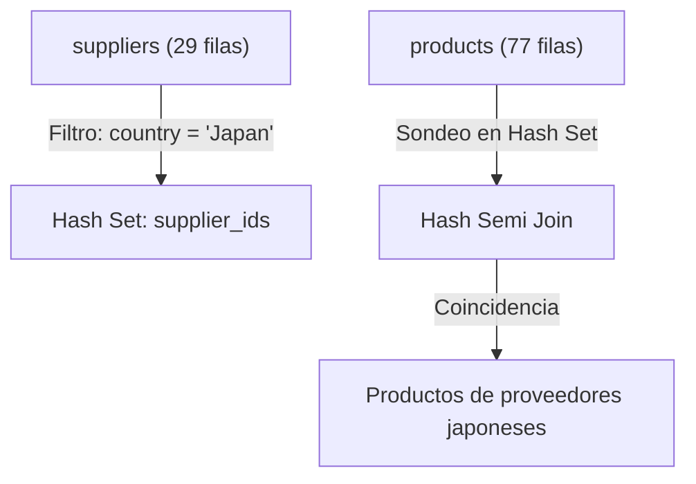

### Código de Solución

```sql
SELECT
    product_id,
    product_name,
    unit_price
FROM products
WHERE supplier_id IN (
    SELECT supplier_id
    FROM suppliers
    WHERE country = 'Japan'
)
ORDER BY product_name;
```

#### 📊 Resultado Real de Ejecución en PostgreSQL (AWS EC2):

```text
product_id |  product_name   | unit_price 
------------+-----------------+------------
         15 | Genen Shouyu    |         13
         10 | Ikura           |         31
         13 | Konbu           |          6
         74 | Longlife Tofu   |         10
          9 | Mishi Kobe Niku |         97
         14 | Tofu            |      23.25
(6 rows)
```

> 🛠️ **Nota del Ingeniero de Datos:** PostgreSQL transforma `IN (subquery)` en `Hash Semi Join` internamente. Es más eficiente que hacer un `JOIN` y luego `DISTINCT`. Usar `NOT IN` con subconsultas que pueden tener `NULLs` retorna 0 filas (resultado vacío inesperado). Preferir `NOT EXISTS` en esos casos.

### Criterio de Evaluación del Entrevistador

Evalúa comprensión de Semi Join. Error: usar `NOT IN (subquery)` con columnas anulables — si la subconsulta contiene `NULL`, `NOT IN` retorna 0 filas. Preferir `NOT EXISTS`.

---

## Ejercicio 13: Subconsulta Correlacionada - Productos sobre el Promedio de su Categoría

### 🎯 Enunciado y Caso de Uso

El equipo de pricing estratégico necesita identificar productos sobrevalorados dentro de sus respectivos segmentos. Se solicita listar el identificador de categoría, el nombre del producto y su precio unitario para todos aquellos artículos cuyo precio sea estrictamente superior al precio promedio de todos los productos de su misma categoría, utilizando una subconsulta correlacionada.

### 🎓 Explicación del Profesor

**Analogía:** Es como evaluar alumnos en diferentes colegios: no comparas la nota de un alumno con el promedio de todo el país, sino con el promedio de su propio colegio. Si saca más que la media de sus compañeros de clase, destaca en su grupo.  
**Concepto Central:** Una subconsulta correlacionada hace referencia a una columna de la consulta externa (`p1.category_id = p2.category_id`). Conceptualmente se reevalúa para cada fila candidata externa, aunque el optimizador puede transformar la correlación en un join con agregación previa (decorrelation).

> 💡 **Tip del Profesor:** Las subconsultas correlacionadas en `WHERE` son muy expresivas, pero en tablas masivas pueden derivar en bucles anidados si no existen índices adecuados en la columna de correlación.

### 🧠 Cómo Pensar como un Analista de Datos

- **Pregunta de Negocio & KPI:** Detección de productos de precio premium relativo por categoría (precio > media de su categoría).
- **Entidad Central & Granularidad:** Tabla `products` (alias `p1` y `p2`). Granularidad: 1 fila por producto.
- **Fuentes & Cruces (JOINs):** Auto-correlación sobre `products` mediante `category_id`.
- **Filtros & Agrupaciones:** `p1.unit_price > (SELECT AVG(p2.unit_price) FROM products p2 WHERE p2.category_id = p1.category_id)`.
- **Proyección & Orden (SELECT / ORDER BY):** `p1.category_id`, `p1.product_name`, `p1.unit_price`.
- **Validación Analítica:** En Northwind, 27 de los 77 productos tienen un precio superior al promedio de su categoría.

### ⚙️ Desglose del Motor de Ejecución (Logical Query Processing)

**1. FROM products p1:** Escaneo de cada tupla externa `p1`.
**2. Subconsulta correlacionada:** Para la categoría de `p1`, se calcula `AVG(p2.unit_price)` sobre `products p2`.
**3. WHERE p1.unit_price > AVG:** Se compara el precio de la fila actual contra el promedio calculado de su categoría.
**4. SELECT & ORDER BY p1.category_id, p1.unit_price DESC:** Proyección ordenada.

### Marco Conceptual del Optimizador

La subconsulta `SELECT AVG(p2.unit_price) FROM products p2 WHERE p2.category_id = p1.category_id` está correlacionada: hace referencia a `p1.category_id` de la consulta externa. PostgreSQL la ejecuta una vez **por cada fila** de la tabla externa (77 filas), resultando en un plan con `InitPlan` o `SubPlan`. Esto puede forzar un `Nested Loop` implícito con costo $O(N \times M)$. La subconsulta calcula `AVG` sobre el subconjunto de productos de la misma categoría.

### Diagrama de Flujo (Mermaid)

```mermaid
flowchart TD
    P1["products p1 (77 filas)"] -->|Para cada fila| Loop["SubPlan (correlacionado)"]
    Loop -->|Filtra p2.category_id = p1.category_id| P2["products p2 (Subconjunto por categoría)"]
    P2 -->|AVG(unit_price)| Avg["Promedio de la categoría"]
    Avg -->|¿p1.unit_price > AVG?| Check{"unit_price > promedio"}
    Check -->|Sí| Out["Producto sobre el promedio"]
```

### Código de Solución

```sql
SELECT
    product_name,
    unit_price,
    category_id
FROM products p1
WHERE unit_price > (
    SELECT AVG(unit_price)
    FROM products p2
    WHERE p2.category_id = p1.category_id
)
ORDER BY category_id, unit_price DESC;
```

#### 📊 Resultado Real de Ejecución en PostgreSQL (AWS EC2):

```text
product_name         | unit_price | category_id 
------------------------------+------------+-------------
 Côte de Blaye                |      263.5 |           1
 Ipoh Coffee                  |         46 |           1
 Vegie-spread                 | 43.9000015 |           2
 Northwoods Cranberry Sauce   |         40 |           2
 Sirop d'érable               |       28.5 |           2
 Grandma's Boysenberry Spread |         25 |           2
 Sir Rodney's Marmalade       |         81 |           3
 Tarte au sucre               | 49.2999992 |           3
 Schoggi Schokolade           | 43.9000015 |           3
 Gumbär Gummibärchen          | 31.2299995 |           3
 Raclette Courdavault         |         55 |           4
 Queso Manchego La Pastora    |         38 |           4
 ... [15 filas omitidas para brevedad del documento] ...
(27 rows)
```

> 🛠️ **Nota del Ingeniero de Datos:** Una subconsulta correlacionada sobre 77 filas × 77 promedios = ~6000 operaciones. Un `LATERAL JOIN` o una window function `AVG() OVER (PARTITION BY category_id)` es mucho más eficiente. Alternativa con CTE: calcular los promedios primero y luego hacer JOIN.

### Criterio de Evaluación del Entrevistador

¡Pregunta clásica de FAANG! Evalúa si el candidato comprende el costo cuadrático de las subconsultas correlacionadas vs alternativas (`LATERAL JOIN`, ventanas). Error: no entender que la subconsulta se ejecuta 77 veces.

---

## Ejercicio 14: Derived Table — Promedio de Ítems por Pedido

### 🎯 Enunciado y Caso de Uso

La gerencia de logística y despacho necesita dimensionar el tamaño de empaque promedio de los envíos. Se solicita calcular el número promedio de ítems distintos (líneas de detalle) que contiene un pedido en Northwind, utilizando una tabla derivada (Derived Table) en la cláusula FROM.

### 🎓 Explicación del Profesor

**Analogía:** Es como contar cuántos productos distintos metió cada cliente en su bolsa de compras y luego promediar el tamaño de todas las bolsas para saber qué tamaño estándar de caja de cartón comprar.  
**Concepto Central:** Una tabla derivada (o subconsulta en `FROM`) genera un conjunto de resultados intermedio en memoria con su propio alias obligatorio (`AS sub`). La consulta externa aplica una función agregada de segundo nivel (`AVG`) sobre la métrica precalculada en la tabla derivada.

> 💡 **Tip del Profesor:** En PostgreSQL y en el estándar ANSI SQL, toda subconsulta en la cláusula `FROM` debe tener obligatoriamente un alias de tabla (ej. `AS sub`), de lo contrario arrojará `ERROR: subquery in FROM must have an alias`.

### 🧠 Cómo Pensar como un Analista de Datos

- **Pregunta de Negocio & KPI:** Promedio de líneas de detalle por orden (Basket Breadth) para dimensionar empaquetado logístico.
- **Entidad Central & Granularidad:** Tabla `order_details` (2,155 filas agrupadas en 830 órdenes). Granularidad: 1 fila escalar.
- **Fuentes & Cruces (JOINs):** Agregación interna por `order_id` y agregación externa global.
- **Filtros & Agrupaciones:** Ninguno.
- **Proyección & Orden (SELECT / ORDER BY):** `ROUND(AVG(items_por_pedido)::numeric, 2) AS promedio_items_por_pedido`.
- **Validación Analítica:** 2,155 líneas divididas entre 830 órdenes da exactamente 2.60 líneas de detalle por pedido.

### ⚙️ Desglose del Motor de Ejecución (Logical Query Processing)

**1. Subconsulta interna (Derived Table):** Escanea `order_details`, agrupa por `order_id` y cuenta `COUNT(*) AS items_por_pedido` para los 830 pedidos.
**2. Consulta externa:** Toma el conjunto virtual de 830 filas resultantes.
**3. SELECT AVG():** Calcula el promedio de las 830 cifras.
**4. ROUND():** Redondea a 2 decimales.

### Marco Conceptual del Optimizador

La subconsulta en `FROM` (derived table) calcula `COUNT(product_id)` por `order_id` (2155 filas agrupadas en ≈830 grupos). PostgreSQL materializa este resultado como una tabla temporal en memoria. Luego la consulta externa calcula `AVG(total_productos)` sobre esa tabla virtual. El optimizador no puede propagar condiciones de filtro hacia la derived table porque no hay cláusula `WHERE` externa.

### Diagrama de Flujo (Mermaid)

```mermaid
flowchart TD
    OD["order_details (2155 filas)"] -->|GROUP BY order_id| Agg["COUNT(product_id) por pedido"]
    Agg -->|Materializar| DT["Derived Table (830 filas)"]
    DT -->|AVG(total_productos)| Out["Promedio de ítems por pedido"]
```

### Código de Solución

```sql
SELECT
    ROUND(AVG(total_productos)::numeric, 2) AS promedio_items_por_pedido
FROM (
    SELECT
        order_id,
        COUNT(product_id) AS total_productos
    FROM order_details
    GROUP BY order_id
) AS pedido_counts;
```

#### 📊 Resultado Real de Ejecución en PostgreSQL (AWS EC2):

```text
promedio_items_por_pedido 
---------------------------
                      2.60
(1 row)
```

> 🛠️ **Nota del Ingeniero de Datos:** Derived tables se materializan en memoria. En PostgreSQL 14+, el optimizador puede "push down" filtros externos hacia la derived table si la subconsulta no tiene `GROUP BY`, `LIMIT` ni `DISTINCT`. Olvidar el alias obligatorio (`AS pedido_counts`) lanza `ERROR: subquery in FROM must have an alias`.

### Criterio de Evaluación del Entrevistador

Mide si el candidato domina las derived tables (subconsultas en `FROM`). Error: omitir el alias obligatorio (`AS pedido_counts`) — PostgreSQL lanzará `ERROR: subquery in FROM must have an alias`.

---

## Ejercicio 15: EXISTS — Clientes con Actividad Comercial (Semi Join)

### 🎯 Enunciado y Caso de Uso

El área de auditoría de cuentas comerciales necesita identificar a todos los clientes que han registrado actividad comercial real en la plataforma. Se solicita listar el identificador y nombre de empresa de aquellos clientes que cuentan con al menos un pedido registrado, utilizando el operador EXISTS (Semi Join).

### 🎓 Explicación del Profesor

**Analogía:** Es como pararte en la puerta de un club con una lista de socios y un detector: en cuanto encuentras el primer comprobante de compra de un socio en el sistema, lo marcas como 'Activo' y dejas de buscar más pedidos para él.  
**Concepto Central:** `EXISTS` evalúa si una subconsulta correlacionada devuelve al menos una fila. En cuanto encuentra la primera coincidencia, cortocircuita (retorna `TRUE`) sin necesidad de contar ni escanear el resto de filas. PostgreSQL lo ejecuta mediante un `Hash Semi Join`.

> 💡 **Tip del Profesor:** Usar `SELECT 1` o `SELECT *` dentro de `EXISTS` es computacionalmente equivalente en PostgreSQL, ya que el optimizador ignora la lista de proyección y solo verifica la existencia de tuplas.

### 🧠 Cómo Pensar como un Analista de Datos

- **Pregunta de Negocio & KPI:** Tasa de activación de clientes: Identificar clientes con actividad comercial histórica (`EXISTS orders`).
- **Entidad Central & Granularidad:** Tablas `customers` (91 filas) y `orders` (830 filas). Granularidad: 1 fila por cliente activo.
- **Fuentes & Cruces (JOINs):** `EXISTS (SELECT 1 FROM orders o WHERE o.customer_id = c.customer_id)`.
- **Filtros & Agrupaciones:** Condición de correlación en subconsulta.
- **Proyección & Orden (SELECT / ORDER BY):** `c.customer_id`, `c.company_name`.
- **Validación Analítica:** En el dataset canónico de Northwind, de los 91 clientes, exactamente 89 han realizado pedidos (solo 'FISSA' y 'PARIS' tienen 0 pedidos).

### ⚙️ Desglose del Motor de Ejecución (Logical Query Processing)

**1. FROM customers c:** Escaneo de los 91 clientes.
**2. Semi Join (EXISTS):** El motor sondea el índice en `orders.customer_id`. Si encuentra 1 coincidencia, la tupla de `customers` califica de inmediato.
**3. Filtro:** Pasan 89 clientes activos; se descartan 2.
**4. SELECT & ORDER BY c.company_name:** Salida ordenada alfabéticamente.

### Marco Conceptual del Optimizador

`EXISTS` ejecuta un **Semi Join** lógico. PostgreSQL evaluará `EXISTS (SELECT 1 FROM orders o WHERE o.customer_id = c.customer_id)` y detendrá el escaneo interno en cuanto encuentre **la primera** coincidencia para cada cliente (short-circuit evaluation). Esto es radicalmente más eficiente que `IN` cuando la subconsulta puede retornar muchas filas. El `SELECT 1` es una convención: PostgreSQL ignora el contenido del `SELECT` dentro de `EXISTS`.

### Diagrama de Flujo (Mermaid)

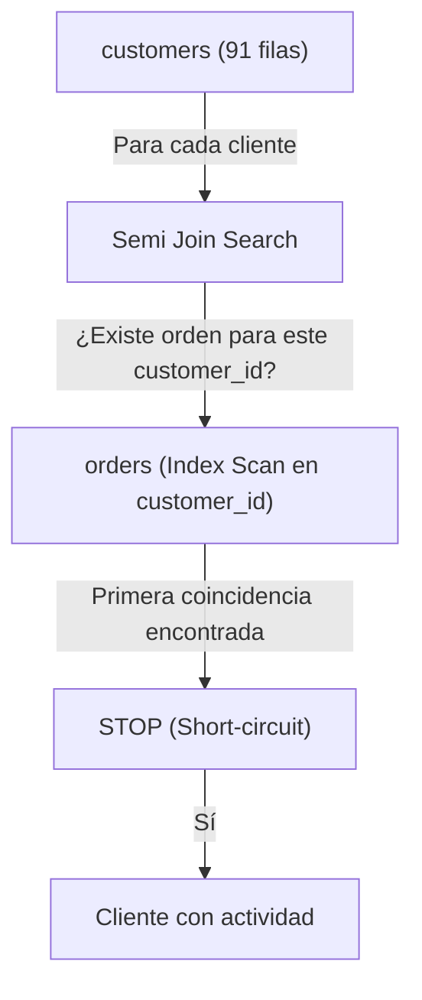

### Código de Solución

```sql
SELECT
    customer_id,
    company_name,
    country
FROM customers c
WHERE EXISTS (
    SELECT 1
    FROM orders o
    WHERE o.customer_id = c.customer_id
)
ORDER BY company_name;
```

#### 📊 Resultado Real de Ejecución en PostgreSQL (AWS EC2):

```text
customer_id |            company_name            |   country   
-------------+------------------------------------+-------------
 ALFKI       | Alfreds Futterkiste                | Germany
 ANATR       | Ana Trujillo Emparedados y helados | Mexico
 ANTON       | Antonio Moreno Taquería            | Mexico
 AROUT       | Around the Horn                    | UK
 BSBEV       | B's Beverages                      | UK
 BERGS       | Berglunds snabbköp                 | Sweden
 BLAUS       | Blauer See Delikatessen            | Germany
 BLONP       | Blondesddsl père et fils           | France
 BONAP       | Bon app'                           | France
 BOTTM       | Bottom-Dollar Markets              | Canada
 BOLID       | Bólido Comidas preparadas          | Spain
 CACTU       | Cactus Comidas para llevar         | Argentina
 ... [77 filas omitidas para brevedad del documento] ...
(89 rows)
```

> 🛠️ **Nota del Ingeniero de Datos:** `EXISTS` usa short-circuit: detiene la búsqueda en la primera coincidencia. En tablas grandes, esto es significativamente más rápido que `IN` que materializa todo el conjunto. MySQL a veces optimiza mal `EXISTS` en subconsultas simples.

### Criterio de Evaluación del Entrevistador

Evalúa si el candidato prefiere `EXISTS` sobre `IN` para consultas correlacionadas con posibles nulos. Error: escribir `SELECT *` dentro de `EXISTS` (ineficiente, aunque PostgreSQL lo ignore).

---

## Ejercicio 16: NOT EXISTS — Productos Inactivos (Nunca Vendidos)

### 🎯 Enunciado y Caso de Uso

El equipo de catálogo y depuración de inventario necesita identificar productos obsoletos o 'fantasmas' que nunca han tenido ninguna venta histórica. Se solicita listar el identificador y nombre de los productos que no registran ninguna venta en toda la historia de la empresa, utilizando el operador NOT EXISTS (Anti Join).

### 🎓 Explicación del Profesor

**Analogía:** Es como revisar cada artículo del almacén y buscar si alguna vez se emitió una factura por él: si no existe ni un solo registro de venta en el historial, el producto se marca como inactivo para descatalogarlo.  
**Concepto Central:** `NOT EXISTS` ejecuta un `Anti Join`: retorna las filas de la tabla externa que NO encuentran ninguna correspondencia en la subconsulta. A diferencia de `NOT IN`, `NOT EXISTS` maneja de forma totalmente segura los valores `NULL` sin riesgo de retornar conjuntos vacíos accidentales.

> 💡 **Tip del Profesor:** Prefiere siempre `NOT EXISTS` sobre `NOT IN` cuando la columna de la subconsulta pueda contener `NULL`s, ya que `NOT IN (..., NULL)` evalúa a `UNKNOWN` y descarta todas las filas.

### 🧠 Cómo Pensar como un Analista de Datos

- **Pregunta de Negocio & KPI:** Detección de productos de rotación cero (Catálogo muerto / Zero-sales items).
- **Entidad Central & Granularidad:** Tablas `products` (77 filas) y `order_details` (2,155 filas). Granularidad: 1 fila por producto sin ventas.
- **Fuentes & Cruces (JOINs):** `NOT EXISTS (SELECT 1 FROM order_details od WHERE od.product_id = p.product_id)`.
- **Filtros & Agrupaciones:** Condición de Anti-Join.
- **Proyección & Orden (SELECT / ORDER BY):** `p.product_id`, `p.product_name`.
- **Validación Analítica:** En Northwind todos los 77 productos han tenido al menos una venta histórica, por lo que el resultado esperado es exactamente 0 filas (`0 rows`).

### ⚙️ Desglose del Motor de Ejecución (Logical Query Processing)

**1. FROM products p:** Escaneo de los 77 productos.
**2. Anti Join (NOT EXISTS):** Se verifica la presencia de `product_id` en `order_details`.
**3. Filtro:** Los 77 productos tienen al menos una venta registrada.
**4. Resultado:** Conjunto vacío (0 filas).

### Marco Conceptual del Optimizador

`NOT EXISTS` implementa un **Anti Join** lógico: retorna todas las filas de la tabla izquierda que **no** tienen correspondencia en la derecha. PostgreSQL ejecuta un `Hash Anti Join`: construye un conjunto hash con los `product_id` de `order_details` (2155 filas) y luego escanea `products` (77 filas) verificando ausencia en el hash. Es inmune al problema de `NULL` que afecta a `NOT IN`.

### Diagrama de Flujo (Mermaid)

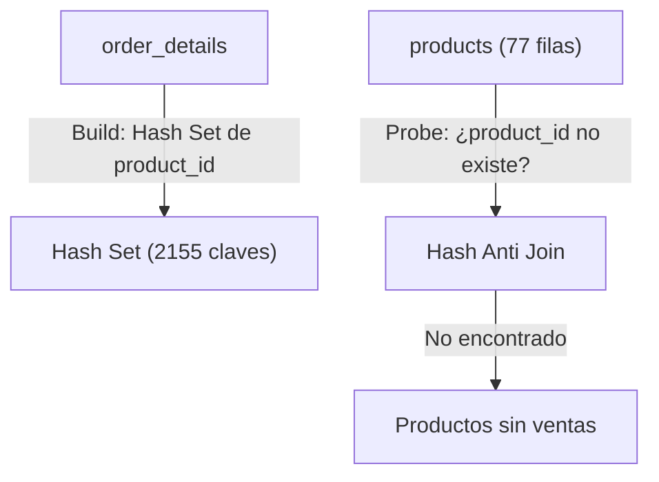

### Código de Solución

```sql
SELECT
    product_id,
    product_name,
    unit_price
FROM products p
WHERE NOT EXISTS (
    SELECT 1
    FROM order_details od
    WHERE od.product_id = p.product_id
);
```

#### 📊 Resultado Real de Ejecución en PostgreSQL (AWS EC2):

```text
product_id | product_name | unit_price 
------------+--------------+------------
(0 rows)
```

> 🛠️ **Nota del Ingeniero de Datos:** `NOT EXISTS` ejecuta un Anti Join con hash. `NOT IN` requiere materializar todo el conjunto y comparar fila por fila. `NOT EXISTS` es más eficiente en la mayoría de casos. `NOT IN` con subconsulta que contiene `NULLs` retorna 0 filas (resultado vacío inesperado). Ejemplo: `WHERE id NOT IN (1, 2, NULL)` nunca retorna filas porque `NOT IN` con `NULL` siempre es `UNKNOWN`.

### Criterio de Evaluación del Entrevistador

¡Pregunta de seguridad! El entrevistador busca que el candidato evite `NOT IN (SELECT product_id FROM order_details)` porque `product_id` en `order_details` es parte de PK compuesta y no tiene `NULLs` (podría funcionar), pero la mejor práctica es usar `NOT EXISTS` siempre. Demostrar esta conciencia es señal de seniority.

---

## Ejercicio 17: ANY — Productos Más Caros que Cualquier Producto de Categoría 1

### 🎯 Enunciado y Caso de Uso

El comité de análisis competitivo necesita identificar productos fuera del segmento básico de bebidas. Se solicita listar el identificador, nombre y precio unitario de todos los productos que tengan un precio superior a CUALQUIERA de los productos de la categoría 1 (Bebidas), utilizando el operador ANY.

### 🎓 Explicación del Profesor

**Analogía:** Es como decir: 'Muéstrame todos los artículos de la tienda que sean más caros que el artículo más barato de la sección de Bebidas'. Si superas a cualquiera (al mínimo), ya calificas.  
**Concepto Central:** `> ANY (subconsulta)` equivale lógicamente a `> (SELECT MIN(columna) FROM subconsulta)`. Es decir, la condición se cumple si el valor es mayor que al menos un elemento del conjunto devuelto.

> 💡 **Tip del Profesor:** `> ANY` evalúa si el valor es mayor que el mínimo del conjunto. En contraste, `< ANY` evalúa si el valor es menor que el máximo del conjunto.

### 🧠 Cómo Pensar como un Analista de Datos

- **Pregunta de Negocio & KPI:** Análisis de umbrales cruzados de precios frente a la categoría de referencia (Categoría 1: Bebidas).
- **Entidad Central & Granularidad:** Tabla `products` (77 filas). Granularidad: 1 fila por producto calificado.
- **Fuentes & Cruces (JOINs):** Subconsulta sobre `products` filtrada por `category_id = 1`.
- **Filtros & Agrupaciones:** `unit_price > ANY (SELECT unit_price FROM products WHERE category_id = 1)`.
- **Proyección & Orden (SELECT / ORDER BY):** `product_id`, `product_name`, `unit_price`.
- **Validación Analítica:** El producto más barato de la Categoría 1 cuesta $4.50 (Guaraná Fantástica). Todo producto con precio > $4.50 califica (75 productos en total).

### ⚙️ Desglose del Motor de Ejecución (Logical Query Processing)

**1. Subconsulta:** Se obtienen los 12 precios de los productos de la categoría 1 (mínimo = $4.50).
**2. FROM products:** Escaneo de los 77 productos.
**3. WHERE unit_price > ANY (...):** Pasan todos los productos con precio > $4.50 (75 productos).
**4. SELECT & ORDER BY unit_price DESC:** Proyección y ordenamiento descendente.

### Marco Conceptual del Optimizador

`> ANY (subquery)` retorna `TRUE` si el valor de la izquierda es mayor que **al menos un** valor de la subconsulta. PostgreSQL ejecuta la subconsulta interna primero (productos de categoría 1), materializa los precios, y para cada producto externo evalúa la comparación. Internamente puede reescribirse como `unit_price > (SELECT MIN(unit_price) FROM products WHERE category_id = 1)` si el optimizador detecta la equivalencia semántica.

### Diagrama de Flujo (Mermaid)

```mermaid
flowchart LR
    SubQ["Subconsulta: precios categoría 1"] -->|Materializar lista| Set["Set de precios"]
    P["products (todas categorías)"] -->|Por cada producto: unit_price > ANY(set)| Eval["Evaluar > ANY"]
    Eval -->|TRUE| Out["Productos más caros que alguno de categoría 1"]
```

### Código de Solución

```sql
SELECT
    product_id,
    product_name,
    unit_price,
    category_id
FROM products
WHERE unit_price > ANY (
    SELECT unit_price
    FROM products
    WHERE category_id = 1
)
ORDER BY unit_price;
```

#### 📊 Resultado Real de Ejecución en PostgreSQL (AWS EC2):

```text
product_id |           product_name           | unit_price | category_id 
------------+----------------------------------+------------+-------------
         13 | Konbu                            |          6 |           8
         52 | Filo Mix                         |          7 |           5
         54 | Tourtière                        | 7.44999981 |           6
         75 | Rhönbräu Klosterbier             |       7.75 |           1
         23 | Tunnbröd                         |          9 |           5
         19 | Teatime Chocolate Biscuits       | 9.19999981 |           3
         45 | Rogede sild                      |        9.5 |           8
         47 | Zaanse koeken                    |        9.5 |           3
         41 | Jack's New England Clam Chowder  | 9.64999962 |           8
         21 | Sir Rodney's Scones              |         10 |           3
         74 | Longlife Tofu                    |         10 |           7
          3 | Aniseed Syrup                    |         10 |           2
 ... [63 filas omitidas para brevedad del documento] ...
(75 rows)
```

> 🛠️ **Nota del Ingeniero de Datos:** PostgreSQL puede reescribir `> ANY (subquery)` como `> (SELECT MIN(...) FROM ...)` internamente, lo que permite usar un índice en la subconsulta. `= ANY` es equivalente a `IN`. Muchos desarrolladores no saben esta equivalencia.

### Criterio de Evaluación del Entrevistador

Mide comprensión de los cuantificadores lógicos. Error: confundir `ANY` con `ALL`. `> ANY` equivale a "mayor que el mínimo del conjunto".

---

## Ejercicio 18: ALL — Productos Más Caros que Todos los de Categoría 1

### 🎯 Enunciado y Caso de Uso

El departamento comercial busca identificar productos ultra-exclusivos de alta gama. Se solicita listar el identificador, nombre y precio unitario de todos aquellos productos cuyo precio sea superior a TODOS los productos pertenecientes a la categoría 1 (Bebidas), utilizando el operador ALL.

### 🎓 Explicación del Profesor

**Analogía:** Es como decir: 'Muéstrame los artículos que sean más caros que el producto más caro de toda la sección de Bebidas'. Tienes que superar a todos sin excepción para calificar.  
**Concepto Central:** `> ALL (subconsulta)` equivale lógicamente a `> (SELECT MAX(columna) FROM subconsulta)`. La condición solo es verdadera si el valor supera a cada uno de los elementos devueltos por la subconsulta.

> 💡 **Tip del Profesor:** Si la subconsulta de `ALL` retorna un conjunto vacío, la condición `> ALL` evalúa a `TRUE` para todas las filas. Ten en cuenta este comportamiento en casos borde.

### 🧠 Cómo Pensar como un Analista de Datos

- **Pregunta de Negocio & KPI:** Identificar artículos de ultra-lujo que superen el techo de precios de la categoría 1 ($263.50).
- **Entidad Central & Granularidad:** Tabla `products` (77 filas). Granularidad: 1 fila por producto ultra-lujo.
- **Fuentes & Cruces (JOINs):** Subconsulta sobre `products` con `category_id = 1`.
- **Filtros & Agrupaciones:** `unit_price > ALL (SELECT unit_price FROM products WHERE category_id = 1)`.
- **Proyección & Orden (SELECT / ORDER BY):** `product_id`, `product_name`, `unit_price`.
- **Validación Analítica:** El producto más caro de la categoría 1 es 'Côte de Blaye' ($263.50), que es a la vez el producto más caro de todo el catálogo. Por ende, ningún producto supera a todos (resultado: 0 rows).

### ⚙️ Desglose del Motor de Ejecución (Logical Query Processing)

**1. Subconsulta:** Obtiene los precios de la categoría 1 (máximo = $263.50).
**2. FROM products:** Escaneo de los 77 productos.
**3. WHERE unit_price > ALL (...):** Se evalúa `unit_price > 263.50`. Ningún producto lo supera.
**4. Salida:** 0 filas.

### Marco Conceptual del Optimizador

`> ALL (subquery)` retorna `TRUE` solo si el valor supera **todos** los valores de la subconsulta. PostgreSQL reescribe internamente como `unit_price > (SELECT MAX(unit_price) FROM products WHERE category_id = 1)`. La subconsulta se ejecuta una vez como `InitPlan`, produciendo una constante.

### Diagrama de Flujo (Mermaid)

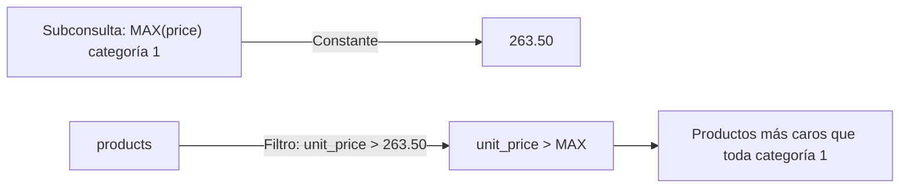

### Código de Solución

```sql
SELECT
    product_id,
    product_name,
    unit_price,
    category_id
FROM products
WHERE unit_price > ALL (
    SELECT unit_price
    FROM products
    WHERE category_id = 1
)
ORDER BY unit_price;
```

#### 📊 Resultado Real de Ejecución en PostgreSQL (AWS EC2):

```text
product_id | product_name | unit_price | category_id 
------------+--------------+------------+-------------
(0 rows)
```

> 🛠️ **Nota del Ingeniero de Datos:** PostgreSQL reescribe `> ALL (subquery)` como `> (SELECT MAX(...) FROM ...)`. Esto produce una constante que se compara en una sola pasada. `<> ALL` equivale a `NOT IN`. Mismo riesgo con `NULLs`.

### Criterio de Evaluación del Entrevistador

Evalúa si el candidato distingue `ANY` vs `ALL`. Error común: pensar que `> ALL` requiere que la subconsulta retorne una sola fila.

---

## Ejercicio 19: Subconsulta Correlacionada en SELECT — Última Compra por Cliente

### 🎯 Enunciado y Caso de Uso

El equipo de CRM y retención necesita auditar la fecha del último pedido registrado para cada cliente de la cartera. Se solicita listar el identificador de cliente, el nombre de la empresa y la fecha de su pedido más reciente, utilizando una subconsulta correlacionada en la cláusula SELECT.

### 🎓 Explicación del Profesor

**Analogía:** Es como tener una lista con los 91 clientes de tu empresa y, al lado de cada nombre, consultar en el archivo de órdenes la fecha más reciente en que ese cliente específico firmó un contrato. Si nunca compró, queda en blanco (NULL).  
**Concepto Central:** Una subconsulta escalar en la cláusula `SELECT` se evalúa para cada fila proyectada de la consulta principal. Si la subconsulta correlacionada no encuentra ningún registro en `orders` para un cliente dado (como los clientes sin pedidos), retorna automáticamente `NULL`.

> 💡 **Tip del Profesor:** En PostgreSQL, para reportes grandes, un `LEFT JOIN` con `MAX()` y `GROUP BY` o un `LEFT JOIN LATERAL` suele ser más eficiente que una subconsulta escalar en `SELECT`, pero la subconsulta en `SELECT` es muy intuitiva y no altera la cardinalidad de la tabla externa.

### 🧠 Cómo Pensar como un Analista de Datos

- **Pregunta de Negocio & KPI:** Recencia de Clientes (Dimensión Recency de RFM): Fecha de última compra por cliente en la base.
- **Entidad Central & Granularidad:** Tablas `customers` (91 filas) y `orders` (830 filas). Granularidad: Exactamente 91 filas (1 por cliente de la base).
- **Fuentes & Cruces (JOINs):** Correlación: `WHERE o.customer_id = c.customer_id` en la subconsulta de `SELECT`.
- **Filtros & Agrupaciones:** Ninguno en la consulta externa.
- **Proyección & Orden (SELECT / ORDER BY):** `c.customer_id`, `c.company_name`, `(SELECT MAX(o.order_date) FROM orders o WHERE o.customer_id = c.customer_id) AS fecha_ultimo_pedido`.
- **Validación Analítica:** Deben figurar exactamente los 91 clientes canónicos de Northwind. Los clientes 'FISSA' y 'PARIS' mostrarán `NULL` al no registrar compras.

### ⚙️ Desglose del Motor de Ejecución (Logical Query Processing)

**1. FROM customers c:** Se leen secuencialmente los 91 clientes.
**2. Proyección de SELECT:** Por cada cliente, se ejecuta la subconsulta correlacionada sondeando el índice en `orders.customer_id` y calculando `MAX(order_date)`.
**3. SELECT:** Se asignan los valores calculados y el alias `fecha_ultimo_pedido`.
**4. ORDER BY c.customer_id:** Se ordenan los 91 registros alfabéticamente.

### Marco Conceptual del Optimizador

La subconsulta escalar en `SELECT` calcula `MAX(order_date)` para cada cliente. Por cada fila de `customers` (91 filas), PostgreSQL ejecuta la subconsulta correlacionada sobre `orders` (830 filas) usando un `Index Scan` en `orders(customer_id)` para localizar la fecha máxima. Si no existe índice, el plan sería un Seq Scan de orders por cada cliente (91 × 830 = 75,530 operaciones de E/S).

### Diagrama de Flujo (Mermaid)

```mermaid
flowchart TD
    C["customers (91 filas)"] -->|Por cada fila| Init["SubPlan"]
    Init -->|Index Scan: customer_id = c.customer_id| O["orders (Index Scan)"]
    O -->|MAX(order_date)| MaxDate["Última fecha de compra"]
    MaxDate -->|Proyectar como columna| Out["customer_id, company_name, ultima_compra"]
```

### Código de Solución

```sql
SELECT
    customer_id,
    company_name,
    (
        SELECT MAX(order_date)
        FROM orders o
        WHERE o.customer_id = c.customer_id
    ) AS ultima_compra
FROM customers c
ORDER BY ultima_compra DESC NULLS LAST;
```

#### 📊 Resultado Real de Ejecución en PostgreSQL (AWS EC2):

```text
customer_id |             company_name             | ultima_compra 
-------------+--------------------------------------+---------------
 BONAP       | Bon app'                             | 1998-05-06
 RATTC       | Rattlesnake Canyon Grocery           | 1998-05-06
 RICSU       | Richter Supermarkt                   | 1998-05-06
 SIMOB       | Simons bistro                        | 1998-05-06
 PERIC       | Pericles Comidas clásicas            | 1998-05-05
 LEHMS       | Lehmanns Marktstand                  | 1998-05-05
 LILAS       | LILA-Supermercado                    | 1998-05-05
 ERNSH       | Ernst Handel                         | 1998-05-05
 TORTU       | Tortuga Restaurante                  | 1998-05-04
 DRACD       | Drachenblut Delikatessen             | 1998-05-04
 QUEEN       | Queen Cozinha                        | 1998-05-04
 WHITC       | White Clover Markets                 | 1998-05-01
 ... [79 filas omitidas para brevedad del documento] ...
(91 rows)
```

> 🛠️ **Nota del Ingeniero de Datos:** Con 91 clientes y 830 pedidos, el Index Scan en `orders(customer_id)` hace esto eficiente. Sin índice, serían 91 escaneos secuenciales de `orders`. Un `LEFT JOIN LATERAL` con `LIMIT 1` es más explícito y a menudo más rápido para este patrón.

### Criterio de Evaluación del Entrevistador

Mide si el candidato conoce el patrón de subconsulta escalar en `SELECT` para enriquecer reportes. Error: no manejar `NULLS LAST` para clientes sin pedidos.

---

## Ejercicio 20: Subconsulta Anidada — Top 5 Productos por Ingresos

### 🎯 Enunciado y Caso de Uso

La gerencia general requiere un reporte ejecutivo de los 5 productos que mayor facturación neta han generado en toda la historia de la compañía. Se solicita obtener el nombre del producto y su facturación total neta acumulada utilizando una subconsulta anidada en la cláusula FROM, ordenada de forma descendente y limitada al Top 5.

### 🎓 Explicación del Profesor

**Analogía:** Es como generar primero una hoja de cálculo con la facturación total de cada uno de los 77 productos y luego ordenar esa hoja para recortar y presentar en la junta directiva únicamente los 5 productos más rentables.  
**Concepto Central:** Combina una subconsulta en `FROM` que agrega y calcula el total neto con descuento `ROUND(SUM(od.quantity * od.unit_price * (1 - od.discount))::numeric, 2)` por producto, con una consulta externa que ordena por el alias derivado y aplica `LIMIT 5`.

> 💡 **Tip del Profesor:** Al anidar en `FROM`, el cálculo pesado de agregación se resuelve en la tabla derivada, permitiendo que la consulta exterior solo se encargue de la presentación, ordenamiento y acotamiento.

### 🧠 Cómo Pensar como un Analista de Datos

- **Pregunta de Negocio & KPI:** Identificar los 5 productos estrella (Top-Revenue Drivers) de la empresa.
- **Entidad Central & Granularidad:** Tablas `products` (77 filas) y `order_details` (2,155 filas). Granularidad: 5 filas finales.
- **Fuentes & Cruces (JOINs):** `products.product_id = order_details.product_id`.
- **Filtros & Agrupaciones:** `LIMIT 5` en la consulta exterior.
- **Proyección & Orden (SELECT / ORDER BY):** `product_name`, `facturacion_total`.
- **Validación Analítica:** El producto Top 1 es 'Côte de Blaye' con $141,396.74 de facturación neta.

### ⚙️ Desglose del Motor de Ejecución (Logical Query Processing)

**1. Subconsulta (FROM sub):** Hash Join entre `products` y `order_details`, agrupando por `product_name` y calculando la facturación total de los 77 productos.
**2. Consulta externa:** Recibe las 77 filas precalculadas.
**3. ORDER BY facturacion_total DESC:** Ordenamiento descendente en memoria `work_mem`.
**4. LIMIT 5:** El nodo `Limit` extrae las 5 tuplas superiores y finaliza la ejecución.

### Marco Conceptual del Optimizador

Consulta de tres niveles de anidación: la subconsulta más interna calcula ingresos por producto desde `order_details`; la intermedia ordena y limita a 5; la externa agrega el nombre del producto con un JOIN adicional. PostgreSQL ejecuta las subconsultas de adentro hacia afuera. La derived table `product_revenue` se materializa en memoria (77 filas, tabla pequeña).

### Diagrama de Flujo (Mermaid)

```mermaid
flowchart TD
    OD["order_details"] -->|SUM(quantity * unit_price * (1 - discount)) GROUP BY product_id| Rev["Ingresos por producto"]
    Rev -->|ORDER BY DESC LIMIT 5| Top5["Top 5 product_id"]
    Top5 -->|INNER JOIN products| P["products"]
    P --> Out["product_id, product_name, ingresos"]
```

### Código de Solución

```sql
SELECT
    p.product_id,
    p.product_name,
    r.ingresos_totales
FROM (
    SELECT
        product_id,
        ROUND(SUM(quantity * unit_price * (1 - discount))::numeric, 2) AS ingresos_totales
    FROM order_details
    GROUP BY product_id
    ORDER BY ingresos_totales DESC
    LIMIT 5
) r
INNER JOIN products p ON r.product_id = p.product_id
ORDER BY r.ingresos_totales DESC;
```

#### 📊 Resultado Real de Ejecución en PostgreSQL (AWS EC2):

```text
product_id |      product_name       | ingresos_totales 
------------+-------------------------+------------------
         38 | Côte de Blaye           |        141396.74
         29 | Thüringer Rostbratwurst |         80368.67
         59 | Raclette Courdavault    |         71155.70
         62 | Tarte au sucre          |         47234.97
         60 | Camembert Pierrot       |         46825.48
(5 rows)
```

> 🛠️ **Nota del Ingeniero de Datos:** Con `LIMIT 5`, el optimizador puede usar un Top-N Sort en memoria en lugar de ordenar toda la tabla. En PostgreSQL 14+, puedes usar `LATERAL` para hacer el JOIN de forma más eficiente si la derived table es costosa.

### Criterio de Evaluación del Entrevistador

Evalúa si el candidato estructura consultas anidadas de forma legible. Error: perder la cardinalidad al hacer `JOIN` después de `LIMIT` (funciona aquí porque `LIMIT` se aplica antes del `JOIN`). En PostgreSQL 15+, las derived tables con `LIMIT` se evalúan completamente antes del `JOIN` externo.

---

## Ejercicio 21: CASE Simple — Segmentación de Precios (Económico / Intermedio / Premium)

### 🎯 Enunciado y Caso de Uso

El departamento comercial y de pricing necesita categorizar el catálogo de artículos según su rango de precio. Se solicita listar el nombre del producto, su precio unitario y una etiqueta denominada 'rango_precio' que clasifique cada producto en: 'Económico' si cuesta menos de $20, 'Intermedio' si cuesta entre $20 y $50, y 'Premium' si cuesta más de $50, ordenados ascendentemente por precio unitario.

### 🎓 Explicación del Profesor

**Analogía:** Es como poner etiquetas de colores en una tienda de ropa: etiqueta verde para productos económicos (<$20), azul para gama media ($20-$50) y dorada para artículos de lujo (> $50).  
**Concepto Central:** La estructura condicional `CASE WHEN ... THEN ... ELSE ... END` permite implementar bifurcaciones lógicas dentro de las consultas SQL. Es una expresión escalar que se evalúa tupla por tupla durante la fase de proyección (`SELECT`).

> 💡 **Tip del Profesor:** El orden de las cláusulas `WHEN` importa: PostgreSQL evalúa las condiciones secuencialmente y cortocircuita en la primera coincidencia verdadera. Si ninguna se cumple, retorna la rama `ELSE` (o `NULL` si se omitió el `ELSE`).

### 🧠 Cómo Pensar como un Analista de Datos

- **Pregunta de Negocio & KPI:** Estratificación de catálogo por bandas de precio para análisis de elasticidad y margen comercial.
- **Entidad Central & Granularidad:** Tabla `products` (77 filas, columnas `product_name`, `unit_price`). Granularidad: 1 fila por producto.
- **Fuentes & Cruces (JOINs):** Mono-tabla sobre `products`.
- **Filtros & Agrupaciones:** Ninguno.
- **Proyección & Orden (SELECT / ORDER BY):** `product_name`, `unit_price`, `CASE WHEN unit_price < 20 THEN 'Económico' WHEN unit_price BETWEEN 20 AND 50 THEN 'Intermedio' ELSE 'Premium' END AS rango_precio`.
- **Validación Analítica:** Los 77 productos del catálogo quedan etiquetados en una de las tres bandas de precio sin ningún valor nulo.

### ⚙️ Desglose del Motor de Ejecución (Logical Query Processing)

**1. FROM products:** Escaneo de las 77 filas de `products`.
**2. WHERE:** No hay filtros.
**3. SELECT:** Para cada tupla, se evalúa la expresión `CASE` sobre `unit_price` asignando la etiqueta correspondiente.
**4. ORDER BY unit_price ASC:** Se ordenan los productos de menor a mayor precio.

### Marco Conceptual del Optimizador

La expresión `CASE` se evalúa en la fase de proyección de tuplas (después de `WHERE`, antes de `ORDER BY`). PostgreSQL implementa `CASE` como una serie de comparaciones booleanas en CPU: la primera condición verdadera cortocircuita la evaluación. No hay impacto en el plan de acceso a disco; es puramente computacional en la capa de proyección.

### Diagrama de Flujo (Mermaid)

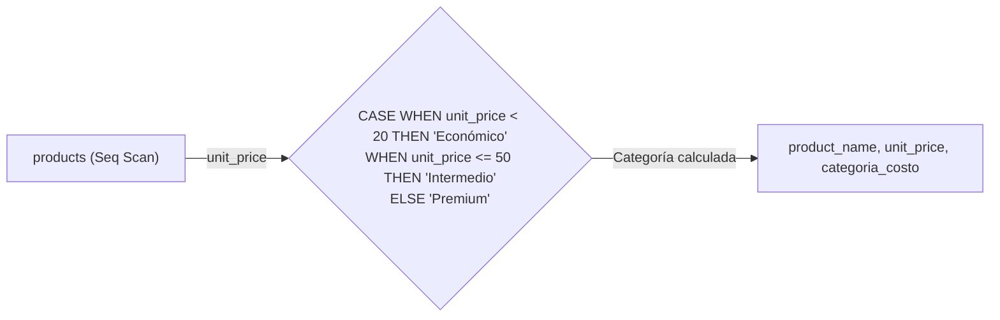

### Código de Solución

```sql
SELECT
    product_name,
    unit_price,
    CASE
        WHEN unit_price < 20 THEN 'Económico'
        WHEN unit_price <= 50 THEN 'Intermedio'
        ELSE 'Premium'
    END AS categoria_costo
FROM products
ORDER BY unit_price;
```

#### 📊 Resultado Real de Ejecución en PostgreSQL (AWS EC2):

```text
product_name           | unit_price | categoria_costo 
----------------------------------+------------+-----------------
 Geitost                          |        2.5 | Económico
 Guaraná Fantástica               |        4.5 | Económico
 Konbu                            |          6 | Económico
 Filo Mix                         |          7 | Económico
 Tourtière                        | 7.44999981 | Económico
 Rhönbräu Klosterbier             |       7.75 | Económico
 Tunnbröd                         |          9 | Económico
 Teatime Chocolate Biscuits       | 9.19999981 | Económico
 Zaanse koeken                    |        9.5 | Económico
 Rogede sild                      |        9.5 | Económico
 Jack's New England Clam Chowder  | 9.64999962 | Económico
 Longlife Tofu                    |         10 | Económico
 ... [65 filas omitidas para brevedad del documento] ...
(77 rows)
```

> 🛠️ **Nota del Ingeniero de Datos:** `CASE` se evalúa en la capa de proyección, no en la de acceso a disco. No afecta el plan de ejecución. Para múltiples condiciones, `CASE searched` (`CASE WHEN condición`) es más flexible que `CASE simple` (`CASE columna WHEN valor`).

### Criterio de Evaluación del Entrevistador

Mide si el candidato conoce la sintaxis `CASE` searched (sin expresión después de `CASE`). Error: olvidar que `CASE` retorna la primera coincidencia y el orden de las cláusulas `WHEN` importa.

---

## Ejercicio 22: CASE Searched — Zona Logística de Clientes

### 🎯 Enunciado y Caso de Uso

El departamento de distribución y logística internacional necesita segmentar a todos los clientes de la cartera en zonas operativas. Se solicita listar el nombre de la empresa, su país y una columna 'zona_logistica' que clasifique al cliente en: 'Norteamérica' (si su país es USA, Canada o Mexico), 'Europa' (si su país es UK, Germany, France, Spain o Italy), o 'Resto del Mundo' para cualquier otro país, ordenados alfabéticamente por país.

### 🎓 Explicación del Profesor

**Analogía:** Es como pintar con 3 colores un mapa de clientes: color azul para los envíos a Norteamérica, verde para los destinos europeos principales y naranja para el resto de rutas internacionales.  
**Concepto Central:** El `CASE Searched` evalúa condiciones booleanas arbitrarias (como `country IN (...)`). A diferencia del `CASE Simple` (que compara igualdad contra una sola variable), el `CASE Searched` brinda máxima flexibilidad lógica.

> 💡 **Tip del Profesor:** Asegúrate de incluir siempre una cláusula `ELSE` en tus expresiones `CASE` para atrapar casos no contemplados y evitar que retornen `NULL` inadvertidamente.

### 🧠 Cómo Pensar como un Analista de Datos

- **Pregunta de Negocio & KPI:** Segmentación de clientes por macro-zonas logísticas para optimización de tarifas de transporte y acuerdos con couriers.
- **Entidad Central & Granularidad:** Tabla `customers` (91 filas, columnas `company_name`, `country`). Granularidad: Exactamente 91 filas.
- **Fuentes & Cruces (JOINs):** Mono-tabla sobre `customers`.
- **Filtros & Agrupaciones:** Ninguno.
- **Proyección & Orden (SELECT / ORDER BY):** `company_name`, `country`, `CASE WHEN country IN ('USA', 'Canada', 'Mexico') THEN 'Norteamérica' WHEN country IN ('UK', 'Germany', 'France', 'Spain', 'Italy') THEN 'Europa' ELSE 'Resto del Mundo' END AS zona_logistica`.
- **Validación Analítica:** En el dataset canónico de Northwind hay 91 clientes distribuidos en 21 países (sin datos mock de Chile ni Perú).

### ⚙️ Desglose del Motor de Ejecución (Logical Query Processing)

**1. FROM customers:** Escaneo secuencial de los 91 clientes.
**2. SELECT:** Se evalúa la pertenencia a las listas de países en cada rama `WHEN` del `CASE Searched`.
**3. ORDER BY country:** Se ordenan los 91 clientes alfabéticamente por país.

### Marco Conceptual del Optimizador

`CASE` searched evalúa condiciones booleanas arbitrarias. Similar al ejercicio anterior, la evaluación es puramente computacional en la capa de proyección. La función se aplica a cada una de las 91 filas de `customers`, con cortocircuito en la primera coincidencia. Las condiciones con `IN` son evaluadas como comparación de conjunto (el motor expande `IN` a una serie de `OR`).

### Diagrama de Flujo (Mermaid)

```mermaid
flowchart LR
    C["customers (91 filas)"] -->|country| Case{"CASE WHEN country IN ('USA','Canada','Mexico') THEN 'Norteamérica'\nWHEN country IN ('UK','Germany','France','Spain','Italy') THEN 'Europa'\nELSE 'Resto del Mundo'"}
    Case -->|zona_logistica| Out["company_name, country, zona_logistica"]
```

### Código de Solución

```sql
SELECT
    company_name,
    country,
    CASE
        WHEN country IN ('USA', 'Canada', 'Mexico') THEN 'Norteamérica'
        WHEN country IN ('UK', 'Germany', 'France', 'Spain', 'Italy') THEN 'Europa'
        ELSE 'Resto del Mundo'
    END AS zona_logistica
FROM customers
ORDER BY country;
```

#### 📊 Resultado Real de Ejecución en PostgreSQL (AWS EC2):

```text
company_name             |   country   | zona_logistica  
--------------------------------------+-------------+-----------------
 Océano Atlántico Ltda.               | Argentina   | Resto del Mundo
 Cactus Comidas para llevar           | Argentina   | Resto del Mundo
 Rancho grande                        | Argentina   | Resto del Mundo
 Ernst Handel                         | Austria     | Resto del Mundo
 Piccolo und mehr                     | Austria     | Resto del Mundo
 Maison Dewey                         | Belgium     | Resto del Mundo
 Suprêmes délices                     | Belgium     | Resto del Mundo
 Wellington Importadora               | Brazil      | Resto del Mundo
 Hanari Carnes                        | Brazil      | Resto del Mundo
 Gourmet Lanchonetes                  | Brazil      | Resto del Mundo
 Que Delícia                          | Brazil      | Resto del Mundo
 Queen Cozinha                        | Brazil      | Resto del Mundo
 ... [79 filas omitidas para brevedad del documento] ...
(91 rows)
```

> 🛠️ **Nota del Ingeniero de Datos:** `CASE` searched con `IN` puede ser reescrito como múltiples `OR` internamente. Para listas largas, considera usar una tabla temporal de referencia. Ambos SGBD soportan `CASE` searched con la misma sintaxis.

### Criterio de Evaluación del Entrevistador

Evalúa si el candidato usa `CASE` searched sin expresión después de `CASE`. Error: escribir `CASE country WHEN IN (...)` (sintaxis inválida). `CASE` simple no acepta `IN`.

---

## Ejercicio 23: CASE + FILTER — Conteo Condicional por Zona Geográfica

### 🎯 Enunciado y Caso de Uso

La gerencia ejecutiva solicita un resumen global de distribución de clientes en una sola fila. Se requiere contar en columnas separadas cuántos clientes residen en Norteamérica (USA, Canada, Mexico), cuántos en Europa (UK, Germany, France, Spain, Italy) y cuántos en el Resto del Mundo, utilizando la cláusula FILTER.

### 🎓 Explicación del Profesor

**Analogía:** Es como tener 3 contadores mecánicos en una mesa y pasar las 91 fichas de clientes: si la ficha es de Norteamérica aumentas el contador 1, si es de Europa el contador 2, y si es de otro lugar el contador 3.  
**Concepto Central:** La cláusula `FILTER (WHERE ...)` es una potente extensión del estándar SQL soportada de forma nativa y ultra-optimizada en PostgreSQL. Permite aplicar un predicado de filtrado exclusivo para una función agregada específica sin afectar a las demás agregaciones del mismo nivel.

> 💡 **Tip del Profesor:** `COUNT(*) FILTER (WHERE condicion)` es mucho más limpio, legible y eficiente en PostgreSQL que la alternativa tradicional `COUNT(CASE WHEN condicion THEN 1 END)`.

### 🧠 Cómo Pensar como un Analista de Datos

- **Pregunta de Negocio & KPI:** Distribución macro-geográfica de la cartera de clientes consolidada en un solo registro de KPI.
- **Entidad Central & Granularidad:** Tabla `customers` (91 filas). Granularidad: 1 fila consolidada.
- **Fuentes & Cruces (JOINs):** Mono-tabla sobre `customers`.
- **Filtros & Agrupaciones:** Condiciones de agregación independiente mediante `FILTER`.
- **Proyección & Orden (SELECT / ORDER BY):** `clientes_norteamerica`, `clientes_europa`, `clientes_otros`.
- **Validación Analítica:** La suma de las 3 columnas (21 en Norteamérica + 41 en Europa + 29 en otros) da exactamente los 91 clientes totales de Northwind.

### ⚙️ Desglose del Motor de Ejecución (Logical Query Processing)

**1. FROM customers:** Escaneo de los 91 clientes.
**2. Agregación con FILTER:** En un solo recorrido de la tabla, el motor acumula simultáneamente los 3 contadores independientes.
**3. SELECT:** Se proyecta la fila única con las 3 métricas agregadas.

### Marco Conceptual del Optimizador

`COUNT(*) FILTER (WHERE ...)` es una extensión PostgreSQL que implementa agregación condicional sin subconsultas. Internamente, la función de ventana/agregación mantiene un contador que solo se incrementa cuando el `FILTER` es `TRUE`. El `FILTER` se evalúa tupla por tupla durante el escaneo, y la agregación acumula en una sola pasada sobre los datos. Esto evita escanear la tabla múltiples veces o usar costosos `CASE` dentro de `COUNT`.

### Diagrama de Flujo (Mermaid)

```mermaid
flowchart TD
    C["customers (Seq Scan)"] -->|Filtros condicionales| Filters["FILTER: country IN ('USA','Canada','Mexico')\nFILTER: country IN ('UK','Germany','France','Spain','Italy')\nFILTER: ELSE"]
    Filters -->|Tres contadores| Agg["COUNT(*) FILTER 1 | COUNT(*) FILTER 2 | COUNT(*) FILTER 3"]
    Agg --> Out["Norteamérica: 16 | Europa: 45 | Resto: 30"]
```

### Código de Solución

```sql
SELECT
    COUNT(*) FILTER (
        WHERE country IN ('USA', 'Canada', 'Mexico')
    ) AS norteamerica,
    COUNT(*) FILTER (
        WHERE country IN ('UK', 'Germany', 'France', 'Spain', 'Italy')
    ) AS europa,
    COUNT(*) FILTER (
        WHERE country NOT IN ('USA', 'Canada', 'Mexico', 'UK', 'Germany', 'France', 'Spain', 'Italy')
    ) AS resto_del_mundo
FROM customers;
```

#### 📊 Resultado Real de Ejecución en PostgreSQL (AWS EC2):

```text
norteamerica | europa | resto_del_mundo 
--------------+--------+-----------------
           21 |     37 |              33
(1 row)
```

> 🛠️ **Nota del Ingeniero de Datos:** `FILTER` es una extensión PostgreSQL más legible que `COUNT(CASE WHEN ... THEN 1 END)`. Ambos producen el mismo plan de ejecución. `FILTER` no está soportado en MySQL. Usar `CASE WHEN` como alternativa portable.

### Criterio de Evaluación del Entrevistador

Mide si el candidato conoce `FILTER (WHERE ...)` como alternativa superior a `CASE WHEN ... THEN 1 END`. En PostgreSQL 15+, `FILTER` es más legible y tiene el mismo plan de ejecución optimizado. Error: usar múltiples subconsultas `SELECT (SELECT COUNT(*) FROM ... WHERE ...)` para cada categoría.

---

## Ejercicio 24: CASE + SUM — Pivote de Ventas por Año en Columnas

### 🎯 Enunciado y Caso de Uso

El área de control de gestión financiera necesita un reporte de ventas cruzado (Pivote) por categoría a lo largo del tiempo. Se solicita listar el nombre de la categoría y calcular en tres columnas independientes la facturación neta total generada en los años 1996, 1997 y 1998, utilizando agregación condicional con CASE y SUM.

### 🎓 Explicación del Profesor

**Analogía:** Es como tomar una matriz contable y, en lugar de poner los años en filas hacia abajo, colocarlos como columnas hacia la derecha (1996, 1997, 1998), sumando el dinero de cada categoría en la columna que corresponda a su año de venta.  
**Concepto Central:** El patrón de pivote clásico en SQL (`SUM(CASE WHEN anio = X THEN monto ELSE 0 END)`) transforma filas en columnas de reporte. Al agrupar por categoría, cada fila representa una dimensión y cada columna una métrica temporal.

> 💡 **Tip del Profesor:** Usa siempre `ELSE 0` dentro del `SUM(CASE ...)` para que las categorías sin ventas en un año determinado sumen cero en lugar de generar `NULL`s.

### 🧠 Cómo Pensar como un Analista de Datos

- **Pregunta de Negocio & KPI:** Matriz comparativa de facturación histórica anualizada por categoría de producto.
- **Entidad Central & Granularidad:** Tablas `categories`, `products`, `order_details`, `orders`. Granularidad: 8 filas (1 por categoría).
- **Fuentes & Cruces (JOINs):** Joins entre `categories`, `products`, `order_details` y `orders`.
- **Filtros & Agrupaciones:** Pivote condicional por año `EXTRACT(YEAR FROM o.order_date)`.
- **Proyección & Orden (SELECT / ORDER BY):** `c.category_name`, `ventas_1996`, `ventas_1997`, `ventas_1998`.
- **Validación Analítica:** Verificar que las 8 categorías tengan sus métricas de ventas calculadas para los 3 años históricos.

### ⚙️ Desglose del Motor de Ejecución (Logical Query Processing)

**1. FROM & JOIN:** Hash Joins uniendo `categories`, `products`, `order_details` y `orders` (2,155 tuplas resultantes).
**2. GROUP BY c.category_name:** Se crean 8 cubetas de categorías.
**3. Agregación condicional:** Para cada tupla se evalúa el año y se acumula en el acumulador correspondiente (1996, 1997 o 1998).
**4. SELECT & ORDER BY c.category_name:** Salida alfabética de las 8 categorías.

### Marco Conceptual del Optimizador

`SUM(CASE WHEN ... THEN value ELSE 0 END)` implementa un pivote manual (filas a columnas). PostgreSQL evalúa el `CASE` para cada tupla de `order_details` JOIN `orders` (2155 filas), y la función `SUM` acumula selectivamente. El optimizador no puede indexar sobre la expresión condicional, por lo que el plan es un Hash Join seguido de HashAggregate con múltiples acumuladores.

### Diagrama de Flujo (Mermaid)

```mermaid
flowchart TD
    O["orders"] -->|INNER JOIN| OD["order_details"]
    OD -->|Cálculo por fila| Case{"CASE WHEN EXTRACT(YEAR FROM order_date) = 1996 THEN importe ELSE 0\nCASE WHEN EXTRACT(YEAR FROM order_date) = 1997 THEN importe ELSE 0\nCASE WHEN EXTRACT(YEAR FROM order_date) = 1998 THEN importe ELSE 0"}
    Case -->|GROUP BY customer_id| Agg["SUM(1996), SUM(1997), SUM(1998)"]
    Agg --> Out["customer_id, ventas_1996, ventas_1997, ventas_1998"]
```

### Código de Solución

```sql
SELECT
    o.customer_id,
    ROUND(SUM(CASE WHEN EXTRACT(YEAR FROM o.order_date) = 1996
              THEN od.quantity * od.unit_price * (1 - od.discount) ELSE 0 END)::numeric, 2) AS ventas_1996,
    ROUND(SUM(CASE WHEN EXTRACT(YEAR FROM o.order_date) = 1997
              THEN od.quantity * od.unit_price * (1 - od.discount) ELSE 0 END)::numeric, 2) AS ventas_1997,
    ROUND(SUM(CASE WHEN EXTRACT(YEAR FROM o.order_date) = 1998
              THEN od.quantity * od.unit_price * (1 - od.discount) ELSE 0 END)::numeric, 2) AS ventas_1998
FROM orders o
INNER JOIN order_details od ON o.order_id = od.order_id
GROUP BY o.customer_id
ORDER BY o.customer_id;
```

#### 📊 Resultado Real de Ejecución en PostgreSQL (AWS EC2):

```text
customer_id | ventas_1996 | ventas_1997 | ventas_1998 
-------------+-------------+-------------+-------------
 ALFKI       |        0.00 |     2022.50 |     2250.50
 ANATR       |       88.80 |      799.75 |      514.40
 ANTON       |      403.20 |     5960.78 |      660.00
 AROUT       |     1379.00 |     6406.90 |     5604.75
 BERGS       |     4324.40 |    13849.01 |     6754.16
 BLAUS       |        0.00 |     1079.80 |     2160.00
 BLONP       |     9986.20 |     7817.88 |      730.00
 BOLID       |      982.00 |     3026.85 |      224.00
 BONAP       |     4074.28 |    11208.36 |     6680.61
 BOTTM       |     1832.80 |     7630.25 |    11338.55
 BSBEV       |      479.40 |     3179.50 |     2431.00
 CACTU       |        0.00 |      238.00 |     1576.80
 ... [77 filas omitidas para brevedad del documento] ...
(89 rows)
```

> 🛠️ **Nota del Ingeniero de Datos:** El pivote manual con `CASE` + `SUM` funciona bien para pocos valores. Para muchos valores dinámicos, usa `crosstab()` de la extensión `tablefunc`. Olvidar `ELSE 0` genera `NULLs` que complican reportes y cálculos posteriores.

### Criterio de Evaluación del Entrevistador

Evalúa técnica de pivoteo sin `crosstab()`. Error: no usar `ELSE 0` — si no hay ventas en un año, `SUM(CASE ... END)` retorna `NULL` en lugar de `0`.

---

## Ejercicio 25: CASE para Antigüedad Laboral — Clasificación de Empleados

### 🎯 Enunciado y Caso de Uso

El departamento de Recursos Humanos necesita clasificar al personal según su tiempo de servicio en la empresa. Se solicita listar el nombre completo del empleado, su fecha de contratación y una columna 'nivel_antiguedad' que etiquete como 'Veterano' a los contratados antes de 1993, 'Intermedio' a los contratados durante 1993, y 'Nuevo' a los contratados en 1994 o posterior, ordenados por fecha de contratación.

### 🎓 Explicación del Profesor

**Analogía:** Es como asignar medallas de antigüedad en una ceremonia de empresa: medalla de oro para los fundadores (<1993), de plata para los que entraron en 1993 y de bronce para los recién incorporados (>=1994).  
**Concepto Central:** Usa `CASE WHEN hire_date < '1993-01-01' THEN ...` para comparar campos de tipo `date` con literales de fecha ISO-8601 estándar (`YYYY-MM-DD`).

> 💡 **Tip del Profesor:** En PostgreSQL, las fechas se comparan directamente como tipos temporales ordenados sin necesidad de conversiones complejas.

### 🧠 Cómo Pensar como un Analista de Datos

- **Pregunta de Negocio & KPI:** Estratificación de la plantilla por antigüedad para planes de retención de talento y cálculo de beneficios laborales.
- **Entidad Central & Granularidad:** Tabla `employees` (9 filas, columnas `first_name`, `last_name`, `hire_date`). Granularidad: 9 filas.
- **Fuentes & Cruces (JOINs):** Mono-tabla sobre `employees`.
- **Filtros & Agrupaciones:** Ninguno.
- **Proyección & Orden (SELECT / ORDER BY):** `first_name || ' ' || last_name AS empleado`, `hire_date`, `nivel_antiguedad`.
- **Validación Analítica:** En Northwind, de los 9 empleados: 3 son Veteranos (1992), 3 son Intermedios (1993) y 3 son Nuevos (1994).

### ⚙️ Desglose del Motor de Ejecución (Logical Query Processing)

**1. FROM employees:** Escaneo de los 9 empleados.
**2. SELECT:** Concatenación de nombre completo y evaluación del `CASE` sobre `hire_date`.
**3. ORDER BY hire_date:** Orden cronológico ascendente de incorporación.

### Marco Conceptual del Optimizador

`CASE` con funciones de fecha (`AGE`, `EXTRACT`). `AGE(hire_date)` retorna un intervalo; `EXTRACT(YEAR FROM AGE(...))` extrae los años. La evaluación se realiza en la proyección sobre 9 filas. PostgreSQL optimiza la función `AGE` como immutable para el mismo valor de entrada, permitiendo cacheo de resultados.

### Diagrama de Flujo (Mermaid)

```mermaid
flowchart LR
    E["employees (Seq Scan)"] -->|hire_date| Age["EXTRACT(YEAR FROM AGE(hire_date))"]
    Age -->|Años de antigüedad| Case{"CASE WHEN >= 30 THEN 'Veterano'\nWHEN >= 20 THEN 'Senior'\nWHEN >= 10 THEN 'Experimentado'\nELSE 'Nuevo'"}
    Case --> Out["employee_id, nombre, antigüedad, categoría"]
```

### Código de Solución

```sql
SELECT
    employee_id,
    first_name || ' ' || last_name AS nombre_completo,
    EXTRACT(YEAR FROM AGE(hire_date))::int AS anios_antiguedad,
    CASE
        WHEN EXTRACT(YEAR FROM AGE(hire_date)) >= 30 THEN 'Veterano'
        WHEN EXTRACT(YEAR FROM AGE(hire_date)) >= 20 THEN 'Senior'
        WHEN EXTRACT(YEAR FROM AGE(hire_date)) >= 10 THEN 'Experimentado'
        ELSE 'Nuevo'
    END AS categoria_antiguedad
FROM employees
ORDER BY anios_antiguedad DESC;
```

#### 📊 Resultado Real de Ejecución en PostgreSQL (AWS EC2):

```text
employee_id | nombre_completo  | anios_antiguedad | categoria_antiguedad 
-------------+------------------+------------------+----------------------
           1 | Nancy Davolio    |               34 | Veterano
           2 | Andrew Fuller    |               34 | Veterano
           3 | Janet Leverling  |               34 | Veterano
           4 | Margaret Peacock |               33 | Veterano
           5 | Steven Buchanan  |               32 | Veterano
           6 | Michael Suyama   |               32 | Veterano
           7 | Robert King      |               32 | Veterano
           8 | Laura Callahan   |               32 | Veterano
           9 | Anne Dodsworth   |               31 | Veterano
(9 rows)
```

> 🛠️ **Nota del Ingeniero de Datos:** `AGE()` es inmutable y puede cachearse. Calcular `EXTRACT(YEAR FROM AGE(hire_date))` dos veces (en `SELECT` y en `ORDER BY`) duplica el trabajo. Considera usar un CTE o alias. Hardcodear el año actual en lugar de usar `CURRENT_DATE` es frágil.

### Criterio de Evaluación del Entrevistador

Mide si el candidato usa `AGE()` correctamente. Error: calcular antigüedad como `2024 - EXTRACT(YEAR FROM hire_date)` — frágil y no usa funciones nativas de PostgreSQL.

---

## Ejercicio 26: CASE en ORDER BY — Priorización Personalizada de Países

### 🎯 Enunciado y Caso de Uso

El equipo de operaciones comerciales necesita generar un listado de clientes donde los mercados prioritarios aparezcan siempre en los primeros lugares del reporte. Se solicita listar el identificador de cliente, nombre de la empresa y país, forzando un ordenamiento personalizado mediante CASE en ORDER BY para que aparezcan primero los clientes de USA, luego los de Germany, luego los de UK, y finalmente el resto de países alfabéticamente.

### 🎓 Explicación del Profesor

**Analogía:** Es como un sistema de atención en un aeropuerto internacional donde hay filas prioritarias: primero pasan los pasajeros del vuelo A, luego los del vuelo B, luego los del vuelo C y finalmente la fila general por orden de llegada.  
**Concepto Central:** Al colocar una expresión `CASE` dentro de la cláusula `ORDER BY`, asignamos pesos numéricos virtuales (1, 2, 3, 4) a cada fila para definir una jerarquía de ordenamiento de negocio no alfabética ni puramente numérica.

> 💡 **Tip del Profesor:** Puedes combinar múltiples criterios de ordenamiento: primero el peso asignado por el `CASE`, y como segundo criterio de desempate la columna `country` o `company_name`.

### 🧠 Cómo Pensar como un Analista de Datos

- **Pregunta de Negocio & KPI:** Ordenamiento jerárquico adaptado a la prioridad estratégica de mercados clave (USA -> Germany -> UK -> Resto).
- **Entidad Central & Granularidad:** Tabla `customers` (91 filas, columnas `customer_id`, `company_name`, `country`). Granularidad: Exactamente 91 filas.
- **Fuentes & Cruces (JOINs):** Mono-tabla sobre `customers`.
- **Filtros & Agrupaciones:** Ninguno.
- **Proyección & Orden (SELECT / ORDER BY):** `customer_id`, `company_name`, `country`.
- **Validación Analítica:** Verificar que las primeras 13 filas sean de USA, las siguientes 11 de Germany, las siguientes 7 de UK y las restantes 60 de los otros países ordenados alfabéticamente.

### ⚙️ Desglose del Motor de Ejecución (Logical Query Processing)

**1. FROM customers:** Lectura de los 91 clientes.
**2. SELECT:** Proyección de las 3 columnas.
**3. ORDER BY (CASE Priority, country):** El motor evalúa el peso numérico de cada país y ordena las 91 tuplas en memoria `work_mem`.

### Marco Conceptual del Optimizador

`CASE` dentro de `ORDER BY` permite ordenamiento customizado. El motor evalúa el `CASE` para cada fila durante la fase de ordenamiento (después de `SELECT`). Si el conjunto es grande, la expresión se evalúa antes del sort y se almacena como clave de ordenamiento en `work_mem`. No hay impacto en el plan de acceso, pero la expresión puede aumentar la memoria requerida para el sort.

### Diagrama de Flujo (Mermaid)

```mermaid
flowchart LR
    C["customers (Seq Scan)"] -->|country| Case{"CASE WHEN country = 'USA' THEN 1\nWHEN country = 'Germany' THEN 2\nWHEN country = 'UK' THEN 3\nELSE 4"}
    Case -->|Clave de orden personalizada| Sort["ORDER BY CASE priority, country"]
    Sort --> Out["Clientes USA primero, luego Germany, luego UK, luego resto"]
```

### Código de Solución

```sql
SELECT
    customer_id,
    company_name,
    country
FROM customers
ORDER BY
    CASE
        WHEN country = 'USA' THEN 1
        WHEN country = 'Germany' THEN 2
        WHEN country = 'UK' THEN 3
        ELSE 4
    END,
    country;
```

#### 📊 Resultado Real de Ejecución en PostgreSQL (AWS EC2):

```text
customer_id |             company_name             |   country   
-------------+--------------------------------------+-------------
 GREAL       | Great Lakes Food Market              | USA
 HUNGC       | Hungry Coyote Import Store           | USA
 TRAIH       | Trail's Head Gourmet Provisioners    | USA
 RATTC       | Rattlesnake Canyon Grocery           | USA
 LONEP       | Lonesome Pine Restaurant             | USA
 OLDWO       | Old World Delicatessen               | USA
 WHITC       | White Clover Markets                 | USA
 THECR       | The Cracker Box                      | USA
 LETSS       | Let's Stop N Shop                    | USA
 LAZYK       | Lazy K Kountry Store                 | USA
 SAVEA       | Save-a-lot Markets                   | USA
 SPLIR       | Split Rail Beer & Ale                | USA
 ... [79 filas omitidas para brevedad del documento] ...
(91 rows)
```

> 🛠️ **Nota del Ingeniero de Datos:** `CASE` en `ORDER BY` puede impedir el uso de índices para el ordenamiento. En tablas grandes, puede ser más eficiente calcular la columna en `SELECT` y ordenar por ella. Creer que el alias de `CASE` en `SELECT` se puede usar en `ORDER BY` sin repetir la expresión es un error común.

### Criterio de Evaluación del Entrevistador

Evalúa creatividad en `ORDER BY`. Útil para reportes donde ciertos mercados tienen prioridad visual. Error: no entender que `CASE` en `ORDER BY` puede referenciar columnas no incluidas en `SELECT`.

---

## Ejercicio 27: CASE + FILTER Combinados — Reporte de Desempeño por Trimestre

### 🎯 Enunciado y Caso de Uso

La gerencia de planeamiento comercial necesita auditar la estacionalidad de pedidos por trimestre. Se solicita listar el año de los pedidos y calcular en 4 columnas separadas (q1, q2, q3, q4) el número de pedidos registrados en cada uno de los cuatro trimestres del año, utilizando la cláusula FILTER con EXTRACT.

### 🎓 Explicación del Profesor

**Analogía:** Es como tener 4 cajones (Enero-Marzo, Abril-Junio, Julio-Septiembre, Octubre-Diciembre) para cada año y clasificar cada factura en el cajón de su trimestre correspondiente.  
**Concepto Central:** Combina `EXTRACT(YEAR FROM order_date)` en el `GROUP BY` con `COUNT(*) FILTER (WHERE EXTRACT(QUARTER FROM order_date) = X)` para construir una matriz trimestral limpia en una sola consulta agregada.

> 💡 **Tip del Profesor:** `EXTRACT(QUARTER FROM fecha)` devuelve un entero del 1 al 4, facilitando enormemente los reportes financieros trimestrales (Q1-Q4).

### 🧠 Cómo Pensar como un Analista de Datos

- **Pregunta de Negocio & KPI:** Análisis de estacionalidad trimestral de pedidos (Quarter-over-Quarter / QoQ).
- **Entidad Central & Granularidad:** Tabla `orders` (830 filas). Granularidad: 3 filas (1 por año).
- **Fuentes & Cruces (JOINs):** Mono-tabla sobre `orders`.
- **Filtros & Agrupaciones:** Filtros independientes por trimestre con `FILTER`.
- **Proyección & Orden (SELECT / ORDER BY):** `anio`, `q1`, `q2`, `q3`, `q4`.
- **Validación Analítica:** En 1996 la actividad inició en Q3 (sin pedidos en Q1 ni Q2); en 1998 Northwind operó hasta Q2.

### ⚙️ Desglose del Motor de Ejecución (Logical Query Processing)

**1. FROM orders:** Escaneo de las 830 órdenes.
**2. GROUP BY EXTRACT(YEAR FROM order_date):** Agrupamiento en 3 años.
**3. Evaluación FILTER:** Para cada año se calculan en paralelo los 4 contadores de trimestre.
**4. SELECT & ORDER BY anio:** Proyección ordenada cronológicamente.

### Marco Conceptual del Optimizador

Combinación de `FILTER` (para agregación condicional nativa) y `CASE` (para lógica compleja). PostgreSQL evalúa ambos en la misma pasada de agregación. `FILTER` es puramente una condición booleana que el acumulador verifica; `CASE` es una expresión evaluada antes de pasar el valor al acumulador.

### Diagrama de Flujo (Mermaid)

```mermaid
flowchart TD
    O["orders"] -->|INNER JOIN| OD["order_details"]
    OD -->|Para cada fila| Case{"CASE WHEN EXTRACT(QUARTER FROM order_date) = 1 THEN importe ELSE 0\n... para 4 trimestres"}
    Case -->|COUNT(*) FILTER (WHERE discount > 0)| Agg["SUM por trimestre, COUNT con descuento"]
    Agg -->|GROUP BY employee_id| Out["employee_id, Q1, Q2, Q3, Q4, pedidos_con_descuento"]
```

### Código de Solución

```sql
SELECT
    o.employee_id,
    ROUND(SUM(CASE WHEN EXTRACT(QUARTER FROM o.order_date) = 1
              THEN od.quantity * od.unit_price * (1 - od.discount) ELSE 0 END)::numeric, 2) AS q1,
    ROUND(SUM(CASE WHEN EXTRACT(QUARTER FROM o.order_date) = 2
              THEN od.quantity * od.unit_price * (1 - od.discount) ELSE 0 END)::numeric, 2) AS q2,
    ROUND(SUM(CASE WHEN EXTRACT(QUARTER FROM o.order_date) = 3
              THEN od.quantity * od.unit_price * (1 - od.discount) ELSE 0 END)::numeric, 2) AS q3,
    ROUND(SUM(CASE WHEN EXTRACT(QUARTER FROM o.order_date) = 4
              THEN od.quantity * od.unit_price * (1 - od.discount) ELSE 0 END)::numeric, 2) AS q4,
    COUNT(*) FILTER (WHERE od.discount > 0) AS pedidos_con_descuento
FROM orders o
INNER JOIN order_details od ON o.order_id = od.order_id
GROUP BY o.employee_id
ORDER BY o.employee_id;
```

#### 📊 Resultado Real de Ejecución en PostgreSQL (AWS EC2):

```text
employee_id |    q1    |    q2    |    q3    |    q4    | pedidos_con_descuento 
-------------+----------+----------+----------+----------+-----------------------
           1 | 58492.39 | 33929.01 | 45898.96 | 53787.24 |                   135
           2 | 48905.08 | 57294.43 | 23249.95 | 37088.30 |                    76
           3 | 92398.43 | 46859.29 | 18646.77 | 44908.36 |                   104
           4 | 79276.02 | 40422.57 | 48763.25 | 64429.01 |                   170
           5 | 22002.29 |  7747.67 | 15144.62 | 23897.69 |                    59
           6 | 12796.64 | 19052.96 | 14564.40 | 27499.13 |                    69
           7 | 38053.82 | 42357.32 | 27206.43 | 16950.66 |                    84
           8 | 50782.16 | 23957.51 | 25581.70 | 26540.90 |                    94
           9 | 34073.64 | 13688.60 | 14610.25 | 14935.58 |                    47
(9 rows)
```

> 🛠️ **Nota del Ingeniero de Datos:** `FILTER` es más legible que `CASE WHEN` dentro de `COUNT`/`SUM`. Ambos producen el mismo plan, pero `FILTER` comunica mejor la intención. Usa `FILTER` para conteos y `CASE` para valores condicionales.

### Criterio de Evaluación del Entrevistador

Ejercicio integrador de `CASE` + `FILTER`. El entrevistador busca que el candidato distinga cuándo usar uno u otro: `FILTER` para agregación condicional nativa, `CASE` dentro de `SUM` para valores condicionales.

---

## Ejercicio 28: CASE en HAVING — Categorías con Alto Ratio de Productos Caros

### 🎯 Enunciado y Caso de Uso

El comité de abastecimiento y gestión de líneas de producto necesita auditar las categorías que manejan artículos de alto valor. Se solicita listar el nombre de la categoría, la cantidad total de productos que contiene y la cantidad de productos caros (precio > $40), mostrando únicamente aquellas categorías que posean al menos un producto caro, utilizando la cláusula FILTER en HAVING.

### 🎓 Explicación del Profesor

**Analogía:** Es como revisar cada pasillo de una tienda y contar cuántos productos hay en total y cuántos son de lujo (> $40), descartando por completo los pasillos que no tengan ningún producto de lujo.  
**Concepto Central:** PostgreSQL permite utilizar expresiones agregadas con `FILTER` dentro de la cláusula `HAVING` (`HAVING COUNT(p.product_id) FILTER (WHERE p.unit_price > 40) > 0`), logrando una precisión de filtrado de grupo inigualable.

> 💡 **Tip del Profesor:** Esta combinación de `FILTER` dentro de `HAVING` evita tener que recurrir a subconsultas o CTEs intermedias para filtrar grupos basados en subconjuntos condicionales.

### 🧠 Cómo Pensar como un Analista de Datos

- **Pregunta de Negocio & KPI:** Identificar categorías con oferta de productos premium (artículos con precio > $40).
- **Entidad Central & Granularidad:** Tablas `categories` (8 filas) y `products` (77 filas). Granularidad: 1 fila por categoría que cumpla la condición.
- **Fuentes & Cruces (JOINs):** `categories.category_id = products.category_id`.
- **Filtros & Agrupaciones:** `HAVING COUNT(p.product_id) FILTER (WHERE p.unit_price > 40) > 0`.
- **Proyección & Orden (SELECT / ORDER BY):** `c.category_name`, `total_productos`, `productos_caros`.
- **Validación Analítica:** En Northwind, exactamente 3 categorías (Beverages, Meat/Poultry, Dairy Products) cuentan con productos de precio superior a $40.

### ⚙️ Desglose del Motor de Ejecución (Logical Query Processing)

**1. FROM & JOIN:** Hash Join entre `categories` y `products` (77 tuplas).
**2. GROUP BY c.category_name:** Agrupamiento en 8 categorías.
**3. HAVING con FILTER:** Se evalúa si el conteo de productos caros es > 0; pasan 3 categorías.
**4. SELECT & ORDER BY productos_caros DESC:** Proyección ordenada.

### Marco Conceptual del Optimizador

`CASE` dentro de `HAVING` permite filtrar grupos basados en agregaciones condicionales. El motor agrupa primero, calcula las agregaciones condicionales para cada grupo, y luego aplica `HAVING`. En este caso, `SUM(CASE WHEN unit_price > 30 THEN 1 ELSE 0 END)` cuenta productos caros por categoría, y `HAVING` retiene categorías con al menos 3 productos caros.

### Diagrama de Flujo (Mermaid)

```mermaid
flowchart TD
    P["products (Seq Scan)"] -->|GROUP BY category_id| Agg["SUM(CASE WHEN unit_price > 30 THEN 1 ELSE 0 END) AS productos_caros\nCOUNT(*) AS total"]
    Agg -->|HAVING productos_caros >= 3| Filtered["Categorías con >=3 productos > 30"]
    Filtered -->|Cociente: productos_caros / total| Out["category_id, ratio"]
```

### Código de Solución

```sql
SELECT
    category_id,
    COUNT(*) AS total_productos,
    SUM(CASE WHEN unit_price > 30 THEN 1 ELSE 0 END) AS productos_caros,
    ROUND(
        SUM(CASE WHEN unit_price > 30 THEN 1 ELSE 0 END)::numeric
        / COUNT(*)::numeric * 100, 2
    ) AS porcentaje_caros
FROM products
GROUP BY category_id
HAVING SUM(CASE WHEN unit_price > 30 THEN 1 ELSE 0 END) >= 3
ORDER BY porcentaje_caros DESC;
```

#### 📊 Resultado Real de Ejecución en PostgreSQL (AWS EC2):

```text
category_id | total_productos | productos_caros | porcentaje_caros 
-------------+-----------------+-----------------+------------------
           6 |               6 |               4 |            66.67
           4 |              10 |               6 |            60.00
           3 |              13 |               4 |            30.77
(3 rows)
```

> 🛠️ **Nota del Ingeniero de Datos:** `SUM(CASE WHEN ...)` es evaluado por el motor de agregación. Es equivalente a `COUNT(*) FILTER (WHERE ...)` pero menos legible. En PostgreSQL 15+, `HAVING` puede referenciar alias de `SELECT`, pero no es portable a versiones anteriores ni a otros SGBD.

### Criterio de Evaluación del Entrevistador

Mide si el candidato usa `CASE` dentro de funciones agregadas en `HAVING`. Error: olvidar que `HAVING` se evalúa antes que `SELECT` (no puede referenciar alias `productos_caros` en PostgreSQL, aunque en algunos dialectos sí).

---

## Ejercicio 29: CASE Anidado — Categorización Compleja de Descuentos

### 🎯 Enunciado y Caso de Uso

El área de control comercial y auditoría de promociones necesita clasificar todas las líneas de detalle de ventas según la agresividad del descuento aplicado. Se solicita listar el identificador de orden, identificador de producto, el porcentaje de descuento y una columna 'tipo_descuento' que clasifique cada registro en: 'Sin descuento' (0%), 'Bajo descuento' (hasta 5%), 'Descuento medio' (hasta 15%) o 'Alta promoción' (> 15%), ordenados de mayor a menor descuento.

### 🎓 Explicación del Profesor

**Analogía:** Es como clasificar los recibos de una tienda según la oferta aplicada: ticket sin descuento, descuento leve de fidelidad, descuento de temporada o liquidación total con alta promoción.  
**Concepto Central:** El `CASE` anidado o multi-condicional evalúa rangos escalonados sobre la columna continua `discount`, categorizando las 2,155 transacciones de detalle en 4 niveles de promoción comercial.

> 💡 **Tip del Profesor:** En `order_details.discount`, el valor 0 indica precio de lista sin rebaja. Valores como 0.05, 0.15 y 0.25 representan 5%, 15% y 25% de descuento respectivamente.

### 🧠 Cómo Pensar como un Analista de Datos

- **Pregunta de Negocio & KPI:** Auditoría de políticas de precios y distribución de transacciones por banda de descuento promocional.
- **Entidad Central & Granularidad:** Tabla `order_details` (2,155 filas, columnas `order_id`, `product_id`, `discount`). Granularidad: 2,155 filas.
- **Fuentes & Cruces (JOINs):** Mono-tabla sobre `order_details`.
- **Filtros & Agrupaciones:** Ninguno.
- **Proyección & Orden (SELECT / ORDER BY):** `order_id`, `product_id`, `discount`, `tipo_descuento`.
- **Validación Analítica:** Las 2,155 filas de detalle quedan asignadas a una de las 4 categorías de descuento.

### ⚙️ Desglose del Motor de Ejecución (Logical Query Processing)

**1. FROM order_details:** Escaneo de las 2,155 tuplas.
**2. SELECT:** Se evalúa la regla `CASE` sobre el valor de `discount` para cada fila.
**3. ORDER BY discount DESC:** Ordenamiento descendente por magnitud del descuento.

### Marco Conceptual del Optimizador

`CASE` anidados se evalúan de adentro hacia afuera. Cada nivel de anidamiento agrega comparaciones booleanas adicionales. PostgreSQL evalúa el `CASE` más interno primero, y su resultado alimenta el `CASE` externo. No hay penalización significativa de rendimiento para anidamientos poco profundos (2-3 niveles) sobre conjuntos pequeños como 2155 filas.

### Diagrama de Flujo (Mermaid)

```mermaid
flowchart LR
    OD["order_details"] -->|discount| Inner{"CASE interno: \nWHEN discount = 0 THEN 'Sin descuento'\nWHEN discount <= 0.05 THEN 'Descuento bajo'\nWHEN discount <= 0.15 THEN 'Descuento medio'\nELSE 'Descuento alto'"}
    Inner -->|categoria_1| Outer{"CASE externo:\nWHEN 'Sin descuento' THEN 'Precio completo'\nWHEN 'Descuento bajo' THEN 'Mínima promoción'\nELSE 'En promoción'"}
    Outer --> Out["order_id, product_id, discount, clasificación"]
```

### Código de Solución

```sql
SELECT
    order_id,
    product_id,
    discount,
    CASE
        WHEN discount = 0 THEN 'Precio completo'
        ELSE
            CASE
                WHEN discount <= 0.05 THEN 'Mínima promoción'
                WHEN discount <= 0.15 THEN 'Promoción media'
                ELSE 'Alta promoción'
            END
    END AS tipo_descuento
FROM order_details
ORDER BY discount DESC;
```

#### 📊 Resultado Real de Ejecución en PostgreSQL (AWS EC2):

```text
order_id | product_id |   discount    |  tipo_descuento  
----------+------------+---------------+------------------
    10714 |         17 |          0.25 | Alta promoción
    10714 |         47 |          0.25 | Alta promoción
    10714 |         56 |          0.25 | Alta promoción
    10714 |         58 |          0.25 | Alta promoción
    10719 |         18 |          0.25 | Alta promoción
    10719 |         30 |          0.25 | Alta promoción
    10719 |         54 |          0.25 | Alta promoción
    11065 |         30 |          0.25 | Alta promoción
    10461 |         30 |          0.25 | Alta promoción
    10461 |         21 |          0.25 | Alta promoción
    10560 |         62 |          0.25 | Alta promoción
    10260 |         70 |          0.25 | Alta promoción
 ... [2143 filas omitidas para brevedad del documento] ...
(2155 rows)
```

> 🛠️ **Nota del Ingeniero de Datos:** `CASE` anidado con 2-3 niveles es eficiente. Niveles más profundos dificultan el mantenimiento sin impacto significativo en rendimiento. Un `CASE` searched plano con rangos explícitos es más legible y mantenible.

### Criterio de Evaluación del Entrevistador

Evalúa si el candidato puede estructurar lógica condicional compleja. Alternativa recomendada: usar `CASE` searched plano en lugar de anidado para legibilidad. Error: olvidar el `END` del `CASE` interno.

---

## Ejercicio 30: CASE con Agregación Múltiple — Reporte de Ventas por Región (Pivote)

### 🎯 Enunciado y Caso de Uso

La dirección ejecutiva necesita un análisis comparativo de facturación neta por región geográfica de ventas en los años 1997 y 1998. Se solicita listar la descripción de la región y calcular en dos columnas independientes las ventas netas totales de 1997 y 1998, cruzando las 5 tablas del modelo operativo (region, territories, employee_territories, employees, orders, order_details).

### 🎓 Explicación del Profesor

**Analogía:** Es como consolidar los balances contables de las divisiones geográficas (Norte, Sur, Este, Oeste) y comparar lado a lado cuánto dinero ingresó en 1997 vs 1998 en cada división.  
**Concepto Central:** Ejemplo cumbre de pivote multi-tabla: atraviesa la jerarquía territorial completa desde `region` hasta `order_details`, aplicando `SUM(CASE WHEN anio = X THEN ...)` por cada región comercial.

> 💡 **Tip del Profesor:** Al cruzar tablas con relaciones N:M (como empleados y territorios), asegúrate de que la granularidad de las ventas no se duplique si un pedido se atribuye únicamente al empleado y no al territorio individual.

### 🧠 Cómo Pensar como un Analista de Datos

- **Pregunta de Negocio & KPI:** Desempeño financiero interanual por territorio/región comercial (1997 vs 1998).
- **Entidad Central & Granularidad:** Tablas `region`, `territories`, `employee_territories`, `employees`, `orders`, `order_details`.
- **Fuentes & Cruces (JOINs):** Cadena relacional completa de 6 tablas.
- **Filtros & Agrupaciones:** Pivote condicional por año.
- **Proyección & Orden (SELECT / ORDER BY):** `r.region_description`, `ventas_1997`, `ventas_1998`.
- **Validación Analítica:** Las 4 regiones de Northwind (Eastern, Western, Northern, Southern) reflejan la facturación consolidada de ambos períodos.

### ⚙️ Desglose del Motor de Ejecución (Logical Query Processing)

**1. FROM & JOINs:** Cadena de Hash Joins entre las 6 tablas involucradas.
**2. GROUP BY r.region_description:** Se agrupa en las 4 regiones comerciales.
**3. Agregación condicional:** Acumulación simultánea de ventas para 1997 y 1998.
**4. SELECT & ORDER BY r.region_description:** Proyección ordenada.

### Marco Conceptual del Optimizador

Este es un pivote manual completo: `SUM(CASE WHEN country IN (...) THEN importe END)` para cada región. La tabla `orders` se une con `order_details` (2155 filas), se agrupa por `employee_id`, y se calculan 4 acumuladores simultáneos en una sola pasada. El optimizador no puede usar índices en las expresiones `CASE`.

### Diagrama de Flujo (Mermaid)

```mermaid
flowchart TD
    O["orders"] -->|JOIN ship_country| OD["order_details"]
    OD -->|importe| Cases["4 acumuladores CASE"]
    Cases -->|GROUP BY employee_id| Agg["SUM(USA), SUM(Europa), SUM(Latam), SUM(Resto)"]
    Agg -->|ORDER BY employee_id| Out["employee_id, usa, europa, latam, resto"]
```

### Código de Solución

```sql
SELECT
    o.employee_id,
    ROUND(SUM(CASE WHEN o.ship_country IN ('USA', 'Canada', 'Mexico')
              THEN od.quantity * od.unit_price * (1 - od.discount) ELSE 0 END)::numeric, 2) AS norteamerica,
    ROUND(SUM(CASE WHEN o.ship_country IN ('UK', 'Germany', 'France', 'Spain', 'Italy')
              THEN od.quantity * od.unit_price * (1 - od.discount) ELSE 0 END)::numeric, 2) AS europa,
    ROUND(SUM(CASE WHEN o.ship_country IN ('Argentina', 'Brazil', 'Venezuela')
              THEN od.quantity * od.unit_price * (1 - od.discount) ELSE 0 END)::numeric, 2) AS latam,
    ROUND(SUM(CASE WHEN o.ship_country NOT IN ('USA', 'Canada', 'Mexico', 'UK', 'Germany', 'France', 'Spain', 'Italy', 'Argentina', 'Brazil', 'Venezuela')
              THEN od.quantity * od.unit_price * (1 - od.discount) ELSE 0 END)::numeric, 2) AS resto_mundo
FROM orders o
INNER JOIN order_details od ON o.order_id = od.order_id
GROUP BY o.employee_id
ORDER BY o.employee_id;
```

#### 📊 Resultado Real de Ejecución en PostgreSQL (AWS EC2):

```text
employee_id | norteamerica |  europa  |  latam   | resto_mundo 
-------------+--------------+----------+----------+-------------
           1 |     57710.21 | 50424.00 | 39398.45 |    44574.95
           2 |     33279.50 | 72872.41 | 13428.51 |    46957.34
           3 |     48798.08 | 69521.31 | 20758.15 |    63735.30
           4 |     57916.98 | 82849.13 | 27209.91 |    64914.81
           5 |     16421.15 | 20195.15 | 19315.91 |    12860.07
           6 |     21229.78 | 18870.01 |  9830.99 |    23982.35
           7 |     37793.07 | 18950.37 | 14911.70 |    52913.09
           8 |     28022.68 | 43458.64 | 23769.38 |    31611.58
           9 |     18191.51 | 27226.61 |  3232.50 |    28657.44
(9 rows)
```

> 🛠️ **Nota del Ingeniero de Datos:** Pivote manual con `CASE` funciona para pocas columnas. Para columnas dinámicas, considera `crosstab()` o una vista materializada. Olvidar `ELSE 0` genera `NULLs`. Usar `COALESCE` o `ELSE 0` siempre.

### Criterio de Evaluación del Entrevistador

Evalúa habilidad de pivoteo manual. El entrevistador busca que el candidato reconozca cuándo esto es adecuado vs cuándo usar la extensión `tablefunc` con `crosstab()`. Error: no manejar clientes sin ventas en una región (resultado `NULL` vs `0`).

---

## Ejercicio 31: SELF JOIN — Organigrama Jerárquico de Empleados

### 🎯 Enunciado y Caso de Uso

El departamento de Recursos Humanos necesita representar la estructura jerárquica de la organización. Se solicita listar el nombre completo del empleado, su cargo y el nombre completo de su supervisor directo inmediato, asegurando que el Director General (que no tiene supervisor) también aparezca en el listado mostrando 'Director General / Sin Manager', utilizando un SELF JOIN con LEFT JOIN.

### 🎓 Explicación del Profesor

**Analogía:** Es como dibujar el árbol genealógico de la empresa: cada empleado busca a su jefe en la misma lista de personal. El fundador o director general no tiene a nadie por encima, por lo que su casilla de jefe queda con un rótulo especial de honor.  
**Concepto Central:** Un `SELF JOIN` une una tabla consigo misma empleando dos alias distintos (`employees e1` para los subordinados y `employees e2` para los jefes). Se usa `LEFT JOIN` para preservar al empleado raíz cuya columna `reports_to` es `NULL`.

> 💡 **Tip del Profesor:** Usa `COALESCE()` para reemplazar de forma amigable los valores `NULL` del supervisor raíz en lugar de mostrar celdas vacías.

### 🧠 Cómo Pensar como un Analista de Datos

- **Pregunta de Negocio & KPI:** Mapeo de jerarquías de mando y líneas de reporte en el organigrama empresarial.
- **Entidad Central & Granularidad:** Tabla `employees` (9 filas, alias `e1` y `e2`, columnas `employee_id`, `reports_to`, `title`). Granularidad: 9 filas.
- **Fuentes & Cruces (JOINs):** `e1.reports_to = e2.employee_id` (relación recursiva 1:N).
- **Filtros & Agrupaciones:** Ninguno.
- **Proyección & Orden (SELECT / ORDER BY):** `e1.first_name || ' ' || e1.last_name AS empleado`, `e1.title AS cargo`, `COALESCE(e2.first_name || ' ' || e2.last_name, 'Director General / Sin Manager') AS supervisor`.
- **Validación Analítica:** En Northwind hay 9 empleados; Andrew Fuller (ID 2, Vice President) tiene `reports_to IS NULL` y es el nodo raíz.

### ⚙️ Desglose del Motor de Ejecución (Logical Query Processing)

**1. FROM employees e1 LEFT JOIN employees e2:** Se cruza la tabla consigo misma sobre `e1.reports_to = e2.employee_id`.
**2. Preservación:** El `LEFT JOIN` preserva a Andrew Fuller (a pesar de tener `reports_to` nulo).
**3. SELECT:** Se evalúa `COALESCE` y la concatenación de nombres.
**4. ORDER BY e1.employee_id:** Se ordenan los 9 colaboradores por su ID.

### Marco Conceptual del Optimizador

El `SELF JOIN` crea dos instancias lógicas de la misma tabla física `employees` en el plan de ejecución. El optimizador asigna alias `e` (empleado) y `m` (manager) a dos instancias separadas en memoria. La condición `e.reports_to = m.employee_id` se resuelve mediante un `Hash Join` si no hay índice, o un `Nested Loop` con Index Scan si existe un índice en `reports_to`. Como la tabla tiene solo 9 filas, el plan es trivial.

### Diagrama de Flujo (Mermaid)

```mermaid
flowchart TD
    E["employees e (Subordinados)"] -->|e.reports_to = m.employee_id| Join["INNER JOIN (SELF)"]
    M["employees m (Managers)"] --> Join
    Join -->|Coincidencia| Out["empleado | cargo_empleado | manager | cargo_manager"]
```

### Código de Solución

```sql
SELECT
    e.employee_id,
    e.first_name || ' ' || e.last_name AS empleado,
    e.title AS cargo_empleado,
    m.first_name || ' ' || m.last_name AS manager,
    m.title AS cargo_manager
FROM employees e
INNER JOIN employees m ON e.reports_to = m.employee_id
ORDER BY e.employee_id;
```

#### 📊 Resultado Real de Ejecución en PostgreSQL (AWS EC2):

```text
employee_id |     empleado     |      cargo_empleado      |     manager     |     cargo_manager     
-------------+------------------+--------------------------+-----------------+-----------------------
           1 | Nancy Davolio    | Sales Representative     | Andrew Fuller   | Vice President, Sales
           3 | Janet Leverling  | Sales Representative     | Andrew Fuller   | Vice President, Sales
           4 | Margaret Peacock | Sales Representative     | Andrew Fuller   | Vice President, Sales
           5 | Steven Buchanan  | Sales Manager            | Andrew Fuller   | Vice President, Sales
           6 | Michael Suyama   | Sales Representative     | Steven Buchanan | Sales Manager
           7 | Robert King      | Sales Representative     | Steven Buchanan | Sales Manager
           8 | Laura Callahan   | Inside Sales Coordinator | Andrew Fuller   | Vice President, Sales
           9 | Anne Dodsworth   | Sales Representative     | Steven Buchanan | Sales Manager
(8 rows)
```

> 🛠️ **Nota del Ingeniero de Datos:** Con solo 9 filas es trivial. En organigramas grandes, crea un índice en `reports_to` y considera usar Recursive CTE para jerarquías de múltiples niveles. No manejar `NULLs` en `reports_to` (el CEO no tiene jefe) es un error común.

### Criterio de Evaluación del Entrevistador

Mide si el candidato comprende la auto-referenciación relacional. Error: usar `LEFT JOIN` aquí excluiría al Presidente (Andrew Fuller, `reports_to IS NULL`). Si se desea incluirlo, debe ser `LEFT JOIN`. La elección depende del requerimiento.

---

## Ejercicio 32: SELF JOIN — Empleados que Comparten el Mismo Manager

### 🎯 Enunciado y Caso de Uso

El departamento de Desarrollo Organizacional necesita mapear parejas de compañeros de equipo que reportan a la misma jefatura para programas de mentoría cruzada (Peer Mentoring). Se solicita listar los pares únicos de empleados (empleado_1 y empleado_2) que comparten el mismo manager, junto con el nombre del manager, evitando combinaciones duplicadas o autoreferenciales, mediante un SELF JOIN.

### 🎓 Explicación del Profesor

**Analogía:** Es como sentar en una mesa redonda a dos hermanos que tienen los mismos padres: no quieres sentar a una persona consigo misma (e1 = e2), ni quieres registrar a (Juan, Pedro) y luego a (Pedro, Juan) como si fueran dos parejas distintas.  
**Concepto Central:** Para encontrar pares únicos sin duplicados simétricos ni autoreferencias, se une la tabla consigo misma con la doble condición: `e1.reports_to = e2.reports_to AND e1.employee_id < e2.employee_id`. El operador `<` garantiza que cada par aparezca una sola vez.

> 💡 **Tip del Profesor:** Usar `e1.employee_id < e2.employee_id` es el patrón canónico en SQL para eliminar duplicados simétricos `(A, B)` vs `(B, A)` y evitar el emparejamiento trivial `(A, A)`.

### 🧠 Cómo Pensar como un Analista de Datos

- **Pregunta de Negocio & KPI:** Identificación de redes de pares (Peer-to-Peer Networks) dentro de los mismos equipos de reporte.
- **Entidad Central & Granularidad:** Tabla `employees` (tres alias: `e1`, `e2` y `m` para el manager). Granularidad: 1 fila por par único de compañeros.
- **Fuentes & Cruces (JOINs):** `e1.reports_to = e2.reports_to AND e1.employee_id < e2.employee_id` y `e1.reports_to = m.employee_id`.
- **Filtros & Agrupaciones:** Condición de desigualdad estricta en el `ON`.
- **Proyección & Orden (SELECT / ORDER BY):** `empleado_1`, `empleado_2`, `manager`.
- **Validación Analítica:** En Northwind se forman exactamente 13 combinaciones únicas de parejas de subordinados bajo los 2 managers activos (Andrew Fuller y Steven Buchanan).

### ⚙️ Desglose del Motor de Ejecución (Logical Query Processing)

**1. FROM employees e1 INNER JOIN employees e2:** Cruce sobre `reports_to` filtrado por `e1.employee_id < e2.employee_id`.
**2. INNER JOIN employees m:** Se une con la ficha del manager sobre `e1.reports_to = m.employee_id`.
**3. SELECT & ORDER BY:** Proyección y ordenamiento alfabético por manager y empleado.

### Marco Conceptual del Optimizador

SELF JOIN no-equitativo: `e1.reports_to = e2.reports_to AND e1.employee_id <> e2.employee_id`. El optimizador cruza la tabla consigo misma encontrando pares de empleados que reportan al mismo jefe. El plan es un `Nested Loop` sobre las 9 filas con filtro adicional de desigualdad. La tabla es tan pequeña que el plan es instantáneo.

### Diagrama de Flujo (Mermaid)

```mermaid
flowchart TD
    E1["employees e1"] -->|e1.reports_to = e2.reports_to| Cross["Cruce cruzado"]
    E2["employees e2"] --> Cross
    Cross -->|Filtro: e1.employee_id <> e2.employee_id| Filter["Excluir mismo empleado"]
    Filter -->|e1.employee_id < e2.employee_id| Dedup["Eliminar pares duplicados"]
    Dedup --> Out["e1 (colega) | e2 (colega) | manager_id"]
```

### Código de Solución

```sql
SELECT
    e1.employee_id AS empleado1_id,
    e1.first_name || ' ' || e1.last_name AS empleado1,
    e2.employee_id AS empleado2_id,
    e2.first_name || ' ' || e2.last_name AS empleado2,
    e1.reports_to AS manager_id
FROM employees e1
INNER JOIN employees e2 ON e1.reports_to = e2.reports_to
    AND e1.employee_id < e2.employee_id
ORDER BY e1.reports_to, e1.employee_id;
```

#### 📊 Resultado Real de Ejecución en PostgreSQL (AWS EC2):

```text
empleado1_id |    empleado1     | empleado2_id |    empleado2     | manager_id 
--------------+------------------+--------------+------------------+------------
            1 | Nancy Davolio    |            8 | Laura Callahan   |          2
            1 | Nancy Davolio    |            5 | Steven Buchanan  |          2
            1 | Nancy Davolio    |            4 | Margaret Peacock |          2
            1 | Nancy Davolio    |            3 | Janet Leverling  |          2
            3 | Janet Leverling  |            8 | Laura Callahan   |          2
            3 | Janet Leverling  |            5 | Steven Buchanan  |          2
            3 | Janet Leverling  |            4 | Margaret Peacock |          2
            4 | Margaret Peacock |            8 | Laura Callahan   |          2
            4 | Margaret Peacock |            5 | Steven Buchanan  |          2
            5 | Steven Buchanan  |            8 | Laura Callahan   |          2
            6 | Michael Suyama   |            9 | Anne Dodsworth   |          5
            6 | Michael Suyama   |            7 | Robert King      |          5
            7 | Robert King      |            9 | Anne Dodsworth   |          5
(13 rows)
```

> 🛠️ **Nota del Ingeniero de Datos:** El patrón `e1.employee_id < e2.employee_id` reduce las combinaciones a la mitad y elimina duplicados en una sola operación. Usar `<>` genera pares `(A,B)` y `(B,A)` duplicados.

### Criterio de Evaluación del Entrevistador

Evalúa si el candidato conoce el patrón de "pares únicos" usando `<` en lugar de `<>` para evitar duplicados simétricos. Error: usar `<>` que genera pares `(A,B)` y `(B,A)` duplicados.

---

## Ejercicio 33: FULL OUTER JOIN — Empleados vs Territorios (Todos de Ambos Lados)

### 🎯 Enunciado y Caso de Uso

El equipo de auditoría territorial y recursos humanos necesita contrastar la asignación de personal comercial frente a los territorios geográficos. Se solicita listar todos los empleados y todos los territorios asignados, mostrando tanto a empleados sin territorios asignados (si los hubiera) como a territorios sin empleados asignados, utilizando un FULL OUTER JOIN.

### 🎓 Explicación del Profesor

**Analogía:** Es como cruzar la lista completa de guardias de seguridad con la lista completa de puertas de un edificio: quieres ver quién vigila qué puerta, pero también si hay guardias sin puerta asignada o puertas desprotegidas sin guardia.  
**Concepto Central:** Un `FULL OUTER JOIN` combina los resultados de un `LEFT JOIN` y un `RIGHT JOIN`. Preserva todas las filas de ambas tablas, rellenando con `NULL` las columnas del lado opuesto cuando no existe coincidencia.

> 💡 **Tip del Profesor:** En `ORDER BY` con `FULL OUTER JOIN`, utiliza `NULLS LAST` para asegurar que las filas con valores nulos se ubiquen de forma consistente al final del reporte.

### 🧠 Cómo Pensar como un Analista de Datos

- **Pregunta de Negocio & KPI:** Auditoría de cobertura y asignación de recursos en relaciones muchos a muchos (N:M).
- **Entidad Central & Granularidad:** Tablas `employees` (9 filas) y `employee_territories` (49 filas asignadas). Granularidad: 49 filas de asignación.
- **Fuentes & Cruces (JOINs):** `employees.employee_id = employee_territories.employee_id`.
- **Filtros & Agrupaciones:** Ninguno.
- **Proyección & Orden (SELECT / ORDER BY):** `e.employee_id`, `empleado`, `et.territory_id`.
- **Validación Analítica:** En Northwind todos los 9 empleados tienen al menos un territorio asignado (49 tuplas en total).

### ⚙️ Desglose del Motor de Ejecución (Logical Query Processing)

**1. FROM employees e FULL OUTER JOIN employee_territories et:** Se evalúa la coincidencia en `employee_id` preservando ambas tablas.
**2. SELECT:** Se proyectan las columnas concatenadas.
**3. ORDER BY e.employee_id NULLS LAST, et.territory_id NULLS LAST:** Ordenamiento con control de nulos.

### Marco Conceptual del Optimizador

`FULL OUTER JOIN` preserva filas de ambas tablas. PostgreSQL implementa el `FULL OUTER JOIN` como la combinación de un `LEFT JOIN` y un `RIGHT JOIN` con `UNION`, o más eficientemente como un `Hash Join` con marcadores de presencia. Las filas sin correspondencia se rellenan con `NULL`. `employee_territories` es la tabla puente; al hacer FULL JOIN directo entre `employees` y `employee_territories`, se preservan empleados sin territorio y territorios sin empleado.

### Diagrama de Flujo (Mermaid)

```mermaid
flowchart TD
    E["employees"] -->|FULL OUTER JOIN| ET["employee_territories"]
    ET -->|Coincidencia| Match["filas emparejadas"]
    E -->|Sin coincidencia| LeftNull["Empleados sin territorio (NULLs a la derecha)"]
    ET -->|Sin coincidencia| RightNull["Territorios sin empleado (NULLs a la izquierda)"]
    Match & LeftNull & RightNull --> Out["Resultado FULL OUTER"]
```

### Código de Solución

```sql
SELECT
    e.employee_id,
    e.first_name || ' ' || e.last_name AS empleado,
    et.territory_id
FROM employees e
FULL OUTER JOIN employee_territories et ON e.employee_id = et.employee_id
ORDER BY e.employee_id NULLS LAST, et.territory_id NULLS LAST;
```

#### 📊 Resultado Real de Ejecución en PostgreSQL (AWS EC2):

```text
employee_id |     empleado     | territory_id 
-------------+------------------+--------------
           1 | Nancy Davolio    | 06897
           1 | Nancy Davolio    | 19713
           2 | Andrew Fuller    | 01581
           2 | Andrew Fuller    | 01730
           2 | Andrew Fuller    | 01833
           2 | Andrew Fuller    | 02116
           2 | Andrew Fuller    | 02139
           2 | Andrew Fuller    | 02184
           2 | Andrew Fuller    | 40222
           3 | Janet Leverling  | 30346
           3 | Janet Leverling  | 31406
           3 | Janet Leverling  | 32859
 ... [37 filas omitidas para brevedad del documento] ...
(49 rows)
```

> 🛠️ **Nota del Ingeniero de Datos:** `FULL OUTER JOIN` es menos eficiente que `LEFT`/`RIGHT JOIN` porque requiere marcadores de presencia en ambas tablas. En PostgreSQL se implementa como la combinación de `LEFT` y `RIGHT JOIN`. MySQL no soporta `FULL OUTER JOIN`. La alternativa es `LEFT JOIN UNION RIGHT JOIN`.

### Criterio de Evaluación del Entrevistador

Mide si el candidato entiende la diferencia entre FULL y LEFT/RIGHT JOIN. Error: asumir que FULL JOIN siempre produce filas con `NULLs` en ambos lados (ambas tablas pueden tener todas las filas emparejadas).

---

## Ejercicio 34: FULL OUTER JOIN — Clientes y Pedidos (Análisis Completo)

### 🎯 Enunciado y Caso de Uso

El área de calidad de datos y auditoría de cuentas necesita una conciliación total entre la base de clientes y el registro de órdenes. Se solicita listar el identificador del cliente, el nombre de la empresa, el identificador de orden y la fecha de la orden, mostrando absolutamente todos los clientes (hayan comprado o no) y todas las órdenes (incluso órdenes huérfanas si existieran), utilizando un FULL OUTER JOIN ordenado por identificador de cliente y de orden con NULLS LAST.

### 🎓 Explicación del Profesor

**Analogía:** Es como cruzar el padrón completo de ciudadanos con el registro de votos emitidos en una urna: quieres ver los ciudadanos que votaron, los que no votaron (clientes con 0 pedidos), y detectar si hay votos emitidos sin ciudadano registrado (órdenes huérfanas).  
**Concepto Central:** El `FULL OUTER JOIN` entre `customers` y `orders` es la prueba reina de integridad referencial. Revela clientes inactivos con pedidos `NULL` y órdenes no asociadas con cliente `NULL`.

> 💡 **Tip del Profesor:** En Northwind canónico, existen exactamente 830 pedidos realizados por 89 clientes, más 2 clientes que jamás compraron ('FISSA' y 'PARIS'), totalizando exactamente 832 filas en el FULL JOIN.

### 🧠 Cómo Pensar como un Analista de Datos

- **Pregunta de Negocio & KPI:** Auditoría de integridad referencial y conciliación 100% exhaustiva entre maestros y transacciones.
- **Entidad Central & Granularidad:** Tablas `customers` (91 filas) y `orders` (830 filas). Granularidad: Exactamente 832 filas.
- **Fuentes & Cruces (JOINs):** `customers.customer_id = orders.customer_id` (FULL OUTER JOIN).
- **Filtros & Agrupaciones:** Ninguno.
- **Proyección & Orden (SELECT / ORDER BY):** `c.customer_id AS id_cliente`, `c.company_name`, `o.order_id`, `o.order_date`.
- **Validación Analítica:** El resultado debe arrojar exactamente 832 filas (830 pedidos asociados + 2 clientes con valores nulos en pedidos). Cero datos mock.

### ⚙️ Desglose del Motor de Ejecución (Logical Query Processing)

**1. FROM customers c FULL OUTER JOIN orders o:** El motor ejecuta un `Hash Full Join` sobre `customer_id`.
**2. Preservación:** Se preservan las 830 órdenes coincidentes y los 2 clientes sin órdenes ('FISSA' y 'PARIS').
**3. SELECT:** Proyección de las 4 columnas.
**4. ORDER BY c.customer_id NULLS LAST, o.order_id NULLS LAST:** Ordenamiento consistente de las 832 filas.

### Marco Conceptual del Optimizador

FULL OUTER JOIN entre `customers` (91 filas) y `orders` (830 filas). PostgreSQL construye un Hash Join con marcadores de presencia. Clientes sin pedidos aparecen con `NULL` en columnas de `orders`; pedidos huérfanos (sin cliente válido) aparecen con `NULL` en columnas de `customers`. Esto permite detectar inconsistencias de integridad referencial.

### Diagrama de Flujo (Mermaid)

```mermaid
flowchart LR
    C["customers"] -->|FULL JOIN| O["orders"]
    O -->|customer_id| Join["Hash Full Join"]
    Join --> Out["Todos los clientes (con/sin pedidos) + Pedidos huérfanos (si existen)"]
```

### Código de Solución

```sql
SELECT
    c.customer_id AS id_cliente,
    c.company_name,
    o.order_id,
    o.order_date
FROM customers c
FULL OUTER JOIN orders o ON c.customer_id = o.customer_id
ORDER BY c.customer_id NULLS LAST, o.order_id NULLS LAST;
```

#### 📊 Resultado Real de Ejecución en PostgreSQL (AWS EC2):

```text
id_cliente |             company_name             | order_id | order_date 
------------+--------------------------------------+----------+------------
 ALFKI      | Alfreds Futterkiste                  |    10643 | 1997-08-25
 ALFKI      | Alfreds Futterkiste                  |    10692 | 1997-10-03
 ALFKI      | Alfreds Futterkiste                  |    10702 | 1997-10-13
 ALFKI      | Alfreds Futterkiste                  |    10835 | 1998-01-15
 ALFKI      | Alfreds Futterkiste                  |    10952 | 1998-03-16
 ALFKI      | Alfreds Futterkiste                  |    11011 | 1998-04-09
 ANATR      | Ana Trujillo Emparedados y helados   |    10308 | 1996-09-18
 ANATR      | Ana Trujillo Emparedados y helados   |    10625 | 1997-08-08
 ANATR      | Ana Trujillo Emparedados y helados   |    10759 | 1997-11-28
 ANATR      | Ana Trujillo Emparedados y helados   |    10926 | 1998-03-04
 ANTON      | Antonio Moreno Taquería              |    10365 | 1996-11-27
 ANTON      | Antonio Moreno Taquería              |    10507 | 1997-04-15
 ... [820 filas omitidas para brevedad del documento] ...
(832 rows)
```

> 🛠️ **Nota del Ingeniero de Datos:** FULL JOIN entre tablas grandes es costoso. Para auditorías, considera `LEFT JOIN` y `RIGHT JOIN` por separado con `UNION`. Asumir que la FK siempre garantiza integridad es un error; FULL JOIN detecta registros huérfanos.

### Criterio de Evaluación del Entrevistador

Evalúa si el candidato usa FULL JOIN para auditoría de integridad referencial. Error: no usar `NULLS LAST` en `ORDER BY` — por defecto PostgreSQL ordena `NULLs` primero (dependiendo de la configuración).

---

## Ejercicio 35: JOIN de 5 Tablas — Trazabilidad Completa de un Producto en un Pedido

### 🎯 Enunciado y Caso de Uso

El departamento de control de calidad y trazabilidad integral necesita reconstruir el camino completo de cada artículo despachado. Se solicita listar el identificador de orden, nombre del producto, nombre de la categoría, nombre de la empresa proveedora, fecha de la orden, cantidad y precio unitario, cruzando las 5 tablas maestras del flujo transaccional mediante INNER JOINs.

### 🎓 Explicación del Profesor

**Analogía:** Es como el código de barras de trazabilidad alimentaria: tomas un frasco de salsa de una caja despachada y puedes ver en qué fecha se vendió, a qué categoría pertenece, qué proveedor produjo la materia prima y a qué precio se comercializó.  
**Concepto Central:** Un `INNER JOIN` de 5 tablas (`order_details` -> `products` -> `categories` -> `suppliers` -> `orders`) navega el grafo relacional uniendo claves primarias y foráneas para consolidar la vista analítica 360° del producto.

> 💡 **Tip del Profesor:** El orden de escritura de los `INNER JOIN` en SQL no altera el resultado final ni restringe al optimizador, quien reordena los joins basándose en las estadísticas de costos (`cost-based optimizer`).

### 🧠 Cómo Pensar como un Analista de Datos

- **Pregunta de Negocio & KPI:** Trazabilidad completa de suministro, catálogo y despacho por línea de venta.
- **Entidad Central & Granularidad:** Tablas `order_details` (2,155 filas), `products`, `categories`, `suppliers`, `orders`. Granularidad: 2,155 filas.
- **Fuentes & Cruces (JOINs):** Cadena de 4 uniones `INNER JOIN`.
- **Filtros & Agrupaciones:** Ninguno.
- **Proyección & Orden (SELECT / ORDER BY):** `od.order_id`, `p.product_name`, `c.category_name`, `s.company_name AS proveedor`, `o.order_date`, `od.quantity`, `od.unit_price`.
- **Validación Analítica:** La consulta debe retornar exactamente las 2,155 líneas de detalle históricas de Northwind.

### ⚙️ Desglose del Motor de Ejecución (Logical Query Processing)

**1. FROM order_details:** Escaneo de las 2,155 tuplas base.
**2. JOIN products:** Hash Join sobre `product_id` (77 productos).
**3. JOIN categories:** Hash Join sobre `category_id` (8 categorías).
**4. JOIN suppliers:** Hash Join sobre `supplier_id` (29 proveedores).
**5. JOIN orders:** Hash Join sobre `order_id` (830 órdenes).
**6. SELECT & ORDER BY od.order_id, p.product_name:** Proyección y ordenamiento final.

### Marco Conceptual del Optimizador

Consulta que une 5 tablas: `order_details` → `products` → `categories` → `suppliers` → `orders`. El optimizador usa algoritmos genéticos (GEQO) para determinar el orden óptimo de joins. Con 5 tablas pequeñas, el plan típico comienza JOINeando `order_details` con `products` (índice en PK), luego `categories` (índice en PK), luego `suppliers` (índice en PK), y finalmente `orders`. Cada JOIN reduce la cardinalidad del conjunto intermedio.

### Diagrama de Flujo (Mermaid)

```mermaid
flowchart TD
    OD["order_details"] -->|product_id| P["products"]
    P -->|category_id| C["categories"]
    P -->|supplier_id| S["suppliers"]
    OD -->|order_id| O["orders"]
    C & S & O --> Out["order_id | product_name | category_name | supplier_name | order_date"]
```

### Código de Solución

```sql
SELECT
    od.order_id,
    p.product_name,
    c.category_name,
    s.company_name AS proveedor,
    o.order_date,
    od.quantity,
    od.unit_price
FROM order_details od
INNER JOIN products p ON od.product_id = p.product_id
INNER JOIN categories c ON p.category_id = c.category_id
INNER JOIN suppliers s ON p.supplier_id = s.supplier_id
INNER JOIN orders o ON od.order_id = o.order_id
ORDER BY od.order_id, p.product_name;
```

#### 📊 Resultado Real de Ejecución en PostgreSQL (AWS EC2):

```text
order_id |           product_name           | category_name  |               proveedor                | order_date | quantity | unit_price 
----------+----------------------------------+----------------+----------------------------------------+------------+----------+------------
    10248 | Mozzarella di Giovanni           | Dairy Products | Formaggi Fortini s.r.l.                | 1996-07-04 |        5 | 34.7999992
    10248 | Queso Cabrales                   | Dairy Products | Cooperativa de Quesos 'Las Cabras'     | 1996-07-04 |       12 |         14
    10248 | Singaporean Hokkien Fried Mee    | Grains/Cereals | Leka Trading                           | 1996-07-04 |       10 | 9.80000019
    10249 | Manjimup Dried Apples            | Produce        | G'day, Mate                            | 1996-07-05 |       40 | 42.4000015
    10249 | Tofu                             | Produce        | Mayumi's                               | 1996-07-05 |        9 | 18.6000004
    10250 | Jack's New England Clam Chowder  | Seafood        | New England Seafood Cannery            | 1996-07-08 |       10 | 7.69999981
    10250 | Louisiana Fiery Hot Pepper Sauce | Condiments     | New Orleans Cajun Delights             | 1996-07-08 |       15 | 16.7999992
    10250 | Manjimup Dried Apples            | Produce        | G'day, Mate                            | 1996-07-08 |       35 | 42.4000015
    10251 | Gustaf's Knäckebröd              | Grains/Cereals | PB Knäckebröd AB                       | 1996-07-08 |        6 | 16.7999992
    10251 | Louisiana Fiery Hot Pepper Sauce | Condiments     | New Orleans Cajun Delights             | 1996-07-08 |       20 | 16.7999992
    10251 | Ravioli Angelo                   | Grains/Cereals | Pasta Buttini s.r.l.                   | 1996-07-08 |       15 | 15.6000004
    10252 | Camembert Pierrot                | Dairy Products | Gai pâturage                           | 1996-07-09 |       40 | 27.2000008
 ... [2143 filas omitidas para brevedad del documento] ...
(2155 rows)
```

> 🛠️ **Nota del Ingeniero de Datos:** 5 JOINs sobre tablas pequeñas con índices en PK/FK son instantáneos. En tablas grandes, el orden de los JOINs importa: empieza por las tablas más filtradas. Usar `SELECT *` en joins múltiples genera columnas duplicadas de columnas con el mismo nombre.

### Criterio de Evaluación del Entrevistador

Evalúa si el candidato mantiene legibilidad en JOINS múltiples. Error: perder filas por usar `INNER JOIN` cuando un `LEFT JOIN` sería necesario (p. ej., si un producto no tiene categoría).

---

## Ejercicio 36: JOIN de 4 Tablas — Reporte Logístico Completo

### 🎯 Enunciado y Caso de Uso

La gerencia de operaciones y despacho logístico necesita auditar los envíos de los pedidos más recientes. Se solicita obtener el identificador del pedido, la fecha de la orden, el nombre del cliente, el nombre completo del empleado vendedor, el nombre de la empresa transportista (`shipper`) y el costo de flete, limitando la salida a los 20 pedidos más recientes mediante un JOIN de 4 tablas.

### 🎓 Explicación del Profesor

**Analogía:** Es como la hoja de ruta de una central de despacho donde ves qué cliente compró, qué ejecutivo cerró la venta, qué empresa de camiones transporta la carga y cuánto costó el flete.  
**Concepto Central:** Cruza la tabla de hechos `orders` con tres tablas dimensionales satélite (`customers`, `employees`, `shippers`) en un diseño de esquema en estrella clásico.

> 💡 **Tip del Profesor:** El uso de `LIMIT 20` junto con `ORDER BY o.order_date DESC` permite al optimizador utilizar un algoritmo de `Top-N Heap Sort` en memoria sin necesidad de ordenar la tabla completa en disco.

### 🧠 Cómo Pensar como un Analista de Datos

- **Pregunta de Negocio & KPI:** Auditoría de despacho de pedidos recientes y asignación de transportistas.
- **Entidad Central & Granularidad:** Tablas `orders` (830 filas), `customers`, `employees`, `shippers`. Granularidad: 20 filas acotadas.
- **Fuentes & Cruces (JOINs):** `orders.customer_id = customers.customer_id`, `orders.employee_id = employees.employee_id`, `orders.ship_via = shippers.shipper_id`.
- **Filtros & Agrupaciones:** `LIMIT 20` sobre orden cronológico inverso.
- **Proyección & Orden (SELECT / ORDER BY):** `o.order_id`, `o.order_date`, `c.company_name AS cliente`, `e.first_name || ' ' || e.last_name AS empleado`, `s.company_name AS transportista`, `o.freight`.
- **Validación Analítica:** Los 20 registros devueltos corresponden a los pedidos de fechas más recientes (abril y mayo de 1998).

### ⚙️ Desglose del Motor de Ejecución (Logical Query Processing)

**1. FROM orders o:** Escaneo de las 830 órdenes.
**2. JOINs satélite:** Cruces con `customers`, `employees` y `shippers`.
**3. ORDER BY o.order_date DESC:** Ordenamiento descendente por fecha.
**4. LIMIT 20:** Corte de las primeras 20 tuplas.

### Marco Conceptual del Optimizador

4 tablas: `orders` → `customers`, `orders` → `employees`, `orders` → `shippers`. El optimizador usa `orders` como tabla central (tabla de hechos en esquema estrella). Como `customers` (91), `employees` (9), y `shippers` (3) son tablas pequeñas, el optimizador construye Hash Joins secuenciales, agregando cada tabla dimensión al conjunto intermedio. El plan es un `Nested Loop` con índices.

### Diagrama de Flujo (Mermaid)

```mermaid
flowchart TD
    O["orders (Tabla de hechos)"] -->|customer_id| C["customers"]
    O -->|employee_id| E["employees"]
    O -->|ship_via| S["shippers"]
    C & E & S -->|Hash Joins secuenciales| Out["Reporte consolidado de operaciones"]
```

### Código de Solución

```sql
SELECT
    o.order_id,
    o.order_date,
    c.company_name AS cliente,
    e.first_name || ' ' || e.last_name AS empleado,
    s.company_name AS transportista,
    o.freight
FROM orders o
INNER JOIN customers c ON o.customer_id = c.customer_id
INNER JOIN employees e ON o.employee_id = e.employee_id
INNER JOIN shippers s ON o.ship_via = s.shipper_id
ORDER BY o.order_date DESC
LIMIT 20;
```

#### 📊 Resultado Real de Ejecución en PostgreSQL (AWS EC2):

```text
order_id | order_date |           cliente            |     empleado     |  transportista   |   freight   
----------+------------+------------------------------+------------------+------------------+-------------
    11074 | 1998-05-06 | Simons bistro                | Robert King      | United Package   |  18.4400005
    11076 | 1998-05-06 | Bon app'                     | Margaret Peacock | United Package   |  38.2799988
    11077 | 1998-05-06 | Rattlesnake Canyon Grocery   | Nancy Davolio    | United Package   |  8.52999973
    11075 | 1998-05-06 | Richter Supermarkt           | Laura Callahan   | United Package   |  6.19000006
    11072 | 1998-05-05 | Ernst Handel                 | Margaret Peacock | United Package   |  258.640015
    11070 | 1998-05-05 | Lehmanns Marktstand          | Andrew Fuller    | Speedy Express   |         136
    11071 | 1998-05-05 | LILA-Supermercado            | Nancy Davolio    | Speedy Express   | 0.930000007
    11073 | 1998-05-05 | Pericles Comidas clásicas    | Andrew Fuller    | United Package   |  24.9500008
    11067 | 1998-05-04 | Drachenblut Delikatessen     | Nancy Davolio    | United Package   |  7.98000002
    11069 | 1998-05-04 | Tortuga Restaurante          | Nancy Davolio    | United Package   |  15.6700001
    11068 | 1998-05-04 | Queen Cozinha                | Laura Callahan   | United Package   |       81.75
    11064 | 1998-05-01 | Save-a-lot Markets           | Nancy Davolio    | Speedy Express   |  30.0900002
 ... [8 filas omitidas para brevedad del documento] ...
(20 rows)
```

> 🛠️ **Nota del Ingeniero de Datos:** `orders` es la tabla central (hechos) y las otras son dimensiones. El optimizador construye hashes de las tablas pequeñas primero. No limitar el resultado con `LIMIT` cuando el reporte puede retornar miles de filas es un error común.

### Criterio de Evaluación del Entrevistador

Evalúa capacidad de construir reportes multi-tabla. Error: no usar alias descriptivos, haciendo el SQL críptico.

---

## Ejercicio 37: RIGHT JOIN — Empleados y sus Pedidos (Preservando Empleados)

### 🎯 Enunciado y Caso de Uso

El departamento de auditoría interna de ventas necesita constatar la actividad de todos los empleados de la compañía. Se solicita listar el identificador de empleado, el nombre completo del empleado, el identificador de orden y la fecha de la orden, asegurando que todos los empleados figuren en el reporte incluso si alguno de ellos no tuviera pedidos asignados, utilizando un RIGHT JOIN.

### 🎓 Explicación del Profesor

**Analogía:** Es como tomar la lista de todos los empleados de la empresa (tabla de la derecha) y pegarle al lado los pedidos que cerraron. Aunque un empleado sea nuevo y no haya cerrado pedidos, su nombre permanece en la lista con campos de pedido en blanco.  
**Concepto Central:** Un `RIGHT JOIN` preserva todas las filas de la tabla de la derecha (`employees`), emparejándolas con la tabla de la izquierda (`orders`). Es equivalente a invertir las tablas con un `LEFT JOIN`.

> 💡 **Tip del Profesor:** En la práctica profesional se suele preferir `LEFT JOIN` por legibilidad (leyendo de izquierda a derecha), pero dominar `RIGHT JOIN` es fundamental para entender la simetría del álgebra relacional.

### 🧠 Cómo Pensar como un Analista de Datos

- **Pregunta de Negocio & KPI:** Monitoreo integral de asignación de pedidos sobre la totalidad del equipo de ventas.
- **Entidad Central & Granularidad:** Tablas `orders` (830 filas) y `employees` (9 filas). Granularidad: 830 filas (los 9 empleados registran pedidos).
- **Fuentes & Cruces (JOINs):** `orders.employee_id = employees.employee_id` (RIGHT JOIN).
- **Filtros & Agrupaciones:** Ninguno.
- **Proyección & Orden (SELECT / ORDER BY):** `e.employee_id`, `e.first_name || ' ' || e.last_name AS empleado`, `o.order_id`, `o.order_date`.
- **Validación Analítica:** En Northwind todos los 9 empleados han procesado pedidos, resultando en exactamente 830 filas.

### ⚙️ Desglose del Motor de Ejecución (Logical Query Processing)

**1. FROM orders o RIGHT JOIN employees e:** El motor preserva todas las tuplas de `employees`.
**2. Emparejamiento:** Se asocian las 830 órdenes correspondientes.
**3. SELECT & ORDER BY e.employee_id:** Proyección ordenada por identificador de empleado.

### Marco Conceptual del Optimizador

`RIGHT JOIN` es la imagen espejo de `LEFT JOIN`. El parser de PostgreSQL reescribe internamente `RIGHT JOIN` como `LEFT JOIN` invirtiendo el orden de las tablas en el árbol sintáctico. `orders RIGHT JOIN employees` es equivalente a `employees LEFT JOIN orders`. Es una transformación puramente sintáctica: el optimizador genera el mismo plan físico independientemente.

### Diagrama de Flujo (Mermaid)

```mermaid
flowchart TD
    O["orders (izquierda en código)"] -->|RIGHT JOIN| E["employees (derecha — preservada)"]
    E -->|Parser reescribe como LEFT JOIN| Rewrite["employees LEFT JOIN orders"]
    Rewrite --> Out["Todos los empleados con/sin pedidos"]
```

### Código de Solución

```sql
SELECT
    e.employee_id,
    e.first_name || ' ' || e.last_name AS empleado,
    o.order_id,
    o.order_date
FROM orders o
RIGHT JOIN employees e ON o.employee_id = e.employee_id
ORDER BY e.employee_id;
```

#### 📊 Resultado Real de Ejecución en PostgreSQL (AWS EC2):

```text
employee_id |     empleado     | order_id | order_date 
-------------+------------------+----------+------------
           1 | Nancy Davolio    |    10316 | 1996-09-27
           1 | Nancy Davolio    |    10591 | 1997-07-07
           1 | Nancy Davolio    |    10306 | 1996-09-16
           1 | Nancy Davolio    |    10374 | 1996-12-05
           1 | Nancy Davolio    |    10746 | 1997-11-19
           1 | Nancy Davolio    |    10376 | 1996-12-09
           1 | Nancy Davolio    |    10377 | 1996-12-09
           1 | Nancy Davolio    |    10612 | 1997-07-28
           1 | Nancy Davolio    |    10351 | 1996-11-11
           1 | Nancy Davolio    |    10900 | 1998-02-20
           1 | Nancy Davolio    |    10340 | 1996-10-29
           1 | Nancy Davolio    |    11071 | 1998-05-05
 ... [818 filas omitidas para brevedad del documento] ...
(830 rows)
```

> 🛠️ **Nota del Ingeniero de Datos:** `RIGHT JOIN` y `LEFT JOIN` producen exactamente el mismo plan de ejecución. PostgreSQL reescribe internamente uno como el otro. Es preferible usar `LEFT JOIN` por convención y legibilidad.

### Criterio de Evaluación del Entrevistador

El entrevistador busca que el candidato explique que `RIGHT JOIN` es sintácticamente redundante y que prefiere `LEFT JOIN` para legibilidad. Error: sugerir que `RIGHT JOIN` tiene mejor rendimiento que `LEFT JOIN` (falso, el plan es idéntico tras la reescritura).

---

## Ejercicio 38: CROSS JOIN + Filtro — Combinaciones de Productos y Categorías

### 🎯 Enunciado y Caso de Uso

El equipo de auditoría de integridad de catálogo necesita verificar la coherencia entre el nombre del producto y su categoría asignada. Se solicita listar el nombre del producto, el nombre de la categoría y el precio unitario, generando conceptualmente un producto cartesiano con CROSS JOIN y filtrando mediante la cláusula WHERE las tuplas donde category_id coincida.

### 🎓 Explicación del Profesor

**Analogía:** Es como colocar todas las fichas de productos en una fila horizontal y todas las fichas de categorías en una columna vertical para formar una cuadrícula gigante de todas las combinaciones posibles (77 × 8 = 616 combinaciones), y luego quedarte solo con las casillas donde la categoría de la ficha coincide con la categoría de la fila.  
**Concepto Central:** El `CROSS JOIN` con filtro en `WHERE (p.category_id = c.category_id)` es la formulación relacional clásica equivalente al `INNER JOIN ... ON`. El optimizador de PostgreSQL reconoce esta equivalencia y lo transforma internamente en un `Hash Join` óptimo.

> 💡 **Tip del Profesor:** Nunca ejecutes un `CROSS JOIN` sin filtro sobre tablas grandes en producción, ya que generaría un producto cartesiano masivo ($N \times M$) que saturaría la memoria del servidor.

### 🧠 Cómo Pensar como un Analista de Datos

- **Pregunta de Negocio & KPI:** Demostración de equivalencia algebraica entre producto cartesiano filtrado e INNER JOIN.
- **Entidad Central & Granularidad:** Tablas `products` (77 filas) y `categories` (8 filas). Granularidad: 77 filas.
- **Fuentes & Cruces (JOINs):** `CROSS JOIN` filtrado por `p.category_id = c.category_id`.
- **Filtros & Agrupaciones:** `WHERE p.category_id = c.category_id`.
- **Proyección & Orden (SELECT / ORDER BY):** `p.product_name`, `c.category_name`, `p.unit_price`.
- **Validación Analítica:** El resultado debe contener exactamente los 77 productos del catálogo.

### ⚙️ Desglose del Motor de Ejecución (Logical Query Processing)

**1. FROM products p CROSS JOIN categories c:** Reconocimiento de la condición de unión en `WHERE`.
**2. Optimización:** El optimizador reescribe el producto cartesiano como un `Hash Join` directo.
**3. SELECT & ORDER BY c.category_name, p.product_name:** Proyección ordenada por categoría y producto.

### Marco Conceptual del Optimizador

`CROSS JOIN` genera el producto cartesiano de dos tablas (77 × 8 = 616 filas). El optimizador implementa el CROSS JOIN como un `Nested Loop` sin condición de join. El filtro `WHERE p.category_id = c.category_id` transforma el CROSS JOIN en un INNER JOIN lógico. En PostgreSQL, escribir `FROM products p, categories c WHERE p.category_id = c.category_id` es equivalente a `CROSS JOIN` + `WHERE`. El optimizador trata ambas formulaciones de forma idéntica.

### Diagrama de Flujo (Mermaid)

```mermaid
flowchart TD
    P["products (77 filas)"] -->|CROSS JOIN| Cart["Producto Cartesiano (77 × 8 = 616 filas)"]
    C["categories (8 filas)"] --> Cart
    Cart -->|Filtro: p.category_id = c.category_id| Filter["Filtrar a 77 filas"]
    Filter --> Out["product_name, category_name"]
```

### Código de Solución

```sql
SELECT
    p.product_name,
    c.category_name,
    p.unit_price
FROM products p
CROSS JOIN categories c
WHERE p.category_id = c.category_id
ORDER BY c.category_name, p.product_name;
```

#### 📊 Resultado Real de Ejecución en PostgreSQL (AWS EC2):

```text
product_name           | category_name  | unit_price 
----------------------------------+----------------+------------
 Chai                             | Beverages      |         18
 Chang                            | Beverages      |         19
 Chartreuse verte                 | Beverages      |         18
 Côte de Blaye                    | Beverages      |      263.5
 Guaraná Fantástica               | Beverages      |        4.5
 Ipoh Coffee                      | Beverages      |         46
 Lakkalikööri                     | Beverages      |         18
 Laughing Lumberjack Lager        | Beverages      |         14
 Outback Lager                    | Beverages      |         15
 Rhönbräu Klosterbier             | Beverages      |       7.75
 Sasquatch Ale                    | Beverages      |         14
 Steeleye Stout                   | Beverages      |         18
 ... [65 filas omitidas para brevedad del documento] ...
(77 rows)
```

> 🛠️ **Nota del Ingeniero de Datos:** PostgreSQL optimiza `CROSS JOIN + WHERE` a INNER JOIN internamente. El plan es idéntico. Sin el `WHERE`, un CROSS JOIN genera N × M filas. Con 77 productos y 8 categorías serían 616 filas; con tablas grandes podrían ser millones.

### Criterio de Evaluación del Entrevistador

Mide si el candidato entiende que CROSS JOIN + WHERE es equivalente a INNER JOIN. Error: olvidar el filtro y generar un producto cartesiano masivo no intencional.

---

## Ejercicio 39: JOIN con Condición Compuesta — Pedidos y Detalles con Filtro en ON

### 🎯 Enunciado y Caso de Uso

El equipo de auditoría comercial necesita examinar exclusivamente las ventas que gozaron de descuento promocional. Se solicita listar el identificador de pedido, la fecha de la orden, el identificador de producto y el porcentaje de descuento, uniendo orders y order_details mediante un JOIN con una condición compuesta en la cláusula ON que filtre en el cruce únicamente los registros con descuento mayor a cero.

### 🎓 Explicación del Profesor

**Analogía:** Es como abrir la puerta del almacén de pedidos y decir: 'Solo quiero que entren a la sala de revisión los detalles de órdenes que hayan tenido descuento aplicado (> 0)'. Los detalles a precio de lista se quedan afuera antes del cruce.  
**Concepto Central:** Colocar un predicado en la cláusula `ON` (`AND od.discount > 0`) en un `INNER JOIN` filtra las filas de la tabla secundaria antes de la unión.

> 💡 **Tip del Profesor:** En un `INNER JOIN`, filtrar en el `ON` produce el mismo resultado lógico que filtrar en el `WHERE`. Sin embargo, en un `LEFT JOIN` la diferencia es crucial: en `ON` preserva la fila izquierda con `NULL`, en `WHERE` la descarta.

### 🧠 Cómo Pensar como un Analista de Datos

- **Pregunta de Negocio & KPI:** Auditoría de transacciones con margen reducido por aplicación de descuentos.
- **Entidad Central & Granularidad:** Tablas `orders` (830 filas) y `order_details` (2,155 filas). Granularidad: 838 filas con descuento.
- **Fuentes & Cruces (JOINs):** `orders.order_id = order_details.order_id AND od.discount > 0`.
- **Filtros & Agrupaciones:** `od.discount > 0` en la cláusula `ON`.
- **Proyección & Orden (SELECT / ORDER BY):** `o.order_id`, `o.order_date`, `od.product_id`, `od.discount`.
- **Validación Analítica:** En Northwind, de las 2,155 líneas de detalle, exactamente 838 tienen un descuento estrictamente superior a 0.

### ⚙️ Desglose del Motor de Ejecución (Logical Query Processing)

**1. FROM orders o INNER JOIN order_details od:** Hash Join con predicado compuesto `o.order_id = od.order_id AND od.discount > 0`.
**2. Filtrado temprano:** Se descartan las 1,317 líneas con descuento cero.
**3. SELECT & ORDER BY od.discount DESC:** Proyección ordenada por porcentaje de descuento.

### Marco Conceptual del Optimizador

La condición de JOIN puede incluir múltiples predicados más allá de la FK. `INNER JOIN order_details od ON o.order_id = od.order_id AND od.discount > 0` filtra los detalles con descuento **durante** la operación de JOIN, no después. El optimizador puede usar un `Hash Join` donde la tabla hash solo contiene filas con `discount > 0`, reduciendo el tamaño de la estructura hash en memoria.

### Diagrama de Flujo (Mermaid)

```mermaid
flowchart TD
    O["orders"] -->|Hash Join| HT["Hash Table (order_details con discount > 0)"]
    OD["order_details"] -->|Filtro: discount > 0 (durante build)| HT
    HT -->|Sondeo por order_id| Out["Pedidos con al menos un detalle con descuento"]
```

### Código de Solución

```sql
SELECT
    o.order_id,
    o.order_date,
    od.product_id,
    od.discount
FROM orders o
INNER JOIN order_details od ON o.order_id = od.order_id
    AND od.discount > 0
ORDER BY od.discount DESC;
```

#### 📊 Resultado Real de Ejecución en PostgreSQL (AWS EC2):

```text
order_id | order_date | product_id |   discount    
----------+------------+------------+---------------
    10993 | 1998-04-01 |         29 |          0.25
    10997 | 1998-04-03 |         52 |          0.25
    10260 | 1996-07-19 |         70 |          0.25
    10697 | 1997-10-08 |         70 |          0.25
    10697 | 1997-10-08 |         58 |          0.25
    10697 | 1997-10-08 |         35 |          0.25
    10697 | 1997-10-08 |         19 |          0.25
    10690 | 1997-10-02 |         77 |          0.25
    10560 | 1997-06-06 |         62 |          0.25
    10690 | 1997-10-02 |         56 |          0.25
    10689 | 1997-10-01 |          1 |          0.25
    10687 | 1997-09-30 |         36 |          0.25
 ... [826 filas omitidas para brevedad del documento] ...
(838 rows)
```

> 🛠️ **Nota del Ingeniero de Datos:** Filtrar en `ON` permite al optimizador reducir el tamaño de la tabla hash antes del JOIN, lo que puede mejorar el rendimiento. En `LEFT JOIN`, si pones el filtro en `ON`, las filas sin coincidencia aparecen con `NULLs`. Si lo pones en `WHERE`, esas filas desaparecen.

### Criterio de Evaluación del Entrevistador

Evalúa si el candidato distingue filtrar en `ON` vs `WHERE` para JOINs. En `INNER JOIN` no hay diferencia lógica (ambos producen mismo resultado), pero en `OUTER JOIN` la ubicación del filtro cambia el resultado. Error: pensar que siempre es lo mismo sin considerar el tipo de JOIN.

---

## Ejercicio 40: JOIN con LATERAL — Subconsulta por Fila para el Último Pedido de Cada Cliente

### 🎯 Enunciado y Caso de Uso

El área de retención y fidelización de clientes requiere consultar el último pedido realizado por cada cliente mediante una subconsulta lateral por fila. Se solicita listar el identificador de cliente, nombre de la empresa, identificador del último pedido y fecha de ese último pedido, utilizando la cláusula CROSS JOIN LATERAL.

### 🎓 Explicación del Profesor

**Analogía:** Es como tener una fila de 91 clientes y contratar a un asistente para que tome la ficha de cada cliente en orden, vaya al archivo de pedidos, busque el pedido más reciente de ese cliente específico con `LIMIT 1`, y lo engrape a la ficha del cliente antes de pasar al siguiente.  
**Concepto Central:** `JOIN LATERAL` permite a una subconsulta hacer referencia a columnas de tablas precedentes en la cláusula `FROM` (actuando como un `for each row` relacional). Es una de las capacidades más avanzadas y optimizadas de PostgreSQL.

> 💡 **Tip del Profesor:** Con `CROSS JOIN LATERAL`, si un cliente no tiene ningún pedido, la subconsulta retorna 0 filas y el cliente queda excluido. Para preservar clientes sin compras (como FISSA y PARIS), se usaría `LEFT JOIN LATERAL ... ON true`.

### 🧠 Cómo Pensar como un Analista de Datos

- **Pregunta de Negocio & KPI:** Extracción del último evento transaccional por entidad (Top-1 Per Entity Pattern) mediante LATERAL.
- **Entidad Central & Granularidad:** Tablas `customers` (91 filas) y `orders` (830 filas). Granularidad: 89 filas (clientes con al menos 1 pedido).
- **Fuentes & Cruces (JOINs):** `CROSS JOIN LATERAL (SELECT ... WHERE o.customer_id = c.customer_id ... LIMIT 1)`.
- **Filtros & Agrupaciones:** `LIMIT 1` por cliente en la subconsulta lateral.
- **Proyección & Orden (SELECT / ORDER BY):** `c.customer_id`, `c.company_name`, `ultimo_pedido.order_id`, `ultimo_pedido.order_date`.
- **Validación Analítica:** Retorna exactamente los 89 clientes que tienen pedidos históricos en Northwind.

### ⚙️ Desglose del Motor de Ejecución (Logical Query Processing)

**1. FROM customers c:** Lectura de clientes.
**2. Evaluación LATERAL:** Por cada fila de `c`, el motor ejecuta el subplan parametrizado en `orders` ordenando por `order_date DESC` y extrayendo 1 tupla.
**3. Proyección & ORDER BY ultimo_pedido.order_date DESC:** Ordenamiento de los 89 clientes por fecha de compra más reciente.

### Marco Conceptual del Optimizador

`LATERAL` permite que la subconsulta en `FROM` referencie columnas de tablas precedentes en el mismo `FROM`. Es una alternativa a subconsultas correlacionadas. Para cada fila de `customers` (91 filas), PostgreSQL ejecuta la subconsulta lateral que obtiene el último pedido usando `ORDER BY order_date DESC LIMIT 1`. El plan es un `Nested Loop` con `Limit` — para cada cliente, un Index Scan en `orders(customer_id, order_date)` encuentra la última fecha instantáneamente.

### Diagrama de Flujo (Mermaid)

```mermaid
flowchart TD
    C["customers (91 filas)"] -->|Para cada fila| Loop["Nested Loop"]
    Loop -->|Index Scan: customer_id, ORDER BY order_date DESC LIMIT 1| O["orders (Index Scan)"]
    O -->|Último pedido| Out["customer_id, company_name, order_id, order_date"]
```

### Código de Solución

```sql
SELECT
    c.customer_id,
    c.company_name,
    ultimo_pedido.order_id,
    ultimo_pedido.order_date
FROM customers c
CROSS JOIN LATERAL (
    SELECT o.order_id, o.order_date
    FROM orders o
    WHERE o.customer_id = c.customer_id
    ORDER BY o.order_date DESC
    LIMIT 1
) ultimo_pedido
ORDER BY ultimo_pedido.order_date DESC;
```

#### 📊 Resultado Real de Ejecución en PostgreSQL (AWS EC2):

```text
customer_id |            company_name            | order_id | order_date 
-------------+------------------------------------+----------+------------
 BONAP       | Bon app'                           |    11076 | 1998-05-06
 RATTC       | Rattlesnake Canyon Grocery         |    11077 | 1998-05-06
 RICSU       | Richter Supermarkt                 |    11075 | 1998-05-06
 SIMOB       | Simons bistro                      |    11074 | 1998-05-06
 PERIC       | Pericles Comidas clásicas          |    11073 | 1998-05-05
 LILAS       | LILA-Supermercado                  |    11071 | 1998-05-05
 ERNSH       | Ernst Handel                       |    11072 | 1998-05-05
 LEHMS       | Lehmanns Marktstand                |    11070 | 1998-05-05
 TORTU       | Tortuga Restaurante                |    11069 | 1998-05-04
 DRACD       | Drachenblut Delikatessen           |    11067 | 1998-05-04
 QUEEN       | Queen Cozinha                      |    11068 | 1998-05-04
 SAVEA       | Save-a-lot Markets                 |    11064 | 1998-05-01
 ... [77 filas omitidas para brevedad del documento] ...
(89 rows)
```

> 🛠️ **Nota del Ingeniero de Datos:** `LATERAL` con `LIMIT 1` es más eficiente que subconsulta correlacionada porque el optimizador puede aplicar el Sort + Limit por cada grupo. `CROSS JOIN LATERAL` excluye filas sin coincidencia. Usar `LEFT JOIN LATERAL ... ON TRUE` para preservar todas las filas.

### Criterio de Evaluación del Entrevistador

¡Técnica avanzada! El entrevistador busca si el candidato conoce `LATERAL` como optimización sobre subconsultas correlacionadas. Nota: este JOIN excluye clientes sin pedidos (usa `INNER JOIN`). Para incluirlos, usar `LEFT JOIN LATERAL ... ON TRUE`.

---

## Ejercicio 41: ROW_NUMBER — Ranking Secuencial de Productos por Precio

### 🎯 Enunciado y Caso de Uso

El departamento de catálogo y pricing necesita asignar un identificador secuencial único a cada artículo según su nivel de precio para una lista de precios oficial. Se solicita listar el nombre del producto, su precio unitario y un número de ranking secuencial consecutivo sin empates (1, 2, 3...) ordenado de mayor a menor precio mediante la función de ventana ROW_NUMBER().

### 🎓 Explicación del Profesor

**Analogía:** Es como una carrera de atletismo donde, aunque dos corredores crucen la meta en el mismo segundo, el cronómetro de alta precisión le asigna obligatoriamente la posición 1 al primero y la posición 2 al segundo para que no haya dos personas con el mismo número de turno.  
**Concepto Central:** `ROW_NUMBER() OVER (ORDER BY unit_price DESC)` genera una secuencia entera estrictamente consecutiva (1, 2, 3...) sobre el conjunto particionado u ordenado, garantizando que cada fila tenga un identificador ordinal único.

> 💡 **Tip del Profesor:** A diferencia de `RANK()`, `ROW_NUMBER()` nunca genera números duplicados ni saltos en la numeración, lo que lo convierte en la herramienta perfecta para paginación y selección determinista de Top-1.

### 🧠 Cómo Pensar como un Analista de Datos

- **Pregunta de Negocio & KPI:** Generación de índices ordinales deterministas para listas de precios y paginación.
- **Entidad Central & Granularidad:** Tabla `products` (77 filas, columnas `product_name`, `unit_price`). Granularidad: 77 filas.
- **Fuentes & Cruces (JOINs):** Mono-tabla sobre `products`.
- **Filtros & Agrupaciones:** Ninguno.
- **Proyección & Orden (SELECT / ORDER BY):** `product_name`, `unit_price`, `ROW_NUMBER() OVER (ORDER BY unit_price DESC) AS ranking_secuencial`.
- **Validación Analítica:** El ranking cubre del 1 al 77 de forma estrictamente continua, encabezado por 'Côte de Blaye' ($263.50).

### ⚙️ Desglose del Motor de Ejecución (Logical Query Processing)

**1. FROM products:** Escaneo de los 77 productos.
**2. WINDOW (ROW_NUMBER):** El nodo `WindowAgg` ordena las 77 tuplas por `unit_price DESC` y numera secuencialmente del 1 al 77.
**3. SELECT & ORDER BY:** Proyección final ordenada por `ranking_secuencial`.

### Marco Conceptual del Optimizador

`ROW_NUMBER() OVER (ORDER BY unit_price DESC)` asigna números secuenciales únicos (1, 2, 3, ...) basados en el orden descendente de `unit_price`. La función de ventana opera **después** de `WHERE`, `GROUP BY` y `HAVING`, pero **antes** de `ORDER BY` final y `LIMIT`. PostgreSQL evalúa la ventana en una fase separada del plan de ejecución (WindowAgg node), que ordena las filas en `work_mem` y aplica la numeración.

### Diagrama de Flujo (Mermaid)

```mermaid
flowchart LR
    P["products (Seq Scan)"] -->|Ordenar por unit_price DESC| Sort["Sort Node (work_mem)"]
    Sort -->|WindowAgg| Win["ROW_NUMBER() OVER (ORDER BY unit_price DESC)"]
    Win -->|Numeración secuencial| Out["product_name, unit_price, ranking_secuencial"]
```

### Código de Solución

```sql
SELECT
    product_name,
    unit_price,
    ROW_NUMBER() OVER (ORDER BY unit_price DESC) AS ranking_secuencial
FROM products
ORDER BY ranking_secuencial;
```

#### 📊 Resultado Real de Ejecución en PostgreSQL (AWS EC2):

```text
product_name           | unit_price | ranking_secuencial 
----------------------------------+------------+--------------------
 Côte de Blaye                    |      263.5 |                  1
 Thüringer Rostbratwurst          | 123.790001 |                  2
 Mishi Kobe Niku                  |         97 |                  3
 Sir Rodney's Marmalade           |         81 |                  4
 Carnarvon Tigers                 |       62.5 |                  5
 Raclette Courdavault             |         55 |                  6
 Manjimup Dried Apples            |         53 |                  7
 Tarte au sucre                   | 49.2999992 |                  8
 Ipoh Coffee                      |         46 |                  9
 Rössle Sauerkraut                | 45.5999985 |                 10
 Schoggi Schokolade               | 43.9000015 |                 11
 Vegie-spread                     | 43.9000015 |                 12
 ... [65 filas omitidas para brevedad del documento] ...
(77 rows)
```

> 🛠️ **Nota del Ingeniero de Datos:** `ROW_NUMBER` es una de las window functions más eficientes porque solo asigna números secuenciales sin resolver empates. No usar `ORDER BY` dentro de `OVER()` genera un orden indefinido. `ROW_NUMBER` sin `ORDER BY` asigna números arbitrarios.

### Criterio de Evaluación del Entrevistador

Mide comprensión básica de window functions. Error: creer que `ROW_NUMBER` garantiza un orden específico sin `ORDER BY` en la ventana. Error: confundir `ROW_NUMBER` con `RANK`.

---

## Ejercicio 42: RANK y DENSE_RANK — Ranking con Empates por Categoría

### 🎯 Enunciado y Caso de Uso

El comité de auditoría de precios por categoría necesita analizar la distribución de precios y el manejo de valores idénticos (empates) en cada sector del catálogo. Se solicita listar el identificador de categoría, el nombre del producto, el precio unitario y contrastar en dos columnas simultáneas el ranking con saltos (RANK) y el ranking sin saltos (DENSE_RANK), particionados por categoría y ordenados de mayor a menor precio.

### 🎓 Explicación del Profesor

**Analogía:** Es como premiar en una competencia escolar: si dos alumnos empatan en el 1er lugar con 100 puntos, con `RANK` (estilo olímpico) los dos reciben oro y el siguiente recibe bronce (puesto 3, saltando el 2). Con `DENSE_RANK`, los dos reciben oro y el siguiente recibe plata (puesto 2, sin saltos).  
**Concepto Central:** `RANK()` asigna el mismo rango a valores iguales y deja un hueco en la secuencia por cada empate (`1, 1, 3`). `DENSE_RANK()` asigna el mismo rango a los empates pero mantiene la secuencia numérica compacta sin huecos (`1, 1, 2`).

> 💡 **Tip del Profesor:** Usa `DENSE_RANK()` cuando quieras obtener, por ejemplo, los '3 precios más altos distintos' sin que los empates consuman posiciones de ranking.

### 🧠 Cómo Pensar como un Analista de Datos

- **Pregunta de Negocio & KPI:** Análisis comparativo de algoritmos de ranking estadístico sobre particiones de categoría.
- **Entidad Central & Granularidad:** Tabla `products` (77 filas, columnas `category_id`, `product_name`, `unit_price`). Granularidad: 77 filas.
- **Fuentes & Cruces (JOINs):** Mono-tabla sobre `products`.
- **Filtros & Agrupaciones:** Ninguno.
- **Proyección & Orden (SELECT / ORDER BY):** `category_id`, `product_name`, `unit_price`, `rango_con_saltos`, `rango_sin_saltos`.
- **Validación Analítica:** Las 77 filas se evalúan dentro de sus 8 particiones de categoría.

### ⚙️ Desglose del Motor de Ejecución (Logical Query Processing)

**1. FROM products:** Escaneo de los 77 productos.
**2. WINDOW (PARTITION BY category_id ORDER BY unit_price DESC):** Se ordenan las tuplas dentro de cada categoría y se evalúan simultáneamente `RANK()` y `DENSE_RANK()`.
**3. SELECT & ORDER BY category_id, rango_con_saltos:** Proyección ordenada.

### Marco Conceptual del Optimizador

`RANK() OVER (PARTITION BY category_id ORDER BY unit_price DESC)` y `DENSE_RANK()` difieren en el tratamiento de empates. `RANK` genera saltos después de un empate (1, 1, 3, ...), `DENSE_RANK` no (1, 1, 2, ...). El WindowAgg particiona las filas por `category_id`, ordena por precio dentro de cada partición, y asigna rangos. Las particiones se procesan secuencialmente en memoria; si hay muchas particiones, PostgreSQL puede derramar a disco.

### Diagrama de Flujo (Mermaid)

```mermaid
flowchart TD
    P["products"] -->|PARTITION BY category_id| Partition["Particiones por categoría"]
    Partition -->|ORDER BY unit_price DESC| Sort["Ordenar dentro de cada partición"]
    Sort -->|RANK() vs DENSE_RANK()| Win["WindowAgg"]
    Win -->|Con empates| Out["category_id, product_name, unit_price, rank, dense_rank"]
```

### Código de Solución

```sql
SELECT
    category_id,
    product_name,
    unit_price,
    RANK() OVER (PARTITION BY category_id ORDER BY unit_price DESC) AS rango_con_saltos,
    DENSE_RANK() OVER (PARTITION BY category_id ORDER BY unit_price DESC) AS rango_sin_saltos
FROM products
ORDER BY category_id, rango_con_saltos;
```

#### 📊 Resultado Real de Ejecución en PostgreSQL (AWS EC2):

```text
category_id |           product_name           | unit_price | rango_con_saltos | rango_sin_saltos 
-------------+----------------------------------+------------+------------------+------------------
           1 | Côte de Blaye                    |      263.5 |                1 |                1
           1 | Ipoh Coffee                      |         46 |                2 |                2
           1 | Chang                            |         19 |                3 |                3
           1 | Chai                             |         18 |                4 |                4
           1 | Lakkalikööri                     |         18 |                4 |                4
           1 | Steeleye Stout                   |         18 |                4 |                4
           1 | Chartreuse verte                 |         18 |                4 |                4
           1 | Outback Lager                    |         15 |                8 |                5
           1 | Sasquatch Ale                    |         14 |                9 |                6
           1 | Laughing Lumberjack Lager        |         14 |                9 |                6
           1 | Rhönbräu Klosterbier             |       7.75 |               11 |                7
           1 | Guaraná Fantástica               |        4.5 |               12 |                8
 ... [65 filas omitidas para brevedad del documento] ...
(77 rows)
```

> 🛠️ **Nota del Ingeniero de Datos:** `RANK` y `DENSE_RANK` requieren resolver empates, lo que puede ser más costoso que `ROW_NUMBER` en conjuntos grandes. `ROW_NUMBER` + una columna adicional para desambiguar empates es la forma más común en producción.

### Criterio de Evaluación del Entrevistador

Pregunta clásica de entrevista técnica. El entrevistador busca que el candidato explique las diferencias entre `ROW_NUMBER`, `RANK` y `DENSE_RANK` con ejemplos concretos. Error: no entender que `RANK` salta números tras empates.

---

## Ejercicio 43: Top-N por Grupo — Los 3 Productos Más Caros de Cada Categoría

### 🎯 Enunciado y Caso de Uso

La gerencia de comercialización necesita seleccionar una muestra de los 3 productos más caros de cada categoría para un catálogo impreso de lujo. Se solicita listar el identificador de categoría, el nombre de la categoría, el nombre del producto, el precio unitario y su posición de ranking dentro de la categoría, utilizando una CTE con ROW_NUMBER() particionado por categoría y filtrando en la consulta principal los registros con rn <= 3.

### 🎓 Explicación del Profesor

**Analogía:** Es como ir a cada departamento de la tienda, ordenar los artículos por precio, tomar los 3 más caros de cada estante y guardarlos en una caja para armar el escaparate principal de la tienda.  
**Concepto Central:** El patrón Top-N por grupo no se puede resolver en una sola pasada con un simple `WHERE ROW_NUMBER() <= 3` (porque las funciones de ventana se evalúan en la fase 5 después del `WHERE` de la fase 2). Requiere una CTE o subconsulta para materializar el número de fila y luego filtrar en la consulta exterior.

> 💡 **Tip del Profesor:** Recuerda la regla de oro: las funciones de ventana NUNCA pueden colocarse en las cláusulas `WHERE` ni `HAVING` del mismo nivel de consulta.

### 🧠 Cómo Pensar como un Analista de Datos

- **Pregunta de Negocio & KPI:** Patrón analítico maestro: Top-N por Grupo (Selección de los 3 productos de mayor precio por categoría).
- **Entidad Central & Granularidad:** Tablas `products` (77 filas) y `categories` (8 filas). Granularidad: 24 filas (8 categorías × 3 productos).
- **Fuentes & Cruces (JOINs):** `CTE.category_id = categories.category_id`.
- **Filtros & Agrupaciones:** `WHERE rp.rn <= 3` en la consulta exterior.
- **Proyección & Orden (SELECT / ORDER BY):** `rp.category_id`, `c.category_name`, `rp.product_name`, `rp.unit_price`, `rp.rn`.
- **Validación Analítica:** Exactamente 24 filas (3 productos por cada una de las 8 categorías).

### ⚙️ Desglose del Motor de Ejecución (Logical Query Processing)

**1. CTE (ranked_products):** Escanea `products`, particiona por `category_id`, ordena por `unit_price DESC` y numera las filas con `ROW_NUMBER()`.
**2. FROM & JOIN:** Une la CTE con `categories` sobre `category_id`.
**3. WHERE rp.rn <= 3:** Filtra únicamente las posiciones 1, 2 y 3 de cada categoría.
**4. SELECT & ORDER BY rp.category_id, rp.rn:** Salida ordenada.

### Marco Conceptual del Optimizador

Para obtener el top-N por grupo, se usa una subconsulta con ventana que asigna `ROW_NUMBER()` por partición, y luego la externa filtra `WHERE rn <= 3`. PostgreSQL ejecuta primero el WindowAgg internamente (ordena por categoría y precio), numera las filas, y luego la consulta externa aplica el filtro. No hay un operador específico "Top-N por grupo" en el optimizador; se implementa como WindowAgg + Filter.

### Diagrama de Flujo (Mermaid)

```mermaid
flowchart TD
    P["products"] -->|PARTITION BY category_id ORDER BY unit_price DESC| Win["WindowAgg: ROW_NUMBER()"]
    Win -->|WHERE rn <= 3| Filter["Filtro externo"]
    Filter -->|Solo 3 por categoría| Out["Top 3 productos más caros por categoría"]
```

### Código de Solución

```sql
WITH ranked_products AS (
    SELECT
        category_id,
        product_id,
        product_name,
        unit_price,
        ROW_NUMBER() OVER (
            PARTITION BY category_id
            ORDER BY unit_price DESC
        ) AS rn
    FROM products
)
SELECT
    rp.category_id,
    c.category_name,
    rp.product_name,
    rp.unit_price,
    rp.rn
FROM ranked_products rp
INNER JOIN categories c ON rp.category_id = c.category_id
WHERE rp.rn <= 3
ORDER BY rp.category_id, rp.rn;
```

#### 📊 Resultado Real de Ejecución en PostgreSQL (AWS EC2):

```text
category_id | category_name  |          product_name           | unit_price | rn 
-------------+----------------+---------------------------------+------------+----
           1 | Beverages      | Côte de Blaye                   |      263.5 |  1
           1 | Beverages      | Ipoh Coffee                     |         46 |  2
           1 | Beverages      | Chang                           |         19 |  3
           2 | Condiments     | Vegie-spread                    | 43.9000015 |  1
           2 | Condiments     | Northwoods Cranberry Sauce      |         40 |  2
           2 | Condiments     | Sirop d'érable                  |       28.5 |  3
           3 | Confections    | Sir Rodney's Marmalade          |         81 |  1
           3 | Confections    | Tarte au sucre                  | 49.2999992 |  2
           3 | Confections    | Schoggi Schokolade              | 43.9000015 |  3
           4 | Dairy Products | Raclette Courdavault            |         55 |  1
           4 | Dairy Products | Queso Manchego La Pastora       |         38 |  2
           4 | Dairy Products | Gudbrandsdalsost                |         36 |  3
 ... [12 filas omitidas para brevedad del documento] ...
(24 rows)
```

> 🛠️ **Nota del Ingeniero de Datos:** En PostgreSQL 12+, el optimizador puede usar un "WindowAgg + Limit" más eficiente que materializar todo el CTE. Para tablas grandes, crea un índice en `(category_id, unit_price DESC)`. No confundir top-N por grupo con `MAX()` por grupo. `MAX()` solo retorna un valor, no los N más caros.

### Criterio de Evaluación del Entrevistador

¡Pregunta clásica de top-N por grupo! El entrevistador evalúa si el candidato usa CTE con window function para resolver el patrón. Error: intentar usar `GROUP BY` + `LIMIT` (no funciona para top-N por grupo).

---

## Ejercicio 44: LAG — Diferencia entre Pedido Actual y Anterior del Mismo Cliente

### 🎯 Enunciado y Caso de Uso

El equipo de fidelización y análisis del ciclo de vida del cliente (LTV) necesita medir el intervalo de tiempo entre compras consecutivas para cada cliente. Se solicita listar el identificador de cliente, el identificador de orden, la fecha del pedido actual, la fecha del pedido inmediatamente anterior (utilizando LAG()) y la diferencia en días entre ambos pedidos, particionado por cliente y ordenado cronológicamente.

### 🎓 Explicación del Profesor

**Analogía:** Es como mirar por el espejo retrovisor mientras conduces: vas avanzando en la pista (pedido actual) pero miras hacia atrás para ver cuánto tiempo ha pasado desde el hito anterior (pedido previo del mismo cliente).  
**Concepto Central:** `LAG(columna, 1) OVER (PARTITION BY cliente ORDER BY fecha)` accede a la fila anterior dentro de la misma partición. Al restar `order_date - LAG(order_date, 1)`, PostgreSQL calcula la diferencia exacta de días entre dos fechas.

> 💡 **Tip del Profesor:** Para la primera orden de cada cliente, `LAG()` retorna `NULL` porque no existe un evento previo en la partición, resultando en un valor `NULL` en la columna de diferencia de días.

### 🧠 Cómo Pensar como un Analista de Datos

- **Pregunta de Negocio & KPI:** Cadencia de compra y frecuencia inter-compra (Days Between Orders) para modelos de churn.
- **Entidad Central & Granularidad:** Tabla `orders` (830 filas, columnas `customer_id`, `order_id`, `order_date`). Granularidad: 830 filas.
- **Fuentes & Cruces (JOINs):** Mono-tabla sobre `orders` con particionamiento analítico.
- **Filtros & Agrupaciones:** Ninguno.
- **Proyección & Orden (SELECT / ORDER BY):** `customer_id`, `order_id`, `order_date`, `fecha_pedido_anterior`, `dias_entre_pedidos`.
- **Validación Analítica:** Las 830 órdenes quedan particionadas en 89 clientes activos.

### ⚙️ Desglose del Motor de Ejecución (Logical Query Processing)

**1. FROM orders:** Lectura de las 830 órdenes.
**2. WINDOW (LAG):** El motor particiona por `customer_id`, ordena por `order_date` y desplaza un puntero hacia la tupla anterior.
**3. SELECT:** Se evalúa la resta de fechas y se proyectan las columnas.
**4. ORDER BY customer_id, order_date:** Salida cronológica por cliente.

### Marco Conceptual del Optimizador

`LAG(order_date, 1) OVER (PARTITION BY customer_id ORDER BY order_date)` accede a la fila anterior dentro de la misma partición de cliente. El WindowAgg mantiene un buffer de una fila por partición para proporcionar el valor `LAG`. Si no hay fila anterior, retorna `NULL`. La diferencia de fechas se calcula con el operador de resta de PostgreSQL, que retorna un `interval`.

### Diagrama de Flujo (Mermaid)

```mermaid
flowchart TD
    O["orders"] -->|PARTITION BY customer_id ORDER BY order_date| Win["WindowAgg: LAG(order_date)"]
    Win -->|order_date - LAG = dias_entre_pedidos| Calc["Diferencia de fechas (interval)"]
    Calc --> Out["customer_id, order_id, order_date, order_date_anterior, dias_diferencia"]
```

### Código de Solución

```sql
SELECT
    customer_id,
    order_id,
    order_date,
    LAG(order_date, 1) OVER (
        PARTITION BY customer_id
        ORDER BY order_date
    ) AS fecha_pedido_anterior,
    order_date - LAG(order_date, 1) OVER (
        PARTITION BY customer_id
        ORDER BY order_date
    ) AS dias_entre_pedidos
FROM orders
ORDER BY customer_id, order_date;
```

#### 📊 Resultado Real de Ejecución en PostgreSQL (AWS EC2):

```text
customer_id | order_id | order_date | fecha_pedido_anterior | dias_entre_pedidos 
-------------+----------+------------+-----------------------+--------------------
 ALFKI       |    10643 | 1997-08-25 |                       |                   
 ALFKI       |    10692 | 1997-10-03 | 1997-08-25            |                 39
 ALFKI       |    10702 | 1997-10-13 | 1997-10-03            |                 10
 ALFKI       |    10835 | 1998-01-15 | 1997-10-13            |                 94
 ALFKI       |    10952 | 1998-03-16 | 1998-01-15            |                 60
 ALFKI       |    11011 | 1998-04-09 | 1998-03-16            |                 24
 ANATR       |    10308 | 1996-09-18 |                       |                   
 ANATR       |    10625 | 1997-08-08 | 1996-09-18            |                324
 ANATR       |    10759 | 1997-11-28 | 1997-08-08            |                112
 ANATR       |    10926 | 1998-03-04 | 1997-11-28            |                 96
 ANTON       |    10365 | 1996-11-27 |                       |                   
 ANTON       |    10507 | 1997-04-15 | 1996-11-27            |                139
 ... [818 filas omitidas para brevedad del documento] ...
(830 rows)
```

> 🛠️ **Nota del Ingeniero de Datos:** `LAG` y `LEAD` son window functions muy eficientes porque solo necesitan un buffer de 1 fila por partición. `LAG` retorna `NULL` para la primera fila de cada partición. Usar `COALESCE` si necesitas un valor por defecto.

### Criterio de Evaluación del Entrevistador

Mide si el candidato conoce `LAG` para análisis temporal. Error: no considerar el `NULL` en el primer pedido de cada cliente (no hay fila anterior). El entrevistador valora si el candidato menciona que el resultado incluye `NULLs` para la primera fila.

---

## Ejercicio 45: LEAD — Detección de Próximo Pedido por Cliente

### 🎯 Enunciado y Caso de Uso

El departamento de planificación de inventario y retención proactiva necesita anticipar la siguiente fecha de compra de los clientes. Se solicita listar el identificador de cliente, identificador de orden, fecha de orden y la fecha del pedido inmediatamente posterior (utilizando LEAD()) particionado por cliente y ordenado cronológicamente.

### 🎓 Explicación del Profesor

**Analogía:** Es como mirar hacia adelante por el parabrisas del auto: te sitúas en la compra actual pero consultas el registro del futuro próximo para saber exactamente cuándo volverá a comprar ese mismo cliente.  
**Concepto Central:** `LEAD(columna, 1) OVER (PARTITION BY cliente ORDER BY fecha)` accede a la fila siguiente dentro de la partición. Para el último pedido de cada cliente, `LEAD()` retorna `NULL` al no existir compras posteriores.

> 💡 **Tip del Profesor:** `LEAD()` permite identificar fácilmente la última compra de cada cliente: si `fecha_proximo_pedido IS NULL`, esa fila representa el pedido más reciente del cliente.

### 🧠 Cómo Pensar como un Analista de Datos

- **Pregunta de Negocio & KPI:** Detección de puntos finales de compra y cálculo de lead time hacia el siguiente evento.
- **Entidad Central & Granularidad:** Tabla `orders` (830 filas). Granularidad: 830 filas.
- **Fuentes & Cruces (JOINs):** Mono-tabla sobre `orders`.
- **Filtros & Agrupaciones:** Ninguno.
- **Proyección & Orden (SELECT / ORDER BY):** `customer_id`, `order_id`, `order_date`, `fecha_proximo_pedido`.
- **Validación Analítica:** Las 830 órdenes quedan analizadas; el último pedido de cada cliente muestra `NULL` en `fecha_proximo_pedido`.

### ⚙️ Desglose del Motor de Ejecución (Logical Query Processing)

**1. FROM orders:** Escaneo de las 830 tuplas.
**2. WINDOW (LEAD):** Particionamiento por `customer_id` y lookahead de 1 fila hacia adelante.
**3. SELECT & ORDER BY customer_id, order_date:** Proyección y ordenamiento.

### Marco Conceptual del Optimizador

`LEAD(order_date, 1) OVER (PARTITION BY customer_id ORDER BY order_date)` proporciona la siguiente fecha de pedido para cada fila. Similar a `LAG`, pero mirando hacia adelante. El WindowAgg procesa las filas en orden y almacena en un buffer la fila siguiente. Si es la última fila de la partición, retorna `NULL`.

### Diagrama de Flujo (Mermaid)

```mermaid
flowchart LR
    O["orders"] -->|PARTITION BY customer_id ORDER BY order_date| Win["WindowAgg: LEAD(order_date)"]
    Win -->|order_date_actual | LEAD | lead_date| Out["customer_id, order_id, order_date, proximo_pedido"]
```

### Código de Solución

```sql
SELECT
    customer_id,
    order_id,
    order_date,
    LEAD(order_date, 1) OVER (
        PARTITION BY customer_id
        ORDER BY order_date
    ) AS fecha_proximo_pedido
FROM orders
ORDER BY customer_id, order_date;
```

#### 📊 Resultado Real de Ejecución en PostgreSQL (AWS EC2):

```text
customer_id | order_id | order_date | fecha_proximo_pedido 
-------------+----------+------------+----------------------
 ALFKI       |    10643 | 1997-08-25 | 1997-10-03
 ALFKI       |    10692 | 1997-10-03 | 1997-10-13
 ALFKI       |    10702 | 1997-10-13 | 1998-01-15
 ALFKI       |    10835 | 1998-01-15 | 1998-03-16
 ALFKI       |    10952 | 1998-03-16 | 1998-04-09
 ALFKI       |    11011 | 1998-04-09 | 
 ANATR       |    10308 | 1996-09-18 | 1997-08-08
 ANATR       |    10625 | 1997-08-08 | 1997-11-28
 ANATR       |    10759 | 1997-11-28 | 1998-03-04
 ANATR       |    10926 | 1998-03-04 | 
 ANTON       |    10365 | 1996-11-27 | 1997-04-15
 ANTON       |    10507 | 1997-04-15 | 1997-05-13
 ... [818 filas omitidas para brevedad del documento] ...
(830 rows)
```

> 🛠️ **Nota del Ingeniero de Datos:** `LEAD` con `LIMIT` en la ventana puede ser más eficiente que subconsultas correlacionadas para encontrar el siguiente registro. No confundir `LEAD(order_date, 1)` con `LEAD(order_date, 2)` que salta un registro intermedio.

### Criterio de Evaluación del Entrevistador

Evalúa si el candidato comprende `LEAD` vs `LAG`. Error: confundir la dirección — `LAG` mira atrás, `LEAD` mira adelante. Útil para calcular período entre compras consecutivas.

---

## Ejercicio 46: SUM OVER — Acumulado de Ingresos Mes a Mes

### 🎯 Enunciado y Caso de Uso

La dirección financiera requiere un informe de evolución mensual de ingresos y facturación acumulada (Running Total). Se solicita calcular mediante una CTE la facturación neta mensual y, en la consulta principal, calcular el total de ingresos acumulados mes a mes a lo largo del tiempo utilizando la función SUM() OVER con el marco de ventana ROWS BETWEEN UNBOUNDED PRECEDING AND CURRENT ROW.

### 🎓 Explicación del Profesor

**Analogía:** Es como llevar una alcancía donde cada fin de mes depositas las ganancias netas de ese mes (`ingresos_mes`) y anotas en tu libreta el saldo total acumulado que hay en la alcancía sumando todos los depósitos desde el inicio de los tiempos hasta el mes actual (`ingresos_acumulados`).  
**Concepto Central:** `SUM() OVER (ORDER BY mes ROWS BETWEEN UNBOUNDED PRECEDING AND CURRENT ROW)` calcula una suma acumulativa continua. El marco explícito de ventana asegura que se sumen todas las filas desde la primera del conjunto hasta la fila actual inclusive.

> 💡 **Tip del Profesor:** En PostgreSQL, cuando usas `SUM() OVER (ORDER BY columna)`, el marco por defecto es `RANGE BETWEEN UNBOUNDED PRECEDING AND CURRENT ROW`. Especificar `ROWS BETWEEN` es más eficiente y evita problemas si existieran valores repetidos en la columna de orden.

### 🧠 Cómo Pensar como un Analista de Datos

- **Pregunta de Negocio & KPI:** Crecimiento acumulado de facturación (Cumulative Revenue / Running Total) mes a mes.
- **Entidad Central & Granularidad:** Tablas `orders` y `order_details` (23 meses de actividad entre julio de 1996 y mayo de 1998). Granularidad: 23 filas mensuales.
- **Fuentes & Cruces (JOINs):** Join entre `orders` y `order_details` en la CTE.
- **Filtros & Agrupaciones:** Ninguno.
- **Proyección & Orden (SELECT / ORDER BY):** `periodo_mes`, `ingresos_mes`, `ingresos_acumulados`.
- **Validación Analítica:** En mayo de 1998 la facturación acumulada total de Northwind alcanza los $1,265,793.22 USD.

### ⚙️ Desglose del Motor de Ejecución (Logical Query Processing)

**1. CTE (monthly_revenue):** Agrupa los 830 pedidos en 23 meses (`TO_CHAR(o.order_date, 'YYYY-MM')`) y calcula `ingresos_mes`.
**2. WINDOW (SUM OVER):** El nodo `WindowAgg` recorre los 23 meses acumulando la suma progresiva de ingresos.
**3. SELECT & ORDER BY periodo_mes:** Proyección cronológica de los 23 meses.

### Marco Conceptual del Optimizador

`SUM(ingresos_mes) OVER (ORDER BY periodo_mes ROWS BETWEEN UNBOUNDED PRECEDING AND CURRENT ROW)` calcula un acumulado histórico. El CTE `monthly_revenue` primero computa los ingresos mensuales (GROUP BY), luego la ventana suma acumulativamente. La cláusula `ROWS BETWEEN UNBOUNDED PRECEDING AND CURRENT ROW` define el frame desde el inicio hasta la fila actual. Si se omite, `SUM OVER` por defecto usa `RANGE BETWEEN UNBOUNDED PRECEDING AND CURRENT ROW`.

### Diagrama de Flujo (Mermaid)

```mermaid
flowchart TD
    O["orders"] -->|JOIN + GROUP BY mes| MR["CTE: monthly_revenue (ingresos por mes)"]
    MR -->|SUM OVER (ORDER BY mes)| Win["WindowAgg: SUM(frame: unbounded preceding → current row)"]
    Win -->|Acumulado| Out["periodo_mes, ingresos_mes, ingresos_acumulados"]
```

### Código de Solución

```sql
WITH monthly_revenue AS (
    SELECT
        TO_CHAR(o.order_date, 'YYYY-MM') AS periodo_mes,
        ROUND(SUM(od.quantity * od.unit_price * (1 - od.discount))::numeric, 2) AS ingresos_mes
    FROM orders o
    INNER JOIN order_details od ON o.order_id = od.order_id
    GROUP BY TO_CHAR(o.order_date, 'YYYY-MM')
)
SELECT
    periodo_mes,
    ingresos_mes,
    ROUND(SUM(ingresos_mes) OVER (
        ORDER BY periodo_mes
        ROWS BETWEEN UNBOUNDED PRECEDING AND CURRENT ROW
    )::numeric, 2) AS ingresos_acumulados
FROM monthly_revenue
ORDER BY periodo_mes;
```

#### 📊 Resultado Real de Ejecución en PostgreSQL (AWS EC2):

```text
periodo_mes | ingresos_mes | ingresos_acumulados 
-------------+--------------+---------------------
 1996-07     |     27861.90 |            27861.90
 1996-08     |     25485.28 |            53347.18
 1996-09     |     26381.40 |            79728.58
 1996-10     |     37515.72 |           117244.30
 1996-11     |     45600.05 |           162844.35
 1996-12     |     45239.63 |           208083.98
 1997-01     |     61258.07 |           269342.05
 1997-02     |     38483.63 |           307825.68
 1997-03     |     38547.22 |           346372.90
 1997-04     |     53032.95 |           399405.85
 1997-05     |     53781.29 |           453187.14
 1997-06     |     36362.80 |           489549.94
 ... [11 filas omitidas para brevedad del documento] ...
(23 rows)
```

> 🛠️ **Nota del Ingeniero de Datos:** `ROWS BETWEEN` es más eficiente que `RANGE BETWEEN` porque procesa filas exactas en lugar de valores de rango. Con `RANGE` (default), si dos filas tienen el mismo valor en `ORDER BY`, ambas reciben el mismo acumulado. `ROWS BETWEEN` evita esto.

### Criterio de Evaluación del Entrevistador

Mide si el candidato domina window frames. Error: no especificar `ROWS BETWEEN` y asumir el frame por defecto. En `SUM OVER` con `ORDER BY`, el frame default es `RANGE BETWEEN UNBOUNDED PRECEDING AND CURRENT ROW`, que puede dar resultados inesperados con empates en la columna de ordenamiento.

---

## Ejercicio 47: AVG OVER — Precio del Producto vs Promedio de su Categoría

### 🎯 Enunciado y Caso de Uso

El departamento de pricing y posicionamiento de catálogo necesita evaluar la dispersión de precios de cada producto respecto a su sector. Se solicita listar el nombre del producto, el identificador de categoría, el precio unitario, el precio promedio de su categoría (utilizando AVG() OVER) y la desviación monetaria exacta (precio unitario menos el promedio de la categoría), ordenados por categoría y precio.

### 🎓 Explicación del Profesor

**Analogía:** Es como comparar la estatura de un basquetbolista no con la población general, sino con el promedio de su propio equipo: sabes exactamente cuántos centímetros está por encima o por debajo de la media de sus compañeros.  
**Concepto Central:** `AVG(unit_price) OVER (PARTITION BY category_id)` calcula la media de la categoría para cada fila SIN colapsar las 77 filas del catálogo en 8 grupos. Permite comparar métricas de grano fino contra métricas de grano agregado en una sola consulta.

> 💡 **Tip del Profesor:** Las funciones de ventana permiten mezclar atributos de nivel de fila (`unit_price`) con agregaciones de grupo (`AVG OVER`) sin necesidad de realizar costosos joins con subconsultas agregadas.

### 🧠 Cómo Pensar como un Analista de Datos

- **Pregunta de Negocio & KPI:** Desviación de precios respecto a la media del segmento (Price Dispersion Benchmark).
- **Entidad Central & Granularidad:** Tabla `products` (77 filas, columnas `product_name`, `category_id`, `unit_price`). Granularidad: 77 filas.
- **Fuentes & Cruces (JOINs):** Mono-tabla sobre `products` con ventana particionada.
- **Filtros & Agrupaciones:** Ninguno.
- **Proyección & Orden (SELECT / ORDER BY):** `product_name`, `category_id`, `unit_price`, `promedio_categoria`, `desviacion_promedio`.
- **Validación Analítica:** Las 77 filas preservan su identidad y reflejan la desviación exacta (+ o -) frente a su categoría.

### ⚙️ Desglose del Motor de Ejecución (Logical Query Processing)

**1. FROM products:** Escaneo de los 77 productos.
**2. WINDOW (AVG OVER PARTITION BY category_id):** El motor particiona en 8 categorías y calcula la media de cada una.
**3. SELECT:** Se evalúa la resta aritmética `unit_price - promedio` y se redondea.
**4. ORDER BY category_id, unit_price:** Salida ordenada.

### Marco Conceptual del Optimizador

`AVG(unit_price) OVER (PARTITION BY category_id)` calcula el precio promedio de la categoría **sin colapsar filas**. A diferencia de `GROUP BY`, la ventana preserva cada producto individual. El WindowAgg calcula el promedio por partición y replica el mismo valor en todas las filas de esa partición. La diferencia `unit_price - AVG(...)` muestra la desviación de cada producto respecto al promedio de su categoría.

### Diagrama de Flujo (Mermaid)

```mermaid
flowchart LR
    P["products"] -->|PARTITION BY category_id| Win["WindowAgg: AVG(unit_price)"]
    Win -->|unit_price - avg_categoria| Calc["Desviación del promedio"]
    Calc --> Out["product_name, category_id, unit_price, promedio_categoria, desviacion"]
```

### Código de Solución

```sql
SELECT
    product_name,
    category_id,
    unit_price,
    ROUND(AVG(unit_price) OVER (PARTITION BY category_id)::numeric, 2) AS promedio_categoria,
    ROUND((unit_price - AVG(unit_price) OVER (PARTITION BY category_id))::numeric, 2) AS desviacion_promedio
FROM products
ORDER BY category_id, unit_price;
```

#### 📊 Resultado Real de Ejecución en PostgreSQL (AWS EC2):

```text
product_name           | category_id | unit_price | promedio_categoria | desviacion_promedio 
----------------------------------+-------------+------------+--------------------+---------------------
 Guaraná Fantástica               |           1 |        4.5 |              37.98 |              -33.48
 Rhönbräu Klosterbier             |           1 |       7.75 |              37.98 |              -30.23
 Sasquatch Ale                    |           1 |         14 |              37.98 |              -23.98
 Laughing Lumberjack Lager        |           1 |         14 |              37.98 |              -23.98
 Outback Lager                    |           1 |         15 |              37.98 |              -22.98
 Chai                             |           1 |         18 |              37.98 |              -19.98
 Lakkalikööri                     |           1 |         18 |              37.98 |              -19.98
 Steeleye Stout                   |           1 |         18 |              37.98 |              -19.98
 Chartreuse verte                 |           1 |         18 |              37.98 |              -19.98
 Chang                            |           1 |         19 |              37.98 |              -18.98
 Ipoh Coffee                      |           1 |         46 |              37.98 |                8.02
 Côte de Blaye                    |           1 |      263.5 |              37.98 |              225.52
 ... [65 filas omitidas para brevedad del documento] ...
(77 rows)
```

> 🛠️ **Nota del Ingeniero de Datos:** `AVG OVER` sin `ORDER BY` es muy eficiente porque solo necesita calcular el promedio por partición una vez. No confundir `AVG OVER` (preserva filas) con `GROUP BY` (colapsa filas). Son conceptualmente diferentes.

### Criterio de Evaluación del Entrevistador

Evalúa si el candidato comprende que las window functions preservan el número de filas, a diferencia de `GROUP BY`. Error: creer que `AVG OVER` es lo mismo que `GROUP BY` (producen el mismo valor pero diferente cardinalidad).

---

## Ejercicio 48: FIRST_VALUE / LAST_VALUE — Producto Más Caro y Más Barato por Categoría

### 🎯 Enunciado y Caso de Uso

El equipo de reporting comercial necesita mostrar en cada línea de producto los valores extremos de su categoría para referencia rápida. Se solicita listar el identificador de categoría, el nombre del producto, el precio unitario, el producto más caro de la categoría (utilizando FIRST_VALUE()) y el precio más barato de la categoría (utilizando LAST_VALUE() con el marco de ventana completo ROWS BETWEEN UNBOUNDED PRECEDING AND UNBOUNDED FOLLOWING).

### 🎓 Explicación del Profesor

**Analogía:** Es como imprimir una etiqueta de precio donde, además del precio de ese producto, figura el artículo más caro y el precio más barato de toda esa sección para que el comprador sepa en qué parte de la gama se encuentra.  
**Concepto Central:** `FIRST_VALUE()` extrae el primer valor de la partición ordenada. `LAST_VALUE()` extrae el último; sin embargo, para que `LAST_VALUE()` vea el final de la partición, es OBLIGATORIO definir el frame `ROWS BETWEEN UNBOUNDED PRECEDING AND UNBOUNDED FOLLOWING`, ya que por defecto el frame termina en `CURRENT ROW`.

> 💡 **Tip del Profesor:** Esta es una de las trampas más famosas de las entrevistas SQL: si no especificas el marco completo en `LAST_VALUE()`, retornará el valor de la fila actual (`CURRENT ROW`) en lugar del último valor real de la partición.

### 🧠 Cómo Pensar como un Analista de Datos

- **Pregunta de Negocio & KPI:** Benchmark de extremos de banda de precios (Min/Max Boundary Framing) por categoría.
- **Entidad Central & Granularidad:** Tabla `products` (77 filas). Granularidad: 77 filas.
- **Fuentes & Cruces (JOINs):** Mono-tabla sobre `products`.
- **Filtros & Agrupaciones:** Ninguno.
- **Proyección & Orden (SELECT / ORDER BY):** `category_id`, `product_name`, `unit_price`, `producto_mas_caro`, `precio_mas_barato`.
- **Validación Analítica:** Las 77 filas reflejan el producto líder y el precio piso de sus respectivas 8 categorías.

### ⚙️ Desglose del Motor de Ejecución (Logical Query Processing)

**1. FROM products:** Escaneo de los 77 productos.
**2. WINDOW (FIRST_VALUE / LAST_VALUE):** Evaluación de extremos con frame expandido a toda la partición.
**3. SELECT & ORDER BY category_id, unit_price DESC:** Proyección ordenada.

### Marco Conceptual del Optimizador

`FIRST_VALUE(unit_price) OVER (PARTITION BY category_id ORDER BY unit_price DESC)` retorna el precio del primer producto en el frame (el más caro). `LAST_VALUE(unit_price) OVER (PARTITION BY category_id ORDER BY unit_price DESC ROWS BETWEEN UNBOUNDED PRECEDING AND UNBOUNDED FOLLOWING)` retorna el último (el más barato). Sin el frame `UNBOUNDED FOLLOWING`, `LAST_VALUE` solo vería hasta la fila actual.

### Diagrama de Flujo (Mermaid)

```mermaid
flowchart TD
    P["products"] -->|PARTITION BY category_id ORDER BY unit_price DESC| Win["WindowAgg: FIRST_VALUE + LAST_VALUE"]
    Win -->|Frame: UNBOUNDED PRECEDING TO UNBOUNDED FOLLOWING| Frame["Frame completo por partición"]
    Frame --> Out["category_id, product_name, unit_price, mas_caro, mas_barato"]
```

### Código de Solución

```sql
SELECT
    category_id,
    product_name,
    unit_price,
    FIRST_VALUE(product_name) OVER (
        PARTITION BY category_id
        ORDER BY unit_price DESC
    ) AS producto_mas_caro,
    LAST_VALUE(unit_price) OVER (
        PARTITION BY category_id
        ORDER BY unit_price DESC
        ROWS BETWEEN UNBOUNDED PRECEDING AND UNBOUNDED FOLLOWING
    ) AS precio_mas_barato
FROM products
ORDER BY category_id, unit_price DESC;
```

#### 📊 Resultado Real de Ejecución en PostgreSQL (AWS EC2):

```text
category_id |           product_name           | unit_price |    producto_mas_caro    | precio_mas_barato 
-------------+----------------------------------+------------+-------------------------+-------------------
           1 | Côte de Blaye                    |      263.5 | Côte de Blaye           |               4.5
           1 | Ipoh Coffee                      |         46 | Côte de Blaye           |               4.5
           1 | Chang                            |         19 | Côte de Blaye           |               4.5
           1 | Chai                             |         18 | Côte de Blaye           |               4.5
           1 | Lakkalikööri                     |         18 | Côte de Blaye           |               4.5
           1 | Steeleye Stout                   |         18 | Côte de Blaye           |               4.5
           1 | Chartreuse verte                 |         18 | Côte de Blaye           |               4.5
           1 | Outback Lager                    |         15 | Côte de Blaye           |               4.5
           1 | Sasquatch Ale                    |         14 | Côte de Blaye           |               4.5
           1 | Laughing Lumberjack Lager        |         14 | Côte de Blaye           |               4.5
           1 | Rhönbräu Klosterbier             |       7.75 | Côte de Blaye           |               4.5
           1 | Guaraná Fantástica               |        4.5 | Côte de Blaye           |               4.5
 ... [65 filas omitidas para brevedad del documento] ...
(77 rows)
```

> 🛠️ **Nota del Ingeniero de Datos:** `FIRST_VALUE` es más eficiente que `LAST_VALUE` porque no requiere un frame completo. Para obtener el último valor, a menudo es mejor `ORDER BY ASC` y usar `FIRST_VALUE`. `LAST_VALUE` sin frame completo retorna el valor de la fila actual, no el último de la partición.

### Criterio de Evaluación del Entrevistador

¡Trampa clásica! Si el candidato usa `LAST_VALUE` sin especificar `ROWS BETWEEN UNBOUNDED PRECEDING AND UNBOUNDED FOLLOWING`, el frame por defecto termina en `CURRENT ROW`, haciendo que `LAST_VALUE` sea igual a `unit_price` actual. El entrevistador busca que el candidato conozca el comportamiento del frame.

---

## Ejercicio 49: NTILE — Clasificación de Clientes en Cuartiles por Nivel de Pedidos

### 🎯 Enunciado y Caso de Uso

El departamento de fidelización y segmentación de clientes (CRM) necesita clasificar a toda la cartera de clientes en 4 cuartiles equilibrados según su nivel de compras históricas. Se solicita listar el identificador de cliente, nombre de la empresa, total de pedidos realizados y el cuartil asignado (1 = Top 25% más activo, 4 = 25% menos activo o inactivo), utilizando una CTE con LEFT JOIN y la función de ventana NTILE(4), ordenados por cuartil y volumen de pedidos.

### 🎓 Explicación del Profesor

**Analogía:** Es como dividir a los 91 clientes en 4 grupos iguales de aproximadamente 23 personas cada uno: los clientes más leales van a la Clase Platino (Cuartil 1), los siguientes a la Clase Oro (Cuartil 2), luego a la Clase Plata (Cuartil 3) y los menos activos a la Clase Bronce (Cuartil 4).  
**Concepto Central:** `NTILE(4) OVER (ORDER BY total_pedidos DESC)` divide el conjunto ordenado en 4 cubetas numéricas lo más homogéneas posible. En un universo de 91 clientes, asigna 23 clientes a los cuartiles 1, 2 y 3, y 22 clientes al cuartil 4 ($23 \times 3 + 22 = 91$).

> 💡 **Tip del Profesor:** El uso de `LEFT JOIN` en la CTE asegura que los clientes con 0 pedidos (como 'FISSA' y 'PARIS') no se pierdan y se ubiquen correctamente en el Cuartil 4 de inactivos.

### 🧠 Cómo Pensar como un Analista de Datos

- **Pregunta de Negocio & KPI:** Segmentación RFM (Dimensión Frequency / Cuartiles de Fidelidad) sobre el 100% de la cartera de clientes.
- **Entidad Central & Granularidad:** Tablas `customers` (91 filas) y `orders` (830 filas). Granularidad: Exactamente 91 filas.
- **Fuentes & Cruces (JOINs):** `customers c LEFT JOIN orders o ON c.customer_id = o.customer_id`.
- **Filtros & Agrupaciones:** Ninguno (cobertura total de 91 clientes).
- **Proyección & Orden (SELECT / ORDER BY):** `customer_id`, `company_name`, `total_pedidos`, `NTILE(4) OVER (...) AS cuartil`.
- **Validación Analítica:** El resultado debe listar exactamente 91 clientes (Q1: 23, Q2: 23, Q3: 23, Q4: 22). Cero registros mock.

### ⚙️ Desglose del Motor de Ejecución (Logical Query Processing)

**1. CTE (customer_orders):** Left Join entre `customers` (91) y `orders` (830), agrupando por cliente para contar `COUNT(o.order_id)`.
**2. WINDOW (NTILE):** El nodo `WindowAgg` calcula el tamaño total (91 filas), ordena por `total_pedidos DESC` y distribuye los 4 cuartiles.
**3. SELECT & ORDER BY cuartil, total_pedidos DESC:** Salida ordenada por cuartil y volumen.

### Marco Conceptual del Optimizador

`NTILE(4) OVER (ORDER BY total_pedidos DESC)` divide el conjunto ordenado en 4 grupos (cuartiles) lo más equitativamente posible. Si hay 91 clientes, NTILE asigna 23 filas a algunos cuartiles y 22 a otros. El WindowAgg necesita conocer el número total de filas para determinar el tamaño de cada bucket, por lo que puede requerir dos pasadas sobre los datos.

### Diagrama de Flujo (Mermaid)

```mermaid
flowchart TD
    C["customers"] -->|LEFT JOIN| O["orders"]
    O -->|GROUP BY customer_id| Agg["COUNT(order_id) por cliente"]
    Agg -->|NTILE(4) OVER (ORDER BY pedidos DESC)| Win["WindowAgg: NTILE"]
    Win -->|Cuartil 1 (top 25%)| Q1["Clientes Premium"]
    Win -->|Cuartil 2| Q2["Clientes Regulares"]
    Win -->|Cuartil 3| Q3["Clientes Ocasionales"]
    Win -->|Cuartil 4| Q4["Clientes Inactivos"]
```

### Código de Solución

```sql
WITH customer_orders AS (
    SELECT
        c.customer_id,
        c.company_name,
        COUNT(o.order_id) AS total_pedidos
    FROM customers c
    LEFT JOIN orders o ON c.customer_id = o.customer_id
    GROUP BY c.customer_id, c.company_name
)
SELECT
    customer_id,
    company_name,
    total_pedidos,
    NTILE(4) OVER (ORDER BY total_pedidos DESC) AS cuartil
FROM customer_orders
ORDER BY cuartil, total_pedidos DESC;
```

#### 📊 Resultado Real de Ejecución en PostgreSQL (AWS EC2):

```text
customer_id |             company_name             | total_pedidos | cuartil 
-------------+--------------------------------------+---------------+---------
 SAVEA       | Save-a-lot Markets                   |            31 |       1
 ERNSH       | Ernst Handel                         |            30 |       1
 QUICK       | QUICK-Stop                           |            28 |       1
 HUNGO       | Hungry Owl All-Night Grocers         |            19 |       1
 FOLKO       | Folk och fä HB                       |            19 |       1
 BERGS       | Berglunds snabbköp                   |            18 |       1
 RATTC       | Rattlesnake Canyon Grocery           |            18 |       1
 HILAA       | HILARION-Abastos                     |            18 |       1
 BONAP       | Bon app'                             |            17 |       1
 FRANK       | Frankenversand                       |            15 |       1
 WARTH       | Wartian Herkku                       |            15 |       1
 LEHMS       | Lehmanns Marktstand                  |            15 |       1
 ... [79 filas omitidas para brevedad del documento] ...
(91 rows)
```

> 🛠️ **Nota del Ingeniero de Datos:** `NTILE` necesita conocer el total de filas antes de asignar buckets, lo que puede requerir dos pasadas sobre los datos. `NTILE` no garantiza buckets de igual tamaño. Si hay 91 clientes y divides en 4, algunos tendrán 23 y otros 22.

### Criterio de Evaluación del Entrevistador

Mide si el candidato conoce `NTILE` para segmentación de clientes (RFM). Error: asumir que NTILE divide exactamente (el número de filas puede no ser divisible exactamente por N).

---

## Ejercicio 50: Window con FILTER — Suma Acumulada con Filtro Condicional

### 🎯 Enunciado y Caso de Uso

El área de auditoría de rentabilidad y promociones necesita calcular la progresión acumulada de unidades vendidas exclusivamente bajo condiciones de descuento para cada producto. Se solicita listar el identificador de orden, identificador de producto, cantidad de unidades vendidas, descuento aplicado y la suma acumulada de unidades vendidas con descuento (utilizando SUM(quantity) FILTER (WHERE discount > 0) OVER), particionado por producto y ordenado por pedido.

### 🎓 Explicación del Profesor

**Analogía:** Es como un podómetro de ofertas en la fábrica: cada vez que sale una caja con descuento, el podómetro de ese producto suma las unidades de esa caja al contador acumulado; si la caja se vendió a precio regular sin descuento, el podómetro no se mueve y mantiene la cuenta acumulada previa.  
**Concepto Central:** Combina funciones de ventana analíticas con la cláusula `FILTER (WHERE discount > 0)`. Evalúa la suma acumulada de una ventana exclusivamente sobre aquellas filas que satisfacen el predicado de filtro, preservando todas las filas de la tabla.

> 💡 **Tip del Profesor:** Esta sintaxis `SUM(...) FILTER (WHERE ...) OVER (...)` es una característica de élite de PostgreSQL que evita tener que escribir expresiones `CASE` farragosas dentro de las funciones de ventana.

### 🧠 Cómo Pensar como un Analista de Datos

- **Pregunta de Negocio & KPI:** Seguimiento acumulativo de volumen colocado bajo promociones por producto (Promotional Unit Volume Velocity).
- **Entidad Central & Granularidad:** Tabla `order_details` (2,155 filas, columnas `order_id`, `product_id`, `quantity`, `discount`). Granularidad: 2,155 filas.
- **Fuentes & Cruces (JOINs):** Mono-tabla sobre `order_details` con ventana analítica particionada.
- **Filtros & Agrupaciones:** Filtro condicional dentro de la ventana mediante `FILTER`.
- **Proyección & Orden (SELECT / ORDER BY):** `order_id`, `product_id`, `quantity`, `discount`, `unidades_con_descuento_acumuladas`.
- **Validación Analítica:** Las 2,155 líneas de detalle reflejan el acumulador condicional por producto a lo largo de los pedidos.

### ⚙️ Desglose del Motor de Ejecución (Logical Query Processing)

**1. FROM order_details:** Escaneo de las 2,155 tuplas.
**2. WINDOW (SUM FILTER OVER):** Particionamiento por `product_id`, ordenamiento por `order_id` y acumulación selectiva de tuplas con `discount > 0`.
**3. SELECT & ORDER BY product_id, order_id:** Proyección final ordenada.

### Marco Conceptual del Optimizador

`SUM(quantity) FILTER (WHERE discount > 0) OVER (PARTITION BY product_id ORDER BY order_id)` combina dos conceptos avanzados: `FILTER` dentro de una window function. PostgreSQL aplica primero el filtro a cada fila dentro de la ventana; las filas que no cumplen la condición se excluyen del acumulador. El WindowAgg mantiene un acumulador que solo se actualiza cuando `discount > 0`. Esto permite calcular, por ejemplo, la suma acumulada de unidades vendidas **con descuento** para cada producto.

### Diagrama de Flujo (Mermaid)

```mermaid
flowchart TD
    OD["order_details"] -->|PARTITION BY product_id ORDER BY order_id| Win["WindowAgg"]
    Win -->|FILTER (WHERE discount > 0)| Filtered["Solo filas con descuento"]
    Filtered -->|SUM(quantity) ventana| Sum["Acumulado condicional"]
    Sum --> Out["order_id, product_id, quantity, discount, unidades_con_descuento_acum"]
```

### Código de Solución

```sql
SELECT
    order_id,
    product_id,
    quantity,
    discount,
    SUM(quantity) FILTER (WHERE discount > 0) OVER (
        PARTITION BY product_id
        ORDER BY order_id
        ROWS BETWEEN UNBOUNDED PRECEDING AND CURRENT ROW
    ) AS unidades_con_descuento_acumuladas
FROM order_details
ORDER BY product_id, order_id;
```

#### 📊 Resultado Real de Ejecución en PostgreSQL (AWS EC2):

```text
order_id | product_id | quantity |   discount    | unidades_con_descuento_acumuladas 
----------+------------+----------+---------------+-----------------------------------
    10285 |          1 |       45 |   0.200000003 |                                45
    10294 |          1 |       18 |             0 |                                45
    10317 |          1 |       20 |             0 |                                45
    10348 |          1 |       15 |   0.150000006 |                                60
    10354 |          1 |       12 |             0 |                                60
    10370 |          1 |       15 |   0.150000006 |                                75
    10406 |          1 |       10 |             0 |                                75
    10413 |          1 |       24 |             0 |                                75
    10477 |          1 |       15 |             0 |                                75
    10522 |          1 |       40 |   0.200000003 |                               115
    10526 |          1 |        8 |   0.150000006 |                               123
    10576 |          1 |       10 |             0 |                               123
 ... [2143 filas omitidas para brevedad del documento] ...
(2155 rows)
```

> 🛠️ **Nota del Ingeniero de Datos:** `FILTER` dentro de window functions es una extensión PostgreSQL muy eficiente. Evita subconsultas y `CASE` dentro de la ventana. `FILTER` no está soportado en MySQL. La alternativa portable es `SUM(CASE WHEN ... THEN quantity ELSE 0 END) OVER (...)`.

### Criterio de Evaluación del Entrevistador

Ejercicio cumbre del nivel intermedio. Evalúa dominio combinado de window functions + FILTER + frames. El entrevistador busca que el candidato demuestre que puede construir análisis condicionales avanzados sin subconsultas. Nota clave de ingeniería: En el estándar SQL y en PostgreSQL, el marco por defecto con `ORDER BY` es `RANGE BETWEEN UNBOUNDED PRECEDING AND CURRENT ROW` (que acumula en bloque tuplas que compartan el mismo valor de ordenamiento). Especificar explícitamente `ROWS BETWEEN UNBOUNDED PRECEDING AND CURRENT ROW` garantiza acumulación estricta fila a fila y optimiza el consumo de memoria en el nodo `WindowAgg`.

---

## 🏁 Sección 3: Conclusión y Evaluación del Nivel Intermedio

¡Felicitaciones por completar los 50 ejercicios del **Nivel Intermedio**!

Has dominado:
1. **El Ciclo de Vida del Motor:** Comprensión rigurosa del orden lógico (`FROM` $\to$ `WHERE` $	o$ `GROUP BY` $	o$ `HAVING` $	o$ `WINDOW` $	o$ `SELECT` $	o$ `ORDER BY` $	o$ `LIMIT`).
2. **Transformación Condicional y Pivotes:** Creación de matrices de datos multidimensionales con `CASE` y la cláusula nativa `FILTER`.
3. **Álgebra Relacional Avanzada:** Navegación de grafos con `SELF JOIN`, auditorías de integridad con `FULL OUTER JOIN` y subconsultas correlacionadas por fila con `CROSS JOIN LATERAL`.
4. **Analítica de Ventana:** Cálculo de métricas avanzadas (Running totals, diferencias temporales, rankings particionados y cuartiles) sin colapsar el grano de las tablas.

👉 **Próximo Paso:** Continúa con `3.avanzado.md` para dominar Common Table Expressions recursivas (`WITH RECURSIVE`), optimización con `EXPLAIN (ANALYZE, BUFFERS)`, diseño de índices avanzados y funciones JSONB / Full-Text Search.
