# Libro de Ejercicios SQL - Nivel 2: Intermedio

> Base de datos: Northwind (PostgreSQL 15+) | 50 ejercicios | Temas: GROUP BY avanzado, HAVING, Subconsultas, CASE, SELF JOIN, FULL JOIN

---

## Ejercicio 1: Concentración de Clientes por País - Reporting Comercial

### 🎓 Explicación del Profesor

**Analogía:** Imagina que quieres saber cuántos clientes hay en cada país, pero solo te interesan los países con más de 5 clientes. Es como contar personas por zona y quedarte solo con las zonas concurridas.

### Marco Conceptual del Optimizador

La cláusula `GROUP BY country` fuerza a PostgreSQL a elegir entre dos algoritmos físicos de agregación: **HashAggregate** (construye una tabla hash en `work_mem` con clave `country`) o **GroupAggregate** (ordena primero por `country` y luego agrupa linealmente). Para una tabla de 91 filas con baja cardinalidad (≈21 países), HashAggregate es la estrategia óptima. El filtro posterior con `HAVING COUNT(*) > 5` descarta grupos enteros en la fase de post-agregación, reduciendo el conjunto antes de la proyección final.

### Diagrama ASCII de Ejecución en el Motor (Paso a Paso)

```text
========================================================================================
PASO 1: LECTURA DE FILAS EN BRUTO (FROM customers)
========================================================================================
  [Tabla: customers (91 tuplas)]
  +-------------+---------------------+---------+
  | customer_id | company_name        | country |
  +-------------+---------------------+---------+
  | ALFKI       | Alfreds Futterkiste | Germany |
  | ANATR       | Ana Trujillo Emp.   | Mexico  |
  | ANTON       | Antonio Moreno      | Mexico  |
  | BERGS       | Berglunds snabbköp  | Sweden  |
  | BLAUS       | Blauer See Delikat. | Germany |
  +-------------+---------------------+---------+ ... (91 filas)

========================================================================================
PASO 2: CONSTRUCCIÓN DE LA TABLA HASH (GROUP BY country) -> HashAggregate en work_mem
========================================================================================
  Hash Bucket [Germany] -> Acumulador COUNT(*) = 11
  Hash Bucket [USA]     -> Acumulador COUNT(*) = 13
  Hash Bucket [Mexico]  -> Acumulador COUNT(*) = 5
  Hash Bucket [Sweden]  -> Acumulador COUNT(*) = 2
  Hash Bucket [France]  -> Acumulador COUNT(*) = 11
  ... (21 buckets de países formados)

========================================================================================
PASO 3: EVALUACIÓN DEL FILTRO DE GRUPO (HAVING COUNT(*) > 5)
========================================================================================
  Bucket [USA]     (13 > 5) --> [ACEPTADO]  ✅
  Bucket [Germany] (11 > 5) --> [ACEPTADO]  ✅
  Bucket [France]  (11 > 5) --> [ACEPTADO]  ✅
  Bucket [Mexico]  ( 5 > 5) --> [DESCARTADO] ❌ (5 no es estrictamente mayor que 5)
  Bucket [Sweden]  ( 2 > 5) --> [DESCARTADO] ❌

========================================================================================
PASO 4: ORDENAMIENTO Y PROYECCIÓN FINAL (ORDER BY total_clientes DESC)
========================================================================================
  +---------+----------------+
  | country | total_clientes |
  +---------+----------------+
  | USA     | 13             |
  | Germany | 11             |
  | France  | 11             |
  | Brazil  | 9              |
  | UK      | 7              |
  +---------+----------------+
========================================================================================
```

### Código de Solución

```sql
SELECT
    country,
    COUNT(*) AS total_clientes
FROM customers
GROUP BY country
HAVING COUNT(*) > 5
ORDER BY total_clientes DESC;
```

> 🛠️ **Nota del Ingeniero de Datos:** En PostgreSQL 15+, `HAVING` puede referenciar alias de `SELECT` (`HAVING total_clientes > 5`), pero no es portable a otros SGBD. MySQL permite `HAVING` sin `GROUP BY` (comportamiento no estándar). PostgreSQL es estricto. Recuerda: `WHERE` filtra filas, `HAVING` filtra grupos.

### Criterio de Evaluación del Entrevistador

El entrevistador evalúa si el candidato diferencia el momento de ejecución de `WHERE` (pre-agregación) vs `HAVING` (post-agregación). Error grave: usar `WHERE COUNT(*) > 5`, que lanza `ERROR: aggregate function calls cannot be used in WHERE`.

---

## Ejercicio 2: Densidad de Productos por Categoría - Gestión de Catálogo

### 🎓 Explicación del Profesor

**Analogía:** Es como abrir tu armario y contar cuántas camisas hay de cada tipo (formal, casual, deporte), pero solo mostrar las categorías con más de 10 prendas.

### Marco Conceptual del Optimizador

`GROUP BY category_id` sobre la tabla `products` (77 filas, 8 categorías) fuerza una agregación por clave foránea. El optimizador lee secuencialmente la tabla, extrayendo `category_id` y `product_id` (tupla de ancho mínimo), y aplica HashAggregate. `HAVING COUNT(*) > 10` retiene solo categorías con alta densidad de SKUs. Si existe un índice en `products(category_id)`, PostgreSQL puede realizar un *Index-Only Scan* para leer solo la clave, evitando el Heap.

### Diagrama de Flujo (Mermaid)

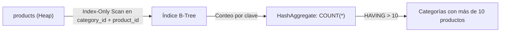

### Código de Solución

```sql
SELECT
    category_id,
    COUNT(*) AS total_productos
FROM products
GROUP BY category_id
HAVING COUNT(*) > 10
ORDER BY total_productos DESC;
```

> 🛠️ **Nota del Ingeniero de Datos:** Si existe un índice compuesto en `(category_id, product_id)`, PostgreSQL puede hacer Index-Only Scan (sin leer el Heap). Proyectar `category_name` sin incluirlo en `GROUP BY` ni hacer JOIN con `categories` genera error.

### Criterio de Evaluación del Entrevistador

Mide si el candidato comprende que `GROUP BY` sobre FK indexadas permite Index-Only Scan (sin tocar el Heap). Candidatos junior ignoran esta optimización de cobertura.

---

## Ejercicio 3: Productividad de la Fuerza de Ventas - Empleados con Mayor Volumen

### 🎓 Explicación del Profesor

**Analogía:** Es como querer saber qué vendedores tienen más de 80 pedidos cerrados. No te interesan los novatos; solo los que realmente mueven producto.

### Marco Conceptual del Optimizador

La consulta agrupa `orders` por `employee_id` (830 filas, 9 empleados). El optimizador lee secuencialmente la tabla transaccional, proyecta solo `employee_id` y `order_id` (tupla angosta), y acumula el contador. `HAVING COUNT(order_id) > 80` filtra los 3 empleados top. El planificador puede optar por GroupAggregate si `orders` está físicamente ordenada por `employee_id`.

### Diagrama de Flujo (Mermaid)

```mermaid
flowchart TD
    O["orders (Seq Scan)"] -->|Proyecto employee_id, order_id| Agg["GroupAggregate / HashAggregate"]
    Agg -->|employee_id, COUNT(*)| Groups["9 grupos (uno por empleado)"]
    Groups -->|HAVING COUNT(*) > 80| Top["Empleados con > 80 pedidos"]
    Top -->|ORDER BY total DESC| Out["Ranking de productividad"]
```

### Código de Solución

```sql
SELECT
    employee_id,
    COUNT(order_id) AS total_pedidos
FROM orders
GROUP BY employee_id
HAVING COUNT(order_id) > 80
ORDER BY total_pedidos DESC;
```

> 🛠️ **Nota del Ingeniero de Datos:** `COUNT(order_id)` ignora `NULLs` mientras `COUNT(*)` no. Con 830 filas y 9 empleados, HashAggregate es instantáneo. En tablas de millones, considera índices en la columna agrupada.

### Criterio de Evaluación del Entrevistador

Verifica que el candidato entienda el orden de procesamiento: `GROUP BY` colapsa filas, `HAVING` filtra grupos. Error: confundir `WHERE` por `HAVING` para filtrar agregaciones.

---

## Ejercicio 4: Cartera de Proveedores - Gestión de Abastecimiento

### 🎓 Explicación del Profesor

**Analogía:** Es como preguntarle al gerente de compras: "¿qué proveedores me tienen más de 3 productos?". Quieres trabajar solo con proveedores que tengan catálogos amplios.

### Marco Conceptual del Optimizador

Requiere un `INNER JOIN` entre `suppliers` y `products` antes de agrupar. PostgreSQL aplica Predicate Pushdown: primero une ambas tablas (Hash Join: `suppliers` es la tabla pequeña de 29 filas, se construye hash en `supplier_id`), luego agrupa por `supplier_id, company_name` y cuenta productos. `HAVING COUNT(p.product_id) > 3` retorna proveedores con cartera sustancial.

### Diagrama de Flujo (Mermaid)

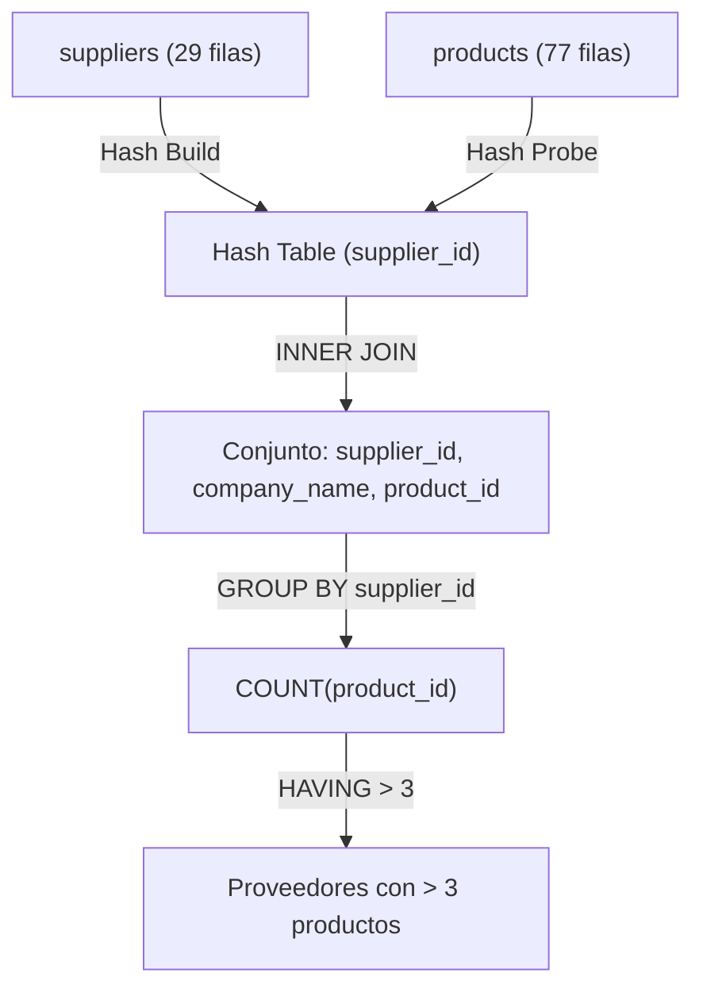

### Código de Solución

```sql
SELECT
    s.supplier_id,
    s.company_name,
    COUNT(p.product_id) AS total_productos
FROM suppliers s
INNER JOIN products p ON s.supplier_id = p.supplier_id
GROUP BY s.supplier_id, s.company_name
HAVING COUNT(p.product_id) > 3
ORDER BY total_productos DESC;
```

> 🛠️ **Nota del Ingeniero de Datos:** `suppliers` tiene solo 29 filas; el optimizador construye hash en memoria. En producción, verifica que `supplier_id` esté indexado. Ambos SGBD requieren que todas las columnas no agregadas estén en `GROUP BY`.

### Criterio de Evaluación del Entrevistador

Evalúa si el candidato sabe agrupar por columnas de la tabla padre después de un JOIN. Error común: olvidar incluir `s.company_name` en `GROUP BY` cuando está en `SELECT`.

---

## Ejercicio 5: Clientes Premium por Facturación - Segmentación Comercial

### 🎓 Explicación del Profesor

**Analogía:** Es como querer saber qué clientes gastaron más de $5,000 con nosotros. No te importa cuántos pedidos hicieron, sino cuánto dinero total dejaron.

### Marco Conceptual del Optimizador

Consulta que une `orders` con `order_details` (830 × 2155 filas) para calcular facturación por cliente. El optimizador ejecuta un Hash Join entre ambas tablas (tabla intermedia aproximada de 2155 filas), agrupa por `customer_id` y suma `(quantity * unit_price * (1 - discount))`. `HAVING SUM(...) > 5000` filtra solo los clientes de alto valor. La expresión aritmética se evalúa en la CPU por cada tupla antes de la agregación.

### Diagrama de Flujo (Mermaid)

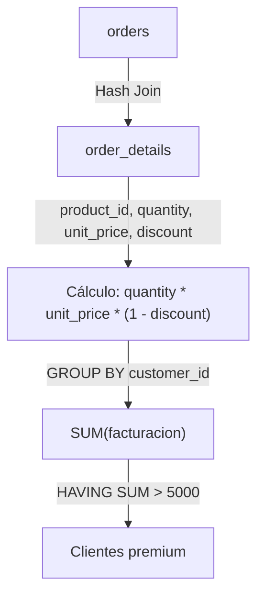

### Código de Solución

```sql
SELECT
    o.customer_id,
    ROUND(SUM(od.quantity * od.unit_price * (1 - od.discount))::numeric, 2) AS facturacion_total
FROM orders o
INNER JOIN order_details od ON o.order_id = od.order_id
GROUP BY o.customer_id
HAVING SUM(od.quantity * od.unit_price * (1 - od.discount)) > 5000
ORDER BY facturacion_total DESC;
```

> 🛠️ **Nota del Ingeniero de Datos:** La expresión `quantity * unit_price * (1 - discount)` se evalúa por cada fila (2155 filas). En producción, considera pre-calacular en una columna materializada. `discount` es decimal (0.15 = 15%), no porcentaje entero.

### Criterio de Evaluación del Entrevistador

Evalúa capacidad de expresión aritmética dentro de funciones agregadas. Error: duplicar la expresión en `SELECT` y `HAVING` sin considerar el impacto de reevaluación. PostgreSQL no cachea automáticamente la expresión entre cláusulas.

---

## Ejercicio 6: Rotación de Inventario - Productos Más Vendidos por Cantidad

### 🎓 Explicación del Profesor

**Analogía:** Es como revisar qué productos se venden más por cantidad (no por dinero). Un producto barato puede ser el más vendido aunque no genere más ingresos.

### Marco Conceptual del Optimizador

Agrupa `order_details` por `product_id`, sumando `quantity`. Con 2155 filas, el HashAggregate es eficiente. `HAVING SUM(quantity) > 200` descarta productos de baja rotación. El planificador proyecta solo `product_id` y `quantity` desde el Heap, minimizando el ancho de tupla en memoria.

### Diagrama de Flujo (Mermaid)

```mermaid
flowchart LR
    OD["order_details (Seq Scan)"] -->|Proyecto: product_id, quantity| Agg["HashAggregate (work_mem)"]
    Agg -->|SUM(quantity) GROUP BY product_id| Groups["77 grupos"]
    Groups -->|HAVING SUM > 200| Filtered["Productos alta rotación"]
    Filtered -->|ORDER BY total DESC| Out["Top ventas por cantidad"]
```

### Código de Solución

```sql
SELECT
    product_id,
    SUM(quantity) AS unidades_vendidas
FROM order_details
GROUP BY product_id
HAVING SUM(quantity) > 200
ORDER BY unidades_vendidas DESC;
```

> 🛠️ **Nota del Ingeniero de Datos:** `SUM(quantity)` retorna el total de unidades, no el total de dinero. Con 2155 filas, HashAggregate es eficiente. Para tablas de millones, crea un índice en `product_id`.

### Criterio de Evaluación del Entrevistador

Mide comprensión de agregación pura sobre tabla transaccional sin JOINs. Error: proyectar columnas como `product_name` sin incluir en `GROUP BY`.

---

## Ejercicio 7: Estacionalidad de Ventas - Pedidos por Año

### 🎓 Explicación del Profesor

**Analogía:** Es como querer saber cuántos exámenes hubo en cada año para planificar la carga de trabajo del profesor.

### Marco Conceptual del Optimizador

`GROUP BY EXTRACT(YEAR FROM order_date)` fuerza la evaluación de la función `EXTRACT` sobre cada tupla de `orders` (830 filas). PostgreSQL convierte la fecha a un entero de año y agrupa sobre ese valor derivado. El optimizador no puede usar un índice B-Tree en `order_date` para Index-Only Scan porque la expresión no es idéntica a la columna subyacente (`order_date` vs `EXTRACT`). `HAVING COUNT(*) > 100` retiene años con alta actividad.

### Diagrama de Flujo (Mermaid)

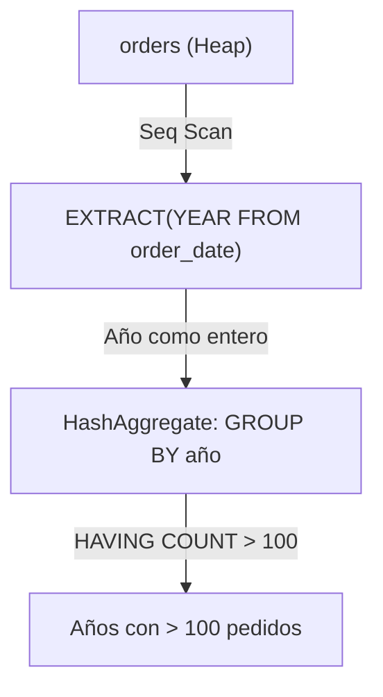

### Código de Solución

```sql
SELECT
    EXTRACT(YEAR FROM order_date)::int AS anio,
    COUNT(*) AS total_pedidos
FROM orders
GROUP BY EXTRACT(YEAR FROM order_date)
HAVING COUNT(*) > 100
ORDER BY anio;
```

> 🛠️ **Nota del Ingeniero de Datos:** `GROUP BY` con `EXTRACT` impide uso de índice. Para consultas frecuentes, crea un índice funcional: `CREATE INDEX idx_orders_year ON orders(EXTRACT(YEAR FROM order_date))`. PostgreSQL 15+ permite alias de `SELECT` en `GROUP BY`.

### Criterio de Evaluación del Entrevistador

Evalúa si el candidato sabe agrupar por expresiones derivadas. PostgreSQL 15+ permite alias de `GROUP BY` (`GROUP BY anio`) siempre que no haya ambigüedad. Error: usar alias de `SELECT` en `GROUP BY` sin conocer la precedencia lógica.

---

## Ejercicio 8: Logística Internacional - Países con Flete Promedio Elevado

### 🎓 Explicación del Profesor

**Analogía:** Es como querer saber en qué países el costo de envío es más caro en promedio. Si envías a Uruguay y el flete promedio es $80, algo debes cambiar en tu estrategia logística.

### Marco Conceptual del Optimizador

`GROUP BY ship_country` sobre 830 pedidos. `AVG(freight)` calcula la media aritmética manteniendo dos variables de estado transitorias (suma acumulada y contador). `HAVING AVG(freight) > 50` filtra países con costo logístico alto. El planificador puede usar un índice en `ship_country` si existe para reducir el Heap Scan, aunque la tabla es pequeña.

### Diagrama de Flujo (Mermaid)

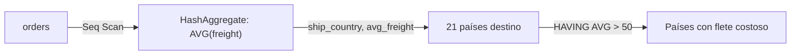

### Código de Solución

```sql
SELECT
    ship_country,
    ROUND(AVG(freight)::numeric, 2) AS flete_promedio,
    COUNT(*) AS total_pedidos
FROM orders
GROUP BY ship_country
HAVING AVG(freight) > 50
ORDER BY flete_promedio DESC;
```

> 🛠️ **Nota del Ingeniero de Datos:** `AVG()` y `COUNT()` se calculan en una sola pasada sobre los datos. En PostgreSQL 15+, `HAVING` puede referenciar alias de `SELECT` (`HAVING flete_promedio > 50`), pero no es portable. En SQL estándar, `HAVING` se evalúa antes que `SELECT`.

### Criterio de Evaluación del Entrevistador

Mide si el candidato maneja múltiples agregaciones y redondeo. Error: asumir que `HAVING` puede referenciar alias de `SELECT` (`flete_promedio`) — en SQL estándar, `HAVING` se evalúa antes que `SELECT`, por lo que debe repetir la expresión.

---

## Ejercicio 9: Distribución Geográfica del Equipo - Ciudades con Múltiples Empleados

### 🎓 Explicación del Profesor

**Analogía:** Es como querer saber en qué ciudades hay más de un empleado. Si Lima tiene 3 empleados y Cusco solo 1, solo Lima aparecerá en el reporte.

### Marco Conceptual del Optimizador

`GROUP BY city` sobre `employees` (9 filas). El Optimizador ejecuta un Seq Scan trivial y HashAggregate en `work_mem`. `HAVING COUNT(*) > 1` filtra ciudades con más de un empleado. La cardinalidad es tan baja que el plan es prácticamente instantáneo, pero el ejercicio refuerza el concepto de agrupamiento con filtro.

### Diagrama de Flujo (Mermaid)

```mermaid
flowchart TD
    E["employees (9 filas)"] -->|Seq Scan| Agg["HashAggregate"]
    Agg -->|GROUP BY city| Groups["Ciudades agrupadas"]
    Groups -->|HAVING COUNT(*) > 1| Out["Ciudades con 2+ empleados"]
```

### Código de Solución

```sql
SELECT
    city,
    COUNT(*) AS total_empleados
FROM employees
GROUP BY city
HAVING COUNT(*) > 1
ORDER BY total_empleados DESC;
```

> 🛠️ **Nota del Ingeniero de Datos:** Con solo 9 filas, este ejercicio es trivial. En producción con miles de empleados, crea un índice en `city` si haces esta consulta frecuentemente. No confundir `HAVING COUNT(*) > 1` (más de 1 empleado) con `HAVING COUNT(*) = 1` (solo 1 empleado).

### Criterio de Evaluación del Entrevistador

Ejercicio conceptual. El entrevistador busca confirmar que el candidato no usa `WHERE` para filtrar agregaciones. Error: escribir `WHERE COUNT(*) > 1`.

---

## Ejercicio 10: Estrategia de Precios - Categorías con Precio Promedio Superior

### 🎓 Explicación del Profesor

**Analogía:** Es como querer saber qué secciones del supermercado tienen precios promedio altos. Si la sección de electrónica promedia $200 y la de verduras $5, solo la electrónica aparecerá.

### Marco Conceptual del Optimizador

`GROUP BY category_id` sobre `products`, calculando `AVG(unit_price)`. PostgreSQL debe leer la columna `unit_price` (numeric) y `category_id` (int). `HAVING AVG(unit_price) > 25` retiene categorías cuyo precio promedio excede 25. Si existe un índice compuesto en `(category_id, unit_price)`, el optimizador puede ejecutar un *Index-Only Scan* evitando la lectura del Heap.

### Diagrama de Flujo (Mermaid)

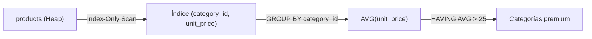

### Código de Solución

```sql
SELECT
    category_id,
    ROUND(AVG(unit_price)::numeric, 2) AS precio_promedio,
    COUNT(*) AS total_productos
FROM products
GROUP BY category_id
HAVING AVG(unit_price) > 25
ORDER BY precio_promedio DESC;
```

> 🛠️ **Nota del Ingeniero de Datos:** Si tienes un índice compuesto en `(category_id, unit_price)`, PostgreSQL puede hacer Index-Only Scan sin leer el Heap. `AVG(unit_price)` ignora valores `NULL` automáticamente.

### Criterio de Evaluación del Entrevistador

Evalúa si el candidato piensa en estrategias de indexación (índice de cobertura). Error: proyectar `category_name` sin incluirlo en `GROUP BY` ni usar JOIN.

---

## Sección 2: Subconsultas (Ejercicios 11-20)

---

## Ejercicio 11: Subconsulta Escalar - Producto Más Caro del Catálogo

### 🎓 Explicación del Profesor

**Analogía:** Es como preguntar "¿cuál es el producto más caro de toda la tienda?" y luego mostrar su ficha completa. Primero calculas el precio máximo, y luego buscas quién tiene ese precio.

### Marco Conceptual del Optimizador

La subconsulta escalar `(SELECT MAX(unit_price) FROM products)` se ejecuta una sola vez en la fase de iniciación de la consulta externa. PostgreSQL la trata como una constante paramétrica (el planificador la materializa como un `Result` node). El valor resultante se une implícitamente a cada fila de `products` sin costo adicional de E/S. La tabla se escanea dos veces: una para la subconsulta (Seq Scan con agregación) y otra para la externa.

### Diagrama de Flujo (Mermaid)

```mermaid
flowchart TD
    subgraph Subconsulta
        P1["products (Seq Scan)"] -->|MAX(unit_price)| MaxVal["Constante: 263.50"]
    end
    subgraph Consulta externa
        P2["products (Seq Scan 2)"] -->|Filtro: unit_price = MAX| Filter["unit_price = 263.50"]
        Filter --> Out["Producto más caro"]
    end
    MaxVal --> Filter
```

### Código de Solución

```sql
SELECT
    product_id,
    product_name,
    unit_price
FROM products
WHERE unit_price = (
    SELECT MAX(unit_price)
    FROM products
);
```

> 🛠️ **Nota del Ingeniero de Datos:** La subconsulta se ejecuta una sola vez como `InitPlan`. En productos con 77 filas es instantáneo, pero en tablas grandes considera usar `LIMIT 1` con `ORDER BY DESC`. Usar `IN` en lugar de `=` para subconsultas escalares funciona, pero es menos explícito.

### Criterio de Evaluación del Entrevistador

Mide si el candidato distingue subconsultas escalares (retornan 1 fila × 1 columna) de subconsultas de conjunto. Error: usar `=` con subconsulta que puede retornar múltiples filas (lanzaría error).

---

## Ejercicio 12: Subconsulta con IN - Productos de Proveedores Japoneses

### 🎓 Explicación del Profesor

**Analogía:** Es como decir "muéstrame todos los productos que vengan de proveedores de Japón". Primero buscas qué proveedores son japoneses, y luego filtrarás los productos de esos proveedores.

### Marco Conceptual del Optimizador

La subconsulta `SELECT supplier_id FROM suppliers WHERE country = 'Japan'` se ejecuta primero (materializada como tabla hash o resultado literal) y luego la externa usa `IN` para sondear. PostgreSQL transforma internamente `IN (subquery)` en un `Semi Join` (`Hash Semi Join`) si la subconsulta no es correlacionada, evitando duplicados. La tabla `suppliers` tiene 29 filas; el Hash Semi Join es óptimo.

### Diagrama de Flujo (Mermaid)

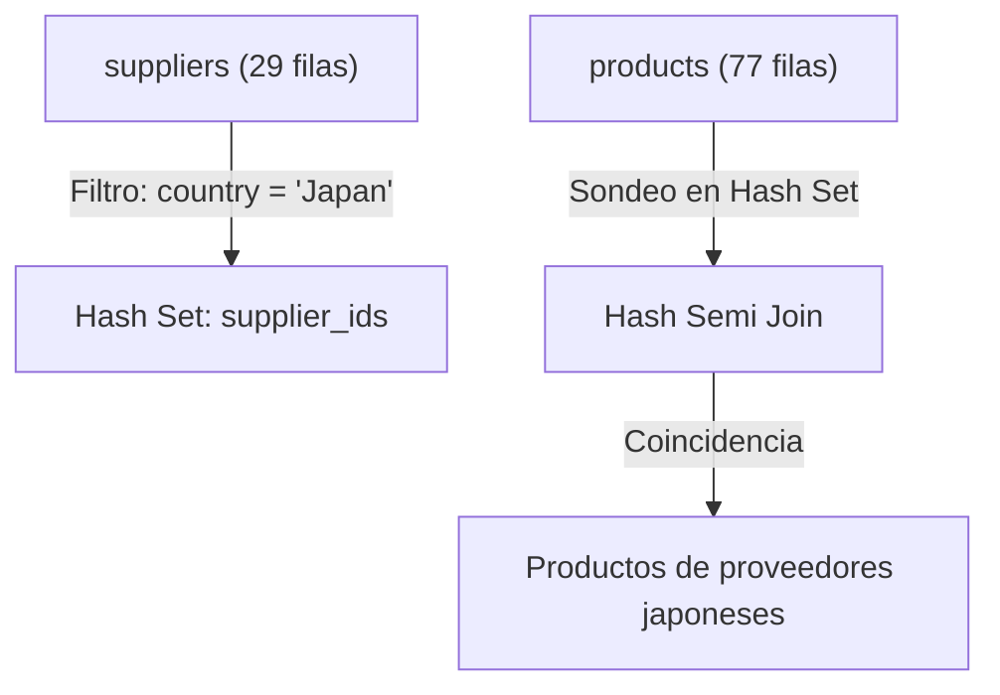

### Código de Solución

```sql
SELECT
    product_id,
    product_name,
    unit_price
FROM products
WHERE supplier_id IN (
    SELECT supplier_id
    FROM suppliers
    WHERE country = 'Japan'
)
ORDER BY product_name;
```

> 🛠️ **Nota del Ingeniero de Datos:** PostgreSQL transforma `IN (subquery)` en `Hash Semi Join` internamente. Es más eficiente que hacer un `JOIN` y luego `DISTINCT`. Usar `NOT IN` con subconsultas que pueden tener `NULLs` retorna 0 filas (resultado vacío inesperado). Preferir `NOT EXISTS` en esos casos.

### Criterio de Evaluación del Entrevistador

Evalúa comprensión de Semi Join. Error: usar `NOT IN (subquery)` con columnas anulables — si la subconsulta contiene `NULL`, `NOT IN` retorna 0 filas. Preferir `NOT EXISTS`.

---

## Ejercicio 13: Subconsulta Correlacionada - Productos sobre el Promedio de su Categoría

### 🎓 Explicación del Profesor

**Analogía:** Es como preguntar para cada producto: "¿este producto es más caro que el promedio de los demás productos de su misma categoría?". No comparas contra el promedio general, sino contra el promedio de SU categoría.

### Marco Conceptual del Optimizador

La subconsulta `SELECT AVG(p2.unit_price) FROM products p2 WHERE p2.category_id = p1.category_id` está correlacionada: hace referencia a `p1.category_id` de la consulta externa. PostgreSQL la ejecuta una vez **por cada fila** de la tabla externa (77 filas), resultando en un plan con `InitPlan` o `SubPlan`. Esto puede forzar un `Nested Loop` implícito con costo $O(N \times M)$. La subconsulta calcula `AVG` sobre el subconjunto de productos de la misma categoría.

### Diagrama de Flujo (Mermaid)

```mermaid
flowchart TD
    P1["products p1 (77 filas)"] -->|Para cada fila| Loop["SubPlan (correlacionado)"]
    Loop -->|Filtra p2.category_id = p1.category_id| P2["products p2 (Subconjunto por categoría)"]
    P2 -->|AVG(unit_price)| Avg["Promedio de la categoría"]
    Avg -->|¿p1.unit_price > AVG?| Check{"unit_price > promedio"}
    Check -->|Sí| Out["Producto sobre el promedio"]
```

### Código de Solución

```sql
SELECT
    product_name,
    unit_price,
    category_id
FROM products p1
WHERE unit_price > (
    SELECT AVG(unit_price)
    FROM products p2
    WHERE p2.category_id = p1.category_id
)
ORDER BY category_id, unit_price DESC;
```

> 🛠️ **Nota del Ingeniero de Datos:** Una subconsulta correlacionada sobre 77 filas × 77 promedios = ~6000 operaciones. Un `LATERAL JOIN` o una window function `AVG() OVER (PARTITION BY category_id)` es mucho más eficiente. Alternativa con CTE: calcular los promedios primero y luego hacer JOIN.

### Criterio de Evaluación del Entrevistador

¡Pregunta clásica de FAANG! Evalúa si el candidato comprende el costo cuadrático de las subconsultas correlacionadas vs alternativas (`LATERAL JOIN`, ventanas). Error: no entender que la subconsulta se ejecuta 77 veces.

---

## Ejercicio 14: Derived Table — Promedio de Ítems por Pedido

### 🎓 Explicación del Profesor

**Analogía:** Imagina que primero calculas cuántos exámenes rindió cada alumno, y luego sacas el promedio de esa lista. Primero obtienes un dato por alumno (derived table), y sobre ese resultado calculas el promedio general. Es como una consulta sobre otra consulta.

### Marco Conceptual del Optimizador

La subconsulta en `FROM` (derived table) calcula `COUNT(product_id)` por `order_id` (2155 filas agrupadas en ≈830 grupos). PostgreSQL materializa este resultado como una tabla temporal en memoria. Luego la consulta externa calcula `AVG(total_productos)` sobre esa tabla virtual. El optimizador no puede propagar condiciones de filtro hacia la derived table porque no hay cláusula `WHERE` externa.

### Diagrama de Flujo (Mermaid)

```mermaid
flowchart TD
    OD["order_details (2155 filas)"] -->|GROUP BY order_id| Agg["COUNT(product_id) por pedido"]
    Agg -->|Materializar| DT["Derived Table (830 filas)"]
    DT -->|AVG(total_productos)| Out["Promedio de ítems por pedido"]
```

### Código de Solución

```sql
SELECT
    ROUND(AVG(total_productos)::numeric, 2) AS promedio_items_por_pedido
FROM (
    SELECT
        order_id,
        COUNT(product_id) AS total_productos
    FROM order_details
    GROUP BY order_id
) AS pedido_counts;
```

> 🛠️ **Nota del Ingeniero de Datos:** Derived tables se materializan en memoria. En PostgreSQL 14+, el optimizador puede "push down" filtros externos hacia la derived table si la subconsulta no tiene `GROUP BY`, `LIMIT` ni `DISTINCT`. Olvidar el alias obligatorio (`AS pedido_counts`) lanza `ERROR: subquery in FROM must have an alias`.

### Criterio de Evaluación del Entrevistador

Mide si el candidato domina las derived tables (subconsultas en `FROM`). Error: omitir el alias obligatorio (`AS pedido_counts`) — PostgreSQL lanzará `ERROR: subquery in FROM must have an alias`.

---

## Ejercicio 15: EXISTS — Clientes con Actividad Comercial (Semi Join)

### 🎓 Explicación del Profesor

**Analogía:** Es como revisar una lista de invitados y preguntar: "¿esta persona está en la lista?". Solo necesitas saber SÍ está, no cuántas veces aparece ni qué fecha se anotó. En cuanto la encuentras, dejas de buscar.

### Marco Conceptual del Optimizador

`EXISTS` ejecuta un **Semi Join** lógico. PostgreSQL evaluará `EXISTS (SELECT 1 FROM orders o WHERE o.customer_id = c.customer_id)` y detendrá el escaneo interno en cuanto encuentre **la primera** coincidencia para cada cliente (short-circuit evaluation). Esto es radicalmente más eficiente que `IN` cuando la subconsulta puede retornar muchas filas. El `SELECT 1` es una convención: PostgreSQL ignora el contenido del `SELECT` dentro de `EXISTS`.

### Diagrama de Flujo (Mermaid)

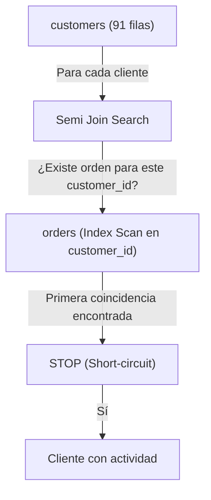

### Código de Solución

```sql
SELECT
    customer_id,
    company_name,
    country
FROM customers c
WHERE EXISTS (
    SELECT 1
    FROM orders o
    WHERE o.customer_id = c.customer_id
)
ORDER BY company_name;
```

> 🛠️ **Nota del Ingeniero de Datos:** `EXISTS` usa short-circuit: detiene la búsqueda en la primera coincidencia. En tablas grandes, esto es significativamente más rápido que `IN` que materializa todo el conjunto. MySQL a veces optimiza mal `EXISTS` en subconsultas simples.

### Criterio de Evaluación del Entrevistador

Evalúa si el candidato prefiere `EXISTS` sobre `IN` para consultas correlacionadas con posibles nulos. Error: escribir `SELECT *` dentro de `EXISTS` (ineficiente, aunque PostgreSQL lo ignore).

---

## Ejercicio 16: NOT EXISTS — Productos Inactivos (Nunca Vendidos)

### 🎓 Explicación del Profesor

**Analogía:** Es como buscar alumnos que nunca presentaron un examen. Recorres la lista de alumnos y verificas que NO exista ningún registro de examen para cada uno. Los que no tienen ningún registro son los que buscas.

### Marco Conceptual del Optimizador

`NOT EXISTS` implementa un **Anti Join** lógico: retorna todas las filas de la tabla izquierda que **no** tienen correspondencia en la derecha. PostgreSQL ejecuta un `Hash Anti Join`: construye un conjunto hash con los `product_id` de `order_details` (2155 filas) y luego escanea `products` (77 filas) verificando ausencia en el hash. Es inmune al problema de `NULL` que afecta a `NOT IN`.

### Diagrama de Flujo (Mermaid)

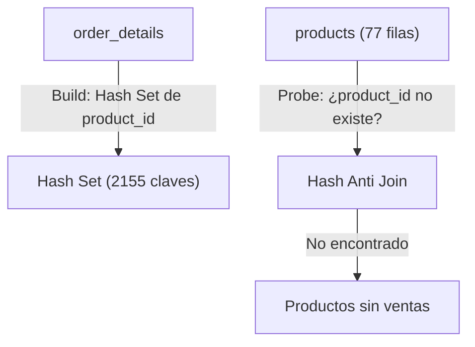

### Código de Solución

```sql
SELECT
    product_id,
    product_name,
    unit_price
FROM products p
WHERE NOT EXISTS (
    SELECT 1
    FROM order_details od
    WHERE od.product_id = p.product_id
);
```

> 🛠️ **Nota del Ingeniero de Datos:** `NOT EXISTS` ejecuta un Anti Join con hash. `NOT IN` requiere materializar todo el conjunto y comparar fila por fila. `NOT EXISTS` es más eficiente en la mayoría de casos. `NOT IN` con subconsulta que contiene `NULLs` retorna 0 filas (resultado vacío inesperado). Ejemplo: `WHERE id NOT IN (1, 2, NULL)` nunca retorna filas porque `NOT IN` con `NULL` siempre es `UNKNOWN`.

### Criterio de Evaluación del Entrevistador

¡Pregunta de seguridad! El entrevistador busca que el candidato evite `NOT IN (SELECT product_id FROM order_details)` porque `product_id` en `order_details` es parte de PK compuesta y no tiene `NULLs` (podría funcionar), pero la mejor práctica es usar `NOT EXISTS` siempre. Demostrar esta conciencia es señal de seniority.

---

## Ejercicio 17: ANY — Productos Más Caros que Cualquier Producto de Categoría 1

### 🎓 Explicación del Profesor

**Analogía:** Es como preguntar: "¿hay algún producto que cueste más que el producto más barato de la tienda A?". No necesitas que supere a TODOS los de la tienda A, solo a al menos uno. Si superas al más barato de allá, ya ganaste.

### Marco Conceptual del Optimizador

`> ANY (subquery)` retorna `TRUE` si el valor de la izquierda es mayor que **al menos un** valor de la subconsulta. PostgreSQL ejecuta la subconsulta interna primero (productos de categoría 1), materializa los precios, y para cada producto externo evalúa la comparación. Internamente puede reescribirse como `unit_price > (SELECT MIN(unit_price) FROM products WHERE category_id = 1)` si el optimizador detecta la equivalencia semántica.

### Diagrama de Flujo (Mermaid)

```mermaid
flowchart LR
    SubQ["Subconsulta: precios categoría 1"] -->|Materializar lista| Set["Set de precios"]
    P["products (todas categorías)"] -->|Por cada producto: unit_price > ANY(set)| Eval["Evaluar > ANY"]
    Eval -->|TRUE| Out["Productos más caros que alguno de categoría 1"]
```

### Código de Solución

```sql
SELECT
    product_id,
    product_name,
    unit_price,
    category_id
FROM products
WHERE unit_price > ANY (
    SELECT unit_price
    FROM products
    WHERE category_id = 1
)
ORDER BY unit_price;
```

> 🛠️ **Nota del Ingeniero de Datos:** PostgreSQL puede reescribir `> ANY (subquery)` como `> (SELECT MIN(...) FROM ...)` internamente, lo que permite usar un índice en la subconsulta. `= ANY` es equivalente a `IN`. Muchos desarrolladores no saben esta equivalencia.

### Criterio de Evaluación del Entrevistador

Mide comprensión de los cuantificadores lógicos. Error: confundir `ANY` con `ALL`. `> ANY` equivale a "mayor que el mínimo del conjunto".

---

## Ejercicio 18: ALL — Productos Más Caros que Todos los de Categoría 1

### 🎓 Explicación del Profesor

**Analogía:** Es como preguntar: "¿hay algún producto que cueste más que el producto más caro de la tienda A?". Aquí sí necesitas superar a TODOS los de la tienda A, no basta con superar a uno solo.

### Marco Conceptual del Optimizador

`> ALL (subquery)` retorna `TRUE` solo si el valor supera **todos** los valores de la subconsulta. PostgreSQL reescribe internamente como `unit_price > (SELECT MAX(unit_price) FROM products WHERE category_id = 1)`. La subconsulta se ejecuta una vez como `InitPlan`, produciendo una constante.

### Diagrama de Flujo (Mermaid)

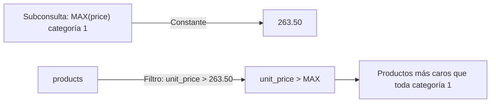

### Código de Solución

```sql
SELECT
    product_id,
    product_name,
    unit_price,
    category_id
FROM products
WHERE unit_price > ALL (
    SELECT unit_price
    FROM products
    WHERE category_id = 1
)
ORDER BY unit_price;
```

> 🛠️ **Nota del Ingeniero de Datos:** PostgreSQL reescribe `> ALL (subquery)` como `> (SELECT MAX(...) FROM ...)`. Esto produce una constante que se compara en una sola pasada. `<> ALL` equivale a `NOT IN`. Mismo riesgo con `NULLs`.

### Criterio de Evaluación del Entrevistador

Evalúa si el candidato distingue `ANY` vs `ALL`. Error común: pensar que `> ALL` requiere que la subconsulta retorne una sola fila.

---

## Ejercicio 19: Subconsulta Correlacionada en SELECT — Última Compra por Cliente

### 🎓 Explicación del Profesor

**Analogía:** Es como tener una lista de clientes y para cada uno abrir su expediente personal para ver cuándo fue la última vez que compraron. Recorres la lista de clientes uno por uno, y para cada uno buscas su última fecha de compra.

### Marco Conceptual del Optimizador

La subconsulta escalar en `SELECT` calcula `MAX(order_date)` para cada cliente. Por cada fila de `customers` (91 filas), PostgreSQL ejecuta la subconsulta correlacionada sobre `orders` (830 filas) usando un `Index Scan` en `orders(customer_id)` para localizar la fecha máxima. Si no existe índice, el plan sería un Seq Scan de orders por cada cliente (91 × 830 = 75,530 operaciones de E/S).

### Diagrama de Flujo (Mermaid)

```mermaid
flowchart TD
    C["customers (91 filas)"] -->|Por cada fila| Init["SubPlan"]
    Init -->|Index Scan: customer_id = c.customer_id| O["orders (Index Scan)"]
    O -->|MAX(order_date)| MaxDate["Última fecha de compra"]
    MaxDate -->|Proyectar como columna| Out["customer_id, company_name, ultima_compra"]
```

### Código de Solución

```sql
SELECT
    customer_id,
    company_name,
    (
        SELECT MAX(order_date)
        FROM orders o
        WHERE o.customer_id = c.customer_id
    ) AS ultima_compra
FROM customers c
ORDER BY ultima_compra DESC NULLS LAST;
```

> 🛠️ **Nota del Ingeniero de Datos:** Con 91 clientes y 830 pedidos, el Index Scan en `orders(customer_id)` hace esto eficiente. Sin índice, serían 91 escaneos secuenciales de `orders`. Un `LEFT JOIN LATERAL` con `LIMIT 1` es más explícito y a menudo más rápido para este patrón.

### Criterio de Evaluación del Entrevistador

Mide si el candidato conoce el patrón de subconsulta escalar en `SELECT` para enriquecer reportes. Error: no manejar `NULLS LAST` para clientes sin pedidos.

---

## Ejercicio 20: Subconsulta Anidada — Top 5 Productos por Ingresos

### 🎓 Explicación del Profesor

**Analogía:** Es como calcular las calificaciones de cada alumno, ordenarlos de mayor a menor, quedarte con los 5 mejores, y luego mostrar sus nombres completos. Son tres pasos: calcular, filtrar, y mostrar.

### Marco Conceptual del Optimizador

Consulta de tres niveles de anidación: la subconsulta más interna calcula ingresos por producto desde `order_details`; la intermedia ordena y limita a 5; la externa agrega el nombre del producto con un JOIN adicional. PostgreSQL ejecuta las subconsultas de adentro hacia afuera. La derived table `product_revenue` se materializa en memoria (77 filas, tabla pequeña).

### Diagrama de Flujo (Mermaid)

```mermaid
flowchart TD
    OD["order_details"] -->|SUM(quantity * unit_price * (1 - discount)) GROUP BY product_id| Rev["Ingresos por producto"]
    Rev -->|ORDER BY DESC LIMIT 5| Top5["Top 5 product_id"]
    Top5 -->|INNER JOIN products| P["products"]
    P --> Out["product_id, product_name, ingresos"]
```

### Código de Solución

```sql
SELECT
    p.product_id,
    p.product_name,
    r.ingresos_totales
FROM (
    SELECT
        product_id,
        ROUND(SUM(quantity * unit_price * (1 - discount))::numeric, 2) AS ingresos_totales
    FROM order_details
    GROUP BY product_id
    ORDER BY ingresos_totales DESC
    LIMIT 5
) r
INNER JOIN products p ON r.product_id = p.product_id
ORDER BY r.ingresos_totales DESC;
```

> 🛠️ **Nota del Ingeniero de Datos:** Con `LIMIT 5`, el optimizador puede usar un Top-N Sort en memoria en lugar de ordenar toda la tabla. En PostgreSQL 14+, puedes usar `LATERAL` para hacer el JOIN de forma más eficiente si la derived table es costosa.

### Criterio de Evaluación del Entrevistador

Evalúa si el candidato estructura consultas anidadas de forma legible. Error: perder la cardinalidad al hacer `JOIN` después de `LIMIT` (funciona aquí porque `LIMIT` se aplica antes del `JOIN`). En PostgreSQL 15+, las derived tables con `LIMIT` se evalúan completamente antes del `JOIN` externo.

---

## Ejercicio 21: CASE Simple — Segmentación de Precios (Económico / Intermedio / Premium)

### 🎓 Explicación del Profesor

**Analogía:** Es como un semáforo que clasifica productos por precio: verde si es barato, amarillo si es normal, rojo si es caro. Revisas el precio de cada producto y le pones la etiqueta que corresponde.

### Marco Conceptual del Optimizador

La expresión `CASE` se evalúa en la fase de proyección de tuplas (después de `WHERE`, antes de `ORDER BY`). PostgreSQL implementa `CASE` como una serie de comparaciones booleanas en CPU: la primera condición verdadera cortocircuita la evaluación. No hay impacto en el plan de acceso a disco; es puramente computacional en la capa de proyección.

### Diagrama de Flujo (Mermaid)

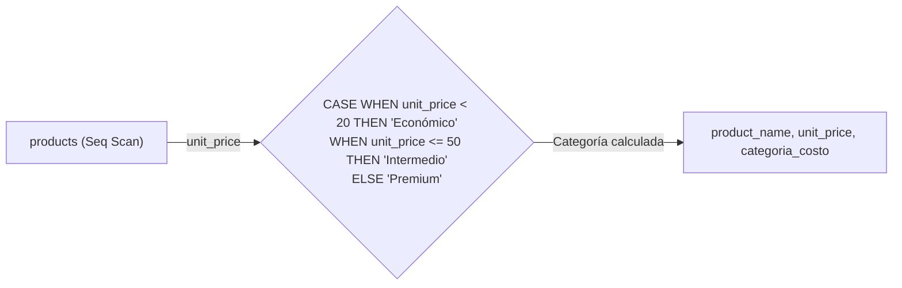

### Código de Solución

```sql
SELECT
    product_name,
    unit_price,
    CASE
        WHEN unit_price < 20 THEN 'Económico'
        WHEN unit_price <= 50 THEN 'Intermedio'
        ELSE 'Premium'
    END AS categoria_costo
FROM products
ORDER BY unit_price;
```

> 🛠️ **Nota del Ingeniero de Datos:** `CASE` se evalúa en la capa de proyección, no en la de acceso a disco. No afecta el plan de ejecución. Para múltiples condiciones, `CASE searched` (`CASE WHEN condición`) es más flexible que `CASE simple` (`CASE columna WHEN valor`).

### Criterio de Evaluación del Entrevistador

Mide si el candidato conoce la sintaxis `CASE` searched (sin expresión después de `CASE`). Error: olvidar que `CASE` retorna la primera coincidencia y el orden de las cláusulas `WHEN` importa.

---

## Ejercicio 22: CASE Searched — Zona Logística de Clientes

### 🎓 Explicación del Profesor

**Analogía:** Es como colorear un mapa por regiones: si el país está en América del Norte, pintas de azul; si está en Europa, de verde; y el resto de gris. Recorres cada cliente y le asignas su zona según su país.

### Marco Conceptual del Optimizador

`CASE` searched evalúa condiciones booleanas arbitrarias. Similar al ejercicio anterior, la evaluación es puramente computacional en la capa de proyección. La función se aplica a cada una de las 91 filas de `customers`, con cortocircuito en la primera coincidencia. Las condiciones con `IN` son evaluadas como comparación de conjunto (el motor expande `IN` a una serie de `OR`).

### Diagrama de Flujo (Mermaid)

```mermaid
flowchart LR
    C["customers (91 filas)"] -->|country| Case{"CASE WHEN country IN ('USA','Canada','Mexico') THEN 'Norteamérica'\nWHEN country IN ('UK','Germany','France','Spain','Italy') THEN 'Europa'\nELSE 'Resto del Mundo'"}
    Case -->|zona_logistica| Out["company_name, country, zona_logistica"]
```

### Código de Solución

```sql
SELECT
    company_name,
    country,
    CASE
        WHEN country IN ('USA', 'Canada', 'Mexico') THEN 'Norteamérica'
        WHEN country IN ('UK', 'Germany', 'France', 'Spain', 'Italy') THEN 'Europa'
        ELSE 'Resto del Mundo'
    END AS zona_logistica
FROM customers
ORDER BY country;
```

> 🛠️ **Nota del Ingeniero de Datos:** `CASE` searched con `IN` puede ser reescrito como múltiples `OR` internamente. Para listas largas, considera usar una tabla temporal de referencia. Ambos SGBD soportan `CASE` searched con la misma sintaxis.

### Criterio de Evaluación del Entrevistador

Evalúa si el candidato usa `CASE` searched sin expresión después de `CASE`. Error: escribir `CASE country WHEN IN (...)` (sintaxis inválida). `CASE` simple no acepta `IN`.

---

## Ejercicio 23: CASE + FILTER — Conteo Condicional por Zona Geográfica

### 🎓 Explicación del Profesor

**Analogía:** Es como tener tres contadores en la mesa: uno para América, otro para Europa, y otro para el resto. Recorres la lista de clientes y sumas +1 al contador que corresponda según el país. Un solo recorrido, tres contadores.

### Marco Conceptual del Optimizador

`COUNT(*) FILTER (WHERE ...)` es una extensión PostgreSQL que implementa agregación condicional sin subconsultas. Internamente, la función de ventana/agregación mantiene un contador que solo se incrementa cuando el `FILTER` es `TRUE`. El `FILTER` se evalúa tupla por tupla durante el escaneo, y la agregación acumula en una sola pasada sobre los datos. Esto evita escanear la tabla múltiples veces o usar costosos `CASE` dentro de `COUNT`.

### Diagrama de Flujo (Mermaid)

```mermaid
flowchart TD
    C["customers (Seq Scan)"] -->|Filtros condicionales| Filters["FILTER: country IN ('USA','Canada','Mexico')\nFILTER: country IN ('UK','Germany','France','Spain','Italy')\nFILTER: ELSE"]
    Filters -->|Tres contadores| Agg["COUNT(*) FILTER 1 | COUNT(*) FILTER 2 | COUNT(*) FILTER 3"]
    Agg --> Out["Norteamérica: 16 | Europa: 45 | Resto: 30"]
```

### Código de Solución

```sql
SELECT
    COUNT(*) FILTER (
        WHERE country IN ('USA', 'Canada', 'Mexico')
    ) AS norteamerica,
    COUNT(*) FILTER (
        WHERE country IN ('UK', 'Germany', 'France', 'Spain', 'Italy')
    ) AS europa,
    COUNT(*) FILTER (
        WHERE country NOT IN ('USA', 'Canada', 'Mexico', 'UK', 'Germany', 'France', 'Spain', 'Italy')
    ) AS resto_del_mundo
FROM customers;
```

> 🛠️ **Nota del Ingeniero de Datos:** `FILTER` es una extensión PostgreSQL más legible que `COUNT(CASE WHEN ... THEN 1 END)`. Ambos producen el mismo plan de ejecución. `FILTER` no está soportado en MySQL. Usar `CASE WHEN` como alternativa portable.

### Criterio de Evaluación del Entrevistador

Mide si el candidato conoce `FILTER (WHERE ...)` como alternativa superior a `CASE WHEN ... THEN 1 END`. En PostgreSQL 15+, `FILTER` es más legible y tiene el mismo plan de ejecución optimizado. Error: usar múltiples subconsultas `SELECT (SELECT COUNT(*) FROM ... WHERE ...)` para cada categoría.

---

## Ejercicio 24: CASE + SUM — Pivote de Ventas por Año en Columnas

### 🎓 Explicación del Profesor

**Analogía:** Es como tener columnas separadas para 1996, 1997 y 1998, y para cada cliente ir sumando las ventas en la columna del año que corresponda. Transformas filas en columnas manualmente.

### Marco Conceptual del Optimizador

`SUM(CASE WHEN ... THEN value ELSE 0 END)` implementa un pivote manual (filas a columnas). PostgreSQL evalúa el `CASE` para cada tupla de `order_details` JOIN `orders` (2155 filas), y la función `SUM` acumula selectivamente. El optimizador no puede indexar sobre la expresión condicional, por lo que el plan es un Hash Join seguido de HashAggregate con múltiples acumuladores.

### Diagrama de Flujo (Mermaid)

```mermaid
flowchart TD
    O["orders"] -->|INNER JOIN| OD["order_details"]
    OD -->|Cálculo por fila| Case{"CASE WHEN EXTRACT(YEAR FROM order_date) = 1996 THEN importe ELSE 0\nCASE WHEN EXTRACT(YEAR FROM order_date) = 1997 THEN importe ELSE 0\nCASE WHEN EXTRACT(YEAR FROM order_date) = 1998 THEN importe ELSE 0"}
    Case -->|GROUP BY customer_id| Agg["SUM(1996), SUM(1997), SUM(1998)"]
    Agg --> Out["customer_id, ventas_1996, ventas_1997, ventas_1998"]
```

### Código de Solución

```sql
SELECT
    o.customer_id,
    ROUND(SUM(CASE WHEN EXTRACT(YEAR FROM o.order_date) = 1996
              THEN od.quantity * od.unit_price * (1 - od.discount) ELSE 0 END)::numeric, 2) AS ventas_1996,
    ROUND(SUM(CASE WHEN EXTRACT(YEAR FROM o.order_date) = 1997
              THEN od.quantity * od.unit_price * (1 - od.discount) ELSE 0 END)::numeric, 2) AS ventas_1997,
    ROUND(SUM(CASE WHEN EXTRACT(YEAR FROM o.order_date) = 1998
              THEN od.quantity * od.unit_price * (1 - od.discount) ELSE 0 END)::numeric, 2) AS ventas_1998
FROM orders o
INNER JOIN order_details od ON o.order_id = od.order_id
GROUP BY o.customer_id
ORDER BY o.customer_id;
```

> 🛠️ **Nota del Ingeniero de Datos:** El pivote manual con `CASE` + `SUM` funciona bien para pocos valores. Para muchos valores dinámicos, usa `crosstab()` de la extensión `tablefunc`. Olvidar `ELSE 0` genera `NULLs` que complican reportes y cálculos posteriores.

### Criterio de Evaluación del Entrevistador

Evalúa técnica de pivoteo sin `crosstab()`. Error: no usar `ELSE 0` — si no hay ventas en un año, `SUM(CASE ... END)` retorna `NULL` en lugar de `0`.

---

## Ejercicio 25: CASE para Antigüedad Laboral — Clasificación de Empleados

### 🎓 Explicación del Profesor

**Analogía:** Es como clasificar atletas por su experiencia: los que llevan más de 30 años son veteranos (oro), 20-30 son seniors (plata), 10-20 son experimentados (bronce), y los nuevos son novatos. Mides la antigüedad y asignas la categoría.

### Marco Conceptual del Optimizador

`CASE` con funciones de fecha (`AGE`, `EXTRACT`). `AGE(hire_date)` retorna un intervalo; `EXTRACT(YEAR FROM AGE(...))` extrae los años. La evaluación se realiza en la proyección sobre 9 filas. PostgreSQL optimiza la función `AGE` como immutable para el mismo valor de entrada, permitiendo cacheo de resultados.

### Diagrama de Flujo (Mermaid)

```mermaid
flowchart LR
    E["employees (Seq Scan)"] -->|hire_date| Age["EXTRACT(YEAR FROM AGE(hire_date))"]
    Age -->|Años de antigüedad| Case{"CASE WHEN >= 30 THEN 'Veterano'\nWHEN >= 20 THEN 'Senior'\nWHEN >= 10 THEN 'Experimentado'\nELSE 'Nuevo'"}
    Case --> Out["employee_id, nombre, antigüedad, categoría"]
```

### Código de Solución

```sql
SELECT
    employee_id,
    first_name || ' ' || last_name AS nombre_completo,
    EXTRACT(YEAR FROM AGE(hire_date))::int AS anios_antiguedad,
    CASE
        WHEN EXTRACT(YEAR FROM AGE(hire_date)) >= 30 THEN 'Veterano'
        WHEN EXTRACT(YEAR FROM AGE(hire_date)) >= 20 THEN 'Senior'
        WHEN EXTRACT(YEAR FROM AGE(hire_date)) >= 10 THEN 'Experimentado'
        ELSE 'Nuevo'
    END AS categoria_antiguedad
FROM employees
ORDER BY anios_antiguedad DESC;
```

> 🛠️ **Nota del Ingeniero de Datos:** `AGE()` es inmutable y puede cachearse. Calcular `EXTRACT(YEAR FROM AGE(hire_date))` dos veces (en `SELECT` y en `ORDER BY`) duplica el trabajo. Considera usar un CTE o alias. Hardcodear el año actual en lugar de usar `CURRENT_DATE` es frágil.

### Criterio de Evaluación del Entrevistador

Mide si el candidato usa `AGE()` correctamente. Error: calcular antigüedad como `2024 - EXTRACT(YEAR FROM hire_date)` — frágil y no usa funciones nativas de PostgreSQL.

---

## Ejercicio 26: CASE en ORDER BY — Priorización Personalizada de Países

### 🎓 Explicación del Profesor

**Analogía:** Es como cuando hay una fila de pacientes y el doctor decide atender primero a los de emergencia, luego a los graves, y al final a los leves. No es orden alfabético ni por hora, sino por regla de negocio.

### Marco Conceptual del Optimizador

`CASE` dentro de `ORDER BY` permite ordenamiento customizado. El motor evalúa el `CASE` para cada fila durante la fase de ordenamiento (después de `SELECT`). Si el conjunto es grande, la expresión se evalúa antes del sort y se almacena como clave de ordenamiento en `work_mem`. No hay impacto en el plan de acceso, pero la expresión puede aumentar la memoria requerida para el sort.

### Diagrama de Flujo (Mermaid)

```mermaid
flowchart LR
    C["customers (Seq Scan)"] -->|country| Case{"CASE WHEN country = 'USA' THEN 1\nWHEN country = 'Germany' THEN 2\nWHEN country = 'UK' THEN 3\nELSE 4"}
    Case -->|Clave de orden personalizada| Sort["ORDER BY CASE priority, country"]
    Sort --> Out["Clientes USA primero, luego Germany, luego UK, luego resto"]
```

### Código de Solución

```sql
SELECT
    customer_id,
    company_name,
    country
FROM customers
ORDER BY
    CASE
        WHEN country = 'USA' THEN 1
        WHEN country = 'Germany' THEN 2
        WHEN country = 'UK' THEN 3
        ELSE 4
    END,
    country;
```

> 🛠️ **Nota del Ingeniero de Datos:** `CASE` en `ORDER BY` puede impedir el uso de índices para el ordenamiento. En tablas grandes, puede ser más eficiente calcular la columna en `SELECT` y ordenar por ella. Creer que el alias de `CASE` en `SELECT` se puede usar en `ORDER BY` sin repetir la expresión es un error común.

### Criterio de Evaluación del Entrevistador

Evalúa creatividad en `ORDER BY`. Útil para reportes donde ciertos mercados tienen prioridad visual. Error: no entender que `CASE` en `ORDER BY` puede referenciar columnas no incluidas en `SELECT`.

---

## Ejercicio 27: CASE + FILTER Combinados — Reporte de Desempeño por Trimestre

### 🎓 Explicación del Profesor

**Analogía:** Es como armar un reporte trimestral donde para cada vendedor calculas sus ventas por trimestre, y además cuentas cuántos pedidos tuvieron descuento. Son dos métricas distintas en una sola consulta.

### Marco Conceptual del Optimizador

Combinación de `FILTER` (para agregación condicional nativa) y `CASE` (para lógica compleja). PostgreSQL evalúa ambos en la misma pasada de agregación. `FILTER` es puramente una condición booleana que el acumulador verifica; `CASE` es una expresión evaluada antes de pasar el valor al acumulador.

### Diagrama de Flujo (Mermaid)

```mermaid
flowchart TD
    O["orders"] -->|INNER JOIN| OD["order_details"]
    OD -->|Para cada fila| Case{"CASE WHEN EXTRACT(QUARTER FROM order_date) = 1 THEN importe ELSE 0\n... para 4 trimestres"}
    Case -->|COUNT(*) FILTER (WHERE discount > 0)| Agg["SUM por trimestre, COUNT con descuento"]
    Agg -->|GROUP BY employee_id| Out["employee_id, Q1, Q2, Q3, Q4, pedidos_con_descuento"]
```

### Código de Solución

```sql
SELECT
    o.employee_id,
    ROUND(SUM(CASE WHEN EXTRACT(QUARTER FROM o.order_date) = 1
              THEN od.quantity * od.unit_price * (1 - od.discount) ELSE 0 END)::numeric, 2) AS q1,
    ROUND(SUM(CASE WHEN EXTRACT(QUARTER FROM o.order_date) = 2
              THEN od.quantity * od.unit_price * (1 - od.discount) ELSE 0 END)::numeric, 2) AS q2,
    ROUND(SUM(CASE WHEN EXTRACT(QUARTER FROM o.order_date) = 3
              THEN od.quantity * od.unit_price * (1 - od.discount) ELSE 0 END)::numeric, 2) AS q3,
    ROUND(SUM(CASE WHEN EXTRACT(QUARTER FROM o.order_date) = 4
              THEN od.quantity * od.unit_price * (1 - od.discount) ELSE 0 END)::numeric, 2) AS q4,
    COUNT(*) FILTER (WHERE od.discount > 0) AS pedidos_con_descuento
FROM orders o
INNER JOIN order_details od ON o.order_id = od.order_id
GROUP BY o.employee_id
ORDER BY o.employee_id;
```

> 🛠️ **Nota del Ingeniero de Datos:** `FILTER` es más legible que `CASE WHEN` dentro de `COUNT`/`SUM`. Ambos producen el mismo plan, pero `FILTER` comunica mejor la intención. Usa `FILTER` para conteos y `CASE` para valores condicionales.

### Criterio de Evaluación del Entrevistador

Ejercicio integrador de `CASE` + `FILTER`. El entrevistador busca que el candidato distinga cuándo usar uno u otro: `FILTER` para agregación condicional nativa, `CASE` dentro de `SUM` para valores condicionales.

---

## Ejercicio 28: CASE en HAVING — Categorías con Alto Ratio de Productos Caros

### 🎓 Explicación del Profesor

**Analogía:** Es como querer saber qué secciones del supermercado tienen más del 50% de productos caros. Primero agrupas por sección, cuentas los productos caros y el total, y luego filtras las secciones que cumplen el criterio.

### Marco Conceptual del Optimizador

`CASE` dentro de `HAVING` permite filtrar grupos basados en agregaciones condicionales. El motor agrupa primero, calcula las agregaciones condicionales para cada grupo, y luego aplica `HAVING`. En este caso, `SUM(CASE WHEN unit_price > 30 THEN 1 ELSE 0 END)` cuenta productos caros por categoría, y `HAVING` retiene categorías con al menos 3 productos caros.

### Diagrama de Flujo (Mermaid)

```mermaid
flowchart TD
    P["products (Seq Scan)"] -->|GROUP BY category_id| Agg["SUM(CASE WHEN unit_price > 30 THEN 1 ELSE 0 END) AS productos_caros\nCOUNT(*) AS total"]
    Agg -->|HAVING productos_caros >= 3| Filtered["Categorías con >=3 productos > 30"]
    Filtered -->|Cociente: productos_caros / total| Out["category_id, ratio"]
```

### Código de Solución

```sql
SELECT
    category_id,
    COUNT(*) AS total_productos,
    SUM(CASE WHEN unit_price > 30 THEN 1 ELSE 0 END) AS productos_caros,
    ROUND(
        SUM(CASE WHEN unit_price > 30 THEN 1 ELSE 0 END)::numeric
        / COUNT(*)::numeric * 100, 2
    ) AS porcentaje_caros
FROM products
GROUP BY category_id
HAVING SUM(CASE WHEN unit_price > 30 THEN 1 ELSE 0 END) >= 3
ORDER BY porcentaje_caros DESC;
```

> 🛠️ **Nota del Ingeniero de Datos:** `SUM(CASE WHEN ...)` es evaluado por el motor de agregación. Es equivalente a `COUNT(*) FILTER (WHERE ...)` pero menos legible. En PostgreSQL 15+, `HAVING` puede referenciar alias de `SELECT`, pero no es portable a versiones anteriores ni a otros SGBD.

### Criterio de Evaluación del Entrevistador

Mide si el candidato usa `CASE` dentro de funciones agregadas en `HAVING`. Error: olvidar que `HAVING` se evalúa antes que `SELECT` (no puede referenciar alias `productos_caros` en PostgreSQL, aunque en algunos dialectos sí).

---

## Ejercicio 29: CASE Anidado — Categorización Compleja de Descuentos

### 🎓 Explicación del Profesor

**Analogía:** Es como un árbol de decisiones: un doctor que primero pregunta: "¿tiene fiebre?". Si no, es resfriado común. Si sí, pregunta: "¿tiene tos?". Si no, es gripe leve. Si sí, es neumonía. Cada pregunta te lleva por un camino diferente.

### Marco Conceptual del Optimizador

`CASE` anidados se evalúan de adentro hacia afuera. Cada nivel de anidamiento agrega comparaciones booleanas adicionales. PostgreSQL evalúa el `CASE` más interno primero, y su resultado alimenta el `CASE` externo. No hay penalización significativa de rendimiento para anidamientos poco profundos (2-3 niveles) sobre conjuntos pequeños como 2155 filas.

### Diagrama de Flujo (Mermaid)

```mermaid
flowchart LR
    OD["order_details"] -->|discount| Inner{"CASE interno: \nWHEN discount = 0 THEN 'Sin descuento'\nWHEN discount <= 0.05 THEN 'Descuento bajo'\nWHEN discount <= 0.15 THEN 'Descuento medio'\nELSE 'Descuento alto'"}
    Inner -->|categoria_1| Outer{"CASE externo:\nWHEN 'Sin descuento' THEN 'Precio completo'\nWHEN 'Descuento bajo' THEN 'Mínima promoción'\nELSE 'En promoción'"}
    Outer --> Out["order_id, product_id, discount, clasificación"]
```

### Código de Solución

```sql
SELECT
    order_id,
    product_id,
    discount,
    CASE
        WHEN discount = 0 THEN 'Precio completo'
        ELSE
            CASE
                WHEN discount <= 0.05 THEN 'Mínima promoción'
                WHEN discount <= 0.15 THEN 'Promoción media'
                ELSE 'Alta promoción'
            END
    END AS tipo_descuento
FROM order_details
ORDER BY discount DESC;
```

> 🛠️ **Nota del Ingeniero de Datos:** `CASE` anidado con 2-3 niveles es eficiente. Niveles más profundos dificultan el mantenimiento sin impacto significativo en rendimiento. Un `CASE` searched plano con rangos explícitos es más legible y mantenible.

### Criterio de Evaluación del Entrevistador

Evalúa si el candidato puede estructurar lógica condicional compleja. Alternativa recomendada: usar `CASE` searched plano en lugar de anidado para legibilidad. Error: olvidar el `END` del `CASE` interno.

---

## Ejercicio 30: CASE con Agregación Múltiple — Reporte de Ventas por Región (Pivote)

### 🎓 Explicación del Profesor

**Analogía:** Es como tener un marcador donde anotas los puntos de cada equipo en columnas separadas. Recorres cada pedido y sumas el importe en la columna del país de destino correspondiente.

### Marco Conceptual del Optimizador

Este es un pivote manual completo: `SUM(CASE WHEN country IN (...) THEN importe END)` para cada región. La tabla `orders` se une con `order_details` (2155 filas), se agrupa por `employee_id`, y se calculan 4 acumuladores simultáneos en una sola pasada. El optimizador no puede usar índices en las expresiones `CASE`.

### Diagrama de Flujo (Mermaid)

```mermaid
flowchart TD
    O["orders"] -->|JOIN ship_country| OD["order_details"]
    OD -->|importe| Cases["4 acumuladores CASE"]
    Cases -->|GROUP BY employee_id| Agg["SUM(USA), SUM(Europa), SUM(Latam), SUM(Resto)"]
    Agg -->|ORDER BY employee_id| Out["employee_id, usa, europa, latam, resto"]
```

### Código de Solución

```sql
SELECT
    o.employee_id,
    ROUND(SUM(CASE WHEN o.ship_country IN ('USA', 'Canada', 'Mexico')
              THEN od.quantity * od.unit_price * (1 - od.discount) ELSE 0 END)::numeric, 2) AS norteamerica,
    ROUND(SUM(CASE WHEN o.ship_country IN ('UK', 'Germany', 'France', 'Spain', 'Italy')
              THEN od.quantity * od.unit_price * (1 - od.discount) ELSE 0 END)::numeric, 2) AS europa,
    ROUND(SUM(CASE WHEN o.ship_country IN ('Argentina', 'Brazil', 'Venezuela')
              THEN od.quantity * od.unit_price * (1 - od.discount) ELSE 0 END)::numeric, 2) AS latam,
    ROUND(SUM(CASE WHEN o.ship_country NOT IN ('USA', 'Canada', 'Mexico', 'UK', 'Germany', 'France', 'Spain', 'Italy', 'Argentina', 'Brazil', 'Venezuela')
              THEN od.quantity * od.unit_price * (1 - od.discount) ELSE 0 END)::numeric, 2) AS resto_mundo
FROM orders o
INNER JOIN order_details od ON o.order_id = od.order_id
GROUP BY o.employee_id
ORDER BY o.employee_id;
```

> 🛠️ **Nota del Ingeniero de Datos:** Pivote manual con `CASE` funciona para pocas columnas. Para columnas dinámicas, considera `crosstab()` o una vista materializada. Olvidar `ELSE 0` genera `NULLs`. Usar `COALESCE` o `ELSE 0` siempre.

### Criterio de Evaluación del Entrevistador

Evalúa habilidad de pivoteo manual. El entrevistador busca que el candidato reconozca cuándo esto es adecuado vs cuándo usar la extensión `tablefunc` con `crosstab()`. Error: no manejar clientes sin ventas en una región (resultado `NULL` vs `0`).

---

## Ejercicio 31: SELF JOIN — Organigrama Jerárquico de Empleados

### 🎓 Explicación del Profesor

**Analogía:** Es como un árbol genealógico donde cada persona tiene un padre. Cruzas la lista de personas dos veces: una para encontrar al empleado y otra para encontrar a su jefe. El resultado te muestra quién reporta a quién.

### Marco Conceptual del Optimizador

El `SELF JOIN` crea dos instancias lógicas de la misma tabla física `employees` en el plan de ejecución. El optimizador asigna alias `e` (empleado) y `m` (manager) a dos instancias separadas en memoria. La condición `e.reports_to = m.employee_id` se resuelve mediante un `Hash Join` si no hay índice, o un `Nested Loop` con Index Scan si existe un índice en `reports_to`. Como la tabla tiene solo 9 filas, el plan es trivial.

### Diagrama de Flujo (Mermaid)

```mermaid
flowchart TD
    E["employees e (Subordinados)"] -->|e.reports_to = m.employee_id| Join["INNER JOIN (SELF)"]
    M["employees m (Managers)"] --> Join
    Join -->|Coincidencia| Out["empleado | cargo_empleado | manager | cargo_manager"]
```

### Código de Solución

```sql
SELECT
    e.employee_id,
    e.first_name || ' ' || e.last_name AS empleado,
    e.title AS cargo_empleado,
    m.first_name || ' ' || m.last_name AS manager,
    m.title AS cargo_manager
FROM employees e
INNER JOIN employees m ON e.reports_to = m.employee_id
ORDER BY e.employee_id;
```

> 🛠️ **Nota del Ingeniero de Datos:** Con solo 9 filas es trivial. En organigramas grandes, crea un índice en `reports_to` y considera usar Recursive CTE para jerarquías de múltiples niveles. No manejar `NULLs` en `reports_to` (el CEO no tiene jefe) es un error común.

### Criterio de Evaluación del Entrevistador

Mide si el candidato comprende la auto-referenciación relacional. Error: usar `LEFT JOIN` aquí excluiría al Presidente (Andrew Fuller, `reports_to IS NULL`). Si se desea incluirlo, debe ser `LEFT JOIN`. La elección depende del requerimiento.

---

## Ejercicio 32: SELF JOIN — Empleados que Comparten el Mismo Manager

### 🎓 Explicación del Profesor

**Analogía:** Es como encontrar compañeros que comparten el mismo supervisor. Recorres la lista de empleados dos veces y buscas pares que tengan el mismo jefe pero sean personas distintas.

### Marco Conceptual del Optimizador

SELF JOIN no-equitativo: `e1.reports_to = e2.reports_to AND e1.employee_id <> e2.employee_id`. El optimizador cruza la tabla consigo misma encontrando pares de empleados que reportan al mismo jefe. El plan es un `Nested Loop` sobre las 9 filas con filtro adicional de desigualdad. La tabla es tan pequeña que el plan es instantáneo.

### Diagrama de Flujo (Mermaid)

```mermaid
flowchart TD
    E1["employees e1"] -->|e1.reports_to = e2.reports_to| Cross["Cruce cruzado"]
    E2["employees e2"] --> Cross
    Cross -->|Filtro: e1.employee_id <> e2.employee_id| Filter["Excluir mismo empleado"]
    Filter -->|e1.employee_id < e2.employee_id| Dedup["Eliminar pares duplicados"]
    Dedup --> Out["e1 (colega) | e2 (colega) | manager_id"]
```

### Código de Solución

```sql
SELECT
    e1.employee_id AS empleado1_id,
    e1.first_name || ' ' || e1.last_name AS empleado1,
    e2.employee_id AS empleado2_id,
    e2.first_name || ' ' || e2.last_name AS empleado2,
    e1.reports_to AS manager_id
FROM employees e1
INNER JOIN employees e2 ON e1.reports_to = e2.reports_to
    AND e1.employee_id < e2.employee_id
ORDER BY e1.reports_to, e1.employee_id;
```

> 🛠️ **Nota del Ingeniero de Datos:** El patrón `e1.employee_id < e2.employee_id` reduce las combinaciones a la mitad y elimina duplicados en una sola operación. Usar `<>` genera pares `(A,B)` y `(B,A)` duplicados.

### Criterio de Evaluación del Entrevistador

Evalúa si el candidato conoce el patrón de "pares únicos" usando `<` en lugar de `<>` para evitar duplicados simétricos. Error: usar `<>` que genera pares `(A,B)` y `(B,A)` duplicados.

---

## Ejercicio 33: FULL OUTER JOIN — Empleados vs Territorios (Todos de Ambos Lados)

### 🎓 Explicación del Profesor

**Analogía:** Es como un registro civil que muestra todos los matrimonios: los que se casaron (coincidencias), los solteros (empleados sin territorio), y los viudos (territorios sin empleado). Nadie se queda fuera.

### Marco Conceptual del Optimizador

`FULL OUTER JOIN` preserva filas de ambas tablas. PostgreSQL implementa el `FULL OUTER JOIN` como la combinación de un `LEFT JOIN` y un `RIGHT JOIN` con `UNION`, o más eficientemente como un `Hash Join` con marcadores de presencia. Las filas sin correspondencia se rellenan con `NULL`. `employee_territories` es la tabla puente; al hacer FULL JOIN directo entre `employees` y `employee_territories`, se preservan empleados sin territorio y territorios sin empleado.

### Diagrama de Flujo (Mermaid)

```mermaid
flowchart TD
    E["employees"] -->|FULL OUTER JOIN| ET["employee_territories"]
    ET -->|Coincidencia| Match["filas emparejadas"]
    E -->|Sin coincidencia| LeftNull["Empleados sin territorio (NULLs a la derecha)"]
    ET -->|Sin coincidencia| RightNull["Territorios sin empleado (NULLs a la izquierda)"]
    Match & LeftNull & RightNull --> Out["Resultado FULL OUTER"]
```

### Código de Solución

```sql
SELECT
    e.employee_id,
    e.first_name || ' ' || e.last_name AS empleado,
    et.territory_id
FROM employees e
FULL OUTER JOIN employee_territories et ON e.employee_id = et.employee_id
ORDER BY e.employee_id NULLS LAST, et.territory_id NULLS LAST;
```

> 🛠️ **Nota del Ingeniero de Datos:** `FULL OUTER JOIN` es menos eficiente que `LEFT`/`RIGHT JOIN` porque requiere marcadores de presencia en ambas tablas. En PostgreSQL se implementa como la combinación de `LEFT` y `RIGHT JOIN`. MySQL no soporta `FULL OUTER JOIN`. La alternativa es `LEFT JOIN UNION RIGHT JOIN`.

### Criterio de Evaluación del Entrevistador

Mide si el candidato entiende la diferencia entre FULL y LEFT/RIGHT JOIN. Error: asumir que FULL JOIN siempre produce filas con `NULLs` en ambos lados (ambas tablas pueden tener todas las filas emparejadas).

---

## Ejercicio 34: FULL OUTER JOIN — Clientes y Pedidos (Análisis Completo)

### 🎓 Explicación del Profesor

**Analogía:** Es como cruzar el padrón de votantes con los que efectivamente votaron. Quieres ver todos los votantes (aunque no votaron) y todos los votos (aunque el votante no está en el padrón). Es una auditoría completa de integridad.

### Marco Conceptual del Optimizador

FULL OUTER JOIN entre `customers` (91 filas) y `orders` (830 filas). PostgreSQL construye un Hash Join con marcadores de presencia. Clientes sin pedidos aparecen con `NULL` en columnas de `orders`; pedidos huérfanos (sin cliente válido) aparecen con `NULL` en columnas de `customers`. Esto permite detectar inconsistencias de integridad referencial.

### Diagrama de Flujo (Mermaid)

```mermaid
flowchart LR
    C["customers"] -->|FULL JOIN| O["orders"]
    O -->|customer_id| Join["Hash Full Join"]
    Join --> Out["Todos los clientes (con/sin pedidos) + Pedidos huérfanos (si existen)"]
```

### Código de Solución

```sql
SELECT
    c.customer_id AS id_cliente,
    c.company_name,
    o.order_id,
    o.order_date
FROM customers c
FULL OUTER JOIN orders o ON c.customer_id = o.customer_id
ORDER BY c.customer_id NULLS LAST, o.order_id NULLS LAST;
```

> 🛠️ **Nota del Ingeniero de Datos:** FULL JOIN entre tablas grandes es costoso. Para auditorías, considera `LEFT JOIN` y `RIGHT JOIN` por separado con `UNION`. Asumir que la FK siempre garantiza integridad es un error; FULL JOIN detecta registros huérfanos.

### Criterio de Evaluación del Entrevistador

Evalúa si el candidato usa FULL JOIN para auditoría de integridad referencial. Error: no usar `NULLS LAST` en `ORDER BY` — por defecto PostgreSQL ordena `NULLs` primero (dependiendo de la configuración).

---

## Ejercicio 35: JOIN de 5 Tablas — Trazabilidad Completa de un Producto en un Pedido

### 🎓 Explicación del Profesor

**Analogía:** Es como reconstruir el historial completo de un paciente: desde el pedido del médico, el producto indicado, la categoría terapéutica, el proveedor que lo fabricó, y la fecha del pedido. Son 5 fuentes de información que se cruzan.

### Marco Conceptual del Optimizador

Consulta que une 5 tablas: `order_details` → `products` → `categories` → `suppliers` → `orders`. El optimizador usa algoritmos genéticos (GEQO) para determinar el orden óptimo de joins. Con 5 tablas pequeñas, el plan típico comienza JOINeando `order_details` con `products` (índice en PK), luego `categories` (índice en PK), luego `suppliers` (índice en PK), y finalmente `orders`. Cada JOIN reduce la cardinalidad del conjunto intermedio.

### Diagrama de Flujo (Mermaid)

```mermaid
flowchart TD
    OD["order_details"] -->|product_id| P["products"]
    P -->|category_id| C["categories"]
    P -->|supplier_id| S["suppliers"]
    OD -->|order_id| O["orders"]
    C & S & O --> Out["order_id | product_name | category_name | supplier_name | order_date"]
```

### Código de Solución

```sql
SELECT
    od.order_id,
    p.product_name,
    c.category_name,
    s.company_name AS proveedor,
    o.order_date,
    od.quantity,
    od.unit_price
FROM order_details od
INNER JOIN products p ON od.product_id = p.product_id
INNER JOIN categories c ON p.category_id = c.category_id
INNER JOIN suppliers s ON p.supplier_id = s.supplier_id
INNER JOIN orders o ON od.order_id = o.order_id
ORDER BY od.order_id, p.product_name;
```

> 🛠️ **Nota del Ingeniero de Datos:** 5 JOINs sobre tablas pequeñas con índices en PK/FK son instantáneos. En tablas grandes, el orden de los JOINs importa: empieza por las tablas más filtradas. Usar `SELECT *` en joins múltiples genera columnas duplicadas de columnas con el mismo nombre.

### Criterio de Evaluación del Entrevistador

Evalúa si el candidato mantiene legibilidad en JOINS múltiples. Error: perder filas por usar `INNER JOIN` cuando un `LEFT JOIN` sería necesario (p. ej., si un producto no tiene categoría).

---

## Ejercicio 36: JOIN de 4 Tablas — Reporte Logístico Completo

### 🎓 Explicación del Profesor

**Analogía:** Es como armar el manifiesto de un envío: necesitas saber qué cliente pidió, quién lo atendió, quién lo transportó, y cuándo se hizo. Son 4 fuentes de datos que se unen en un solo documento.

### Marco Conceptual del Optimizador

4 tablas: `orders` → `customers`, `orders` → `employees`, `orders` → `shippers`. El optimizador usa `orders` como tabla central (tabla de hechos en esquema estrella). Como `customers` (91), `employees` (9), y `shippers` (3) son tablas pequeñas, el optimizador construye Hash Joins secuenciales, agregando cada tabla dimensión al conjunto intermedio. El plan es un `Nested Loop` con índices.

### Diagrama de Flujo (Mermaid)

```mermaid
flowchart TD
    O["orders (Tabla de hechos)"] -->|customer_id| C["customers"]
    O -->|employee_id| E["employees"]
    O -->|ship_via| S["shippers"]
    C & E & S -->|Hash Joins secuenciales| Out["Reporte consolidado de operaciones"]
```

### Código de Solución

```sql
SELECT
    o.order_id,
    o.order_date,
    c.company_name AS cliente,
    e.first_name || ' ' || e.last_name AS empleado,
    s.company_name AS transportista,
    o.freight
FROM orders o
INNER JOIN customers c ON o.customer_id = c.customer_id
INNER JOIN employees e ON o.employee_id = e.employee_id
INNER JOIN shippers s ON o.ship_via = s.shipper_id
ORDER BY o.order_date DESC
LIMIT 20;
```

> 🛠️ **Nota del Ingeniero de Datos:** `orders` es la tabla central (hechos) y las otras son dimensiones. El optimizador construye hashes de las tablas pequeñas primero. No limitar el resultado con `LIMIT` cuando el reporte puede retornar miles de filas es un error común.

### Criterio de Evaluación del Entrevistador

Evalúa capacidad de construir reportes multi-tabla. Error: no usar alias descriptivos, haciendo el SQL críptico.

---

## Ejercicio 37: RIGHT JOIN — Empleados y sus Pedidos (Preservando Empleados)

### 🎓 Explicación del Profesor

**Analogía:** RIGHT JOIN es como un espejo de LEFT JOIN. Si giras la consulta, puedes ver los mismos datos. Es como escribir la misma frase al revés: el resultado es el mismo, solo cambia el orden de las palabras.

### Marco Conceptual del Optimizador

`RIGHT JOIN` es la imagen espejo de `LEFT JOIN`. El parser de PostgreSQL reescribe internamente `RIGHT JOIN` como `LEFT JOIN` invirtiendo el orden de las tablas en el árbol sintáctico. `orders RIGHT JOIN employees` es equivalente a `employees LEFT JOIN orders`. Es una transformación puramente sintáctica: el optimizador genera el mismo plan físico independientemente.

### Diagrama de Flujo (Mermaid)

```mermaid
flowchart TD
    O["orders (izquierda en código)"] -->|RIGHT JOIN| E["employees (derecha — preservada)"]
    E -->|Parser reescribe como LEFT JOIN| Rewrite["employees LEFT JOIN orders"]
    Rewrite --> Out["Todos los empleados con/sin pedidos"]
```

### Código de Solución

```sql
SELECT
    e.employee_id,
    e.first_name || ' ' || e.last_name AS empleado,
    o.order_id,
    o.order_date
FROM orders o
RIGHT JOIN employees e ON o.employee_id = e.employee_id
ORDER BY e.employee_id;
```

> 🛠️ **Nota del Ingeniero de Datos:** `RIGHT JOIN` y `LEFT JOIN` producen exactamente el mismo plan de ejecución. PostgreSQL reescribe internamente uno como el otro. Es preferible usar `LEFT JOIN` por convención y legibilidad.

### Criterio de Evaluación del Entrevistador

El entrevistador busca que el candidato explique que `RIGHT JOIN` es sintácticamente redundante y que prefiere `LEFT JOIN` para legibilidad. Error: sugerir que `RIGHT JOIN` tiene mejor rendimiento que `LEFT JOIN` (falso, el plan es idéntico tras la reescritura).

---

## Ejercicio 38: CROSS JOIN + Filtro — Combinaciones de Productos y Categorías

### 🎓 Explicación del Profesor

**Analogía:** Es como combinar todos los platos con todas las bebidas para crear pares, pero luego te quedas solo con los platos que van bien con la bebida que eliges. Primero generas todas las combinaciones, y luego filtras las que tienen sentido.

### Marco Conceptual del Optimizador

`CROSS JOIN` genera el producto cartesiano de dos tablas (77 × 8 = 616 filas). El optimizador implementa el CROSS JOIN como un `Nested Loop` sin condición de join. El filtro `WHERE p.category_id = c.category_id` transforma el CROSS JOIN en un INNER JOIN lógico. En PostgreSQL, escribir `FROM products p, categories c WHERE p.category_id = c.category_id` es equivalente a `CROSS JOIN` + `WHERE`. El optimizador trata ambas formulaciones de forma idéntica.

### Diagrama de Flujo (Mermaid)

```mermaid
flowchart TD
    P["products (77 filas)"] -->|CROSS JOIN| Cart["Producto Cartesiano (77 × 8 = 616 filas)"]
    C["categories (8 filas)"] --> Cart
    Cart -->|Filtro: p.category_id = c.category_id| Filter["Filtrar a 77 filas"]
    Filter --> Out["product_name, category_name"]
```

### Código de Solución

```sql
SELECT
    p.product_name,
    c.category_name,
    p.unit_price
FROM products p
CROSS JOIN categories c
WHERE p.category_id = c.category_id
ORDER BY c.category_name, p.product_name;
```

> 🛠️ **Nota del Ingeniero de Datos:** PostgreSQL optimiza `CROSS JOIN + WHERE` a INNER JOIN internamente. El plan es idéntico. Sin el `WHERE`, un CROSS JOIN genera N × M filas. Con 77 productos y 8 categorías serían 616 filas; con tablas grandes podrían ser millones.

### Criterio de Evaluación del Entrevistador

Mide si el candidato entiende que CROSS JOIN + WHERE es equivalente a INNER JOIN. Error: olvidar el filtro y generar un producto cartesiano masivo no intencional.

---

## Ejercicio 39: JOIN con Condición Compuesta — Pedidos y Detalles con Filtro en ON

### 🎓 Explicación del Profesor

**Analogía:** Es como tener un filtro que no solo une dos tuberías, sino que además bloquea el agua sucia antes de que se mezcle. El filtro está integrado en la unión, no después.

### Marco Conceptual del Optimizador

La condición de JOIN puede incluir múltiples predicados más allá de la FK. `INNER JOIN order_details od ON o.order_id = od.order_id AND od.discount > 0` filtra los detalles con descuento **durante** la operación de JOIN, no después. El optimizador puede usar un `Hash Join` donde la tabla hash solo contiene filas con `discount > 0`, reduciendo el tamaño de la estructura hash en memoria.

### Diagrama de Flujo (Mermaid)

```mermaid
flowchart TD
    O["orders"] -->|Hash Join| HT["Hash Table (order_details con discount > 0)"]
    OD["order_details"] -->|Filtro: discount > 0 (durante build)| HT
    HT -->|Sondeo por order_id| Out["Pedidos con al menos un detalle con descuento"]
```

### Código de Solución

```sql
SELECT
    o.order_id,
    o.order_date,
    od.product_id,
    od.discount
FROM orders o
INNER JOIN order_details od ON o.order_id = od.order_id
    AND od.discount > 0
ORDER BY od.discount DESC;
```

> 🛠️ **Nota del Ingeniero de Datos:** Filtrar en `ON` permite al optimizador reducir el tamaño de la tabla hash antes del JOIN, lo que puede mejorar el rendimiento. En `LEFT JOIN`, si pones el filtro en `ON`, las filas sin coincidencia aparecen con `NULLs`. Si lo pones en `WHERE`, esas filas desaparecen.

### Criterio de Evaluación del Entrevistador

Evalúa si el candidato distingue filtrar en `ON` vs `WHERE` para JOINs. En `INNER JOIN` no hay diferencia lógica (ambos producen mismo resultado), pero en `OUTER JOIN` la ubicación del filtro cambia el resultado. Error: pensar que siempre es lo mismo sin considerar el tipo de JOIN.

---

## Ejercicio 40: JOIN con LATERAL — Subconsulta por Fila para el Último Pedido de Cada Cliente

### 🎓 Explicación del Profesor

**Analogía:** Es como tener un asistente que para cada cliente busca su último pedido en la base de datos. No haces una búsqueda general, sino que le pasas el nombre del cliente y él busca específicamente ese registro.

### Marco Conceptual del Optimizador

`LATERAL` permite que la subconsulta en `FROM` referencie columnas de tablas precedentes en el mismo `FROM`. Es una alternativa a subconsultas correlacionadas. Para cada fila de `customers` (91 filas), PostgreSQL ejecuta la subconsulta lateral que obtiene el último pedido usando `ORDER BY order_date DESC LIMIT 1`. El plan es un `Nested Loop` con `Limit` — para cada cliente, un Index Scan en `orders(customer_id, order_date)` encuentra la última fecha instantáneamente.

### Diagrama de Flujo (Mermaid)

```mermaid
flowchart TD
    C["customers (91 filas)"] -->|Para cada fila| Loop["Nested Loop"]
    Loop -->|Index Scan: customer_id, ORDER BY order_date DESC LIMIT 1| O["orders (Index Scan)"]
    O -->|Último pedido| Out["customer_id, company_name, order_id, order_date"]
```

### Código de Solución

```sql
SELECT
    c.customer_id,
    c.company_name,
    ultimo_pedido.order_id,
    ultimo_pedido.order_date
FROM customers c
CROSS JOIN LATERAL (
    SELECT o.order_id, o.order_date
    FROM orders o
    WHERE o.customer_id = c.customer_id
    ORDER BY o.order_date DESC
    LIMIT 1
) ultimo_pedido
ORDER BY ultimo_pedido.order_date DESC;
```

> 🛠️ **Nota del Ingeniero de Datos:** `LATERAL` con `LIMIT 1` es más eficiente que subconsulta correlacionada porque el optimizador puede aplicar el Sort + Limit por cada grupo. `CROSS JOIN LATERAL` excluye filas sin coincidencia. Usar `LEFT JOIN LATERAL ... ON TRUE` para preservar todas las filas.

### Criterio de Evaluación del Entrevistador

¡Técnica avanzada! El entrevistador busca si el candidato conoce `LATERAL` como optimización sobre subconsultas correlacionadas. Nota: este JOIN excluye clientes sin pedidos (usa `INNER JOIN`). Para incluirlos, usar `LEFT JOIN LATERAL ... ON TRUE`.

---

## Ejercicio 41: ROW_NUMBER — Ranking Secuencial de Productos por Precio

### 🎓 Explicación del Profesor

**Analogía:** Es como asignar número de dorsal a corredores según su tiempo de llegada: el más rápido lleva el #1, el siguiente el #2, y así sucesivamente. No hay empates, cada uno tiene un número único.

### Marco Conceptual del Optimizador

`ROW_NUMBER() OVER (ORDER BY unit_price DESC)` asigna números secuenciales únicos (1, 2, 3, ...) basados en el orden descendente de `unit_price`. La función de ventana opera **después** de `WHERE`, `GROUP BY` y `HAVING`, pero **antes** de `ORDER BY` final y `LIMIT`. PostgreSQL evalúa la ventana en una fase separada del plan de ejecución (WindowAgg node), que ordena las filas en `work_mem` y aplica la numeración.

### Diagrama de Flujo (Mermaid)

```mermaid
flowchart LR
    P["products (Seq Scan)"] -->|Ordenar por unit_price DESC| Sort["Sort Node (work_mem)"]
    Sort -->|WindowAgg| Win["ROW_NUMBER() OVER (ORDER BY unit_price DESC)"]
    Win -->|Numeración secuencial| Out["product_name, unit_price, ranking_secuencial"]
```

### Código de Solución

```sql
SELECT
    product_name,
    unit_price,
    ROW_NUMBER() OVER (ORDER BY unit_price DESC) AS ranking_secuencial
FROM products
ORDER BY ranking_secuencial;
```

> 🛠️ **Nota del Ingeniero de Datos:** `ROW_NUMBER` es una de las window functions más eficientes porque solo asigna números secuenciales sin resolver empates. No usar `ORDER BY` dentro de `OVER()` genera un orden indefinido. `ROW_NUMBER` sin `ORDER BY` asigna números arbitrarios.

### Criterio de Evaluación del Entrevistador

Mide comprensión básica de window functions. Error: creer que `ROW_NUMBER` garantiza un orden específico sin `ORDER BY` en la ventana. Error: confundir `ROW_NUMBER` con `RANK`.

---

## Ejercicio 42: RANK y DENSE_RANK — Ranking con Empates por Categoría

### 🎓 Explicación del Profesor

**Analogía:** Si dos corredores llegan empatados en segundo lugar, RANK les da a ambos el puesto #2, y el siguiente pasa al #4 (salta el #3). DENSE_RANK les da el #2 al siguiente es el #3 (sin saltos). Como en la Olimpiada vs en un examen.

### Marco Conceptual del Optimizador

`RANK() OVER (PARTITION BY category_id ORDER BY unit_price DESC)` y `DENSE_RANK()` difieren en el tratamiento de empates. `RANK` genera saltos después de un empate (1, 1, 3, ...), `DENSE_RANK` no (1, 1, 2, ...). El WindowAgg particiona las filas por `category_id`, ordena por precio dentro de cada partición, y asigna rangos. Las particiones se procesan secuencialmente en memoria; si hay muchas particiones, PostgreSQL puede derramar a disco.

### Diagrama de Flujo (Mermaid)

```mermaid
flowchart TD
    P["products"] -->|PARTITION BY category_id| Partition["Particiones por categoría"]
    Partition -->|ORDER BY unit_price DESC| Sort["Ordenar dentro de cada partición"]
    Sort -->|RANK() vs DENSE_RANK()| Win["WindowAgg"]
    Win -->|Con empates| Out["category_id, product_name, unit_price, rank, dense_rank"]
```

### Código de Solución

```sql
SELECT
    category_id,
    product_name,
    unit_price,
    RANK() OVER (PARTITION BY category_id ORDER BY unit_price DESC) AS rango_con_saltos,
    DENSE_RANK() OVER (PARTITION BY category_id ORDER BY unit_price DESC) AS rango_sin_saltos
FROM products
ORDER BY category_id, rango_con_saltos;
```

> 🛠️ **Nota del Ingeniero de Datos:** `RANK` y `DENSE_RANK` requieren resolver empates, lo que puede ser más costoso que `ROW_NUMBER` en conjuntos grandes. `ROW_NUMBER` + una columna adicional para desambiguar empates es la forma más común en producción.

### Criterio de Evaluación del Entrevistador

Pregunta clásica de entrevista técnica. El entrevistador busca que el candidato explique las diferencias entre `ROW_NUMBER`, `RANK` y `DENSE_RANK` con ejemplos concretos. Error: no entender que `RANK` salta números tras empates.

---

## Ejercicio 43: Top-N por Grupo — Los 3 Productos Más Caros de Cada Categoría

### 🎓 Explicación del Profesor

**Analogía:** Es como sacar los 3 mejores alumnos de cada salón. Primero ordenas a los alumnos de cada salón por nota, y te quedas con los 3 primeros de cada uno. No puedes hacer esto con `GROUP BY` común porque `GROUP BY` colapsa las filas.

### Marco Conceptual del Optimizador

Para obtener el top-N por grupo, se usa una subconsulta con ventana que asigna `ROW_NUMBER()` por partición, y luego la externa filtra `WHERE rn <= 3`. PostgreSQL ejecuta primero el WindowAgg internamente (ordena por categoría y precio), numera las filas, y luego la consulta externa aplica el filtro. No hay un operador específico "Top-N por grupo" en el optimizador; se implementa como WindowAgg + Filter.

### Diagrama de Flujo (Mermaid)

```mermaid
flowchart TD
    P["products"] -->|PARTITION BY category_id ORDER BY unit_price DESC| Win["WindowAgg: ROW_NUMBER()"]
    Win -->|WHERE rn <= 3| Filter["Filtro externo"]
    Filter -->|Solo 3 por categoría| Out["Top 3 productos más caros por categoría"]
```

### Código de Solución

```sql
WITH ranked_products AS (
    SELECT
        category_id,
        product_id,
        product_name,
        unit_price,
        ROW_NUMBER() OVER (
            PARTITION BY category_id
            ORDER BY unit_price DESC
        ) AS rn
    FROM products
)
SELECT
    rp.category_id,
    c.category_name,
    rp.product_name,
    rp.unit_price,
    rp.rn
FROM ranked_products rp
INNER JOIN categories c ON rp.category_id = c.category_id
WHERE rp.rn <= 3
ORDER BY rp.category_id, rp.rn;
```

> 🛠️ **Nota del Ingeniero de Datos:** En PostgreSQL 12+, el optimizador puede usar un "WindowAgg + Limit" más eficiente que materializar todo el CTE. Para tablas grandes, crea un índice en `(category_id, unit_price DESC)`. No confundir top-N por grupo con `MAX()` por grupo. `MAX()` solo retorna un valor, no los N más caros.

### Criterio de Evaluación del Entrevistador

¡Pregunta clásica de top-N por grupo! El entrevistador evalúa si el candidato usa CTE con window function para resolver el patrón. Error: intentar usar `GROUP BY` + `LIMIT` (no funciona para top-N por grupo).

---

## Ejercicio 44: LAG — Diferencia entre Pedido Actual y Anterior del Mismo Cliente

### 🎓 Explicación del Profesor

**Analogía:** Es como poner un reloj al lado de cada cliente y medir cuántos días pasaron desde su último pedido. LAG te da el momento en que hizo el pedido anterior, y la resta te da los días transcurridos.

### Marco Conceptual del Optimizador

`LAG(order_date, 1) OVER (PARTITION BY customer_id ORDER BY order_date)` accede a la fila anterior dentro de la misma partición de cliente. El WindowAgg mantiene un buffer de una fila por partición para proporcionar el valor `LAG`. Si no hay fila anterior, retorna `NULL`. La diferencia de fechas se calcula con el operador de resta de PostgreSQL, que retorna un `interval`.

### Diagrama de Flujo (Mermaid)

```mermaid
flowchart TD
    O["orders"] -->|PARTITION BY customer_id ORDER BY order_date| Win["WindowAgg: LAG(order_date)"]
    Win -->|order_date - LAG = dias_entre_pedidos| Calc["Diferencia de fechas (interval)"]
    Calc --> Out["customer_id, order_id, order_date, order_date_anterior, dias_diferencia"]
```

### Código de Solución

```sql
SELECT
    customer_id,
    order_id,
    order_date,
    LAG(order_date, 1) OVER (
        PARTITION BY customer_id
        ORDER BY order_date
    ) AS fecha_pedido_anterior,
    order_date - LAG(order_date, 1) OVER (
        PARTITION BY customer_id
        ORDER BY order_date
    ) AS dias_entre_pedidos
FROM orders
ORDER BY customer_id, order_date;
```

> 🛠️ **Nota del Ingeniero de Datos:** `LAG` y `LEAD` son window functions muy eficientes porque solo necesitan un buffer de 1 fila por partición. `LAG` retorna `NULL` para la primera fila de cada partición. Usar `COALESCE` si necesitas un valor por defecto.

### Criterio de Evaluación del Entrevistador

Mide si el candidato conoce `LAG` para análisis temporal. Error: no considerar el `NULL` en el primer pedido de cada cliente (no hay fila anterior). El entrevistador valora si el candidato menciona que el resultado incluye `NULLs` para la primera fila.

---

## Ejercicio 45: LEAD — Detección de Próximo Pedido por Cliente

### 🎓 Explicación del Profesor

**Analogía:** Es como mirar tu calendario y ver cuándo es tu próxima cita. LEAD te da la fecha del siguiente pedido de cada cliente, como si leyeras el calendario hacia adelante.

### Marco Conceptual del Optimizador

`LEAD(order_date, 1) OVER (PARTITION BY customer_id ORDER BY order_date)` proporciona la siguiente fecha de pedido para cada fila. Similar a `LAG`, pero mirando hacia adelante. El WindowAgg procesa las filas en orden y almacena en un buffer la fila siguiente. Si es la última fila de la partición, retorna `NULL`.

### Diagrama de Flujo (Mermaid)

```mermaid
flowchart LR
    O["orders"] -->|PARTITION BY customer_id ORDER BY order_date| Win["WindowAgg: LEAD(order_date)"]
    Win -->|order_date_actual | LEAD | lead_date| Out["customer_id, order_id, order_date, proximo_pedido"]
```

### Código de Solución

```sql
SELECT
    customer_id,
    order_id,
    order_date,
    LEAD(order_date, 1) OVER (
        PARTITION BY customer_id
        ORDER BY order_date
    ) AS fecha_proximo_pedido
FROM orders
ORDER BY customer_id, order_date;
```

> 🛠️ **Nota del Ingeniero de Datos:** `LEAD` con `LIMIT` en la ventana puede ser más eficiente que subconsultas correlacionadas para encontrar el siguiente registro. No confundir `LEAD(order_date, 1)` con `LEAD(order_date, 2)` que salta un registro intermedio.

### Criterio de Evaluación del Entrevistador

Evalúa si el candidato comprende `LEAD` vs `LAG`. Error: confundir la dirección — `LAG` mira atrás, `LEAD` mira adelante. Útil para calcular período entre compras consecutivas.

---

## Ejercicio 46: SUM OVER — Acumulado de Ingresos Mes a Mes

### 🎓 Explicación del Profesor

**Analogía:** Es como un alcancía donde cada mes sumas lo que ganaste. En enero tienes $100, en febrero sumas $150 y tienes $250 acumulados, en marzo sumas $200 y tienes $450. Es un total que nunca se reinicia.

### Marco Conceptual del Optimizador

`SUM(ingresos_mes) OVER (ORDER BY periodo_mes ROWS BETWEEN UNBOUNDED PRECEDING AND CURRENT ROW)` calcula un acumulado histórico. El CTE `monthly_revenue` primero computa los ingresos mensuales (GROUP BY), luego la ventana suma acumulativamente. La cláusula `ROWS BETWEEN UNBOUNDED PRECEDING AND CURRENT ROW` define el frame desde el inicio hasta la fila actual. Si se omite, `SUM OVER` por defecto usa `RANGE BETWEEN UNBOUNDED PRECEDING AND CURRENT ROW`.

### Diagrama de Flujo (Mermaid)

```mermaid
flowchart TD
    O["orders"] -->|JOIN + GROUP BY mes| MR["CTE: monthly_revenue (ingresos por mes)"]
    MR -->|SUM OVER (ORDER BY mes)| Win["WindowAgg: SUM(frame: unbounded preceding → current row)"]
    Win -->|Acumulado| Out["periodo_mes, ingresos_mes, ingresos_acumulados"]
```

### Código de Solución

```sql
WITH monthly_revenue AS (
    SELECT
        TO_CHAR(o.order_date, 'YYYY-MM') AS periodo_mes,
        ROUND(SUM(od.quantity * od.unit_price * (1 - od.discount))::numeric, 2) AS ingresos_mes
    FROM orders o
    INNER JOIN order_details od ON o.order_id = od.order_id
    GROUP BY TO_CHAR(o.order_date, 'YYYY-MM')
)
SELECT
    periodo_mes,
    ingresos_mes,
    ROUND(SUM(ingresos_mes) OVER (
        ORDER BY periodo_mes
        ROWS BETWEEN UNBOUNDED PRECEDING AND CURRENT ROW
    )::numeric, 2) AS ingresos_acumulados
FROM monthly_revenue
ORDER BY periodo_mes;
```

> 🛠️ **Nota del Ingeniero de Datos:** `ROWS BETWEEN` es más eficiente que `RANGE BETWEEN` porque procesa filas exactas en lugar de valores de rango. Con `RANGE` (default), si dos filas tienen el mismo valor en `ORDER BY`, ambas reciben el mismo acumulado. `ROWS BETWEEN` evita esto.

### Criterio de Evaluación del Entrevistador

Mide si el candidato domina window frames. Error: no especificar `ROWS BETWEEN` y asumir el frame por defecto. En `SUM OVER` con `ORDER BY`, el frame default es `RANGE BETWEEN UNBOUNDED PRECEDING AND CURRENT ROW`, que puede dar resultados inesperados con empates en la columna de ordenamiento.

---

## Ejercicio 47: AVG OVER — Precio del Producto vs Promedio de su Categoría

### 🎓 Explicación del Profesor

**Analogía:** Es como calcular el promedio del salón y comparar cada alumno con ese promedio. Si el alumno tiene 9 y el promedio es 7, está +2 puntos arriba. Sin agrupar, solo comparando cada uno individualmente.

### Marco Conceptual del Optimizador

`AVG(unit_price) OVER (PARTITION BY category_id)` calcula el precio promedio de la categoría **sin colapsar filas**. A diferencia de `GROUP BY`, la ventana preserva cada producto individual. El WindowAgg calcula el promedio por partición y replica el mismo valor en todas las filas de esa partición. La diferencia `unit_price - AVG(...)` muestra la desviación de cada producto respecto al promedio de su categoría.

### Diagrama de Flujo (Mermaid)

```mermaid
flowchart LR
    P["products"] -->|PARTITION BY category_id| Win["WindowAgg: AVG(unit_price)"]
    Win -->|unit_price - avg_categoria| Calc["Desviación del promedio"]
    Calc --> Out["product_name, category_id, unit_price, promedio_categoria, desviacion"]
```

### Código de Solución

```sql
SELECT
    product_name,
    category_id,
    unit_price,
    ROUND(AVG(unit_price) OVER (PARTITION BY category_id)::numeric, 2) AS promedio_categoria,
    ROUND((unit_price - AVG(unit_price) OVER (PARTITION BY category_id))::numeric, 2) AS desviacion_promedio
FROM products
ORDER BY category_id, unit_price;
```

> 🛠️ **Nota del Ingeniero de Datos:** `AVG OVER` sin `ORDER BY` es muy eficiente porque solo necesita calcular el promedio por partición una vez. No confundir `AVG OVER` (preserva filas) con `GROUP BY` (colapsa filas). Son conceptualmente diferentes.

### Criterio de Evaluación del Entrevistador

Evalúa si el candidato comprende que las window functions preservan el número de filas, a diferencia de `GROUP BY`. Error: creer que `AVG OVER` es lo mismo que `GROUP BY` (producen el mismo valor pero diferente cardinalidad).

---

## Ejercicio 48: FIRST_VALUE / LAST_VALUE — Producto Más Caro y Más Barato por Categoría

### 🎓 Explicación del Profesor

**Analogía:** Es como abrir el libro de registros de una tienda y mirar el primer y último producto que aparecen en cada sección. FIRST_VALUE te da el primero que ves, LAST_VALUE el último.

### Marco Conceptual del Optimizador

`FIRST_VALUE(unit_price) OVER (PARTITION BY category_id ORDER BY unit_price DESC)` retorna el precio del primer producto en el frame (el más caro). `LAST_VALUE(unit_price) OVER (PARTITION BY category_id ORDER BY unit_price DESC ROWS BETWEEN UNBOUNDED PRECEDING AND UNBOUNDED FOLLOWING)` retorna el último (el más barato). Sin el frame `UNBOUNDED FOLLOWING`, `LAST_VALUE` solo vería hasta la fila actual.

### Diagrama de Flujo (Mermaid)

```mermaid
flowchart TD
    P["products"] -->|PARTITION BY category_id ORDER BY unit_price DESC| Win["WindowAgg: FIRST_VALUE + LAST_VALUE"]
    Win -->|Frame: UNBOUNDED PRECEDING TO UNBOUNDED FOLLOWING| Frame["Frame completo por partición"]
    Frame --> Out["category_id, product_name, unit_price, mas_caro, mas_barato"]
```

### Código de Solución

```sql
SELECT
    category_id,
    product_name,
    unit_price,
    FIRST_VALUE(product_name) OVER (
        PARTITION BY category_id
        ORDER BY unit_price DESC
    ) AS producto_mas_caro,
    LAST_VALUE(unit_price) OVER (
        PARTITION BY category_id
        ORDER BY unit_price DESC
        ROWS BETWEEN UNBOUNDED PRECEDING AND UNBOUNDED FOLLOWING
    ) AS precio_mas_barato
FROM products
ORDER BY category_id, unit_price DESC;
```

> 🛠️ **Nota del Ingeniero de Datos:** `FIRST_VALUE` es más eficiente que `LAST_VALUE` porque no requiere un frame completo. Para obtener el último valor, a menudo es mejor `ORDER BY ASC` y usar `FIRST_VALUE`. `LAST_VALUE` sin frame completo retorna el valor de la fila actual, no el último de la partición.

### Criterio de Evaluación del Entrevistador

¡Trampa clásica! Si el candidato usa `LAST_VALUE` sin especificar `ROWS BETWEEN UNBOUNDED PRECEDING AND UNBOUNDED FOLLOWING`, el frame por defecto termina en `CURRENT ROW`, haciendo que `LAST_VALUE` sea igual a `unit_price` actual. El entrevistador busca que el candidato conozca el comportamiento del frame.

---

## Ejercicio 49: NTILE — Clasificación de Clientes en Cuartiles por Nivel de Pedidos

### 🎓 Explicación del Profesor

**Analogía:** Es como dividir a los alumnos en 4 grupos según su nota: los mejores van al grupo 1, los siguientes al 2, y así. NTILE divide el conjunto en N partes lo más equitativas posible.

### Marco Conceptual del Optimizador

`NTILE(4) OVER (ORDER BY total_pedidos DESC)` divide el conjunto ordenado en 4 grupos (cuartiles) lo más equitativamente posible. Si hay 91 clientes, NTILE asigna 23 filas a algunos cuartiles y 22 a otros. El WindowAgg necesita conocer el número total de filas para determinar el tamaño de cada bucket, por lo que puede requerir dos pasadas sobre los datos.

### Diagrama de Flujo (Mermaid)

```mermaid
flowchart TD
    C["customers"] -->|LEFT JOIN| O["orders"]
    O -->|GROUP BY customer_id| Agg["COUNT(order_id) por cliente"]
    Agg -->|NTILE(4) OVER (ORDER BY pedidos DESC)| Win["WindowAgg: NTILE"]
    Win -->|Cuartil 1 (top 25%)| Q1["Clientes Premium"]
    Win -->|Cuartil 2| Q2["Clientes Regulares"]
    Win -->|Cuartil 3| Q3["Clientes Ocasionales"]
    Win -->|Cuartil 4| Q4["Clientes Inactivos"]
```

### Código de Solución

```sql
WITH customer_orders AS (
    SELECT
        c.customer_id,
        c.company_name,
        COUNT(o.order_id) AS total_pedidos
    FROM customers c
    LEFT JOIN orders o ON c.customer_id = o.customer_id
    GROUP BY c.customer_id, c.company_name
)
SELECT
    customer_id,
    company_name,
    total_pedidos,
    NTILE(4) OVER (ORDER BY total_pedidos DESC) AS cuartil
FROM customer_orders
ORDER BY cuartil, total_pedidos DESC;
```

> 🛠️ **Nota del Ingeniero de Datos:** `NTILE` necesita conocer el total de filas antes de asignar buckets, lo que puede requerir dos pasadas sobre los datos. `NTILE` no garantiza buckets de igual tamaño. Si hay 91 clientes y divides en 4, algunos tendrán 23 y otros 22.

### Criterio de Evaluación del Entrevistador

Mide si el candidato conoce `NTILE` para segmentación de clientes (RFM). Error: asumir que NTILE divide exactamente (el número de filas puede no ser divisible exactamente por N).

---

## Ejercicio 50: Window con FILTER — Suma Acumulada con Filtro Condicional

### 🎓 Explicación del Profesor

**Analogía:** Es como tener un contador que solo suma cuando hay descuento. Si el producto no tiene descuento, el contador no se mueve. Es un acumulado que solo crece cuando se cumple la condición.

### Marco Conceptual del Optimizador

`SUM(quantity) FILTER (WHERE discount > 0) OVER (PARTITION BY product_id ORDER BY order_id)` combina dos conceptos avanzados: `FILTER` dentro de una window function. PostgreSQL aplica primero el filtro a cada fila dentro de la ventana; las filas que no cumplen la condición se excluyen del acumulador. El WindowAgg mantiene un acumulador que solo se actualiza cuando `discount > 0`. Esto permite calcular, por ejemplo, la suma acumulada de unidades vendidas **con descuento** para cada producto.

### Diagrama de Flujo (Mermaid)

```mermaid
flowchart TD
    OD["order_details"] -->|PARTITION BY product_id ORDER BY order_id| Win["WindowAgg"]
    Win -->|FILTER (WHERE discount > 0)| Filtered["Solo filas con descuento"]
    Filtered -->|SUM(quantity) ventana| Sum["Acumulado condicional"]
    Sum --> Out["order_id, product_id, quantity, discount, unidades_con_descuento_acum"]
```

### Código de Solución

```sql
SELECT
    order_id,
    product_id,
    quantity,
    discount,
    SUM(quantity) FILTER (WHERE discount > 0) OVER (
        PARTITION BY product_id
        ORDER BY order_id
        ROWS BETWEEN UNBOUNDED PRECEDING AND CURRENT ROW
    ) AS unidades_con_descuento_acumuladas
FROM order_details
ORDER BY product_id, order_id;
```

> 🛠️ **Nota del Ingeniero de Datos:** `FILTER` dentro de window functions es una extensión PostgreSQL muy eficiente. Evita subconsultas y `CASE` dentro de la ventana. `FILTER` no está soportado en MySQL. La alternativa portable es `SUM(CASE WHEN ... THEN quantity ELSE 0 END) OVER (...)`.

### Criterio de Evaluación del Entrevistador

Ejercicio cumbre del nivel intermedio. Evalúa dominio combinado de window functions + FILTER + frames. El entrevistador busca que el candidato demuestre que puede construir análisis condicionales avanzados sin subconsultas. Error: olvidar el frame `ROWS BETWEEN`, que en PostgreSQL es el valor por defecto para `SUM OVER` con `ORDER BY`, pero explicitarlo muestra mejor práctica.

---

## Sección 3: Evaluación Final
