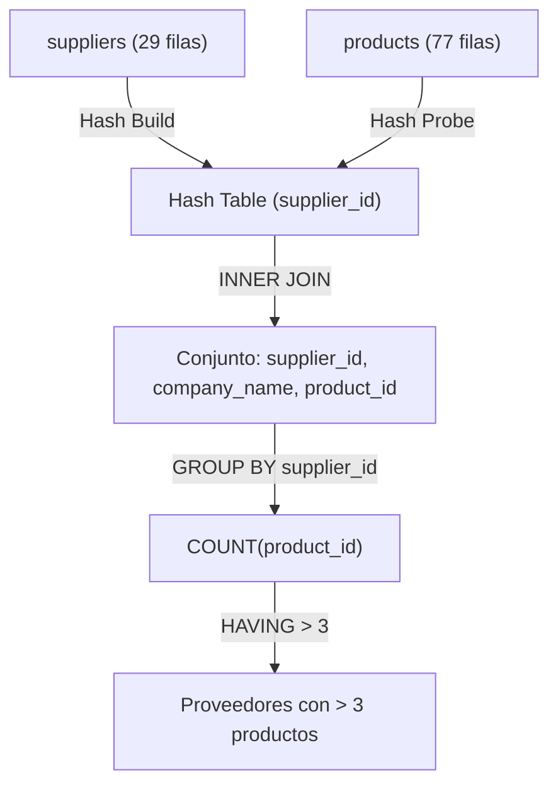
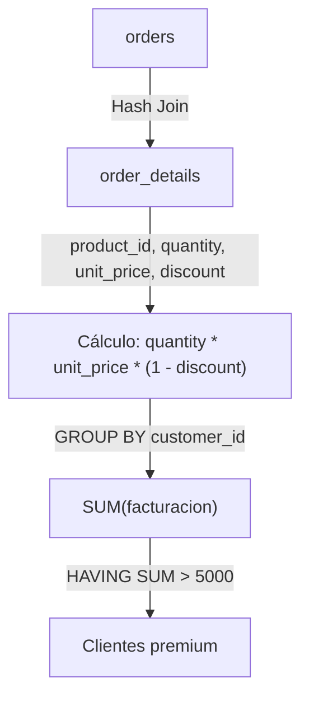
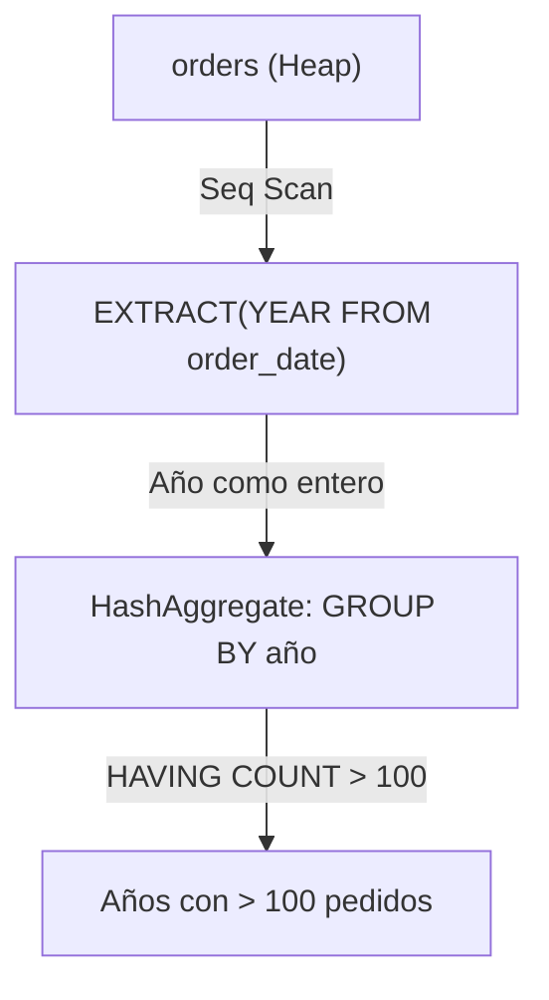
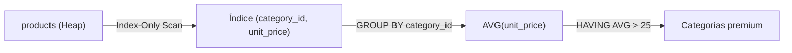
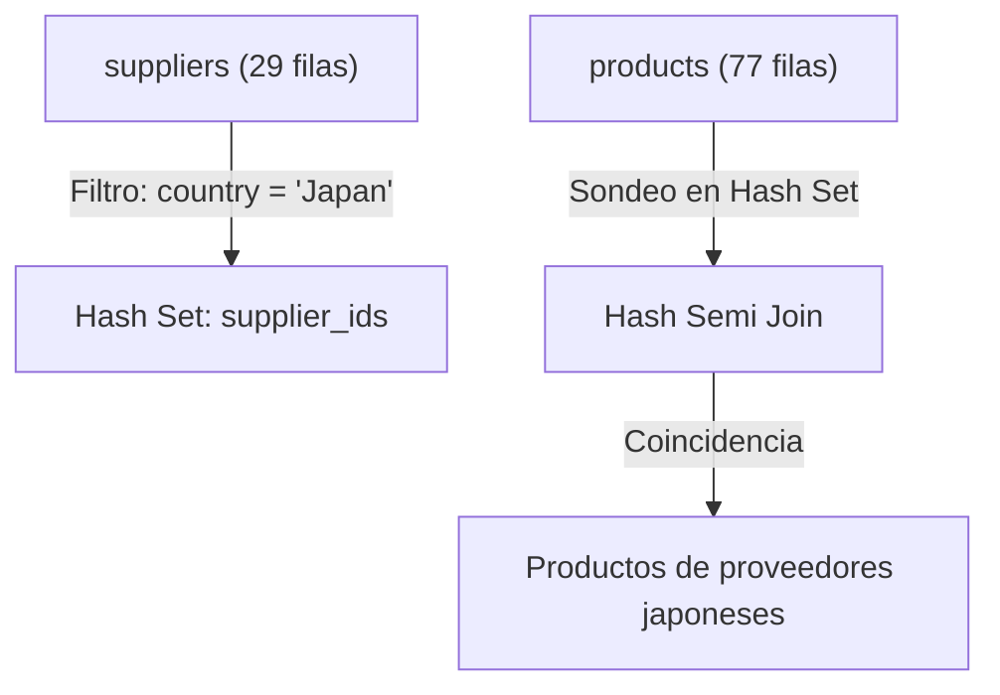
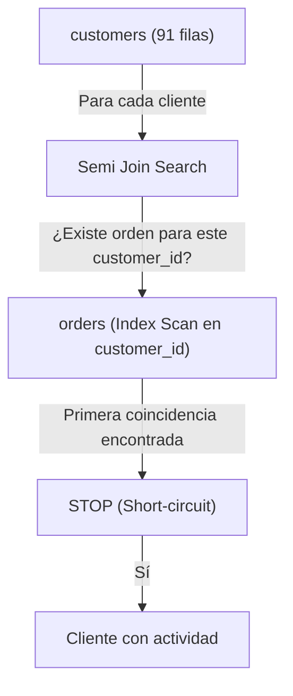
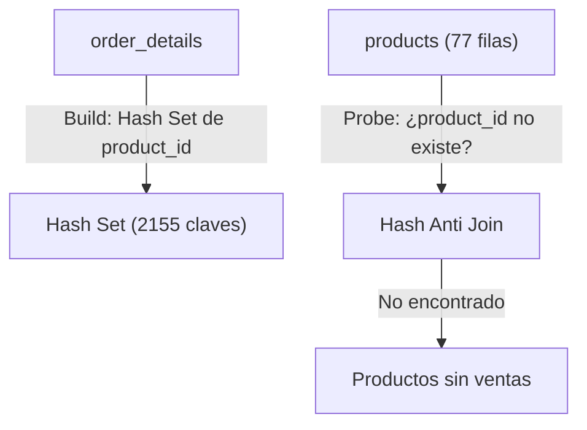
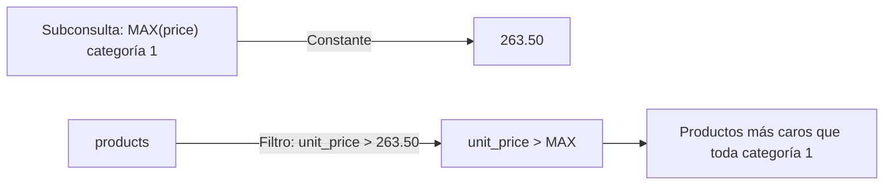
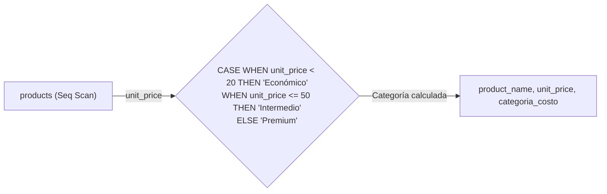

# Libro de Ejercicios SQL - Nivel 2: Intermedio

> Base de datos: Northwind (PostgreSQL 15+) | 50 ejercicios | Temas: GROUP BY avanzado, HAVING, Subconsultas, CASE, SELF JOIN, FULL JOIN

---

## Ejercicio 1: Concentración de Clientes por País - Reporting Comercial

### 🎓 Explicación del Profesor

**Analogía:** Imagina que quieres saber cuántos clientes hay en cada país, pero solo te interesan los países con más de 5 clientes. Es como contar personas por zona y quedarte solo con las zonas concurridas.

### Marco Conceptual del Optimizador

La cláusula `GROUP BY country` fuerza a PostgreSQL a elegir entre dos algoritmos físicos de agregación: **HashAggregate** (construye una tabla hash en `work_mem` con clave `country`) o **GroupAggregate** (ordena primero por `country` y luego agrupa linealmente). Para una tabla de 91 filas con baja cardinalidad (≈21 países), HashAggregate es la estrategia óptima. El filtro posterior con `HAVING COUNT(*) > 5` descarta grupos enteros en la fase de post-agregación, reduciendo el conjunto antes de la proyección final.

### Diagrama ASCII de Ejecución en el Motor (Paso a Paso)

```text
========================================================================================
PASO 1: LECTURA DE FILAS EN BRUTO (FROM customers)
========================================================================================
  [Tabla: customers (91 tuplas)]
  +-------------+---------------------+---------+
  | customer_id | company_name        | country |
  +-------------+---------------------+---------+
  | ALFKI       | Alfreds Futterkiste | Germany |
  | ANATR       | Ana Trujillo Emp.   | Mexico  |
  | ANTON       | Antonio Moreno      | Mexico  |
  | BERGS       | Berglunds snabbköp  | Sweden  |
  | BLAUS       | Blauer See Delikat. | Germany |
  +-------------+---------------------+---------+ ... (91 filas)

========================================================================================
PASO 2: CONSTRUCCIÓN DE LA TABLA HASH (GROUP BY country) -> HashAggregate en work_mem
========================================================================================
  Hash Bucket [Germany] -> Acumulador COUNT(*) = 11
  Hash Bucket [USA]     -> Acumulador COUNT(*) = 13
  Hash Bucket [Mexico]  -> Acumulador COUNT(*) = 5
  Hash Bucket [Sweden]  -> Acumulador COUNT(*) = 2
  Hash Bucket [France]  -> Acumulador COUNT(*) = 11
  ... (21 buckets de países formados)

========================================================================================
PASO 3: EVALUACIÓN DEL FILTRO DE GRUPO (HAVING COUNT(*) > 5)
========================================================================================
  Bucket [USA]     (13 > 5) --> [ACEPTADO]  ✅
  Bucket [Germany] (11 > 5) --> [ACEPTADO]  ✅
  Bucket [France]  (11 > 5) --> [ACEPTADO]  ✅
  Bucket [Mexico]  ( 5 > 5) --> [DESCARTADO] ❌ (5 no es estrictamente mayor que 5)
  Bucket [Sweden]  ( 2 > 5) --> [DESCARTADO] ❌

========================================================================================
PASO 4: ORDENAMIENTO Y PROYECCIÓN FINAL (ORDER BY total_clientes DESC)
========================================================================================
  +---------+----------------+
  | country | total_clientes |
  +---------+----------------+
  | USA     | 13             |
  | Germany | 11             |
  | France  | 11             |
  | Brazil  | 9              |
  | UK      | 7              |
  +---------+----------------+
========================================================================================
```

### Código de Solución

```sql
SELECT
    country,
    COUNT(*) AS total_clientes
FROM customers
GROUP BY country
HAVING COUNT(*) > 5
ORDER BY total_clientes DESC;
```

#### 📊 Resultado Real de Ejecución en PostgreSQL (AWS EC2):

```text
country | total_clientes 
---------+----------------
 USA     |             13
 France  |             11
 Germany |             11
 Brazil  |              9
 UK      |              7
(5 rows)
```

> 🛠️ **Nota del Ingeniero de Datos:** En PostgreSQL 15+, `HAVING` puede referenciar alias de `SELECT` (`HAVING total_clientes > 5`), pero no es portable a otros SGBD. MySQL permite `HAVING` sin `GROUP BY` (comportamiento no estándar). PostgreSQL es estricto. Recuerda: `WHERE` filtra filas, `HAVING` filtra grupos.

### Criterio de Evaluación del Entrevistador

El entrevistador evalúa si el candidato diferencia el momento de ejecución de `WHERE` (pre-agregación) vs `HAVING` (post-agregación). Error grave: usar `WHERE COUNT(*) > 5`, que lanza `ERROR: aggregate function calls cannot be used in WHERE`.

---

## Ejercicio 2: Densidad de Productos por Categoría - Gestión de Catálogo

### 🎓 Explicación del Profesor

**Analogía:** Es como abrir tu armario y contar cuántas camisas hay de cada tipo (formal, casual, deporte), pero solo mostrar las categorías con más de 10 prendas.

### Marco Conceptual del Optimizador

`GROUP BY category_id` sobre la tabla `products` (77 filas, 8 categorías) fuerza una agregación por clave foránea. El optimizador lee secuencialmente la tabla, extrayendo `category_id` y `product_id` (tupla de ancho mínimo), y aplica HashAggregate. `HAVING COUNT(*) > 10` retiene solo categorías con alta densidad de SKUs. Si existe un índice en `products(category_id)`, PostgreSQL puede realizar un *Index-Only Scan* para leer solo la clave, evitando el Heap.

### Diagrama de Flujo (Mermaid)


### Código de Solución

```sql
SELECT
    category_id,
    COUNT(*) AS total_productos
FROM products
GROUP BY category_id
HAVING COUNT(*) > 10
ORDER BY total_productos DESC;
```

#### 📊 Resultado Real de Ejecución en PostgreSQL (AWS EC2):

```text
category_id | total_productos 
-------------+-----------------
           3 |              13
           8 |              12
           1 |              12
           2 |              12
(4 rows)
```

> 🛠️ **Nota del Ingeniero de Datos:** Si existe un índice compuesto en `(category_id, product_id)`, PostgreSQL puede hacer Index-Only Scan (sin leer el Heap). Proyectar `category_name` sin incluirlo en `GROUP BY` ni hacer JOIN con `categories` genera error.

### Criterio de Evaluación del Entrevistador

Mide si el candidato comprende que `GROUP BY` sobre FK indexadas permite Index-Only Scan (sin tocar el Heap). Candidatos junior ignoran esta optimización de cobertura.

---

## Ejercicio 3: Productividad de la Fuerza de Ventas - Empleados con Mayor Volumen

### 🎓 Explicación del Profesor

**Analogía:** Es como querer saber qué vendedores tienen más de 80 pedidos cerrados. No te interesan los novatos; solo los que realmente mueven producto.

### Marco Conceptual del Optimizador

La consulta agrupa `orders` por `employee_id` (830 filas, 9 empleados). El optimizador lee secuencialmente la tabla transaccional, proyecta solo `employee_id` y `order_id` (tupla angosta), y acumula el contador. `HAVING COUNT(order_id) > 80` filtra los 3 empleados top. El planificador puede optar por GroupAggregate si `orders` está físicamente ordenada por `employee_id`.

### Diagrama de Flujo (Mermaid)

```mermaid
flowchart TD
    O["orders (Seq Scan)"] -->|Proyecto employee_id, order_id| Agg["GroupAggregate / HashAggregate"]
    Agg -->|employee_id, COUNT(*)| Groups["9 grupos (uno por empleado)"]
    Groups -->|HAVING COUNT(*) > 80| Top["Empleados con > 80 pedidos"]
    Top -->|ORDER BY total DESC| Out["Ranking de productividad"]
```

### Código de Solución

```sql
SELECT
    employee_id,
    COUNT(order_id) AS total_pedidos
FROM orders
GROUP BY employee_id
HAVING COUNT(order_id) > 80
ORDER BY total_pedidos DESC;
```

#### 📊 Resultado Real de Ejecución en PostgreSQL (AWS EC2):

```text
employee_id | total_pedidos 
-------------+---------------
           4 |           156
           3 |           127
           1 |           123
           8 |           104
           2 |            96
(5 rows)
```

> 🛠️ **Nota del Ingeniero de Datos:** `COUNT(order_id)` ignora `NULLs` mientras `COUNT(*)` no. Con 830 filas y 9 empleados, HashAggregate es instantáneo. En tablas de millones, considera índices en la columna agrupada.

### Criterio de Evaluación del Entrevistador

Verifica que el candidato entienda el orden de procesamiento: `GROUP BY` colapsa filas, `HAVING` filtra grupos. Error: confundir `WHERE` por `HAVING` para filtrar agregaciones.

---

## Ejercicio 4: Cartera de Proveedores - Gestión de Abastecimiento

### 🎓 Explicación del Profesor

**Analogía:** Es como preguntarle al gerente de compras: "¿qué proveedores me tienen más de 3 productos?". Quieres trabajar solo con proveedores que tengan catálogos amplios.

### Marco Conceptual del Optimizador

Requiere un `INNER JOIN` entre `suppliers` y `products` antes de agrupar. PostgreSQL aplica Predicate Pushdown: primero une ambas tablas (Hash Join: `suppliers` es la tabla pequeña de 29 filas, se construye hash en `supplier_id`), luego agrupa por `supplier_id, company_name` y cuenta productos. `HAVING COUNT(p.product_id) > 3` retorna proveedores con cartera sustancial.

### Diagrama de Flujo (Mermaid)



### Código de Solución

```sql
SELECT
    s.supplier_id,
    s.company_name,
    COUNT(p.product_id) AS total_productos
FROM suppliers s
INNER JOIN products p ON s.supplier_id = p.supplier_id
GROUP BY s.supplier_id, s.company_name
HAVING COUNT(p.product_id) > 3
ORDER BY total_productos DESC;
```

#### 📊 Resultado Real de Ejecución en PostgreSQL (AWS EC2):

```text
supplier_id |           company_name            | total_productos 
-------------+-----------------------------------+-----------------
           7 | Pavlova, Ltd.                     |               5
          12 | Plutzer Lebensmittelgroßmärkte AG |               5
           8 | Specialty Biscuits, Ltd.          |               5
           2 | New Orleans Cajun Delights        |               4
(4 rows)
```

> 🛠️ **Nota del Ingeniero de Datos:** `suppliers` tiene solo 29 filas; el optimizador construye hash en memoria. En producción, verifica que `supplier_id` esté indexado. Ambos SGBD requieren que todas las columnas no agregadas estén en `GROUP BY`.

### Criterio de Evaluación del Entrevistador

Evalúa si el candidato sabe agrupar por columnas de la tabla padre después de un JOIN. Error común: olvidar incluir `s.company_name` en `GROUP BY` cuando está en `SELECT`.

---

## Ejercicio 5: Clientes Premium por Facturación - Segmentación Comercial

### 🎓 Explicación del Profesor

**Analogía:** Es como querer saber qué clientes gastaron más de $5,000 con nosotros. No te importa cuántos pedidos hicieron, sino cuánto dinero total dejaron.

### Marco Conceptual del Optimizador

Consulta que une `orders` con `order_details` (830 × 2155 filas) para calcular facturación por cliente. El optimizador ejecuta un Hash Join entre ambas tablas (tabla intermedia aproximada de 2155 filas), agrupa por `customer_id` y suma `(quantity * unit_price * (1 - discount))`. `HAVING SUM(...) > 5000` filtra solo los clientes de alto valor. La expresión aritmética se evalúa en la CPU por cada tupla antes de la agregación.

### Diagrama de Flujo (Mermaid)



### Código de Solución

```sql
SELECT
    o.customer_id,
    ROUND(SUM(od.quantity * od.unit_price * (1 - od.discount))::numeric, 2) AS facturacion_total
FROM orders o
INNER JOIN order_details od ON o.order_id = od.order_id
GROUP BY o.customer_id
HAVING SUM(od.quantity * od.unit_price * (1 - od.discount)) > 5000
ORDER BY facturacion_total DESC;
```

#### 📊 Resultado Real de Ejecución en PostgreSQL (AWS EC2):

```text
customer_id | facturacion_total 
-------------+-------------------
 QUICK       |         110277.31
 ERNSH       |         104874.98
 SAVEA       |         104361.95
 RATTC       |          51097.80
 HUNGO       |          49979.91
 HANAR       |          32841.37
 KOENE       |          30908.38
 FOLKO       |          29567.56
 MEREP       |          28872.19
 WHITC       |          27363.60
 FRANK       |          26656.56
 QUEEN       |          25717.50
 BERGS       |          24927.58
 SUPRD       |          24088.78
 PICCO       |          23128.86
 HILAA       |          22768.76
 BONAP       |          21963.25
 BOTTM       |          20801.60
 RICSU       |          19343.78
 LEHMS       |          19261.41
 BLONP       |          18534.08
 GREAL       |          18507.45
 SIMOB       |          16817.10
 LINOD       |          16476.56
 SEVES       |          16215.33
 LILAS       |          16076.60
 VAFFE       |          15843.92
 WARTH       |          15648.70
 OLDWO       |          15177.46
 EASTC       |          14761.03
 AROUT       |          13390.65
 OTTIK       |          12496.20
 RICAR       |          12450.80
 CHOPS       |          12348.88
 FOLIG       |          11666.90
 GODOS       |          11446.36
 SPLIR       |          11441.63
 TORTU       |          10812.15
 MAISD       |           9736.08
 WANDK       |           9588.42
 LAMAI       |           9328.20
 VICTE       |           9182.43
 GOURL       |           8414.13
 MAGAA       |           7176.21
 REGGC       |           7048.24
 ANTON       |           7023.98
 TRADH       |           6850.66
 QUEDE       |           6664.81
 FURIB       |           6427.42
 ISLAT       |           6146.30
 BSBEV       |           6089.90
 WELLI       |           6068.20
 SANTG       |           5735.15
 PRINI       |           5044.94
 MORGK       |           5042.20
(55 rows)
```

> 🛠️ **Nota del Ingeniero de Datos:** La expresión `quantity * unit_price * (1 - discount)` se evalúa por cada fila (2155 filas). En producción, considera pre-calacular en una columna materializada. `discount` es decimal (0.15 = 15%), no porcentaje entero.

### Criterio de Evaluación del Entrevistador

Evalúa capacidad de expresión aritmética dentro de funciones agregadas. Error: duplicar la expresión en `SELECT` y `HAVING` sin considerar el impacto de reevaluación. PostgreSQL no cachea automáticamente la expresión entre cláusulas.

---

## Ejercicio 6: Rotación de Inventario - Productos Más Vendidos por Cantidad

### 🎓 Explicación del Profesor

**Analogía:** Es como revisar qué productos se venden más por cantidad (no por dinero). Un producto barato puede ser el más vendido aunque no genere más ingresos.

### Marco Conceptual del Optimizador

Agrupa `order_details` por `product_id`, sumando `quantity`. Con 2155 filas, el HashAggregate es eficiente. `HAVING SUM(quantity) > 200` descarta productos de baja rotación. El planificador proyecta solo `product_id` y `quantity` desde el Heap, minimizando el ancho de tupla en memoria.

### Diagrama de Flujo (Mermaid)

```mermaid
flowchart LR
    OD["order_details (Seq Scan)"] -->|Proyecto: product_id, quantity| Agg["HashAggregate (work_mem)"]
    Agg -->|SUM(quantity) GROUP BY product_id| Groups["77 grupos"]
    Groups -->|HAVING SUM > 200| Filtered["Productos alta rotación"]
    Filtered -->|ORDER BY total DESC| Out["Top ventas por cantidad"]
```

### Código de Solución

```sql
SELECT
    product_id,
    SUM(quantity) AS unidades_vendidas
FROM order_details
GROUP BY product_id
HAVING SUM(quantity) > 200
ORDER BY unidades_vendidas DESC;
```

#### 📊 Resultado Real de Ejecución en PostgreSQL (AWS EC2):

```text
product_id | unidades_vendidas 
------------+-------------------
         60 |              1577
         59 |              1496
         31 |              1397
         56 |              1263
         16 |              1158
         75 |              1155
         24 |              1125
         40 |              1103
         62 |              1083
          2 |              1057
         71 |              1057
         21 |              1016
         41 |               981
         76 |               981
         17 |               978
         55 |               903
         13 |               891
         51 |               886
         35 |               883
          1 |               828
         70 |               817
         72 |               806
         36 |               805
         68 |               799
         39 |               793
         77 |               791
          7 |               763
         54 |               755
         33 |               755
         26 |               753
         29 |               746
         65 |               745
         10 |               742
         64 |               740
         19 |               723
         53 |               722
         69 |               714
         11 |               706
         42 |               697
         28 |               640
         38 |               623
         30 |               612
         61 |               603
         44 |               601
         23 |               580
         43 |               580
         46 |               548
         18 |               539
         58 |               534
         49 |               520
         45 |               508
         34 |               506
         52 |               500
         47 |               485
          4 |               453
         63 |               445
         57 |               434
         14 |               404
          8 |               372
         27 |               365
         22 |               348
         12 |               344
          3 |               328
         25 |               318
         20 |               313
          6 |               301
          5 |               298
         32 |               297
         74 |               297
         73 |               293
         66 |               239
         50 |               235
(72 rows)
```

> 🛠️ **Nota del Ingeniero de Datos:** `SUM(quantity)` retorna el total de unidades, no el total de dinero. Con 2155 filas, HashAggregate es eficiente. Para tablas de millones, crea un índice en `product_id`.

### Criterio de Evaluación del Entrevistador

Mide comprensión de agregación pura sobre tabla transaccional sin JOINs. Error: proyectar columnas como `product_name` sin incluir en `GROUP BY`.

---

## Ejercicio 7: Estacionalidad de Ventas - Pedidos por Año

### 🎓 Explicación del Profesor

**Analogía:** Es como querer saber cuántos exámenes hubo en cada año para planificar la carga de trabajo del profesor.

### Marco Conceptual del Optimizador

`GROUP BY EXTRACT(YEAR FROM order_date)` fuerza la evaluación de la función `EXTRACT` sobre cada tupla de `orders` (830 filas). PostgreSQL convierte la fecha a un entero de año y agrupa sobre ese valor derivado. El optimizador no puede usar un índice B-Tree en `order_date` para Index-Only Scan porque la expresión no es idéntica a la columna subyacente (`order_date` vs `EXTRACT`). `HAVING COUNT(*) > 100` retiene años con alta actividad.

### Diagrama de Flujo (Mermaid)



### Código de Solución

```sql
SELECT
    EXTRACT(YEAR FROM order_date)::int AS anio,
    COUNT(*) AS total_pedidos
FROM orders
GROUP BY EXTRACT(YEAR FROM order_date)
HAVING COUNT(*) > 100
ORDER BY anio;
```

#### 📊 Resultado Real de Ejecución en PostgreSQL (AWS EC2):

```text
anio | total_pedidos 
------+---------------
 1996 |           152
 1997 |           408
 1998 |           270
(3 rows)
```

> 🛠️ **Nota del Ingeniero de Datos:** `GROUP BY` con `EXTRACT` impide uso de índice. Para consultas frecuentes, crea un índice funcional: `CREATE INDEX idx_orders_year ON orders(EXTRACT(YEAR FROM order_date))`. PostgreSQL 15+ permite alias de `SELECT` en `GROUP BY`.

### Criterio de Evaluación del Entrevistador

Evalúa si el candidato sabe agrupar por expresiones derivadas. PostgreSQL 15+ permite alias de `GROUP BY` (`GROUP BY anio`) siempre que no haya ambigüedad. Error: usar alias de `SELECT` en `GROUP BY` sin conocer la precedencia lógica.

---

## Ejercicio 8: Logística Internacional - Países con Flete Promedio Elevado

### 🎓 Explicación del Profesor

**Analogía:** Es como querer saber en qué países el costo de envío es más caro en promedio. Si envías a Uruguay y el flete promedio es $80, algo debes cambiar en tu estrategia logística.

### Marco Conceptual del Optimizador

`GROUP BY ship_country` sobre 830 pedidos. `AVG(freight)` calcula la media aritmética manteniendo dos variables de estado transitorias (suma acumulada y contador). `HAVING AVG(freight) > 50` filtra países con costo logístico alto. El planificador puede usar un índice en `ship_country` si existe para reducir el Heap Scan, aunque la tabla es pequeña.

### Diagrama de Flujo (Mermaid)


### Código de Solución

```sql
SELECT
    ship_country,
    ROUND(AVG(freight)::numeric, 2) AS flete_promedio,
    COUNT(*) AS total_pedidos
FROM orders
GROUP BY ship_country
HAVING AVG(freight) > 50
ORDER BY flete_promedio DESC;
```

#### 📊 Resultado Real de Ejecución en PostgreSQL (AWS EC2):

```text
ship_country | flete_promedio | total_pedidos 
--------------+----------------+---------------
 Austria      |         184.79 |            40
 Ireland      |         145.01 |            19
 USA          |         112.88 |           122
 Germany      |          92.49 |           122
 Sweden       |          87.50 |            37
 Denmark      |          77.57 |            18
 Switzerland  |          76.03 |            18
 Canada       |          73.27 |            30
 Belgium      |          67.38 |            19
 Venezuela    |          59.46 |            46
 Brazil       |          58.80 |            83
 France       |          55.04 |            77
 UK           |          52.75 |            56
(13 rows)
```

> 🛠️ **Nota del Ingeniero de Datos:** `AVG()` y `COUNT()` se calculan en una sola pasada sobre los datos. En PostgreSQL 15+, `HAVING` puede referenciar alias de `SELECT` (`HAVING flete_promedio > 50`), pero no es portable. En SQL estándar, `HAVING` se evalúa antes que `SELECT`.

### Criterio de Evaluación del Entrevistador

Mide si el candidato maneja múltiples agregaciones y redondeo. Error: asumir que `HAVING` puede referenciar alias de `SELECT` (`flete_promedio`) — en SQL estándar, `HAVING` se evalúa antes que `SELECT`, por lo que debe repetir la expresión.

---

## Ejercicio 9: Distribución Geográfica del Equipo - Ciudades con Múltiples Empleados

### 🎓 Explicación del Profesor

**Analogía:** Es como querer saber en qué ciudades hay más de un empleado. Si Lima tiene 3 empleados y Cusco solo 1, solo Lima aparecerá en el reporte.

### Marco Conceptual del Optimizador

`GROUP BY city` sobre `employees` (9 filas). El Optimizador ejecuta un Seq Scan trivial y HashAggregate en `work_mem`. `HAVING COUNT(*) > 1` filtra ciudades con más de un empleado. La cardinalidad es tan baja que el plan es prácticamente instantáneo, pero el ejercicio refuerza el concepto de agrupamiento con filtro.

### Diagrama de Flujo (Mermaid)

```mermaid
flowchart TD
    E["employees (9 filas)"] -->|Seq Scan| Agg["HashAggregate"]
    Agg -->|GROUP BY city| Groups["Ciudades agrupadas"]
    Groups -->|HAVING COUNT(*) > 1| Out["Ciudades con 2+ empleados"]
```

### Código de Solución

```sql
SELECT
    city,
    COUNT(*) AS total_empleados
FROM employees
GROUP BY city
HAVING COUNT(*) > 1
ORDER BY total_empleados DESC;
```

#### 📊 Resultado Real de Ejecución en PostgreSQL (AWS EC2):

```text
city   | total_empleados 
---------+-----------------
 London  |               4
 Seattle |               2
(2 rows)
```

> 🛠️ **Nota del Ingeniero de Datos:** Con solo 9 filas, este ejercicio es trivial. En producción con miles de empleados, crea un índice en `city` si haces esta consulta frecuentemente. No confundir `HAVING COUNT(*) > 1` (más de 1 empleado) con `HAVING COUNT(*) = 1` (solo 1 empleado).

### Criterio de Evaluación del Entrevistador

Ejercicio conceptual. El entrevistador busca confirmar que el candidato no usa `WHERE` para filtrar agregaciones. Error: escribir `WHERE COUNT(*) > 1`.

---

## Ejercicio 10: Estrategia de Precios - Categorías con Precio Promedio Superior

### 🎓 Explicación del Profesor

**Analogía:** Es como querer saber qué secciones del supermercado tienen precios promedio altos. Si la sección de electrónica promedia $200 y la de verduras $5, solo la electrónica aparecerá.

### Marco Conceptual del Optimizador

`GROUP BY category_id` sobre `products`, calculando `AVG(unit_price)`. PostgreSQL debe leer la columna `unit_price` (numeric) y `category_id` (int). `HAVING AVG(unit_price) > 25` retiene categorías cuyo precio promedio excede 25. Si existe un índice compuesto en `(category_id, unit_price)`, el optimizador puede ejecutar un *Index-Only Scan* evitando la lectura del Heap.

### Diagrama de Flujo (Mermaid)



### Código de Solución

```sql
SELECT
    category_id,
    ROUND(AVG(unit_price)::numeric, 2) AS precio_promedio,
    COUNT(*) AS total_productos
FROM products
GROUP BY category_id
HAVING AVG(unit_price) > 25
ORDER BY precio_promedio DESC;
```

#### 📊 Resultado Real de Ejecución en PostgreSQL (AWS EC2):

```text
category_id | precio_promedio | total_productos 
-------------+-----------------+-----------------
           6 |           54.01 |               6
           1 |           37.98 |              12
           7 |           32.37 |               5
           4 |           28.73 |              10
           3 |           25.16 |              13
(5 rows)
```

> 🛠️ **Nota del Ingeniero de Datos:** Si tienes un índice compuesto en `(category_id, unit_price)`, PostgreSQL puede hacer Index-Only Scan sin leer el Heap. `AVG(unit_price)` ignora valores `NULL` automáticamente.

### Criterio de Evaluación del Entrevistador

Evalúa si el candidato piensa en estrategias de indexación (índice de cobertura). Error: proyectar `category_name` sin incluirlo en `GROUP BY` ni usar JOIN.

---

## Sección 2: Subconsultas (Ejercicios 11-20)

---

## Ejercicio 11: Subconsulta Escalar - Producto Más Caro del Catálogo

### 🎓 Explicación del Profesor

**Analogía:** Es como preguntar "¿cuál es el producto más caro de toda la tienda?" y luego mostrar su ficha completa. Primero calculas el precio máximo, y luego buscas quién tiene ese precio.

### Marco Conceptual del Optimizador

La subconsulta escalar `(SELECT MAX(unit_price) FROM products)` se ejecuta una sola vez en la fase de iniciación de la consulta externa. PostgreSQL la trata como una constante paramétrica (el planificador la materializa como un `Result` node). El valor resultante se une implícitamente a cada fila de `products` sin costo adicional de E/S. La tabla se escanea dos veces: una para la subconsulta (Seq Scan con agregación) y otra para la externa.

### Diagrama de Flujo (Mermaid)

```mermaid
flowchart TD
    subgraph Subconsulta
        P1["products (Seq Scan)"] -->|MAX(unit_price)| MaxVal["Constante: 263.50"]
    end
    subgraph Consulta externa
        P2["products (Seq Scan 2)"] -->|Filtro: unit_price = MAX| Filter["unit_price = 263.50"]
        Filter --> Out["Producto más caro"]
    end
    MaxVal --> Filter
```

### Código de Solución

```sql
SELECT
    product_id,
    product_name,
    unit_price
FROM products
WHERE unit_price = (
    SELECT MAX(unit_price)
    FROM products
);
```

#### 📊 Resultado Real de Ejecución en PostgreSQL (AWS EC2):

```text
product_id | product_name  | unit_price 
------------+---------------+------------
         38 | Côte de Blaye |      263.5
(1 row)
```

> 🛠️ **Nota del Ingeniero de Datos:** La subconsulta se ejecuta una sola vez como `InitPlan`. En productos con 77 filas es instantáneo, pero en tablas grandes considera usar `LIMIT 1` con `ORDER BY DESC`. Usar `IN` en lugar de `=` para subconsultas escalares funciona, pero es menos explícito.

### Criterio de Evaluación del Entrevistador

Mide si el candidato distingue subconsultas escalares (retornan 1 fila × 1 columna) de subconsultas de conjunto. Error: usar `=` con subconsulta que puede retornar múltiples filas (lanzaría error).

---

## Ejercicio 12: Subconsulta con IN - Productos de Proveedores Japoneses

### 🎓 Explicación del Profesor

**Analogía:** Es como decir "muéstrame todos los productos que vengan de proveedores de Japón". Primero buscas qué proveedores son japoneses, y luego filtrarás los productos de esos proveedores.

### Marco Conceptual del Optimizador

La subconsulta `SELECT supplier_id FROM suppliers WHERE country = 'Japan'` se ejecuta primero (materializada como tabla hash o resultado literal) y luego la externa usa `IN` para sondear. PostgreSQL transforma internamente `IN (subquery)` en un `Semi Join` (`Hash Semi Join`) si la subconsulta no es correlacionada, evitando duplicados. La tabla `suppliers` tiene 29 filas; el Hash Semi Join es óptimo.

### Diagrama de Flujo (Mermaid)



### Código de Solución

```sql
SELECT
    product_id,
    product_name,
    unit_price
FROM products
WHERE supplier_id IN (
    SELECT supplier_id
    FROM suppliers
    WHERE country = 'Japan'
)
ORDER BY product_name;
```

#### 📊 Resultado Real de Ejecución en PostgreSQL (AWS EC2):

```text
product_id |  product_name   | unit_price 
------------+-----------------+------------
         15 | Genen Shouyu    |         13
         10 | Ikura           |         31
         13 | Konbu           |          6
         74 | Longlife Tofu   |         10
          9 | Mishi Kobe Niku |         97
         14 | Tofu            |      23.25
(6 rows)
```

> 🛠️ **Nota del Ingeniero de Datos:** PostgreSQL transforma `IN (subquery)` en `Hash Semi Join` internamente. Es más eficiente que hacer un `JOIN` y luego `DISTINCT`. Usar `NOT IN` con subconsultas que pueden tener `NULLs` retorna 0 filas (resultado vacío inesperado). Preferir `NOT EXISTS` en esos casos.

### Criterio de Evaluación del Entrevistador

Evalúa comprensión de Semi Join. Error: usar `NOT IN (subquery)` con columnas anulables — si la subconsulta contiene `NULL`, `NOT IN` retorna 0 filas. Preferir `NOT EXISTS`.

---

## Ejercicio 13: Subconsulta Correlacionada - Productos sobre el Promedio de su Categoría

### 🎓 Explicación del Profesor

**Analogía:** Es como preguntar para cada producto: "¿este producto es más caro que el promedio de los demás productos de su misma categoría?". No comparas contra el promedio general, sino contra el promedio de SU categoría.

### Marco Conceptual del Optimizador

La subconsulta `SELECT AVG(p2.unit_price) FROM products p2 WHERE p2.category_id = p1.category_id` está correlacionada: hace referencia a `p1.category_id` de la consulta externa. PostgreSQL la ejecuta una vez **por cada fila** de la tabla externa (77 filas), resultando en un plan con `InitPlan` o `SubPlan`. Esto puede forzar un `Nested Loop` implícito con costo $O(N \times M)$. La subconsulta calcula `AVG` sobre el subconjunto de productos de la misma categoría.

### Diagrama de Flujo (Mermaid)

```mermaid
flowchart TD
    P1["products p1 (77 filas)"] -->|Para cada fila| Loop["SubPlan (correlacionado)"]
    Loop -->|Filtra p2.category_id = p1.category_id| P2["products p2 (Subconjunto por categoría)"]
    P2 -->|AVG(unit_price)| Avg["Promedio de la categoría"]
    Avg -->|¿p1.unit_price > AVG?| Check{"unit_price > promedio"}
    Check -->|Sí| Out["Producto sobre el promedio"]
```

### Código de Solución

```sql
SELECT
    product_name,
    unit_price,
    category_id
FROM products p1
WHERE unit_price > (
    SELECT AVG(unit_price)
    FROM products p2
    WHERE p2.category_id = p1.category_id
)
ORDER BY category_id, unit_price DESC;
```

#### 📊 Resultado Real de Ejecución en PostgreSQL (AWS EC2):

```text
product_name         | unit_price | category_id 
------------------------------+------------+-------------
 Côte de Blaye                |      263.5 |           1
 Ipoh Coffee                  |         46 |           1
 Vegie-spread                 |       43.9 |           2
 Northwoods Cranberry Sauce   |         40 |           2
 Sirop d'érable               |       28.5 |           2
 Grandma's Boysenberry Spread |         25 |           2
 Sir Rodney's Marmalade       |         81 |           3
 Tarte au sucre               |       49.3 |           3
 Schoggi Schokolade           |       43.9 |           3
 Gumbär Gummibärchen          |      31.23 |           3
 Raclette Courdavault         |         55 |           4
 Queso Manchego La Pastora    |         38 |           4
 Gudbrandsdalsost             |         36 |           4
 Mozzarella di Giovanni       |       34.8 |           4
 Camembert Pierrot            |         34 |           4
 Mascarpone Fabioli           |         32 |           4
 Gnocchi di nonna Alice       |         38 |           5
 Wimmers gute Semmelknödel    |      33.25 |           5
 Gustaf's Knäckebröd          |         21 |           5
 Thüringer Rostbratwurst      |     123.79 |           6
 Mishi Kobe Niku              |         97 |           6
 Manjimup Dried Apples        |         53 |           7
 Rössle Sauerkraut            |       45.6 |           7
 Carnarvon Tigers             |       62.5 |           8
 Ikura                        |         31 |           8
 Gravad lax                   |         26 |           8
 Nord-Ost Matjeshering        |      25.89 |           8
(27 rows)
```

> 🛠️ **Nota del Ingeniero de Datos:** Una subconsulta correlacionada sobre 77 filas × 77 promedios = ~6000 operaciones. Un `LATERAL JOIN` o una window function `AVG() OVER (PARTITION BY category_id)` es mucho más eficiente. Alternativa con CTE: calcular los promedios primero y luego hacer JOIN.

### Criterio de Evaluación del Entrevistador

¡Pregunta clásica de FAANG! Evalúa si el candidato comprende el costo cuadrático de las subconsultas correlacionadas vs alternativas (`LATERAL JOIN`, ventanas). Error: no entender que la subconsulta se ejecuta 77 veces.

---

## Ejercicio 14: Derived Table — Promedio de Ítems por Pedido

### 🎓 Explicación del Profesor

**Analogía:** Imagina que primero calculas cuántos exámenes rindió cada alumno, y luego sacas el promedio de esa lista. Primero obtienes un dato por alumno (derived table), y sobre ese resultado calculas el promedio general. Es como una consulta sobre otra consulta.

### Marco Conceptual del Optimizador

La subconsulta en `FROM` (derived table) calcula `COUNT(product_id)` por `order_id` (2155 filas agrupadas en ≈830 grupos). PostgreSQL materializa este resultado como una tabla temporal en memoria. Luego la consulta externa calcula `AVG(total_productos)` sobre esa tabla virtual. El optimizador no puede propagar condiciones de filtro hacia la derived table porque no hay cláusula `WHERE` externa.

### Diagrama de Flujo (Mermaid)

```mermaid
flowchart TD
    OD["order_details (2155 filas)"] -->|GROUP BY order_id| Agg["COUNT(product_id) por pedido"]
    Agg -->|Materializar| DT["Derived Table (830 filas)"]
    DT -->|AVG(total_productos)| Out["Promedio de ítems por pedido"]
```

### Código de Solución

```sql
SELECT
    ROUND(AVG(total_productos)::numeric, 2) AS promedio_items_por_pedido
FROM (
    SELECT
        order_id,
        COUNT(product_id) AS total_productos
    FROM order_details
    GROUP BY order_id
) AS pedido_counts;
```

#### 📊 Resultado Real de Ejecución en PostgreSQL (AWS EC2):

```text
promedio_items_por_pedido 
---------------------------
                      2.60
(1 row)
```

> 🛠️ **Nota del Ingeniero de Datos:** Derived tables se materializan en memoria. En PostgreSQL 14+, el optimizador puede "push down" filtros externos hacia la derived table si la subconsulta no tiene `GROUP BY`, `LIMIT` ni `DISTINCT`. Olvidar el alias obligatorio (`AS pedido_counts`) lanza `ERROR: subquery in FROM must have an alias`.

### Criterio de Evaluación del Entrevistador

Mide si el candidato domina las derived tables (subconsultas en `FROM`). Error: omitir el alias obligatorio (`AS pedido_counts`) — PostgreSQL lanzará `ERROR: subquery in FROM must have an alias`.

---

## Ejercicio 15: EXISTS — Clientes con Actividad Comercial (Semi Join)

### 🎓 Explicación del Profesor

**Analogía:** Es como revisar una lista de invitados y preguntar: "¿esta persona está en la lista?". Solo necesitas saber SÍ está, no cuántas veces aparece ni qué fecha se anotó. En cuanto la encuentras, dejas de buscar.

### Marco Conceptual del Optimizador

`EXISTS` ejecuta un **Semi Join** lógico. PostgreSQL evaluará `EXISTS (SELECT 1 FROM orders o WHERE o.customer_id = c.customer_id)` y detendrá el escaneo interno en cuanto encuentre **la primera** coincidencia para cada cliente (short-circuit evaluation). Esto es radicalmente más eficiente que `IN` cuando la subconsulta puede retornar muchas filas. El `SELECT 1` es una convención: PostgreSQL ignora el contenido del `SELECT` dentro de `EXISTS`.

### Diagrama de Flujo (Mermaid)



### Código de Solución

```sql
SELECT
    customer_id,
    company_name,
    country
FROM customers c
WHERE EXISTS (
    SELECT 1
    FROM orders o
    WHERE o.customer_id = c.customer_id
)
ORDER BY company_name;
```

#### 📊 Resultado Real de Ejecución en PostgreSQL (AWS EC2):

```text
customer_id |            company_name            |   country   
-------------+------------------------------------+-------------
 ALFKI       | Alfreds Futterkiste - Actualizado  | Germany
 ANATR       | Ana Trujillo Emparedados y helados | Mexico
 ANTON       | Antonio Moreno Taquería            | Mexico
 AROUT       | Around the Horn                    | UK
 BSBEV       | B's Beverages                      | UK
 BERGS       | Berglunds snabbköp                 | Sweden
 BLAUS       | Blauer See Delikatessen            | Germany
 BLONP       | Blondesddsl père et fils           | France
 BONAP       | Bon app'                           | France
 BOTTM       | Bottom-Dollar Markets              | Canada
 BOLID       | Bólido Comidas preparadas          | Spain
 CACTU       | Cactus Comidas para llevar         | Argentina
 CENTC       | Centro comercial Moctezuma         | Mexico
 CHOPS       | Chop-suey Chinese                  | Switzerland
 COMMI       | Comércio Mineiro                   | Brazil
 CONSH       | Consolidated Holdings              | UK
 WANDK       | Die Wandernde Kuh                  | Germany
 DRACD       | Drachenblut Delikatessen           | Germany
 DUMON       | Du monde entier                    | France
 EASTC       | Eastern Connection                 | UK
 ERNSH       | Ernst Handel                       | Austria
 FAMIA       | Familia Arquibaldo                 | Brazil
 FOLIG       | Folies gourmandes                  | France
 FOLKO       | Folk och fä HB                     | Sweden
 FRANR       | France restauration                | France
 FRANS       | Franchi S.p.A.                     | Italy
 FRANK       | Frankenversand                     | Germany
 FURIB       | Furia Bacalhau e Frutos do Mar     | Portugal
 GROSR       | GROSELLA-Restaurante               | Venezuela
 GALED       | Galería del gastrónomo             | Spain
 GODOS       | Godos Cocina Típica                | Spain
 GOURL       | Gourmet Lanchonetes                | Brazil
 GREAL       | Great Lakes Food Market            | USA
 HILAA       | HILARION-Abastos                   | Venezuela
 HANAR       | Hanari Carnes                      | Brazil
 HUNGC       | Hungry Coyote Import Store         | USA
 HUNGO       | Hungry Owl All-Night Grocers       | Ireland
 ISLAT       | Island Trading                     | UK
 KOENE       | Königlich Essen                    | Germany
 LILAS       | LILA-Supermercado                  | Venezuela
 LINOD       | LINO-Delicateses                   | Venezuela
 LACOR       | La corne d'abondance               | France
 LAMAI       | La maison d'Asie                   | France
 LAUGB       | Laughing Bacchus Wine Cellars      | Canada
 LAZYK       | Lazy K Kountry Store               | USA
 LEHMS       | Lehmanns Marktstand                | Germany
 LETSS       | Let's Stop N Shop                  | USA
 LONEP       | Lonesome Pine Restaurant           | USA
 MAGAA       | Magazzini Alimentari Riuniti       | Italy
 MAISD       | Maison Dewey                       | Belgium
 MORGK       | Morgenstern Gesundkost             | Germany
 MEREP       | Mère Paillarde                     | Canada
 NORTS       | North/South                        | UK
 OCEAN       | Océano Atlántico Ltda.             | Argentina
 OLDWO       | Old World Delicatessen             | USA
 OTTIK       | Ottilies Käseladen                 | Germany
 PERIC       | Pericles Comidas clásicas          | Mexico
 PICCO       | Piccolo und mehr                   | Austria
 PRINI       | Princesa Isabel Vinhos             | Portugal
 QUICK       | QUICK-Stop                         | Germany
 QUEDE       | Que Delícia                        | Brazil
 QUEEN       | Queen Cozinha                      | Brazil
 RANCH       | Rancho grande                      | Argentina
 RATTC       | Rattlesnake Canyon Grocery         | USA
 REGGC       | Reggiani Caseifici                 | Italy
 RICAR       | Ricardo Adocicados                 | Brazil
 RICSU       | Richter Supermarkt                 | Switzerland
 ROMEY       | Romero y tomillo                   | Spain
 SANTG       | Santé Gourmet                      | Norway
 SAVEA       | Save-a-lot Markets                 | USA
 SEVES       | Seven Seas Imports                 | UK
 SIMOB       | Simons bistro                      | Denmark
 SPLIR       | Split Rail Beer & Ale              | USA
 SPECD       | Spécialités du monde               | France
 SUPRD       | Suprêmes délices                   | Belgium
 THEBI       | The Big Cheese                     | USA
 THECR       | The Cracker Box                    | USA
 TOMSP       | Toms Spezialitäten                 | Germany
 TORTU       | Tortuga Restaurante                | Mexico
 TRADH       | Tradição Hipermercados             | Brazil
 TRAIH       | Trail's Head Gourmet Provisioners  | USA
 VAFFE       | Vaffeljernet                       | Denmark
 VICTE       | Victuailles en stock               | France
 VINET       | Vins et alcools Chevalier          | France
 WARTH       | Wartian Herkku                     | Finland
 WELLI       | Wellington Importadora             | Brazil
 WHITC       | White Clover Markets               | USA
 WILMK       | Wilman Kala                        | Finland
 WOLZA       | Wolski  Zajazd                     | Poland
(89 rows)
```

> 🛠️ **Nota del Ingeniero de Datos:** `EXISTS` usa short-circuit: detiene la búsqueda en la primera coincidencia. En tablas grandes, esto es significativamente más rápido que `IN` que materializa todo el conjunto. MySQL a veces optimiza mal `EXISTS` en subconsultas simples.

### Criterio de Evaluación del Entrevistador

Evalúa si el candidato prefiere `EXISTS` sobre `IN` para consultas correlacionadas con posibles nulos. Error: escribir `SELECT *` dentro de `EXISTS` (ineficiente, aunque PostgreSQL lo ignore).

---

## Ejercicio 16: NOT EXISTS — Productos Inactivos (Nunca Vendidos)

### 🎓 Explicación del Profesor

**Analogía:** Es como buscar alumnos que nunca presentaron un examen. Recorres la lista de alumnos y verificas que NO exista ningún registro de examen para cada uno. Los que no tienen ningún registro son los que buscas.

### Marco Conceptual del Optimizador

`NOT EXISTS` implementa un **Anti Join** lógico: retorna todas las filas de la tabla izquierda que **no** tienen correspondencia en la derecha. PostgreSQL ejecuta un `Hash Anti Join`: construye un conjunto hash con los `product_id` de `order_details` (2155 filas) y luego escanea `products` (77 filas) verificando ausencia en el hash. Es inmune al problema de `NULL` que afecta a `NOT IN`.

### Diagrama de Flujo (Mermaid)



### Código de Solución

```sql
SELECT
    product_id,
    product_name,
    unit_price
FROM products p
WHERE NOT EXISTS (
    SELECT 1
    FROM order_details od
    WHERE od.product_id = p.product_id
);
```

#### 📊 Resultado Real de Ejecución en PostgreSQL (AWS EC2):

```text
product_id | product_name | unit_price 
------------+--------------+------------
(0 rows)
```

> 🛠️ **Nota del Ingeniero de Datos:** `NOT EXISTS` ejecuta un Anti Join con hash. `NOT IN` requiere materializar todo el conjunto y comparar fila por fila. `NOT EXISTS` es más eficiente en la mayoría de casos. `NOT IN` con subconsulta que contiene `NULLs` retorna 0 filas (resultado vacío inesperado). Ejemplo: `WHERE id NOT IN (1, 2, NULL)` nunca retorna filas porque `NOT IN` con `NULL` siempre es `UNKNOWN`.

### Criterio de Evaluación del Entrevistador

¡Pregunta de seguridad! El entrevistador busca que el candidato evite `NOT IN (SELECT product_id FROM order_details)` porque `product_id` en `order_details` es parte de PK compuesta y no tiene `NULLs` (podría funcionar), pero la mejor práctica es usar `NOT EXISTS` siempre. Demostrar esta conciencia es señal de seniority.

---

## Ejercicio 17: ANY — Productos Más Caros que Cualquier Producto de Categoría 1

### 🎓 Explicación del Profesor

**Analogía:** Es como preguntar: "¿hay algún producto que cueste más que el producto más barato de la tienda A?". No necesitas que supere a TODOS los de la tienda A, solo a al menos uno. Si superas al más barato de allá, ya ganaste.

### Marco Conceptual del Optimizador

`> ANY (subquery)` retorna `TRUE` si el valor de la izquierda es mayor que **al menos un** valor de la subconsulta. PostgreSQL ejecuta la subconsulta interna primero (productos de categoría 1), materializa los precios, y para cada producto externo evalúa la comparación. Internamente puede reescribirse como `unit_price > (SELECT MIN(unit_price) FROM products WHERE category_id = 1)` si el optimizador detecta la equivalencia semántica.

### Diagrama de Flujo (Mermaid)

```mermaid
flowchart LR
    SubQ["Subconsulta: precios categoría 1"] -->|Materializar lista| Set["Set de precios"]
    P["products (todas categorías)"] -->|Por cada producto: unit_price > ANY(set)| Eval["Evaluar > ANY"]
    Eval -->|TRUE| Out["Productos más caros que alguno de categoría 1"]
```

### Código de Solución

```sql
SELECT
    product_id,
    product_name,
    unit_price,
    category_id
FROM products
WHERE unit_price > ANY (
    SELECT unit_price
    FROM products
    WHERE category_id = 1
)
ORDER BY unit_price;
```

#### 📊 Resultado Real de Ejecución en PostgreSQL (AWS EC2):

```text
product_id |           product_name           | unit_price | category_id 
------------+----------------------------------+------------+-------------
         13 | Konbu                            |          6 |           8
         52 | Filo Mix                         |          7 |           5
         54 | Tourtière                        |       7.45 |           6
         75 | Rhönbräu Klosterbier             |       7.75 |           1
         23 | Tunnbröd                         |          9 |           5
         19 | Teatime Chocolate Biscuits       |        9.2 |           3
         47 | Zaanse koeken                    |        9.5 |           3
         45 | Rogede sild                      |        9.5 |           8
         41 | Jack's New England Clam Chowder  |       9.65 |           8
         74 | Longlife Tofu                    |         10 |           7
         21 | Sir Rodney's Scones              |         10 |           3
          3 | Aniseed Syrup                    |         10 |           2
         46 | Spegesild                        |         12 |           8
         31 | Gorgonzola Telino                |       12.5 |           4
         68 | Scottish Longbreads              |       12.5 |           3
         48 | Chocolade                        |      12.75 |           3
         15 | Genen Shouyu                     |         13 |           2
         77 | Original Frankfurter grüne Soße  |         13 |           2
         58 | Escargots de Bourgogne           |      13.25 |           8
         25 | NuNuCa Nuß-Nougat-Creme          |         14 |           3
         67 | Laughing Lumberjack Lager        |         14 |           1
         42 | Singaporean Hokkien Fried Mee    |         14 |           5
         34 | Sasquatch Ale                    |         14 |           1
         73 | Röd Kaviar                       |         15 |           8
         70 | Outback Lager                    |         15 |           1
         50 | Valkoinen suklaa                 |      16.25 |           3
         66 | Louisiana Hot Spiced Okra        |         17 |           2
         16 | Pavlova                          |      17.45 |           3
         76 | Lakkalikööri                     |         18 |           1
          1 | Chai                             |         18 |           1
         39 | Chartreuse verte                 |         18 |           1
         35 | Steeleye Stout                   |         18 |           1
         40 | Boston Crab Meat                 |       18.4 |           8
          2 | Chang                            |         19 |           1
         36 | Inlagd Sill                      |         19 |           8
         44 | Gula Malacca                     |      19.45 |           2
         57 | Ravioli Angelo                   |       19.5 |           5
         49 | Maxilaku                         |         20 |           3
         11 | Queso Cabrales                   |         21 |           4
         22 | Gustaf's Knäckebröd              |         21 |           5
         65 | Louisiana Fiery Hot Pepper Sauce |      21.05 |           2
          5 | Chef Anton's Gumbo Mix           |      21.35 |           2
         71 | Flotemysost                      |       21.5 |           4
          4 | Chef Anton's Cajun Seasoning     |         22 |           2
         14 | Tofu                             |      23.25 |           7
         55 | Pâté chinois                     |         24 |           6
          6 | Grandma's Boysenberry Spread     |         25 |           2
         30 | Nord-Ost Matjeshering            |      25.89 |           8
         37 | Gravad lax                       |         26 |           8
         61 | Sirop d'érable                   |       28.5 |           2
          7 | Uncle Bob's Organic Dried Pears  |         30 |           7
         10 | Ikura                            |         31 |           8
         26 | Gumbär Gummibärchen              |      31.23 |           3
         32 | Mascarpone Fabioli               |         32 |           4
         53 | Perth Pasties                    |       32.8 |           6
         64 | Wimmers gute Semmelknödel        |      33.25 |           5
         60 | Camembert Pierrot                |         34 |           4
         72 | Mozzarella di Giovanni           |       34.8 |           4
         69 | Gudbrandsdalsost                 |         36 |           4
         12 | Queso Manchego La Pastora        |         38 |           4
         56 | Gnocchi di nonna Alice           |         38 |           5
         17 | Alice Mutton                     |         39 |           6
          8 | Northwoods Cranberry Sauce       |         40 |           2
         27 | Schoggi Schokolade               |       43.9 |           3
         63 | Vegie-spread                     |       43.9 |           2
         28 | Rössle Sauerkraut                |       45.6 |           7
         43 | Ipoh Coffee                      |         46 |           1
         62 | Tarte au sucre                   |       49.3 |           3
         51 | Manjimup Dried Apples            |         53 |           7
         59 | Raclette Courdavault             |         55 |           4
         18 | Carnarvon Tigers                 |       62.5 |           8
         20 | Sir Rodney's Marmalade           |         81 |           3
          9 | Mishi Kobe Niku                  |         97 |           6
         29 | Thüringer Rostbratwurst          |     123.79 |           6
         38 | Côte de Blaye                    |      263.5 |           1
(75 rows)
```

> 🛠️ **Nota del Ingeniero de Datos:** PostgreSQL puede reescribir `> ANY (subquery)` como `> (SELECT MIN(...) FROM ...)` internamente, lo que permite usar un índice en la subconsulta. `= ANY` es equivalente a `IN`. Muchos desarrolladores no saben esta equivalencia.

### Criterio de Evaluación del Entrevistador

Mide comprensión de los cuantificadores lógicos. Error: confundir `ANY` con `ALL`. `> ANY` equivale a "mayor que el mínimo del conjunto".

---

## Ejercicio 18: ALL — Productos Más Caros que Todos los de Categoría 1

### 🎓 Explicación del Profesor

**Analogía:** Es como preguntar: "¿hay algún producto que cueste más que el producto más caro de la tienda A?". Aquí sí necesitas superar a TODOS los de la tienda A, no basta con superar a uno solo.

### Marco Conceptual del Optimizador

`> ALL (subquery)` retorna `TRUE` solo si el valor supera **todos** los valores de la subconsulta. PostgreSQL reescribe internamente como `unit_price > (SELECT MAX(unit_price) FROM products WHERE category_id = 1)`. La subconsulta se ejecuta una vez como `InitPlan`, produciendo una constante.

### Diagrama de Flujo (Mermaid)



### Código de Solución

```sql
SELECT
    product_id,
    product_name,
    unit_price,
    category_id
FROM products
WHERE unit_price > ALL (
    SELECT unit_price
    FROM products
    WHERE category_id = 1
)
ORDER BY unit_price;
```

#### 📊 Resultado Real de Ejecución en PostgreSQL (AWS EC2):

```text
product_id | product_name | unit_price | category_id 
------------+--------------+------------+-------------
(0 rows)
```

> 🛠️ **Nota del Ingeniero de Datos:** PostgreSQL reescribe `> ALL (subquery)` como `> (SELECT MAX(...) FROM ...)`. Esto produce una constante que se compara en una sola pasada. `<> ALL` equivale a `NOT IN`. Mismo riesgo con `NULLs`.

### Criterio de Evaluación del Entrevistador

Evalúa si el candidato distingue `ANY` vs `ALL`. Error común: pensar que `> ALL` requiere que la subconsulta retorne una sola fila.

---

## Ejercicio 19: Subconsulta Correlacionada en SELECT — Última Compra por Cliente

### 🎓 Explicación del Profesor

**Analogía:** Es como tener una lista de clientes y para cada uno abrir su expediente personal para ver cuándo fue la última vez que compraron. Recorres la lista de clientes uno por uno, y para cada uno buscas su última fecha de compra.

### Marco Conceptual del Optimizador

La subconsulta escalar en `SELECT` calcula `MAX(order_date)` para cada cliente. Por cada fila de `customers` (91 filas), PostgreSQL ejecuta la subconsulta correlacionada sobre `orders` (830 filas) usando un `Index Scan` en `orders(customer_id)` para localizar la fecha máxima. Si no existe índice, el plan sería un Seq Scan de orders por cada cliente (91 × 830 = 75,530 operaciones de E/S).

### Diagrama de Flujo (Mermaid)

```mermaid
flowchart TD
    C["customers (91 filas)"] -->|Por cada fila| Init["SubPlan"]
    Init -->|Index Scan: customer_id = c.customer_id| O["orders (Index Scan)"]
    O -->|MAX(order_date)| MaxDate["Última fecha de compra"]
    MaxDate -->|Proyectar como columna| Out["customer_id, company_name, ultima_compra"]
```

### Código de Solución

```sql
SELECT
    customer_id,
    company_name,
    (
        SELECT MAX(order_date)
        FROM orders o
        WHERE o.customer_id = c.customer_id
    ) AS ultima_compra
FROM customers c
ORDER BY ultima_compra DESC NULLS LAST;
```

#### 📊 Resultado Real de Ejecución en PostgreSQL (AWS EC2):

```text
customer_id |             company_name             | ultima_compra 
-------------+--------------------------------------+---------------
 BONAP       | Bon app'                             | 1998-05-06
 SIMOB       | Simons bistro                        | 1998-05-06
 RATTC       | Rattlesnake Canyon Grocery           | 1998-05-06
 RICSU       | Richter Supermarkt                   | 1998-05-06
 LILAS       | LILA-Supermercado                    | 1998-05-05
 PERIC       | Pericles Comidas clásicas            | 1998-05-05
 LEHMS       | Lehmanns Marktstand                  | 1998-05-05
 ERNSH       | Ernst Handel                         | 1998-05-05
 DRACD       | Drachenblut Delikatessen             | 1998-05-04
 QUEEN       | Queen Cozinha                        | 1998-05-04
 TORTU       | Tortuga Restaurante                  | 1998-05-04
 SAVEA       | Save-a-lot Markets                   | 1998-05-01
 WHITC       | White Clover Markets                 | 1998-05-01
 FRANS       | Franchi S.p.A.                       | 1998-04-30
 REGGC       | Reggiani Caseifici                   | 1998-04-30
 GREAL       | Great Lakes Food Market              | 1998-04-30
 HUNGO       | Hungry Owl All-Night Grocers         | 1998-04-30
 RICAR       | Ricardo Adocicados                   | 1998-04-29
 BLAUS       | Blauer See Delikatessen              | 1998-04-29
 NORTS       | North/South                          | 1998-04-29
 CACTU       | Cactus Comidas para llevar           | 1998-04-28
 EASTC       | Eastern Connection                   | 1998-04-28
 HILAA       | HILARION-Abastos                     | 1998-04-28
 PICCO       | Piccolo und mehr                     | 1998-04-27
 HANAR       | Hanari Carnes                        | 1998-04-27
 LAMAI       | La maison d'Asie                     | 1998-04-27
 FOLKO       | Folk och fä HB                       | 1998-04-27
 BOTTM       | Bottom-Dollar Markets                | 1998-04-24
 GOURL       | Gourmet Lanchonetes                  | 1998-04-24
 WOLZA       | Wolski  Zajazd                       | 1998-04-23
 WANDK       | Die Wandernde Kuh                    | 1998-04-23
 CHOPS       | Chop-suey Chinese                    | 1998-04-22
 COMMI       | Comércio Mineiro                     | 1998-04-22
 SPECD       | Spécialités du monde                 | 1998-04-22
 SUPRD       | Suprêmes délices                     | 1998-04-21
 GODOS       | Godos Cocina Típica                  | 1998-04-21
 LINOD       | LINO-Delicateses                     | 1998-04-21
 OLDWO       | Old World Delicatessen               | 1998-04-20
 KOENE       | Königlich Essen                      | 1998-04-16
 WARTH       | Wartian Herkku                       | 1998-04-15
 OTTIK       | Ottilies Käseladen                   | 1998-04-14
 QUICK       | QUICK-Stop                           | 1998-04-14
 BSBEV       | B's Beverages                        | 1998-04-14
 LONEP       | Lonesome Pine Restaurant             | 1998-04-13
 RANCH       | Rancho grande                        | 1998-04-13
 SANTG       | Santé Gourmet                        | 1998-04-10
 AROUT       | Around the Horn                      | 1998-04-10
 FRANK       | Frankenversand                       | 1998-04-09
 ALFKI       | Alfreds Futterkiste - Actualizado    | 1998-04-09
 ROMEY       | Romero y tomillo                     | 1998-04-09
 PRINI       | Princesa Isabel Vinhos               | 1998-04-08
 WILMK       | Wilman Kala                          | 1998-04-07
 MAISD       | Maison Dewey                         | 1998-04-07
 THECR       | The Cracker Box                      | 1998-04-06
 VAFFE       | Vaffeljernet                         | 1998-04-02
 THEBI       | The Big Cheese                       | 1998-04-01
 QUEDE       | Que Delícia                          | 1998-03-31
 OCEAN       | Océano Atlántico Ltda.               | 1998-03-30
 SPLIR       | Split Rail Beer & Ale                | 1998-03-25
 BOLID       | Bólido Comidas preparadas            | 1998-03-24
 FRANR       | France restauration                  | 1998-03-24
 LACOR       | La corne d'abondance                 | 1998-03-24
 TOMSP       | Toms Spezialitäten                   | 1998-03-23
 FURIB       | Furia Bacalhau e Frutos do Mar       | 1998-03-19
 MAGAA       | Magazzini Alimentari Riuniti         | 1998-03-16
 MORGK       | Morgenstern Gesundkost               | 1998-03-12
 WELLI       | Wellington Importadora               | 1998-03-09
 ISLAT       | Island Trading                       | 1998-03-06
 GALED       | Galería del gastrónomo               | 1998-03-05
 BERGS       | Berglunds snabbköp                   | 1998-03-04
 ANATR       | Ana Trujillo Emparedados y helados   | 1998-03-04
 DUMON       | Du monde entier                      | 1998-02-16
 LETSS       | Let's Stop N Shop                    | 1998-02-12
 SEVES       | Seven Seas Imports                   | 1998-02-04
 ANTON       | Antonio Moreno Taquería              | 1998-01-28
 VICTE       | Victuailles en stock                 | 1998-01-23
 CONSH       | Consolidated Holdings                | 1998-01-23
 TRADH       | Tradição Hipermercados               | 1998-01-19
 BLONP       | Blondesddsl père et fils             | 1998-01-12
 TRAIH       | Trail's Head Gourmet Provisioners    | 1998-01-08
 LAUGB       | Laughing Bacchus Wine Cellars        | 1998-01-01
 FOLIG       | Folies gourmandes                    | 1997-12-22
 GROSR       | GROSELLA-Restaurante                 | 1997-12-18
 VINET       | Vins et alcools Chevalier            | 1997-11-12
 FAMIA       | Familia Arquibaldo                   | 1997-10-31
 MEREP       | Mère Paillarde                       | 1997-10-30
 HUNGC       | Hungry Coyote Import Store           | 1997-09-08
 LAZYK       | Lazy K Kountry Store                 | 1997-05-22
 CENTC       | Centro comercial Moctezuma           | 1996-07-18
 FISSA       | FISSA Fabrica Inter. Salchichas S.A. | 
 PARIS       | Paris spécialités                    | 
 NWE01       | TechCorp Peru                        | 
 NWE02       | DataLabs Chile                       | 
(93 rows)
```

> 🛠️ **Nota del Ingeniero de Datos:** Con 91 clientes y 830 pedidos, el Index Scan en `orders(customer_id)` hace esto eficiente. Sin índice, serían 91 escaneos secuenciales de `orders`. Un `LEFT JOIN LATERAL` con `LIMIT 1` es más explícito y a menudo más rápido para este patrón.

### Criterio de Evaluación del Entrevistador

Mide si el candidato conoce el patrón de subconsulta escalar en `SELECT` para enriquecer reportes. Error: no manejar `NULLS LAST` para clientes sin pedidos.

---

## Ejercicio 20: Subconsulta Anidada — Top 5 Productos por Ingresos

### 🎓 Explicación del Profesor

**Analogía:** Es como calcular las calificaciones de cada alumno, ordenarlos de mayor a menor, quedarte con los 5 mejores, y luego mostrar sus nombres completos. Son tres pasos: calcular, filtrar, y mostrar.

### Marco Conceptual del Optimizador

Consulta de tres niveles de anidación: la subconsulta más interna calcula ingresos por producto desde `order_details`; la intermedia ordena y limita a 5; la externa agrega el nombre del producto con un JOIN adicional. PostgreSQL ejecuta las subconsultas de adentro hacia afuera. La derived table `product_revenue` se materializa en memoria (77 filas, tabla pequeña).

### Diagrama de Flujo (Mermaid)

```mermaid
flowchart TD
    OD["order_details"] -->|SUM(quantity * unit_price * (1 - discount)) GROUP BY product_id| Rev["Ingresos por producto"]
    Rev -->|ORDER BY DESC LIMIT 5| Top5["Top 5 product_id"]
    Top5 -->|INNER JOIN products| P["products"]
    P --> Out["product_id, product_name, ingresos"]
```

### Código de Solución

```sql
SELECT
    p.product_id,
    p.product_name,
    r.ingresos_totales
FROM (
    SELECT
        product_id,
        ROUND(SUM(quantity * unit_price * (1 - discount))::numeric, 2) AS ingresos_totales
    FROM order_details
    GROUP BY product_id
    ORDER BY ingresos_totales DESC
    LIMIT 5
) r
INNER JOIN products p ON r.product_id = p.product_id
ORDER BY r.ingresos_totales DESC;
```

#### 📊 Resultado Real de Ejecución en PostgreSQL (AWS EC2):

```text
product_id |      product_name       | ingresos_totales 
------------+-------------------------+------------------
         38 | Côte de Blaye           |        141396.74
         29 | Thüringer Rostbratwurst |         80368.67
         59 | Raclette Courdavault    |         71155.70
         62 | Tarte au sucre          |         47234.97
         60 | Camembert Pierrot       |         46825.48
(5 rows)
```

> 🛠️ **Nota del Ingeniero de Datos:** Con `LIMIT 5`, el optimizador puede usar un Top-N Sort en memoria en lugar de ordenar toda la tabla. En PostgreSQL 14+, puedes usar `LATERAL` para hacer el JOIN de forma más eficiente si la derived table es costosa.

### Criterio de Evaluación del Entrevistador

Evalúa si el candidato estructura consultas anidadas de forma legible. Error: perder la cardinalidad al hacer `JOIN` después de `LIMIT` (funciona aquí porque `LIMIT` se aplica antes del `JOIN`). En PostgreSQL 15+, las derived tables con `LIMIT` se evalúan completamente antes del `JOIN` externo.

---

## Ejercicio 21: CASE Simple — Segmentación de Precios (Económico / Intermedio / Premium)

### 🎓 Explicación del Profesor

**Analogía:** Es como un semáforo que clasifica productos por precio: verde si es barato, amarillo si es normal, rojo si es caro. Revisas el precio de cada producto y le pones la etiqueta que corresponde.

### Marco Conceptual del Optimizador

La expresión `CASE` se evalúa en la fase de proyección de tuplas (después de `WHERE`, antes de `ORDER BY`). PostgreSQL implementa `CASE` como una serie de comparaciones booleanas en CPU: la primera condición verdadera cortocircuita la evaluación. No hay impacto en el plan de acceso a disco; es puramente computacional en la capa de proyección.

### Diagrama de Flujo (Mermaid)



### Código de Solución

```sql
SELECT
    product_name,
    unit_price,
    CASE
        WHEN unit_price < 20 THEN 'Económico'
        WHEN unit_price <= 50 THEN 'Intermedio'
        ELSE 'Premium'
    END AS categoria_costo
FROM products
ORDER BY unit_price;
```

#### 📊 Resultado Real de Ejecución en PostgreSQL (AWS EC2):

```text
product_name           | unit_price | categoria_costo 
----------------------------------+------------+-----------------
 Geitost                          |        2.5 | Económico
 Guaraná Fantástica               |        4.5 | Económico
 Konbu                            |          6 | Económico
 Filo Mix                         |          7 | Económico
 Tourtière                        |       7.45 | Económico
 Rhönbräu Klosterbier             |       7.75 | Económico
 Tunnbröd                         |          9 | Económico
 Teatime Chocolate Biscuits       |        9.2 | Económico
 Rogede sild                      |        9.5 | Económico
 Zaanse koeken                    |        9.5 | Económico
 Jack's New England Clam Chowder  |       9.65 | Económico
 Aniseed Syrup                    |         10 | Económico
 Longlife Tofu                    |         10 | Económico
 Sir Rodney's Scones              |         10 | Económico
 Spegesild                        |         12 | Económico
 Gorgonzola Telino                |       12.5 | Económico
 Scottish Longbreads              |       12.5 | Económico
 Chocolade                        |      12.75 | Económico
 Original Frankfurter grüne Soße  |         13 | Económico
 Genen Shouyu                     |         13 | Económico
 Escargots de Bourgogne           |      13.25 | Económico
 NuNuCa Nuß-Nougat-Creme          |         14 | Económico
 Singaporean Hokkien Fried Mee    |         14 | Económico
 Sasquatch Ale                    |         14 | Económico
 Laughing Lumberjack Lager        |         14 | Económico
 Outback Lager                    |         15 | Económico
 Röd Kaviar                       |         15 | Económico
 Valkoinen suklaa                 |      16.25 | Económico
 Louisiana Hot Spiced Okra        |         17 | Económico
 Pavlova                          |      17.45 | Económico
 Lakkalikööri                     |         18 | Económico
 Chai                             |         18 | Económico
 Steeleye Stout                   |         18 | Económico
 Chartreuse verte                 |         18 | Económico
 Boston Crab Meat                 |       18.4 | Económico
 Inlagd Sill                      |         19 | Económico
 Chang                            |         19 | Económico
 Gula Malacca                     |      19.45 | Económico
 Ravioli Angelo                   |       19.5 | Económico
 Maxilaku                         |         20 | Intermedio
 Queso Cabrales                   |         21 | Intermedio
 Gustaf's Knäckebröd              |         21 | Intermedio
 Louisiana Fiery Hot Pepper Sauce |      21.05 | Intermedio
 Chef Anton's Gumbo Mix           |      21.35 | Intermedio
 Flotemysost                      |       21.5 | Intermedio
 Chef Anton's Cajun Seasoning     |         22 | Intermedio
 Tofu                             |      23.25 | Intermedio
 Pâté chinois                     |         24 | Intermedio
 Grandma's Boysenberry Spread     |         25 | Intermedio
 Nord-Ost Matjeshering            |      25.89 | Intermedio
 Gravad lax                       |         26 | Intermedio
 Sirop d'érable                   |       28.5 | Intermedio
 Uncle Bob's Organic Dried Pears  |         30 | Intermedio
 Ikura                            |         31 | Intermedio
 Gumbär Gummibärchen              |      31.23 | Intermedio
 Mascarpone Fabioli               |         32 | Intermedio
 Perth Pasties                    |       32.8 | Intermedio
 Wimmers gute Semmelknödel        |      33.25 | Intermedio
 Camembert Pierrot                |         34 | Intermedio
 Mozzarella di Giovanni           |       34.8 | Intermedio
 Gudbrandsdalsost                 |         36 | Intermedio
 Queso Manchego La Pastora        |         38 | Intermedio
 Gnocchi di nonna Alice           |         38 | Intermedio
 Alice Mutton                     |         39 | Intermedio
 Northwoods Cranberry Sauce       |         40 | Intermedio
 Vegie-spread                     |       43.9 | Intermedio
 Schoggi Schokolade               |       43.9 | Intermedio
 Rössle Sauerkraut                |       45.6 | Intermedio
 Ipoh Coffee                      |         46 | Intermedio
 Tarte au sucre                   |       49.3 | Intermedio
 Manjimup Dried Apples            |         53 | Premium
 Raclette Courdavault             |         55 | Premium
 Carnarvon Tigers                 |       62.5 | Premium
 Sir Rodney's Marmalade           |         81 | Premium
 Mishi Kobe Niku                  |         97 | Premium
 Thüringer Rostbratwurst          |     123.79 | Premium
 Côte de Blaye                    |      263.5 | Premium
(77 rows)
```

> 🛠️ **Nota del Ingeniero de Datos:** `CASE` se evalúa en la capa de proyección, no en la de acceso a disco. No afecta el plan de ejecución. Para múltiples condiciones, `CASE searched` (`CASE WHEN condición`) es más flexible que `CASE simple` (`CASE columna WHEN valor`).

### Criterio de Evaluación del Entrevistador

Mide si el candidato conoce la sintaxis `CASE` searched (sin expresión después de `CASE`). Error: olvidar que `CASE` retorna la primera coincidencia y el orden de las cláusulas `WHEN` importa.

---

## Ejercicio 22: CASE Searched — Zona Logística de Clientes

### 🎓 Explicación del Profesor

**Analogía:** Es como colorear un mapa por regiones: si el país está en América del Norte, pintas de azul; si está en Europa, de verde; y el resto de gris. Recorres cada cliente y le asignas su zona según su país.

### Marco Conceptual del Optimizador

`CASE` searched evalúa condiciones booleanas arbitrarias. Similar al ejercicio anterior, la evaluación es puramente computacional en la capa de proyección. La función se aplica a cada una de las 91 filas de `customers`, con cortocircuito en la primera coincidencia. Las condiciones con `IN` son evaluadas como comparación de conjunto (el motor expande `IN` a una serie de `OR`).

### Diagrama de Flujo (Mermaid)

```mermaid
flowchart LR
    C["customers (91 filas)"] -->|country| Case{"CASE WHEN country IN ('USA','Canada','Mexico') THEN 'Norteamérica'\nWHEN country IN ('UK','Germany','France','Spain','Italy') THEN 'Europa'\nELSE 'Resto del Mundo'"}
    Case -->|zona_logistica| Out["company_name, country, zona_logistica"]
```

### Código de Solución

```sql
SELECT
    company_name,
    country,
    CASE
        WHEN country IN ('USA', 'Canada', 'Mexico') THEN 'Norteamérica'
        WHEN country IN ('UK', 'Germany', 'France', 'Spain', 'Italy') THEN 'Europa'
        ELSE 'Resto del Mundo'
    END AS zona_logistica
FROM customers
ORDER BY country;
```

#### 📊 Resultado Real de Ejecución en PostgreSQL (AWS EC2):

```text
company_name             |   country   | zona_logistica  
--------------------------------------+-------------+-----------------
 Rancho grande                        | Argentina   | Resto del Mundo
 Cactus Comidas para llevar           | Argentina   | Resto del Mundo
 Océano Atlántico Ltda.               | Argentina   | Resto del Mundo
 Ernst Handel                         | Austria     | Resto del Mundo
 Piccolo und mehr                     | Austria     | Resto del Mundo
 Maison Dewey                         | Belgium     | Resto del Mundo
 Suprêmes délices                     | Belgium     | Resto del Mundo
 Ricardo Adocicados                   | Brazil      | Resto del Mundo
 Wellington Importadora               | Brazil      | Resto del Mundo
 Comércio Mineiro                     | Brazil      | Resto del Mundo
 Familia Arquibaldo                   | Brazil      | Resto del Mundo
 Tradição Hipermercados               | Brazil      | Resto del Mundo
 Gourmet Lanchonetes                  | Brazil      | Resto del Mundo
 Hanari Carnes                        | Brazil      | Resto del Mundo
 Queen Cozinha                        | Brazil      | Resto del Mundo
 Que Delícia                          | Brazil      | Resto del Mundo
 Bottom-Dollar Markets                | Canada      | Norteamérica
 Mère Paillarde                       | Canada      | Norteamérica
 Laughing Bacchus Wine Cellars        | Canada      | Norteamérica
 DataLabs Chile                       | Chile       | Resto del Mundo
 Simons bistro                        | Denmark     | Resto del Mundo
 Vaffeljernet                         | Denmark     | Resto del Mundo
 Wartian Herkku                       | Finland     | Resto del Mundo
 Wilman Kala                          | Finland     | Resto del Mundo
 La maison d'Asie                     | France      | Europa
 Victuailles en stock                 | France      | Europa
 Du monde entier                      | France      | Europa
 Spécialités du monde                 | France      | Europa
 La corne d'abondance                 | France      | Europa
 Folies gourmandes                    | France      | Europa
 Paris spécialités                    | France      | Europa
 Bon app'                             | France      | Europa
 Blondesddsl père et fils             | France      | Europa
 France restauration                  | France      | Europa
 Vins et alcools Chevalier            | France      | Europa
 Drachenblut Delikatessen             | Germany     | Europa
 Ottilies Käseladen                   | Germany     | Europa
 Toms Spezialitäten                   | Germany     | Europa
 Frankenversand                       | Germany     | Europa
 Blauer See Delikatessen              | Germany     | Europa
 Lehmanns Marktstand                  | Germany     | Europa
 QUICK-Stop                           | Germany     | Europa
 Alfreds Futterkiste - Actualizado    | Germany     | Europa
 Morgenstern Gesundkost               | Germany     | Europa
 Königlich Essen                      | Germany     | Europa
 Die Wandernde Kuh                    | Germany     | Europa
 Hungry Owl All-Night Grocers         | Ireland     | Resto del Mundo
 Magazzini Alimentari Riuniti         | Italy       | Europa
 Franchi S.p.A.                       | Italy       | Europa
 Reggiani Caseifici                   | Italy       | Europa
 Ana Trujillo Emparedados y helados   | Mexico      | Norteamérica
 Pericles Comidas clásicas            | Mexico      | Norteamérica
 Centro comercial Moctezuma           | Mexico      | Norteamérica
 Tortuga Restaurante                  | Mexico      | Norteamérica
 Antonio Moreno Taquería              | Mexico      | Norteamérica
 Santé Gourmet                        | Norway      | Resto del Mundo
 TechCorp Peru                        | Peru        | Resto del Mundo
 Wolski  Zajazd                       | Poland      | Resto del Mundo
 Furia Bacalhau e Frutos do Mar       | Portugal    | Resto del Mundo
 Princesa Isabel Vinhos               | Portugal    | Resto del Mundo
 Bólido Comidas preparadas            | Spain       | Europa
 FISSA Fabrica Inter. Salchichas S.A. | Spain       | Europa
 Galería del gastrónomo               | Spain       | Europa
 Godos Cocina Típica                  | Spain       | Europa
 Romero y tomillo                     | Spain       | Europa
 Berglunds snabbköp                   | Sweden      | Resto del Mundo
 Folk och fä HB                       | Sweden      | Resto del Mundo
 Chop-suey Chinese                    | Switzerland | Resto del Mundo
 Richter Supermarkt                   | Switzerland | Resto del Mundo
 Consolidated Holdings                | UK          | Europa
 North/South                          | UK          | Europa
 Island Trading                       | UK          | Europa
 Seven Seas Imports                   | UK          | Europa
 Eastern Connection                   | UK          | Europa
 B's Beverages                        | UK          | Europa
 Around the Horn                      | UK          | Europa
 The Big Cheese                       | USA         | Norteamérica
 Rattlesnake Canyon Grocery           | USA         | Norteamérica
 Great Lakes Food Market              | USA         | Norteamérica
 Let's Stop N Shop                    | USA         | Norteamérica
 Split Rail Beer & Ale                | USA         | Norteamérica
 Save-a-lot Markets                   | USA         | Norteamérica
 The Cracker Box                      | USA         | Norteamérica
 Trail's Head Gourmet Provisioners    | USA         | Norteamérica
 Hungry Coyote Import Store           | USA         | Norteamérica
 Lazy K Kountry Store                 | USA         | Norteamérica
 Lonesome Pine Restaurant             | USA         | Norteamérica
 Old World Delicatessen               | USA         | Norteamérica
 White Clover Markets                 | USA         | Norteamérica
 GROSELLA-Restaurante                 | Venezuela   | Resto del Mundo
 LILA-Supermercado                    | Venezuela   | Resto del Mundo
 LINO-Delicateses                     | Venezuela   | Resto del Mundo
 HILARION-Abastos                     | Venezuela   | Resto del Mundo
(93 rows)
```

> 🛠️ **Nota del Ingeniero de Datos:** `CASE` searched con `IN` puede ser reescrito como múltiples `OR` internamente. Para listas largas, considera usar una tabla temporal de referencia. Ambos SGBD soportan `CASE` searched con la misma sintaxis.

### Criterio de Evaluación del Entrevistador

Evalúa si el candidato usa `CASE` searched sin expresión después de `CASE`. Error: escribir `CASE country WHEN IN (...)` (sintaxis inválida). `CASE` simple no acepta `IN`.

---

## Ejercicio 23: CASE + FILTER — Conteo Condicional por Zona Geográfica

### 🎓 Explicación del Profesor

**Analogía:** Es como tener tres contadores en la mesa: uno para América, otro para Europa, y otro para el resto. Recorres la lista de clientes y sumas +1 al contador que corresponda según el país. Un solo recorrido, tres contadores.

### Marco Conceptual del Optimizador

`COUNT(*) FILTER (WHERE ...)` es una extensión PostgreSQL que implementa agregación condicional sin subconsultas. Internamente, la función de ventana/agregación mantiene un contador que solo se incrementa cuando el `FILTER` es `TRUE`. El `FILTER` se evalúa tupla por tupla durante el escaneo, y la agregación acumula en una sola pasada sobre los datos. Esto evita escanear la tabla múltiples veces o usar costosos `CASE` dentro de `COUNT`.

### Diagrama de Flujo (Mermaid)

```mermaid
flowchart TD
    C["customers (Seq Scan)"] -->|Filtros condicionales| Filters["FILTER: country IN ('USA','Canada','Mexico')\nFILTER: country IN ('UK','Germany','France','Spain','Italy')\nFILTER: ELSE"]
    Filters -->|Tres contadores| Agg["COUNT(*) FILTER 1 | COUNT(*) FILTER 2 | COUNT(*) FILTER 3"]
    Agg --> Out["Norteamérica: 16 | Europa: 45 | Resto: 30"]
```

### Código de Solución

```sql
SELECT
    COUNT(*) FILTER (
        WHERE country IN ('USA', 'Canada', 'Mexico')
    ) AS norteamerica,
    COUNT(*) FILTER (
        WHERE country IN ('UK', 'Germany', 'France', 'Spain', 'Italy')
    ) AS europa,
    COUNT(*) FILTER (
        WHERE country NOT IN ('USA', 'Canada', 'Mexico', 'UK', 'Germany', 'France', 'Spain', 'Italy')
    ) AS resto_del_mundo
FROM customers;
```

#### 📊 Resultado Real de Ejecución en PostgreSQL (AWS EC2):

```text
norteamerica | europa | resto_del_mundo 
--------------+--------+-----------------
           21 |     37 |              35
(1 row)
```

> 🛠️ **Nota del Ingeniero de Datos:** `FILTER` es una extensión PostgreSQL más legible que `COUNT(CASE WHEN ... THEN 1 END)`. Ambos producen el mismo plan de ejecución. `FILTER` no está soportado en MySQL. Usar `CASE WHEN` como alternativa portable.

### Criterio de Evaluación del Entrevistador

Mide si el candidato conoce `FILTER (WHERE ...)` como alternativa superior a `CASE WHEN ... THEN 1 END`. En PostgreSQL 15+, `FILTER` es más legible y tiene el mismo plan de ejecución optimizado. Error: usar múltiples subconsultas `SELECT (SELECT COUNT(*) FROM ... WHERE ...)` para cada categoría.

---

## Ejercicio 24: CASE + SUM — Pivote de Ventas por Año en Columnas

### 🎓 Explicación del Profesor

**Analogía:** Es como tener columnas separadas para 1996, 1997 y 1998, y para cada cliente ir sumando las ventas en la columna del año que corresponda. Transformas filas en columnas manualmente.

### Marco Conceptual del Optimizador

`SUM(CASE WHEN ... THEN value ELSE 0 END)` implementa un pivote manual (filas a columnas). PostgreSQL evalúa el `CASE` para cada tupla de `order_details` JOIN `orders` (2155 filas), y la función `SUM` acumula selectivamente. El optimizador no puede indexar sobre la expresión condicional, por lo que el plan es un Hash Join seguido de HashAggregate con múltiples acumuladores.

### Diagrama de Flujo (Mermaid)

```mermaid
flowchart TD
    O["orders"] -->|INNER JOIN| OD["order_details"]
    OD -->|Cálculo por fila| Case{"CASE WHEN EXTRACT(YEAR FROM order_date) = 1996 THEN importe ELSE 0\nCASE WHEN EXTRACT(YEAR FROM order_date) = 1997 THEN importe ELSE 0\nCASE WHEN EXTRACT(YEAR FROM order_date) = 1998 THEN importe ELSE 0"}
    Case -->|GROUP BY customer_id| Agg["SUM(1996), SUM(1997), SUM(1998)"]
    Agg --> Out["customer_id, ventas_1996, ventas_1997, ventas_1998"]
```

### Código de Solución

```sql
SELECT
    o.customer_id,
    ROUND(SUM(CASE WHEN EXTRACT(YEAR FROM o.order_date) = 1996
              THEN od.quantity * od.unit_price * (1 - od.discount) ELSE 0 END)::numeric, 2) AS ventas_1996,
    ROUND(SUM(CASE WHEN EXTRACT(YEAR FROM o.order_date) = 1997
              THEN od.quantity * od.unit_price * (1 - od.discount) ELSE 0 END)::numeric, 2) AS ventas_1997,
    ROUND(SUM(CASE WHEN EXTRACT(YEAR FROM o.order_date) = 1998
              THEN od.quantity * od.unit_price * (1 - od.discount) ELSE 0 END)::numeric, 2) AS ventas_1998
FROM orders o
INNER JOIN order_details od ON o.order_id = od.order_id
GROUP BY o.customer_id
ORDER BY o.customer_id;
```

#### 📊 Resultado Real de Ejecución en PostgreSQL (AWS EC2):

```text
customer_id | ventas_1996 | ventas_1997 | ventas_1998 
-------------+-------------+-------------+-------------
 ALFKI       |        0.00 |     2022.50 |     2250.50
 ANATR       |       88.80 |      799.75 |      514.40
 ANTON       |      403.20 |     5960.78 |      660.00
 AROUT       |     1379.00 |     6406.90 |     5604.75
 BERGS       |     4324.40 |    13849.01 |     6754.16
 BLAUS       |        0.00 |     1079.80 |     2160.00
 BLONP       |     9986.20 |     7817.88 |      730.00
 BOLID       |      982.00 |     3026.85 |      224.00
 BONAP       |     4074.28 |    11208.36 |     6680.61
 BOTTM       |     1832.80 |     7630.25 |    11338.55
 BSBEV       |      479.40 |     3179.50 |     2431.00
 CACTU       |        0.00 |      238.00 |     1576.80
 CENTC       |      100.80 |        0.00 |        0.00
 CHOPS       |     1674.22 |     6516.40 |     4158.26
 COMMI       |     2169.00 |     1128.00 |      513.75
 CONSH       |        0.00 |      787.60 |      931.50
 DRACD       |      533.60 |      420.00 |     2809.61
 DUMON       |      268.80 |      487.00 |      860.10
 EASTC       |      950.00 |     4514.35 |     9296.68
 ERNSH       |    15568.07 |    48096.26 |    41210.65
 FAMIA       |      980.42 |     3127.13 |        0.00
 FOLIG       |        0.00 |    11666.90 |        0.00
 FOLKO       |     2608.82 |    13314.67 |    13644.07
 FRANK       |     9748.04 |    11829.78 |     5078.74
 FRANR       |        0.00 |      920.10 |     2252.06
 FRANS       |        0.00 |      249.70 |     1296.00
 FURIB       |     1304.30 |     5065.32 |       57.80
 GALED       |      136.00 |      493.20 |      207.50
 GODOS       |     1117.80 |     3458.35 |     6870.21
 GOURL       |        0.00 |     8008.78 |      405.35
 GREAL       |        0.00 |     8565.31 |     9942.13
 GROSR       |     1101.20 |      387.50 |        0.00
 HANAR       |     2997.40 |     6022.77 |    23821.20
 HILAA       |     3242.82 |    13482.74 |     6043.20
 HUNGC       |      780.00 |     2283.20 |        0.00
 HUNGO       |     9123.38 |    20454.40 |    20402.12
 ISLAT       |      901.20 |     2560.50 |     2684.60
 KOENE       |     1661.40 |     9664.21 |    19582.77
 LACOR       |        0.00 |        0.00 |     1992.05
 LAMAI       |     1144.42 |     6923.87 |     1259.91
 LAUGB       |        0.00 |      335.50 |      187.00
 LAZYK       |        0.00 |      357.00 |        0.00
 LEHMS       |     3105.38 |    13076.13 |     3079.91
 LETSS       |        0.00 |     1698.40 |     1378.07
 LILAS       |     5394.08 |     5175.20 |     5507.32
 LINOD       |        0.00 |     7359.47 |     9117.09
 LONEP       |      712.00 |     1837.20 |     1709.40
 MAGAA       |      899.84 |     4695.87 |     1580.50
 MAISD       |        0.00 |     5297.00 |     4439.07
 MEREP       |     5539.88 |    23332.31 |        0.00
 MORGK       |     1200.80 |     3596.40 |      245.00
 NORTS       |        0.00 |      604.00 |       45.00
 OCEAN       |        0.00 |      429.20 |     3031.00
 OLDWO       |     4675.80 |     5475.37 |     5026.29
 OTTIK       |     1504.65 |     8254.27 |     2737.28
 PERIC       |      680.80 |     2065.40 |     1496.00
 PICCO       |    10033.28 |     9305.58 |     3790.00
 PRINI       |     1001.84 |     1409.20 |     2633.90
 QUEDE       |     1808.80 |     3502.41 |     1353.60
 QUEEN       |     9210.90 |    10132.77 |     6373.83
 QUICK       |    11950.08 |    61109.91 |    37217.31
 RANCH       |        0.00 |     1149.40 |     1694.70
 RATTC       |    10475.78 |    19383.75 |    21238.27
 REGGC       |       80.10 |     3000.84 |     3967.30
 RICAR       |     1168.50 |     4283.78 |     6998.53
 RICSU       |     2490.50 |    11864.42 |     4988.85
 ROMEY       |      740.40 |        0.00 |      726.89
 SANTG       |     1058.40 |      700.00 |     3976.75
 SAVEA       |    10338.26 |    57713.57 |    36310.11
 SEVES       |     5564.08 |     9021.24 |     1630.00
 SIMOB       |      352.60 |    16232.41 |      232.09
 SPECD       |        0.00 |       52.35 |     2371.00
 SPLIR       |     7849.63 |     2475.00 |     1117.00
 SUPRD       |     6306.70 |     6137.48 |    11644.60
 THEBI       |      336.00 |     2955.40 |       69.60
 THECR       |        0.00 |     1621.24 |      326.00
 TOMSP       |     1863.40 |     2004.34 |      910.40
 TORTU       |     3414.30 |     5523.35 |     1874.50
 TRADH       |     1296.00 |     1320.40 |     4234.26
 TRAIH       |        0.00 |     1333.30 |      237.90
 VAFFE       |     2599.80 |     8960.12 |     4284.00
 VICTE       |      798.86 |     5807.12 |     2576.45
 VINET       |     1100.20 |      379.80 |        0.00
 WANDK       |     3839.80 |     4262.82 |     1485.80
 WARTH       |     3115.76 |    12262.94 |      270.00
 WELLI       |      517.80 |     4415.15 |     1135.25
 WHITC       |     2938.20 |     9146.50 |    15278.90
 WILMK       |        0.00 |     1174.35 |     1987.00
 WOLZA       |      459.00 |     1207.85 |     1865.10
(89 rows)
```

> 🛠️ **Nota del Ingeniero de Datos:** El pivote manual con `CASE` + `SUM` funciona bien para pocos valores. Para muchos valores dinámicos, usa `crosstab()` de la extensión `tablefunc`. Olvidar `ELSE 0` genera `NULLs` que complican reportes y cálculos posteriores.

### Criterio de Evaluación del Entrevistador

Evalúa técnica de pivoteo sin `crosstab()`. Error: no usar `ELSE 0` — si no hay ventas en un año, `SUM(CASE ... END)` retorna `NULL` en lugar de `0`.

---

## Ejercicio 25: CASE para Antigüedad Laboral — Clasificación de Empleados

### 🎓 Explicación del Profesor

**Analogía:** Es como clasificar atletas por su experiencia: los que llevan más de 30 años son veteranos (oro), 20-30 son seniors (plata), 10-20 son experimentados (bronce), y los nuevos son novatos. Mides la antigüedad y asignas la categoría.

### Marco Conceptual del Optimizador

`CASE` con funciones de fecha (`AGE`, `EXTRACT`). `AGE(hire_date)` retorna un intervalo; `EXTRACT(YEAR FROM AGE(...))` extrae los años. La evaluación se realiza en la proyección sobre 9 filas. PostgreSQL optimiza la función `AGE` como immutable para el mismo valor de entrada, permitiendo cacheo de resultados.

### Diagrama de Flujo (Mermaid)

```mermaid
flowchart LR
    E["employees (Seq Scan)"] -->|hire_date| Age["EXTRACT(YEAR FROM AGE(hire_date))"]
    Age -->|Años de antigüedad| Case{"CASE WHEN >= 30 THEN 'Veterano'\nWHEN >= 20 THEN 'Senior'\nWHEN >= 10 THEN 'Experimentado'\nELSE 'Nuevo'"}
    Case --> Out["employee_id, nombre, antigüedad, categoría"]
```

### Código de Solución

```sql
SELECT
    employee_id,
    first_name || ' ' || last_name AS nombre_completo,
    EXTRACT(YEAR FROM AGE(hire_date))::int AS anios_antiguedad,
    CASE
        WHEN EXTRACT(YEAR FROM AGE(hire_date)) >= 30 THEN 'Veterano'
        WHEN EXTRACT(YEAR FROM AGE(hire_date)) >= 20 THEN 'Senior'
        WHEN EXTRACT(YEAR FROM AGE(hire_date)) >= 10 THEN 'Experimentado'
        ELSE 'Nuevo'
    END AS categoria_antiguedad
FROM employees
ORDER BY anios_antiguedad DESC;
```

#### 📊 Resultado Real de Ejecución en PostgreSQL (AWS EC2):

```text
employee_id | nombre_completo  | anios_antiguedad | categoria_antiguedad 
-------------+------------------+------------------+----------------------
           1 | Nancy Davolio    |               34 | Veterano
           2 | Andrew Fuller    |               34 | Veterano
           3 | Janet Leverling  |               34 | Veterano
           4 | Margaret Peacock |               33 | Veterano
           5 | Steven Buchanan  |               32 | Veterano
           6 | Michael Suyama   |               32 | Veterano
           7 | Robert King      |               32 | Veterano
           8 | Laura Callahan   |               32 | Veterano
           9 | Anne Dodsworth   |               31 | Veterano
(9 rows)
```

> 🛠️ **Nota del Ingeniero de Datos:** `AGE()` es inmutable y puede cachearse. Calcular `EXTRACT(YEAR FROM AGE(hire_date))` dos veces (en `SELECT` y en `ORDER BY`) duplica el trabajo. Considera usar un CTE o alias. Hardcodear el año actual en lugar de usar `CURRENT_DATE` es frágil.

### Criterio de Evaluación del Entrevistador

Mide si el candidato usa `AGE()` correctamente. Error: calcular antigüedad como `2024 - EXTRACT(YEAR FROM hire_date)` — frágil y no usa funciones nativas de PostgreSQL.

---

## Ejercicio 26: CASE en ORDER BY — Priorización Personalizada de Países

### 🎓 Explicación del Profesor

**Analogía:** Es como cuando hay una fila de pacientes y el doctor decide atender primero a los de emergencia, luego a los graves, y al final a los leves. No es orden alfabético ni por hora, sino por regla de negocio.

### Marco Conceptual del Optimizador

`CASE` dentro de `ORDER BY` permite ordenamiento customizado. El motor evalúa el `CASE` para cada fila durante la fase de ordenamiento (después de `SELECT`). Si el conjunto es grande, la expresión se evalúa antes del sort y se almacena como clave de ordenamiento en `work_mem`. No hay impacto en el plan de acceso, pero la expresión puede aumentar la memoria requerida para el sort.

### Diagrama de Flujo (Mermaid)

```mermaid
flowchart LR
    C["customers (Seq Scan)"] -->|country| Case{"CASE WHEN country = 'USA' THEN 1\nWHEN country = 'Germany' THEN 2\nWHEN country = 'UK' THEN 3\nELSE 4"}
    Case -->|Clave de orden personalizada| Sort["ORDER BY CASE priority, country"]
    Sort --> Out["Clientes USA primero, luego Germany, luego UK, luego resto"]
```

### Código de Solución

```sql
SELECT
    customer_id,
    company_name,
    country
FROM customers
ORDER BY
    CASE
        WHEN country = 'USA' THEN 1
        WHEN country = 'Germany' THEN 2
        WHEN country = 'UK' THEN 3
        ELSE 4
    END,
    country;
```

#### 📊 Resultado Real de Ejecución en PostgreSQL (AWS EC2):

```text
customer_id |             company_name             |   country   
-------------+--------------------------------------+-------------
 LONEP       | Lonesome Pine Restaurant             | USA
 OLDWO       | Old World Delicatessen               | USA
 HUNGC       | Hungry Coyote Import Store           | USA
 SAVEA       | Save-a-lot Markets                   | USA
 RATTC       | Rattlesnake Canyon Grocery           | USA
 LAZYK       | Lazy K Kountry Store                 | USA
 TRAIH       | Trail's Head Gourmet Provisioners    | USA
 WHITC       | White Clover Markets                 | USA
 THECR       | The Cracker Box                      | USA
 GREAL       | Great Lakes Food Market              | USA
 LETSS       | Let's Stop N Shop                    | USA
 THEBI       | The Big Cheese                       | USA
 SPLIR       | Split Rail Beer & Ale                | USA
 KOENE       | Königlich Essen                      | Germany
 BLAUS       | Blauer See Delikatessen              | Germany
 WANDK       | Die Wandernde Kuh                    | Germany
 TOMSP       | Toms Spezialitäten                   | Germany
 DRACD       | Drachenblut Delikatessen             | Germany
 ALFKI       | Alfreds Futterkiste - Actualizado    | Germany
 QUICK       | QUICK-Stop                           | Germany
 OTTIK       | Ottilies Käseladen                   | Germany
 FRANK       | Frankenversand                       | Germany
 MORGK       | Morgenstern Gesundkost               | Germany
 LEHMS       | Lehmanns Marktstand                  | Germany
 ISLAT       | Island Trading                       | UK
 EASTC       | Eastern Connection                   | UK
 BSBEV       | B's Beverages                        | UK
 CONSH       | Consolidated Holdings                | UK
 NORTS       | North/South                          | UK
 AROUT       | Around the Horn                      | UK
 SEVES       | Seven Seas Imports                   | UK
 OCEAN       | Océano Atlántico Ltda.               | Argentina
 RANCH       | Rancho grande                        | Argentina
 CACTU       | Cactus Comidas para llevar           | Argentina
 PICCO       | Piccolo und mehr                     | Austria
 ERNSH       | Ernst Handel                         | Austria
 SUPRD       | Suprêmes délices                     | Belgium
 MAISD       | Maison Dewey                         | Belgium
 WELLI       | Wellington Importadora               | Brazil
 QUEDE       | Que Delícia                          | Brazil
 QUEEN       | Queen Cozinha                        | Brazil
 COMMI       | Comércio Mineiro                     | Brazil
 FAMIA       | Familia Arquibaldo                   | Brazil
 TRADH       | Tradição Hipermercados               | Brazil
 RICAR       | Ricardo Adocicados                   | Brazil
 HANAR       | Hanari Carnes                        | Brazil
 GOURL       | Gourmet Lanchonetes                  | Brazil
 BOTTM       | Bottom-Dollar Markets                | Canada
 MEREP       | Mère Paillarde                       | Canada
 LAUGB       | Laughing Bacchus Wine Cellars        | Canada
 NWE02       | DataLabs Chile                       | Chile
 VAFFE       | Vaffeljernet                         | Denmark
 SIMOB       | Simons bistro                        | Denmark
 WILMK       | Wilman Kala                          | Finland
 WARTH       | Wartian Herkku                       | Finland
 SPECD       | Spécialités du monde                 | France
 DUMON       | Du monde entier                      | France
 LAMAI       | La maison d'Asie                     | France
 BLONP       | Blondesddsl père et fils             | France
 VINET       | Vins et alcools Chevalier            | France
 VICTE       | Victuailles en stock                 | France
 LACOR       | La corne d'abondance                 | France
 FRANR       | France restauration                  | France
 PARIS       | Paris spécialités                    | France
 BONAP       | Bon app'                             | France
 FOLIG       | Folies gourmandes                    | France
 HUNGO       | Hungry Owl All-Night Grocers         | Ireland
 REGGC       | Reggiani Caseifici                   | Italy
 MAGAA       | Magazzini Alimentari Riuniti         | Italy
 FRANS       | Franchi S.p.A.                       | Italy
 CENTC       | Centro comercial Moctezuma           | Mexico
 ANTON       | Antonio Moreno Taquería              | Mexico
 PERIC       | Pericles Comidas clásicas            | Mexico
 TORTU       | Tortuga Restaurante                  | Mexico
 ANATR       | Ana Trujillo Emparedados y helados   | Mexico
 SANTG       | Santé Gourmet                        | Norway
 NWE01       | TechCorp Peru                        | Peru
 WOLZA       | Wolski  Zajazd                       | Poland
 FURIB       | Furia Bacalhau e Frutos do Mar       | Portugal
 PRINI       | Princesa Isabel Vinhos               | Portugal
 GODOS       | Godos Cocina Típica                  | Spain
 ROMEY       | Romero y tomillo                     | Spain
 FISSA       | FISSA Fabrica Inter. Salchichas S.A. | Spain
 BOLID       | Bólido Comidas preparadas            | Spain
 GALED       | Galería del gastrónomo               | Spain
 BERGS       | Berglunds snabbköp                   | Sweden
 FOLKO       | Folk och fä HB                       | Sweden
 CHOPS       | Chop-suey Chinese                    | Switzerland
 RICSU       | Richter Supermarkt                   | Switzerland
 LILAS       | LILA-Supermercado                    | Venezuela
 LINOD       | LINO-Delicateses                     | Venezuela
 HILAA       | HILARION-Abastos                     | Venezuela
 GROSR       | GROSELLA-Restaurante                 | Venezuela
(93 rows)
```

> 🛠️ **Nota del Ingeniero de Datos:** `CASE` en `ORDER BY` puede impedir el uso de índices para el ordenamiento. En tablas grandes, puede ser más eficiente calcular la columna en `SELECT` y ordenar por ella. Creer que el alias de `CASE` en `SELECT` se puede usar en `ORDER BY` sin repetir la expresión es un error común.

### Criterio de Evaluación del Entrevistador

Evalúa creatividad en `ORDER BY`. Útil para reportes donde ciertos mercados tienen prioridad visual. Error: no entender que `CASE` en `ORDER BY` puede referenciar columnas no incluidas en `SELECT`.

---

## Ejercicio 27: CASE + FILTER Combinados — Reporte de Desempeño por Trimestre

### 🎓 Explicación del Profesor

**Analogía:** Es como armar un reporte trimestral donde para cada vendedor calculas sus ventas por trimestre, y además cuentas cuántos pedidos tuvieron descuento. Son dos métricas distintas en una sola consulta.

### Marco Conceptual del Optimizador

Combinación de `FILTER` (para agregación condicional nativa) y `CASE` (para lógica compleja). PostgreSQL evalúa ambos en la misma pasada de agregación. `FILTER` es puramente una condición booleana que el acumulador verifica; `CASE` es una expresión evaluada antes de pasar el valor al acumulador.

### Diagrama de Flujo (Mermaid)

```mermaid
flowchart TD
    O["orders"] -->|INNER JOIN| OD["order_details"]
    OD -->|Para cada fila| Case{"CASE WHEN EXTRACT(QUARTER FROM order_date) = 1 THEN importe ELSE 0\n... para 4 trimestres"}
    Case -->|COUNT(*) FILTER (WHERE discount > 0)| Agg["SUM por trimestre, COUNT con descuento"]
    Agg -->|GROUP BY employee_id| Out["employee_id, Q1, Q2, Q3, Q4, pedidos_con_descuento"]
```

### Código de Solución

```sql
SELECT
    o.employee_id,
    ROUND(SUM(CASE WHEN EXTRACT(QUARTER FROM o.order_date) = 1
              THEN od.quantity * od.unit_price * (1 - od.discount) ELSE 0 END)::numeric, 2) AS q1,
    ROUND(SUM(CASE WHEN EXTRACT(QUARTER FROM o.order_date) = 2
              THEN od.quantity * od.unit_price * (1 - od.discount) ELSE 0 END)::numeric, 2) AS q2,
    ROUND(SUM(CASE WHEN EXTRACT(QUARTER FROM o.order_date) = 3
              THEN od.quantity * od.unit_price * (1 - od.discount) ELSE 0 END)::numeric, 2) AS q3,
    ROUND(SUM(CASE WHEN EXTRACT(QUARTER FROM o.order_date) = 4
              THEN od.quantity * od.unit_price * (1 - od.discount) ELSE 0 END)::numeric, 2) AS q4,
    COUNT(*) FILTER (WHERE od.discount > 0) AS pedidos_con_descuento
FROM orders o
INNER JOIN order_details od ON o.order_id = od.order_id
GROUP BY o.employee_id
ORDER BY o.employee_id;
```

#### 📊 Resultado Real de Ejecución en PostgreSQL (AWS EC2):

```text
employee_id |    q1    |    q2    |    q3    |    q4    | pedidos_con_descuento 
-------------+----------+----------+----------+----------+-----------------------
           1 | 58492.39 | 33929.01 | 45898.96 | 53787.25 |                   135
           2 | 48905.08 | 57294.43 | 23249.95 | 37088.30 |                    76
           3 | 92398.43 | 46859.29 | 18646.77 | 44908.36 |                   104
           4 | 79276.02 | 40422.57 | 48763.25 | 64429.01 |                   170
           5 | 22002.29 |  7747.67 | 15144.62 | 23897.69 |                    59
           6 | 12796.64 | 19052.96 | 14564.40 | 27499.13 |                    69
           7 | 38053.82 | 42357.32 | 27206.43 | 16950.66 |                    84
           8 | 50782.16 | 23957.51 | 25581.70 | 26540.90 |                    94
           9 | 34073.64 | 13688.60 | 14610.25 | 14935.58 |                    47
(9 rows)
```

> 🛠️ **Nota del Ingeniero de Datos:** `FILTER` es más legible que `CASE WHEN` dentro de `COUNT`/`SUM`. Ambos producen el mismo plan, pero `FILTER` comunica mejor la intención. Usa `FILTER` para conteos y `CASE` para valores condicionales.

### Criterio de Evaluación del Entrevistador

Ejercicio integrador de `CASE` + `FILTER`. El entrevistador busca que el candidato distinga cuándo usar uno u otro: `FILTER` para agregación condicional nativa, `CASE` dentro de `SUM` para valores condicionales.

---

## Ejercicio 28: CASE en HAVING — Categorías con Alto Ratio de Productos Caros

### 🎓 Explicación del Profesor

**Analogía:** Es como querer saber qué secciones del supermercado tienen más del 50% de productos caros. Primero agrupas por sección, cuentas los productos caros y el total, y luego filtras las secciones que cumplen el criterio.

### Marco Conceptual del Optimizador

`CASE` dentro de `HAVING` permite filtrar grupos basados en agregaciones condicionales. El motor agrupa primero, calcula las agregaciones condicionales para cada grupo, y luego aplica `HAVING`. En este caso, `SUM(CASE WHEN unit_price > 30 THEN 1 ELSE 0 END)` cuenta productos caros por categoría, y `HAVING` retiene categorías con al menos 3 productos caros.

### Diagrama de Flujo (Mermaid)

```mermaid
flowchart TD
    P["products (Seq Scan)"] -->|GROUP BY category_id| Agg["SUM(CASE WHEN unit_price > 30 THEN 1 ELSE 0 END) AS productos_caros\nCOUNT(*) AS total"]
    Agg -->|HAVING productos_caros >= 3| Filtered["Categorías con >=3 productos > 30"]
    Filtered -->|Cociente: productos_caros / total| Out["category_id, ratio"]
```

### Código de Solución

```sql
SELECT
    category_id,
    COUNT(*) AS total_productos,
    SUM(CASE WHEN unit_price > 30 THEN 1 ELSE 0 END) AS productos_caros,
    ROUND(
        SUM(CASE WHEN unit_price > 30 THEN 1 ELSE 0 END)::numeric
        / COUNT(*)::numeric * 100, 2
    ) AS porcentaje_caros
FROM products
GROUP BY category_id
HAVING SUM(CASE WHEN unit_price > 30 THEN 1 ELSE 0 END) >= 3
ORDER BY porcentaje_caros DESC;
```

#### 📊 Resultado Real de Ejecución en PostgreSQL (AWS EC2):

```text
category_id | total_productos | productos_caros | porcentaje_caros 
-------------+-----------------+-----------------+------------------
           6 |               6 |               4 |            66.67
           4 |              10 |               6 |            60.00
           3 |              13 |               4 |            30.77
(3 rows)
```

> 🛠️ **Nota del Ingeniero de Datos:** `SUM(CASE WHEN ...)` es evaluado por el motor de agregación. Es equivalente a `COUNT(*) FILTER (WHERE ...)` pero menos legible. En PostgreSQL 15+, `HAVING` puede referenciar alias de `SELECT`, pero no es portable a versiones anteriores ni a otros SGBD.

### Criterio de Evaluación del Entrevistador

Mide si el candidato usa `CASE` dentro de funciones agregadas en `HAVING`. Error: olvidar que `HAVING` se evalúa antes que `SELECT` (no puede referenciar alias `productos_caros` en PostgreSQL, aunque en algunos dialectos sí).

---

## Ejercicio 29: CASE Anidado — Categorización Compleja de Descuentos

### 🎓 Explicación del Profesor

**Analogía:** Es como un árbol de decisiones: un doctor que primero pregunta: "¿tiene fiebre?". Si no, es resfriado común. Si sí, pregunta: "¿tiene tos?". Si no, es gripe leve. Si sí, es neumonía. Cada pregunta te lleva por un camino diferente.

### Marco Conceptual del Optimizador

`CASE` anidados se evalúan de adentro hacia afuera. Cada nivel de anidamiento agrega comparaciones booleanas adicionales. PostgreSQL evalúa el `CASE` más interno primero, y su resultado alimenta el `CASE` externo. No hay penalización significativa de rendimiento para anidamientos poco profundos (2-3 niveles) sobre conjuntos pequeños como 2155 filas.

### Diagrama de Flujo (Mermaid)

```mermaid
flowchart LR
    OD["order_details"] -->|discount| Inner{"CASE interno: \nWHEN discount = 0 THEN 'Sin descuento'\nWHEN discount <= 0.05 THEN 'Descuento bajo'\nWHEN discount <= 0.15 THEN 'Descuento medio'\nELSE 'Descuento alto'"}
    Inner -->|categoria_1| Outer{"CASE externo:\nWHEN 'Sin descuento' THEN 'Precio completo'\nWHEN 'Descuento bajo' THEN 'Mínima promoción'\nELSE 'En promoción'"}
    Outer --> Out["order_id, product_id, discount, clasificación"]
```

### Código de Solución

```sql
SELECT
    order_id,
    product_id,
    discount,
    CASE
        WHEN discount = 0 THEN 'Precio completo'
        ELSE
            CASE
                WHEN discount <= 0.05 THEN 'Mínima promoción'
                WHEN discount <= 0.15 THEN 'Promoción media'
                ELSE 'Alta promoción'
            END
    END AS tipo_descuento
FROM order_details
ORDER BY discount DESC;
```

#### 📊 Resultado Real de Ejecución en PostgreSQL (AWS EC2):

```text
order_id | product_id | discount |  tipo_descuento  
----------+------------+----------+------------------
    10714 |         17 |     0.25 | Alta promoción
    10714 |         47 |     0.25 | Alta promoción
    10714 |         56 |     0.25 | Alta promoción
    10714 |         58 |     0.25 | Alta promoción
    10719 |         18 |     0.25 | Alta promoción
    10719 |         30 |     0.25 | Alta promoción
    10719 |         54 |     0.25 | Alta promoción
    11065 |         30 |     0.25 | Alta promoción
    10461 |         30 |     0.25 | Alta promoción
    10461 |         21 |     0.25 | Alta promoción
    10560 |         62 |     0.25 | Alta promoción
    10260 |         70 |     0.25 | Alta promoción
    10595 |         35 |     0.25 | Alta promoción
    10260 |         62 |     0.25 | Alta promoción
    10843 |         51 |     0.25 | Alta promoción
    10460 |         75 |     0.25 | Alta promoción
    10460 |         68 |     0.25 | Alta promoción
    10838 |         36 |     0.25 | Alta promoción
    10838 |         18 |     0.25 | Alta promoción
    10838 |          1 |     0.25 | Alta promoción
    10837 |         76 |     0.25 | Alta promoción
    10837 |         47 |     0.25 | Alta promoción
    10595 |         61 |     0.25 | Alta promoción
    10344 |          8 |     0.25 | Alta promoción
    10755 |         47 |     0.25 | Alta promoción
    10755 |         56 |     0.25 | Alta promoción
    10595 |         69 |     0.25 | Alta promoción
    10425 |         55 |     0.25 | Alta promoción
    10425 |         76 |     0.25 | Alta promoción
    10755 |         57 |     0.25 | Alta promoción
    10755 |         69 |     0.25 | Alta promoción
    10760 |         25 |     0.25 | Alta promoción
    10760 |         43 |     0.25 | Alta promoción
    10761 |         25 |     0.25 | Alta promoción
    10770 |         11 |     0.25 | Alta promoción
    10487 |         54 |     0.25 | Alta promoción
    10774 |         31 |     0.25 | Alta promoción
    11065 |         54 |     0.25 | Alta promoción
    10806 |         74 |     0.25 | Alta promoción
    10806 |          2 |     0.25 | Alta promoción
    10795 |         17 |     0.25 | Alta promoción
    10802 |         62 |     0.25 | Alta promoción
    10801 |         17 |     0.25 | Alta promoción
    10801 |         29 |     0.25 | Alta promoción
    10802 |         55 |     0.25 | Alta promoción
    10802 |         30 |     0.25 | Alta promoción
    10802 |         51 |     0.25 | Alta promoción
    10263 |         74 |     0.25 | Alta promoción
    10431 |         17 |     0.25 | Alta promoción
    10431 |         40 |     0.25 | Alta promoción
    11021 |          2 |     0.25 | Alta promoción
    10393 |         26 |     0.25 | Alta promoción
    11009 |         36 |     0.25 | Alta promoción
    10393 |         25 |     0.25 | Alta promoción
    10393 |         14 |     0.25 | Alta promoción
    11006 |         29 |     0.25 | Alta promoción
    10393 |          2 |     0.25 | Alta promoción
    10260 |         41 |     0.25 | Alta promoción
    11000 |         24 |     0.25 | Alta promoción
    11000 |          4 |     0.25 | Alta promoción
    10997 |         52 |     0.25 | Alta promoción
    10997 |         46 |     0.25 | Alta promoción
    10993 |         41 |     0.25 | Alta promoción
    10993 |         29 |     0.25 | Alta promoción
    10431 |         47 |     0.25 | Alta promoción
    10477 |         39 |     0.25 | Alta promoción
    10477 |         21 |     0.25 | Alta promoción
    11047 |          1 |     0.25 | Alta promoción
    11047 |          5 |     0.25 | Alta promoción
    10602 |         77 |     0.25 | Alta promoción
    10610 |         36 |     0.25 | Alta promoción
    10417 |         68 |     0.25 | Alta promoción
    10640 |         69 |     0.25 | Alta promoción
    10640 |         70 |     0.25 | Alta promoción
    10643 |         28 |     0.25 | Alta promoción
    10417 |         46 |     0.25 | Alta promoción
    10643 |         39 |     0.25 | Alta promoción
    10643 |         46 |     0.25 | Alta promoción
    10646 |          1 |     0.25 | Alta promoción
    10960 |         24 |     0.25 | Alta promoción
    10646 |         10 |     0.25 | Alta promoción
    10536 |         12 |     0.25 | Alta promoción
    10279 |         17 |     0.25 | Alta promoción
    10646 |         71 |     0.25 | Alta promoción
    10646 |         77 |     0.25 | Alta promoción
    10651 |         19 |     0.25 | Alta promoción
    10944 |         44 |     0.25 | Alta promoción
    10944 |         11 |     0.25 | Alta promoción
    10941 |         68 |     0.25 | Alta promoción
    10941 |         62 |     0.25 | Alta promoción
    10941 |         31 |     0.25 | Alta promoción
    10651 |         22 |     0.25 | Alta promoción
    10652 |         30 |     0.25 | Alta promoción
    10938 |         71 |     0.25 | Alta promoción
    10938 |         60 |     0.25 | Alta promoción
    10284 |         27 |     0.25 | Alta promoción
    10938 |         43 |     0.25 | Alta promoción
    10284 |         60 |     0.25 | Alta promoción
    10284 |         67 |     0.25 | Alta promoción
    11030 |          2 |     0.25 | Alta promoción
    10536 |         60 |     0.25 | Alta promoción
    10548 |         34 |     0.25 | Alta promoción
    10938 |         13 |     0.25 | Alta promoción
    11030 |         29 |     0.25 | Alta promoción
    10372 |         72 |     0.25 | Alta promoción
    10935 |         23 |     0.25 | Alta promoción
    10372 |         60 |     0.25 | Alta promoción
    11027 |         24 |     0.25 | Alta promoción
    11076 |         19 |     0.25 | Alta promoción
    10935 |         18 |     0.25 | Alta promoción
    10372 |         38 |     0.25 | Alta promoción
    11030 |         59 |     0.25 | Alta promoción
    11021 |         51 |     0.25 | Alta promoción
    10372 |         20 |     0.25 | Alta promoción
    10369 |         56 |     0.25 | Alta promoción
    11076 |         14 |     0.25 | Alta promoción
    11076 |          6 |     0.25 | Alta promoción
    10680 |         16 |     0.25 | Alta promoción
    10263 |         30 |     0.25 | Alta promoción
    11027 |         62 |     0.25 | Alta promoción
    10263 |         16 |     0.25 | Alta promoción
    10918 |         60 |     0.25 | Alta promoción
    10918 |          1 |     0.25 | Alta promoción
    10913 |         33 |     0.25 | Alta promoción
    10913 |          4 |     0.25 | Alta promoción
    10912 |         29 |     0.25 | Alta promoción
    10912 |         11 |     0.25 | Alta promoción
    10680 |         31 |     0.25 | Alta promoción
    10680 |         42 |     0.25 | Alta promoción
    10900 |         70 |     0.25 | Alta promoción
    10687 |          9 |     0.25 | Alta promoción
    10687 |         36 |     0.25 | Alta promoción
    10689 |          1 |     0.25 | Alta promoción
    10489 |         11 |     0.25 | Alta promoción
    10429 |         63 |     0.25 | Alta promoción
    10298 |         36 |     0.25 | Alta promoción
    10298 |         59 |     0.25 | Alta promoción
    10461 |         55 |     0.25 | Alta promoción
    10877 |         16 |     0.25 | Alta promoción
    10866 |         30 |     0.25 | Alta promoción
    10866 |         24 |     0.25 | Alta promoción
    10866 |          2 |     0.25 | Alta promoción
    10690 |         56 |     0.25 | Alta promoción
    10690 |         77 |     0.25 | Alta promoción
    10859 |         64 |     0.25 | Alta promoción
    10859 |         54 |     0.25 | Alta promoción
    10859 |         24 |     0.25 | Alta promoción
    10697 |         19 |     0.25 | Alta promoción
    10697 |         35 |     0.25 | Alta promoción
    10697 |         58 |     0.25 | Alta promoción
    10857 |         29 |     0.25 | Alta promoción
    10857 |         26 |     0.25 | Alta promoción
    10697 |         70 |     0.25 | Alta promoción
    10714 |          2 |     0.25 | Alta promoción
    10424 |         38 |      0.2 | Alta promoción
    10430 |         17 |      0.2 | Alta promoción
    10488 |         73 |      0.2 | Alta promoción
    10430 |         59 |      0.2 | Alta promoción
    10464 |         56 |      0.2 | Alta promoción
    10438 |         19 |      0.2 | Alta promoción
    10438 |         34 |      0.2 | Alta promoción
    10438 |         57 |      0.2 | Alta promoción
    10464 |          4 |      0.2 | Alta promoción
    10443 |         11 |      0.2 | Alta promoción
    10454 |         46 |      0.2 | Alta promoción
    10454 |         33 |      0.2 | Alta promoción
    10454 |         16 |      0.2 | Alta promoción
    10450 |         54 |      0.2 | Alta promoción
    10450 |         10 |      0.2 | Alta promoción
    10991 |         76 |      0.2 | Alta promoción
    10991 |         70 |      0.2 | Alta promoción
    10991 |          2 |      0.2 | Alta promoción
    10980 |         75 |      0.2 | Alta promoción
    10970 |         52 |      0.2 | Alta promoción
    10955 |         75 |      0.2 | Alta promoción
    10285 |          1 |      0.2 | Alta promoción
    10285 |         40 |      0.2 | Alta promoción
    10285 |         53 |      0.2 | Alta promoción
    10936 |         36 |      0.2 | Alta promoción
    11077 |          2 |      0.2 | Alta promoción
    10930 |         58 |      0.2 | Alta promoción
    10930 |         55 |      0.2 | Alta promoción
    10923 |         67 |      0.2 | Alta promoción
    10923 |         43 |      0.2 | Alta promoción
    10923 |         42 |      0.2 | Alta promoción
    10880 |         70 |      0.2 | Alta promoción
    10880 |         61 |      0.2 | Alta promoción
    10880 |         23 |      0.2 | Alta promoción
    10847 |         71 |      0.2 | Alta promoción
    10847 |         60 |      0.2 | Alta promoción
    10847 |         45 |      0.2 | Alta promoción
    10847 |         37 |      0.2 | Alta promoción
    10847 |         19 |      0.2 | Alta promoción
    10847 |          1 |      0.2 | Alta promoción
    10840 |         39 |      0.2 | Alta promoción
    10840 |         25 |      0.2 | Alta promoción
    10835 |         77 |      0.2 | Alta promoción
    10832 |         44 |      0.2 | Alta promoción
    10832 |         25 |      0.2 | Alta promoción
    10832 |         13 |      0.2 | Alta promoción
    10813 |          2 |      0.2 | Alta promoción
    10796 |         69 |      0.2 | Alta promoción
    10796 |         64 |      0.2 | Alta promoción
    10327 |          2 |      0.2 | Alta promoción
    10327 |         11 |      0.2 | Alta promoción
    10327 |         30 |      0.2 | Alta promoción
    10327 |         58 |      0.2 | Alta promoción
    10796 |         26 |      0.2 | Alta promoción
    10794 |         54 |      0.2 | Alta promoción
    10794 |         14 |      0.2 | Alta promoción
    10786 |         75 |      0.2 | Alta promoción
    10786 |         30 |      0.2 | Alta promoción
    10332 |         18 |      0.2 | Alta promoción
    10332 |         42 |      0.2 | Alta promoción
    10332 |         47 |      0.2 | Alta promoción
    10786 |          8 |      0.2 | Alta promoción
    10335 |          2 |      0.2 | Alta promoción
    10335 |         31 |      0.2 | Alta promoción
    10335 |         32 |      0.2 | Alta promoción
    10335 |         51 |      0.2 | Alta promoción
    10781 |         56 |      0.2 | Alta promoción
    10781 |         54 |      0.2 | Alta promoción
    10777 |         42 |      0.2 | Alta promoción
    10773 |         75 |      0.2 | Alta promoción
    10773 |         31 |      0.2 | Alta promoción
    10756 |         69 |      0.2 | Alta promoción
    10756 |         68 |      0.2 | Alta promoción
    10756 |         36 |      0.2 | Alta promoción
    10756 |         18 |      0.2 | Alta promoción
    10342 |          2 |      0.2 | Alta promoción
    10342 |         31 |      0.2 | Alta promoción
    10342 |         36 |      0.2 | Alta promoción
    10342 |         55 |      0.2 | Alta promoción
    10744 |         40 |      0.2 | Alta promoción
    10741 |          2 |      0.2 | Alta promoción
    10740 |         56 |      0.2 | Alta promoción
    10740 |         45 |      0.2 | Alta promoción
    10740 |         35 |      0.2 | Alta promoción
    11062 |         70 |      0.2 | Alta promoción
    10740 |         28 |      0.2 | Alta promoción
    10353 |         11 |      0.2 | Alta promoción
    10353 |         38 |      0.2 | Alta promoción
    10357 |         10 |      0.2 | Alta promoción
    10357 |         60 |      0.2 | Alta promoción
    10700 |         71 |      0.2 | Alta promoción
    10700 |         68 |      0.2 | Alta promoción
    10700 |         34 |      0.2 | Alta promoción
    10700 |          1 |      0.2 | Alta promoción
    11062 |         53 |      0.2 | Alta promoción
    11053 |         64 |      0.2 | Alta promoción
    10686 |         17 |      0.2 | Alta promoción
    10667 |         71 |      0.2 | Alta promoción
    10667 |         69 |      0.2 | Alta promoción
    11053 |         18 |      0.2 | Alta promoción
    11052 |         61 |      0.2 | Alta promoción
    11052 |         43 |      0.2 | Alta promoción
    10661 |         58 |      0.2 | Alta promoción
    10661 |         39 |      0.2 | Alta promoción
    10371 |         36 |      0.2 | Alta promoción
    10373 |         58 |      0.2 | Alta promoción
    10373 |         71 |      0.2 | Alta promoción
    10655 |         41 |      0.2 | Alta promoción
    11051 |         24 |      0.2 | Alta promoción
    11049 |         12 |      0.2 | Alta promoción
    11049 |          2 |      0.2 | Alta promoción
    10258 |          2 |      0.2 | Alta promoción
    10258 |          5 |      0.2 | Alta promoción
    10258 |         32 |      0.2 | Alta promoción
    10642 |         61 |      0.2 | Alta promoción
    10642 |         21 |      0.2 | Alta promoción
    10385 |          7 |      0.2 | Alta promoción
    10385 |         60 |      0.2 | Alta promoción
    10385 |         68 |      0.2 | Alta promoción
    10622 |         68 |      0.2 | Alta promoción
    10388 |         45 |      0.2 | Alta promoción
    10388 |         52 |      0.2 | Alta promoción
    10606 |         62 |      0.2 | Alta promoción
    10606 |         55 |      0.2 | Alta promoción
    10606 |          4 |      0.2 | Alta promoción
    10597 |         65 |      0.2 | Alta promoción
    10597 |         24 |      0.2 | Alta promoción
    10596 |         75 |      0.2 | Alta promoción
    10596 |         63 |      0.2 | Alta promoción
    10596 |         56 |      0.2 | Alta promoción
    11041 |          2 |      0.2 | Alta promoción
    10593 |         76 |      0.2 | Alta promoción
    10593 |         69 |      0.2 | Alta promoción
    10593 |         20 |      0.2 | Alta promoción
    10588 |         42 |      0.2 | Alta promoción
    10588 |         18 |      0.2 | Alta promoción
    10581 |         75 |      0.2 | Alta promoción
    10569 |         31 |      0.2 | Alta promoción
    10567 |         59 |      0.2 | Alta promoción
    10567 |         31 |      0.2 | Alta promoción
    10555 |         56 |      0.2 | Alta promoción
    10555 |         51 |      0.2 | Alta promoción
    10555 |         24 |      0.2 | Alta promoción
    10555 |         19 |      0.2 | Alta promoción
    10555 |         14 |      0.2 | Alta promoción
    11038 |         40 |      0.2 | Alta promoción
    10262 |          5 |      0.2 | Alta promoción
    10411 |         41 |      0.2 | Alta promoción
    10411 |         44 |      0.2 | Alta promoción
    10411 |         59 |      0.2 | Alta promoción
    10534 |         54 |      0.2 | Alta promoción
    10534 |         40 |      0.2 | Alta promoción
    10528 |         33 |      0.2 | Alta promoción
    10522 |         40 |      0.2 | Alta promoción
    10522 |         30 |      0.2 | Alta promoción
    10522 |          1 |      0.2 | Alta promoción
    10513 |         61 |      0.2 | Alta promoción
    10513 |         32 |      0.2 | Alta promoción
    10513 |         21 |      0.2 | Alta promoción
    10424 |         35 |      0.2 | Alta promoción
    10424 |         68 |      0.2 | Alta promoción
    10677 |         26 |     0.15 | Alta promoción
    10515 |         60 |     0.15 | Alta promoción
    10515 |         33 |     0.15 | Alta promoción
    10664 |         65 |     0.15 | Alta promoción
    10664 |         56 |     0.15 | Alta promoción
    10475 |         66 |     0.15 | Alta promoción
    10566 |         18 |     0.15 | Alta promoción
    10664 |         10 |     0.15 | Alta promoción
    10566 |         11 |     0.15 | Alta promoción
    10440 |          2 |     0.15 | Alta promoción
    10925 |         36 |     0.15 | Alta promoción
    10370 |          1 |     0.15 | Alta promoción
    10403 |         16 |     0.15 | Alta promoción
    10370 |         74 |     0.15 | Alta promoción
    10403 |         48 |     0.15 | Alta promoción
    10925 |         52 |     0.15 | Alta promoción
    10931 |         13 |     0.15 | Alta promoción
    10287 |         46 |     0.15 | Alta promoción
    10287 |         16 |     0.15 | Alta promoción
    10475 |         76 |     0.15 | Alta promoción
    10515 |          9 |     0.15 | Alta promoción
    10511 |          8 |     0.15 | Alta promoción
    10939 |          2 |     0.15 | Alta promoción
    10939 |         67 |     0.15 | Alta promoción
    10954 |         16 |     0.15 | Alta promoción
    10648 |         24 |     0.15 | Alta promoción
    10377 |         28 |     0.15 | Alta promoción
    10377 |         39 |     0.15 | Alta promoción
    10954 |         31 |     0.15 | Alta promoción
    10511 |          7 |     0.15 | Alta promoción
    10511 |          4 |     0.15 | Alta promoción
    10512 |         60 |     0.15 | Alta promoción
    10264 |         41 |     0.15 | Alta promoción
    10512 |         47 |     0.15 | Alta promoción
    10469 |          2 |     0.15 | Alta promoción
    10954 |         60 |     0.15 | Alta promoción
    10959 |         75 |     0.15 | Alta promoción
    10963 |         60 |     0.15 | Alta promoción
    10966 |         56 |     0.15 | Alta promoción
    10966 |         62 |     0.15 | Alta promoción
    10978 |          8 |     0.15 | Alta promoción
    10551 |         35 |     0.15 | Alta promoción
    10551 |         16 |     0.15 | Alta promoción
    10324 |         63 |     0.15 | Alta promoción
    10324 |         59 |     0.15 | Alta promoción
    10324 |         35 |     0.15 | Alta promoción
    10324 |         16 |     0.15 | Alta promoción
    10799 |         24 |     0.15 | Alta promoción
    10799 |         13 |     0.15 | Alta promoción
    10978 |         21 |     0.15 | Alta promoción
    10978 |         44 |     0.15 | Alta promoción
    10633 |         62 |     0.15 | Alta promoción
    10633 |         26 |     0.15 | Alta promoción
    10549 |         51 |     0.15 | Alta promoción
    10549 |         45 |     0.15 | Alta promoción
    10549 |         31 |     0.15 | Alta promoción
    10804 |         49 |     0.15 | Alta promoción
    10633 |         13 |     0.15 | Alta promoción
    10633 |         12 |     0.15 | Alta promoción
    10790 |         56 |     0.15 | Alta promoción
    10790 |          7 |     0.15 | Alta promoción
    10627 |         73 |     0.15 | Alta promoción
    10330 |         26 |     0.15 | Alta promoción
    10330 |         72 |     0.15 | Alta promoción
    10469 |         16 |     0.15 | Alta promoción
    10617 |         59 |     0.15 | Alta promoción
    10983 |         13 |     0.15 | Alta promoción
    10547 |         32 |     0.15 | Alta promoción
    10543 |         23 |     0.15 | Alta promoción
    11068 |         28 |     0.15 | Alta promoción
    10808 |         56 |     0.15 | Alta promoción
    10784 |         72 |     0.15 | Alta promoción
    10784 |         39 |     0.15 | Alta promoción
    10543 |         12 |     0.15 | Alta promoción
    10469 |         44 |     0.15 | Alta promoción
    10512 |         46 |     0.15 | Alta promoción
    10990 |         34 |     0.15 | Alta promoción
    10254 |         24 |     0.15 | Alta promoción
    10491 |         44 |     0.15 | Alta promoción
    10990 |         55 |     0.15 | Alta promoción
    10990 |         61 |     0.15 | Alta promoción
    10808 |         76 |     0.15 | Alta promoción
    10491 |         77 |     0.15 | Alta promoción
    11002 |         35 |     0.15 | Alta promoción
    10814 |         43 |     0.15 | Alta promoción
    10814 |         48 |     0.15 | Alta promoción
    10814 |         61 |     0.15 | Alta promoción
    10817 |         26 |     0.15 | Alta promoción
    10475 |         31 |     0.15 | Alta promoción
    10434 |         76 |     0.15 | Alta promoción
    11002 |         42 |     0.15 | Alta promoción
    10267 |         76 |     0.15 | Alta promoción
    10341 |         59 |     0.15 | Alta promoción
    10267 |         59 |     0.15 | Alta promoción
    11020 |         10 |     0.15 | Alta promoción
    10507 |         43 |     0.15 | Alta promoción
    10456 |         21 |     0.15 | Alta promoción
    10817 |         40 |     0.15 | Alta promoción
    10817 |         62 |     0.15 | Alta promoción
    11068 |         43 |     0.15 | Alta promoción
    11068 |         77 |     0.15 | Alta promoción
    11070 |          1 |     0.15 | Alta promoción
    10750 |         59 |     0.15 | Alta promoción
    10750 |         45 |     0.15 | Alta promoción
    10750 |         14 |     0.15 | Alta promoción
    10254 |         55 |     0.15 | Alta promoción
    10456 |         49 |     0.15 | Alta promoción
    10507 |         48 |     0.15 | Alta promoción
    10347 |         39 |     0.15 | Alta promoción
    10440 |         61 |     0.15 | Alta promoción
    10347 |         75 |     0.15 | Alta promoción
    10348 |          1 |     0.15 | Alta promoción
    10440 |         29 |     0.15 | Alta promoción
    10421 |         19 |     0.15 | Alta promoción
    10849 |         26 |     0.15 | Alta promoción
    10526 |         56 |     0.15 | Alta promoción
    10526 |          1 |     0.15 | Alta promoción
    10850 |         25 |     0.15 | Alta promoción
    10850 |         33 |     0.15 | Alta promoción
    10850 |         70 |     0.15 | Alta promoción
    10854 |         10 |     0.15 | Alta promoción
    10352 |         54 |     0.15 | Alta promoción
    10397 |         21 |     0.15 | Alta promoción
    10397 |         51 |     0.15 | Alta promoción
    10854 |         13 |     0.15 | Alta promoción
    11070 |          2 |     0.15 | Alta promoción
    11070 |         16 |     0.15 | Alta promoción
    11075 |          2 |     0.15 | Alta promoción
    10707 |         70 |     0.15 | Alta promoción
    10701 |         76 |     0.15 | Alta promoción
    10701 |         71 |     0.15 | Alta promoción
    10512 |         24 |     0.15 | Alta promoción
    10701 |         59 |     0.15 | Alta promoción
    10440 |         16 |     0.15 | Alta promoción
    10421 |         53 |     0.15 | Alta promoción
    10586 |         52 |     0.15 | Alta promoción
    10583 |         69 |     0.15 | Alta promoción
    10583 |         60 |     0.15 | Alta promoción
    10855 |         65 |     0.15 | Alta promoción
    11075 |         46 |     0.15 | Alta promoción
    10250 |         65 |     0.15 | Alta promoción
    10250 |         51 |     0.15 | Alta promoción
    10693 |         73 |     0.15 | Alta promoción
    10693 |         69 |     0.15 | Alta promoción
    10693 |         54 |     0.15 | Alta promoción
    10421 |         77 |     0.15 | Alta promoción
    10571 |         42 |     0.15 | Alta promoción
    10863 |          1 |     0.15 | Alta promoción
    10863 |         58 |     0.15 | Alta promoción
    10882 |         49 |     0.15 | Alta promoción
    10882 |         54 |     0.15 | Alta promoción
    10899 |         39 |     0.15 | Alta promoción
    10571 |         14 |     0.15 | Alta promoción
    10902 |         55 |     0.15 | Alta promoción
    10902 |         62 |     0.15 | Alta promoción
    11075 |         76 |     0.15 | Alta promoción
    10677 |         33 |     0.15 | Alta promoción
    10451 |         55 |      0.1 | Promoción media
    10288 |         54 |      0.1 | Promoción media
    10288 |         68 |      0.1 | Promoción media
    10291 |         13 |      0.1 | Promoción media
    10291 |         44 |      0.1 | Promoción media
    10291 |         51 |      0.1 | Promoción media
    10303 |         40 |      0.1 | Promoción media
    10303 |         65 |      0.1 | Promoción media
    10303 |         68 |      0.1 | Promoción media
    10305 |         18 |      0.1 | Promoción media
    10305 |         29 |      0.1 | Promoción media
    10305 |         39 |      0.1 | Promoción media
    10314 |         32 |      0.1 | Promoción media
    10314 |         58 |      0.1 | Promoción media
    10314 |         62 |      0.1 | Promoción media
    10333 |         21 |      0.1 | Promoción media
    10333 |         71 |      0.1 | Promoción media
    10336 |          4 |      0.1 | Promoción media
    10346 |         17 |      0.1 | Promoción media
    10350 |         50 |      0.1 | Promoción media
    10350 |         69 |      0.1 | Promoción media
    10361 |         39 |      0.1 | Promoción media
    10361 |         60 |      0.1 | Promoción media
    10368 |         21 |      0.1 | Promoción media
    10368 |         28 |      0.1 | Promoción media
    10368 |         64 |      0.1 | Promoción media
    10379 |         41 |      0.1 | Promoción media
    10379 |         63 |      0.1 | Promoción media
    10379 |         65 |      0.1 | Promoción media
    10380 |         30 |      0.1 | Promoción media
    10380 |         53 |      0.1 | Promoción media
    10380 |         60 |      0.1 | Promoción media
    10390 |         31 |      0.1 | Promoción media
    10390 |         35 |      0.1 | Promoción media
    10390 |         72 |      0.1 | Promoción media
    10395 |         46 |      0.1 | Promoción media
    10395 |         53 |      0.1 | Promoción media
    10398 |         55 |      0.1 | Promoción media
    10406 |         21 |      0.1 | Promoción media
    10406 |         28 |      0.1 | Promoción media
    10406 |         36 |      0.1 | Promoción media
    10406 |         40 |      0.1 | Promoción media
    10412 |         14 |      0.1 | Promoción media
    10420 |          9 |      0.1 | Promoción media
    10420 |         13 |      0.1 | Promoción media
    10420 |         70 |      0.1 | Promoción media
    10420 |         73 |      0.1 | Promoción media
    10436 |         56 |      0.1 | Promoción media
    10436 |         64 |      0.1 | Promoción media
    10436 |         75 |      0.1 | Promoción media
    10446 |         19 |      0.1 | Promoción media
    10446 |         24 |      0.1 | Promoción media
    10446 |         31 |      0.1 | Promoción media
    10446 |         52 |      0.1 | Promoción media
    10451 |         64 |      0.1 | Promoción media
    10451 |         65 |      0.1 | Promoción media
    10451 |         77 |      0.1 | Promoción media
    10453 |         48 |      0.1 | Promoción media
    10453 |         70 |      0.1 | Promoción media
    10465 |         29 |      0.1 | Promoción media
    10465 |         45 |      0.1 | Promoción media
    10485 |          2 |      0.1 | Promoción media
    10485 |          3 |      0.1 | Promoción media
    10485 |         55 |      0.1 | Promoción media
    10485 |         70 |      0.1 | Promoción media
    10493 |         65 |      0.1 | Promoción media
    10493 |         66 |      0.1 | Promoción media
    10493 |         69 |      0.1 | Promoción media
    10506 |         25 |      0.1 | Promoción media
    10506 |         70 |      0.1 | Promoción media
    10510 |         75 |      0.1 | Promoción media
    10516 |         18 |      0.1 | Promoción media
    10516 |         41 |      0.1 | Promoción media
    10523 |         17 |      0.1 | Promoción media
    10523 |         20 |      0.1 | Promoción media
    10523 |         37 |      0.1 | Promoción media
    10523 |         41 |      0.1 | Promoción media
    10525 |         40 |      0.1 | Promoción media
    10527 |          4 |      0.1 | Promoción media
    10527 |         36 |      0.1 | Promoción media
    10535 |         11 |      0.1 | Promoción media
    10535 |         40 |      0.1 | Promoción media
    10535 |         57 |      0.1 | Promoción media
    10535 |         59 |      0.1 | Promoción media
    10541 |         24 |      0.1 | Promoción media
    10541 |         38 |      0.1 | Promoción media
    10541 |         65 |      0.1 | Promoción media
    10541 |         71 |      0.1 | Promoción media
    10550 |         17 |      0.1 | Promoción media
    10550 |         21 |      0.1 | Promoción media
    10550 |         61 |      0.1 | Promoción media
    10562 |         33 |      0.1 | Promoción media
    10562 |         62 |      0.1 | Promoción media
    10565 |         24 |      0.1 | Promoción media
    10565 |         64 |      0.1 | Promoción media
    10572 |         16 |      0.1 | Promoción media
    10572 |         32 |      0.1 | Promoción media
    10572 |         75 |      0.1 | Promoción media
    10604 |         48 |      0.1 | Promoción media
    10604 |         76 |      0.1 | Promoción media
    10613 |         13 |      0.1 | Promoción media
    10623 |         19 |      0.1 | Promoción media
    10623 |         21 |      0.1 | Promoción media
    10623 |         35 |      0.1 | Promoción media
    10631 |         75 |      0.1 | Promoción media
    10635 |          4 |      0.1 | Promoción media
    10635 |          5 |      0.1 | Promoción media
    10644 |         18 |      0.1 | Promoción media
    10644 |         46 |      0.1 | Promoción media
    10653 |         16 |      0.1 | Promoción media
    10653 |         60 |      0.1 | Promoción media
    10654 |          4 |      0.1 | Promoción media
    10654 |         39 |      0.1 | Promoción media
    10654 |         54 |      0.1 | Promoción media
    10656 |         14 |      0.1 | Promoción media
    10656 |         44 |      0.1 | Promoción media
    10656 |         47 |      0.1 | Promoción media
    10668 |         31 |      0.1 | Promoción media
    10668 |         55 |      0.1 | Promoción media
    10668 |         64 |      0.1 | Promoción media
    10672 |         38 |      0.1 | Promoción media
    10681 |         19 |      0.1 | Promoción media
    10681 |         21 |      0.1 | Promoción media
    10688 |         10 |      0.1 | Promoción media
    10688 |         28 |      0.1 | Promoción media
    10735 |         61 |      0.1 | Promoción media
    10735 |         77 |      0.1 | Promoción media
    10751 |         26 |      0.1 | Promoción media
    10751 |         50 |      0.1 | Promoción media
    10764 |          3 |      0.1 | Promoción media
    10764 |         39 |      0.1 | Promoción media
    10765 |         65 |      0.1 | Promoción media
    10800 |         11 |      0.1 | Promoción media
    10800 |         51 |      0.1 | Promoción media
    10800 |         54 |      0.1 | Promoción media
    10812 |         31 |      0.1 | Promoción media
    10812 |         72 |      0.1 | Promoción media
    10823 |         11 |      0.1 | Promoción media
    10823 |         59 |      0.1 | Promoción media
    10823 |         77 |      0.1 | Promoción media
    10833 |          7 |      0.1 | Promoción media
    10833 |         31 |      0.1 | Promoción media
    10833 |         53 |      0.1 | Promoción media
    10839 |         58 |      0.1 | Promoción media
    10839 |         72 |      0.1 | Promoción media
    10845 |         23 |      0.1 | Promoción media
    10845 |         35 |      0.1 | Promoción media
    10845 |         42 |      0.1 | Promoción media
    10845 |         58 |      0.1 | Promoción media
    10868 |         49 |      0.1 | Promoción media
    10875 |         47 |      0.1 | Promoción media
    10924 |         10 |      0.1 | Promoción media
    10924 |         28 |      0.1 | Promoción media
    10932 |         16 |      0.1 | Promoción media
    10932 |         62 |      0.1 | Promoción media
    10932 |         75 |      0.1 | Promoción media
    10985 |         16 |      0.1 | Promoción media
    10985 |         18 |      0.1 | Promoción media
    10985 |         32 |      0.1 | Promoción media
    10988 |         62 |      0.1 | Promoción media
    11014 |         41 |      0.1 | Promoción media
    11025 |          1 |      0.1 | Promoción media
    11025 |         13 |      0.1 | Promoción media
    11033 |         53 |      0.1 | Promoción media
    11033 |         69 |      0.1 | Promoción media
    11034 |         21 |      0.1 | Promoción media
    11050 |         76 |      0.1 | Promoción media
    11063 |         40 |      0.1 | Promoción media
    11063 |         41 |      0.1 | Promoción media
    11064 |         17 |      0.1 | Promoción media
    11064 |         53 |      0.1 | Promoción media
    11064 |         55 |      0.1 | Promoción media
    11077 |          8 |      0.1 | Promoción media
    11077 |         60 |     0.06 | Promoción media
    11008 |         28 |     0.05 | Promoción media
    11008 |         34 |     0.05 | Promoción media
    10358 |         34 |     0.05 | Promoción media
    10358 |         24 |     0.05 | Promoción media
    10871 |          6 |     0.05 | Promoción media
    10871 |         16 |     0.05 | Promoción media
    10871 |         17 |     0.05 | Promoción media
    10872 |         55 |     0.05 | Promoción media
    11011 |         58 |     0.05 | Promoción media
    10872 |         62 |     0.05 | Promoción media
    11012 |         19 |     0.05 | Promoción media
    11012 |         60 |     0.05 | Promoción media
    11012 |         71 |     0.05 | Promoción media
    10872 |         64 |     0.05 | Promoción media
    10872 |         65 |     0.05 | Promoción media
    10592 |         26 |     0.05 | Promoción media
    10376 |         31 |     0.05 | Promoción media
    10554 |         16 |     0.05 | Promoción media
    10564 |         17 |     0.05 | Promoción media
    10564 |         31 |     0.05 | Promoción media
    10650 |         53 |     0.05 | Promoción media
    10776 |         31 |     0.05 | Promoción media
    10776 |         42 |     0.05 | Promoción media
    10776 |         45 |     0.05 | Promoción media
    10776 |         51 |     0.05 | Promoción media
    10878 |         20 |     0.05 | Promoción media
    10564 |         55 |     0.05 | Promoción media
    10554 |         23 |     0.05 | Promoción media
    10630 |         55 |     0.05 | Promoción media
    10554 |         62 |     0.05 | Promoción media
    10266 |         12 |     0.05 | Promoción media
    10554 |         77 |     0.05 | Promoción media
    10632 |          2 |     0.05 | Promoción media
    10351 |         38 |     0.05 | Promoción media
    10632 |         33 |     0.05 | Promoción media
    10533 |          4 |     0.05 | Promoción media
    10359 |         16 |     0.05 | Promoción media
    11077 |         12 |     0.05 | Promoción media
    10769 |         41 |     0.05 | Promoción media
    10769 |         52 |     0.05 | Promoción media
    10730 |         65 |     0.05 | Promoción media
    10731 |         21 |     0.05 | Promoción media
    10731 |         51 |     0.05 | Promoción media
    10358 |         36 |     0.05 | Promoción media
    10884 |         21 |     0.05 | Promoción media
    10884 |         56 |     0.05 | Promoción media
    10884 |         65 |     0.05 | Promoción media
    11046 |         32 |     0.05 | Promoción media
    10951 |         33 |     0.05 | Promoción media
    10951 |         41 |     0.05 | Promoción media
    10951 |         75 |     0.05 | Promoción media
    11077 |         39 |     0.05 | Promoción media
    10952 |          6 |     0.05 | Promoción media
    10404 |         49 |     0.05 | Promoción media
    10953 |         20 |     0.05 | Promoción media
    10953 |         31 |     0.05 | Promoción media
    10404 |         42 |     0.05 | Promoción media
    10743 |         46 |     0.05 | Promoción media
    11074 |         16 |     0.05 | Promoción media
    10251 |         57 |     0.05 | Promoción media
    10834 |         29 |     0.05 | Promoción media
    10834 |         30 |     0.05 | Promoción media
    10404 |         26 |     0.05 | Promoción media
    10533 |         73 |     0.05 | Promoción media
    10580 |         14 |     0.05 | Promoción media
    10329 |         56 |     0.05 | Promoción media
    10787 |          2 |     0.05 | Promoción media
    10787 |         29 |     0.05 | Promoción media
    10891 |         30 |     0.05 | Promoción media
    10892 |         59 |     0.05 | Promoción media
    10788 |         19 |     0.05 | Promoción media
    10788 |         75 |     0.05 | Promoción media
    10961 |         52 |     0.05 | Promoción media
    10616 |         38 |     0.05 | Promoción media
    10580 |         41 |     0.05 | Promoción media
    10616 |         70 |     0.05 | Promoción media
    10894 |         13 |     0.05 | Promoción media
    10894 |         69 |     0.05 | Promoción media
    10894 |         75 |     0.05 | Promoción media
    10616 |         71 |     0.05 | Promoción media
    10329 |         38 |     0.05 | Promoción media
    10329 |         30 |     0.05 | Promoción media
    10251 |         22 |     0.05 | Promoción media
    10791 |         29 |     0.05 | Promoción media
    10791 |         41 |     0.05 | Promoción media
    10658 |         40 |     0.05 | Promoción media
    10658 |         60 |     0.05 | Promoción media
    10712 |         53 |     0.05 | Promoción media
    10658 |         77 |     0.05 | Promoción media
    10659 |         31 |     0.05 | Promoción media
    10329 |         19 |     0.05 | Promoción media
    10659 |         40 |     0.05 | Promoción media
    10659 |         70 |     0.05 | Promoción media
    10580 |         65 |     0.05 | Promoción media
    10452 |         44 |     0.05 | Promoción media
    10542 |         11 |     0.05 | Promoción media
    10542 |         54 |     0.05 | Promoción media
    10637 |         50 |     0.05 | Promoción media
    10663 |         40 |     0.05 | Promoción media
    10663 |         42 |     0.05 | Promoción media
    10905 |          1 |     0.05 | Promoción media
    10663 |         51 |     0.05 | Promoción media
    10637 |         56 |     0.05 | Promoción media
    10908 |          7 |     0.05 | Promoción media
    10908 |         52 |     0.05 | Promoción media
    10570 |         11 |     0.05 | Promoción media
    10570 |         56 |     0.05 | Promoción media
    10414 |         19 |     0.05 | Promoción media
    10717 |         21 |     0.05 | Promoción media
    11071 |          7 |     0.05 | Promoción media
    10275 |         59 |     0.05 | Promoción media
    11071 |         13 |     0.05 | Promoción media
    10459 |          7 |     0.05 | Promoción media
    10459 |         46 |     0.05 | Promoción media
    10275 |         24 |     0.05 | Promoción media
    10419 |         69 |     0.05 | Promoción media
    10717 |         69 |     0.05 | Promoción media
    10584 |         31 |     0.05 | Promoción media
    10603 |         49 |     0.05 | Promoción media
    10419 |         60 |     0.05 | Promoción media
    10500 |         28 |     0.05 | Promoción media
    10803 |         19 |     0.05 | Promoción media
    10803 |         25 |     0.05 | Promoción media
    10803 |         59 |     0.05 | Promoción media
    10343 |         68 |     0.05 | Promoción media
    10851 |          2 |     0.05 | Promoción media
    10851 |         25 |     0.05 | Promoción media
    10851 |         57 |     0.05 | Promoción media
    10851 |         59 |     0.05 | Promoción media
    10351 |         65 |     0.05 | Promoción media
    10351 |         44 |     0.05 | Promoción media
    10340 |         43 |     0.05 | Promoción media
    10340 |         41 |     0.05 | Promoción media
    10340 |         18 |     0.05 | Promoción media
    10605 |         16 |     0.05 | Promoción media
    10605 |         59 |     0.05 | Promoción media
    10605 |         60 |     0.05 | Promoción media
    10721 |         44 |     0.05 | Promoción media
    10605 |         71 |     0.05 | Promoción media
    10496 |         31 |     0.05 | Promoción media
    10559 |         41 |     0.05 | Promoción media
    10559 |         55 |     0.05 | Promoción media
    10519 |         10 |     0.05 | Promoción media
    10273 |         76 |     0.05 | Promoción media
    10472 |         24 |     0.05 | Promoción media
    10273 |         40 |     0.05 | Promoción media
    11046 |         35 |     0.05 | Promoción media
    10273 |         31 |     0.05 | Promoción media
    10273 |         10 |     0.05 | Promoción media
    10339 |         17 |     0.05 | Promoción media
    11077 |          7 |     0.05 | Promoción media
    10492 |         42 |     0.05 | Promoción media
    10994 |         59 |     0.05 | Promoción media
    10519 |         60 |     0.05 | Promoción media
    10476 |         55 |     0.05 | Promoción media
    10590 |         77 |     0.05 | Promoción media
    10492 |         25 |     0.05 | Promoción media
    10500 |         15 |     0.05 | Promoción media
    10359 |         60 |     0.05 | Promoción media
    10478 |         10 |     0.05 | Promoción media
    10727 |         17 |     0.05 | Promoción media
    10727 |         56 |     0.05 | Promoción media
    10727 |         59 |     0.05 | Promoción media
    10252 |         33 |     0.05 | Promoción media
    10252 |         20 |     0.05 | Promoción media
    10999 |         41 |     0.05 | Promoción media
    10999 |         51 |     0.05 | Promoción media
    10999 |         77 |     0.05 | Promoción media
    10816 |         38 |     0.05 | Promoción media
    10483 |         34 |     0.05 | Promoción media
    10483 |         77 |     0.05 | Promoción media
    10269 |         72 |     0.05 | Promoción media
    10816 |         62 |     0.05 | Promoción media
    10359 |         31 |     0.05 | Promoción media
    11046 |         12 |     0.05 | Promoción media
    10698 |         17 |     0.05 | Promoción media
    10698 |         29 |     0.05 | Promoción media
    10698 |         65 |     0.05 | Promoción media
    10269 |         33 |     0.05 | Promoción media
    10865 |         38 |     0.05 | Promoción media
    10865 |         39 |     0.05 | Promoción media
    10698 |         70 |     0.05 | Promoción media
    10592 |         15 |     0.05 | Promoción media
    10730 |         16 |     0.05 | Promoción media
    10730 |         31 |     0.05 | Promoción media
    11077 |         20 |     0.04 | Mínima promoción
    11077 |         14 |     0.03 | Mínima promoción
    11077 |         64 |     0.03 | Mínima promoción
    11077 |         16 |     0.03 | Mínima promoción
    11077 |          6 |     0.02 | Mínima promoción
    11077 |         46 |     0.02 | Mínima promoción
    11077 |         73 |     0.01 | Mínima promoción
    10573 |         34 |        0 | Precio completo
    10573 |         53 |        0 | Precio completo
    10574 |         33 |        0 | Precio completo
    10574 |         40 |        0 | Precio completo
    10574 |         62 |        0 | Precio completo
    10574 |         64 |        0 | Precio completo
    10575 |         59 |        0 | Precio completo
    10575 |         63 |        0 | Precio completo
    10575 |         72 |        0 | Precio completo
    10575 |         76 |        0 | Precio completo
    10576 |          1 |        0 | Precio completo
    10576 |         31 |        0 | Precio completo
    10576 |         44 |        0 | Precio completo
    10577 |         39 |        0 | Precio completo
    10577 |         75 |        0 | Precio completo
    10577 |         77 |        0 | Precio completo
    10578 |         35 |        0 | Precio completo
    10578 |         57 |        0 | Precio completo
    10579 |         15 |        0 | Precio completo
    10579 |         75 |        0 | Precio completo
    10400 |         29 |        0 | Precio completo
    10582 |         57 |        0 | Precio completo
    10582 |         76 |        0 | Precio completo
    10583 |         29 |        0 | Precio completo
    10399 |         77 |        0 | Precio completo
    10399 |         76 |        0 | Precio completo
    10585 |         47 |        0 | Precio completo
    10399 |         71 |        0 | Precio completo
    10587 |         26 |        0 | Precio completo
    10587 |         35 |        0 | Precio completo
    10587 |         77 |        0 | Precio completo
    10399 |         68 |        0 | Precio completo
    10398 |         35 |        0 | Precio completo
    10589 |         35 |        0 | Precio completo
    10590 |          1 |        0 | Precio completo
    10591 |          3 |        0 | Precio completo
    10591 |          7 |        0 | Precio completo
    10591 |         54 |        0 | Precio completo
    10396 |         72 |        0 | Precio completo
    10396 |         71 |        0 | Precio completo
    10396 |         23 |        0 | Precio completo
    10594 |         52 |        0 | Precio completo
    10594 |         58 |        0 | Precio completo
    10395 |         69 |        0 | Precio completo
    10394 |         62 |        0 | Precio completo
    10394 |         13 |        0 | Precio completo
    10393 |         31 |        0 | Precio completo
    10392 |         69 |        0 | Precio completo
    10391 |         13 |        0 | Precio completo
    10390 |         46 |        0 | Precio completo
    10597 |         57 |        0 | Precio completo
    10389 |         70 |        0 | Precio completo
    10598 |         27 |        0 | Precio completo
    10598 |         71 |        0 | Precio completo
    10599 |         62 |        0 | Precio completo
    10600 |         54 |        0 | Precio completo
    10600 |         73 |        0 | Precio completo
    10601 |         13 |        0 | Precio completo
    10601 |         59 |        0 | Precio completo
    10389 |         62 |        0 | Precio completo
    10603 |         22 |        0 | Precio completo
    11056 |         60 |        0 | Precio completo
    11057 |         70 |        0 | Precio completo
    10389 |         55 |        0 | Precio completo
    10389 |         10 |        0 | Precio completo
    10388 |         53 |        0 | Precio completo
    10607 |          7 |        0 | Precio completo
    10607 |         17 |        0 | Precio completo
    10607 |         33 |        0 | Precio completo
    10607 |         40 |        0 | Precio completo
    10607 |         72 |        0 | Precio completo
    10608 |         56 |        0 | Precio completo
    10609 |          1 |        0 | Precio completo
    10609 |         10 |        0 | Precio completo
    10609 |         21 |        0 | Precio completo
    10387 |         71 |        0 | Precio completo
    10611 |          1 |        0 | Precio completo
    10611 |          2 |        0 | Precio completo
    10611 |         60 |        0 | Precio completo
    10612 |         10 |        0 | Precio completo
    10612 |         36 |        0 | Precio completo
    10612 |         49 |        0 | Precio completo
    10612 |         60 |        0 | Precio completo
    10612 |         76 |        0 | Precio completo
    11058 |         21 |        0 | Precio completo
    10613 |         75 |        0 | Precio completo
    10614 |         11 |        0 | Precio completo
    10614 |         21 |        0 | Precio completo
    10614 |         39 |        0 | Precio completo
    10615 |         55 |        0 | Precio completo
    10616 |         56 |        0 | Precio completo
    10387 |         59 |        0 | Precio completo
    10618 |          6 |        0 | Precio completo
    10618 |         56 |        0 | Precio completo
    10618 |         68 |        0 | Precio completo
    10619 |         21 |        0 | Precio completo
    10619 |         22 |        0 | Precio completo
    10620 |         24 |        0 | Precio completo
    10620 |         52 |        0 | Precio completo
    10621 |         19 |        0 | Precio completo
    10621 |         23 |        0 | Precio completo
    10621 |         70 |        0 | Precio completo
    10621 |         71 |        0 | Precio completo
    10622 |          2 |        0 | Precio completo
    10387 |         28 |        0 | Precio completo
    10623 |         14 |        0 | Precio completo
    11058 |         60 |        0 | Precio completo
    11058 |         61 |        0 | Precio completo
    10623 |         24 |        0 | Precio completo
    11059 |         13 |        0 | Precio completo
    10624 |         28 |        0 | Precio completo
    10624 |         29 |        0 | Precio completo
    10624 |         44 |        0 | Precio completo
    10625 |         14 |        0 | Precio completo
    10625 |         42 |        0 | Precio completo
    10625 |         60 |        0 | Precio completo
    10626 |         53 |        0 | Precio completo
    10626 |         60 |        0 | Precio completo
    10626 |         71 |        0 | Precio completo
    10627 |         62 |        0 | Precio completo
    10387 |         24 |        0 | Precio completo
    10628 |          1 |        0 | Precio completo
    10629 |         29 |        0 | Precio completo
    10629 |         64 |        0 | Precio completo
    10630 |         76 |        0 | Precio completo
    11059 |         17 |        0 | Precio completo
    10386 |         34 |        0 | Precio completo
    10386 |         24 |        0 | Precio completo
    10384 |         60 |        0 | Precio completo
    10384 |         20 |        0 | Precio completo
    10634 |          7 |        0 | Precio completo
    10634 |         18 |        0 | Precio completo
    10634 |         51 |        0 | Precio completo
    10634 |         75 |        0 | Precio completo
    11059 |         60 |        0 | Precio completo
    11060 |         60 |        0 | Precio completo
    10635 |         22 |        0 | Precio completo
    10636 |          4 |        0 | Precio completo
    10636 |         58 |        0 | Precio completo
    10637 |         11 |        0 | Precio completo
    10638 |         45 |        0 | Precio completo
    10638 |         65 |        0 | Precio completo
    10638 |         72 |        0 | Precio completo
    10639 |         18 |        0 | Precio completo
    10383 |         56 |        0 | Precio completo
    10383 |         50 |        0 | Precio completo
    10641 |          2 |        0 | Precio completo
    10641 |         40 |        0 | Precio completo
    10383 |         13 |        0 | Precio completo
    10382 |         74 |        0 | Precio completo
    10382 |         33 |        0 | Precio completo
    10382 |         29 |        0 | Precio completo
    10382 |         18 |        0 | Precio completo
    11060 |         77 |        0 | Precio completo
    10644 |         43 |        0 | Precio completo
    11061 |         60 |        0 | Precio completo
    10645 |         18 |        0 | Precio completo
    10645 |         36 |        0 | Precio completo
    10382 |          5 |        0 | Precio completo
    10381 |         74 |        0 | Precio completo
    10380 |         70 |        0 | Precio completo
    10378 |         71 |        0 | Precio completo
    10647 |         19 |        0 | Precio completo
    10647 |         39 |        0 | Precio completo
    10648 |         22 |        0 | Precio completo
    10649 |         28 |        0 | Precio completo
    10649 |         72 |        0 | Precio completo
    10650 |         30 |        0 | Precio completo
    10650 |         54 |        0 | Precio completo
    10375 |         54 |        0 | Precio completo
    10375 |         14 |        0 | Precio completo
    10374 |         58 |        0 | Precio completo
    10652 |         42 |        0 | Precio completo
    10255 |         16 |        0 | Precio completo
    10255 |          2 |        0 | Precio completo
    11063 |         34 |        0 | Precio completo
    10374 |         31 |        0 | Precio completo
    11077 |         66 |        0 | Precio completo
    11064 |         41 |        0 | Precio completo
    10657 |         15 |        0 | Precio completo
    10657 |         41 |        0 | Precio completo
    10657 |         46 |        0 | Precio completo
    10657 |         47 |        0 | Precio completo
    10657 |         56 |        0 | Precio completo
    10657 |         60 |        0 | Precio completo
    10658 |         21 |        0 | Precio completo
    10660 |         20 |        0 | Precio completo
    10370 |         64 |        0 | Precio completo
    10369 |         29 |        0 | Precio completo
    10662 |         68 |        0 | Precio completo
    10368 |         57 |        0 | Precio completo
    10367 |         77 |        0 | Precio completo
    10367 |         65 |        0 | Precio completo
    10665 |         51 |        0 | Precio completo
    10665 |         59 |        0 | Precio completo
    10665 |         76 |        0 | Precio completo
    10666 |         29 |        0 | Precio completo
    10666 |         65 |        0 | Precio completo
    10367 |         54 |        0 | Precio completo
    10367 |         34 |        0 | Precio completo
    11077 |         75 |        0 | Precio completo
    11064 |         68 |        0 | Precio completo
    10254 |         74 |        0 | Precio completo
    10669 |         36 |        0 | Precio completo
    10670 |         23 |        0 | Precio completo
    10670 |         46 |        0 | Precio completo
    10670 |         67 |        0 | Precio completo
    10670 |         73 |        0 | Precio completo
    10670 |         75 |        0 | Precio completo
    10671 |         16 |        0 | Precio completo
    10671 |         62 |        0 | Precio completo
    10671 |         65 |        0 | Precio completo
    10253 |         49 |        0 | Precio completo
    10672 |         71 |        0 | Precio completo
    10673 |         16 |        0 | Precio completo
    10673 |         42 |        0 | Precio completo
    10673 |         43 |        0 | Precio completo
    10674 |         23 |        0 | Precio completo
    10675 |         14 |        0 | Precio completo
    10675 |         53 |        0 | Precio completo
    10675 |         58 |        0 | Precio completo
    10676 |         10 |        0 | Precio completo
    10676 |         19 |        0 | Precio completo
    10676 |         44 |        0 | Precio completo
    10366 |         77 |        0 | Precio completo
    10366 |         65 |        0 | Precio completo
    10678 |         12 |        0 | Precio completo
    10678 |         33 |        0 | Precio completo
    10678 |         41 |        0 | Precio completo
    10678 |         54 |        0 | Precio completo
    10679 |         59 |        0 | Precio completo
    10365 |         11 |        0 | Precio completo
    10364 |         71 |        0 | Precio completo
    10364 |         69 |        0 | Precio completo
    11066 |         16 |        0 | Precio completo
    11066 |         19 |        0 | Precio completo
    10681 |         64 |        0 | Precio completo
    10682 |         33 |        0 | Precio completo
    10682 |         66 |        0 | Precio completo
    10682 |         75 |        0 | Precio completo
    10683 |         52 |        0 | Precio completo
    10684 |         40 |        0 | Precio completo
    10684 |         47 |        0 | Precio completo
    10684 |         60 |        0 | Precio completo
    10685 |         10 |        0 | Precio completo
    10685 |         41 |        0 | Precio completo
    10685 |         47 |        0 | Precio completo
    10363 |         76 |        0 | Precio completo
    10686 |         26 |        0 | Precio completo
    10363 |         75 |        0 | Precio completo
    10687 |         29 |        0 | Precio completo
    10363 |         31 |        0 | Precio completo
    11066 |         34 |        0 | Precio completo
    11067 |         41 |        0 | Precio completo
    10688 |         34 |        0 | Precio completo
    10362 |         54 |        0 | Precio completo
    10362 |         51 |        0 | Precio completo
    10362 |         25 |        0 | Precio completo
    10691 |          1 |        0 | Precio completo
    10691 |         29 |        0 | Precio completo
    10691 |         43 |        0 | Precio completo
    10691 |         44 |        0 | Precio completo
    10691 |         62 |        0 | Precio completo
    10692 |         63 |        0 | Precio completo
    10693 |          9 |        0 | Precio completo
    10360 |         54 |        0 | Precio completo
    10360 |         49 |        0 | Precio completo
    10360 |         38 |        0 | Precio completo
    10694 |          7 |        0 | Precio completo
    10694 |         59 |        0 | Precio completo
    10694 |         70 |        0 | Precio completo
    10695 |          8 |        0 | Precio completo
    10695 |         12 |        0 | Precio completo
    10695 |         24 |        0 | Precio completo
    10696 |         17 |        0 | Precio completo
    10696 |         46 |        0 | Precio completo
    10360 |         29 |        0 | Precio completo
    10360 |         28 |        0 | Precio completo
    10698 |         11 |        0 | Precio completo
    10699 |         47 |        0 | Precio completo
    10357 |         26 |        0 | Precio completo
    10356 |         69 |        0 | Precio completo
    10356 |         55 |        0 | Precio completo
    10702 |          3 |        0 | Precio completo
    10702 |         76 |        0 | Precio completo
    10703 |          2 |        0 | Precio completo
    10703 |         59 |        0 | Precio completo
    10703 |         73 |        0 | Precio completo
    10704 |          4 |        0 | Precio completo
    10704 |         24 |        0 | Precio completo
    10704 |         48 |        0 | Precio completo
    10705 |         31 |        0 | Precio completo
    10705 |         32 |        0 | Precio completo
    10706 |         16 |        0 | Precio completo
    10706 |         43 |        0 | Precio completo
    10706 |         59 |        0 | Precio completo
    10707 |         55 |        0 | Precio completo
    10707 |         57 |        0 | Precio completo
    10356 |         31 |        0 | Precio completo
    10708 |          5 |        0 | Precio completo
    10708 |         36 |        0 | Precio completo
    10709 |          8 |        0 | Precio completo
    10709 |         51 |        0 | Precio completo
    10709 |         60 |        0 | Precio completo
    10710 |         19 |        0 | Precio completo
    10710 |         47 |        0 | Precio completo
    10711 |         19 |        0 | Precio completo
    10711 |         41 |        0 | Precio completo
    10711 |         53 |        0 | Precio completo
    10712 |         56 |        0 | Precio completo
    10713 |         10 |        0 | Precio completo
    10713 |         26 |        0 | Precio completo
    10713 |         45 |        0 | Precio completo
    10713 |         46 |        0 | Precio completo
    10355 |         57 |        0 | Precio completo
    10355 |         24 |        0 | Precio completo
    10354 |         29 |        0 | Precio completo
    10354 |          1 |        0 | Precio completo
    10352 |         24 |        0 | Precio completo
    10715 |         10 |        0 | Precio completo
    10715 |         71 |        0 | Precio completo
    10716 |         21 |        0 | Precio completo
    10716 |         51 |        0 | Precio completo
    10716 |         61 |        0 | Precio completo
    10717 |         54 |        0 | Precio completo
    10718 |         12 |        0 | Precio completo
    10718 |         16 |        0 | Precio completo
    10718 |         36 |        0 | Precio completo
    10718 |         62 |        0 | Precio completo
    10351 |         41 |        0 | Precio completo
    10720 |         35 |        0 | Precio completo
    10720 |         71 |        0 | Precio completo
    10722 |          2 |        0 | Precio completo
    10722 |         31 |        0 | Precio completo
    10722 |         68 |        0 | Precio completo
    10722 |         75 |        0 | Precio completo
    10723 |         26 |        0 | Precio completo
    10724 |         10 |        0 | Precio completo
    10724 |         61 |        0 | Precio completo
    10725 |         41 |        0 | Precio completo
    10725 |         52 |        0 | Precio completo
    10725 |         55 |        0 | Precio completo
    10726 |          4 |        0 | Precio completo
    10726 |         11 |        0 | Precio completo
    10728 |         30 |        0 | Precio completo
    10728 |         40 |        0 | Precio completo
    10728 |         55 |        0 | Precio completo
    10728 |         60 |        0 | Precio completo
    10729 |          1 |        0 | Precio completo
    10729 |         21 |        0 | Precio completo
    10729 |         50 |        0 | Precio completo
    10732 |         76 |        0 | Precio completo
    10733 |         14 |        0 | Precio completo
    10733 |         28 |        0 | Precio completo
    10733 |         52 |        0 | Precio completo
    10734 |          6 |        0 | Precio completo
    10734 |         30 |        0 | Precio completo
    10734 |         76 |        0 | Precio completo
    10253 |         39 |        0 | Precio completo
    10253 |         31 |        0 | Precio completo
    10736 |         65 |        0 | Precio completo
    10736 |         75 |        0 | Precio completo
    10737 |         13 |        0 | Precio completo
    10737 |         41 |        0 | Precio completo
    10738 |         16 |        0 | Precio completo
    10739 |         36 |        0 | Precio completo
    10739 |         52 |        0 | Precio completo
    10349 |         54 |        0 | Precio completo
    10348 |         23 |        0 | Precio completo
    10347 |         40 |        0 | Precio completo
    10347 |         25 |        0 | Precio completo
    10742 |          3 |        0 | Precio completo
    10742 |         60 |        0 | Precio completo
    10742 |         72 |        0 | Precio completo
    10346 |         56 |        0 | Precio completo
    10745 |         18 |        0 | Precio completo
    10745 |         44 |        0 | Precio completo
    10745 |         59 |        0 | Precio completo
    10745 |         72 |        0 | Precio completo
    10746 |         13 |        0 | Precio completo
    10746 |         42 |        0 | Precio completo
    10746 |         62 |        0 | Precio completo
    10746 |         69 |        0 | Precio completo
    10747 |         31 |        0 | Precio completo
    10747 |         41 |        0 | Precio completo
    10747 |         63 |        0 | Precio completo
    10747 |         69 |        0 | Precio completo
    10748 |         23 |        0 | Precio completo
    10748 |         40 |        0 | Precio completo
    10748 |         56 |        0 | Precio completo
    10749 |         56 |        0 | Precio completo
    10749 |         59 |        0 | Precio completo
    10749 |         76 |        0 | Precio completo
    10345 |         42 |        0 | Precio completo
    10345 |         19 |        0 | Precio completo
    10345 |          8 |        0 | Precio completo
    10252 |         60 |        0 | Precio completo
    10751 |         30 |        0 | Precio completo
    11069 |         39 |        0 | Precio completo
    10751 |         73 |        0 | Precio completo
    10752 |          1 |        0 | Precio completo
    10752 |         69 |        0 | Precio completo
    10753 |         45 |        0 | Precio completo
    10753 |         74 |        0 | Precio completo
    10754 |         40 |        0 | Precio completo
    10344 |          4 |        0 | Precio completo
    10343 |         76 |        0 | Precio completo
    10343 |         64 |        0 | Precio completo
    10341 |         33 |        0 | Precio completo
    10757 |         34 |        0 | Precio completo
    10757 |         59 |        0 | Precio completo
    10757 |         62 |        0 | Precio completo
    10757 |         64 |        0 | Precio completo
    10758 |         26 |        0 | Precio completo
    10758 |         52 |        0 | Precio completo
    10758 |         70 |        0 | Precio completo
    10759 |         32 |        0 | Precio completo
    10339 |         62 |        0 | Precio completo
    10760 |         27 |        0 | Precio completo
    10339 |          4 |        0 | Precio completo
    10761 |         75 |        0 | Precio completo
    10762 |         39 |        0 | Precio completo
    10762 |         47 |        0 | Precio completo
    10762 |         51 |        0 | Precio completo
    10762 |         56 |        0 | Precio completo
    10763 |         21 |        0 | Precio completo
    10763 |         22 |        0 | Precio completo
    10763 |         24 |        0 | Precio completo
    10251 |         65 |        0 | Precio completo
    10766 |          2 |        0 | Precio completo
    10766 |          7 |        0 | Precio completo
    10766 |         68 |        0 | Precio completo
    10767 |         42 |        0 | Precio completo
    10768 |         22 |        0 | Precio completo
    10768 |         31 |        0 | Precio completo
    10768 |         60 |        0 | Precio completo
    10768 |         71 |        0 | Precio completo
    10769 |         61 |        0 | Precio completo
    10769 |         62 |        0 | Precio completo
    10338 |         30 |        0 | Precio completo
    10771 |         71 |        0 | Precio completo
    10772 |         29 |        0 | Precio completo
    10772 |         59 |        0 | Precio completo
    10773 |         17 |        0 | Precio completo
    10338 |         17 |        0 | Precio completo
    10337 |         72 |        0 | Precio completo
    10337 |         37 |        0 | Precio completo
    10774 |         66 |        0 | Precio completo
    10775 |         10 |        0 | Precio completo
    10775 |         67 |        0 | Precio completo
    10337 |         36 |        0 | Precio completo
    10778 |         41 |        0 | Precio completo
    10779 |         16 |        0 | Precio completo
    10779 |         62 |        0 | Precio completo
    10780 |         70 |        0 | Precio completo
    10780 |         77 |        0 | Precio completo
    10337 |         26 |        0 | Precio completo
    10337 |         23 |        0 | Precio completo
    10781 |         74 |        0 | Precio completo
    10782 |         31 |        0 | Precio completo
    10783 |         31 |        0 | Precio completo
    10783 |         38 |        0 | Precio completo
    10784 |         36 |        0 | Precio completo
    10334 |         68 |        0 | Precio completo
    10334 |         52 |        0 | Precio completo
    10785 |         10 |        0 | Precio completo
    10785 |         75 |        0 | Precio completo
    10333 |         14 |        0 | Precio completo
    10331 |         54 |        0 | Precio completo
    10789 |         18 |        0 | Precio completo
    10789 |         35 |        0 | Precio completo
    10789 |         63 |        0 | Precio completo
    10789 |         68 |        0 | Precio completo
    10792 |          2 |        0 | Precio completo
    10792 |         54 |        0 | Precio completo
    10792 |         68 |        0 | Precio completo
    10793 |         41 |        0 | Precio completo
    10793 |         52 |        0 | Precio completo
    10328 |         68 |        0 | Precio completo
    10795 |         16 |        0 | Precio completo
    10328 |         65 |        0 | Precio completo
    10328 |         59 |        0 | Precio completo
    10796 |         44 |        0 | Precio completo
    10326 |         75 |        0 | Precio completo
    10326 |         57 |        0 | Precio completo
    10797 |         11 |        0 | Precio completo
    10798 |         62 |        0 | Precio completo
    10798 |         72 |        0 | Precio completo
    10326 |          4 |        0 | Precio completo
    10325 |         72 |        0 | Precio completo
    10799 |         59 |        0 | Precio completo
    11070 |         31 |        0 | Precio completo
    10325 |         31 |        0 | Precio completo
    10325 |         14 |        0 | Precio completo
    10325 |         13 |        0 | Precio completo
    10325 |          6 |        0 | Precio completo
    10324 |         46 |        0 | Precio completo
    10323 |         39 |        0 | Precio completo
    10804 |         10 |        0 | Precio completo
    10804 |         28 |        0 | Precio completo
    10323 |         25 |        0 | Precio completo
    10805 |         34 |        0 | Precio completo
    10805 |         38 |        0 | Precio completo
    10323 |         15 |        0 | Precio completo
    10806 |         65 |        0 | Precio completo
    10322 |         52 |        0 | Precio completo
    10807 |         40 |        0 | Precio completo
    10321 |         35 |        0 | Precio completo
    10320 |         71 |        0 | Precio completo
    10809 |         52 |        0 | Precio completo
    10810 |         13 |        0 | Precio completo
    10810 |         25 |        0 | Precio completo
    10810 |         70 |        0 | Precio completo
    10811 |         19 |        0 | Precio completo
    10811 |         23 |        0 | Precio completo
    10811 |         40 |        0 | Precio completo
    11072 |          2 |        0 | Precio completo
    11072 |         41 |        0 | Precio completo
    10812 |         77 |        0 | Precio completo
    10319 |         76 |        0 | Precio completo
    10813 |         46 |        0 | Precio completo
    10814 |         41 |        0 | Precio completo
    10319 |         28 |        0 | Precio completo
    10319 |         17 |        0 | Precio completo
    10318 |         76 |        0 | Precio completo
    10815 |         33 |        0 | Precio completo
    10318 |         41 |        0 | Precio completo
    10817 |         38 |        0 | Precio completo
    10317 |          1 |        0 | Precio completo
    10316 |         62 |        0 | Precio completo
    10818 |         32 |        0 | Precio completo
    10818 |         41 |        0 | Precio completo
    10819 |         43 |        0 | Precio completo
    10819 |         75 |        0 | Precio completo
    10820 |         56 |        0 | Precio completo
    10821 |         35 |        0 | Precio completo
    10821 |         51 |        0 | Precio completo
    10822 |         62 |        0 | Precio completo
    10822 |         70 |        0 | Precio completo
    11072 |         50 |        0 | Precio completo
    10823 |         57 |        0 | Precio completo
    11072 |         64 |        0 | Precio completo
    11073 |         11 |        0 | Precio completo
    10824 |         41 |        0 | Precio completo
    10824 |         70 |        0 | Precio completo
    10825 |         26 |        0 | Precio completo
    10825 |         53 |        0 | Precio completo
    10826 |         31 |        0 | Precio completo
    10826 |         57 |        0 | Precio completo
    10827 |         10 |        0 | Precio completo
    10827 |         39 |        0 | Precio completo
    10828 |         20 |        0 | Precio completo
    10828 |         38 |        0 | Precio completo
    10829 |          2 |        0 | Precio completo
    10829 |          8 |        0 | Precio completo
    10829 |         13 |        0 | Precio completo
    10829 |         60 |        0 | Precio completo
    10830 |          6 |        0 | Precio completo
    10830 |         39 |        0 | Precio completo
    10830 |         60 |        0 | Precio completo
    10830 |         68 |        0 | Precio completo
    10831 |         19 |        0 | Precio completo
    10831 |         35 |        0 | Precio completo
    10831 |         38 |        0 | Precio completo
    10831 |         43 |        0 | Precio completo
    10316 |         41 |        0 | Precio completo
    10315 |         70 |        0 | Precio completo
    10315 |         34 |        0 | Precio completo
    10832 |         64 |        0 | Precio completo
    11073 |         24 |        0 | Precio completo
    10835 |         59 |        0 | Precio completo
    10313 |         36 |        0 | Precio completo
    10836 |         22 |        0 | Precio completo
    10836 |         35 |        0 | Precio completo
    10836 |         57 |        0 | Precio completo
    10836 |         60 |        0 | Precio completo
    10836 |         64 |        0 | Precio completo
    10837 |         13 |        0 | Precio completo
    10837 |         40 |        0 | Precio completo
    10312 |         75 |        0 | Precio completo
    10312 |         53 |        0 | Precio completo
    10312 |         43 |        0 | Precio completo
    10312 |         28 |        0 | Precio completo
    10311 |         69 |        0 | Precio completo
    10250 |         41 |        0 | Precio completo
    10311 |         42 |        0 | Precio completo
    10310 |         62 |        0 | Precio completo
    10841 |         10 |        0 | Precio completo
    10841 |         56 |        0 | Precio completo
    10841 |         59 |        0 | Precio completo
    10841 |         77 |        0 | Precio completo
    10842 |         11 |        0 | Precio completo
    10842 |         43 |        0 | Precio completo
    10842 |         68 |        0 | Precio completo
    10842 |         70 |        0 | Precio completo
    10310 |         16 |        0 | Precio completo
    10844 |         22 |        0 | Precio completo
    10249 |         51 |        0 | Precio completo
    10249 |         14 |        0 | Precio completo
    10248 |         72 |        0 | Precio completo
    10248 |         42 |        0 | Precio completo
    10845 |         64 |        0 | Precio completo
    10846 |          4 |        0 | Precio completo
    10846 |         70 |        0 | Precio completo
    10846 |         74 |        0 | Precio completo
    10309 |         71 |        0 | Precio completo
    10309 |         43 |        0 | Precio completo
    10309 |         42 |        0 | Precio completo
    10309 |          6 |        0 | Precio completo
    10309 |          4 |        0 | Precio completo
    10308 |         70 |        0 | Precio completo
    10848 |          5 |        0 | Precio completo
    10848 |          9 |        0 | Precio completo
    10849 |          3 |        0 | Precio completo
    10308 |         69 |        0 | Precio completo
    10307 |         68 |        0 | Precio completo
    10307 |         62 |        0 | Precio completo
    10306 |         54 |        0 | Precio completo
    10852 |          2 |        0 | Precio completo
    10852 |         17 |        0 | Precio completo
    10852 |         62 |        0 | Precio completo
    10853 |         18 |        0 | Precio completo
    10306 |         53 |        0 | Precio completo
    10306 |         30 |        0 | Precio completo
    10855 |         16 |        0 | Precio completo
    10855 |         31 |        0 | Precio completo
    10855 |         56 |        0 | Precio completo
    10304 |         71 |        0 | Precio completo
    10856 |          2 |        0 | Precio completo
    10856 |         42 |        0 | Precio completo
    10857 |          3 |        0 | Precio completo
    10304 |         59 |        0 | Precio completo
    10304 |         49 |        0 | Precio completo
    10858 |          7 |        0 | Precio completo
    10858 |         27 |        0 | Precio completo
    10858 |         70 |        0 | Precio completo
    10302 |         43 |        0 | Precio completo
    10302 |         28 |        0 | Precio completo
    10302 |         17 |        0 | Precio completo
    10860 |         51 |        0 | Precio completo
    10860 |         76 |        0 | Precio completo
    10861 |         17 |        0 | Precio completo
    10861 |         18 |        0 | Precio completo
    10861 |         21 |        0 | Precio completo
    10861 |         33 |        0 | Precio completo
    10861 |         62 |        0 | Precio completo
    10862 |         11 |        0 | Precio completo
    10862 |         52 |        0 | Precio completo
    10301 |         56 |        0 | Precio completo
    10301 |         40 |        0 | Precio completo
    10864 |         35 |        0 | Precio completo
    10864 |         67 |        0 | Precio completo
    10300 |         68 |        0 | Precio completo
    10300 |         66 |        0 | Precio completo
    10299 |         70 |        0 | Precio completo
    10867 |         53 |        0 | Precio completo
    10868 |         26 |        0 | Precio completo
    10868 |         35 |        0 | Precio completo
    11077 |          3 |        0 | Precio completo
    10869 |          1 |        0 | Precio completo
    10869 |         11 |        0 | Precio completo
    10869 |         23 |        0 | Precio completo
    10869 |         68 |        0 | Precio completo
    10870 |         35 |        0 | Precio completo
    10870 |         51 |        0 | Precio completo
    10873 |         21 |        0 | Precio completo
    10873 |         28 |        0 | Precio completo
    10874 |         10 |        0 | Precio completo
    10875 |         19 |        0 | Precio completo
    11077 |          4 |        0 | Precio completo
    10875 |         49 |        0 | Precio completo
    10876 |         46 |        0 | Precio completo
    10876 |         64 |        0 | Precio completo
    10299 |         19 |        0 | Precio completo
    10877 |         18 |        0 | Precio completo
    10879 |         40 |        0 | Precio completo
    10879 |         65 |        0 | Precio completo
    10879 |         76 |        0 | Precio completo
    10298 |         62 |        0 | Precio completo
    10298 |          2 |        0 | Precio completo
    10297 |         72 |        0 | Precio completo
    10881 |         73 |        0 | Precio completo
    10882 |         42 |        0 | Precio completo
    10297 |         39 |        0 | Precio completo
    10296 |         69 |        0 | Precio completo
    10883 |         24 |        0 | Precio completo
    10885 |          2 |        0 | Precio completo
    10885 |         24 |        0 | Precio completo
    10885 |         70 |        0 | Precio completo
    10885 |         77 |        0 | Precio completo
    10886 |         10 |        0 | Precio completo
    10886 |         31 |        0 | Precio completo
    10886 |         77 |        0 | Precio completo
    10887 |         25 |        0 | Precio completo
    10888 |          2 |        0 | Precio completo
    10888 |         68 |        0 | Precio completo
    10889 |         11 |        0 | Precio completo
    10889 |         38 |        0 | Precio completo
    10890 |         17 |        0 | Precio completo
    10890 |         34 |        0 | Precio completo
    10890 |         41 |        0 | Precio completo
    10893 |          8 |        0 | Precio completo
    10893 |         24 |        0 | Precio completo
    10893 |         29 |        0 | Precio completo
    10893 |         30 |        0 | Precio completo
    10893 |         36 |        0 | Precio completo
    10895 |         24 |        0 | Precio completo
    10895 |         39 |        0 | Precio completo
    10895 |         40 |        0 | Precio completo
    10895 |         60 |        0 | Precio completo
    10896 |         45 |        0 | Precio completo
    10896 |         56 |        0 | Precio completo
    10897 |         29 |        0 | Precio completo
    10897 |         30 |        0 | Precio completo
    10898 |         13 |        0 | Precio completo
    10296 |         16 |        0 | Precio completo
    10296 |         11 |        0 | Precio completo
    10901 |         41 |        0 | Precio completo
    10901 |         71 |        0 | Precio completo
    10295 |         56 |        0 | Precio completo
    10294 |         75 |        0 | Precio completo
    10903 |         13 |        0 | Precio completo
    10903 |         65 |        0 | Precio completo
    10903 |         68 |        0 | Precio completo
    10904 |         58 |        0 | Precio completo
    10904 |         62 |        0 | Precio completo
    10906 |         61 |        0 | Precio completo
    10907 |         75 |        0 | Precio completo
    10909 |          7 |        0 | Precio completo
    10909 |         16 |        0 | Precio completo
    10909 |         41 |        0 | Precio completo
    10910 |         19 |        0 | Precio completo
    10910 |         49 |        0 | Precio completo
    10910 |         61 |        0 | Precio completo
    10911 |          1 |        0 | Precio completo
    10911 |         17 |        0 | Precio completo
    10911 |         67 |        0 | Precio completo
    10294 |         60 |        0 | Precio completo
    10294 |         43 |        0 | Precio completo
    10294 |         17 |        0 | Precio completo
    10294 |          1 |        0 | Precio completo
    10913 |         58 |        0 | Precio completo
    10914 |         71 |        0 | Precio completo
    10915 |         17 |        0 | Precio completo
    10915 |         33 |        0 | Precio completo
    10915 |         54 |        0 | Precio completo
    10916 |         16 |        0 | Precio completo
    10916 |         32 |        0 | Precio completo
    10916 |         57 |        0 | Precio completo
    10917 |         30 |        0 | Precio completo
    10917 |         60 |        0 | Precio completo
    10293 |         75 |        0 | Precio completo
    10293 |         63 |        0 | Precio completo
    10919 |         16 |        0 | Precio completo
    10919 |         25 |        0 | Precio completo
    10919 |         40 |        0 | Precio completo
    10920 |         50 |        0 | Precio completo
    10921 |         35 |        0 | Precio completo
    10921 |         63 |        0 | Precio completo
    10922 |         17 |        0 | Precio completo
    10922 |         24 |        0 | Precio completo
    10293 |         24 |        0 | Precio completo
    10293 |         18 |        0 | Precio completo
    10292 |         20 |        0 | Precio completo
    10924 |         75 |        0 | Precio completo
    10290 |         77 |        0 | Precio completo
    10290 |         49 |        0 | Precio completo
    10926 |         11 |        0 | Precio completo
    10926 |         13 |        0 | Precio completo
    10926 |         19 |        0 | Precio completo
    10926 |         72 |        0 | Precio completo
    10927 |         20 |        0 | Precio completo
    10927 |         52 |        0 | Precio completo
    10927 |         76 |        0 | Precio completo
    10928 |         47 |        0 | Precio completo
    10928 |         76 |        0 | Precio completo
    10929 |         21 |        0 | Precio completo
    10929 |         75 |        0 | Precio completo
    10929 |         77 |        0 | Precio completo
    10930 |         21 |        0 | Precio completo
    10930 |         27 |        0 | Precio completo
    10290 |         29 |        0 | Precio completo
    10290 |          5 |        0 | Precio completo
    10289 |         64 |        0 | Precio completo
    10931 |         57 |        0 | Precio completo
    11077 |         77 |        0 | Precio completo
    11077 |         10 |        0 | Precio completo
    10932 |         72 |        0 | Precio completo
    10933 |         53 |        0 | Precio completo
    10933 |         61 |        0 | Precio completo
    10934 |          6 |        0 | Precio completo
    10935 |          1 |        0 | Precio completo
    10289 |          3 |        0 | Precio completo
    10287 |         34 |        0 | Precio completo
    10286 |         62 |        0 | Precio completo
    10937 |         28 |        0 | Precio completo
    10937 |         34 |        0 | Precio completo
    10286 |         35 |        0 | Precio completo
    10284 |         44 |        0 | Precio completo
    10283 |         72 |        0 | Precio completo
    10283 |         60 |        0 | Precio completo
    10283 |         19 |        0 | Precio completo
    10283 |         15 |        0 | Precio completo
    10940 |          7 |        0 | Precio completo
    10940 |         13 |        0 | Precio completo
    10282 |         57 |        0 | Precio completo
    10282 |         30 |        0 | Precio completo
    10281 |         35 |        0 | Precio completo
    10941 |         72 |        0 | Precio completo
    10942 |         49 |        0 | Precio completo
    10943 |         13 |        0 | Precio completo
    10943 |         22 |        0 | Precio completo
    10943 |         46 |        0 | Precio completo
    10281 |         24 |        0 | Precio completo
    10281 |         19 |        0 | Precio completo
    10944 |         56 |        0 | Precio completo
    10945 |         13 |        0 | Precio completo
    10945 |         31 |        0 | Precio completo
    10946 |         10 |        0 | Precio completo
    10946 |         24 |        0 | Precio completo
    10946 |         77 |        0 | Precio completo
    10947 |         59 |        0 | Precio completo
    10948 |         50 |        0 | Precio completo
    10948 |         51 |        0 | Precio completo
    10948 |         55 |        0 | Precio completo
    10949 |          6 |        0 | Precio completo
    10949 |         10 |        0 | Precio completo
    10949 |         17 |        0 | Precio completo
    10949 |         62 |        0 | Precio completo
    10950 |          4 |        0 | Precio completo
    10952 |         28 |        0 | Precio completo
    10280 |         75 |        0 | Precio completo
    10280 |         55 |        0 | Precio completo
    10954 |         45 |        0 | Precio completo
    10280 |         24 |        0 | Precio completo
    10278 |         73 |        0 | Precio completo
    10956 |         21 |        0 | Precio completo
    10956 |         47 |        0 | Precio completo
    10956 |         51 |        0 | Precio completo
    10957 |         30 |        0 | Precio completo
    10957 |         35 |        0 | Precio completo
    10957 |         64 |        0 | Precio completo
    10958 |          5 |        0 | Precio completo
    10958 |          7 |        0 | Precio completo
    10958 |         72 |        0 | Precio completo
    10278 |         63 |        0 | Precio completo
    10278 |         59 |        0 | Precio completo
    10960 |         41 |        0 | Precio completo
    10961 |         76 |        0 | Precio completo
    10962 |          7 |        0 | Precio completo
    10962 |         13 |        0 | Precio completo
    10962 |         53 |        0 | Precio completo
    10962 |         69 |        0 | Precio completo
    10962 |         76 |        0 | Precio completo
    10278 |         44 |        0 | Precio completo
    10964 |         18 |        0 | Precio completo
    10964 |         38 |        0 | Precio completo
    10964 |         69 |        0 | Precio completo
    10965 |         51 |        0 | Precio completo
    10966 |         37 |        0 | Precio completo
    10277 |         62 |        0 | Precio completo
    10277 |         28 |        0 | Precio completo
    10967 |         19 |        0 | Precio completo
    10967 |         49 |        0 | Precio completo
    10968 |         12 |        0 | Precio completo
    10968 |         24 |        0 | Precio completo
    10968 |         64 |        0 | Precio completo
    10969 |         46 |        0 | Precio completo
    10276 |         13 |        0 | Precio completo
    10971 |         29 |        0 | Precio completo
    10972 |         17 |        0 | Precio completo
    10972 |         33 |        0 | Precio completo
    10973 |         26 |        0 | Precio completo
    10973 |         41 |        0 | Precio completo
    10973 |         75 |        0 | Precio completo
    10974 |         63 |        0 | Precio completo
    10975 |          8 |        0 | Precio completo
    10975 |         75 |        0 | Precio completo
    10976 |         28 |        0 | Precio completo
    10977 |         39 |        0 | Precio completo
    10977 |         47 |        0 | Precio completo
    10977 |         51 |        0 | Precio completo
    10977 |         63 |        0 | Precio completo
    10276 |         10 |        0 | Precio completo
    10978 |         40 |        0 | Precio completo
    10979 |          7 |        0 | Precio completo
    10979 |         12 |        0 | Precio completo
    10979 |         24 |        0 | Precio completo
    10979 |         27 |        0 | Precio completo
    10979 |         31 |        0 | Precio completo
    10979 |         63 |        0 | Precio completo
    10274 |         72 |        0 | Precio completo
    10981 |         38 |        0 | Precio completo
    10982 |          7 |        0 | Precio completo
    10982 |         43 |        0 | Precio completo
    10274 |         71 |        0 | Precio completo
    10983 |         57 |        0 | Precio completo
    10984 |         16 |        0 | Precio completo
    10984 |         24 |        0 | Precio completo
    10984 |         36 |        0 | Precio completo
    11077 |         13 |        0 | Precio completo
    10986 |         11 |        0 | Precio completo
    10986 |         20 |        0 | Precio completo
    10986 |         76 |        0 | Precio completo
    10986 |         77 |        0 | Precio completo
    10987 |          7 |        0 | Precio completo
    10987 |         43 |        0 | Precio completo
    10987 |         72 |        0 | Precio completo
    10988 |          7 |        0 | Precio completo
    10989 |          6 |        0 | Precio completo
    10989 |         11 |        0 | Precio completo
    10989 |         41 |        0 | Precio completo
    10990 |         21 |        0 | Precio completo
    10273 |         33 |        0 | Precio completo
    10272 |         72 |        0 | Precio completo
    10992 |         72 |        0 | Precio completo
    10272 |         31 |        0 | Precio completo
    10272 |         20 |        0 | Precio completo
    10995 |         51 |        0 | Precio completo
    10995 |         60 |        0 | Precio completo
    10996 |         42 |        0 | Precio completo
    10997 |         32 |        0 | Precio completo
    10271 |         33 |        0 | Precio completo
    10270 |         43 |        0 | Precio completo
    10998 |         24 |        0 | Precio completo
    10998 |         61 |        0 | Precio completo
    10998 |         74 |        0 | Precio completo
    10998 |         75 |        0 | Precio completo
    10270 |         36 |        0 | Precio completo
    11000 |         77 |        0 | Precio completo
    11001 |          7 |        0 | Precio completo
    11001 |         22 |        0 | Precio completo
    11001 |         46 |        0 | Precio completo
    11001 |         55 |        0 | Precio completo
    11002 |         13 |        0 | Precio completo
    10268 |         72 |        0 | Precio completo
    11002 |         55 |        0 | Precio completo
    11003 |          1 |        0 | Precio completo
    11003 |         40 |        0 | Precio completo
    11003 |         52 |        0 | Precio completo
    11004 |         26 |        0 | Precio completo
    11004 |         76 |        0 | Precio completo
    11005 |          1 |        0 | Precio completo
    11005 |         59 |        0 | Precio completo
    11006 |          1 |        0 | Precio completo
    10268 |         29 |        0 | Precio completo
    11007 |          8 |        0 | Precio completo
    11007 |         29 |        0 | Precio completo
    11007 |         42 |        0 | Precio completo
    11008 |         71 |        0 | Precio completo
    11009 |         24 |        0 | Precio completo
    10267 |         40 |        0 | Precio completo
    11009 |         60 |        0 | Precio completo
    11010 |          7 |        0 | Precio completo
    11010 |         24 |        0 | Precio completo
    11011 |         71 |        0 | Precio completo
    11013 |         23 |        0 | Precio completo
    11013 |         42 |        0 | Precio completo
    11013 |         45 |        0 | Precio completo
    11013 |         68 |        0 | Precio completo
    11077 |         23 |        0 | Precio completo
    11015 |         30 |        0 | Precio completo
    11015 |         77 |        0 | Precio completo
    11016 |         31 |        0 | Precio completo
    11016 |         36 |        0 | Precio completo
    11017 |          3 |        0 | Precio completo
    11017 |         59 |        0 | Precio completo
    11017 |         70 |        0 | Precio completo
    11018 |         12 |        0 | Precio completo
    11018 |         18 |        0 | Precio completo
    11018 |         56 |        0 | Precio completo
    11019 |         46 |        0 | Precio completo
    11019 |         49 |        0 | Precio completo
    10265 |         70 |        0 | Precio completo
    11021 |         20 |        0 | Precio completo
    11021 |         26 |        0 | Precio completo
    10265 |         17 |        0 | Precio completo
    11021 |         72 |        0 | Precio completo
    11022 |         19 |        0 | Precio completo
    11022 |         69 |        0 | Precio completo
    11023 |          7 |        0 | Precio completo
    11023 |         43 |        0 | Precio completo
    11024 |         26 |        0 | Precio completo
    11024 |         33 |        0 | Precio completo
    11024 |         65 |        0 | Precio completo
    11024 |         71 |        0 | Precio completo
    11077 |         32 |        0 | Precio completo
    11026 |         18 |        0 | Precio completo
    11026 |         51 |        0 | Precio completo
    10264 |          2 |        0 | Precio completo
    10263 |         24 |        0 | Precio completo
    11028 |         55 |        0 | Precio completo
    11028 |         59 |        0 | Precio completo
    11029 |         56 |        0 | Precio completo
    11029 |         63 |        0 | Precio completo
    10262 |         56 |        0 | Precio completo
    11030 |          5 |        0 | Precio completo
    10262 |          7 |        0 | Precio completo
    10261 |         35 |        0 | Precio completo
    11031 |          1 |        0 | Precio completo
    11031 |         13 |        0 | Precio completo
    11031 |         24 |        0 | Precio completo
    11031 |         64 |        0 | Precio completo
    11031 |         71 |        0 | Precio completo
    11032 |         36 |        0 | Precio completo
    11032 |         38 |        0 | Precio completo
    11032 |         59 |        0 | Precio completo
    11077 |         41 |        0 | Precio completo
    11077 |         52 |        0 | Precio completo
    10445 |         39 |        0 | Precio completo
    10445 |         54 |        0 | Precio completo
    11034 |         44 |        0 | Precio completo
    11034 |         61 |        0 | Precio completo
    11035 |          1 |        0 | Precio completo
    11035 |         35 |        0 | Precio completo
    10447 |         19 |        0 | Precio completo
    10447 |         65 |        0 | Precio completo
    10447 |         71 |        0 | Precio completo
    10448 |         26 |        0 | Precio completo
    10448 |         40 |        0 | Precio completo
    10449 |         10 |        0 | Precio completo
    10449 |         52 |        0 | Precio completo
    10449 |         62 |        0 | Precio completo
    10444 |         41 |        0 | Precio completo
    10444 |         35 |        0 | Precio completo
    10248 |         11 |        0 | Precio completo
    11035 |         42 |        0 | Precio completo
    11035 |         54 |        0 | Precio completo
    11036 |         13 |        0 | Precio completo
    10452 |         28 |        0 | Precio completo
    11036 |         59 |        0 | Precio completo
    11037 |         70 |        0 | Precio completo
    10444 |         26 |        0 | Precio completo
    10444 |         17 |        0 | Precio completo
    10443 |         28 |        0 | Precio completo
    10455 |         39 |        0 | Precio completo
    10455 |         53 |        0 | Precio completo
    10455 |         61 |        0 | Precio completo
    10455 |         71 |        0 | Precio completo
    10442 |         66 |        0 | Precio completo
    10442 |         54 |        0 | Precio completo
    10457 |         59 |        0 | Precio completo
    10458 |         26 |        0 | Precio completo
    10458 |         28 |        0 | Precio completo
    10458 |         43 |        0 | Precio completo
    10458 |         56 |        0 | Precio completo
    10458 |         71 |        0 | Precio completo
    10459 |         72 |        0 | Precio completo
    10442 |         11 |        0 | Precio completo
    10441 |         27 |        0 | Precio completo
    10439 |         74 |        0 | Precio completo
    10439 |         64 |        0 | Precio completo
    10439 |         16 |        0 | Precio completo
    10462 |         13 |        0 | Precio completo
    10462 |         23 |        0 | Precio completo
    10463 |         19 |        0 | Precio completo
    10463 |         42 |        0 | Precio completo
    10439 |         12 |        0 | Precio completo
    10464 |         43 |        0 | Precio completo
    10437 |         53 |        0 | Precio completo
    10464 |         60 |        0 | Precio completo
    10465 |         24 |        0 | Precio completo
    10261 |         21 |        0 | Precio completo
    10465 |         40 |        0 | Precio completo
    11038 |         52 |        0 | Precio completo
    10465 |         50 |        0 | Precio completo
    10466 |         11 |        0 | Precio completo
    10466 |         46 |        0 | Precio completo
    10467 |         24 |        0 | Precio completo
    10467 |         25 |        0 | Precio completo
    10468 |         30 |        0 | Precio completo
    10468 |         43 |        0 | Precio completo
    10436 |         46 |        0 | Precio completo
    10435 |         72 |        0 | Precio completo
    10435 |         22 |        0 | Precio completo
    10470 |         18 |        0 | Precio completo
    10470 |         23 |        0 | Precio completo
    10470 |         64 |        0 | Precio completo
    10471 |          7 |        0 | Precio completo
    10471 |         56 |        0 | Precio completo
    10472 |         51 |        0 | Precio completo
    10473 |         33 |        0 | Precio completo
    10473 |         71 |        0 | Precio completo
    10474 |         14 |        0 | Precio completo
    10474 |         28 |        0 | Precio completo
    10474 |         40 |        0 | Precio completo
    10474 |         75 |        0 | Precio completo
    10435 |          2 |        0 | Precio completo
    10434 |         11 |        0 | Precio completo
    10433 |         56 |        0 | Precio completo
    10476 |         70 |        0 | Precio completo
    10477 |          1 |        0 | Precio completo
    10432 |         54 |        0 | Precio completo
    10432 |         26 |        0 | Precio completo
    10479 |         38 |        0 | Precio completo
    10479 |         53 |        0 | Precio completo
    10479 |         59 |        0 | Precio completo
    10479 |         64 |        0 | Precio completo
    10480 |         47 |        0 | Precio completo
    10480 |         59 |        0 | Precio completo
    10481 |         49 |        0 | Precio completo
    10481 |         60 |        0 | Precio completo
    10482 |         40 |        0 | Precio completo
    10484 |         21 |        0 | Precio completo
    10484 |         40 |        0 | Precio completo
    10484 |         51 |        0 | Precio completo
    11038 |         71 |        0 | Precio completo
    11039 |         28 |        0 | Precio completo
    11039 |         35 |        0 | Precio completo
    11039 |         49 |        0 | Precio completo
    10486 |         11 |        0 | Precio completo
    10486 |         51 |        0 | Precio completo
    10486 |         74 |        0 | Precio completo
    10487 |         19 |        0 | Precio completo
    10487 |         26 |        0 | Precio completo
    10430 |         56 |        0 | Precio completo
    10488 |         59 |        0 | Precio completo
    10430 |         21 |        0 | Precio completo
    10429 |         50 |        0 | Precio completo
    10489 |         16 |        0 | Precio completo
    10490 |         59 |        0 | Precio completo
    10490 |         68 |        0 | Precio completo
    10490 |         75 |        0 | Precio completo
    10427 |         14 |        0 | Precio completo
    10428 |         46 |        0 | Precio completo
    11039 |         57 |        0 | Precio completo
    11040 |         21 |        0 | Precio completo
    10260 |         57 |        0 | Precio completo
    10494 |         56 |        0 | Precio completo
    10495 |         23 |        0 | Precio completo
    10495 |         41 |        0 | Precio completo
    10495 |         77 |        0 | Precio completo
    10497 |         56 |        0 | Precio completo
    10497 |         72 |        0 | Precio completo
    10497 |         77 |        0 | Precio completo
    10498 |         24 |        0 | Precio completo
    10498 |         40 |        0 | Precio completo
    10498 |         42 |        0 | Precio completo
    10499 |         28 |        0 | Precio completo
    10499 |         49 |        0 | Precio completo
    10501 |         54 |        0 | Precio completo
    10502 |         45 |        0 | Precio completo
    10502 |         53 |        0 | Precio completo
    10502 |         67 |        0 | Precio completo
    10503 |         14 |        0 | Precio completo
    10503 |         65 |        0 | Precio completo
    10504 |          2 |        0 | Precio completo
    10504 |         21 |        0 | Precio completo
    10504 |         53 |        0 | Precio completo
    10504 |         61 |        0 | Precio completo
    10505 |         62 |        0 | Precio completo
    11041 |         63 |        0 | Precio completo
    11042 |         44 |        0 | Precio completo
    10426 |         64 |        0 | Precio completo
    10426 |         56 |        0 | Precio completo
    10508 |         13 |        0 | Precio completo
    10508 |         39 |        0 | Precio completo
    10509 |         28 |        0 | Precio completo
    10510 |         29 |        0 | Precio completo
    11042 |         61 |        0 | Precio completo
    10423 |         59 |        0 | Precio completo
    10423 |         31 |        0 | Precio completo
    10422 |         26 |        0 | Precio completo
    10421 |         26 |        0 | Precio completo
    10418 |         74 |        0 | Precio completo
    10418 |         61 |        0 | Precio completo
    10418 |         47 |        0 | Precio completo
    10418 |          2 |        0 | Precio completo
    10514 |         20 |        0 | Precio completo
    10514 |         28 |        0 | Precio completo
    10514 |         56 |        0 | Precio completo
    10514 |         65 |        0 | Precio completo
    10514 |         75 |        0 | Precio completo
    10417 |         77 |        0 | Precio completo
    10515 |         16 |        0 | Precio completo
    10515 |         27 |        0 | Precio completo
    10417 |         38 |        0 | Precio completo
    10416 |         57 |        0 | Precio completo
    11043 |         11 |        0 | Precio completo
    11044 |         62 |        0 | Precio completo
    10516 |         42 |        0 | Precio completo
    10517 |         52 |        0 | Precio completo
    10517 |         59 |        0 | Precio completo
    10517 |         70 |        0 | Precio completo
    10518 |         24 |        0 | Precio completo
    10518 |         38 |        0 | Precio completo
    10518 |         44 |        0 | Precio completo
    10519 |         56 |        0 | Precio completo
    10520 |         24 |        0 | Precio completo
    10520 |         53 |        0 | Precio completo
    10521 |         35 |        0 | Precio completo
    10521 |         41 |        0 | Precio completo
    10521 |         68 |        0 | Precio completo
    10416 |         53 |        0 | Precio completo
    10522 |          8 |        0 | Precio completo
    10416 |         19 |        0 | Precio completo
    10415 |         33 |        0 | Precio completo
    11045 |         33 |        0 | Precio completo
    11045 |         51 |        0 | Precio completo
    10524 |         10 |        0 | Precio completo
    10524 |         30 |        0 | Precio completo
    10524 |         43 |        0 | Precio completo
    10524 |         54 |        0 | Precio completo
    10525 |         36 |        0 | Precio completo
    10415 |         17 |        0 | Precio completo
    10526 |         13 |        0 | Precio completo
    10414 |         33 |        0 | Precio completo
    10259 |         37 |        0 | Precio completo
    10259 |         21 |        0 | Precio completo
    10528 |         11 |        0 | Precio completo
    10528 |         72 |        0 | Precio completo
    10529 |         55 |        0 | Precio completo
    10529 |         68 |        0 | Precio completo
    10529 |         69 |        0 | Precio completo
    10530 |         17 |        0 | Precio completo
    10530 |         43 |        0 | Precio completo
    10530 |         61 |        0 | Precio completo
    10530 |         76 |        0 | Precio completo
    10531 |         59 |        0 | Precio completo
    10532 |         30 |        0 | Precio completo
    10532 |         66 |        0 | Precio completo
    10533 |         72 |        0 | Precio completo
    10534 |         30 |        0 | Precio completo
    10413 |         76 |        0 | Precio completo
    10413 |         62 |        0 | Precio completo
    11048 |         68 |        0 | Precio completo
    10257 |         77 |        0 | Precio completo
    10257 |         39 |        0 | Precio completo
    11077 |         55 |        0 | Precio completo
    10413 |          1 |        0 | Precio completo
    10536 |         31 |        0 | Precio completo
    10536 |         33 |        0 | Precio completo
    10410 |         59 |        0 | Precio completo
    10537 |         31 |        0 | Precio completo
    10537 |         51 |        0 | Precio completo
    10537 |         58 |        0 | Precio completo
    10537 |         72 |        0 | Precio completo
    10537 |         73 |        0 | Precio completo
    10538 |         70 |        0 | Precio completo
    10538 |         72 |        0 | Precio completo
    10539 |         13 |        0 | Precio completo
    10539 |         21 |        0 | Precio completo
    10539 |         33 |        0 | Precio completo
    10539 |         49 |        0 | Precio completo
    10540 |          3 |        0 | Precio completo
    10540 |         26 |        0 | Precio completo
    10540 |         38 |        0 | Precio completo
    10540 |         68 |        0 | Precio completo
    10257 |         27 |        0 | Precio completo
    10256 |         77 |        0 | Precio completo
    10256 |         53 |        0 | Precio completo
    10255 |         59 |        0 | Precio completo
    10410 |         33 |        0 | Precio completo
    10409 |         21 |        0 | Precio completo
    10544 |         28 |        0 | Precio completo
    10544 |         67 |        0 | Precio completo
    10545 |         11 |        0 | Precio completo
    10546 |          7 |        0 | Precio completo
    10546 |         35 |        0 | Precio completo
    10546 |         62 |        0 | Precio completo
    10409 |         14 |        0 | Precio completo
    10547 |         36 |        0 | Precio completo
    10408 |         62 |        0 | Precio completo
    10548 |         41 |        0 | Precio completo
    10408 |         54 |        0 | Precio completo
    10408 |         37 |        0 | Precio completo
    10407 |         71 |        0 | Precio completo
    11053 |         32 |        0 | Precio completo
    10550 |         19 |        0 | Precio completo
    10255 |         36 |        0 | Precio completo
    11054 |         33 |        0 | Precio completo
    10407 |         69 |        0 | Precio completo
    10407 |         11 |        0 | Precio completo
    10551 |         44 |        0 | Precio completo
    10552 |         69 |        0 | Precio completo
    10552 |         75 |        0 | Precio completo
    10553 |         11 |        0 | Precio completo
    10553 |         16 |        0 | Precio completo
    10553 |         22 |        0 | Precio completo
    10553 |         31 |        0 | Precio completo
    10553 |         35 |        0 | Precio completo
    10406 |          1 |        0 | Precio completo
    10405 |          3 |        0 | Precio completo
    10556 |         72 |        0 | Precio completo
    10557 |         64 |        0 | Precio completo
    10557 |         75 |        0 | Precio completo
    10558 |         47 |        0 | Precio completo
    10558 |         51 |        0 | Precio completo
    10558 |         52 |        0 | Precio completo
    10558 |         53 |        0 | Precio completo
    10558 |         73 |        0 | Precio completo
    10560 |         30 |        0 | Precio completo
    10402 |         63 |        0 | Precio completo
    10561 |         44 |        0 | Precio completo
    10561 |         51 |        0 | Precio completo
    11054 |         67 |        0 | Precio completo
    11055 |         24 |        0 | Precio completo
    10563 |         36 |        0 | Precio completo
    10563 |         52 |        0 | Precio completo
    11055 |         25 |        0 | Precio completo
    11055 |         51 |        0 | Precio completo
    10402 |         23 |        0 | Precio completo
    10401 |         71 |        0 | Precio completo
    10566 |         76 |        0 | Precio completo
    10401 |         65 |        0 | Precio completo
    10567 |         51 |        0 | Precio completo
    10401 |         56 |        0 | Precio completo
    10568 |         10 |        0 | Precio completo
    10401 |         30 |        0 | Precio completo
    10569 |         76 |        0 | Precio completo
    10400 |         49 |        0 | Precio completo
    10400 |         35 |        0 | Precio completo
    11055 |         57 |        0 | Precio completo
    11056 |          7 |        0 | Precio completo
    10572 |         40 |        0 | Precio completo
    11056 |         55 |        0 | Precio completo
    10573 |         17 |        0 | Precio completo
(2155 rows)
```

> 🛠️ **Nota del Ingeniero de Datos:** `CASE` anidado con 2-3 niveles es eficiente. Niveles más profundos dificultan el mantenimiento sin impacto significativo en rendimiento. Un `CASE` searched plano con rangos explícitos es más legible y mantenible.

### Criterio de Evaluación del Entrevistador

Evalúa si el candidato puede estructurar lógica condicional compleja. Alternativa recomendada: usar `CASE` searched plano en lugar de anidado para legibilidad. Error: olvidar el `END` del `CASE` interno.

---

## Ejercicio 30: CASE con Agregación Múltiple — Reporte de Ventas por Región (Pivote)

### 🎓 Explicación del Profesor

**Analogía:** Es como tener un marcador donde anotas los puntos de cada equipo en columnas separadas. Recorres cada pedido y sumas el importe en la columna del país de destino correspondiente.

### Marco Conceptual del Optimizador

Este es un pivote manual completo: `SUM(CASE WHEN country IN (...) THEN importe END)` para cada región. La tabla `orders` se une con `order_details` (2155 filas), se agrupa por `employee_id`, y se calculan 4 acumuladores simultáneos en una sola pasada. El optimizador no puede usar índices en las expresiones `CASE`.

### Diagrama de Flujo (Mermaid)

```mermaid
flowchart TD
    O["orders"] -->|JOIN ship_country| OD["order_details"]
    OD -->|importe| Cases["4 acumuladores CASE"]
    Cases -->|GROUP BY employee_id| Agg["SUM(USA), SUM(Europa), SUM(Latam), SUM(Resto)"]
    Agg -->|ORDER BY employee_id| Out["employee_id, usa, europa, latam, resto"]
```

### Código de Solución

```sql
SELECT
    o.employee_id,
    ROUND(SUM(CASE WHEN o.ship_country IN ('USA', 'Canada', 'Mexico')
              THEN od.quantity * od.unit_price * (1 - od.discount) ELSE 0 END)::numeric, 2) AS norteamerica,
    ROUND(SUM(CASE WHEN o.ship_country IN ('UK', 'Germany', 'France', 'Spain', 'Italy')
              THEN od.quantity * od.unit_price * (1 - od.discount) ELSE 0 END)::numeric, 2) AS europa,
    ROUND(SUM(CASE WHEN o.ship_country IN ('Argentina', 'Brazil', 'Venezuela')
              THEN od.quantity * od.unit_price * (1 - od.discount) ELSE 0 END)::numeric, 2) AS latam,
    ROUND(SUM(CASE WHEN o.ship_country NOT IN ('USA', 'Canada', 'Mexico', 'UK', 'Germany', 'France', 'Spain', 'Italy', 'Argentina', 'Brazil', 'Venezuela')
              THEN od.quantity * od.unit_price * (1 - od.discount) ELSE 0 END)::numeric, 2) AS resto_mundo
FROM orders o
INNER JOIN order_details od ON o.order_id = od.order_id
GROUP BY o.employee_id
ORDER BY o.employee_id;
```

#### 📊 Resultado Real de Ejecución en PostgreSQL (AWS EC2):

```text
employee_id | norteamerica |  europa  |  latam   | resto_mundo 
-------------+--------------+----------+----------+-------------
           1 |     57710.21 | 50424.00 | 39398.45 |    44574.95
           2 |     33279.50 | 72872.41 | 13428.51 |    46957.34
           3 |     48798.08 | 69521.31 | 20758.15 |    63735.30
           4 |     57916.98 | 82849.13 | 27209.91 |    64914.81
           5 |     16421.15 | 20195.15 | 19315.91 |    12860.07
           6 |     21229.78 | 18870.01 |  9830.99 |    23982.35
           7 |     37793.07 | 18950.37 | 14911.70 |    52913.09
           8 |     28022.68 | 43458.64 | 23769.38 |    31611.58
           9 |     18191.51 | 27226.61 |  3232.50 |    28657.44
(9 rows)
```

> 🛠️ **Nota del Ingeniero de Datos:** Pivote manual con `CASE` funciona para pocas columnas. Para columnas dinámicas, considera `crosstab()` o una vista materializada. Olvidar `ELSE 0` genera `NULLs`. Usar `COALESCE` o `ELSE 0` siempre.

### Criterio de Evaluación del Entrevistador

Evalúa habilidad de pivoteo manual. El entrevistador busca que el candidato reconozca cuándo esto es adecuado vs cuándo usar la extensión `tablefunc` con `crosstab()`. Error: no manejar clientes sin ventas en una región (resultado `NULL` vs `0`).

---

## Ejercicio 31: SELF JOIN — Organigrama Jerárquico de Empleados

### 🎓 Explicación del Profesor

**Analogía:** Es como un árbol genealógico donde cada persona tiene un padre. Cruzas la lista de personas dos veces: una para encontrar al empleado y otra para encontrar a su jefe. El resultado te muestra quién reporta a quién.

### Marco Conceptual del Optimizador

El `SELF JOIN` crea dos instancias lógicas de la misma tabla física `employees` en el plan de ejecución. El optimizador asigna alias `e` (empleado) y `m` (manager) a dos instancias separadas en memoria. La condición `e.reports_to = m.employee_id` se resuelve mediante un `Hash Join` si no hay índice, o un `Nested Loop` con Index Scan si existe un índice en `reports_to`. Como la tabla tiene solo 9 filas, el plan es trivial.

### Diagrama de Flujo (Mermaid)

```mermaid
flowchart TD
    E["employees e (Subordinados)"] -->|e.reports_to = m.employee_id| Join["INNER JOIN (SELF)"]
    M["employees m (Managers)"] --> Join
    Join -->|Coincidencia| Out["empleado | cargo_empleado | manager | cargo_manager"]
```

### Código de Solución

```sql
SELECT
    e.employee_id,
    e.first_name || ' ' || e.last_name AS empleado,
    e.title AS cargo_empleado,
    m.first_name || ' ' || m.last_name AS manager,
    m.title AS cargo_manager
FROM employees e
INNER JOIN employees m ON e.reports_to = m.employee_id
ORDER BY e.employee_id;
```

#### 📊 Resultado Real de Ejecución en PostgreSQL (AWS EC2):

```text
employee_id |     empleado     |      cargo_empleado      |     manager     |     cargo_manager     
-------------+------------------+--------------------------+-----------------+-----------------------
           1 | Nancy Davolio    | Sales Representative     | Andrew Fuller   | Vice President, Sales
           3 | Janet Leverling  | Sales Representative     | Andrew Fuller   | Vice President, Sales
           4 | Margaret Peacock | Sales Representative     | Andrew Fuller   | Vice President, Sales
           5 | Steven Buchanan  | Sales Manager            | Andrew Fuller   | Vice President, Sales
           6 | Michael Suyama   | Sales Representative     | Steven Buchanan | Sales Manager
           7 | Robert King      | Sales Representative     | Steven Buchanan | Sales Manager
           8 | Laura Callahan   | Inside Sales Coordinator | Andrew Fuller   | Vice President, Sales
           9 | Anne Dodsworth   | Sales Representative     | Steven Buchanan | Sales Manager
(8 rows)
```

> 🛠️ **Nota del Ingeniero de Datos:** Con solo 9 filas es trivial. En organigramas grandes, crea un índice en `reports_to` y considera usar Recursive CTE para jerarquías de múltiples niveles. No manejar `NULLs` en `reports_to` (el CEO no tiene jefe) es un error común.

### Criterio de Evaluación del Entrevistador

Mide si el candidato comprende la auto-referenciación relacional. Error: usar `LEFT JOIN` aquí excluiría al Presidente (Andrew Fuller, `reports_to IS NULL`). Si se desea incluirlo, debe ser `LEFT JOIN`. La elección depende del requerimiento.

---

## Ejercicio 32: SELF JOIN — Empleados que Comparten el Mismo Manager

### 🎓 Explicación del Profesor

**Analogía:** Es como encontrar compañeros que comparten el mismo supervisor. Recorres la lista de empleados dos veces y buscas pares que tengan el mismo jefe pero sean personas distintas.

### Marco Conceptual del Optimizador

SELF JOIN no-equitativo: `e1.reports_to = e2.reports_to AND e1.employee_id <> e2.employee_id`. El optimizador cruza la tabla consigo misma encontrando pares de empleados que reportan al mismo jefe. El plan es un `Nested Loop` sobre las 9 filas con filtro adicional de desigualdad. La tabla es tan pequeña que el plan es instantáneo.

### Diagrama de Flujo (Mermaid)

```mermaid
flowchart TD
    E1["employees e1"] -->|e1.reports_to = e2.reports_to| Cross["Cruce cruzado"]
    E2["employees e2"] --> Cross
    Cross -->|Filtro: e1.employee_id <> e2.employee_id| Filter["Excluir mismo empleado"]
    Filter -->|e1.employee_id < e2.employee_id| Dedup["Eliminar pares duplicados"]
    Dedup --> Out["e1 (colega) | e2 (colega) | manager_id"]
```

### Código de Solución

```sql
SELECT
    e1.employee_id AS empleado1_id,
    e1.first_name || ' ' || e1.last_name AS empleado1,
    e2.employee_id AS empleado2_id,
    e2.first_name || ' ' || e2.last_name AS empleado2,
    e1.reports_to AS manager_id
FROM employees e1
INNER JOIN employees e2 ON e1.reports_to = e2.reports_to
    AND e1.employee_id < e2.employee_id
ORDER BY e1.reports_to, e1.employee_id;
```

#### 📊 Resultado Real de Ejecución en PostgreSQL (AWS EC2):

```text
empleado1_id |    empleado1     | empleado2_id |    empleado2     | manager_id 
--------------+------------------+--------------+------------------+------------
            1 | Nancy Davolio    |            8 | Laura Callahan   |          2
            1 | Nancy Davolio    |            5 | Steven Buchanan  |          2
            1 | Nancy Davolio    |            4 | Margaret Peacock |          2
            1 | Nancy Davolio    |            3 | Janet Leverling  |          2
            3 | Janet Leverling  |            8 | Laura Callahan   |          2
            3 | Janet Leverling  |            5 | Steven Buchanan  |          2
            3 | Janet Leverling  |            4 | Margaret Peacock |          2
            4 | Margaret Peacock |            8 | Laura Callahan   |          2
            4 | Margaret Peacock |            5 | Steven Buchanan  |          2
            5 | Steven Buchanan  |            8 | Laura Callahan   |          2
            6 | Michael Suyama   |            9 | Anne Dodsworth   |          5
            6 | Michael Suyama   |            7 | Robert King      |          5
            7 | Robert King      |            9 | Anne Dodsworth   |          5
(13 rows)
```

> 🛠️ **Nota del Ingeniero de Datos:** El patrón `e1.employee_id < e2.employee_id` reduce las combinaciones a la mitad y elimina duplicados en una sola operación. Usar `<>` genera pares `(A,B)` y `(B,A)` duplicados.

### Criterio de Evaluación del Entrevistador

Evalúa si el candidato conoce el patrón de "pares únicos" usando `<` en lugar de `<>` para evitar duplicados simétricos. Error: usar `<>` que genera pares `(A,B)` y `(B,A)` duplicados.

---

## Ejercicio 33: FULL OUTER JOIN — Empleados vs Territorios (Todos de Ambos Lados)

### 🎓 Explicación del Profesor

**Analogía:** Es como un registro civil que muestra todos los matrimonios: los que se casaron (coincidencias), los solteros (empleados sin territorio), y los viudos (territorios sin empleado). Nadie se queda fuera.

### Marco Conceptual del Optimizador

`FULL OUTER JOIN` preserva filas de ambas tablas. PostgreSQL implementa el `FULL OUTER JOIN` como la combinación de un `LEFT JOIN` y un `RIGHT JOIN` con `UNION`, o más eficientemente como un `Hash Join` con marcadores de presencia. Las filas sin correspondencia se rellenan con `NULL`. `employee_territories` es la tabla puente; al hacer FULL JOIN directo entre `employees` y `employee_territories`, se preservan empleados sin territorio y territorios sin empleado.

### Diagrama de Flujo (Mermaid)

```mermaid
flowchart TD
    E["employees"] -->|FULL OUTER JOIN| ET["employee_territories"]
    ET -->|Coincidencia| Match["filas emparejadas"]
    E -->|Sin coincidencia| LeftNull["Empleados sin territorio (NULLs a la derecha)"]
    ET -->|Sin coincidencia| RightNull["Territorios sin empleado (NULLs a la izquierda)"]
    Match & LeftNull & RightNull --> Out["Resultado FULL OUTER"]
```

### Código de Solución

```sql
SELECT
    e.employee_id,
    e.first_name || ' ' || e.last_name AS empleado,
    et.territory_id
FROM employees e
FULL OUTER JOIN employee_territories et ON e.employee_id = et.employee_id
ORDER BY e.employee_id NULLS LAST, et.territory_id NULLS LAST;
```

#### 📊 Resultado Real de Ejecución en PostgreSQL (AWS EC2):

```text
employee_id |     empleado     | territory_id 
-------------+------------------+--------------
           1 | Nancy Davolio    | 06897
           1 | Nancy Davolio    | 19713
           2 | Andrew Fuller    | 01581
           2 | Andrew Fuller    | 01730
           2 | Andrew Fuller    | 01833
           2 | Andrew Fuller    | 02116
           2 | Andrew Fuller    | 02139
           2 | Andrew Fuller    | 02184
           2 | Andrew Fuller    | 40222
           3 | Janet Leverling  | 30346
           3 | Janet Leverling  | 31406
           3 | Janet Leverling  | 32859
           3 | Janet Leverling  | 33607
           4 | Margaret Peacock | 20852
           4 | Margaret Peacock | 27403
           4 | Margaret Peacock | 27511
           5 | Steven Buchanan  | 02903
           5 | Steven Buchanan  | 07960
           5 | Steven Buchanan  | 08837
           5 | Steven Buchanan  | 10019
           5 | Steven Buchanan  | 10038
           5 | Steven Buchanan  | 11747
           5 | Steven Buchanan  | 14450
           6 | Michael Suyama   | 85014
           6 | Michael Suyama   | 85251
           6 | Michael Suyama   | 98004
           6 | Michael Suyama   | 98052
           6 | Michael Suyama   | 98104
           7 | Robert King      | 60179
           7 | Robert King      | 60601
           7 | Robert King      | 80202
           7 | Robert King      | 80909
           7 | Robert King      | 90405
           7 | Robert King      | 94025
           7 | Robert King      | 94105
           7 | Robert King      | 95008
           7 | Robert King      | 95054
           7 | Robert King      | 95060
           8 | Laura Callahan   | 19428
           8 | Laura Callahan   | 44122
           8 | Laura Callahan   | 45839
           8 | Laura Callahan   | 53404
           9 | Anne Dodsworth   | 03049
           9 | Anne Dodsworth   | 03801
           9 | Anne Dodsworth   | 48075
           9 | Anne Dodsworth   | 48084
           9 | Anne Dodsworth   | 48304
           9 | Anne Dodsworth   | 55113
           9 | Anne Dodsworth   | 55439
(49 rows)
```

> 🛠️ **Nota del Ingeniero de Datos:** `FULL OUTER JOIN` es menos eficiente que `LEFT`/`RIGHT JOIN` porque requiere marcadores de presencia en ambas tablas. En PostgreSQL se implementa como la combinación de `LEFT` y `RIGHT JOIN`. MySQL no soporta `FULL OUTER JOIN`. La alternativa es `LEFT JOIN UNION RIGHT JOIN`.

### Criterio de Evaluación del Entrevistador

Mide si el candidato entiende la diferencia entre FULL y LEFT/RIGHT JOIN. Error: asumir que FULL JOIN siempre produce filas con `NULLs` en ambos lados (ambas tablas pueden tener todas las filas emparejadas).

---

## Ejercicio 34: FULL OUTER JOIN — Clientes y Pedidos (Análisis Completo)

### 🎓 Explicación del Profesor

**Analogía:** Es como cruzar el padrón de votantes con los que efectivamente votaron. Quieres ver todos los votantes (aunque no votaron) y todos los votos (aunque el votante no está en el padrón). Es una auditoría completa de integridad.

### Marco Conceptual del Optimizador

FULL OUTER JOIN entre `customers` (91 filas) y `orders` (830 filas). PostgreSQL construye un Hash Join con marcadores de presencia. Clientes sin pedidos aparecen con `NULL` en columnas de `orders`; pedidos huérfanos (sin cliente válido) aparecen con `NULL` en columnas de `customers`. Esto permite detectar inconsistencias de integridad referencial.

### Diagrama de Flujo (Mermaid)

```mermaid
flowchart LR
    C["customers"] -->|FULL JOIN| O["orders"]
    O -->|customer_id| Join["Hash Full Join"]
    Join --> Out["Todos los clientes (con/sin pedidos) + Pedidos huérfanos (si existen)"]
```

### Código de Solución

```sql
SELECT
    c.customer_id AS id_cliente,
    c.company_name,
    o.order_id,
    o.order_date
FROM customers c
FULL OUTER JOIN orders o ON c.customer_id = o.customer_id
ORDER BY c.customer_id NULLS LAST, o.order_id NULLS LAST;
```

#### 📊 Resultado Real de Ejecución en PostgreSQL (AWS EC2):

```text
id_cliente |             company_name             | order_id | order_date 
------------+--------------------------------------+----------+------------
 ALFKI      | Alfreds Futterkiste - Actualizado    |    10643 | 1997-08-25
 ALFKI      | Alfreds Futterkiste - Actualizado    |    10692 | 1997-10-03
 ALFKI      | Alfreds Futterkiste - Actualizado    |    10702 | 1997-10-13
 ALFKI      | Alfreds Futterkiste - Actualizado    |    10835 | 1998-01-15
 ALFKI      | Alfreds Futterkiste - Actualizado    |    10952 | 1998-03-16
 ALFKI      | Alfreds Futterkiste - Actualizado    |    11011 | 1998-04-09
 ANATR      | Ana Trujillo Emparedados y helados   |    10308 | 1996-09-18
 ANATR      | Ana Trujillo Emparedados y helados   |    10625 | 1997-08-08
 ANATR      | Ana Trujillo Emparedados y helados   |    10759 | 1997-11-28
 ANATR      | Ana Trujillo Emparedados y helados   |    10926 | 1998-03-04
 ANTON      | Antonio Moreno Taquería              |    10365 | 1996-11-27
 ANTON      | Antonio Moreno Taquería              |    10507 | 1997-04-15
 ANTON      | Antonio Moreno Taquería              |    10535 | 1997-05-13
 ANTON      | Antonio Moreno Taquería              |    10573 | 1997-06-19
 ANTON      | Antonio Moreno Taquería              |    10677 | 1997-09-22
 ANTON      | Antonio Moreno Taquería              |    10682 | 1997-09-25
 ANTON      | Antonio Moreno Taquería              |    10856 | 1998-01-28
 AROUT      | Around the Horn                      |    10355 | 1996-11-15
 AROUT      | Around the Horn                      |    10383 | 1996-12-16
 AROUT      | Around the Horn                      |    10453 | 1997-02-21
 AROUT      | Around the Horn                      |    10558 | 1997-06-04
 AROUT      | Around the Horn                      |    10707 | 1997-10-16
 AROUT      | Around the Horn                      |    10741 | 1997-11-14
 AROUT      | Around the Horn                      |    10743 | 1997-11-17
 AROUT      | Around the Horn                      |    10768 | 1997-12-08
 AROUT      | Around the Horn                      |    10793 | 1997-12-24
 AROUT      | Around the Horn                      |    10864 | 1998-02-02
 AROUT      | Around the Horn                      |    10920 | 1998-03-03
 AROUT      | Around the Horn                      |    10953 | 1998-03-16
 AROUT      | Around the Horn                      |    11016 | 1998-04-10
 BERGS      | Berglunds snabbköp                   |    10278 | 1996-08-12
 BERGS      | Berglunds snabbköp                   |    10280 | 1996-08-14
 BERGS      | Berglunds snabbköp                   |    10384 | 1996-12-16
 BERGS      | Berglunds snabbköp                   |    10444 | 1997-02-12
 BERGS      | Berglunds snabbköp                   |    10445 | 1997-02-13
 BERGS      | Berglunds snabbköp                   |    10524 | 1997-05-01
 BERGS      | Berglunds snabbköp                   |    10572 | 1997-06-18
 BERGS      | Berglunds snabbköp                   |    10626 | 1997-08-11
 BERGS      | Berglunds snabbköp                   |    10654 | 1997-09-02
 BERGS      | Berglunds snabbköp                   |    10672 | 1997-09-17
 BERGS      | Berglunds snabbköp                   |    10689 | 1997-10-01
 BERGS      | Berglunds snabbköp                   |    10733 | 1997-11-07
 BERGS      | Berglunds snabbköp                   |    10778 | 1997-12-16
 BERGS      | Berglunds snabbköp                   |    10837 | 1998-01-16
 BERGS      | Berglunds snabbköp                   |    10857 | 1998-01-28
 BERGS      | Berglunds snabbköp                   |    10866 | 1998-02-03
 BERGS      | Berglunds snabbköp                   |    10875 | 1998-02-06
 BERGS      | Berglunds snabbköp                   |    10924 | 1998-03-04
 BLAUS      | Blauer See Delikatessen              |    10501 | 1997-04-09
 BLAUS      | Blauer See Delikatessen              |    10509 | 1997-04-17
 BLAUS      | Blauer See Delikatessen              |    10582 | 1997-06-27
 BLAUS      | Blauer See Delikatessen              |    10614 | 1997-07-29
 BLAUS      | Blauer See Delikatessen              |    10853 | 1998-01-27
 BLAUS      | Blauer See Delikatessen              |    10956 | 1998-03-17
 BLAUS      | Blauer See Delikatessen              |    11058 | 1998-04-29
 BLONP      | Blondesddsl père et fils             |    10265 | 1996-07-25
 BLONP      | Blondesddsl père et fils             |    10297 | 1996-09-04
 BLONP      | Blondesddsl père et fils             |    10360 | 1996-11-22
 BLONP      | Blondesddsl père et fils             |    10436 | 1997-02-05
 BLONP      | Blondesddsl père et fils             |    10449 | 1997-02-18
 BLONP      | Blondesddsl père et fils             |    10559 | 1997-06-05
 BLONP      | Blondesddsl père et fils             |    10566 | 1997-06-12
 BLONP      | Blondesddsl père et fils             |    10584 | 1997-06-30
 BLONP      | Blondesddsl père et fils             |    10628 | 1997-08-12
 BLONP      | Blondesddsl père et fils             |    10679 | 1997-09-23
 BLONP      | Blondesddsl père et fils             |    10826 | 1998-01-12
 BOLID      | Bólido Comidas preparadas            |    10326 | 1996-10-10
 BOLID      | Bólido Comidas preparadas            |    10801 | 1997-12-29
 BOLID      | Bólido Comidas preparadas            |    10970 | 1998-03-24
 BONAP      | Bon app'                             |    10331 | 1996-10-16
 BONAP      | Bon app'                             |    10340 | 1996-10-29
 BONAP      | Bon app'                             |    10362 | 1996-11-25
 BONAP      | Bon app'                             |    10470 | 1997-03-11
 BONAP      | Bon app'                             |    10511 | 1997-04-18
 BONAP      | Bon app'                             |    10525 | 1997-05-02
 BONAP      | Bon app'                             |    10663 | 1997-09-10
 BONAP      | Bon app'                             |    10715 | 1997-10-23
 BONAP      | Bon app'                             |    10730 | 1997-11-05
 BONAP      | Bon app'                             |    10732 | 1997-11-06
 BONAP      | Bon app'                             |    10755 | 1997-11-26
 BONAP      | Bon app'                             |    10827 | 1998-01-12
 BONAP      | Bon app'                             |    10871 | 1998-02-05
 BONAP      | Bon app'                             |    10876 | 1998-02-09
 BONAP      | Bon app'                             |    10932 | 1998-03-06
 BONAP      | Bon app'                             |    10940 | 1998-03-11
 BONAP      | Bon app'                             |    11076 | 1998-05-06
 BOTTM      | Bottom-Dollar Markets                |    10389 | 1996-12-20
 BOTTM      | Bottom-Dollar Markets                |    10410 | 1997-01-10
 BOTTM      | Bottom-Dollar Markets                |    10411 | 1997-01-10
 BOTTM      | Bottom-Dollar Markets                |    10431 | 1997-01-30
 BOTTM      | Bottom-Dollar Markets                |    10492 | 1997-04-01
 BOTTM      | Bottom-Dollar Markets                |    10742 | 1997-11-14
 BOTTM      | Bottom-Dollar Markets                |    10918 | 1998-03-02
 BOTTM      | Bottom-Dollar Markets                |    10944 | 1998-03-12
 BOTTM      | Bottom-Dollar Markets                |    10949 | 1998-03-13
 BOTTM      | Bottom-Dollar Markets                |    10975 | 1998-03-25
 BOTTM      | Bottom-Dollar Markets                |    10982 | 1998-03-27
 BOTTM      | Bottom-Dollar Markets                |    11027 | 1998-04-16
 BOTTM      | Bottom-Dollar Markets                |    11045 | 1998-04-23
 BOTTM      | Bottom-Dollar Markets                |    11048 | 1998-04-24
 BSBEV      | B's Beverages                        |    10289 | 1996-08-26
 BSBEV      | B's Beverages                        |    10471 | 1997-03-11
 BSBEV      | B's Beverages                        |    10484 | 1997-03-24
 BSBEV      | B's Beverages                        |    10538 | 1997-05-15
 BSBEV      | B's Beverages                        |    10539 | 1997-05-16
 BSBEV      | B's Beverages                        |    10578 | 1997-06-24
 BSBEV      | B's Beverages                        |    10599 | 1997-07-15
 BSBEV      | B's Beverages                        |    10943 | 1998-03-11
 BSBEV      | B's Beverages                        |    10947 | 1998-03-13
 BSBEV      | B's Beverages                        |    11023 | 1998-04-14
 CACTU      | Cactus Comidas para llevar           |    10521 | 1997-04-29
 CACTU      | Cactus Comidas para llevar           |    10782 | 1997-12-17
 CACTU      | Cactus Comidas para llevar           |    10819 | 1998-01-07
 CACTU      | Cactus Comidas para llevar           |    10881 | 1998-02-11
 CACTU      | Cactus Comidas para llevar           |    10937 | 1998-03-10
 CACTU      | Cactus Comidas para llevar           |    11054 | 1998-04-28
 CENTC      | Centro comercial Moctezuma           |    10259 | 1996-07-18
 CHOPS      | Chop-suey Chinese                    |    10254 | 1996-07-11
 CHOPS      | Chop-suey Chinese                    |    10370 | 1996-12-03
 CHOPS      | Chop-suey Chinese                    |    10519 | 1997-04-28
 CHOPS      | Chop-suey Chinese                    |    10731 | 1997-11-06
 CHOPS      | Chop-suey Chinese                    |    10746 | 1997-11-19
 CHOPS      | Chop-suey Chinese                    |    10966 | 1998-03-20
 CHOPS      | Chop-suey Chinese                    |    11029 | 1998-04-16
 CHOPS      | Chop-suey Chinese                    |    11041 | 1998-04-22
 COMMI      | Comércio Mineiro                     |    10290 | 1996-08-27
 COMMI      | Comércio Mineiro                     |    10466 | 1997-03-06
 COMMI      | Comércio Mineiro                     |    10494 | 1997-04-02
 COMMI      | Comércio Mineiro                     |    10969 | 1998-03-23
 COMMI      | Comércio Mineiro                     |    11042 | 1998-04-22
 CONSH      | Consolidated Holdings                |    10435 | 1997-02-04
 CONSH      | Consolidated Holdings                |    10462 | 1997-03-03
 CONSH      | Consolidated Holdings                |    10848 | 1998-01-23
 DRACD      | Drachenblut Delikatessen             |    10363 | 1996-11-26
 DRACD      | Drachenblut Delikatessen             |    10391 | 1996-12-23
 DRACD      | Drachenblut Delikatessen             |    10797 | 1997-12-25
 DRACD      | Drachenblut Delikatessen             |    10825 | 1998-01-09
 DRACD      | Drachenblut Delikatessen             |    11036 | 1998-04-20
 DRACD      | Drachenblut Delikatessen             |    11067 | 1998-05-04
 DUMON      | Du monde entier                      |    10311 | 1996-09-20
 DUMON      | Du monde entier                      |    10609 | 1997-07-24
 DUMON      | Du monde entier                      |    10683 | 1997-09-26
 DUMON      | Du monde entier                      |    10890 | 1998-02-16
 EASTC      | Eastern Connection                   |    10364 | 1996-11-26
 EASTC      | Eastern Connection                   |    10400 | 1997-01-01
 EASTC      | Eastern Connection                   |    10532 | 1997-05-09
 EASTC      | Eastern Connection                   |    10726 | 1997-11-03
 EASTC      | Eastern Connection                   |    10987 | 1998-03-31
 EASTC      | Eastern Connection                   |    11024 | 1998-04-15
 EASTC      | Eastern Connection                   |    11047 | 1998-04-24
 EASTC      | Eastern Connection                   |    11056 | 1998-04-28
 ERNSH      | Ernst Handel                         |    10258 | 1996-07-17
 ERNSH      | Ernst Handel                         |    10263 | 1996-07-23
 ERNSH      | Ernst Handel                         |    10351 | 1996-11-11
 ERNSH      | Ernst Handel                         |    10368 | 1996-11-29
 ERNSH      | Ernst Handel                         |    10382 | 1996-12-13
 ERNSH      | Ernst Handel                         |    10390 | 1996-12-23
 ERNSH      | Ernst Handel                         |    10402 | 1997-01-02
 ERNSH      | Ernst Handel                         |    10403 | 1997-01-03
 ERNSH      | Ernst Handel                         |    10430 | 1997-01-30
 ERNSH      | Ernst Handel                         |    10442 | 1997-02-11
 ERNSH      | Ernst Handel                         |    10514 | 1997-04-22
 ERNSH      | Ernst Handel                         |    10571 | 1997-06-17
 ERNSH      | Ernst Handel                         |    10595 | 1997-07-10
 ERNSH      | Ernst Handel                         |    10633 | 1997-08-15
 ERNSH      | Ernst Handel                         |    10667 | 1997-09-12
 ERNSH      | Ernst Handel                         |    10698 | 1997-10-09
 ERNSH      | Ernst Handel                         |    10764 | 1997-12-03
 ERNSH      | Ernst Handel                         |    10771 | 1997-12-10
 ERNSH      | Ernst Handel                         |    10773 | 1997-12-11
 ERNSH      | Ernst Handel                         |    10776 | 1997-12-15
 ERNSH      | Ernst Handel                         |    10795 | 1997-12-24
 ERNSH      | Ernst Handel                         |    10836 | 1998-01-16
 ERNSH      | Ernst Handel                         |    10854 | 1998-01-27
 ERNSH      | Ernst Handel                         |    10895 | 1998-02-18
 ERNSH      | Ernst Handel                         |    10968 | 1998-03-23
 ERNSH      | Ernst Handel                         |    10979 | 1998-03-26
 ERNSH      | Ernst Handel                         |    10990 | 1998-04-01
 ERNSH      | Ernst Handel                         |    11008 | 1998-04-08
 ERNSH      | Ernst Handel                         |    11017 | 1998-04-13
 ERNSH      | Ernst Handel                         |    11072 | 1998-05-05
 FAMIA      | Familia Arquibaldo                   |    10347 | 1996-11-06
 FAMIA      | Familia Arquibaldo                   |    10386 | 1996-12-18
 FAMIA      | Familia Arquibaldo                   |    10414 | 1997-01-14
 FAMIA      | Familia Arquibaldo                   |    10512 | 1997-04-21
 FAMIA      | Familia Arquibaldo                   |    10581 | 1997-06-26
 FAMIA      | Familia Arquibaldo                   |    10650 | 1997-08-29
 FAMIA      | Familia Arquibaldo                   |    10725 | 1997-10-31
 FISSA      | FISSA Fabrica Inter. Salchichas S.A. |          | 
 FOLIG      | Folies gourmandes                    |    10408 | 1997-01-08
 FOLIG      | Folies gourmandes                    |    10480 | 1997-03-20
 FOLIG      | Folies gourmandes                    |    10634 | 1997-08-15
 FOLIG      | Folies gourmandes                    |    10763 | 1997-12-03
 FOLIG      | Folies gourmandes                    |    10789 | 1997-12-22
 FOLKO      | Folk och fä HB                       |    10264 | 1996-07-24
 FOLKO      | Folk och fä HB                       |    10327 | 1996-10-11
 FOLKO      | Folk och fä HB                       |    10378 | 1996-12-10
 FOLKO      | Folk och fä HB                       |    10434 | 1997-02-03
 FOLKO      | Folk och fä HB                       |    10460 | 1997-02-28
 FOLKO      | Folk och fä HB                       |    10533 | 1997-05-12
 FOLKO      | Folk och fä HB                       |    10561 | 1997-06-06
 FOLKO      | Folk och fä HB                       |    10703 | 1997-10-14
 FOLKO      | Folk och fä HB                       |    10762 | 1997-12-02
 FOLKO      | Folk och fä HB                       |    10774 | 1997-12-11
 FOLKO      | Folk och fä HB                       |    10824 | 1998-01-09
 FOLKO      | Folk och fä HB                       |    10880 | 1998-02-10
 FOLKO      | Folk och fä HB                       |    10902 | 1998-02-23
 FOLKO      | Folk och fä HB                       |    10955 | 1998-03-17
 FOLKO      | Folk och fä HB                       |    10977 | 1998-03-26
 FOLKO      | Folk och fä HB                       |    10980 | 1998-03-27
 FOLKO      | Folk och fä HB                       |    10993 | 1998-04-01
 FOLKO      | Folk och fä HB                       |    11001 | 1998-04-06
 FOLKO      | Folk och fä HB                       |    11050 | 1998-04-27
 FRANK      | Frankenversand                       |    10267 | 1996-07-29
 FRANK      | Frankenversand                       |    10337 | 1996-10-24
 FRANK      | Frankenversand                       |    10342 | 1996-10-30
 FRANK      | Frankenversand                       |    10396 | 1996-12-27
 FRANK      | Frankenversand                       |    10488 | 1997-03-27
 FRANK      | Frankenversand                       |    10560 | 1997-06-06
 FRANK      | Frankenversand                       |    10623 | 1997-08-07
 FRANK      | Frankenversand                       |    10653 | 1997-09-02
 FRANK      | Frankenversand                       |    10670 | 1997-09-16
 FRANK      | Frankenversand                       |    10675 | 1997-09-19
 FRANK      | Frankenversand                       |    10717 | 1997-10-24
 FRANK      | Frankenversand                       |    10791 | 1997-12-23
 FRANK      | Frankenversand                       |    10859 | 1998-01-29
 FRANK      | Frankenversand                       |    10929 | 1998-03-05
 FRANK      | Frankenversand                       |    11012 | 1998-04-09
 FRANR      | France restauration                  |    10671 | 1997-09-17
 FRANR      | France restauration                  |    10860 | 1998-01-29
 FRANR      | France restauration                  |    10971 | 1998-03-24
 FRANS      | Franchi S.p.A.                       |    10422 | 1997-01-22
 FRANS      | Franchi S.p.A.                       |    10710 | 1997-10-20
 FRANS      | Franchi S.p.A.                       |    10753 | 1997-11-25
 FRANS      | Franchi S.p.A.                       |    10807 | 1997-12-31
 FRANS      | Franchi S.p.A.                       |    11026 | 1998-04-15
 FRANS      | Franchi S.p.A.                       |    11060 | 1998-04-30
 FURIB      | Furia Bacalhau e Frutos do Mar       |    10328 | 1996-10-14
 FURIB      | Furia Bacalhau e Frutos do Mar       |    10352 | 1996-11-12
 FURIB      | Furia Bacalhau e Frutos do Mar       |    10464 | 1997-03-04
 FURIB      | Furia Bacalhau e Frutos do Mar       |    10491 | 1997-03-31
 FURIB      | Furia Bacalhau e Frutos do Mar       |    10551 | 1997-05-28
 FURIB      | Furia Bacalhau e Frutos do Mar       |    10604 | 1997-07-18
 FURIB      | Furia Bacalhau e Frutos do Mar       |    10664 | 1997-09-10
 FURIB      | Furia Bacalhau e Frutos do Mar       |    10963 | 1998-03-19
 GALED      | Galería del gastrónomo               |    10366 | 1996-11-28
 GALED      | Galería del gastrónomo               |    10426 | 1997-01-27
 GALED      | Galería del gastrónomo               |    10568 | 1997-06-13
 GALED      | Galería del gastrónomo               |    10887 | 1998-02-13
 GALED      | Galería del gastrónomo               |    10928 | 1998-03-05
 GODOS      | Godos Cocina Típica                  |    10303 | 1996-09-11
 GODOS      | Godos Cocina Típica                  |    10550 | 1997-05-28
 GODOS      | Godos Cocina Típica                  |    10629 | 1997-08-12
 GODOS      | Godos Cocina Típica                  |    10872 | 1998-02-05
 GODOS      | Godos Cocina Típica                  |    10874 | 1998-02-06
 GODOS      | Godos Cocina Típica                  |    10888 | 1998-02-16
 GODOS      | Godos Cocina Típica                  |    10911 | 1998-02-26
 GODOS      | Godos Cocina Típica                  |    10948 | 1998-03-13
 GODOS      | Godos Cocina Típica                  |    11009 | 1998-04-08
 GODOS      | Godos Cocina Típica                  |    11037 | 1998-04-21
 GOURL      | Gourmet Lanchonetes                  |    10423 | 1997-01-23
 GOURL      | Gourmet Lanchonetes                  |    10652 | 1997-09-01
 GOURL      | Gourmet Lanchonetes                  |    10685 | 1997-09-29
 GOURL      | Gourmet Lanchonetes                  |    10709 | 1997-10-17
 GOURL      | Gourmet Lanchonetes                  |    10734 | 1997-11-07
 GOURL      | Gourmet Lanchonetes                  |    10777 | 1997-12-15
 GOURL      | Gourmet Lanchonetes                  |    10790 | 1997-12-22
 GOURL      | Gourmet Lanchonetes                  |    10959 | 1998-03-18
 GOURL      | Gourmet Lanchonetes                  |    11049 | 1998-04-24
 GREAL      | Great Lakes Food Market              |    10528 | 1997-05-06
 GREAL      | Great Lakes Food Market              |    10589 | 1997-07-04
 GREAL      | Great Lakes Food Market              |    10616 | 1997-07-31
 GREAL      | Great Lakes Food Market              |    10617 | 1997-07-31
 GREAL      | Great Lakes Food Market              |    10656 | 1997-09-04
 GREAL      | Great Lakes Food Market              |    10681 | 1997-09-25
 GREAL      | Great Lakes Food Market              |    10816 | 1998-01-06
 GREAL      | Great Lakes Food Market              |    10936 | 1998-03-09
 GREAL      | Great Lakes Food Market              |    11006 | 1998-04-07
 GREAL      | Great Lakes Food Market              |    11040 | 1998-04-22
 GREAL      | Great Lakes Food Market              |    11061 | 1998-04-30
 GROSR      | GROSELLA-Restaurante                 |    10268 | 1996-07-30
 GROSR      | GROSELLA-Restaurante                 |    10785 | 1997-12-18
 HANAR      | Hanari Carnes                        |    10250 | 1996-07-08
 HANAR      | Hanari Carnes                        |    10253 | 1996-07-10
 HANAR      | Hanari Carnes                        |    10541 | 1997-05-19
 HANAR      | Hanari Carnes                        |    10645 | 1997-08-26
 HANAR      | Hanari Carnes                        |    10690 | 1997-10-02
 HANAR      | Hanari Carnes                        |    10770 | 1997-12-09
 HANAR      | Hanari Carnes                        |    10783 | 1997-12-18
 HANAR      | Hanari Carnes                        |    10886 | 1998-02-13
 HANAR      | Hanari Carnes                        |    10903 | 1998-02-24
 HANAR      | Hanari Carnes                        |    10922 | 1998-03-03
 HANAR      | Hanari Carnes                        |    10925 | 1998-03-04
 HANAR      | Hanari Carnes                        |    10981 | 1998-03-27
 HANAR      | Hanari Carnes                        |    11022 | 1998-04-14
 HANAR      | Hanari Carnes                        |    11052 | 1998-04-27
 HILAA      | HILARION-Abastos                     |    10257 | 1996-07-16
 HILAA      | HILARION-Abastos                     |    10395 | 1996-12-26
 HILAA      | HILARION-Abastos                     |    10476 | 1997-03-17
 HILAA      | HILARION-Abastos                     |    10486 | 1997-03-26
 HILAA      | HILARION-Abastos                     |    10490 | 1997-03-31
 HILAA      | HILARION-Abastos                     |    10498 | 1997-04-07
 HILAA      | HILARION-Abastos                     |    10552 | 1997-05-29
 HILAA      | HILARION-Abastos                     |    10601 | 1997-07-16
 HILAA      | HILARION-Abastos                     |    10613 | 1997-07-29
 HILAA      | HILARION-Abastos                     |    10641 | 1997-08-22
 HILAA      | HILARION-Abastos                     |    10705 | 1997-10-15
 HILAA      | HILARION-Abastos                     |    10796 | 1997-12-25
 HILAA      | HILARION-Abastos                     |    10863 | 1998-02-02
 HILAA      | HILARION-Abastos                     |    10901 | 1998-02-23
 HILAA      | HILARION-Abastos                     |    10957 | 1998-03-18
 HILAA      | HILARION-Abastos                     |    10960 | 1998-03-19
 HILAA      | HILARION-Abastos                     |    10976 | 1998-03-25
 HILAA      | HILARION-Abastos                     |    11055 | 1998-04-28
 HUNGC      | Hungry Coyote Import Store           |    10375 | 1996-12-06
 HUNGC      | Hungry Coyote Import Store           |    10394 | 1996-12-25
 HUNGC      | Hungry Coyote Import Store           |    10415 | 1997-01-15
 HUNGC      | Hungry Coyote Import Store           |    10600 | 1997-07-16
 HUNGC      | Hungry Coyote Import Store           |    10660 | 1997-09-08
 HUNGO      | Hungry Owl All-Night Grocers         |    10298 | 1996-09-05
 HUNGO      | Hungry Owl All-Night Grocers         |    10309 | 1996-09-19
 HUNGO      | Hungry Owl All-Night Grocers         |    10335 | 1996-10-22
 HUNGO      | Hungry Owl All-Night Grocers         |    10373 | 1996-12-05
 HUNGO      | Hungry Owl All-Night Grocers         |    10380 | 1996-12-12
 HUNGO      | Hungry Owl All-Night Grocers         |    10429 | 1997-01-29
 HUNGO      | Hungry Owl All-Night Grocers         |    10503 | 1997-04-11
 HUNGO      | Hungry Owl All-Night Grocers         |    10516 | 1997-04-24
 HUNGO      | Hungry Owl All-Night Grocers         |    10567 | 1997-06-12
 HUNGO      | Hungry Owl All-Night Grocers         |    10646 | 1997-08-27
 HUNGO      | Hungry Owl All-Night Grocers         |    10661 | 1997-09-09
 HUNGO      | Hungry Owl All-Night Grocers         |    10687 | 1997-09-30
 HUNGO      | Hungry Owl All-Night Grocers         |    10701 | 1997-10-13
 HUNGO      | Hungry Owl All-Night Grocers         |    10712 | 1997-10-21
 HUNGO      | Hungry Owl All-Night Grocers         |    10736 | 1997-11-11
 HUNGO      | Hungry Owl All-Night Grocers         |    10897 | 1998-02-19
 HUNGO      | Hungry Owl All-Night Grocers         |    10912 | 1998-02-26
 HUNGO      | Hungry Owl All-Night Grocers         |    10985 | 1998-03-30
 HUNGO      | Hungry Owl All-Night Grocers         |    11063 | 1998-04-30
 ISLAT      | Island Trading                       |    10315 | 1996-09-26
 ISLAT      | Island Trading                       |    10318 | 1996-10-01
 ISLAT      | Island Trading                       |    10321 | 1996-10-03
 ISLAT      | Island Trading                       |    10473 | 1997-03-13
 ISLAT      | Island Trading                       |    10621 | 1997-08-05
 ISLAT      | Island Trading                       |    10674 | 1997-09-18
 ISLAT      | Island Trading                       |    10749 | 1997-11-20
 ISLAT      | Island Trading                       |    10798 | 1997-12-26
 ISLAT      | Island Trading                       |    10829 | 1998-01-13
 ISLAT      | Island Trading                       |    10933 | 1998-03-06
 KOENE      | Königlich Essen                      |    10323 | 1996-10-07
 KOENE      | Königlich Essen                      |    10325 | 1996-10-09
 KOENE      | Königlich Essen                      |    10456 | 1997-02-25
 KOENE      | Königlich Essen                      |    10457 | 1997-02-25
 KOENE      | Königlich Essen                      |    10468 | 1997-03-07
 KOENE      | Königlich Essen                      |    10506 | 1997-04-15
 KOENE      | Königlich Essen                      |    10542 | 1997-05-20
 KOENE      | Königlich Essen                      |    10630 | 1997-08-13
 KOENE      | Königlich Essen                      |    10718 | 1997-10-27
 KOENE      | Königlich Essen                      |    10799 | 1997-12-26
 KOENE      | Königlich Essen                      |    10817 | 1998-01-06
 KOENE      | Königlich Essen                      |    10849 | 1998-01-23
 KOENE      | Königlich Essen                      |    10893 | 1998-02-18
 KOENE      | Königlich Essen                      |    11028 | 1998-04-16
 LACOR      | La corne d'abondance                 |    10858 | 1998-01-29
 LACOR      | La corne d'abondance                 |    10927 | 1998-03-05
 LACOR      | La corne d'abondance                 |    10972 | 1998-03-24
 LACOR      | La corne d'abondance                 |    10973 | 1998-03-24
 LAMAI      | La maison d'Asie                     |    10350 | 1996-11-11
 LAMAI      | La maison d'Asie                     |    10358 | 1996-11-20
 LAMAI      | La maison d'Asie                     |    10371 | 1996-12-03
 LAMAI      | La maison d'Asie                     |    10413 | 1997-01-14
 LAMAI      | La maison d'Asie                     |    10425 | 1997-01-24
 LAMAI      | La maison d'Asie                     |    10454 | 1997-02-21
 LAMAI      | La maison d'Asie                     |    10493 | 1997-04-02
 LAMAI      | La maison d'Asie                     |    10500 | 1997-04-09
 LAMAI      | La maison d'Asie                     |    10610 | 1997-07-25
 LAMAI      | La maison d'Asie                     |    10631 | 1997-08-14
 LAMAI      | La maison d'Asie                     |    10787 | 1997-12-19
 LAMAI      | La maison d'Asie                     |    10832 | 1998-01-14
 LAMAI      | La maison d'Asie                     |    10923 | 1998-03-03
 LAMAI      | La maison d'Asie                     |    11051 | 1998-04-27
 LAUGB      | Laughing Bacchus Wine Cellars        |    10495 | 1997-04-03
 LAUGB      | Laughing Bacchus Wine Cellars        |    10620 | 1997-08-05
 LAUGB      | Laughing Bacchus Wine Cellars        |    10810 | 1998-01-01
 LAZYK      | Lazy K Kountry Store                 |    10482 | 1997-03-21
 LAZYK      | Lazy K Kountry Store                 |    10545 | 1997-05-22
 LEHMS      | Lehmanns Marktstand                  |    10279 | 1996-08-13
 LEHMS      | Lehmanns Marktstand                  |    10284 | 1996-08-19
 LEHMS      | Lehmanns Marktstand                  |    10343 | 1996-10-31
 LEHMS      | Lehmanns Marktstand                  |    10497 | 1997-04-04
 LEHMS      | Lehmanns Marktstand                  |    10522 | 1997-04-30
 LEHMS      | Lehmanns Marktstand                  |    10534 | 1997-05-12
 LEHMS      | Lehmanns Marktstand                  |    10536 | 1997-05-14
 LEHMS      | Lehmanns Marktstand                  |    10557 | 1997-06-03
 LEHMS      | Lehmanns Marktstand                  |    10592 | 1997-07-08
 LEHMS      | Lehmanns Marktstand                  |    10593 | 1997-07-09
 LEHMS      | Lehmanns Marktstand                  |    10772 | 1997-12-10
 LEHMS      | Lehmanns Marktstand                  |    10862 | 1998-01-30
 LEHMS      | Lehmanns Marktstand                  |    10891 | 1998-02-17
 LEHMS      | Lehmanns Marktstand                  |    10934 | 1998-03-09
 LEHMS      | Lehmanns Marktstand                  |    11070 | 1998-05-05
 LETSS      | Let's Stop N Shop                    |    10579 | 1997-06-25
 LETSS      | Let's Stop N Shop                    |    10719 | 1997-10-27
 LETSS      | Let's Stop N Shop                    |    10735 | 1997-11-10
 LETSS      | Let's Stop N Shop                    |    10884 | 1998-02-12
 LILAS      | LILA-Supermercado                    |    10283 | 1996-08-16
 LILAS      | LILA-Supermercado                    |    10296 | 1996-09-03
 LILAS      | LILA-Supermercado                    |    10330 | 1996-10-16
 LILAS      | LILA-Supermercado                    |    10357 | 1996-11-19
 LILAS      | LILA-Supermercado                    |    10381 | 1996-12-12
 LILAS      | LILA-Supermercado                    |    10461 | 1997-02-28
 LILAS      | LILA-Supermercado                    |    10499 | 1997-04-08
 LILAS      | LILA-Supermercado                    |    10543 | 1997-05-21
 LILAS      | LILA-Supermercado                    |    10780 | 1997-12-16
 LILAS      | LILA-Supermercado                    |    10823 | 1998-01-09
 LILAS      | LILA-Supermercado                    |    10899 | 1998-02-20
 LILAS      | LILA-Supermercado                    |    10997 | 1998-04-03
 LILAS      | LILA-Supermercado                    |    11065 | 1998-05-01
 LILAS      | LILA-Supermercado                    |    11071 | 1998-05-05
 LINOD      | LINO-Delicateses                     |    10405 | 1997-01-06
 LINOD      | LINO-Delicateses                     |    10485 | 1997-03-25
 LINOD      | LINO-Delicateses                     |    10638 | 1997-08-20
 LINOD      | LINO-Delicateses                     |    10697 | 1997-10-08
 LINOD      | LINO-Delicateses                     |    10729 | 1997-11-04
 LINOD      | LINO-Delicateses                     |    10811 | 1998-01-02
 LINOD      | LINO-Delicateses                     |    10838 | 1998-01-19
 LINOD      | LINO-Delicateses                     |    10840 | 1998-01-19
 LINOD      | LINO-Delicateses                     |    10919 | 1998-03-02
 LINOD      | LINO-Delicateses                     |    10954 | 1998-03-17
 LINOD      | LINO-Delicateses                     |    11014 | 1998-04-10
 LINOD      | LINO-Delicateses                     |    11039 | 1998-04-21
 LONEP      | Lonesome Pine Restaurant             |    10307 | 1996-09-17
 LONEP      | Lonesome Pine Restaurant             |    10317 | 1996-09-30
 LONEP      | Lonesome Pine Restaurant             |    10544 | 1997-05-21
 LONEP      | Lonesome Pine Restaurant             |    10662 | 1997-09-09
 LONEP      | Lonesome Pine Restaurant             |    10665 | 1997-09-11
 LONEP      | Lonesome Pine Restaurant             |    10867 | 1998-02-03
 LONEP      | Lonesome Pine Restaurant             |    10883 | 1998-02-12
 LONEP      | Lonesome Pine Restaurant             |    11018 | 1998-04-13
 MAGAA      | Magazzini Alimentari Riuniti         |    10275 | 1996-08-07
 MAGAA      | Magazzini Alimentari Riuniti         |    10300 | 1996-09-09
 MAGAA      | Magazzini Alimentari Riuniti         |    10404 | 1997-01-03
 MAGAA      | Magazzini Alimentari Riuniti         |    10467 | 1997-03-06
 MAGAA      | Magazzini Alimentari Riuniti         |    10635 | 1997-08-18
 MAGAA      | Magazzini Alimentari Riuniti         |    10754 | 1997-11-25
 MAGAA      | Magazzini Alimentari Riuniti         |    10784 | 1997-12-18
 MAGAA      | Magazzini Alimentari Riuniti         |    10818 | 1998-01-07
 MAGAA      | Magazzini Alimentari Riuniti         |    10939 | 1998-03-10
 MAGAA      | Magazzini Alimentari Riuniti         |    10950 | 1998-03-16
 MAISD      | Maison Dewey                         |    10529 | 1997-05-07
 MAISD      | Maison Dewey                         |    10649 | 1997-08-28
 MAISD      | Maison Dewey                         |    10760 | 1997-12-01
 MAISD      | Maison Dewey                         |    10892 | 1998-02-17
 MAISD      | Maison Dewey                         |    10896 | 1998-02-19
 MAISD      | Maison Dewey                         |    10978 | 1998-03-26
 MAISD      | Maison Dewey                         |    11004 | 1998-04-07
 MEREP      | Mère Paillarde                       |    10332 | 1996-10-17
 MEREP      | Mère Paillarde                       |    10339 | 1996-10-28
 MEREP      | Mère Paillarde                       |    10376 | 1996-12-09
 MEREP      | Mère Paillarde                       |    10424 | 1997-01-23
 MEREP      | Mère Paillarde                       |    10439 | 1997-02-07
 MEREP      | Mère Paillarde                       |    10505 | 1997-04-14
 MEREP      | Mère Paillarde                       |    10565 | 1997-06-11
 MEREP      | Mère Paillarde                       |    10570 | 1997-06-17
 MEREP      | Mère Paillarde                       |    10590 | 1997-07-07
 MEREP      | Mère Paillarde                       |    10605 | 1997-07-21
 MEREP      | Mère Paillarde                       |    10618 | 1997-08-01
 MEREP      | Mère Paillarde                       |    10619 | 1997-08-04
 MEREP      | Mère Paillarde                       |    10724 | 1997-10-30
 MORGK      | Morgenstern Gesundkost               |    10277 | 1996-08-09
 MORGK      | Morgenstern Gesundkost               |    10575 | 1997-06-20
 MORGK      | Morgenstern Gesundkost               |    10699 | 1997-10-09
 MORGK      | Morgenstern Gesundkost               |    10779 | 1997-12-16
 MORGK      | Morgenstern Gesundkost               |    10945 | 1998-03-12
 NORTS      | North/South                          |    10517 | 1997-04-24
 NORTS      | North/South                          |    10752 | 1997-11-24
 NORTS      | North/South                          |    11057 | 1998-04-29
 NWE01      | TechCorp Peru                        |          | 
 NWE02      | DataLabs Chile                       |          | 
 OCEAN      | Océano Atlántico Ltda.               |    10409 | 1997-01-09
 OCEAN      | Océano Atlántico Ltda.               |    10531 | 1997-05-08
 OCEAN      | Océano Atlántico Ltda.               |    10898 | 1998-02-20
 OCEAN      | Océano Atlántico Ltda.               |    10958 | 1998-03-18
 OCEAN      | Océano Atlántico Ltda.               |    10986 | 1998-03-30
 OLDWO      | Old World Delicatessen               |    10305 | 1996-09-13
 OLDWO      | Old World Delicatessen               |    10338 | 1996-10-25
 OLDWO      | Old World Delicatessen               |    10441 | 1997-02-10
 OLDWO      | Old World Delicatessen               |    10594 | 1997-07-09
 OLDWO      | Old World Delicatessen               |    10680 | 1997-09-24
 OLDWO      | Old World Delicatessen               |    10706 | 1997-10-16
 OLDWO      | Old World Delicatessen               |    10808 | 1998-01-01
 OLDWO      | Old World Delicatessen               |    10855 | 1998-01-27
 OLDWO      | Old World Delicatessen               |    10965 | 1998-03-20
 OLDWO      | Old World Delicatessen               |    11034 | 1998-04-20
 OTTIK      | Ottilies Käseladen                   |    10260 | 1996-07-19
 OTTIK      | Ottilies Käseladen                   |    10407 | 1997-01-07
 OTTIK      | Ottilies Käseladen                   |    10508 | 1997-04-16
 OTTIK      | Ottilies Käseladen                   |    10554 | 1997-05-30
 OTTIK      | Ottilies Käseladen                   |    10580 | 1997-06-26
 OTTIK      | Ottilies Käseladen                   |    10684 | 1997-09-26
 OTTIK      | Ottilies Käseladen                   |    10766 | 1997-12-05
 OTTIK      | Ottilies Käseladen                   |    10833 | 1998-01-15
 OTTIK      | Ottilies Käseladen                   |    10999 | 1998-04-03
 OTTIK      | Ottilies Käseladen                   |    11020 | 1998-04-14
 PARIS      | Paris spécialités                    |          | 
 PERIC      | Pericles Comidas clásicas            |    10322 | 1996-10-04
 PERIC      | Pericles Comidas clásicas            |    10354 | 1996-11-14
 PERIC      | Pericles Comidas clásicas            |    10474 | 1997-03-13
 PERIC      | Pericles Comidas clásicas            |    10502 | 1997-04-10
 PERIC      | Pericles Comidas clásicas            |    10995 | 1998-04-02
 PERIC      | Pericles Comidas clásicas            |    11073 | 1998-05-05
 PICCO      | Piccolo und mehr                     |    10353 | 1996-11-13
 PICCO      | Piccolo und mehr                     |    10392 | 1996-12-24
 PICCO      | Piccolo und mehr                     |    10427 | 1997-01-27
 PICCO      | Piccolo und mehr                     |    10489 | 1997-03-28
 PICCO      | Piccolo und mehr                     |    10530 | 1997-05-08
 PICCO      | Piccolo und mehr                     |    10597 | 1997-07-11
 PICCO      | Piccolo und mehr                     |    10686 | 1997-09-30
 PICCO      | Piccolo und mehr                     |    10747 | 1997-11-19
 PICCO      | Piccolo und mehr                     |    10844 | 1998-01-21
 PICCO      | Piccolo und mehr                     |    11053 | 1998-04-27
 PRINI      | Princesa Isabel Vinhos               |    10336 | 1996-10-23
 PRINI      | Princesa Isabel Vinhos               |    10397 | 1996-12-27
 PRINI      | Princesa Isabel Vinhos               |    10433 | 1997-02-03
 PRINI      | Princesa Isabel Vinhos               |    10477 | 1997-03-17
 PRINI      | Princesa Isabel Vinhos               |    11007 | 1998-04-08
 QUEDE      | Que Delícia                          |    10261 | 1996-07-19
 QUEDE      | Que Delícia                          |    10291 | 1996-08-27
 QUEDE      | Que Delícia                          |    10379 | 1996-12-11
 QUEDE      | Que Delícia                          |    10421 | 1997-01-21
 QUEDE      | Que Delícia                          |    10587 | 1997-07-02
 QUEDE      | Que Delícia                          |    10647 | 1997-08-27
 QUEDE      | Que Delícia                          |    10720 | 1997-10-28
 QUEDE      | Que Delícia                          |    10794 | 1997-12-24
 QUEDE      | Que Delícia                          |    10989 | 1998-03-31
 QUEEN      | Queen Cozinha                        |    10372 | 1996-12-04
 QUEEN      | Queen Cozinha                        |    10406 | 1997-01-07
 QUEEN      | Queen Cozinha                        |    10487 | 1997-03-26
 QUEEN      | Queen Cozinha                        |    10637 | 1997-08-19
 QUEEN      | Queen Cozinha                        |    10659 | 1997-09-05
 QUEEN      | Queen Cozinha                        |    10704 | 1997-10-14
 QUEEN      | Queen Cozinha                        |    10728 | 1997-11-04
 QUEEN      | Queen Cozinha                        |    10786 | 1997-12-19
 QUEEN      | Queen Cozinha                        |    10868 | 1998-02-04
 QUEEN      | Queen Cozinha                        |    10913 | 1998-02-26
 QUEEN      | Queen Cozinha                        |    10914 | 1998-02-27
 QUEEN      | Queen Cozinha                        |    10961 | 1998-03-19
 QUEEN      | Queen Cozinha                        |    11068 | 1998-05-04
 QUICK      | QUICK-Stop                           |    10273 | 1996-08-05
 QUICK      | QUICK-Stop                           |    10285 | 1996-08-20
 QUICK      | QUICK-Stop                           |    10286 | 1996-08-21
 QUICK      | QUICK-Stop                           |    10313 | 1996-09-24
 QUICK      | QUICK-Stop                           |    10345 | 1996-11-04
 QUICK      | QUICK-Stop                           |    10361 | 1996-11-22
 QUICK      | QUICK-Stop                           |    10418 | 1997-01-17
 QUICK      | QUICK-Stop                           |    10451 | 1997-02-19
 QUICK      | QUICK-Stop                           |    10515 | 1997-04-23
 QUICK      | QUICK-Stop                           |    10527 | 1997-05-05
 QUICK      | QUICK-Stop                           |    10540 | 1997-05-19
 QUICK      | QUICK-Stop                           |    10549 | 1997-05-27
 QUICK      | QUICK-Stop                           |    10588 | 1997-07-03
 QUICK      | QUICK-Stop                           |    10658 | 1997-09-05
 QUICK      | QUICK-Stop                           |    10691 | 1997-10-03
 QUICK      | QUICK-Stop                           |    10694 | 1997-10-06
 QUICK      | QUICK-Stop                           |    10721 | 1997-10-29
 QUICK      | QUICK-Stop                           |    10745 | 1997-11-18
 QUICK      | QUICK-Stop                           |    10765 | 1997-12-04
 QUICK      | QUICK-Stop                           |    10788 | 1997-12-22
 QUICK      | QUICK-Stop                           |    10845 | 1998-01-21
 QUICK      | QUICK-Stop                           |    10865 | 1998-02-02
 QUICK      | QUICK-Stop                           |    10878 | 1998-02-10
 QUICK      | QUICK-Stop                           |    10938 | 1998-03-10
 QUICK      | QUICK-Stop                           |    10962 | 1998-03-19
 QUICK      | QUICK-Stop                           |    10991 | 1998-04-01
 QUICK      | QUICK-Stop                           |    10996 | 1998-04-02
 QUICK      | QUICK-Stop                           |    11021 | 1998-04-14
 RANCH      | Rancho grande                        |    10448 | 1997-02-17
 RANCH      | Rancho grande                        |    10716 | 1997-10-24
 RANCH      | Rancho grande                        |    10828 | 1998-01-13
 RANCH      | Rancho grande                        |    10916 | 1998-02-27
 RANCH      | Rancho grande                        |    11019 | 1998-04-13
 RATTC      | Rattlesnake Canyon Grocery           |    10262 | 1996-07-22
 RATTC      | Rattlesnake Canyon Grocery           |    10272 | 1996-08-02
 RATTC      | Rattlesnake Canyon Grocery           |    10294 | 1996-08-30
 RATTC      | Rattlesnake Canyon Grocery           |    10314 | 1996-09-25
 RATTC      | Rattlesnake Canyon Grocery           |    10316 | 1996-09-27
 RATTC      | Rattlesnake Canyon Grocery           |    10346 | 1996-11-05
 RATTC      | Rattlesnake Canyon Grocery           |    10401 | 1997-01-01
 RATTC      | Rattlesnake Canyon Grocery           |    10479 | 1997-03-19
 RATTC      | Rattlesnake Canyon Grocery           |    10564 | 1997-06-10
 RATTC      | Rattlesnake Canyon Grocery           |    10569 | 1997-06-16
 RATTC      | Rattlesnake Canyon Grocery           |    10598 | 1997-07-14
 RATTC      | Rattlesnake Canyon Grocery           |    10761 | 1997-12-02
 RATTC      | Rattlesnake Canyon Grocery           |    10820 | 1998-01-07
 RATTC      | Rattlesnake Canyon Grocery           |    10852 | 1998-01-26
 RATTC      | Rattlesnake Canyon Grocery           |    10889 | 1998-02-16
 RATTC      | Rattlesnake Canyon Grocery           |    10988 | 1998-03-31
 RATTC      | Rattlesnake Canyon Grocery           |    11000 | 1998-04-06
 RATTC      | Rattlesnake Canyon Grocery           |    11077 | 1998-05-06
 REGGC      | Reggiani Caseifici                   |    10288 | 1996-08-23
 REGGC      | Reggiani Caseifici                   |    10428 | 1997-01-28
 REGGC      | Reggiani Caseifici                   |    10443 | 1997-02-12
 REGGC      | Reggiani Caseifici                   |    10562 | 1997-06-09
 REGGC      | Reggiani Caseifici                   |    10586 | 1997-07-02
 REGGC      | Reggiani Caseifici                   |    10655 | 1997-09-03
 REGGC      | Reggiani Caseifici                   |    10727 | 1997-11-03
 REGGC      | Reggiani Caseifici                   |    10812 | 1998-01-02
 REGGC      | Reggiani Caseifici                   |    10908 | 1998-02-26
 REGGC      | Reggiani Caseifici                   |    10942 | 1998-03-11
 REGGC      | Reggiani Caseifici                   |    11010 | 1998-04-09
 REGGC      | Reggiani Caseifici                   |    11062 | 1998-04-30
 RICAR      | Ricardo Adocicados                   |    10287 | 1996-08-22
 RICAR      | Ricardo Adocicados                   |    10299 | 1996-09-06
 RICAR      | Ricardo Adocicados                   |    10447 | 1997-02-14
 RICAR      | Ricardo Adocicados                   |    10481 | 1997-03-20
 RICAR      | Ricardo Adocicados                   |    10563 | 1997-06-10
 RICAR      | Ricardo Adocicados                   |    10622 | 1997-08-06
 RICAR      | Ricardo Adocicados                   |    10648 | 1997-08-28
 RICAR      | Ricardo Adocicados                   |    10813 | 1998-01-05
 RICAR      | Ricardo Adocicados                   |    10851 | 1998-01-26
 RICAR      | Ricardo Adocicados                   |    10877 | 1998-02-09
 RICAR      | Ricardo Adocicados                   |    11059 | 1998-04-29
 RICSU      | Richter Supermarkt                   |    10255 | 1996-07-12
 RICSU      | Richter Supermarkt                   |    10419 | 1997-01-20
 RICSU      | Richter Supermarkt                   |    10537 | 1997-05-14
 RICSU      | Richter Supermarkt                   |    10666 | 1997-09-12
 RICSU      | Richter Supermarkt                   |    10751 | 1997-11-24
 RICSU      | Richter Supermarkt                   |    10758 | 1997-11-28
 RICSU      | Richter Supermarkt                   |    10931 | 1998-03-06
 RICSU      | Richter Supermarkt                   |    10951 | 1998-03-16
 RICSU      | Richter Supermarkt                   |    11033 | 1998-04-17
 RICSU      | Richter Supermarkt                   |    11075 | 1998-05-06
 ROMEY      | Romero y tomillo                     |    10281 | 1996-08-14
 ROMEY      | Romero y tomillo                     |    10282 | 1996-08-15
 ROMEY      | Romero y tomillo                     |    10306 | 1996-09-16
 ROMEY      | Romero y tomillo                     |    10917 | 1998-03-02
 ROMEY      | Romero y tomillo                     |    11013 | 1998-04-09
 SANTG      | Santé Gourmet                        |    10387 | 1996-12-18
 SANTG      | Santé Gourmet                        |    10520 | 1997-04-29
 SANTG      | Santé Gourmet                        |    10639 | 1997-08-20
 SANTG      | Santé Gourmet                        |    10831 | 1998-01-14
 SANTG      | Santé Gourmet                        |    10909 | 1998-02-26
 SANTG      | Santé Gourmet                        |    11015 | 1998-04-10
 SAVEA      | Save-a-lot Markets                   |    10324 | 1996-10-08
 SAVEA      | Save-a-lot Markets                   |    10393 | 1996-12-25
 SAVEA      | Save-a-lot Markets                   |    10398 | 1996-12-30
 SAVEA      | Save-a-lot Markets                   |    10440 | 1997-02-10
 SAVEA      | Save-a-lot Markets                   |    10452 | 1997-02-20
 SAVEA      | Save-a-lot Markets                   |    10510 | 1997-04-18
 SAVEA      | Save-a-lot Markets                   |    10555 | 1997-06-02
 SAVEA      | Save-a-lot Markets                   |    10603 | 1997-07-18
 SAVEA      | Save-a-lot Markets                   |    10607 | 1997-07-22
 SAVEA      | Save-a-lot Markets                   |    10612 | 1997-07-28
 SAVEA      | Save-a-lot Markets                   |    10627 | 1997-08-11
 SAVEA      | Save-a-lot Markets                   |    10657 | 1997-09-04
 SAVEA      | Save-a-lot Markets                   |    10678 | 1997-09-23
 SAVEA      | Save-a-lot Markets                   |    10700 | 1997-10-10
 SAVEA      | Save-a-lot Markets                   |    10711 | 1997-10-21
 SAVEA      | Save-a-lot Markets                   |    10713 | 1997-10-22
 SAVEA      | Save-a-lot Markets                   |    10714 | 1997-10-22
 SAVEA      | Save-a-lot Markets                   |    10722 | 1997-10-29
 SAVEA      | Save-a-lot Markets                   |    10748 | 1997-11-20
 SAVEA      | Save-a-lot Markets                   |    10757 | 1997-11-27
 SAVEA      | Save-a-lot Markets                   |    10815 | 1998-01-05
 SAVEA      | Save-a-lot Markets                   |    10847 | 1998-01-22
 SAVEA      | Save-a-lot Markets                   |    10882 | 1998-02-11
 SAVEA      | Save-a-lot Markets                   |    10894 | 1998-02-18
 SAVEA      | Save-a-lot Markets                   |    10941 | 1998-03-11
 SAVEA      | Save-a-lot Markets                   |    10983 | 1998-03-27
 SAVEA      | Save-a-lot Markets                   |    10984 | 1998-03-30
 SAVEA      | Save-a-lot Markets                   |    11002 | 1998-04-06
 SAVEA      | Save-a-lot Markets                   |    11030 | 1998-04-17
 SAVEA      | Save-a-lot Markets                   |    11031 | 1998-04-17
 SAVEA      | Save-a-lot Markets                   |    11064 | 1998-05-01
 SEVES      | Seven Seas Imports                   |    10359 | 1996-11-21
 SEVES      | Seven Seas Imports                   |    10377 | 1996-12-09
 SEVES      | Seven Seas Imports                   |    10388 | 1996-12-19
 SEVES      | Seven Seas Imports                   |    10472 | 1997-03-12
 SEVES      | Seven Seas Imports                   |    10523 | 1997-05-01
 SEVES      | Seven Seas Imports                   |    10547 | 1997-05-23
 SEVES      | Seven Seas Imports                   |    10800 | 1997-12-26
 SEVES      | Seven Seas Imports                   |    10804 | 1997-12-30
 SEVES      | Seven Seas Imports                   |    10869 | 1998-02-04
 SIMOB      | Simons bistro                        |    10341 | 1996-10-29
 SIMOB      | Simons bistro                        |    10417 | 1997-01-16
 SIMOB      | Simons bistro                        |    10556 | 1997-06-03
 SIMOB      | Simons bistro                        |    10642 | 1997-08-22
 SIMOB      | Simons bistro                        |    10669 | 1997-09-15
 SIMOB      | Simons bistro                        |    10802 | 1997-12-29
 SIMOB      | Simons bistro                        |    11074 | 1998-05-06
 SPECD      | Spécialités du monde                 |    10738 | 1997-11-12
 SPECD      | Spécialités du monde                 |    10907 | 1998-02-25
 SPECD      | Spécialités du monde                 |    10964 | 1998-03-20
 SPECD      | Spécialités du monde                 |    11043 | 1998-04-22
 SPLIR      | Split Rail Beer & Ale                |    10271 | 1996-08-01
 SPLIR      | Split Rail Beer & Ale                |    10329 | 1996-10-15
 SPLIR      | Split Rail Beer & Ale                |    10349 | 1996-11-08
 SPLIR      | Split Rail Beer & Ale                |    10369 | 1996-12-02
 SPLIR      | Split Rail Beer & Ale                |    10385 | 1996-12-17
 SPLIR      | Split Rail Beer & Ale                |    10432 | 1997-01-31
 SPLIR      | Split Rail Beer & Ale                |    10756 | 1997-11-27
 SPLIR      | Split Rail Beer & Ale                |    10821 | 1998-01-08
 SPLIR      | Split Rail Beer & Ale                |    10974 | 1998-03-25
 SUPRD      | Suprêmes délices                     |    10252 | 1996-07-09
 SUPRD      | Suprêmes délices                     |    10302 | 1996-09-10
 SUPRD      | Suprêmes délices                     |    10458 | 1997-02-26
 SUPRD      | Suprêmes délices                     |    10463 | 1997-03-04
 SUPRD      | Suprêmes délices                     |    10475 | 1997-03-14
 SUPRD      | Suprêmes délices                     |    10767 | 1997-12-05
 SUPRD      | Suprêmes délices                     |    10841 | 1998-01-20
 SUPRD      | Suprêmes délices                     |    10846 | 1998-01-22
 SUPRD      | Suprêmes délices                     |    10885 | 1998-02-12
 SUPRD      | Suprêmes délices                     |    10930 | 1998-03-06
 SUPRD      | Suprêmes délices                     |    11035 | 1998-04-20
 SUPRD      | Suprêmes délices                     |    11038 | 1998-04-21
 THEBI      | The Big Cheese                       |    10310 | 1996-09-20
 THEBI      | The Big Cheese                       |    10708 | 1997-10-17
 THEBI      | The Big Cheese                       |    10805 | 1997-12-30
 THEBI      | The Big Cheese                       |    10992 | 1998-04-01
 THECR      | The Cracker Box                      |    10624 | 1997-08-07
 THECR      | The Cracker Box                      |    10775 | 1997-12-12
 THECR      | The Cracker Box                      |    11003 | 1998-04-06
 TOMSP      | Toms Spezialitäten                   |    10249 | 1996-07-05
 TOMSP      | Toms Spezialitäten                   |    10438 | 1997-02-06
 TOMSP      | Toms Spezialitäten                   |    10446 | 1997-02-14
 TOMSP      | Toms Spezialitäten                   |    10548 | 1997-05-26
 TOMSP      | Toms Spezialitäten                   |    10608 | 1997-07-23
 TOMSP      | Toms Spezialitäten                   |    10967 | 1998-03-23
 TORTU      | Tortuga Restaurante                  |    10276 | 1996-08-08
 TORTU      | Tortuga Restaurante                  |    10293 | 1996-08-29
 TORTU      | Tortuga Restaurante                  |    10304 | 1996-09-12
 TORTU      | Tortuga Restaurante                  |    10319 | 1996-10-02
 TORTU      | Tortuga Restaurante                  |    10518 | 1997-04-25
 TORTU      | Tortuga Restaurante                  |    10576 | 1997-06-23
 TORTU      | Tortuga Restaurante                  |    10676 | 1997-09-22
 TORTU      | Tortuga Restaurante                  |    10842 | 1998-01-20
 TORTU      | Tortuga Restaurante                  |    10915 | 1998-02-27
 TORTU      | Tortuga Restaurante                  |    11069 | 1998-05-04
 TRADH      | Tradição Hipermercados               |    10292 | 1996-08-28
 TRADH      | Tradição Hipermercados               |    10496 | 1997-04-04
 TRADH      | Tradição Hipermercados               |    10606 | 1997-07-22
 TRADH      | Tradição Hipermercados               |    10830 | 1998-01-13
 TRADH      | Tradição Hipermercados               |    10834 | 1998-01-15
 TRADH      | Tradição Hipermercados               |    10839 | 1998-01-19
 TRAIH      | Trail's Head Gourmet Provisioners    |    10574 | 1997-06-19
 TRAIH      | Trail's Head Gourmet Provisioners    |    10577 | 1997-06-23
 TRAIH      | Trail's Head Gourmet Provisioners    |    10822 | 1998-01-08
 VAFFE      | Vaffeljernet                         |    10367 | 1996-11-28
 VAFFE      | Vaffeljernet                         |    10399 | 1996-12-31
 VAFFE      | Vaffeljernet                         |    10465 | 1997-03-05
 VAFFE      | Vaffeljernet                         |    10591 | 1997-07-07
 VAFFE      | Vaffeljernet                         |    10602 | 1997-07-17
 VAFFE      | Vaffeljernet                         |    10688 | 1997-10-01
 VAFFE      | Vaffeljernet                         |    10744 | 1997-11-17
 VAFFE      | Vaffeljernet                         |    10769 | 1997-12-08
 VAFFE      | Vaffeljernet                         |    10921 | 1998-03-03
 VAFFE      | Vaffeljernet                         |    10946 | 1998-03-12
 VAFFE      | Vaffeljernet                         |    10994 | 1998-04-02
 VICTE      | Victuailles en stock                 |    10251 | 1996-07-08
 VICTE      | Victuailles en stock                 |    10334 | 1996-10-21
 VICTE      | Victuailles en stock                 |    10450 | 1997-02-19
 VICTE      | Victuailles en stock                 |    10459 | 1997-02-27
 VICTE      | Victuailles en stock                 |    10478 | 1997-03-18
 VICTE      | Victuailles en stock                 |    10546 | 1997-05-23
 VICTE      | Victuailles en stock                 |    10806 | 1997-12-31
 VICTE      | Victuailles en stock                 |    10814 | 1998-01-05
 VICTE      | Victuailles en stock                 |    10843 | 1998-01-21
 VICTE      | Victuailles en stock                 |    10850 | 1998-01-23
 VINET      | Vins et alcools Chevalier            |    10248 | 1996-07-04
 VINET      | Vins et alcools Chevalier            |    10274 | 1996-08-06
 VINET      | Vins et alcools Chevalier            |    10295 | 1996-09-02
 VINET      | Vins et alcools Chevalier            |    10737 | 1997-11-11
 VINET      | Vins et alcools Chevalier            |    10739 | 1997-11-12
 WANDK      | Die Wandernde Kuh                    |    10301 | 1996-09-09
 WANDK      | Die Wandernde Kuh                    |    10312 | 1996-09-23
 WANDK      | Die Wandernde Kuh                    |    10348 | 1996-11-07
 WANDK      | Die Wandernde Kuh                    |    10356 | 1996-11-18
 WANDK      | Die Wandernde Kuh                    |    10513 | 1997-04-22
 WANDK      | Die Wandernde Kuh                    |    10632 | 1997-08-14
 WANDK      | Die Wandernde Kuh                    |    10640 | 1997-08-21
 WANDK      | Die Wandernde Kuh                    |    10651 | 1997-09-01
 WANDK      | Die Wandernde Kuh                    |    10668 | 1997-09-15
 WANDK      | Die Wandernde Kuh                    |    11046 | 1998-04-23
 WARTH      | Wartian Herkku                       |    10266 | 1996-07-26
 WARTH      | Wartian Herkku                       |    10270 | 1996-08-01
 WARTH      | Wartian Herkku                       |    10320 | 1996-10-03
 WARTH      | Wartian Herkku                       |    10333 | 1996-10-18
 WARTH      | Wartian Herkku                       |    10412 | 1997-01-13
 WARTH      | Wartian Herkku                       |    10416 | 1997-01-16
 WARTH      | Wartian Herkku                       |    10437 | 1997-02-05
 WARTH      | Wartian Herkku                       |    10455 | 1997-02-24
 WARTH      | Wartian Herkku                       |    10526 | 1997-05-05
 WARTH      | Wartian Herkku                       |    10553 | 1997-05-30
 WARTH      | Wartian Herkku                       |    10583 | 1997-06-30
 WARTH      | Wartian Herkku                       |    10636 | 1997-08-19
 WARTH      | Wartian Herkku                       |    10750 | 1997-11-21
 WARTH      | Wartian Herkku                       |    10781 | 1997-12-17
 WARTH      | Wartian Herkku                       |    11025 | 1998-04-15
 WELLI      | Wellington Importadora               |    10256 | 1996-07-15
 WELLI      | Wellington Importadora               |    10420 | 1997-01-21
 WELLI      | Wellington Importadora               |    10585 | 1997-07-01
 WELLI      | Wellington Importadora               |    10644 | 1997-08-25
 WELLI      | Wellington Importadora               |    10803 | 1997-12-30
 WELLI      | Wellington Importadora               |    10809 | 1998-01-01
 WELLI      | Wellington Importadora               |    10900 | 1998-02-20
 WELLI      | Wellington Importadora               |    10905 | 1998-02-24
 WELLI      | Wellington Importadora               |    10935 | 1998-03-09
 WHITC      | White Clover Markets                 |    10269 | 1996-07-31
 WHITC      | White Clover Markets                 |    10344 | 1996-11-01
 WHITC      | White Clover Markets                 |    10469 | 1997-03-10
 WHITC      | White Clover Markets                 |    10483 | 1997-03-24
 WHITC      | White Clover Markets                 |    10504 | 1997-04-11
 WHITC      | White Clover Markets                 |    10596 | 1997-07-11
 WHITC      | White Clover Markets                 |    10693 | 1997-10-06
 WHITC      | White Clover Markets                 |    10696 | 1997-10-08
 WHITC      | White Clover Markets                 |    10723 | 1997-10-30
 WHITC      | White Clover Markets                 |    10740 | 1997-11-13
 WHITC      | White Clover Markets                 |    10861 | 1998-01-30
 WHITC      | White Clover Markets                 |    10904 | 1998-02-24
 WHITC      | White Clover Markets                 |    11032 | 1998-04-17
 WHITC      | White Clover Markets                 |    11066 | 1998-05-01
 WILMK      | Wilman Kala                          |    10615 | 1997-07-30
 WILMK      | Wilman Kala                          |    10673 | 1997-09-18
 WILMK      | Wilman Kala                          |    10695 | 1997-10-07
 WILMK      | Wilman Kala                          |    10873 | 1998-02-06
 WILMK      | Wilman Kala                          |    10879 | 1998-02-10
 WILMK      | Wilman Kala                          |    10910 | 1998-02-26
 WILMK      | Wilman Kala                          |    11005 | 1998-04-07
 WOLZA      | Wolski  Zajazd                       |    10374 | 1996-12-05
 WOLZA      | Wolski  Zajazd                       |    10611 | 1997-07-25
 WOLZA      | Wolski  Zajazd                       |    10792 | 1997-12-23
 WOLZA      | Wolski  Zajazd                       |    10870 | 1998-02-04
 WOLZA      | Wolski  Zajazd                       |    10906 | 1998-02-25
 WOLZA      | Wolski  Zajazd                       |    10998 | 1998-04-03
 WOLZA      | Wolski  Zajazd                       |    11044 | 1998-04-23
(834 rows)
```

> 🛠️ **Nota del Ingeniero de Datos:** FULL JOIN entre tablas grandes es costoso. Para auditorías, considera `LEFT JOIN` y `RIGHT JOIN` por separado con `UNION`. Asumir que la FK siempre garantiza integridad es un error; FULL JOIN detecta registros huérfanos.

### Criterio de Evaluación del Entrevistador

Evalúa si el candidato usa FULL JOIN para auditoría de integridad referencial. Error: no usar `NULLS LAST` en `ORDER BY` — por defecto PostgreSQL ordena `NULLs` primero (dependiendo de la configuración).

---

## Ejercicio 35: JOIN de 5 Tablas — Trazabilidad Completa de un Producto en un Pedido

### 🎓 Explicación del Profesor

**Analogía:** Es como reconstruir el historial completo de un paciente: desde el pedido del médico, el producto indicado, la categoría terapéutica, el proveedor que lo fabricó, y la fecha del pedido. Son 5 fuentes de información que se cruzan.

### Marco Conceptual del Optimizador

Consulta que une 5 tablas: `order_details` → `products` → `categories` → `suppliers` → `orders`. El optimizador usa algoritmos genéticos (GEQO) para determinar el orden óptimo de joins. Con 5 tablas pequeñas, el plan típico comienza JOINeando `order_details` con `products` (índice en PK), luego `categories` (índice en PK), luego `suppliers` (índice en PK), y finalmente `orders`. Cada JOIN reduce la cardinalidad del conjunto intermedio.

### Diagrama de Flujo (Mermaid)

```mermaid
flowchart TD
    OD["order_details"] -->|product_id| P["products"]
    P -->|category_id| C["categories"]
    P -->|supplier_id| S["suppliers"]
    OD -->|order_id| O["orders"]
    C & S & O --> Out["order_id | product_name | category_name | supplier_name | order_date"]
```

### Código de Solución

```sql
SELECT
    od.order_id,
    p.product_name,
    c.category_name,
    s.company_name AS proveedor,
    o.order_date,
    od.quantity,
    od.unit_price
FROM order_details od
INNER JOIN products p ON od.product_id = p.product_id
INNER JOIN categories c ON p.category_id = c.category_id
INNER JOIN suppliers s ON p.supplier_id = s.supplier_id
INNER JOIN orders o ON od.order_id = o.order_id
ORDER BY od.order_id, p.product_name;
```

#### 📊 Resultado Real de Ejecución en PostgreSQL (AWS EC2):

```text
order_id |           product_name           | category_name  |               proveedor                | order_date | quantity | unit_price 
----------+----------------------------------+----------------+----------------------------------------+------------+----------+------------
    10248 | Mozzarella di Giovanni           | Dairy Products | Formaggi Fortini s.r.l.                | 1996-07-04 |        5 |       34.8
    10248 | Queso Cabrales                   | Dairy Products | Cooperativa de Quesos 'Las Cabras'     | 1996-07-04 |       12 |         14
    10248 | Singaporean Hokkien Fried Mee    | Grains/Cereals | Leka Trading                           | 1996-07-04 |       10 |        9.8
    10249 | Manjimup Dried Apples            | Produce        | G'day, Mate                            | 1996-07-05 |       40 |       42.4
    10249 | Tofu                             | Produce        | Mayumi's                               | 1996-07-05 |        9 |       18.6
    10250 | Jack's New England Clam Chowder  | Seafood        | New England Seafood Cannery            | 1996-07-08 |       10 |        7.7
    10250 | Louisiana Fiery Hot Pepper Sauce | Condiments     | New Orleans Cajun Delights             | 1996-07-08 |       15 |       16.8
    10250 | Manjimup Dried Apples            | Produce        | G'day, Mate                            | 1996-07-08 |       35 |       42.4
    10251 | Gustaf's Knäckebröd              | Grains/Cereals | PB Knäckebröd AB                       | 1996-07-08 |        6 |       16.8
    10251 | Louisiana Fiery Hot Pepper Sauce | Condiments     | New Orleans Cajun Delights             | 1996-07-08 |       20 |       16.8
    10251 | Ravioli Angelo                   | Grains/Cereals | Pasta Buttini s.r.l.                   | 1996-07-08 |       15 |       15.6
    10252 | Camembert Pierrot                | Dairy Products | Gai pâturage                           | 1996-07-09 |       40 |       27.2
    10252 | Geitost                          | Dairy Products | Norske Meierier                        | 1996-07-09 |       25 |          2
    10252 | Sir Rodney's Marmalade           | Confections    | Specialty Biscuits, Ltd.               | 1996-07-09 |       40 |       64.8
    10253 | Chartreuse verte                 | Beverages      | Aux joyeux ecclésiastiques             | 1996-07-10 |       42 |       14.4
    10253 | Gorgonzola Telino                | Dairy Products | Formaggi Fortini s.r.l.                | 1996-07-10 |       20 |         10
    10253 | Maxilaku                         | Confections    | Karkki Oy                              | 1996-07-10 |       40 |         16
    10254 | Guaraná Fantástica               | Beverages      | Refrescos Americanas LTDA              | 1996-07-11 |       15 |        3.6
    10254 | Longlife Tofu                    | Produce        | Tokyo Traders                          | 1996-07-11 |       21 |          8
    10254 | Pâté chinois                     | Meat/Poultry   | Ma Maison                              | 1996-07-11 |       21 |       19.2
    10255 | Chang                            | Beverages      | Exotic Liquids                         | 1996-07-12 |       20 |       15.2
    10255 | Inlagd Sill                      | Seafood        | Svensk Sjöföda AB                      | 1996-07-12 |       25 |       15.2
    10255 | Pavlova                          | Confections    | Pavlova, Ltd.                          | 1996-07-12 |       35 |       13.9
    10255 | Raclette Courdavault             | Dairy Products | Gai pâturage                           | 1996-07-12 |       30 |         44
    10256 | Original Frankfurter grüne Soße  | Condiments     | Plutzer Lebensmittelgroßmärkte AG      | 1996-07-15 |       12 |       10.4
    10256 | Perth Pasties                    | Meat/Poultry   | G'day, Mate                            | 1996-07-15 |       15 |       26.2
    10257 | Chartreuse verte                 | Beverages      | Aux joyeux ecclésiastiques             | 1996-07-16 |        6 |       14.4
    10257 | Original Frankfurter grüne Soße  | Condiments     | Plutzer Lebensmittelgroßmärkte AG      | 1996-07-16 |       15 |       10.4
    10257 | Schoggi Schokolade               | Confections    | Heli Süßwaren GmbH & Co. KG            | 1996-07-16 |       25 |       35.1
    10258 | Chang                            | Beverages      | Exotic Liquids                         | 1996-07-17 |       50 |       15.2
    10258 | Chef Anton's Gumbo Mix           | Condiments     | New Orleans Cajun Delights             | 1996-07-17 |       65 |         17
    10258 | Mascarpone Fabioli               | Dairy Products | Formaggi Fortini s.r.l.                | 1996-07-17 |        6 |       25.6
    10259 | Gravad lax                       | Seafood        | Svensk Sjöföda AB                      | 1996-07-18 |        1 |       20.8
    10259 | Sir Rodney's Scones              | Confections    | Specialty Biscuits, Ltd.               | 1996-07-18 |       10 |          8
    10260 | Jack's New England Clam Chowder  | Seafood        | New England Seafood Cannery            | 1996-07-19 |       16 |        7.7
    10260 | Outback Lager                    | Beverages      | Pavlova, Ltd.                          | 1996-07-19 |       21 |         12
    10260 | Ravioli Angelo                   | Grains/Cereals | Pasta Buttini s.r.l.                   | 1996-07-19 |       50 |       15.6
    10260 | Tarte au sucre                   | Confections    | Forêts d'érables                       | 1996-07-19 |       15 |       39.4
    10261 | Sir Rodney's Scones              | Confections    | Specialty Biscuits, Ltd.               | 1996-07-19 |       20 |          8
    10261 | Steeleye Stout                   | Beverages      | Bigfoot Breweries                      | 1996-07-19 |       20 |       14.4
    10262 | Chef Anton's Gumbo Mix           | Condiments     | New Orleans Cajun Delights             | 1996-07-22 |       12 |         17
    10262 | Gnocchi di nonna Alice           | Grains/Cereals | Pasta Buttini s.r.l.                   | 1996-07-22 |        2 |       30.4
    10262 | Uncle Bob's Organic Dried Pears  | Produce        | Grandma Kelly's Homestead              | 1996-07-22 |       15 |         24
    10263 | Guaraná Fantástica               | Beverages      | Refrescos Americanas LTDA              | 1996-07-23 |       28 |        3.6
    10263 | Longlife Tofu                    | Produce        | Tokyo Traders                          | 1996-07-23 |       36 |          8
    10263 | Nord-Ost Matjeshering            | Seafood        | Nord-Ost-Fisch Handelsgesellschaft mbH | 1996-07-23 |       60 |       20.7
    10263 | Pavlova                          | Confections    | Pavlova, Ltd.                          | 1996-07-23 |       60 |       13.9
    10264 | Chang                            | Beverages      | Exotic Liquids                         | 1996-07-24 |       35 |       15.2
    10264 | Jack's New England Clam Chowder  | Seafood        | New England Seafood Cannery            | 1996-07-24 |       25 |        7.7
    10265 | Alice Mutton                     | Meat/Poultry   | Pavlova, Ltd.                          | 1996-07-25 |       30 |       31.2
    10265 | Outback Lager                    | Beverages      | Pavlova, Ltd.                          | 1996-07-25 |       20 |         12
    10266 | Queso Manchego La Pastora        | Dairy Products | Cooperativa de Quesos 'Las Cabras'     | 1996-07-26 |       12 |       30.4
    10267 | Boston Crab Meat                 | Seafood        | New England Seafood Cannery            | 1996-07-29 |       50 |       14.7
    10267 | Lakkalikööri                     | Beverages      | Karkki Oy                              | 1996-07-29 |       15 |       14.4
    10267 | Raclette Courdavault             | Dairy Products | Gai pâturage                           | 1996-07-29 |       70 |         44
    10268 | Mozzarella di Giovanni           | Dairy Products | Formaggi Fortini s.r.l.                | 1996-07-30 |        4 |       27.8
    10268 | Thüringer Rostbratwurst          | Meat/Poultry   | Plutzer Lebensmittelgroßmärkte AG      | 1996-07-30 |       10 |         99
    10269 | Geitost                          | Dairy Products | Norske Meierier                        | 1996-07-31 |       60 |          2
    10269 | Mozzarella di Giovanni           | Dairy Products | Formaggi Fortini s.r.l.                | 1996-07-31 |       20 |       27.8
    10270 | Inlagd Sill                      | Seafood        | Svensk Sjöföda AB                      | 1996-08-01 |       30 |       15.2
    10270 | Ipoh Coffee                      | Beverages      | Leka Trading                           | 1996-08-01 |       25 |       36.8
    10271 | Geitost                          | Dairy Products | Norske Meierier                        | 1996-08-01 |       24 |          2
    10272 | Gorgonzola Telino                | Dairy Products | Formaggi Fortini s.r.l.                | 1996-08-02 |       40 |         10
    10272 | Mozzarella di Giovanni           | Dairy Products | Formaggi Fortini s.r.l.                | 1996-08-02 |       24 |       27.8
    10272 | Sir Rodney's Marmalade           | Confections    | Specialty Biscuits, Ltd.               | 1996-08-02 |        6 |       64.8
    10273 | Boston Crab Meat                 | Seafood        | New England Seafood Cannery            | 1996-08-05 |       60 |       14.7
    10273 | Geitost                          | Dairy Products | Norske Meierier                        | 1996-08-05 |       20 |          2
    10273 | Gorgonzola Telino                | Dairy Products | Formaggi Fortini s.r.l.                | 1996-08-05 |       15 |         10
    10273 | Ikura                            | Seafood        | Tokyo Traders                          | 1996-08-05 |       24 |       24.8
    10273 | Lakkalikööri                     | Beverages      | Karkki Oy                              | 1996-08-05 |       33 |       14.4
    10274 | Flotemysost                      | Dairy Products | Norske Meierier                        | 1996-08-06 |       20 |       17.2
    10274 | Mozzarella di Giovanni           | Dairy Products | Formaggi Fortini s.r.l.                | 1996-08-06 |        7 |       27.8
    10275 | Guaraná Fantástica               | Beverages      | Refrescos Americanas LTDA              | 1996-08-07 |       12 |        3.6
    10275 | Raclette Courdavault             | Dairy Products | Gai pâturage                           | 1996-08-07 |        6 |         44
    10276 | Ikura                            | Seafood        | Tokyo Traders                          | 1996-08-08 |       15 |       24.8
    10276 | Konbu                            | Seafood        | Mayumi's                               | 1996-08-08 |       10 |        4.8
    10277 | Rössle Sauerkraut                | Produce        | Plutzer Lebensmittelgroßmärkte AG      | 1996-08-09 |       20 |       36.4
    10277 | Tarte au sucre                   | Confections    | Forêts d'érables                       | 1996-08-09 |       12 |       39.4
    10278 | Gula Malacca                     | Condiments     | Leka Trading                           | 1996-08-12 |       16 |       15.5
    10278 | Raclette Courdavault             | Dairy Products | Gai pâturage                           | 1996-08-12 |       15 |         44
    10278 | Röd Kaviar                       | Seafood        | Svensk Sjöföda AB                      | 1996-08-12 |       25 |         12
    10278 | Vegie-spread                     | Condiments     | Pavlova, Ltd.                          | 1996-08-12 |        8 |       35.1
    10279 | Alice Mutton                     | Meat/Poultry   | Pavlova, Ltd.                          | 1996-08-13 |       15 |       31.2
    10280 | Guaraná Fantástica               | Beverages      | Refrescos Americanas LTDA              | 1996-08-14 |       12 |        3.6
    10280 | Pâté chinois                     | Meat/Poultry   | Ma Maison                              | 1996-08-14 |       20 |       19.2
    10280 | Rhönbräu Klosterbier             | Beverages      | Plutzer Lebensmittelgroßmärkte AG      | 1996-08-14 |       30 |        6.2
    10281 | Guaraná Fantástica               | Beverages      | Refrescos Americanas LTDA              | 1996-08-14 |        6 |        3.6
    10281 | Steeleye Stout                   | Beverages      | Bigfoot Breweries                      | 1996-08-14 |        4 |       14.4
    10281 | Teatime Chocolate Biscuits       | Confections    | Specialty Biscuits, Ltd.               | 1996-08-14 |        1 |        7.3
    10282 | Nord-Ost Matjeshering            | Seafood        | Nord-Ost-Fisch Handelsgesellschaft mbH | 1996-08-15 |        6 |       20.7
    10282 | Ravioli Angelo                   | Grains/Cereals | Pasta Buttini s.r.l.                   | 1996-08-15 |        2 |       15.6
    10283 | Camembert Pierrot                | Dairy Products | Gai pâturage                           | 1996-08-16 |       35 |       27.2
    10283 | Genen Shouyu                     | Condiments     | Mayumi's                               | 1996-08-16 |       20 |       12.4
    10283 | Mozzarella di Giovanni           | Dairy Products | Formaggi Fortini s.r.l.                | 1996-08-16 |        3 |       27.8
    10283 | Teatime Chocolate Biscuits       | Confections    | Specialty Biscuits, Ltd.               | 1996-08-16 |       18 |        7.3
    10284 | Camembert Pierrot                | Dairy Products | Gai pâturage                           | 1996-08-19 |       20 |       27.2
    10284 | Gula Malacca                     | Condiments     | Leka Trading                           | 1996-08-19 |       21 |       15.5
    10284 | Laughing Lumberjack Lager        | Beverages      | Bigfoot Breweries                      | 1996-08-19 |        5 |       11.2
    10284 | Schoggi Schokolade               | Confections    | Heli Süßwaren GmbH & Co. KG            | 1996-08-19 |       15 |       35.1
    10285 | Boston Crab Meat                 | Seafood        | New England Seafood Cannery            | 1996-08-20 |       40 |       14.7
    10285 | Chai                             | Beverages      | Specialty Biscuits, Ltd.               | 1996-08-20 |       45 |       14.4
    10285 | Perth Pasties                    | Meat/Poultry   | G'day, Mate                            | 1996-08-20 |       36 |       26.2
    10286 | Steeleye Stout                   | Beverages      | Bigfoot Breweries                      | 1996-08-21 |      100 |       14.4
    10286 | Tarte au sucre                   | Confections    | Forêts d'érables                       | 1996-08-21 |       40 |       39.4
    10287 | Pavlova                          | Confections    | Pavlova, Ltd.                          | 1996-08-22 |       40 |       13.9
    10287 | Sasquatch Ale                    | Beverages      | Bigfoot Breweries                      | 1996-08-22 |       20 |       11.2
    10287 | Spegesild                        | Seafood        | Lyngbysild                             | 1996-08-22 |       15 |        9.6
    10288 | Scottish Longbreads              | Confections    | Specialty Biscuits, Ltd.               | 1996-08-23 |        3 |         10
    10288 | Tourtière                        | Meat/Poultry   | Ma Maison                              | 1996-08-23 |       10 |        5.9
    10289 | Aniseed Syrup                    | Condiments     | Exotic Liquids                         | 1996-08-26 |       30 |          8
    10289 | Wimmers gute Semmelknödel        | Grains/Cereals | Plutzer Lebensmittelgroßmärkte AG      | 1996-08-26 |        9 |       26.6
    10290 | Chef Anton's Gumbo Mix           | Condiments     | New Orleans Cajun Delights             | 1996-08-27 |       20 |         17
    10290 | Maxilaku                         | Confections    | Karkki Oy                              | 1996-08-27 |       15 |         16
    10290 | Original Frankfurter grüne Soße  | Condiments     | Plutzer Lebensmittelgroßmärkte AG      | 1996-08-27 |       10 |       10.4
    10290 | Thüringer Rostbratwurst          | Meat/Poultry   | Plutzer Lebensmittelgroßmärkte AG      | 1996-08-27 |       15 |         99
    10291 | Gula Malacca                     | Condiments     | Leka Trading                           | 1996-08-27 |       24 |       15.5
    10291 | Konbu                            | Seafood        | Mayumi's                               | 1996-08-27 |       20 |        4.8
    10291 | Manjimup Dried Apples            | Produce        | G'day, Mate                            | 1996-08-27 |        2 |       42.4
    10292 | Sir Rodney's Marmalade           | Confections    | Specialty Biscuits, Ltd.               | 1996-08-28 |       20 |       64.8
    10293 | Carnarvon Tigers                 | Seafood        | Pavlova, Ltd.                          | 1996-08-29 |       12 |         50
    10293 | Guaraná Fantástica               | Beverages      | Refrescos Americanas LTDA              | 1996-08-29 |       10 |        3.6
    10293 | Rhönbräu Klosterbier             | Beverages      | Plutzer Lebensmittelgroßmärkte AG      | 1996-08-29 |        6 |        6.2
    10293 | Vegie-spread                     | Condiments     | Pavlova, Ltd.                          | 1996-08-29 |        5 |       35.1
    10294 | Alice Mutton                     | Meat/Poultry   | Pavlova, Ltd.                          | 1996-08-30 |       15 |       31.2
    10294 | Camembert Pierrot                | Dairy Products | Gai pâturage                           | 1996-08-30 |       21 |       27.2
    10294 | Chai                             | Beverages      | Specialty Biscuits, Ltd.               | 1996-08-30 |       18 |       14.4
    10294 | Ipoh Coffee                      | Beverages      | Leka Trading                           | 1996-08-30 |       15 |       36.8
    10294 | Rhönbräu Klosterbier             | Beverages      | Plutzer Lebensmittelgroßmärkte AG      | 1996-08-30 |        6 |        6.2
    10295 | Gnocchi di nonna Alice           | Grains/Cereals | Pasta Buttini s.r.l.                   | 1996-09-02 |        4 |       30.4
    10296 | Gudbrandsdalsost                 | Dairy Products | Norske Meierier                        | 1996-09-03 |       15 |       28.8
    10296 | Pavlova                          | Confections    | Pavlova, Ltd.                          | 1996-09-03 |       30 |       13.9
    10296 | Queso Cabrales                   | Dairy Products | Cooperativa de Quesos 'Las Cabras'     | 1996-09-03 |       12 |       16.8
    10297 | Chartreuse verte                 | Beverages      | Aux joyeux ecclésiastiques             | 1996-09-04 |       60 |       14.4
    10297 | Mozzarella di Giovanni           | Dairy Products | Formaggi Fortini s.r.l.                | 1996-09-04 |       20 |       27.8
    10298 | Chang                            | Beverages      | Exotic Liquids                         | 1996-09-05 |       40 |       15.2
    10298 | Inlagd Sill                      | Seafood        | Svensk Sjöföda AB                      | 1996-09-05 |       40 |       15.2
    10298 | Raclette Courdavault             | Dairy Products | Gai pâturage                           | 1996-09-05 |       30 |         44
    10298 | Tarte au sucre                   | Confections    | Forêts d'érables                       | 1996-09-05 |       15 |       39.4
    10299 | Outback Lager                    | Beverages      | Pavlova, Ltd.                          | 1996-09-06 |       20 |         12
    10299 | Teatime Chocolate Biscuits       | Confections    | Specialty Biscuits, Ltd.               | 1996-09-06 |       15 |        7.3
    10300 | Louisiana Hot Spiced Okra        | Condiments     | New Orleans Cajun Delights             | 1996-09-09 |       30 |       13.6
    10300 | Scottish Longbreads              | Confections    | Specialty Biscuits, Ltd.               | 1996-09-09 |       20 |         10
    10301 | Boston Crab Meat                 | Seafood        | New England Seafood Cannery            | 1996-09-09 |       10 |       14.7
    10301 | Gnocchi di nonna Alice           | Grains/Cereals | Pasta Buttini s.r.l.                   | 1996-09-09 |       20 |       30.4
    10302 | Alice Mutton                     | Meat/Poultry   | Pavlova, Ltd.                          | 1996-09-10 |       40 |       31.2
    10302 | Ipoh Coffee                      | Beverages      | Leka Trading                           | 1996-09-10 |       12 |       36.8
    10302 | Rössle Sauerkraut                | Produce        | Plutzer Lebensmittelgroßmärkte AG      | 1996-09-10 |       28 |       36.4
    10303 | Boston Crab Meat                 | Seafood        | New England Seafood Cannery            | 1996-09-11 |       40 |       14.7
    10303 | Louisiana Fiery Hot Pepper Sauce | Condiments     | New Orleans Cajun Delights             | 1996-09-11 |       30 |       16.8
    10303 | Scottish Longbreads              | Confections    | Specialty Biscuits, Ltd.               | 1996-09-11 |       15 |         10
    10304 | Flotemysost                      | Dairy Products | Norske Meierier                        | 1996-09-12 |        2 |       17.2
    10304 | Maxilaku                         | Confections    | Karkki Oy                              | 1996-09-12 |       30 |         16
    10304 | Raclette Courdavault             | Dairy Products | Gai pâturage                           | 1996-09-12 |       10 |         44
    10305 | Carnarvon Tigers                 | Seafood        | Pavlova, Ltd.                          | 1996-09-13 |       25 |         50
    10305 | Chartreuse verte                 | Beverages      | Aux joyeux ecclésiastiques             | 1996-09-13 |       30 |       14.4
    10305 | Thüringer Rostbratwurst          | Meat/Poultry   | Plutzer Lebensmittelgroßmärkte AG      | 1996-09-13 |       25 |         99
    10306 | Nord-Ost Matjeshering            | Seafood        | Nord-Ost-Fisch Handelsgesellschaft mbH | 1996-09-16 |       10 |       20.7
    10306 | Perth Pasties                    | Meat/Poultry   | G'day, Mate                            | 1996-09-16 |       10 |       26.2
    10306 | Tourtière                        | Meat/Poultry   | Ma Maison                              | 1996-09-16 |        5 |        5.9
    10307 | Scottish Longbreads              | Confections    | Specialty Biscuits, Ltd.               | 1996-09-17 |        3 |         10
    10307 | Tarte au sucre                   | Confections    | Forêts d'érables                       | 1996-09-17 |       10 |       39.4
    10308 | Gudbrandsdalsost                 | Dairy Products | Norske Meierier                        | 1996-09-18 |        1 |       28.8
    10308 | Outback Lager                    | Beverages      | Pavlova, Ltd.                          | 1996-09-18 |        5 |         12
    10309 | Chef Anton's Cajun Seasoning     | Condiments     | New Orleans Cajun Delights             | 1996-09-19 |       20 |       17.6
    10309 | Flotemysost                      | Dairy Products | Norske Meierier                        | 1996-09-19 |        3 |       17.2
    10309 | Grandma's Boysenberry Spread     | Condiments     | Grandma Kelly's Homestead              | 1996-09-19 |       30 |         20
    10309 | Ipoh Coffee                      | Beverages      | Leka Trading                           | 1996-09-19 |       20 |       36.8
    10309 | Singaporean Hokkien Fried Mee    | Grains/Cereals | Leka Trading                           | 1996-09-19 |        2 |       11.2
    10310 | Pavlova                          | Confections    | Pavlova, Ltd.                          | 1996-09-20 |       10 |       13.9
    10310 | Tarte au sucre                   | Confections    | Forêts d'érables                       | 1996-09-20 |        5 |       39.4
    10311 | Gudbrandsdalsost                 | Dairy Products | Norske Meierier                        | 1996-09-20 |        7 |       28.8
    10311 | Singaporean Hokkien Fried Mee    | Grains/Cereals | Leka Trading                           | 1996-09-20 |        6 |       11.2
    10312 | Ipoh Coffee                      | Beverages      | Leka Trading                           | 1996-09-23 |       24 |       36.8
    10312 | Perth Pasties                    | Meat/Poultry   | G'day, Mate                            | 1996-09-23 |       20 |       26.2
    10312 | Rhönbräu Klosterbier             | Beverages      | Plutzer Lebensmittelgroßmärkte AG      | 1996-09-23 |       10 |        6.2
    10312 | Rössle Sauerkraut                | Produce        | Plutzer Lebensmittelgroßmärkte AG      | 1996-09-23 |        4 |       36.4
    10313 | Inlagd Sill                      | Seafood        | Svensk Sjöföda AB                      | 1996-09-24 |       12 |       15.2
    10314 | Escargots de Bourgogne           | Seafood        | Escargots Nouveaux                     | 1996-09-25 |       30 |       10.6
    10314 | Mascarpone Fabioli               | Dairy Products | Formaggi Fortini s.r.l.                | 1996-09-25 |       40 |       25.6
    10314 | Tarte au sucre                   | Confections    | Forêts d'érables                       | 1996-09-25 |       25 |       39.4
    10315 | Outback Lager                    | Beverages      | Pavlova, Ltd.                          | 1996-09-26 |       30 |         12
    10315 | Sasquatch Ale                    | Beverages      | Bigfoot Breweries                      | 1996-09-26 |       14 |       11.2
    10316 | Jack's New England Clam Chowder  | Seafood        | New England Seafood Cannery            | 1996-09-27 |       10 |        7.7
    10316 | Tarte au sucre                   | Confections    | Forêts d'érables                       | 1996-09-27 |       70 |       39.4
    10317 | Chai                             | Beverages      | Specialty Biscuits, Ltd.               | 1996-09-30 |       20 |       14.4
    10318 | Jack's New England Clam Chowder  | Seafood        | New England Seafood Cannery            | 1996-10-01 |       20 |        7.7
    10318 | Lakkalikööri                     | Beverages      | Karkki Oy                              | 1996-10-01 |        6 |       14.4
    10319 | Alice Mutton                     | Meat/Poultry   | Pavlova, Ltd.                          | 1996-10-02 |        8 |       31.2
    10319 | Lakkalikööri                     | Beverages      | Karkki Oy                              | 1996-10-02 |       30 |       14.4
    10319 | Rössle Sauerkraut                | Produce        | Plutzer Lebensmittelgroßmärkte AG      | 1996-10-02 |       14 |       36.4
    10320 | Flotemysost                      | Dairy Products | Norske Meierier                        | 1996-10-03 |       30 |       17.2
    10321 | Steeleye Stout                   | Beverages      | Bigfoot Breweries                      | 1996-10-03 |       10 |       14.4
    10322 | Filo Mix                         | Grains/Cereals | G'day, Mate                            | 1996-10-04 |       20 |        5.6
    10323 | Chartreuse verte                 | Beverages      | Aux joyeux ecclésiastiques             | 1996-10-07 |        4 |       14.4
    10323 | Genen Shouyu                     | Condiments     | Mayumi's                               | 1996-10-07 |        5 |       12.4
    10323 | NuNuCa Nuß-Nougat-Creme          | Confections    | Heli Süßwaren GmbH & Co. KG            | 1996-10-07 |        4 |       11.2
    10324 | Pavlova                          | Confections    | Pavlova, Ltd.                          | 1996-10-08 |       21 |       13.9
    10324 | Raclette Courdavault             | Dairy Products | Gai pâturage                           | 1996-10-08 |       40 |         44
    10324 | Spegesild                        | Seafood        | Lyngbysild                             | 1996-10-08 |       30 |        9.6
    10324 | Steeleye Stout                   | Beverages      | Bigfoot Breweries                      | 1996-10-08 |       70 |       14.4
    10324 | Vegie-spread                     | Condiments     | Pavlova, Ltd.                          | 1996-10-08 |       80 |       35.1
    10325 | Gorgonzola Telino                | Dairy Products | Formaggi Fortini s.r.l.                | 1996-10-09 |        4 |         10
    10325 | Grandma's Boysenberry Spread     | Condiments     | Grandma Kelly's Homestead              | 1996-10-09 |        6 |         20
    10325 | Konbu                            | Seafood        | Mayumi's                               | 1996-10-09 |       12 |        4.8
    10325 | Mozzarella di Giovanni           | Dairy Products | Formaggi Fortini s.r.l.                | 1996-10-09 |       40 |       27.8
    10325 | Tofu                             | Produce        | Mayumi's                               | 1996-10-09 |        9 |       18.6
    10326 | Chef Anton's Cajun Seasoning     | Condiments     | New Orleans Cajun Delights             | 1996-10-10 |       24 |       17.6
    10326 | Ravioli Angelo                   | Grains/Cereals | Pasta Buttini s.r.l.                   | 1996-10-10 |       16 |       15.6
    10326 | Rhönbräu Klosterbier             | Beverages      | Plutzer Lebensmittelgroßmärkte AG      | 1996-10-10 |       50 |        6.2
    10327 | Chang                            | Beverages      | Exotic Liquids                         | 1996-10-11 |       25 |       15.2
    10327 | Escargots de Bourgogne           | Seafood        | Escargots Nouveaux                     | 1996-10-11 |       30 |       10.6
    10327 | Nord-Ost Matjeshering            | Seafood        | Nord-Ost-Fisch Handelsgesellschaft mbH | 1996-10-11 |       35 |       20.7
    10327 | Queso Cabrales                   | Dairy Products | Cooperativa de Quesos 'Las Cabras'     | 1996-10-11 |       50 |       16.8
    10328 | Louisiana Fiery Hot Pepper Sauce | Condiments     | New Orleans Cajun Delights             | 1996-10-14 |       40 |       16.8
    10328 | Raclette Courdavault             | Dairy Products | Gai pâturage                           | 1996-10-14 |        9 |         44
    10328 | Scottish Longbreads              | Confections    | Specialty Biscuits, Ltd.               | 1996-10-14 |       10 |         10
    10329 | Côte de Blaye                    | Beverages      | Aux joyeux ecclésiastiques             | 1996-10-15 |       20 |      210.8
    10329 | Gnocchi di nonna Alice           | Grains/Cereals | Pasta Buttini s.r.l.                   | 1996-10-15 |       12 |       30.4
    10329 | Nord-Ost Matjeshering            | Seafood        | Nord-Ost-Fisch Handelsgesellschaft mbH | 1996-10-15 |        8 |       20.7
    10329 | Teatime Chocolate Biscuits       | Confections    | Specialty Biscuits, Ltd.               | 1996-10-15 |       10 |        7.3
    10330 | Gumbär Gummibärchen              | Confections    | Heli Süßwaren GmbH & Co. KG            | 1996-10-16 |       50 |       24.9
    10330 | Mozzarella di Giovanni           | Dairy Products | Formaggi Fortini s.r.l.                | 1996-10-16 |       25 |       27.8
    10331 | Tourtière                        | Meat/Poultry   | Ma Maison                              | 1996-10-16 |       15 |        5.9
    10332 | Carnarvon Tigers                 | Seafood        | Pavlova, Ltd.                          | 1996-10-17 |       40 |         50
    10332 | Singaporean Hokkien Fried Mee    | Grains/Cereals | Leka Trading                           | 1996-10-17 |       10 |       11.2
    10332 | Zaanse koeken                    | Confections    | Zaanse Snoepfabriek                    | 1996-10-17 |       16 |        7.6
    10333 | Flotemysost                      | Dairy Products | Norske Meierier                        | 1996-10-18 |       40 |       17.2
    10333 | Sir Rodney's Scones              | Confections    | Specialty Biscuits, Ltd.               | 1996-10-18 |       10 |          8
    10333 | Tofu                             | Produce        | Mayumi's                               | 1996-10-18 |       10 |       18.6
    10334 | Filo Mix                         | Grains/Cereals | G'day, Mate                            | 1996-10-21 |        8 |        5.6
    10334 | Scottish Longbreads              | Confections    | Specialty Biscuits, Ltd.               | 1996-10-21 |       10 |         10
    10335 | Chang                            | Beverages      | Exotic Liquids                         | 1996-10-22 |        7 |       15.2
    10335 | Gorgonzola Telino                | Dairy Products | Formaggi Fortini s.r.l.                | 1996-10-22 |       25 |         10
    10335 | Manjimup Dried Apples            | Produce        | G'day, Mate                            | 1996-10-22 |       48 |       42.4
    10335 | Mascarpone Fabioli               | Dairy Products | Formaggi Fortini s.r.l.                | 1996-10-22 |        6 |       25.6
    10336 | Chef Anton's Cajun Seasoning     | Condiments     | New Orleans Cajun Delights             | 1996-10-23 |       18 |       17.6
    10337 | Gravad lax                       | Seafood        | Svensk Sjöföda AB                      | 1996-10-24 |       28 |       20.8
    10337 | Gumbär Gummibärchen              | Confections    | Heli Süßwaren GmbH & Co. KG            | 1996-10-24 |       24 |       24.9
    10337 | Inlagd Sill                      | Seafood        | Svensk Sjöföda AB                      | 1996-10-24 |       20 |       15.2
    10337 | Mozzarella di Giovanni           | Dairy Products | Formaggi Fortini s.r.l.                | 1996-10-24 |       25 |       27.8
    10337 | Tunnbröd                         | Grains/Cereals | PB Knäckebröd AB                       | 1996-10-24 |       40 |        7.2
    10338 | Alice Mutton                     | Meat/Poultry   | Pavlova, Ltd.                          | 1996-10-25 |       20 |       31.2
    10338 | Nord-Ost Matjeshering            | Seafood        | Nord-Ost-Fisch Handelsgesellschaft mbH | 1996-10-25 |       15 |       20.7
    10339 | Alice Mutton                     | Meat/Poultry   | Pavlova, Ltd.                          | 1996-10-28 |       70 |       31.2
    10339 | Chef Anton's Cajun Seasoning     | Condiments     | New Orleans Cajun Delights             | 1996-10-28 |       10 |       17.6
    10339 | Tarte au sucre                   | Confections    | Forêts d'érables                       | 1996-10-28 |       28 |       39.4
    10340 | Carnarvon Tigers                 | Seafood        | Pavlova, Ltd.                          | 1996-10-29 |       20 |         50
    10340 | Ipoh Coffee                      | Beverages      | Leka Trading                           | 1996-10-29 |       40 |       36.8
    10340 | Jack's New England Clam Chowder  | Seafood        | New England Seafood Cannery            | 1996-10-29 |       12 |        7.7
    10341 | Geitost                          | Dairy Products | Norske Meierier                        | 1996-10-29 |        8 |          2
    10341 | Raclette Courdavault             | Dairy Products | Gai pâturage                           | 1996-10-29 |        9 |         44
    10342 | Chang                            | Beverages      | Exotic Liquids                         | 1996-10-30 |       24 |       15.2
    10342 | Gorgonzola Telino                | Dairy Products | Formaggi Fortini s.r.l.                | 1996-10-30 |       56 |         10
    10342 | Inlagd Sill                      | Seafood        | Svensk Sjöföda AB                      | 1996-10-30 |       40 |       15.2
    10342 | Pâté chinois                     | Meat/Poultry   | Ma Maison                              | 1996-10-30 |       40 |       19.2
    10343 | Lakkalikööri                     | Beverages      | Karkki Oy                              | 1996-10-31 |       15 |       14.4
    10343 | Scottish Longbreads              | Confections    | Specialty Biscuits, Ltd.               | 1996-10-31 |        4 |         10
    10343 | Wimmers gute Semmelknödel        | Grains/Cereals | Plutzer Lebensmittelgroßmärkte AG      | 1996-10-31 |       50 |       26.6
    10344 | Chef Anton's Cajun Seasoning     | Condiments     | New Orleans Cajun Delights             | 1996-11-01 |       35 |       17.6
    10344 | Northwoods Cranberry Sauce       | Condiments     | Grandma Kelly's Homestead              | 1996-11-01 |       70 |         32
    10345 | Northwoods Cranberry Sauce       | Condiments     | Grandma Kelly's Homestead              | 1996-11-04 |       70 |         32
    10345 | Singaporean Hokkien Fried Mee    | Grains/Cereals | Leka Trading                           | 1996-11-04 |        9 |       11.2
    10345 | Teatime Chocolate Biscuits       | Confections    | Specialty Biscuits, Ltd.               | 1996-11-04 |       80 |        7.3
    10346 | Alice Mutton                     | Meat/Poultry   | Pavlova, Ltd.                          | 1996-11-05 |       36 |       31.2
    10346 | Gnocchi di nonna Alice           | Grains/Cereals | Pasta Buttini s.r.l.                   | 1996-11-05 |       20 |       30.4
    10347 | Boston Crab Meat                 | Seafood        | New England Seafood Cannery            | 1996-11-06 |        4 |       14.7
    10347 | Chartreuse verte                 | Beverages      | Aux joyeux ecclésiastiques             | 1996-11-06 |       50 |       14.4
    10347 | NuNuCa Nuß-Nougat-Creme          | Confections    | Heli Süßwaren GmbH & Co. KG            | 1996-11-06 |       10 |       11.2
    10347 | Rhönbräu Klosterbier             | Beverages      | Plutzer Lebensmittelgroßmärkte AG      | 1996-11-06 |        6 |        6.2
    10348 | Chai                             | Beverages      | Specialty Biscuits, Ltd.               | 1996-11-07 |       15 |       14.4
    10348 | Tunnbröd                         | Grains/Cereals | PB Knäckebröd AB                       | 1996-11-07 |       25 |        7.2
    10349 | Tourtière                        | Meat/Poultry   | Ma Maison                              | 1996-11-08 |       24 |        5.9
    10350 | Gudbrandsdalsost                 | Dairy Products | Norske Meierier                        | 1996-11-11 |       18 |       28.8
    10350 | Valkoinen suklaa                 | Confections    | Karkki Oy                              | 1996-11-11 |       15 |         13
    10351 | Côte de Blaye                    | Beverages      | Aux joyeux ecclésiastiques             | 1996-11-11 |       20 |      210.8
    10351 | Gula Malacca                     | Condiments     | Leka Trading                           | 1996-11-11 |       77 |       15.5
    10351 | Jack's New England Clam Chowder  | Seafood        | New England Seafood Cannery            | 1996-11-11 |       13 |        7.7
    10351 | Louisiana Fiery Hot Pepper Sauce | Condiments     | New Orleans Cajun Delights             | 1996-11-11 |       10 |       16.8
    10352 | Guaraná Fantástica               | Beverages      | Refrescos Americanas LTDA              | 1996-11-12 |       10 |        3.6
    10352 | Tourtière                        | Meat/Poultry   | Ma Maison                              | 1996-11-12 |       20 |        5.9
    10353 | Côte de Blaye                    | Beverages      | Aux joyeux ecclésiastiques             | 1996-11-13 |       50 |      210.8
    10353 | Queso Cabrales                   | Dairy Products | Cooperativa de Quesos 'Las Cabras'     | 1996-11-13 |       12 |       16.8
    10354 | Chai                             | Beverages      | Specialty Biscuits, Ltd.               | 1996-11-14 |       12 |       14.4
    10354 | Thüringer Rostbratwurst          | Meat/Poultry   | Plutzer Lebensmittelgroßmärkte AG      | 1996-11-14 |        4 |         99
    10355 | Guaraná Fantástica               | Beverages      | Refrescos Americanas LTDA              | 1996-11-15 |       25 |        3.6
    10355 | Ravioli Angelo                   | Grains/Cereals | Pasta Buttini s.r.l.                   | 1996-11-15 |       25 |       15.6
    10356 | Gorgonzola Telino                | Dairy Products | Formaggi Fortini s.r.l.                | 1996-11-18 |       30 |         10
    10356 | Gudbrandsdalsost                 | Dairy Products | Norske Meierier                        | 1996-11-18 |       20 |       28.8
    10356 | Pâté chinois                     | Meat/Poultry   | Ma Maison                              | 1996-11-18 |       12 |       19.2
    10357 | Camembert Pierrot                | Dairy Products | Gai pâturage                           | 1996-11-19 |        8 |       27.2
    10357 | Gumbär Gummibärchen              | Confections    | Heli Süßwaren GmbH & Co. KG            | 1996-11-19 |       16 |       24.9
    10357 | Ikura                            | Seafood        | Tokyo Traders                          | 1996-11-19 |       30 |       24.8
    10358 | Guaraná Fantástica               | Beverages      | Refrescos Americanas LTDA              | 1996-11-20 |       10 |        3.6
    10358 | Inlagd Sill                      | Seafood        | Svensk Sjöföda AB                      | 1996-11-20 |       20 |       15.2
    10358 | Sasquatch Ale                    | Beverages      | Bigfoot Breweries                      | 1996-11-20 |       10 |       11.2
    10359 | Camembert Pierrot                | Dairy Products | Gai pâturage                           | 1996-11-21 |       80 |       27.2
    10359 | Gorgonzola Telino                | Dairy Products | Formaggi Fortini s.r.l.                | 1996-11-21 |       70 |         10
    10359 | Pavlova                          | Confections    | Pavlova, Ltd.                          | 1996-11-21 |       56 |       13.9
    10360 | Côte de Blaye                    | Beverages      | Aux joyeux ecclésiastiques             | 1996-11-22 |       10 |      210.8
    10360 | Maxilaku                         | Confections    | Karkki Oy                              | 1996-11-22 |       35 |         16
    10360 | Rössle Sauerkraut                | Produce        | Plutzer Lebensmittelgroßmärkte AG      | 1996-11-22 |       30 |       36.4
    10360 | Thüringer Rostbratwurst          | Meat/Poultry   | Plutzer Lebensmittelgroßmärkte AG      | 1996-11-22 |       35 |         99
    10360 | Tourtière                        | Meat/Poultry   | Ma Maison                              | 1996-11-22 |       28 |        5.9
    10361 | Camembert Pierrot                | Dairy Products | Gai pâturage                           | 1996-11-22 |       55 |       27.2
    10361 | Chartreuse verte                 | Beverages      | Aux joyeux ecclésiastiques             | 1996-11-22 |       54 |       14.4
    10362 | Manjimup Dried Apples            | Produce        | G'day, Mate                            | 1996-11-25 |       20 |       42.4
    10362 | NuNuCa Nuß-Nougat-Creme          | Confections    | Heli Süßwaren GmbH & Co. KG            | 1996-11-25 |       50 |       11.2
    10362 | Tourtière                        | Meat/Poultry   | Ma Maison                              | 1996-11-25 |       24 |        5.9
    10363 | Gorgonzola Telino                | Dairy Products | Formaggi Fortini s.r.l.                | 1996-11-26 |       20 |         10
    10363 | Lakkalikööri                     | Beverages      | Karkki Oy                              | 1996-11-26 |       12 |       14.4
    10363 | Rhönbräu Klosterbier             | Beverages      | Plutzer Lebensmittelgroßmärkte AG      | 1996-11-26 |       12 |        6.2
    10364 | Flotemysost                      | Dairy Products | Norske Meierier                        | 1996-11-26 |        5 |       17.2
    10364 | Gudbrandsdalsost                 | Dairy Products | Norske Meierier                        | 1996-11-26 |       30 |       28.8
    10365 | Queso Cabrales                   | Dairy Products | Cooperativa de Quesos 'Las Cabras'     | 1996-11-27 |       24 |       16.8
    10366 | Louisiana Fiery Hot Pepper Sauce | Condiments     | New Orleans Cajun Delights             | 1996-11-28 |        5 |       16.8
    10366 | Original Frankfurter grüne Soße  | Condiments     | Plutzer Lebensmittelgroßmärkte AG      | 1996-11-28 |        5 |       10.4
    10367 | Louisiana Fiery Hot Pepper Sauce | Condiments     | New Orleans Cajun Delights             | 1996-11-28 |       15 |       16.8
    10367 | Original Frankfurter grüne Soße  | Condiments     | Plutzer Lebensmittelgroßmärkte AG      | 1996-11-28 |        7 |       10.4
    10367 | Sasquatch Ale                    | Beverages      | Bigfoot Breweries                      | 1996-11-28 |       36 |       11.2
    10367 | Tourtière                        | Meat/Poultry   | Ma Maison                              | 1996-11-28 |       18 |        5.9
    10368 | Ravioli Angelo                   | Grains/Cereals | Pasta Buttini s.r.l.                   | 1996-11-29 |       25 |       15.6
    10368 | Rössle Sauerkraut                | Produce        | Plutzer Lebensmittelgroßmärkte AG      | 1996-11-29 |       13 |       36.4
    10368 | Sir Rodney's Scones              | Confections    | Specialty Biscuits, Ltd.               | 1996-11-29 |        5 |          8
    10368 | Wimmers gute Semmelknödel        | Grains/Cereals | Plutzer Lebensmittelgroßmärkte AG      | 1996-11-29 |       35 |       26.6
    10369 | Gnocchi di nonna Alice           | Grains/Cereals | Pasta Buttini s.r.l.                   | 1996-12-02 |       18 |       30.4
    10369 | Thüringer Rostbratwurst          | Meat/Poultry   | Plutzer Lebensmittelgroßmärkte AG      | 1996-12-02 |       20 |         99
    10370 | Chai                             | Beverages      | Specialty Biscuits, Ltd.               | 1996-12-03 |       15 |       14.4
    10370 | Longlife Tofu                    | Produce        | Tokyo Traders                          | 1996-12-03 |       20 |          8
    10370 | Wimmers gute Semmelknödel        | Grains/Cereals | Plutzer Lebensmittelgroßmärkte AG      | 1996-12-03 |       30 |       26.6
    10371 | Inlagd Sill                      | Seafood        | Svensk Sjöföda AB                      | 1996-12-03 |        6 |       15.2
    10372 | Camembert Pierrot                | Dairy Products | Gai pâturage                           | 1996-12-04 |       70 |       27.2
    10372 | Côte de Blaye                    | Beverages      | Aux joyeux ecclésiastiques             | 1996-12-04 |       40 |      210.8
    10372 | Mozzarella di Giovanni           | Dairy Products | Formaggi Fortini s.r.l.                | 1996-12-04 |       42 |       27.8
    10372 | Sir Rodney's Marmalade           | Confections    | Specialty Biscuits, Ltd.               | 1996-12-04 |       12 |       64.8
    10373 | Escargots de Bourgogne           | Seafood        | Escargots Nouveaux                     | 1996-12-05 |       80 |       10.6
    10373 | Flotemysost                      | Dairy Products | Norske Meierier                        | 1996-12-05 |       50 |       17.2
    10374 | Escargots de Bourgogne           | Seafood        | Escargots Nouveaux                     | 1996-12-05 |       15 |       10.6
    10374 | Gorgonzola Telino                | Dairy Products | Formaggi Fortini s.r.l.                | 1996-12-05 |       30 |         10
    10375 | Tofu                             | Produce        | Mayumi's                               | 1996-12-06 |       15 |       18.6
    10375 | Tourtière                        | Meat/Poultry   | Ma Maison                              | 1996-12-06 |       10 |        5.9
    10376 | Gorgonzola Telino                | Dairy Products | Formaggi Fortini s.r.l.                | 1996-12-09 |       42 |         10
    10377 | Chartreuse verte                 | Beverages      | Aux joyeux ecclésiastiques             | 1996-12-09 |       20 |       14.4
    10377 | Rössle Sauerkraut                | Produce        | Plutzer Lebensmittelgroßmärkte AG      | 1996-12-09 |       20 |       36.4
    10378 | Flotemysost                      | Dairy Products | Norske Meierier                        | 1996-12-10 |        6 |       17.2
    10379 | Jack's New England Clam Chowder  | Seafood        | New England Seafood Cannery            | 1996-12-11 |        8 |        7.7
    10379 | Louisiana Fiery Hot Pepper Sauce | Condiments     | New Orleans Cajun Delights             | 1996-12-11 |       20 |       16.8
    10379 | Vegie-spread                     | Condiments     | Pavlova, Ltd.                          | 1996-12-11 |       16 |       35.1
    10380 | Camembert Pierrot                | Dairy Products | Gai pâturage                           | 1996-12-12 |        6 |       27.2
    10380 | Nord-Ost Matjeshering            | Seafood        | Nord-Ost-Fisch Handelsgesellschaft mbH | 1996-12-12 |       18 |       20.7
    10380 | Outback Lager                    | Beverages      | Pavlova, Ltd.                          | 1996-12-12 |       30 |         12
    10380 | Perth Pasties                    | Meat/Poultry   | G'day, Mate                            | 1996-12-12 |       20 |       26.2
    10381 | Longlife Tofu                    | Produce        | Tokyo Traders                          | 1996-12-12 |       14 |          8
    10382 | Carnarvon Tigers                 | Seafood        | Pavlova, Ltd.                          | 1996-12-13 |        9 |         50
    10382 | Chef Anton's Gumbo Mix           | Condiments     | New Orleans Cajun Delights             | 1996-12-13 |       32 |         17
    10382 | Geitost                          | Dairy Products | Norske Meierier                        | 1996-12-13 |       60 |          2
    10382 | Longlife Tofu                    | Produce        | Tokyo Traders                          | 1996-12-13 |       50 |          8
    10382 | Thüringer Rostbratwurst          | Meat/Poultry   | Plutzer Lebensmittelgroßmärkte AG      | 1996-12-13 |       14 |         99
    10383 | Gnocchi di nonna Alice           | Grains/Cereals | Pasta Buttini s.r.l.                   | 1996-12-16 |       20 |       30.4
    10383 | Konbu                            | Seafood        | Mayumi's                               | 1996-12-16 |       20 |        4.8
    10383 | Valkoinen suklaa                 | Confections    | Karkki Oy                              | 1996-12-16 |       15 |         13
    10384 | Camembert Pierrot                | Dairy Products | Gai pâturage                           | 1996-12-16 |       15 |       27.2
    10384 | Sir Rodney's Marmalade           | Confections    | Specialty Biscuits, Ltd.               | 1996-12-16 |       28 |       64.8
    10385 | Camembert Pierrot                | Dairy Products | Gai pâturage                           | 1996-12-17 |       20 |       27.2
    10385 | Scottish Longbreads              | Confections    | Specialty Biscuits, Ltd.               | 1996-12-17 |        8 |         10
    10385 | Uncle Bob's Organic Dried Pears  | Produce        | Grandma Kelly's Homestead              | 1996-12-17 |       10 |         24
    10386 | Guaraná Fantástica               | Beverages      | Refrescos Americanas LTDA              | 1996-12-18 |       15 |        3.6
    10386 | Sasquatch Ale                    | Beverages      | Bigfoot Breweries                      | 1996-12-18 |       10 |       11.2
    10387 | Flotemysost                      | Dairy Products | Norske Meierier                        | 1996-12-18 |       15 |       17.2
    10387 | Guaraná Fantástica               | Beverages      | Refrescos Americanas LTDA              | 1996-12-18 |       15 |        3.6
    10387 | Raclette Courdavault             | Dairy Products | Gai pâturage                           | 1996-12-18 |       12 |         44
    10387 | Rössle Sauerkraut                | Produce        | Plutzer Lebensmittelgroßmärkte AG      | 1996-12-18 |        6 |       36.4
    10388 | Filo Mix                         | Grains/Cereals | G'day, Mate                            | 1996-12-19 |       20 |        5.6
    10388 | Perth Pasties                    | Meat/Poultry   | G'day, Mate                            | 1996-12-19 |       40 |       26.2
    10388 | Rogede sild                      | Seafood        | Lyngbysild                             | 1996-12-19 |       15 |        7.6
    10389 | Ikura                            | Seafood        | Tokyo Traders                          | 1996-12-20 |       16 |       24.8
    10389 | Outback Lager                    | Beverages      | Pavlova, Ltd.                          | 1996-12-20 |       30 |         12
    10389 | Pâté chinois                     | Meat/Poultry   | Ma Maison                              | 1996-12-20 |       15 |       19.2
    10389 | Tarte au sucre                   | Confections    | Forêts d'érables                       | 1996-12-20 |       20 |       39.4
    10390 | Gorgonzola Telino                | Dairy Products | Formaggi Fortini s.r.l.                | 1996-12-23 |       60 |         10
    10390 | Mozzarella di Giovanni           | Dairy Products | Formaggi Fortini s.r.l.                | 1996-12-23 |       24 |       27.8
    10390 | Spegesild                        | Seafood        | Lyngbysild                             | 1996-12-23 |       45 |        9.6
    10390 | Steeleye Stout                   | Beverages      | Bigfoot Breweries                      | 1996-12-23 |       40 |       14.4
    10391 | Konbu                            | Seafood        | Mayumi's                               | 1996-12-23 |       18 |        4.8
    10392 | Gudbrandsdalsost                 | Dairy Products | Norske Meierier                        | 1996-12-24 |       50 |       28.8
    10393 | Chang                            | Beverages      | Exotic Liquids                         | 1996-12-25 |       25 |       15.2
    10393 | Gorgonzola Telino                | Dairy Products | Formaggi Fortini s.r.l.                | 1996-12-25 |       32 |         10
    10393 | Gumbär Gummibärchen              | Confections    | Heli Süßwaren GmbH & Co. KG            | 1996-12-25 |       70 |       24.9
    10393 | NuNuCa Nuß-Nougat-Creme          | Confections    | Heli Süßwaren GmbH & Co. KG            | 1996-12-25 |        7 |       11.2
    10393 | Tofu                             | Produce        | Mayumi's                               | 1996-12-25 |       42 |       18.6
    10394 | Konbu                            | Seafood        | Mayumi's                               | 1996-12-25 |       10 |        4.8
    10394 | Tarte au sucre                   | Confections    | Forêts d'érables                       | 1996-12-25 |       10 |       39.4
    10395 | Gudbrandsdalsost                 | Dairy Products | Norske Meierier                        | 1996-12-26 |        8 |       28.8
    10395 | Perth Pasties                    | Meat/Poultry   | G'day, Mate                            | 1996-12-26 |       70 |       26.2
    10395 | Spegesild                        | Seafood        | Lyngbysild                             | 1996-12-26 |       28 |        9.6
    10396 | Flotemysost                      | Dairy Products | Norske Meierier                        | 1996-12-27 |       60 |       17.2
    10396 | Mozzarella di Giovanni           | Dairy Products | Formaggi Fortini s.r.l.                | 1996-12-27 |       21 |       27.8
    10396 | Tunnbröd                         | Grains/Cereals | PB Knäckebröd AB                       | 1996-12-27 |       40 |        7.2
    10397 | Manjimup Dried Apples            | Produce        | G'day, Mate                            | 1996-12-27 |       18 |       42.4
    10397 | Sir Rodney's Scones              | Confections    | Specialty Biscuits, Ltd.               | 1996-12-27 |       10 |          8
    10398 | Pâté chinois                     | Meat/Poultry   | Ma Maison                              | 1996-12-30 |      120 |       19.2
    10398 | Steeleye Stout                   | Beverages      | Bigfoot Breweries                      | 1996-12-30 |       30 |       14.4
    10399 | Flotemysost                      | Dairy Products | Norske Meierier                        | 1996-12-31 |       30 |       17.2
    10399 | Lakkalikööri                     | Beverages      | Karkki Oy                              | 1996-12-31 |       35 |       14.4
    10399 | Original Frankfurter grüne Soße  | Condiments     | Plutzer Lebensmittelgroßmärkte AG      | 1996-12-31 |       14 |       10.4
    10399 | Scottish Longbreads              | Confections    | Specialty Biscuits, Ltd.               | 1996-12-31 |       60 |         10
    10400 | Maxilaku                         | Confections    | Karkki Oy                              | 1997-01-01 |       30 |         16
    10400 | Steeleye Stout                   | Beverages      | Bigfoot Breweries                      | 1997-01-01 |       35 |       14.4
    10400 | Thüringer Rostbratwurst          | Meat/Poultry   | Plutzer Lebensmittelgroßmärkte AG      | 1997-01-01 |       21 |         99
    10401 | Flotemysost                      | Dairy Products | Norske Meierier                        | 1997-01-01 |       60 |       17.2
    10401 | Gnocchi di nonna Alice           | Grains/Cereals | Pasta Buttini s.r.l.                   | 1997-01-01 |       70 |       30.4
    10401 | Louisiana Fiery Hot Pepper Sauce | Condiments     | New Orleans Cajun Delights             | 1997-01-01 |       20 |       16.8
    10401 | Nord-Ost Matjeshering            | Seafood        | Nord-Ost-Fisch Handelsgesellschaft mbH | 1997-01-01 |       18 |       20.7
    10402 | Tunnbröd                         | Grains/Cereals | PB Knäckebröd AB                       | 1997-01-02 |       60 |        7.2
    10402 | Vegie-spread                     | Condiments     | Pavlova, Ltd.                          | 1997-01-02 |       65 |       35.1
    10403 | Chocolade                        | Confections    | Zaanse Snoepfabriek                    | 1997-01-03 |       70 |       10.2
    10403 | Pavlova                          | Confections    | Pavlova, Ltd.                          | 1997-01-03 |       21 |       13.9
    10404 | Gumbär Gummibärchen              | Confections    | Heli Süßwaren GmbH & Co. KG            | 1997-01-03 |       30 |       24.9
    10404 | Maxilaku                         | Confections    | Karkki Oy                              | 1997-01-03 |       30 |         16
    10404 | Singaporean Hokkien Fried Mee    | Grains/Cereals | Leka Trading                           | 1997-01-03 |       40 |       11.2
    10405 | Aniseed Syrup                    | Condiments     | Exotic Liquids                         | 1997-01-06 |       50 |          8
    10406 | Boston Crab Meat                 | Seafood        | New England Seafood Cannery            | 1997-01-07 |        2 |       14.7
    10406 | Chai                             | Beverages      | Specialty Biscuits, Ltd.               | 1997-01-07 |       10 |       14.4
    10406 | Inlagd Sill                      | Seafood        | Svensk Sjöföda AB                      | 1997-01-07 |        5 |       15.2
    10406 | Rössle Sauerkraut                | Produce        | Plutzer Lebensmittelgroßmärkte AG      | 1997-01-07 |       42 |       36.4
    10406 | Sir Rodney's Scones              | Confections    | Specialty Biscuits, Ltd.               | 1997-01-07 |       30 |          8
    10407 | Flotemysost                      | Dairy Products | Norske Meierier                        | 1997-01-07 |       15 |       17.2
    10407 | Gudbrandsdalsost                 | Dairy Products | Norske Meierier                        | 1997-01-07 |       15 |       28.8
    10407 | Queso Cabrales                   | Dairy Products | Cooperativa de Quesos 'Las Cabras'     | 1997-01-07 |       30 |       16.8
    10408 | Gravad lax                       | Seafood        | Svensk Sjöföda AB                      | 1997-01-08 |       10 |       20.8
    10408 | Tarte au sucre                   | Confections    | Forêts d'érables                       | 1997-01-08 |       35 |       39.4
    10408 | Tourtière                        | Meat/Poultry   | Ma Maison                              | 1997-01-08 |        6 |        5.9
    10409 | Sir Rodney's Scones              | Confections    | Specialty Biscuits, Ltd.               | 1997-01-09 |       12 |          8
    10409 | Tofu                             | Produce        | Mayumi's                               | 1997-01-09 |       12 |       18.6
    10410 | Geitost                          | Dairy Products | Norske Meierier                        | 1997-01-10 |       49 |          2
    10410 | Raclette Courdavault             | Dairy Products | Gai pâturage                           | 1997-01-10 |       16 |         44
    10411 | Gula Malacca                     | Condiments     | Leka Trading                           | 1997-01-10 |       40 |       15.5
    10411 | Jack's New England Clam Chowder  | Seafood        | New England Seafood Cannery            | 1997-01-10 |       25 |        7.7
    10411 | Raclette Courdavault             | Dairy Products | Gai pâturage                           | 1997-01-10 |        9 |         44
    10412 | Tofu                             | Produce        | Mayumi's                               | 1997-01-13 |       20 |       18.6
    10413 | Chai                             | Beverages      | Specialty Biscuits, Ltd.               | 1997-01-14 |       24 |       14.4
    10413 | Lakkalikööri                     | Beverages      | Karkki Oy                              | 1997-01-14 |       14 |       14.4
    10413 | Tarte au sucre                   | Confections    | Forêts d'érables                       | 1997-01-14 |       40 |       39.4
    10414 | Geitost                          | Dairy Products | Norske Meierier                        | 1997-01-14 |       50 |          2
    10414 | Teatime Chocolate Biscuits       | Confections    | Specialty Biscuits, Ltd.               | 1997-01-14 |       18 |        7.3
    10415 | Alice Mutton                     | Meat/Poultry   | Pavlova, Ltd.                          | 1997-01-15 |        2 |       31.2
    10415 | Geitost                          | Dairy Products | Norske Meierier                        | 1997-01-15 |       20 |          2
    10416 | Perth Pasties                    | Meat/Poultry   | G'day, Mate                            | 1997-01-16 |       10 |       26.2
    10416 | Ravioli Angelo                   | Grains/Cereals | Pasta Buttini s.r.l.                   | 1997-01-16 |       20 |       15.6
    10416 | Teatime Chocolate Biscuits       | Confections    | Specialty Biscuits, Ltd.               | 1997-01-16 |       20 |        7.3
    10417 | Côte de Blaye                    | Beverages      | Aux joyeux ecclésiastiques             | 1997-01-16 |       50 |      210.8
    10417 | Original Frankfurter grüne Soße  | Condiments     | Plutzer Lebensmittelgroßmärkte AG      | 1997-01-16 |       35 |       10.4
    10417 | Scottish Longbreads              | Confections    | Specialty Biscuits, Ltd.               | 1997-01-16 |       36 |         10
    10417 | Spegesild                        | Seafood        | Lyngbysild                             | 1997-01-16 |        2 |        9.6
    10418 | Chang                            | Beverages      | Exotic Liquids                         | 1997-01-17 |       60 |       15.2
    10418 | Longlife Tofu                    | Produce        | Tokyo Traders                          | 1997-01-17 |       15 |          8
    10418 | Sirop d'érable                   | Condiments     | Forêts d'érables                       | 1997-01-17 |       16 |       22.8
    10418 | Zaanse koeken                    | Confections    | Zaanse Snoepfabriek                    | 1997-01-17 |       55 |        7.6
    10419 | Camembert Pierrot                | Dairy Products | Gai pâturage                           | 1997-01-20 |       60 |       27.2
    10419 | Gudbrandsdalsost                 | Dairy Products | Norske Meierier                        | 1997-01-20 |       20 |       28.8
    10420 | Konbu                            | Seafood        | Mayumi's                               | 1997-01-21 |        2 |        4.8
    10420 | Mishi Kobe Niku                  | Meat/Poultry   | Tokyo Traders                          | 1997-01-21 |       20 |       77.6
    10420 | Outback Lager                    | Beverages      | Pavlova, Ltd.                          | 1997-01-21 |        8 |         12
    10420 | Röd Kaviar                       | Seafood        | Svensk Sjöföda AB                      | 1997-01-21 |       20 |         12
    10421 | Gumbär Gummibärchen              | Confections    | Heli Süßwaren GmbH & Co. KG            | 1997-01-21 |       30 |       24.9
    10421 | Original Frankfurter grüne Soße  | Condiments     | Plutzer Lebensmittelgroßmärkte AG      | 1997-01-21 |       10 |       10.4
    10421 | Perth Pasties                    | Meat/Poultry   | G'day, Mate                            | 1997-01-21 |       15 |       26.2
    10421 | Teatime Chocolate Biscuits       | Confections    | Specialty Biscuits, Ltd.               | 1997-01-21 |        4 |        7.3
    10422 | Gumbär Gummibärchen              | Confections    | Heli Süßwaren GmbH & Co. KG            | 1997-01-22 |        2 |       24.9
    10423 | Gorgonzola Telino                | Dairy Products | Formaggi Fortini s.r.l.                | 1997-01-23 |       14 |         10
    10423 | Raclette Courdavault             | Dairy Products | Gai pâturage                           | 1997-01-23 |       20 |         44
    10424 | Côte de Blaye                    | Beverages      | Aux joyeux ecclésiastiques             | 1997-01-23 |       49 |      210.8
    10424 | Scottish Longbreads              | Confections    | Specialty Biscuits, Ltd.               | 1997-01-23 |       30 |         10
    10424 | Steeleye Stout                   | Beverages      | Bigfoot Breweries                      | 1997-01-23 |       60 |       14.4
    10425 | Lakkalikööri                     | Beverages      | Karkki Oy                              | 1997-01-24 |       20 |       14.4
    10425 | Pâté chinois                     | Meat/Poultry   | Ma Maison                              | 1997-01-24 |       10 |       19.2
    10426 | Gnocchi di nonna Alice           | Grains/Cereals | Pasta Buttini s.r.l.                   | 1997-01-27 |        5 |       30.4
    10426 | Wimmers gute Semmelknödel        | Grains/Cereals | Plutzer Lebensmittelgroßmärkte AG      | 1997-01-27 |        7 |       26.6
    10427 | Tofu                             | Produce        | Mayumi's                               | 1997-01-27 |       35 |       18.6
    10428 | Spegesild                        | Seafood        | Lyngbysild                             | 1997-01-28 |       20 |        9.6
    10429 | Valkoinen suklaa                 | Confections    | Karkki Oy                              | 1997-01-29 |       40 |         13
    10429 | Vegie-spread                     | Condiments     | Pavlova, Ltd.                          | 1997-01-29 |       35 |       35.1
    10430 | Alice Mutton                     | Meat/Poultry   | Pavlova, Ltd.                          | 1997-01-30 |       45 |       31.2
    10430 | Gnocchi di nonna Alice           | Grains/Cereals | Pasta Buttini s.r.l.                   | 1997-01-30 |       30 |       30.4
    10430 | Raclette Courdavault             | Dairy Products | Gai pâturage                           | 1997-01-30 |       70 |         44
    10430 | Sir Rodney's Scones              | Confections    | Specialty Biscuits, Ltd.               | 1997-01-30 |       50 |          8
    10431 | Alice Mutton                     | Meat/Poultry   | Pavlova, Ltd.                          | 1997-01-30 |       50 |       31.2
    10431 | Boston Crab Meat                 | Seafood        | New England Seafood Cannery            | 1997-01-30 |       50 |       14.7
    10431 | Zaanse koeken                    | Confections    | Zaanse Snoepfabriek                    | 1997-01-30 |       30 |        7.6
    10432 | Gumbär Gummibärchen              | Confections    | Heli Süßwaren GmbH & Co. KG            | 1997-01-31 |       10 |       24.9
    10432 | Tourtière                        | Meat/Poultry   | Ma Maison                              | 1997-01-31 |       40 |        5.9
    10433 | Gnocchi di nonna Alice           | Grains/Cereals | Pasta Buttini s.r.l.                   | 1997-02-03 |       28 |       30.4
    10434 | Lakkalikööri                     | Beverages      | Karkki Oy                              | 1997-02-03 |       18 |       14.4
    10434 | Queso Cabrales                   | Dairy Products | Cooperativa de Quesos 'Las Cabras'     | 1997-02-03 |        6 |       16.8
    10435 | Chang                            | Beverages      | Exotic Liquids                         | 1997-02-04 |       10 |       15.2
    10435 | Gustaf's Knäckebröd              | Grains/Cereals | PB Knäckebröd AB                       | 1997-02-04 |       12 |       16.8
    10435 | Mozzarella di Giovanni           | Dairy Products | Formaggi Fortini s.r.l.                | 1997-02-04 |       10 |       27.8
    10436 | Gnocchi di nonna Alice           | Grains/Cereals | Pasta Buttini s.r.l.                   | 1997-02-05 |       40 |       30.4
    10436 | Rhönbräu Klosterbier             | Beverages      | Plutzer Lebensmittelgroßmärkte AG      | 1997-02-05 |       24 |        6.2
    10436 | Spegesild                        | Seafood        | Lyngbysild                             | 1997-02-05 |        5 |        9.6
    10436 | Wimmers gute Semmelknödel        | Grains/Cereals | Plutzer Lebensmittelgroßmärkte AG      | 1997-02-05 |       30 |       26.6
    10437 | Perth Pasties                    | Meat/Poultry   | G'day, Mate                            | 1997-02-05 |       15 |       26.2
    10438 | Ravioli Angelo                   | Grains/Cereals | Pasta Buttini s.r.l.                   | 1997-02-06 |       15 |       15.6
    10438 | Sasquatch Ale                    | Beverages      | Bigfoot Breweries                      | 1997-02-06 |       20 |       11.2
    10438 | Teatime Chocolate Biscuits       | Confections    | Specialty Biscuits, Ltd.               | 1997-02-06 |       15 |        7.3
    10439 | Longlife Tofu                    | Produce        | Tokyo Traders                          | 1997-02-07 |       30 |          8
    10439 | Pavlova                          | Confections    | Pavlova, Ltd.                          | 1997-02-07 |       16 |       13.9
    10439 | Queso Manchego La Pastora        | Dairy Products | Cooperativa de Quesos 'Las Cabras'     | 1997-02-07 |       15 |       30.4
    10439 | Wimmers gute Semmelknödel        | Grains/Cereals | Plutzer Lebensmittelgroßmärkte AG      | 1997-02-07 |        6 |       26.6
    10440 | Chang                            | Beverages      | Exotic Liquids                         | 1997-02-10 |       45 |       15.2
    10440 | Pavlova                          | Confections    | Pavlova, Ltd.                          | 1997-02-10 |       49 |       13.9
    10440 | Sirop d'érable                   | Condiments     | Forêts d'érables                       | 1997-02-10 |       90 |       22.8
    10440 | Thüringer Rostbratwurst          | Meat/Poultry   | Plutzer Lebensmittelgroßmärkte AG      | 1997-02-10 |       24 |         99
    10441 | Schoggi Schokolade               | Confections    | Heli Süßwaren GmbH & Co. KG            | 1997-02-10 |       50 |       35.1
    10442 | Louisiana Hot Spiced Okra        | Condiments     | New Orleans Cajun Delights             | 1997-02-11 |       60 |       13.6
    10442 | Queso Cabrales                   | Dairy Products | Cooperativa de Quesos 'Las Cabras'     | 1997-02-11 |       30 |       16.8
    10442 | Tourtière                        | Meat/Poultry   | Ma Maison                              | 1997-02-11 |       80 |        5.9
    10443 | Queso Cabrales                   | Dairy Products | Cooperativa de Quesos 'Las Cabras'     | 1997-02-12 |        6 |       16.8
    10443 | Rössle Sauerkraut                | Produce        | Plutzer Lebensmittelgroßmärkte AG      | 1997-02-12 |       12 |       36.4
    10444 | Alice Mutton                     | Meat/Poultry   | Pavlova, Ltd.                          | 1997-02-12 |       10 |       31.2
    10444 | Gumbär Gummibärchen              | Confections    | Heli Süßwaren GmbH & Co. KG            | 1997-02-12 |       15 |       24.9
    10444 | Jack's New England Clam Chowder  | Seafood        | New England Seafood Cannery            | 1997-02-12 |       30 |        7.7
    10444 | Steeleye Stout                   | Beverages      | Bigfoot Breweries                      | 1997-02-12 |        8 |       14.4
    10445 | Chartreuse verte                 | Beverages      | Aux joyeux ecclésiastiques             | 1997-02-13 |        6 |       14.4
    10445 | Tourtière                        | Meat/Poultry   | Ma Maison                              | 1997-02-13 |       15 |        5.9
    10446 | Filo Mix                         | Grains/Cereals | G'day, Mate                            | 1997-02-14 |       15 |        5.6
    10446 | Gorgonzola Telino                | Dairy Products | Formaggi Fortini s.r.l.                | 1997-02-14 |        3 |         10
    10446 | Guaraná Fantástica               | Beverages      | Refrescos Americanas LTDA              | 1997-02-14 |       20 |        3.6
    10446 | Teatime Chocolate Biscuits       | Confections    | Specialty Biscuits, Ltd.               | 1997-02-14 |       12 |        7.3
    10447 | Flotemysost                      | Dairy Products | Norske Meierier                        | 1997-02-14 |        2 |       17.2
    10447 | Louisiana Fiery Hot Pepper Sauce | Condiments     | New Orleans Cajun Delights             | 1997-02-14 |       35 |       16.8
    10447 | Teatime Chocolate Biscuits       | Confections    | Specialty Biscuits, Ltd.               | 1997-02-14 |       40 |        7.3
    10448 | Boston Crab Meat                 | Seafood        | New England Seafood Cannery            | 1997-02-17 |       20 |       14.7
    10448 | Gumbär Gummibärchen              | Confections    | Heli Süßwaren GmbH & Co. KG            | 1997-02-17 |        6 |       24.9
    10449 | Filo Mix                         | Grains/Cereals | G'day, Mate                            | 1997-02-18 |       20 |        5.6
    10449 | Ikura                            | Seafood        | Tokyo Traders                          | 1997-02-18 |       14 |       24.8
    10449 | Tarte au sucre                   | Confections    | Forêts d'érables                       | 1997-02-18 |       35 |       39.4
    10450 | Ikura                            | Seafood        | Tokyo Traders                          | 1997-02-19 |       20 |       24.8
    10450 | Tourtière                        | Meat/Poultry   | Ma Maison                              | 1997-02-19 |        6 |        5.9
    10451 | Louisiana Fiery Hot Pepper Sauce | Condiments     | New Orleans Cajun Delights             | 1997-02-19 |       28 |       16.8
    10451 | Original Frankfurter grüne Soße  | Condiments     | Plutzer Lebensmittelgroßmärkte AG      | 1997-02-19 |       55 |       10.4
    10451 | Pâté chinois                     | Meat/Poultry   | Ma Maison                              | 1997-02-19 |      120 |       19.2
    10451 | Wimmers gute Semmelknödel        | Grains/Cereals | Plutzer Lebensmittelgroßmärkte AG      | 1997-02-19 |       35 |       26.6
    10452 | Gula Malacca                     | Condiments     | Leka Trading                           | 1997-02-20 |      100 |       15.5
    10452 | Rössle Sauerkraut                | Produce        | Plutzer Lebensmittelgroßmärkte AG      | 1997-02-20 |       15 |       36.4
    10453 | Chocolade                        | Confections    | Zaanse Snoepfabriek                    | 1997-02-21 |       15 |       10.2
    10453 | Outback Lager                    | Beverages      | Pavlova, Ltd.                          | 1997-02-21 |       25 |         12
    10454 | Geitost                          | Dairy Products | Norske Meierier                        | 1997-02-21 |       20 |          2
    10454 | Pavlova                          | Confections    | Pavlova, Ltd.                          | 1997-02-21 |       20 |       13.9
    10454 | Spegesild                        | Seafood        | Lyngbysild                             | 1997-02-21 |       10 |        9.6
    10455 | Chartreuse verte                 | Beverages      | Aux joyeux ecclésiastiques             | 1997-02-24 |       20 |       14.4
    10455 | Flotemysost                      | Dairy Products | Norske Meierier                        | 1997-02-24 |       30 |       17.2
    10455 | Perth Pasties                    | Meat/Poultry   | G'day, Mate                            | 1997-02-24 |       50 |       26.2
    10455 | Sirop d'érable                   | Condiments     | Forêts d'érables                       | 1997-02-24 |       25 |       22.8
    10456 | Maxilaku                         | Confections    | Karkki Oy                              | 1997-02-25 |       21 |         16
    10456 | Sir Rodney's Scones              | Confections    | Specialty Biscuits, Ltd.               | 1997-02-25 |       40 |          8
    10457 | Raclette Courdavault             | Dairy Products | Gai pâturage                           | 1997-02-25 |       36 |         44
    10458 | Flotemysost                      | Dairy Products | Norske Meierier                        | 1997-02-26 |       50 |       17.2
    10458 | Gnocchi di nonna Alice           | Grains/Cereals | Pasta Buttini s.r.l.                   | 1997-02-26 |       15 |       30.4
    10458 | Gumbär Gummibärchen              | Confections    | Heli Süßwaren GmbH & Co. KG            | 1997-02-26 |       30 |       24.9
    10458 | Ipoh Coffee                      | Beverages      | Leka Trading                           | 1997-02-26 |       20 |       36.8
    10458 | Rössle Sauerkraut                | Produce        | Plutzer Lebensmittelgroßmärkte AG      | 1997-02-26 |       30 |       36.4
    10459 | Mozzarella di Giovanni           | Dairy Products | Formaggi Fortini s.r.l.                | 1997-02-27 |       40 |       27.8
    10459 | Spegesild                        | Seafood        | Lyngbysild                             | 1997-02-27 |       20 |        9.6
    10459 | Uncle Bob's Organic Dried Pears  | Produce        | Grandma Kelly's Homestead              | 1997-02-27 |       16 |         24
    10460 | Rhönbräu Klosterbier             | Beverages      | Plutzer Lebensmittelgroßmärkte AG      | 1997-02-28 |        4 |        6.2
    10460 | Scottish Longbreads              | Confections    | Specialty Biscuits, Ltd.               | 1997-02-28 |       21 |         10
    10461 | Nord-Ost Matjeshering            | Seafood        | Nord-Ost-Fisch Handelsgesellschaft mbH | 1997-02-28 |       28 |       20.7
    10461 | Pâté chinois                     | Meat/Poultry   | Ma Maison                              | 1997-02-28 |       60 |       19.2
    10461 | Sir Rodney's Scones              | Confections    | Specialty Biscuits, Ltd.               | 1997-02-28 |       40 |          8
    10462 | Konbu                            | Seafood        | Mayumi's                               | 1997-03-03 |        1 |        4.8
    10462 | Tunnbröd                         | Grains/Cereals | PB Knäckebröd AB                       | 1997-03-03 |       21 |        7.2
    10463 | Singaporean Hokkien Fried Mee    | Grains/Cereals | Leka Trading                           | 1997-03-04 |       50 |       11.2
    10463 | Teatime Chocolate Biscuits       | Confections    | Specialty Biscuits, Ltd.               | 1997-03-04 |       21 |        7.3
    10464 | Camembert Pierrot                | Dairy Products | Gai pâturage                           | 1997-03-04 |       20 |       27.2
    10464 | Chef Anton's Cajun Seasoning     | Condiments     | New Orleans Cajun Delights             | 1997-03-04 |       16 |       17.6
    10464 | Gnocchi di nonna Alice           | Grains/Cereals | Pasta Buttini s.r.l.                   | 1997-03-04 |       30 |       30.4
    10464 | Ipoh Coffee                      | Beverages      | Leka Trading                           | 1997-03-04 |        3 |       36.8
    10465 | Boston Crab Meat                 | Seafood        | New England Seafood Cannery            | 1997-03-05 |       20 |       14.7
    10465 | Guaraná Fantástica               | Beverages      | Refrescos Americanas LTDA              | 1997-03-05 |       25 |        3.6
    10465 | Rogede sild                      | Seafood        | Lyngbysild                             | 1997-03-05 |       30 |        7.6
    10465 | Thüringer Rostbratwurst          | Meat/Poultry   | Plutzer Lebensmittelgroßmärkte AG      | 1997-03-05 |       18 |         99
    10465 | Valkoinen suklaa                 | Confections    | Karkki Oy                              | 1997-03-05 |       25 |         13
    10466 | Queso Cabrales                   | Dairy Products | Cooperativa de Quesos 'Las Cabras'     | 1997-03-06 |       10 |       16.8
    10466 | Spegesild                        | Seafood        | Lyngbysild                             | 1997-03-06 |        5 |        9.6
    10467 | Guaraná Fantástica               | Beverages      | Refrescos Americanas LTDA              | 1997-03-06 |       28 |        3.6
    10467 | NuNuCa Nuß-Nougat-Creme          | Confections    | Heli Süßwaren GmbH & Co. KG            | 1997-03-06 |       12 |       11.2
    10468 | Ipoh Coffee                      | Beverages      | Leka Trading                           | 1997-03-07 |       15 |       36.8
    10468 | Nord-Ost Matjeshering            | Seafood        | Nord-Ost-Fisch Handelsgesellschaft mbH | 1997-03-07 |        8 |       20.7
    10469 | Chang                            | Beverages      | Exotic Liquids                         | 1997-03-10 |       40 |       15.2
    10469 | Gula Malacca                     | Condiments     | Leka Trading                           | 1997-03-10 |        2 |       15.5
    10469 | Pavlova                          | Confections    | Pavlova, Ltd.                          | 1997-03-10 |       35 |       13.9
    10470 | Carnarvon Tigers                 | Seafood        | Pavlova, Ltd.                          | 1997-03-11 |       30 |         50
    10470 | Tunnbröd                         | Grains/Cereals | PB Knäckebröd AB                       | 1997-03-11 |       15 |        7.2
    10470 | Wimmers gute Semmelknödel        | Grains/Cereals | Plutzer Lebensmittelgroßmärkte AG      | 1997-03-11 |        8 |       26.6
    10471 | Gnocchi di nonna Alice           | Grains/Cereals | Pasta Buttini s.r.l.                   | 1997-03-11 |       20 |       30.4
    10471 | Uncle Bob's Organic Dried Pears  | Produce        | Grandma Kelly's Homestead              | 1997-03-11 |       30 |         24
    10472 | Guaraná Fantástica               | Beverages      | Refrescos Americanas LTDA              | 1997-03-12 |       80 |        3.6
    10472 | Manjimup Dried Apples            | Produce        | G'day, Mate                            | 1997-03-12 |       18 |       42.4
    10473 | Flotemysost                      | Dairy Products | Norske Meierier                        | 1997-03-13 |       12 |       17.2
    10473 | Geitost                          | Dairy Products | Norske Meierier                        | 1997-03-13 |       12 |          2
    10474 | Boston Crab Meat                 | Seafood        | New England Seafood Cannery            | 1997-03-13 |       21 |       14.7
    10474 | Rhönbräu Klosterbier             | Beverages      | Plutzer Lebensmittelgroßmärkte AG      | 1997-03-13 |       10 |        6.2
    10474 | Rössle Sauerkraut                | Produce        | Plutzer Lebensmittelgroßmärkte AG      | 1997-03-13 |       18 |       36.4
    10474 | Tofu                             | Produce        | Mayumi's                               | 1997-03-13 |       12 |       18.6
    10475 | Gorgonzola Telino                | Dairy Products | Formaggi Fortini s.r.l.                | 1997-03-14 |       35 |         10
    10475 | Lakkalikööri                     | Beverages      | Karkki Oy                              | 1997-03-14 |       42 |       14.4
    10475 | Louisiana Hot Spiced Okra        | Condiments     | New Orleans Cajun Delights             | 1997-03-14 |       60 |       13.6
    10476 | Outback Lager                    | Beverages      | Pavlova, Ltd.                          | 1997-03-17 |       12 |         12
    10476 | Pâté chinois                     | Meat/Poultry   | Ma Maison                              | 1997-03-17 |        2 |       19.2
    10477 | Chai                             | Beverages      | Specialty Biscuits, Ltd.               | 1997-03-17 |       15 |       14.4
    10477 | Chartreuse verte                 | Beverages      | Aux joyeux ecclésiastiques             | 1997-03-17 |       20 |       14.4
    10477 | Sir Rodney's Scones              | Confections    | Specialty Biscuits, Ltd.               | 1997-03-17 |       21 |          8
    10478 | Ikura                            | Seafood        | Tokyo Traders                          | 1997-03-18 |       20 |       24.8
    10479 | Côte de Blaye                    | Beverages      | Aux joyeux ecclésiastiques             | 1997-03-19 |       30 |      210.8
    10479 | Perth Pasties                    | Meat/Poultry   | G'day, Mate                            | 1997-03-19 |       28 |       26.2
    10479 | Raclette Courdavault             | Dairy Products | Gai pâturage                           | 1997-03-19 |       60 |         44
    10479 | Wimmers gute Semmelknödel        | Grains/Cereals | Plutzer Lebensmittelgroßmärkte AG      | 1997-03-19 |       30 |       26.6
    10480 | Raclette Courdavault             | Dairy Products | Gai pâturage                           | 1997-03-20 |       12 |         44
    10480 | Zaanse koeken                    | Confections    | Zaanse Snoepfabriek                    | 1997-03-20 |       30 |        7.6
    10481 | Camembert Pierrot                | Dairy Products | Gai pâturage                           | 1997-03-20 |       40 |       27.2
    10481 | Maxilaku                         | Confections    | Karkki Oy                              | 1997-03-20 |       24 |         16
    10482 | Boston Crab Meat                 | Seafood        | New England Seafood Cannery            | 1997-03-21 |       10 |       14.7
    10483 | Original Frankfurter grüne Soße  | Condiments     | Plutzer Lebensmittelgroßmärkte AG      | 1997-03-24 |       30 |       10.4
    10483 | Sasquatch Ale                    | Beverages      | Bigfoot Breweries                      | 1997-03-24 |       35 |       11.2
    10484 | Boston Crab Meat                 | Seafood        | New England Seafood Cannery            | 1997-03-24 |       10 |       14.7
    10484 | Manjimup Dried Apples            | Produce        | G'day, Mate                            | 1997-03-24 |        3 |       42.4
    10484 | Sir Rodney's Scones              | Confections    | Specialty Biscuits, Ltd.               | 1997-03-24 |       14 |          8
    10485 | Aniseed Syrup                    | Condiments     | Exotic Liquids                         | 1997-03-25 |       20 |          8
    10485 | Chang                            | Beverages      | Exotic Liquids                         | 1997-03-25 |       20 |       15.2
    10485 | Outback Lager                    | Beverages      | Pavlova, Ltd.                          | 1997-03-25 |       60 |         12
    10485 | Pâté chinois                     | Meat/Poultry   | Ma Maison                              | 1997-03-25 |       30 |       19.2
    10486 | Longlife Tofu                    | Produce        | Tokyo Traders                          | 1997-03-26 |       16 |          8
    10486 | Manjimup Dried Apples            | Produce        | G'day, Mate                            | 1997-03-26 |       25 |       42.4
    10486 | Queso Cabrales                   | Dairy Products | Cooperativa de Quesos 'Las Cabras'     | 1997-03-26 |        5 |       16.8
    10487 | Gumbär Gummibärchen              | Confections    | Heli Süßwaren GmbH & Co. KG            | 1997-03-26 |       30 |       24.9
    10487 | Teatime Chocolate Biscuits       | Confections    | Specialty Biscuits, Ltd.               | 1997-03-26 |        5 |        7.3
    10487 | Tourtière                        | Meat/Poultry   | Ma Maison                              | 1997-03-26 |       24 |        5.9
    10488 | Raclette Courdavault             | Dairy Products | Gai pâturage                           | 1997-03-27 |       30 |         44
    10488 | Röd Kaviar                       | Seafood        | Svensk Sjöföda AB                      | 1997-03-27 |       20 |         12
    10489 | Pavlova                          | Confections    | Pavlova, Ltd.                          | 1997-03-28 |       18 |       13.9
    10489 | Queso Cabrales                   | Dairy Products | Cooperativa de Quesos 'Las Cabras'     | 1997-03-28 |       15 |       16.8
    10490 | Raclette Courdavault             | Dairy Products | Gai pâturage                           | 1997-03-31 |       60 |         44
    10490 | Rhönbräu Klosterbier             | Beverages      | Plutzer Lebensmittelgroßmärkte AG      | 1997-03-31 |       36 |        6.2
    10490 | Scottish Longbreads              | Confections    | Specialty Biscuits, Ltd.               | 1997-03-31 |       30 |         10
    10491 | Gula Malacca                     | Condiments     | Leka Trading                           | 1997-03-31 |       15 |       15.5
    10491 | Original Frankfurter grüne Soße  | Condiments     | Plutzer Lebensmittelgroßmärkte AG      | 1997-03-31 |        7 |       10.4
    10492 | NuNuCa Nuß-Nougat-Creme          | Confections    | Heli Süßwaren GmbH & Co. KG            | 1997-04-01 |       60 |       11.2
    10492 | Singaporean Hokkien Fried Mee    | Grains/Cereals | Leka Trading                           | 1997-04-01 |       20 |       11.2
    10493 | Gudbrandsdalsost                 | Dairy Products | Norske Meierier                        | 1997-04-02 |       10 |       28.8
    10493 | Louisiana Fiery Hot Pepper Sauce | Condiments     | New Orleans Cajun Delights             | 1997-04-02 |       15 |       16.8
    10493 | Louisiana Hot Spiced Okra        | Condiments     | New Orleans Cajun Delights             | 1997-04-02 |       10 |       13.6
    10494 | Gnocchi di nonna Alice           | Grains/Cereals | Pasta Buttini s.r.l.                   | 1997-04-02 |       30 |       30.4
    10495 | Jack's New England Clam Chowder  | Seafood        | New England Seafood Cannery            | 1997-04-03 |       20 |        7.7
    10495 | Original Frankfurter grüne Soße  | Condiments     | Plutzer Lebensmittelgroßmärkte AG      | 1997-04-03 |        5 |       10.4
    10495 | Tunnbröd                         | Grains/Cereals | PB Knäckebröd AB                       | 1997-04-03 |       10 |        7.2
    10496 | Gorgonzola Telino                | Dairy Products | Formaggi Fortini s.r.l.                | 1997-04-04 |       20 |         10
    10497 | Gnocchi di nonna Alice           | Grains/Cereals | Pasta Buttini s.r.l.                   | 1997-04-04 |       14 |       30.4
    10497 | Mozzarella di Giovanni           | Dairy Products | Formaggi Fortini s.r.l.                | 1997-04-04 |       25 |       27.8
    10497 | Original Frankfurter grüne Soße  | Condiments     | Plutzer Lebensmittelgroßmärkte AG      | 1997-04-04 |       25 |       10.4
    10498 | Boston Crab Meat                 | Seafood        | New England Seafood Cannery            | 1997-04-07 |        5 |       18.4
    10498 | Guaraná Fantástica               | Beverages      | Refrescos Americanas LTDA              | 1997-04-07 |       14 |        4.5
    10498 | Singaporean Hokkien Fried Mee    | Grains/Cereals | Leka Trading                           | 1997-04-07 |       30 |         14
    10499 | Maxilaku                         | Confections    | Karkki Oy                              | 1997-04-08 |       25 |         20
    10499 | Rössle Sauerkraut                | Produce        | Plutzer Lebensmittelgroßmärkte AG      | 1997-04-08 |       20 |       45.6
    10500 | Genen Shouyu                     | Condiments     | Mayumi's                               | 1997-04-09 |       12 |       15.5
    10500 | Rössle Sauerkraut                | Produce        | Plutzer Lebensmittelgroßmärkte AG      | 1997-04-09 |        8 |       45.6
    10501 | Tourtière                        | Meat/Poultry   | Ma Maison                              | 1997-04-09 |       20 |       7.45
    10502 | Laughing Lumberjack Lager        | Beverages      | Bigfoot Breweries                      | 1997-04-10 |       30 |         14
    10502 | Perth Pasties                    | Meat/Poultry   | G'day, Mate                            | 1997-04-10 |        6 |       32.8
    10502 | Rogede sild                      | Seafood        | Lyngbysild                             | 1997-04-10 |       21 |        9.5
    10503 | Louisiana Fiery Hot Pepper Sauce | Condiments     | New Orleans Cajun Delights             | 1997-04-11 |       20 |      21.05
    10503 | Tofu                             | Produce        | Mayumi's                               | 1997-04-11 |       70 |      23.25
    10504 | Chang                            | Beverages      | Exotic Liquids                         | 1997-04-11 |       12 |         19
    10504 | Perth Pasties                    | Meat/Poultry   | G'day, Mate                            | 1997-04-11 |       10 |       32.8
    10504 | Sir Rodney's Scones              | Confections    | Specialty Biscuits, Ltd.               | 1997-04-11 |       12 |         10
    10504 | Sirop d'érable                   | Condiments     | Forêts d'érables                       | 1997-04-11 |       25 |       28.5
    10505 | Tarte au sucre                   | Confections    | Forêts d'érables                       | 1997-04-14 |        3 |       49.3
    10506 | NuNuCa Nuß-Nougat-Creme          | Confections    | Heli Süßwaren GmbH & Co. KG            | 1997-04-15 |       18 |         14
    10506 | Outback Lager                    | Beverages      | Pavlova, Ltd.                          | 1997-04-15 |       14 |         15
    10507 | Chocolade                        | Confections    | Zaanse Snoepfabriek                    | 1997-04-15 |       15 |      12.75
    10507 | Ipoh Coffee                      | Beverages      | Leka Trading                           | 1997-04-15 |       15 |         46
    10508 | Chartreuse verte                 | Beverages      | Aux joyeux ecclésiastiques             | 1997-04-16 |       10 |         18
    10508 | Konbu                            | Seafood        | Mayumi's                               | 1997-04-16 |       10 |          6
    10509 | Rössle Sauerkraut                | Produce        | Plutzer Lebensmittelgroßmärkte AG      | 1997-04-17 |        3 |       45.6
    10510 | Rhönbräu Klosterbier             | Beverages      | Plutzer Lebensmittelgroßmärkte AG      | 1997-04-18 |       36 |       7.75
    10510 | Thüringer Rostbratwurst          | Meat/Poultry   | Plutzer Lebensmittelgroßmärkte AG      | 1997-04-18 |       36 |     123.79
    10511 | Chef Anton's Cajun Seasoning     | Condiments     | New Orleans Cajun Delights             | 1997-04-18 |       50 |         22
    10511 | Northwoods Cranberry Sauce       | Condiments     | Grandma Kelly's Homestead              | 1997-04-18 |       10 |         40
    10511 | Uncle Bob's Organic Dried Pears  | Produce        | Grandma Kelly's Homestead              | 1997-04-18 |       50 |         30
    10512 | Camembert Pierrot                | Dairy Products | Gai pâturage                           | 1997-04-21 |       12 |         34
    10512 | Guaraná Fantástica               | Beverages      | Refrescos Americanas LTDA              | 1997-04-21 |       10 |        4.5
    10512 | Spegesild                        | Seafood        | Lyngbysild                             | 1997-04-21 |        9 |         12
    10512 | Zaanse koeken                    | Confections    | Zaanse Snoepfabriek                    | 1997-04-21 |        6 |        9.5
    10513 | Mascarpone Fabioli               | Dairy Products | Formaggi Fortini s.r.l.                | 1997-04-22 |       50 |         32
    10513 | Sir Rodney's Scones              | Confections    | Specialty Biscuits, Ltd.               | 1997-04-22 |       40 |         10
    10513 | Sirop d'érable                   | Condiments     | Forêts d'érables                       | 1997-04-22 |       15 |       28.5
    10514 | Gnocchi di nonna Alice           | Grains/Cereals | Pasta Buttini s.r.l.                   | 1997-04-22 |       70 |         38
    10514 | Louisiana Fiery Hot Pepper Sauce | Condiments     | New Orleans Cajun Delights             | 1997-04-22 |       39 |      21.05
    10514 | Rhönbräu Klosterbier             | Beverages      | Plutzer Lebensmittelgroßmärkte AG      | 1997-04-22 |       50 |       7.75
    10514 | Rössle Sauerkraut                | Produce        | Plutzer Lebensmittelgroßmärkte AG      | 1997-04-22 |       35 |       45.6
    10514 | Sir Rodney's Marmalade           | Confections    | Specialty Biscuits, Ltd.               | 1997-04-22 |       39 |         81
    10515 | Camembert Pierrot                | Dairy Products | Gai pâturage                           | 1997-04-23 |       84 |         34
    10515 | Geitost                          | Dairy Products | Norske Meierier                        | 1997-04-23 |       16 |        2.5
    10515 | Mishi Kobe Niku                  | Meat/Poultry   | Tokyo Traders                          | 1997-04-23 |       16 |         97
    10515 | Pavlova                          | Confections    | Pavlova, Ltd.                          | 1997-04-23 |       50 |      17.45
    10515 | Schoggi Schokolade               | Confections    | Heli Süßwaren GmbH & Co. KG            | 1997-04-23 |      120 |       43.9
    10516 | Carnarvon Tigers                 | Seafood        | Pavlova, Ltd.                          | 1997-04-24 |       25 |       62.5
    10516 | Jack's New England Clam Chowder  | Seafood        | New England Seafood Cannery            | 1997-04-24 |       80 |       9.65
    10516 | Singaporean Hokkien Fried Mee    | Grains/Cereals | Leka Trading                           | 1997-04-24 |       20 |         14
    10517 | Filo Mix                         | Grains/Cereals | G'day, Mate                            | 1997-04-24 |        6 |          7
    10517 | Outback Lager                    | Beverages      | Pavlova, Ltd.                          | 1997-04-24 |        6 |         15
    10517 | Raclette Courdavault             | Dairy Products | Gai pâturage                           | 1997-04-24 |        4 |         55
    10518 | Côte de Blaye                    | Beverages      | Aux joyeux ecclésiastiques             | 1997-04-25 |       15 |      263.5
    10518 | Guaraná Fantástica               | Beverages      | Refrescos Americanas LTDA              | 1997-04-25 |        5 |        4.5
    10518 | Gula Malacca                     | Condiments     | Leka Trading                           | 1997-04-25 |        9 |      19.45
    10519 | Camembert Pierrot                | Dairy Products | Gai pâturage                           | 1997-04-28 |       10 |         34
    10519 | Gnocchi di nonna Alice           | Grains/Cereals | Pasta Buttini s.r.l.                   | 1997-04-28 |       40 |         38
    10519 | Ikura                            | Seafood        | Tokyo Traders                          | 1997-04-28 |       16 |         31
    10520 | Guaraná Fantástica               | Beverages      | Refrescos Americanas LTDA              | 1997-04-29 |        8 |        4.5
    10520 | Perth Pasties                    | Meat/Poultry   | G'day, Mate                            | 1997-04-29 |        5 |       32.8
    10521 | Jack's New England Clam Chowder  | Seafood        | New England Seafood Cannery            | 1997-04-29 |       10 |       9.65
    10521 | Scottish Longbreads              | Confections    | Specialty Biscuits, Ltd.               | 1997-04-29 |        6 |       12.5
    10521 | Steeleye Stout                   | Beverages      | Bigfoot Breweries                      | 1997-04-29 |        3 |         18
    10522 | Boston Crab Meat                 | Seafood        | New England Seafood Cannery            | 1997-04-30 |       25 |       18.4
    10522 | Chai                             | Beverages      | Specialty Biscuits, Ltd.               | 1997-04-30 |       40 |         18
    10522 | Nord-Ost Matjeshering            | Seafood        | Nord-Ost-Fisch Handelsgesellschaft mbH | 1997-04-30 |       20 |      25.89
    10522 | Northwoods Cranberry Sauce       | Condiments     | Grandma Kelly's Homestead              | 1997-04-30 |       24 |         40
    10523 | Alice Mutton                     | Meat/Poultry   | Pavlova, Ltd.                          | 1997-05-01 |       25 |         39
    10523 | Gravad lax                       | Seafood        | Svensk Sjöföda AB                      | 1997-05-01 |       18 |         26
    10523 | Jack's New England Clam Chowder  | Seafood        | New England Seafood Cannery            | 1997-05-01 |        6 |       9.65
    10523 | Sir Rodney's Marmalade           | Confections    | Specialty Biscuits, Ltd.               | 1997-05-01 |       15 |         81
    10524 | Ikura                            | Seafood        | Tokyo Traders                          | 1997-05-01 |        2 |         31
    10524 | Ipoh Coffee                      | Beverages      | Leka Trading                           | 1997-05-01 |       60 |         46
    10524 | Nord-Ost Matjeshering            | Seafood        | Nord-Ost-Fisch Handelsgesellschaft mbH | 1997-05-01 |       10 |      25.89
    10524 | Tourtière                        | Meat/Poultry   | Ma Maison                              | 1997-05-01 |       15 |       7.45
    10525 | Boston Crab Meat                 | Seafood        | New England Seafood Cannery            | 1997-05-02 |       15 |       18.4
    10525 | Inlagd Sill                      | Seafood        | Svensk Sjöföda AB                      | 1997-05-02 |       30 |         19
    10526 | Chai                             | Beverages      | Specialty Biscuits, Ltd.               | 1997-05-05 |        8 |         18
    10526 | Gnocchi di nonna Alice           | Grains/Cereals | Pasta Buttini s.r.l.                   | 1997-05-05 |       30 |         38
    10526 | Konbu                            | Seafood        | Mayumi's                               | 1997-05-05 |       10 |          6
    10527 | Chef Anton's Cajun Seasoning     | Condiments     | New Orleans Cajun Delights             | 1997-05-05 |       50 |         22
    10527 | Inlagd Sill                      | Seafood        | Svensk Sjöföda AB                      | 1997-05-05 |       30 |         19
    10528 | Geitost                          | Dairy Products | Norske Meierier                        | 1997-05-06 |        8 |        2.5
    10528 | Mozzarella di Giovanni           | Dairy Products | Formaggi Fortini s.r.l.                | 1997-05-06 |        9 |       34.8
    10528 | Queso Cabrales                   | Dairy Products | Cooperativa de Quesos 'Las Cabras'     | 1997-05-06 |        3 |         21
    10529 | Gudbrandsdalsost                 | Dairy Products | Norske Meierier                        | 1997-05-07 |       10 |         36
    10529 | Pâté chinois                     | Meat/Poultry   | Ma Maison                              | 1997-05-07 |       14 |         24
    10529 | Scottish Longbreads              | Confections    | Specialty Biscuits, Ltd.               | 1997-05-07 |       20 |       12.5
    10530 | Alice Mutton                     | Meat/Poultry   | Pavlova, Ltd.                          | 1997-05-08 |       40 |         39
    10530 | Ipoh Coffee                      | Beverages      | Leka Trading                           | 1997-05-08 |       25 |         46
    10530 | Lakkalikööri                     | Beverages      | Karkki Oy                              | 1997-05-08 |       50 |         18
    10530 | Sirop d'érable                   | Condiments     | Forêts d'érables                       | 1997-05-08 |       20 |       28.5
    10531 | Raclette Courdavault             | Dairy Products | Gai pâturage                           | 1997-05-08 |        2 |         55
    10532 | Louisiana Hot Spiced Okra        | Condiments     | New Orleans Cajun Delights             | 1997-05-09 |       24 |         17
    10532 | Nord-Ost Matjeshering            | Seafood        | Nord-Ost-Fisch Handelsgesellschaft mbH | 1997-05-09 |       15 |      25.89
    10533 | Chef Anton's Cajun Seasoning     | Condiments     | New Orleans Cajun Delights             | 1997-05-12 |       50 |         22
    10533 | Mozzarella di Giovanni           | Dairy Products | Formaggi Fortini s.r.l.                | 1997-05-12 |       24 |       34.8
    10533 | Röd Kaviar                       | Seafood        | Svensk Sjöföda AB                      | 1997-05-12 |       24 |         15
    10534 | Boston Crab Meat                 | Seafood        | New England Seafood Cannery            | 1997-05-12 |       10 |       18.4
    10534 | Nord-Ost Matjeshering            | Seafood        | Nord-Ost-Fisch Handelsgesellschaft mbH | 1997-05-12 |       10 |      25.89
    10534 | Tourtière                        | Meat/Poultry   | Ma Maison                              | 1997-05-12 |       10 |       7.45
    10535 | Boston Crab Meat                 | Seafood        | New England Seafood Cannery            | 1997-05-13 |       10 |       18.4
    10535 | Queso Cabrales                   | Dairy Products | Cooperativa de Quesos 'Las Cabras'     | 1997-05-13 |       50 |         21
    10535 | Raclette Courdavault             | Dairy Products | Gai pâturage                           | 1997-05-13 |       15 |         55
    10535 | Ravioli Angelo                   | Grains/Cereals | Pasta Buttini s.r.l.                   | 1997-05-13 |        5 |       19.5
    10536 | Camembert Pierrot                | Dairy Products | Gai pâturage                           | 1997-05-14 |       35 |         34
    10536 | Geitost                          | Dairy Products | Norske Meierier                        | 1997-05-14 |       30 |        2.5
    10536 | Gorgonzola Telino                | Dairy Products | Formaggi Fortini s.r.l.                | 1997-05-14 |       20 |       12.5
    10536 | Queso Manchego La Pastora        | Dairy Products | Cooperativa de Quesos 'Las Cabras'     | 1997-05-14 |       15 |         38
    10537 | Escargots de Bourgogne           | Seafood        | Escargots Nouveaux                     | 1997-05-14 |       20 |      13.25
    10537 | Gorgonzola Telino                | Dairy Products | Formaggi Fortini s.r.l.                | 1997-05-14 |       30 |       12.5
    10537 | Manjimup Dried Apples            | Produce        | G'day, Mate                            | 1997-05-14 |        6 |         53
    10537 | Mozzarella di Giovanni           | Dairy Products | Formaggi Fortini s.r.l.                | 1997-05-14 |       21 |       34.8
    10537 | Röd Kaviar                       | Seafood        | Svensk Sjöföda AB                      | 1997-05-14 |        9 |         15
    10538 | Mozzarella di Giovanni           | Dairy Products | Formaggi Fortini s.r.l.                | 1997-05-15 |        1 |       34.8
    10538 | Outback Lager                    | Beverages      | Pavlova, Ltd.                          | 1997-05-15 |        7 |         15
    10539 | Geitost                          | Dairy Products | Norske Meierier                        | 1997-05-16 |       15 |        2.5
    10539 | Konbu                            | Seafood        | Mayumi's                               | 1997-05-16 |        8 |          6
    10539 | Maxilaku                         | Confections    | Karkki Oy                              | 1997-05-16 |        6 |         20
    10539 | Sir Rodney's Scones              | Confections    | Specialty Biscuits, Ltd.               | 1997-05-16 |       15 |         10
    10540 | Aniseed Syrup                    | Condiments     | Exotic Liquids                         | 1997-05-19 |       60 |         10
    10540 | Côte de Blaye                    | Beverages      | Aux joyeux ecclésiastiques             | 1997-05-19 |       30 |      263.5
    10540 | Gumbär Gummibärchen              | Confections    | Heli Süßwaren GmbH & Co. KG            | 1997-05-19 |       40 |      31.23
    10540 | Scottish Longbreads              | Confections    | Specialty Biscuits, Ltd.               | 1997-05-19 |       35 |       12.5
    10541 | Côte de Blaye                    | Beverages      | Aux joyeux ecclésiastiques             | 1997-05-19 |        4 |      263.5
    10541 | Flotemysost                      | Dairy Products | Norske Meierier                        | 1997-05-19 |        9 |       21.5
    10541 | Guaraná Fantástica               | Beverages      | Refrescos Americanas LTDA              | 1997-05-19 |       35 |        4.5
    10541 | Louisiana Fiery Hot Pepper Sauce | Condiments     | New Orleans Cajun Delights             | 1997-05-19 |       36 |      21.05
    10542 | Queso Cabrales                   | Dairy Products | Cooperativa de Quesos 'Las Cabras'     | 1997-05-20 |       15 |         21
    10542 | Tourtière                        | Meat/Poultry   | Ma Maison                              | 1997-05-20 |       24 |       7.45
    10543 | Queso Manchego La Pastora        | Dairy Products | Cooperativa de Quesos 'Las Cabras'     | 1997-05-21 |       30 |         38
    10543 | Tunnbröd                         | Grains/Cereals | PB Knäckebröd AB                       | 1997-05-21 |       70 |          9
    10544 | Laughing Lumberjack Lager        | Beverages      | Bigfoot Breweries                      | 1997-05-21 |        7 |         14
    10544 | Rössle Sauerkraut                | Produce        | Plutzer Lebensmittelgroßmärkte AG      | 1997-05-21 |        7 |       45.6
    10545 | Queso Cabrales                   | Dairy Products | Cooperativa de Quesos 'Las Cabras'     | 1997-05-22 |       10 |         21
    10546 | Steeleye Stout                   | Beverages      | Bigfoot Breweries                      | 1997-05-23 |       30 |         18
    10546 | Tarte au sucre                   | Confections    | Forêts d'érables                       | 1997-05-23 |       40 |       49.3
    10546 | Uncle Bob's Organic Dried Pears  | Produce        | Grandma Kelly's Homestead              | 1997-05-23 |       10 |         30
    10547 | Inlagd Sill                      | Seafood        | Svensk Sjöföda AB                      | 1997-05-23 |       60 |         19
    10547 | Mascarpone Fabioli               | Dairy Products | Formaggi Fortini s.r.l.                | 1997-05-23 |       24 |         32
    10548 | Jack's New England Clam Chowder  | Seafood        | New England Seafood Cannery            | 1997-05-26 |       14 |       9.65
    10548 | Sasquatch Ale                    | Beverages      | Bigfoot Breweries                      | 1997-05-26 |       10 |         14
    10549 | Gorgonzola Telino                | Dairy Products | Formaggi Fortini s.r.l.                | 1997-05-27 |       55 |       12.5
    10549 | Manjimup Dried Apples            | Produce        | G'day, Mate                            | 1997-05-27 |       48 |         53
    10549 | Rogede sild                      | Seafood        | Lyngbysild                             | 1997-05-27 |      100 |        9.5
    10550 | Alice Mutton                     | Meat/Poultry   | Pavlova, Ltd.                          | 1997-05-28 |        8 |         39
    10550 | Sir Rodney's Scones              | Confections    | Specialty Biscuits, Ltd.               | 1997-05-28 |        6 |         10
    10550 | Sirop d'érable                   | Condiments     | Forêts d'érables                       | 1997-05-28 |       10 |       28.5
    10550 | Teatime Chocolate Biscuits       | Confections    | Specialty Biscuits, Ltd.               | 1997-05-28 |       10 |        9.2
    10551 | Gula Malacca                     | Condiments     | Leka Trading                           | 1997-05-28 |       40 |      19.45
    10551 | Pavlova                          | Confections    | Pavlova, Ltd.                          | 1997-05-28 |       40 |      17.45
    10551 | Steeleye Stout                   | Beverages      | Bigfoot Breweries                      | 1997-05-28 |       20 |         18
    10552 | Gudbrandsdalsost                 | Dairy Products | Norske Meierier                        | 1997-05-29 |       18 |         36
    10552 | Rhönbräu Klosterbier             | Beverages      | Plutzer Lebensmittelgroßmärkte AG      | 1997-05-29 |       30 |       7.75
    10553 | Gorgonzola Telino                | Dairy Products | Formaggi Fortini s.r.l.                | 1997-05-30 |       30 |       12.5
    10553 | Gustaf's Knäckebröd              | Grains/Cereals | PB Knäckebröd AB                       | 1997-05-30 |       24 |         21
    10553 | Pavlova                          | Confections    | Pavlova, Ltd.                          | 1997-05-30 |       14 |      17.45
    10553 | Queso Cabrales                   | Dairy Products | Cooperativa de Quesos 'Las Cabras'     | 1997-05-30 |       15 |         21
    10553 | Steeleye Stout                   | Beverages      | Bigfoot Breweries                      | 1997-05-30 |        6 |         18
    10554 | Original Frankfurter grüne Soße  | Condiments     | Plutzer Lebensmittelgroßmärkte AG      | 1997-05-30 |       10 |         13
    10554 | Pavlova                          | Confections    | Pavlova, Ltd.                          | 1997-05-30 |       30 |      17.45
    10554 | Tarte au sucre                   | Confections    | Forêts d'érables                       | 1997-05-30 |       20 |       49.3
    10554 | Tunnbröd                         | Grains/Cereals | PB Knäckebröd AB                       | 1997-05-30 |       20 |          9
    10555 | Gnocchi di nonna Alice           | Grains/Cereals | Pasta Buttini s.r.l.                   | 1997-06-02 |       40 |         38
    10555 | Guaraná Fantástica               | Beverages      | Refrescos Americanas LTDA              | 1997-06-02 |       18 |        4.5
    10555 | Manjimup Dried Apples            | Produce        | G'day, Mate                            | 1997-06-02 |       20 |         53
    10555 | Teatime Chocolate Biscuits       | Confections    | Specialty Biscuits, Ltd.               | 1997-06-02 |       35 |        9.2
    10555 | Tofu                             | Produce        | Mayumi's                               | 1997-06-02 |       30 |      23.25
    10556 | Mozzarella di Giovanni           | Dairy Products | Formaggi Fortini s.r.l.                | 1997-06-03 |       24 |       34.8
    10557 | Rhönbräu Klosterbier             | Beverages      | Plutzer Lebensmittelgroßmärkte AG      | 1997-06-03 |       20 |       7.75
    10557 | Wimmers gute Semmelknödel        | Grains/Cereals | Plutzer Lebensmittelgroßmärkte AG      | 1997-06-03 |       30 |      33.25
    10558 | Filo Mix                         | Grains/Cereals | G'day, Mate                            | 1997-06-04 |       30 |          7
    10558 | Manjimup Dried Apples            | Produce        | G'day, Mate                            | 1997-06-04 |       20 |         53
    10558 | Perth Pasties                    | Meat/Poultry   | G'day, Mate                            | 1997-06-04 |       18 |       32.8
    10558 | Röd Kaviar                       | Seafood        | Svensk Sjöföda AB                      | 1997-06-04 |        3 |         15
    10558 | Zaanse koeken                    | Confections    | Zaanse Snoepfabriek                    | 1997-06-04 |       25 |        9.5
    10559 | Jack's New England Clam Chowder  | Seafood        | New England Seafood Cannery            | 1997-06-05 |       12 |       9.65
    10559 | Pâté chinois                     | Meat/Poultry   | Ma Maison                              | 1997-06-05 |       18 |         24
    10560 | Nord-Ost Matjeshering            | Seafood        | Nord-Ost-Fisch Handelsgesellschaft mbH | 1997-06-06 |       20 |      25.89
    10560 | Tarte au sucre                   | Confections    | Forêts d'érables                       | 1997-06-06 |       15 |       49.3
    10561 | Gula Malacca                     | Condiments     | Leka Trading                           | 1997-06-06 |       10 |      19.45
    10561 | Manjimup Dried Apples            | Produce        | G'day, Mate                            | 1997-06-06 |       50 |         53
    10562 | Geitost                          | Dairy Products | Norske Meierier                        | 1997-06-09 |       20 |        2.5
    10562 | Tarte au sucre                   | Confections    | Forêts d'érables                       | 1997-06-09 |       10 |       49.3
    10563 | Filo Mix                         | Grains/Cereals | G'day, Mate                            | 1997-06-10 |       70 |          7
    10563 | Inlagd Sill                      | Seafood        | Svensk Sjöföda AB                      | 1997-06-10 |       25 |         19
    10564 | Alice Mutton                     | Meat/Poultry   | Pavlova, Ltd.                          | 1997-06-10 |       16 |         39
    10564 | Gorgonzola Telino                | Dairy Products | Formaggi Fortini s.r.l.                | 1997-06-10 |        6 |       12.5
    10564 | Pâté chinois                     | Meat/Poultry   | Ma Maison                              | 1997-06-10 |       25 |         24
    10565 | Guaraná Fantástica               | Beverages      | Refrescos Americanas LTDA              | 1997-06-11 |       25 |        4.5
    10565 | Wimmers gute Semmelknödel        | Grains/Cereals | Plutzer Lebensmittelgroßmärkte AG      | 1997-06-11 |       18 |      33.25
    10566 | Carnarvon Tigers                 | Seafood        | Pavlova, Ltd.                          | 1997-06-12 |       18 |       62.5
    10566 | Lakkalikööri                     | Beverages      | Karkki Oy                              | 1997-06-12 |       10 |         18
    10566 | Queso Cabrales                   | Dairy Products | Cooperativa de Quesos 'Las Cabras'     | 1997-06-12 |       35 |         21
    10567 | Gorgonzola Telino                | Dairy Products | Formaggi Fortini s.r.l.                | 1997-06-12 |       60 |       12.5
    10567 | Manjimup Dried Apples            | Produce        | G'day, Mate                            | 1997-06-12 |        3 |         53
    10567 | Raclette Courdavault             | Dairy Products | Gai pâturage                           | 1997-06-12 |       40 |         55
    10568 | Ikura                            | Seafood        | Tokyo Traders                          | 1997-06-13 |        5 |         31
    10569 | Gorgonzola Telino                | Dairy Products | Formaggi Fortini s.r.l.                | 1997-06-16 |       35 |       12.5
    10569 | Lakkalikööri                     | Beverages      | Karkki Oy                              | 1997-06-16 |       30 |         18
    10570 | Gnocchi di nonna Alice           | Grains/Cereals | Pasta Buttini s.r.l.                   | 1997-06-17 |       60 |         38
    10570 | Queso Cabrales                   | Dairy Products | Cooperativa de Quesos 'Las Cabras'     | 1997-06-17 |       15 |         21
    10571 | Singaporean Hokkien Fried Mee    | Grains/Cereals | Leka Trading                           | 1997-06-17 |       28 |         14
    10571 | Tofu                             | Produce        | Mayumi's                               | 1997-06-17 |       11 |      23.25
    10572 | Boston Crab Meat                 | Seafood        | New England Seafood Cannery            | 1997-06-18 |       50 |       18.4
    10572 | Mascarpone Fabioli               | Dairy Products | Formaggi Fortini s.r.l.                | 1997-06-18 |       10 |         32
    10572 | Pavlova                          | Confections    | Pavlova, Ltd.                          | 1997-06-18 |       12 |      17.45
    10572 | Rhönbräu Klosterbier             | Beverages      | Plutzer Lebensmittelgroßmärkte AG      | 1997-06-18 |       15 |       7.75
    10573 | Alice Mutton                     | Meat/Poultry   | Pavlova, Ltd.                          | 1997-06-19 |       18 |         39
    10573 | Perth Pasties                    | Meat/Poultry   | G'day, Mate                            | 1997-06-19 |       25 |       32.8
    10573 | Sasquatch Ale                    | Beverages      | Bigfoot Breweries                      | 1997-06-19 |       40 |         14
    10574 | Boston Crab Meat                 | Seafood        | New England Seafood Cannery            | 1997-06-19 |        2 |       18.4
    10574 | Geitost                          | Dairy Products | Norske Meierier                        | 1997-06-19 |       14 |        2.5
    10574 | Tarte au sucre                   | Confections    | Forêts d'érables                       | 1997-06-19 |       10 |       49.3
    10574 | Wimmers gute Semmelknödel        | Grains/Cereals | Plutzer Lebensmittelgroßmärkte AG      | 1997-06-19 |        6 |      33.25
    10575 | Lakkalikööri                     | Beverages      | Karkki Oy                              | 1997-06-20 |       10 |         18
    10575 | Mozzarella di Giovanni           | Dairy Products | Formaggi Fortini s.r.l.                | 1997-06-20 |       30 |       34.8
    10575 | Raclette Courdavault             | Dairy Products | Gai pâturage                           | 1997-06-20 |       12 |         55
    10575 | Vegie-spread                     | Condiments     | Pavlova, Ltd.                          | 1997-06-20 |        6 |       43.9
    10576 | Chai                             | Beverages      | Specialty Biscuits, Ltd.               | 1997-06-23 |       10 |         18
    10576 | Gorgonzola Telino                | Dairy Products | Formaggi Fortini s.r.l.                | 1997-06-23 |       20 |       12.5
    10576 | Gula Malacca                     | Condiments     | Leka Trading                           | 1997-06-23 |       21 |      19.45
    10577 | Chartreuse verte                 | Beverages      | Aux joyeux ecclésiastiques             | 1997-06-23 |       10 |         18
    10577 | Original Frankfurter grüne Soße  | Condiments     | Plutzer Lebensmittelgroßmärkte AG      | 1997-06-23 |       18 |         13
    10577 | Rhönbräu Klosterbier             | Beverages      | Plutzer Lebensmittelgroßmärkte AG      | 1997-06-23 |       20 |       7.75
    10578 | Ravioli Angelo                   | Grains/Cereals | Pasta Buttini s.r.l.                   | 1997-06-24 |        6 |       19.5
    10578 | Steeleye Stout                   | Beverages      | Bigfoot Breweries                      | 1997-06-24 |       20 |         18
    10579 | Genen Shouyu                     | Condiments     | Mayumi's                               | 1997-06-25 |       10 |       15.5
    10579 | Rhönbräu Klosterbier             | Beverages      | Plutzer Lebensmittelgroßmärkte AG      | 1997-06-25 |       21 |       7.75
    10580 | Jack's New England Clam Chowder  | Seafood        | New England Seafood Cannery            | 1997-06-26 |        9 |       9.65
    10580 | Louisiana Fiery Hot Pepper Sauce | Condiments     | New Orleans Cajun Delights             | 1997-06-26 |       30 |      21.05
    10580 | Tofu                             | Produce        | Mayumi's                               | 1997-06-26 |       15 |      23.25
    10581 | Rhönbräu Klosterbier             | Beverages      | Plutzer Lebensmittelgroßmärkte AG      | 1997-06-26 |       50 |       7.75
    10582 | Lakkalikööri                     | Beverages      | Karkki Oy                              | 1997-06-27 |       14 |         18
    10582 | Ravioli Angelo                   | Grains/Cereals | Pasta Buttini s.r.l.                   | 1997-06-27 |        4 |       19.5
    10583 | Camembert Pierrot                | Dairy Products | Gai pâturage                           | 1997-06-30 |       24 |         34
    10583 | Gudbrandsdalsost                 | Dairy Products | Norske Meierier                        | 1997-06-30 |       10 |         36
    10583 | Thüringer Rostbratwurst          | Meat/Poultry   | Plutzer Lebensmittelgroßmärkte AG      | 1997-06-30 |       10 |     123.79
    10584 | Gorgonzola Telino                | Dairy Products | Formaggi Fortini s.r.l.                | 1997-06-30 |       50 |       12.5
    10585 | Zaanse koeken                    | Confections    | Zaanse Snoepfabriek                    | 1997-07-01 |       15 |        9.5
    10586 | Filo Mix                         | Grains/Cereals | G'day, Mate                            | 1997-07-02 |        4 |          7
    10587 | Gumbär Gummibärchen              | Confections    | Heli Süßwaren GmbH & Co. KG            | 1997-07-02 |        6 |      31.23
    10587 | Original Frankfurter grüne Soße  | Condiments     | Plutzer Lebensmittelgroßmärkte AG      | 1997-07-02 |       20 |         13
    10587 | Steeleye Stout                   | Beverages      | Bigfoot Breweries                      | 1997-07-02 |       20 |         18
    10588 | Carnarvon Tigers                 | Seafood        | Pavlova, Ltd.                          | 1997-07-03 |       40 |       62.5
    10588 | Singaporean Hokkien Fried Mee    | Grains/Cereals | Leka Trading                           | 1997-07-03 |      100 |         14
    10589 | Steeleye Stout                   | Beverages      | Bigfoot Breweries                      | 1997-07-04 |        4 |         18
    10590 | Chai                             | Beverages      | Specialty Biscuits, Ltd.               | 1997-07-07 |       20 |         18
    10590 | Original Frankfurter grüne Soße  | Condiments     | Plutzer Lebensmittelgroßmärkte AG      | 1997-07-07 |       60 |         13
    10591 | Aniseed Syrup                    | Condiments     | Exotic Liquids                         | 1997-07-07 |       14 |         10
    10591 | Tourtière                        | Meat/Poultry   | Ma Maison                              | 1997-07-07 |       50 |       7.45
    10591 | Uncle Bob's Organic Dried Pears  | Produce        | Grandma Kelly's Homestead              | 1997-07-07 |       10 |         30
    10592 | Genen Shouyu                     | Condiments     | Mayumi's                               | 1997-07-08 |       25 |       15.5
    10592 | Gumbär Gummibärchen              | Confections    | Heli Süßwaren GmbH & Co. KG            | 1997-07-08 |        5 |      31.23
    10593 | Gudbrandsdalsost                 | Dairy Products | Norske Meierier                        | 1997-07-09 |       20 |         36
    10593 | Lakkalikööri                     | Beverages      | Karkki Oy                              | 1997-07-09 |        4 |         18
    10593 | Sir Rodney's Marmalade           | Confections    | Specialty Biscuits, Ltd.               | 1997-07-09 |       21 |         81
    10594 | Escargots de Bourgogne           | Seafood        | Escargots Nouveaux                     | 1997-07-09 |       30 |      13.25
    10594 | Filo Mix                         | Grains/Cereals | G'day, Mate                            | 1997-07-09 |       24 |          7
    10595 | Gudbrandsdalsost                 | Dairy Products | Norske Meierier                        | 1997-07-10 |       65 |         36
    10595 | Sirop d'érable                   | Condiments     | Forêts d'érables                       | 1997-07-10 |      120 |       28.5
    10595 | Steeleye Stout                   | Beverages      | Bigfoot Breweries                      | 1997-07-10 |       30 |         18
    10596 | Gnocchi di nonna Alice           | Grains/Cereals | Pasta Buttini s.r.l.                   | 1997-07-11 |        5 |         38
    10596 | Rhönbräu Klosterbier             | Beverages      | Plutzer Lebensmittelgroßmärkte AG      | 1997-07-11 |       30 |       7.75
    10596 | Vegie-spread                     | Condiments     | Pavlova, Ltd.                          | 1997-07-11 |       24 |       43.9
    10597 | Guaraná Fantástica               | Beverages      | Refrescos Americanas LTDA              | 1997-07-11 |       35 |        4.5
    10597 | Louisiana Fiery Hot Pepper Sauce | Condiments     | New Orleans Cajun Delights             | 1997-07-11 |       12 |      21.05
    10597 | Ravioli Angelo                   | Grains/Cereals | Pasta Buttini s.r.l.                   | 1997-07-11 |       20 |       19.5
    10598 | Flotemysost                      | Dairy Products | Norske Meierier                        | 1997-07-14 |        9 |       21.5
    10598 | Schoggi Schokolade               | Confections    | Heli Süßwaren GmbH & Co. KG            | 1997-07-14 |       50 |       43.9
    10599 | Tarte au sucre                   | Confections    | Forêts d'érables                       | 1997-07-15 |       10 |       49.3
    10600 | Röd Kaviar                       | Seafood        | Svensk Sjöföda AB                      | 1997-07-16 |       30 |         15
    10600 | Tourtière                        | Meat/Poultry   | Ma Maison                              | 1997-07-16 |        4 |       7.45
    10601 | Konbu                            | Seafood        | Mayumi's                               | 1997-07-16 |       60 |          6
    10601 | Raclette Courdavault             | Dairy Products | Gai pâturage                           | 1997-07-16 |       35 |         55
    10602 | Original Frankfurter grüne Soße  | Condiments     | Plutzer Lebensmittelgroßmärkte AG      | 1997-07-17 |        5 |         13
    10603 | Gustaf's Knäckebröd              | Grains/Cereals | PB Knäckebröd AB                       | 1997-07-18 |       48 |         21
    10603 | Maxilaku                         | Confections    | Karkki Oy                              | 1997-07-18 |       25 |         20
    10604 | Chocolade                        | Confections    | Zaanse Snoepfabriek                    | 1997-07-18 |        6 |      12.75
    10604 | Lakkalikööri                     | Beverages      | Karkki Oy                              | 1997-07-18 |       10 |         18
    10605 | Camembert Pierrot                | Dairy Products | Gai pâturage                           | 1997-07-21 |       70 |         34
    10605 | Flotemysost                      | Dairy Products | Norske Meierier                        | 1997-07-21 |       15 |       21.5
    10605 | Pavlova                          | Confections    | Pavlova, Ltd.                          | 1997-07-21 |       30 |      17.45
    10605 | Raclette Courdavault             | Dairy Products | Gai pâturage                           | 1997-07-21 |       20 |         55
    10606 | Chef Anton's Cajun Seasoning     | Condiments     | New Orleans Cajun Delights             | 1997-07-22 |       20 |         22
    10606 | Pâté chinois                     | Meat/Poultry   | Ma Maison                              | 1997-07-22 |       20 |         24
    10606 | Tarte au sucre                   | Confections    | Forêts d'érables                       | 1997-07-22 |       10 |       49.3
    10607 | Alice Mutton                     | Meat/Poultry   | Pavlova, Ltd.                          | 1997-07-22 |      100 |         39
    10607 | Boston Crab Meat                 | Seafood        | New England Seafood Cannery            | 1997-07-22 |       42 |       18.4
    10607 | Geitost                          | Dairy Products | Norske Meierier                        | 1997-07-22 |       14 |        2.5
    10607 | Mozzarella di Giovanni           | Dairy Products | Formaggi Fortini s.r.l.                | 1997-07-22 |       12 |       34.8
    10607 | Uncle Bob's Organic Dried Pears  | Produce        | Grandma Kelly's Homestead              | 1997-07-22 |       45 |         30
    10608 | Gnocchi di nonna Alice           | Grains/Cereals | Pasta Buttini s.r.l.                   | 1997-07-23 |       28 |         38
    10609 | Chai                             | Beverages      | Specialty Biscuits, Ltd.               | 1997-07-24 |        3 |         18
    10609 | Ikura                            | Seafood        | Tokyo Traders                          | 1997-07-24 |       10 |         31
    10609 | Sir Rodney's Scones              | Confections    | Specialty Biscuits, Ltd.               | 1997-07-24 |        6 |         10
    10610 | Inlagd Sill                      | Seafood        | Svensk Sjöföda AB                      | 1997-07-25 |       21 |         19
    10611 | Camembert Pierrot                | Dairy Products | Gai pâturage                           | 1997-07-25 |       15 |         34
    10611 | Chai                             | Beverages      | Specialty Biscuits, Ltd.               | 1997-07-25 |        6 |         18
    10611 | Chang                            | Beverages      | Exotic Liquids                         | 1997-07-25 |       10 |         19
    10612 | Camembert Pierrot                | Dairy Products | Gai pâturage                           | 1997-07-28 |       40 |         34
    10612 | Ikura                            | Seafood        | Tokyo Traders                          | 1997-07-28 |       70 |         31
    10612 | Inlagd Sill                      | Seafood        | Svensk Sjöföda AB                      | 1997-07-28 |       55 |         19
    10612 | Lakkalikööri                     | Beverages      | Karkki Oy                              | 1997-07-28 |       80 |         18
    10612 | Maxilaku                         | Confections    | Karkki Oy                              | 1997-07-28 |       18 |         20
    10613 | Konbu                            | Seafood        | Mayumi's                               | 1997-07-29 |        8 |          6
    10613 | Rhönbräu Klosterbier             | Beverages      | Plutzer Lebensmittelgroßmärkte AG      | 1997-07-29 |       40 |       7.75
    10614 | Chartreuse verte                 | Beverages      | Aux joyeux ecclésiastiques             | 1997-07-29 |        5 |         18
    10614 | Queso Cabrales                   | Dairy Products | Cooperativa de Quesos 'Las Cabras'     | 1997-07-29 |       14 |         21
    10614 | Sir Rodney's Scones              | Confections    | Specialty Biscuits, Ltd.               | 1997-07-29 |        8 |         10
    10615 | Pâté chinois                     | Meat/Poultry   | Ma Maison                              | 1997-07-30 |        5 |         24
    10616 | Côte de Blaye                    | Beverages      | Aux joyeux ecclésiastiques             | 1997-07-31 |       15 |      263.5
    10616 | Flotemysost                      | Dairy Products | Norske Meierier                        | 1997-07-31 |       15 |       21.5
    10616 | Gnocchi di nonna Alice           | Grains/Cereals | Pasta Buttini s.r.l.                   | 1997-07-31 |       14 |         38
    10616 | Outback Lager                    | Beverages      | Pavlova, Ltd.                          | 1997-07-31 |       15 |         15
    10617 | Raclette Courdavault             | Dairy Products | Gai pâturage                           | 1997-07-31 |       30 |         55
    10618 | Gnocchi di nonna Alice           | Grains/Cereals | Pasta Buttini s.r.l.                   | 1997-08-01 |       20 |         38
    10618 | Grandma's Boysenberry Spread     | Condiments     | Grandma Kelly's Homestead              | 1997-08-01 |       70 |         25
    10618 | Scottish Longbreads              | Confections    | Specialty Biscuits, Ltd.               | 1997-08-01 |       15 |       12.5
    10619 | Gustaf's Knäckebröd              | Grains/Cereals | PB Knäckebröd AB                       | 1997-08-04 |       40 |         21
    10619 | Sir Rodney's Scones              | Confections    | Specialty Biscuits, Ltd.               | 1997-08-04 |       42 |         10
    10620 | Filo Mix                         | Grains/Cereals | G'day, Mate                            | 1997-08-05 |        5 |          7
    10620 | Guaraná Fantástica               | Beverages      | Refrescos Americanas LTDA              | 1997-08-05 |        5 |        4.5
    10621 | Flotemysost                      | Dairy Products | Norske Meierier                        | 1997-08-05 |       15 |       21.5
    10621 | Outback Lager                    | Beverages      | Pavlova, Ltd.                          | 1997-08-05 |       20 |         15
    10621 | Teatime Chocolate Biscuits       | Confections    | Specialty Biscuits, Ltd.               | 1997-08-05 |        5 |        9.2
    10621 | Tunnbröd                         | Grains/Cereals | PB Knäckebröd AB                       | 1997-08-05 |       10 |          9
    10622 | Chang                            | Beverages      | Exotic Liquids                         | 1997-08-06 |       20 |         19
    10622 | Scottish Longbreads              | Confections    | Specialty Biscuits, Ltd.               | 1997-08-06 |       18 |       12.5
    10623 | Guaraná Fantástica               | Beverages      | Refrescos Americanas LTDA              | 1997-08-07 |        3 |        4.5
    10623 | Sir Rodney's Scones              | Confections    | Specialty Biscuits, Ltd.               | 1997-08-07 |       25 |         10
    10623 | Steeleye Stout                   | Beverages      | Bigfoot Breweries                      | 1997-08-07 |       30 |         18
    10623 | Teatime Chocolate Biscuits       | Confections    | Specialty Biscuits, Ltd.               | 1997-08-07 |       15 |        9.2
    10623 | Tofu                             | Produce        | Mayumi's                               | 1997-08-07 |       21 |      23.25
    10624 | Gula Malacca                     | Condiments     | Leka Trading                           | 1997-08-07 |       10 |      19.45
    10624 | Rössle Sauerkraut                | Produce        | Plutzer Lebensmittelgroßmärkte AG      | 1997-08-07 |       10 |       45.6
    10624 | Thüringer Rostbratwurst          | Meat/Poultry   | Plutzer Lebensmittelgroßmärkte AG      | 1997-08-07 |        6 |     123.79
    10625 | Camembert Pierrot                | Dairy Products | Gai pâturage                           | 1997-08-08 |       10 |         34
    10625 | Singaporean Hokkien Fried Mee    | Grains/Cereals | Leka Trading                           | 1997-08-08 |        5 |         14
    10625 | Tofu                             | Produce        | Mayumi's                               | 1997-08-08 |        3 |      23.25
    10626 | Camembert Pierrot                | Dairy Products | Gai pâturage                           | 1997-08-11 |       20 |         34
    10626 | Flotemysost                      | Dairy Products | Norske Meierier                        | 1997-08-11 |       20 |       21.5
    10626 | Perth Pasties                    | Meat/Poultry   | G'day, Mate                            | 1997-08-11 |       12 |       32.8
    10627 | Röd Kaviar                       | Seafood        | Svensk Sjöföda AB                      | 1997-08-11 |       35 |         15
    10627 | Tarte au sucre                   | Confections    | Forêts d'érables                       | 1997-08-11 |       15 |       49.3
    10628 | Chai                             | Beverages      | Specialty Biscuits, Ltd.               | 1997-08-12 |       25 |         18
    10629 | Thüringer Rostbratwurst          | Meat/Poultry   | Plutzer Lebensmittelgroßmärkte AG      | 1997-08-12 |       20 |     123.79
    10629 | Wimmers gute Semmelknödel        | Grains/Cereals | Plutzer Lebensmittelgroßmärkte AG      | 1997-08-12 |        9 |      33.25
    10630 | Lakkalikööri                     | Beverages      | Karkki Oy                              | 1997-08-13 |       35 |         18
    10630 | Pâté chinois                     | Meat/Poultry   | Ma Maison                              | 1997-08-13 |       12 |         24
    10631 | Rhönbräu Klosterbier             | Beverages      | Plutzer Lebensmittelgroßmärkte AG      | 1997-08-14 |        8 |       7.75
    10632 | Chang                            | Beverages      | Exotic Liquids                         | 1997-08-14 |       30 |         19
    10632 | Geitost                          | Dairy Products | Norske Meierier                        | 1997-08-14 |       20 |        2.5
    10633 | Gumbär Gummibärchen              | Confections    | Heli Süßwaren GmbH & Co. KG            | 1997-08-15 |       35 |      31.23
    10633 | Konbu                            | Seafood        | Mayumi's                               | 1997-08-15 |       13 |          6
    10633 | Queso Manchego La Pastora        | Dairy Products | Cooperativa de Quesos 'Las Cabras'     | 1997-08-15 |       36 |         38
    10633 | Tarte au sucre                   | Confections    | Forêts d'érables                       | 1997-08-15 |       80 |       49.3
    10634 | Carnarvon Tigers                 | Seafood        | Pavlova, Ltd.                          | 1997-08-15 |       50 |       62.5
    10634 | Manjimup Dried Apples            | Produce        | G'day, Mate                            | 1997-08-15 |       15 |         53
    10634 | Rhönbräu Klosterbier             | Beverages      | Plutzer Lebensmittelgroßmärkte AG      | 1997-08-15 |        2 |       7.75
    10634 | Uncle Bob's Organic Dried Pears  | Produce        | Grandma Kelly's Homestead              | 1997-08-15 |       35 |         30
    10635 | Chef Anton's Cajun Seasoning     | Condiments     | New Orleans Cajun Delights             | 1997-08-18 |       10 |         22
    10635 | Chef Anton's Gumbo Mix           | Condiments     | New Orleans Cajun Delights             | 1997-08-18 |       15 |      21.35
    10635 | Gustaf's Knäckebröd              | Grains/Cereals | PB Knäckebröd AB                       | 1997-08-18 |       40 |         21
    10636 | Chef Anton's Cajun Seasoning     | Condiments     | New Orleans Cajun Delights             | 1997-08-19 |       25 |         22
    10636 | Escargots de Bourgogne           | Seafood        | Escargots Nouveaux                     | 1997-08-19 |        6 |      13.25
    10637 | Gnocchi di nonna Alice           | Grains/Cereals | Pasta Buttini s.r.l.                   | 1997-08-19 |       60 |         38
    10637 | Queso Cabrales                   | Dairy Products | Cooperativa de Quesos 'Las Cabras'     | 1997-08-19 |       10 |         21
    10637 | Valkoinen suklaa                 | Confections    | Karkki Oy                              | 1997-08-19 |       25 |      16.25
    10638 | Louisiana Fiery Hot Pepper Sauce | Condiments     | New Orleans Cajun Delights             | 1997-08-20 |       21 |      21.05
    10638 | Mozzarella di Giovanni           | Dairy Products | Formaggi Fortini s.r.l.                | 1997-08-20 |       60 |       34.8
    10638 | Rogede sild                      | Seafood        | Lyngbysild                             | 1997-08-20 |       20 |        9.5
    10639 | Carnarvon Tigers                 | Seafood        | Pavlova, Ltd.                          | 1997-08-20 |        8 |       62.5
    10640 | Gudbrandsdalsost                 | Dairy Products | Norske Meierier                        | 1997-08-21 |       20 |         36
    10640 | Outback Lager                    | Beverages      | Pavlova, Ltd.                          | 1997-08-21 |       15 |         15
    10641 | Boston Crab Meat                 | Seafood        | New England Seafood Cannery            | 1997-08-22 |       60 |       18.4
    10641 | Chang                            | Beverages      | Exotic Liquids                         | 1997-08-22 |       50 |         19
    10642 | Sir Rodney's Scones              | Confections    | Specialty Biscuits, Ltd.               | 1997-08-22 |       30 |         10
    10642 | Sirop d'érable                   | Condiments     | Forêts d'érables                       | 1997-08-22 |       20 |       28.5
    10643 | Chartreuse verte                 | Beverages      | Aux joyeux ecclésiastiques             | 1997-08-25 |       21 |         18
    10643 | Rössle Sauerkraut                | Produce        | Plutzer Lebensmittelgroßmärkte AG      | 1997-08-25 |       15 |       45.6
    10643 | Spegesild                        | Seafood        | Lyngbysild                             | 1997-08-25 |        2 |         12
    10644 | Carnarvon Tigers                 | Seafood        | Pavlova, Ltd.                          | 1997-08-25 |        4 |       62.5
    10644 | Ipoh Coffee                      | Beverages      | Leka Trading                           | 1997-08-25 |       20 |         46
    10644 | Spegesild                        | Seafood        | Lyngbysild                             | 1997-08-25 |       21 |         12
    10645 | Carnarvon Tigers                 | Seafood        | Pavlova, Ltd.                          | 1997-08-26 |       20 |       62.5
    10645 | Inlagd Sill                      | Seafood        | Svensk Sjöföda AB                      | 1997-08-26 |       15 |         19
    10646 | Chai                             | Beverages      | Specialty Biscuits, Ltd.               | 1997-08-27 |       15 |         18
    10646 | Flotemysost                      | Dairy Products | Norske Meierier                        | 1997-08-27 |       30 |       21.5
    10646 | Ikura                            | Seafood        | Tokyo Traders                          | 1997-08-27 |       18 |         31
    10646 | Original Frankfurter grüne Soße  | Condiments     | Plutzer Lebensmittelgroßmärkte AG      | 1997-08-27 |       35 |         13
    10647 | Chartreuse verte                 | Beverages      | Aux joyeux ecclésiastiques             | 1997-08-27 |       20 |         18
    10647 | Teatime Chocolate Biscuits       | Confections    | Specialty Biscuits, Ltd.               | 1997-08-27 |       30 |        9.2
    10648 | Guaraná Fantástica               | Beverages      | Refrescos Americanas LTDA              | 1997-08-28 |       15 |        4.5
    10648 | Gustaf's Knäckebröd              | Grains/Cereals | PB Knäckebröd AB                       | 1997-08-28 |       15 |         21
    10649 | Mozzarella di Giovanni           | Dairy Products | Formaggi Fortini s.r.l.                | 1997-08-28 |       15 |       34.8
    10649 | Rössle Sauerkraut                | Produce        | Plutzer Lebensmittelgroßmärkte AG      | 1997-08-28 |       20 |       45.6
    10650 | Nord-Ost Matjeshering            | Seafood        | Nord-Ost-Fisch Handelsgesellschaft mbH | 1997-08-29 |       30 |      25.89
    10650 | Perth Pasties                    | Meat/Poultry   | G'day, Mate                            | 1997-08-29 |       25 |       32.8
    10650 | Tourtière                        | Meat/Poultry   | Ma Maison                              | 1997-08-29 |       30 |       7.45
    10651 | Gustaf's Knäckebröd              | Grains/Cereals | PB Knäckebröd AB                       | 1997-09-01 |       20 |         21
    10651 | Teatime Chocolate Biscuits       | Confections    | Specialty Biscuits, Ltd.               | 1997-09-01 |       12 |        9.2
    10652 | Nord-Ost Matjeshering            | Seafood        | Nord-Ost-Fisch Handelsgesellschaft mbH | 1997-09-01 |        2 |      25.89
    10652 | Singaporean Hokkien Fried Mee    | Grains/Cereals | Leka Trading                           | 1997-09-01 |       20 |         14
    10653 | Camembert Pierrot                | Dairy Products | Gai pâturage                           | 1997-09-02 |       20 |         34
    10653 | Pavlova                          | Confections    | Pavlova, Ltd.                          | 1997-09-02 |       30 |      17.45
    10654 | Chartreuse verte                 | Beverages      | Aux joyeux ecclésiastiques             | 1997-09-02 |       20 |         18
    10654 | Chef Anton's Cajun Seasoning     | Condiments     | New Orleans Cajun Delights             | 1997-09-02 |       12 |         22
    10654 | Tourtière                        | Meat/Poultry   | Ma Maison                              | 1997-09-02 |        6 |       7.45
    10655 | Jack's New England Clam Chowder  | Seafood        | New England Seafood Cannery            | 1997-09-03 |       20 |       9.65
    10656 | Gula Malacca                     | Condiments     | Leka Trading                           | 1997-09-04 |       28 |      19.45
    10656 | Tofu                             | Produce        | Mayumi's                               | 1997-09-04 |        3 |      23.25
    10656 | Zaanse koeken                    | Confections    | Zaanse Snoepfabriek                    | 1997-09-04 |        6 |        9.5
    10657 | Camembert Pierrot                | Dairy Products | Gai pâturage                           | 1997-09-04 |       30 |         34
    10657 | Genen Shouyu                     | Condiments     | Mayumi's                               | 1997-09-04 |       50 |       15.5
    10657 | Gnocchi di nonna Alice           | Grains/Cereals | Pasta Buttini s.r.l.                   | 1997-09-04 |       45 |         38
    10657 | Jack's New England Clam Chowder  | Seafood        | New England Seafood Cannery            | 1997-09-04 |       24 |       9.65
    10657 | Spegesild                        | Seafood        | Lyngbysild                             | 1997-09-04 |       45 |         12
    10657 | Zaanse koeken                    | Confections    | Zaanse Snoepfabriek                    | 1997-09-04 |       10 |        9.5
    10658 | Boston Crab Meat                 | Seafood        | New England Seafood Cannery            | 1997-09-05 |       70 |       18.4
    10658 | Camembert Pierrot                | Dairy Products | Gai pâturage                           | 1997-09-05 |       55 |         34
    10658 | Original Frankfurter grüne Soße  | Condiments     | Plutzer Lebensmittelgroßmärkte AG      | 1997-09-05 |       70 |         13
    10658 | Sir Rodney's Scones              | Confections    | Specialty Biscuits, Ltd.               | 1997-09-05 |       60 |         10
    10659 | Boston Crab Meat                 | Seafood        | New England Seafood Cannery            | 1997-09-05 |       24 |       18.4
    10659 | Gorgonzola Telino                | Dairy Products | Formaggi Fortini s.r.l.                | 1997-09-05 |       20 |       12.5
    10659 | Outback Lager                    | Beverages      | Pavlova, Ltd.                          | 1997-09-05 |       40 |         15
    10660 | Sir Rodney's Marmalade           | Confections    | Specialty Biscuits, Ltd.               | 1997-09-08 |       21 |         81
    10661 | Chartreuse verte                 | Beverages      | Aux joyeux ecclésiastiques             | 1997-09-09 |        3 |         18
    10661 | Escargots de Bourgogne           | Seafood        | Escargots Nouveaux                     | 1997-09-09 |       49 |      13.25
    10662 | Scottish Longbreads              | Confections    | Specialty Biscuits, Ltd.               | 1997-09-09 |       10 |       12.5
    10663 | Boston Crab Meat                 | Seafood        | New England Seafood Cannery            | 1997-09-10 |       30 |       18.4
    10663 | Manjimup Dried Apples            | Produce        | G'day, Mate                            | 1997-09-10 |       20 |         53
    10663 | Singaporean Hokkien Fried Mee    | Grains/Cereals | Leka Trading                           | 1997-09-10 |       30 |         14
    10664 | Gnocchi di nonna Alice           | Grains/Cereals | Pasta Buttini s.r.l.                   | 1997-09-10 |       12 |         38
    10664 | Ikura                            | Seafood        | Tokyo Traders                          | 1997-09-10 |       24 |         31
    10664 | Louisiana Fiery Hot Pepper Sauce | Condiments     | New Orleans Cajun Delights             | 1997-09-10 |       15 |      21.05
    10665 | Lakkalikööri                     | Beverages      | Karkki Oy                              | 1997-09-11 |       10 |         18
    10665 | Manjimup Dried Apples            | Produce        | G'day, Mate                            | 1997-09-11 |       20 |         53
    10665 | Raclette Courdavault             | Dairy Products | Gai pâturage                           | 1997-09-11 |        1 |         55
    10666 | Louisiana Fiery Hot Pepper Sauce | Condiments     | New Orleans Cajun Delights             | 1997-09-12 |       10 |      21.05
    10666 | Thüringer Rostbratwurst          | Meat/Poultry   | Plutzer Lebensmittelgroßmärkte AG      | 1997-09-12 |       36 |     123.79
    10667 | Flotemysost                      | Dairy Products | Norske Meierier                        | 1997-09-12 |       14 |       21.5
    10667 | Gudbrandsdalsost                 | Dairy Products | Norske Meierier                        | 1997-09-12 |       45 |         36
    10668 | Gorgonzola Telino                | Dairy Products | Formaggi Fortini s.r.l.                | 1997-09-15 |        8 |       12.5
    10668 | Pâté chinois                     | Meat/Poultry   | Ma Maison                              | 1997-09-15 |        4 |         24
    10668 | Wimmers gute Semmelknödel        | Grains/Cereals | Plutzer Lebensmittelgroßmärkte AG      | 1997-09-15 |       15 |      33.25
    10669 | Inlagd Sill                      | Seafood        | Svensk Sjöföda AB                      | 1997-09-15 |       30 |         19
    10670 | Laughing Lumberjack Lager        | Beverages      | Bigfoot Breweries                      | 1997-09-16 |       25 |         14
    10670 | Rhönbräu Klosterbier             | Beverages      | Plutzer Lebensmittelgroßmärkte AG      | 1997-09-16 |       25 |       7.75
    10670 | Röd Kaviar                       | Seafood        | Svensk Sjöföda AB                      | 1997-09-16 |       50 |         15
    10670 | Spegesild                        | Seafood        | Lyngbysild                             | 1997-09-16 |       60 |         12
    10670 | Tunnbröd                         | Grains/Cereals | PB Knäckebröd AB                       | 1997-09-16 |       32 |          9
    10671 | Louisiana Fiery Hot Pepper Sauce | Condiments     | New Orleans Cajun Delights             | 1997-09-17 |       12 |      21.05
    10671 | Pavlova                          | Confections    | Pavlova, Ltd.                          | 1997-09-17 |       10 |      17.45
    10671 | Tarte au sucre                   | Confections    | Forêts d'érables                       | 1997-09-17 |       10 |       49.3
    10672 | Côte de Blaye                    | Beverages      | Aux joyeux ecclésiastiques             | 1997-09-17 |       15 |      263.5
    10672 | Flotemysost                      | Dairy Products | Norske Meierier                        | 1997-09-17 |       12 |       21.5
    10673 | Ipoh Coffee                      | Beverages      | Leka Trading                           | 1997-09-18 |        6 |         46
    10673 | Pavlova                          | Confections    | Pavlova, Ltd.                          | 1997-09-18 |        3 |      17.45
    10673 | Singaporean Hokkien Fried Mee    | Grains/Cereals | Leka Trading                           | 1997-09-18 |        6 |         14
    10674 | Tunnbröd                         | Grains/Cereals | PB Knäckebröd AB                       | 1997-09-18 |        5 |          9
    10675 | Escargots de Bourgogne           | Seafood        | Escargots Nouveaux                     | 1997-09-19 |       30 |      13.25
    10675 | Perth Pasties                    | Meat/Poultry   | G'day, Mate                            | 1997-09-19 |       10 |       32.8
    10675 | Tofu                             | Produce        | Mayumi's                               | 1997-09-19 |       30 |      23.25
    10676 | Gula Malacca                     | Condiments     | Leka Trading                           | 1997-09-22 |       21 |      19.45
    10676 | Ikura                            | Seafood        | Tokyo Traders                          | 1997-09-22 |        2 |         31
    10676 | Teatime Chocolate Biscuits       | Confections    | Specialty Biscuits, Ltd.               | 1997-09-22 |        7 |        9.2
    10677 | Geitost                          | Dairy Products | Norske Meierier                        | 1997-09-22 |        8 |        2.5
    10677 | Gumbär Gummibärchen              | Confections    | Heli Süßwaren GmbH & Co. KG            | 1997-09-22 |       30 |      31.23
    10678 | Geitost                          | Dairy Products | Norske Meierier                        | 1997-09-23 |       30 |        2.5
    10678 | Jack's New England Clam Chowder  | Seafood        | New England Seafood Cannery            | 1997-09-23 |      120 |       9.65
    10678 | Queso Manchego La Pastora        | Dairy Products | Cooperativa de Quesos 'Las Cabras'     | 1997-09-23 |      100 |         38
    10678 | Tourtière                        | Meat/Poultry   | Ma Maison                              | 1997-09-23 |       30 |       7.45
    10679 | Raclette Courdavault             | Dairy Products | Gai pâturage                           | 1997-09-23 |       12 |         55
    10680 | Gorgonzola Telino                | Dairy Products | Formaggi Fortini s.r.l.                | 1997-09-24 |       20 |       12.5
    10680 | Pavlova                          | Confections    | Pavlova, Ltd.                          | 1997-09-24 |       50 |      17.45
    10680 | Singaporean Hokkien Fried Mee    | Grains/Cereals | Leka Trading                           | 1997-09-24 |       40 |         14
    10681 | Sir Rodney's Scones              | Confections    | Specialty Biscuits, Ltd.               | 1997-09-25 |       12 |         10
    10681 | Teatime Chocolate Biscuits       | Confections    | Specialty Biscuits, Ltd.               | 1997-09-25 |       30 |        9.2
    10681 | Wimmers gute Semmelknödel        | Grains/Cereals | Plutzer Lebensmittelgroßmärkte AG      | 1997-09-25 |       28 |      33.25
    10682 | Geitost                          | Dairy Products | Norske Meierier                        | 1997-09-25 |       30 |        2.5
    10682 | Louisiana Hot Spiced Okra        | Condiments     | New Orleans Cajun Delights             | 1997-09-25 |        4 |         17
    10682 | Rhönbräu Klosterbier             | Beverages      | Plutzer Lebensmittelgroßmärkte AG      | 1997-09-25 |       30 |       7.75
    10683 | Filo Mix                         | Grains/Cereals | G'day, Mate                            | 1997-09-26 |        9 |          7
    10684 | Boston Crab Meat                 | Seafood        | New England Seafood Cannery            | 1997-09-26 |       20 |       18.4
    10684 | Camembert Pierrot                | Dairy Products | Gai pâturage                           | 1997-09-26 |       30 |         34
    10684 | Zaanse koeken                    | Confections    | Zaanse Snoepfabriek                    | 1997-09-26 |       40 |        9.5
    10685 | Ikura                            | Seafood        | Tokyo Traders                          | 1997-09-29 |       20 |         31
    10685 | Jack's New England Clam Chowder  | Seafood        | New England Seafood Cannery            | 1997-09-29 |        4 |       9.65
    10685 | Zaanse koeken                    | Confections    | Zaanse Snoepfabriek                    | 1997-09-29 |       15 |        9.5
    10686 | Alice Mutton                     | Meat/Poultry   | Pavlova, Ltd.                          | 1997-09-30 |       30 |         39
    10686 | Gumbär Gummibärchen              | Confections    | Heli Süßwaren GmbH & Co. KG            | 1997-09-30 |       15 |      31.23
    10687 | Inlagd Sill                      | Seafood        | Svensk Sjöföda AB                      | 1997-09-30 |        6 |         19
    10687 | Mishi Kobe Niku                  | Meat/Poultry   | Tokyo Traders                          | 1997-09-30 |       50 |         97
    10687 | Thüringer Rostbratwurst          | Meat/Poultry   | Plutzer Lebensmittelgroßmärkte AG      | 1997-09-30 |       10 |     123.79
    10688 | Ikura                            | Seafood        | Tokyo Traders                          | 1997-10-01 |       18 |         31
    10688 | Rössle Sauerkraut                | Produce        | Plutzer Lebensmittelgroßmärkte AG      | 1997-10-01 |       60 |       45.6
    10688 | Sasquatch Ale                    | Beverages      | Bigfoot Breweries                      | 1997-10-01 |       14 |         14
    10689 | Chai                             | Beverages      | Specialty Biscuits, Ltd.               | 1997-10-01 |       35 |         18
    10690 | Gnocchi di nonna Alice           | Grains/Cereals | Pasta Buttini s.r.l.                   | 1997-10-02 |       20 |         38
    10690 | Original Frankfurter grüne Soße  | Condiments     | Plutzer Lebensmittelgroßmärkte AG      | 1997-10-02 |       30 |         13
    10691 | Chai                             | Beverages      | Specialty Biscuits, Ltd.               | 1997-10-03 |       30 |         18
    10691 | Gula Malacca                     | Condiments     | Leka Trading                           | 1997-10-03 |       24 |      19.45
    10691 | Ipoh Coffee                      | Beverages      | Leka Trading                           | 1997-10-03 |       40 |         46
    10691 | Tarte au sucre                   | Confections    | Forêts d'érables                       | 1997-10-03 |       48 |       49.3
    10691 | Thüringer Rostbratwurst          | Meat/Poultry   | Plutzer Lebensmittelgroßmärkte AG      | 1997-10-03 |       40 |     123.79
    10692 | Vegie-spread                     | Condiments     | Pavlova, Ltd.                          | 1997-10-03 |       20 |       43.9
    10693 | Gudbrandsdalsost                 | Dairy Products | Norske Meierier                        | 1997-10-06 |       30 |         36
    10693 | Mishi Kobe Niku                  | Meat/Poultry   | Tokyo Traders                          | 1997-10-06 |        6 |         97
    10693 | Röd Kaviar                       | Seafood        | Svensk Sjöföda AB                      | 1997-10-06 |       15 |         15
    10693 | Tourtière                        | Meat/Poultry   | Ma Maison                              | 1997-10-06 |       60 |       7.45
    10694 | Outback Lager                    | Beverages      | Pavlova, Ltd.                          | 1997-10-06 |       50 |         15
    10694 | Raclette Courdavault             | Dairy Products | Gai pâturage                           | 1997-10-06 |       25 |         55
    10694 | Uncle Bob's Organic Dried Pears  | Produce        | Grandma Kelly's Homestead              | 1997-10-06 |       90 |         30
    10695 | Guaraná Fantástica               | Beverages      | Refrescos Americanas LTDA              | 1997-10-07 |       20 |        4.5
    10695 | Northwoods Cranberry Sauce       | Condiments     | Grandma Kelly's Homestead              | 1997-10-07 |       10 |         40
    10695 | Queso Manchego La Pastora        | Dairy Products | Cooperativa de Quesos 'Las Cabras'     | 1997-10-07 |        4 |         38
    10696 | Alice Mutton                     | Meat/Poultry   | Pavlova, Ltd.                          | 1997-10-08 |       20 |         39
    10696 | Spegesild                        | Seafood        | Lyngbysild                             | 1997-10-08 |       18 |         12
    10697 | Escargots de Bourgogne           | Seafood        | Escargots Nouveaux                     | 1997-10-08 |       30 |      13.25
    10697 | Outback Lager                    | Beverages      | Pavlova, Ltd.                          | 1997-10-08 |       30 |         15
    10697 | Steeleye Stout                   | Beverages      | Bigfoot Breweries                      | 1997-10-08 |        9 |         18
    10697 | Teatime Chocolate Biscuits       | Confections    | Specialty Biscuits, Ltd.               | 1997-10-08 |        7 |        9.2
    10698 | Alice Mutton                     | Meat/Poultry   | Pavlova, Ltd.                          | 1997-10-09 |        8 |         39
    10698 | Louisiana Fiery Hot Pepper Sauce | Condiments     | New Orleans Cajun Delights             | 1997-10-09 |       65 |      21.05
    10698 | Outback Lager                    | Beverages      | Pavlova, Ltd.                          | 1997-10-09 |        8 |         15
    10698 | Queso Cabrales                   | Dairy Products | Cooperativa de Quesos 'Las Cabras'     | 1997-10-09 |       15 |         21
    10698 | Thüringer Rostbratwurst          | Meat/Poultry   | Plutzer Lebensmittelgroßmärkte AG      | 1997-10-09 |       12 |     123.79
    10699 | Zaanse koeken                    | Confections    | Zaanse Snoepfabriek                    | 1997-10-09 |       12 |        9.5
    10700 | Chai                             | Beverages      | Specialty Biscuits, Ltd.               | 1997-10-10 |        5 |         18
    10700 | Flotemysost                      | Dairy Products | Norske Meierier                        | 1997-10-10 |       60 |       21.5
    10700 | Sasquatch Ale                    | Beverages      | Bigfoot Breweries                      | 1997-10-10 |       12 |         14
    10700 | Scottish Longbreads              | Confections    | Specialty Biscuits, Ltd.               | 1997-10-10 |       40 |       12.5
    10701 | Flotemysost                      | Dairy Products | Norske Meierier                        | 1997-10-13 |       20 |       21.5
    10701 | Lakkalikööri                     | Beverages      | Karkki Oy                              | 1997-10-13 |       35 |         18
    10701 | Raclette Courdavault             | Dairy Products | Gai pâturage                           | 1997-10-13 |       42 |         55
    10702 | Aniseed Syrup                    | Condiments     | Exotic Liquids                         | 1997-10-13 |        6 |         10
    10702 | Lakkalikööri                     | Beverages      | Karkki Oy                              | 1997-10-13 |       15 |         18
    10703 | Chang                            | Beverages      | Exotic Liquids                         | 1997-10-14 |        5 |         19
    10703 | Raclette Courdavault             | Dairy Products | Gai pâturage                           | 1997-10-14 |       35 |         55
    10703 | Röd Kaviar                       | Seafood        | Svensk Sjöföda AB                      | 1997-10-14 |       35 |         15
    10704 | Chef Anton's Cajun Seasoning     | Condiments     | New Orleans Cajun Delights             | 1997-10-14 |        6 |         22
    10704 | Chocolade                        | Confections    | Zaanse Snoepfabriek                    | 1997-10-14 |       24 |      12.75
    10704 | Guaraná Fantástica               | Beverages      | Refrescos Americanas LTDA              | 1997-10-14 |       35 |        4.5
    10705 | Gorgonzola Telino                | Dairy Products | Formaggi Fortini s.r.l.                | 1997-10-15 |       20 |       12.5
    10705 | Mascarpone Fabioli               | Dairy Products | Formaggi Fortini s.r.l.                | 1997-10-15 |        4 |         32
    10706 | Ipoh Coffee                      | Beverages      | Leka Trading                           | 1997-10-16 |       24 |         46
    10706 | Pavlova                          | Confections    | Pavlova, Ltd.                          | 1997-10-16 |       20 |      17.45
    10706 | Raclette Courdavault             | Dairy Products | Gai pâturage                           | 1997-10-16 |        8 |         55
    10707 | Outback Lager                    | Beverages      | Pavlova, Ltd.                          | 1997-10-16 |       28 |         15
    10707 | Pâté chinois                     | Meat/Poultry   | Ma Maison                              | 1997-10-16 |       21 |         24
    10707 | Ravioli Angelo                   | Grains/Cereals | Pasta Buttini s.r.l.                   | 1997-10-16 |       40 |       19.5
    10708 | Chef Anton's Gumbo Mix           | Condiments     | New Orleans Cajun Delights             | 1997-10-17 |        4 |      21.35
    10708 | Inlagd Sill                      | Seafood        | Svensk Sjöföda AB                      | 1997-10-17 |        5 |         19
    10709 | Camembert Pierrot                | Dairy Products | Gai pâturage                           | 1997-10-17 |       10 |         34
    10709 | Manjimup Dried Apples            | Produce        | G'day, Mate                            | 1997-10-17 |       28 |         53
    10709 | Northwoods Cranberry Sauce       | Condiments     | Grandma Kelly's Homestead              | 1997-10-17 |       40 |         40
    10710 | Teatime Chocolate Biscuits       | Confections    | Specialty Biscuits, Ltd.               | 1997-10-20 |        5 |        9.2
    10710 | Zaanse koeken                    | Confections    | Zaanse Snoepfabriek                    | 1997-10-20 |        5 |        9.5
    10711 | Jack's New England Clam Chowder  | Seafood        | New England Seafood Cannery            | 1997-10-21 |       42 |       9.65
    10711 | Perth Pasties                    | Meat/Poultry   | G'day, Mate                            | 1997-10-21 |      120 |       32.8
    10711 | Teatime Chocolate Biscuits       | Confections    | Specialty Biscuits, Ltd.               | 1997-10-21 |       12 |        9.2
    10712 | Gnocchi di nonna Alice           | Grains/Cereals | Pasta Buttini s.r.l.                   | 1997-10-21 |       30 |         38
    10712 | Perth Pasties                    | Meat/Poultry   | G'day, Mate                            | 1997-10-21 |        3 |       32.8
    10713 | Gumbär Gummibärchen              | Confections    | Heli Süßwaren GmbH & Co. KG            | 1997-10-22 |       30 |      31.23
    10713 | Ikura                            | Seafood        | Tokyo Traders                          | 1997-10-22 |       18 |         31
    10713 | Rogede sild                      | Seafood        | Lyngbysild                             | 1997-10-22 |      110 |        9.5
    10713 | Spegesild                        | Seafood        | Lyngbysild                             | 1997-10-22 |       24 |         12
    10714 | Alice Mutton                     | Meat/Poultry   | Pavlova, Ltd.                          | 1997-10-22 |       27 |         39
    10714 | Chang                            | Beverages      | Exotic Liquids                         | 1997-10-22 |       30 |         19
    10714 | Escargots de Bourgogne           | Seafood        | Escargots Nouveaux                     | 1997-10-22 |       12 |      13.25
    10714 | Gnocchi di nonna Alice           | Grains/Cereals | Pasta Buttini s.r.l.                   | 1997-10-22 |       18 |         38
    10714 | Zaanse koeken                    | Confections    | Zaanse Snoepfabriek                    | 1997-10-22 |       50 |        9.5
    10715 | Flotemysost                      | Dairy Products | Norske Meierier                        | 1997-10-23 |       30 |       21.5
    10715 | Ikura                            | Seafood        | Tokyo Traders                          | 1997-10-23 |       21 |         31
    10716 | Manjimup Dried Apples            | Produce        | G'day, Mate                            | 1997-10-24 |        7 |         53
    10716 | Sir Rodney's Scones              | Confections    | Specialty Biscuits, Ltd.               | 1997-10-24 |        5 |         10
    10716 | Sirop d'érable                   | Condiments     | Forêts d'érables                       | 1997-10-24 |       10 |       28.5
    10717 | Gudbrandsdalsost                 | Dairy Products | Norske Meierier                        | 1997-10-24 |       25 |         36
    10717 | Sir Rodney's Scones              | Confections    | Specialty Biscuits, Ltd.               | 1997-10-24 |       32 |         10
    10717 | Tourtière                        | Meat/Poultry   | Ma Maison                              | 1997-10-24 |       15 |       7.45
    10718 | Inlagd Sill                      | Seafood        | Svensk Sjöföda AB                      | 1997-10-27 |       40 |         19
    10718 | Pavlova                          | Confections    | Pavlova, Ltd.                          | 1997-10-27 |       20 |      17.45
    10718 | Queso Manchego La Pastora        | Dairy Products | Cooperativa de Quesos 'Las Cabras'     | 1997-10-27 |       36 |         38
    10718 | Tarte au sucre                   | Confections    | Forêts d'érables                       | 1997-10-27 |       20 |       49.3
    10719 | Carnarvon Tigers                 | Seafood        | Pavlova, Ltd.                          | 1997-10-27 |       12 |       62.5
    10719 | Nord-Ost Matjeshering            | Seafood        | Nord-Ost-Fisch Handelsgesellschaft mbH | 1997-10-27 |        3 |      25.89
    10719 | Tourtière                        | Meat/Poultry   | Ma Maison                              | 1997-10-27 |       40 |       7.45
    10720 | Flotemysost                      | Dairy Products | Norske Meierier                        | 1997-10-28 |        8 |       21.5
    10720 | Steeleye Stout                   | Beverages      | Bigfoot Breweries                      | 1997-10-28 |       21 |         18
    10721 | Gula Malacca                     | Condiments     | Leka Trading                           | 1997-10-29 |       50 |      19.45
    10722 | Chang                            | Beverages      | Exotic Liquids                         | 1997-10-29 |        3 |         19
    10722 | Gorgonzola Telino                | Dairy Products | Formaggi Fortini s.r.l.                | 1997-10-29 |       50 |       12.5
    10722 | Rhönbräu Klosterbier             | Beverages      | Plutzer Lebensmittelgroßmärkte AG      | 1997-10-29 |       42 |       7.75
    10722 | Scottish Longbreads              | Confections    | Specialty Biscuits, Ltd.               | 1997-10-29 |       45 |       12.5
    10723 | Gumbär Gummibärchen              | Confections    | Heli Süßwaren GmbH & Co. KG            | 1997-10-30 |       15 |      31.23
    10724 | Ikura                            | Seafood        | Tokyo Traders                          | 1997-10-30 |       16 |         31
    10724 | Sirop d'érable                   | Condiments     | Forêts d'érables                       | 1997-10-30 |        5 |       28.5
    10725 | Filo Mix                         | Grains/Cereals | G'day, Mate                            | 1997-10-31 |        4 |          7
    10725 | Jack's New England Clam Chowder  | Seafood        | New England Seafood Cannery            | 1997-10-31 |       12 |       9.65
    10725 | Pâté chinois                     | Meat/Poultry   | Ma Maison                              | 1997-10-31 |        6 |         24
    10726 | Chef Anton's Cajun Seasoning     | Condiments     | New Orleans Cajun Delights             | 1997-11-03 |       25 |         22
    10726 | Queso Cabrales                   | Dairy Products | Cooperativa de Quesos 'Las Cabras'     | 1997-11-03 |        5 |         21
    10727 | Alice Mutton                     | Meat/Poultry   | Pavlova, Ltd.                          | 1997-11-03 |       20 |         39
    10727 | Gnocchi di nonna Alice           | Grains/Cereals | Pasta Buttini s.r.l.                   | 1997-11-03 |       10 |         38
    10727 | Raclette Courdavault             | Dairy Products | Gai pâturage                           | 1997-11-03 |       10 |         55
    10728 | Boston Crab Meat                 | Seafood        | New England Seafood Cannery            | 1997-11-04 |        6 |       18.4
    10728 | Camembert Pierrot                | Dairy Products | Gai pâturage                           | 1997-11-04 |       15 |         34
    10728 | Nord-Ost Matjeshering            | Seafood        | Nord-Ost-Fisch Handelsgesellschaft mbH | 1997-11-04 |       15 |      25.89
    10728 | Pâté chinois                     | Meat/Poultry   | Ma Maison                              | 1997-11-04 |       12 |         24
    10729 | Chai                             | Beverages      | Specialty Biscuits, Ltd.               | 1997-11-04 |       50 |         18
    10729 | Sir Rodney's Scones              | Confections    | Specialty Biscuits, Ltd.               | 1997-11-04 |       30 |         10
    10729 | Valkoinen suklaa                 | Confections    | Karkki Oy                              | 1997-11-04 |       40 |      16.25
    10730 | Gorgonzola Telino                | Dairy Products | Formaggi Fortini s.r.l.                | 1997-11-05 |        3 |       12.5
    10730 | Louisiana Fiery Hot Pepper Sauce | Condiments     | New Orleans Cajun Delights             | 1997-11-05 |       10 |      21.05
    10730 | Pavlova                          | Confections    | Pavlova, Ltd.                          | 1997-11-05 |       15 |      17.45
    10731 | Manjimup Dried Apples            | Produce        | G'day, Mate                            | 1997-11-06 |       30 |         53
    10731 | Sir Rodney's Scones              | Confections    | Specialty Biscuits, Ltd.               | 1997-11-06 |       40 |         10
    10732 | Lakkalikööri                     | Beverages      | Karkki Oy                              | 1997-11-06 |       20 |         18
    10733 | Filo Mix                         | Grains/Cereals | G'day, Mate                            | 1997-11-07 |       25 |          7
    10733 | Rössle Sauerkraut                | Produce        | Plutzer Lebensmittelgroßmärkte AG      | 1997-11-07 |       20 |       45.6
    10733 | Tofu                             | Produce        | Mayumi's                               | 1997-11-07 |       16 |      23.25
    10734 | Grandma's Boysenberry Spread     | Condiments     | Grandma Kelly's Homestead              | 1997-11-07 |       30 |         25
    10734 | Lakkalikööri                     | Beverages      | Karkki Oy                              | 1997-11-07 |       20 |         18
    10734 | Nord-Ost Matjeshering            | Seafood        | Nord-Ost-Fisch Handelsgesellschaft mbH | 1997-11-07 |       15 |      25.89
    10735 | Original Frankfurter grüne Soße  | Condiments     | Plutzer Lebensmittelgroßmärkte AG      | 1997-11-10 |        2 |         13
    10735 | Sirop d'érable                   | Condiments     | Forêts d'érables                       | 1997-11-10 |       20 |       28.5
    10736 | Louisiana Fiery Hot Pepper Sauce | Condiments     | New Orleans Cajun Delights             | 1997-11-11 |       40 |      21.05
    10736 | Rhönbräu Klosterbier             | Beverages      | Plutzer Lebensmittelgroßmärkte AG      | 1997-11-11 |       20 |       7.75
    10737 | Jack's New England Clam Chowder  | Seafood        | New England Seafood Cannery            | 1997-11-11 |       12 |       9.65
    10737 | Konbu                            | Seafood        | Mayumi's                               | 1997-11-11 |        4 |          6
    10738 | Pavlova                          | Confections    | Pavlova, Ltd.                          | 1997-11-12 |        3 |      17.45
    10739 | Filo Mix                         | Grains/Cereals | G'day, Mate                            | 1997-11-12 |       18 |          7
    10739 | Inlagd Sill                      | Seafood        | Svensk Sjöföda AB                      | 1997-11-12 |        6 |         19
    10740 | Gnocchi di nonna Alice           | Grains/Cereals | Pasta Buttini s.r.l.                   | 1997-11-13 |       14 |         38
    10740 | Rogede sild                      | Seafood        | Lyngbysild                             | 1997-11-13 |       40 |        9.5
    10740 | Rössle Sauerkraut                | Produce        | Plutzer Lebensmittelgroßmärkte AG      | 1997-11-13 |        5 |       45.6
    10740 | Steeleye Stout                   | Beverages      | Bigfoot Breweries                      | 1997-11-13 |       35 |         18
    10741 | Chang                            | Beverages      | Exotic Liquids                         | 1997-11-14 |       15 |         19
    10742 | Aniseed Syrup                    | Condiments     | Exotic Liquids                         | 1997-11-14 |       20 |         10
    10742 | Camembert Pierrot                | Dairy Products | Gai pâturage                           | 1997-11-14 |       50 |         34
    10742 | Mozzarella di Giovanni           | Dairy Products | Formaggi Fortini s.r.l.                | 1997-11-14 |       35 |       34.8
    10743 | Spegesild                        | Seafood        | Lyngbysild                             | 1997-11-17 |       28 |         12
    10744 | Boston Crab Meat                 | Seafood        | New England Seafood Cannery            | 1997-11-17 |       50 |       18.4
    10745 | Carnarvon Tigers                 | Seafood        | Pavlova, Ltd.                          | 1997-11-18 |       24 |       62.5
    10745 | Gula Malacca                     | Condiments     | Leka Trading                           | 1997-11-18 |       16 |      19.45
    10745 | Mozzarella di Giovanni           | Dairy Products | Formaggi Fortini s.r.l.                | 1997-11-18 |        7 |       34.8
    10745 | Raclette Courdavault             | Dairy Products | Gai pâturage                           | 1997-11-18 |       45 |         55
    10746 | Gudbrandsdalsost                 | Dairy Products | Norske Meierier                        | 1997-11-19 |       40 |         36
    10746 | Konbu                            | Seafood        | Mayumi's                               | 1997-11-19 |        6 |          6
    10746 | Singaporean Hokkien Fried Mee    | Grains/Cereals | Leka Trading                           | 1997-11-19 |       28 |         14
    10746 | Tarte au sucre                   | Confections    | Forêts d'érables                       | 1997-11-19 |        9 |       49.3
    10747 | Gorgonzola Telino                | Dairy Products | Formaggi Fortini s.r.l.                | 1997-11-19 |        8 |       12.5
    10747 | Gudbrandsdalsost                 | Dairy Products | Norske Meierier                        | 1997-11-19 |       30 |         36
    10747 | Jack's New England Clam Chowder  | Seafood        | New England Seafood Cannery            | 1997-11-19 |       35 |       9.65
    10747 | Vegie-spread                     | Condiments     | Pavlova, Ltd.                          | 1997-11-19 |        9 |       43.9
    10748 | Boston Crab Meat                 | Seafood        | New England Seafood Cannery            | 1997-11-20 |       40 |       18.4
    10748 | Gnocchi di nonna Alice           | Grains/Cereals | Pasta Buttini s.r.l.                   | 1997-11-20 |       28 |         38
    10748 | Tunnbröd                         | Grains/Cereals | PB Knäckebröd AB                       | 1997-11-20 |       44 |          9
    10749 | Gnocchi di nonna Alice           | Grains/Cereals | Pasta Buttini s.r.l.                   | 1997-11-20 |       15 |         38
    10749 | Lakkalikööri                     | Beverages      | Karkki Oy                              | 1997-11-20 |       10 |         18
    10749 | Raclette Courdavault             | Dairy Products | Gai pâturage                           | 1997-11-20 |        6 |         55
    10750 | Raclette Courdavault             | Dairy Products | Gai pâturage                           | 1997-11-21 |       25 |         55
    10750 | Rogede sild                      | Seafood        | Lyngbysild                             | 1997-11-21 |       40 |        9.5
    10750 | Tofu                             | Produce        | Mayumi's                               | 1997-11-21 |        5 |      23.25
    10751 | Gumbär Gummibärchen              | Confections    | Heli Süßwaren GmbH & Co. KG            | 1997-11-24 |       12 |      31.23
    10751 | Nord-Ost Matjeshering            | Seafood        | Nord-Ost-Fisch Handelsgesellschaft mbH | 1997-11-24 |       30 |      25.89
    10751 | Röd Kaviar                       | Seafood        | Svensk Sjöföda AB                      | 1997-11-24 |       15 |         15
    10751 | Valkoinen suklaa                 | Confections    | Karkki Oy                              | 1997-11-24 |       20 |      16.25
    10752 | Chai                             | Beverages      | Specialty Biscuits, Ltd.               | 1997-11-24 |        8 |         18
    10752 | Gudbrandsdalsost                 | Dairy Products | Norske Meierier                        | 1997-11-24 |        3 |         36
    10753 | Longlife Tofu                    | Produce        | Tokyo Traders                          | 1997-11-25 |        5 |         10
    10753 | Rogede sild                      | Seafood        | Lyngbysild                             | 1997-11-25 |        4 |        9.5
    10754 | Boston Crab Meat                 | Seafood        | New England Seafood Cannery            | 1997-11-25 |        3 |       18.4
    10755 | Gnocchi di nonna Alice           | Grains/Cereals | Pasta Buttini s.r.l.                   | 1997-11-26 |       30 |         38
    10755 | Gudbrandsdalsost                 | Dairy Products | Norske Meierier                        | 1997-11-26 |       25 |         36
    10755 | Ravioli Angelo                   | Grains/Cereals | Pasta Buttini s.r.l.                   | 1997-11-26 |       14 |       19.5
    10755 | Zaanse koeken                    | Confections    | Zaanse Snoepfabriek                    | 1997-11-26 |       30 |        9.5
    10756 | Carnarvon Tigers                 | Seafood        | Pavlova, Ltd.                          | 1997-11-27 |       21 |       62.5
    10756 | Gudbrandsdalsost                 | Dairy Products | Norske Meierier                        | 1997-11-27 |       20 |         36
    10756 | Inlagd Sill                      | Seafood        | Svensk Sjöföda AB                      | 1997-11-27 |       20 |         19
    10756 | Scottish Longbreads              | Confections    | Specialty Biscuits, Ltd.               | 1997-11-27 |        6 |       12.5
    10757 | Raclette Courdavault             | Dairy Products | Gai pâturage                           | 1997-11-27 |        7 |         55
    10757 | Sasquatch Ale                    | Beverages      | Bigfoot Breweries                      | 1997-11-27 |       30 |         14
    10757 | Tarte au sucre                   | Confections    | Forêts d'érables                       | 1997-11-27 |       30 |       49.3
    10757 | Wimmers gute Semmelknödel        | Grains/Cereals | Plutzer Lebensmittelgroßmärkte AG      | 1997-11-27 |       24 |      33.25
    10758 | Filo Mix                         | Grains/Cereals | G'day, Mate                            | 1997-11-28 |       60 |          7
    10758 | Gumbär Gummibärchen              | Confections    | Heli Süßwaren GmbH & Co. KG            | 1997-11-28 |       20 |      31.23
    10758 | Outback Lager                    | Beverages      | Pavlova, Ltd.                          | 1997-11-28 |       40 |         15
    10759 | Mascarpone Fabioli               | Dairy Products | Formaggi Fortini s.r.l.                | 1997-11-28 |       10 |         32
    10760 | Ipoh Coffee                      | Beverages      | Leka Trading                           | 1997-12-01 |       30 |         46
    10760 | NuNuCa Nuß-Nougat-Creme          | Confections    | Heli Süßwaren GmbH & Co. KG            | 1997-12-01 |       12 |         14
    10760 | Schoggi Schokolade               | Confections    | Heli Süßwaren GmbH & Co. KG            | 1997-12-01 |       40 |       43.9
    10761 | NuNuCa Nuß-Nougat-Creme          | Confections    | Heli Süßwaren GmbH & Co. KG            | 1997-12-02 |       35 |         14
    10761 | Rhönbräu Klosterbier             | Beverages      | Plutzer Lebensmittelgroßmärkte AG      | 1997-12-02 |       18 |       7.75
    10762 | Chartreuse verte                 | Beverages      | Aux joyeux ecclésiastiques             | 1997-12-02 |       16 |         18
    10762 | Gnocchi di nonna Alice           | Grains/Cereals | Pasta Buttini s.r.l.                   | 1997-12-02 |       60 |         38
    10762 | Manjimup Dried Apples            | Produce        | G'day, Mate                            | 1997-12-02 |       28 |         53
    10762 | Zaanse koeken                    | Confections    | Zaanse Snoepfabriek                    | 1997-12-02 |       30 |        9.5
    10763 | Guaraná Fantástica               | Beverages      | Refrescos Americanas LTDA              | 1997-12-03 |       20 |        4.5
    10763 | Gustaf's Knäckebröd              | Grains/Cereals | PB Knäckebröd AB                       | 1997-12-03 |        6 |         21
    10763 | Sir Rodney's Scones              | Confections    | Specialty Biscuits, Ltd.               | 1997-12-03 |       40 |         10
    10764 | Aniseed Syrup                    | Condiments     | Exotic Liquids                         | 1997-12-03 |       20 |         10
    10764 | Chartreuse verte                 | Beverages      | Aux joyeux ecclésiastiques             | 1997-12-03 |      130 |         18
    10765 | Louisiana Fiery Hot Pepper Sauce | Condiments     | New Orleans Cajun Delights             | 1997-12-04 |       80 |      21.05
    10766 | Chang                            | Beverages      | Exotic Liquids                         | 1997-12-05 |       40 |         19
    10766 | Scottish Longbreads              | Confections    | Specialty Biscuits, Ltd.               | 1997-12-05 |       40 |       12.5
    10766 | Uncle Bob's Organic Dried Pears  | Produce        | Grandma Kelly's Homestead              | 1997-12-05 |       35 |         30
    10767 | Singaporean Hokkien Fried Mee    | Grains/Cereals | Leka Trading                           | 1997-12-05 |        2 |         14
    10768 | Camembert Pierrot                | Dairy Products | Gai pâturage                           | 1997-12-08 |       15 |         34
    10768 | Flotemysost                      | Dairy Products | Norske Meierier                        | 1997-12-08 |       12 |       21.5
    10768 | Gorgonzola Telino                | Dairy Products | Formaggi Fortini s.r.l.                | 1997-12-08 |       50 |       12.5
    10768 | Gustaf's Knäckebröd              | Grains/Cereals | PB Knäckebröd AB                       | 1997-12-08 |        4 |         21
    10769 | Filo Mix                         | Grains/Cereals | G'day, Mate                            | 1997-12-08 |       15 |          7
    10769 | Jack's New England Clam Chowder  | Seafood        | New England Seafood Cannery            | 1997-12-08 |       30 |       9.65
    10769 | Sirop d'érable                   | Condiments     | Forêts d'érables                       | 1997-12-08 |       20 |       28.5
    10769 | Tarte au sucre                   | Confections    | Forêts d'érables                       | 1997-12-08 |       15 |       49.3
    10770 | Queso Cabrales                   | Dairy Products | Cooperativa de Quesos 'Las Cabras'     | 1997-12-09 |       15 |         21
    10771 | Flotemysost                      | Dairy Products | Norske Meierier                        | 1997-12-10 |       16 |       21.5
    10772 | Raclette Courdavault             | Dairy Products | Gai pâturage                           | 1997-12-10 |       25 |         55
    10772 | Thüringer Rostbratwurst          | Meat/Poultry   | Plutzer Lebensmittelgroßmärkte AG      | 1997-12-10 |       18 |     123.79
    10773 | Alice Mutton                     | Meat/Poultry   | Pavlova, Ltd.                          | 1997-12-11 |       33 |         39
    10773 | Gorgonzola Telino                | Dairy Products | Formaggi Fortini s.r.l.                | 1997-12-11 |       70 |       12.5
    10773 | Rhönbräu Klosterbier             | Beverages      | Plutzer Lebensmittelgroßmärkte AG      | 1997-12-11 |        7 |       7.75
    10774 | Gorgonzola Telino                | Dairy Products | Formaggi Fortini s.r.l.                | 1997-12-11 |        2 |       12.5
    10774 | Louisiana Hot Spiced Okra        | Condiments     | New Orleans Cajun Delights             | 1997-12-11 |       50 |         17
    10775 | Ikura                            | Seafood        | Tokyo Traders                          | 1997-12-12 |        6 |         31
    10775 | Laughing Lumberjack Lager        | Beverages      | Bigfoot Breweries                      | 1997-12-12 |        3 |         14
    10776 | Gorgonzola Telino                | Dairy Products | Formaggi Fortini s.r.l.                | 1997-12-15 |       16 |       12.5
    10776 | Manjimup Dried Apples            | Produce        | G'day, Mate                            | 1997-12-15 |      120 |         53
    10776 | Rogede sild                      | Seafood        | Lyngbysild                             | 1997-12-15 |       27 |        9.5
    10776 | Singaporean Hokkien Fried Mee    | Grains/Cereals | Leka Trading                           | 1997-12-15 |       12 |         14
    10777 | Singaporean Hokkien Fried Mee    | Grains/Cereals | Leka Trading                           | 1997-12-15 |       20 |         14
    10778 | Jack's New England Clam Chowder  | Seafood        | New England Seafood Cannery            | 1997-12-16 |       10 |       9.65
    10779 | Pavlova                          | Confections    | Pavlova, Ltd.                          | 1997-12-16 |       20 |      17.45
    10779 | Tarte au sucre                   | Confections    | Forêts d'érables                       | 1997-12-16 |       20 |       49.3
    10780 | Original Frankfurter grüne Soße  | Condiments     | Plutzer Lebensmittelgroßmärkte AG      | 1997-12-16 |       15 |         13
    10780 | Outback Lager                    | Beverages      | Pavlova, Ltd.                          | 1997-12-16 |       35 |         15
    10781 | Gnocchi di nonna Alice           | Grains/Cereals | Pasta Buttini s.r.l.                   | 1997-12-17 |       20 |         38
    10781 | Longlife Tofu                    | Produce        | Tokyo Traders                          | 1997-12-17 |       35 |         10
    10781 | Tourtière                        | Meat/Poultry   | Ma Maison                              | 1997-12-17 |        3 |       7.45
    10782 | Gorgonzola Telino                | Dairy Products | Formaggi Fortini s.r.l.                | 1997-12-17 |        1 |       12.5
    10783 | Côte de Blaye                    | Beverages      | Aux joyeux ecclésiastiques             | 1997-12-18 |        5 |      263.5
    10783 | Gorgonzola Telino                | Dairy Products | Formaggi Fortini s.r.l.                | 1997-12-18 |       10 |       12.5
    10784 | Chartreuse verte                 | Beverages      | Aux joyeux ecclésiastiques             | 1997-12-18 |        2 |         18
    10784 | Inlagd Sill                      | Seafood        | Svensk Sjöföda AB                      | 1997-12-18 |       30 |         19
    10784 | Mozzarella di Giovanni           | Dairy Products | Formaggi Fortini s.r.l.                | 1997-12-18 |       30 |       34.8
    10785 | Ikura                            | Seafood        | Tokyo Traders                          | 1997-12-18 |       10 |         31
    10785 | Rhönbräu Klosterbier             | Beverages      | Plutzer Lebensmittelgroßmärkte AG      | 1997-12-18 |       10 |       7.75
    10786 | Nord-Ost Matjeshering            | Seafood        | Nord-Ost-Fisch Handelsgesellschaft mbH | 1997-12-19 |       15 |      25.89
    10786 | Northwoods Cranberry Sauce       | Condiments     | Grandma Kelly's Homestead              | 1997-12-19 |       30 |         40
    10786 | Rhönbräu Klosterbier             | Beverages      | Plutzer Lebensmittelgroßmärkte AG      | 1997-12-19 |       42 |       7.75
    10787 | Chang                            | Beverages      | Exotic Liquids                         | 1997-12-19 |       15 |         19
    10787 | Thüringer Rostbratwurst          | Meat/Poultry   | Plutzer Lebensmittelgroßmärkte AG      | 1997-12-19 |       20 |     123.79
    10788 | Rhönbräu Klosterbier             | Beverages      | Plutzer Lebensmittelgroßmärkte AG      | 1997-12-22 |       40 |       7.75
    10788 | Teatime Chocolate Biscuits       | Confections    | Specialty Biscuits, Ltd.               | 1997-12-22 |       50 |        9.2
    10789 | Carnarvon Tigers                 | Seafood        | Pavlova, Ltd.                          | 1997-12-22 |       30 |       62.5
    10789 | Scottish Longbreads              | Confections    | Specialty Biscuits, Ltd.               | 1997-12-22 |       18 |       12.5
    10789 | Steeleye Stout                   | Beverages      | Bigfoot Breweries                      | 1997-12-22 |       15 |         18
    10789 | Vegie-spread                     | Condiments     | Pavlova, Ltd.                          | 1997-12-22 |       30 |       43.9
    10790 | Gnocchi di nonna Alice           | Grains/Cereals | Pasta Buttini s.r.l.                   | 1997-12-22 |       20 |         38
    10790 | Uncle Bob's Organic Dried Pears  | Produce        | Grandma Kelly's Homestead              | 1997-12-22 |        3 |         30
    10791 | Jack's New England Clam Chowder  | Seafood        | New England Seafood Cannery            | 1997-12-23 |       20 |       9.65
    10791 | Thüringer Rostbratwurst          | Meat/Poultry   | Plutzer Lebensmittelgroßmärkte AG      | 1997-12-23 |       14 |     123.79
    10792 | Chang                            | Beverages      | Exotic Liquids                         | 1997-12-23 |       10 |         19
    10792 | Scottish Longbreads              | Confections    | Specialty Biscuits, Ltd.               | 1997-12-23 |       15 |       12.5
    10792 | Tourtière                        | Meat/Poultry   | Ma Maison                              | 1997-12-23 |        3 |       7.45
    10793 | Filo Mix                         | Grains/Cereals | G'day, Mate                            | 1997-12-24 |        8 |          7
    10793 | Jack's New England Clam Chowder  | Seafood        | New England Seafood Cannery            | 1997-12-24 |       14 |       9.65
    10794 | Tofu                             | Produce        | Mayumi's                               | 1997-12-24 |       15 |      23.25
    10794 | Tourtière                        | Meat/Poultry   | Ma Maison                              | 1997-12-24 |        6 |       7.45
    10795 | Alice Mutton                     | Meat/Poultry   | Pavlova, Ltd.                          | 1997-12-24 |       35 |         39
    10795 | Pavlova                          | Confections    | Pavlova, Ltd.                          | 1997-12-24 |       65 |      17.45
    10796 | Gudbrandsdalsost                 | Dairy Products | Norske Meierier                        | 1997-12-25 |       24 |         36
    10796 | Gula Malacca                     | Condiments     | Leka Trading                           | 1997-12-25 |       10 |      19.45
    10796 | Gumbär Gummibärchen              | Confections    | Heli Süßwaren GmbH & Co. KG            | 1997-12-25 |       21 |      31.23
    10796 | Wimmers gute Semmelknödel        | Grains/Cereals | Plutzer Lebensmittelgroßmärkte AG      | 1997-12-25 |       35 |      33.25
    10797 | Queso Cabrales                   | Dairy Products | Cooperativa de Quesos 'Las Cabras'     | 1997-12-25 |       20 |         21
    10798 | Mozzarella di Giovanni           | Dairy Products | Formaggi Fortini s.r.l.                | 1997-12-26 |       10 |       34.8
    10798 | Tarte au sucre                   | Confections    | Forêts d'érables                       | 1997-12-26 |        2 |       49.3
    10799 | Guaraná Fantástica               | Beverages      | Refrescos Americanas LTDA              | 1997-12-26 |       20 |        4.5
    10799 | Konbu                            | Seafood        | Mayumi's                               | 1997-12-26 |       20 |          6
    10799 | Raclette Courdavault             | Dairy Products | Gai pâturage                           | 1997-12-26 |       25 |         55
    10800 | Manjimup Dried Apples            | Produce        | G'day, Mate                            | 1997-12-26 |       10 |         53
    10800 | Queso Cabrales                   | Dairy Products | Cooperativa de Quesos 'Las Cabras'     | 1997-12-26 |       50 |         21
    10800 | Tourtière                        | Meat/Poultry   | Ma Maison                              | 1997-12-26 |        7 |       7.45
    10801 | Alice Mutton                     | Meat/Poultry   | Pavlova, Ltd.                          | 1997-12-29 |       40 |         39
    10801 | Thüringer Rostbratwurst          | Meat/Poultry   | Plutzer Lebensmittelgroßmärkte AG      | 1997-12-29 |       20 |     123.79
    10802 | Manjimup Dried Apples            | Produce        | G'day, Mate                            | 1997-12-29 |       30 |         53
    10802 | Nord-Ost Matjeshering            | Seafood        | Nord-Ost-Fisch Handelsgesellschaft mbH | 1997-12-29 |       25 |      25.89
    10802 | Pâté chinois                     | Meat/Poultry   | Ma Maison                              | 1997-12-29 |       60 |         24
    10802 | Tarte au sucre                   | Confections    | Forêts d'érables                       | 1997-12-29 |        5 |       49.3
    10803 | NuNuCa Nuß-Nougat-Creme          | Confections    | Heli Süßwaren GmbH & Co. KG            | 1997-12-30 |       15 |         14
    10803 | Raclette Courdavault             | Dairy Products | Gai pâturage                           | 1997-12-30 |       15 |         55
    10803 | Teatime Chocolate Biscuits       | Confections    | Specialty Biscuits, Ltd.               | 1997-12-30 |       24 |        9.2
    10804 | Ikura                            | Seafood        | Tokyo Traders                          | 1997-12-30 |       36 |         31
    10804 | Maxilaku                         | Confections    | Karkki Oy                              | 1997-12-30 |        4 |         20
    10804 | Rössle Sauerkraut                | Produce        | Plutzer Lebensmittelgroßmärkte AG      | 1997-12-30 |       24 |       45.6
    10805 | Côte de Blaye                    | Beverages      | Aux joyeux ecclésiastiques             | 1997-12-30 |       10 |      263.5
    10805 | Sasquatch Ale                    | Beverages      | Bigfoot Breweries                      | 1997-12-30 |       10 |         14
    10806 | Chang                            | Beverages      | Exotic Liquids                         | 1997-12-31 |       20 |         19
    10806 | Longlife Tofu                    | Produce        | Tokyo Traders                          | 1997-12-31 |       15 |         10
    10806 | Louisiana Fiery Hot Pepper Sauce | Condiments     | New Orleans Cajun Delights             | 1997-12-31 |        2 |      21.05
    10807 | Boston Crab Meat                 | Seafood        | New England Seafood Cannery            | 1997-12-31 |        1 |       18.4
    10808 | Gnocchi di nonna Alice           | Grains/Cereals | Pasta Buttini s.r.l.                   | 1998-01-01 |       20 |         38
    10808 | Lakkalikööri                     | Beverages      | Karkki Oy                              | 1998-01-01 |       50 |         18
    10809 | Filo Mix                         | Grains/Cereals | G'day, Mate                            | 1998-01-01 |       20 |          7
    10810 | Konbu                            | Seafood        | Mayumi's                               | 1998-01-01 |        7 |          6
    10810 | NuNuCa Nuß-Nougat-Creme          | Confections    | Heli Süßwaren GmbH & Co. KG            | 1998-01-01 |        5 |         14
    10810 | Outback Lager                    | Beverages      | Pavlova, Ltd.                          | 1998-01-01 |        5 |         15
    10811 | Boston Crab Meat                 | Seafood        | New England Seafood Cannery            | 1998-01-02 |       30 |       18.4
    10811 | Teatime Chocolate Biscuits       | Confections    | Specialty Biscuits, Ltd.               | 1998-01-02 |       15 |        9.2
    10811 | Tunnbröd                         | Grains/Cereals | PB Knäckebröd AB                       | 1998-01-02 |       18 |          9
    10812 | Gorgonzola Telino                | Dairy Products | Formaggi Fortini s.r.l.                | 1998-01-02 |       16 |       12.5
    10812 | Mozzarella di Giovanni           | Dairy Products | Formaggi Fortini s.r.l.                | 1998-01-02 |       40 |       34.8
    10812 | Original Frankfurter grüne Soße  | Condiments     | Plutzer Lebensmittelgroßmärkte AG      | 1998-01-02 |       20 |         13
    10813 | Chang                            | Beverages      | Exotic Liquids                         | 1998-01-05 |       12 |         19
    10813 | Spegesild                        | Seafood        | Lyngbysild                             | 1998-01-05 |       35 |         12
    10814 | Chocolade                        | Confections    | Zaanse Snoepfabriek                    | 1998-01-05 |        8 |      12.75
    10814 | Ipoh Coffee                      | Beverages      | Leka Trading                           | 1998-01-05 |       20 |         46
    10814 | Jack's New England Clam Chowder  | Seafood        | New England Seafood Cannery            | 1998-01-05 |       20 |       9.65
    10814 | Sirop d'érable                   | Condiments     | Forêts d'érables                       | 1998-01-05 |       30 |       28.5
    10815 | Geitost                          | Dairy Products | Norske Meierier                        | 1998-01-05 |       16 |        2.5
    10816 | Côte de Blaye                    | Beverages      | Aux joyeux ecclésiastiques             | 1998-01-06 |       30 |      263.5
    10816 | Tarte au sucre                   | Confections    | Forêts d'érables                       | 1998-01-06 |       20 |       49.3
    10817 | Boston Crab Meat                 | Seafood        | New England Seafood Cannery            | 1998-01-06 |       60 |       18.4
    10817 | Côte de Blaye                    | Beverages      | Aux joyeux ecclésiastiques             | 1998-01-06 |       30 |      263.5
    10817 | Gumbär Gummibärchen              | Confections    | Heli Süßwaren GmbH & Co. KG            | 1998-01-06 |       40 |      31.23
    10817 | Tarte au sucre                   | Confections    | Forêts d'érables                       | 1998-01-06 |       25 |       49.3
    10818 | Jack's New England Clam Chowder  | Seafood        | New England Seafood Cannery            | 1998-01-07 |       20 |       9.65
    10818 | Mascarpone Fabioli               | Dairy Products | Formaggi Fortini s.r.l.                | 1998-01-07 |       20 |         32
    10819 | Ipoh Coffee                      | Beverages      | Leka Trading                           | 1998-01-07 |        7 |         46
    10819 | Rhönbräu Klosterbier             | Beverages      | Plutzer Lebensmittelgroßmärkte AG      | 1998-01-07 |       20 |       7.75
    10820 | Gnocchi di nonna Alice           | Grains/Cereals | Pasta Buttini s.r.l.                   | 1998-01-07 |       30 |         38
    10821 | Manjimup Dried Apples            | Produce        | G'day, Mate                            | 1998-01-08 |        6 |         53
    10821 | Steeleye Stout                   | Beverages      | Bigfoot Breweries                      | 1998-01-08 |       20 |         18
    10822 | Outback Lager                    | Beverages      | Pavlova, Ltd.                          | 1998-01-08 |        6 |         15
    10822 | Tarte au sucre                   | Confections    | Forêts d'érables                       | 1998-01-08 |        3 |       49.3
    10823 | Original Frankfurter grüne Soße  | Condiments     | Plutzer Lebensmittelgroßmärkte AG      | 1998-01-09 |       15 |         13
    10823 | Queso Cabrales                   | Dairy Products | Cooperativa de Quesos 'Las Cabras'     | 1998-01-09 |       20 |         21
    10823 | Raclette Courdavault             | Dairy Products | Gai pâturage                           | 1998-01-09 |       40 |         55
    10823 | Ravioli Angelo                   | Grains/Cereals | Pasta Buttini s.r.l.                   | 1998-01-09 |       15 |       19.5
    10824 | Jack's New England Clam Chowder  | Seafood        | New England Seafood Cannery            | 1998-01-09 |       12 |       9.65
    10824 | Outback Lager                    | Beverages      | Pavlova, Ltd.                          | 1998-01-09 |        9 |         15
    10825 | Gumbär Gummibärchen              | Confections    | Heli Süßwaren GmbH & Co. KG            | 1998-01-09 |       12 |      31.23
    10825 | Perth Pasties                    | Meat/Poultry   | G'day, Mate                            | 1998-01-09 |       20 |       32.8
    10826 | Gorgonzola Telino                | Dairy Products | Formaggi Fortini s.r.l.                | 1998-01-12 |       35 |       12.5
    10826 | Ravioli Angelo                   | Grains/Cereals | Pasta Buttini s.r.l.                   | 1998-01-12 |       15 |       19.5
    10827 | Chartreuse verte                 | Beverages      | Aux joyeux ecclésiastiques             | 1998-01-12 |       21 |         18
    10827 | Ikura                            | Seafood        | Tokyo Traders                          | 1998-01-12 |       15 |         31
    10828 | Côte de Blaye                    | Beverages      | Aux joyeux ecclésiastiques             | 1998-01-13 |        2 |      263.5
    10828 | Sir Rodney's Marmalade           | Confections    | Specialty Biscuits, Ltd.               | 1998-01-13 |        5 |         81
    10829 | Camembert Pierrot                | Dairy Products | Gai pâturage                           | 1998-01-13 |       21 |         34
    10829 | Chang                            | Beverages      | Exotic Liquids                         | 1998-01-13 |       10 |         19
    10829 | Konbu                            | Seafood        | Mayumi's                               | 1998-01-13 |       10 |          6
    10829 | Northwoods Cranberry Sauce       | Condiments     | Grandma Kelly's Homestead              | 1998-01-13 |       20 |         40
    10830 | Camembert Pierrot                | Dairy Products | Gai pâturage                           | 1998-01-13 |       30 |         34
    10830 | Chartreuse verte                 | Beverages      | Aux joyeux ecclésiastiques             | 1998-01-13 |       28 |         18
    10830 | Grandma's Boysenberry Spread     | Condiments     | Grandma Kelly's Homestead              | 1998-01-13 |        6 |         25
    10830 | Scottish Longbreads              | Confections    | Specialty Biscuits, Ltd.               | 1998-01-13 |       24 |       12.5
    10831 | Côte de Blaye                    | Beverages      | Aux joyeux ecclésiastiques             | 1998-01-14 |        8 |      263.5
    10831 | Ipoh Coffee                      | Beverages      | Leka Trading                           | 1998-01-14 |        9 |         46
    10831 | Steeleye Stout                   | Beverages      | Bigfoot Breweries                      | 1998-01-14 |        8 |         18
    10831 | Teatime Chocolate Biscuits       | Confections    | Specialty Biscuits, Ltd.               | 1998-01-14 |        2 |        9.2
    10832 | Gula Malacca                     | Condiments     | Leka Trading                           | 1998-01-14 |       16 |      19.45
    10832 | Konbu                            | Seafood        | Mayumi's                               | 1998-01-14 |        3 |          6
    10832 | NuNuCa Nuß-Nougat-Creme          | Confections    | Heli Süßwaren GmbH & Co. KG            | 1998-01-14 |       10 |         14
    10832 | Wimmers gute Semmelknödel        | Grains/Cereals | Plutzer Lebensmittelgroßmärkte AG      | 1998-01-14 |        3 |      33.25
    10833 | Gorgonzola Telino                | Dairy Products | Formaggi Fortini s.r.l.                | 1998-01-15 |        9 |       12.5
    10833 | Perth Pasties                    | Meat/Poultry   | G'day, Mate                            | 1998-01-15 |        9 |       32.8
    10833 | Uncle Bob's Organic Dried Pears  | Produce        | Grandma Kelly's Homestead              | 1998-01-15 |       20 |         30
    10834 | Nord-Ost Matjeshering            | Seafood        | Nord-Ost-Fisch Handelsgesellschaft mbH | 1998-01-15 |       20 |      25.89
    10834 | Thüringer Rostbratwurst          | Meat/Poultry   | Plutzer Lebensmittelgroßmärkte AG      | 1998-01-15 |        8 |     123.79
    10835 | Original Frankfurter grüne Soße  | Condiments     | Plutzer Lebensmittelgroßmärkte AG      | 1998-01-15 |        2 |         13
    10835 | Raclette Courdavault             | Dairy Products | Gai pâturage                           | 1998-01-15 |       15 |         55
    10836 | Camembert Pierrot                | Dairy Products | Gai pâturage                           | 1998-01-16 |       60 |         34
    10836 | Gustaf's Knäckebröd              | Grains/Cereals | PB Knäckebröd AB                       | 1998-01-16 |       52 |         21
    10836 | Ravioli Angelo                   | Grains/Cereals | Pasta Buttini s.r.l.                   | 1998-01-16 |       24 |       19.5
    10836 | Steeleye Stout                   | Beverages      | Bigfoot Breweries                      | 1998-01-16 |        6 |         18
    10836 | Wimmers gute Semmelknödel        | Grains/Cereals | Plutzer Lebensmittelgroßmärkte AG      | 1998-01-16 |       30 |      33.25
    10837 | Boston Crab Meat                 | Seafood        | New England Seafood Cannery            | 1998-01-16 |       25 |       18.4
    10837 | Konbu                            | Seafood        | Mayumi's                               | 1998-01-16 |        6 |          6
    10837 | Lakkalikööri                     | Beverages      | Karkki Oy                              | 1998-01-16 |       21 |         18
    10837 | Zaanse koeken                    | Confections    | Zaanse Snoepfabriek                    | 1998-01-16 |       40 |        9.5
    10838 | Carnarvon Tigers                 | Seafood        | Pavlova, Ltd.                          | 1998-01-19 |       25 |       62.5
    10838 | Chai                             | Beverages      | Specialty Biscuits, Ltd.               | 1998-01-19 |        4 |         18
    10838 | Inlagd Sill                      | Seafood        | Svensk Sjöföda AB                      | 1998-01-19 |       50 |         19
    10839 | Escargots de Bourgogne           | Seafood        | Escargots Nouveaux                     | 1998-01-19 |       30 |      13.25
    10839 | Mozzarella di Giovanni           | Dairy Products | Formaggi Fortini s.r.l.                | 1998-01-19 |       15 |       34.8
    10840 | Chartreuse verte                 | Beverages      | Aux joyeux ecclésiastiques             | 1998-01-19 |       10 |         18
    10840 | NuNuCa Nuß-Nougat-Creme          | Confections    | Heli Süßwaren GmbH & Co. KG            | 1998-01-19 |        6 |         14
    10841 | Gnocchi di nonna Alice           | Grains/Cereals | Pasta Buttini s.r.l.                   | 1998-01-20 |       30 |         38
    10841 | Ikura                            | Seafood        | Tokyo Traders                          | 1998-01-20 |       16 |         31
    10841 | Original Frankfurter grüne Soße  | Condiments     | Plutzer Lebensmittelgroßmärkte AG      | 1998-01-20 |       15 |         13
    10841 | Raclette Courdavault             | Dairy Products | Gai pâturage                           | 1998-01-20 |       50 |         55
    10842 | Ipoh Coffee                      | Beverages      | Leka Trading                           | 1998-01-20 |        5 |         46
    10842 | Outback Lager                    | Beverages      | Pavlova, Ltd.                          | 1998-01-20 |       12 |         15
    10842 | Queso Cabrales                   | Dairy Products | Cooperativa de Quesos 'Las Cabras'     | 1998-01-20 |       15 |         21
    10842 | Scottish Longbreads              | Confections    | Specialty Biscuits, Ltd.               | 1998-01-20 |       20 |       12.5
    10843 | Manjimup Dried Apples            | Produce        | G'day, Mate                            | 1998-01-21 |        4 |         53
    10844 | Gustaf's Knäckebröd              | Grains/Cereals | PB Knäckebröd AB                       | 1998-01-21 |       35 |         21
    10845 | Escargots de Bourgogne           | Seafood        | Escargots Nouveaux                     | 1998-01-21 |       60 |      13.25
    10845 | Singaporean Hokkien Fried Mee    | Grains/Cereals | Leka Trading                           | 1998-01-21 |       42 |         14
    10845 | Steeleye Stout                   | Beverages      | Bigfoot Breweries                      | 1998-01-21 |       25 |         18
    10845 | Tunnbröd                         | Grains/Cereals | PB Knäckebröd AB                       | 1998-01-21 |       70 |          9
    10845 | Wimmers gute Semmelknödel        | Grains/Cereals | Plutzer Lebensmittelgroßmärkte AG      | 1998-01-21 |       48 |      33.25
    10846 | Chef Anton's Cajun Seasoning     | Condiments     | New Orleans Cajun Delights             | 1998-01-22 |       21 |         22
    10846 | Longlife Tofu                    | Produce        | Tokyo Traders                          | 1998-01-22 |       20 |         10
    10846 | Outback Lager                    | Beverages      | Pavlova, Ltd.                          | 1998-01-22 |       30 |         15
    10847 | Camembert Pierrot                | Dairy Products | Gai pâturage                           | 1998-01-22 |       45 |         34
    10847 | Chai                             | Beverages      | Specialty Biscuits, Ltd.               | 1998-01-22 |       80 |         18
    10847 | Flotemysost                      | Dairy Products | Norske Meierier                        | 1998-01-22 |       55 |       21.5
    10847 | Gravad lax                       | Seafood        | Svensk Sjöföda AB                      | 1998-01-22 |       60 |         26
    10847 | Rogede sild                      | Seafood        | Lyngbysild                             | 1998-01-22 |       36 |        9.5
    10847 | Teatime Chocolate Biscuits       | Confections    | Specialty Biscuits, Ltd.               | 1998-01-22 |       12 |        9.2
    10848 | Chef Anton's Gumbo Mix           | Condiments     | New Orleans Cajun Delights             | 1998-01-23 |       30 |      21.35
    10848 | Mishi Kobe Niku                  | Meat/Poultry   | Tokyo Traders                          | 1998-01-23 |        3 |         97
    10849 | Aniseed Syrup                    | Condiments     | Exotic Liquids                         | 1998-01-23 |       49 |         10
    10849 | Gumbär Gummibärchen              | Confections    | Heli Süßwaren GmbH & Co. KG            | 1998-01-23 |       18 |      31.23
    10850 | Geitost                          | Dairy Products | Norske Meierier                        | 1998-01-23 |        4 |        2.5
    10850 | NuNuCa Nuß-Nougat-Creme          | Confections    | Heli Süßwaren GmbH & Co. KG            | 1998-01-23 |       20 |         14
    10850 | Outback Lager                    | Beverages      | Pavlova, Ltd.                          | 1998-01-23 |       30 |         15
    10851 | Chang                            | Beverages      | Exotic Liquids                         | 1998-01-26 |        5 |         19
    10851 | NuNuCa Nuß-Nougat-Creme          | Confections    | Heli Süßwaren GmbH & Co. KG            | 1998-01-26 |       10 |         14
    10851 | Raclette Courdavault             | Dairy Products | Gai pâturage                           | 1998-01-26 |       42 |         55
    10851 | Ravioli Angelo                   | Grains/Cereals | Pasta Buttini s.r.l.                   | 1998-01-26 |       10 |       19.5
    10852 | Alice Mutton                     | Meat/Poultry   | Pavlova, Ltd.                          | 1998-01-26 |        6 |         39
    10852 | Chang                            | Beverages      | Exotic Liquids                         | 1998-01-26 |       15 |         19
    10852 | Tarte au sucre                   | Confections    | Forêts d'érables                       | 1998-01-26 |       50 |       49.3
    10853 | Carnarvon Tigers                 | Seafood        | Pavlova, Ltd.                          | 1998-01-27 |       10 |       62.5
    10854 | Ikura                            | Seafood        | Tokyo Traders                          | 1998-01-27 |      100 |         31
    10854 | Konbu                            | Seafood        | Mayumi's                               | 1998-01-27 |       65 |          6
    10855 | Gnocchi di nonna Alice           | Grains/Cereals | Pasta Buttini s.r.l.                   | 1998-01-27 |       24 |         38
    10855 | Gorgonzola Telino                | Dairy Products | Formaggi Fortini s.r.l.                | 1998-01-27 |       14 |       12.5
    10855 | Louisiana Fiery Hot Pepper Sauce | Condiments     | New Orleans Cajun Delights             | 1998-01-27 |       15 |      21.05
    10855 | Pavlova                          | Confections    | Pavlova, Ltd.                          | 1998-01-27 |       50 |      17.45
    10856 | Chang                            | Beverages      | Exotic Liquids                         | 1998-01-28 |       20 |         19
    10856 | Singaporean Hokkien Fried Mee    | Grains/Cereals | Leka Trading                           | 1998-01-28 |       20 |         14
    10857 | Aniseed Syrup                    | Condiments     | Exotic Liquids                         | 1998-01-28 |       30 |         10
    10857 | Gumbär Gummibärchen              | Confections    | Heli Süßwaren GmbH & Co. KG            | 1998-01-28 |       35 |      31.23
    10857 | Thüringer Rostbratwurst          | Meat/Poultry   | Plutzer Lebensmittelgroßmärkte AG      | 1998-01-28 |       10 |     123.79
    10858 | Outback Lager                    | Beverages      | Pavlova, Ltd.                          | 1998-01-29 |        4 |         15
    10858 | Schoggi Schokolade               | Confections    | Heli Süßwaren GmbH & Co. KG            | 1998-01-29 |       10 |       43.9
    10858 | Uncle Bob's Organic Dried Pears  | Produce        | Grandma Kelly's Homestead              | 1998-01-29 |        5 |         30
    10859 | Guaraná Fantástica               | Beverages      | Refrescos Americanas LTDA              | 1998-01-29 |       40 |        4.5
    10859 | Tourtière                        | Meat/Poultry   | Ma Maison                              | 1998-01-29 |       35 |       7.45
    10859 | Wimmers gute Semmelknödel        | Grains/Cereals | Plutzer Lebensmittelgroßmärkte AG      | 1998-01-29 |       30 |      33.25
    10860 | Lakkalikööri                     | Beverages      | Karkki Oy                              | 1998-01-29 |       20 |         18
    10860 | Manjimup Dried Apples            | Produce        | G'day, Mate                            | 1998-01-29 |        3 |         53
    10861 | Alice Mutton                     | Meat/Poultry   | Pavlova, Ltd.                          | 1998-01-30 |       42 |         39
    10861 | Carnarvon Tigers                 | Seafood        | Pavlova, Ltd.                          | 1998-01-30 |       20 |       62.5
    10861 | Geitost                          | Dairy Products | Norske Meierier                        | 1998-01-30 |       35 |        2.5
    10861 | Sir Rodney's Scones              | Confections    | Specialty Biscuits, Ltd.               | 1998-01-30 |       40 |         10
    10861 | Tarte au sucre                   | Confections    | Forêts d'érables                       | 1998-01-30 |        3 |       49.3
    10862 | Filo Mix                         | Grains/Cereals | G'day, Mate                            | 1998-01-30 |        8 |          7
    10862 | Queso Cabrales                   | Dairy Products | Cooperativa de Quesos 'Las Cabras'     | 1998-01-30 |       25 |         21
    10863 | Chai                             | Beverages      | Specialty Biscuits, Ltd.               | 1998-02-02 |       20 |         18
    10863 | Escargots de Bourgogne           | Seafood        | Escargots Nouveaux                     | 1998-02-02 |       12 |      13.25
    10864 | Laughing Lumberjack Lager        | Beverages      | Bigfoot Breweries                      | 1998-02-02 |       15 |         14
    10864 | Steeleye Stout                   | Beverages      | Bigfoot Breweries                      | 1998-02-02 |        4 |         18
    10865 | Chartreuse verte                 | Beverages      | Aux joyeux ecclésiastiques             | 1998-02-02 |       80 |         18
    10865 | Côte de Blaye                    | Beverages      | Aux joyeux ecclésiastiques             | 1998-02-02 |       60 |      263.5
    10866 | Chang                            | Beverages      | Exotic Liquids                         | 1998-02-03 |       21 |         19
    10866 | Guaraná Fantástica               | Beverages      | Refrescos Americanas LTDA              | 1998-02-03 |        6 |        4.5
    10866 | Nord-Ost Matjeshering            | Seafood        | Nord-Ost-Fisch Handelsgesellschaft mbH | 1998-02-03 |       40 |      25.89
    10867 | Perth Pasties                    | Meat/Poultry   | G'day, Mate                            | 1998-02-03 |        3 |       32.8
    10868 | Gumbär Gummibärchen              | Confections    | Heli Süßwaren GmbH & Co. KG            | 1998-02-04 |       20 |      31.23
    10868 | Maxilaku                         | Confections    | Karkki Oy                              | 1998-02-04 |       42 |         20
    10868 | Steeleye Stout                   | Beverages      | Bigfoot Breweries                      | 1998-02-04 |       30 |         18
    10869 | Chai                             | Beverages      | Specialty Biscuits, Ltd.               | 1998-02-04 |       40 |         18
    10869 | Queso Cabrales                   | Dairy Products | Cooperativa de Quesos 'Las Cabras'     | 1998-02-04 |       10 |         21
    10869 | Scottish Longbreads              | Confections    | Specialty Biscuits, Ltd.               | 1998-02-04 |       20 |       12.5
    10869 | Tunnbröd                         | Grains/Cereals | PB Knäckebröd AB                       | 1998-02-04 |       50 |          9
    10870 | Manjimup Dried Apples            | Produce        | G'day, Mate                            | 1998-02-04 |        2 |         53
    10870 | Steeleye Stout                   | Beverages      | Bigfoot Breweries                      | 1998-02-04 |        3 |         18
    10871 | Alice Mutton                     | Meat/Poultry   | Pavlova, Ltd.                          | 1998-02-05 |       16 |         39
    10871 | Grandma's Boysenberry Spread     | Condiments     | Grandma Kelly's Homestead              | 1998-02-05 |       50 |         25
    10871 | Pavlova                          | Confections    | Pavlova, Ltd.                          | 1998-02-05 |       12 |      17.45
    10872 | Louisiana Fiery Hot Pepper Sauce | Condiments     | New Orleans Cajun Delights             | 1998-02-05 |       21 |      21.05
    10872 | Pâté chinois                     | Meat/Poultry   | Ma Maison                              | 1998-02-05 |       10 |         24
    10872 | Tarte au sucre                   | Confections    | Forêts d'érables                       | 1998-02-05 |       20 |       49.3
    10872 | Wimmers gute Semmelknödel        | Grains/Cereals | Plutzer Lebensmittelgroßmärkte AG      | 1998-02-05 |       15 |      33.25
    10873 | Rössle Sauerkraut                | Produce        | Plutzer Lebensmittelgroßmärkte AG      | 1998-02-06 |        3 |       45.6
    10873 | Sir Rodney's Scones              | Confections    | Specialty Biscuits, Ltd.               | 1998-02-06 |       20 |         10
    10874 | Ikura                            | Seafood        | Tokyo Traders                          | 1998-02-06 |       10 |         31
    10875 | Maxilaku                         | Confections    | Karkki Oy                              | 1998-02-06 |       15 |         20
    10875 | Teatime Chocolate Biscuits       | Confections    | Specialty Biscuits, Ltd.               | 1998-02-06 |       25 |        9.2
    10875 | Zaanse koeken                    | Confections    | Zaanse Snoepfabriek                    | 1998-02-06 |       21 |        9.5
    10876 | Spegesild                        | Seafood        | Lyngbysild                             | 1998-02-09 |       21 |         12
    10876 | Wimmers gute Semmelknödel        | Grains/Cereals | Plutzer Lebensmittelgroßmärkte AG      | 1998-02-09 |       20 |      33.25
    10877 | Carnarvon Tigers                 | Seafood        | Pavlova, Ltd.                          | 1998-02-09 |       25 |       62.5
    10877 | Pavlova                          | Confections    | Pavlova, Ltd.                          | 1998-02-09 |       30 |      17.45
    10878 | Sir Rodney's Marmalade           | Confections    | Specialty Biscuits, Ltd.               | 1998-02-10 |       20 |         81
    10879 | Boston Crab Meat                 | Seafood        | New England Seafood Cannery            | 1998-02-10 |       12 |       18.4
    10879 | Lakkalikööri                     | Beverages      | Karkki Oy                              | 1998-02-10 |       10 |         18
    10879 | Louisiana Fiery Hot Pepper Sauce | Condiments     | New Orleans Cajun Delights             | 1998-02-10 |       10 |      21.05
    10880 | Outback Lager                    | Beverages      | Pavlova, Ltd.                          | 1998-02-10 |       50 |         15
    10880 | Sirop d'érable                   | Condiments     | Forêts d'érables                       | 1998-02-10 |       30 |       28.5
    10880 | Tunnbröd                         | Grains/Cereals | PB Knäckebröd AB                       | 1998-02-10 |       30 |          9
    10881 | Röd Kaviar                       | Seafood        | Svensk Sjöföda AB                      | 1998-02-11 |       10 |         15
    10882 | Maxilaku                         | Confections    | Karkki Oy                              | 1998-02-11 |       20 |         20
    10882 | Singaporean Hokkien Fried Mee    | Grains/Cereals | Leka Trading                           | 1998-02-11 |       25 |         14
    10882 | Tourtière                        | Meat/Poultry   | Ma Maison                              | 1998-02-11 |       32 |       7.45
    10883 | Guaraná Fantástica               | Beverages      | Refrescos Americanas LTDA              | 1998-02-12 |        8 |        4.5
    10884 | Gnocchi di nonna Alice           | Grains/Cereals | Pasta Buttini s.r.l.                   | 1998-02-12 |       21 |         38
    10884 | Louisiana Fiery Hot Pepper Sauce | Condiments     | New Orleans Cajun Delights             | 1998-02-12 |       12 |      21.05
    10884 | Sir Rodney's Scones              | Confections    | Specialty Biscuits, Ltd.               | 1998-02-12 |       40 |         10
    10885 | Chang                            | Beverages      | Exotic Liquids                         | 1998-02-12 |       20 |         19
    10885 | Guaraná Fantástica               | Beverages      | Refrescos Americanas LTDA              | 1998-02-12 |       12 |        4.5
    10885 | Original Frankfurter grüne Soße  | Condiments     | Plutzer Lebensmittelgroßmärkte AG      | 1998-02-12 |       25 |         13
    10885 | Outback Lager                    | Beverages      | Pavlova, Ltd.                          | 1998-02-12 |       30 |         15
    10886 | Gorgonzola Telino                | Dairy Products | Formaggi Fortini s.r.l.                | 1998-02-13 |       35 |       12.5
    10886 | Ikura                            | Seafood        | Tokyo Traders                          | 1998-02-13 |       70 |         31
    10886 | Original Frankfurter grüne Soße  | Condiments     | Plutzer Lebensmittelgroßmärkte AG      | 1998-02-13 |       40 |         13
    10887 | NuNuCa Nuß-Nougat-Creme          | Confections    | Heli Süßwaren GmbH & Co. KG            | 1998-02-13 |        5 |         14
    10888 | Chang                            | Beverages      | Exotic Liquids                         | 1998-02-16 |       20 |         19
    10888 | Scottish Longbreads              | Confections    | Specialty Biscuits, Ltd.               | 1998-02-16 |       18 |       12.5
    10889 | Côte de Blaye                    | Beverages      | Aux joyeux ecclésiastiques             | 1998-02-16 |       40 |      263.5
    10889 | Queso Cabrales                   | Dairy Products | Cooperativa de Quesos 'Las Cabras'     | 1998-02-16 |       40 |         21
    10890 | Alice Mutton                     | Meat/Poultry   | Pavlova, Ltd.                          | 1998-02-16 |       15 |         39
    10890 | Jack's New England Clam Chowder  | Seafood        | New England Seafood Cannery            | 1998-02-16 |       14 |       9.65
    10890 | Sasquatch Ale                    | Beverages      | Bigfoot Breweries                      | 1998-02-16 |       10 |         14
    10891 | Nord-Ost Matjeshering            | Seafood        | Nord-Ost-Fisch Handelsgesellschaft mbH | 1998-02-17 |       15 |      25.89
    10892 | Raclette Courdavault             | Dairy Products | Gai pâturage                           | 1998-02-17 |       40 |         55
    10893 | Guaraná Fantástica               | Beverages      | Refrescos Americanas LTDA              | 1998-02-18 |       10 |        4.5
    10893 | Inlagd Sill                      | Seafood        | Svensk Sjöföda AB                      | 1998-02-18 |       20 |         19
    10893 | Nord-Ost Matjeshering            | Seafood        | Nord-Ost-Fisch Handelsgesellschaft mbH | 1998-02-18 |       35 |      25.89
    10893 | Northwoods Cranberry Sauce       | Condiments     | Grandma Kelly's Homestead              | 1998-02-18 |       30 |         40
    10893 | Thüringer Rostbratwurst          | Meat/Poultry   | Plutzer Lebensmittelgroßmärkte AG      | 1998-02-18 |       24 |     123.79
    10894 | Gudbrandsdalsost                 | Dairy Products | Norske Meierier                        | 1998-02-18 |       50 |         36
    10894 | Konbu                            | Seafood        | Mayumi's                               | 1998-02-18 |       28 |          6
    10894 | Rhönbräu Klosterbier             | Beverages      | Plutzer Lebensmittelgroßmärkte AG      | 1998-02-18 |      120 |       7.75
    10895 | Boston Crab Meat                 | Seafood        | New England Seafood Cannery            | 1998-02-18 |       91 |       18.4
    10895 | Camembert Pierrot                | Dairy Products | Gai pâturage                           | 1998-02-18 |      100 |         34
    10895 | Chartreuse verte                 | Beverages      | Aux joyeux ecclésiastiques             | 1998-02-18 |       45 |         18
    10895 | Guaraná Fantástica               | Beverages      | Refrescos Americanas LTDA              | 1998-02-18 |      110 |        4.5
    10896 | Gnocchi di nonna Alice           | Grains/Cereals | Pasta Buttini s.r.l.                   | 1998-02-19 |       16 |         38
    10896 | Rogede sild                      | Seafood        | Lyngbysild                             | 1998-02-19 |       15 |        9.5
    10897 | Nord-Ost Matjeshering            | Seafood        | Nord-Ost-Fisch Handelsgesellschaft mbH | 1998-02-19 |       36 |      25.89
    10897 | Thüringer Rostbratwurst          | Meat/Poultry   | Plutzer Lebensmittelgroßmärkte AG      | 1998-02-19 |       80 |     123.79
    10898 | Konbu                            | Seafood        | Mayumi's                               | 1998-02-20 |        5 |          6
    10899 | Chartreuse verte                 | Beverages      | Aux joyeux ecclésiastiques             | 1998-02-20 |        8 |         18
    10900 | Outback Lager                    | Beverages      | Pavlova, Ltd.                          | 1998-02-20 |        3 |         15
    10901 | Flotemysost                      | Dairy Products | Norske Meierier                        | 1998-02-23 |       30 |       21.5
    10901 | Jack's New England Clam Chowder  | Seafood        | New England Seafood Cannery            | 1998-02-23 |       30 |       9.65
    10902 | Pâté chinois                     | Meat/Poultry   | Ma Maison                              | 1998-02-23 |       30 |         24
    10902 | Tarte au sucre                   | Confections    | Forêts d'érables                       | 1998-02-23 |        6 |       49.3
    10903 | Konbu                            | Seafood        | Mayumi's                               | 1998-02-24 |       40 |          6
    10903 | Louisiana Fiery Hot Pepper Sauce | Condiments     | New Orleans Cajun Delights             | 1998-02-24 |       21 |      21.05
    10903 | Scottish Longbreads              | Confections    | Specialty Biscuits, Ltd.               | 1998-02-24 |       20 |       12.5
    10904 | Escargots de Bourgogne           | Seafood        | Escargots Nouveaux                     | 1998-02-24 |       15 |      13.25
    10904 | Tarte au sucre                   | Confections    | Forêts d'érables                       | 1998-02-24 |       35 |       49.3
    10905 | Chai                             | Beverages      | Specialty Biscuits, Ltd.               | 1998-02-24 |       20 |         18
    10906 | Sirop d'érable                   | Condiments     | Forêts d'érables                       | 1998-02-25 |       15 |       28.5
    10907 | Rhönbräu Klosterbier             | Beverages      | Plutzer Lebensmittelgroßmärkte AG      | 1998-02-25 |       14 |       7.75
    10908 | Filo Mix                         | Grains/Cereals | G'day, Mate                            | 1998-02-26 |       14 |          7
    10908 | Uncle Bob's Organic Dried Pears  | Produce        | Grandma Kelly's Homestead              | 1998-02-26 |       20 |         30
    10909 | Jack's New England Clam Chowder  | Seafood        | New England Seafood Cannery            | 1998-02-26 |        5 |       9.65
    10909 | Pavlova                          | Confections    | Pavlova, Ltd.                          | 1998-02-26 |       15 |      17.45
    10909 | Uncle Bob's Organic Dried Pears  | Produce        | Grandma Kelly's Homestead              | 1998-02-26 |       12 |         30
    10910 | Maxilaku                         | Confections    | Karkki Oy                              | 1998-02-26 |       10 |         20
    10910 | Sirop d'érable                   | Condiments     | Forêts d'érables                       | 1998-02-26 |        5 |       28.5
    10910 | Teatime Chocolate Biscuits       | Confections    | Specialty Biscuits, Ltd.               | 1998-02-26 |       12 |        9.2
    10911 | Alice Mutton                     | Meat/Poultry   | Pavlova, Ltd.                          | 1998-02-26 |       12 |         39
    10911 | Chai                             | Beverages      | Specialty Biscuits, Ltd.               | 1998-02-26 |       10 |         18
    10911 | Laughing Lumberjack Lager        | Beverages      | Bigfoot Breweries                      | 1998-02-26 |       15 |         14
    10912 | Queso Cabrales                   | Dairy Products | Cooperativa de Quesos 'Las Cabras'     | 1998-02-26 |       40 |         21
    10912 | Thüringer Rostbratwurst          | Meat/Poultry   | Plutzer Lebensmittelgroßmärkte AG      | 1998-02-26 |       60 |     123.79
    10913 | Chef Anton's Cajun Seasoning     | Condiments     | New Orleans Cajun Delights             | 1998-02-26 |       30 |         22
    10913 | Escargots de Bourgogne           | Seafood        | Escargots Nouveaux                     | 1998-02-26 |       15 |      13.25
    10913 | Geitost                          | Dairy Products | Norske Meierier                        | 1998-02-26 |       40 |        2.5
    10914 | Flotemysost                      | Dairy Products | Norske Meierier                        | 1998-02-27 |       25 |       21.5
    10915 | Alice Mutton                     | Meat/Poultry   | Pavlova, Ltd.                          | 1998-02-27 |       10 |         39
    10915 | Geitost                          | Dairy Products | Norske Meierier                        | 1998-02-27 |       30 |        2.5
    10915 | Tourtière                        | Meat/Poultry   | Ma Maison                              | 1998-02-27 |       10 |       7.45
    10916 | Mascarpone Fabioli               | Dairy Products | Formaggi Fortini s.r.l.                | 1998-02-27 |        6 |         32
    10916 | Pavlova                          | Confections    | Pavlova, Ltd.                          | 1998-02-27 |        6 |      17.45
    10916 | Ravioli Angelo                   | Grains/Cereals | Pasta Buttini s.r.l.                   | 1998-02-27 |       20 |       19.5
    10917 | Camembert Pierrot                | Dairy Products | Gai pâturage                           | 1998-03-02 |       10 |         34
    10917 | Nord-Ost Matjeshering            | Seafood        | Nord-Ost-Fisch Handelsgesellschaft mbH | 1998-03-02 |        1 |      25.89
    10918 | Camembert Pierrot                | Dairy Products | Gai pâturage                           | 1998-03-02 |       25 |         34
    10918 | Chai                             | Beverages      | Specialty Biscuits, Ltd.               | 1998-03-02 |       60 |         18
    10919 | Boston Crab Meat                 | Seafood        | New England Seafood Cannery            | 1998-03-02 |       20 |       18.4
    10919 | NuNuCa Nuß-Nougat-Creme          | Confections    | Heli Süßwaren GmbH & Co. KG            | 1998-03-02 |       24 |         14
    10919 | Pavlova                          | Confections    | Pavlova, Ltd.                          | 1998-03-02 |       24 |      17.45
    10920 | Valkoinen suklaa                 | Confections    | Karkki Oy                              | 1998-03-03 |       24 |      16.25
    10921 | Steeleye Stout                   | Beverages      | Bigfoot Breweries                      | 1998-03-03 |       10 |         18
    10921 | Vegie-spread                     | Condiments     | Pavlova, Ltd.                          | 1998-03-03 |       40 |       43.9
    10922 | Alice Mutton                     | Meat/Poultry   | Pavlova, Ltd.                          | 1998-03-03 |       15 |         39
    10922 | Guaraná Fantástica               | Beverages      | Refrescos Americanas LTDA              | 1998-03-03 |       35 |        4.5
    10923 | Ipoh Coffee                      | Beverages      | Leka Trading                           | 1998-03-03 |       10 |         46
    10923 | Laughing Lumberjack Lager        | Beverages      | Bigfoot Breweries                      | 1998-03-03 |       24 |         14
    10923 | Singaporean Hokkien Fried Mee    | Grains/Cereals | Leka Trading                           | 1998-03-03 |       10 |         14
    10924 | Ikura                            | Seafood        | Tokyo Traders                          | 1998-03-04 |       20 |         31
    10924 | Rhönbräu Klosterbier             | Beverages      | Plutzer Lebensmittelgroßmärkte AG      | 1998-03-04 |        6 |       7.75
    10924 | Rössle Sauerkraut                | Produce        | Plutzer Lebensmittelgroßmärkte AG      | 1998-03-04 |       30 |       45.6
    10925 | Filo Mix                         | Grains/Cereals | G'day, Mate                            | 1998-03-04 |       12 |          7
    10925 | Inlagd Sill                      | Seafood        | Svensk Sjöföda AB                      | 1998-03-04 |       25 |         19
    10926 | Konbu                            | Seafood        | Mayumi's                               | 1998-03-04 |       10 |          6
    10926 | Mozzarella di Giovanni           | Dairy Products | Formaggi Fortini s.r.l.                | 1998-03-04 |       10 |       34.8
    10926 | Queso Cabrales                   | Dairy Products | Cooperativa de Quesos 'Las Cabras'     | 1998-03-04 |        2 |         21
    10926 | Teatime Chocolate Biscuits       | Confections    | Specialty Biscuits, Ltd.               | 1998-03-04 |        7 |        9.2
    10927 | Filo Mix                         | Grains/Cereals | G'day, Mate                            | 1998-03-05 |        5 |          7
    10927 | Lakkalikööri                     | Beverages      | Karkki Oy                              | 1998-03-05 |       20 |         18
    10927 | Sir Rodney's Marmalade           | Confections    | Specialty Biscuits, Ltd.               | 1998-03-05 |        5 |         81
    10928 | Lakkalikööri                     | Beverages      | Karkki Oy                              | 1998-03-05 |        5 |         18
    10928 | Zaanse koeken                    | Confections    | Zaanse Snoepfabriek                    | 1998-03-05 |        5 |        9.5
    10929 | Original Frankfurter grüne Soße  | Condiments     | Plutzer Lebensmittelgroßmärkte AG      | 1998-03-05 |       15 |         13
    10929 | Rhönbräu Klosterbier             | Beverages      | Plutzer Lebensmittelgroßmärkte AG      | 1998-03-05 |       49 |       7.75
    10929 | Sir Rodney's Scones              | Confections    | Specialty Biscuits, Ltd.               | 1998-03-05 |       60 |         10
    10930 | Escargots de Bourgogne           | Seafood        | Escargots Nouveaux                     | 1998-03-06 |       30 |      13.25
    10930 | Pâté chinois                     | Meat/Poultry   | Ma Maison                              | 1998-03-06 |       25 |         24
    10930 | Schoggi Schokolade               | Confections    | Heli Süßwaren GmbH & Co. KG            | 1998-03-06 |       25 |       43.9
    10930 | Sir Rodney's Scones              | Confections    | Specialty Biscuits, Ltd.               | 1998-03-06 |       36 |         10
    10931 | Konbu                            | Seafood        | Mayumi's                               | 1998-03-06 |       42 |          6
    10931 | Ravioli Angelo                   | Grains/Cereals | Pasta Buttini s.r.l.                   | 1998-03-06 |       30 |       19.5
    10932 | Mozzarella di Giovanni           | Dairy Products | Formaggi Fortini s.r.l.                | 1998-03-06 |       16 |       34.8
    10932 | Pavlova                          | Confections    | Pavlova, Ltd.                          | 1998-03-06 |       30 |      17.45
    10932 | Rhönbräu Klosterbier             | Beverages      | Plutzer Lebensmittelgroßmärkte AG      | 1998-03-06 |       20 |       7.75
    10932 | Tarte au sucre                   | Confections    | Forêts d'érables                       | 1998-03-06 |       14 |       49.3
    10933 | Perth Pasties                    | Meat/Poultry   | G'day, Mate                            | 1998-03-06 |        2 |       32.8
    10933 | Sirop d'érable                   | Condiments     | Forêts d'érables                       | 1998-03-06 |       30 |       28.5
    10934 | Grandma's Boysenberry Spread     | Condiments     | Grandma Kelly's Homestead              | 1998-03-09 |       20 |         25
    10935 | Carnarvon Tigers                 | Seafood        | Pavlova, Ltd.                          | 1998-03-09 |        4 |       62.5
    10935 | Chai                             | Beverages      | Specialty Biscuits, Ltd.               | 1998-03-09 |       21 |         18
    10935 | Tunnbröd                         | Grains/Cereals | PB Knäckebröd AB                       | 1998-03-09 |        8 |          9
    10936 | Inlagd Sill                      | Seafood        | Svensk Sjöföda AB                      | 1998-03-09 |       30 |         19
    10937 | Rössle Sauerkraut                | Produce        | Plutzer Lebensmittelgroßmärkte AG      | 1998-03-10 |        8 |       45.6
    10937 | Sasquatch Ale                    | Beverages      | Bigfoot Breweries                      | 1998-03-10 |       20 |         14
    10938 | Camembert Pierrot                | Dairy Products | Gai pâturage                           | 1998-03-10 |       49 |         34
    10938 | Flotemysost                      | Dairy Products | Norske Meierier                        | 1998-03-10 |       35 |       21.5
    10938 | Ipoh Coffee                      | Beverages      | Leka Trading                           | 1998-03-10 |       24 |         46
    10938 | Konbu                            | Seafood        | Mayumi's                               | 1998-03-10 |       20 |          6
    10939 | Chang                            | Beverages      | Exotic Liquids                         | 1998-03-10 |       10 |         19
    10939 | Laughing Lumberjack Lager        | Beverages      | Bigfoot Breweries                      | 1998-03-10 |       40 |         14
    10940 | Konbu                            | Seafood        | Mayumi's                               | 1998-03-11 |       20 |          6
    10940 | Uncle Bob's Organic Dried Pears  | Produce        | Grandma Kelly's Homestead              | 1998-03-11 |        8 |         30
    10941 | Gorgonzola Telino                | Dairy Products | Formaggi Fortini s.r.l.                | 1998-03-11 |       44 |       12.5
    10941 | Mozzarella di Giovanni           | Dairy Products | Formaggi Fortini s.r.l.                | 1998-03-11 |       50 |       34.8
    10941 | Scottish Longbreads              | Confections    | Specialty Biscuits, Ltd.               | 1998-03-11 |       80 |       12.5
    10941 | Tarte au sucre                   | Confections    | Forêts d'érables                       | 1998-03-11 |       30 |       49.3
    10942 | Maxilaku                         | Confections    | Karkki Oy                              | 1998-03-11 |       28 |         20
    10943 | Gustaf's Knäckebröd              | Grains/Cereals | PB Knäckebröd AB                       | 1998-03-11 |       21 |         21
    10943 | Konbu                            | Seafood        | Mayumi's                               | 1998-03-11 |       15 |          6
    10943 | Spegesild                        | Seafood        | Lyngbysild                             | 1998-03-11 |       15 |         12
    10944 | Gnocchi di nonna Alice           | Grains/Cereals | Pasta Buttini s.r.l.                   | 1998-03-12 |       18 |         38
    10944 | Gula Malacca                     | Condiments     | Leka Trading                           | 1998-03-12 |       18 |      19.45
    10944 | Queso Cabrales                   | Dairy Products | Cooperativa de Quesos 'Las Cabras'     | 1998-03-12 |        5 |         21
    10945 | Gorgonzola Telino                | Dairy Products | Formaggi Fortini s.r.l.                | 1998-03-12 |       10 |       12.5
    10945 | Konbu                            | Seafood        | Mayumi's                               | 1998-03-12 |       20 |          6
    10946 | Guaraná Fantástica               | Beverages      | Refrescos Americanas LTDA              | 1998-03-12 |       25 |        4.5
    10946 | Ikura                            | Seafood        | Tokyo Traders                          | 1998-03-12 |       25 |         31
    10946 | Original Frankfurter grüne Soße  | Condiments     | Plutzer Lebensmittelgroßmärkte AG      | 1998-03-12 |       40 |         13
    10947 | Raclette Courdavault             | Dairy Products | Gai pâturage                           | 1998-03-13 |        4 |         55
    10948 | Manjimup Dried Apples            | Produce        | G'day, Mate                            | 1998-03-13 |       40 |         53
    10948 | Pâté chinois                     | Meat/Poultry   | Ma Maison                              | 1998-03-13 |        4 |         24
    10948 | Valkoinen suklaa                 | Confections    | Karkki Oy                              | 1998-03-13 |        9 |      16.25
    10949 | Alice Mutton                     | Meat/Poultry   | Pavlova, Ltd.                          | 1998-03-13 |        6 |         39
    10949 | Grandma's Boysenberry Spread     | Condiments     | Grandma Kelly's Homestead              | 1998-03-13 |       12 |         25
    10949 | Ikura                            | Seafood        | Tokyo Traders                          | 1998-03-13 |       30 |         31
    10949 | Tarte au sucre                   | Confections    | Forêts d'érables                       | 1998-03-13 |       60 |       49.3
    10950 | Chef Anton's Cajun Seasoning     | Condiments     | New Orleans Cajun Delights             | 1998-03-16 |        5 |         22
    10951 | Geitost                          | Dairy Products | Norske Meierier                        | 1998-03-16 |       15 |        2.5
    10951 | Jack's New England Clam Chowder  | Seafood        | New England Seafood Cannery            | 1998-03-16 |        6 |       9.65
    10951 | Rhönbräu Klosterbier             | Beverages      | Plutzer Lebensmittelgroßmärkte AG      | 1998-03-16 |       50 |       7.75
    10952 | Grandma's Boysenberry Spread     | Condiments     | Grandma Kelly's Homestead              | 1998-03-16 |       16 |         25
    10952 | Rössle Sauerkraut                | Produce        | Plutzer Lebensmittelgroßmärkte AG      | 1998-03-16 |        2 |       45.6
    10953 | Gorgonzola Telino                | Dairy Products | Formaggi Fortini s.r.l.                | 1998-03-16 |       50 |       12.5
    10953 | Sir Rodney's Marmalade           | Confections    | Specialty Biscuits, Ltd.               | 1998-03-16 |       50 |         81
    10954 | Camembert Pierrot                | Dairy Products | Gai pâturage                           | 1998-03-17 |       24 |         34
    10954 | Gorgonzola Telino                | Dairy Products | Formaggi Fortini s.r.l.                | 1998-03-17 |       25 |       12.5
    10954 | Pavlova                          | Confections    | Pavlova, Ltd.                          | 1998-03-17 |       28 |      17.45
    10954 | Rogede sild                      | Seafood        | Lyngbysild                             | 1998-03-17 |       30 |        9.5
    10955 | Rhönbräu Klosterbier             | Beverages      | Plutzer Lebensmittelgroßmärkte AG      | 1998-03-17 |       12 |       7.75
    10956 | Manjimup Dried Apples            | Produce        | G'day, Mate                            | 1998-03-17 |        8 |         53
    10956 | Sir Rodney's Scones              | Confections    | Specialty Biscuits, Ltd.               | 1998-03-17 |       12 |         10
    10956 | Zaanse koeken                    | Confections    | Zaanse Snoepfabriek                    | 1998-03-17 |       14 |        9.5
    10957 | Nord-Ost Matjeshering            | Seafood        | Nord-Ost-Fisch Handelsgesellschaft mbH | 1998-03-18 |       30 |      25.89
    10957 | Steeleye Stout                   | Beverages      | Bigfoot Breweries                      | 1998-03-18 |       40 |         18
    10957 | Wimmers gute Semmelknödel        | Grains/Cereals | Plutzer Lebensmittelgroßmärkte AG      | 1998-03-18 |        8 |      33.25
    10958 | Chef Anton's Gumbo Mix           | Condiments     | New Orleans Cajun Delights             | 1998-03-18 |       20 |      21.35
    10958 | Mozzarella di Giovanni           | Dairy Products | Formaggi Fortini s.r.l.                | 1998-03-18 |        5 |       34.8
    10958 | Uncle Bob's Organic Dried Pears  | Produce        | Grandma Kelly's Homestead              | 1998-03-18 |        6 |         30
    10959 | Rhönbräu Klosterbier             | Beverages      | Plutzer Lebensmittelgroßmärkte AG      | 1998-03-18 |       20 |       7.75
    10960 | Guaraná Fantástica               | Beverages      | Refrescos Americanas LTDA              | 1998-03-19 |       10 |        4.5
    10960 | Jack's New England Clam Chowder  | Seafood        | New England Seafood Cannery            | 1998-03-19 |       24 |       9.65
    10961 | Filo Mix                         | Grains/Cereals | G'day, Mate                            | 1998-03-19 |        6 |          7
    10961 | Lakkalikööri                     | Beverages      | Karkki Oy                              | 1998-03-19 |       60 |         18
    10962 | Gudbrandsdalsost                 | Dairy Products | Norske Meierier                        | 1998-03-19 |        9 |         36
    10962 | Konbu                            | Seafood        | Mayumi's                               | 1998-03-19 |       77 |          6
    10962 | Lakkalikööri                     | Beverages      | Karkki Oy                              | 1998-03-19 |       44 |         18
    10962 | Perth Pasties                    | Meat/Poultry   | G'day, Mate                            | 1998-03-19 |       20 |       32.8
    10962 | Uncle Bob's Organic Dried Pears  | Produce        | Grandma Kelly's Homestead              | 1998-03-19 |       45 |         30
    10963 | Camembert Pierrot                | Dairy Products | Gai pâturage                           | 1998-03-19 |        2 |         34
    10964 | Carnarvon Tigers                 | Seafood        | Pavlova, Ltd.                          | 1998-03-20 |        6 |       62.5
    10964 | Côte de Blaye                    | Beverages      | Aux joyeux ecclésiastiques             | 1998-03-20 |        5 |      263.5
    10964 | Gudbrandsdalsost                 | Dairy Products | Norske Meierier                        | 1998-03-20 |       10 |         36
    10965 | Manjimup Dried Apples            | Produce        | G'day, Mate                            | 1998-03-20 |       16 |         53
    10966 | Gnocchi di nonna Alice           | Grains/Cereals | Pasta Buttini s.r.l.                   | 1998-03-20 |       12 |         38
    10966 | Gravad lax                       | Seafood        | Svensk Sjöföda AB                      | 1998-03-20 |        8 |         26
    10966 | Tarte au sucre                   | Confections    | Forêts d'érables                       | 1998-03-20 |       12 |       49.3
    10967 | Maxilaku                         | Confections    | Karkki Oy                              | 1998-03-23 |       40 |         20
    10967 | Teatime Chocolate Biscuits       | Confections    | Specialty Biscuits, Ltd.               | 1998-03-23 |       12 |        9.2
    10968 | Guaraná Fantástica               | Beverages      | Refrescos Americanas LTDA              | 1998-03-23 |       30 |        4.5
    10968 | Queso Manchego La Pastora        | Dairy Products | Cooperativa de Quesos 'Las Cabras'     | 1998-03-23 |       30 |         38
    10968 | Wimmers gute Semmelknödel        | Grains/Cereals | Plutzer Lebensmittelgroßmärkte AG      | 1998-03-23 |        4 |      33.25
    10969 | Spegesild                        | Seafood        | Lyngbysild                             | 1998-03-23 |        9 |         12
    10970 | Filo Mix                         | Grains/Cereals | G'day, Mate                            | 1998-03-24 |       40 |          7
    10971 | Thüringer Rostbratwurst          | Meat/Poultry   | Plutzer Lebensmittelgroßmärkte AG      | 1998-03-24 |       14 |     123.79
    10972 | Alice Mutton                     | Meat/Poultry   | Pavlova, Ltd.                          | 1998-03-24 |        6 |         39
    10972 | Geitost                          | Dairy Products | Norske Meierier                        | 1998-03-24 |        7 |        2.5
    10973 | Gumbär Gummibärchen              | Confections    | Heli Süßwaren GmbH & Co. KG            | 1998-03-24 |        5 |      31.23
    10973 | Jack's New England Clam Chowder  | Seafood        | New England Seafood Cannery            | 1998-03-24 |        6 |       9.65
    10973 | Rhönbräu Klosterbier             | Beverages      | Plutzer Lebensmittelgroßmärkte AG      | 1998-03-24 |       10 |       7.75
    10974 | Vegie-spread                     | Condiments     | Pavlova, Ltd.                          | 1998-03-25 |       10 |       43.9
    10975 | Northwoods Cranberry Sauce       | Condiments     | Grandma Kelly's Homestead              | 1998-03-25 |       16 |         40
    10975 | Rhönbräu Klosterbier             | Beverages      | Plutzer Lebensmittelgroßmärkte AG      | 1998-03-25 |       10 |       7.75
    10976 | Rössle Sauerkraut                | Produce        | Plutzer Lebensmittelgroßmärkte AG      | 1998-03-25 |       20 |       45.6
    10977 | Chartreuse verte                 | Beverages      | Aux joyeux ecclésiastiques             | 1998-03-26 |       30 |         18
    10977 | Manjimup Dried Apples            | Produce        | G'day, Mate                            | 1998-03-26 |       10 |         53
    10977 | Vegie-spread                     | Condiments     | Pavlova, Ltd.                          | 1998-03-26 |       20 |       43.9
    10977 | Zaanse koeken                    | Confections    | Zaanse Snoepfabriek                    | 1998-03-26 |       30 |        9.5
    10978 | Boston Crab Meat                 | Seafood        | New England Seafood Cannery            | 1998-03-26 |       10 |       18.4
    10978 | Gula Malacca                     | Condiments     | Leka Trading                           | 1998-03-26 |        6 |      19.45
    10978 | Northwoods Cranberry Sauce       | Condiments     | Grandma Kelly's Homestead              | 1998-03-26 |       20 |         40
    10978 | Sir Rodney's Scones              | Confections    | Specialty Biscuits, Ltd.               | 1998-03-26 |       40 |         10
    10979 | Gorgonzola Telino                | Dairy Products | Formaggi Fortini s.r.l.                | 1998-03-26 |       24 |       12.5
    10979 | Guaraná Fantástica               | Beverages      | Refrescos Americanas LTDA              | 1998-03-26 |       80 |        4.5
    10979 | Queso Manchego La Pastora        | Dairy Products | Cooperativa de Quesos 'Las Cabras'     | 1998-03-26 |       20 |         38
    10979 | Schoggi Schokolade               | Confections    | Heli Süßwaren GmbH & Co. KG            | 1998-03-26 |       30 |       43.9
    10979 | Uncle Bob's Organic Dried Pears  | Produce        | Grandma Kelly's Homestead              | 1998-03-26 |       18 |         30
    10979 | Vegie-spread                     | Condiments     | Pavlova, Ltd.                          | 1998-03-26 |       35 |       43.9
    10980 | Rhönbräu Klosterbier             | Beverages      | Plutzer Lebensmittelgroßmärkte AG      | 1998-03-27 |       40 |       7.75
    10981 | Côte de Blaye                    | Beverages      | Aux joyeux ecclésiastiques             | 1998-03-27 |       60 |      263.5
    10982 | Ipoh Coffee                      | Beverages      | Leka Trading                           | 1998-03-27 |        9 |         46
    10982 | Uncle Bob's Organic Dried Pears  | Produce        | Grandma Kelly's Homestead              | 1998-03-27 |       20 |         30
    10983 | Konbu                            | Seafood        | Mayumi's                               | 1998-03-27 |       84 |          6
    10983 | Ravioli Angelo                   | Grains/Cereals | Pasta Buttini s.r.l.                   | 1998-03-27 |       15 |       19.5
    10984 | Guaraná Fantástica               | Beverages      | Refrescos Americanas LTDA              | 1998-03-30 |       20 |        4.5
    10984 | Inlagd Sill                      | Seafood        | Svensk Sjöföda AB                      | 1998-03-30 |       40 |         19
    10984 | Pavlova                          | Confections    | Pavlova, Ltd.                          | 1998-03-30 |       55 |      17.45
    10985 | Carnarvon Tigers                 | Seafood        | Pavlova, Ltd.                          | 1998-03-30 |        8 |       62.5
    10985 | Mascarpone Fabioli               | Dairy Products | Formaggi Fortini s.r.l.                | 1998-03-30 |       35 |         32
    10985 | Pavlova                          | Confections    | Pavlova, Ltd.                          | 1998-03-30 |       36 |      17.45
    10986 | Lakkalikööri                     | Beverages      | Karkki Oy                              | 1998-03-30 |       10 |         18
    10986 | Original Frankfurter grüne Soße  | Condiments     | Plutzer Lebensmittelgroßmärkte AG      | 1998-03-30 |       15 |         13
    10986 | Queso Cabrales                   | Dairy Products | Cooperativa de Quesos 'Las Cabras'     | 1998-03-30 |       30 |         21
    10986 | Sir Rodney's Marmalade           | Confections    | Specialty Biscuits, Ltd.               | 1998-03-30 |       15 |         81
    10987 | Ipoh Coffee                      | Beverages      | Leka Trading                           | 1998-03-31 |        6 |         46
    10987 | Mozzarella di Giovanni           | Dairy Products | Formaggi Fortini s.r.l.                | 1998-03-31 |       20 |       34.8
    10987 | Uncle Bob's Organic Dried Pears  | Produce        | Grandma Kelly's Homestead              | 1998-03-31 |       60 |         30
    10988 | Tarte au sucre                   | Confections    | Forêts d'érables                       | 1998-03-31 |       40 |       49.3
    10988 | Uncle Bob's Organic Dried Pears  | Produce        | Grandma Kelly's Homestead              | 1998-03-31 |       60 |         30
    10989 | Grandma's Boysenberry Spread     | Condiments     | Grandma Kelly's Homestead              | 1998-03-31 |       40 |         25
    10989 | Jack's New England Clam Chowder  | Seafood        | New England Seafood Cannery            | 1998-03-31 |        4 |       9.65
    10989 | Queso Cabrales                   | Dairy Products | Cooperativa de Quesos 'Las Cabras'     | 1998-03-31 |       15 |         21
    10990 | Pâté chinois                     | Meat/Poultry   | Ma Maison                              | 1998-04-01 |       65 |         24
    10990 | Sasquatch Ale                    | Beverages      | Bigfoot Breweries                      | 1998-04-01 |       60 |         14
    10990 | Sir Rodney's Scones              | Confections    | Specialty Biscuits, Ltd.               | 1998-04-01 |       65 |         10
    10990 | Sirop d'érable                   | Condiments     | Forêts d'érables                       | 1998-04-01 |       66 |       28.5
    10991 | Chang                            | Beverages      | Exotic Liquids                         | 1998-04-01 |       50 |         19
    10991 | Lakkalikööri                     | Beverages      | Karkki Oy                              | 1998-04-01 |       90 |         18
    10991 | Outback Lager                    | Beverages      | Pavlova, Ltd.                          | 1998-04-01 |       20 |         15
    10992 | Mozzarella di Giovanni           | Dairy Products | Formaggi Fortini s.r.l.                | 1998-04-01 |        2 |       34.8
    10993 | Jack's New England Clam Chowder  | Seafood        | New England Seafood Cannery            | 1998-04-01 |       35 |       9.65
    10993 | Thüringer Rostbratwurst          | Meat/Poultry   | Plutzer Lebensmittelgroßmärkte AG      | 1998-04-01 |       50 |     123.79
    10994 | Raclette Courdavault             | Dairy Products | Gai pâturage                           | 1998-04-02 |       18 |         55
    10995 | Camembert Pierrot                | Dairy Products | Gai pâturage                           | 1998-04-02 |        4 |         34
    10995 | Manjimup Dried Apples            | Produce        | G'day, Mate                            | 1998-04-02 |       20 |         53
    10996 | Singaporean Hokkien Fried Mee    | Grains/Cereals | Leka Trading                           | 1998-04-02 |       40 |         14
    10997 | Filo Mix                         | Grains/Cereals | G'day, Mate                            | 1998-04-03 |       20 |          7
    10997 | Mascarpone Fabioli               | Dairy Products | Formaggi Fortini s.r.l.                | 1998-04-03 |       50 |         32
    10997 | Spegesild                        | Seafood        | Lyngbysild                             | 1998-04-03 |       20 |         12
    10998 | Guaraná Fantástica               | Beverages      | Refrescos Americanas LTDA              | 1998-04-03 |       12 |        4.5
    10998 | Longlife Tofu                    | Produce        | Tokyo Traders                          | 1998-04-03 |       20 |         10
    10998 | Rhönbräu Klosterbier             | Beverages      | Plutzer Lebensmittelgroßmärkte AG      | 1998-04-03 |       30 |       7.75
    10998 | Sirop d'érable                   | Condiments     | Forêts d'érables                       | 1998-04-03 |        7 |       28.5
    10999 | Jack's New England Clam Chowder  | Seafood        | New England Seafood Cannery            | 1998-04-03 |       20 |       9.65
    10999 | Manjimup Dried Apples            | Produce        | G'day, Mate                            | 1998-04-03 |       15 |         53
    10999 | Original Frankfurter grüne Soße  | Condiments     | Plutzer Lebensmittelgroßmärkte AG      | 1998-04-03 |       21 |         13
    11000 | Chef Anton's Cajun Seasoning     | Condiments     | New Orleans Cajun Delights             | 1998-04-06 |       25 |         22
    11000 | Guaraná Fantástica               | Beverages      | Refrescos Americanas LTDA              | 1998-04-06 |       30 |        4.5
    11000 | Original Frankfurter grüne Soße  | Condiments     | Plutzer Lebensmittelgroßmärkte AG      | 1998-04-06 |       30 |         13
    11001 | Gustaf's Knäckebröd              | Grains/Cereals | PB Knäckebröd AB                       | 1998-04-06 |       25 |         21
    11001 | Pâté chinois                     | Meat/Poultry   | Ma Maison                              | 1998-04-06 |        6 |         24
    11001 | Spegesild                        | Seafood        | Lyngbysild                             | 1998-04-06 |       25 |         12
    11001 | Uncle Bob's Organic Dried Pears  | Produce        | Grandma Kelly's Homestead              | 1998-04-06 |       60 |         30
    11002 | Konbu                            | Seafood        | Mayumi's                               | 1998-04-06 |       56 |          6
    11002 | Pâté chinois                     | Meat/Poultry   | Ma Maison                              | 1998-04-06 |       40 |         24
    11002 | Singaporean Hokkien Fried Mee    | Grains/Cereals | Leka Trading                           | 1998-04-06 |       24 |         14
    11002 | Steeleye Stout                   | Beverages      | Bigfoot Breweries                      | 1998-04-06 |       15 |         18
    11003 | Boston Crab Meat                 | Seafood        | New England Seafood Cannery            | 1998-04-06 |       10 |       18.4
    11003 | Chai                             | Beverages      | Specialty Biscuits, Ltd.               | 1998-04-06 |        4 |         18
    11003 | Filo Mix                         | Grains/Cereals | G'day, Mate                            | 1998-04-06 |       10 |          7
    11004 | Gumbär Gummibärchen              | Confections    | Heli Süßwaren GmbH & Co. KG            | 1998-04-07 |        6 |      31.23
    11004 | Lakkalikööri                     | Beverages      | Karkki Oy                              | 1998-04-07 |        6 |         18
    11005 | Chai                             | Beverages      | Specialty Biscuits, Ltd.               | 1998-04-07 |        2 |         18
    11005 | Raclette Courdavault             | Dairy Products | Gai pâturage                           | 1998-04-07 |       10 |         55
    11006 | Chai                             | Beverages      | Specialty Biscuits, Ltd.               | 1998-04-07 |        8 |         18
    11006 | Thüringer Rostbratwurst          | Meat/Poultry   | Plutzer Lebensmittelgroßmärkte AG      | 1998-04-07 |        2 |     123.79
    11007 | Northwoods Cranberry Sauce       | Condiments     | Grandma Kelly's Homestead              | 1998-04-08 |       30 |         40
    11007 | Singaporean Hokkien Fried Mee    | Grains/Cereals | Leka Trading                           | 1998-04-08 |       14 |         14
    11007 | Thüringer Rostbratwurst          | Meat/Poultry   | Plutzer Lebensmittelgroßmärkte AG      | 1998-04-08 |       10 |     123.79
    11008 | Flotemysost                      | Dairy Products | Norske Meierier                        | 1998-04-08 |       21 |       21.5
    11008 | Rössle Sauerkraut                | Produce        | Plutzer Lebensmittelgroßmärkte AG      | 1998-04-08 |       70 |       45.6
    11008 | Sasquatch Ale                    | Beverages      | Bigfoot Breweries                      | 1998-04-08 |       90 |         14
    11009 | Camembert Pierrot                | Dairy Products | Gai pâturage                           | 1998-04-08 |        9 |         34
    11009 | Guaraná Fantástica               | Beverages      | Refrescos Americanas LTDA              | 1998-04-08 |       12 |        4.5
    11009 | Inlagd Sill                      | Seafood        | Svensk Sjöföda AB                      | 1998-04-08 |       18 |         19
    11010 | Guaraná Fantástica               | Beverages      | Refrescos Americanas LTDA              | 1998-04-09 |       10 |        4.5
    11010 | Uncle Bob's Organic Dried Pears  | Produce        | Grandma Kelly's Homestead              | 1998-04-09 |       20 |         30
    11011 | Escargots de Bourgogne           | Seafood        | Escargots Nouveaux                     | 1998-04-09 |       40 |      13.25
    11011 | Flotemysost                      | Dairy Products | Norske Meierier                        | 1998-04-09 |       20 |       21.5
    11012 | Camembert Pierrot                | Dairy Products | Gai pâturage                           | 1998-04-09 |       36 |         34
    11012 | Flotemysost                      | Dairy Products | Norske Meierier                        | 1998-04-09 |       60 |       21.5
    11012 | Teatime Chocolate Biscuits       | Confections    | Specialty Biscuits, Ltd.               | 1998-04-09 |       50 |        9.2
    11013 | Rogede sild                      | Seafood        | Lyngbysild                             | 1998-04-09 |       20 |        9.5
    11013 | Scottish Longbreads              | Confections    | Specialty Biscuits, Ltd.               | 1998-04-09 |        2 |       12.5
    11013 | Singaporean Hokkien Fried Mee    | Grains/Cereals | Leka Trading                           | 1998-04-09 |        4 |         14
    11013 | Tunnbröd                         | Grains/Cereals | PB Knäckebröd AB                       | 1998-04-09 |       10 |          9
    11014 | Jack's New England Clam Chowder  | Seafood        | New England Seafood Cannery            | 1998-04-10 |       28 |       9.65
    11015 | Nord-Ost Matjeshering            | Seafood        | Nord-Ost-Fisch Handelsgesellschaft mbH | 1998-04-10 |       15 |      25.89
    11015 | Original Frankfurter grüne Soße  | Condiments     | Plutzer Lebensmittelgroßmärkte AG      | 1998-04-10 |       18 |         13
    11016 | Gorgonzola Telino                | Dairy Products | Formaggi Fortini s.r.l.                | 1998-04-10 |       15 |       12.5
    11016 | Inlagd Sill                      | Seafood        | Svensk Sjöföda AB                      | 1998-04-10 |       16 |         19
    11017 | Aniseed Syrup                    | Condiments     | Exotic Liquids                         | 1998-04-13 |       25 |         10
    11017 | Outback Lager                    | Beverages      | Pavlova, Ltd.                          | 1998-04-13 |       30 |         15
    11017 | Raclette Courdavault             | Dairy Products | Gai pâturage                           | 1998-04-13 |      110 |         55
    11018 | Carnarvon Tigers                 | Seafood        | Pavlova, Ltd.                          | 1998-04-13 |       10 |       62.5
    11018 | Gnocchi di nonna Alice           | Grains/Cereals | Pasta Buttini s.r.l.                   | 1998-04-13 |        5 |         38
    11018 | Queso Manchego La Pastora        | Dairy Products | Cooperativa de Quesos 'Las Cabras'     | 1998-04-13 |       20 |         38
    11019 | Maxilaku                         | Confections    | Karkki Oy                              | 1998-04-13 |        2 |         20
    11019 | Spegesild                        | Seafood        | Lyngbysild                             | 1998-04-13 |        3 |         12
    11020 | Ikura                            | Seafood        | Tokyo Traders                          | 1998-04-14 |       24 |         31
    11021 | Chang                            | Beverages      | Exotic Liquids                         | 1998-04-14 |       11 |         19
    11021 | Gumbär Gummibärchen              | Confections    | Heli Süßwaren GmbH & Co. KG            | 1998-04-14 |       63 |      31.23
    11021 | Manjimup Dried Apples            | Produce        | G'day, Mate                            | 1998-04-14 |       44 |         53
    11021 | Mozzarella di Giovanni           | Dairy Products | Formaggi Fortini s.r.l.                | 1998-04-14 |       35 |       34.8
    11021 | Sir Rodney's Marmalade           | Confections    | Specialty Biscuits, Ltd.               | 1998-04-14 |       15 |         81
    11022 | Gudbrandsdalsost                 | Dairy Products | Norske Meierier                        | 1998-04-14 |       30 |         36
    11022 | Teatime Chocolate Biscuits       | Confections    | Specialty Biscuits, Ltd.               | 1998-04-14 |       35 |        9.2
    11023 | Ipoh Coffee                      | Beverages      | Leka Trading                           | 1998-04-14 |       30 |         46
    11023 | Uncle Bob's Organic Dried Pears  | Produce        | Grandma Kelly's Homestead              | 1998-04-14 |        4 |         30
    11024 | Flotemysost                      | Dairy Products | Norske Meierier                        | 1998-04-15 |       50 |       21.5
    11024 | Geitost                          | Dairy Products | Norske Meierier                        | 1998-04-15 |       30 |        2.5
    11024 | Gumbär Gummibärchen              | Confections    | Heli Süßwaren GmbH & Co. KG            | 1998-04-15 |       12 |      31.23
    11024 | Louisiana Fiery Hot Pepper Sauce | Condiments     | New Orleans Cajun Delights             | 1998-04-15 |       21 |      21.05
    11025 | Chai                             | Beverages      | Specialty Biscuits, Ltd.               | 1998-04-15 |       10 |         18
    11025 | Konbu                            | Seafood        | Mayumi's                               | 1998-04-15 |       20 |          6
    11026 | Carnarvon Tigers                 | Seafood        | Pavlova, Ltd.                          | 1998-04-15 |        8 |       62.5
    11026 | Manjimup Dried Apples            | Produce        | G'day, Mate                            | 1998-04-15 |       10 |         53
    11027 | Guaraná Fantástica               | Beverages      | Refrescos Americanas LTDA              | 1998-04-16 |       30 |        4.5
    11027 | Tarte au sucre                   | Confections    | Forêts d'érables                       | 1998-04-16 |       21 |       49.3
    11028 | Pâté chinois                     | Meat/Poultry   | Ma Maison                              | 1998-04-16 |       35 |         24
    11028 | Raclette Courdavault             | Dairy Products | Gai pâturage                           | 1998-04-16 |       24 |         55
    11029 | Gnocchi di nonna Alice           | Grains/Cereals | Pasta Buttini s.r.l.                   | 1998-04-16 |       20 |         38
    11029 | Vegie-spread                     | Condiments     | Pavlova, Ltd.                          | 1998-04-16 |       12 |       43.9
    11030 | Chang                            | Beverages      | Exotic Liquids                         | 1998-04-17 |      100 |         19
    11030 | Chef Anton's Gumbo Mix           | Condiments     | New Orleans Cajun Delights             | 1998-04-17 |       70 |      21.35
    11030 | Raclette Courdavault             | Dairy Products | Gai pâturage                           | 1998-04-17 |      100 |         55
    11030 | Thüringer Rostbratwurst          | Meat/Poultry   | Plutzer Lebensmittelgroßmärkte AG      | 1998-04-17 |       60 |     123.79
    11031 | Chai                             | Beverages      | Specialty Biscuits, Ltd.               | 1998-04-17 |       45 |         18
    11031 | Flotemysost                      | Dairy Products | Norske Meierier                        | 1998-04-17 |       16 |       21.5
    11031 | Guaraná Fantástica               | Beverages      | Refrescos Americanas LTDA              | 1998-04-17 |       21 |        4.5
    11031 | Konbu                            | Seafood        | Mayumi's                               | 1998-04-17 |       80 |          6
    11031 | Wimmers gute Semmelknödel        | Grains/Cereals | Plutzer Lebensmittelgroßmärkte AG      | 1998-04-17 |       20 |      33.25
    11032 | Côte de Blaye                    | Beverages      | Aux joyeux ecclésiastiques             | 1998-04-17 |       25 |      263.5
    11032 | Inlagd Sill                      | Seafood        | Svensk Sjöföda AB                      | 1998-04-17 |       35 |         19
    11032 | Raclette Courdavault             | Dairy Products | Gai pâturage                           | 1998-04-17 |       30 |         55
    11033 | Gudbrandsdalsost                 | Dairy Products | Norske Meierier                        | 1998-04-17 |       36 |         36
    11033 | Perth Pasties                    | Meat/Poultry   | G'day, Mate                            | 1998-04-17 |       70 |       32.8
    11034 | Gula Malacca                     | Condiments     | Leka Trading                           | 1998-04-20 |       12 |      19.45
    11034 | Sir Rodney's Scones              | Confections    | Specialty Biscuits, Ltd.               | 1998-04-20 |       15 |         10
    11034 | Sirop d'érable                   | Condiments     | Forêts d'érables                       | 1998-04-20 |        6 |       28.5
    11035 | Chai                             | Beverages      | Specialty Biscuits, Ltd.               | 1998-04-20 |       10 |         18
    11035 | Singaporean Hokkien Fried Mee    | Grains/Cereals | Leka Trading                           | 1998-04-20 |       30 |         14
    11035 | Steeleye Stout                   | Beverages      | Bigfoot Breweries                      | 1998-04-20 |       60 |         18
    11035 | Tourtière                        | Meat/Poultry   | Ma Maison                              | 1998-04-20 |       10 |       7.45
    11036 | Konbu                            | Seafood        | Mayumi's                               | 1998-04-20 |        7 |          6
    11036 | Raclette Courdavault             | Dairy Products | Gai pâturage                           | 1998-04-20 |       30 |         55
    11037 | Outback Lager                    | Beverages      | Pavlova, Ltd.                          | 1998-04-21 |        4 |         15
    11038 | Boston Crab Meat                 | Seafood        | New England Seafood Cannery            | 1998-04-21 |        5 |       18.4
    11038 | Filo Mix                         | Grains/Cereals | G'day, Mate                            | 1998-04-21 |        2 |          7
    11038 | Flotemysost                      | Dairy Products | Norske Meierier                        | 1998-04-21 |       30 |       21.5
    11039 | Maxilaku                         | Confections    | Karkki Oy                              | 1998-04-21 |       60 |         20
    11039 | Ravioli Angelo                   | Grains/Cereals | Pasta Buttini s.r.l.                   | 1998-04-21 |       28 |       19.5
    11039 | Rössle Sauerkraut                | Produce        | Plutzer Lebensmittelgroßmärkte AG      | 1998-04-21 |       20 |       45.6
    11039 | Steeleye Stout                   | Beverages      | Bigfoot Breweries                      | 1998-04-21 |       24 |         18
    11040 | Sir Rodney's Scones              | Confections    | Specialty Biscuits, Ltd.               | 1998-04-22 |       20 |         10
    11041 | Chang                            | Beverages      | Exotic Liquids                         | 1998-04-22 |       30 |         19
    11041 | Vegie-spread                     | Condiments     | Pavlova, Ltd.                          | 1998-04-22 |       30 |       43.9
    11042 | Gula Malacca                     | Condiments     | Leka Trading                           | 1998-04-22 |       15 |      19.45
    11042 | Sirop d'érable                   | Condiments     | Forêts d'érables                       | 1998-04-22 |        4 |       28.5
    11043 | Queso Cabrales                   | Dairy Products | Cooperativa de Quesos 'Las Cabras'     | 1998-04-22 |       10 |         21
    11044 | Tarte au sucre                   | Confections    | Forêts d'érables                       | 1998-04-23 |       12 |       49.3
    11045 | Geitost                          | Dairy Products | Norske Meierier                        | 1998-04-23 |       15 |        2.5
    11045 | Manjimup Dried Apples            | Produce        | G'day, Mate                            | 1998-04-23 |       24 |         53
    11046 | Mascarpone Fabioli               | Dairy Products | Formaggi Fortini s.r.l.                | 1998-04-23 |       15 |         32
    11046 | Queso Manchego La Pastora        | Dairy Products | Cooperativa de Quesos 'Las Cabras'     | 1998-04-23 |       20 |         38
    11046 | Steeleye Stout                   | Beverages      | Bigfoot Breweries                      | 1998-04-23 |       18 |         18
    11047 | Chai                             | Beverages      | Specialty Biscuits, Ltd.               | 1998-04-24 |       25 |         18
    11047 | Chef Anton's Gumbo Mix           | Condiments     | New Orleans Cajun Delights             | 1998-04-24 |       30 |      21.35
    11048 | Scottish Longbreads              | Confections    | Specialty Biscuits, Ltd.               | 1998-04-24 |       42 |       12.5
    11049 | Chang                            | Beverages      | Exotic Liquids                         | 1998-04-24 |       10 |         19
    11049 | Queso Manchego La Pastora        | Dairy Products | Cooperativa de Quesos 'Las Cabras'     | 1998-04-24 |        4 |         38
    11050 | Lakkalikööri                     | Beverages      | Karkki Oy                              | 1998-04-27 |       50 |         18
    11051 | Guaraná Fantástica               | Beverages      | Refrescos Americanas LTDA              | 1998-04-27 |       10 |        4.5
    11052 | Ipoh Coffee                      | Beverages      | Leka Trading                           | 1998-04-27 |       30 |         46
    11052 | Sirop d'érable                   | Condiments     | Forêts d'érables                       | 1998-04-27 |       10 |       28.5
    11053 | Carnarvon Tigers                 | Seafood        | Pavlova, Ltd.                          | 1998-04-27 |       35 |       62.5
    11053 | Mascarpone Fabioli               | Dairy Products | Formaggi Fortini s.r.l.                | 1998-04-27 |       20 |         32
    11053 | Wimmers gute Semmelknödel        | Grains/Cereals | Plutzer Lebensmittelgroßmärkte AG      | 1998-04-27 |       25 |      33.25
    11054 | Geitost                          | Dairy Products | Norske Meierier                        | 1998-04-28 |       10 |        2.5
    11054 | Laughing Lumberjack Lager        | Beverages      | Bigfoot Breweries                      | 1998-04-28 |       20 |         14
    11055 | Guaraná Fantástica               | Beverages      | Refrescos Americanas LTDA              | 1998-04-28 |       15 |        4.5
    11055 | Manjimup Dried Apples            | Produce        | G'day, Mate                            | 1998-04-28 |       20 |         53
    11055 | NuNuCa Nuß-Nougat-Creme          | Confections    | Heli Süßwaren GmbH & Co. KG            | 1998-04-28 |       15 |         14
    11055 | Ravioli Angelo                   | Grains/Cereals | Pasta Buttini s.r.l.                   | 1998-04-28 |       20 |       19.5
    11056 | Camembert Pierrot                | Dairy Products | Gai pâturage                           | 1998-04-28 |       50 |         34
    11056 | Pâté chinois                     | Meat/Poultry   | Ma Maison                              | 1998-04-28 |       35 |         24
    11056 | Uncle Bob's Organic Dried Pears  | Produce        | Grandma Kelly's Homestead              | 1998-04-28 |       40 |         30
    11057 | Outback Lager                    | Beverages      | Pavlova, Ltd.                          | 1998-04-29 |        3 |         15
    11058 | Camembert Pierrot                | Dairy Products | Gai pâturage                           | 1998-04-29 |       21 |         34
    11058 | Sir Rodney's Scones              | Confections    | Specialty Biscuits, Ltd.               | 1998-04-29 |        3 |         10
    11058 | Sirop d'érable                   | Condiments     | Forêts d'érables                       | 1998-04-29 |        4 |       28.5
    11059 | Alice Mutton                     | Meat/Poultry   | Pavlova, Ltd.                          | 1998-04-29 |       12 |         39
    11059 | Camembert Pierrot                | Dairy Products | Gai pâturage                           | 1998-04-29 |       35 |         34
    11059 | Konbu                            | Seafood        | Mayumi's                               | 1998-04-29 |       30 |          6
    11060 | Camembert Pierrot                | Dairy Products | Gai pâturage                           | 1998-04-30 |        4 |         34
    11060 | Original Frankfurter grüne Soße  | Condiments     | Plutzer Lebensmittelgroßmärkte AG      | 1998-04-30 |       10 |         13
    11061 | Camembert Pierrot                | Dairy Products | Gai pâturage                           | 1998-04-30 |       15 |         34
    11062 | Outback Lager                    | Beverages      | Pavlova, Ltd.                          | 1998-04-30 |       12 |         15
    11062 | Perth Pasties                    | Meat/Poultry   | G'day, Mate                            | 1998-04-30 |       10 |       32.8
    11063 | Boston Crab Meat                 | Seafood        | New England Seafood Cannery            | 1998-04-30 |       40 |       18.4
    11063 | Jack's New England Clam Chowder  | Seafood        | New England Seafood Cannery            | 1998-04-30 |       30 |       9.65
    11063 | Sasquatch Ale                    | Beverages      | Bigfoot Breweries                      | 1998-04-30 |       30 |         14
    11064 | Alice Mutton                     | Meat/Poultry   | Pavlova, Ltd.                          | 1998-05-01 |       77 |         39
    11064 | Jack's New England Clam Chowder  | Seafood        | New England Seafood Cannery            | 1998-05-01 |       12 |       9.65
    11064 | Perth Pasties                    | Meat/Poultry   | G'day, Mate                            | 1998-05-01 |       25 |       32.8
    11064 | Pâté chinois                     | Meat/Poultry   | Ma Maison                              | 1998-05-01 |        4 |         24
    11064 | Scottish Longbreads              | Confections    | Specialty Biscuits, Ltd.               | 1998-05-01 |       55 |       12.5
    11065 | Nord-Ost Matjeshering            | Seafood        | Nord-Ost-Fisch Handelsgesellschaft mbH | 1998-05-01 |        4 |      25.89
    11065 | Tourtière                        | Meat/Poultry   | Ma Maison                              | 1998-05-01 |       20 |       7.45
    11066 | Pavlova                          | Confections    | Pavlova, Ltd.                          | 1998-05-01 |        3 |      17.45
    11066 | Sasquatch Ale                    | Beverages      | Bigfoot Breweries                      | 1998-05-01 |       35 |         14
    11066 | Teatime Chocolate Biscuits       | Confections    | Specialty Biscuits, Ltd.               | 1998-05-01 |       42 |        9.2
    11067 | Jack's New England Clam Chowder  | Seafood        | New England Seafood Cannery            | 1998-05-04 |        9 |       9.65
    11068 | Ipoh Coffee                      | Beverages      | Leka Trading                           | 1998-05-04 |       36 |         46
    11068 | Original Frankfurter grüne Soße  | Condiments     | Plutzer Lebensmittelgroßmärkte AG      | 1998-05-04 |       28 |         13
    11068 | Rössle Sauerkraut                | Produce        | Plutzer Lebensmittelgroßmärkte AG      | 1998-05-04 |        8 |       45.6
    11069 | Chartreuse verte                 | Beverages      | Aux joyeux ecclésiastiques             | 1998-05-04 |       20 |         18
    11070 | Chai                             | Beverages      | Specialty Biscuits, Ltd.               | 1998-05-05 |       40 |         18
    11070 | Chang                            | Beverages      | Exotic Liquids                         | 1998-05-05 |       20 |         19
    11070 | Gorgonzola Telino                | Dairy Products | Formaggi Fortini s.r.l.                | 1998-05-05 |       20 |       12.5
    11070 | Pavlova                          | Confections    | Pavlova, Ltd.                          | 1998-05-05 |       30 |      17.45
    11071 | Konbu                            | Seafood        | Mayumi's                               | 1998-05-05 |       10 |          6
    11071 | Uncle Bob's Organic Dried Pears  | Produce        | Grandma Kelly's Homestead              | 1998-05-05 |       15 |         30
    11072 | Chang                            | Beverages      | Exotic Liquids                         | 1998-05-05 |        8 |         19
    11072 | Jack's New England Clam Chowder  | Seafood        | New England Seafood Cannery            | 1998-05-05 |       40 |       9.65
    11072 | Valkoinen suklaa                 | Confections    | Karkki Oy                              | 1998-05-05 |       22 |      16.25
    11072 | Wimmers gute Semmelknödel        | Grains/Cereals | Plutzer Lebensmittelgroßmärkte AG      | 1998-05-05 |      130 |      33.25
    11073 | Guaraná Fantástica               | Beverages      | Refrescos Americanas LTDA              | 1998-05-05 |       20 |        4.5
    11073 | Queso Cabrales                   | Dairy Products | Cooperativa de Quesos 'Las Cabras'     | 1998-05-05 |       10 |         21
    11074 | Pavlova                          | Confections    | Pavlova, Ltd.                          | 1998-05-06 |       14 |      17.45
    11075 | Chang                            | Beverages      | Exotic Liquids                         | 1998-05-06 |       10 |         19
    11075 | Lakkalikööri                     | Beverages      | Karkki Oy                              | 1998-05-06 |        2 |         18
    11075 | Spegesild                        | Seafood        | Lyngbysild                             | 1998-05-06 |       30 |         12
    11076 | Grandma's Boysenberry Spread     | Condiments     | Grandma Kelly's Homestead              | 1998-05-06 |       20 |         25
    11076 | Teatime Chocolate Biscuits       | Confections    | Specialty Biscuits, Ltd.               | 1998-05-06 |       10 |        9.2
    11076 | Tofu                             | Produce        | Mayumi's                               | 1998-05-06 |       20 |      23.25
    11077 | Aniseed Syrup                    | Condiments     | Exotic Liquids                         | 1998-05-06 |        4 |         10
    11077 | Camembert Pierrot                | Dairy Products | Gai pâturage                           | 1998-05-06 |        2 |         34
    11077 | Chang                            | Beverages      | Exotic Liquids                         | 1998-05-06 |       24 |         19
    11077 | Chartreuse verte                 | Beverages      | Aux joyeux ecclésiastiques             | 1998-05-06 |        2 |         18
    11077 | Chef Anton's Cajun Seasoning     | Condiments     | New Orleans Cajun Delights             | 1998-05-06 |        1 |         22
    11077 | Filo Mix                         | Grains/Cereals | G'day, Mate                            | 1998-05-06 |        2 |          7
    11077 | Grandma's Boysenberry Spread     | Condiments     | Grandma Kelly's Homestead              | 1998-05-06 |        1 |         25
    11077 | Ikura                            | Seafood        | Tokyo Traders                          | 1998-05-06 |        1 |         31
    11077 | Jack's New England Clam Chowder  | Seafood        | New England Seafood Cannery            | 1998-05-06 |        3 |       9.65
    11077 | Konbu                            | Seafood        | Mayumi's                               | 1998-05-06 |        4 |          6
    11077 | Louisiana Hot Spiced Okra        | Condiments     | New Orleans Cajun Delights             | 1998-05-06 |        1 |         17
    11077 | Mascarpone Fabioli               | Dairy Products | Formaggi Fortini s.r.l.                | 1998-05-06 |        1 |         32
    11077 | Northwoods Cranberry Sauce       | Condiments     | Grandma Kelly's Homestead              | 1998-05-06 |        2 |         40
    11077 | Original Frankfurter grüne Soße  | Condiments     | Plutzer Lebensmittelgroßmärkte AG      | 1998-05-06 |        2 |         13
    11077 | Pavlova                          | Confections    | Pavlova, Ltd.                          | 1998-05-06 |        2 |      17.45
    11077 | Pâté chinois                     | Meat/Poultry   | Ma Maison                              | 1998-05-06 |        2 |         24
    11077 | Queso Manchego La Pastora        | Dairy Products | Cooperativa de Quesos 'Las Cabras'     | 1998-05-06 |        2 |         38
    11077 | Rhönbräu Klosterbier             | Beverages      | Plutzer Lebensmittelgroßmärkte AG      | 1998-05-06 |        4 |       7.75
    11077 | Röd Kaviar                       | Seafood        | Svensk Sjöföda AB                      | 1998-05-06 |        2 |         15
    11077 | Sir Rodney's Marmalade           | Confections    | Specialty Biscuits, Ltd.               | 1998-05-06 |        1 |         81
    11077 | Spegesild                        | Seafood        | Lyngbysild                             | 1998-05-06 |        3 |         12
    11077 | Tofu                             | Produce        | Mayumi's                               | 1998-05-06 |        1 |      23.25
    11077 | Tunnbröd                         | Grains/Cereals | PB Knäckebröd AB                       | 1998-05-06 |        2 |          9
    11077 | Uncle Bob's Organic Dried Pears  | Produce        | Grandma Kelly's Homestead              | 1998-05-06 |        1 |         30
    11077 | Wimmers gute Semmelknödel        | Grains/Cereals | Plutzer Lebensmittelgroßmärkte AG      | 1998-05-06 |        2 |      33.25
(2155 rows)
```

> 🛠️ **Nota del Ingeniero de Datos:** 5 JOINs sobre tablas pequeñas con índices en PK/FK son instantáneos. En tablas grandes, el orden de los JOINs importa: empieza por las tablas más filtradas. Usar `SELECT *` en joins múltiples genera columnas duplicadas de columnas con el mismo nombre.

### Criterio de Evaluación del Entrevistador

Evalúa si el candidato mantiene legibilidad en JOINS múltiples. Error: perder filas por usar `INNER JOIN` cuando un `LEFT JOIN` sería necesario (p. ej., si un producto no tiene categoría).

---

## Ejercicio 36: JOIN de 4 Tablas — Reporte Logístico Completo

### 🎓 Explicación del Profesor

**Analogía:** Es como armar el manifiesto de un envío: necesitas saber qué cliente pidió, quién lo atendió, quién lo transportó, y cuándo se hizo. Son 4 fuentes de datos que se unen en un solo documento.

### Marco Conceptual del Optimizador

4 tablas: `orders` → `customers`, `orders` → `employees`, `orders` → `shippers`. El optimizador usa `orders` como tabla central (tabla de hechos en esquema estrella). Como `customers` (91), `employees` (9), y `shippers` (3) son tablas pequeñas, el optimizador construye Hash Joins secuenciales, agregando cada tabla dimensión al conjunto intermedio. El plan es un `Nested Loop` con índices.

### Diagrama de Flujo (Mermaid)

```mermaid
flowchart TD
    O["orders (Tabla de hechos)"] -->|customer_id| C["customers"]
    O -->|employee_id| E["employees"]
    O -->|ship_via| S["shippers"]
    C & E & S -->|Hash Joins secuenciales| Out["Reporte consolidado de operaciones"]
```

### Código de Solución

```sql
SELECT
    o.order_id,
    o.order_date,
    c.company_name AS cliente,
    e.first_name || ' ' || e.last_name AS empleado,
    s.company_name AS transportista,
    o.freight
FROM orders o
INNER JOIN customers c ON o.customer_id = c.customer_id
INNER JOIN employees e ON o.employee_id = e.employee_id
INNER JOIN shippers s ON o.ship_via = s.shipper_id
ORDER BY o.order_date DESC
LIMIT 20;
```

#### 📊 Resultado Real de Ejecución en PostgreSQL (AWS EC2):

```text
order_id | order_date |           cliente            |     empleado     |  transportista   | freight 
----------+------------+------------------------------+------------------+------------------+---------
    11074 | 1998-05-06 | Simons bistro                | Robert King      | United Package   |   18.44
    11076 | 1998-05-06 | Bon app'                     | Margaret Peacock | United Package   |   38.28
    11077 | 1998-05-06 | Rattlesnake Canyon Grocery   | Nancy Davolio    | United Package   |    8.53
    11075 | 1998-05-06 | Richter Supermarkt           | Laura Callahan   | United Package   |    6.19
    11072 | 1998-05-05 | Ernst Handel                 | Margaret Peacock | United Package   |  258.64
    11070 | 1998-05-05 | Lehmanns Marktstand          | Andrew Fuller    | Speedy Express   |     136
    11071 | 1998-05-05 | LILA-Supermercado            | Nancy Davolio    | Speedy Express   |    0.93
    11073 | 1998-05-05 | Pericles Comidas clásicas    | Andrew Fuller    | United Package   |   24.95
    11067 | 1998-05-04 | Drachenblut Delikatessen     | Nancy Davolio    | United Package   |    7.98
    11069 | 1998-05-04 | Tortuga Restaurante          | Nancy Davolio    | United Package   |   15.67
    11068 | 1998-05-04 | Queen Cozinha                | Laura Callahan   | United Package   |   81.75
    11064 | 1998-05-01 | Save-a-lot Markets           | Nancy Davolio    | Speedy Express   |   30.09
    11065 | 1998-05-01 | LILA-Supermercado            | Laura Callahan   | Speedy Express   |   12.91
    11066 | 1998-05-01 | White Clover Markets         | Robert King      | United Package   |   44.72
    11060 | 1998-04-30 | Franchi S.p.A.               | Andrew Fuller    | United Package   |   10.98
    11061 | 1998-04-30 | Great Lakes Food Market      | Margaret Peacock | Federal Shipping |   14.01
    11063 | 1998-04-30 | Hungry Owl All-Night Grocers | Janet Leverling  | United Package   |   81.73
    11062 | 1998-04-30 | Reggiani Caseifici           | Margaret Peacock | United Package   |   29.93
    11058 | 1998-04-29 | Blauer See Delikatessen      | Anne Dodsworth   | Federal Shipping |   31.14
    11057 | 1998-04-29 | North/South                  | Janet Leverling  | Federal Shipping |    4.13
(20 rows)
```

> 🛠️ **Nota del Ingeniero de Datos:** `orders` es la tabla central (hechos) y las otras son dimensiones. El optimizador construye hashes de las tablas pequeñas primero. No limitar el resultado con `LIMIT` cuando el reporte puede retornar miles de filas es un error común.

### Criterio de Evaluación del Entrevistador

Evalúa capacidad de construir reportes multi-tabla. Error: no usar alias descriptivos, haciendo el SQL críptico.

---

## Ejercicio 37: RIGHT JOIN — Empleados y sus Pedidos (Preservando Empleados)

### 🎓 Explicación del Profesor

**Analogía:** RIGHT JOIN es como un espejo de LEFT JOIN. Si giras la consulta, puedes ver los mismos datos. Es como escribir la misma frase al revés: el resultado es el mismo, solo cambia el orden de las palabras.

### Marco Conceptual del Optimizador

`RIGHT JOIN` es la imagen espejo de `LEFT JOIN`. El parser de PostgreSQL reescribe internamente `RIGHT JOIN` como `LEFT JOIN` invirtiendo el orden de las tablas en el árbol sintáctico. `orders RIGHT JOIN employees` es equivalente a `employees LEFT JOIN orders`. Es una transformación puramente sintáctica: el optimizador genera el mismo plan físico independientemente.

### Diagrama de Flujo (Mermaid)

```mermaid
flowchart TD
    O["orders (izquierda en código)"] -->|RIGHT JOIN| E["employees (derecha — preservada)"]
    E -->|Parser reescribe como LEFT JOIN| Rewrite["employees LEFT JOIN orders"]
    Rewrite --> Out["Todos los empleados con/sin pedidos"]
```

### Código de Solución

```sql
SELECT
    e.employee_id,
    e.first_name || ' ' || e.last_name AS empleado,
    o.order_id,
    o.order_date
FROM orders o
RIGHT JOIN employees e ON o.employee_id = e.employee_id
ORDER BY e.employee_id;
```

#### 📊 Resultado Real de Ejecución en PostgreSQL (AWS EC2):

```text
employee_id |     empleado     | order_id | order_date 
-------------+------------------+----------+------------
           1 | Nancy Davolio    |    10316 | 1996-09-27
           1 | Nancy Davolio    |    10591 | 1997-07-07
           1 | Nancy Davolio    |    10306 | 1996-09-16
           1 | Nancy Davolio    |    10374 | 1996-12-05
           1 | Nancy Davolio    |    10746 | 1997-11-19
           1 | Nancy Davolio    |    10376 | 1996-12-09
           1 | Nancy Davolio    |    10377 | 1996-12-09
           1 | Nancy Davolio    |    10612 | 1997-07-28
           1 | Nancy Davolio    |    10351 | 1996-11-11
           1 | Nancy Davolio    |    10900 | 1998-02-20
           1 | Nancy Davolio    |    10340 | 1996-10-29
           1 | Nancy Davolio    |    11071 | 1998-05-05
           1 | Nancy Davolio    |    10969 | 1998-03-23
           1 | Nancy Davolio    |    10991 | 1998-04-01
           1 | Nancy Davolio    |    10385 | 1996-12-17
           1 | Nancy Davolio    |    10968 | 1998-03-23
           1 | Nancy Davolio    |    10387 | 1996-12-18
           1 | Nancy Davolio    |    10995 | 1998-04-02
           1 | Nancy Davolio    |    10743 | 1997-11-17
           1 | Nancy Davolio    |    10270 | 1996-08-01
           1 | Nancy Davolio    |    10718 | 1997-10-27
           1 | Nancy Davolio    |    10813 | 1998-01-05
           1 | Nancy Davolio    |    10393 | 1996-12-25
           1 | Nancy Davolio    |    10394 | 1996-12-25
           1 | Nancy Davolio    |    10886 | 1998-02-13
           1 | Nancy Davolio    |    10396 | 1996-12-27
           1 | Nancy Davolio    |    10325 | 1996-10-09
           1 | Nancy Davolio    |    10850 | 1998-01-23
           1 | Nancy Davolio    |    10952 | 1998-03-16
           1 | Nancy Davolio    |    10400 | 1997-01-01
           1 | Nancy Davolio    |    10401 | 1997-01-01
           1 | Nancy Davolio    |    10950 | 1998-03-16
           1 | Nancy Davolio    |    10537 | 1997-05-14
           1 | Nancy Davolio    |    10482 | 1997-03-21
           1 | Nancy Davolio    |    10405 | 1997-01-06
           1 | Nancy Davolio    |    10877 | 1998-02-09
           1 | Nancy Davolio    |    10357 | 1996-11-19
           1 | Nancy Davolio    |    10717 | 1997-10-24
           1 | Nancy Davolio    |    10616 | 1997-07-31
           1 | Nancy Davolio    |    10604 | 1997-07-18
           1 | Nancy Davolio    |    10713 | 1997-10-22
           1 | Nancy Davolio    |    10946 | 1998-03-12
           1 | Nancy Davolio    |    10618 | 1997-08-01
           1 | Nancy Davolio    |    10842 | 1998-01-20
           1 | Nancy Davolio    |    10710 | 1997-10-20
           1 | Nancy Davolio    |    10542 | 1997-05-20
           1 | Nancy Davolio    |    10605 | 1997-07-21
           1 | Nancy Davolio    |    10653 | 1997-09-02
           1 | Nancy Davolio    |    10709 | 1997-10-17
           1 | Nancy Davolio    |    10655 | 1997-09-03
           1 | Nancy Davolio    |    11023 | 1998-04-14
           1 | Nancy Davolio    |    11064 | 1998-05-01
           1 | Nancy Davolio    |    10800 | 1997-12-26
           1 | Nancy Davolio    |    10546 | 1997-05-23
           1 | Nancy Davolio    |    10928 | 1998-03-05
           1 | Nancy Davolio    |    10258 | 1996-07-17
           1 | Nancy Davolio    |    10285 | 1996-08-20
           1 | Nancy Davolio    |    11067 | 1998-05-04
           1 | Nancy Davolio    |    11012 | 1998-04-09
           1 | Nancy Davolio    |    10473 | 1997-03-13
           1 | Nancy Davolio    |    10984 | 1998-03-30
           1 | Nancy Davolio    |    10598 | 1997-07-14
           1 | Nancy Davolio    |    10630 | 1997-08-13
           1 | Nancy Davolio    |    10664 | 1997-09-10
           1 | Nancy Davolio    |    10665 | 1997-09-11
           1 | Nancy Davolio    |    10275 | 1996-08-07
           1 | Nancy Davolio    |    10921 | 1998-03-03
           1 | Nancy Davolio    |    10690 | 1997-10-02
           1 | Nancy Davolio    |    10361 | 1996-11-22
           1 | Nancy Davolio    |    11077 | 1998-05-06
           1 | Nancy Davolio    |    10668 | 1997-09-15
           1 | Nancy Davolio    |    10508 | 1997-04-16
           1 | Nancy Davolio    |    10486 | 1997-03-26
           1 | Nancy Davolio    |    10671 | 1997-09-17
           1 | Nancy Davolio    |    10689 | 1997-10-01
           1 | Nancy Davolio    |    10916 | 1998-02-27
           1 | Nancy Davolio    |    11039 | 1998-04-21
           1 | Nancy Davolio    |    11038 | 1998-04-21
           1 | Nancy Davolio    |    10835 | 1998-01-15
           1 | Nancy Davolio    |    10733 | 1997-11-07
           1 | Nancy Davolio    |    10626 | 1997-08-11
           1 | Nancy Davolio    |    10792 | 1997-12-23
           1 | Nancy Davolio    |    10453 | 1997-02-21
           1 | Nancy Davolio    |    10292 | 1996-08-28
           1 | Nancy Davolio    |    10558 | 1997-06-04
           1 | Nancy Davolio    |    10910 | 1998-02-26
           1 | Nancy Davolio    |    10789 | 1997-12-22
           1 | Nancy Davolio    |    10909 | 1998-02-26
           1 | Nancy Davolio    |    10293 | 1996-08-29
           1 | Nancy Davolio    |    10788 | 1997-12-22
           1 | Nancy Davolio    |    10461 | 1997-02-28
           1 | Nancy Davolio    |    10834 | 1998-01-15
           1 | Nancy Davolio    |    10562 | 1997-06-09
           1 | Nancy Davolio    |    10677 | 1997-09-22
           1 | Nancy Davolio    |    10465 | 1997-03-05
           1 | Nancy Davolio    |    10902 | 1998-02-23
           1 | Nancy Davolio    |    10680 | 1997-09-24
           1 | Nancy Davolio    |    10311 | 1996-09-20
           1 | Nancy Davolio    |    10894 | 1998-02-18
           1 | Nancy Davolio    |    10785 | 1997-12-18
           1 | Nancy Davolio    |    10567 | 1997-06-12
           1 | Nancy Davolio    |    10859 | 1998-01-29
           1 | Nancy Davolio    |    10888 | 1998-02-16
           1 | Nancy Davolio    |    10364 | 1996-11-26
           1 | Nancy Davolio    |    10469 | 1997-03-10
           1 | Nancy Davolio    |    10304 | 1996-09-12
           1 | Nancy Davolio    |    10992 | 1998-04-01
           1 | Nancy Davolio    |    10827 | 1998-01-12
           1 | Nancy Davolio    |    10825 | 1998-01-09
           1 | Nancy Davolio    |    11027 | 1998-04-16
           1 | Nancy Davolio    |    10776 | 1997-12-15
           1 | Nancy Davolio    |    10821 | 1998-01-08
           1 | Nancy Davolio    |    10579 | 1997-06-25
           1 | Nancy Davolio    |    10314 | 1996-09-25
           1 | Nancy Davolio    |    10981 | 1998-03-27
           1 | Nancy Davolio    |    10976 | 1998-03-25
           1 | Nancy Davolio    |    10524 | 1997-05-01
           1 | Nancy Davolio    |    11069 | 1998-05-04
           1 | Nancy Davolio    |    10773 | 1997-12-11
           1 | Nancy Davolio    |    10371 | 1996-12-03
           1 | Nancy Davolio    |    10587 | 1997-07-02
           1 | Nancy Davolio    |    10525 | 1997-05-02
           1 | Nancy Davolio    |    10975 | 1998-03-25
           2 | Andrew Fuller    |    10295 | 1996-09-02
           2 | Andrew Fuller    |    11032 | 1998-04-17
           2 | Andrew Fuller    |    10471 | 1997-03-11
           2 | Andrew Fuller    |    10683 | 1997-09-26
           2 | Andrew Fuller    |    10478 | 1997-03-18
           2 | Andrew Fuller    |    10595 | 1997-07-10
           2 | Andrew Fuller    |    11028 | 1998-04-16
           2 | Andrew Fuller    |    10487 | 1997-03-26
           2 | Andrew Fuller    |    10865 | 1998-02-02
           2 | Andrew Fuller    |    10265 | 1996-07-25
           2 | Andrew Fuller    |    10858 | 1998-01-29
           2 | Andrew Fuller    |    10339 | 1996-10-28
           2 | Andrew Fuller    |    11073 | 1998-05-05
           2 | Andrew Fuller    |    11060 | 1998-04-30
           2 | Andrew Fuller    |    10300 | 1996-09-09
           2 | Andrew Fuller    |    10846 | 1998-01-22
           2 | Andrew Fuller    |    10502 | 1997-04-10
           2 | Andrew Fuller    |    11059 | 1998-04-29
           2 | Andrew Fuller    |    10345 | 1996-11-04
           2 | Andrew Fuller    |    11070 | 1998-05-05
           2 | Andrew Fuller    |    10738 | 1997-11-12
           2 | Andrew Fuller    |    10832 | 1998-01-14
           2 | Andrew Fuller    |    10737 | 1997-11-11
           2 | Andrew Fuller    |    10515 | 1997-04-23
           2 | Andrew Fuller    |    10516 | 1997-04-24
           2 | Andrew Fuller    |    10994 | 1998-04-02
           2 | Andrew Fuller    |    11020 | 1998-04-14
           2 | Andrew Fuller    |    10819 | 1998-01-07
           2 | Andrew Fuller    |    10734 | 1997-11-07
           2 | Andrew Fuller    |    10815 | 1998-01-05
           2 | Andrew Fuller    |    10990 | 1998-04-01
           2 | Andrew Fuller    |    10810 | 1998-01-01
           2 | Andrew Fuller    |    10307 | 1996-09-17
           2 | Andrew Fuller    |    10989 | 1998-03-31
           2 | Andrew Fuller    |    10808 | 1998-01-01
           2 | Andrew Fuller    |    10327 | 1996-10-11
           2 | Andrew Fuller    |    10541 | 1997-05-19
           2 | Andrew Fuller    |    10805 | 1997-12-30
           2 | Andrew Fuller    |    11015 | 1998-04-10
           2 | Andrew Fuller    |    10985 | 1998-03-30
           2 | Andrew Fuller    |    10798 | 1997-12-26
           2 | Andrew Fuller    |    10552 | 1997-05-29
           2 | Andrew Fuller    |    10553 | 1997-05-30
           2 | Andrew Fuller    |    11014 | 1998-04-10
           2 | Andrew Fuller    |    10556 | 1997-06-03
           2 | Andrew Fuller    |    10561 | 1997-06-06
           2 | Andrew Fuller    |    10563 | 1997-06-10
           2 | Andrew Fuller    |    10787 | 1997-12-19
           2 | Andrew Fuller    |    11053 | 1998-04-27
           2 | Andrew Fuller    |    10781 | 1997-12-17
           2 | Andrew Fuller    |    10780 | 1997-12-16
           2 | Andrew Fuller    |    11013 | 1998-04-09
           2 | Andrew Fuller    |    10983 | 1998-03-27
           2 | Andrew Fuller    |    10312 | 1996-09-23
           2 | Andrew Fuller    |    10982 | 1998-03-27
           2 | Andrew Fuller    |    10368 | 1996-11-29
           2 | Andrew Fuller    |    10313 | 1996-09-24
           2 | Andrew Fuller    |    10583 | 1997-06-30
           2 | Andrew Fuller    |    10588 | 1997-07-03
           2 | Andrew Fuller    |    10277 | 1996-08-09
           2 | Andrew Fuller    |    10379 | 1996-12-11
           2 | Andrew Fuller    |    10971 | 1998-03-24
           2 | Andrew Fuller    |    10727 | 1997-11-03
           2 | Andrew Fuller    |    11010 | 1998-04-09
           2 | Andrew Fuller    |    10388 | 1996-12-19
           2 | Andrew Fuller    |    10967 | 1998-03-23
           2 | Andrew Fuller    |    10392 | 1996-12-24
           2 | Andrew Fuller    |    10615 | 1997-07-30
           2 | Andrew Fuller    |    11005 | 1998-04-07
           2 | Andrew Fuller    |    10398 | 1996-12-30
           2 | Andrew Fuller    |    10280 | 1996-08-14
           2 | Andrew Fuller    |    10404 | 1997-01-03
           2 | Andrew Fuller    |    10949 | 1998-03-13
           2 | Andrew Fuller    |    10407 | 1997-01-07
           2 | Andrew Fuller    |    10414 | 1997-01-14
           2 | Andrew Fuller    |    10939 | 1998-03-10
           2 | Andrew Fuller    |    10620 | 1997-08-05
           2 | Andrew Fuller    |    10422 | 1997-01-22
           2 | Andrew Fuller    |    10657 | 1997-09-04
           2 | Andrew Fuller    |    11009 | 1998-04-08
           2 | Andrew Fuller    |    11042 | 1998-04-22
           2 | Andrew Fuller    |    10752 | 1997-11-24
           2 | Andrew Fuller    |    10663 | 1997-09-10
           2 | Andrew Fuller    |    10691 | 1997-10-03
           2 | Andrew Fuller    |    10919 | 1998-03-02
           2 | Andrew Fuller    |    10669 | 1997-09-15
           2 | Andrew Fuller    |    11001 | 1998-04-06
           2 | Andrew Fuller    |    10673 | 1997-09-18
           2 | Andrew Fuller    |    10915 | 1998-02-27
           2 | Andrew Fuller    |    11035 | 1998-04-20
           2 | Andrew Fuller    |    10912 | 1998-02-26
           2 | Andrew Fuller    |    11000 | 1998-04-06
           2 | Andrew Fuller    |    10457 | 1997-02-25
           2 | Andrew Fuller    |    10686 | 1997-09-30
           2 | Andrew Fuller    |    10462 | 1997-03-03
           2 | Andrew Fuller    |    10676 | 1997-09-22
           3 | Janet Leverling  |    10768 | 1997-12-08
           3 | Janet Leverling  |    10765 | 1997-12-04
           3 | Janet Leverling  |    10763 | 1997-12-03
           3 | Janet Leverling  |    10762 | 1997-12-02
           3 | Janet Leverling  |    10759 | 1997-11-28
           3 | Janet Leverling  |    10758 | 1997-11-28
           3 | Janet Leverling  |    10753 | 1997-11-25
           3 | Janet Leverling  |    11011 | 1998-04-09
           3 | Janet Leverling  |    10751 | 1997-11-24
           3 | Janet Leverling  |    10748 | 1997-11-20
           3 | Janet Leverling  |    10321 | 1996-10-03
           3 | Janet Leverling  |    10619 | 1997-08-04
           3 | Janet Leverling  |    10742 | 1997-11-14
           3 | Janet Leverling  |    11006 | 1998-04-07
           3 | Janet Leverling  |    10625 | 1997-08-08
           3 | Janet Leverling  |    10739 | 1997-11-12
           3 | Janet Leverling  |    10266 | 1996-07-26
           3 | Janet Leverling  |    10732 | 1997-11-06
           3 | Janet Leverling  |    10638 | 1997-08-20
           3 | Janet Leverling  |    10330 | 1996-10-16
           3 | Janet Leverling  |    10723 | 1997-10-30
           3 | Janet Leverling  |    10644 | 1997-08-25
           3 | Janet Leverling  |    10332 | 1996-10-17
           3 | Janet Leverling  |    10715 | 1997-10-23
           3 | Janet Leverling  |    10712 | 1997-10-21
           3 | Janet Leverling  |    11004 | 1998-04-07
           3 | Janet Leverling  |    10700 | 1997-10-10
           3 | Janet Leverling  |    11003 | 1998-04-06
           3 | Janet Leverling  |    10699 | 1997-10-09
           3 | Janet Leverling  |    10697 | 1997-10-08
           3 | Janet Leverling  |    10693 | 1997-10-06
           3 | Janet Leverling  |    10662 | 1997-09-09
           3 | Janet Leverling  |    10684 | 1997-09-26
           3 | Janet Leverling  |    10681 | 1997-09-25
           3 | Janet Leverling  |    10682 | 1997-09-25
           3 | Janet Leverling  |    11063 | 1998-04-30
           3 | Janet Leverling  |    10346 | 1996-11-05
           3 | Janet Leverling  |    10273 | 1996-08-05
           3 | Janet Leverling  |    11057 | 1998-04-29
           3 | Janet Leverling  |    10352 | 1996-11-12
           3 | Janet Leverling  |    10988 | 1998-03-31
           3 | Janet Leverling  |    10362 | 1996-11-25
           3 | Janet Leverling  |    10365 | 1996-11-27
           3 | Janet Leverling  |    10375 | 1996-12-06
           3 | Janet Leverling  |    10974 | 1998-03-25
           3 | Janet Leverling  |    10381 | 1996-12-12
           3 | Janet Leverling  |    11052 | 1998-04-27
           3 | Janet Leverling  |    10384 | 1996-12-16
           3 | Janet Leverling  |    11049 | 1998-04-24
           3 | Janet Leverling  |    10391 | 1996-12-23
           3 | Janet Leverling  |    10964 | 1998-03-20
           3 | Janet Leverling  |    10960 | 1998-03-19
           3 | Janet Leverling  |    10948 | 1998-03-13
           3 | Janet Leverling  |    10409 | 1997-01-09
           3 | Janet Leverling  |    10410 | 1997-01-10
           3 | Janet Leverling  |    10947 | 1998-03-13
           3 | Janet Leverling  |    10413 | 1997-01-14
           3 | Janet Leverling  |    10415 | 1997-01-15
           3 | Janet Leverling  |    10256 | 1996-07-15
           3 | Janet Leverling  |    10251 | 1996-07-08
           3 | Janet Leverling  |    10283 | 1996-08-16
           3 | Janet Leverling  |    10420 | 1997-01-21
           3 | Janet Leverling  |    10938 | 1998-03-10
           3 | Janet Leverling  |    10936 | 1998-03-09
           3 | Janet Leverling  |    10934 | 1998-03-09
           3 | Janet Leverling  |    10925 | 1998-03-04
           3 | Janet Leverling  |    10429 | 1997-01-29
           3 | Janet Leverling  |    11041 | 1998-04-22
           3 | Janet Leverling  |    10432 | 1997-01-31
           3 | Janet Leverling  |    10433 | 1997-02-03
           3 | Janet Leverling  |    10434 | 1997-02-03
           3 | Janet Leverling  |    10924 | 1998-03-04
           3 | Janet Leverling  |    10436 | 1997-02-05
           3 | Janet Leverling  |    10438 | 1997-02-06
           3 | Janet Leverling  |    10441 | 1997-02-10
           3 | Janet Leverling  |    10442 | 1997-02-11
           3 | Janet Leverling  |    10918 | 1998-03-02
           3 | Janet Leverling  |    10444 | 1997-02-12
           3 | Janet Leverling  |    10445 | 1997-02-13
           3 | Janet Leverling  |    10449 | 1997-02-18
           3 | Janet Leverling  |    10911 | 1998-02-26
           3 | Janet Leverling  |    10904 | 1998-02-24
           3 | Janet Leverling  |    10903 | 1998-02-24
           3 | Janet Leverling  |    10253 | 1996-07-10
           3 | Janet Leverling  |    10468 | 1997-03-07
           3 | Janet Leverling  |    10897 | 1998-02-19
           3 | Janet Leverling  |    10895 | 1998-02-18
           3 | Janet Leverling  |    10479 | 1997-03-19
           3 | Janet Leverling  |    10879 | 1998-02-10
           3 | Janet Leverling  |    10484 | 1997-03-24
           3 | Janet Leverling  |    10860 | 1998-01-29
           3 | Janet Leverling  |    10492 | 1997-04-01
           3 | Janet Leverling  |    10495 | 1997-04-03
           3 | Janet Leverling  |    10856 | 1998-01-28
           3 | Janet Leverling  |    10855 | 1998-01-27
           3 | Janet Leverling  |    10854 | 1998-01-27
           3 | Janet Leverling  |    10505 | 1997-04-14
           3 | Janet Leverling  |    10839 | 1998-01-19
           3 | Janet Leverling  |    10838 | 1998-01-19
           3 | Janet Leverling  |    11021 | 1998-04-14
           3 | Janet Leverling  |    10514 | 1997-04-22
           3 | Janet Leverling  |    10517 | 1997-04-24
           3 | Janet Leverling  |    10831 | 1998-01-14
           3 | Janet Leverling  |    10820 | 1998-01-07
           3 | Janet Leverling  |    10817 | 1998-01-06
           3 | Janet Leverling  |    10530 | 1997-05-08
           3 | Janet Leverling  |    10814 | 1998-01-05
           3 | Janet Leverling  |    10536 | 1997-05-14
           3 | Janet Leverling  |    10806 | 1997-12-31
           3 | Janet Leverling  |    10540 | 1997-05-19
           3 | Janet Leverling  |    10547 | 1997-05-23
           3 | Janet Leverling  |    10548 | 1997-05-26
           3 | Janet Leverling  |    10796 | 1997-12-25
           3 | Janet Leverling  |    10309 | 1996-09-19
           3 | Janet Leverling  |    10793 | 1997-12-24
           3 | Janet Leverling  |    10568 | 1997-06-13
           3 | Janet Leverling  |    10570 | 1997-06-17
           3 | Janet Leverling  |    10572 | 1997-06-18
           3 | Janet Leverling  |    10779 | 1997-12-16
           3 | Janet Leverling  |    10778 | 1997-12-16
           3 | Janet Leverling  |    10576 | 1997-06-23
           3 | Janet Leverling  |    10581 | 1997-06-26
           3 | Janet Leverling  |    10582 | 1997-06-27
           3 | Janet Leverling  |    10772 | 1997-12-10
           3 | Janet Leverling  |    10769 | 1997-12-08
           3 | Janet Leverling  |    10592 | 1997-07-08
           3 | Janet Leverling  |    10594 | 1997-07-09
           4 | Margaret Peacock |    10766 | 1997-12-05
           4 | Margaret Peacock |    10250 | 1996-07-08
           4 | Margaret Peacock |    10252 | 1996-07-09
           4 | Margaret Peacock |    10257 | 1996-07-16
           4 | Margaret Peacock |    10259 | 1996-07-18
           4 | Margaret Peacock |    10260 | 1996-07-19
           4 | Margaret Peacock |    10261 | 1996-07-19
           4 | Margaret Peacock |    10267 | 1996-07-29
           4 | Margaret Peacock |    10281 | 1996-08-14
           4 | Margaret Peacock |    10282 | 1996-08-15
           4 | Margaret Peacock |    10284 | 1996-08-19
           4 | Margaret Peacock |    10288 | 1996-08-23
           4 | Margaret Peacock |    10294 | 1996-08-30
           4 | Margaret Peacock |    10299 | 1996-09-06
           4 | Margaret Peacock |    10302 | 1996-09-10
           4 | Margaret Peacock |    10315 | 1996-09-26
           4 | Margaret Peacock |    10323 | 1996-10-07
           4 | Margaret Peacock |    10326 | 1996-10-10
           4 | Margaret Peacock |    10328 | 1996-10-14
           4 | Margaret Peacock |    10329 | 1996-10-15
           4 | Margaret Peacock |    10337 | 1996-10-24
           4 | Margaret Peacock |    10338 | 1996-10-25
           4 | Margaret Peacock |    10342 | 1996-10-30
           4 | Margaret Peacock |    10343 | 1996-10-31
           4 | Margaret Peacock |    10344 | 1996-11-01
           4 | Margaret Peacock |    10347 | 1996-11-06
           4 | Margaret Peacock |    10348 | 1996-11-07
           4 | Margaret Peacock |    10360 | 1996-11-22
           4 | Margaret Peacock |    10363 | 1996-11-26
           4 | Margaret Peacock |    10373 | 1996-12-05
           4 | Margaret Peacock |    10382 | 1996-12-13
           4 | Margaret Peacock |    10389 | 1996-12-20
           4 | Margaret Peacock |    10403 | 1997-01-03
           4 | Margaret Peacock |    10417 | 1997-01-16
           4 | Margaret Peacock |    10418 | 1997-01-17
           4 | Margaret Peacock |    10419 | 1997-01-20
           4 | Margaret Peacock |    10426 | 1997-01-27
           4 | Margaret Peacock |    10427 | 1997-01-27
           4 | Margaret Peacock |    10430 | 1997-01-30
           4 | Margaret Peacock |    10431 | 1997-01-30
           4 | Margaret Peacock |    10440 | 1997-02-10
           4 | Margaret Peacock |    10447 | 1997-02-14
           4 | Margaret Peacock |    10448 | 1997-02-17
           4 | Margaret Peacock |    10451 | 1997-02-19
           4 | Margaret Peacock |    10454 | 1997-02-21
           4 | Margaret Peacock |    10459 | 1997-02-27
           4 | Margaret Peacock |    10464 | 1997-03-04
           4 | Margaret Peacock |    10466 | 1997-03-06
           4 | Margaret Peacock |    10470 | 1997-03-11
           4 | Margaret Peacock |    10485 | 1997-03-25
           4 | Margaret Peacock |    10493 | 1997-04-02
           4 | Margaret Peacock |    10494 | 1997-04-02
           4 | Margaret Peacock |    10499 | 1997-04-08
           4 | Margaret Peacock |    10504 | 1997-04-11
           4 | Margaret Peacock |    10509 | 1997-04-17
           4 | Margaret Peacock |    10511 | 1997-04-18
           4 | Margaret Peacock |    10518 | 1997-04-25
           4 | Margaret Peacock |    10522 | 1997-04-30
           4 | Margaret Peacock |    10526 | 1997-05-05
           4 | Margaret Peacock |    10535 | 1997-05-13
           4 | Margaret Peacock |    10544 | 1997-05-21
           4 | Margaret Peacock |    10551 | 1997-05-28
           4 | Margaret Peacock |    10554 | 1997-05-30
           4 | Margaret Peacock |    10564 | 1997-06-10
           4 | Margaret Peacock |    10574 | 1997-06-19
           4 | Margaret Peacock |    10578 | 1997-06-24
           4 | Margaret Peacock |    10580 | 1997-06-26
           4 | Margaret Peacock |    10584 | 1997-06-30
           4 | Margaret Peacock |    10590 | 1997-07-07
           4 | Margaret Peacock |    10600 | 1997-07-16
           4 | Margaret Peacock |    10606 | 1997-07-22
           4 | Margaret Peacock |    10608 | 1997-07-23
           4 | Margaret Peacock |    10613 | 1997-07-29
           4 | Margaret Peacock |    10617 | 1997-07-31
           4 | Margaret Peacock |    10621 | 1997-08-05
           4 | Margaret Peacock |    10622 | 1997-08-06
           4 | Margaret Peacock |    10624 | 1997-08-07
           4 | Margaret Peacock |    10628 | 1997-08-12
           4 | Margaret Peacock |    10629 | 1997-08-12
           4 | Margaret Peacock |    10634 | 1997-08-15
           4 | Margaret Peacock |    10636 | 1997-08-19
           4 | Margaret Peacock |    10640 | 1997-08-21
           4 | Margaret Peacock |    10641 | 1997-08-22
           4 | Margaret Peacock |    10645 | 1997-08-26
           4 | Margaret Peacock |    10647 | 1997-08-27
           4 | Margaret Peacock |    10652 | 1997-09-01
           4 | Margaret Peacock |    10658 | 1997-09-05
           4 | Margaret Peacock |    10670 | 1997-09-16
           4 | Margaret Peacock |    10674 | 1997-09-18
           4 | Margaret Peacock |    10685 | 1997-09-29
           4 | Margaret Peacock |    10688 | 1997-10-01
           4 | Margaret Peacock |    10692 | 1997-10-03
           4 | Margaret Peacock |    10698 | 1997-10-09
           4 | Margaret Peacock |    10702 | 1997-10-13
           4 | Margaret Peacock |    10707 | 1997-10-16
           4 | Margaret Peacock |    10716 | 1997-10-24
           4 | Margaret Peacock |    10725 | 1997-10-31
           4 | Margaret Peacock |    10726 | 1997-11-03
           4 | Margaret Peacock |    10728 | 1997-11-04
           4 | Margaret Peacock |    10740 | 1997-11-13
           4 | Margaret Peacock |    10741 | 1997-11-14
           4 | Margaret Peacock |    10749 | 1997-11-20
           4 | Margaret Peacock |    10755 | 1997-11-26
           4 | Margaret Peacock |    10760 | 1997-12-01
           4 | Margaret Peacock |    10767 | 1997-12-05
           4 | Margaret Peacock |    10774 | 1997-12-11
           4 | Margaret Peacock |    10783 | 1997-12-18
           4 | Margaret Peacock |    10784 | 1997-12-18
           4 | Margaret Peacock |    10801 | 1997-12-29
           4 | Margaret Peacock |    10802 | 1997-12-29
           4 | Margaret Peacock |    10803 | 1997-12-30
           4 | Margaret Peacock |    10807 | 1997-12-31
           4 | Margaret Peacock |    10816 | 1998-01-06
           4 | Margaret Peacock |    10830 | 1998-01-13
           4 | Margaret Peacock |    10840 | 1998-01-19
           4 | Margaret Peacock |    10843 | 1998-01-21
           4 | Margaret Peacock |    10847 | 1998-01-22
           4 | Margaret Peacock |    10861 | 1998-01-30
           4 | Margaret Peacock |    10863 | 1998-02-02
           4 | Margaret Peacock |    10864 | 1998-02-02
           4 | Margaret Peacock |    10873 | 1998-02-06
           4 | Margaret Peacock |    10875 | 1998-02-06
           4 | Margaret Peacock |    10878 | 1998-02-10
           4 | Margaret Peacock |    10881 | 1998-02-11
           4 | Margaret Peacock |    10882 | 1998-02-11
           4 | Margaret Peacock |    10884 | 1998-02-12
           4 | Margaret Peacock |    10892 | 1998-02-17
           4 | Margaret Peacock |    10898 | 1998-02-20
           4 | Margaret Peacock |    10901 | 1998-02-23
           4 | Margaret Peacock |    10906 | 1998-02-25
           4 | Margaret Peacock |    10908 | 1998-02-26
           4 | Margaret Peacock |    10913 | 1998-02-26
           4 | Margaret Peacock |    10917 | 1998-03-02
           4 | Margaret Peacock |    10920 | 1998-03-03
           4 | Margaret Peacock |    10926 | 1998-03-04
           4 | Margaret Peacock |    10927 | 1998-03-05
           4 | Margaret Peacock |    10930 | 1998-03-06
           4 | Margaret Peacock |    10931 | 1998-03-06
           4 | Margaret Peacock |    10935 | 1998-03-09
           4 | Margaret Peacock |    10943 | 1998-03-11
           4 | Margaret Peacock |    10945 | 1998-03-12
           4 | Margaret Peacock |    10966 | 1998-03-20
           4 | Margaret Peacock |    10972 | 1998-03-24
           4 | Margaret Peacock |    10980 | 1998-03-27
           4 | Margaret Peacock |    10996 | 1998-04-02
           4 | Margaret Peacock |    11002 | 1998-04-06
           4 | Margaret Peacock |    11018 | 1998-04-13
           4 | Margaret Peacock |    11024 | 1998-04-15
           4 | Margaret Peacock |    11026 | 1998-04-15
           4 | Margaret Peacock |    11029 | 1998-04-16
           4 | Margaret Peacock |    11040 | 1998-04-22
           4 | Margaret Peacock |    11044 | 1998-04-23
           4 | Margaret Peacock |    11061 | 1998-04-30
           4 | Margaret Peacock |    11062 | 1998-04-30
           4 | Margaret Peacock |    11072 | 1998-05-05
           4 | Margaret Peacock |    11076 | 1998-05-06
           5 | Steven Buchanan  |    10529 | 1997-05-07
           5 | Steven Buchanan  |    10248 | 1996-07-04
           5 | Steven Buchanan  |    10869 | 1998-02-04
           5 | Steven Buchanan  |    10730 | 1997-11-05
           5 | Steven Buchanan  |    10870 | 1998-02-04
           5 | Steven Buchanan  |    10575 | 1997-06-20
           5 | Steven Buchanan  |    10823 | 1998-01-09
           5 | Steven Buchanan  |    10297 | 1996-09-04
           5 | Steven Buchanan  |    10358 | 1996-11-20
           5 | Steven Buchanan  |    10872 | 1998-02-05
           5 | Steven Buchanan  |    10607 | 1997-07-22
           5 | Steven Buchanan  |    10359 | 1996-11-21
           5 | Steven Buchanan  |    10866 | 1998-02-03
           5 | Steven Buchanan  |    10549 | 1997-05-27
           5 | Steven Buchanan  |    10874 | 1998-02-06
           5 | Steven Buchanan  |    10372 | 1996-12-04
           5 | Steven Buchanan  |    10675 | 1997-09-19
           5 | Steven Buchanan  |    10721 | 1997-10-29
           5 | Steven Buchanan  |    10761 | 1997-12-02
           5 | Steven Buchanan  |    10477 | 1997-03-17
           5 | Steven Buchanan  |    10378 | 1996-12-10
           5 | Steven Buchanan  |    10648 | 1997-08-28
           5 | Steven Buchanan  |    11043 | 1998-04-22
           5 | Steven Buchanan  |    10711 | 1997-10-21
           5 | Steven Buchanan  |    10841 | 1998-01-20
           5 | Steven Buchanan  |    10320 | 1996-10-03
           5 | Steven Buchanan  |    10654 | 1997-09-02
           5 | Steven Buchanan  |    10269 | 1996-07-31
           5 | Steven Buchanan  |    10649 | 1997-08-28
           5 | Steven Buchanan  |    10333 | 1996-10-18
           5 | Steven Buchanan  |    10397 | 1996-12-27
           5 | Steven Buchanan  |    10463 | 1997-03-04
           5 | Steven Buchanan  |    10899 | 1998-02-20
           5 | Steven Buchanan  |    10474 | 1997-03-13
           5 | Steven Buchanan  |    10851 | 1998-01-26
           5 | Steven Buchanan  |    10812 | 1998-01-02
           5 | Steven Buchanan  |    10954 | 1998-03-17
           5 | Steven Buchanan  |    10569 | 1997-06-16
           5 | Steven Buchanan  |    10254 | 1996-07-11
           5 | Steven Buchanan  |    10714 | 1997-10-22
           5 | Steven Buchanan  |    10922 | 1998-03-03
           5 | Steven Buchanan  |    10650 | 1997-08-29
           6 | Michael Suyama   |    10754 | 1997-11-25
           6 | Michael Suyama   |    10822 | 1998-01-08
           6 | Michael Suyama   |    10356 | 1996-11-18
           6 | Michael Suyama   |    10826 | 1998-01-12
           6 | Michael Suyama   |    11019 | 1998-04-13
           6 | Michael Suyama   |    10370 | 1996-12-03
           6 | Michael Suyama   |    10291 | 1996-08-27
           6 | Michael Suyama   |    10519 | 1997-04-28
           6 | Michael Suyama   |    10833 | 1998-01-15
           6 | Michael Suyama   |    10510 | 1997-04-18
           6 | Michael Suyama   |    10643 | 1997-08-25
           6 | Michael Suyama   |    10973 | 1998-03-24
           6 | Michael Suyama   |    10390 | 1996-12-23
           6 | Michael Suyama   |    10503 | 1997-04-11
           6 | Michael Suyama   |    10611 | 1997-07-25
           6 | Michael Suyama   |    10965 | 1998-03-20
           6 | Michael Suyama   |    10395 | 1996-12-26
           6 | Michael Suyama   |    10298 | 1996-09-05
           6 | Michael Suyama   |    10959 | 1998-03-18
           6 | Michael Suyama   |    10500 | 1997-04-09
           6 | Michael Suyama   |    10956 | 1998-03-17
           6 | Michael Suyama   |    10944 | 1998-03-12
           6 | Michael Suyama   |    10744 | 1997-11-17
           6 | Michael Suyama   |    10423 | 1997-01-23
           6 | Michael Suyama   |    10757 | 1997-11-27
           6 | Michael Suyama   |    10271 | 1996-08-01
           6 | Michael Suyama   |    10489 | 1997-03-28
           6 | Michael Suyama   |    10933 | 1998-03-06
           6 | Michael Suyama   |    10249 | 1996-07-05
           6 | Michael Suyama   |    10272 | 1996-08-02
           6 | Michael Suyama   |    10929 | 1998-03-05
           6 | Michael Suyama   |    10867 | 1998-02-03
           6 | Michael Suyama   |    10735 | 1997-11-10
           6 | Michael Suyama   |    10425 | 1997-01-24
           6 | Michael Suyama   |    10274 | 1996-08-06
           6 | Michael Suyama   |    11045 | 1998-04-23
           6 | Michael Suyama   |    10439 | 1997-02-07
           6 | Michael Suyama   |    10446 | 1997-02-14
           6 | Michael Suyama   |    10885 | 1998-02-12
           6 | Michael Suyama   |    10480 | 1997-03-20
           6 | Michael Suyama   |    10914 | 1998-02-27
           6 | Michael Suyama   |    10907 | 1998-02-25
           6 | Michael Suyama   |    10708 | 1997-10-17
           6 | Michael Suyama   |    10704 | 1997-10-14
           6 | Michael Suyama   |    10703 | 1997-10-14
           6 | Michael Suyama   |    10559 | 1997-06-05
           6 | Michael Suyama   |    10790 | 1997-12-22
           6 | Michael Suyama   |    10791 | 1997-12-23
           6 | Michael Suyama   |    10701 | 1997-10-13
           6 | Michael Suyama   |    10555 | 1997-06-02
           6 | Michael Suyama   |    10794 | 1997-12-24
           6 | Michael Suyama   |    10656 | 1997-09-04
           6 | Michael Suyama   |    11025 | 1998-04-15
           6 | Michael Suyama   |    10317 | 1996-09-30
           6 | Michael Suyama   |    11031 | 1998-04-17
           6 | Michael Suyama   |    10296 | 1996-09-03
           6 | Michael Suyama   |    10804 | 1997-12-30
           6 | Michael Suyama   |    10539 | 1997-05-16
           6 | Michael Suyama   |    10599 | 1997-07-15
           6 | Michael Suyama   |    10747 | 1997-11-19
           6 | Michael Suyama   |    10264 | 1996-07-24
           6 | Michael Suyama   |    10999 | 1998-04-03
           6 | Michael Suyama   |    10350 | 1996-11-11
           6 | Michael Suyama   |    10764 | 1997-12-03
           6 | Michael Suyama   |    10637 | 1997-08-19
           6 | Michael Suyama   |    10355 | 1996-11-15
           6 | Michael Suyama   |    10528 | 1997-05-06
           7 | Robert King      |    10513 | 1997-04-22
           7 | Robert King      |    10609 | 1997-07-24
           7 | Robert King      |    10601 | 1997-07-16
           7 | Robert King      |    10597 | 1997-07-11
           7 | Robert King      |    10593 | 1997-07-09
           7 | Robert King      |    10585 | 1997-07-01
           7 | Robert King      |    10775 | 1997-12-12
           7 | Robert King      |    10777 | 1997-12-15
           7 | Robert King      |    10573 | 1997-06-19
           7 | Robert King      |    10550 | 1997-05-28
           7 | Robert King      |    10797 | 1997-12-25
           7 | Robert King      |    11030 | 1998-04-17
           7 | Robert King      |    11033 | 1998-04-17
           7 | Robert King      |    10809 | 1998-01-01
           7 | Robert King      |    10532 | 1997-05-09
           7 | Robert King      |    10531 | 1997-05-08
           7 | Robert King      |    10818 | 1998-01-07
           7 | Robert King      |    10527 | 1997-05-05
           7 | Robert King      |    10523 | 1997-05-01
           7 | Robert King      |    10520 | 1997-04-29
           7 | Robert King      |    10512 | 1997-04-21
           7 | Robert King      |    10836 | 1998-01-16
           7 | Robert King      |    10507 | 1997-04-15
           7 | Robert King      |    11037 | 1998-04-21
           7 | Robert King      |    10848 | 1998-01-23
           7 | Robert King      |    10497 | 1997-04-04
           7 | Robert King      |    10496 | 1997-04-04
           7 | Robert King      |    10490 | 1997-03-31
           7 | Robert King      |    10289 | 1996-08-26
           7 | Robert King      |    10868 | 1998-02-04
           7 | Robert King      |    10876 | 1998-02-09
           7 | Robert King      |    10483 | 1997-03-24
           7 | Robert King      |    10880 | 1998-02-10
           7 | Robert King      |    11047 | 1998-04-24
           7 | Robert King      |    10890 | 1998-02-16
           7 | Robert King      |    10891 | 1998-02-17
           7 | Robert King      |    11048 | 1998-04-24
           7 | Robert King      |    10896 | 1998-02-19
           7 | Robert King      |    11051 | 1998-04-27
           7 | Robert King      |    10458 | 1997-02-26
           7 | Robert King      |    11055 | 1998-04-28
           7 | Robert King      |    10923 | 1998-03-03
           7 | Robert King      |    10428 | 1997-01-28
           7 | Robert King      |    10424 | 1997-01-23
           7 | Robert King      |    10937 | 1998-03-10
           7 | Robert King      |    10941 | 1998-03-11
           7 | Robert King      |    11074 | 1998-05-06
           7 | Robert King      |    10406 | 1997-01-07
           7 | Robert King      |    10958 | 1998-03-18
           7 | Robert King      |    10367 | 1996-11-28
           7 | Robert King      |    10353 | 1996-11-13
           7 | Robert King      |    10993 | 1998-04-01
           7 | Robert King      |    10349 | 1996-11-08
           7 | Robert King      |    10341 | 1996-10-29
           7 | Robert King      |    11066 | 1998-05-01
           7 | Robert King      |    10336 | 1996-10-23
           7 | Robert King      |    10335 | 1996-10-22
           7 | Robert King      |    11008 | 1998-04-08
           7 | Robert King      |    10322 | 1996-10-04
           7 | Robert King      |    10678 | 1997-09-23
           7 | Robert King      |    10319 | 1996-10-02
           7 | Robert King      |    10667 | 1997-09-12
           7 | Robert King      |    10666 | 1997-09-12
           7 | Robert King      |    10661 | 1997-09-09
           7 | Robert King      |    10695 | 1997-10-07
           7 | Robert King      |    10659 | 1997-09-05
           7 | Robert King      |    10308 | 1996-09-18
           7 | Robert King      |    10642 | 1997-08-22
           7 | Robert King      |    10639 | 1997-08-20
           7 | Robert King      |    10731 | 1997-11-06
           7 | Robert King      |    10633 | 1997-08-15
           7 | Robert King      |    10303 | 1996-09-11
           8 | Laura Callahan   |    10571 | 1997-06-17
           8 | Laura Callahan   |    10932 | 1998-03-06
           8 | Laura Callahan   |    10862 | 1998-01-30
           8 | Laura Callahan   |    10770 | 1997-12-09
           8 | Laura Callahan   |    10491 | 1997-03-31
           8 | Laura Callahan   |    10857 | 1998-01-28
           8 | Laura Callahan   |    10722 | 1997-10-29
           8 | Laura Callahan   |    10421 | 1997-01-21
           8 | Laura Callahan   |    10416 | 1997-01-16
           8 | Laura Callahan   |    10940 | 1998-03-11
           8 | Laura Callahan   |    10545 | 1997-05-22
           8 | Laura Callahan   |    10318 | 1996-10-01
           8 | Laura Callahan   |    10627 | 1997-08-11
           8 | Laura Callahan   |    10301 | 1996-09-09
           8 | Laura Callahan   |    10694 | 1997-10-06
           8 | Laura Callahan   |    10623 | 1997-08-07
           8 | Laura Callahan   |    10696 | 1997-10-08
           8 | Laura Callahan   |    10660 | 1997-09-08
           8 | Laura Callahan   |    10310 | 1996-09-20
           8 | Laura Callahan   |    10614 | 1997-07-29
           8 | Laura Callahan   |    10795 | 1997-12-24
           8 | Laura Callahan   |    10756 | 1997-11-27
           8 | Laura Callahan   |    10560 | 1997-06-06
           8 | Laura Callahan   |    10565 | 1997-06-11
           8 | Laura Callahan   |    10706 | 1997-10-16
           8 | Laura Callahan   |    10786 | 1997-12-19
           8 | Laura Callahan   |    10651 | 1997-09-01
           8 | Laura Callahan   |    10287 | 1996-08-22
           8 | Laura Callahan   |    10279 | 1996-08-13
           8 | Laura Callahan   |    10476 | 1997-03-17
           8 | Laura Callahan   |    10472 | 1997-03-12
           8 | Laura Callahan   |    11050 | 1998-04-27
           8 | Laura Callahan   |    10467 | 1997-03-06
           8 | Laura Callahan   |    10460 | 1997-02-28
           8 | Laura Callahan   |    10278 | 1996-08-12
           8 | Laura Callahan   |    10456 | 1997-02-25
           8 | Laura Callahan   |    10455 | 1997-02-24
           8 | Laura Callahan   |    10452 | 1997-02-20
           8 | Laura Callahan   |    10276 | 1996-08-08
           8 | Laura Callahan   |    10887 | 1998-02-13
           8 | Laura Callahan   |    10450 | 1997-02-19
           8 | Laura Callahan   |    10883 | 1998-02-12
           8 | Laura Callahan   |    11054 | 1998-04-28
           8 | Laura Callahan   |    10443 | 1997-02-12
           8 | Laura Callahan   |    11046 | 1998-04-23
           8 | Laura Callahan   |    10437 | 1997-02-05
           8 | Laura Callahan   |    10481 | 1997-03-20
           8 | Laura Callahan   |    10719 | 1997-10-27
           8 | Laura Callahan   |    10435 | 1997-02-04
           8 | Laura Callahan   |    10720 | 1997-10-28
           8 | Laura Callahan   |    11056 | 1998-04-28
           8 | Laura Callahan   |    10286 | 1996-08-21
           8 | Laura Callahan   |    10488 | 1997-03-27
           8 | Laura Callahan   |    10724 | 1997-10-30
           8 | Laura Callahan   |    10498 | 1997-04-07
           8 | Laura Callahan   |    11075 | 1998-05-06
           8 | Laura Callahan   |    10412 | 1997-01-13
           8 | Laura Callahan   |    10408 | 1997-01-08
           8 | Laura Callahan   |    11068 | 1998-05-04
           8 | Laura Callahan   |    10402 | 1997-01-02
           8 | Laura Callahan   |    10399 | 1996-12-31
           8 | Laura Callahan   |    10955 | 1998-03-17
           8 | Laura Callahan   |    10852 | 1998-01-26
           8 | Laura Callahan   |    10957 | 1998-03-18
           8 | Laura Callahan   |    10589 | 1997-07-04
           8 | Laura Callahan   |    10290 | 1996-08-27
           8 | Laura Callahan   |    10961 | 1998-03-19
           8 | Laura Callahan   |    10962 | 1998-03-19
           8 | Laura Callahan   |    10845 | 1998-01-21
           8 | Laura Callahan   |    10844 | 1998-01-21
           8 | Laura Callahan   |    11036 | 1998-04-20
           8 | Laura Callahan   |    10383 | 1996-12-16
           8 | Laura Callahan   |    10380 | 1996-12-12
           8 | Laura Callahan   |    10268 | 1996-07-30
           8 | Laura Callahan   |    10977 | 1998-03-26
           8 | Laura Callahan   |    10979 | 1998-03-26
           8 | Laura Callahan   |    11065 | 1998-05-01
           8 | Laura Callahan   |    10369 | 1996-12-02
           8 | Laura Callahan   |    10366 | 1996-11-28
           8 | Laura Callahan   |    10521 | 1997-04-29
           8 | Laura Callahan   |    10986 | 1998-03-30
           8 | Laura Callahan   |    10987 | 1998-03-31
           8 | Laura Callahan   |    10824 | 1998-01-09
           8 | Laura Callahan   |    11034 | 1998-04-20
           8 | Laura Callahan   |    10354 | 1996-11-14
           8 | Laura Callahan   |    10305 | 1996-09-13
           8 | Laura Callahan   |    10533 | 1997-05-12
           8 | Laura Callahan   |    10729 | 1997-11-04
           8 | Laura Callahan   |    10262 | 1996-07-22
           8 | Laura Callahan   |    10603 | 1997-07-18
           8 | Laura Callahan   |    10596 | 1997-07-11
           8 | Laura Callahan   |    10997 | 1998-04-03
           8 | Laura Callahan   |    10998 | 1998-04-03
           8 | Laura Callahan   |    10811 | 1998-01-02
           8 | Laura Callahan   |    10635 | 1997-08-18
           8 | Laura Callahan   |    10610 | 1997-07-25
           8 | Laura Callahan   |    10534 | 1997-05-12
           8 | Laura Callahan   |    10334 | 1996-10-21
           8 | Laura Callahan   |    11007 | 1998-04-08
           8 | Laura Callahan   |    10602 | 1997-07-17
           8 | Laura Callahan   |    10543 | 1997-05-21
           8 | Laura Callahan   |    10679 | 1997-09-23
           8 | Laura Callahan   |    10632 | 1997-08-14
           8 | Laura Callahan   |    10631 | 1997-08-14
           9 | Anne Dodsworth   |    10745 | 1997-11-18
           9 | Anne Dodsworth   |    10942 | 1998-03-11
           9 | Anne Dodsworth   |    10828 | 1998-01-13
           9 | Anne Dodsworth   |    11058 | 1998-04-29
           9 | Anne Dodsworth   |    10646 | 1997-08-27
           9 | Anne Dodsworth   |    10705 | 1997-10-15
           9 | Anne Dodsworth   |    10411 | 1997-01-10
           9 | Anne Dodsworth   |    10871 | 1998-02-05
           9 | Anne Dodsworth   |    11016 | 1998-04-10
           9 | Anne Dodsworth   |    10687 | 1997-09-30
           9 | Anne Dodsworth   |    10951 | 1998-03-16
           9 | Anne Dodsworth   |    10893 | 1998-02-18
           9 | Anne Dodsworth   |    10953 | 1998-03-16
           9 | Anne Dodsworth   |    10853 | 1998-01-27
           9 | Anne Dodsworth   |    10672 | 1997-09-17
           9 | Anne Dodsworth   |    10566 | 1997-06-12
           9 | Anne Dodsworth   |    10771 | 1997-12-10
           9 | Anne Dodsworth   |    10799 | 1997-12-26
           9 | Anne Dodsworth   |    10849 | 1998-01-23
           9 | Anne Dodsworth   |    11022 | 1998-04-14
           9 | Anne Dodsworth   |    10255 | 1996-07-12
           9 | Anne Dodsworth   |    10782 | 1997-12-17
           9 | Anne Dodsworth   |    10963 | 1998-03-19
           9 | Anne Dodsworth   |    10501 | 1997-04-09
           9 | Anne Dodsworth   |    10905 | 1998-02-24
           9 | Anne Dodsworth   |    10577 | 1997-06-23
           9 | Anne Dodsworth   |    10586 | 1997-07-02
           9 | Anne Dodsworth   |    10386 | 1996-12-18
           9 | Anne Dodsworth   |    10475 | 1997-03-14
           9 | Anne Dodsworth   |    10970 | 1998-03-24
           9 | Anne Dodsworth   |    11017 | 1998-04-13
           9 | Anne Dodsworth   |    10538 | 1997-05-15
           9 | Anne Dodsworth   |    10506 | 1997-04-15
           9 | Anne Dodsworth   |    10837 | 1998-01-16
           9 | Anne Dodsworth   |    10750 | 1997-11-21
           9 | Anne Dodsworth   |    10829 | 1998-01-13
           9 | Anne Dodsworth   |    10331 | 1996-10-16
           9 | Anne Dodsworth   |    10978 | 1998-03-26
           9 | Anne Dodsworth   |    10324 | 1996-10-08
           9 | Anne Dodsworth   |    10557 | 1997-06-03
           9 | Anne Dodsworth   |    10889 | 1998-02-16
           9 | Anne Dodsworth   |    10263 | 1996-07-23
           9 | Anne Dodsworth   |    10736 | 1997-11-11
(830 rows)
```

> 🛠️ **Nota del Ingeniero de Datos:** `RIGHT JOIN` y `LEFT JOIN` producen exactamente el mismo plan de ejecución. PostgreSQL reescribe internamente uno como el otro. Es preferible usar `LEFT JOIN` por convención y legibilidad.

### Criterio de Evaluación del Entrevistador

El entrevistador busca que el candidato explique que `RIGHT JOIN` es sintácticamente redundante y que prefiere `LEFT JOIN` para legibilidad. Error: sugerir que `RIGHT JOIN` tiene mejor rendimiento que `LEFT JOIN` (falso, el plan es idéntico tras la reescritura).

---

## Ejercicio 38: CROSS JOIN + Filtro — Combinaciones de Productos y Categorías

### 🎓 Explicación del Profesor

**Analogía:** Es como combinar todos los platos con todas las bebidas para crear pares, pero luego te quedas solo con los platos que van bien con la bebida que eliges. Primero generas todas las combinaciones, y luego filtras las que tienen sentido.

### Marco Conceptual del Optimizador

`CROSS JOIN` genera el producto cartesiano de dos tablas (77 × 8 = 616 filas). El optimizador implementa el CROSS JOIN como un `Nested Loop` sin condición de join. El filtro `WHERE p.category_id = c.category_id` transforma el CROSS JOIN en un INNER JOIN lógico. En PostgreSQL, escribir `FROM products p, categories c WHERE p.category_id = c.category_id` es equivalente a `CROSS JOIN` + `WHERE`. El optimizador trata ambas formulaciones de forma idéntica.

### Diagrama de Flujo (Mermaid)

```mermaid
flowchart TD
    P["products (77 filas)"] -->|CROSS JOIN| Cart["Producto Cartesiano (77 × 8 = 616 filas)"]
    C["categories (8 filas)"] --> Cart
    Cart -->|Filtro: p.category_id = c.category_id| Filter["Filtrar a 77 filas"]
    Filter --> Out["product_name, category_name"]
```

### Código de Solución

```sql
SELECT
    p.product_name,
    c.category_name,
    p.unit_price
FROM products p
CROSS JOIN categories c
WHERE p.category_id = c.category_id
ORDER BY c.category_name, p.product_name;
```

#### 📊 Resultado Real de Ejecución en PostgreSQL (AWS EC2):

```text
product_name           | category_name  | unit_price 
----------------------------------+----------------+------------
 Chai                             | Beverages      |         18
 Chang                            | Beverages      |         19
 Chartreuse verte                 | Beverages      |         18
 Côte de Blaye                    | Beverages      |      263.5
 Guaraná Fantástica               | Beverages      |        4.5
 Ipoh Coffee                      | Beverages      |         46
 Lakkalikööri                     | Beverages      |         18
 Laughing Lumberjack Lager        | Beverages      |         14
 Outback Lager                    | Beverages      |         15
 Rhönbräu Klosterbier             | Beverages      |       7.75
 Sasquatch Ale                    | Beverages      |         14
 Steeleye Stout                   | Beverages      |         18
 Aniseed Syrup                    | Condiments     |         10
 Chef Anton's Cajun Seasoning     | Condiments     |         22
 Chef Anton's Gumbo Mix           | Condiments     |      21.35
 Genen Shouyu                     | Condiments     |         13
 Grandma's Boysenberry Spread     | Condiments     |         25
 Gula Malacca                     | Condiments     |      19.45
 Louisiana Fiery Hot Pepper Sauce | Condiments     |      21.05
 Louisiana Hot Spiced Okra        | Condiments     |         17
 Northwoods Cranberry Sauce       | Condiments     |         40
 Original Frankfurter grüne Soße  | Condiments     |         13
 Sirop d'érable                   | Condiments     |       28.5
 Vegie-spread                     | Condiments     |       43.9
 Chocolade                        | Confections    |      12.75
 Gumbär Gummibärchen              | Confections    |      31.23
 Maxilaku                         | Confections    |         20
 NuNuCa Nuß-Nougat-Creme          | Confections    |         14
 Pavlova                          | Confections    |      17.45
 Schoggi Schokolade               | Confections    |       43.9
 Scottish Longbreads              | Confections    |       12.5
 Sir Rodney's Marmalade           | Confections    |         81
 Sir Rodney's Scones              | Confections    |         10
 Tarte au sucre                   | Confections    |       49.3
 Teatime Chocolate Biscuits       | Confections    |        9.2
 Valkoinen suklaa                 | Confections    |      16.25
 Zaanse koeken                    | Confections    |        9.5
 Camembert Pierrot                | Dairy Products |         34
 Flotemysost                      | Dairy Products |       21.5
 Geitost                          | Dairy Products |        2.5
 Gorgonzola Telino                | Dairy Products |       12.5
 Gudbrandsdalsost                 | Dairy Products |         36
 Mascarpone Fabioli               | Dairy Products |         32
 Mozzarella di Giovanni           | Dairy Products |       34.8
 Queso Cabrales                   | Dairy Products |         21
 Queso Manchego La Pastora        | Dairy Products |         38
 Raclette Courdavault             | Dairy Products |         55
 Filo Mix                         | Grains/Cereals |          7
 Gnocchi di nonna Alice           | Grains/Cereals |         38
 Gustaf's Knäckebröd              | Grains/Cereals |         21
 Ravioli Angelo                   | Grains/Cereals |       19.5
 Singaporean Hokkien Fried Mee    | Grains/Cereals |         14
 Tunnbröd                         | Grains/Cereals |          9
 Wimmers gute Semmelknödel        | Grains/Cereals |      33.25
 Alice Mutton                     | Meat/Poultry   |         39
 Mishi Kobe Niku                  | Meat/Poultry   |         97
 Perth Pasties                    | Meat/Poultry   |       32.8
 Pâté chinois                     | Meat/Poultry   |         24
 Thüringer Rostbratwurst          | Meat/Poultry   |     123.79
 Tourtière                        | Meat/Poultry   |       7.45
 Longlife Tofu                    | Produce        |         10
 Manjimup Dried Apples            | Produce        |         53
 Rössle Sauerkraut                | Produce        |       45.6
 Tofu                             | Produce        |      23.25
 Uncle Bob's Organic Dried Pears  | Produce        |         30
 Boston Crab Meat                 | Seafood        |       18.4
 Carnarvon Tigers                 | Seafood        |       62.5
 Escargots de Bourgogne           | Seafood        |      13.25
 Gravad lax                       | Seafood        |         26
 Ikura                            | Seafood        |         31
 Inlagd Sill                      | Seafood        |         19
 Jack's New England Clam Chowder  | Seafood        |       9.65
 Konbu                            | Seafood        |          6
 Nord-Ost Matjeshering            | Seafood        |      25.89
 Rogede sild                      | Seafood        |        9.5
 Röd Kaviar                       | Seafood        |         15
 Spegesild                        | Seafood        |         12
(77 rows)
```

> 🛠️ **Nota del Ingeniero de Datos:** PostgreSQL optimiza `CROSS JOIN + WHERE` a INNER JOIN internamente. El plan es idéntico. Sin el `WHERE`, un CROSS JOIN genera N × M filas. Con 77 productos y 8 categorías serían 616 filas; con tablas grandes podrían ser millones.

### Criterio de Evaluación del Entrevistador

Mide si el candidato entiende que CROSS JOIN + WHERE es equivalente a INNER JOIN. Error: olvidar el filtro y generar un producto cartesiano masivo no intencional.

---

## Ejercicio 39: JOIN con Condición Compuesta — Pedidos y Detalles con Filtro en ON

### 🎓 Explicación del Profesor

**Analogía:** Es como tener un filtro que no solo une dos tuberías, sino que además bloquea el agua sucia antes de que se mezcle. El filtro está integrado en la unión, no después.

### Marco Conceptual del Optimizador

La condición de JOIN puede incluir múltiples predicados más allá de la FK. `INNER JOIN order_details od ON o.order_id = od.order_id AND od.discount > 0` filtra los detalles con descuento **durante** la operación de JOIN, no después. El optimizador puede usar un `Hash Join` donde la tabla hash solo contiene filas con `discount > 0`, reduciendo el tamaño de la estructura hash en memoria.

### Diagrama de Flujo (Mermaid)

```mermaid
flowchart TD
    O["orders"] -->|Hash Join| HT["Hash Table (order_details con discount > 0)"]
    OD["order_details"] -->|Filtro: discount > 0 (durante build)| HT
    HT -->|Sondeo por order_id| Out["Pedidos con al menos un detalle con descuento"]
```

### Código de Solución

```sql
SELECT
    o.order_id,
    o.order_date,
    od.product_id,
    od.discount
FROM orders o
INNER JOIN order_details od ON o.order_id = od.order_id
    AND od.discount > 0
ORDER BY od.discount DESC;
```

#### 📊 Resultado Real de Ejecución en PostgreSQL (AWS EC2):

```text
order_id | order_date | product_id | discount 
----------+------------+------------+----------
    10993 | 1998-04-01 |         29 |     0.25
    10997 | 1998-04-03 |         52 |     0.25
    10260 | 1996-07-19 |         70 |     0.25
    10697 | 1997-10-08 |         70 |     0.25
    10697 | 1997-10-08 |         58 |     0.25
    10697 | 1997-10-08 |         35 |     0.25
    10697 | 1997-10-08 |         19 |     0.25
    10690 | 1997-10-02 |         77 |     0.25
    10560 | 1997-06-06 |         62 |     0.25
    10690 | 1997-10-02 |         56 |     0.25
    10689 | 1997-10-01 |          1 |     0.25
    10687 | 1997-09-30 |         36 |     0.25
    10687 | 1997-09-30 |          9 |     0.25
    10680 | 1997-09-24 |         42 |     0.25
    10680 | 1997-09-24 |         31 |     0.25
    10680 | 1997-09-24 |         16 |     0.25
    10652 | 1997-09-01 |         30 |     0.25
    10651 | 1997-09-01 |         22 |     0.25
    10997 | 1998-04-03 |         46 |     0.25
    10993 | 1998-04-01 |         41 |     0.25
    10651 | 1997-09-01 |         19 |     0.25
    10646 | 1997-08-27 |         77 |     0.25
    10646 | 1997-08-27 |         71 |     0.25
    10646 | 1997-08-27 |         10 |     0.25
    10595 | 1997-07-10 |         35 |     0.25
    10595 | 1997-07-10 |         61 |     0.25
    10595 | 1997-07-10 |         69 |     0.25
    10602 | 1997-07-17 |         77 |     0.25
    10646 | 1997-08-27 |          1 |     0.25
    10643 | 1997-08-25 |         46 |     0.25
    10643 | 1997-08-25 |         39 |     0.25
    10643 | 1997-08-25 |         28 |     0.25
    10640 | 1997-08-21 |         70 |     0.25
    10610 | 1997-07-25 |         36 |     0.25
    10640 | 1997-08-21 |         69 |     0.25
    11000 | 1998-04-06 |          4 |     0.25
    10263 | 1996-07-23 |         16 |     0.25
    10344 | 1996-11-01 |          8 |     0.25
    10960 | 1998-03-19 |         24 |     0.25
    10263 | 1996-07-23 |         30 |     0.25
    10263 | 1996-07-23 |         74 |     0.25
    11076 | 1998-05-06 |         14 |     0.25
    10944 | 1998-03-12 |         44 |     0.25
    10944 | 1998-03-12 |         11 |     0.25
    10941 | 1998-03-11 |         68 |     0.25
    10941 | 1998-03-11 |         62 |     0.25
    11065 | 1998-05-01 |         54 |     0.25
    10941 | 1998-03-11 |         31 |     0.25
    10938 | 1998-03-10 |         71 |     0.25
    10938 | 1998-03-10 |         60 |     0.25
    10938 | 1998-03-10 |         43 |     0.25
    10938 | 1998-03-10 |         13 |     0.25
    10935 | 1998-03-09 |         23 |     0.25
    10935 | 1998-03-09 |         18 |     0.25
    10369 | 1996-12-02 |         56 |     0.25
    11076 | 1998-05-06 |          6 |     0.25
    10372 | 1996-12-04 |         20 |     0.25
    10372 | 1996-12-04 |         38 |     0.25
    10372 | 1996-12-04 |         60 |     0.25
    10372 | 1996-12-04 |         72 |     0.25
    11065 | 1998-05-01 |         30 |     0.25
    10918 | 1998-03-02 |         60 |     0.25
    10918 | 1998-03-02 |          1 |     0.25
    10913 | 1998-02-26 |         33 |     0.25
    10913 | 1998-02-26 |          4 |     0.25
    10912 | 1998-02-26 |         29 |     0.25
    10912 | 1998-02-26 |         11 |     0.25
    10900 | 1998-02-20 |         70 |     0.25
    10393 | 1996-12-25 |          2 |     0.25
    10393 | 1996-12-25 |         14 |     0.25
    10393 | 1996-12-25 |         25 |     0.25
    10393 | 1996-12-25 |         26 |     0.25
    10877 | 1998-02-09 |         16 |     0.25
    10866 | 1998-02-03 |         30 |     0.25
    10866 | 1998-02-03 |         24 |     0.25
    10866 | 1998-02-03 |          2 |     0.25
    10859 | 1998-01-29 |         64 |     0.25
    10859 | 1998-01-29 |         54 |     0.25
    10859 | 1998-01-29 |         24 |     0.25
    10857 | 1998-01-28 |         29 |     0.25
    10857 | 1998-01-28 |         26 |     0.25
    10417 | 1997-01-16 |         46 |     0.25
    10417 | 1997-01-16 |         68 |     0.25
    10843 | 1998-01-21 |         51 |     0.25
    10279 | 1996-08-13 |         17 |     0.25
    10425 | 1997-01-24 |         55 |     0.25
    10425 | 1997-01-24 |         76 |     0.25
    10429 | 1997-01-29 |         63 |     0.25
    10431 | 1997-01-30 |         17 |     0.25
    10431 | 1997-01-30 |         40 |     0.25
    10431 | 1997-01-30 |         47 |     0.25
    10284 | 1996-08-19 |         27 |     0.25
    10838 | 1998-01-19 |         36 |     0.25
    10284 | 1996-08-19 |         60 |     0.25
    10284 | 1996-08-19 |         67 |     0.25
    10838 | 1998-01-19 |         18 |     0.25
    10838 | 1998-01-19 |          1 |     0.25
    10837 | 1998-01-16 |         76 |     0.25
    10837 | 1998-01-16 |         47 |     0.25
    10806 | 1997-12-31 |         74 |     0.25
    10806 | 1997-12-31 |          2 |     0.25
    11076 | 1998-05-06 |         19 |     0.25
    10802 | 1997-12-29 |         62 |     0.25
    10802 | 1997-12-29 |         55 |     0.25
    10460 | 1997-02-28 |         68 |     0.25
    10460 | 1997-02-28 |         75 |     0.25
    10461 | 1997-02-28 |         21 |     0.25
    10461 | 1997-02-28 |         30 |     0.25
    10461 | 1997-02-28 |         55 |     0.25
    10802 | 1997-12-29 |         51 |     0.25
    10802 | 1997-12-29 |         30 |     0.25
    10801 | 1997-12-29 |         29 |     0.25
    11047 | 1998-04-24 |          5 |     0.25
    11047 | 1998-04-24 |          1 |     0.25
    10801 | 1997-12-29 |         17 |     0.25
    10477 | 1997-03-17 |         21 |     0.25
    10477 | 1997-03-17 |         39 |     0.25
    10795 | 1997-12-24 |         17 |     0.25
    10487 | 1997-03-26 |         54 |     0.25
    10489 | 1997-03-28 |         11 |     0.25
    10298 | 1996-09-05 |         36 |     0.25
    10298 | 1996-09-05 |         59 |     0.25
    10774 | 1997-12-11 |         31 |     0.25
    10770 | 1997-12-09 |         11 |     0.25
    10761 | 1997-12-02 |         25 |     0.25
    11030 | 1998-04-17 |         59 |     0.25
    10760 | 1997-12-01 |         43 |     0.25
    11030 | 1998-04-17 |         29 |     0.25
    11030 | 1998-04-17 |          2 |     0.25
    11027 | 1998-04-16 |         62 |     0.25
    11027 | 1998-04-16 |         24 |     0.25
    11021 | 1998-04-14 |         51 |     0.25
    11021 | 1998-04-14 |          2 |     0.25
    11009 | 1998-04-08 |         36 |     0.25
    10260 | 1996-07-19 |         41 |     0.25
    10760 | 1997-12-01 |         25 |     0.25
    10755 | 1997-11-26 |         69 |     0.25
    10755 | 1997-11-26 |         57 |     0.25
    10755 | 1997-11-26 |         56 |     0.25
    10755 | 1997-11-26 |         47 |     0.25
    10260 | 1996-07-19 |         62 |     0.25
    10719 | 1997-10-27 |         54 |     0.25
    10719 | 1997-10-27 |         30 |     0.25
    10536 | 1997-05-14 |         12 |     0.25
    10536 | 1997-05-14 |         60 |     0.25
    10719 | 1997-10-27 |         18 |     0.25
    10714 | 1997-10-22 |         58 |     0.25
    10714 | 1997-10-22 |         56 |     0.25
    10714 | 1997-10-22 |         47 |     0.25
    10714 | 1997-10-22 |         17 |     0.25
    10714 | 1997-10-22 |          2 |     0.25
    10548 | 1997-05-26 |         34 |     0.25
    11006 | 1998-04-07 |         29 |     0.25
    11000 | 1998-04-06 |         24 |     0.25
    10534 | 1997-05-12 |         40 |      0.2
    10534 | 1997-05-12 |         54 |      0.2
    10756 | 1997-11-27 |         69 |      0.2
    10796 | 1997-12-25 |         69 |      0.2
    10796 | 1997-12-25 |         64 |      0.2
    10796 | 1997-12-25 |         26 |      0.2
    10411 | 1997-01-10 |         41 |      0.2
    10411 | 1997-01-10 |         44 |      0.2
    10700 | 1997-10-10 |         71 |      0.2
    10700 | 1997-10-10 |         68 |      0.2
    10700 | 1997-10-10 |         34 |      0.2
    10411 | 1997-01-10 |         59 |      0.2
    10756 | 1997-11-27 |         68 |      0.2
    10700 | 1997-10-10 |          1 |      0.2
    10847 | 1998-01-22 |         71 |      0.2
    10794 | 1997-12-24 |         54 |      0.2
    10794 | 1997-12-24 |         14 |      0.2
    10555 | 1997-06-02 |         14 |      0.2
    10555 | 1997-06-02 |         19 |      0.2
    10555 | 1997-06-02 |         24 |      0.2
    10555 | 1997-06-02 |         51 |      0.2
    10555 | 1997-06-02 |         56 |      0.2
    10847 | 1998-01-22 |         60 |      0.2
    10847 | 1998-01-22 |         45 |      0.2
    10847 | 1998-01-22 |         37 |      0.2
    10847 | 1998-01-22 |         19 |      0.2
    10847 | 1998-01-22 |          1 |      0.2
    10786 | 1997-12-19 |         75 |      0.2
    11052 | 1998-04-27 |         43 |      0.2
    10686 | 1997-09-30 |         17 |      0.2
    11051 | 1998-04-27 |         24 |      0.2
    10756 | 1997-11-27 |         36 |      0.2
    10262 | 1996-07-22 |          5 |      0.2
    10332 | 1996-10-17 |         18 |      0.2
    10567 | 1997-06-12 |         31 |      0.2
    10567 | 1997-06-12 |         59 |      0.2
    10569 | 1997-06-16 |         31 |      0.2
    10424 | 1997-01-23 |         35 |      0.2
    10667 | 1997-09-12 |         71 |      0.2
    10332 | 1996-10-17 |         42 |      0.2
    10332 | 1996-10-17 |         47 |      0.2
    10667 | 1997-09-12 |         69 |      0.2
    10661 | 1997-09-09 |         58 |      0.2
    10661 | 1997-09-09 |         39 |      0.2
    10655 | 1997-09-03 |         41 |      0.2
    10424 | 1997-01-23 |         38 |      0.2
    10424 | 1997-01-23 |         68 |      0.2
    10581 | 1997-06-26 |         75 |      0.2
    10488 | 1997-03-27 |         73 |      0.2
    10522 | 1997-04-30 |          1 |      0.2
    10522 | 1997-04-30 |         30 |      0.2
    10335 | 1996-10-22 |          2 |      0.2
    10588 | 1997-07-03 |         18 |      0.2
    10588 | 1997-07-03 |         42 |      0.2
    10430 | 1997-01-30 |         17 |      0.2
    10430 | 1997-01-30 |         59 |      0.2
    10522 | 1997-04-30 |         40 |      0.2
    10593 | 1997-07-09 |         20 |      0.2
    10593 | 1997-07-09 |         69 |      0.2
    10593 | 1997-07-09 |         76 |      0.2
    10786 | 1997-12-19 |         30 |      0.2
    10786 | 1997-12-19 |          8 |      0.2
    10781 | 1997-12-17 |         56 |      0.2
    10596 | 1997-07-11 |         56 |      0.2
    10596 | 1997-07-11 |         63 |      0.2
    10596 | 1997-07-11 |         75 |      0.2
    10597 | 1997-07-11 |         24 |      0.2
    10597 | 1997-07-11 |         65 |      0.2
    10840 | 1998-01-19 |         39 |      0.2
    10840 | 1998-01-19 |         25 |      0.2
    10781 | 1997-12-17 |         54 |      0.2
    10438 | 1997-02-06 |         19 |      0.2
    10438 | 1997-02-06 |         34 |      0.2
    10642 | 1997-08-22 |         61 |      0.2
    10642 | 1997-08-22 |         21 |      0.2
    10438 | 1997-02-06 |         57 |      0.2
    10606 | 1997-07-22 |          4 |      0.2
    10606 | 1997-07-22 |         55 |      0.2
    10606 | 1997-07-22 |         62 |      0.2
    10777 | 1997-12-15 |         42 |      0.2
    10756 | 1997-11-27 |         18 |      0.2
    10622 | 1997-08-06 |         68 |      0.2
    10335 | 1996-10-22 |         31 |      0.2
    10335 | 1996-10-22 |         32 |      0.2
    10335 | 1996-10-22 |         51 |      0.2
    10285 | 1996-08-20 |          1 |      0.2
    10991 | 1998-04-01 |         76 |      0.2
    10991 | 1998-04-01 |         70 |      0.2
    10991 | 1998-04-01 |          2 |      0.2
    10980 | 1998-03-27 |         75 |      0.2
    10285 | 1996-08-20 |         40 |      0.2
    10342 | 1996-10-30 |          2 |      0.2
    10342 | 1996-10-30 |         31 |      0.2
    10342 | 1996-10-30 |         36 |      0.2
    10342 | 1996-10-30 |         55 |      0.2
    10970 | 1998-03-24 |         52 |      0.2
    10443 | 1997-02-12 |         11 |      0.2
    10773 | 1997-12-11 |         75 |      0.2
    10773 | 1997-12-11 |         31 |      0.2
    10740 | 1997-11-13 |         35 |      0.2
    10740 | 1997-11-13 |         28 |      0.2
    10955 | 1998-03-17 |         75 |      0.2
    10450 | 1997-02-19 |         10 |      0.2
    10450 | 1997-02-19 |         54 |      0.2
    10835 | 1998-01-15 |         77 |      0.2
    10832 | 1998-01-14 |         44 |      0.2
    10832 | 1998-01-14 |         25 |      0.2
    10353 | 1996-11-13 |         11 |      0.2
    10353 | 1996-11-13 |         38 |      0.2
    10357 | 1996-11-19 |         10 |      0.2
    10357 | 1996-11-19 |         60 |      0.2
    10832 | 1998-01-14 |         13 |      0.2
    10813 | 1998-01-05 |          2 |      0.2
    11038 | 1998-04-21 |         40 |      0.2
    10327 | 1996-10-11 |         58 |      0.2
    10454 | 1997-02-21 |         16 |      0.2
    10936 | 1998-03-09 |         36 |      0.2
    10454 | 1997-02-21 |         33 |      0.2
    10454 | 1997-02-21 |         46 |      0.2
    10930 | 1998-03-06 |         58 |      0.2
    10930 | 1998-03-06 |         55 |      0.2
    10923 | 1998-03-03 |         67 |      0.2
    10285 | 1996-08-20 |         53 |      0.2
    10327 | 1996-10-11 |         11 |      0.2
    11077 | 1998-05-06 |          2 |      0.2
    10371 | 1996-12-03 |         36 |      0.2
    10327 | 1996-10-11 |         30 |      0.2
    10327 | 1996-10-11 |          2 |      0.2
    10744 | 1997-11-17 |         40 |      0.2
    10741 | 1997-11-14 |          2 |      0.2
    10373 | 1996-12-05 |         58 |      0.2
    10373 | 1996-12-05 |         71 |      0.2
    10923 | 1998-03-03 |         43 |      0.2
    10528 | 1997-05-06 |         33 |      0.2
    11062 | 1998-04-30 |         70 |      0.2
    10923 | 1998-03-03 |         42 |      0.2
    10740 | 1997-11-13 |         56 |      0.2
    10740 | 1997-11-13 |         45 |      0.2
    10464 | 1997-03-04 |          4 |      0.2
    10464 | 1997-03-04 |         56 |      0.2
    10513 | 1997-04-22 |         21 |      0.2
    10385 | 1996-12-17 |          7 |      0.2
    10385 | 1996-12-17 |         60 |      0.2
    10385 | 1996-12-17 |         68 |      0.2
    10388 | 1996-12-19 |         45 |      0.2
    10388 | 1996-12-19 |         52 |      0.2
    10513 | 1997-04-22 |         32 |      0.2
    10258 | 1996-07-17 |          2 |      0.2
    10880 | 1998-02-10 |         70 |      0.2
    11049 | 1998-04-24 |         12 |      0.2
    11049 | 1998-04-24 |          2 |      0.2
    10513 | 1997-04-22 |         61 |      0.2
    10258 | 1996-07-17 |          5 |      0.2
    10880 | 1998-02-10 |         61 |      0.2
    10880 | 1998-02-10 |         23 |      0.2
    11062 | 1998-04-30 |         53 |      0.2
    11053 | 1998-04-27 |         64 |      0.2
    10258 | 1996-07-17 |         32 |      0.2
    11053 | 1998-04-27 |         18 |      0.2
    11052 | 1998-04-27 |         61 |      0.2
    11041 | 1998-04-22 |          2 |      0.2
    10963 | 1998-03-19 |         60 |     0.15
    10250 | 1996-07-08 |         65 |     0.15
    10254 | 1996-07-11 |         24 |     0.15
    10254 | 1996-07-11 |         55 |     0.15
    10264 | 1996-07-24 |         41 |     0.15
    10267 | 1996-07-29 |         59 |     0.15
    10267 | 1996-07-29 |         76 |     0.15
    10287 | 1996-08-22 |         16 |     0.15
    10287 | 1996-08-22 |         46 |     0.15
    10324 | 1996-10-08 |         16 |     0.15
    10324 | 1996-10-08 |         35 |     0.15
    10324 | 1996-10-08 |         59 |     0.15
    10324 | 1996-10-08 |         63 |     0.15
    10330 | 1996-10-16 |         26 |     0.15
    10330 | 1996-10-16 |         72 |     0.15
    10341 | 1996-10-29 |         59 |     0.15
    10347 | 1996-11-06 |         39 |     0.15
    10347 | 1996-11-06 |         75 |     0.15
    10348 | 1996-11-07 |          1 |     0.15
    10352 | 1996-11-12 |         54 |     0.15
    10370 | 1996-12-03 |          1 |     0.15
    10370 | 1996-12-03 |         74 |     0.15
    10377 | 1996-12-09 |         28 |     0.15
    10377 | 1996-12-09 |         39 |     0.15
    10397 | 1996-12-27 |         21 |     0.15
    10397 | 1996-12-27 |         51 |     0.15
    10403 | 1997-01-03 |         16 |     0.15
    10403 | 1997-01-03 |         48 |     0.15
    10421 | 1997-01-21 |         19 |     0.15
    10421 | 1997-01-21 |         53 |     0.15
    10421 | 1997-01-21 |         77 |     0.15
    10434 | 1997-02-03 |         76 |     0.15
    10440 | 1997-02-10 |          2 |     0.15
    10440 | 1997-02-10 |         16 |     0.15
    10440 | 1997-02-10 |         29 |     0.15
    10440 | 1997-02-10 |         61 |     0.15
    10456 | 1997-02-25 |         21 |     0.15
    10456 | 1997-02-25 |         49 |     0.15
    10469 | 1997-03-10 |          2 |     0.15
    10469 | 1997-03-10 |         16 |     0.15
    10469 | 1997-03-10 |         44 |     0.15
    10475 | 1997-03-14 |         31 |     0.15
    10475 | 1997-03-14 |         66 |     0.15
    10475 | 1997-03-14 |         76 |     0.15
    10491 | 1997-03-31 |         44 |     0.15
    10491 | 1997-03-31 |         77 |     0.15
    10507 | 1997-04-15 |         43 |     0.15
    10507 | 1997-04-15 |         48 |     0.15
    10511 | 1997-04-18 |          4 |     0.15
    10511 | 1997-04-18 |          7 |     0.15
    10511 | 1997-04-18 |          8 |     0.15
    10512 | 1997-04-21 |         24 |     0.15
    10512 | 1997-04-21 |         46 |     0.15
    10512 | 1997-04-21 |         47 |     0.15
    10512 | 1997-04-21 |         60 |     0.15
    10515 | 1997-04-23 |          9 |     0.15
    10515 | 1997-04-23 |         33 |     0.15
    10515 | 1997-04-23 |         60 |     0.15
    10526 | 1997-05-05 |          1 |     0.15
    10526 | 1997-05-05 |         56 |     0.15
    10543 | 1997-05-21 |         12 |     0.15
    10543 | 1997-05-21 |         23 |     0.15
    10547 | 1997-05-23 |         32 |     0.15
    10549 | 1997-05-27 |         31 |     0.15
    10549 | 1997-05-27 |         45 |     0.15
    10549 | 1997-05-27 |         51 |     0.15
    10551 | 1997-05-28 |         16 |     0.15
    10551 | 1997-05-28 |         35 |     0.15
    10566 | 1997-06-12 |         11 |     0.15
    10566 | 1997-06-12 |         18 |     0.15
    10571 | 1997-06-17 |         14 |     0.15
    10571 | 1997-06-17 |         42 |     0.15
    10583 | 1997-06-30 |         60 |     0.15
    10583 | 1997-06-30 |         69 |     0.15
    10586 | 1997-07-02 |         52 |     0.15
    10617 | 1997-07-31 |         59 |     0.15
    10627 | 1997-08-11 |         73 |     0.15
    10633 | 1997-08-15 |         12 |     0.15
    10633 | 1997-08-15 |         13 |     0.15
    10633 | 1997-08-15 |         26 |     0.15
    10633 | 1997-08-15 |         62 |     0.15
    10648 | 1997-08-28 |         24 |     0.15
    10664 | 1997-09-10 |         10 |     0.15
    10664 | 1997-09-10 |         56 |     0.15
    10664 | 1997-09-10 |         65 |     0.15
    10677 | 1997-09-22 |         26 |     0.15
    10677 | 1997-09-22 |         33 |     0.15
    10693 | 1997-10-06 |         54 |     0.15
    10693 | 1997-10-06 |         69 |     0.15
    10693 | 1997-10-06 |         73 |     0.15
    10701 | 1997-10-13 |         59 |     0.15
    10701 | 1997-10-13 |         71 |     0.15
    10701 | 1997-10-13 |         76 |     0.15
    10707 | 1997-10-16 |         70 |     0.15
    10750 | 1997-11-21 |         14 |     0.15
    10750 | 1997-11-21 |         45 |     0.15
    10750 | 1997-11-21 |         59 |     0.15
    10784 | 1997-12-18 |         39 |     0.15
    10784 | 1997-12-18 |         72 |     0.15
    10790 | 1997-12-22 |          7 |     0.15
    10790 | 1997-12-22 |         56 |     0.15
    10799 | 1997-12-26 |         13 |     0.15
    10799 | 1997-12-26 |         24 |     0.15
    10804 | 1997-12-30 |         49 |     0.15
    10808 | 1998-01-01 |         56 |     0.15
    10808 | 1998-01-01 |         76 |     0.15
    10814 | 1998-01-05 |         43 |     0.15
    10814 | 1998-01-05 |         48 |     0.15
    10814 | 1998-01-05 |         61 |     0.15
    10817 | 1998-01-06 |         26 |     0.15
    10817 | 1998-01-06 |         40 |     0.15
    10817 | 1998-01-06 |         62 |     0.15
    10849 | 1998-01-23 |         26 |     0.15
    10850 | 1998-01-23 |         25 |     0.15
    10850 | 1998-01-23 |         33 |     0.15
    10850 | 1998-01-23 |         70 |     0.15
    10854 | 1998-01-27 |         10 |     0.15
    10854 | 1998-01-27 |         13 |     0.15
    10855 | 1998-01-27 |         65 |     0.15
    10863 | 1998-02-02 |          1 |     0.15
    10863 | 1998-02-02 |         58 |     0.15
    10882 | 1998-02-11 |         49 |     0.15
    10882 | 1998-02-11 |         54 |     0.15
    10899 | 1998-02-20 |         39 |     0.15
    10902 | 1998-02-23 |         55 |     0.15
    10902 | 1998-02-23 |         62 |     0.15
    10925 | 1998-03-04 |         36 |     0.15
    10925 | 1998-03-04 |         52 |     0.15
    10931 | 1998-03-06 |         13 |     0.15
    10939 | 1998-03-10 |          2 |     0.15
    10939 | 1998-03-10 |         67 |     0.15
    10954 | 1998-03-17 |         16 |     0.15
    10954 | 1998-03-17 |         31 |     0.15
    10954 | 1998-03-17 |         60 |     0.15
    10959 | 1998-03-18 |         75 |     0.15
    10250 | 1996-07-08 |         51 |     0.15
    10966 | 1998-03-20 |         56 |     0.15
    10966 | 1998-03-20 |         62 |     0.15
    10978 | 1998-03-26 |          8 |     0.15
    10978 | 1998-03-26 |         21 |     0.15
    10978 | 1998-03-26 |         44 |     0.15
    10983 | 1998-03-27 |         13 |     0.15
    10990 | 1998-04-01 |         34 |     0.15
    10990 | 1998-04-01 |         55 |     0.15
    10990 | 1998-04-01 |         61 |     0.15
    11002 | 1998-04-06 |         35 |     0.15
    11002 | 1998-04-06 |         42 |     0.15
    11020 | 1998-04-14 |         10 |     0.15
    11068 | 1998-05-04 |         28 |     0.15
    11068 | 1998-05-04 |         43 |     0.15
    11068 | 1998-05-04 |         77 |     0.15
    11070 | 1998-05-05 |          1 |     0.15
    11070 | 1998-05-05 |          2 |     0.15
    11070 | 1998-05-05 |         16 |     0.15
    11075 | 1998-05-06 |          2 |     0.15
    11075 | 1998-05-06 |         46 |     0.15
    11075 | 1998-05-06 |         76 |     0.15
    10565 | 1997-06-11 |         64 |      0.1
    10535 | 1997-05-13 |         11 |      0.1
    10485 | 1997-03-25 |         70 |      0.1
    10868 | 1998-02-04 |         49 |      0.1
    10541 | 1997-05-19 |         24 |      0.1
    10535 | 1997-05-13 |         59 |      0.1
    10527 | 1997-05-05 |         36 |      0.1
    10535 | 1997-05-13 |         57 |      0.1
    10305 | 1996-09-13 |         18 |      0.1
    10303 | 1996-09-11 |         68 |      0.1
    10527 | 1997-05-05 |          4 |      0.1
    10875 | 1998-02-06 |         47 |      0.1
    10398 | 1996-12-30 |         55 |      0.1
    10314 | 1996-09-25 |         32 |      0.1
    10395 | 1996-12-26 |         53 |      0.1
    10395 | 1996-12-26 |         46 |      0.1
    10390 | 1996-12-23 |         72 |      0.1
    10485 | 1997-03-25 |         55 |      0.1
    11063 | 1998-04-30 |         40 |      0.1
    10485 | 1997-03-25 |          3 |      0.1
    10485 | 1997-03-25 |          2 |      0.1
    11025 | 1998-04-15 |          1 |      0.1
    11025 | 1998-04-15 |         13 |      0.1
    10751 | 1997-11-24 |         26 |      0.1
    10303 | 1996-09-11 |         65 |      0.1
    11033 | 1998-04-17 |         53 |      0.1
    10800 | 1997-12-26 |         11 |      0.1
    11063 | 1998-04-30 |         41 |      0.1
    10390 | 1996-12-23 |         35 |      0.1
    11064 | 1998-05-01 |         17 |      0.1
    11064 | 1998-05-01 |         53 |      0.1
    10800 | 1997-12-26 |         51 |      0.1
    10800 | 1997-12-26 |         54 |      0.1
    10751 | 1997-11-24 |         50 |      0.1
    10390 | 1996-12-23 |         31 |      0.1
    10380 | 1996-12-12 |         60 |      0.1
    10380 | 1996-12-12 |         53 |      0.1
    10380 | 1996-12-12 |         30 |      0.1
    10379 | 1996-12-11 |         65 |      0.1
    10379 | 1996-12-11 |         63 |      0.1
    10379 | 1996-12-11 |         41 |      0.1
    10525 | 1997-05-02 |         40 |      0.1
    10368 | 1996-11-29 |         64 |      0.1
    10924 | 1998-03-04 |         10 |      0.1
    10924 | 1998-03-04 |         28 |      0.1
    11064 | 1998-05-01 |         55 |      0.1
    10465 | 1997-03-05 |         45 |      0.1
    10368 | 1996-11-29 |         28 |      0.1
    10368 | 1996-11-29 |         21 |      0.1
    10465 | 1997-03-05 |         29 |      0.1
    10932 | 1998-03-06 |         16 |      0.1
    10932 | 1998-03-06 |         62 |      0.1
    10932 | 1998-03-06 |         75 |      0.1
    10361 | 1996-11-22 |         60 |      0.1
    10361 | 1996-11-22 |         39 |      0.1
    10523 | 1997-05-01 |         41 |      0.1
    10523 | 1997-05-01 |         37 |      0.1
    10523 | 1997-05-01 |         20 |      0.1
    10523 | 1997-05-01 |         17 |      0.1
    10314 | 1996-09-25 |         58 |      0.1
    11033 | 1998-04-17 |         69 |      0.1
    10562 | 1997-06-09 |         33 |      0.1
    10453 | 1997-02-21 |         70 |      0.1
    10453 | 1997-02-21 |         48 |      0.1
    11034 | 1998-04-20 |         21 |      0.1
    10303 | 1996-09-11 |         40 |      0.1
    10350 | 1996-11-11 |         69 |      0.1
    10812 | 1998-01-02 |         31 |      0.1
    10812 | 1998-01-02 |         72 |      0.1
    10550 | 1997-05-28 |         21 |      0.1
    10291 | 1996-08-27 |         51 |      0.1
    10516 | 1997-04-24 |         41 |      0.1
    10516 | 1997-04-24 |         18 |      0.1
    10562 | 1997-06-09 |         62 |      0.1
    10688 | 1997-10-01 |         28 |      0.1
    10510 | 1997-04-18 |         75 |      0.1
    10350 | 1996-11-11 |         50 |      0.1
    10688 | 1997-10-01 |         10 |      0.1
    10346 | 1996-11-05 |         17 |      0.1
    10506 | 1997-04-15 |         70 |      0.1
    10764 | 1997-12-03 |          3 |      0.1
    10291 | 1996-08-27 |         44 |      0.1
    10291 | 1996-08-27 |         13 |      0.1
    10823 | 1998-01-09 |         11 |      0.1
    10535 | 1997-05-13 |         40 |      0.1
    10681 | 1997-09-25 |         21 |      0.1
    10681 | 1997-09-25 |         19 |      0.1
    10823 | 1998-01-09 |         59 |      0.1
    10823 | 1998-01-09 |         77 |      0.1
    10985 | 1998-03-30 |         16 |      0.1
    10985 | 1998-03-30 |         18 |      0.1
    10985 | 1998-03-30 |         32 |      0.1
    10988 | 1998-03-31 |         62 |      0.1
    10451 | 1997-02-19 |         77 |      0.1
    10451 | 1997-02-19 |         65 |      0.1
    10451 | 1997-02-19 |         64 |      0.1
    10833 | 1998-01-15 |          7 |      0.1
    10833 | 1998-01-15 |         31 |      0.1
    10833 | 1998-01-15 |         53 |      0.1
    10336 | 1996-10-23 |          4 |      0.1
    10333 | 1996-10-18 |         71 |      0.1
    10764 | 1997-12-03 |         39 |      0.1
    10333 | 1996-10-18 |         21 |      0.1
    10765 | 1997-12-04 |         65 |      0.1
    10451 | 1997-02-19 |         55 |      0.1
    10446 | 1997-02-14 |         52 |      0.1
    10446 | 1997-02-14 |         31 |      0.1
    10623 | 1997-08-07 |         19 |      0.1
    10623 | 1997-08-07 |         21 |      0.1
    10623 | 1997-08-07 |         35 |      0.1
    10446 | 1997-02-14 |         24 |      0.1
    10446 | 1997-02-14 |         19 |      0.1
    10631 | 1997-08-14 |         75 |      0.1
    10436 | 1997-02-05 |         75 |      0.1
    10839 | 1998-01-19 |         58 |      0.1
    10839 | 1998-01-19 |         72 |      0.1
    10436 | 1997-02-05 |         64 |      0.1
    10436 | 1997-02-05 |         56 |      0.1
    10420 | 1997-01-21 |         73 |      0.1
    10635 | 1997-08-18 |          4 |      0.1
    10635 | 1997-08-18 |          5 |      0.1
    10845 | 1998-01-21 |         23 |      0.1
    10845 | 1998-01-21 |         35 |      0.1
    10613 | 1997-07-29 |         13 |      0.1
    10845 | 1998-01-21 |         42 |      0.1
    10845 | 1998-01-21 |         58 |      0.1
    10420 | 1997-01-21 |         70 |      0.1
    10420 | 1997-01-21 |         13 |      0.1
    10604 | 1997-07-18 |         76 |      0.1
    10604 | 1997-07-18 |         48 |      0.1
    10644 | 1997-08-25 |         18 |      0.1
    10644 | 1997-08-25 |         46 |      0.1
    10420 | 1997-01-21 |          9 |      0.1
    10550 | 1997-05-28 |         17 |      0.1
    10550 | 1997-05-28 |         61 |      0.1
    10506 | 1997-04-15 |         25 |      0.1
    10565 | 1997-06-11 |         24 |      0.1
    10288 | 1996-08-23 |         68 |      0.1
    10288 | 1996-08-23 |         54 |      0.1
    11050 | 1998-04-27 |         76 |      0.1
    10541 | 1997-05-19 |         71 |      0.1
    10653 | 1997-09-02 |         16 |      0.1
    10653 | 1997-09-02 |         60 |      0.1
    10654 | 1997-09-02 |          4 |      0.1
    10654 | 1997-09-02 |         39 |      0.1
    10654 | 1997-09-02 |         54 |      0.1
    10541 | 1997-05-19 |         65 |      0.1
    10656 | 1997-09-04 |         14 |      0.1
    10656 | 1997-09-04 |         44 |      0.1
    10656 | 1997-09-04 |         47 |      0.1
    10541 | 1997-05-19 |         38 |      0.1
    11014 | 1998-04-10 |         41 |      0.1
    11077 | 1998-05-06 |          8 |      0.1
    10735 | 1997-11-10 |         61 |      0.1
    10735 | 1997-11-10 |         77 |      0.1
    10493 | 1997-04-02 |         69 |      0.1
    10572 | 1997-06-18 |         75 |      0.1
    10572 | 1997-06-18 |         32 |      0.1
    10412 | 1997-01-13 |         14 |      0.1
    10406 | 1997-01-07 |         40 |      0.1
    10406 | 1997-01-07 |         36 |      0.1
    10406 | 1997-01-07 |         28 |      0.1
    10406 | 1997-01-07 |         21 |      0.1
    10493 | 1997-04-02 |         66 |      0.1
    10572 | 1997-06-18 |         16 |      0.1
    10493 | 1997-04-02 |         65 |      0.1
    10668 | 1997-09-15 |         31 |      0.1
    10668 | 1997-09-15 |         55 |      0.1
    10668 | 1997-09-15 |         64 |      0.1
    10672 | 1997-09-17 |         38 |      0.1
    10305 | 1996-09-13 |         39 |      0.1
    10314 | 1996-09-25 |         62 |      0.1
    10305 | 1996-09-13 |         29 |      0.1
    11077 | 1998-05-06 |         60 |     0.06
    10663 | 1997-09-10 |         51 |     0.05
    11077 | 1998-05-06 |          7 |     0.05
    10329 | 1996-10-15 |         19 |     0.05
    11008 | 1998-04-08 |         28 |     0.05
    10570 | 1997-06-17 |         56 |     0.05
    11008 | 1998-04-08 |         34 |     0.05
    10570 | 1997-06-17 |         11 |     0.05
    10559 | 1997-06-05 |         55 |     0.05
    11012 | 1998-04-09 |         19 |     0.05
    11012 | 1998-04-09 |         60 |     0.05
    10559 | 1997-06-05 |         41 |     0.05
    10554 | 1997-05-30 |         77 |     0.05
    10554 | 1997-05-30 |         62 |     0.05
    10554 | 1997-05-30 |         23 |     0.05
    10698 | 1997-10-09 |         17 |     0.05
    10698 | 1997-10-09 |         29 |     0.05
    10698 | 1997-10-09 |         65 |     0.05
    10698 | 1997-10-09 |         70 |     0.05
    10554 | 1997-05-30 |         16 |     0.05
    11012 | 1998-04-09 |         71 |     0.05
    10712 | 1997-10-21 |         53 |     0.05
    10542 | 1997-05-20 |         54 |     0.05
    10542 | 1997-05-20 |         11 |     0.05
    10717 | 1997-10-24 |         21 |     0.05
    10717 | 1997-10-24 |         69 |     0.05
    10721 | 1997-10-29 |         44 |     0.05
    10727 | 1997-11-03 |         17 |     0.05
    10727 | 1997-11-03 |         56 |     0.05
    10727 | 1997-11-03 |         59 |     0.05
    10730 | 1997-11-05 |         16 |     0.05
    10730 | 1997-11-05 |         31 |     0.05
    10730 | 1997-11-05 |         65 |     0.05
    10731 | 1997-11-06 |         21 |     0.05
    10731 | 1997-11-06 |         51 |     0.05
    10533 | 1997-05-12 |         73 |     0.05
    10533 | 1997-05-12 |          4 |     0.05
    10743 | 1997-11-17 |         46 |     0.05
    10519 | 1997-04-28 |         60 |     0.05
    10519 | 1997-04-28 |         10 |     0.05
    10769 | 1997-12-08 |         41 |     0.05
    10769 | 1997-12-08 |         52 |     0.05
    10500 | 1997-04-09 |         28 |     0.05
    10500 | 1997-04-09 |         15 |     0.05
    10496 | 1997-04-04 |         31 |     0.05
    10776 | 1997-12-15 |         31 |     0.05
    10776 | 1997-12-15 |         42 |     0.05
    10776 | 1997-12-15 |         45 |     0.05
    10776 | 1997-12-15 |         51 |     0.05
    10492 | 1997-04-01 |         42 |     0.05
    10492 | 1997-04-01 |         25 |     0.05
    10787 | 1997-12-19 |          2 |     0.05
    10787 | 1997-12-19 |         29 |     0.05
    10788 | 1997-12-22 |         19 |     0.05
    10788 | 1997-12-22 |         75 |     0.05
    10791 | 1997-12-23 |         29 |     0.05
    10791 | 1997-12-23 |         41 |     0.05
    10483 | 1997-03-24 |         77 |     0.05
    10483 | 1997-03-24 |         34 |     0.05
    10478 | 1997-03-18 |         10 |     0.05
    10476 | 1997-03-17 |         55 |     0.05
    10472 | 1997-03-12 |         24 |     0.05
    10459 | 1997-02-27 |         46 |     0.05
    10459 | 1997-02-27 |          7 |     0.05
    10803 | 1997-12-30 |         19 |     0.05
    10803 | 1997-12-30 |         25 |     0.05
    10803 | 1997-12-30 |         59 |     0.05
    10452 | 1997-02-20 |         44 |     0.05
    11046 | 1998-04-23 |         12 |     0.05
    11046 | 1998-04-23 |         32 |     0.05
    10816 | 1998-01-06 |         38 |     0.05
    10816 | 1998-01-06 |         62 |     0.05
    11046 | 1998-04-23 |         35 |     0.05
    10834 | 1998-01-15 |         29 |     0.05
    10834 | 1998-01-15 |         30 |     0.05
    10419 | 1997-01-20 |         69 |     0.05
    10419 | 1997-01-20 |         60 |     0.05
    10414 | 1997-01-14 |         19 |     0.05
    10275 | 1996-08-07 |         59 |     0.05
    10851 | 1998-01-26 |          2 |     0.05
    10851 | 1998-01-26 |         25 |     0.05
    10851 | 1998-01-26 |         57 |     0.05
    10851 | 1998-01-26 |         59 |     0.05
    10275 | 1996-08-07 |         24 |     0.05
    10273 | 1996-08-05 |         76 |     0.05
    10273 | 1996-08-05 |         40 |     0.05
    10273 | 1996-08-05 |         31 |     0.05
    10273 | 1996-08-05 |         10 |     0.05
    10865 | 1998-02-02 |         38 |     0.05
    10865 | 1998-02-02 |         39 |     0.05
    10404 | 1997-01-03 |         49 |     0.05
    10404 | 1997-01-03 |         42 |     0.05
    10404 | 1997-01-03 |         26 |     0.05
    10871 | 1998-02-05 |          6 |     0.05
    10871 | 1998-02-05 |         16 |     0.05
    10871 | 1998-02-05 |         17 |     0.05
    10872 | 1998-02-05 |         55 |     0.05
    10872 | 1998-02-05 |         62 |     0.05
    10872 | 1998-02-05 |         64 |     0.05
    10872 | 1998-02-05 |         65 |     0.05
    10878 | 1998-02-10 |         20 |     0.05
    10269 | 1996-07-31 |         72 |     0.05
    10884 | 1998-02-12 |         21 |     0.05
    10884 | 1998-02-12 |         56 |     0.05
    10884 | 1998-02-12 |         65 |     0.05
    10891 | 1998-02-17 |         30 |     0.05
    10892 | 1998-02-17 |         59 |     0.05
    10894 | 1998-02-18 |         13 |     0.05
    10894 | 1998-02-18 |         69 |     0.05
    10894 | 1998-02-18 |         75 |     0.05
    10905 | 1998-02-24 |          1 |     0.05
    10908 | 1998-02-26 |          7 |     0.05
    10908 | 1998-02-26 |         52 |     0.05
    10376 | 1996-12-09 |         31 |     0.05
    10269 | 1996-07-31 |         33 |     0.05
    10266 | 1996-07-26 |         12 |     0.05
    10359 | 1996-11-21 |         60 |     0.05
    10359 | 1996-11-21 |         31 |     0.05
    10359 | 1996-11-21 |         16 |     0.05
    10358 | 1996-11-20 |         36 |     0.05
    10358 | 1996-11-20 |         34 |     0.05
    11077 | 1998-05-06 |         12 |     0.05
    10358 | 1996-11-20 |         24 |     0.05
    10351 | 1996-11-11 |         65 |     0.05
    10351 | 1996-11-11 |         44 |     0.05
    10351 | 1996-11-11 |         38 |     0.05
    10951 | 1998-03-16 |         33 |     0.05
    10951 | 1998-03-16 |         41 |     0.05
    10951 | 1998-03-16 |         75 |     0.05
    10952 | 1998-03-16 |          6 |     0.05
    10953 | 1998-03-16 |         20 |     0.05
    10953 | 1998-03-16 |         31 |     0.05
    11077 | 1998-05-06 |         39 |     0.05
    10961 | 1998-03-19 |         52 |     0.05
    11071 | 1998-05-05 |          7 |     0.05
    11071 | 1998-05-05 |         13 |     0.05
    11074 | 1998-05-06 |         16 |     0.05
    10343 | 1996-10-31 |         68 |     0.05
    10340 | 1996-10-29 |         43 |     0.05
    10252 | 1996-07-09 |         33 |     0.05
    10252 | 1996-07-09 |         20 |     0.05
    10251 | 1996-07-08 |         57 |     0.05
    10251 | 1996-07-08 |         22 |     0.05
    10340 | 1996-10-29 |         41 |     0.05
    10340 | 1996-10-29 |         18 |     0.05
    10339 | 1996-10-28 |         17 |     0.05
    10994 | 1998-04-02 |         59 |     0.05
    10616 | 1997-07-31 |         70 |     0.05
    10616 | 1997-07-31 |         71 |     0.05
    10329 | 1996-10-15 |         56 |     0.05
    10616 | 1997-07-31 |         38 |     0.05
    10999 | 1998-04-03 |         41 |     0.05
    10630 | 1997-08-13 |         55 |     0.05
    10632 | 1997-08-14 |          2 |     0.05
    10632 | 1997-08-14 |         33 |     0.05
    10999 | 1998-04-03 |         51 |     0.05
    10999 | 1998-04-03 |         77 |     0.05
    10329 | 1996-10-15 |         38 |     0.05
    10329 | 1996-10-15 |         30 |     0.05
    10637 | 1997-08-19 |         50 |     0.05
    10637 | 1997-08-19 |         56 |     0.05
    10605 | 1997-07-21 |         71 |     0.05
    10605 | 1997-07-21 |         60 |     0.05
    10605 | 1997-07-21 |         59 |     0.05
    10605 | 1997-07-21 |         16 |     0.05
    10603 | 1997-07-18 |         49 |     0.05
    10592 | 1997-07-08 |         26 |     0.05
    10592 | 1997-07-08 |         15 |     0.05
    10590 | 1997-07-07 |         77 |     0.05
    10650 | 1997-08-29 |         53 |     0.05
    10584 | 1997-06-30 |         31 |     0.05
    10580 | 1997-06-26 |         65 |     0.05
    10580 | 1997-06-26 |         41 |     0.05
    10580 | 1997-06-26 |         14 |     0.05
    10658 | 1997-09-05 |         40 |     0.05
    10658 | 1997-09-05 |         60 |     0.05
    10658 | 1997-09-05 |         77 |     0.05
    10659 | 1997-09-05 |         31 |     0.05
    10659 | 1997-09-05 |         40 |     0.05
    10659 | 1997-09-05 |         70 |     0.05
    10663 | 1997-09-10 |         40 |     0.05
    10663 | 1997-09-10 |         42 |     0.05
    10564 | 1997-06-10 |         55 |     0.05
    10564 | 1997-06-10 |         31 |     0.05
    10564 | 1997-06-10 |         17 |     0.05
    11011 | 1998-04-09 |         58 |     0.05
    11077 | 1998-05-06 |         20 |     0.04
    11077 | 1998-05-06 |         64 |     0.03
    11077 | 1998-05-06 |         14 |     0.03
    11077 | 1998-05-06 |         16 |     0.03
    11077 | 1998-05-06 |          6 |     0.02
    11077 | 1998-05-06 |         46 |     0.02
    11077 | 1998-05-06 |         73 |     0.01
(838 rows)
```

> 🛠️ **Nota del Ingeniero de Datos:** Filtrar en `ON` permite al optimizador reducir el tamaño de la tabla hash antes del JOIN, lo que puede mejorar el rendimiento. En `LEFT JOIN`, si pones el filtro en `ON`, las filas sin coincidencia aparecen con `NULLs`. Si lo pones en `WHERE`, esas filas desaparecen.

### Criterio de Evaluación del Entrevistador

Evalúa si el candidato distingue filtrar en `ON` vs `WHERE` para JOINs. En `INNER JOIN` no hay diferencia lógica (ambos producen mismo resultado), pero en `OUTER JOIN` la ubicación del filtro cambia el resultado. Error: pensar que siempre es lo mismo sin considerar el tipo de JOIN.

---

## Ejercicio 40: JOIN con LATERAL — Subconsulta por Fila para el Último Pedido de Cada Cliente

### 🎓 Explicación del Profesor

**Analogía:** Es como tener un asistente que para cada cliente busca su último pedido en la base de datos. No haces una búsqueda general, sino que le pasas el nombre del cliente y él busca específicamente ese registro.

### Marco Conceptual del Optimizador

`LATERAL` permite que la subconsulta en `FROM` referencie columnas de tablas precedentes en el mismo `FROM`. Es una alternativa a subconsultas correlacionadas. Para cada fila de `customers` (91 filas), PostgreSQL ejecuta la subconsulta lateral que obtiene el último pedido usando `ORDER BY order_date DESC LIMIT 1`. El plan es un `Nested Loop` con `Limit` — para cada cliente, un Index Scan en `orders(customer_id, order_date)` encuentra la última fecha instantáneamente.

### Diagrama de Flujo (Mermaid)

```mermaid
flowchart TD
    C["customers (91 filas)"] -->|Para cada fila| Loop["Nested Loop"]
    Loop -->|Index Scan: customer_id, ORDER BY order_date DESC LIMIT 1| O["orders (Index Scan)"]
    O -->|Último pedido| Out["customer_id, company_name, order_id, order_date"]
```

### Código de Solución

```sql
SELECT
    c.customer_id,
    c.company_name,
    ultimo_pedido.order_id,
    ultimo_pedido.order_date
FROM customers c
CROSS JOIN LATERAL (
    SELECT o.order_id, o.order_date
    FROM orders o
    WHERE o.customer_id = c.customer_id
    ORDER BY o.order_date DESC
    LIMIT 1
) ultimo_pedido
ORDER BY ultimo_pedido.order_date DESC;
```

#### 📊 Resultado Real de Ejecución en PostgreSQL (AWS EC2):

```text
customer_id |            company_name            | order_id | order_date 
-------------+------------------------------------+----------+------------
 BONAP       | Bon app'                           |    11076 | 1998-05-06
 RATTC       | Rattlesnake Canyon Grocery         |    11077 | 1998-05-06
 RICSU       | Richter Supermarkt                 |    11075 | 1998-05-06
 SIMOB       | Simons bistro                      |    11074 | 1998-05-06
 PERIC       | Pericles Comidas clásicas          |    11073 | 1998-05-05
 LILAS       | LILA-Supermercado                  |    11071 | 1998-05-05
 ERNSH       | Ernst Handel                       |    11072 | 1998-05-05
 LEHMS       | Lehmanns Marktstand                |    11070 | 1998-05-05
 QUEEN       | Queen Cozinha                      |    11068 | 1998-05-04
 TORTU       | Tortuga Restaurante                |    11069 | 1998-05-04
 DRACD       | Drachenblut Delikatessen           |    11067 | 1998-05-04
 SAVEA       | Save-a-lot Markets                 |    11064 | 1998-05-01
 WHITC       | White Clover Markets               |    11066 | 1998-05-01
 GREAL       | Great Lakes Food Market            |    11061 | 1998-04-30
 REGGC       | Reggiani Caseifici                 |    11062 | 1998-04-30
 HUNGO       | Hungry Owl All-Night Grocers       |    11063 | 1998-04-30
 FRANS       | Franchi S.p.A.                     |    11060 | 1998-04-30
 BLAUS       | Blauer See Delikatessen            |    11058 | 1998-04-29
 NORTS       | North/South                        |    11057 | 1998-04-29
 RICAR       | Ricardo Adocicados                 |    11059 | 1998-04-29
 CACTU       | Cactus Comidas para llevar         |    11054 | 1998-04-28
 EASTC       | Eastern Connection                 |    11056 | 1998-04-28
 HILAA       | HILARION-Abastos                   |    11055 | 1998-04-28
 LAMAI       | La maison d'Asie                   |    11051 | 1998-04-27
 HANAR       | Hanari Carnes                      |    11052 | 1998-04-27
 FOLKO       | Folk och fä HB                     |    11050 | 1998-04-27
 PICCO       | Piccolo und mehr                   |    11053 | 1998-04-27
 BOTTM       | Bottom-Dollar Markets              |    11048 | 1998-04-24
 GOURL       | Gourmet Lanchonetes                |    11049 | 1998-04-24
 WOLZA       | Wolski  Zajazd                     |    11044 | 1998-04-23
 WANDK       | Die Wandernde Kuh                  |    11046 | 1998-04-23
 COMMI       | Comércio Mineiro                   |    11042 | 1998-04-22
 CHOPS       | Chop-suey Chinese                  |    11041 | 1998-04-22
 SPECD       | Spécialités du monde               |    11043 | 1998-04-22
 SUPRD       | Suprêmes délices                   |    11038 | 1998-04-21
 GODOS       | Godos Cocina Típica                |    11037 | 1998-04-21
 LINOD       | LINO-Delicateses                   |    11039 | 1998-04-21
 OLDWO       | Old World Delicatessen             |    11034 | 1998-04-20
 KOENE       | Königlich Essen                    |    11028 | 1998-04-16
 WARTH       | Wartian Herkku                     |    11025 | 1998-04-15
 OTTIK       | Ottilies Käseladen                 |    11020 | 1998-04-14
 BSBEV       | B's Beverages                      |    11023 | 1998-04-14
 QUICK       | QUICK-Stop                         |    11021 | 1998-04-14
 RANCH       | Rancho grande                      |    11019 | 1998-04-13
 LONEP       | Lonesome Pine Restaurant           |    11018 | 1998-04-13
 AROUT       | Around the Horn                    |    11016 | 1998-04-10
 SANTG       | Santé Gourmet                      |    11015 | 1998-04-10
 ALFKI       | Alfreds Futterkiste - Actualizado  |    11011 | 1998-04-09
 FRANK       | Frankenversand                     |    11012 | 1998-04-09
 ROMEY       | Romero y tomillo                   |    11013 | 1998-04-09
 PRINI       | Princesa Isabel Vinhos             |    11007 | 1998-04-08
 WILMK       | Wilman Kala                        |    11005 | 1998-04-07
 MAISD       | Maison Dewey                       |    11004 | 1998-04-07
 THECR       | The Cracker Box                    |    11003 | 1998-04-06
 VAFFE       | Vaffeljernet                       |    10994 | 1998-04-02
 THEBI       | The Big Cheese                     |    10992 | 1998-04-01
 QUEDE       | Que Delícia                        |    10989 | 1998-03-31
 OCEAN       | Océano Atlántico Ltda.             |    10986 | 1998-03-30
 SPLIR       | Split Rail Beer & Ale              |    10974 | 1998-03-25
 BOLID       | Bólido Comidas preparadas          |    10970 | 1998-03-24
 LACOR       | La corne d'abondance               |    10972 | 1998-03-24
 FRANR       | France restauration                |    10971 | 1998-03-24
 TOMSP       | Toms Spezialitäten                 |    10967 | 1998-03-23
 FURIB       | Furia Bacalhau e Frutos do Mar     |    10963 | 1998-03-19
 MAGAA       | Magazzini Alimentari Riuniti       |    10950 | 1998-03-16
 MORGK       | Morgenstern Gesundkost             |    10945 | 1998-03-12
 WELLI       | Wellington Importadora             |    10935 | 1998-03-09
 ISLAT       | Island Trading                     |    10933 | 1998-03-06
 GALED       | Galería del gastrónomo             |    10928 | 1998-03-05
 BERGS       | Berglunds snabbköp                 |    10924 | 1998-03-04
 ANATR       | Ana Trujillo Emparedados y helados |    10926 | 1998-03-04
 DUMON       | Du monde entier                    |    10890 | 1998-02-16
 LETSS       | Let's Stop N Shop                  |    10884 | 1998-02-12
 SEVES       | Seven Seas Imports                 |    10869 | 1998-02-04
 ANTON       | Antonio Moreno Taquería            |    10856 | 1998-01-28
 CONSH       | Consolidated Holdings              |    10848 | 1998-01-23
 VICTE       | Victuailles en stock               |    10850 | 1998-01-23
 TRADH       | Tradição Hipermercados             |    10839 | 1998-01-19
 BLONP       | Blondesddsl père et fils           |    10826 | 1998-01-12
 TRAIH       | Trail's Head Gourmet Provisioners  |    10822 | 1998-01-08
 LAUGB       | Laughing Bacchus Wine Cellars      |    10810 | 1998-01-01
 FOLIG       | Folies gourmandes                  |    10789 | 1997-12-22
 GROSR       | GROSELLA-Restaurante               |    10785 | 1997-12-18
 VINET       | Vins et alcools Chevalier          |    10739 | 1997-11-12
 FAMIA       | Familia Arquibaldo                 |    10725 | 1997-10-31
 MEREP       | Mère Paillarde                     |    10724 | 1997-10-30
 HUNGC       | Hungry Coyote Import Store         |    10660 | 1997-09-08
 LAZYK       | Lazy K Kountry Store               |    10545 | 1997-05-22
 CENTC       | Centro comercial Moctezuma         |    10259 | 1996-07-18
(89 rows)
```

> 🛠️ **Nota del Ingeniero de Datos:** `LATERAL` con `LIMIT 1` es más eficiente que subconsulta correlacionada porque el optimizador puede aplicar el Sort + Limit por cada grupo. `CROSS JOIN LATERAL` excluye filas sin coincidencia. Usar `LEFT JOIN LATERAL ... ON TRUE` para preservar todas las filas.

### Criterio de Evaluación del Entrevistador

¡Técnica avanzada! El entrevistador busca si el candidato conoce `LATERAL` como optimización sobre subconsultas correlacionadas. Nota: este JOIN excluye clientes sin pedidos (usa `INNER JOIN`). Para incluirlos, usar `LEFT JOIN LATERAL ... ON TRUE`.

---

## Ejercicio 41: ROW_NUMBER — Ranking Secuencial de Productos por Precio

### 🎓 Explicación del Profesor

**Analogía:** Es como asignar número de dorsal a corredores según su tiempo de llegada: el más rápido lleva el #1, el siguiente el #2, y así sucesivamente. No hay empates, cada uno tiene un número único.

### Marco Conceptual del Optimizador

`ROW_NUMBER() OVER (ORDER BY unit_price DESC)` asigna números secuenciales únicos (1, 2, 3, ...) basados en el orden descendente de `unit_price`. La función de ventana opera **después** de `WHERE`, `GROUP BY` y `HAVING`, pero **antes** de `ORDER BY` final y `LIMIT`. PostgreSQL evalúa la ventana en una fase separada del plan de ejecución (WindowAgg node), que ordena las filas en `work_mem` y aplica la numeración.

### Diagrama de Flujo (Mermaid)

```mermaid
flowchart LR
    P["products (Seq Scan)"] -->|Ordenar por unit_price DESC| Sort["Sort Node (work_mem)"]
    Sort -->|WindowAgg| Win["ROW_NUMBER() OVER (ORDER BY unit_price DESC)"]
    Win -->|Numeración secuencial| Out["product_name, unit_price, ranking_secuencial"]
```

### Código de Solución

```sql
SELECT
    product_name,
    unit_price,
    ROW_NUMBER() OVER (ORDER BY unit_price DESC) AS ranking_secuencial
FROM products
ORDER BY ranking_secuencial;
```

#### 📊 Resultado Real de Ejecución en PostgreSQL (AWS EC2):

```text
product_name           | unit_price | ranking_secuencial 
----------------------------------+------------+--------------------
 Côte de Blaye                    |      263.5 |                  1
 Thüringer Rostbratwurst          |     123.79 |                  2
 Mishi Kobe Niku                  |         97 |                  3
 Sir Rodney's Marmalade           |         81 |                  4
 Carnarvon Tigers                 |       62.5 |                  5
 Raclette Courdavault             |         55 |                  6
 Manjimup Dried Apples            |         53 |                  7
 Tarte au sucre                   |       49.3 |                  8
 Ipoh Coffee                      |         46 |                  9
 Rössle Sauerkraut                |       45.6 |                 10
 Schoggi Schokolade               |       43.9 |                 11
 Vegie-spread                     |       43.9 |                 12
 Northwoods Cranberry Sauce       |         40 |                 13
 Alice Mutton                     |         39 |                 14
 Queso Manchego La Pastora        |         38 |                 15
 Gnocchi di nonna Alice           |         38 |                 16
 Gudbrandsdalsost                 |         36 |                 17
 Mozzarella di Giovanni           |       34.8 |                 18
 Camembert Pierrot                |         34 |                 19
 Wimmers gute Semmelknödel        |      33.25 |                 20
 Perth Pasties                    |       32.8 |                 21
 Mascarpone Fabioli               |         32 |                 22
 Gumbär Gummibärchen              |      31.23 |                 23
 Ikura                            |         31 |                 24
 Uncle Bob's Organic Dried Pears  |         30 |                 25
 Sirop d'érable                   |       28.5 |                 26
 Gravad lax                       |         26 |                 27
 Nord-Ost Matjeshering            |      25.89 |                 28
 Grandma's Boysenberry Spread     |         25 |                 29
 Pâté chinois                     |         24 |                 30
 Tofu                             |      23.25 |                 31
 Chef Anton's Cajun Seasoning     |         22 |                 32
 Flotemysost                      |       21.5 |                 33
 Chef Anton's Gumbo Mix           |      21.35 |                 34
 Louisiana Fiery Hot Pepper Sauce |      21.05 |                 35
 Queso Cabrales                   |         21 |                 36
 Gustaf's Knäckebröd              |         21 |                 37
 Maxilaku                         |         20 |                 38
 Ravioli Angelo                   |       19.5 |                 39
 Gula Malacca                     |      19.45 |                 40
 Chang                            |         19 |                 41
 Inlagd Sill                      |         19 |                 42
 Boston Crab Meat                 |       18.4 |                 43
 Steeleye Stout                   |         18 |                 44
 Chartreuse verte                 |         18 |                 45
 Chai                             |         18 |                 46
 Lakkalikööri                     |         18 |                 47
 Pavlova                          |      17.45 |                 48
 Louisiana Hot Spiced Okra        |         17 |                 49
 Valkoinen suklaa                 |      16.25 |                 50
 Outback Lager                    |         15 |                 51
 Röd Kaviar                       |         15 |                 52
 NuNuCa Nuß-Nougat-Creme          |         14 |                 53
 Singaporean Hokkien Fried Mee    |         14 |                 54
 Laughing Lumberjack Lager        |         14 |                 55
 Sasquatch Ale                    |         14 |                 56
 Escargots de Bourgogne           |      13.25 |                 57
 Genen Shouyu                     |         13 |                 58
 Original Frankfurter grüne Soße  |         13 |                 59
 Chocolade                        |      12.75 |                 60
 Gorgonzola Telino                |       12.5 |                 61
 Scottish Longbreads              |       12.5 |                 62
 Spegesild                        |         12 |                 63
 Sir Rodney's Scones              |         10 |                 64
 Longlife Tofu                    |         10 |                 65
 Aniseed Syrup                    |         10 |                 66
 Jack's New England Clam Chowder  |       9.65 |                 67
 Rogede sild                      |        9.5 |                 68
 Zaanse koeken                    |        9.5 |                 69
 Teatime Chocolate Biscuits       |        9.2 |                 70
 Tunnbröd                         |          9 |                 71
 Rhönbräu Klosterbier             |       7.75 |                 72
 Tourtière                        |       7.45 |                 73
 Filo Mix                         |          7 |                 74
 Konbu                            |          6 |                 75
 Guaraná Fantástica               |        4.5 |                 76
 Geitost                          |        2.5 |                 77
(77 rows)
```

> 🛠️ **Nota del Ingeniero de Datos:** `ROW_NUMBER` es una de las window functions más eficientes porque solo asigna números secuenciales sin resolver empates. No usar `ORDER BY` dentro de `OVER()` genera un orden indefinido. `ROW_NUMBER` sin `ORDER BY` asigna números arbitrarios.

### Criterio de Evaluación del Entrevistador

Mide comprensión básica de window functions. Error: creer que `ROW_NUMBER` garantiza un orden específico sin `ORDER BY` en la ventana. Error: confundir `ROW_NUMBER` con `RANK`.

---

## Ejercicio 42: RANK y DENSE_RANK — Ranking con Empates por Categoría

### 🎓 Explicación del Profesor

**Analogía:** Si dos corredores llegan empatados en segundo lugar, RANK les da a ambos el puesto #2, y el siguiente pasa al #4 (salta el #3). DENSE_RANK les da el #2 al siguiente es el #3 (sin saltos). Como en la Olimpiada vs en un examen.

### Marco Conceptual del Optimizador

`RANK() OVER (PARTITION BY category_id ORDER BY unit_price DESC)` y `DENSE_RANK()` difieren en el tratamiento de empates. `RANK` genera saltos después de un empate (1, 1, 3, ...), `DENSE_RANK` no (1, 1, 2, ...). El WindowAgg particiona las filas por `category_id`, ordena por precio dentro de cada partición, y asigna rangos. Las particiones se procesan secuencialmente en memoria; si hay muchas particiones, PostgreSQL puede derramar a disco.

### Diagrama de Flujo (Mermaid)

```mermaid
flowchart TD
    P["products"] -->|PARTITION BY category_id| Partition["Particiones por categoría"]
    Partition -->|ORDER BY unit_price DESC| Sort["Ordenar dentro de cada partición"]
    Sort -->|RANK() vs DENSE_RANK()| Win["WindowAgg"]
    Win -->|Con empates| Out["category_id, product_name, unit_price, rank, dense_rank"]
```

### Código de Solución

```sql
SELECT
    category_id,
    product_name,
    unit_price,
    RANK() OVER (PARTITION BY category_id ORDER BY unit_price DESC) AS rango_con_saltos,
    DENSE_RANK() OVER (PARTITION BY category_id ORDER BY unit_price DESC) AS rango_sin_saltos
FROM products
ORDER BY category_id, rango_con_saltos;
```

#### 📊 Resultado Real de Ejecución en PostgreSQL (AWS EC2):

```text
category_id |           product_name           | unit_price | rango_con_saltos | rango_sin_saltos 
-------------+----------------------------------+------------+------------------+------------------
           1 | Côte de Blaye                    |      263.5 |                1 |                1
           1 | Ipoh Coffee                      |         46 |                2 |                2
           1 | Chang                            |         19 |                3 |                3
           1 | Chartreuse verte                 |         18 |                4 |                4
           1 | Chai                             |         18 |                4 |                4
           1 | Lakkalikööri                     |         18 |                4 |                4
           1 | Steeleye Stout                   |         18 |                4 |                4
           1 | Outback Lager                    |         15 |                8 |                5
           1 | Sasquatch Ale                    |         14 |                9 |                6
           1 | Laughing Lumberjack Lager        |         14 |                9 |                6
           1 | Rhönbräu Klosterbier             |       7.75 |               11 |                7
           1 | Guaraná Fantástica               |        4.5 |               12 |                8
           2 | Vegie-spread                     |       43.9 |                1 |                1
           2 | Northwoods Cranberry Sauce       |         40 |                2 |                2
           2 | Sirop d'érable                   |       28.5 |                3 |                3
           2 | Grandma's Boysenberry Spread     |         25 |                4 |                4
           2 | Chef Anton's Cajun Seasoning     |         22 |                5 |                5
           2 | Chef Anton's Gumbo Mix           |      21.35 |                6 |                6
           2 | Louisiana Fiery Hot Pepper Sauce |      21.05 |                7 |                7
           2 | Gula Malacca                     |      19.45 |                8 |                8
           2 | Louisiana Hot Spiced Okra        |         17 |                9 |                9
           2 | Original Frankfurter grüne Soße  |         13 |               10 |               10
           2 | Genen Shouyu                     |         13 |               10 |               10
           2 | Aniseed Syrup                    |         10 |               12 |               11
           3 | Sir Rodney's Marmalade           |         81 |                1 |                1
           3 | Tarte au sucre                   |       49.3 |                2 |                2
           3 | Schoggi Schokolade               |       43.9 |                3 |                3
           3 | Gumbär Gummibärchen              |      31.23 |                4 |                4
           3 | Maxilaku                         |         20 |                5 |                5
           3 | Pavlova                          |      17.45 |                6 |                6
           3 | Valkoinen suklaa                 |      16.25 |                7 |                7
           3 | NuNuCa Nuß-Nougat-Creme          |         14 |                8 |                8
           3 | Chocolade                        |      12.75 |                9 |                9
           3 | Scottish Longbreads              |       12.5 |               10 |               10
           3 | Sir Rodney's Scones              |         10 |               11 |               11
           3 | Zaanse koeken                    |        9.5 |               12 |               12
           3 | Teatime Chocolate Biscuits       |        9.2 |               13 |               13
           4 | Raclette Courdavault             |         55 |                1 |                1
           4 | Queso Manchego La Pastora        |         38 |                2 |                2
           4 | Gudbrandsdalsost                 |         36 |                3 |                3
           4 | Mozzarella di Giovanni           |       34.8 |                4 |                4
           4 | Camembert Pierrot                |         34 |                5 |                5
           4 | Mascarpone Fabioli               |         32 |                6 |                6
           4 | Flotemysost                      |       21.5 |                7 |                7
           4 | Queso Cabrales                   |         21 |                8 |                8
           4 | Gorgonzola Telino                |       12.5 |                9 |                9
           4 | Geitost                          |        2.5 |               10 |               10
           5 | Gnocchi di nonna Alice           |         38 |                1 |                1
           5 | Wimmers gute Semmelknödel        |      33.25 |                2 |                2
           5 | Gustaf's Knäckebröd              |         21 |                3 |                3
           5 | Ravioli Angelo                   |       19.5 |                4 |                4
           5 | Singaporean Hokkien Fried Mee    |         14 |                5 |                5
           5 | Tunnbröd                         |          9 |                6 |                6
           5 | Filo Mix                         |          7 |                7 |                7
           6 | Thüringer Rostbratwurst          |     123.79 |                1 |                1
           6 | Mishi Kobe Niku                  |         97 |                2 |                2
           6 | Alice Mutton                     |         39 |                3 |                3
           6 | Perth Pasties                    |       32.8 |                4 |                4
           6 | Pâté chinois                     |         24 |                5 |                5
           6 | Tourtière                        |       7.45 |                6 |                6
           7 | Manjimup Dried Apples            |         53 |                1 |                1
           7 | Rössle Sauerkraut                |       45.6 |                2 |                2
           7 | Uncle Bob's Organic Dried Pears  |         30 |                3 |                3
           7 | Tofu                             |      23.25 |                4 |                4
           7 | Longlife Tofu                    |         10 |                5 |                5
           8 | Carnarvon Tigers                 |       62.5 |                1 |                1
           8 | Ikura                            |         31 |                2 |                2
           8 | Gravad lax                       |         26 |                3 |                3
           8 | Nord-Ost Matjeshering            |      25.89 |                4 |                4
           8 | Inlagd Sill                      |         19 |                5 |                5
           8 | Boston Crab Meat                 |       18.4 |                6 |                6
           8 | Röd Kaviar                       |         15 |                7 |                7
           8 | Escargots de Bourgogne           |      13.25 |                8 |                8
           8 | Spegesild                        |         12 |                9 |                9
           8 | Jack's New England Clam Chowder  |       9.65 |               10 |               10
           8 | Rogede sild                      |        9.5 |               11 |               11
           8 | Konbu                            |          6 |               12 |               12
(77 rows)
```

> 🛠️ **Nota del Ingeniero de Datos:** `RANK` y `DENSE_RANK` requieren resolver empates, lo que puede ser más costoso que `ROW_NUMBER` en conjuntos grandes. `ROW_NUMBER` + una columna adicional para desambiguar empates es la forma más común en producción.

### Criterio de Evaluación del Entrevistador

Pregunta clásica de entrevista técnica. El entrevistador busca que el candidato explique las diferencias entre `ROW_NUMBER`, `RANK` y `DENSE_RANK` con ejemplos concretos. Error: no entender que `RANK` salta números tras empates.

---

## Ejercicio 43: Top-N por Grupo — Los 3 Productos Más Caros de Cada Categoría

### 🎓 Explicación del Profesor

**Analogía:** Es como sacar los 3 mejores alumnos de cada salón. Primero ordenas a los alumnos de cada salón por nota, y te quedas con los 3 primeros de cada uno. No puedes hacer esto con `GROUP BY` común porque `GROUP BY` colapsa las filas.

### Marco Conceptual del Optimizador

Para obtener el top-N por grupo, se usa una subconsulta con ventana que asigna `ROW_NUMBER()` por partición, y luego la externa filtra `WHERE rn <= 3`. PostgreSQL ejecuta primero el WindowAgg internamente (ordena por categoría y precio), numera las filas, y luego la consulta externa aplica el filtro. No hay un operador específico "Top-N por grupo" en el optimizador; se implementa como WindowAgg + Filter.

### Diagrama de Flujo (Mermaid)

```mermaid
flowchart TD
    P["products"] -->|PARTITION BY category_id ORDER BY unit_price DESC| Win["WindowAgg: ROW_NUMBER()"]
    Win -->|WHERE rn <= 3| Filter["Filtro externo"]
    Filter -->|Solo 3 por categoría| Out["Top 3 productos más caros por categoría"]
```

### Código de Solución

```sql
WITH ranked_products AS (
    SELECT
        category_id,
        product_id,
        product_name,
        unit_price,
        ROW_NUMBER() OVER (
            PARTITION BY category_id
            ORDER BY unit_price DESC
        ) AS rn
    FROM products
)
SELECT
    rp.category_id,
    c.category_name,
    rp.product_name,
    rp.unit_price,
    rp.rn
FROM ranked_products rp
INNER JOIN categories c ON rp.category_id = c.category_id
WHERE rp.rn <= 3
ORDER BY rp.category_id, rp.rn;
```

#### 📊 Resultado Real de Ejecución en PostgreSQL (AWS EC2):

```text
category_id | category_name  |          product_name           | unit_price | rn 
-------------+----------------+---------------------------------+------------+----
           1 | Beverages      | Côte de Blaye                   |      263.5 |  1
           1 | Beverages      | Ipoh Coffee                     |         46 |  2
           1 | Beverages      | Chang                           |         19 |  3
           2 | Condiments     | Vegie-spread                    |       43.9 |  1
           2 | Condiments     | Northwoods Cranberry Sauce      |         40 |  2
           2 | Condiments     | Sirop d'érable                  |       28.5 |  3
           3 | Confections    | Sir Rodney's Marmalade          |         81 |  1
           3 | Confections    | Tarte au sucre                  |       49.3 |  2
           3 | Confections    | Schoggi Schokolade              |       43.9 |  3
           4 | Dairy Products | Raclette Courdavault            |         55 |  1
           4 | Dairy Products | Queso Manchego La Pastora       |         38 |  2
           4 | Dairy Products | Gudbrandsdalsost                |         36 |  3
           5 | Grains/Cereals | Gnocchi di nonna Alice          |         38 |  1
           5 | Grains/Cereals | Wimmers gute Semmelknödel       |      33.25 |  2
           5 | Grains/Cereals | Gustaf's Knäckebröd             |         21 |  3
           6 | Meat/Poultry   | Thüringer Rostbratwurst         |     123.79 |  1
           6 | Meat/Poultry   | Mishi Kobe Niku                 |         97 |  2
           6 | Meat/Poultry   | Alice Mutton                    |         39 |  3
           7 | Produce        | Manjimup Dried Apples           |         53 |  1
           7 | Produce        | Rössle Sauerkraut               |       45.6 |  2
           7 | Produce        | Uncle Bob's Organic Dried Pears |         30 |  3
           8 | Seafood        | Carnarvon Tigers                |       62.5 |  1
           8 | Seafood        | Ikura                           |         31 |  2
           8 | Seafood        | Gravad lax                      |         26 |  3
(24 rows)
```

> 🛠️ **Nota del Ingeniero de Datos:** En PostgreSQL 12+, el optimizador puede usar un "WindowAgg + Limit" más eficiente que materializar todo el CTE. Para tablas grandes, crea un índice en `(category_id, unit_price DESC)`. No confundir top-N por grupo con `MAX()` por grupo. `MAX()` solo retorna un valor, no los N más caros.

### Criterio de Evaluación del Entrevistador

¡Pregunta clásica de top-N por grupo! El entrevistador evalúa si el candidato usa CTE con window function para resolver el patrón. Error: intentar usar `GROUP BY` + `LIMIT` (no funciona para top-N por grupo).

---

## Ejercicio 44: LAG — Diferencia entre Pedido Actual y Anterior del Mismo Cliente

### 🎓 Explicación del Profesor

**Analogía:** Es como poner un reloj al lado de cada cliente y medir cuántos días pasaron desde su último pedido. LAG te da el momento en que hizo el pedido anterior, y la resta te da los días transcurridos.

### Marco Conceptual del Optimizador

`LAG(order_date, 1) OVER (PARTITION BY customer_id ORDER BY order_date)` accede a la fila anterior dentro de la misma partición de cliente. El WindowAgg mantiene un buffer de una fila por partición para proporcionar el valor `LAG`. Si no hay fila anterior, retorna `NULL`. La diferencia de fechas se calcula con el operador de resta de PostgreSQL, que retorna un `interval`.

### Diagrama de Flujo (Mermaid)

```mermaid
flowchart TD
    O["orders"] -->|PARTITION BY customer_id ORDER BY order_date| Win["WindowAgg: LAG(order_date)"]
    Win -->|order_date - LAG = dias_entre_pedidos| Calc["Diferencia de fechas (interval)"]
    Calc --> Out["customer_id, order_id, order_date, order_date_anterior, dias_diferencia"]
```

### Código de Solución

```sql
SELECT
    customer_id,
    order_id,
    order_date,
    LAG(order_date, 1) OVER (
        PARTITION BY customer_id
        ORDER BY order_date
    ) AS fecha_pedido_anterior,
    order_date - LAG(order_date, 1) OVER (
        PARTITION BY customer_id
        ORDER BY order_date
    ) AS dias_entre_pedidos
FROM orders
ORDER BY customer_id, order_date;
```

#### 📊 Resultado Real de Ejecución en PostgreSQL (AWS EC2):

```text
customer_id | order_id | order_date | fecha_pedido_anterior | dias_entre_pedidos 
-------------+----------+------------+-----------------------+--------------------
 ALFKI       |    10643 | 1997-08-25 |                       |                   
 ALFKI       |    10692 | 1997-10-03 | 1997-08-25            |                 39
 ALFKI       |    10702 | 1997-10-13 | 1997-10-03            |                 10
 ALFKI       |    10835 | 1998-01-15 | 1997-10-13            |                 94
 ALFKI       |    10952 | 1998-03-16 | 1998-01-15            |                 60
 ALFKI       |    11011 | 1998-04-09 | 1998-03-16            |                 24
 ANATR       |    10308 | 1996-09-18 |                       |                   
 ANATR       |    10625 | 1997-08-08 | 1996-09-18            |                324
 ANATR       |    10759 | 1997-11-28 | 1997-08-08            |                112
 ANATR       |    10926 | 1998-03-04 | 1997-11-28            |                 96
 ANTON       |    10365 | 1996-11-27 |                       |                   
 ANTON       |    10507 | 1997-04-15 | 1996-11-27            |                139
 ANTON       |    10535 | 1997-05-13 | 1997-04-15            |                 28
 ANTON       |    10573 | 1997-06-19 | 1997-05-13            |                 37
 ANTON       |    10677 | 1997-09-22 | 1997-06-19            |                 95
 ANTON       |    10682 | 1997-09-25 | 1997-09-22            |                  3
 ANTON       |    10856 | 1998-01-28 | 1997-09-25            |                125
 AROUT       |    10355 | 1996-11-15 |                       |                   
 AROUT       |    10383 | 1996-12-16 | 1996-11-15            |                 31
 AROUT       |    10453 | 1997-02-21 | 1996-12-16            |                 67
 AROUT       |    10558 | 1997-06-04 | 1997-02-21            |                103
 AROUT       |    10707 | 1997-10-16 | 1997-06-04            |                134
 AROUT       |    10741 | 1997-11-14 | 1997-10-16            |                 29
 AROUT       |    10743 | 1997-11-17 | 1997-11-14            |                  3
 AROUT       |    10768 | 1997-12-08 | 1997-11-17            |                 21
 AROUT       |    10793 | 1997-12-24 | 1997-12-08            |                 16
 AROUT       |    10864 | 1998-02-02 | 1997-12-24            |                 40
 AROUT       |    10920 | 1998-03-03 | 1998-02-02            |                 29
 AROUT       |    10953 | 1998-03-16 | 1998-03-03            |                 13
 AROUT       |    11016 | 1998-04-10 | 1998-03-16            |                 25
 BERGS       |    10278 | 1996-08-12 |                       |                   
 BERGS       |    10280 | 1996-08-14 | 1996-08-12            |                  2
 BERGS       |    10384 | 1996-12-16 | 1996-08-14            |                124
 BERGS       |    10444 | 1997-02-12 | 1996-12-16            |                 58
 BERGS       |    10445 | 1997-02-13 | 1997-02-12            |                  1
 BERGS       |    10524 | 1997-05-01 | 1997-02-13            |                 77
 BERGS       |    10572 | 1997-06-18 | 1997-05-01            |                 48
 BERGS       |    10626 | 1997-08-11 | 1997-06-18            |                 54
 BERGS       |    10654 | 1997-09-02 | 1997-08-11            |                 22
 BERGS       |    10672 | 1997-09-17 | 1997-09-02            |                 15
 BERGS       |    10689 | 1997-10-01 | 1997-09-17            |                 14
 BERGS       |    10733 | 1997-11-07 | 1997-10-01            |                 37
 BERGS       |    10778 | 1997-12-16 | 1997-11-07            |                 39
 BERGS       |    10837 | 1998-01-16 | 1997-12-16            |                 31
 BERGS       |    10857 | 1998-01-28 | 1998-01-16            |                 12
 BERGS       |    10866 | 1998-02-03 | 1998-01-28            |                  6
 BERGS       |    10875 | 1998-02-06 | 1998-02-03            |                  3
 BERGS       |    10924 | 1998-03-04 | 1998-02-06            |                 26
 BLAUS       |    10501 | 1997-04-09 |                       |                   
 BLAUS       |    10509 | 1997-04-17 | 1997-04-09            |                  8
 BLAUS       |    10582 | 1997-06-27 | 1997-04-17            |                 71
 BLAUS       |    10614 | 1997-07-29 | 1997-06-27            |                 32
 BLAUS       |    10853 | 1998-01-27 | 1997-07-29            |                182
 BLAUS       |    10956 | 1998-03-17 | 1998-01-27            |                 49
 BLAUS       |    11058 | 1998-04-29 | 1998-03-17            |                 43
 BLONP       |    10265 | 1996-07-25 |                       |                   
 BLONP       |    10297 | 1996-09-04 | 1996-07-25            |                 41
 BLONP       |    10360 | 1996-11-22 | 1996-09-04            |                 79
 BLONP       |    10436 | 1997-02-05 | 1996-11-22            |                 75
 BLONP       |    10449 | 1997-02-18 | 1997-02-05            |                 13
 BLONP       |    10559 | 1997-06-05 | 1997-02-18            |                107
 BLONP       |    10566 | 1997-06-12 | 1997-06-05            |                  7
 BLONP       |    10584 | 1997-06-30 | 1997-06-12            |                 18
 BLONP       |    10628 | 1997-08-12 | 1997-06-30            |                 43
 BLONP       |    10679 | 1997-09-23 | 1997-08-12            |                 42
 BLONP       |    10826 | 1998-01-12 | 1997-09-23            |                111
 BOLID       |    10326 | 1996-10-10 |                       |                   
 BOLID       |    10801 | 1997-12-29 | 1996-10-10            |                445
 BOLID       |    10970 | 1998-03-24 | 1997-12-29            |                 85
 BONAP       |    10331 | 1996-10-16 |                       |                   
 BONAP       |    10340 | 1996-10-29 | 1996-10-16            |                 13
 BONAP       |    10362 | 1996-11-25 | 1996-10-29            |                 27
 BONAP       |    10470 | 1997-03-11 | 1996-11-25            |                106
 BONAP       |    10511 | 1997-04-18 | 1997-03-11            |                 38
 BONAP       |    10525 | 1997-05-02 | 1997-04-18            |                 14
 BONAP       |    10663 | 1997-09-10 | 1997-05-02            |                131
 BONAP       |    10715 | 1997-10-23 | 1997-09-10            |                 43
 BONAP       |    10730 | 1997-11-05 | 1997-10-23            |                 13
 BONAP       |    10732 | 1997-11-06 | 1997-11-05            |                  1
 BONAP       |    10755 | 1997-11-26 | 1997-11-06            |                 20
 BONAP       |    10827 | 1998-01-12 | 1997-11-26            |                 47
 BONAP       |    10871 | 1998-02-05 | 1998-01-12            |                 24
 BONAP       |    10876 | 1998-02-09 | 1998-02-05            |                  4
 BONAP       |    10932 | 1998-03-06 | 1998-02-09            |                 25
 BONAP       |    10940 | 1998-03-11 | 1998-03-06            |                  5
 BONAP       |    11076 | 1998-05-06 | 1998-03-11            |                 56
 BOTTM       |    10389 | 1996-12-20 |                       |                   
 BOTTM       |    10410 | 1997-01-10 | 1996-12-20            |                 21
 BOTTM       |    10411 | 1997-01-10 | 1997-01-10            |                  0
 BOTTM       |    10431 | 1997-01-30 | 1997-01-10            |                 20
 BOTTM       |    10492 | 1997-04-01 | 1997-01-30            |                 61
 BOTTM       |    10742 | 1997-11-14 | 1997-04-01            |                227
 BOTTM       |    10918 | 1998-03-02 | 1997-11-14            |                108
 BOTTM       |    10944 | 1998-03-12 | 1998-03-02            |                 10
 BOTTM       |    10949 | 1998-03-13 | 1998-03-12            |                  1
 BOTTM       |    10975 | 1998-03-25 | 1998-03-13            |                 12
 BOTTM       |    10982 | 1998-03-27 | 1998-03-25            |                  2
 BOTTM       |    11027 | 1998-04-16 | 1998-03-27            |                 20
 BOTTM       |    11045 | 1998-04-23 | 1998-04-16            |                  7
 BOTTM       |    11048 | 1998-04-24 | 1998-04-23            |                  1
 BSBEV       |    10289 | 1996-08-26 |                       |                   
 BSBEV       |    10471 | 1997-03-11 | 1996-08-26            |                197
 BSBEV       |    10484 | 1997-03-24 | 1997-03-11            |                 13
 BSBEV       |    10538 | 1997-05-15 | 1997-03-24            |                 52
 BSBEV       |    10539 | 1997-05-16 | 1997-05-15            |                  1
 BSBEV       |    10578 | 1997-06-24 | 1997-05-16            |                 39
 BSBEV       |    10599 | 1997-07-15 | 1997-06-24            |                 21
 BSBEV       |    10943 | 1998-03-11 | 1997-07-15            |                239
 BSBEV       |    10947 | 1998-03-13 | 1998-03-11            |                  2
 BSBEV       |    11023 | 1998-04-14 | 1998-03-13            |                 32
 CACTU       |    10521 | 1997-04-29 |                       |                   
 CACTU       |    10782 | 1997-12-17 | 1997-04-29            |                232
 CACTU       |    10819 | 1998-01-07 | 1997-12-17            |                 21
 CACTU       |    10881 | 1998-02-11 | 1998-01-07            |                 35
 CACTU       |    10937 | 1998-03-10 | 1998-02-11            |                 27
 CACTU       |    11054 | 1998-04-28 | 1998-03-10            |                 49
 CENTC       |    10259 | 1996-07-18 |                       |                   
 CHOPS       |    10254 | 1996-07-11 |                       |                   
 CHOPS       |    10370 | 1996-12-03 | 1996-07-11            |                145
 CHOPS       |    10519 | 1997-04-28 | 1996-12-03            |                146
 CHOPS       |    10731 | 1997-11-06 | 1997-04-28            |                192
 CHOPS       |    10746 | 1997-11-19 | 1997-11-06            |                 13
 CHOPS       |    10966 | 1998-03-20 | 1997-11-19            |                121
 CHOPS       |    11029 | 1998-04-16 | 1998-03-20            |                 27
 CHOPS       |    11041 | 1998-04-22 | 1998-04-16            |                  6
 COMMI       |    10290 | 1996-08-27 |                       |                   
 COMMI       |    10466 | 1997-03-06 | 1996-08-27            |                191
 COMMI       |    10494 | 1997-04-02 | 1997-03-06            |                 27
 COMMI       |    10969 | 1998-03-23 | 1997-04-02            |                355
 COMMI       |    11042 | 1998-04-22 | 1998-03-23            |                 30
 CONSH       |    10435 | 1997-02-04 |                       |                   
 CONSH       |    10462 | 1997-03-03 | 1997-02-04            |                 27
 CONSH       |    10848 | 1998-01-23 | 1997-03-03            |                326
 DRACD       |    10363 | 1996-11-26 |                       |                   
 DRACD       |    10391 | 1996-12-23 | 1996-11-26            |                 27
 DRACD       |    10797 | 1997-12-25 | 1996-12-23            |                367
 DRACD       |    10825 | 1998-01-09 | 1997-12-25            |                 15
 DRACD       |    11036 | 1998-04-20 | 1998-01-09            |                101
 DRACD       |    11067 | 1998-05-04 | 1998-04-20            |                 14
 DUMON       |    10311 | 1996-09-20 |                       |                   
 DUMON       |    10609 | 1997-07-24 | 1996-09-20            |                307
 DUMON       |    10683 | 1997-09-26 | 1997-07-24            |                 64
 DUMON       |    10890 | 1998-02-16 | 1997-09-26            |                143
 EASTC       |    10364 | 1996-11-26 |                       |                   
 EASTC       |    10400 | 1997-01-01 | 1996-11-26            |                 36
 EASTC       |    10532 | 1997-05-09 | 1997-01-01            |                128
 EASTC       |    10726 | 1997-11-03 | 1997-05-09            |                178
 EASTC       |    10987 | 1998-03-31 | 1997-11-03            |                148
 EASTC       |    11024 | 1998-04-15 | 1998-03-31            |                 15
 EASTC       |    11047 | 1998-04-24 | 1998-04-15            |                  9
 EASTC       |    11056 | 1998-04-28 | 1998-04-24            |                  4
 ERNSH       |    10258 | 1996-07-17 |                       |                   
 ERNSH       |    10263 | 1996-07-23 | 1996-07-17            |                  6
 ERNSH       |    10351 | 1996-11-11 | 1996-07-23            |                111
 ERNSH       |    10368 | 1996-11-29 | 1996-11-11            |                 18
 ERNSH       |    10382 | 1996-12-13 | 1996-11-29            |                 14
 ERNSH       |    10390 | 1996-12-23 | 1996-12-13            |                 10
 ERNSH       |    10402 | 1997-01-02 | 1996-12-23            |                 10
 ERNSH       |    10403 | 1997-01-03 | 1997-01-02            |                  1
 ERNSH       |    10430 | 1997-01-30 | 1997-01-03            |                 27
 ERNSH       |    10442 | 1997-02-11 | 1997-01-30            |                 12
 ERNSH       |    10514 | 1997-04-22 | 1997-02-11            |                 70
 ERNSH       |    10571 | 1997-06-17 | 1997-04-22            |                 56
 ERNSH       |    10595 | 1997-07-10 | 1997-06-17            |                 23
 ERNSH       |    10633 | 1997-08-15 | 1997-07-10            |                 36
 ERNSH       |    10667 | 1997-09-12 | 1997-08-15            |                 28
 ERNSH       |    10698 | 1997-10-09 | 1997-09-12            |                 27
 ERNSH       |    10764 | 1997-12-03 | 1997-10-09            |                 55
 ERNSH       |    10771 | 1997-12-10 | 1997-12-03            |                  7
 ERNSH       |    10773 | 1997-12-11 | 1997-12-10            |                  1
 ERNSH       |    10776 | 1997-12-15 | 1997-12-11            |                  4
 ERNSH       |    10795 | 1997-12-24 | 1997-12-15            |                  9
 ERNSH       |    10836 | 1998-01-16 | 1997-12-24            |                 23
 ERNSH       |    10854 | 1998-01-27 | 1998-01-16            |                 11
 ERNSH       |    10895 | 1998-02-18 | 1998-01-27            |                 22
 ERNSH       |    10968 | 1998-03-23 | 1998-02-18            |                 33
 ERNSH       |    10979 | 1998-03-26 | 1998-03-23            |                  3
 ERNSH       |    10990 | 1998-04-01 | 1998-03-26            |                  6
 ERNSH       |    11008 | 1998-04-08 | 1998-04-01            |                  7
 ERNSH       |    11017 | 1998-04-13 | 1998-04-08            |                  5
 ERNSH       |    11072 | 1998-05-05 | 1998-04-13            |                 22
 FAMIA       |    10347 | 1996-11-06 |                       |                   
 FAMIA       |    10386 | 1996-12-18 | 1996-11-06            |                 42
 FAMIA       |    10414 | 1997-01-14 | 1996-12-18            |                 27
 FAMIA       |    10512 | 1997-04-21 | 1997-01-14            |                 97
 FAMIA       |    10581 | 1997-06-26 | 1997-04-21            |                 66
 FAMIA       |    10650 | 1997-08-29 | 1997-06-26            |                 64
 FAMIA       |    10725 | 1997-10-31 | 1997-08-29            |                 63
 FOLIG       |    10408 | 1997-01-08 |                       |                   
 FOLIG       |    10480 | 1997-03-20 | 1997-01-08            |                 71
 FOLIG       |    10634 | 1997-08-15 | 1997-03-20            |                148
 FOLIG       |    10763 | 1997-12-03 | 1997-08-15            |                110
 FOLIG       |    10789 | 1997-12-22 | 1997-12-03            |                 19
 FOLKO       |    10264 | 1996-07-24 |                       |                   
 FOLKO       |    10327 | 1996-10-11 | 1996-07-24            |                 79
 FOLKO       |    10378 | 1996-12-10 | 1996-10-11            |                 60
 FOLKO       |    10434 | 1997-02-03 | 1996-12-10            |                 55
 FOLKO       |    10460 | 1997-02-28 | 1997-02-03            |                 25
 FOLKO       |    10533 | 1997-05-12 | 1997-02-28            |                 73
 FOLKO       |    10561 | 1997-06-06 | 1997-05-12            |                 25
 FOLKO       |    10703 | 1997-10-14 | 1997-06-06            |                130
 FOLKO       |    10762 | 1997-12-02 | 1997-10-14            |                 49
 FOLKO       |    10774 | 1997-12-11 | 1997-12-02            |                  9
 FOLKO       |    10824 | 1998-01-09 | 1997-12-11            |                 29
 FOLKO       |    10880 | 1998-02-10 | 1998-01-09            |                 32
 FOLKO       |    10902 | 1998-02-23 | 1998-02-10            |                 13
 FOLKO       |    10955 | 1998-03-17 | 1998-02-23            |                 22
 FOLKO       |    10977 | 1998-03-26 | 1998-03-17            |                  9
 FOLKO       |    10980 | 1998-03-27 | 1998-03-26            |                  1
 FOLKO       |    10993 | 1998-04-01 | 1998-03-27            |                  5
 FOLKO       |    11001 | 1998-04-06 | 1998-04-01            |                  5
 FOLKO       |    11050 | 1998-04-27 | 1998-04-06            |                 21
 FRANK       |    10267 | 1996-07-29 |                       |                   
 FRANK       |    10337 | 1996-10-24 | 1996-07-29            |                 87
 FRANK       |    10342 | 1996-10-30 | 1996-10-24            |                  6
 FRANK       |    10396 | 1996-12-27 | 1996-10-30            |                 58
 FRANK       |    10488 | 1997-03-27 | 1996-12-27            |                 90
 FRANK       |    10560 | 1997-06-06 | 1997-03-27            |                 71
 FRANK       |    10623 | 1997-08-07 | 1997-06-06            |                 62
 FRANK       |    10653 | 1997-09-02 | 1997-08-07            |                 26
 FRANK       |    10670 | 1997-09-16 | 1997-09-02            |                 14
 FRANK       |    10675 | 1997-09-19 | 1997-09-16            |                  3
 FRANK       |    10717 | 1997-10-24 | 1997-09-19            |                 35
 FRANK       |    10791 | 1997-12-23 | 1997-10-24            |                 60
 FRANK       |    10859 | 1998-01-29 | 1997-12-23            |                 37
 FRANK       |    10929 | 1998-03-05 | 1998-01-29            |                 35
 FRANK       |    11012 | 1998-04-09 | 1998-03-05            |                 35
 FRANR       |    10671 | 1997-09-17 |                       |                   
 FRANR       |    10860 | 1998-01-29 | 1997-09-17            |                134
 FRANR       |    10971 | 1998-03-24 | 1998-01-29            |                 54
 FRANS       |    10422 | 1997-01-22 |                       |                   
 FRANS       |    10710 | 1997-10-20 | 1997-01-22            |                271
 FRANS       |    10753 | 1997-11-25 | 1997-10-20            |                 36
 FRANS       |    10807 | 1997-12-31 | 1997-11-25            |                 36
 FRANS       |    11026 | 1998-04-15 | 1997-12-31            |                105
 FRANS       |    11060 | 1998-04-30 | 1998-04-15            |                 15
 FURIB       |    10328 | 1996-10-14 |                       |                   
 FURIB       |    10352 | 1996-11-12 | 1996-10-14            |                 29
 FURIB       |    10464 | 1997-03-04 | 1996-11-12            |                112
 FURIB       |    10491 | 1997-03-31 | 1997-03-04            |                 27
 FURIB       |    10551 | 1997-05-28 | 1997-03-31            |                 58
 FURIB       |    10604 | 1997-07-18 | 1997-05-28            |                 51
 FURIB       |    10664 | 1997-09-10 | 1997-07-18            |                 54
 FURIB       |    10963 | 1998-03-19 | 1997-09-10            |                190
 GALED       |    10366 | 1996-11-28 |                       |                   
 GALED       |    10426 | 1997-01-27 | 1996-11-28            |                 60
 GALED       |    10568 | 1997-06-13 | 1997-01-27            |                137
 GALED       |    10887 | 1998-02-13 | 1997-06-13            |                245
 GALED       |    10928 | 1998-03-05 | 1998-02-13            |                 20
 GODOS       |    10303 | 1996-09-11 |                       |                   
 GODOS       |    10550 | 1997-05-28 | 1996-09-11            |                259
 GODOS       |    10629 | 1997-08-12 | 1997-05-28            |                 76
 GODOS       |    10872 | 1998-02-05 | 1997-08-12            |                177
 GODOS       |    10874 | 1998-02-06 | 1998-02-05            |                  1
 GODOS       |    10888 | 1998-02-16 | 1998-02-06            |                 10
 GODOS       |    10911 | 1998-02-26 | 1998-02-16            |                 10
 GODOS       |    10948 | 1998-03-13 | 1998-02-26            |                 15
 GODOS       |    11009 | 1998-04-08 | 1998-03-13            |                 26
 GODOS       |    11037 | 1998-04-21 | 1998-04-08            |                 13
 GOURL       |    10423 | 1997-01-23 |                       |                   
 GOURL       |    10652 | 1997-09-01 | 1997-01-23            |                221
 GOURL       |    10685 | 1997-09-29 | 1997-09-01            |                 28
 GOURL       |    10709 | 1997-10-17 | 1997-09-29            |                 18
 GOURL       |    10734 | 1997-11-07 | 1997-10-17            |                 21
 GOURL       |    10777 | 1997-12-15 | 1997-11-07            |                 38
 GOURL       |    10790 | 1997-12-22 | 1997-12-15            |                  7
 GOURL       |    10959 | 1998-03-18 | 1997-12-22            |                 86
 GOURL       |    11049 | 1998-04-24 | 1998-03-18            |                 37
 GREAL       |    10528 | 1997-05-06 |                       |                   
 GREAL       |    10589 | 1997-07-04 | 1997-05-06            |                 59
 GREAL       |    10616 | 1997-07-31 | 1997-07-04            |                 27
 GREAL       |    10617 | 1997-07-31 | 1997-07-31            |                  0
 GREAL       |    10656 | 1997-09-04 | 1997-07-31            |                 35
 GREAL       |    10681 | 1997-09-25 | 1997-09-04            |                 21
 GREAL       |    10816 | 1998-01-06 | 1997-09-25            |                103
 GREAL       |    10936 | 1998-03-09 | 1998-01-06            |                 62
 GREAL       |    11006 | 1998-04-07 | 1998-03-09            |                 29
 GREAL       |    11040 | 1998-04-22 | 1998-04-07            |                 15
 GREAL       |    11061 | 1998-04-30 | 1998-04-22            |                  8
 GROSR       |    10268 | 1996-07-30 |                       |                   
 GROSR       |    10785 | 1997-12-18 | 1996-07-30            |                506
 HANAR       |    10250 | 1996-07-08 |                       |                   
 HANAR       |    10253 | 1996-07-10 | 1996-07-08            |                  2
 HANAR       |    10541 | 1997-05-19 | 1996-07-10            |                313
 HANAR       |    10645 | 1997-08-26 | 1997-05-19            |                 99
 HANAR       |    10690 | 1997-10-02 | 1997-08-26            |                 37
 HANAR       |    10770 | 1997-12-09 | 1997-10-02            |                 68
 HANAR       |    10783 | 1997-12-18 | 1997-12-09            |                  9
 HANAR       |    10886 | 1998-02-13 | 1997-12-18            |                 57
 HANAR       |    10903 | 1998-02-24 | 1998-02-13            |                 11
 HANAR       |    10922 | 1998-03-03 | 1998-02-24            |                  7
 HANAR       |    10925 | 1998-03-04 | 1998-03-03            |                  1
 HANAR       |    10981 | 1998-03-27 | 1998-03-04            |                 23
 HANAR       |    11022 | 1998-04-14 | 1998-03-27            |                 18
 HANAR       |    11052 | 1998-04-27 | 1998-04-14            |                 13
 HILAA       |    10257 | 1996-07-16 |                       |                   
 HILAA       |    10395 | 1996-12-26 | 1996-07-16            |                163
 HILAA       |    10476 | 1997-03-17 | 1996-12-26            |                 81
 HILAA       |    10486 | 1997-03-26 | 1997-03-17            |                  9
 HILAA       |    10490 | 1997-03-31 | 1997-03-26            |                  5
 HILAA       |    10498 | 1997-04-07 | 1997-03-31            |                  7
 HILAA       |    10552 | 1997-05-29 | 1997-04-07            |                 52
 HILAA       |    10601 | 1997-07-16 | 1997-05-29            |                 48
 HILAA       |    10613 | 1997-07-29 | 1997-07-16            |                 13
 HILAA       |    10641 | 1997-08-22 | 1997-07-29            |                 24
 HILAA       |    10705 | 1997-10-15 | 1997-08-22            |                 54
 HILAA       |    10796 | 1997-12-25 | 1997-10-15            |                 71
 HILAA       |    10863 | 1998-02-02 | 1997-12-25            |                 39
 HILAA       |    10901 | 1998-02-23 | 1998-02-02            |                 21
 HILAA       |    10957 | 1998-03-18 | 1998-02-23            |                 23
 HILAA       |    10960 | 1998-03-19 | 1998-03-18            |                  1
 HILAA       |    10976 | 1998-03-25 | 1998-03-19            |                  6
 HILAA       |    11055 | 1998-04-28 | 1998-03-25            |                 34
 HUNGC       |    10375 | 1996-12-06 |                       |                   
 HUNGC       |    10394 | 1996-12-25 | 1996-12-06            |                 19
 HUNGC       |    10415 | 1997-01-15 | 1996-12-25            |                 21
 HUNGC       |    10600 | 1997-07-16 | 1997-01-15            |                182
 HUNGC       |    10660 | 1997-09-08 | 1997-07-16            |                 54
 HUNGO       |    10298 | 1996-09-05 |                       |                   
 HUNGO       |    10309 | 1996-09-19 | 1996-09-05            |                 14
 HUNGO       |    10335 | 1996-10-22 | 1996-09-19            |                 33
 HUNGO       |    10373 | 1996-12-05 | 1996-10-22            |                 44
 HUNGO       |    10380 | 1996-12-12 | 1996-12-05            |                  7
 HUNGO       |    10429 | 1997-01-29 | 1996-12-12            |                 48
 HUNGO       |    10503 | 1997-04-11 | 1997-01-29            |                 72
 HUNGO       |    10516 | 1997-04-24 | 1997-04-11            |                 13
 HUNGO       |    10567 | 1997-06-12 | 1997-04-24            |                 49
 HUNGO       |    10646 | 1997-08-27 | 1997-06-12            |                 76
 HUNGO       |    10661 | 1997-09-09 | 1997-08-27            |                 13
 HUNGO       |    10687 | 1997-09-30 | 1997-09-09            |                 21
 HUNGO       |    10701 | 1997-10-13 | 1997-09-30            |                 13
 HUNGO       |    10712 | 1997-10-21 | 1997-10-13            |                  8
 HUNGO       |    10736 | 1997-11-11 | 1997-10-21            |                 21
 HUNGO       |    10897 | 1998-02-19 | 1997-11-11            |                100
 HUNGO       |    10912 | 1998-02-26 | 1998-02-19            |                  7
 HUNGO       |    10985 | 1998-03-30 | 1998-02-26            |                 32
 HUNGO       |    11063 | 1998-04-30 | 1998-03-30            |                 31
 ISLAT       |    10315 | 1996-09-26 |                       |                   
 ISLAT       |    10318 | 1996-10-01 | 1996-09-26            |                  5
 ISLAT       |    10321 | 1996-10-03 | 1996-10-01            |                  2
 ISLAT       |    10473 | 1997-03-13 | 1996-10-03            |                161
 ISLAT       |    10621 | 1997-08-05 | 1997-03-13            |                145
 ISLAT       |    10674 | 1997-09-18 | 1997-08-05            |                 44
 ISLAT       |    10749 | 1997-11-20 | 1997-09-18            |                 63
 ISLAT       |    10798 | 1997-12-26 | 1997-11-20            |                 36
 ISLAT       |    10829 | 1998-01-13 | 1997-12-26            |                 18
 ISLAT       |    10933 | 1998-03-06 | 1998-01-13            |                 52
 KOENE       |    10323 | 1996-10-07 |                       |                   
 KOENE       |    10325 | 1996-10-09 | 1996-10-07            |                  2
 KOENE       |    10456 | 1997-02-25 | 1996-10-09            |                139
 KOENE       |    10457 | 1997-02-25 | 1997-02-25            |                  0
 KOENE       |    10468 | 1997-03-07 | 1997-02-25            |                 10
 KOENE       |    10506 | 1997-04-15 | 1997-03-07            |                 39
 KOENE       |    10542 | 1997-05-20 | 1997-04-15            |                 35
 KOENE       |    10630 | 1997-08-13 | 1997-05-20            |                 85
 KOENE       |    10718 | 1997-10-27 | 1997-08-13            |                 75
 KOENE       |    10799 | 1997-12-26 | 1997-10-27            |                 60
 KOENE       |    10817 | 1998-01-06 | 1997-12-26            |                 11
 KOENE       |    10849 | 1998-01-23 | 1998-01-06            |                 17
 KOENE       |    10893 | 1998-02-18 | 1998-01-23            |                 26
 KOENE       |    11028 | 1998-04-16 | 1998-02-18            |                 57
 LACOR       |    10858 | 1998-01-29 |                       |                   
 LACOR       |    10927 | 1998-03-05 | 1998-01-29            |                 35
 LACOR       |    10973 | 1998-03-24 | 1998-03-05            |                 19
 LACOR       |    10972 | 1998-03-24 | 1998-03-24            |                  0
 LAMAI       |    10350 | 1996-11-11 |                       |                   
 LAMAI       |    10358 | 1996-11-20 | 1996-11-11            |                  9
 LAMAI       |    10371 | 1996-12-03 | 1996-11-20            |                 13
 LAMAI       |    10413 | 1997-01-14 | 1996-12-03            |                 42
 LAMAI       |    10425 | 1997-01-24 | 1997-01-14            |                 10
 LAMAI       |    10454 | 1997-02-21 | 1997-01-24            |                 28
 LAMAI       |    10493 | 1997-04-02 | 1997-02-21            |                 40
 LAMAI       |    10500 | 1997-04-09 | 1997-04-02            |                  7
 LAMAI       |    10610 | 1997-07-25 | 1997-04-09            |                107
 LAMAI       |    10631 | 1997-08-14 | 1997-07-25            |                 20
 LAMAI       |    10787 | 1997-12-19 | 1997-08-14            |                127
 LAMAI       |    10832 | 1998-01-14 | 1997-12-19            |                 26
 LAMAI       |    10923 | 1998-03-03 | 1998-01-14            |                 48
 LAMAI       |    11051 | 1998-04-27 | 1998-03-03            |                 55
 LAUGB       |    10495 | 1997-04-03 |                       |                   
 LAUGB       |    10620 | 1997-08-05 | 1997-04-03            |                124
 LAUGB       |    10810 | 1998-01-01 | 1997-08-05            |                149
 LAZYK       |    10482 | 1997-03-21 |                       |                   
 LAZYK       |    10545 | 1997-05-22 | 1997-03-21            |                 62
 LEHMS       |    10279 | 1996-08-13 |                       |                   
 LEHMS       |    10284 | 1996-08-19 | 1996-08-13            |                  6
 LEHMS       |    10343 | 1996-10-31 | 1996-08-19            |                 73
 LEHMS       |    10497 | 1997-04-04 | 1996-10-31            |                155
 LEHMS       |    10522 | 1997-04-30 | 1997-04-04            |                 26
 LEHMS       |    10534 | 1997-05-12 | 1997-04-30            |                 12
 LEHMS       |    10536 | 1997-05-14 | 1997-05-12            |                  2
 LEHMS       |    10557 | 1997-06-03 | 1997-05-14            |                 20
 LEHMS       |    10592 | 1997-07-08 | 1997-06-03            |                 35
 LEHMS       |    10593 | 1997-07-09 | 1997-07-08            |                  1
 LEHMS       |    10772 | 1997-12-10 | 1997-07-09            |                154
 LEHMS       |    10862 | 1998-01-30 | 1997-12-10            |                 51
 LEHMS       |    10891 | 1998-02-17 | 1998-01-30            |                 18
 LEHMS       |    10934 | 1998-03-09 | 1998-02-17            |                 20
 LEHMS       |    11070 | 1998-05-05 | 1998-03-09            |                 57
 LETSS       |    10579 | 1997-06-25 |                       |                   
 LETSS       |    10719 | 1997-10-27 | 1997-06-25            |                124
 LETSS       |    10735 | 1997-11-10 | 1997-10-27            |                 14
 LETSS       |    10884 | 1998-02-12 | 1997-11-10            |                 94
 LILAS       |    10283 | 1996-08-16 |                       |                   
 LILAS       |    10296 | 1996-09-03 | 1996-08-16            |                 18
 LILAS       |    10330 | 1996-10-16 | 1996-09-03            |                 43
 LILAS       |    10357 | 1996-11-19 | 1996-10-16            |                 34
 LILAS       |    10381 | 1996-12-12 | 1996-11-19            |                 23
 LILAS       |    10461 | 1997-02-28 | 1996-12-12            |                 78
 LILAS       |    10499 | 1997-04-08 | 1997-02-28            |                 39
 LILAS       |    10543 | 1997-05-21 | 1997-04-08            |                 43
 LILAS       |    10780 | 1997-12-16 | 1997-05-21            |                209
 LILAS       |    10823 | 1998-01-09 | 1997-12-16            |                 24
 LILAS       |    10899 | 1998-02-20 | 1998-01-09            |                 42
 LILAS       |    10997 | 1998-04-03 | 1998-02-20            |                 42
 LILAS       |    11065 | 1998-05-01 | 1998-04-03            |                 28
 LILAS       |    11071 | 1998-05-05 | 1998-05-01            |                  4
 LINOD       |    10405 | 1997-01-06 |                       |                   
 LINOD       |    10485 | 1997-03-25 | 1997-01-06            |                 78
 LINOD       |    10638 | 1997-08-20 | 1997-03-25            |                148
 LINOD       |    10697 | 1997-10-08 | 1997-08-20            |                 49
 LINOD       |    10729 | 1997-11-04 | 1997-10-08            |                 27
 LINOD       |    10811 | 1998-01-02 | 1997-11-04            |                 59
 LINOD       |    10840 | 1998-01-19 | 1998-01-02            |                 17
 LINOD       |    10838 | 1998-01-19 | 1998-01-19            |                  0
 LINOD       |    10919 | 1998-03-02 | 1998-01-19            |                 42
 LINOD       |    10954 | 1998-03-17 | 1998-03-02            |                 15
 LINOD       |    11014 | 1998-04-10 | 1998-03-17            |                 24
 LINOD       |    11039 | 1998-04-21 | 1998-04-10            |                 11
 LONEP       |    10307 | 1996-09-17 |                       |                   
 LONEP       |    10317 | 1996-09-30 | 1996-09-17            |                 13
 LONEP       |    10544 | 1997-05-21 | 1996-09-30            |                233
 LONEP       |    10662 | 1997-09-09 | 1997-05-21            |                111
 LONEP       |    10665 | 1997-09-11 | 1997-09-09            |                  2
 LONEP       |    10867 | 1998-02-03 | 1997-09-11            |                145
 LONEP       |    10883 | 1998-02-12 | 1998-02-03            |                  9
 LONEP       |    11018 | 1998-04-13 | 1998-02-12            |                 60
 MAGAA       |    10275 | 1996-08-07 |                       |                   
 MAGAA       |    10300 | 1996-09-09 | 1996-08-07            |                 33
 MAGAA       |    10404 | 1997-01-03 | 1996-09-09            |                116
 MAGAA       |    10467 | 1997-03-06 | 1997-01-03            |                 62
 MAGAA       |    10635 | 1997-08-18 | 1997-03-06            |                165
 MAGAA       |    10754 | 1997-11-25 | 1997-08-18            |                 99
 MAGAA       |    10784 | 1997-12-18 | 1997-11-25            |                 23
 MAGAA       |    10818 | 1998-01-07 | 1997-12-18            |                 20
 MAGAA       |    10939 | 1998-03-10 | 1998-01-07            |                 62
 MAGAA       |    10950 | 1998-03-16 | 1998-03-10            |                  6
 MAISD       |    10529 | 1997-05-07 |                       |                   
 MAISD       |    10649 | 1997-08-28 | 1997-05-07            |                113
 MAISD       |    10760 | 1997-12-01 | 1997-08-28            |                 95
 MAISD       |    10892 | 1998-02-17 | 1997-12-01            |                 78
 MAISD       |    10896 | 1998-02-19 | 1998-02-17            |                  2
 MAISD       |    10978 | 1998-03-26 | 1998-02-19            |                 35
 MAISD       |    11004 | 1998-04-07 | 1998-03-26            |                 12
 MEREP       |    10332 | 1996-10-17 |                       |                   
 MEREP       |    10339 | 1996-10-28 | 1996-10-17            |                 11
 MEREP       |    10376 | 1996-12-09 | 1996-10-28            |                 42
 MEREP       |    10424 | 1997-01-23 | 1996-12-09            |                 45
 MEREP       |    10439 | 1997-02-07 | 1997-01-23            |                 15
 MEREP       |    10505 | 1997-04-14 | 1997-02-07            |                 66
 MEREP       |    10565 | 1997-06-11 | 1997-04-14            |                 58
 MEREP       |    10570 | 1997-06-17 | 1997-06-11            |                  6
 MEREP       |    10590 | 1997-07-07 | 1997-06-17            |                 20
 MEREP       |    10605 | 1997-07-21 | 1997-07-07            |                 14
 MEREP       |    10618 | 1997-08-01 | 1997-07-21            |                 11
 MEREP       |    10619 | 1997-08-04 | 1997-08-01            |                  3
 MEREP       |    10724 | 1997-10-30 | 1997-08-04            |                 87
 MORGK       |    10277 | 1996-08-09 |                       |                   
 MORGK       |    10575 | 1997-06-20 | 1996-08-09            |                315
 MORGK       |    10699 | 1997-10-09 | 1997-06-20            |                111
 MORGK       |    10779 | 1997-12-16 | 1997-10-09            |                 68
 MORGK       |    10945 | 1998-03-12 | 1997-12-16            |                 86
 NORTS       |    10517 | 1997-04-24 |                       |                   
 NORTS       |    10752 | 1997-11-24 | 1997-04-24            |                214
 NORTS       |    11057 | 1998-04-29 | 1997-11-24            |                156
 OCEAN       |    10409 | 1997-01-09 |                       |                   
 OCEAN       |    10531 | 1997-05-08 | 1997-01-09            |                119
 OCEAN       |    10898 | 1998-02-20 | 1997-05-08            |                288
 OCEAN       |    10958 | 1998-03-18 | 1998-02-20            |                 26
 OCEAN       |    10986 | 1998-03-30 | 1998-03-18            |                 12
 OLDWO       |    10305 | 1996-09-13 |                       |                   
 OLDWO       |    10338 | 1996-10-25 | 1996-09-13            |                 42
 OLDWO       |    10441 | 1997-02-10 | 1996-10-25            |                108
 OLDWO       |    10594 | 1997-07-09 | 1997-02-10            |                149
 OLDWO       |    10680 | 1997-09-24 | 1997-07-09            |                 77
 OLDWO       |    10706 | 1997-10-16 | 1997-09-24            |                 22
 OLDWO       |    10808 | 1998-01-01 | 1997-10-16            |                 77
 OLDWO       |    10855 | 1998-01-27 | 1998-01-01            |                 26
 OLDWO       |    10965 | 1998-03-20 | 1998-01-27            |                 52
 OLDWO       |    11034 | 1998-04-20 | 1998-03-20            |                 31
 OTTIK       |    10260 | 1996-07-19 |                       |                   
 OTTIK       |    10407 | 1997-01-07 | 1996-07-19            |                172
 OTTIK       |    10508 | 1997-04-16 | 1997-01-07            |                 99
 OTTIK       |    10554 | 1997-05-30 | 1997-04-16            |                 44
 OTTIK       |    10580 | 1997-06-26 | 1997-05-30            |                 27
 OTTIK       |    10684 | 1997-09-26 | 1997-06-26            |                 92
 OTTIK       |    10766 | 1997-12-05 | 1997-09-26            |                 70
 OTTIK       |    10833 | 1998-01-15 | 1997-12-05            |                 41
 OTTIK       |    10999 | 1998-04-03 | 1998-01-15            |                 78
 OTTIK       |    11020 | 1998-04-14 | 1998-04-03            |                 11
 PERIC       |    10322 | 1996-10-04 |                       |                   
 PERIC       |    10354 | 1996-11-14 | 1996-10-04            |                 41
 PERIC       |    10474 | 1997-03-13 | 1996-11-14            |                119
 PERIC       |    10502 | 1997-04-10 | 1997-03-13            |                 28
 PERIC       |    10995 | 1998-04-02 | 1997-04-10            |                357
 PERIC       |    11073 | 1998-05-05 | 1998-04-02            |                 33
 PICCO       |    10353 | 1996-11-13 |                       |                   
 PICCO       |    10392 | 1996-12-24 | 1996-11-13            |                 41
 PICCO       |    10427 | 1997-01-27 | 1996-12-24            |                 34
 PICCO       |    10489 | 1997-03-28 | 1997-01-27            |                 60
 PICCO       |    10530 | 1997-05-08 | 1997-03-28            |                 41
 PICCO       |    10597 | 1997-07-11 | 1997-05-08            |                 64
 PICCO       |    10686 | 1997-09-30 | 1997-07-11            |                 81
 PICCO       |    10747 | 1997-11-19 | 1997-09-30            |                 50
 PICCO       |    10844 | 1998-01-21 | 1997-11-19            |                 63
 PICCO       |    11053 | 1998-04-27 | 1998-01-21            |                 96
 PRINI       |    10336 | 1996-10-23 |                       |                   
 PRINI       |    10397 | 1996-12-27 | 1996-10-23            |                 65
 PRINI       |    10433 | 1997-02-03 | 1996-12-27            |                 38
 PRINI       |    10477 | 1997-03-17 | 1997-02-03            |                 42
 PRINI       |    11007 | 1998-04-08 | 1997-03-17            |                387
 QUEDE       |    10261 | 1996-07-19 |                       |                   
 QUEDE       |    10291 | 1996-08-27 | 1996-07-19            |                 39
 QUEDE       |    10379 | 1996-12-11 | 1996-08-27            |                106
 QUEDE       |    10421 | 1997-01-21 | 1996-12-11            |                 41
 QUEDE       |    10587 | 1997-07-02 | 1997-01-21            |                162
 QUEDE       |    10647 | 1997-08-27 | 1997-07-02            |                 56
 QUEDE       |    10720 | 1997-10-28 | 1997-08-27            |                 62
 QUEDE       |    10794 | 1997-12-24 | 1997-10-28            |                 57
 QUEDE       |    10989 | 1998-03-31 | 1997-12-24            |                 97
 QUEEN       |    10372 | 1996-12-04 |                       |                   
 QUEEN       |    10406 | 1997-01-07 | 1996-12-04            |                 34
 QUEEN       |    10487 | 1997-03-26 | 1997-01-07            |                 78
 QUEEN       |    10637 | 1997-08-19 | 1997-03-26            |                146
 QUEEN       |    10659 | 1997-09-05 | 1997-08-19            |                 17
 QUEEN       |    10704 | 1997-10-14 | 1997-09-05            |                 39
 QUEEN       |    10728 | 1997-11-04 | 1997-10-14            |                 21
 QUEEN       |    10786 | 1997-12-19 | 1997-11-04            |                 45
 QUEEN       |    10868 | 1998-02-04 | 1997-12-19            |                 47
 QUEEN       |    10913 | 1998-02-26 | 1998-02-04            |                 22
 QUEEN       |    10914 | 1998-02-27 | 1998-02-26            |                  1
 QUEEN       |    10961 | 1998-03-19 | 1998-02-27            |                 20
 QUEEN       |    11068 | 1998-05-04 | 1998-03-19            |                 46
 QUICK       |    10273 | 1996-08-05 |                       |                   
 QUICK       |    10285 | 1996-08-20 | 1996-08-05            |                 15
 QUICK       |    10286 | 1996-08-21 | 1996-08-20            |                  1
 QUICK       |    10313 | 1996-09-24 | 1996-08-21            |                 34
 QUICK       |    10345 | 1996-11-04 | 1996-09-24            |                 41
 QUICK       |    10361 | 1996-11-22 | 1996-11-04            |                 18
 QUICK       |    10418 | 1997-01-17 | 1996-11-22            |                 56
 QUICK       |    10451 | 1997-02-19 | 1997-01-17            |                 33
 QUICK       |    10515 | 1997-04-23 | 1997-02-19            |                 63
 QUICK       |    10527 | 1997-05-05 | 1997-04-23            |                 12
 QUICK       |    10540 | 1997-05-19 | 1997-05-05            |                 14
 QUICK       |    10549 | 1997-05-27 | 1997-05-19            |                  8
 QUICK       |    10588 | 1997-07-03 | 1997-05-27            |                 37
 QUICK       |    10658 | 1997-09-05 | 1997-07-03            |                 64
 QUICK       |    10691 | 1997-10-03 | 1997-09-05            |                 28
 QUICK       |    10694 | 1997-10-06 | 1997-10-03            |                  3
 QUICK       |    10721 | 1997-10-29 | 1997-10-06            |                 23
 QUICK       |    10745 | 1997-11-18 | 1997-10-29            |                 20
 QUICK       |    10765 | 1997-12-04 | 1997-11-18            |                 16
 QUICK       |    10788 | 1997-12-22 | 1997-12-04            |                 18
 QUICK       |    10845 | 1998-01-21 | 1997-12-22            |                 30
 QUICK       |    10865 | 1998-02-02 | 1998-01-21            |                 12
 QUICK       |    10878 | 1998-02-10 | 1998-02-02            |                  8
 QUICK       |    10938 | 1998-03-10 | 1998-02-10            |                 28
 QUICK       |    10962 | 1998-03-19 | 1998-03-10            |                  9
 QUICK       |    10991 | 1998-04-01 | 1998-03-19            |                 13
 QUICK       |    10996 | 1998-04-02 | 1998-04-01            |                  1
 QUICK       |    11021 | 1998-04-14 | 1998-04-02            |                 12
 RANCH       |    10448 | 1997-02-17 |                       |                   
 RANCH       |    10716 | 1997-10-24 | 1997-02-17            |                249
 RANCH       |    10828 | 1998-01-13 | 1997-10-24            |                 81
 RANCH       |    10916 | 1998-02-27 | 1998-01-13            |                 45
 RANCH       |    11019 | 1998-04-13 | 1998-02-27            |                 45
 RATTC       |    10262 | 1996-07-22 |                       |                   
 RATTC       |    10272 | 1996-08-02 | 1996-07-22            |                 11
 RATTC       |    10294 | 1996-08-30 | 1996-08-02            |                 28
 RATTC       |    10314 | 1996-09-25 | 1996-08-30            |                 26
 RATTC       |    10316 | 1996-09-27 | 1996-09-25            |                  2
 RATTC       |    10346 | 1996-11-05 | 1996-09-27            |                 39
 RATTC       |    10401 | 1997-01-01 | 1996-11-05            |                 57
 RATTC       |    10479 | 1997-03-19 | 1997-01-01            |                 77
 RATTC       |    10564 | 1997-06-10 | 1997-03-19            |                 83
 RATTC       |    10569 | 1997-06-16 | 1997-06-10            |                  6
 RATTC       |    10598 | 1997-07-14 | 1997-06-16            |                 28
 RATTC       |    10761 | 1997-12-02 | 1997-07-14            |                141
 RATTC       |    10820 | 1998-01-07 | 1997-12-02            |                 36
 RATTC       |    10852 | 1998-01-26 | 1998-01-07            |                 19
 RATTC       |    10889 | 1998-02-16 | 1998-01-26            |                 21
 RATTC       |    10988 | 1998-03-31 | 1998-02-16            |                 43
 RATTC       |    11000 | 1998-04-06 | 1998-03-31            |                  6
 RATTC       |    11077 | 1998-05-06 | 1998-04-06            |                 30
 REGGC       |    10288 | 1996-08-23 |                       |                   
 REGGC       |    10428 | 1997-01-28 | 1996-08-23            |                158
 REGGC       |    10443 | 1997-02-12 | 1997-01-28            |                 15
 REGGC       |    10562 | 1997-06-09 | 1997-02-12            |                117
 REGGC       |    10586 | 1997-07-02 | 1997-06-09            |                 23
 REGGC       |    10655 | 1997-09-03 | 1997-07-02            |                 63
 REGGC       |    10727 | 1997-11-03 | 1997-09-03            |                 61
 REGGC       |    10812 | 1998-01-02 | 1997-11-03            |                 60
 REGGC       |    10908 | 1998-02-26 | 1998-01-02            |                 55
 REGGC       |    10942 | 1998-03-11 | 1998-02-26            |                 13
 REGGC       |    11010 | 1998-04-09 | 1998-03-11            |                 29
 REGGC       |    11062 | 1998-04-30 | 1998-04-09            |                 21
 RICAR       |    10287 | 1996-08-22 |                       |                   
 RICAR       |    10299 | 1996-09-06 | 1996-08-22            |                 15
 RICAR       |    10447 | 1997-02-14 | 1996-09-06            |                161
 RICAR       |    10481 | 1997-03-20 | 1997-02-14            |                 34
 RICAR       |    10563 | 1997-06-10 | 1997-03-20            |                 82
 RICAR       |    10622 | 1997-08-06 | 1997-06-10            |                 57
 RICAR       |    10648 | 1997-08-28 | 1997-08-06            |                 22
 RICAR       |    10813 | 1998-01-05 | 1997-08-28            |                130
 RICAR       |    10851 | 1998-01-26 | 1998-01-05            |                 21
 RICAR       |    10877 | 1998-02-09 | 1998-01-26            |                 14
 RICAR       |    11059 | 1998-04-29 | 1998-02-09            |                 79
 RICSU       |    10255 | 1996-07-12 |                       |                   
 RICSU       |    10419 | 1997-01-20 | 1996-07-12            |                192
 RICSU       |    10537 | 1997-05-14 | 1997-01-20            |                114
 RICSU       |    10666 | 1997-09-12 | 1997-05-14            |                121
 RICSU       |    10751 | 1997-11-24 | 1997-09-12            |                 73
 RICSU       |    10758 | 1997-11-28 | 1997-11-24            |                  4
 RICSU       |    10931 | 1998-03-06 | 1997-11-28            |                 98
 RICSU       |    10951 | 1998-03-16 | 1998-03-06            |                 10
 RICSU       |    11033 | 1998-04-17 | 1998-03-16            |                 32
 RICSU       |    11075 | 1998-05-06 | 1998-04-17            |                 19
 ROMEY       |    10281 | 1996-08-14 |                       |                   
 ROMEY       |    10282 | 1996-08-15 | 1996-08-14            |                  1
 ROMEY       |    10306 | 1996-09-16 | 1996-08-15            |                 32
 ROMEY       |    10917 | 1998-03-02 | 1996-09-16            |                532
 ROMEY       |    11013 | 1998-04-09 | 1998-03-02            |                 38
 SANTG       |    10387 | 1996-12-18 |                       |                   
 SANTG       |    10520 | 1997-04-29 | 1996-12-18            |                132
 SANTG       |    10639 | 1997-08-20 | 1997-04-29            |                113
 SANTG       |    10831 | 1998-01-14 | 1997-08-20            |                147
 SANTG       |    10909 | 1998-02-26 | 1998-01-14            |                 43
 SANTG       |    11015 | 1998-04-10 | 1998-02-26            |                 43
 SAVEA       |    10324 | 1996-10-08 |                       |                   
 SAVEA       |    10393 | 1996-12-25 | 1996-10-08            |                 78
 SAVEA       |    10398 | 1996-12-30 | 1996-12-25            |                  5
 SAVEA       |    10440 | 1997-02-10 | 1996-12-30            |                 42
 SAVEA       |    10452 | 1997-02-20 | 1997-02-10            |                 10
 SAVEA       |    10510 | 1997-04-18 | 1997-02-20            |                 57
 SAVEA       |    10555 | 1997-06-02 | 1997-04-18            |                 45
 SAVEA       |    10603 | 1997-07-18 | 1997-06-02            |                 46
 SAVEA       |    10607 | 1997-07-22 | 1997-07-18            |                  4
 SAVEA       |    10612 | 1997-07-28 | 1997-07-22            |                  6
 SAVEA       |    10627 | 1997-08-11 | 1997-07-28            |                 14
 SAVEA       |    10657 | 1997-09-04 | 1997-08-11            |                 24
 SAVEA       |    10678 | 1997-09-23 | 1997-09-04            |                 19
 SAVEA       |    10700 | 1997-10-10 | 1997-09-23            |                 17
 SAVEA       |    10711 | 1997-10-21 | 1997-10-10            |                 11
 SAVEA       |    10714 | 1997-10-22 | 1997-10-21            |                  1
 SAVEA       |    10713 | 1997-10-22 | 1997-10-22            |                  0
 SAVEA       |    10722 | 1997-10-29 | 1997-10-22            |                  7
 SAVEA       |    10748 | 1997-11-20 | 1997-10-29            |                 22
 SAVEA       |    10757 | 1997-11-27 | 1997-11-20            |                  7
 SAVEA       |    10815 | 1998-01-05 | 1997-11-27            |                 39
 SAVEA       |    10847 | 1998-01-22 | 1998-01-05            |                 17
 SAVEA       |    10882 | 1998-02-11 | 1998-01-22            |                 20
 SAVEA       |    10894 | 1998-02-18 | 1998-02-11            |                  7
 SAVEA       |    10941 | 1998-03-11 | 1998-02-18            |                 21
 SAVEA       |    10983 | 1998-03-27 | 1998-03-11            |                 16
 SAVEA       |    10984 | 1998-03-30 | 1998-03-27            |                  3
 SAVEA       |    11002 | 1998-04-06 | 1998-03-30            |                  7
 SAVEA       |    11031 | 1998-04-17 | 1998-04-06            |                 11
 SAVEA       |    11030 | 1998-04-17 | 1998-04-17            |                  0
 SAVEA       |    11064 | 1998-05-01 | 1998-04-17            |                 14
 SEVES       |    10359 | 1996-11-21 |                       |                   
 SEVES       |    10377 | 1996-12-09 | 1996-11-21            |                 18
 SEVES       |    10388 | 1996-12-19 | 1996-12-09            |                 10
 SEVES       |    10472 | 1997-03-12 | 1996-12-19            |                 83
 SEVES       |    10523 | 1997-05-01 | 1997-03-12            |                 50
 SEVES       |    10547 | 1997-05-23 | 1997-05-01            |                 22
 SEVES       |    10800 | 1997-12-26 | 1997-05-23            |                217
 SEVES       |    10804 | 1997-12-30 | 1997-12-26            |                  4
 SEVES       |    10869 | 1998-02-04 | 1997-12-30            |                 36
 SIMOB       |    10341 | 1996-10-29 |                       |                   
 SIMOB       |    10417 | 1997-01-16 | 1996-10-29            |                 79
 SIMOB       |    10556 | 1997-06-03 | 1997-01-16            |                138
 SIMOB       |    10642 | 1997-08-22 | 1997-06-03            |                 80
 SIMOB       |    10669 | 1997-09-15 | 1997-08-22            |                 24
 SIMOB       |    10802 | 1997-12-29 | 1997-09-15            |                105
 SIMOB       |    11074 | 1998-05-06 | 1997-12-29            |                128
 SPECD       |    10738 | 1997-11-12 |                       |                   
 SPECD       |    10907 | 1998-02-25 | 1997-11-12            |                105
 SPECD       |    10964 | 1998-03-20 | 1998-02-25            |                 23
 SPECD       |    11043 | 1998-04-22 | 1998-03-20            |                 33
 SPLIR       |    10271 | 1996-08-01 |                       |                   
 SPLIR       |    10329 | 1996-10-15 | 1996-08-01            |                 75
 SPLIR       |    10349 | 1996-11-08 | 1996-10-15            |                 24
 SPLIR       |    10369 | 1996-12-02 | 1996-11-08            |                 24
 SPLIR       |    10385 | 1996-12-17 | 1996-12-02            |                 15
 SPLIR       |    10432 | 1997-01-31 | 1996-12-17            |                 45
 SPLIR       |    10756 | 1997-11-27 | 1997-01-31            |                300
 SPLIR       |    10821 | 1998-01-08 | 1997-11-27            |                 42
 SPLIR       |    10974 | 1998-03-25 | 1998-01-08            |                 76
 SUPRD       |    10252 | 1996-07-09 |                       |                   
 SUPRD       |    10302 | 1996-09-10 | 1996-07-09            |                 63
 SUPRD       |    10458 | 1997-02-26 | 1996-09-10            |                169
 SUPRD       |    10463 | 1997-03-04 | 1997-02-26            |                  6
 SUPRD       |    10475 | 1997-03-14 | 1997-03-04            |                 10
 SUPRD       |    10767 | 1997-12-05 | 1997-03-14            |                266
 SUPRD       |    10841 | 1998-01-20 | 1997-12-05            |                 46
 SUPRD       |    10846 | 1998-01-22 | 1998-01-20            |                  2
 SUPRD       |    10885 | 1998-02-12 | 1998-01-22            |                 21
 SUPRD       |    10930 | 1998-03-06 | 1998-02-12            |                 22
 SUPRD       |    11035 | 1998-04-20 | 1998-03-06            |                 45
 SUPRD       |    11038 | 1998-04-21 | 1998-04-20            |                  1
 THEBI       |    10310 | 1996-09-20 |                       |                   
 THEBI       |    10708 | 1997-10-17 | 1996-09-20            |                392
 THEBI       |    10805 | 1997-12-30 | 1997-10-17            |                 74
 THEBI       |    10992 | 1998-04-01 | 1997-12-30            |                 92
 THECR       |    10624 | 1997-08-07 |                       |                   
 THECR       |    10775 | 1997-12-12 | 1997-08-07            |                127
 THECR       |    11003 | 1998-04-06 | 1997-12-12            |                115
 TOMSP       |    10249 | 1996-07-05 |                       |                   
 TOMSP       |    10438 | 1997-02-06 | 1996-07-05            |                216
 TOMSP       |    10446 | 1997-02-14 | 1997-02-06            |                  8
 TOMSP       |    10548 | 1997-05-26 | 1997-02-14            |                101
 TOMSP       |    10608 | 1997-07-23 | 1997-05-26            |                 58
 TOMSP       |    10967 | 1998-03-23 | 1997-07-23            |                243
 TORTU       |    10276 | 1996-08-08 |                       |                   
 TORTU       |    10293 | 1996-08-29 | 1996-08-08            |                 21
 TORTU       |    10304 | 1996-09-12 | 1996-08-29            |                 14
 TORTU       |    10319 | 1996-10-02 | 1996-09-12            |                 20
 TORTU       |    10518 | 1997-04-25 | 1996-10-02            |                205
 TORTU       |    10576 | 1997-06-23 | 1997-04-25            |                 59
 TORTU       |    10676 | 1997-09-22 | 1997-06-23            |                 91
 TORTU       |    10842 | 1998-01-20 | 1997-09-22            |                120
 TORTU       |    10915 | 1998-02-27 | 1998-01-20            |                 38
 TORTU       |    11069 | 1998-05-04 | 1998-02-27            |                 66
 TRADH       |    10292 | 1996-08-28 |                       |                   
 TRADH       |    10496 | 1997-04-04 | 1996-08-28            |                219
 TRADH       |    10606 | 1997-07-22 | 1997-04-04            |                109
 TRADH       |    10830 | 1998-01-13 | 1997-07-22            |                175
 TRADH       |    10834 | 1998-01-15 | 1998-01-13            |                  2
 TRADH       |    10839 | 1998-01-19 | 1998-01-15            |                  4
 TRAIH       |    10574 | 1997-06-19 |                       |                   
 TRAIH       |    10577 | 1997-06-23 | 1997-06-19            |                  4
 TRAIH       |    10822 | 1998-01-08 | 1997-06-23            |                199
 VAFFE       |    10367 | 1996-11-28 |                       |                   
 VAFFE       |    10399 | 1996-12-31 | 1996-11-28            |                 33
 VAFFE       |    10465 | 1997-03-05 | 1996-12-31            |                 64
 VAFFE       |    10591 | 1997-07-07 | 1997-03-05            |                124
 VAFFE       |    10602 | 1997-07-17 | 1997-07-07            |                 10
 VAFFE       |    10688 | 1997-10-01 | 1997-07-17            |                 76
 VAFFE       |    10744 | 1997-11-17 | 1997-10-01            |                 47
 VAFFE       |    10769 | 1997-12-08 | 1997-11-17            |                 21
 VAFFE       |    10921 | 1998-03-03 | 1997-12-08            |                 85
 VAFFE       |    10946 | 1998-03-12 | 1998-03-03            |                  9
 VAFFE       |    10994 | 1998-04-02 | 1998-03-12            |                 21
 VICTE       |    10251 | 1996-07-08 |                       |                   
 VICTE       |    10334 | 1996-10-21 | 1996-07-08            |                105
 VICTE       |    10450 | 1997-02-19 | 1996-10-21            |                121
 VICTE       |    10459 | 1997-02-27 | 1997-02-19            |                  8
 VICTE       |    10478 | 1997-03-18 | 1997-02-27            |                 19
 VICTE       |    10546 | 1997-05-23 | 1997-03-18            |                 66
 VICTE       |    10806 | 1997-12-31 | 1997-05-23            |                222
 VICTE       |    10814 | 1998-01-05 | 1997-12-31            |                  5
 VICTE       |    10843 | 1998-01-21 | 1998-01-05            |                 16
 VICTE       |    10850 | 1998-01-23 | 1998-01-21            |                  2
 VINET       |    10248 | 1996-07-04 |                       |                   
 VINET       |    10274 | 1996-08-06 | 1996-07-04            |                 33
 VINET       |    10295 | 1996-09-02 | 1996-08-06            |                 27
 VINET       |    10737 | 1997-11-11 | 1996-09-02            |                435
 VINET       |    10739 | 1997-11-12 | 1997-11-11            |                  1
 WANDK       |    10301 | 1996-09-09 |                       |                   
 WANDK       |    10312 | 1996-09-23 | 1996-09-09            |                 14
 WANDK       |    10348 | 1996-11-07 | 1996-09-23            |                 45
 WANDK       |    10356 | 1996-11-18 | 1996-11-07            |                 11
 WANDK       |    10513 | 1997-04-22 | 1996-11-18            |                155
 WANDK       |    10632 | 1997-08-14 | 1997-04-22            |                114
 WANDK       |    10640 | 1997-08-21 | 1997-08-14            |                  7
 WANDK       |    10651 | 1997-09-01 | 1997-08-21            |                 11
 WANDK       |    10668 | 1997-09-15 | 1997-09-01            |                 14
 WANDK       |    11046 | 1998-04-23 | 1997-09-15            |                220
 WARTH       |    10266 | 1996-07-26 |                       |                   
 WARTH       |    10270 | 1996-08-01 | 1996-07-26            |                  6
 WARTH       |    10320 | 1996-10-03 | 1996-08-01            |                 63
 WARTH       |    10333 | 1996-10-18 | 1996-10-03            |                 15
 WARTH       |    10412 | 1997-01-13 | 1996-10-18            |                 87
 WARTH       |    10416 | 1997-01-16 | 1997-01-13            |                  3
 WARTH       |    10437 | 1997-02-05 | 1997-01-16            |                 20
 WARTH       |    10455 | 1997-02-24 | 1997-02-05            |                 19
 WARTH       |    10526 | 1997-05-05 | 1997-02-24            |                 70
 WARTH       |    10553 | 1997-05-30 | 1997-05-05            |                 25
 WARTH       |    10583 | 1997-06-30 | 1997-05-30            |                 31
 WARTH       |    10636 | 1997-08-19 | 1997-06-30            |                 50
 WARTH       |    10750 | 1997-11-21 | 1997-08-19            |                 94
 WARTH       |    10781 | 1997-12-17 | 1997-11-21            |                 26
 WARTH       |    11025 | 1998-04-15 | 1997-12-17            |                119
 WELLI       |    10256 | 1996-07-15 |                       |                   
 WELLI       |    10420 | 1997-01-21 | 1996-07-15            |                190
 WELLI       |    10585 | 1997-07-01 | 1997-01-21            |                161
 WELLI       |    10644 | 1997-08-25 | 1997-07-01            |                 55
 WELLI       |    10803 | 1997-12-30 | 1997-08-25            |                127
 WELLI       |    10809 | 1998-01-01 | 1997-12-30            |                  2
 WELLI       |    10900 | 1998-02-20 | 1998-01-01            |                 50
 WELLI       |    10905 | 1998-02-24 | 1998-02-20            |                  4
 WELLI       |    10935 | 1998-03-09 | 1998-02-24            |                 13
 WHITC       |    10269 | 1996-07-31 |                       |                   
 WHITC       |    10344 | 1996-11-01 | 1996-07-31            |                 93
 WHITC       |    10469 | 1997-03-10 | 1996-11-01            |                129
 WHITC       |    10483 | 1997-03-24 | 1997-03-10            |                 14
 WHITC       |    10504 | 1997-04-11 | 1997-03-24            |                 18
 WHITC       |    10596 | 1997-07-11 | 1997-04-11            |                 91
 WHITC       |    10693 | 1997-10-06 | 1997-07-11            |                 87
 WHITC       |    10696 | 1997-10-08 | 1997-10-06            |                  2
 WHITC       |    10723 | 1997-10-30 | 1997-10-08            |                 22
 WHITC       |    10740 | 1997-11-13 | 1997-10-30            |                 14
 WHITC       |    10861 | 1998-01-30 | 1997-11-13            |                 78
 WHITC       |    10904 | 1998-02-24 | 1998-01-30            |                 25
 WHITC       |    11032 | 1998-04-17 | 1998-02-24            |                 52
 WHITC       |    11066 | 1998-05-01 | 1998-04-17            |                 14
 WILMK       |    10615 | 1997-07-30 |                       |                   
 WILMK       |    10673 | 1997-09-18 | 1997-07-30            |                 50
 WILMK       |    10695 | 1997-10-07 | 1997-09-18            |                 19
 WILMK       |    10873 | 1998-02-06 | 1997-10-07            |                122
 WILMK       |    10879 | 1998-02-10 | 1998-02-06            |                  4
 WILMK       |    10910 | 1998-02-26 | 1998-02-10            |                 16
 WILMK       |    11005 | 1998-04-07 | 1998-02-26            |                 40
 WOLZA       |    10374 | 1996-12-05 |                       |                   
 WOLZA       |    10611 | 1997-07-25 | 1996-12-05            |                232
 WOLZA       |    10792 | 1997-12-23 | 1997-07-25            |                151
 WOLZA       |    10870 | 1998-02-04 | 1997-12-23            |                 43
 WOLZA       |    10906 | 1998-02-25 | 1998-02-04            |                 21
 WOLZA       |    10998 | 1998-04-03 | 1998-02-25            |                 37
 WOLZA       |    11044 | 1998-04-23 | 1998-04-03            |                 20
(830 rows)
```

> 🛠️ **Nota del Ingeniero de Datos:** `LAG` y `LEAD` son window functions muy eficientes porque solo necesitan un buffer de 1 fila por partición. `LAG` retorna `NULL` para la primera fila de cada partición. Usar `COALESCE` si necesitas un valor por defecto.

### Criterio de Evaluación del Entrevistador

Mide si el candidato conoce `LAG` para análisis temporal. Error: no considerar el `NULL` en el primer pedido de cada cliente (no hay fila anterior). El entrevistador valora si el candidato menciona que el resultado incluye `NULLs` para la primera fila.

---

## Ejercicio 45: LEAD — Detección de Próximo Pedido por Cliente

### 🎓 Explicación del Profesor

**Analogía:** Es como mirar tu calendario y ver cuándo es tu próxima cita. LEAD te da la fecha del siguiente pedido de cada cliente, como si leyeras el calendario hacia adelante.

### Marco Conceptual del Optimizador

`LEAD(order_date, 1) OVER (PARTITION BY customer_id ORDER BY order_date)` proporciona la siguiente fecha de pedido para cada fila. Similar a `LAG`, pero mirando hacia adelante. El WindowAgg procesa las filas en orden y almacena en un buffer la fila siguiente. Si es la última fila de la partición, retorna `NULL`.

### Diagrama de Flujo (Mermaid)

```mermaid
flowchart LR
    O["orders"] -->|PARTITION BY customer_id ORDER BY order_date| Win["WindowAgg: LEAD(order_date)"]
    Win -->|order_date_actual | LEAD | lead_date| Out["customer_id, order_id, order_date, proximo_pedido"]
```

### Código de Solución

```sql
SELECT
    customer_id,
    order_id,
    order_date,
    LEAD(order_date, 1) OVER (
        PARTITION BY customer_id
        ORDER BY order_date
    ) AS fecha_proximo_pedido
FROM orders
ORDER BY customer_id, order_date;
```

#### 📊 Resultado Real de Ejecución en PostgreSQL (AWS EC2):

```text
customer_id | order_id | order_date | fecha_proximo_pedido 
-------------+----------+------------+----------------------
 ALFKI       |    10643 | 1997-08-25 | 1997-10-03
 ALFKI       |    10692 | 1997-10-03 | 1997-10-13
 ALFKI       |    10702 | 1997-10-13 | 1998-01-15
 ALFKI       |    10835 | 1998-01-15 | 1998-03-16
 ALFKI       |    10952 | 1998-03-16 | 1998-04-09
 ALFKI       |    11011 | 1998-04-09 | 
 ANATR       |    10308 | 1996-09-18 | 1997-08-08
 ANATR       |    10625 | 1997-08-08 | 1997-11-28
 ANATR       |    10759 | 1997-11-28 | 1998-03-04
 ANATR       |    10926 | 1998-03-04 | 
 ANTON       |    10365 | 1996-11-27 | 1997-04-15
 ANTON       |    10507 | 1997-04-15 | 1997-05-13
 ANTON       |    10535 | 1997-05-13 | 1997-06-19
 ANTON       |    10573 | 1997-06-19 | 1997-09-22
 ANTON       |    10677 | 1997-09-22 | 1997-09-25
 ANTON       |    10682 | 1997-09-25 | 1998-01-28
 ANTON       |    10856 | 1998-01-28 | 
 AROUT       |    10355 | 1996-11-15 | 1996-12-16
 AROUT       |    10383 | 1996-12-16 | 1997-02-21
 AROUT       |    10453 | 1997-02-21 | 1997-06-04
 AROUT       |    10558 | 1997-06-04 | 1997-10-16
 AROUT       |    10707 | 1997-10-16 | 1997-11-14
 AROUT       |    10741 | 1997-11-14 | 1997-11-17
 AROUT       |    10743 | 1997-11-17 | 1997-12-08
 AROUT       |    10768 | 1997-12-08 | 1997-12-24
 AROUT       |    10793 | 1997-12-24 | 1998-02-02
 AROUT       |    10864 | 1998-02-02 | 1998-03-03
 AROUT       |    10920 | 1998-03-03 | 1998-03-16
 AROUT       |    10953 | 1998-03-16 | 1998-04-10
 AROUT       |    11016 | 1998-04-10 | 
 BERGS       |    10278 | 1996-08-12 | 1996-08-14
 BERGS       |    10280 | 1996-08-14 | 1996-12-16
 BERGS       |    10384 | 1996-12-16 | 1997-02-12
 BERGS       |    10444 | 1997-02-12 | 1997-02-13
 BERGS       |    10445 | 1997-02-13 | 1997-05-01
 BERGS       |    10524 | 1997-05-01 | 1997-06-18
 BERGS       |    10572 | 1997-06-18 | 1997-08-11
 BERGS       |    10626 | 1997-08-11 | 1997-09-02
 BERGS       |    10654 | 1997-09-02 | 1997-09-17
 BERGS       |    10672 | 1997-09-17 | 1997-10-01
 BERGS       |    10689 | 1997-10-01 | 1997-11-07
 BERGS       |    10733 | 1997-11-07 | 1997-12-16
 BERGS       |    10778 | 1997-12-16 | 1998-01-16
 BERGS       |    10837 | 1998-01-16 | 1998-01-28
 BERGS       |    10857 | 1998-01-28 | 1998-02-03
 BERGS       |    10866 | 1998-02-03 | 1998-02-06
 BERGS       |    10875 | 1998-02-06 | 1998-03-04
 BERGS       |    10924 | 1998-03-04 | 
 BLAUS       |    10501 | 1997-04-09 | 1997-04-17
 BLAUS       |    10509 | 1997-04-17 | 1997-06-27
 BLAUS       |    10582 | 1997-06-27 | 1997-07-29
 BLAUS       |    10614 | 1997-07-29 | 1998-01-27
 BLAUS       |    10853 | 1998-01-27 | 1998-03-17
 BLAUS       |    10956 | 1998-03-17 | 1998-04-29
 BLAUS       |    11058 | 1998-04-29 | 
 BLONP       |    10265 | 1996-07-25 | 1996-09-04
 BLONP       |    10297 | 1996-09-04 | 1996-11-22
 BLONP       |    10360 | 1996-11-22 | 1997-02-05
 BLONP       |    10436 | 1997-02-05 | 1997-02-18
 BLONP       |    10449 | 1997-02-18 | 1997-06-05
 BLONP       |    10559 | 1997-06-05 | 1997-06-12
 BLONP       |    10566 | 1997-06-12 | 1997-06-30
 BLONP       |    10584 | 1997-06-30 | 1997-08-12
 BLONP       |    10628 | 1997-08-12 | 1997-09-23
 BLONP       |    10679 | 1997-09-23 | 1998-01-12
 BLONP       |    10826 | 1998-01-12 | 
 BOLID       |    10326 | 1996-10-10 | 1997-12-29
 BOLID       |    10801 | 1997-12-29 | 1998-03-24
 BOLID       |    10970 | 1998-03-24 | 
 BONAP       |    10331 | 1996-10-16 | 1996-10-29
 BONAP       |    10340 | 1996-10-29 | 1996-11-25
 BONAP       |    10362 | 1996-11-25 | 1997-03-11
 BONAP       |    10470 | 1997-03-11 | 1997-04-18
 BONAP       |    10511 | 1997-04-18 | 1997-05-02
 BONAP       |    10525 | 1997-05-02 | 1997-09-10
 BONAP       |    10663 | 1997-09-10 | 1997-10-23
 BONAP       |    10715 | 1997-10-23 | 1997-11-05
 BONAP       |    10730 | 1997-11-05 | 1997-11-06
 BONAP       |    10732 | 1997-11-06 | 1997-11-26
 BONAP       |    10755 | 1997-11-26 | 1998-01-12
 BONAP       |    10827 | 1998-01-12 | 1998-02-05
 BONAP       |    10871 | 1998-02-05 | 1998-02-09
 BONAP       |    10876 | 1998-02-09 | 1998-03-06
 BONAP       |    10932 | 1998-03-06 | 1998-03-11
 BONAP       |    10940 | 1998-03-11 | 1998-05-06
 BONAP       |    11076 | 1998-05-06 | 
 BOTTM       |    10389 | 1996-12-20 | 1997-01-10
 BOTTM       |    10410 | 1997-01-10 | 1997-01-10
 BOTTM       |    10411 | 1997-01-10 | 1997-01-30
 BOTTM       |    10431 | 1997-01-30 | 1997-04-01
 BOTTM       |    10492 | 1997-04-01 | 1997-11-14
 BOTTM       |    10742 | 1997-11-14 | 1998-03-02
 BOTTM       |    10918 | 1998-03-02 | 1998-03-12
 BOTTM       |    10944 | 1998-03-12 | 1998-03-13
 BOTTM       |    10949 | 1998-03-13 | 1998-03-25
 BOTTM       |    10975 | 1998-03-25 | 1998-03-27
 BOTTM       |    10982 | 1998-03-27 | 1998-04-16
 BOTTM       |    11027 | 1998-04-16 | 1998-04-23
 BOTTM       |    11045 | 1998-04-23 | 1998-04-24
 BOTTM       |    11048 | 1998-04-24 | 
 BSBEV       |    10289 | 1996-08-26 | 1997-03-11
 BSBEV       |    10471 | 1997-03-11 | 1997-03-24
 BSBEV       |    10484 | 1997-03-24 | 1997-05-15
 BSBEV       |    10538 | 1997-05-15 | 1997-05-16
 BSBEV       |    10539 | 1997-05-16 | 1997-06-24
 BSBEV       |    10578 | 1997-06-24 | 1997-07-15
 BSBEV       |    10599 | 1997-07-15 | 1998-03-11
 BSBEV       |    10943 | 1998-03-11 | 1998-03-13
 BSBEV       |    10947 | 1998-03-13 | 1998-04-14
 BSBEV       |    11023 | 1998-04-14 | 
 CACTU       |    10521 | 1997-04-29 | 1997-12-17
 CACTU       |    10782 | 1997-12-17 | 1998-01-07
 CACTU       |    10819 | 1998-01-07 | 1998-02-11
 CACTU       |    10881 | 1998-02-11 | 1998-03-10
 CACTU       |    10937 | 1998-03-10 | 1998-04-28
 CACTU       |    11054 | 1998-04-28 | 
 CENTC       |    10259 | 1996-07-18 | 
 CHOPS       |    10254 | 1996-07-11 | 1996-12-03
 CHOPS       |    10370 | 1996-12-03 | 1997-04-28
 CHOPS       |    10519 | 1997-04-28 | 1997-11-06
 CHOPS       |    10731 | 1997-11-06 | 1997-11-19
 CHOPS       |    10746 | 1997-11-19 | 1998-03-20
 CHOPS       |    10966 | 1998-03-20 | 1998-04-16
 CHOPS       |    11029 | 1998-04-16 | 1998-04-22
 CHOPS       |    11041 | 1998-04-22 | 
 COMMI       |    10290 | 1996-08-27 | 1997-03-06
 COMMI       |    10466 | 1997-03-06 | 1997-04-02
 COMMI       |    10494 | 1997-04-02 | 1998-03-23
 COMMI       |    10969 | 1998-03-23 | 1998-04-22
 COMMI       |    11042 | 1998-04-22 | 
 CONSH       |    10435 | 1997-02-04 | 1997-03-03
 CONSH       |    10462 | 1997-03-03 | 1998-01-23
 CONSH       |    10848 | 1998-01-23 | 
 DRACD       |    10363 | 1996-11-26 | 1996-12-23
 DRACD       |    10391 | 1996-12-23 | 1997-12-25
 DRACD       |    10797 | 1997-12-25 | 1998-01-09
 DRACD       |    10825 | 1998-01-09 | 1998-04-20
 DRACD       |    11036 | 1998-04-20 | 1998-05-04
 DRACD       |    11067 | 1998-05-04 | 
 DUMON       |    10311 | 1996-09-20 | 1997-07-24
 DUMON       |    10609 | 1997-07-24 | 1997-09-26
 DUMON       |    10683 | 1997-09-26 | 1998-02-16
 DUMON       |    10890 | 1998-02-16 | 
 EASTC       |    10364 | 1996-11-26 | 1997-01-01
 EASTC       |    10400 | 1997-01-01 | 1997-05-09
 EASTC       |    10532 | 1997-05-09 | 1997-11-03
 EASTC       |    10726 | 1997-11-03 | 1998-03-31
 EASTC       |    10987 | 1998-03-31 | 1998-04-15
 EASTC       |    11024 | 1998-04-15 | 1998-04-24
 EASTC       |    11047 | 1998-04-24 | 1998-04-28
 EASTC       |    11056 | 1998-04-28 | 
 ERNSH       |    10258 | 1996-07-17 | 1996-07-23
 ERNSH       |    10263 | 1996-07-23 | 1996-11-11
 ERNSH       |    10351 | 1996-11-11 | 1996-11-29
 ERNSH       |    10368 | 1996-11-29 | 1996-12-13
 ERNSH       |    10382 | 1996-12-13 | 1996-12-23
 ERNSH       |    10390 | 1996-12-23 | 1997-01-02
 ERNSH       |    10402 | 1997-01-02 | 1997-01-03
 ERNSH       |    10403 | 1997-01-03 | 1997-01-30
 ERNSH       |    10430 | 1997-01-30 | 1997-02-11
 ERNSH       |    10442 | 1997-02-11 | 1997-04-22
 ERNSH       |    10514 | 1997-04-22 | 1997-06-17
 ERNSH       |    10571 | 1997-06-17 | 1997-07-10
 ERNSH       |    10595 | 1997-07-10 | 1997-08-15
 ERNSH       |    10633 | 1997-08-15 | 1997-09-12
 ERNSH       |    10667 | 1997-09-12 | 1997-10-09
 ERNSH       |    10698 | 1997-10-09 | 1997-12-03
 ERNSH       |    10764 | 1997-12-03 | 1997-12-10
 ERNSH       |    10771 | 1997-12-10 | 1997-12-11
 ERNSH       |    10773 | 1997-12-11 | 1997-12-15
 ERNSH       |    10776 | 1997-12-15 | 1997-12-24
 ERNSH       |    10795 | 1997-12-24 | 1998-01-16
 ERNSH       |    10836 | 1998-01-16 | 1998-01-27
 ERNSH       |    10854 | 1998-01-27 | 1998-02-18
 ERNSH       |    10895 | 1998-02-18 | 1998-03-23
 ERNSH       |    10968 | 1998-03-23 | 1998-03-26
 ERNSH       |    10979 | 1998-03-26 | 1998-04-01
 ERNSH       |    10990 | 1998-04-01 | 1998-04-08
 ERNSH       |    11008 | 1998-04-08 | 1998-04-13
 ERNSH       |    11017 | 1998-04-13 | 1998-05-05
 ERNSH       |    11072 | 1998-05-05 | 
 FAMIA       |    10347 | 1996-11-06 | 1996-12-18
 FAMIA       |    10386 | 1996-12-18 | 1997-01-14
 FAMIA       |    10414 | 1997-01-14 | 1997-04-21
 FAMIA       |    10512 | 1997-04-21 | 1997-06-26
 FAMIA       |    10581 | 1997-06-26 | 1997-08-29
 FAMIA       |    10650 | 1997-08-29 | 1997-10-31
 FAMIA       |    10725 | 1997-10-31 | 
 FOLIG       |    10408 | 1997-01-08 | 1997-03-20
 FOLIG       |    10480 | 1997-03-20 | 1997-08-15
 FOLIG       |    10634 | 1997-08-15 | 1997-12-03
 FOLIG       |    10763 | 1997-12-03 | 1997-12-22
 FOLIG       |    10789 | 1997-12-22 | 
 FOLKO       |    10264 | 1996-07-24 | 1996-10-11
 FOLKO       |    10327 | 1996-10-11 | 1996-12-10
 FOLKO       |    10378 | 1996-12-10 | 1997-02-03
 FOLKO       |    10434 | 1997-02-03 | 1997-02-28
 FOLKO       |    10460 | 1997-02-28 | 1997-05-12
 FOLKO       |    10533 | 1997-05-12 | 1997-06-06
 FOLKO       |    10561 | 1997-06-06 | 1997-10-14
 FOLKO       |    10703 | 1997-10-14 | 1997-12-02
 FOLKO       |    10762 | 1997-12-02 | 1997-12-11
 FOLKO       |    10774 | 1997-12-11 | 1998-01-09
 FOLKO       |    10824 | 1998-01-09 | 1998-02-10
 FOLKO       |    10880 | 1998-02-10 | 1998-02-23
 FOLKO       |    10902 | 1998-02-23 | 1998-03-17
 FOLKO       |    10955 | 1998-03-17 | 1998-03-26
 FOLKO       |    10977 | 1998-03-26 | 1998-03-27
 FOLKO       |    10980 | 1998-03-27 | 1998-04-01
 FOLKO       |    10993 | 1998-04-01 | 1998-04-06
 FOLKO       |    11001 | 1998-04-06 | 1998-04-27
 FOLKO       |    11050 | 1998-04-27 | 
 FRANK       |    10267 | 1996-07-29 | 1996-10-24
 FRANK       |    10337 | 1996-10-24 | 1996-10-30
 FRANK       |    10342 | 1996-10-30 | 1996-12-27
 FRANK       |    10396 | 1996-12-27 | 1997-03-27
 FRANK       |    10488 | 1997-03-27 | 1997-06-06
 FRANK       |    10560 | 1997-06-06 | 1997-08-07
 FRANK       |    10623 | 1997-08-07 | 1997-09-02
 FRANK       |    10653 | 1997-09-02 | 1997-09-16
 FRANK       |    10670 | 1997-09-16 | 1997-09-19
 FRANK       |    10675 | 1997-09-19 | 1997-10-24
 FRANK       |    10717 | 1997-10-24 | 1997-12-23
 FRANK       |    10791 | 1997-12-23 | 1998-01-29
 FRANK       |    10859 | 1998-01-29 | 1998-03-05
 FRANK       |    10929 | 1998-03-05 | 1998-04-09
 FRANK       |    11012 | 1998-04-09 | 
 FRANR       |    10671 | 1997-09-17 | 1998-01-29
 FRANR       |    10860 | 1998-01-29 | 1998-03-24
 FRANR       |    10971 | 1998-03-24 | 
 FRANS       |    10422 | 1997-01-22 | 1997-10-20
 FRANS       |    10710 | 1997-10-20 | 1997-11-25
 FRANS       |    10753 | 1997-11-25 | 1997-12-31
 FRANS       |    10807 | 1997-12-31 | 1998-04-15
 FRANS       |    11026 | 1998-04-15 | 1998-04-30
 FRANS       |    11060 | 1998-04-30 | 
 FURIB       |    10328 | 1996-10-14 | 1996-11-12
 FURIB       |    10352 | 1996-11-12 | 1997-03-04
 FURIB       |    10464 | 1997-03-04 | 1997-03-31
 FURIB       |    10491 | 1997-03-31 | 1997-05-28
 FURIB       |    10551 | 1997-05-28 | 1997-07-18
 FURIB       |    10604 | 1997-07-18 | 1997-09-10
 FURIB       |    10664 | 1997-09-10 | 1998-03-19
 FURIB       |    10963 | 1998-03-19 | 
 GALED       |    10366 | 1996-11-28 | 1997-01-27
 GALED       |    10426 | 1997-01-27 | 1997-06-13
 GALED       |    10568 | 1997-06-13 | 1998-02-13
 GALED       |    10887 | 1998-02-13 | 1998-03-05
 GALED       |    10928 | 1998-03-05 | 
 GODOS       |    10303 | 1996-09-11 | 1997-05-28
 GODOS       |    10550 | 1997-05-28 | 1997-08-12
 GODOS       |    10629 | 1997-08-12 | 1998-02-05
 GODOS       |    10872 | 1998-02-05 | 1998-02-06
 GODOS       |    10874 | 1998-02-06 | 1998-02-16
 GODOS       |    10888 | 1998-02-16 | 1998-02-26
 GODOS       |    10911 | 1998-02-26 | 1998-03-13
 GODOS       |    10948 | 1998-03-13 | 1998-04-08
 GODOS       |    11009 | 1998-04-08 | 1998-04-21
 GODOS       |    11037 | 1998-04-21 | 
 GOURL       |    10423 | 1997-01-23 | 1997-09-01
 GOURL       |    10652 | 1997-09-01 | 1997-09-29
 GOURL       |    10685 | 1997-09-29 | 1997-10-17
 GOURL       |    10709 | 1997-10-17 | 1997-11-07
 GOURL       |    10734 | 1997-11-07 | 1997-12-15
 GOURL       |    10777 | 1997-12-15 | 1997-12-22
 GOURL       |    10790 | 1997-12-22 | 1998-03-18
 GOURL       |    10959 | 1998-03-18 | 1998-04-24
 GOURL       |    11049 | 1998-04-24 | 
 GREAL       |    10528 | 1997-05-06 | 1997-07-04
 GREAL       |    10589 | 1997-07-04 | 1997-07-31
 GREAL       |    10616 | 1997-07-31 | 1997-07-31
 GREAL       |    10617 | 1997-07-31 | 1997-09-04
 GREAL       |    10656 | 1997-09-04 | 1997-09-25
 GREAL       |    10681 | 1997-09-25 | 1998-01-06
 GREAL       |    10816 | 1998-01-06 | 1998-03-09
 GREAL       |    10936 | 1998-03-09 | 1998-04-07
 GREAL       |    11006 | 1998-04-07 | 1998-04-22
 GREAL       |    11040 | 1998-04-22 | 1998-04-30
 GREAL       |    11061 | 1998-04-30 | 
 GROSR       |    10268 | 1996-07-30 | 1997-12-18
 GROSR       |    10785 | 1997-12-18 | 
 HANAR       |    10250 | 1996-07-08 | 1996-07-10
 HANAR       |    10253 | 1996-07-10 | 1997-05-19
 HANAR       |    10541 | 1997-05-19 | 1997-08-26
 HANAR       |    10645 | 1997-08-26 | 1997-10-02
 HANAR       |    10690 | 1997-10-02 | 1997-12-09
 HANAR       |    10770 | 1997-12-09 | 1997-12-18
 HANAR       |    10783 | 1997-12-18 | 1998-02-13
 HANAR       |    10886 | 1998-02-13 | 1998-02-24
 HANAR       |    10903 | 1998-02-24 | 1998-03-03
 HANAR       |    10922 | 1998-03-03 | 1998-03-04
 HANAR       |    10925 | 1998-03-04 | 1998-03-27
 HANAR       |    10981 | 1998-03-27 | 1998-04-14
 HANAR       |    11022 | 1998-04-14 | 1998-04-27
 HANAR       |    11052 | 1998-04-27 | 
 HILAA       |    10257 | 1996-07-16 | 1996-12-26
 HILAA       |    10395 | 1996-12-26 | 1997-03-17
 HILAA       |    10476 | 1997-03-17 | 1997-03-26
 HILAA       |    10486 | 1997-03-26 | 1997-03-31
 HILAA       |    10490 | 1997-03-31 | 1997-04-07
 HILAA       |    10498 | 1997-04-07 | 1997-05-29
 HILAA       |    10552 | 1997-05-29 | 1997-07-16
 HILAA       |    10601 | 1997-07-16 | 1997-07-29
 HILAA       |    10613 | 1997-07-29 | 1997-08-22
 HILAA       |    10641 | 1997-08-22 | 1997-10-15
 HILAA       |    10705 | 1997-10-15 | 1997-12-25
 HILAA       |    10796 | 1997-12-25 | 1998-02-02
 HILAA       |    10863 | 1998-02-02 | 1998-02-23
 HILAA       |    10901 | 1998-02-23 | 1998-03-18
 HILAA       |    10957 | 1998-03-18 | 1998-03-19
 HILAA       |    10960 | 1998-03-19 | 1998-03-25
 HILAA       |    10976 | 1998-03-25 | 1998-04-28
 HILAA       |    11055 | 1998-04-28 | 
 HUNGC       |    10375 | 1996-12-06 | 1996-12-25
 HUNGC       |    10394 | 1996-12-25 | 1997-01-15
 HUNGC       |    10415 | 1997-01-15 | 1997-07-16
 HUNGC       |    10600 | 1997-07-16 | 1997-09-08
 HUNGC       |    10660 | 1997-09-08 | 
 HUNGO       |    10298 | 1996-09-05 | 1996-09-19
 HUNGO       |    10309 | 1996-09-19 | 1996-10-22
 HUNGO       |    10335 | 1996-10-22 | 1996-12-05
 HUNGO       |    10373 | 1996-12-05 | 1996-12-12
 HUNGO       |    10380 | 1996-12-12 | 1997-01-29
 HUNGO       |    10429 | 1997-01-29 | 1997-04-11
 HUNGO       |    10503 | 1997-04-11 | 1997-04-24
 HUNGO       |    10516 | 1997-04-24 | 1997-06-12
 HUNGO       |    10567 | 1997-06-12 | 1997-08-27
 HUNGO       |    10646 | 1997-08-27 | 1997-09-09
 HUNGO       |    10661 | 1997-09-09 | 1997-09-30
 HUNGO       |    10687 | 1997-09-30 | 1997-10-13
 HUNGO       |    10701 | 1997-10-13 | 1997-10-21
 HUNGO       |    10712 | 1997-10-21 | 1997-11-11
 HUNGO       |    10736 | 1997-11-11 | 1998-02-19
 HUNGO       |    10897 | 1998-02-19 | 1998-02-26
 HUNGO       |    10912 | 1998-02-26 | 1998-03-30
 HUNGO       |    10985 | 1998-03-30 | 1998-04-30
 HUNGO       |    11063 | 1998-04-30 | 
 ISLAT       |    10315 | 1996-09-26 | 1996-10-01
 ISLAT       |    10318 | 1996-10-01 | 1996-10-03
 ISLAT       |    10321 | 1996-10-03 | 1997-03-13
 ISLAT       |    10473 | 1997-03-13 | 1997-08-05
 ISLAT       |    10621 | 1997-08-05 | 1997-09-18
 ISLAT       |    10674 | 1997-09-18 | 1997-11-20
 ISLAT       |    10749 | 1997-11-20 | 1997-12-26
 ISLAT       |    10798 | 1997-12-26 | 1998-01-13
 ISLAT       |    10829 | 1998-01-13 | 1998-03-06
 ISLAT       |    10933 | 1998-03-06 | 
 KOENE       |    10323 | 1996-10-07 | 1996-10-09
 KOENE       |    10325 | 1996-10-09 | 1997-02-25
 KOENE       |    10456 | 1997-02-25 | 1997-02-25
 KOENE       |    10457 | 1997-02-25 | 1997-03-07
 KOENE       |    10468 | 1997-03-07 | 1997-04-15
 KOENE       |    10506 | 1997-04-15 | 1997-05-20
 KOENE       |    10542 | 1997-05-20 | 1997-08-13
 KOENE       |    10630 | 1997-08-13 | 1997-10-27
 KOENE       |    10718 | 1997-10-27 | 1997-12-26
 KOENE       |    10799 | 1997-12-26 | 1998-01-06
 KOENE       |    10817 | 1998-01-06 | 1998-01-23
 KOENE       |    10849 | 1998-01-23 | 1998-02-18
 KOENE       |    10893 | 1998-02-18 | 1998-04-16
 KOENE       |    11028 | 1998-04-16 | 
 LACOR       |    10858 | 1998-01-29 | 1998-03-05
 LACOR       |    10927 | 1998-03-05 | 1998-03-24
 LACOR       |    10973 | 1998-03-24 | 1998-03-24
 LACOR       |    10972 | 1998-03-24 | 
 LAMAI       |    10350 | 1996-11-11 | 1996-11-20
 LAMAI       |    10358 | 1996-11-20 | 1996-12-03
 LAMAI       |    10371 | 1996-12-03 | 1997-01-14
 LAMAI       |    10413 | 1997-01-14 | 1997-01-24
 LAMAI       |    10425 | 1997-01-24 | 1997-02-21
 LAMAI       |    10454 | 1997-02-21 | 1997-04-02
 LAMAI       |    10493 | 1997-04-02 | 1997-04-09
 LAMAI       |    10500 | 1997-04-09 | 1997-07-25
 LAMAI       |    10610 | 1997-07-25 | 1997-08-14
 LAMAI       |    10631 | 1997-08-14 | 1997-12-19
 LAMAI       |    10787 | 1997-12-19 | 1998-01-14
 LAMAI       |    10832 | 1998-01-14 | 1998-03-03
 LAMAI       |    10923 | 1998-03-03 | 1998-04-27
 LAMAI       |    11051 | 1998-04-27 | 
 LAUGB       |    10495 | 1997-04-03 | 1997-08-05
 LAUGB       |    10620 | 1997-08-05 | 1998-01-01
 LAUGB       |    10810 | 1998-01-01 | 
 LAZYK       |    10482 | 1997-03-21 | 1997-05-22
 LAZYK       |    10545 | 1997-05-22 | 
 LEHMS       |    10279 | 1996-08-13 | 1996-08-19
 LEHMS       |    10284 | 1996-08-19 | 1996-10-31
 LEHMS       |    10343 | 1996-10-31 | 1997-04-04
 LEHMS       |    10497 | 1997-04-04 | 1997-04-30
 LEHMS       |    10522 | 1997-04-30 | 1997-05-12
 LEHMS       |    10534 | 1997-05-12 | 1997-05-14
 LEHMS       |    10536 | 1997-05-14 | 1997-06-03
 LEHMS       |    10557 | 1997-06-03 | 1997-07-08
 LEHMS       |    10592 | 1997-07-08 | 1997-07-09
 LEHMS       |    10593 | 1997-07-09 | 1997-12-10
 LEHMS       |    10772 | 1997-12-10 | 1998-01-30
 LEHMS       |    10862 | 1998-01-30 | 1998-02-17
 LEHMS       |    10891 | 1998-02-17 | 1998-03-09
 LEHMS       |    10934 | 1998-03-09 | 1998-05-05
 LEHMS       |    11070 | 1998-05-05 | 
 LETSS       |    10579 | 1997-06-25 | 1997-10-27
 LETSS       |    10719 | 1997-10-27 | 1997-11-10
 LETSS       |    10735 | 1997-11-10 | 1998-02-12
 LETSS       |    10884 | 1998-02-12 | 
 LILAS       |    10283 | 1996-08-16 | 1996-09-03
 LILAS       |    10296 | 1996-09-03 | 1996-10-16
 LILAS       |    10330 | 1996-10-16 | 1996-11-19
 LILAS       |    10357 | 1996-11-19 | 1996-12-12
 LILAS       |    10381 | 1996-12-12 | 1997-02-28
 LILAS       |    10461 | 1997-02-28 | 1997-04-08
 LILAS       |    10499 | 1997-04-08 | 1997-05-21
 LILAS       |    10543 | 1997-05-21 | 1997-12-16
 LILAS       |    10780 | 1997-12-16 | 1998-01-09
 LILAS       |    10823 | 1998-01-09 | 1998-02-20
 LILAS       |    10899 | 1998-02-20 | 1998-04-03
 LILAS       |    10997 | 1998-04-03 | 1998-05-01
 LILAS       |    11065 | 1998-05-01 | 1998-05-05
 LILAS       |    11071 | 1998-05-05 | 
 LINOD       |    10405 | 1997-01-06 | 1997-03-25
 LINOD       |    10485 | 1997-03-25 | 1997-08-20
 LINOD       |    10638 | 1997-08-20 | 1997-10-08
 LINOD       |    10697 | 1997-10-08 | 1997-11-04
 LINOD       |    10729 | 1997-11-04 | 1998-01-02
 LINOD       |    10811 | 1998-01-02 | 1998-01-19
 LINOD       |    10840 | 1998-01-19 | 1998-01-19
 LINOD       |    10838 | 1998-01-19 | 1998-03-02
 LINOD       |    10919 | 1998-03-02 | 1998-03-17
 LINOD       |    10954 | 1998-03-17 | 1998-04-10
 LINOD       |    11014 | 1998-04-10 | 1998-04-21
 LINOD       |    11039 | 1998-04-21 | 
 LONEP       |    10307 | 1996-09-17 | 1996-09-30
 LONEP       |    10317 | 1996-09-30 | 1997-05-21
 LONEP       |    10544 | 1997-05-21 | 1997-09-09
 LONEP       |    10662 | 1997-09-09 | 1997-09-11
 LONEP       |    10665 | 1997-09-11 | 1998-02-03
 LONEP       |    10867 | 1998-02-03 | 1998-02-12
 LONEP       |    10883 | 1998-02-12 | 1998-04-13
 LONEP       |    11018 | 1998-04-13 | 
 MAGAA       |    10275 | 1996-08-07 | 1996-09-09
 MAGAA       |    10300 | 1996-09-09 | 1997-01-03
 MAGAA       |    10404 | 1997-01-03 | 1997-03-06
 MAGAA       |    10467 | 1997-03-06 | 1997-08-18
 MAGAA       |    10635 | 1997-08-18 | 1997-11-25
 MAGAA       |    10754 | 1997-11-25 | 1997-12-18
 MAGAA       |    10784 | 1997-12-18 | 1998-01-07
 MAGAA       |    10818 | 1998-01-07 | 1998-03-10
 MAGAA       |    10939 | 1998-03-10 | 1998-03-16
 MAGAA       |    10950 | 1998-03-16 | 
 MAISD       |    10529 | 1997-05-07 | 1997-08-28
 MAISD       |    10649 | 1997-08-28 | 1997-12-01
 MAISD       |    10760 | 1997-12-01 | 1998-02-17
 MAISD       |    10892 | 1998-02-17 | 1998-02-19
 MAISD       |    10896 | 1998-02-19 | 1998-03-26
 MAISD       |    10978 | 1998-03-26 | 1998-04-07
 MAISD       |    11004 | 1998-04-07 | 
 MEREP       |    10332 | 1996-10-17 | 1996-10-28
 MEREP       |    10339 | 1996-10-28 | 1996-12-09
 MEREP       |    10376 | 1996-12-09 | 1997-01-23
 MEREP       |    10424 | 1997-01-23 | 1997-02-07
 MEREP       |    10439 | 1997-02-07 | 1997-04-14
 MEREP       |    10505 | 1997-04-14 | 1997-06-11
 MEREP       |    10565 | 1997-06-11 | 1997-06-17
 MEREP       |    10570 | 1997-06-17 | 1997-07-07
 MEREP       |    10590 | 1997-07-07 | 1997-07-21
 MEREP       |    10605 | 1997-07-21 | 1997-08-01
 MEREP       |    10618 | 1997-08-01 | 1997-08-04
 MEREP       |    10619 | 1997-08-04 | 1997-10-30
 MEREP       |    10724 | 1997-10-30 | 
 MORGK       |    10277 | 1996-08-09 | 1997-06-20
 MORGK       |    10575 | 1997-06-20 | 1997-10-09
 MORGK       |    10699 | 1997-10-09 | 1997-12-16
 MORGK       |    10779 | 1997-12-16 | 1998-03-12
 MORGK       |    10945 | 1998-03-12 | 
 NORTS       |    10517 | 1997-04-24 | 1997-11-24
 NORTS       |    10752 | 1997-11-24 | 1998-04-29
 NORTS       |    11057 | 1998-04-29 | 
 OCEAN       |    10409 | 1997-01-09 | 1997-05-08
 OCEAN       |    10531 | 1997-05-08 | 1998-02-20
 OCEAN       |    10898 | 1998-02-20 | 1998-03-18
 OCEAN       |    10958 | 1998-03-18 | 1998-03-30
 OCEAN       |    10986 | 1998-03-30 | 
 OLDWO       |    10305 | 1996-09-13 | 1996-10-25
 OLDWO       |    10338 | 1996-10-25 | 1997-02-10
 OLDWO       |    10441 | 1997-02-10 | 1997-07-09
 OLDWO       |    10594 | 1997-07-09 | 1997-09-24
 OLDWO       |    10680 | 1997-09-24 | 1997-10-16
 OLDWO       |    10706 | 1997-10-16 | 1998-01-01
 OLDWO       |    10808 | 1998-01-01 | 1998-01-27
 OLDWO       |    10855 | 1998-01-27 | 1998-03-20
 OLDWO       |    10965 | 1998-03-20 | 1998-04-20
 OLDWO       |    11034 | 1998-04-20 | 
 OTTIK       |    10260 | 1996-07-19 | 1997-01-07
 OTTIK       |    10407 | 1997-01-07 | 1997-04-16
 OTTIK       |    10508 | 1997-04-16 | 1997-05-30
 OTTIK       |    10554 | 1997-05-30 | 1997-06-26
 OTTIK       |    10580 | 1997-06-26 | 1997-09-26
 OTTIK       |    10684 | 1997-09-26 | 1997-12-05
 OTTIK       |    10766 | 1997-12-05 | 1998-01-15
 OTTIK       |    10833 | 1998-01-15 | 1998-04-03
 OTTIK       |    10999 | 1998-04-03 | 1998-04-14
 OTTIK       |    11020 | 1998-04-14 | 
 PERIC       |    10322 | 1996-10-04 | 1996-11-14
 PERIC       |    10354 | 1996-11-14 | 1997-03-13
 PERIC       |    10474 | 1997-03-13 | 1997-04-10
 PERIC       |    10502 | 1997-04-10 | 1998-04-02
 PERIC       |    10995 | 1998-04-02 | 1998-05-05
 PERIC       |    11073 | 1998-05-05 | 
 PICCO       |    10353 | 1996-11-13 | 1996-12-24
 PICCO       |    10392 | 1996-12-24 | 1997-01-27
 PICCO       |    10427 | 1997-01-27 | 1997-03-28
 PICCO       |    10489 | 1997-03-28 | 1997-05-08
 PICCO       |    10530 | 1997-05-08 | 1997-07-11
 PICCO       |    10597 | 1997-07-11 | 1997-09-30
 PICCO       |    10686 | 1997-09-30 | 1997-11-19
 PICCO       |    10747 | 1997-11-19 | 1998-01-21
 PICCO       |    10844 | 1998-01-21 | 1998-04-27
 PICCO       |    11053 | 1998-04-27 | 
 PRINI       |    10336 | 1996-10-23 | 1996-12-27
 PRINI       |    10397 | 1996-12-27 | 1997-02-03
 PRINI       |    10433 | 1997-02-03 | 1997-03-17
 PRINI       |    10477 | 1997-03-17 | 1998-04-08
 PRINI       |    11007 | 1998-04-08 | 
 QUEDE       |    10261 | 1996-07-19 | 1996-08-27
 QUEDE       |    10291 | 1996-08-27 | 1996-12-11
 QUEDE       |    10379 | 1996-12-11 | 1997-01-21
 QUEDE       |    10421 | 1997-01-21 | 1997-07-02
 QUEDE       |    10587 | 1997-07-02 | 1997-08-27
 QUEDE       |    10647 | 1997-08-27 | 1997-10-28
 QUEDE       |    10720 | 1997-10-28 | 1997-12-24
 QUEDE       |    10794 | 1997-12-24 | 1998-03-31
 QUEDE       |    10989 | 1998-03-31 | 
 QUEEN       |    10372 | 1996-12-04 | 1997-01-07
 QUEEN       |    10406 | 1997-01-07 | 1997-03-26
 QUEEN       |    10487 | 1997-03-26 | 1997-08-19
 QUEEN       |    10637 | 1997-08-19 | 1997-09-05
 QUEEN       |    10659 | 1997-09-05 | 1997-10-14
 QUEEN       |    10704 | 1997-10-14 | 1997-11-04
 QUEEN       |    10728 | 1997-11-04 | 1997-12-19
 QUEEN       |    10786 | 1997-12-19 | 1998-02-04
 QUEEN       |    10868 | 1998-02-04 | 1998-02-26
 QUEEN       |    10913 | 1998-02-26 | 1998-02-27
 QUEEN       |    10914 | 1998-02-27 | 1998-03-19
 QUEEN       |    10961 | 1998-03-19 | 1998-05-04
 QUEEN       |    11068 | 1998-05-04 | 
 QUICK       |    10273 | 1996-08-05 | 1996-08-20
 QUICK       |    10285 | 1996-08-20 | 1996-08-21
 QUICK       |    10286 | 1996-08-21 | 1996-09-24
 QUICK       |    10313 | 1996-09-24 | 1996-11-04
 QUICK       |    10345 | 1996-11-04 | 1996-11-22
 QUICK       |    10361 | 1996-11-22 | 1997-01-17
 QUICK       |    10418 | 1997-01-17 | 1997-02-19
 QUICK       |    10451 | 1997-02-19 | 1997-04-23
 QUICK       |    10515 | 1997-04-23 | 1997-05-05
 QUICK       |    10527 | 1997-05-05 | 1997-05-19
 QUICK       |    10540 | 1997-05-19 | 1997-05-27
 QUICK       |    10549 | 1997-05-27 | 1997-07-03
 QUICK       |    10588 | 1997-07-03 | 1997-09-05
 QUICK       |    10658 | 1997-09-05 | 1997-10-03
 QUICK       |    10691 | 1997-10-03 | 1997-10-06
 QUICK       |    10694 | 1997-10-06 | 1997-10-29
 QUICK       |    10721 | 1997-10-29 | 1997-11-18
 QUICK       |    10745 | 1997-11-18 | 1997-12-04
 QUICK       |    10765 | 1997-12-04 | 1997-12-22
 QUICK       |    10788 | 1997-12-22 | 1998-01-21
 QUICK       |    10845 | 1998-01-21 | 1998-02-02
 QUICK       |    10865 | 1998-02-02 | 1998-02-10
 QUICK       |    10878 | 1998-02-10 | 1998-03-10
 QUICK       |    10938 | 1998-03-10 | 1998-03-19
 QUICK       |    10962 | 1998-03-19 | 1998-04-01
 QUICK       |    10991 | 1998-04-01 | 1998-04-02
 QUICK       |    10996 | 1998-04-02 | 1998-04-14
 QUICK       |    11021 | 1998-04-14 | 
 RANCH       |    10448 | 1997-02-17 | 1997-10-24
 RANCH       |    10716 | 1997-10-24 | 1998-01-13
 RANCH       |    10828 | 1998-01-13 | 1998-02-27
 RANCH       |    10916 | 1998-02-27 | 1998-04-13
 RANCH       |    11019 | 1998-04-13 | 
 RATTC       |    10262 | 1996-07-22 | 1996-08-02
 RATTC       |    10272 | 1996-08-02 | 1996-08-30
 RATTC       |    10294 | 1996-08-30 | 1996-09-25
 RATTC       |    10314 | 1996-09-25 | 1996-09-27
 RATTC       |    10316 | 1996-09-27 | 1996-11-05
 RATTC       |    10346 | 1996-11-05 | 1997-01-01
 RATTC       |    10401 | 1997-01-01 | 1997-03-19
 RATTC       |    10479 | 1997-03-19 | 1997-06-10
 RATTC       |    10564 | 1997-06-10 | 1997-06-16
 RATTC       |    10569 | 1997-06-16 | 1997-07-14
 RATTC       |    10598 | 1997-07-14 | 1997-12-02
 RATTC       |    10761 | 1997-12-02 | 1998-01-07
 RATTC       |    10820 | 1998-01-07 | 1998-01-26
 RATTC       |    10852 | 1998-01-26 | 1998-02-16
 RATTC       |    10889 | 1998-02-16 | 1998-03-31
 RATTC       |    10988 | 1998-03-31 | 1998-04-06
 RATTC       |    11000 | 1998-04-06 | 1998-05-06
 RATTC       |    11077 | 1998-05-06 | 
 REGGC       |    10288 | 1996-08-23 | 1997-01-28
 REGGC       |    10428 | 1997-01-28 | 1997-02-12
 REGGC       |    10443 | 1997-02-12 | 1997-06-09
 REGGC       |    10562 | 1997-06-09 | 1997-07-02
 REGGC       |    10586 | 1997-07-02 | 1997-09-03
 REGGC       |    10655 | 1997-09-03 | 1997-11-03
 REGGC       |    10727 | 1997-11-03 | 1998-01-02
 REGGC       |    10812 | 1998-01-02 | 1998-02-26
 REGGC       |    10908 | 1998-02-26 | 1998-03-11
 REGGC       |    10942 | 1998-03-11 | 1998-04-09
 REGGC       |    11010 | 1998-04-09 | 1998-04-30
 REGGC       |    11062 | 1998-04-30 | 
 RICAR       |    10287 | 1996-08-22 | 1996-09-06
 RICAR       |    10299 | 1996-09-06 | 1997-02-14
 RICAR       |    10447 | 1997-02-14 | 1997-03-20
 RICAR       |    10481 | 1997-03-20 | 1997-06-10
 RICAR       |    10563 | 1997-06-10 | 1997-08-06
 RICAR       |    10622 | 1997-08-06 | 1997-08-28
 RICAR       |    10648 | 1997-08-28 | 1998-01-05
 RICAR       |    10813 | 1998-01-05 | 1998-01-26
 RICAR       |    10851 | 1998-01-26 | 1998-02-09
 RICAR       |    10877 | 1998-02-09 | 1998-04-29
 RICAR       |    11059 | 1998-04-29 | 
 RICSU       |    10255 | 1996-07-12 | 1997-01-20
 RICSU       |    10419 | 1997-01-20 | 1997-05-14
 RICSU       |    10537 | 1997-05-14 | 1997-09-12
 RICSU       |    10666 | 1997-09-12 | 1997-11-24
 RICSU       |    10751 | 1997-11-24 | 1997-11-28
 RICSU       |    10758 | 1997-11-28 | 1998-03-06
 RICSU       |    10931 | 1998-03-06 | 1998-03-16
 RICSU       |    10951 | 1998-03-16 | 1998-04-17
 RICSU       |    11033 | 1998-04-17 | 1998-05-06
 RICSU       |    11075 | 1998-05-06 | 
 ROMEY       |    10281 | 1996-08-14 | 1996-08-15
 ROMEY       |    10282 | 1996-08-15 | 1996-09-16
 ROMEY       |    10306 | 1996-09-16 | 1998-03-02
 ROMEY       |    10917 | 1998-03-02 | 1998-04-09
 ROMEY       |    11013 | 1998-04-09 | 
 SANTG       |    10387 | 1996-12-18 | 1997-04-29
 SANTG       |    10520 | 1997-04-29 | 1997-08-20
 SANTG       |    10639 | 1997-08-20 | 1998-01-14
 SANTG       |    10831 | 1998-01-14 | 1998-02-26
 SANTG       |    10909 | 1998-02-26 | 1998-04-10
 SANTG       |    11015 | 1998-04-10 | 
 SAVEA       |    10324 | 1996-10-08 | 1996-12-25
 SAVEA       |    10393 | 1996-12-25 | 1996-12-30
 SAVEA       |    10398 | 1996-12-30 | 1997-02-10
 SAVEA       |    10440 | 1997-02-10 | 1997-02-20
 SAVEA       |    10452 | 1997-02-20 | 1997-04-18
 SAVEA       |    10510 | 1997-04-18 | 1997-06-02
 SAVEA       |    10555 | 1997-06-02 | 1997-07-18
 SAVEA       |    10603 | 1997-07-18 | 1997-07-22
 SAVEA       |    10607 | 1997-07-22 | 1997-07-28
 SAVEA       |    10612 | 1997-07-28 | 1997-08-11
 SAVEA       |    10627 | 1997-08-11 | 1997-09-04
 SAVEA       |    10657 | 1997-09-04 | 1997-09-23
 SAVEA       |    10678 | 1997-09-23 | 1997-10-10
 SAVEA       |    10700 | 1997-10-10 | 1997-10-21
 SAVEA       |    10711 | 1997-10-21 | 1997-10-22
 SAVEA       |    10714 | 1997-10-22 | 1997-10-22
 SAVEA       |    10713 | 1997-10-22 | 1997-10-29
 SAVEA       |    10722 | 1997-10-29 | 1997-11-20
 SAVEA       |    10748 | 1997-11-20 | 1997-11-27
 SAVEA       |    10757 | 1997-11-27 | 1998-01-05
 SAVEA       |    10815 | 1998-01-05 | 1998-01-22
 SAVEA       |    10847 | 1998-01-22 | 1998-02-11
 SAVEA       |    10882 | 1998-02-11 | 1998-02-18
 SAVEA       |    10894 | 1998-02-18 | 1998-03-11
 SAVEA       |    10941 | 1998-03-11 | 1998-03-27
 SAVEA       |    10983 | 1998-03-27 | 1998-03-30
 SAVEA       |    10984 | 1998-03-30 | 1998-04-06
 SAVEA       |    11002 | 1998-04-06 | 1998-04-17
 SAVEA       |    11031 | 1998-04-17 | 1998-04-17
 SAVEA       |    11030 | 1998-04-17 | 1998-05-01
 SAVEA       |    11064 | 1998-05-01 | 
 SEVES       |    10359 | 1996-11-21 | 1996-12-09
 SEVES       |    10377 | 1996-12-09 | 1996-12-19
 SEVES       |    10388 | 1996-12-19 | 1997-03-12
 SEVES       |    10472 | 1997-03-12 | 1997-05-01
 SEVES       |    10523 | 1997-05-01 | 1997-05-23
 SEVES       |    10547 | 1997-05-23 | 1997-12-26
 SEVES       |    10800 | 1997-12-26 | 1997-12-30
 SEVES       |    10804 | 1997-12-30 | 1998-02-04
 SEVES       |    10869 | 1998-02-04 | 
 SIMOB       |    10341 | 1996-10-29 | 1997-01-16
 SIMOB       |    10417 | 1997-01-16 | 1997-06-03
 SIMOB       |    10556 | 1997-06-03 | 1997-08-22
 SIMOB       |    10642 | 1997-08-22 | 1997-09-15
 SIMOB       |    10669 | 1997-09-15 | 1997-12-29
 SIMOB       |    10802 | 1997-12-29 | 1998-05-06
 SIMOB       |    11074 | 1998-05-06 | 
 SPECD       |    10738 | 1997-11-12 | 1998-02-25
 SPECD       |    10907 | 1998-02-25 | 1998-03-20
 SPECD       |    10964 | 1998-03-20 | 1998-04-22
 SPECD       |    11043 | 1998-04-22 | 
 SPLIR       |    10271 | 1996-08-01 | 1996-10-15
 SPLIR       |    10329 | 1996-10-15 | 1996-11-08
 SPLIR       |    10349 | 1996-11-08 | 1996-12-02
 SPLIR       |    10369 | 1996-12-02 | 1996-12-17
 SPLIR       |    10385 | 1996-12-17 | 1997-01-31
 SPLIR       |    10432 | 1997-01-31 | 1997-11-27
 SPLIR       |    10756 | 1997-11-27 | 1998-01-08
 SPLIR       |    10821 | 1998-01-08 | 1998-03-25
 SPLIR       |    10974 | 1998-03-25 | 
 SUPRD       |    10252 | 1996-07-09 | 1996-09-10
 SUPRD       |    10302 | 1996-09-10 | 1997-02-26
 SUPRD       |    10458 | 1997-02-26 | 1997-03-04
 SUPRD       |    10463 | 1997-03-04 | 1997-03-14
 SUPRD       |    10475 | 1997-03-14 | 1997-12-05
 SUPRD       |    10767 | 1997-12-05 | 1998-01-20
 SUPRD       |    10841 | 1998-01-20 | 1998-01-22
 SUPRD       |    10846 | 1998-01-22 | 1998-02-12
 SUPRD       |    10885 | 1998-02-12 | 1998-03-06
 SUPRD       |    10930 | 1998-03-06 | 1998-04-20
 SUPRD       |    11035 | 1998-04-20 | 1998-04-21
 SUPRD       |    11038 | 1998-04-21 | 
 THEBI       |    10310 | 1996-09-20 | 1997-10-17
 THEBI       |    10708 | 1997-10-17 | 1997-12-30
 THEBI       |    10805 | 1997-12-30 | 1998-04-01
 THEBI       |    10992 | 1998-04-01 | 
 THECR       |    10624 | 1997-08-07 | 1997-12-12
 THECR       |    10775 | 1997-12-12 | 1998-04-06
 THECR       |    11003 | 1998-04-06 | 
 TOMSP       |    10249 | 1996-07-05 | 1997-02-06
 TOMSP       |    10438 | 1997-02-06 | 1997-02-14
 TOMSP       |    10446 | 1997-02-14 | 1997-05-26
 TOMSP       |    10548 | 1997-05-26 | 1997-07-23
 TOMSP       |    10608 | 1997-07-23 | 1998-03-23
 TOMSP       |    10967 | 1998-03-23 | 
 TORTU       |    10276 | 1996-08-08 | 1996-08-29
 TORTU       |    10293 | 1996-08-29 | 1996-09-12
 TORTU       |    10304 | 1996-09-12 | 1996-10-02
 TORTU       |    10319 | 1996-10-02 | 1997-04-25
 TORTU       |    10518 | 1997-04-25 | 1997-06-23
 TORTU       |    10576 | 1997-06-23 | 1997-09-22
 TORTU       |    10676 | 1997-09-22 | 1998-01-20
 TORTU       |    10842 | 1998-01-20 | 1998-02-27
 TORTU       |    10915 | 1998-02-27 | 1998-05-04
 TORTU       |    11069 | 1998-05-04 | 
 TRADH       |    10292 | 1996-08-28 | 1997-04-04
 TRADH       |    10496 | 1997-04-04 | 1997-07-22
 TRADH       |    10606 | 1997-07-22 | 1998-01-13
 TRADH       |    10830 | 1998-01-13 | 1998-01-15
 TRADH       |    10834 | 1998-01-15 | 1998-01-19
 TRADH       |    10839 | 1998-01-19 | 
 TRAIH       |    10574 | 1997-06-19 | 1997-06-23
 TRAIH       |    10577 | 1997-06-23 | 1998-01-08
 TRAIH       |    10822 | 1998-01-08 | 
 VAFFE       |    10367 | 1996-11-28 | 1996-12-31
 VAFFE       |    10399 | 1996-12-31 | 1997-03-05
 VAFFE       |    10465 | 1997-03-05 | 1997-07-07
 VAFFE       |    10591 | 1997-07-07 | 1997-07-17
 VAFFE       |    10602 | 1997-07-17 | 1997-10-01
 VAFFE       |    10688 | 1997-10-01 | 1997-11-17
 VAFFE       |    10744 | 1997-11-17 | 1997-12-08
 VAFFE       |    10769 | 1997-12-08 | 1998-03-03
 VAFFE       |    10921 | 1998-03-03 | 1998-03-12
 VAFFE       |    10946 | 1998-03-12 | 1998-04-02
 VAFFE       |    10994 | 1998-04-02 | 
 VICTE       |    10251 | 1996-07-08 | 1996-10-21
 VICTE       |    10334 | 1996-10-21 | 1997-02-19
 VICTE       |    10450 | 1997-02-19 | 1997-02-27
 VICTE       |    10459 | 1997-02-27 | 1997-03-18
 VICTE       |    10478 | 1997-03-18 | 1997-05-23
 VICTE       |    10546 | 1997-05-23 | 1997-12-31
 VICTE       |    10806 | 1997-12-31 | 1998-01-05
 VICTE       |    10814 | 1998-01-05 | 1998-01-21
 VICTE       |    10843 | 1998-01-21 | 1998-01-23
 VICTE       |    10850 | 1998-01-23 | 
 VINET       |    10248 | 1996-07-04 | 1996-08-06
 VINET       |    10274 | 1996-08-06 | 1996-09-02
 VINET       |    10295 | 1996-09-02 | 1997-11-11
 VINET       |    10737 | 1997-11-11 | 1997-11-12
 VINET       |    10739 | 1997-11-12 | 
 WANDK       |    10301 | 1996-09-09 | 1996-09-23
 WANDK       |    10312 | 1996-09-23 | 1996-11-07
 WANDK       |    10348 | 1996-11-07 | 1996-11-18
 WANDK       |    10356 | 1996-11-18 | 1997-04-22
 WANDK       |    10513 | 1997-04-22 | 1997-08-14
 WANDK       |    10632 | 1997-08-14 | 1997-08-21
 WANDK       |    10640 | 1997-08-21 | 1997-09-01
 WANDK       |    10651 | 1997-09-01 | 1997-09-15
 WANDK       |    10668 | 1997-09-15 | 1998-04-23
 WANDK       |    11046 | 1998-04-23 | 
 WARTH       |    10266 | 1996-07-26 | 1996-08-01
 WARTH       |    10270 | 1996-08-01 | 1996-10-03
 WARTH       |    10320 | 1996-10-03 | 1996-10-18
 WARTH       |    10333 | 1996-10-18 | 1997-01-13
 WARTH       |    10412 | 1997-01-13 | 1997-01-16
 WARTH       |    10416 | 1997-01-16 | 1997-02-05
 WARTH       |    10437 | 1997-02-05 | 1997-02-24
 WARTH       |    10455 | 1997-02-24 | 1997-05-05
 WARTH       |    10526 | 1997-05-05 | 1997-05-30
 WARTH       |    10553 | 1997-05-30 | 1997-06-30
 WARTH       |    10583 | 1997-06-30 | 1997-08-19
 WARTH       |    10636 | 1997-08-19 | 1997-11-21
 WARTH       |    10750 | 1997-11-21 | 1997-12-17
 WARTH       |    10781 | 1997-12-17 | 1998-04-15
 WARTH       |    11025 | 1998-04-15 | 
 WELLI       |    10256 | 1996-07-15 | 1997-01-21
 WELLI       |    10420 | 1997-01-21 | 1997-07-01
 WELLI       |    10585 | 1997-07-01 | 1997-08-25
 WELLI       |    10644 | 1997-08-25 | 1997-12-30
 WELLI       |    10803 | 1997-12-30 | 1998-01-01
 WELLI       |    10809 | 1998-01-01 | 1998-02-20
 WELLI       |    10900 | 1998-02-20 | 1998-02-24
 WELLI       |    10905 | 1998-02-24 | 1998-03-09
 WELLI       |    10935 | 1998-03-09 | 
 WHITC       |    10269 | 1996-07-31 | 1996-11-01
 WHITC       |    10344 | 1996-11-01 | 1997-03-10
 WHITC       |    10469 | 1997-03-10 | 1997-03-24
 WHITC       |    10483 | 1997-03-24 | 1997-04-11
 WHITC       |    10504 | 1997-04-11 | 1997-07-11
 WHITC       |    10596 | 1997-07-11 | 1997-10-06
 WHITC       |    10693 | 1997-10-06 | 1997-10-08
 WHITC       |    10696 | 1997-10-08 | 1997-10-30
 WHITC       |    10723 | 1997-10-30 | 1997-11-13
 WHITC       |    10740 | 1997-11-13 | 1998-01-30
 WHITC       |    10861 | 1998-01-30 | 1998-02-24
 WHITC       |    10904 | 1998-02-24 | 1998-04-17
 WHITC       |    11032 | 1998-04-17 | 1998-05-01
 WHITC       |    11066 | 1998-05-01 | 
 WILMK       |    10615 | 1997-07-30 | 1997-09-18
 WILMK       |    10673 | 1997-09-18 | 1997-10-07
 WILMK       |    10695 | 1997-10-07 | 1998-02-06
 WILMK       |    10873 | 1998-02-06 | 1998-02-10
 WILMK       |    10879 | 1998-02-10 | 1998-02-26
 WILMK       |    10910 | 1998-02-26 | 1998-04-07
 WILMK       |    11005 | 1998-04-07 | 
 WOLZA       |    10374 | 1996-12-05 | 1997-07-25
 WOLZA       |    10611 | 1997-07-25 | 1997-12-23
 WOLZA       |    10792 | 1997-12-23 | 1998-02-04
 WOLZA       |    10870 | 1998-02-04 | 1998-02-25
 WOLZA       |    10906 | 1998-02-25 | 1998-04-03
 WOLZA       |    10998 | 1998-04-03 | 1998-04-23
 WOLZA       |    11044 | 1998-04-23 | 
(830 rows)
```

> 🛠️ **Nota del Ingeniero de Datos:** `LEAD` con `LIMIT` en la ventana puede ser más eficiente que subconsultas correlacionadas para encontrar el siguiente registro. No confundir `LEAD(order_date, 1)` con `LEAD(order_date, 2)` que salta un registro intermedio.

### Criterio de Evaluación del Entrevistador

Evalúa si el candidato comprende `LEAD` vs `LAG`. Error: confundir la dirección — `LAG` mira atrás, `LEAD` mira adelante. Útil para calcular período entre compras consecutivas.

---

## Ejercicio 46: SUM OVER — Acumulado de Ingresos Mes a Mes

### 🎓 Explicación del Profesor

**Analogía:** Es como un alcancía donde cada mes sumas lo que ganaste. En enero tienes $100, en febrero sumas $150 y tienes $250 acumulados, en marzo sumas $200 y tienes $450. Es un total que nunca se reinicia.

### Marco Conceptual del Optimizador

`SUM(ingresos_mes) OVER (ORDER BY periodo_mes ROWS BETWEEN UNBOUNDED PRECEDING AND CURRENT ROW)` calcula un acumulado histórico. El CTE `monthly_revenue` primero computa los ingresos mensuales (GROUP BY), luego la ventana suma acumulativamente. La cláusula `ROWS BETWEEN UNBOUNDED PRECEDING AND CURRENT ROW` define el frame desde el inicio hasta la fila actual. Si se omite, `SUM OVER` por defecto usa `RANGE BETWEEN UNBOUNDED PRECEDING AND CURRENT ROW`.

### Diagrama de Flujo (Mermaid)

```mermaid
flowchart TD
    O["orders"] -->|JOIN + GROUP BY mes| MR["CTE: monthly_revenue (ingresos por mes)"]
    MR -->|SUM OVER (ORDER BY mes)| Win["WindowAgg: SUM(frame: unbounded preceding → current row)"]
    Win -->|Acumulado| Out["periodo_mes, ingresos_mes, ingresos_acumulados"]
```

### Código de Solución

```sql
WITH monthly_revenue AS (
    SELECT
        TO_CHAR(o.order_date, 'YYYY-MM') AS periodo_mes,
        ROUND(SUM(od.quantity * od.unit_price * (1 - od.discount))::numeric, 2) AS ingresos_mes
    FROM orders o
    INNER JOIN order_details od ON o.order_id = od.order_id
    GROUP BY TO_CHAR(o.order_date, 'YYYY-MM')
)
SELECT
    periodo_mes,
    ingresos_mes,
    ROUND(SUM(ingresos_mes) OVER (
        ORDER BY periodo_mes
        ROWS BETWEEN UNBOUNDED PRECEDING AND CURRENT ROW
    )::numeric, 2) AS ingresos_acumulados
FROM monthly_revenue
ORDER BY periodo_mes;
```

#### 📊 Resultado Real de Ejecución en PostgreSQL (AWS EC2):

```text
periodo_mes | ingresos_mes | ingresos_acumulados 
-------------+--------------+---------------------
 1996-07     |     27861.90 |            27861.90
 1996-08     |     25485.28 |            53347.18
 1996-09     |     26381.40 |            79728.58
 1996-10     |     37515.72 |           117244.30
 1996-11     |     45600.05 |           162844.35
 1996-12     |     45239.63 |           208083.98
 1997-01     |     61258.07 |           269342.05
 1997-02     |     38483.63 |           307825.68
 1997-03     |     38547.22 |           346372.90
 1997-04     |     53032.95 |           399405.85
 1997-05     |     53781.29 |           453187.14
 1997-06     |     36362.80 |           489549.94
 1997-07     |     51020.86 |           540570.80
 1997-08     |     47287.67 |           587858.47
 1997-09     |     55629.24 |           643487.71
 1997-10     |     66749.23 |           710236.94
 1997-11     |     43533.81 |           753770.75
 1997-12     |     71398.43 |           825169.18
 1998-01     |     94222.11 |           919391.29
 1998-02     |     99415.29 |          1018806.58
 1998-03     |    104854.16 |          1123660.74
 1998-04     |    123798.68 |          1247459.42
 1998-05     |     18333.63 |          1265793.05
(23 rows)
```

> 🛠️ **Nota del Ingeniero de Datos:** `ROWS BETWEEN` es más eficiente que `RANGE BETWEEN` porque procesa filas exactas en lugar de valores de rango. Con `RANGE` (default), si dos filas tienen el mismo valor en `ORDER BY`, ambas reciben el mismo acumulado. `ROWS BETWEEN` evita esto.

### Criterio de Evaluación del Entrevistador

Mide si el candidato domina window frames. Error: no especificar `ROWS BETWEEN` y asumir el frame por defecto. En `SUM OVER` con `ORDER BY`, el frame default es `RANGE BETWEEN UNBOUNDED PRECEDING AND CURRENT ROW`, que puede dar resultados inesperados con empates en la columna de ordenamiento.

---

## Ejercicio 47: AVG OVER — Precio del Producto vs Promedio de su Categoría

### 🎓 Explicación del Profesor

**Analogía:** Es como calcular el promedio del salón y comparar cada alumno con ese promedio. Si el alumno tiene 9 y el promedio es 7, está +2 puntos arriba. Sin agrupar, solo comparando cada uno individualmente.

### Marco Conceptual del Optimizador

`AVG(unit_price) OVER (PARTITION BY category_id)` calcula el precio promedio de la categoría **sin colapsar filas**. A diferencia de `GROUP BY`, la ventana preserva cada producto individual. El WindowAgg calcula el promedio por partición y replica el mismo valor en todas las filas de esa partición. La diferencia `unit_price - AVG(...)` muestra la desviación de cada producto respecto al promedio de su categoría.

### Diagrama de Flujo (Mermaid)

```mermaid
flowchart LR
    P["products"] -->|PARTITION BY category_id| Win["WindowAgg: AVG(unit_price)"]
    Win -->|unit_price - avg_categoria| Calc["Desviación del promedio"]
    Calc --> Out["product_name, category_id, unit_price, promedio_categoria, desviacion"]
```

### Código de Solución

```sql
SELECT
    product_name,
    category_id,
    unit_price,
    ROUND(AVG(unit_price) OVER (PARTITION BY category_id)::numeric, 2) AS promedio_categoria,
    ROUND((unit_price - AVG(unit_price) OVER (PARTITION BY category_id))::numeric, 2) AS desviacion_promedio
FROM products
ORDER BY category_id, unit_price;
```

#### 📊 Resultado Real de Ejecución en PostgreSQL (AWS EC2):

```text
product_name           | category_id | unit_price | promedio_categoria | desviacion_promedio 
----------------------------------+-------------+------------+--------------------+---------------------
 Guaraná Fantástica               |           1 |        4.5 |              37.98 |              -33.48
 Rhönbräu Klosterbier             |           1 |       7.75 |              37.98 |              -30.23
 Sasquatch Ale                    |           1 |         14 |              37.98 |              -23.98
 Laughing Lumberjack Lager        |           1 |         14 |              37.98 |              -23.98
 Outback Lager                    |           1 |         15 |              37.98 |              -22.98
 Chartreuse verte                 |           1 |         18 |              37.98 |              -19.98
 Steeleye Stout                   |           1 |         18 |              37.98 |              -19.98
 Lakkalikööri                     |           1 |         18 |              37.98 |              -19.98
 Chai                             |           1 |         18 |              37.98 |              -19.98
 Chang                            |           1 |         19 |              37.98 |              -18.98
 Ipoh Coffee                      |           1 |         46 |              37.98 |                8.02
 Côte de Blaye                    |           1 |      263.5 |              37.98 |              225.52
 Aniseed Syrup                    |           2 |         10 |              22.85 |              -12.85
 Original Frankfurter grüne Soße  |           2 |         13 |              22.85 |               -9.85
 Genen Shouyu                     |           2 |         13 |              22.85 |               -9.85
 Louisiana Hot Spiced Okra        |           2 |         17 |              22.85 |               -5.85
 Gula Malacca                     |           2 |      19.45 |              22.85 |               -3.40
 Louisiana Fiery Hot Pepper Sauce |           2 |      21.05 |              22.85 |               -1.80
 Chef Anton's Gumbo Mix           |           2 |      21.35 |              22.85 |               -1.50
 Chef Anton's Cajun Seasoning     |           2 |         22 |              22.85 |               -0.85
 Grandma's Boysenberry Spread     |           2 |         25 |              22.85 |                2.15
 Sirop d'érable                   |           2 |       28.5 |              22.85 |                5.65
 Northwoods Cranberry Sauce       |           2 |         40 |              22.85 |               17.15
 Vegie-spread                     |           2 |       43.9 |              22.85 |               21.05
 Teatime Chocolate Biscuits       |           3 |        9.2 |              25.16 |              -15.96
 Zaanse koeken                    |           3 |        9.5 |              25.16 |              -15.66
 Sir Rodney's Scones              |           3 |         10 |              25.16 |              -15.16
 Scottish Longbreads              |           3 |       12.5 |              25.16 |              -12.66
 Chocolade                        |           3 |      12.75 |              25.16 |              -12.41
 NuNuCa Nuß-Nougat-Creme          |           3 |         14 |              25.16 |              -11.16
 Valkoinen suklaa                 |           3 |      16.25 |              25.16 |               -8.91
 Pavlova                          |           3 |      17.45 |              25.16 |               -7.71
 Maxilaku                         |           3 |         20 |              25.16 |               -5.16
 Gumbär Gummibärchen              |           3 |      31.23 |              25.16 |                6.07
 Schoggi Schokolade               |           3 |       43.9 |              25.16 |               18.74
 Tarte au sucre                   |           3 |       49.3 |              25.16 |               24.14
 Sir Rodney's Marmalade           |           3 |         81 |              25.16 |               55.84
 Geitost                          |           4 |        2.5 |              28.73 |              -26.23
 Gorgonzola Telino                |           4 |       12.5 |              28.73 |              -16.23
 Queso Cabrales                   |           4 |         21 |              28.73 |               -7.73
 Flotemysost                      |           4 |       21.5 |              28.73 |               -7.23
 Mascarpone Fabioli               |           4 |         32 |              28.73 |                3.27
 Camembert Pierrot                |           4 |         34 |              28.73 |                5.27
 Mozzarella di Giovanni           |           4 |       34.8 |              28.73 |                6.07
 Gudbrandsdalsost                 |           4 |         36 |              28.73 |                7.27
 Queso Manchego La Pastora        |           4 |         38 |              28.73 |                9.27
 Raclette Courdavault             |           4 |         55 |              28.73 |               26.27
 Filo Mix                         |           5 |          7 |              20.25 |              -13.25
 Tunnbröd                         |           5 |          9 |              20.25 |              -11.25
 Singaporean Hokkien Fried Mee    |           5 |         14 |              20.25 |               -6.25
 Ravioli Angelo                   |           5 |       19.5 |              20.25 |               -0.75
 Gustaf's Knäckebröd              |           5 |         21 |              20.25 |                0.75
 Wimmers gute Semmelknödel        |           5 |      33.25 |              20.25 |               13.00
 Gnocchi di nonna Alice           |           5 |         38 |              20.25 |               17.75
 Tourtière                        |           6 |       7.45 |              54.01 |              -46.56
 Pâté chinois                     |           6 |         24 |              54.01 |              -30.01
 Perth Pasties                    |           6 |       32.8 |              54.01 |              -21.21
 Alice Mutton                     |           6 |         39 |              54.01 |              -15.01
 Mishi Kobe Niku                  |           6 |         97 |              54.01 |               42.99
 Thüringer Rostbratwurst          |           6 |     123.79 |              54.01 |               69.78
 Longlife Tofu                    |           7 |         10 |              32.37 |              -22.37
 Tofu                             |           7 |      23.25 |              32.37 |               -9.12
 Uncle Bob's Organic Dried Pears  |           7 |         30 |              32.37 |               -2.37
 Rössle Sauerkraut                |           7 |       45.6 |              32.37 |               13.23
 Manjimup Dried Apples            |           7 |         53 |              32.37 |               20.63
 Konbu                            |           8 |          6 |              20.68 |              -14.68
 Rogede sild                      |           8 |        9.5 |              20.68 |              -11.18
 Jack's New England Clam Chowder  |           8 |       9.65 |              20.68 |              -11.03
 Spegesild                        |           8 |         12 |              20.68 |               -8.68
 Escargots de Bourgogne           |           8 |      13.25 |              20.68 |               -7.43
 Röd Kaviar                       |           8 |         15 |              20.68 |               -5.68
 Boston Crab Meat                 |           8 |       18.4 |              20.68 |               -2.28
 Inlagd Sill                      |           8 |         19 |              20.68 |               -1.68
 Nord-Ost Matjeshering            |           8 |      25.89 |              20.68 |                5.21
 Gravad lax                       |           8 |         26 |              20.68 |                5.32
 Ikura                            |           8 |         31 |              20.68 |               10.32
 Carnarvon Tigers                 |           8 |       62.5 |              20.68 |               41.82
(77 rows)
```

> 🛠️ **Nota del Ingeniero de Datos:** `AVG OVER` sin `ORDER BY` es muy eficiente porque solo necesita calcular el promedio por partición una vez. No confundir `AVG OVER` (preserva filas) con `GROUP BY` (colapsa filas). Son conceptualmente diferentes.

### Criterio de Evaluación del Entrevistador

Evalúa si el candidato comprende que las window functions preservan el número de filas, a diferencia de `GROUP BY`. Error: creer que `AVG OVER` es lo mismo que `GROUP BY` (producen el mismo valor pero diferente cardinalidad).

---

## Ejercicio 48: FIRST_VALUE / LAST_VALUE — Producto Más Caro y Más Barato por Categoría

### 🎓 Explicación del Profesor

**Analogía:** Es como abrir el libro de registros de una tienda y mirar el primer y último producto que aparecen en cada sección. FIRST_VALUE te da el primero que ves, LAST_VALUE el último.

### Marco Conceptual del Optimizador

`FIRST_VALUE(unit_price) OVER (PARTITION BY category_id ORDER BY unit_price DESC)` retorna el precio del primer producto en el frame (el más caro). `LAST_VALUE(unit_price) OVER (PARTITION BY category_id ORDER BY unit_price DESC ROWS BETWEEN UNBOUNDED PRECEDING AND UNBOUNDED FOLLOWING)` retorna el último (el más barato). Sin el frame `UNBOUNDED FOLLOWING`, `LAST_VALUE` solo vería hasta la fila actual.

### Diagrama de Flujo (Mermaid)

```mermaid
flowchart TD
    P["products"] -->|PARTITION BY category_id ORDER BY unit_price DESC| Win["WindowAgg: FIRST_VALUE + LAST_VALUE"]
    Win -->|Frame: UNBOUNDED PRECEDING TO UNBOUNDED FOLLOWING| Frame["Frame completo por partición"]
    Frame --> Out["category_id, product_name, unit_price, mas_caro, mas_barato"]
```

### Código de Solución

```sql
SELECT
    category_id,
    product_name,
    unit_price,
    FIRST_VALUE(product_name) OVER (
        PARTITION BY category_id
        ORDER BY unit_price DESC
    ) AS producto_mas_caro,
    LAST_VALUE(unit_price) OVER (
        PARTITION BY category_id
        ORDER BY unit_price DESC
        ROWS BETWEEN UNBOUNDED PRECEDING AND UNBOUNDED FOLLOWING
    ) AS precio_mas_barato
FROM products
ORDER BY category_id, unit_price DESC;
```

#### 📊 Resultado Real de Ejecución en PostgreSQL (AWS EC2):

```text
category_id |           product_name           | unit_price |    producto_mas_caro    | precio_mas_barato 
-------------+----------------------------------+------------+-------------------------+-------------------
           1 | Côte de Blaye                    |      263.5 | Côte de Blaye           |               4.5
           1 | Ipoh Coffee                      |         46 | Côte de Blaye           |               4.5
           1 | Chang                            |         19 | Côte de Blaye           |               4.5
           1 | Chartreuse verte                 |         18 | Côte de Blaye           |               4.5
           1 | Chai                             |         18 | Côte de Blaye           |               4.5
           1 | Lakkalikööri                     |         18 | Côte de Blaye           |               4.5
           1 | Steeleye Stout                   |         18 | Côte de Blaye           |               4.5
           1 | Outback Lager                    |         15 | Côte de Blaye           |               4.5
           1 | Sasquatch Ale                    |         14 | Côte de Blaye           |               4.5
           1 | Laughing Lumberjack Lager        |         14 | Côte de Blaye           |               4.5
           1 | Rhönbräu Klosterbier             |       7.75 | Côte de Blaye           |               4.5
           1 | Guaraná Fantástica               |        4.5 | Côte de Blaye           |               4.5
           2 | Vegie-spread                     |       43.9 | Vegie-spread            |                10
           2 | Northwoods Cranberry Sauce       |         40 | Vegie-spread            |                10
           2 | Sirop d'érable                   |       28.5 | Vegie-spread            |                10
           2 | Grandma's Boysenberry Spread     |         25 | Vegie-spread            |                10
           2 | Chef Anton's Cajun Seasoning     |         22 | Vegie-spread            |                10
           2 | Chef Anton's Gumbo Mix           |      21.35 | Vegie-spread            |                10
           2 | Louisiana Fiery Hot Pepper Sauce |      21.05 | Vegie-spread            |                10
           2 | Gula Malacca                     |      19.45 | Vegie-spread            |                10
           2 | Louisiana Hot Spiced Okra        |         17 | Vegie-spread            |                10
           2 | Original Frankfurter grüne Soße  |         13 | Vegie-spread            |                10
           2 | Genen Shouyu                     |         13 | Vegie-spread            |                10
           2 | Aniseed Syrup                    |         10 | Vegie-spread            |                10
           3 | Sir Rodney's Marmalade           |         81 | Sir Rodney's Marmalade  |               9.2
           3 | Tarte au sucre                   |       49.3 | Sir Rodney's Marmalade  |               9.2
           3 | Schoggi Schokolade               |       43.9 | Sir Rodney's Marmalade  |               9.2
           3 | Gumbär Gummibärchen              |      31.23 | Sir Rodney's Marmalade  |               9.2
           3 | Maxilaku                         |         20 | Sir Rodney's Marmalade  |               9.2
           3 | Pavlova                          |      17.45 | Sir Rodney's Marmalade  |               9.2
           3 | Valkoinen suklaa                 |      16.25 | Sir Rodney's Marmalade  |               9.2
           3 | NuNuCa Nuß-Nougat-Creme          |         14 | Sir Rodney's Marmalade  |               9.2
           3 | Chocolade                        |      12.75 | Sir Rodney's Marmalade  |               9.2
           3 | Scottish Longbreads              |       12.5 | Sir Rodney's Marmalade  |               9.2
           3 | Sir Rodney's Scones              |         10 | Sir Rodney's Marmalade  |               9.2
           3 | Zaanse koeken                    |        9.5 | Sir Rodney's Marmalade  |               9.2
           3 | Teatime Chocolate Biscuits       |        9.2 | Sir Rodney's Marmalade  |               9.2
           4 | Raclette Courdavault             |         55 | Raclette Courdavault    |               2.5
           4 | Queso Manchego La Pastora        |         38 | Raclette Courdavault    |               2.5
           4 | Gudbrandsdalsost                 |         36 | Raclette Courdavault    |               2.5
           4 | Mozzarella di Giovanni           |       34.8 | Raclette Courdavault    |               2.5
           4 | Camembert Pierrot                |         34 | Raclette Courdavault    |               2.5
           4 | Mascarpone Fabioli               |         32 | Raclette Courdavault    |               2.5
           4 | Flotemysost                      |       21.5 | Raclette Courdavault    |               2.5
           4 | Queso Cabrales                   |         21 | Raclette Courdavault    |               2.5
           4 | Gorgonzola Telino                |       12.5 | Raclette Courdavault    |               2.5
           4 | Geitost                          |        2.5 | Raclette Courdavault    |               2.5
           5 | Gnocchi di nonna Alice           |         38 | Gnocchi di nonna Alice  |                 7
           5 | Wimmers gute Semmelknödel        |      33.25 | Gnocchi di nonna Alice  |                 7
           5 | Gustaf's Knäckebröd              |         21 | Gnocchi di nonna Alice  |                 7
           5 | Ravioli Angelo                   |       19.5 | Gnocchi di nonna Alice  |                 7
           5 | Singaporean Hokkien Fried Mee    |         14 | Gnocchi di nonna Alice  |                 7
           5 | Tunnbröd                         |          9 | Gnocchi di nonna Alice  |                 7
           5 | Filo Mix                         |          7 | Gnocchi di nonna Alice  |                 7
           6 | Thüringer Rostbratwurst          |     123.79 | Thüringer Rostbratwurst |              7.45
           6 | Mishi Kobe Niku                  |         97 | Thüringer Rostbratwurst |              7.45
           6 | Alice Mutton                     |         39 | Thüringer Rostbratwurst |              7.45
           6 | Perth Pasties                    |       32.8 | Thüringer Rostbratwurst |              7.45
           6 | Pâté chinois                     |         24 | Thüringer Rostbratwurst |              7.45
           6 | Tourtière                        |       7.45 | Thüringer Rostbratwurst |              7.45
           7 | Manjimup Dried Apples            |         53 | Manjimup Dried Apples   |                10
           7 | Rössle Sauerkraut                |       45.6 | Manjimup Dried Apples   |                10
           7 | Uncle Bob's Organic Dried Pears  |         30 | Manjimup Dried Apples   |                10
           7 | Tofu                             |      23.25 | Manjimup Dried Apples   |                10
           7 | Longlife Tofu                    |         10 | Manjimup Dried Apples   |                10
           8 | Carnarvon Tigers                 |       62.5 | Carnarvon Tigers        |                 6
           8 | Ikura                            |         31 | Carnarvon Tigers        |                 6
           8 | Gravad lax                       |         26 | Carnarvon Tigers        |                 6
           8 | Nord-Ost Matjeshering            |      25.89 | Carnarvon Tigers        |                 6
           8 | Inlagd Sill                      |         19 | Carnarvon Tigers        |                 6
           8 | Boston Crab Meat                 |       18.4 | Carnarvon Tigers        |                 6
           8 | Röd Kaviar                       |         15 | Carnarvon Tigers        |                 6
           8 | Escargots de Bourgogne           |      13.25 | Carnarvon Tigers        |                 6
           8 | Spegesild                        |         12 | Carnarvon Tigers        |                 6
           8 | Jack's New England Clam Chowder  |       9.65 | Carnarvon Tigers        |                 6
           8 | Rogede sild                      |        9.5 | Carnarvon Tigers        |                 6
           8 | Konbu                            |          6 | Carnarvon Tigers        |                 6
(77 rows)
```

> 🛠️ **Nota del Ingeniero de Datos:** `FIRST_VALUE` es más eficiente que `LAST_VALUE` porque no requiere un frame completo. Para obtener el último valor, a menudo es mejor `ORDER BY ASC` y usar `FIRST_VALUE`. `LAST_VALUE` sin frame completo retorna el valor de la fila actual, no el último de la partición.

### Criterio de Evaluación del Entrevistador

¡Trampa clásica! Si el candidato usa `LAST_VALUE` sin especificar `ROWS BETWEEN UNBOUNDED PRECEDING AND UNBOUNDED FOLLOWING`, el frame por defecto termina en `CURRENT ROW`, haciendo que `LAST_VALUE` sea igual a `unit_price` actual. El entrevistador busca que el candidato conozca el comportamiento del frame.

---

## Ejercicio 49: NTILE — Clasificación de Clientes en Cuartiles por Nivel de Pedidos

### 🎓 Explicación del Profesor

**Analogía:** Es como dividir a los alumnos en 4 grupos según su nota: los mejores van al grupo 1, los siguientes al 2, y así. NTILE divide el conjunto en N partes lo más equitativas posible.

### Marco Conceptual del Optimizador

`NTILE(4) OVER (ORDER BY total_pedidos DESC)` divide el conjunto ordenado en 4 grupos (cuartiles) lo más equitativamente posible. Si hay 91 clientes, NTILE asigna 23 filas a algunos cuartiles y 22 a otros. El WindowAgg necesita conocer el número total de filas para determinar el tamaño de cada bucket, por lo que puede requerir dos pasadas sobre los datos.

### Diagrama de Flujo (Mermaid)

```mermaid
flowchart TD
    C["customers"] -->|LEFT JOIN| O["orders"]
    O -->|GROUP BY customer_id| Agg["COUNT(order_id) por cliente"]
    Agg -->|NTILE(4) OVER (ORDER BY pedidos DESC)| Win["WindowAgg: NTILE"]
    Win -->|Cuartil 1 (top 25%)| Q1["Clientes Premium"]
    Win -->|Cuartil 2| Q2["Clientes Regulares"]
    Win -->|Cuartil 3| Q3["Clientes Ocasionales"]
    Win -->|Cuartil 4| Q4["Clientes Inactivos"]
```

### Código de Solución

```sql
WITH customer_orders AS (
    SELECT
        c.customer_id,
        c.company_name,
        COUNT(o.order_id) AS total_pedidos
    FROM customers c
    LEFT JOIN orders o ON c.customer_id = o.customer_id
    GROUP BY c.customer_id, c.company_name
)
SELECT
    customer_id,
    company_name,
    total_pedidos,
    NTILE(4) OVER (ORDER BY total_pedidos DESC) AS cuartil
FROM customer_orders
ORDER BY cuartil, total_pedidos DESC;
```

#### 📊 Resultado Real de Ejecución en PostgreSQL (AWS EC2):

```text
customer_id |             company_name             | total_pedidos | cuartil 
-------------+--------------------------------------+---------------+---------
 SAVEA       | Save-a-lot Markets                   |            31 |       1
 ERNSH       | Ernst Handel                         |            30 |       1
 QUICK       | QUICK-Stop                           |            28 |       1
 HUNGO       | Hungry Owl All-Night Grocers         |            19 |       1
 FOLKO       | Folk och fä HB                       |            19 |       1
 RATTC       | Rattlesnake Canyon Grocery           |            18 |       1
 HILAA       | HILARION-Abastos                     |            18 |       1
 BERGS       | Berglunds snabbköp                   |            18 |       1
 BONAP       | Bon app'                             |            17 |       1
 FRANK       | Frankenversand                       |            15 |       1
 WARTH       | Wartian Herkku                       |            15 |       1
 LEHMS       | Lehmanns Marktstand                  |            15 |       1
 HANAR       | Hanari Carnes                        |            14 |       1
 BOTTM       | Bottom-Dollar Markets                |            14 |       1
 LILAS       | LILA-Supermercado                    |            14 |       1
 LAMAI       | La maison d'Asie                     |            14 |       1
 WHITC       | White Clover Markets                 |            14 |       1
 KOENE       | Königlich Essen                      |            14 |       1
 MEREP       | Mère Paillarde                       |            13 |       1
 QUEEN       | Queen Cozinha                        |            13 |       1
 AROUT       | Around the Horn                      |            13 |       1
 SUPRD       | Suprêmes délices                     |            12 |       1
 LINOD       | LINO-Delicateses                     |            12 |       1
 REGGC       | Reggiani Caseifici                   |            12 |       1
 VAFFE       | Vaffeljernet                         |            11 |       2
 RICAR       | Ricardo Adocicados                   |            11 |       2
 BLONP       | Blondesddsl père et fils             |            11 |       2
 GREAL       | Great Lakes Food Market              |            11 |       2
 VICTE       | Victuailles en stock                 |            10 |       2
 TORTU       | Tortuga Restaurante                  |            10 |       2
 RICSU       | Richter Supermarkt                   |            10 |       2
 PICCO       | Piccolo und mehr                     |            10 |       2
 ISLAT       | Island Trading                       |            10 |       2
 MAGAA       | Magazzini Alimentari Riuniti         |            10 |       2
 OLDWO       | Old World Delicatessen               |            10 |       2
 GODOS       | Godos Cocina Típica                  |            10 |       2
 WANDK       | Die Wandernde Kuh                    |            10 |       2
 BSBEV       | B's Beverages                        |            10 |       2
 OTTIK       | Ottilies Käseladen                   |            10 |       2
 SEVES       | Seven Seas Imports                   |             9 |       2
 SPLIR       | Split Rail Beer & Ale                |             9 |       2
 QUEDE       | Que Delícia                          |             9 |       2
 WELLI       | Wellington Importadora               |             9 |       2
 GOURL       | Gourmet Lanchonetes                  |             9 |       2
 LONEP       | Lonesome Pine Restaurant             |             8 |       2
 CHOPS       | Chop-suey Chinese                    |             8 |       2
 FURIB       | Furia Bacalhau e Frutos do Mar       |             8 |       2
 EASTC       | Eastern Connection                   |             8 |       3
 ANTON       | Antonio Moreno Taquería              |             7 |       3
 WILMK       | Wilman Kala                          |             7 |       3
 SIMOB       | Simons bistro                        |             7 |       3
 MAISD       | Maison Dewey                         |             7 |       3
 WOLZA       | Wolski  Zajazd                       |             7 |       3
 BLAUS       | Blauer See Delikatessen              |             7 |       3
 FAMIA       | Familia Arquibaldo                   |             7 |       3
 ALFKI       | Alfreds Futterkiste - Actualizado    |             6 |       3
 TOMSP       | Toms Spezialitäten                   |             6 |       3
 FRANS       | Franchi S.p.A.                       |             6 |       3
 PERIC       | Pericles Comidas clásicas            |             6 |       3
 SANTG       | Santé Gourmet                        |             6 |       3
 DRACD       | Drachenblut Delikatessen             |             6 |       3
 CACTU       | Cactus Comidas para llevar           |             6 |       3
 TRADH       | Tradição Hipermercados               |             6 |       3
 COMMI       | Comércio Mineiro                     |             5 |       3
 MORGK       | Morgenstern Gesundkost               |             5 |       3
 OCEAN       | Océano Atlántico Ltda.               |             5 |       3
 GALED       | Galería del gastrónomo               |             5 |       3
 FOLIG       | Folies gourmandes                    |             5 |       3
 HUNGC       | Hungry Coyote Import Store           |             5 |       3
 RANCH       | Rancho grande                        |             5 |       3
 ROMEY       | Romero y tomillo                     |             5 |       4
 PRINI       | Princesa Isabel Vinhos               |             5 |       4
 VINET       | Vins et alcools Chevalier            |             5 |       4
 SPECD       | Spécialités du monde                 |             4 |       4
 LETSS       | Let's Stop N Shop                    |             4 |       4
 LACOR       | La corne d'abondance                 |             4 |       4
 DUMON       | Du monde entier                      |             4 |       4
 THEBI       | The Big Cheese                       |             4 |       4
 ANATR       | Ana Trujillo Emparedados y helados   |             4 |       4
 THECR       | The Cracker Box                      |             3 |       4
 LAUGB       | Laughing Bacchus Wine Cellars        |             3 |       4
 FRANR       | France restauration                  |             3 |       4
 CONSH       | Consolidated Holdings                |             3 |       4
 TRAIH       | Trail's Head Gourmet Provisioners    |             3 |       4
 NORTS       | North/South                          |             3 |       4
 BOLID       | Bólido Comidas preparadas            |             3 |       4
 LAZYK       | Lazy K Kountry Store                 |             2 |       4
 GROSR       | GROSELLA-Restaurante                 |             2 |       4
 CENTC       | Centro comercial Moctezuma           |             1 |       4
 NWE02       | DataLabs Chile                       |             0 |       4
 PARIS       | Paris spécialités                    |             0 |       4
 FISSA       | FISSA Fabrica Inter. Salchichas S.A. |             0 |       4
 NWE01       | TechCorp Peru                        |             0 |       4
(93 rows)
```

> 🛠️ **Nota del Ingeniero de Datos:** `NTILE` necesita conocer el total de filas antes de asignar buckets, lo que puede requerir dos pasadas sobre los datos. `NTILE` no garantiza buckets de igual tamaño. Si hay 91 clientes y divides en 4, algunos tendrán 23 y otros 22.

### Criterio de Evaluación del Entrevistador

Mide si el candidato conoce `NTILE` para segmentación de clientes (RFM). Error: asumir que NTILE divide exactamente (el número de filas puede no ser divisible exactamente por N).

---

## Ejercicio 50: Window con FILTER — Suma Acumulada con Filtro Condicional

### 🎓 Explicación del Profesor

**Analogía:** Es como tener un contador que solo suma cuando hay descuento. Si el producto no tiene descuento, el contador no se mueve. Es un acumulado que solo crece cuando se cumple la condición.

### Marco Conceptual del Optimizador

`SUM(quantity) FILTER (WHERE discount > 0) OVER (PARTITION BY product_id ORDER BY order_id)` combina dos conceptos avanzados: `FILTER` dentro de una window function. PostgreSQL aplica primero el filtro a cada fila dentro de la ventana; las filas que no cumplen la condición se excluyen del acumulador. El WindowAgg mantiene un acumulador que solo se actualiza cuando `discount > 0`. Esto permite calcular, por ejemplo, la suma acumulada de unidades vendidas **con descuento** para cada producto.

### Diagrama de Flujo (Mermaid)

```mermaid
flowchart TD
    OD["order_details"] -->|PARTITION BY product_id ORDER BY order_id| Win["WindowAgg"]
    Win -->|FILTER (WHERE discount > 0)| Filtered["Solo filas con descuento"]
    Filtered -->|SUM(quantity) ventana| Sum["Acumulado condicional"]
    Sum --> Out["order_id, product_id, quantity, discount, unidades_con_descuento_acum"]
```

### Código de Solución

```sql
SELECT
    order_id,
    product_id,
    quantity,
    discount,
    SUM(quantity) FILTER (WHERE discount > 0) OVER (
        PARTITION BY product_id
        ORDER BY order_id
        ROWS BETWEEN UNBOUNDED PRECEDING AND CURRENT ROW
    ) AS unidades_con_descuento_acumuladas
FROM order_details
ORDER BY product_id, order_id;
```

#### 📊 Resultado Real de Ejecución en PostgreSQL (AWS EC2):

```text
order_id | product_id | quantity | discount | unidades_con_descuento_acumuladas 
----------+------------+----------+----------+-----------------------------------
    10285 |          1 |       45 |      0.2 |                                45
    10294 |          1 |       18 |        0 |                                45
    10317 |          1 |       20 |        0 |                                45
    10348 |          1 |       15 |     0.15 |                                60
    10354 |          1 |       12 |        0 |                                60
    10370 |          1 |       15 |     0.15 |                                75
    10406 |          1 |       10 |        0 |                                75
    10413 |          1 |       24 |        0 |                                75
    10477 |          1 |       15 |        0 |                                75
    10522 |          1 |       40 |      0.2 |                               115
    10526 |          1 |        8 |     0.15 |                               123
    10576 |          1 |       10 |        0 |                               123
    10590 |          1 |       20 |        0 |                               123
    10609 |          1 |        3 |        0 |                               123
    10611 |          1 |        6 |        0 |                               123
    10628 |          1 |       25 |        0 |                               123
    10646 |          1 |       15 |     0.25 |                               138
    10689 |          1 |       35 |     0.25 |                               173
    10691 |          1 |       30 |        0 |                               173
    10700 |          1 |        5 |      0.2 |                               178
    10729 |          1 |       50 |        0 |                               178
    10752 |          1 |        8 |        0 |                               178
    10838 |          1 |        4 |     0.25 |                               182
    10847 |          1 |       80 |      0.2 |                               262
    10863 |          1 |       20 |     0.15 |                               282
    10869 |          1 |       40 |        0 |                               282
    10905 |          1 |       20 |     0.05 |                               302
    10911 |          1 |       10 |        0 |                               302
    10918 |          1 |       60 |     0.25 |                               362
    10935 |          1 |       21 |        0 |                               362
    11003 |          1 |        4 |        0 |                               362
    11005 |          1 |        2 |        0 |                               362
    11006 |          1 |        8 |        0 |                               362
    11025 |          1 |       10 |      0.1 |                               372
    11031 |          1 |       45 |        0 |                               372
    11035 |          1 |       10 |        0 |                               372
    11047 |          1 |       25 |     0.25 |                               397
    11070 |          1 |       40 |     0.15 |                               437
    10255 |          2 |       20 |        0 |                                  
    10258 |          2 |       50 |      0.2 |                                50
    10264 |          2 |       35 |        0 |                                50
    10298 |          2 |       40 |        0 |                                50
    10327 |          2 |       25 |      0.2 |                                75
    10335 |          2 |        7 |      0.2 |                                82
    10342 |          2 |       24 |      0.2 |                               106
    10393 |          2 |       25 |     0.25 |                               131
    10418 |          2 |       60 |        0 |                               131
    10435 |          2 |       10 |        0 |                               131
    10440 |          2 |       45 |     0.15 |                               176
    10469 |          2 |       40 |     0.15 |                               216
    10485 |          2 |       20 |      0.1 |                               236
    10504 |          2 |       12 |        0 |                               236
    10611 |          2 |       10 |        0 |                               236
    10622 |          2 |       20 |        0 |                               236
    10632 |          2 |       30 |     0.05 |                               266
    10641 |          2 |       50 |        0 |                               266
    10703 |          2 |        5 |        0 |                               266
    10714 |          2 |       30 |     0.25 |                               296
    10722 |          2 |        3 |        0 |                               296
    10741 |          2 |       15 |      0.2 |                               311
    10766 |          2 |       40 |        0 |                               311
    10787 |          2 |       15 |     0.05 |                               326
    10792 |          2 |       10 |        0 |                               326
    10806 |          2 |       20 |     0.25 |                               346
    10813 |          2 |       12 |      0.2 |                               358
    10829 |          2 |       10 |        0 |                               358
    10851 |          2 |        5 |     0.05 |                               363
    10852 |          2 |       15 |        0 |                               363
    10856 |          2 |       20 |        0 |                               363
    10866 |          2 |       21 |     0.25 |                               384
    10885 |          2 |       20 |        0 |                               384
    10888 |          2 |       20 |        0 |                               384
    10939 |          2 |       10 |     0.15 |                               394
    10991 |          2 |       50 |      0.2 |                               444
    11021 |          2 |       11 |     0.25 |                               455
    11030 |          2 |      100 |     0.25 |                               555
    11041 |          2 |       30 |      0.2 |                               585
    11049 |          2 |       10 |      0.2 |                               595
    11070 |          2 |       20 |     0.15 |                               615
    11072 |          2 |        8 |        0 |                               615
    11075 |          2 |       10 |     0.15 |                               625
    11077 |          2 |       24 |      0.2 |                               649
    10289 |          3 |       30 |        0 |                                  
    10405 |          3 |       50 |        0 |                                  
    10485 |          3 |       20 |      0.1 |                                20
    10540 |          3 |       60 |        0 |                                20
    10591 |          3 |       14 |        0 |                                20
    10702 |          3 |        6 |        0 |                                20
    10742 |          3 |       20 |        0 |                                20
    10764 |          3 |       20 |      0.1 |                                40
    10849 |          3 |       49 |        0 |                                40
    10857 |          3 |       30 |        0 |                                40
    11017 |          3 |       25 |        0 |                                40
    11077 |          3 |        4 |        0 |                                40
    10309 |          4 |       20 |        0 |                                  
    10326 |          4 |       24 |        0 |                                  
    10336 |          4 |       18 |      0.1 |                                18
    10339 |          4 |       10 |        0 |                                18
    10344 |          4 |       35 |        0 |                                18
    10464 |          4 |       16 |      0.2 |                                34
    10511 |          4 |       50 |     0.15 |                                84
    10527 |          4 |       50 |      0.1 |                               134
    10533 |          4 |       50 |     0.05 |                               184
    10606 |          4 |       20 |      0.2 |                               204
    10635 |          4 |       10 |      0.1 |                               214
    10636 |          4 |       25 |        0 |                               214
    10654 |          4 |       12 |      0.1 |                               226
    10704 |          4 |        6 |        0 |                               226
    10726 |          4 |       25 |        0 |                               226
    10846 |          4 |       21 |        0 |                               226
    10913 |          4 |       30 |     0.25 |                               256
    10950 |          4 |        5 |        0 |                               256
    11000 |          4 |       25 |     0.25 |                               281
    11077 |          4 |        1 |        0 |                               281
    10258 |          5 |       65 |      0.2 |                                65
    10262 |          5 |       12 |      0.2 |                                77
    10290 |          5 |       20 |        0 |                                77
    10382 |          5 |       32 |        0 |                                77
    10635 |          5 |       15 |      0.1 |                                92
    10708 |          5 |        4 |        0 |                                92
    10848 |          5 |       30 |        0 |                                92
    10958 |          5 |       20 |        0 |                                92
    11030 |          5 |       70 |        0 |                                92
    11047 |          5 |       30 |     0.25 |                               122
    10309 |          6 |       30 |        0 |                                  
    10325 |          6 |        6 |        0 |                                  
    10618 |          6 |       70 |        0 |                                  
    10734 |          6 |       30 |        0 |                                  
    10830 |          6 |        6 |        0 |                                  
    10871 |          6 |       50 |     0.05 |                                50
    10934 |          6 |       20 |        0 |                                50
    10949 |          6 |       12 |        0 |                                50
    10952 |          6 |       16 |     0.05 |                                66
    10989 |          6 |       40 |        0 |                                66
    11076 |          6 |       20 |     0.25 |                                86
    11077 |          6 |        1 |     0.02 |                                87
    10262 |          7 |       15 |        0 |                                  
    10385 |          7 |       10 |      0.2 |                                10
    10459 |          7 |       16 |     0.05 |                                26
    10471 |          7 |       30 |        0 |                                26
    10511 |          7 |       50 |     0.15 |                                76
    10546 |          7 |       10 |        0 |                                76
    10591 |          7 |       10 |        0 |                                76
    10607 |          7 |       45 |        0 |                                76
    10634 |          7 |       35 |        0 |                                76
    10694 |          7 |       90 |        0 |                                76
    10766 |          7 |       35 |        0 |                                76
    10790 |          7 |        3 |     0.15 |                                79
    10833 |          7 |       20 |      0.1 |                                99
    10858 |          7 |        5 |        0 |                                99
    10908 |          7 |       20 |     0.05 |                               119
    10909 |          7 |       12 |        0 |                               119
    10940 |          7 |        8 |        0 |                               119
    10958 |          7 |        6 |        0 |                               119
    10962 |          7 |       45 |        0 |                               119
    10979 |          7 |       18 |        0 |                               119
    10982 |          7 |       20 |        0 |                               119
    10987 |          7 |       60 |        0 |                               119
    10988 |          7 |       60 |        0 |                               119
    11001 |          7 |       60 |        0 |                               119
    11010 |          7 |       20 |        0 |                               119
    11023 |          7 |        4 |        0 |                               119
    11056 |          7 |       40 |        0 |                               119
    11071 |          7 |       15 |     0.05 |                               134
    11077 |          7 |        1 |     0.05 |                               135
    10344 |          8 |       70 |     0.25 |                                70
    10345 |          8 |       70 |        0 |                                70
    10511 |          8 |       10 |     0.15 |                                80
    10522 |          8 |       24 |        0 |                                80
    10695 |          8 |       10 |        0 |                                80
    10709 |          8 |       40 |        0 |                                80
    10786 |          8 |       30 |      0.2 |                               110
    10829 |          8 |       20 |        0 |                               110
    10893 |          8 |       30 |        0 |                               110
    10975 |          8 |       16 |        0 |                               110
    10978 |          8 |       20 |     0.15 |                               130
    11007 |          8 |       30 |        0 |                               130
    11077 |          8 |        2 |      0.1 |                               132
    10420 |          9 |       20 |      0.1 |                                20
    10515 |          9 |       16 |     0.15 |                                36
    10687 |          9 |       50 |     0.25 |                                86
    10693 |          9 |        6 |        0 |                                86
    10848 |          9 |        3 |        0 |                                86
    10273 |         10 |       24 |     0.05 |                                24
    10276 |         10 |       15 |        0 |                                24
    10357 |         10 |       30 |      0.2 |                                54
    10389 |         10 |       16 |        0 |                                54
    10449 |         10 |       14 |        0 |                                54
    10450 |         10 |       20 |      0.2 |                                74
    10478 |         10 |       20 |     0.05 |                                94
    10519 |         10 |       16 |     0.05 |                               110
    10524 |         10 |        2 |        0 |                               110
    10568 |         10 |        5 |        0 |                               110
    10609 |         10 |       10 |        0 |                               110
    10612 |         10 |       70 |        0 |                               110
    10646 |         10 |       18 |     0.25 |                               128
    10664 |         10 |       24 |     0.15 |                               152
    10676 |         10 |        2 |        0 |                               152
    10685 |         10 |       20 |        0 |                               152
    10688 |         10 |       18 |      0.1 |                               170
    10713 |         10 |       18 |        0 |                               170
    10715 |         10 |       21 |        0 |                               170
    10724 |         10 |       16 |        0 |                               170
    10775 |         10 |        6 |        0 |                               170
    10785 |         10 |       10 |        0 |                               170
    10804 |         10 |       36 |        0 |                               170
    10827 |         10 |       15 |        0 |                               170
    10841 |         10 |       16 |        0 |                               170
    10854 |         10 |      100 |     0.15 |                               270
    10874 |         10 |       10 |        0 |                               270
    10886 |         10 |       70 |        0 |                               270
    10924 |         10 |       20 |      0.1 |                               290
    10946 |         10 |       25 |        0 |                               290
    10949 |         10 |       30 |        0 |                               290
    11020 |         10 |       24 |     0.15 |                               314
    11077 |         10 |        1 |        0 |                               314
    10248 |         11 |       12 |        0 |                                  
    10296 |         11 |       12 |        0 |                                  
    10327 |         11 |       50 |      0.2 |                                50
    10353 |         11 |       12 |      0.2 |                                62
    10365 |         11 |       24 |        0 |                                62
    10407 |         11 |       30 |        0 |                                62
    10434 |         11 |        6 |        0 |                                62
    10442 |         11 |       30 |        0 |                                62
    10443 |         11 |        6 |      0.2 |                                68
    10466 |         11 |       10 |        0 |                                68
    10486 |         11 |        5 |        0 |                                68
    10489 |         11 |       15 |     0.25 |                                83
    10528 |         11 |        3 |        0 |                                83
    10535 |         11 |       50 |      0.1 |                               133
    10542 |         11 |       15 |     0.05 |                               148
    10545 |         11 |       10 |        0 |                               148
    10553 |         11 |       15 |        0 |                               148
    10566 |         11 |       35 |     0.15 |                               183
    10570 |         11 |       15 |     0.05 |                               198
    10614 |         11 |       14 |        0 |                               198
    10637 |         11 |       10 |        0 |                               198
    10698 |         11 |       15 |        0 |                               198
    10726 |         11 |        5 |        0 |                               198
    10770 |         11 |       15 |     0.25 |                               213
    10797 |         11 |       20 |        0 |                               213
    10800 |         11 |       50 |      0.1 |                               263
    10823 |         11 |       20 |      0.1 |                               283
    10842 |         11 |       15 |        0 |                               283
    10862 |         11 |       25 |        0 |                               283
    10869 |         11 |       10 |        0 |                               283
    10889 |         11 |       40 |        0 |                               283
    10912 |         11 |       40 |     0.25 |                               323
    10926 |         11 |        2 |        0 |                               323
    10944 |         11 |        5 |     0.25 |                               328
    10986 |         11 |       30 |        0 |                               328
    10989 |         11 |       15 |        0 |                               328
    11043 |         11 |       10 |        0 |                               328
    11073 |         11 |       10 |        0 |                               328
    10266 |         12 |       12 |     0.05 |                                12
    10439 |         12 |       15 |        0 |                                12
    10536 |         12 |       15 |     0.25 |                                27
    10543 |         12 |       30 |     0.15 |                                57
    10633 |         12 |       36 |     0.15 |                                93
    10678 |         12 |      100 |        0 |                                93
    10695 |         12 |        4 |        0 |                                93
    10718 |         12 |       36 |        0 |                                93
    10968 |         12 |       30 |        0 |                                93
    10979 |         12 |       20 |        0 |                                93
    11018 |         12 |       20 |        0 |                                93
    11046 |         12 |       20 |     0.05 |                               113
    11049 |         12 |        4 |      0.2 |                               117
    11077 |         12 |        2 |     0.05 |                               119
    10276 |         13 |       10 |        0 |                                  
    10291 |         13 |       20 |      0.1 |                                20
    10325 |         13 |       12 |        0 |                                20
    10383 |         13 |       20 |        0 |                                20
    10391 |         13 |       18 |        0 |                                20
    10394 |         13 |       10 |        0 |                                20
    10420 |         13 |        2 |      0.1 |                                22
    10462 |         13 |        1 |        0 |                                22
    10508 |         13 |       10 |        0 |                                22
    10526 |         13 |       10 |        0 |                                22
    10539 |         13 |        8 |        0 |                                22
    10601 |         13 |       60 |        0 |                                22
    10613 |         13 |        8 |      0.1 |                                30
    10633 |         13 |       13 |     0.15 |                                43
    10737 |         13 |        4 |        0 |                                43
    10746 |         13 |        6 |        0 |                                43
    10799 |         13 |       20 |     0.15 |                                63
    10810 |         13 |        7 |        0 |                                63
    10829 |         13 |       10 |        0 |                                63
    10832 |         13 |        3 |      0.2 |                                66
    10837 |         13 |        6 |        0 |                                66
    10854 |         13 |       65 |     0.15 |                               131
    10894 |         13 |       28 |     0.05 |                               159
    10898 |         13 |        5 |        0 |                               159
    10903 |         13 |       40 |        0 |                               159
    10926 |         13 |       10 |        0 |                               159
    10931 |         13 |       42 |     0.15 |                               201
    10938 |         13 |       20 |     0.25 |                               221
    10940 |         13 |       20 |        0 |                               221
    10943 |         13 |       15 |        0 |                               221
    10945 |         13 |       20 |        0 |                               221
    10962 |         13 |       77 |        0 |                               221
    10983 |         13 |       84 |     0.15 |                               305
    11002 |         13 |       56 |        0 |                               305
    11025 |         13 |       20 |      0.1 |                               325
    11031 |         13 |       80 |        0 |                               325
    11036 |         13 |        7 |        0 |                               325
    11059 |         13 |       30 |        0 |                               325
    11071 |         13 |       10 |     0.05 |                               335
    11077 |         13 |        4 |        0 |                               335
    10249 |         14 |        9 |        0 |                                  
    10325 |         14 |        9 |        0 |                                  
    10333 |         14 |       10 |        0 |                                  
    10375 |         14 |       15 |        0 |                                  
    10393 |         14 |       42 |     0.25 |                                42
    10409 |         14 |       12 |        0 |                                42
    10412 |         14 |       20 |      0.1 |                                62
    10427 |         14 |       35 |        0 |                                62
    10474 |         14 |       12 |        0 |                                62
    10503 |         14 |       70 |        0 |                                62
    10555 |         14 |       30 |      0.2 |                                92
    10571 |         14 |       11 |     0.15 |                               103
    10580 |         14 |       15 |     0.05 |                               118
    10623 |         14 |       21 |        0 |                               118
    10625 |         14 |        3 |        0 |                               118
    10656 |         14 |        3 |      0.1 |                               121
    10675 |         14 |       30 |        0 |                               121
    10733 |         14 |       16 |        0 |                               121
    10750 |         14 |        5 |     0.15 |                               126
    10794 |         14 |       15 |      0.2 |                               141
    11076 |         14 |       20 |     0.25 |                               161
    11077 |         14 |        1 |     0.03 |                               162
    10283 |         15 |       20 |        0 |                                  
    10323 |         15 |        5 |        0 |                                  
    10500 |         15 |       12 |     0.05 |                                12
    10579 |         15 |       10 |        0 |                                12
    10592 |         15 |       25 |     0.05 |                                37
    10657 |         15 |       50 |        0 |                                37
    10255 |         16 |       35 |        0 |                                  
    10263 |         16 |       60 |     0.25 |                                60
    10287 |         16 |       40 |     0.15 |                               100
    10296 |         16 |       30 |        0 |                               100
    10310 |         16 |       10 |        0 |                               100
    10324 |         16 |       21 |     0.15 |                               121
    10359 |         16 |       56 |     0.05 |                               177
    10403 |         16 |       21 |     0.15 |                               198
    10439 |         16 |       16 |        0 |                               198
    10440 |         16 |       49 |     0.15 |                               247
    10454 |         16 |       20 |      0.2 |                               267
    10469 |         16 |       35 |     0.15 |                               302
    10489 |         16 |       18 |        0 |                               302
    10515 |         16 |       50 |        0 |                               302
    10551 |         16 |       40 |     0.15 |                               342
    10553 |         16 |       14 |        0 |                               342
    10554 |         16 |       30 |     0.05 |                               372
    10572 |         16 |       12 |      0.1 |                               384
    10605 |         16 |       30 |     0.05 |                               414
    10653 |         16 |       30 |      0.1 |                               444
    10671 |         16 |       10 |        0 |                               444
    10673 |         16 |        3 |        0 |                               444
    10680 |         16 |       50 |     0.25 |                               494
    10706 |         16 |       20 |        0 |                               494
    10718 |         16 |       20 |        0 |                               494
    10730 |         16 |       15 |     0.05 |                               509
    10738 |         16 |        3 |        0 |                               509
    10779 |         16 |       20 |        0 |                               509
    10795 |         16 |       65 |        0 |                               509
    10855 |         16 |       50 |        0 |                               509
    10871 |         16 |       12 |     0.05 |                               521
    10877 |         16 |       30 |     0.25 |                               551
    10909 |         16 |       15 |        0 |                               551
    10916 |         16 |        6 |        0 |                               551
    10919 |         16 |       24 |        0 |                               551
    10932 |         16 |       30 |      0.1 |                               581
    10954 |         16 |       28 |     0.15 |                               609
    10984 |         16 |       55 |        0 |                               609
    10985 |         16 |       36 |      0.1 |                               645
    11066 |         16 |        3 |        0 |                               645
    11070 |         16 |       30 |     0.15 |                               675
    11074 |         16 |       14 |     0.05 |                               689
    11077 |         16 |        2 |     0.03 |                               691
    10265 |         17 |       30 |        0 |                                  
    10279 |         17 |       15 |     0.25 |                                15
    10294 |         17 |       15 |        0 |                                15
    10302 |         17 |       40 |        0 |                                15
    10319 |         17 |        8 |        0 |                                15
    10338 |         17 |       20 |        0 |                                15
    10339 |         17 |       70 |     0.05 |                                85
    10346 |         17 |       36 |      0.1 |                               121
    10415 |         17 |        2 |        0 |                               121
    10430 |         17 |       45 |      0.2 |                               166
    10431 |         17 |       50 |     0.25 |                               216
    10444 |         17 |       10 |        0 |                               216
    10523 |         17 |       25 |      0.1 |                               241
    10530 |         17 |       40 |        0 |                               241
    10550 |         17 |        8 |      0.1 |                               249
    10564 |         17 |       16 |     0.05 |                               265
    10573 |         17 |       18 |        0 |                               265
    10607 |         17 |      100 |        0 |                               265
    10686 |         17 |       30 |      0.2 |                               295
    10696 |         17 |       20 |        0 |                               295
    10698 |         17 |        8 |     0.05 |                               303
    10714 |         17 |       27 |     0.25 |                               330
    10727 |         17 |       20 |     0.05 |                               350
    10773 |         17 |       33 |        0 |                               350
    10795 |         17 |       35 |     0.25 |                               385
    10801 |         17 |       40 |     0.25 |                               425
    10852 |         17 |        6 |        0 |                               425
    10861 |         17 |       42 |        0 |                               425
    10871 |         17 |       16 |     0.05 |                               441
    10890 |         17 |       15 |        0 |                               441
    10911 |         17 |       12 |        0 |                               441
    10915 |         17 |       10 |        0 |                               441
    10922 |         17 |       15 |        0 |                               441
    10949 |         17 |        6 |        0 |                               441
    10972 |         17 |        6 |        0 |                               441
    11059 |         17 |       12 |        0 |                               441
    11064 |         17 |       77 |      0.1 |                               518
    10293 |         18 |       12 |        0 |                                  
    10305 |         18 |       25 |      0.1 |                                25
    10332 |         18 |       40 |      0.2 |                                65
    10340 |         18 |       20 |     0.05 |                                85
    10382 |         18 |        9 |        0 |                                85
    10470 |         18 |       30 |        0 |                                85
    10516 |         18 |       25 |      0.1 |                               110
    10566 |         18 |       18 |     0.15 |                               128
    10588 |         18 |       40 |      0.2 |                               168
    10634 |         18 |       50 |        0 |                               168
    10639 |         18 |        8 |        0 |                               168
    10644 |         18 |        4 |      0.1 |                               172
    10645 |         18 |       20 |        0 |                               172
    10719 |         18 |       12 |     0.25 |                               184
    10745 |         18 |       24 |        0 |                               184
    10756 |         18 |       21 |      0.2 |                               205
    10789 |         18 |       30 |        0 |                               205
    10838 |         18 |       25 |     0.25 |                               230
    10853 |         18 |       10 |        0 |                               230
    10861 |         18 |       20 |        0 |                               230
    10877 |         18 |       25 |        0 |                               230
    10935 |         18 |        4 |     0.25 |                               234
    10964 |         18 |        6 |        0 |                               234
    10985 |         18 |        8 |      0.1 |                               242
    11018 |         18 |       10 |        0 |                               242
    11026 |         18 |        8 |        0 |                               242
    11053 |         18 |       35 |      0.2 |                               277
    10281 |         19 |        1 |        0 |                                  
    10283 |         19 |       18 |        0 |                                  
    10299 |         19 |       15 |        0 |                                  
    10329 |         19 |       10 |     0.05 |                                10
    10345 |         19 |       80 |        0 |                                10
    10414 |         19 |       18 |     0.05 |                                28
    10416 |         19 |       20 |        0 |                                28
    10421 |         19 |        4 |     0.15 |                                32
    10438 |         19 |       15 |      0.2 |                                47
    10446 |         19 |       12 |      0.1 |                                59
    10447 |         19 |       40 |        0 |                                59
    10463 |         19 |       21 |        0 |                                59
    10487 |         19 |        5 |        0 |                                59
    10550 |         19 |       10 |        0 |                                59
    10555 |         19 |       35 |      0.2 |                                94
    10621 |         19 |        5 |        0 |                                94
    10623 |         19 |       15 |      0.1 |                               109
    10647 |         19 |       30 |        0 |                               109
    10651 |         19 |       12 |     0.25 |                               121
    10676 |         19 |        7 |        0 |                               121
    10681 |         19 |       30 |      0.1 |                               151
    10697 |         19 |        7 |     0.25 |                               158
    10710 |         19 |        5 |        0 |                               158
    10711 |         19 |       12 |        0 |                               158
    10788 |         19 |       50 |     0.05 |                               208
    10803 |         19 |       24 |     0.05 |                               232
    10811 |         19 |       15 |        0 |                               232
    10831 |         19 |        2 |        0 |                               232
    10847 |         19 |       12 |      0.2 |                               244
    10875 |         19 |       25 |        0 |                               244
    10910 |         19 |       12 |        0 |                               244
    10926 |         19 |        7 |        0 |                               244
    10967 |         19 |       12 |        0 |                               244
    11012 |         19 |       50 |     0.05 |                               294
    11022 |         19 |       35 |        0 |                               294
    11066 |         19 |       42 |        0 |                               294
    11076 |         19 |       10 |     0.25 |                               304
    10252 |         20 |       40 |     0.05 |                                40
    10272 |         20 |        6 |        0 |                                40
    10292 |         20 |       20 |        0 |                                40
    10372 |         20 |       12 |     0.25 |                                52
    10384 |         20 |       28 |        0 |                                52
    10514 |         20 |       39 |        0 |                                52
    10523 |         20 |       15 |      0.1 |                                67
    10593 |         20 |       21 |      0.2 |                                88
    10660 |         20 |       21 |        0 |                                88
    10828 |         20 |        5 |        0 |                                88
    10878 |         20 |       20 |     0.05 |                               108
    10927 |         20 |        5 |        0 |                               108
    10953 |         20 |       50 |     0.05 |                               158
    10986 |         20 |       15 |        0 |                               158
    11021 |         20 |       15 |        0 |                               158
    11077 |         20 |        1 |     0.04 |                               159
    10259 |         21 |       10 |        0 |                                  
    10261 |         21 |       20 |        0 |                                  
    10333 |         21 |       10 |      0.1 |                                10
    10368 |         21 |        5 |      0.1 |                                15
    10397 |         21 |       10 |     0.15 |                                25
    10406 |         21 |       30 |      0.1 |                                55
    10409 |         21 |       12 |        0 |                                55
    10430 |         21 |       50 |        0 |                                55
    10456 |         21 |       40 |     0.15 |                                95
    10461 |         21 |       40 |     0.25 |                               135
    10477 |         21 |       21 |     0.25 |                               156
    10484 |         21 |       14 |        0 |                               156
    10504 |         21 |       12 |        0 |                               156
    10513 |         21 |       40 |      0.2 |                               196
    10539 |         21 |       15 |        0 |                               196
    10550 |         21 |        6 |      0.1 |                               202
    10609 |         21 |        6 |        0 |                               202
    10614 |         21 |        8 |        0 |                               202
    10619 |         21 |       42 |        0 |                               202
    10623 |         21 |       25 |      0.1 |                               227
    10642 |         21 |       30 |      0.2 |                               257
    10658 |         21 |       60 |        0 |                               257
    10681 |         21 |       12 |      0.1 |                               269
    10716 |         21 |        5 |        0 |                               269
    10717 |         21 |       32 |     0.05 |                               301
    10729 |         21 |       30 |        0 |                               301
    10731 |         21 |       40 |     0.05 |                               341
    10763 |         21 |       40 |        0 |                               341
    10861 |         21 |       40 |        0 |                               341
    10873 |         21 |       20 |        0 |                               341
    10884 |         21 |       40 |     0.05 |                               381
    10929 |         21 |       60 |        0 |                               381
    10930 |         21 |       36 |        0 |                               381
    10956 |         21 |       12 |        0 |                               381
    10978 |         21 |       40 |     0.15 |                               421
    10990 |         21 |       65 |        0 |                               421
    11034 |         21 |       15 |      0.1 |                               436
    11040 |         21 |       20 |        0 |                               436
    11058 |         21 |        3 |        0 |                               436
    10251 |         22 |        6 |     0.05 |                                 6
    10435 |         22 |       12 |        0 |                                 6
    10553 |         22 |       24 |        0 |                                 6
    10603 |         22 |       48 |        0 |                                 6
    10619 |         22 |       40 |        0 |                                 6
    10635 |         22 |       40 |        0 |                                 6
    10648 |         22 |       15 |        0 |                                 6
    10651 |         22 |       20 |     0.25 |                                26
    10763 |         22 |        6 |        0 |                                26
    10768 |         22 |        4 |        0 |                                26
    10836 |         22 |       52 |        0 |                                26
    10844 |         22 |       35 |        0 |                                26
    10943 |         22 |       21 |        0 |                                26
    11001 |         22 |       25 |        0 |                                26
    10337 |         23 |       40 |        0 |                                  
    10348 |         23 |       25 |        0 |                                  
    10396 |         23 |       40 |        0 |                                  
    10402 |         23 |       60 |        0 |                                  
    10462 |         23 |       21 |        0 |                                  
    10470 |         23 |       15 |        0 |                                  
    10495 |         23 |       10 |        0 |                                  
    10543 |         23 |       70 |     0.15 |                                70
    10554 |         23 |       20 |     0.05 |                                90
    10621 |         23 |       10 |        0 |                                90
    10670 |         23 |       32 |        0 |                                90
    10674 |         23 |        5 |        0 |                                90
    10748 |         23 |       44 |        0 |                                90
    10811 |         23 |       18 |        0 |                                90
    10845 |         23 |       70 |      0.1 |                               160
    10869 |         23 |       50 |        0 |                               160
    10880 |         23 |       30 |      0.2 |                               190
    10935 |         23 |        8 |     0.25 |                               198
    11013 |         23 |       10 |        0 |                               198
    11077 |         23 |        2 |        0 |                               198
    10254 |         24 |       15 |     0.15 |                                15
    10263 |         24 |       28 |        0 |                                15
    10275 |         24 |       12 |     0.05 |                                27
    10280 |         24 |       12 |        0 |                                27
    10281 |         24 |        6 |        0 |                                27
    10293 |         24 |       10 |        0 |                                27
    10352 |         24 |       10 |        0 |                                27
    10355 |         24 |       25 |        0 |                                27
    10358 |         24 |       10 |     0.05 |                                37
    10386 |         24 |       15 |        0 |                                37
    10387 |         24 |       15 |        0 |                                37
    10446 |         24 |       20 |      0.1 |                                57
    10465 |         24 |       25 |        0 |                                57
    10467 |         24 |       28 |        0 |                                57
    10472 |         24 |       80 |     0.05 |                               137
    10498 |         24 |       14 |        0 |                               137
    10512 |         24 |       10 |     0.15 |                               147
    10518 |         24 |        5 |        0 |                               147
    10520 |         24 |        8 |        0 |                               147
    10541 |         24 |       35 |      0.1 |                               182
    10555 |         24 |       18 |      0.2 |                               200
    10565 |         24 |       25 |      0.1 |                               225
    10597 |         24 |       35 |      0.2 |                               260
    10620 |         24 |        5 |        0 |                               260
    10623 |         24 |        3 |        0 |                               260
    10648 |         24 |       15 |     0.15 |                               275
    10695 |         24 |       20 |        0 |                               275
    10704 |         24 |       35 |        0 |                               275
    10763 |         24 |       20 |        0 |                               275
    10799 |         24 |       20 |     0.15 |                               295
    10859 |         24 |       40 |     0.25 |                               335
    10866 |         24 |        6 |     0.25 |                               341
    10883 |         24 |        8 |        0 |                               341
    10885 |         24 |       12 |        0 |                               341
    10893 |         24 |       10 |        0 |                               341
    10895 |         24 |      110 |        0 |                               341
    10922 |         24 |       35 |        0 |                               341
    10946 |         24 |       25 |        0 |                               341
    10960 |         24 |       10 |     0.25 |                               351
    10968 |         24 |       30 |        0 |                               351
    10979 |         24 |       80 |        0 |                               351
    10984 |         24 |       20 |        0 |                               351
    10998 |         24 |       12 |        0 |                               351
    11000 |         24 |       30 |     0.25 |                               381
    11009 |         24 |       12 |        0 |                               381
    11010 |         24 |       10 |        0 |                               381
    11027 |         24 |       30 |     0.25 |                               411
    11031 |         24 |       21 |        0 |                               411
    11051 |         24 |       10 |      0.2 |                               421
    11055 |         24 |       15 |        0 |                               421
    11073 |         24 |       20 |        0 |                               421
    10323 |         25 |        4 |        0 |                                  
    10347 |         25 |       10 |        0 |                                  
    10362 |         25 |       50 |        0 |                                  
    10393 |         25 |        7 |     0.25 |                                 7
    10467 |         25 |       12 |        0 |                                 7
    10492 |         25 |       60 |     0.05 |                                67
    10506 |         25 |       18 |      0.1 |                                85
    10760 |         25 |       12 |     0.25 |                                97
    10761 |         25 |       35 |     0.25 |                               132
    10803 |         25 |       15 |     0.05 |                               147
    10810 |         25 |        5 |        0 |                               147
    10832 |         25 |       10 |      0.2 |                               157
    10840 |         25 |        6 |      0.2 |                               163
    10850 |         25 |       20 |     0.15 |                               183
    10851 |         25 |       10 |     0.05 |                               193
    10887 |         25 |        5 |        0 |                               193
    10919 |         25 |       24 |        0 |                               193
    11055 |         25 |       15 |        0 |                               193
    10330 |         26 |       50 |     0.15 |                                50
    10337 |         26 |       24 |        0 |                                50
    10357 |         26 |       16 |        0 |                                50
    10393 |         26 |       70 |     0.25 |                               120
    10404 |         26 |       30 |     0.05 |                               150
    10421 |         26 |       30 |        0 |                               150
    10422 |         26 |        2 |        0 |                               150
    10432 |         26 |       10 |        0 |                               150
    10444 |         26 |       15 |        0 |                               150
    10448 |         26 |        6 |        0 |                               150
    10458 |         26 |       30 |        0 |                               150
    10487 |         26 |       30 |        0 |                               150
    10540 |         26 |       40 |        0 |                               150
    10587 |         26 |        6 |        0 |                               150
    10592 |         26 |        5 |     0.05 |                               155
    10633 |         26 |       35 |     0.15 |                               190
    10677 |         26 |       30 |     0.15 |                               220
    10686 |         26 |       15 |        0 |                               220
    10713 |         26 |       30 |        0 |                               220
    10723 |         26 |       15 |        0 |                               220
    10751 |         26 |       12 |      0.1 |                               232
    10758 |         26 |       20 |        0 |                               232
    10796 |         26 |       21 |      0.2 |                               253
    10817 |         26 |       40 |     0.15 |                               293
    10825 |         26 |       12 |        0 |                               293
    10849 |         26 |       18 |     0.15 |                               311
    10857 |         26 |       35 |     0.25 |                               346
    10868 |         26 |       20 |        0 |                               346
    10973 |         26 |        5 |        0 |                               346
    11004 |         26 |        6 |        0 |                               346
    11021 |         26 |       63 |        0 |                               346
    11024 |         26 |       12 |        0 |                               346
    10257 |         27 |       25 |        0 |                                  
    10284 |         27 |       15 |     0.25 |                                15
    10441 |         27 |       50 |        0 |                                15
    10515 |         27 |      120 |        0 |                                15
    10598 |         27 |       50 |        0 |                                15
    10760 |         27 |       40 |        0 |                                15
    10858 |         27 |       10 |        0 |                                15
    10930 |         27 |       25 |        0 |                                15
    10979 |         27 |       30 |        0 |                                15
    10277 |         28 |       20 |        0 |                                  
    10302 |         28 |       28 |        0 |                                  
    10312 |         28 |        4 |        0 |                                  
    10319 |         28 |       14 |        0 |                                  
    10360 |         28 |       30 |        0 |                                  
    10368 |         28 |       13 |      0.1 |                                13
    10377 |         28 |       20 |     0.15 |                                33
    10387 |         28 |        6 |        0 |                                33
    10406 |         28 |       42 |      0.1 |                                75
    10443 |         28 |       12 |        0 |                                75
    10452 |         28 |       15 |        0 |                                75
    10458 |         28 |       30 |        0 |                                75
    10474 |         28 |       18 |        0 |                                75
    10499 |         28 |       20 |        0 |                                75
    10500 |         28 |        8 |     0.05 |                                83
    10509 |         28 |        3 |        0 |                                83
    10514 |         28 |       35 |        0 |                                83
    10544 |         28 |        7 |        0 |                                83
    10624 |         28 |       10 |        0 |                                83
    10643 |         28 |       15 |     0.25 |                                98
    10649 |         28 |       20 |        0 |                                98
    10688 |         28 |       60 |      0.1 |                               158
    10733 |         28 |       20 |        0 |                               158
    10740 |         28 |        5 |      0.2 |                               163
    10804 |         28 |       24 |        0 |                               163
    10873 |         28 |        3 |        0 |                               163
    10924 |         28 |       30 |      0.1 |                               193
    10937 |         28 |        8 |        0 |                               193
    10952 |         28 |        2 |        0 |                               193
    10976 |         28 |       20 |        0 |                               193
    11008 |         28 |       70 |     0.05 |                               263
    11039 |         28 |       20 |        0 |                               263
    11068 |         28 |        8 |     0.15 |                               271
    10268 |         29 |       10 |        0 |                                  
    10290 |         29 |       15 |        0 |                                  
    10305 |         29 |       25 |      0.1 |                                25
    10354 |         29 |        4 |        0 |                                25
    10360 |         29 |       35 |        0 |                                25
    10369 |         29 |       20 |        0 |                                25
    10382 |         29 |       14 |        0 |                                25
    10400 |         29 |       21 |        0 |                                25
    10440 |         29 |       24 |     0.15 |                                49
    10465 |         29 |       18 |      0.1 |                                67
    10510 |         29 |       36 |        0 |                                67
    10583 |         29 |       10 |        0 |                                67
    10624 |         29 |        6 |        0 |                                67
    10629 |         29 |       20 |        0 |                                67
    10666 |         29 |       36 |        0 |                                67
    10687 |         29 |       10 |        0 |                                67
    10691 |         29 |       40 |        0 |                                67
    10698 |         29 |       12 |     0.05 |                                79
    10772 |         29 |       18 |        0 |                                79
    10787 |         29 |       20 |     0.05 |                                99
    10791 |         29 |       14 |     0.05 |                               113
    10801 |         29 |       20 |     0.25 |                               133
    10834 |         29 |        8 |     0.05 |                               141
    10857 |         29 |       10 |     0.25 |                               151
    10893 |         29 |       24 |        0 |                               151
    10897 |         29 |       80 |        0 |                               151
    10912 |         29 |       60 |     0.25 |                               211
    10971 |         29 |       14 |        0 |                               211
    10993 |         29 |       50 |     0.25 |                               261
    11006 |         29 |        2 |     0.25 |                               263
    11007 |         29 |       10 |        0 |                               263
    11030 |         29 |       60 |     0.25 |                               323
    10263 |         30 |       60 |     0.25 |                                60
    10282 |         30 |        6 |        0 |                                60
    10306 |         30 |       10 |        0 |                                60
    10327 |         30 |       35 |      0.2 |                                95
    10329 |         30 |        8 |     0.05 |                               103
    10338 |         30 |       15 |        0 |                               103
    10380 |         30 |       18 |      0.1 |                               121
    10401 |         30 |       18 |        0 |                               121
    10461 |         30 |       28 |     0.25 |                               149
    10468 |         30 |        8 |        0 |                               149
    10522 |         30 |       20 |      0.2 |                               169
    10524 |         30 |       10 |        0 |                               169
    10532 |         30 |       15 |        0 |                               169
    10534 |         30 |       10 |        0 |                               169
    10560 |         30 |       20 |        0 |                               169
    10650 |         30 |       30 |        0 |                               169
    10652 |         30 |        2 |     0.25 |                               171
    10719 |         30 |        3 |     0.25 |                               174
    10728 |         30 |       15 |        0 |                               174
    10734 |         30 |       15 |        0 |                               174
    10751 |         30 |       30 |        0 |                               174
    10786 |         30 |       15 |      0.2 |                               189
    10802 |         30 |       25 |     0.25 |                               214
    10834 |         30 |       20 |     0.05 |                               234
    10866 |         30 |       40 |     0.25 |                               274
    10891 |         30 |       15 |     0.05 |                               289
    10893 |         30 |       35 |        0 |                               289
    10897 |         30 |       36 |        0 |                               289
    10917 |         30 |        1 |        0 |                               289
    10957 |         30 |       30 |        0 |                               289
    11015 |         30 |       15 |        0 |                               289
    11065 |         30 |        4 |     0.25 |                               293
    10253 |         31 |       20 |        0 |                                  
    10272 |         31 |       40 |        0 |                                  
    10273 |         31 |       15 |     0.05 |                                15
    10325 |         31 |        4 |        0 |                                15
    10335 |         31 |       25 |      0.2 |                                40
    10342 |         31 |       56 |      0.2 |                                96
    10356 |         31 |       30 |        0 |                                96
    10359 |         31 |       70 |     0.05 |                               166
    10363 |         31 |       20 |        0 |                               166
    10374 |         31 |       30 |        0 |                               166
    10376 |         31 |       42 |     0.05 |                               208
    10390 |         31 |       60 |      0.1 |                               268
    10393 |         31 |       32 |        0 |                               268
    10423 |         31 |       14 |        0 |                               268
    10446 |         31 |        3 |      0.1 |                               271
    10475 |         31 |       35 |     0.15 |                               306
    10496 |         31 |       20 |     0.05 |                               326
    10536 |         31 |       20 |        0 |                               326
    10537 |         31 |       30 |        0 |                               326
    10549 |         31 |       55 |     0.15 |                               381
    10553 |         31 |       30 |        0 |                               381
    10564 |         31 |        6 |     0.05 |                               387
    10567 |         31 |       60 |      0.2 |                               447
    10569 |         31 |       35 |      0.2 |                               482
    10576 |         31 |       20 |        0 |                               482
    10584 |         31 |       50 |     0.05 |                               532
    10659 |         31 |       20 |     0.05 |                               552
    10668 |         31 |        8 |      0.1 |                               560
    10680 |         31 |       20 |     0.25 |                               580
    10705 |         31 |       20 |        0 |                               580
    10722 |         31 |       50 |        0 |                               580
    10730 |         31 |        3 |     0.05 |                               583
    10747 |         31 |        8 |        0 |                               583
    10768 |         31 |       50 |        0 |                               583
    10773 |         31 |       70 |      0.2 |                               653
    10774 |         31 |        2 |     0.25 |                               655
    10776 |         31 |       16 |     0.05 |                               671
    10782 |         31 |        1 |        0 |                               671
    10783 |         31 |       10 |        0 |                               671
    10812 |         31 |       16 |      0.1 |                               687
    10826 |         31 |       35 |        0 |                               687
    10833 |         31 |        9 |      0.1 |                               696
    10855 |         31 |       14 |        0 |                               696
    10886 |         31 |       35 |        0 |                               696
    10941 |         31 |       44 |     0.25 |                               740
    10945 |         31 |       10 |        0 |                               740
    10953 |         31 |       50 |     0.05 |                               790
    10954 |         31 |       25 |     0.15 |                               815
    10979 |         31 |       24 |        0 |                               815
    11016 |         31 |       15 |        0 |                               815
    11070 |         31 |       20 |        0 |                               815
    10258 |         32 |        6 |      0.2 |                                 6
    10314 |         32 |       40 |      0.1 |                                46
    10335 |         32 |        6 |      0.2 |                                52
    10513 |         32 |       50 |      0.2 |                               102
    10547 |         32 |       24 |     0.15 |                               126
    10572 |         32 |       10 |      0.1 |                               136
    10705 |         32 |        4 |        0 |                               136
    10759 |         32 |       10 |        0 |                               136
    10818 |         32 |       20 |        0 |                               136
    10916 |         32 |        6 |        0 |                               136
    10985 |         32 |       35 |      0.1 |                               171
    10997 |         32 |       50 |        0 |                               171
    11046 |         32 |       15 |     0.05 |                               186
    11053 |         32 |       20 |        0 |                               186
    11077 |         32 |        1 |        0 |                               186
    10252 |         33 |       25 |     0.05 |                                25
    10269 |         33 |       60 |     0.05 |                                85
    10271 |         33 |       24 |        0 |                                85
    10273 |         33 |       20 |        0 |                                85
    10341 |         33 |        8 |        0 |                                85
    10382 |         33 |       60 |        0 |                                85
    10410 |         33 |       49 |        0 |                                85
    10414 |         33 |       50 |        0 |                                85
    10415 |         33 |       20 |        0 |                                85
    10454 |         33 |       20 |      0.2 |                               105
    10473 |         33 |       12 |        0 |                               105
    10515 |         33 |       16 |     0.15 |                               121
    10528 |         33 |        8 |      0.2 |                               129
    10536 |         33 |       30 |        0 |                               129
    10539 |         33 |       15 |        0 |                               129
    10562 |         33 |       20 |      0.1 |                               149
    10574 |         33 |       14 |        0 |                               149
    10607 |         33 |       14 |        0 |                               149
    10632 |         33 |       20 |     0.05 |                               169
    10677 |         33 |        8 |     0.15 |                               177
    10678 |         33 |       30 |        0 |                               177
    10682 |         33 |       30 |        0 |                               177
    10815 |         33 |       16 |        0 |                               177
    10850 |         33 |        4 |     0.15 |                               181
    10861 |         33 |       35 |        0 |                               181
    10913 |         33 |       40 |     0.25 |                               221
    10915 |         33 |       30 |        0 |                               221
    10951 |         33 |       15 |     0.05 |                               236
    10972 |         33 |        7 |        0 |                               236
    11024 |         33 |       30 |        0 |                               236
    11045 |         33 |       15 |        0 |                               236
    11054 |         33 |       10 |        0 |                               236
    10287 |         34 |       20 |        0 |                                  
    10315 |         34 |       14 |        0 |                                  
    10358 |         34 |       10 |     0.05 |                                10
    10367 |         34 |       36 |        0 |                                10
    10386 |         34 |       10 |        0 |                                10
    10438 |         34 |       20 |      0.2 |                                30
    10483 |         34 |       35 |     0.05 |                                65
    10548 |         34 |       10 |     0.25 |                                75
    10573 |         34 |       40 |        0 |                                75
    10688 |         34 |       14 |        0 |                                75
    10700 |         34 |       12 |      0.2 |                                87
    10757 |         34 |       30 |        0 |                                87
    10805 |         34 |       10 |        0 |                                87
    10890 |         34 |       10 |        0 |                                87
    10937 |         34 |       20 |        0 |                                87
    10990 |         34 |       60 |     0.15 |                               147
    11008 |         34 |       90 |     0.05 |                               237
    11063 |         34 |       30 |        0 |                               237
    11066 |         34 |       35 |        0 |                               237
    10261 |         35 |       20 |        0 |                                  
    10281 |         35 |        4 |        0 |                                  
    10286 |         35 |      100 |        0 |                                  
    10321 |         35 |       10 |        0 |                                  
    10324 |         35 |       70 |     0.15 |                                70
    10390 |         35 |       40 |      0.1 |                               110
    10398 |         35 |       30 |        0 |                               110
    10400 |         35 |       35 |        0 |                               110
    10424 |         35 |       60 |      0.2 |                               170
    10444 |         35 |        8 |        0 |                               170
    10521 |         35 |        3 |        0 |                               170
    10546 |         35 |       30 |        0 |                               170
    10551 |         35 |       20 |     0.15 |                               190
    10553 |         35 |        6 |        0 |                               190
    10578 |         35 |       20 |        0 |                               190
    10587 |         35 |       20 |        0 |                               190
    10589 |         35 |        4 |        0 |                               190
    10595 |         35 |       30 |     0.25 |                               220
    10623 |         35 |       30 |      0.1 |                               250
    10697 |         35 |        9 |     0.25 |                               259
    10720 |         35 |       21 |        0 |                               259
    10740 |         35 |       35 |      0.2 |                               294
    10789 |         35 |       15 |        0 |                               294
    10821 |         35 |       20 |        0 |                               294
    10831 |         35 |        8 |        0 |                               294
    10836 |         35 |        6 |        0 |                               294
    10845 |         35 |       25 |      0.1 |                               319
    10864 |         35 |        4 |        0 |                               319
    10868 |         35 |       30 |        0 |                               319
    10870 |         35 |        3 |        0 |                               319
    10921 |         35 |       10 |        0 |                               319
    10957 |         35 |       40 |        0 |                               319
    11002 |         35 |       15 |     0.15 |                               334
    11035 |         35 |       60 |        0 |                               334
    11039 |         35 |       24 |        0 |                               334
    11046 |         35 |       18 |     0.05 |                               352
    10255 |         36 |       25 |        0 |                                  
    10270 |         36 |       30 |        0 |                                  
    10298 |         36 |       40 |     0.25 |                                40
    10313 |         36 |       12 |        0 |                                40
    10337 |         36 |       20 |        0 |                                40
    10342 |         36 |       40 |      0.2 |                                80
    10358 |         36 |       20 |     0.05 |                               100
    10371 |         36 |        6 |      0.2 |                               106
    10406 |         36 |        5 |      0.1 |                               111
    10525 |         36 |       30 |        0 |                               111
    10527 |         36 |       30 |      0.1 |                               141
    10547 |         36 |       60 |        0 |                               141
    10563 |         36 |       25 |        0 |                               141
    10610 |         36 |       21 |     0.25 |                               162
    10612 |         36 |       55 |        0 |                               162
    10645 |         36 |       15 |        0 |                               162
    10669 |         36 |       30 |        0 |                               162
    10687 |         36 |        6 |     0.25 |                               168
    10708 |         36 |        5 |        0 |                               168
    10718 |         36 |       40 |        0 |                               168
    10739 |         36 |        6 |        0 |                               168
    10756 |         36 |       20 |      0.2 |                               188
    10784 |         36 |       30 |        0 |                               188
    10838 |         36 |       50 |     0.25 |                               238
    10893 |         36 |       20 |        0 |                               238
    10925 |         36 |       25 |     0.15 |                               263
    10936 |         36 |       30 |      0.2 |                               293
    10984 |         36 |       40 |        0 |                               293
    11009 |         36 |       18 |     0.25 |                               311
    11016 |         36 |       16 |        0 |                               311
    11032 |         36 |       35 |        0 |                               311
    10259 |         37 |        1 |        0 |                                  
    10337 |         37 |       28 |        0 |                                  
    10408 |         37 |       10 |        0 |                                  
    10523 |         37 |       18 |      0.1 |                                18
    10847 |         37 |       60 |      0.2 |                                78
    10966 |         37 |        8 |        0 |                                78
    10329 |         38 |       20 |     0.05 |                                20
    10351 |         38 |       20 |     0.05 |                                40
    10353 |         38 |       50 |      0.2 |                                90
    10360 |         38 |       10 |        0 |                                90
    10372 |         38 |       40 |     0.25 |                               130
    10417 |         38 |       50 |        0 |                               130
    10424 |         38 |       49 |      0.2 |                               179
    10479 |         38 |       30 |        0 |                               179
    10518 |         38 |       15 |        0 |                               179
    10540 |         38 |       30 |        0 |                               179
    10541 |         38 |        4 |      0.1 |                               183
    10616 |         38 |       15 |     0.05 |                               198
    10672 |         38 |       15 |      0.1 |                               213
    10783 |         38 |        5 |        0 |                               213
    10805 |         38 |       10 |        0 |                               213
    10816 |         38 |       30 |     0.05 |                               243
    10817 |         38 |       30 |        0 |                               243
    10828 |         38 |        2 |        0 |                               243
    10831 |         38 |        8 |        0 |                               243
    10865 |         38 |       60 |     0.05 |                               303
    10889 |         38 |       40 |        0 |                               303
    10964 |         38 |        5 |        0 |                               303
    10981 |         38 |       60 |        0 |                               303
    11032 |         38 |       25 |        0 |                               303
    10253 |         39 |       42 |        0 |                                  
    10257 |         39 |        6 |        0 |                                  
    10297 |         39 |       60 |        0 |                                  
    10305 |         39 |       30 |      0.1 |                                30
    10323 |         39 |        4 |        0 |                                30
    10347 |         39 |       50 |     0.15 |                                80
    10361 |         39 |       54 |      0.1 |                               134
    10377 |         39 |       20 |     0.15 |                               154
    10445 |         39 |        6 |        0 |                               154
    10455 |         39 |       20 |        0 |                               154
    10477 |         39 |       20 |     0.25 |                               174
    10508 |         39 |       10 |        0 |                               174
    10577 |         39 |       10 |        0 |                               174
    10614 |         39 |        5 |        0 |                               174
    10643 |         39 |       21 |     0.25 |                               195
    10647 |         39 |       20 |        0 |                               195
    10654 |         39 |       20 |      0.1 |                               215
    10661 |         39 |        3 |      0.2 |                               218
    10762 |         39 |       16 |        0 |                               218
    10764 |         39 |      130 |      0.1 |                               348
    10784 |         39 |        2 |     0.15 |                               350
    10827 |         39 |       21 |        0 |                               350
    10830 |         39 |       28 |        0 |                               350
    10840 |         39 |       10 |      0.2 |                               360
    10865 |         39 |       80 |     0.05 |                               440
    10895 |         39 |       45 |        0 |                               440
    10899 |         39 |        8 |     0.15 |                               448
    10977 |         39 |       30 |        0 |                               448
    11069 |         39 |       20 |        0 |                               448
    11077 |         39 |        2 |     0.05 |                               450
    10267 |         40 |       50 |        0 |                                  
    10273 |         40 |       60 |     0.05 |                                60
    10285 |         40 |       40 |      0.2 |                               100
    10301 |         40 |       10 |        0 |                               100
    10303 |         40 |       40 |      0.1 |                               140
    10347 |         40 |        4 |        0 |                               140
    10406 |         40 |        2 |      0.1 |                               142
    10431 |         40 |       50 |     0.25 |                               192
    10448 |         40 |       20 |        0 |                               192
    10465 |         40 |       20 |        0 |                               192
    10474 |         40 |       21 |        0 |                               192
    10482 |         40 |       10 |        0 |                               192
    10484 |         40 |       10 |        0 |                               192
    10498 |         40 |        5 |        0 |                               192
    10522 |         40 |       25 |      0.2 |                               217
    10525 |         40 |       15 |      0.1 |                               232
    10534 |         40 |       10 |      0.2 |                               242
    10535 |         40 |       10 |      0.1 |                               252
    10572 |         40 |       50 |        0 |                               252
    10574 |         40 |        2 |        0 |                               252
    10607 |         40 |       42 |        0 |                               252
    10641 |         40 |       60 |        0 |                               252
    10658 |         40 |       70 |     0.05 |                               322
    10659 |         40 |       24 |     0.05 |                               346
    10663 |         40 |       30 |     0.05 |                               376
    10684 |         40 |       20 |        0 |                               376
    10728 |         40 |        6 |        0 |                               376
    10744 |         40 |       50 |      0.2 |                               426
    10748 |         40 |       40 |        0 |                               426
    10754 |         40 |        3 |        0 |                               426
    10807 |         40 |        1 |        0 |                               426
    10811 |         40 |       30 |        0 |                               426
    10817 |         40 |       60 |     0.15 |                               486
    10837 |         40 |       25 |        0 |                               486
    10879 |         40 |       12 |        0 |                               486
    10895 |         40 |       91 |        0 |                               486
    10919 |         40 |       20 |        0 |                               486
    10978 |         40 |       10 |        0 |                               486
    11003 |         40 |       10 |        0 |                               486
    11038 |         40 |        5 |      0.2 |                               491
    11063 |         40 |       40 |      0.1 |                               531
    10250 |         41 |       10 |        0 |                                  
    10260 |         41 |       16 |     0.25 |                                16
    10264 |         41 |       25 |     0.15 |                                41
    10316 |         41 |       10 |        0 |                                41
    10318 |         41 |       20 |        0 |                                41
    10340 |         41 |       12 |     0.05 |                                53
    10351 |         41 |       13 |        0 |                                53
    10379 |         41 |        8 |      0.1 |                                61
    10411 |         41 |       25 |      0.2 |                                86
    10444 |         41 |       30 |        0 |                                86
    10495 |         41 |       20 |        0 |                                86
    10516 |         41 |       80 |      0.1 |                               166
    10521 |         41 |       10 |        0 |                               166
    10523 |         41 |        6 |      0.1 |                               172
    10548 |         41 |       14 |        0 |                               172
    10559 |         41 |       12 |     0.05 |                               184
    10580 |         41 |        9 |     0.05 |                               193
    10655 |         41 |       20 |      0.2 |                               213
    10657 |         41 |       24 |        0 |                               213
    10678 |         41 |      120 |        0 |                               213
    10685 |         41 |        4 |        0 |                               213
    10711 |         41 |       42 |        0 |                               213
    10725 |         41 |       12 |        0 |                               213
    10737 |         41 |       12 |        0 |                               213
    10747 |         41 |       35 |        0 |                               213
    10769 |         41 |       30 |     0.05 |                               243
    10778 |         41 |       10 |        0 |                               243
    10791 |         41 |       20 |     0.05 |                               263
    10793 |         41 |       14 |        0 |                               263
    10814 |         41 |       20 |        0 |                               263
    10818 |         41 |       20 |        0 |                               263
    10824 |         41 |       12 |        0 |                               263
    10890 |         41 |       14 |        0 |                               263
    10901 |         41 |       30 |        0 |                               263
    10909 |         41 |        5 |        0 |                               263
    10951 |         41 |        6 |     0.05 |                               269
    10960 |         41 |       24 |        0 |                               269
    10973 |         41 |        6 |        0 |                               269
    10989 |         41 |        4 |        0 |                               269
    10993 |         41 |       35 |     0.25 |                               304
    10999 |         41 |       20 |     0.05 |                               324
    11014 |         41 |       28 |      0.1 |                               352
    11063 |         41 |       30 |      0.1 |                               382
    11064 |         41 |       12 |        0 |                               382
    11067 |         41 |        9 |        0 |                               382
    11072 |         41 |       40 |        0 |                               382
    11077 |         41 |        3 |        0 |                               382
    10248 |         42 |       10 |        0 |                                  
    10309 |         42 |        2 |        0 |                                  
    10311 |         42 |        6 |        0 |                                  
    10332 |         42 |       10 |      0.2 |                                10
    10345 |         42 |        9 |        0 |                                10
    10404 |         42 |       40 |     0.05 |                                50
    10463 |         42 |       50 |        0 |                                50
    10492 |         42 |       20 |     0.05 |                                70
    10498 |         42 |       30 |        0 |                                70
    10516 |         42 |       20 |        0 |                                70
    10571 |         42 |       28 |     0.15 |                                98
    10588 |         42 |      100 |      0.2 |                               198
    10625 |         42 |        5 |        0 |                               198
    10652 |         42 |       20 |        0 |                               198
    10663 |         42 |       30 |     0.05 |                               228
    10673 |         42 |        6 |        0 |                               228
    10680 |         42 |       40 |     0.25 |                               268
    10746 |         42 |       28 |        0 |                               268
    10767 |         42 |        2 |        0 |                               268
    10776 |         42 |       12 |     0.05 |                               280
    10777 |         42 |       20 |      0.2 |                               300
    10845 |         42 |       42 |      0.1 |                               342
    10856 |         42 |       20 |        0 |                               342
    10882 |         42 |       25 |        0 |                               342
    10923 |         42 |       10 |      0.2 |                               352
    10996 |         42 |       40 |        0 |                               352
    11002 |         42 |       24 |     0.15 |                               376
    11007 |         42 |       14 |        0 |                               376
    11013 |         42 |        4 |        0 |                               376
    11035 |         42 |       30 |        0 |                               376
    10270 |         43 |       25 |        0 |                                  
    10294 |         43 |       15 |        0 |                                  
    10302 |         43 |       12 |        0 |                                  
    10309 |         43 |       20 |        0 |                                  
    10312 |         43 |       24 |        0 |                                  
    10340 |         43 |       40 |     0.05 |                                40
    10458 |         43 |       20 |        0 |                                40
    10464 |         43 |        3 |        0 |                                40
    10468 |         43 |       15 |        0 |                                40
    10507 |         43 |       15 |     0.15 |                                55
    10524 |         43 |       60 |        0 |                                55
    10530 |         43 |       25 |        0 |                                55
    10644 |         43 |       20 |        0 |                                55
    10673 |         43 |        6 |        0 |                                55
    10691 |         43 |       40 |        0 |                                55
    10706 |         43 |       24 |        0 |                                55
    10760 |         43 |       30 |     0.25 |                                85
    10814 |         43 |       20 |     0.15 |                               105
    10819 |         43 |        7 |        0 |                               105
    10831 |         43 |        9 |        0 |                               105
    10842 |         43 |        5 |        0 |                               105
    10923 |         43 |       10 |      0.2 |                               115
    10938 |         43 |       24 |     0.25 |                               139
    10982 |         43 |        9 |        0 |                               139
    10987 |         43 |        6 |        0 |                               139
    11023 |         43 |       30 |        0 |                               139
    11052 |         43 |       30 |      0.2 |                               169
    11068 |         43 |       36 |     0.15 |                               205
    10278 |         44 |       16 |        0 |                                  
    10284 |         44 |       21 |        0 |                                  
    10291 |         44 |       24 |      0.1 |                                24
    10351 |         44 |       77 |     0.05 |                               101
    10411 |         44 |       40 |      0.2 |                               141
    10452 |         44 |      100 |     0.05 |                               241
    10469 |         44 |        2 |     0.15 |                               243
    10491 |         44 |       15 |     0.15 |                               258
    10518 |         44 |        9 |        0 |                               258
    10551 |         44 |       40 |        0 |                               258
    10561 |         44 |       10 |        0 |                               258
    10576 |         44 |       21 |        0 |                               258
    10624 |         44 |       10 |        0 |                               258
    10656 |         44 |       28 |      0.1 |                               286
    10676 |         44 |       21 |        0 |                               286
    10691 |         44 |       24 |        0 |                               286
    10721 |         44 |       50 |     0.05 |                               336
    10745 |         44 |       16 |        0 |                               336
    10796 |         44 |       10 |        0 |                               336
    10832 |         44 |       16 |      0.2 |                               352
    10944 |         44 |       18 |     0.25 |                               370
    10978 |         44 |        6 |     0.15 |                               376
    11034 |         44 |       12 |        0 |                               376
    11042 |         44 |       15 |        0 |                               376
    10388 |         45 |       15 |      0.2 |                                15
    10465 |         45 |       30 |      0.1 |                                45
    10502 |         45 |       21 |        0 |                                45
    10549 |         45 |      100 |     0.15 |                               145
    10638 |         45 |       20 |        0 |                               145
    10713 |         45 |      110 |        0 |                               145
    10740 |         45 |       40 |      0.2 |                               185
    10750 |         45 |       40 |     0.15 |                               225
    10753 |         45 |        4 |        0 |                               225
    10776 |         45 |       27 |     0.05 |                               252
    10847 |         45 |       36 |      0.2 |                               288
    10896 |         45 |       15 |        0 |                               288
    10954 |         45 |       30 |        0 |                               288
    11013 |         45 |       20 |        0 |                               288
    10287 |         46 |       15 |     0.15 |                                15
    10324 |         46 |       30 |        0 |                                15
    10390 |         46 |       45 |        0 |                                15
    10395 |         46 |       28 |      0.1 |                                43
    10417 |         46 |        2 |     0.25 |                                45
    10428 |         46 |       20 |        0 |                                45
    10436 |         46 |        5 |        0 |                                45
    10454 |         46 |       10 |      0.2 |                                55
    10459 |         46 |       20 |     0.05 |                                75
    10466 |         46 |        5 |        0 |                                75
    10512 |         46 |        9 |     0.15 |                                84
    10643 |         46 |        2 |     0.25 |                                86
    10644 |         46 |       21 |      0.1 |                               107
    10657 |         46 |       45 |        0 |                               107
    10670 |         46 |       60 |        0 |                               107
    10696 |         46 |       18 |        0 |                               107
    10713 |         46 |       24 |        0 |                               107
    10743 |         46 |       28 |     0.05 |                               135
    10813 |         46 |       35 |        0 |                               135
    10876 |         46 |       21 |        0 |                               135
    10943 |         46 |       15 |        0 |                               135
    10969 |         46 |        9 |        0 |                               135
    10997 |         46 |       20 |     0.25 |                               155
    11001 |         46 |       25 |        0 |                               155
    11019 |         46 |        3 |        0 |                               155
    11075 |         46 |       30 |     0.15 |                               185
    11077 |         46 |        3 |     0.02 |                               188
    10332 |         47 |       16 |      0.2 |                                16
    10418 |         47 |       55 |        0 |                                16
    10431 |         47 |       30 |     0.25 |                                46
    10480 |         47 |       30 |        0 |                                46
    10512 |         47 |        6 |     0.15 |                                52
    10558 |         47 |       25 |        0 |                                52
    10585 |         47 |       15 |        0 |                                52
    10656 |         47 |        6 |      0.1 |                                58
    10657 |         47 |       10 |        0 |                                58
    10684 |         47 |       40 |        0 |                                58
    10685 |         47 |       15 |        0 |                                58
    10699 |         47 |       12 |        0 |                                58
    10710 |         47 |        5 |        0 |                                58
    10714 |         47 |       50 |     0.25 |                               108
    10755 |         47 |       30 |     0.25 |                               138
    10762 |         47 |       30 |        0 |                               138
    10837 |         47 |       40 |     0.25 |                               178
    10875 |         47 |       21 |      0.1 |                               199
    10928 |         47 |        5 |        0 |                               199
    10956 |         47 |       14 |        0 |                               199
    10977 |         47 |       30 |        0 |                               199
    10403 |         48 |       70 |     0.15 |                                70
    10453 |         48 |       15 |      0.1 |                                85
    10507 |         48 |       15 |     0.15 |                               100
    10604 |         48 |        6 |      0.1 |                               106
    10704 |         48 |       24 |        0 |                               106
    10814 |         48 |        8 |     0.15 |                               114
    10253 |         49 |       40 |        0 |                                  
    10290 |         49 |       15 |        0 |                                  
    10304 |         49 |       30 |        0 |                                  
    10360 |         49 |       35 |        0 |                                  
    10400 |         49 |       30 |        0 |                                  
    10404 |         49 |       30 |     0.05 |                                30
    10456 |         49 |       21 |     0.15 |                                51
    10481 |         49 |       24 |        0 |                                51
    10499 |         49 |       25 |        0 |                                51
    10539 |         49 |        6 |        0 |                                51
    10603 |         49 |       25 |     0.05 |                                76
    10612 |         49 |       18 |        0 |                                76
    10804 |         49 |        4 |     0.15 |                                80
    10868 |         49 |       42 |      0.1 |                               122
    10875 |         49 |       15 |        0 |                               122
    10882 |         49 |       20 |     0.15 |                               142
    10910 |         49 |       10 |        0 |                               142
    10942 |         49 |       28 |        0 |                               142
    10967 |         49 |       40 |        0 |                               142
    11019 |         49 |        2 |        0 |                               142
    11039 |         49 |       60 |        0 |                               142
    10350 |         50 |       15 |      0.1 |                                15
    10383 |         50 |       15 |        0 |                                15
    10429 |         50 |       40 |        0 |                                15
    10465 |         50 |       25 |        0 |                                15
    10637 |         50 |       25 |     0.05 |                                40
    10729 |         50 |       40 |        0 |                                40
    10751 |         50 |       20 |      0.1 |                                60
    10920 |         50 |       24 |        0 |                                60
    10948 |         50 |        9 |        0 |                                60
    11072 |         50 |       22 |        0 |                                60
    10249 |         51 |       40 |        0 |                                  
    10250 |         51 |       35 |     0.15 |                                35
    10291 |         51 |        2 |      0.1 |                                37
    10335 |         51 |       48 |      0.2 |                                85
    10362 |         51 |       20 |        0 |                                85
    10397 |         51 |       18 |     0.15 |                               103
    10472 |         51 |       18 |        0 |                               103
    10484 |         51 |        3 |        0 |                               103
    10486 |         51 |       25 |        0 |                               103
    10537 |         51 |        6 |        0 |                               103
    10549 |         51 |       48 |     0.15 |                               151
    10555 |         51 |       20 |      0.2 |                               171
    10558 |         51 |       20 |        0 |                               171
    10561 |         51 |       50 |        0 |                               171
    10567 |         51 |        3 |        0 |                               171
    10634 |         51 |       15 |        0 |                               171
    10663 |         51 |       20 |     0.05 |                               191
    10665 |         51 |       20 |        0 |                               191
    10709 |         51 |       28 |        0 |                               191
    10716 |         51 |        7 |        0 |                               191
    10731 |         51 |       30 |     0.05 |                               221
    10762 |         51 |       28 |        0 |                               221
    10776 |         51 |      120 |     0.05 |                               341
    10800 |         51 |       10 |      0.1 |                               351
    10802 |         51 |       30 |     0.25 |                               381
    10821 |         51 |        6 |        0 |                               381
    10843 |         51 |        4 |     0.25 |                               385
    10860 |         51 |        3 |        0 |                               385
    10870 |         51 |        2 |        0 |                               385
    10948 |         51 |       40 |        0 |                               385
    10956 |         51 |        8 |        0 |                               385
    10965 |         51 |       16 |        0 |                               385
    10977 |         51 |       10 |        0 |                               385
    10995 |         51 |       20 |        0 |                               385
    10999 |         51 |       15 |     0.05 |                               400
    11021 |         51 |       44 |     0.25 |                               444
    11026 |         51 |       10 |        0 |                               444
    11045 |         51 |       24 |        0 |                               444
    11055 |         51 |       20 |        0 |                               444
    10322 |         52 |       20 |        0 |                                  
    10334 |         52 |        8 |        0 |                                  
    10388 |         52 |       20 |      0.2 |                                20
    10446 |         52 |       15 |      0.1 |                                35
    10449 |         52 |       20 |        0 |                                35
    10517 |         52 |        6 |        0 |                                35
    10558 |         52 |       30 |        0 |                                35
    10563 |         52 |       70 |        0 |                                35
    10586 |         52 |        4 |     0.15 |                                39
    10594 |         52 |       24 |        0 |                                39
    10620 |         52 |        5 |        0 |                                39
    10683 |         52 |        9 |        0 |                                39
    10725 |         52 |        4 |        0 |                                39
    10733 |         52 |       25 |        0 |                                39
    10739 |         52 |       18 |        0 |                                39
    10758 |         52 |       60 |        0 |                                39
    10769 |         52 |       15 |     0.05 |                                54
    10793 |         52 |        8 |        0 |                                54
    10809 |         52 |       20 |        0 |                                54
    10862 |         52 |        8 |        0 |                                54
    10908 |         52 |       14 |     0.05 |                                68
    10925 |         52 |       12 |     0.15 |                                80
    10927 |         52 |        5 |        0 |                                80
    10961 |         52 |        6 |     0.05 |                                86
    10970 |         52 |       40 |      0.2 |                               126
    10997 |         52 |       20 |     0.25 |                               146
    11003 |         52 |       10 |        0 |                               146
    11038 |         52 |        2 |        0 |                               146
    11077 |         52 |        2 |        0 |                               146
    10256 |         53 |       15 |        0 |                                  
    10285 |         53 |       36 |      0.2 |                                36
    10306 |         53 |       10 |        0 |                                36
    10312 |         53 |       20 |        0 |                                36
    10380 |         53 |       20 |      0.1 |                                56
    10388 |         53 |       40 |        0 |                                56
    10395 |         53 |       70 |      0.1 |                               126
    10416 |         53 |       10 |        0 |                               126
    10421 |         53 |       15 |     0.15 |                               141
    10437 |         53 |       15 |        0 |                               141
    10455 |         53 |       50 |        0 |                               141
    10479 |         53 |       28 |        0 |                               141
    10502 |         53 |        6 |        0 |                               141
    10504 |         53 |       10 |        0 |                               141
    10520 |         53 |        5 |        0 |                               141
    10558 |         53 |       18 |        0 |                               141
    10573 |         53 |       25 |        0 |                               141
    10626 |         53 |       12 |        0 |                               141
    10650 |         53 |       25 |     0.05 |                               166
    10675 |         53 |       10 |        0 |                               166
    10711 |         53 |      120 |        0 |                               166
    10712 |         53 |        3 |     0.05 |                               169
    10825 |         53 |       20 |        0 |                               169
    10833 |         53 |        9 |      0.1 |                               178
    10867 |         53 |        3 |        0 |                               178
    10933 |         53 |        2 |        0 |                               178
    10962 |         53 |       20 |        0 |                               178
    11033 |         53 |       70 |      0.1 |                               248
    11062 |         53 |       10 |      0.2 |                               258
    11064 |         53 |       25 |      0.1 |                               283
    10288 |         54 |       10 |      0.1 |                                10
    10306 |         54 |        5 |        0 |                                10
    10331 |         54 |       15 |        0 |                                10
    10349 |         54 |       24 |        0 |                                10
    10352 |         54 |       20 |     0.15 |                                30
    10360 |         54 |       28 |        0 |                                30
    10362 |         54 |       24 |        0 |                                30
    10367 |         54 |       18 |        0 |                                30
    10375 |         54 |       10 |        0 |                                30
    10408 |         54 |        6 |        0 |                                30
    10432 |         54 |       40 |        0 |                                30
    10442 |         54 |       80 |        0 |                                30
    10445 |         54 |       15 |        0 |                                30
    10450 |         54 |        6 |      0.2 |                                36
    10487 |         54 |       24 |     0.25 |                                60
    10501 |         54 |       20 |        0 |                                60
    10524 |         54 |       15 |        0 |                                60
    10534 |         54 |       10 |      0.2 |                                70
    10542 |         54 |       24 |     0.05 |                                94
    10591 |         54 |       50 |        0 |                                94
    10600 |         54 |        4 |        0 |                                94
    10650 |         54 |       30 |        0 |                                94
    10654 |         54 |        6 |      0.1 |                               100
    10678 |         54 |       30 |        0 |                               100
    10693 |         54 |       60 |     0.15 |                               160
    10717 |         54 |       15 |        0 |                               160
    10719 |         54 |       40 |     0.25 |                               200
    10781 |         54 |        3 |      0.2 |                               203
    10792 |         54 |        3 |        0 |                               203
    10794 |         54 |        6 |      0.2 |                               209
    10800 |         54 |        7 |      0.1 |                               216
    10859 |         54 |       35 |     0.25 |                               251
    10882 |         54 |       32 |     0.15 |                               283
    10915 |         54 |       10 |        0 |                               283
    11035 |         54 |       10 |        0 |                               283
    11065 |         54 |       20 |     0.25 |                               303
    10254 |         55 |       21 |     0.15 |                                21
    10280 |         55 |       20 |        0 |                                21
    10342 |         55 |       40 |      0.2 |                                61
    10356 |         55 |       12 |        0 |                                61
    10389 |         55 |       15 |        0 |                                61
    10398 |         55 |      120 |      0.1 |                               181
    10425 |         55 |       10 |     0.25 |                               191
    10451 |         55 |      120 |      0.1 |                               311
    10461 |         55 |       60 |     0.25 |                               371
    10476 |         55 |        2 |     0.05 |                               373
    10485 |         55 |       30 |      0.1 |                               403
    10529 |         55 |       14 |        0 |                               403
    10559 |         55 |       18 |     0.05 |                               421
    10564 |         55 |       25 |     0.05 |                               446
    10606 |         55 |       20 |      0.2 |                               466
    10615 |         55 |        5 |        0 |                               466
    10630 |         55 |       12 |     0.05 |                               478
    10668 |         55 |        4 |      0.1 |                               482
    10707 |         55 |       21 |        0 |                               482
    10725 |         55 |        6 |        0 |                               482
    10728 |         55 |       12 |        0 |                               482
    10802 |         55 |       60 |     0.25 |                               542
    10872 |         55 |       10 |     0.05 |                               552
    10902 |         55 |       30 |     0.15 |                               582
    10930 |         55 |       25 |      0.2 |                               607
    10948 |         55 |        4 |        0 |                               607
    10990 |         55 |       65 |     0.15 |                               672
    11001 |         55 |        6 |        0 |                               672
    11002 |         55 |       40 |        0 |                               672
    11028 |         55 |       35 |        0 |                               672
    11056 |         55 |       35 |        0 |                               672
    11064 |         55 |        4 |      0.1 |                               676
    11077 |         55 |        2 |        0 |                               676
    10262 |         56 |        2 |        0 |                                  
    10295 |         56 |        4 |        0 |                                  
    10301 |         56 |       20 |        0 |                                  
    10329 |         56 |       12 |     0.05 |                                12
    10346 |         56 |       20 |        0 |                                12
    10369 |         56 |       18 |     0.25 |                                30
    10383 |         56 |       20 |        0 |                                30
    10401 |         56 |       70 |        0 |                                30
    10426 |         56 |        5 |        0 |                                30
    10430 |         56 |       30 |        0 |                                30
    10433 |         56 |       28 |        0 |                                30
    10436 |         56 |       40 |      0.1 |                                70
    10458 |         56 |       15 |        0 |                                70
    10464 |         56 |       30 |      0.2 |                               100
    10471 |         56 |       20 |        0 |                               100
    10494 |         56 |       30 |        0 |                               100
    10497 |         56 |       14 |        0 |                               100
    10514 |         56 |       70 |        0 |                               100
    10519 |         56 |       40 |        0 |                               100
    10526 |         56 |       30 |     0.15 |                               130
    10555 |         56 |       40 |      0.2 |                               170
    10570 |         56 |       60 |     0.05 |                               230
    10596 |         56 |        5 |      0.2 |                               235
    10608 |         56 |       28 |        0 |                               235
    10616 |         56 |       14 |        0 |                               235
    10618 |         56 |       20 |        0 |                               235
    10637 |         56 |       60 |     0.05 |                               295
    10657 |         56 |       45 |        0 |                               295
    10664 |         56 |       12 |     0.15 |                               307
    10690 |         56 |       20 |     0.25 |                               327
    10712 |         56 |       30 |        0 |                               327
    10714 |         56 |       18 |     0.25 |                               345
    10727 |         56 |       10 |     0.05 |                               355
    10740 |         56 |       14 |      0.2 |                               369
    10748 |         56 |       28 |        0 |                               369
    10749 |         56 |       15 |        0 |                               369
    10755 |         56 |       30 |     0.25 |                               399
    10762 |         56 |       60 |        0 |                               399
    10781 |         56 |       20 |      0.2 |                               419
    10790 |         56 |       20 |     0.15 |                               439
    10808 |         56 |       20 |     0.15 |                               459
    10820 |         56 |       30 |        0 |                               459
    10841 |         56 |       30 |        0 |                               459
    10855 |         56 |       24 |        0 |                               459
    10884 |         56 |       21 |     0.05 |                               480
    10896 |         56 |       16 |        0 |                               480
    10944 |         56 |       18 |        0 |                               480
    10966 |         56 |       12 |     0.15 |                               492
    11018 |         56 |        5 |        0 |                               492
    11029 |         56 |       20 |        0 |                               492
    10251 |         57 |       15 |     0.05 |                                15
    10260 |         57 |       50 |        0 |                                15
    10282 |         57 |        2 |        0 |                                15
    10326 |         57 |       16 |        0 |                                15
    10355 |         57 |       25 |        0 |                                15
    10368 |         57 |       25 |        0 |                                15
    10416 |         57 |       20 |        0 |                                15
    10438 |         57 |       15 |      0.2 |                                30
    10535 |         57 |        5 |      0.1 |                                35
    10578 |         57 |        6 |        0 |                                35
    10582 |         57 |        4 |        0 |                                35
    10597 |         57 |       20 |        0 |                                35
    10707 |         57 |       40 |        0 |                                35
    10755 |         57 |       14 |     0.25 |                                49
    10823 |         57 |       15 |        0 |                                49
    10826 |         57 |       15 |        0 |                                49
    10836 |         57 |       24 |        0 |                                49
    10851 |         57 |       10 |     0.05 |                                59
    10916 |         57 |       20 |        0 |                                59
    10931 |         57 |       30 |        0 |                                59
    10983 |         57 |       15 |        0 |                                59
    11039 |         57 |       28 |        0 |                                59
    11055 |         57 |       20 |        0 |                                59
    10314 |         58 |       30 |      0.1 |                                30
    10327 |         58 |       30 |      0.2 |                                60
    10373 |         58 |       80 |      0.2 |                               140
    10374 |         58 |       15 |        0 |                               140
    10537 |         58 |       20 |        0 |                               140
    10594 |         58 |       30 |        0 |                               140
    10636 |         58 |        6 |        0 |                               140
    10661 |         58 |       49 |      0.2 |                               189
    10675 |         58 |       30 |        0 |                               189
    10697 |         58 |       30 |     0.25 |                               219
    10714 |         58 |       12 |     0.25 |                               231
    10839 |         58 |       30 |      0.1 |                               261
    10845 |         58 |       60 |      0.1 |                               321
    10863 |         58 |       12 |     0.15 |                               333
    10904 |         58 |       15 |        0 |                               333
    10913 |         58 |       15 |        0 |                               333
    10930 |         58 |       30 |      0.2 |                               363
    11011 |         58 |       40 |     0.05 |                               403
    10255 |         59 |       30 |        0 |                                  
    10267 |         59 |       70 |     0.15 |                                70
    10275 |         59 |        6 |     0.05 |                                76
    10278 |         59 |       15 |        0 |                                76
    10298 |         59 |       30 |     0.25 |                               106
    10304 |         59 |       10 |        0 |                               106
    10324 |         59 |       40 |     0.15 |                               146
    10328 |         59 |        9 |        0 |                               146
    10341 |         59 |        9 |     0.15 |                               155
    10387 |         59 |       12 |        0 |                               155
    10410 |         59 |       16 |        0 |                               155
    10411 |         59 |        9 |      0.2 |                               164
    10423 |         59 |       20 |        0 |                               164
    10430 |         59 |       70 |      0.2 |                               234
    10457 |         59 |       36 |        0 |                               234
    10479 |         59 |       60 |        0 |                               234
    10480 |         59 |       12 |        0 |                               234
    10488 |         59 |       30 |        0 |                               234
    10490 |         59 |       60 |        0 |                               234
    10517 |         59 |        4 |        0 |                               234
    10531 |         59 |        2 |        0 |                               234
    10535 |         59 |       15 |      0.1 |                               249
    10567 |         59 |       40 |      0.2 |                               289
    10575 |         59 |       12 |        0 |                               289
    10601 |         59 |       35 |        0 |                               289
    10605 |         59 |       20 |     0.05 |                               309
    10617 |         59 |       30 |     0.15 |                               339
    10665 |         59 |        1 |        0 |                               339
    10679 |         59 |       12 |        0 |                               339
    10694 |         59 |       25 |        0 |                               339
    10701 |         59 |       42 |     0.15 |                               381
    10703 |         59 |       35 |        0 |                               381
    10706 |         59 |        8 |        0 |                               381
    10727 |         59 |       10 |     0.05 |                               391
    10745 |         59 |       45 |        0 |                               391
    10749 |         59 |        6 |        0 |                               391
    10750 |         59 |       25 |     0.15 |                               416
    10757 |         59 |        7 |        0 |                               416
    10772 |         59 |       25 |        0 |                               416
    10799 |         59 |       25 |        0 |                               416
    10803 |         59 |       15 |     0.05 |                               431
    10823 |         59 |       40 |      0.1 |                               471
    10835 |         59 |       15 |        0 |                               471
    10841 |         59 |       50 |        0 |                               471
    10851 |         59 |       42 |     0.05 |                               513
    10892 |         59 |       40 |     0.05 |                               553
    10947 |         59 |        4 |        0 |                               553
    10994 |         59 |       18 |     0.05 |                               571
    11005 |         59 |       10 |        0 |                               571
    11017 |         59 |      110 |        0 |                               571
    11028 |         59 |       24 |        0 |                               571
    11030 |         59 |      100 |     0.25 |                               671
    11032 |         59 |       30 |        0 |                               671
    11036 |         59 |       30 |        0 |                               671
    10252 |         60 |       40 |        0 |                                  
    10283 |         60 |       35 |        0 |                                  
    10284 |         60 |       20 |     0.25 |                                20
    10294 |         60 |       21 |        0 |                                20
    10357 |         60 |        8 |      0.2 |                                28
    10359 |         60 |       80 |     0.05 |                               108
    10361 |         60 |       55 |      0.1 |                               163
    10372 |         60 |       70 |     0.25 |                               233
    10380 |         60 |        6 |      0.1 |                               239
    10384 |         60 |       15 |        0 |                               239
    10385 |         60 |       20 |      0.2 |                               259
    10419 |         60 |       60 |     0.05 |                               319
    10464 |         60 |       20 |        0 |                               319
    10481 |         60 |       40 |        0 |                               319
    10512 |         60 |       12 |     0.15 |                               331
    10515 |         60 |       84 |     0.15 |                               415
    10519 |         60 |       10 |     0.05 |                               425
    10536 |         60 |       35 |     0.25 |                               460
    10583 |         60 |       24 |     0.15 |                               484
    10605 |         60 |       70 |     0.05 |                               554
    10611 |         60 |       15 |        0 |                               554
    10612 |         60 |       40 |        0 |                               554
    10625 |         60 |       10 |        0 |                               554
    10626 |         60 |       20 |        0 |                               554
    10653 |         60 |       20 |      0.1 |                               574
    10657 |         60 |       30 |        0 |                               574
    10658 |         60 |       55 |     0.05 |                               629
    10684 |         60 |       30 |        0 |                               629
    10709 |         60 |       10 |        0 |                               629
    10728 |         60 |       15 |        0 |                               629
    10742 |         60 |       50 |        0 |                               629
    10768 |         60 |       15 |        0 |                               629
    10829 |         60 |       21 |        0 |                               629
    10830 |         60 |       30 |        0 |                               629
    10836 |         60 |       60 |        0 |                               629
    10847 |         60 |       45 |      0.2 |                               674
    10895 |         60 |      100 |        0 |                               674
    10917 |         60 |       10 |        0 |                               674
    10918 |         60 |       25 |     0.25 |                               699
    10938 |         60 |       49 |     0.25 |                               748
    10954 |         60 |       24 |     0.15 |                               772
    10963 |         60 |        2 |     0.15 |                               774
    10995 |         60 |        4 |        0 |                               774
    11009 |         60 |        9 |        0 |                               774
    11012 |         60 |       36 |     0.05 |                               810
    11056 |         60 |       50 |        0 |                               810
    11058 |         60 |       21 |        0 |                               810
    11059 |         60 |       35 |        0 |                               810
    11060 |         60 |        4 |        0 |                               810
    11061 |         60 |       15 |        0 |                               810
    11077 |         60 |        2 |     0.06 |                               812
    10418 |         61 |       16 |        0 |                                  
    10440 |         61 |       90 |     0.15 |                                90
    10455 |         61 |       25 |        0 |                                90
    10504 |         61 |       25 |        0 |                                90
    10513 |         61 |       15 |      0.2 |                               105
    10530 |         61 |       20 |        0 |                               105
    10550 |         61 |       10 |      0.1 |                               115
    10595 |         61 |      120 |     0.25 |                               235
    10642 |         61 |       20 |      0.2 |                               255
    10716 |         61 |       10 |        0 |                               255
    10724 |         61 |        5 |        0 |                               255
    10735 |         61 |       20 |      0.1 |                               275
    10769 |         61 |       20 |        0 |                               275
    10814 |         61 |       30 |     0.15 |                               305
    10880 |         61 |       30 |      0.2 |                               335
    10906 |         61 |       15 |        0 |                               335
    10910 |         61 |        5 |        0 |                               335
    10933 |         61 |       30 |        0 |                               335
    10990 |         61 |       66 |     0.15 |                               401
    10998 |         61 |        7 |        0 |                               401
    11034 |         61 |        6 |        0 |                               401
    11042 |         61 |        4 |        0 |                               401
    11052 |         61 |       10 |      0.2 |                               411
    11058 |         61 |        4 |        0 |                               411
    10260 |         62 |       15 |     0.25 |                                15
    10277 |         62 |       12 |        0 |                                15
    10286 |         62 |       40 |        0 |                                15
    10298 |         62 |       15 |        0 |                                15
    10307 |         62 |       10 |        0 |                                15
    10310 |         62 |        5 |        0 |                                15
    10314 |         62 |       25 |      0.1 |                                40
    10316 |         62 |       70 |        0 |                                40
    10339 |         62 |       28 |        0 |                                40
    10389 |         62 |       20 |        0 |                                40
    10394 |         62 |       10 |        0 |                                40
    10408 |         62 |       35 |        0 |                                40
    10413 |         62 |       40 |        0 |                                40
    10449 |         62 |       35 |        0 |                                40
    10505 |         62 |        3 |        0 |                                40
    10546 |         62 |       40 |        0 |                                40
    10554 |         62 |       20 |     0.05 |                                60
    10560 |         62 |       15 |     0.25 |                                75
    10562 |         62 |       10 |      0.1 |                                85
    10574 |         62 |       10 |        0 |                                85
    10599 |         62 |       10 |        0 |                                85
    10606 |         62 |       10 |      0.2 |                                95
    10627 |         62 |       15 |        0 |                                95
    10633 |         62 |       80 |     0.15 |                               175
    10671 |         62 |       10 |        0 |                               175
    10691 |         62 |       48 |        0 |                               175
    10718 |         62 |       20 |        0 |                               175
    10746 |         62 |        9 |        0 |                               175
    10757 |         62 |       30 |        0 |                               175
    10769 |         62 |       15 |        0 |                               175
    10779 |         62 |       20 |        0 |                               175
    10798 |         62 |        2 |        0 |                               175
    10802 |         62 |        5 |     0.25 |                               180
    10816 |         62 |       20 |     0.05 |                               200
    10817 |         62 |       25 |     0.15 |                               225
    10822 |         62 |        3 |        0 |                               225
    10852 |         62 |       50 |        0 |                               225
    10861 |         62 |        3 |        0 |                               225
    10872 |         62 |       20 |     0.05 |                               245
    10902 |         62 |        6 |     0.15 |                               251
    10904 |         62 |       35 |        0 |                               251
    10932 |         62 |       14 |      0.1 |                               265
    10941 |         62 |       30 |     0.25 |                               295
    10949 |         62 |       60 |        0 |                               295
    10966 |         62 |       12 |     0.15 |                               307
    10988 |         62 |       40 |      0.1 |                               347
    11027 |         62 |       21 |     0.25 |                               368
    11044 |         62 |       12 |        0 |                               368
    10278 |         63 |        8 |        0 |                                  
    10293 |         63 |        5 |        0 |                                  
    10324 |         63 |       80 |     0.15 |                                80
    10379 |         63 |       16 |      0.1 |                                96
    10402 |         63 |       65 |        0 |                                96
    10429 |         63 |       35 |     0.25 |                               131
    10575 |         63 |        6 |        0 |                               131
    10596 |         63 |       24 |      0.2 |                               155
    10692 |         63 |       20 |        0 |                               155
    10747 |         63 |        9 |        0 |                               155
    10789 |         63 |       30 |        0 |                               155
    10921 |         63 |       40 |        0 |                               155
    10974 |         63 |       10 |        0 |                               155
    10977 |         63 |       20 |        0 |                               155
    10979 |         63 |       35 |        0 |                               155
    11029 |         63 |       12 |        0 |                               155
    11041 |         63 |       30 |        0 |                               155
    10289 |         64 |        9 |        0 |                                  
    10343 |         64 |       50 |        0 |                                  
    10368 |         64 |       35 |      0.1 |                                35
    10370 |         64 |       30 |        0 |                                35
    10426 |         64 |        7 |        0 |                                35
    10436 |         64 |       30 |      0.1 |                                65
    10439 |         64 |        6 |        0 |                                65
    10451 |         64 |       35 |      0.1 |                               100
    10470 |         64 |        8 |        0 |                               100
    10479 |         64 |       30 |        0 |                               100
    10557 |         64 |       30 |        0 |                               100
    10565 |         64 |       18 |      0.1 |                               118
    10574 |         64 |        6 |        0 |                               118
    10629 |         64 |        9 |        0 |                               118
    10668 |         64 |       15 |      0.1 |                               133
    10681 |         64 |       28 |        0 |                               133
    10757 |         64 |       24 |        0 |                               133
    10796 |         64 |       35 |      0.2 |                               168
    10832 |         64 |        3 |        0 |                               168
    10836 |         64 |       30 |        0 |                               168
    10845 |         64 |       48 |        0 |                               168
    10859 |         64 |       30 |     0.25 |                               198
    10872 |         64 |       15 |     0.05 |                               213
    10876 |         64 |       20 |        0 |                               213
    10957 |         64 |        8 |        0 |                               213
    10968 |         64 |        4 |        0 |                               213
    11031 |         64 |       20 |        0 |                               213
    11053 |         64 |       25 |      0.2 |                               238
    11072 |         64 |      130 |        0 |                               238
    11077 |         64 |        2 |     0.03 |                               240
    10250 |         65 |       15 |     0.15 |                                15
    10251 |         65 |       20 |        0 |                                15
    10303 |         65 |       30 |      0.1 |                                45
    10328 |         65 |       40 |        0 |                                45
    10351 |         65 |       10 |     0.05 |                                55
    10366 |         65 |        5 |        0 |                                55
    10367 |         65 |       15 |        0 |                                55
    10379 |         65 |       20 |      0.1 |                                75
    10401 |         65 |       20 |        0 |                                75
    10447 |         65 |       35 |        0 |                                75
    10451 |         65 |       28 |      0.1 |                               103
    10493 |         65 |       15 |      0.1 |                               118
    10503 |         65 |       20 |        0 |                               118
    10514 |         65 |       39 |        0 |                               118
    10541 |         65 |       36 |      0.1 |                               154
    10580 |         65 |       30 |     0.05 |                               184
    10597 |         65 |       12 |      0.2 |                               196
    10638 |         65 |       21 |        0 |                               196
    10664 |         65 |       15 |     0.15 |                               211
    10666 |         65 |       10 |        0 |                               211
    10671 |         65 |       12 |        0 |                               211
    10698 |         65 |       65 |     0.05 |                               276
    10730 |         65 |       10 |     0.05 |                               286
    10736 |         65 |       40 |        0 |                               286
    10765 |         65 |       80 |      0.1 |                               366
    10806 |         65 |        2 |        0 |                               366
    10855 |         65 |       15 |     0.15 |                               381
    10872 |         65 |       21 |     0.05 |                               402
    10879 |         65 |       10 |        0 |                               402
    10884 |         65 |       12 |     0.05 |                               414
    10903 |         65 |       21 |        0 |                               414
    11024 |         65 |       21 |        0 |                               414
    10300 |         66 |       30 |        0 |                                  
    10442 |         66 |       60 |        0 |                                  
    10475 |         66 |       60 |     0.15 |                                60
    10493 |         66 |       10 |      0.1 |                                70
    10532 |         66 |       24 |        0 |                                70
    10682 |         66 |        4 |        0 |                                70
    10774 |         66 |       50 |        0 |                                70
    11077 |         66 |        1 |        0 |                                70
    10284 |         67 |        5 |     0.25 |                                 5
    10502 |         67 |       30 |        0 |                                 5
    10544 |         67 |        7 |        0 |                                 5
    10670 |         67 |       25 |        0 |                                 5
    10775 |         67 |        3 |        0 |                                 5
    10864 |         67 |       15 |        0 |                                 5
    10911 |         67 |       15 |        0 |                                 5
    10923 |         67 |       24 |      0.2 |                                29
    10939 |         67 |       40 |     0.15 |                                69
    11054 |         67 |       20 |        0 |                                69
    10288 |         68 |        3 |      0.1 |                                 3
    10300 |         68 |       20 |        0 |                                 3
    10303 |         68 |       15 |      0.1 |                                18
    10307 |         68 |        3 |        0 |                                18
    10328 |         68 |       10 |        0 |                                18
    10334 |         68 |       10 |        0 |                                18
    10343 |         68 |        4 |     0.05 |                                22
    10385 |         68 |        8 |      0.2 |                                30
    10399 |         68 |       60 |        0 |                                30
    10417 |         68 |       36 |     0.25 |                                66
    10424 |         68 |       30 |      0.2 |                                96
    10460 |         68 |       21 |     0.25 |                               117
    10490 |         68 |       30 |        0 |                               117
    10521 |         68 |        6 |        0 |                               117
    10529 |         68 |       20 |        0 |                               117
    10540 |         68 |       35 |        0 |                               117
    10618 |         68 |       15 |        0 |                               117
    10622 |         68 |       18 |      0.2 |                               135
    10662 |         68 |       10 |        0 |                               135
    10700 |         68 |       40 |      0.2 |                               175
    10722 |         68 |       45 |        0 |                               175
    10756 |         68 |        6 |      0.2 |                               181
    10766 |         68 |       40 |        0 |                               181
    10789 |         68 |       18 |        0 |                               181
    10792 |         68 |       15 |        0 |                               181
    10830 |         68 |       24 |        0 |                               181
    10842 |         68 |       20 |        0 |                               181
    10869 |         68 |       20 |        0 |                               181
    10888 |         68 |       18 |        0 |                               181
    10903 |         68 |       20 |        0 |                               181
    10941 |         68 |       80 |     0.25 |                               261
    11013 |         68 |        2 |        0 |                               261
    11048 |         68 |       42 |        0 |                               261
    11064 |         68 |       55 |        0 |                               261
    10296 |         69 |       15 |        0 |                                  
    10308 |         69 |        1 |        0 |                                  
    10311 |         69 |        7 |        0 |                                  
    10350 |         69 |       18 |      0.1 |                                18
    10356 |         69 |       20 |        0 |                                18
    10364 |         69 |       30 |        0 |                                18
    10392 |         69 |       50 |        0 |                                18
    10395 |         69 |        8 |        0 |                                18
    10407 |         69 |       15 |        0 |                                18
    10419 |         69 |       20 |     0.05 |                                38
    10493 |         69 |       10 |      0.1 |                                48
    10529 |         69 |       10 |        0 |                                48
    10552 |         69 |       18 |        0 |                                48
    10583 |         69 |       10 |     0.15 |                                58
    10593 |         69 |       20 |      0.2 |                                78
    10595 |         69 |       65 |     0.25 |                               143
    10640 |         69 |       20 |     0.25 |                               163
    10667 |         69 |       45 |      0.2 |                               208
    10693 |         69 |       30 |     0.15 |                               238
    10717 |         69 |       25 |     0.05 |                               263
    10746 |         69 |       40 |        0 |                               263
    10747 |         69 |       30 |        0 |                               263
    10752 |         69 |        3 |        0 |                               263
    10755 |         69 |       25 |     0.25 |                               288
    10756 |         69 |       20 |      0.2 |                               308
    10796 |         69 |       24 |      0.2 |                               332
    10894 |         69 |       50 |     0.05 |                               382
    10962 |         69 |        9 |        0 |                               382
    10964 |         69 |       10 |        0 |                               382
    11022 |         69 |       30 |        0 |                               382
    11033 |         69 |       36 |      0.1 |                               418
    10260 |         70 |       21 |     0.25 |                                21
    10265 |         70 |       20 |        0 |                                21
    10299 |         70 |       20 |        0 |                                21
    10308 |         70 |        5 |        0 |                                21
    10315 |         70 |       30 |        0 |                                21
    10380 |         70 |       30 |        0 |                                21
    10389 |         70 |       30 |        0 |                                21
    10420 |         70 |        8 |      0.1 |                                29
    10453 |         70 |       25 |      0.1 |                                54
    10476 |         70 |       12 |        0 |                                54
    10485 |         70 |       60 |      0.1 |                               114
    10506 |         70 |       14 |      0.1 |                               128
    10517 |         70 |        6 |        0 |                               128
    10538 |         70 |        7 |        0 |                               128
    10616 |         70 |       15 |     0.05 |                               143
    10621 |         70 |       20 |        0 |                               143
    10640 |         70 |       15 |     0.25 |                               158
    10659 |         70 |       40 |     0.05 |                               198
    10694 |         70 |       50 |        0 |                               198
    10697 |         70 |       30 |     0.25 |                               228
    10698 |         70 |        8 |     0.05 |                               236
    10707 |         70 |       28 |     0.15 |                               264
    10758 |         70 |       40 |        0 |                               264
    10780 |         70 |       35 |        0 |                               264
    10810 |         70 |        5 |        0 |                               264
    10822 |         70 |        6 |        0 |                               264
    10824 |         70 |        9 |        0 |                               264
    10842 |         70 |       12 |        0 |                               264
    10846 |         70 |       30 |        0 |                               264
    10850 |         70 |       30 |     0.15 |                               294
    10858 |         70 |        4 |        0 |                               294
    10880 |         70 |       50 |      0.2 |                               344
    10885 |         70 |       30 |        0 |                               344
    10900 |         70 |        3 |     0.25 |                               347
    10991 |         70 |       20 |      0.2 |                               367
    11017 |         70 |       30 |        0 |                               367
    11037 |         70 |        4 |        0 |                               367
    11057 |         70 |        3 |        0 |                               367
    11062 |         70 |       12 |      0.2 |                               379
    10274 |         71 |       20 |        0 |                                  
    10304 |         71 |        2 |        0 |                                  
    10309 |         71 |        3 |        0 |                                  
    10320 |         71 |       30 |        0 |                                  
    10333 |         71 |       40 |      0.1 |                                40
    10364 |         71 |        5 |        0 |                                40
    10373 |         71 |       50 |      0.2 |                                90
    10378 |         71 |        6 |        0 |                                90
    10387 |         71 |       15 |        0 |                                90
    10396 |         71 |       60 |        0 |                                90
    10399 |         71 |       30 |        0 |                                90
    10401 |         71 |       60 |        0 |                                90
    10407 |         71 |       15 |        0 |                                90
    10447 |         71 |        2 |        0 |                                90
    10455 |         71 |       30 |        0 |                                90
    10458 |         71 |       50 |        0 |                                90
    10473 |         71 |       12 |        0 |                                90
    10541 |         71 |        9 |      0.1 |                                99
    10598 |         71 |        9 |        0 |                                99
    10605 |         71 |       15 |     0.05 |                               114
    10616 |         71 |       15 |     0.05 |                               129
    10621 |         71 |       15 |        0 |                               129
    10626 |         71 |       20 |        0 |                               129
    10646 |         71 |       30 |     0.25 |                               159
    10667 |         71 |       14 |      0.2 |                               173
    10672 |         71 |       12 |        0 |                               173
    10700 |         71 |       60 |      0.2 |                               233
    10701 |         71 |       20 |     0.15 |                               253
    10715 |         71 |       30 |        0 |                               253
    10720 |         71 |        8 |        0 |                               253
    10768 |         71 |       12 |        0 |                               253
    10771 |         71 |       16 |        0 |                               253
    10847 |         71 |       55 |      0.2 |                               308
    10901 |         71 |       30 |        0 |                               308
    10914 |         71 |       25 |        0 |                               308
    10938 |         71 |       35 |     0.25 |                               343
    11008 |         71 |       21 |        0 |                               343
    11011 |         71 |       20 |        0 |                               343
    11012 |         71 |       60 |     0.05 |                               403
    11024 |         71 |       50 |        0 |                               403
    11031 |         71 |       16 |        0 |                               403
    11038 |         71 |       30 |        0 |                               403
    10248 |         72 |        5 |        0 |                                  
    10268 |         72 |        4 |        0 |                                  
    10269 |         72 |       20 |     0.05 |                                20
    10272 |         72 |       24 |        0 |                                20
    10274 |         72 |        7 |        0 |                                20
    10283 |         72 |        3 |        0 |                                20
    10297 |         72 |       20 |        0 |                                20
    10325 |         72 |       40 |        0 |                                20
    10330 |         72 |       25 |     0.15 |                                45
    10337 |         72 |       25 |        0 |                                45
    10372 |         72 |       42 |     0.25 |                                87
    10390 |         72 |       24 |      0.1 |                               111
    10396 |         72 |       21 |        0 |                               111
    10435 |         72 |       10 |        0 |                               111
    10459 |         72 |       40 |        0 |                               111
    10497 |         72 |       25 |        0 |                               111
    10528 |         72 |        9 |        0 |                               111
    10533 |         72 |       24 |        0 |                               111
    10537 |         72 |       21 |        0 |                               111
    10538 |         72 |        1 |        0 |                               111
    10556 |         72 |       24 |        0 |                               111
    10575 |         72 |       30 |        0 |                               111
    10607 |         72 |       12 |        0 |                               111
    10638 |         72 |       60 |        0 |                               111
    10649 |         72 |       15 |        0 |                               111
    10742 |         72 |       35 |        0 |                               111
    10745 |         72 |        7 |        0 |                               111
    10784 |         72 |       30 |     0.15 |                               141
    10798 |         72 |       10 |        0 |                               141
    10812 |         72 |       40 |      0.1 |                               181
    10839 |         72 |       15 |      0.1 |                               196
    10926 |         72 |       10 |        0 |                               196
    10932 |         72 |       16 |        0 |                               196
    10941 |         72 |       50 |        0 |                               196
    10958 |         72 |        5 |        0 |                               196
    10987 |         72 |       20 |        0 |                               196
    10992 |         72 |        2 |        0 |                               196
    11021 |         72 |       35 |        0 |                               196
    10278 |         73 |       25 |        0 |                                  
    10420 |         73 |       20 |      0.1 |                                20
    10488 |         73 |       20 |      0.2 |                                40
    10533 |         73 |       24 |     0.05 |                                64
    10537 |         73 |        9 |        0 |                                64
    10558 |         73 |        3 |        0 |                                64
    10600 |         73 |       30 |        0 |                                64
    10627 |         73 |       35 |     0.15 |                                99
    10670 |         73 |       50 |        0 |                                99
    10693 |         73 |       15 |     0.15 |                               114
    10703 |         73 |       35 |        0 |                               114
    10751 |         73 |       15 |        0 |                               114
    10881 |         73 |       10 |        0 |                               114
    11077 |         73 |        2 |     0.01 |                               116
    10254 |         74 |       21 |        0 |                                  
    10263 |         74 |       36 |     0.25 |                                36
    10370 |         74 |       20 |     0.15 |                                56
    10381 |         74 |       14 |        0 |                                56
    10382 |         74 |       50 |        0 |                                56
    10418 |         74 |       15 |        0 |                                56
    10439 |         74 |       30 |        0 |                                56
    10486 |         74 |       16 |        0 |                                56
    10753 |         74 |        5 |        0 |                                56
    10781 |         74 |       35 |        0 |                                56
    10806 |         74 |       15 |     0.25 |                                71
    10846 |         74 |       20 |        0 |                                71
    10998 |         74 |       20 |        0 |                                71
    10280 |         75 |       30 |        0 |                                  
    10293 |         75 |        6 |        0 |                                  
    10294 |         75 |        6 |        0 |                                  
    10312 |         75 |       10 |        0 |                                  
    10326 |         75 |       50 |        0 |                                  
    10347 |         75 |        6 |     0.15 |                                 6
    10363 |         75 |       12 |        0 |                                 6
    10436 |         75 |       24 |      0.1 |                                30
    10460 |         75 |        4 |     0.25 |                                34
    10474 |         75 |       10 |        0 |                                34
    10490 |         75 |       36 |        0 |                                34
    10510 |         75 |       36 |      0.1 |                                70
    10514 |         75 |       50 |        0 |                                70
    10552 |         75 |       30 |        0 |                                70
    10557 |         75 |       20 |        0 |                                70
    10572 |         75 |       15 |      0.1 |                                85
    10577 |         75 |       20 |        0 |                                85
    10579 |         75 |       21 |        0 |                                85
    10581 |         75 |       50 |      0.2 |                               135
    10596 |         75 |       30 |      0.2 |                               165
    10613 |         75 |       40 |        0 |                               165
    10631 |         75 |        8 |      0.1 |                               173
    10634 |         75 |        2 |        0 |                               173
    10670 |         75 |       25 |        0 |                               173
    10682 |         75 |       30 |        0 |                               173
    10722 |         75 |       42 |        0 |                               173
    10736 |         75 |       20 |        0 |                               173
    10761 |         75 |       18 |        0 |                               173
    10773 |         75 |        7 |      0.2 |                               180
    10785 |         75 |       10 |        0 |                               180
    10786 |         75 |       42 |      0.2 |                               222
    10788 |         75 |       40 |     0.05 |                               262
    10819 |         75 |       20 |        0 |                               262
    10894 |         75 |      120 |     0.05 |                               382
    10907 |         75 |       14 |        0 |                               382
    10924 |         75 |        6 |        0 |                               382
    10929 |         75 |       49 |        0 |                               382
    10932 |         75 |       20 |      0.1 |                               402
    10951 |         75 |       50 |     0.05 |                               452
    10955 |         75 |       12 |      0.2 |                               464
    10959 |         75 |       20 |     0.15 |                               484
    10973 |         75 |       10 |        0 |                               484
    10975 |         75 |       10 |        0 |                               484
    10980 |         75 |       40 |      0.2 |                               524
    10998 |         75 |       30 |        0 |                               524
    11077 |         75 |        4 |        0 |                               524
    10267 |         76 |       15 |     0.15 |                                15
    10273 |         76 |       33 |     0.05 |                                48
    10318 |         76 |        6 |        0 |                                48
    10319 |         76 |       30 |        0 |                                48
    10343 |         76 |       15 |        0 |                                48
    10363 |         76 |       12 |        0 |                                48
    10399 |         76 |       35 |        0 |                                48
    10413 |         76 |       14 |        0 |                                48
    10425 |         76 |       20 |     0.25 |                                68
    10434 |         76 |       18 |     0.15 |                                86
    10475 |         76 |       42 |     0.15 |                               128
    10530 |         76 |       50 |        0 |                               128
    10566 |         76 |       10 |        0 |                               128
    10569 |         76 |       30 |        0 |                               128
    10575 |         76 |       10 |        0 |                               128
    10582 |         76 |       14 |        0 |                               128
    10593 |         76 |        4 |      0.2 |                               132
    10604 |         76 |       10 |      0.1 |                               142
    10612 |         76 |       80 |        0 |                               142
    10630 |         76 |       35 |        0 |                               142
    10665 |         76 |       10 |        0 |                               142
    10701 |         76 |       35 |     0.15 |                               177
    10702 |         76 |       15 |        0 |                               177
    10732 |         76 |       20 |        0 |                               177
    10734 |         76 |       20 |        0 |                               177
    10749 |         76 |       10 |        0 |                               177
    10808 |         76 |       50 |     0.15 |                               227
    10837 |         76 |       21 |     0.25 |                               248
    10860 |         76 |       20 |        0 |                               248
    10879 |         76 |       10 |        0 |                               248
    10927 |         76 |       20 |        0 |                               248
    10928 |         76 |        5 |        0 |                               248
    10961 |         76 |       60 |        0 |                               248
    10962 |         76 |       44 |        0 |                               248
    10986 |         76 |       10 |        0 |                               248
    10991 |         76 |       90 |      0.2 |                               338
    11004 |         76 |        6 |        0 |                               338
    11050 |         76 |       50 |      0.1 |                               388
    11075 |         76 |        2 |     0.15 |                               390
    10256 |         77 |       12 |        0 |                                  
    10257 |         77 |       15 |        0 |                                  
    10290 |         77 |       10 |        0 |                                  
    10366 |         77 |        5 |        0 |                                  
    10367 |         77 |        7 |        0 |                                  
    10399 |         77 |       14 |        0 |                                  
    10417 |         77 |       35 |        0 |                                  
    10421 |         77 |       10 |     0.15 |                                10
    10451 |         77 |       55 |      0.1 |                                65
    10483 |         77 |       30 |     0.05 |                                95
    10491 |         77 |        7 |     0.15 |                               102
    10495 |         77 |        5 |        0 |                               102
    10497 |         77 |       25 |        0 |                               102
    10554 |         77 |       10 |     0.05 |                               112
    10577 |         77 |       18 |        0 |                               112
    10587 |         77 |       20 |        0 |                               112
    10590 |         77 |       60 |     0.05 |                               172
    10602 |         77 |        5 |     0.25 |                               177
    10646 |         77 |       35 |     0.25 |                               212
    10658 |         77 |       70 |     0.05 |                               282
    10690 |         77 |       30 |     0.25 |                               312
    10735 |         77 |        2 |      0.1 |                               314
    10780 |         77 |       15 |        0 |                               314
    10812 |         77 |       20 |        0 |                               314
    10823 |         77 |       15 |      0.1 |                               329
    10835 |         77 |        2 |      0.2 |                               331
    10841 |         77 |       15 |        0 |                               331
    10885 |         77 |       25 |        0 |                               331
    10886 |         77 |       40 |        0 |                               331
    10929 |         77 |       15 |        0 |                               331
    10946 |         77 |       40 |        0 |                               331
    10986 |         77 |       15 |        0 |                               331
    10999 |         77 |       21 |     0.05 |                               352
    11000 |         77 |       30 |        0 |                               352
    11015 |         77 |       18 |        0 |                               352
    11060 |         77 |       10 |        0 |                               352
    11068 |         77 |       28 |     0.15 |                               380
    11077 |         77 |        2 |        0 |                               380
(2155 rows)
```

> 🛠️ **Nota del Ingeniero de Datos:** `FILTER` dentro de window functions es una extensión PostgreSQL muy eficiente. Evita subconsultas y `CASE` dentro de la ventana. `FILTER` no está soportado en MySQL. La alternativa portable es `SUM(CASE WHEN ... THEN quantity ELSE 0 END) OVER (...)`.

### Criterio de Evaluación del Entrevistador

Ejercicio cumbre del nivel intermedio. Evalúa dominio combinado de window functions + FILTER + frames. El entrevistador busca que el candidato demuestre que puede construir análisis condicionales avanzados sin subconsultas. Error: olvidar el frame `ROWS BETWEEN`, que en PostgreSQL es el valor por defecto para `SUM OVER` con `ORDER BY`, pero explicitarlo muestra mejor práctica.

---

## Sección 3: Evaluación Final
