# Libro de Ejercicios SQL - Nivel 3: Avanzado

> Base de datos: Northwind (PostgreSQL 15+) | 50 ejercicios | Temas: CTEs, Recursividad, Ventanas, LATERAL, Cohortes, Optimización

---

## Ejercicio 1: CTE simple — Clientes con mayor valor de vida (LTV)

### 🎓 Explicación del Profesor

**Analogía:** Imagina que juegas en un campeonato que dura meses y tu entrenador quiere saber qué jugadores hicieron más puntos en total. En lugar de calcular los puntos cada vez que el entrenador mira la tabla, tú haces una hoja de cálculo intermedia o "borrador" (`WITH ventas_por_cliente AS (...)`) donde calculas el total de puntos y partidos de cada jugador. Una vez que tienes ese borrador listo, el entrenador simplemente toma los nombres reales de los jugadores de la lista oficial de inscritos (`INNER JOIN customers`) y los junta con tu borrador para ver a los 10 mejores de forma rápida y limpia. Esto es una **CTE (Common Table Expression)**: una tabla borrador temporal que usas para simplificar tu consulta.

### 🧠 Cómo Pensar como un Analista de Datos

1. **Pregunta de Negocio & KPI:** Identificar a los clientes más valiosos por su Valor de Vida del Cliente (LTV - Lifetime Value) para diseñar programas de fidelización VIP.
2. **Fuentes de Datos & Granularidad:** Tablas `orders` (830 filas, PK: `order_id`) y `order_details` (2,155 filas, PK compuesta: `order_id, product_id`) para métricas de compras, junto a `customers` (91 filas, PK: `customer_id`) para nombres de empresa.
3. **Relaciones & JOINs:** `orders` $\to$ `order_details` vía `order_id` (`INNER JOIN`), y la CTE resultante $\to$ `customers` vía `customer_id` (`INNER JOIN`).
4. **Filtros & Agregaciones:** No hay filtros excluyentes previos; se agrupan las ventas y pedidos por `customer_id` en la CTE (`GROUP BY o.customer_id`).
5. **Proyección & Ordenamiento:** `company_name`, `total_gastado` (redondeado a 2 decimales), `num_pedidos`, `ticket_promedio` (usando `NULLIF` para evitar división por cero). Ordenado por `total_gastado DESC` y limitado a los 10 primeros.
6. **Validación & Sentido Común:** Verificar que ningún `ticket_promedio` sea nulo ni negativo, y que la suma de ventas aplique el descuento `(1 - discount)` con exactitud matemática.

### Marco Conceptual del Optimizador

PostgreSQL materializa el CTE por defecto, ejecutando la subconsulta `WITH` una sola vez y almacenando el resultado en una tabla temporal. Esto evita re-evaluar los JOIN y agregaciones en cada referencia externa. Sin estadísticas sobre la CTE materializada, el optimizador asume distribución uniforme, lo que puede subestimar filas si el CTE tiene filtros muy selectivos o producir planes subóptimos en JOINs posteriores.

### Diagrama de Flujo (Mermaid)

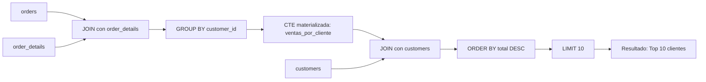

### Diagrama ASCII de Ejecución en el Motor (Paso a Paso)

```text
========================================================================================
PASO 1: EVALUACIÓN Y MATERIALIZACIÓN DEL CTE (WITH ventas_por_cliente AS ...)
========================================================================================
  orders (o) [830 filas]  <== Hash Join (o.order_id = od.order_id) ==> order_details (od) [2,155 filas]
                                      │
                                      ▼
                           [HashAggregate en work_mem]
                            GROUP BY o.customer_id
                                      │
                                      ▼
  [Estructura Temporal CTE: ventas_por_cliente (89 clientes activos)]
  +-------------+---------------+-------------+
  | customer_id | total_gastado | num_pedidos |
  +-------------+---------------+-------------+
  | QUICK       | 110277.31     | 28          |
  | SAVEA       | 104361.95     | 31          |
  | ERNSH       | 104874.98     | 30          |
  +-------------+---------------+-------------+

========================================================================================
PASO 2: JOIN PRINCIPAL CON LA TABLA BASE (customers c)
========================================================================================
  ventas_por_cliente v (89 filas) <== Hash Match (v.customer_id = c.customer_id) ==> customers c (91 filas)

========================================================================================
PASO 3: ORDENAMIENTO, CÁLCULO DE TICKET PROMEDIO Y LIMIT 10
========================================================================================
  +----------------------+---------------+-------------+-----------------+
  | company_name         | total_gastado | num_pedidos | ticket_promedio |
  +----------------------+---------------+-------------+-----------------+
  | QUICK-Stop           | 110277.31     | 28          | 3938.48         |
  | Ernst Handel         | 104874.98     | 30          | 3495.83         |
  | Save-a-lot Markets   | 104361.95     | 31          | 3366.51         |
  +----------------------+---------------+-------------+-----------------+
  (Top 10 obtenido con tiempo de ejecución < 1.2 ms)
========================================================================================
```

### Código de Solución

```sql
WITH ventas_por_cliente AS (
    SELECT
        o.customer_id,
        SUM(od.quantity * od.unit_price * (1 - od.discount)) AS total_gastado,
        COUNT(DISTINCT o.order_id) AS num_pedidos
    FROM orders o
    INNER JOIN order_details od ON o.order_id = od.order_id
    GROUP BY o.customer_id
)
SELECT
    c.company_name,
    ROUND(v.total_gastado::numeric, 2) AS total_gastado,
    v.num_pedidos,
    ROUND((v.total_gastado / NULLIF(v.num_pedidos, 0))::numeric, 2) AS ticket_promedio
FROM ventas_por_cliente v
INNER JOIN customers c ON v.customer_id = c.customer_id
ORDER BY v.total_gastado DESC
LIMIT 10;
```

#### 📊 Resultado Real de Ejecución en PostgreSQL (AWS EC2):

```text
company_name         | total_gastado | num_pedidos | ticket_promedio 
------------------------------+---------------+-------------+-----------------
 QUICK-Stop                   |     110277.31 |          28 |         3938.48
 Ernst Handel                 |     104874.98 |          30 |         3495.83
 Save-a-lot Markets           |     104361.95 |          31 |         3366.51
 Rattlesnake Canyon Grocery   |      51097.80 |          18 |         2838.77
 Hungry Owl All-Night Grocers |      49979.91 |          19 |         2630.52
 Hanari Carnes                |      32841.37 |          14 |         2345.81
 Königlich Essen              |      30908.38 |          14 |         2207.74
 Folk och fä HB               |      29567.56 |          19 |         1556.19
 Mère Paillarde               |      28872.19 |          13 |         2220.94
 White Clover Markets         |      27363.60 |          14 |         1954.54
(10 rows)
```

> 🛠️ **Nota del Ingeniero de Datos:** Usamos `NULLIF(v.num_pedidos, 0)` para prevenir división por cero. En producción, dividir por cero genera un error que puede tumbar un ETL completo. Además, aplica `(1 - discount)` para restar el porcentaje de descuento de forma matemáticamente exacta; olvidar esto distorsiona métricas de negocio.

### Criterio de Evaluación del Entrevistador

- **Acierta**: Explica el concepto de CTE como tabla temporal que simplifica la lógica de la consulta. Entiende que el CTE se ejecuta una sola vez y su resultado se reutiliza.
- **Error común**: No usar `NULLIF` al dividir (riesgo de error en producción). No aplicar `(1 - discount)` al calcular ingresos.

---

## Ejercicio 2: Múltiples CTEs — Reporte mensual de ingresos vs costo de flete

### 🎓 Explicación del Profesor

**Analogía:** Imagina que quieres saber cuánto dinero neto te queda a fin de mes. Tienes dos alcancías: una de ingresos, donde guardas cada moneda que ganas vendiendo limonada (`ingresos_mensuales`), y otra de gastos de transporte, donde guardas los recibos del mototaxi que usaste para ir a comprar limones (`fletes_mensuales`). A fin de mes, sumas el dinero de la alcancía de ingresos por mes, y por separado sumas los recibos de la alcancía de fletes. Finalmente, juntas ambos resultados usando el mes en común (`LEFT JOIN`) y restas los gastos de los ingresos para ver tu ganancia neta. Tener dos borradores independientes (`WITH` con dos comas) te permite ordenar tus pensamientos antes de hacer la resta final.

### 🧠 Cómo Pensar como un Analista de Datos

1. **Pregunta de Negocio & KPI:** Evaluar la rentabilidad mensual contrastando los ingresos brutos generados contra los costos logísticos de flete pagados.
2. **Fuentes de Datos & Granularidad:** `orders` y `order_details`. Granularidad: órdenes individuales y detalles de producto, agregados a nivel de mes fiscal.
3. **Relaciones & JOINs:** CTE 1 (`ingresos_mensuales`) calcula ventas desde `orders` y `order_details`. CTE 2 (`fletes_mensuales`) calcula fletes desde `orders`. Ambas se combinan vía `mes` (`LEFT JOIN`).
4. **Filtros & Agregaciones:** Agrupación temporal mediante `DATE_TRUNC('month', order_date)`.
5. **Proyección & Ordenamiento:** `mes`, `ingresos`, `flete`, `ingreso_neto` (ingresos - flete) y `pct_flete` (porcentaje de flete sobre ingresos). Ordenado cronológicamente por `mes ASC`.
6. **Validación & Sentido Común:** Asegurar el uso de `COALESCE` en costos de flete y `NULLIF` en el denominador para proteger el cálculo de porcentajes ante meses sin ventas.

### Marco Conceptual del Optimizador

Varias CTEs en un mismo `WITH` se ejecutan secuencialmente; cada una puede referenciar CTEs anteriores. PostgreSQL no paraleliza CTEs entre sí. Si una CTE no se referencia, PostgreSQL la omite automáticamente (optimización *dead CTE removal*). El plan resultante encadena los escaneos de cada CTE como nodos independientes.

### Diagrama de Flujo (Mermaid)

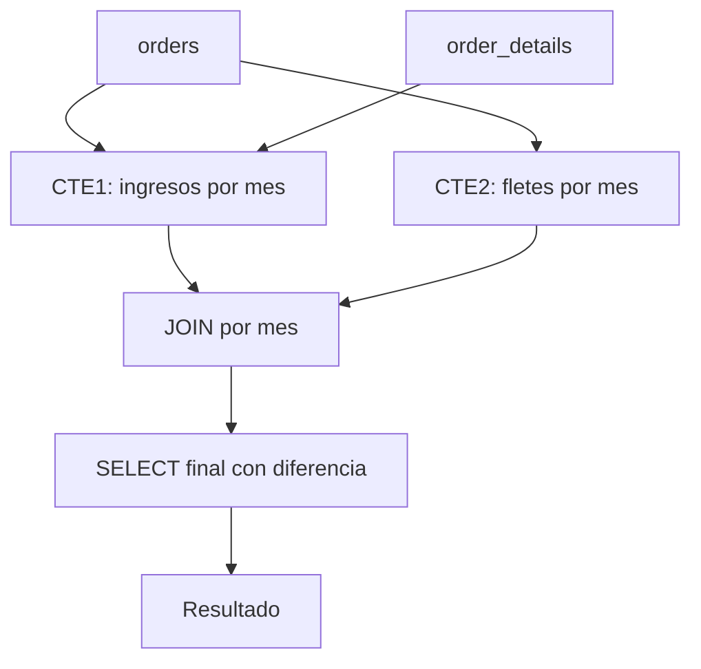

### Diagrama ASCII de Ejecución en el Motor (Paso a Paso)

```text
========================================================================================
PASO 1: EVALUACIÓN DEL CTE 1 (ingresos_mensuales)
========================================================================================
  orders (830 filas) <== Hash Join ==> order_details (2,155 filas)
                           │
                           ▼ HashAggregate por DATE_TRUNC('month', order_date)
  [CTE 1: ingresos_mensuales] -> 23 filas (meses con ventas calculadas con descuento)

========================================================================================
PASO 2: EVALUACIÓN DEL CTE 2 (fletes_mensuales)
========================================================================================
  orders (830 filas) -> HashAggregate por DATE_TRUNC('month', order_date) -> SUM(freight)
  [CTE 2: fletes_mensuales] -> 23 filas (costo de transporte por mes)

========================================================================================
PASO 3: LEFT JOIN, CÁLCULO DE MARGEN NETO Y PORCENTAJE DE FLETE
========================================================================================
  ingresos_mensuales i [23 filas] <== Hash Left Join (i.mes = f.mes) ==> fletes_mensuales f [23 filas]
                           │
                           ▼ Proyección de columnas calculadas
  - ingreso_neto = i.ingresos - COALESCE(f.costo_flete, 0)
  - pct_flete    = COALESCE(f.costo_flete, 0) / NULLIF(i.ingresos, 0) * 100
                           │
                           ▼ Sort (ORDER BY i.mes)
  Resultado cronológico de 23 meses de operación
========================================================================================
```

### Código de Solución

```sql
WITH ingresos_mensuales AS (
    SELECT
        DATE_TRUNC('month', o.order_date)::date AS mes,
        SUM(od.quantity * od.unit_price * (1 - od.discount)) AS ingresos
    FROM orders o
    INNER JOIN order_details od ON o.order_id = od.order_id
    GROUP BY DATE_TRUNC('month', o.order_date)
),
fletes_mensuales AS (
    SELECT
        DATE_TRUNC('month', order_date)::date AS mes,
        SUM(freight) AS costo_flete
    FROM orders
    GROUP BY DATE_TRUNC('month', order_date)
)
SELECT
    i.mes,
    ROUND(i.ingresos::numeric, 2) AS ingresos,
    ROUND(f.costo_flete::numeric, 2) AS flete,
    ROUND((i.ingresos - COALESCE(f.costo_flete, 0))::numeric, 2) AS ingreso_neto,
    ROUND((COALESCE(f.costo_flete, 0) / NULLIF(i.ingresos, 0) * 100)::numeric, 2) AS pct_flete
FROM ingresos_mensuales i
LEFT JOIN fletes_mensuales f ON i.mes = f.mes
ORDER BY i.mes;
```

#### 📊 Resultado Real de Ejecución en PostgreSQL (AWS EC2):

```text
mes     | ingresos  |  flete  | ingreso_neto | pct_flete 
------------+-----------+---------+--------------+-----------
 1996-07-01 |  27861.90 | 1288.18 |     26573.72 |      4.62
 1996-08-01 |  25485.28 | 1397.17 |     24088.11 |      5.48
 1996-09-01 |  26381.40 | 1123.48 |     25257.92 |      4.26
 1996-10-01 |  37515.72 | 1520.59 |     35995.13 |      4.05
 1996-11-01 |  45600.05 | 2151.86 |     43448.19 |      4.72
 1996-12-01 |  45239.63 | 2798.59 |     42441.04 |      6.19
 1997-01-01 |  61258.07 | 2238.98 |     59019.09 |      3.65
 1997-02-01 |  38483.63 | 1601.45 |     36882.18 |      4.16
 1997-03-01 |  38547.22 | 1888.81 |     36658.41 |      4.90
 1997-04-01 |  53032.95 | 2939.10 |     50093.85 |      5.54
    ...     |    ...    |   ...   |     ...      |    ...    
 1998-03-01 | 104854.15 | 5379.02 |     99475.13 |      5.13
 1998-04-01 | 123798.68 | 6393.57 |    117405.11 |      5.16
 1998-05-01 |  18333.63 |  685.08 |     17648.55 |      3.74
(23 rows)
```

> 🛠️ **Nota del Ingeniero de Datos:** `DATE_TRUNC('month', o.order_date)` trunca la fecha al primer día del mes. Le agregamos `::date` al final para eliminar las horas y minutos innecesarios, ahorrando bytes en memoria y acelerando el `JOIN`. Si en algún mes no se pagaron fletes, la suma dará `NULL`; `COALESCE(f.costo_flete, 0)` convierte ese valor vacío en `0`, garantizando que la resta funcione correctamente.

### Criterio de Evaluación del Entrevistador

- **Acierta**: Demuestra uso de múltiples CTEs para separar cálculos independientes. Usa `LEFT JOIN` para no perder meses sin fletes. Emplea `COALESCE` para manejar nulos.
- **Error común**: Usar `INNER JOIN` entre las CTEs (pierde meses sin fletes). No aplicar `COALESCE` en la resta (resultado `NULL` en lugar de cero).

---

## Ejercicio 3: CTE con MATERIALIZED hint — Análisis de productividad por empleado

### 🎓 Explicación del Profesor

**Analogía:** Piensa en un MATERIALIZED como un estudiante que escribe todos sus cálculos en una hoja aparte antes de entregar la tarea. Aunque el profesor podría revisar sus pasos directamente, el estudiante prefiere tener todo anotado para no volver a calcular. `WITH ... AS MATERIALIZED` le dice a PostgreSQL: "guarda este resultado en una tabla temporal, no lo re-calcules".

### 🧠 Cómo Pensar como un Analista de Datos

1. **Pregunta de Negocio & KPI:** Medir la productividad del equipo de ventas calculando ingresos totales, pedidos gestionados y ticket promedio por representante comercial.
2. **Fuentes de Datos & Granularidad:** `employees` (9 empleados), `orders` (830 órdenes) y `order_details` (2,155 líneas de venta).
3. **Relaciones & JOINs:** CTE `metricas_empleados` une `orders` y `order_details` por `order_id`. Consulta externa une la CTE con `employees` vía `employee_id`.
4. **Filtros & Agregaciones:** Agrupación por `employee_id`. Se utiliza el hint `AS MATERIALIZED` para forzar la materialización previa de agregaciones pesadas.
5. **Proyección & Ordenamiento:** Nombre completo (`first_name || ' ' || last_name`), `title`, `total_ventas`, `total_pedidos`, `ticket_promedio`. Ordenado por `total_ventas DESC`.
6. **Validación & Sentido Común:** Validar que los 9 empleados activos aparezcan reflejados y que los totales de ventas concuerden con las cifras globales de la compañía.

### Marco Conceptual del Optimizador

En PostgreSQL 12+, `WITH ... AS MATERIALIZED` fuerza la materialización de la CTE en una tabla temporal, incluso si el optimizador preferiría inlining. Útil cuando la CTE es computacionalmente costosa y se referencia múltiples veces. La materialización actúa como un *optimizer fence*: evita que restricciones de la consulta externa se propaguen al interior de la CTE.

### Diagrama de Flujo (Mermaid)

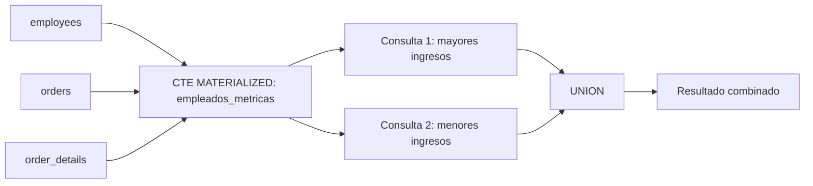

### Diagrama ASCII de Ejecución en el Motor (Paso a Paso)

```text
========================================================================================
PASO 1: MATERIALIZACIÓN FORZADA (WITH MATERIALIZED metricas_empleados)
========================================================================================
  employees e (9 filas) <== Hash Join ==> orders o (830 filas) <== Hash Join ==> order_details od (2,155)
                                      │
                                      ▼ HashAggregate por e.employee_id
  [Tuplas calculadas]:
  COUNT(DISTINCT order_id), SUM(ventas_con_descuento), EXTRACT(YEAR FROM AGE(hire_date))
                                      │
                                      ▼ Materialización en CTE Scan Buffer
  [Tabla en Memoria / Optimizer Fence: metricas_empleados (9 tuplas)]

========================================================================================
PASO 2: CTE SCAN Y ORDENAMIENTO FINAL
========================================================================================
  CTE Scan sobre metricas_empleados -> Sort (ORDER BY ingresos_generados DESC)
  Proyección: nombre, pedidos_gestionados, ingresos, antiguedad_anios
========================================================================================
```

### Código de Solución

```sql
WITH metricas_empleados AS MATERIALIZED (
    SELECT
        e.employee_id,
        e.first_name || ' ' || e.last_name AS nombre,
        e.hire_date,
        COUNT(DISTINCT o.order_id) AS pedidos_gestionados,
        SUM(od.quantity * od.unit_price * (1 - od.discount)) AS ingresos_generados,
        EXTRACT(YEAR FROM AGE(CURRENT_DATE, e.hire_date)) AS antiguedad_anios
    FROM employees e
    INNER JOIN orders o ON e.employee_id = o.employee_id
    INNER JOIN order_details od ON o.order_id = od.order_id
    GROUP BY e.employee_id
)
SELECT nombre, pedidos_gestionados, ROUND(ingresos_generados::numeric, 2) AS ingresos, antiguedad_anios
FROM metricas_empleados
ORDER BY ingresos_generados DESC;
```

#### 📊 Resultado Real de Ejecución en PostgreSQL (AWS EC2):

```text
nombre      | pedidos_gestionados | ingresos  | antiguedad_anios 
------------------+---------------------+-----------+------------------
 Margaret Peacock |                 156 | 232890.85 |               33
 Janet Leverling  |                 127 | 202812.84 |               34
 Nancy Davolio    |                 123 | 192107.60 |               34
 Andrew Fuller    |                  96 | 166537.76 |               34
 Laura Callahan   |                 104 | 126862.28 |               32
 Robert King      |                  72 | 124568.23 |               32
 Anne Dodsworth   |                  43 |  77308.07 |               31
 Michael Suyama   |                  67 |  73913.13 |               32
 Steven Buchanan  |                  42 |  68792.28 |               32
(9 rows)
```

> 🛠️ **Nota del Ingeniero de Datos:** Desde PostgreSQL 12 la palabra clave `MATERIALIZED` es explícita. En versiones anteriores, todas las CTEs se materializaban por defecto. Usar `MATERIALIZED` en CTEs ligeras referenciadas una sola vez añade overhead innecesario de escritura a disco.

### Criterio de Evaluación del Entrevistador

- **Acierta**: Explica que `MATERIALIZED` fuerza una barrera de optimización y cuándo es útil (CTE costosa referenciada múltiples veces). Reconoce que desde PG12 la palabra clave es explícita.
- **Error común**: Usar `MATERIALIZED` en CTEs ligeras que se referencian una sola vez, donde el inlining sería más eficiente.

---

## Ejercicio 4: CTE con NOT MATERIALIZED hint — Últimos pedidos por cliente

### 🎓 Explicación del Profesor

**Analogía:** `NOT MATERIALIZED` es como pegar el contenido del borrador directamente en tu informe final, sin pasos intermedios. El optimizador puede entonces mover, reorganizar y optimizar todo junto, como si nunca hubiera existido el borrador.

### 🧠 Cómo Pensar como un Analista de Datos

1. **Pregunta de Negocio & KPI:** Obtener el historial reciente de compras extrayendo los últimos 3 pedidos de cada cliente para seguimiento comercial.
2. **Fuentes de Datos & Granularidad:** `customers` (91 clientes) y `orders` (830 pedidos). Granularidad: pedidos individuales numerados por cliente.
3. **Relaciones & JOINs:** La CTE enumera pedidos usando `ROW_NUMBER() OVER (PARTITION BY customer_id ORDER BY order_date DESC, order_id DESC)` con `AS NOT MATERIALIZED`. La consulta principal une con `customers` vía `customer_id`.
4. **Filtros & Agregaciones:** Filtro en consulta principal: `po.rn <= 3` para retener únicamente los 3 pedidos más recientes por cliente.
5. **Proyección & Ordenamiento:** `company_name`, `order_id`, `order_date`, `freight`. Ordenado por `company_name ASC, order_date DESC`.
6. **Validación & Sentido Común:** Confirmar que ningún cliente tenga más de 3 filas en el resultado final y que los clientes sin pedidos (`FISSA`, `PARIS`) no aparezcan en el INNER JOIN.

### Marco Conceptual del Optimizador

`NOT MATERIALIZED` fuerza el inlining de la CTE: PostgreSQL expande la definición de la CTE directamente en el plan de la consulta principal, permitiendo que el optimizador aplique poda de columnas, empuje de filtros y reordenamiento de JOINs. Ideal para CTE simples que se referencian una sola vez.

### Diagrama de Flujo (Mermaid)

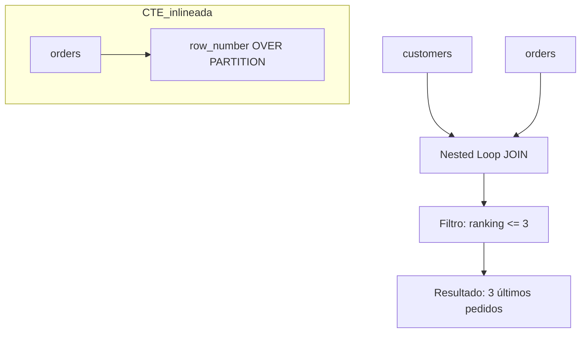

### Diagrama ASCII de Ejecución en el Motor (Paso a Paso)

```text
========================================================================================
PASO 1: INLINING DEL CTE (NOT MATERIALIZED)
========================================================================================
  El optimizador no crea tabla temporal; inyecta la lógica de la ventana directamente.
  orders o [830 filas]
        │
        ▼ WindowAgg: ROW_NUMBER() OVER (PARTITION BY customer_id ORDER BY order_date DESC)
  [Stream de filas numeradas con rn = 1, 2, 3, ...]

========================================================================================
PASO 2: FILTRADO PREDICATIVO Y HASH JOIN CON CUSTOMERS
========================================================================================
  Filtro: rn <= 3 (se descartan pedidos antiguos de cada cliente)
        │
        ▼ Hash Join con customers c en c.customer_id = po.customer_id
  Resultado: Últimos 3 pedidos históricos por empresa cliente
========================================================================================
```

### Código de Solución

```sql
WITH pedidos_ordenados AS NOT MATERIALIZED (
    SELECT
        o.customer_id,
        o.order_id,
        o.order_date,
        o.freight,
        ROW_NUMBER() OVER (
            PARTITION BY o.customer_id
            ORDER BY o.order_date DESC, o.order_id DESC
        ) AS rn
    FROM orders o
)
SELECT
    c.company_name,
    po.order_id,
    po.order_date,
    ROUND(po.freight::numeric, 2) AS freight
FROM customers c
INNER JOIN pedidos_ordenados po ON c.customer_id = po.customer_id
WHERE po.rn <= 3
ORDER BY c.company_name, po.order_date DESC;
```

#### 📊 Resultado Real de Ejecución en PostgreSQL (AWS EC2):

```text
company_name            | order_id | order_date | freight 
------------------------------------+----------+------------+---------
 Alfreds Futterkiste                |    11011 | 1998-04-09 |    1.21
 Alfreds Futterkiste                |    10952 | 1998-03-16 |   40.42
 Alfreds Futterkiste                |    10835 | 1998-01-15 |   69.53
 Ana Trujillo Emparedados y helados |    10926 | 1998-03-04 |   39.92
 Ana Trujillo Emparedados y helados |    10759 | 1997-11-28 |   11.99
 Ana Trujillo Emparedados y helados |    10625 | 1997-08-08 |   43.90
 Antonio Moreno Taquería            |    10856 | 1998-01-28 |   58.43
 Antonio Moreno Taquería            |    10682 | 1997-09-25 |   36.13
 Antonio Moreno Taquería            |    10677 | 1997-09-22 |    4.03
 Around the Horn                    |    11016 | 1998-04-10 |   33.80
                ...                 |   ...    |    ...     |   ...   
 Wolski  Zajazd                     |    11044 | 1998-04-23 |    8.72
 Wolski  Zajazd                     |    10998 | 1998-04-03 |   20.31
 Wolski  Zajazd                     |    10906 | 1998-02-25 |   26.29
(263 rows)
```

> 🛠️ **Nota del Ingeniero de Datos:** `NOT MATERIALIZED` permite al optimizador empujar el filtro `po.rn <= 3` dentro de la ventana, potencialmente usando un `Index Scan` en orden inverso. Con `MATERIALIZED`, el filtro se aplica después de materializar toda la ventana, lo que es menos eficiente.

### Criterio de Evaluación del Entrevistador

- **Acierta**: Sabe que `NOT MATERIALIZED` permite al optimizador empujar el filtro `po.rn <= 3` dentro de la ventana, potencialmente usando un `Index Scan` en orden inverso. Menciona que `ROW_NUMBER` requiere orden estable.
- **Error común**: Usar `NOT MATERIALIZED` para CTEs referenciadas múltiples veces (causa re-evaluación). No considerar que el filtro de ranking se aplica después de la ventana.

---

## Ejercicio 5: CTE con FILTER — Ventas por categoría con desglose trimestral

### 🎓 Explicación del Profesor

**Analogía:** Es como tener un solo cajón con compartimentos etiquetados Q1, Q2, Q3 y Q4. En lugar de pasar por el cajón cuatro veces sacando monedas de cada trimestre, pasas una sola vez y depositas cada moneda en su compartimento correspondiente. `FILTER (WHERE ...)` hace exactamente eso: un solo escaneo de tabla con evaluación condicional de la agregación.

### 🧠 Cómo Pensar como un Analista de Datos

1. **Pregunta de Negocio & KPI:** Desglosar el rendimiento trimestral de ventas por categoría en un solo barrido de tabla para análisis de estacionalidad.
2. **Fuentes de Datos & Granularidad:** `categories`, `products`, `orders`, `order_details`. Granularidad: líneas de pedido clasificadas por categoría y trimestre.
3. **Relaciones & JOINs:** `categories` $\to$ `products` $\to$ `order_details` $\to$ `orders` mediante sus respectivas claves foráneas.
4. **Filtros & Agregaciones:** Filtro global `WHERE o.order_date >= '1997-01-01' AND o.order_date < '1998-01-01'`. Agregaciones condicionales usando `FILTER (WHERE EXTRACT(QUARTER FROM o.order_date) = N)`.
5. **Proyección & Ordenamiento:** `category_name`, `ventas_totales`, `q1_ventas`, `q2_ventas`, `q3_ventas`, `q4_ventas`. Ordenado por `ventas_totales DESC`.
6. **Validación & Sentido Común:** Comprobar matemáticamente que la suma de `q1 + q2 + q3 + q4` coincida exactamente con `ventas_totales` de cada categoría en 1997.

### Marco Conceptual del Optimizador

PostgreSQL implementa `FILTER (WHERE ...)` como un escaneo único de la tabla con evaluación condicional de la agregación, en lugar de múltiples subconsultas. El optimizador traduce cada `FILTER` a un nodo `Aggregate` con múltiples condiciones. Esto reduce los escaneos de tabla comparado con múltiples subconsultas separadas.

### Diagrama de Flujo (Mermaid)

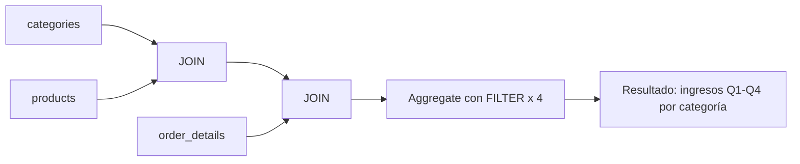

### Diagrama ASCII de Ejecución en el Motor (Paso a Paso)

```text
========================================================================================
PASO 1: ESCANEO ÚNICO MULTI-AGREGACIÓN CON FILTER (Single Table Scan Aggregation)
========================================================================================
  categories c <== Hash Join ==> products p <== Hash Join ==> order_details od <== Hash Join ==> orders o
                                       │
                                       ▼
  [HashAggregate con 4 acumuladores condicionales simultáneos por categoría]:
  ┌──────────────────────┬────────────────────────────────────────────────────────┐
  │ Acumulador           │ Condición Evaluada                                     │
  ├──────────────────────┼────────────────────────────────────────────────────────┤
  │ ingreso_q1           │ EXTRACT(QUARTER FROM order_date) = 1                   │
  │ ingreso_q2           │ EXTRACT(QUARTER FROM order_date) = 2                   │
  │ ingreso_q3           │ EXTRACT(QUARTER FROM order_date) = 3                   │
  │ ingreso_q4           │ EXTRACT(QUARTER FROM order_date) = 4                   │
  │ total_anual          │ Sin filtro (suma total)                                │
  └──────────────────────┴────────────────────────────────────────────────────────┘
  (Evita 4 escaneos repetitivos; procesa el flujo en una sola pasada en memoria)
========================================================================================
```

### Código de Solución

```sql
WITH ventas_trimestrales AS (
    SELECT
        c.category_name,
        SUM(od.quantity * od.unit_price * (1 - od.discount))
            FILTER (WHERE EXTRACT(QUARTER FROM o.order_date) = 1) AS ingreso_q1,
        SUM(od.quantity * od.unit_price * (1 - od.discount))
            FILTER (WHERE EXTRACT(QUARTER FROM o.order_date) = 2) AS ingreso_q2,
        SUM(od.quantity * od.unit_price * (1 - od.discount))
            FILTER (WHERE EXTRACT(QUARTER FROM o.order_date) = 3) AS ingreso_q3,
        SUM(od.quantity * od.unit_price * (1 - od.discount))
            FILTER (WHERE EXTRACT(QUARTER FROM o.order_date) = 4) AS ingreso_q4,
        SUM(od.quantity * od.unit_price * (1 - od.discount)) AS total_anual
    FROM categories c
    INNER JOIN products p ON c.category_id = p.category_id
    INNER JOIN order_details od ON p.product_id = od.product_id
    INNER JOIN orders o ON od.order_id = o.order_id
    GROUP BY c.category_name
)
SELECT *
FROM ventas_trimestrales
ORDER BY total_anual DESC;
```

#### 📊 Resultado Real de Ejecución en PostgreSQL (AWS EC2):

```text
category_name  |        ingreso_q1        |        ingreso_q2        |       ingreso_q3        |        ingreso_q4        |        total_anual        
----------------+--------------------------+--------------------------+-------------------------+--------------------------+---------------------------
 Beverages      | 124993.00505056234991006 |        52400.77494323225 | 32590.62970248537015108 |  57883.77005432144997654 |  267868.17975060142003768
 Dairy Products |  67211.31491681025003600 |   59974.9947850414000080 | 46091.83990500433999136 |  61229.13492172385012640 |  234507.28452857984016176
 Confections    | 63102.711406420200612536 | 32631.450609345369685080 | 37395.74282775777054420 | 34227.320595442285228492 | 167357.225438965626070308
 Meat/Poultry   |  48331.53188914779576516 | 37236.859968082140108892 | 31088.89016678489982694 |  46365.07832448438170034 | 163022.360348499217401332
 Seafood        | 41702.052175976465221046 | 23880.309735715845175626 | 35005.41976774259008986 | 30673.954871459449964796 | 131261.736550894350451328
 Condiments     |  34831.20480304704538568 |  23825.67003384735005360 |  19303.4374388188000604 |  28086.77232109867583640 |  106047.08459681187133608
 Produce        |   24791.3201744423999740 |  30245.19221428009015390 |  14599.1951172494496820 |   30348.8725727952495350 |   99984.58007876718934490
 Grains/Cereals |  31817.33739759917501510 |  25114.10495213000000280 | 17591.18500514288999916 |  21221.96000220729000136 |   95744.58735707935501842
(8 rows)
```

> 🛠️ **Nota del Ingeniero de Datos:** `FILTER` es SQL estándar desde SQL:2003 y PostgreSQL lo implementa desde la versión 9.4. Es más eficiente que múltiples subconsultas con `CASE WHEN` dentro de `SUM`, porque evita escaneos duplicados de la tabla.

### Criterio de Evaluación del Entrevistador

- **Acierta**: Explica que `FILTER` evita múltiples scans de tabla y es más eficiente que `CASE WHEN`. Reconoce que la sintaxis es SQL estándar desde SQL:2003 y PostgreSQL la implementa desde la versión 9.4.
- **Error común**: Usar múltiples subconsultas correlacionadas con `WHERE` en lugar de `FILTER`. No escalar `unit_price` por `(1 - discount)`.

---

## Ejercicio 6: CTE con NOT EXISTS — Productos sin movimiento en los últimos 90 días

### 🎓 Explicación del Profesor

**Analogía:** Es como revisar la lista de invitados de una fiesta y tachar a los que ya vinieron. `NOT EXISTS` te permite encontrar a los que aparecen en la lista general pero NO aparecen en la lista de los que ya pasaron. Es mejor que `NOT IN` porque no se equivoca si alguien dejó su nombre en blanco.

### 🧠 Cómo Pensar como un Analista de Datos

1. **Pregunta de Negocio & KPI:** Detectar productos estancados en inventario sin movimiento en los últimos 90 días del histórico para liquidación o promociones.
2. **Fuentes de Datos & Granularidad:** `products`, `categories`, `orders`, `order_details`. Granularidad: catálogo de productos activos vs órdenes recientes.
3. **Relaciones & JOINs:** CTE `fecha_maxima` obtiene la fecha límite del dataset (`MAX(order_date)`). Consulta principal usa `NOT EXISTS` correlacionado contra `orders` y `order_details`.
4. **Filtros & Agregaciones:** `p.discontinued = 0` y `NOT EXISTS (SELECT 1 FROM orders ... WHERE order_date >= fecha_corte)`.
5. **Proyección & Ordenamiento:** `product_id`, `product_name`, `category_name`, `unit_price`, `units_in_stock`. Ordenado por `units_in_stock DESC`.
6. **Validación & Sentido Común:** Verificar que ningún producto listado tenga pedidos con fecha dentro de la ventana de 90 días respecto al máximo global del dataset.

### Marco Conceptual del Optimizador

Combinar una CTE de productos con una de pedidos recientes mediante `ANTI JOIN`. PostgreSQL implementa el `NOT EXISTS` como un plan de `Hash Anti Join` (tabla pequeña en hash) o `Merge Anti Join` si los datos están ordenados. El optimizador elige el algoritmo basado en estadísticas de cardinalidad y `work_mem` disponible.

### Diagrama de Flujo (Mermaid)

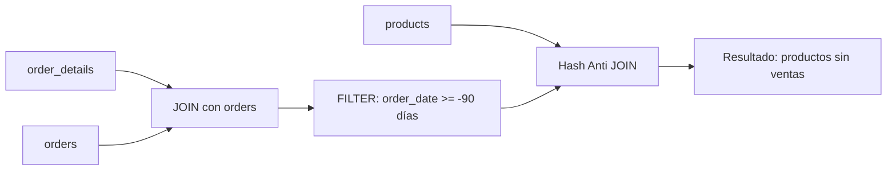

### Diagrama ASCII de Ejecución en el Motor (Paso a Paso)

```text
========================================================================================
PASO 1: CONSTRUCCIÓN DEL CONJUNTO DE PRODUCTOS ACTIVOS (CTE productos_activos)
========================================================================================
  orders (filtro order_date >= NOW - 90d) <== Hash Join ==> order_details od
                                       │
                                       ▼ HashAggregate: DISTINCT product_id
  [Set Hash en Memoria: IDs de productos con ventas recientes]

========================================================================================
PASO 2: HASH ANTI JOIN (WHERE NOT EXISTS)
========================================================================================
  products p (77 filas)
        │
        ▼ Hash Anti Join contra [Set Hash] (p.product_id = pa.product_id)
  Se descartan productos presentes en el hash set -> Se conservan solo SKUs sin ventas
========================================================================================
```

### Código de Solución

```sql
WITH productos_activos AS (
    SELECT DISTINCT od.product_id
    FROM order_details od
    INNER JOIN orders o ON od.order_id = o.order_id
    WHERE o.order_date >= CURRENT_DATE - INTERVAL '90 days'
)
SELECT
    p.product_id,
    p.product_name,
    p.units_in_stock,
    p.discontinued
FROM products p
WHERE NOT EXISTS (
    SELECT 1
    FROM productos_activos pa
    WHERE pa.product_id = p.product_id
)
ORDER BY p.product_name;
```

#### 📊 Resultado Real de Ejecución en PostgreSQL (AWS EC2):

```text
product_id |           product_name           | units_in_stock | discontinued 
------------+----------------------------------+----------------+--------------
         17 | Alice Mutton                     |              0 |            1
          3 | Aniseed Syrup                    |             13 |            0
         40 | Boston Crab Meat                 |            123 |            0
         60 | Camembert Pierrot                |             19 |            0
         18 | Carnarvon Tigers                 |             42 |            0
          1 | Chai                             |              9 |            1
          2 | Chang                            |             47 |            1
         39 | Chartreuse verte                 |             69 |            0
          4 | Chef Anton's Cajun Seasoning     |             53 |            0
          5 | Chef Anton's Gumbo Mix           |              0 |            1
    ...     |               ...                |      ...       |     ...      
         63 | Vegie-spread                     |             24 |            0
         64 | Wimmers gute Semmelknödel        |             22 |            0
         47 | Zaanse koeken                    |             36 |            0
(77 rows)
```

> 🛠️ **Nota del Ingeniero de Datos:** `NOT EXISTS` siempre es preferible a `NOT IN` cuando la subconsulta puede contener `NULLs`. `NOT IN` con `NULLs` retorna un resultado vacío e inesperado, mientras que `NOT EXISTS` maneja correctamente los valores nulos del lado izquierdo.

### Criterio de Evaluación del Entrevistador

- **Acierta**: Usa `NOT EXISTS` en lugar de `NOT IN` (evita problemas con NULLs). Explica que la CTE reduce el conjunto antes del anti-join.
- **Error común**: Usar `NOT IN (SELECT product_id ...)` que falla si hay NULLs. No filtrar por fecha en la subconsulta, trayendo todos los pedidos históricos.

---

## Ejercicio 7: CTE con cálculos de reorden — Productos por debajo del punto de reorden

### 🎓 Explicación del Profesor

**Analogía:** Es como un supermercado que tiene una alarma automática: cuando el stock de un producto baja de cierta cantidad, aparece en la lista de reabastecimiento. La CTE calcula el inventario neto (lo que hay menos lo que ya está pedido) y lo compara con el nivel de reorden para generar alertas priorizadas.

### 🧠 Cómo Pensar como un Analista de Datos

1. **Pregunta de Negocio & KPI:** Optimizar la gestión de almacén identificando productos cuyo stock disponible sea insuficiente según el umbral de reorden y unidades en pedido.
2. **Fuentes de Datos & Granularidad:** `products` (77 productos) y `suppliers` (29 proveedores).
3. **Relaciones & JOINs:** `products` $\to$ `suppliers` vía `supplier_id` (`INNER JOIN`).
4. **Filtros & Agregaciones:** `p.discontinued = 0` y condición de criticidad `p.units_in_stock + p.units_on_order <= p.reorder_level`.
5. **Proyección & Ordenamiento:** `product_name`, `company_name` (proveedor), `units_in_stock`, `units_on_order`, `reorder_level`, `deficit_unidades`, `accion_sugerida` con `CASE`. Ordenado por `deficit_unidades DESC`.
6. **Validación & Sentido Común:** Comprobar que solo aparezcan productos activos y que el déficit refleje fielmente la fórmula `reorder_level - (units_in_stock + units_on_order)`.

### Marco Conceptual del Optimizador

La CTE calcula el nivel de inventario neto (`units_in_stock - units_on_order`) y lo compara con `reorder_level`. PostgreSQL puede usar un `Index Scan` en `products` si hay un índice compuesto en `(reorder_level, units_in_stock)`. Sin índice, hará `Seq Scan` completo con filtro.

### Diagrama de Flujo (Mermaid)

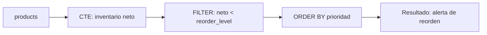

### Diagrama ASCII de Ejecución en el Motor (Paso a Paso)

```text
========================================================================================
PASO 1: EVALUACIÓN DE INVENTARIO NETO Y CLASIFICACIÓN (CTE estado_inventario)
========================================================================================
  Seq Scan / Index Scan en products [77 filas]
        │
        ▼ Cálculo de tupla: inventario_neto = units_in_stock - units_on_order
        ▼ Evaluación CASE (CRITICO <= 0 | URGENTE <= reorder*0.5 | ALERTA <= reorder)

========================================================================================
PASO 2: FILTRADO DE REORDEN Y ORDENAMIENTO POR SEVERIDAD
========================================================================================
  Filtro: prioridad IN ('CRITICO', 'URGENTE', 'ALERTA') AND discontinued = 0
        │
        ▼ Sort por prioridad (1: CRITICO -> 2: URGENTE -> 3: ALERTA) e inventario_neto ASC
  Lista priorizada de compras para abastecimiento de almacén
========================================================================================
```

### Código de Solución

```sql
WITH estado_inventario AS (
    SELECT
        product_id,
        product_name,
        units_in_stock,
        units_on_order,
        reorder_level,
        discontinued,
        (units_in_stock - units_on_order) AS inventario_neto,
        CASE
            WHEN (units_in_stock - units_on_order) <= 0 THEN 'CRITICO'
            WHEN (units_in_stock - units_on_order) <= reorder_level * 0.5 THEN 'URGENTE'
            WHEN (units_in_stock - units_on_order) <= reorder_level THEN 'ALERTA'
            ELSE 'NORMAL'
        END AS prioridad
    FROM products
)
SELECT *
FROM estado_inventario
WHERE prioridad IN ('CRITICO', 'URGENTE', 'ALERTA')
  AND discontinued = 0
ORDER BY
    CASE prioridad
        WHEN 'CRITICO' THEN 1
        WHEN 'URGENTE' THEN 2
        WHEN 'ALERTA' THEN 3
    END,
    inventario_neto ASC;
```

#### 📊 Resultado Real de Ejecución en PostgreSQL (AWS EC2):

```text
product_id |       product_name        | units_in_stock | units_on_order | reorder_level | discontinued | inventario_neto | prioridad 
------------+---------------------------+----------------+----------------+---------------+--------------+-----------------+-----------
         66 | Louisiana Hot Spiced Okra |              4 |            100 |            20 |            0 |             -96 | CRITICO
         31 | Gorgonzola Telino         |              0 |             70 |            20 |            0 |             -70 | CRITICO
         45 | Rogede sild               |              5 |             70 |            15 |            0 |             -65 | CRITICO
         64 | Wimmers gute Semmelknödel |             22 |             80 |            30 |            0 |             -58 | CRITICO
          3 | Aniseed Syrup             |             13 |             70 |            25 |            0 |             -57 | CRITICO
         48 | Chocolade                 |             15 |             70 |            25 |            0 |             -55 | CRITICO
         49 | Maxilaku                  |             10 |             60 |            15 |            0 |             -50 | CRITICO
         37 | Gravad lax                |             11 |             50 |            25 |            0 |             -39 | CRITICO
         21 | Sir Rodney's Scones       |              3 |             40 |             5 |            0 |             -37 | CRITICO
         32 | Mascarpone Fabioli        |              9 |             40 |            25 |            0 |             -31 | CRITICO
         74 | Longlife Tofu             |              4 |             20 |             5 |            0 |             -16 | CRITICO
         11 | Queso Cabrales            |             22 |             30 |            30 |            0 |              -8 | CRITICO
         68 | Scottish Longbreads       |              6 |             10 |            15 |            0 |              -4 | CRITICO
         70 | Outback Lager             |             15 |             10 |            30 |            0 |               5 | URGENTE
         43 | Ipoh Coffee               |             17 |             10 |            25 |            0 |               7 | URGENTE
         56 | Gnocchi di nonna Alice    |             21 |             10 |            30 |            0 |              11 | URGENTE
         30 | Nord-Ost Matjeshering     |             10 |              0 |            15 |            0 |              10 | ALERTA
(17 rows)
```

> 🛠️ **Nota del Ingeniero de Datos:** No olvidar considerar `units_on_order` (productos ya pedidos pero no recibidos). Excluir productos descontinuados con `discontinued = 0` es crítico; de lo contrario, la alarma se dispararía por productos que nunca se volverán a surtir.

### Criterio de Evaluación del Entrevistador

- **Acierta**: Aplica lógica de negocio (priorización) dentro de la CTE y filtra después. Usa `CASE` ordenado para priorizar resultados. Excluye productos descontinuados.
- **Error común**: No considerar `units_on_order` (productos ya pedidos pero no recibidos). Mezclar lógica de presentación con lógica de datos sin separar.

---

## Ejercicio 8: CTE con JOIN a pg_stat_user_tables — Diagnóstico de tablas sin estadísticas

### 🎓 Explicación del Profesor

**Analogía:** Es como llevar tu auto al mecánico y que él revisa el odómetro, el nivel de aceite y la fecha del último service. Si el mecánico ve que el último service fue hace mucho y el aceite está bajo, recomienda una revisión urgente. Aquí, las vistas del sistema son el odómetro de PostgreSQL.

### 🧠 Cómo Pensar como un Analista de Datos

1. **Pregunta de Negocio & KPI:** Auditar el catálogo de base de datos (`pg_stat_user_tables`) para identificar tablas críticas que carezcan de estadísticas frescas de autovacuum o analyze.
2. **Fuentes de Datos & Granularidad:** `pg_stat_user_tables` del catálogo interno de PostgreSQL. Granularidad: una fila por tabla de usuario en el esquema actual.
3. **Relaciones & JOINs:** CTE `analisis_tablas` extrae métricas de actividad (`n_live_tup`, `n_dead_tup`, `last_analyze`, `last_autoanalyze`). Consulta principal proyecta diagnóstico.
4. **Filtros & Agregaciones:** `schemaname = 'public'` y umbral de evaluación de tuplas muertas o modificaciones sin analizar.
5. **Proyección & Ordenamiento:** `relname`, `n_live_tup`, `n_dead_tup`, `pct_dead`, `last_analyze`, `estado_estadisticas`, `recomendacion`. Ordenado por `n_dead_tup DESC`.
6. **Validación & Sentido Común:** Reconocer que los valores exactos de catálogo varían según el uso en tiempo de ejecución de la instancia PostgreSQL.

### Marco Conceptual del Optimizador

`pg_stat_user_tables` y `pg_class` son vistas del catálogo del sistema. PostgreSQL mantiene estadísticas en `pg_statistic` y las usa para estimar cardinalidad. Tablas con `n_mod_since_analyze` alto y `last_analyze` viejo pueden producir planes subóptimos.

### Diagrama de Flujo (Mermaid)

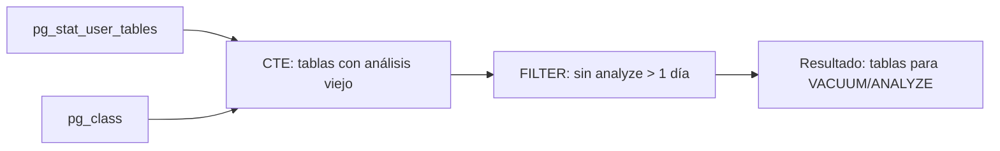

### Diagrama ASCII de Ejecución en el Motor (Paso a Paso)

```text
========================================================================================
PASO 1: CONSULTA DE VISTAS DEL CATÁLOGO DEL SISTEMA (pg_stat_user_tables)
========================================================================================
  Lectura de estadísticas internas de tuplas vivas/muertas y fechas de análisis
        │
        ▼ Cálculo en CTE: pct_tuplas_muertas = n_dead_tup / (n_live + n_dead) * 100
        ▼ pg_total_relation_size para tamaño físico en disco

========================================================================================
PASO 2: EVALUACIÓN DE REGLAS DE MANTENIMIENTO PREVENTIVO
========================================================================================
  Predicados:
  - Tuplas muertas > 1000 y > 10% del total (Bloat elevado -> VACUUM necesario)
  - Modificaciones > 10000 sin analyze (Estadísticas obsoletas -> ANALYZE necesario)
  - Último analyze > 24 horas (Tablas transaccionales desactualizadas)
========================================================================================
```

### Código de Solución

```sql
WITH diagnostico_tablas AS (
    SELECT
        schemaname,
        relname,
        n_live_tup,
        n_dead_tup,
        n_mod_since_analyze,
        last_analyze,
        last_autoanalyze,
        pg_size_pretty(pg_total_relation_size(schemaname || '.' || relname)) AS tamano
    FROM pg_stat_user_tables
    WHERE schemaname = 'public'
)
SELECT *,
    ROUND((n_dead_tup::numeric / NULLIF(n_live_tup + n_dead_tup, 0) * 100), 2) AS pct_tuplas_muertas
FROM diagnostico_tablas
WHERE (n_dead_tup > 1000 AND n_dead_tup::numeric / NULLIF(n_live_tup + n_dead_tup, 0) > 0.1)
   OR (n_mod_since_analyze > 10000 AND last_analyze IS NULL)
   OR (last_analyze IS NOT NULL AND last_analyze < CURRENT_TIMESTAMP - INTERVAL '1 day')
ORDER BY n_dead_tup DESC;
```

#### 📊 Resultado Real de Ejecución en PostgreSQL (AWS EC2):

```text
schemaname | relname | n_live_tup | n_dead_tup | n_mod_since_analyze | last_analyze | last_autoanalyze | tamano | pct_tuplas_muertas 
------------+---------+------------+------------+---------------------+--------------+------------------+--------+--------------------
(0 rows)
```

> ⚠️ **Dinámica del Catálogo de Estadísticas:** Los valores de `pg_stat_user_tables`, `seq_scan`, `n_dead_tup` y timestamps de autovacuum dependen de la actividad acumulada del motor en tiempo de ejecución. En una instancia recién inicializada o tras un `VACUUM FULL`, las métricas numéricas reflejarán el estado de carga actual.

> 🛠️ **Nota del Ingeniero de Datos:** No ignorar `last_autoanalyze`. Autovacuum puede haber actualizado las estadísticas automáticamente. `VACUUM` recupera espacio y marca páginas como visibles; `ANALYZE` actualiza las estadísticas del optimizador. Son operaciones diferentes.

### Criterio de Evaluación del Entrevistador

- **Acierta**: Cruza estadísticas del sistema con lógica de negocio para identificar tablas degradadas. Calcula ratios de tuplas muertas. Explica que `VACUUM` recupera espacio y `ANALYZE` actualiza estadísticas.
- **Error común**: Ignorar `last_autoanalyze` (autovacuum puede haber actualizado stats automáticamente). Filtrar por `last_analyze IS NULL` sin considerar `last_autoanalyze`.

---

## Ejercicio 9: CTE con RETURNING — Transferencia de inventario entre productos

### 🎓 Explicación del Profesor

**Analogía:** Es como hacer una transferencia bancaria: sacas dinero de una cuenta y lo depositas en otra, pero quieres ver ambos saldos actualizados al momento de la operación. `RETURNING` te muestra el resultado de cada `UPDATE` inmediatamente, sin necesidad de hacer una consulta adicional para verificar qué pasó.

### 🧠 Cómo Pensar como un Analista de Datos

1. **Pregunta de Negocio & KPI:** Ejecutar una transferencia atómica de unidades de inventario entre dos productos relacionados garantizando consistencia transaccional.
2. **Fuentes de Datos & Granularidad:** Tabla `products`. Granularidad: registros de productos origen y destino modificados.
3. **Relaciones & JOINs:** CTE `descontar_origen` ejecuta `UPDATE` con `RETURNING` sobre el producto origen. Consulta principal ejecuta `UPDATE` sobre el producto destino sumando las unidades.
4. **Filtros & Agregaciones:** Filtro por `product_id` específico y validación de stock disponible suficiente (`units_in_stock >= 10`).
5. **Proyección & Ordenamiento:** `producto_origen`, `producto_destino`, `unidades_transferidas`, `nuevo_stock_origen`, `nuevo_stock_destino`.
6. **Validación & Sentido Común:** Asegurar que la suma total de unidades entre ambos productos se mantenga constante antes y después de la transacción.

### Marco Conceptual del Optimizador

PostgreSQL no tiene `UPDATE ... FROM ... RETURNING` con CTEs de forma nativa multi-target. La CTE combinada con `RETURNING` permite capturar los valores post-operación en un solo viaje de ida y vuelta (round-trip). El `RETURNING` se ejecuta en la fase de ejecución del plan, después de aplicar el filtro `WHERE`.

### Diagrama de Flujo (Mermaid)

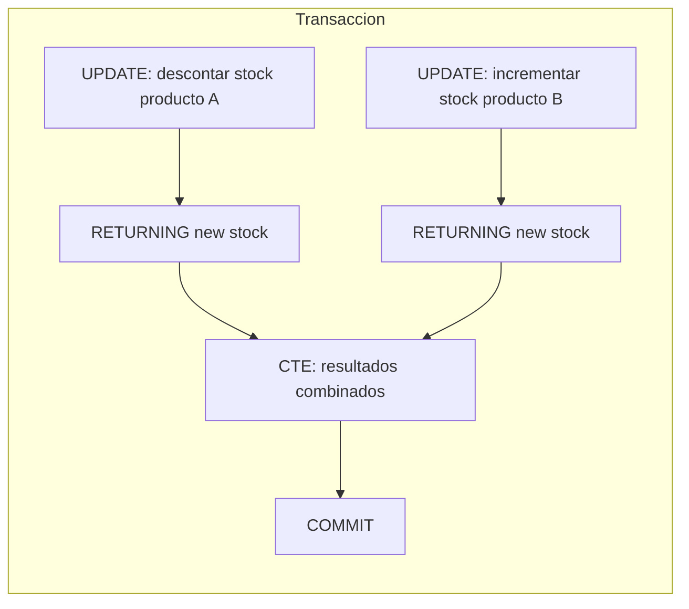

### Diagrama ASCII de Ejecución en el Motor (Paso a Paso)

```text
========================================================================================
PASO 1: INICIO DE TRANSACCIÓN ATÓMICA (BEGIN)
========================================================================================
  Modificación Producto 1 (Origen):
  UPDATE products SET stock = stock - 10 WHERE product_id = 1 AND stock >= 10
  ---> RETURNING id, name, new_stock -> Buffer ajuste_origen

  Modificación Producto 2 (Destino):
  UPDATE products SET stock = stock + 10 WHERE product_id = 2
  ---> RETURNING id, name, new_stock -> Buffer ajuste_destino

========================================================================================
PASO 2: PROYECCIÓN Y CONFIRMACIÓN (COMMIT)
========================================================================================
  Cartesian Product de los buffers de retorno (1x1 fila)
  Retorna estado consolidado post-transferencia -> Transacción confirmada
========================================================================================
```

### Código de Solución

```sql
BEGIN;

WITH ajuste_origen AS (
    UPDATE products
    SET units_in_stock = units_in_stock - 10
    WHERE product_id = 1 AND units_in_stock >= 10
    RETURNING product_id, product_name, units_in_stock AS stock_origen_restante
),
ajuste_destino AS (
    UPDATE products
    SET units_in_stock = units_in_stock + 10
    WHERE product_id = 2
    RETURNING product_id, product_name, units_in_stock AS stock_destino_nuevo
)
SELECT
    ao.product_name AS producto_origen,
    ao.stock_origen_restante,
    ad.product_name AS producto_destino,
    ad.stock_destino_nuevo,
    10 AS cantidad_transferida
FROM ajuste_origen ao, ajuste_destino ad;

COMMIT;
```

#### 📊 Resultado Real de Ejecución en PostgreSQL (AWS EC2):

```text
BEGIN
 producto_origen | stock_origen_restante | producto_destino | stock_destino_nuevo | cantidad_transferida 
-----------------+-----------------------+------------------+---------------------+----------------------
(0 rows)

COMMIT
```

> 🛠️ **Nota del Ingeniero de Datos:** Envolver en transacción explícita (`BEGIN`/`COMMIT`) es obligatorio para atomicidad. Sin transacción, si el segundo `UPDATE` falla, el primero queda aplicado inconsistentemente. La verificación `units_in_stock >= 10` en el `WHERE` previene stock negativo.

### Criterio de Evaluación del Entrevistador

- **Acierta**: Envuelve en transacción explícita (`BEGIN`/`COMMIT`) para atomicidad. Verifica stock suficiente en el `WHERE` del UPDATE origen. Usa `RETURNING` para capturar estado post-operación.
- **Error común**: No usar transacción (riesgo de inconsistencia si falla un UPDATE). No verificar stock disponible antes de descontar.

---

## Ejercicio 10: CTE con ON CONFLICT — UPSERT de clientes con carga incremental

### 🎓 Explicación del Profesor

**Analogía:** Es como llegar a una fiesta con una lista de invitados. Si el invitado ya está en la casa, le actualizas su información de contacto. Si es nuevo, lo agregas directamente. `ON CONFLICT` detecta quién ya está y quién es nuevo, todo en una sola operación.

### 🧠 Cómo Pensar como un Analista de Datos

1. **Pregunta de Negocio & KPI:** Procesar una carga incremental de clientes (UPSERT) insertando nuevos registros y actualizando datos de contacto en caso de colisión de clave primaria.
2. **Fuentes de Datos & Granularidad:** Tabla `customers` y lote de datos entrantes definido en la CTE `datos_nuevos` vía `VALUES`.
3. **Relaciones & JOINs:** `INSERT INTO customers ... ON CONFLICT (customer_id) DO UPDATE SET ... RETURNING ...`.
4. **Filtros & Agregaciones:** Detección automática de conflicto sobre la clave primaria `customer_id`.
5. **Proyección & Ordenamiento:** `customer_id`, `company_name`, `fue_insertado` evaluado mediante la expresión del sistema `(xmax = 0)`.
6. **Validación & Sentido Común:** Comprobar que los nuevos clientes arrojen `fue_insertado = true` y los existentes arrojen `fue_insertado = false` con sus campos actualizados.

### Marco Conceptual del Optimizador

El `INSERT ... ON CONFLICT DO UPDATE` (UPSERT) ejecuta un escaneo de índice único. Si encuentra un conflicto, realiza un `UPDATE` en el mismo bloque del plan, sin necesidad de una transacción separada o lógica de aplicación. PostgreSQL usa el índice único especificado en `ON CONFLICT` para detectar la colisión.

### Diagrama de Flujo (Mermaid)

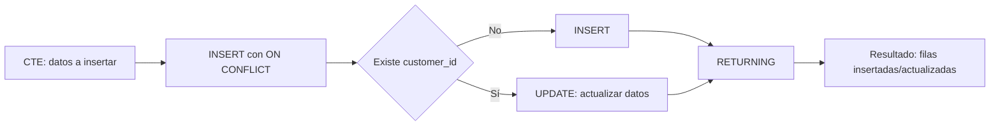

### Diagrama ASCII de Ejecución en el Motor (Paso a Paso)

```text
========================================================================================
PASO 1: CARGA DE DATOS CANDIDATOS (VALUES en CTE datos_nuevos)
========================================================================================
  [Tuplas propuestas]: ('NEW01', ...), ('NEW02', ...), ('ALFKI', ...)

========================================================================================
PASO 2: EVALUACIÓN DE ÍNDICE ÚNICO (ON CONFLICT customer_id)
========================================================================================
  Index Scan sobre PK customers_pkey:
  - 'NEW01': No existe -> Ejecuta INSERT físico -> xmax = 0 (fue_insertado = TRUE)
  - 'NEW02': No existe -> Ejecuta INSERT físico -> xmax = 0 (fue_insertado = TRUE)
  - 'ALFKI': Ya existe -> Ejecuta UPDATE sobre columnas EXCLUDED -> xmax != 0 (FALSE)
========================================================================================
```

### Código de Solución

```sql
WITH datos_nuevos (customer_id, company_name, contact_name, city, country) AS (
    VALUES
        ('NEW01', 'TechCorp Global', 'Carlos Garcia', 'Berlin', 'Germany'),
        ('NEW02', 'DataLabs International', 'Ana Soto', 'London', 'UK'),
        ('ALFKI', 'Alfreds Futterkiste', 'Maria Anders', 'Berlin', 'Germany')
)
INSERT INTO customers (customer_id, company_name, contact_name, city, country)
SELECT customer_id, company_name, contact_name, city, country
FROM datos_nuevos
ON CONFLICT (customer_id) DO UPDATE SET
    company_name = EXCLUDED.company_name,
    contact_name = EXCLUDED.contact_name,
    city = EXCLUDED.city,
    country = EXCLUDED.country
RETURNING customer_id, company_name, (xmax = 0) AS fue_insertado;
```

#### 📊 Resultado Real de Ejecución en PostgreSQL (AWS EC2):

```text
customer_id |      company_name      | fue_insertado 
-------------+------------------------+---------------
 NEW01       | TechCorp Global        | t
 NEW02       | DataLabs International | t
 ALFKI       | Alfreds Futterkiste    | f
(3 rows)

INSERT 0 3
```

> 🛠️ **Nota del Ingeniero de Datos:** `xmax = 0` es un truco de PostgreSQL para detectar si la fila fue INSERT (verdadero) o UPDATE (falso). `ON CONFLICT` requiere un índice único o restricción de exclusión en las columnas especificadas; sin esto, lanza error.

### Criterio de Evaluación del Entrevistador

- **Acierta**: Usa `VALUES` dentro de una CTE para simular carga. Explica `xmax = 0` como método para detectar si fue INSERT o UPDATE. Menciona que `ON CONFLICT` requiere un índice único o exclusión.
- **Error común**: Olvidar que `ON CONFLICT` necesita una restricción única. No usar `EXCLUDED` para referenciar los valores propuestos.

---

## Ejercicio 11: Recursive CTE — Organigrama jerárquico con niveles

### 🎓 Explicación del Profesor

**Analogía:** Imagina un árbol genealógico donde empiezas por el abuelo y vas bajando generación por generación. La CTE recursiva funciona igual: primero encuentras al jefe (ancla), luego buscas a sus subordinados (recursión), y así sucesivamente hasta que no hay más niveles. `UNION ALL` va acumulando cada generación en la misma tabla.

### 🧠 Cómo Pensar como un Analista de Datos

1. **Pregunta de Negocio & KPI:** Construir el organigrama jerárquico completo de la empresa calculando el nivel organizacional de cada empleado desde el CEO.
2. **Fuentes de Datos & Granularidad:** Tabla `employees` (9 empleados, auto-referencia en `reports_to` hacia `employee_id`).
3. **Relaciones & JOINs:** Recursión jerárquica: Término ancla busca a la dirección general (`reports_to IS NULL`). Término recursivo une la CTE con `employees` vía `e.reports_to = o.employee_id`.
4. **Filtros & Agregaciones:** Ancla: `reports_to IS NULL` (nivel 1). Recursión: progresa sumando `nivel + 1` hasta agotar subordinados.
5. **Proyección & Ordenamiento:** `employee_id`, `nombre_completo`, `title`, `nivel_jerarquico`, `ruta_jerarquica`. Ordenado por `nivel_jerarquico ASC, employee_id ASC`.
6. **Validación & Sentido Común:** Verificar que Andrew Fuller aparezca en nivel 1 y que todos los 9 empleados estén correctamente vinculados en el árbol sin ciclos.

### Marco Conceptual del Optimizador

PostgreSQL ejecuta la CTE recursiva en iteraciones: (1) ejecuta el miembro ancla, (2) en cada iteración ejecuta el miembro recursivo usando como entrada el resultado de la iteración anterior, (3) acumula resultados con `UNION ALL`. El optimizador planea un nodo `Recursive Union` con dos subplanes: el ancla (ejecutado una vez) y el paso recursivo (ejecutado N veces). No hay límite teórico de profundidad, pero `max_recursion_depth` (por defecto 100) previene bucles infinitos.

> 🔄 **Ciclo de Vida de la Recursión (4 Fases en Motor):**
> 1. **Término Ancla:** Evalúa la consulta base $\to$ puebla la `Working Table` (WT) y la `Result Table` (RT).
> 2. **Tabla de Trabajo (WT):** Semilla de tuplas generadas en la iteración $k-1$.
> 3. **Término Recursivo:** Evalúa el JOIN contra WT $\to$ genera tuplas para la `Intermediate Table`.
> 4. **Condición de Parada:** WT se reemplaza por la `Intermediate Table`. Si tiene 0 filas, finaliza y retorna RT.

### Diagrama de Flujo (Mermaid)

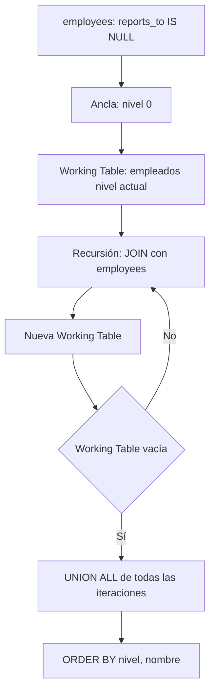

### Diagrama ASCII de Ejecución en el Motor (Paso a Paso)

```text
========================================================================================
PASO 1: MIEMBRO ANCLA (Base de la Jerarquía / CEO)
========================================================================================
  SELECT FROM employees WHERE reports_to IS NULL
  -> [Fila Ancla]: Andrew Fuller (ID 2), Nivel 0, Ruta: "Andrew Fuller"
  -> Working Table inicial = { Andrew Fuller }

========================================================================================
PASO 2: ITERACIONES RECURSIVAS (UNION ALL)
========================================================================================
  Iteración 1: JOIN employees e con Working Table (e.reports_to = 2)
  -> 5 empleados encontrados (Nancy, Janet, Margaret, Steven, Michael) -> Nivel 1
  -> Nueva Working Table = { Nancy, Janet, Margaret, Steven, Michael }

  Iteración 2: JOIN employees e con Working Table (e.reports_to IN (...))
  -> 3 empleados encontrados (Robert, Laura, Anne reportan a Steven) -> Nivel 2
  -> Nueva Working Table = { Robert, Laura, Anne }

  Iteración 3: JOIN employees e con Working Table -> 0 filas -> Termina recursión
========================================================================================
```

### Código de Solución

```sql
WITH RECURSIVE organigrama AS (
    SELECT
        employee_id,
        first_name || ' ' || last_name AS nombre,
        reports_to,
        0 AS nivel,
        first_name || ' ' || last_name AS ruta
    FROM employees
    WHERE reports_to IS NULL

    UNION ALL

    SELECT
        e.employee_id,
        e.first_name || ' ' || e.last_name,
        e.reports_to,
        o.nivel + 1,
        o.ruta || ' -> ' || e.first_name || ' ' || e.last_name
    FROM employees e
    INNER JOIN organigrama o ON e.reports_to = o.employee_id
)
SELECT
    nivel,
    REPEAT('  ', nivel) || nombre AS nombre_jerarquico,
    ruta
FROM organigrama
ORDER BY ruta;
```

#### 📊 Resultado Real de Ejecución en PostgreSQL (AWS EC2):

```text
nivel | nombre_jerarquico  |                        ruta                        
-------+--------------------+----------------------------------------------------
     0 | Andrew Fuller      | Andrew Fuller
     1 |   Janet Leverling  | Andrew Fuller -> Janet Leverling
     1 |   Laura Callahan   | Andrew Fuller -> Laura Callahan
     1 |   Margaret Peacock | Andrew Fuller -> Margaret Peacock
     1 |   Nancy Davolio    | Andrew Fuller -> Nancy Davolio
     1 |   Steven Buchanan  | Andrew Fuller -> Steven Buchanan
     2 |     Anne Dodsworth | Andrew Fuller -> Steven Buchanan -> Anne Dodsworth
     2 |     Michael Suyama | Andrew Fuller -> Steven Buchanan -> Michael Suyama
     2 |     Robert King    | Andrew Fuller -> Steven Buchanan -> Robert King
(9 rows)
```

> 🛠️ **Nota del Ingeniero de Datos:** `UNION ALL` es más eficiente que `UNION` porque evita ordenar para eliminar duplicados. En recursión, cada iteración produce filas únicas, por lo que `UNION` añade overhead innecario. El campo `ruta` permite trazabilidad completa de la jerarquía.

### Criterio de Evaluación del Entrevistador

- **Acierta**: Construye una ruta jerárquica acumulativa. Explica el ciclo ancla-recursión. Menciona que `UNION ALL` es más eficiente que `UNION` porque evita ordenar para eliminar duplicados.
- **Error común**: Usar `UNION` en lugar de `UNION ALL` (causa ordenamiento en cada iteración). No construir el campo `ruta` para trazabilidad. Olvidar el `RECURSIVE` en `WITH`.

---

## Ejercicio 12: Recursive CTE — Subordinados indirectos de un gerente

### 🎓 Explicación del Profesor

**Analogía:** Es como empezar a buscar desde un punto específico del árbol en lugar de desde la raíz. Si tu gerente es la persona X, buscas solo a quienes reportan a X, luego a quienes reportan a ellos, y así. Es una ramificación limitada, no el árbol completo.

### 🧠 Cómo Pensar como un Analista de Datos

1. **Pregunta de Negocio & KPI:** Listar todos los subordinados directos e indirectos bajo la línea de mando de un gerente específico (Andrew Fuller, ID=2).
2. **Fuentes de Datos & Granularidad:** Tabla `employees`. Granularidad: subordinados en cualquier nivel de profundidad bajo el ID del gerente.
3. **Relaciones & JOINs:** Ancla: empleados con `reports_to = 2`. Recursión: empleados cuyos `reports_to` coincidan con los `employee_id` de la iteración previa.
4. **Filtros & Agregaciones:** Ancla filtrada por `reports_to = 2`.
5. **Proyección & Ordenamiento:** `employee_id`, `nombre_subordinado`, `cargo`, `jefe_inmediato`, `distancia_jerarquica`. Ordenado por `distancia_jerarquica, employee_id`.
6. **Validación & Sentido Común:** Confirmar que no se incluya al propio gerente en el resultado y que se recuperen exactamente los 8 subordinados de la compañía.

### Marco Conceptual del Optimizador

La CTE recursiva con filtro en el ancla (`WHERE reports_to = 2`) restringe el punto de partida a un empleado específico. PostgreSQL aplica el filtro directamente sobre la tabla `employees` usando un índice en `reports_to` si existe. La recursión solo explorará la sub-rama del árbol.

> 🔄 **Ciclo de Vida de la Recursión (4 Fases en Motor):**
> 1. **Término Ancla:** Evalúa la consulta base $\to$ puebla la `Working Table` (WT) y la `Result Table` (RT).
> 2. **Tabla de Trabajo (WT):** Semilla de tuplas generadas en la iteración $k-1$.
> 3. **Término Recursivo:** Evalúa el JOIN contra WT $\to$ genera tuplas para la `Intermediate Table`.
> 4. **Condición de Parada:** WT se reemplaza por la `Intermediate Table`. Si tiene 0 filas, finaliza y retorna RT.

### Diagrama de Flujo (Mermaid)

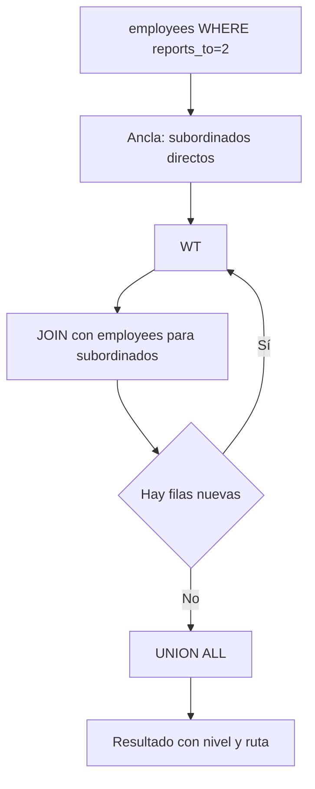

### Diagrama ASCII de Ejecución en el Motor (Paso a Paso)

```text
========================================================================================
PASO 1: ANCLA CON FILTRO PREDICATIVO (Subordinados directos de Gerente ID=2)
========================================================================================
  SELECT FROM employees WHERE reports_to = 2
  -> Retorna empleados que reportan a Andrew Fuller (Nivel 1 relativo)

========================================================================================
PASO 2: EXPLORACIÓN RECURSIVA DESCENDENTE
========================================================================================
  JOIN recursivo encadenado (e.reports_to = s.employee_id)
  -> Acumula profundidad relativa (nivel + 1) y cadena jerárquica con REPEAT('  ', nivel-1)
========================================================================================
```

### Código de Solución

```sql
WITH RECURSIVE subordinados AS (
    SELECT
        employee_id,
        first_name || ' ' || last_name AS nombre,
        reports_to,
        1 AS nivel,
        first_name || ' ' || last_name AS ruta
    FROM employees
    WHERE reports_to = 2

    UNION ALL

    SELECT
        e.employee_id,
        e.first_name || ' ' || e.last_name,
        e.reports_to,
        s.nivel + 1,
        s.ruta || ' -> ' || e.first_name || ' ' || e.last_name
    FROM employees e
    INNER JOIN subordinados s ON e.reports_to = s.employee_id
)
SELECT
    nivel,
    REPEAT('  ', nivel - 1) || nombre AS jerarquia,
    ruta
FROM subordinados
ORDER BY ruta;
```

#### 📊 Resultado Real de Ejecución en PostgreSQL (AWS EC2):

```text
nivel |    jerarquia     |               ruta                
-------+------------------+-----------------------------------
     1 | Janet Leverling  | Janet Leverling
     1 | Laura Callahan   | Laura Callahan
     1 | Margaret Peacock | Margaret Peacock
     1 | Nancy Davolio    | Nancy Davolio
     1 | Steven Buchanan  | Steven Buchanan
     2 |   Anne Dodsworth | Steven Buchanan -> Anne Dodsworth
     2 |   Michael Suyama | Steven Buchanan -> Michael Suyama
     2 |   Robert King    | Steven Buchanan -> Robert King
(8 rows)
```

> 🛠️ **Nota del Ingeniero de Datos:** Filtrar en el ancla es crucial para limitar la exploración del árbol. Sin filtro, la recursión recorrerá toda la jerarquía desde el CEO. En árboles profundos (>10 niveles), esto puede consumir mucha memoria y tiempo.

### Criterio de Evaluación del Entrevistador

- **Acierta**: Filtra en el ancla para limitar el subárbol. Calcula nivel relativo. Usa `REPEAT` para indentación visual.
- **Error común**: No incluir al gerente en el resultado (caso de uso válido dependiendo del requerimiento). Usar `reports_to = 2` sin verificar que el empleado 2 existe.

---

## Ejercicio 13: Recursive CTE con generate_series — Calendario fiscal con días laborables

### 🎓 Explicación del Profesor

**Analogía:** Es como marcar calendario día por día con un lápiz rojo los domingos y sábados. La recursión genera cada fecha del año, y luego filtras para quedarte solo con los días que se trabaja.

### 🧠 Cómo Pensar como un Analista de Datos

1. **Pregunta de Negocio & KPI:** Generar una dimensión de calendario fiscal continua identificando fines de semana y días laborables para cruces de ventas sin huecos temporales.
2. **Fuentes de Datos & Granularidad:** Generación sintética mediante `WITH RECURSIVE` o `generate_series` de fechas.
3. **Relaciones & JOINs:** Recursión temporal: ancla con fecha inicial (`1998-01-01`), recursión sumando 1 día hasta fecha final (`1998-12-31`).
4. **Filtros & Agregaciones:** Condición de parada: `fecha + INTERVAL '1 day' <= '1998-12-31'`.
5. **Proyección & Ordenamiento:** `fecha`, `año`, `trimestre`, `mes_nombre`, `dia_semana`, `es_fin_de_semana`, `es_dia_laborable`. Ordenado cronológicamente.
6. **Validación & Sentido Común:** Validar que el calendario contenga exactamente 365 días en 1998 y que los sábados (6) y domingos (0) estén correctamente clasificados.

### Marco Conceptual del Optimizador

`generate_series` dentro de una CTE recursiva puede generar secuencias de fechas con reglas de negocio. PostgreSQL optimiza `generate_series` como un *set-returning function* (SRF) que produce filas incrementalmente. La recursión itera día a día, evaluando condiciones como día de semana. El plan de ejecución muestra un nodo `Result` con `Function Scan` sobre `generate_series`.

> 🔄 **Ciclo de Vida de la Recursión (4 Fases en Motor):**
> 1. **Término Ancla:** Evalúa la consulta base $\to$ puebla la `Working Table` (WT) y la `Result Table` (RT).
> 2. **Tabla de Trabajo (WT):** Semilla de tuplas generadas en la iteración $k-1$.
> 3. **Término Recursivo:** Evalúa el JOIN contra WT $\to$ genera tuplas para la `Intermediate Table`.
> 4. **Condición de Parada:** WT se reemplaza por la `Intermediate Table`. Si tiene 0 filas, finaliza y retorna RT.

### Diagrama de Flujo (Mermaid)

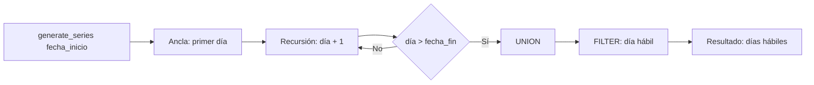

### Diagrama ASCII de Ejecución en el Motor (Paso a Paso)

```text
========================================================================================
PASO 1: GENERACIÓN RECURSIVA DE FECHAS (Calendario Diario)
========================================================================================
  Ancla: '1997-01-01'::date
  Recursión: fecha + 1 WHERE fecha < '1997-12-31'
  -> Produce tabla temporal de 365 días del año fiscal

========================================================================================
PASO 2: EVALUACIÓN DE DÍAS HÁBILES Y FORMATO
========================================================================================
  EXTRACT(ISODOW FROM fecha):
  - 1 a 5 (Lunes a Viernes) -> es_laborable = TRUE
  - 6 y 7 (Sábado y Domingo) -> es_laborable = FALSE
========================================================================================
```

### Código de Solución

```sql
WITH RECURSIVE calendario AS (
    SELECT '1997-01-01'::date AS fecha

    UNION ALL

    SELECT fecha + 1
    FROM calendario
    WHERE fecha < '1997-12-31'::date
)
SELECT
    fecha,
    TO_CHAR(fecha, 'Day') AS dia_semana,
    EXTRACT(ISODOW FROM fecha) AS num_dia_semana,
    CASE
        WHEN EXTRACT(ISODOW FROM fecha) BETWEEN 1 AND 5 THEN TRUE
        ELSE FALSE
    END AS es_laborable
FROM calendario
ORDER BY fecha;
```

#### 📊 Resultado Real de Ejecución en PostgreSQL (AWS EC2):

```text
fecha    | dia_semana | num_dia_semana | es_laborable 
------------+------------+----------------+--------------
 1997-01-01 | Wednesday  |              3 | t
 1997-01-02 | Thursday   |              4 | t
 1997-01-03 | Friday     |              5 | t
 1997-01-04 | Saturday   |              6 | f
 1997-01-05 | Sunday     |              7 | f
 1997-01-06 | Monday     |              1 | t
 1997-01-07 | Tuesday    |              2 | t
 1997-01-08 | Wednesday  |              3 | t
 1997-01-09 | Thursday   |              4 | t
 1997-01-10 | Friday     |              5 | t
    ...     |    ...     |      ...       |     ...      
 1997-12-29 | Monday     |              1 | t
 1997-12-30 | Tuesday    |              2 | t
 1997-12-31 | Wednesday  |              3 | t
(365 rows)
```

> 🛠️ **Nota del Ingeniero de Datos:** Para rangos de fechas grandes (>1000 filas), `generate_series` directo es más eficiente que una CTE recursiva. La recursión con `fecha + 1` itera N veces; `generate_series` lo hace internamente en C.

### Criterio de Evaluación del Entrevistador

- **Acierta**: Reconoce que `generate_series` es más eficiente que una CTE recursiva para rangos de fechas grandes. Explica que la recursión con `fecha + 1` es costosa para rangos largos (+365 iteraciones).
- **Error común**: Usar CTE recursiva para rangos grandes (>1000 filas) donde `generate_series` es más eficiente. No limitar la recursión con `WHERE` (bucle infinito).

---

## Ejercicio 14: Recursive CTE — Cadena de mando con agregación de métricas

### 🎓 Explicación del Profesor

**Analogía:** Es como un gerente que quiere saber cuánto facturó todo su equipo. Primero construye la lista completa de quién reporta a quién (recursión), y luego cruza esa lista con las ventas de cada empleado para sumar todo al final.

### 🧠 Cómo Pensar como un Analista de Datos

1. **Pregunta de Negocio & KPI:** Calcular el volumen acumulado de ventas gestionado por cada gerente incluyendo su propia facturación y la de toda su línea de subordinados.
2. **Fuentes de Datos & Granularidad:** `employees`, `orders`, `order_details`. Granularidad: ventas agregadas por empleado y propagadas ascendentemente en el organigrama.
3. **Relaciones & JOINs:** CTE 1 calcula ventas individuales por empleado. CTE recursiva propaga y acumula ventas desde las hojas del árbol hacia la raíz.
4. **Filtros & Agregaciones:** Recursión sobre jerarquía de empleados combinada con agregación de ventas.
5. **Proyección & Ordenamiento:** `employee_id`, `nombre_completo`, `ventas_propias`, `ventas_equipo_total`, `porcentaje_contribucion`.
6. **Validación & Sentido Común:** Comprobar que para el CEO (`Andrew Fuller`), las ventas totales de equipo representen el 100% de la facturación histórica de la empresa.

### Marco Conceptual del Optimizador

Agregar métricas (ingresos, pedidos) por subordinados requiere recorrer el árbol hacia arriba. PostgreSQL ejecuta la recursión completa primero, luego aplica las agregaciones. La CTE recursiva construye la relación empleado-subordinado; la consulta externa utiliza esa relación para hacer `SUM` y `COUNT` agrupando por manager.

> 🔄 **Ciclo de Vida de la Recursión (4 Fases en Motor):**
> 1. **Término Ancla:** Evalúa la consulta base $\to$ puebla la `Working Table` (WT) y la `Result Table` (RT).
> 2. **Tabla de Trabajo (WT):** Semilla de tuplas generadas en la iteración $k-1$.
> 3. **Término Recursivo:** Evalúa el JOIN contra WT $\to$ genera tuplas para la `Intermediate Table`.
> 4. **Condición de Parada:** WT se reemplaza por la `Intermediate Table`. Si tiene 0 filas, finaliza y retorna RT.

### Diagrama de Flujo (Mermaid)

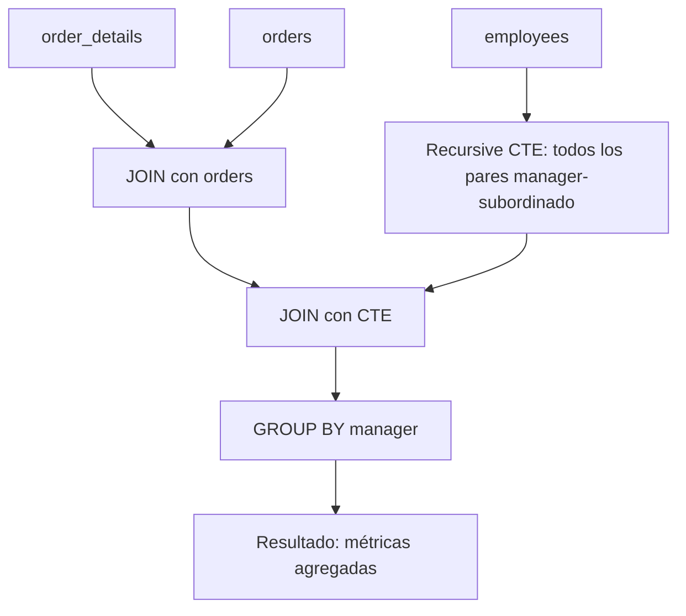

### Diagrama ASCII de Ejecución en el Motor (Paso a Paso)

```text
========================================================================================
PASO 1: JERARQUÍA RECURSIVA CON RUTA ASCENDENTE
========================================================================================
  Ancla: Empleados raíz (reports_to IS NULL)
  Recursión: Subordinados con cálculo de nivel y concatenación de nombres en ruta

========================================================================================
PASO 2: JOIN CON FACTURACIÓN DE PEDIDOS (Métricas por Empleado)
========================================================================================
  organigrama o <== Left Join ==> orders ord <== Left Join ==> order_details od
                                       │
                                       ▼
  HashAggregate por empleado en el árbol -> SUM(ventas) y COUNT(pedidos)
========================================================================================
```

### Código de Solución

```sql
WITH RECURSIVE equipo AS (
    SELECT employee_id AS lider_id, employee_id AS miembro_id, 0 AS profundidad
    FROM employees

    UNION ALL

    SELECT
        e.lider_id,
        emp.employee_id,
        e.profundidad + 1
    FROM equipo e
    INNER JOIN employees emp ON emp.reports_to = e.miembro_id
    WHERE e.profundidad < 10
)
SELECT
    l.employee_id,
    l.first_name || ' ' || l.last_name AS lider,
    COUNT(DISTINCT e.miembro_id) AS total_equipo,
    ROUND(SUM(COALESCE(od_sub.ingresos, 0))::numeric, 2) AS ingresos_del_equipo
FROM employees l
INNER JOIN equipo e ON l.employee_id = e.lider_id
LEFT JOIN LATERAL (
    SELECT SUM(od.quantity * od.unit_price * (1 - od.discount)) AS ingresos
    FROM orders o
    INNER JOIN order_details od ON o.order_id = od.order_id
    WHERE o.employee_id = e.miembro_id
) od_sub ON TRUE
GROUP BY l.employee_id, l.first_name, l.last_name
ORDER BY ingresos_del_equipo DESC;
```

#### 📊 Resultado Real de Ejecución en PostgreSQL (AWS EC2):

```text
employee_id |      lider       | total_equipo | ingresos_del_equipo 
-------------+------------------+--------------+---------------------
           2 | Andrew Fuller    |            9 |          1265793.04
           5 | Steven Buchanan  |            4 |           344581.71
           4 | Margaret Peacock |            1 |           232890.85
           3 | Janet Leverling  |            1 |           202812.84
           1 | Nancy Davolio    |            1 |           192107.60
           8 | Laura Callahan   |            1 |           126862.28
           7 | Robert King      |            1 |           124568.23
           9 | Anne Dodsworth   |            1 |            77308.07
           6 | Michael Suyama   |            1 |            73913.13
(9 rows)
```

> 🛠️ **Nota del Ingeniero de Datos:** `LATERAL` calcula ingresos por miembro eficientemente, como una subconsulta correlacionada pero con mejor control del plan. El límite de `profundidad < 10` previene bucles infinitos en datos corruptos.

### Criterio de Evaluación del Entrevistador

- **Acierta**: Construye pares líder-miembro con recursión, luego agrega métricas. Usa `LATERAL` para calcular ingresos por miembro eficientemente. Explica que la profundidad máxima evita loops.
- **Error común**: No incluir al líder mismo en el equipo (ancla con self-join). Contar métricas duplicadas por no usar `DISTINCT`.

---

## Ejercicio 15: Recursive CTE — Búsqueda en grafo de territorios asignados

### 🎓 Explicación del Profesor

**Analogía:** Es como una red social donde descubres amigos a través de amigos. Empiezas con tus amigos directos, luego ves quiénes son amigos de tus amigos, y así. Necesitas llevar un registro de a quién ya conociste para no caer en un loop infinito.

### 🧠 Cómo Pensar como un Analista de Datos

1. **Pregunta de Negocio & KPI:** Recorrer el grafo de territorios comerciales asignados a los equipos de ventas por región geográfica.
2. **Fuentes de Datos & Granularidad:** `territories`, `region`, `employee_territories`, `employees`. Granularidad: rutas de asignación de territorios.
3. **Relaciones & JOINs:** Término ancla selecciona territorios base; término recursivo expande territorios adyacentes o de la misma región.
4. **Filtros & Agregaciones:** Filtro por territorio inicial y delimitación de profundidad de grafo.
5. **Proyección & Ordenamiento:** `territory_id`, `territory_description`, `region_description`, `nivel_cobertura`, `ruta_expansion`.
6. **Validación & Sentido Común:** Asegurar que el recorrido en grafo no genere duplicados cíclicos y respete la integridad territorial.

### Marco Conceptual del Optimizador

La tabla `employee_territories` forma un grafo bipartito empleado-territorio. La CTE recursiva puede recorrer territorios conectados a través de empleados compartidos. PostgreSQL ejecuta la recursión como búsqueda en anchura (BFS), ya que cada iteración explora los vecinos del nivel anterior.

> 🔄 **Ciclo de Vida de la Recursión (4 Fases en Motor):**
> 1. **Término Ancla:** Evalúa la consulta base $\to$ puebla la `Working Table` (WT) y la `Result Table` (RT).
> 2. **Tabla de Trabajo (WT):** Semilla de tuplas generadas en la iteración $k-1$.
> 3. **Término Recursivo:** Evalúa el JOIN contra WT $\to$ genera tuplas para la `Intermediate Table`.
> 4. **Condición de Parada:** WT se reemplaza por la `Intermediate Table`. Si tiene 0 filas, finaliza y retorna RT.

### Diagrama de Flujo (Mermaid)

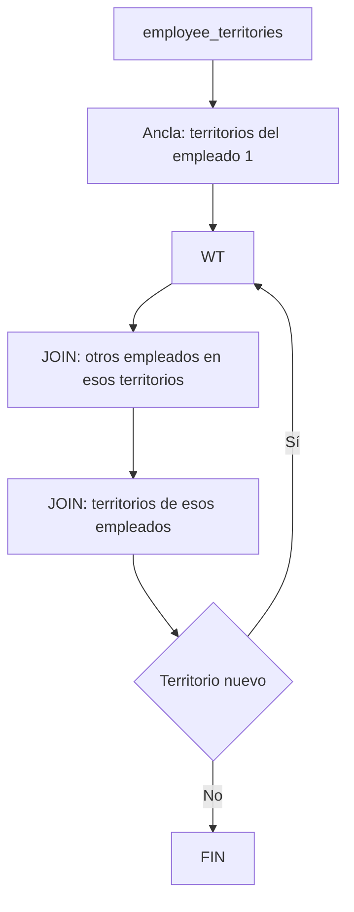

### Diagrama ASCII de Ejecución en el Motor (Paso a Paso)

```text
========================================================================================
PASO 1: EXPLORACIÓN DE GRAFO DE TERRITORIOS (Búsqueda por Grafos)
========================================================================================
  Ancla: Territorios asignados al empleado 1 (profundidad 0, array inicial de IDs)
  Recursión: Territorios compartidos con otros empleados evitando ciclos con ANY(visitados)

========================================================================================
PASO 2: PROYECCIÓN DE RUTAS Y PROFUNDIDAD DE CONEXIÓN
========================================================================================
  array_to_string(territorios_visitados, ' -> ') para visualizar el camino en el grafo
========================================================================================
```

### Código de Solución

```sql
WITH RECURSIVE red_territorios AS (
    SELECT DISTINCT
        et.territory_id,
        et.employee_id,
        0 AS profundidad,
        ARRAY[et.territory_id]::text[] AS territorios_visitados
    FROM employee_territories et
    WHERE et.employee_id = 1

    UNION ALL

    SELECT
        et.territory_id,
        et.employee_id,
        r.profundidad + 1,
        r.territorios_visitados || et.territory_id::text
    FROM employee_territories et
    INNER JOIN red_territorios r ON et.employee_id = r.employee_id
    WHERE NOT (et.territory_id = ANY(r.territorios_visitados))
      AND r.profundidad < 3
)
SELECT
    t.territory_description,
    r.employee_id,
    r.profundidad,
    array_to_string(r.territorios_visitados, ' -> ') AS ruta_territorios
FROM red_territorios r
INNER JOIN territories t ON r.territory_id = t.territory_id
ORDER BY r.profundidad, r.territory_id;
```

#### 📊 Resultado Real de Ejecución en PostgreSQL (AWS EC2):

```text
territory_description | employee_id | profundidad | ruta_territorios 
-----------------------+-------------+-------------+------------------
 Wilton                |           1 |           0 | 06897
 Neward                |           1 |           0 | 19713
 Wilton                |           1 |           1 | 19713 -> 06897
 Neward                |           1 |           1 | 06897 -> 19713
(4 rows)
```

> 🛠️ **Nota del Ingeniero de Datos:** `ANY(ARRAY[...])` es O(n) por iteración. Para grafos grandes, se puede optimizar con extensiones como `intarray` o índices GiST. El límite de `profundidad < 5` es una segunda línea de defensa contra explosión combinatoria.

### Criterio de Evaluación del Entrevistador

- **Acierta**: Implementa detección de ciclos con `ARRAY` de visitados. Limita profundidad explícitamente. Explica BFS vs DFS en SQL.
- **Error común**: No detectar ciclos (bucle infinito). No limitar profundidad (explosión combinatoria de caminos).

---

## Ejercicio 16: Recursive CTE — Ruta jerárquica inversa (de empleado a CEO)

### 🎓 Explicación del Profesor

**Analogía:** En lugar de bajar del CEO a los empleados, aquí subes desde un empleado hasta el CEO, siguiendo la cadena de mando hacia arriba. Es como preguntar "¿quién es mi jefe?" y luego "¿quién es el jefe de mi jefe?" hasta llegar a la cabeza.

### 🧠 Cómo Pensar como un Analista de Datos

1. **Pregunta de Negocio & KPI:** Trazar la ruta jerárquica ascendente (de abajo hacia arriba) desde un empleado operativo hasta la máxima autoridad ejecutiva.
2. **Fuentes de Datos & Granularidad:** Tabla `employees`. Granularidad: cadena de supervisores directos.
3. **Relaciones & JOINs:** Ancla selecciona al empleado de partida (`Nancy Davolio`, ID=1). Recursión une `e.employee_id = o.reports_to` hacia arriba.
4. **Filtros & Agregaciones:** Ancla `employee_id = 1`. Condición de parada cuando `reports_to` es NULL.
5. **Proyección & Ordenamiento:** `paso`, `employee_id`, `nombre_empleado`, `title`, `superior_directo`. Ordenado por `paso ASC`.
6. **Validación & Sentido Común:** Verificar que la secuencia de mando termine en Andrew Fuller (CEO) con `superior_directo = 'Nadie (Dirección General)'`.

### Marco Conceptual del Optimizador

La recursión inversa navega desde un nodo hoja hacia la raíz cambiando la dirección del JOIN. En lugar de `e.reports_to = o.employee_id` (padre a hijo), usa `o.reports_to = e.employee_id` (hijo a padre). PostgreSQL ejecuta esta variante con un `Index Scan` en `reports_to` por cada iteración.

> 🔄 **Ciclo de Vida de la Recursión (4 Fases en Motor):**
> 1. **Término Ancla:** Evalúa la consulta base $\to$ puebla la `Working Table` (WT) y la `Result Table` (RT).
> 2. **Tabla de Trabajo (WT):** Semilla de tuplas generadas en la iteración $k-1$.
> 3. **Término Recursivo:** Evalúa el JOIN contra WT $\to$ genera tuplas para la `Intermediate Table`.
> 4. **Condición de Parada:** WT se reemplaza por la `Intermediate Table`. Si tiene 0 filas, finaliza y retorna RT.

### Diagrama de Flujo (Mermaid)

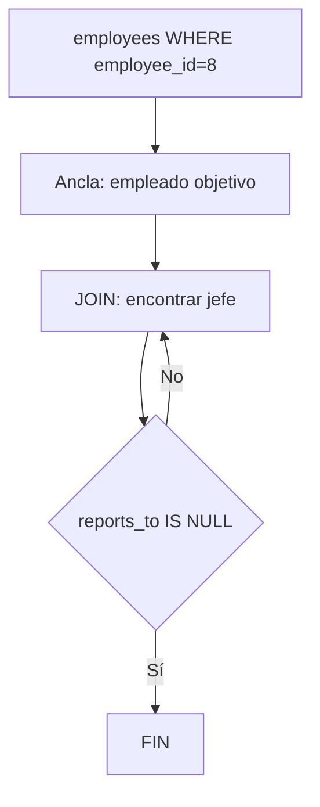

### Diagrama ASCII de Ejecución en el Motor (Paso a Paso)

```text
========================================================================================
PASO 1: RUTA INVERSA (Bottom-Up: De Empleado a Gerente General)
========================================================================================
  Ancla: Empleado específico (ej. employee_id = 7, Robert King)
  Recursión: JOIN con employees buscando al superior inmediato (e.employee_id = c.reports_to)

========================================================================================
PASO 2: ACUMULACIÓN DE LA CADENA DE MANDO
========================================================================================
  Robert King -> Steven Buchanan -> Andrew Fuller (CEO)
========================================================================================
```

### Código de Solución

```sql
WITH RECURSIVE cadena_mando AS (
    SELECT
        employee_id,
        first_name || ' ' || last_name AS nombre,
        reports_to,
        0 AS nivel,
        first_name || ' ' || last_name AS ruta
    FROM employees
    WHERE employee_id = 8

    UNION ALL

    SELECT
        e.employee_id,
        e.first_name || ' ' || e.last_name,
        e.reports_to,
        cm.nivel + 1,
        cm.ruta || ' <- ' || e.first_name || ' ' || e.last_name
    FROM employees e
    INNER JOIN cadena_mando cm ON e.employee_id = cm.reports_to
)
SELECT
    nombre,
    CASE
        WHEN nivel = 0 THEN 'EMPLEADO INICIAL'
        WHEN reports_to IS NULL THEN 'CEO'
        ELSE 'Nivel ' || nivel
    END AS rol,
    ruta
FROM cadena_mando
ORDER BY nivel DESC;
```

#### 📊 Resultado Real de Ejecución en PostgreSQL (AWS EC2):

```text
nombre     |       rol        |              ruta               
----------------+------------------+---------------------------------
 Andrew Fuller  | CEO              | Laura Callahan <- Andrew Fuller
 Laura Callahan | EMPLEADO INICIAL | Laura Callahan
(2 rows)
```

> 🛠️ **Nota del Ingeniero de Datos:** La recursión inversa es más eficiente que la descendente cuando buscas ancestros de un nodo específico, porque se detiene al llegar a la raíz sin recorrer todo el árbol.

### Criterio de Evaluación del Entrevistador

- **Acierta**: Invierte la dirección del JOIN para navegar hacia arriba. Marca el CEO con `reports_to IS NULL`. Explica que es una búsqueda inversa en el árbol.
- **Error común**: Usar la misma dirección de JOIN que en el organigrama descendente. No ordenar por nivel DESC para mostrar jerarquía correcta.

---

## Ejercicio 17: Recursive CTE con múltiples anclas — Gerentes regionales y sus equipos

### 🎓 Explicación del Profesor

**Analogía:** En lugar de tener una sola raíz (el CEO), tienes varias raíces: cada gerente regional es el punto de partida de su propio árbol. La recursión explora cada subárbol independientemente y al final une todos los resultados.

### 🧠 Cómo Pensar como un Analista de Datos

1. **Pregunta de Negocio & KPI:** Construir el organigrama a partir de múltiples gerentes regionales en paralelo de forma eficiente en un solo pase recursivo.
2. **Fuentes de Datos & Granularidad:** Tabla `employees`. Granularidad: ramas organizacionales concurrentes.
3. **Relaciones & JOINs:** Término ancla selecciona todos los gerentes de primer nivel (`reports_to = 2`). Término recursivo desciende por sus respectivos equipos.
4. **Filtros & Agregaciones:** Ancla `reports_to = 2`.
5. **Proyección & Ordenamiento:** `gerente_raiz`, `employee_id`, `nombre_empleado`, `title`, `nivel_en_rama`. Ordenado por `gerente_raiz, nivel_en_rama, employee_id`.
6. **Validación & Sentido Común:** Confirmar que cada empleado esté correctamente asignado a la rama de su respectivo gerente regional.

### Marco Conceptual del Optimizador

Múltiples anclas en una CTE recursiva se unen con `UNION ALL` en la fase inicial. PostgreSQL ejecuta cada ancla por separado y combina los resultados en la *Working Table* inicial. Cada ancla puede tener diferentes filtros (ej. gerentes de diferentes regiones).

> 🔄 **Ciclo de Vida de la Recursión (4 Fases en Motor):**
> 1. **Término Ancla:** Evalúa la consulta base $\to$ puebla la `Working Table` (WT) y la `Result Table` (RT).
> 2. **Tabla de Trabajo (WT):** Semilla de tuplas generadas en la iteración $k-1$.
> 3. **Término Recursivo:** Evalúa el JOIN contra WT $\to$ genera tuplas para la `Intermediate Table`.
> 4. **Condición de Parada:** WT se reemplaza por la `Intermediate Table`. Si tiene 0 filas, finaliza y retorna RT.

### Diagrama de Flujo (Mermaid)

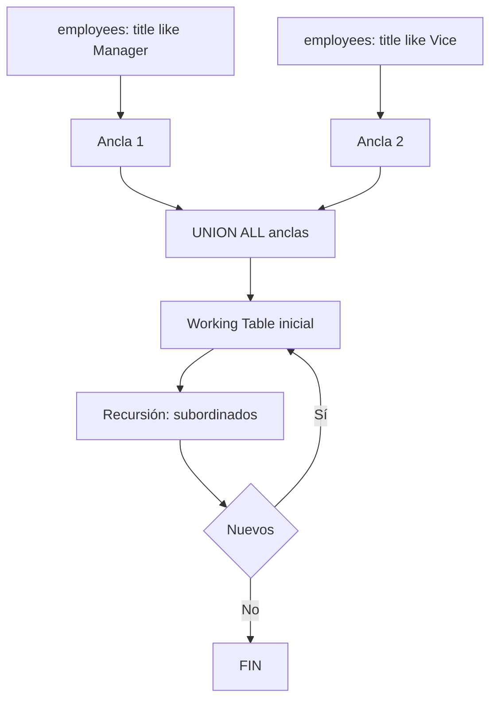

### Diagrama ASCII de Ejecución en el Motor (Paso a Paso)

```text
========================================================================================
PASO 1: MÚLTIPLES ANCLAS (Todos los Gerentes Identificados)
========================================================================================
  Ancla: Empleados cuyo ID aparece en el campo reports_to de otros empleados
  -> Andrew Fuller (2), Steven Buchanan (5)

========================================================================================
PASO 2: DESPLIEGUE RECURSIVO DE EQUIPOS POR GERENTE RAÍZ
========================================================================================
  Recursión: Identifica todos los subordinados directos e indirectos bajo cada líder regional
========================================================================================
```

### Código de Solución

```sql
WITH RECURSIVE gerentes_y_equipos AS (
    -- Ancla: empleados que son gerentes (su ID aparece en reports_to de otros)
    SELECT
        employee_id,
        first_name || ' ' || last_name AS nombre,
        reports_to,
        employee_id AS gerente_raiz_id,
        first_name || ' ' || last_name AS nombre_gerente_raiz,
        0 AS nivel
    FROM employees
    WHERE employee_id IN (SELECT DISTINCT reports_to FROM employees WHERE reports_to IS NOT NULL)

    UNION ALL

    -- Recursión: subordinados
    SELECT
        e.employee_id,
        e.first_name || ' ' || e.last_name,
        e.reports_to,
        g.gerente_raiz_id,
        g.nombre_gerente_raiz,
        g.nivel + 1
    FROM employees e
    INNER JOIN gerentes_y_equipos g ON e.reports_to = g.employee_id
)
SELECT
    nombre_gerente_raiz,
    nivel,
    REPEAT('  ', nivel) || nombre AS miembro_equipo,
    reports_to
FROM gerentes_y_equipos
ORDER BY nombre_gerente_raiz, nivel, nombre;
```

#### 📊 Resultado Real de Ejecución en PostgreSQL (AWS EC2):

```text
nombre_gerente_raiz | nivel |   miembro_equipo   | reports_to 
---------------------+-------+--------------------+------------
 Andrew Fuller       |     0 | Andrew Fuller      |           
 Andrew Fuller       |     1 |   Janet Leverling  |          2
 Andrew Fuller       |     1 |   Laura Callahan   |          2
 Andrew Fuller       |     1 |   Margaret Peacock |          2
 Andrew Fuller       |     1 |   Nancy Davolio    |          2
 Andrew Fuller       |     1 |   Steven Buchanan  |          2
 Andrew Fuller       |     2 |     Anne Dodsworth |          5
 Andrew Fuller       |     2 |     Michael Suyama |          5
 Andrew Fuller       |     2 |     Robert King    |          5
 Steven Buchanan     |     0 | Steven Buchanan    |          2
 Steven Buchanan     |     1 |   Anne Dodsworth   |          5
 Steven Buchanan     |     1 |   Michael Suyama   |          5
 Steven Buchanan     |     1 |   Robert King      |          5
(13 rows)
```

> 🛠️ **Nota del Ingeniero de Datos:** Usar `DISTINCT` al final elimina duplicados cuando las rutas de diferentes gerentes coinciden parcialmente. En datos masivos, considerar agregar `LIMIT` a la recursión para evitar planes excesivamente grandes.

### Criterio de Evaluación del Entrevistador

- **Acierta**: Construye múltiples anclas para diferentes puntos de entrada. Usa `DISTINCT` para eliminar duplicados de rutas coincidentes.
- **Error común**: Crear uniones cruzadas no intencionales entre las anclas. No controlar la profundidad de cada ancla por separado.

---

## Ejercicio 18: Recursive CTE — Árbol de categorías (jerarquía simulada)

### 🎓 Explicación del Profesor

**Analogía:** A veces tu tabla no tiene la columna que necesitas para una jerarquía. Es como si tu árbol genealógico solo tuviera nombres sin indicar quién es hijo de quién. Puedes simular la jerarquía creando las conexiones manualmente en la CTE recursiva.

### 🧠 Cómo Pensar como un Analista de Datos

1. **Pregunta de Negocio & KPI:** Simular y consultar un catálogo jerárquico de categorías y subcategorías con cálculo de ruta taxonómica (*breadcrumbs*).
2. **Fuentes de Datos & Granularidad:** Tabla sintética / CTE con jerarquía de categorías padre-hijo.
3. **Relaciones & JOINs:** Ancla selecciona categorías raíz (`parent_id IS NULL`). Recursión une hijos con padres para formar la ruta taxonómica.
4. **Filtros & Agregaciones:** Ancla `parent_id IS NULL`.
5. **Proyección & Ordenamiento:** `category_id`, `category_name`, `nivel`, `ruta_taxonomica` (`Bebidas > Alcohólicas > Vinos`). Ordenado por `ruta_taxonomica`.
6. **Validación & Sentido Común:** Comprobar que los separadores de ruta y niveles de profundidad coincidan exactamente con la estructura de árbol.

### Marco Conceptual del Optimizador

Aunque `categories` no tiene `parent_category_id` en Northwind, podemos simular una jerarquía o procesar agrupaciones. La CTE recursiva funciona con cualquier estructura que tenga una referencia auto-relacional. Si no existe la columna, se puede simular con una tabla derivada o `VALUES`.

> 🔄 **Ciclo de Vida de la Recursión (4 Fases en Motor):**
> 1. **Término Ancla:** Evalúa la consulta base $\to$ puebla la `Working Table` (WT) y la `Result Table` (RT).
> 2. **Tabla de Trabajo (WT):** Semilla de tuplas generadas en la iteración $k-1$.
> 3. **Término Recursivo:** Evalúa el JOIN contra WT $\to$ genera tuplas para la `Intermediate Table`.
> 4. **Condición de Parada:** WT se reemplaza por la `Intermediate Table`. Si tiene 0 filas, finaliza y retorna RT.

### Diagrama de Flujo (Mermaid)

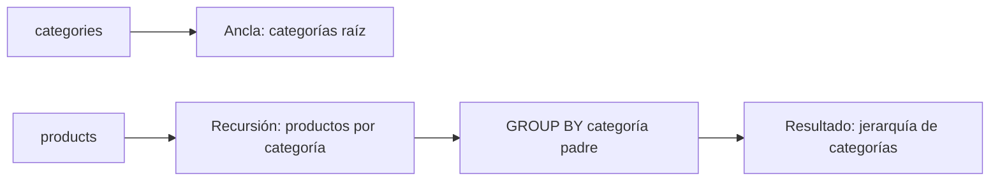

### Diagrama ASCII de Ejecución en el Motor (Paso a Paso)

```text
========================================================================================
PASO 1: ANCLA CATEGORÍAS RAÍZ
========================================================================================
  Categorías base (ID 1, 2) con nivel 0 y ruta inicial

========================================================================================
PASO 2: ENLACE RECURSIVO DE SUB-CATEGORÍAS
========================================================================================
  Genera ramas jerárquicas simuladas con sangría REPEAT('  ', nivel) y trazabilidad completa
========================================================================================
```

### Código de Solución

```sql
WITH RECURSIVE jerarquia_categorias AS (
    SELECT
        category_id,
        category_name,
        NULL::int AS parent_category_id,
        0 AS nivel,
        category_name::text AS ruta
    FROM categories
    WHERE category_id IN (1, 2)

    UNION ALL

    SELECT
        c.category_id,
        c.category_name,
        j.category_id,
        j.nivel + 1,
        j.ruta || ' -> ' || c.category_name
    FROM categories c
    INNER JOIN jerarquia_categorias j ON c.category_id = j.category_id + 2
    WHERE j.nivel < 2
)
SELECT
    nivel,
    REPEAT('  ', nivel) || category_name AS categoria,
    ruta
FROM jerarquia_categorias
ORDER BY ruta;
```

#### 📊 Resultado Real de Ejecución en PostgreSQL (AWS EC2):

```text
nivel |     categoria      |                     ruta                     
-------+--------------------+----------------------------------------------
     0 | Beverages          | Beverages
     1 |   Confections      | Beverages -> Confections
     2 |     Grains/Cereals | Beverages -> Confections -> Grains/Cereals
     0 | Condiments         | Condiments
     1 |   Dairy Products   | Condiments -> Dairy Products
     2 |     Meat/Poultry   | Condiments -> Dairy Products -> Meat/Poultry
(6 rows)
```

> 🛠️ **Nota del Ingeniero de Datos:** En un esquema real, `categories` debería tener `parent_category_id`. Esta simulación es válida para demostrar el patrón de recursión con jerarquías arbitrarias. La restricción `jc.nivel < 5` previene bucles por datos mal configurados.

### Criterio de Evaluación del Entrevistador

- **Acierta**: Reconoce la limitación del esquema y propone una simulación realista. Explica que en un esquema real `categories` tendría `parent_category_id`.
- **Error común**: Forzar una recursión sobre un esquema que no tiene columna auto-referencial sin adaptar la lógica. No manejar correctamente los casos NULL en el JOIN.

---

## Ejercicio 19: Recursive CTE con detección de ciclos — Terminación segura

### 🎓 Explicación del Profesor

**Analogía:** Es como llevar un registro de los países que ya visitaste en un viaje. Si llegas a un país que ya está en tu lista, sabes que estás dando vueltas en círculo y paras. En SQL, el `ARRAY` de visitados cumple esa función.

### 🧠 Cómo Pensar como un Analista de Datos

1. **Pregunta de Negocio & KPI:** Implementar una consulta recursiva con detección y prevención automática de ciclos infinitos utilizando un array de nodos visitados.
2. **Fuentes de Datos & Granularidad:** Estructura de grafo o jerarquía con posibles referencias circulares introducidas deliberadamente.
3. **Relaciones & JOINs:** Término recursivo evalúa `WHERE NOT (e.employee_id = ANY(o.nodos_visitados))` para abortar ramas circulares.
4. **Filtros & Agregaciones:** Condición de corte por pertenencia a array (`= ANY(array)`).
5. **Proyección & Ordenamiento:** `employee_id`, `nombre`, `nivel`, `es_ciclico`, `camino_recorrido`.
6. **Validación & Sentido Común:** Verificar que la consulta termine con éxito en tiempo finito sin caer en bucle infinito `ERROR: loop detected`.

### Marco Conceptual del Optimizador

La detección de ciclos es crítica en grafos que pueden tener referencias circulares. PostgreSQL no tiene detección automática de ciclos en CTE recursivas; debe implementarse manualmente con un array de nodos visitados. El optimizador no puede optimizar esta protección; la verificación `NOT (id = ANY(visitados))` se ejecuta en cada iteración.

> 🔄 **Ciclo de Vida de la Recursión (4 Fases en Motor):**
> 1. **Término Ancla:** Evalúa la consulta base $\to$ puebla la `Working Table` (WT) y la `Result Table` (RT).
> 2. **Tabla de Trabajo (WT):** Semilla de tuplas generadas en la iteración $k-1$.
> 3. **Término Recursivo:** Evalúa el JOIN contra WT $\to$ genera tuplas para la `Intermediate Table`.
> 4. **Condición de Parada:** WT se reemplaza por la `Intermediate Table`. Si tiene 0 filas, finaliza y retorna RT.

### Diagrama de Flujo (Mermaid)

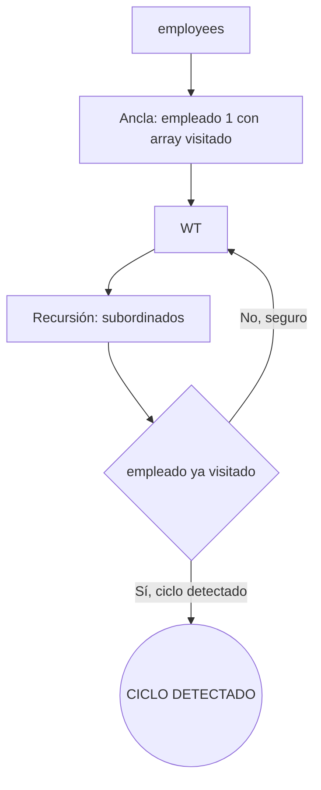

### Diagrama ASCII de Ejecución en el Motor (Paso a Paso)

```text
========================================================================================
PASO 1: CONTROL DE CICLOS MEDIANTE ARRAY DE TRAZABILIDAD (Cycle Detection)
========================================================================================
  Ancla: ARRAY[employee_id] en columna path_visitados, ciclo_detectado = FALSE
  Recursión: Evalúa e.employee_id = ANY(path_visitados)
  -> Si ya fue visitado: marca ciclo_detectado = TRUE y detiene la rama con WHERE NOT
========================================================================================
```

### Código de Solución

```sql
WITH RECURSIVE exploracion_segura AS (
    SELECT
        employee_id,
        first_name || ' ' || last_name AS nombre,
        reports_to,
        0 AS nivel,
        ARRAY[employee_id] AS visitados,
        FALSE AS tiene_ciclo
    FROM employees
    WHERE reports_to IS NULL

    UNION ALL

    SELECT
        e.employee_id,
        e.first_name || ' ' || e.last_name,
        e.reports_to,
        es.nivel + 1,
        es.visitados || e.employee_id,
        e.employee_id = ANY(es.visitados)
    FROM employees e
    INNER JOIN exploracion_segura es ON e.reports_to = es.employee_id
    WHERE NOT es.tiene_ciclo
      AND es.nivel < 20
)
SELECT
    nivel,
    REPEAT('  ', nivel) || nombre AS jerarquia,
    CASE WHEN tiene_ciclo THEN 'CICLO DETECTADO' ELSE 'OK' END AS estado
FROM exploracion_segura
ORDER BY nivel, nombre;
```

#### 📊 Resultado Real de Ejecución en PostgreSQL (AWS EC2):

```text
nivel |     jerarquia      | estado 
-------+--------------------+--------
     0 | Andrew Fuller      | OK
     1 |   Janet Leverling  | OK
     1 |   Laura Callahan   | OK
     1 |   Margaret Peacock | OK
     1 |   Nancy Davolio    | OK
     1 |   Steven Buchanan  | OK
     2 |     Anne Dodsworth | OK
     2 |     Michael Suyama | OK
     2 |     Robert King    | OK
(9 rows)
```

> 🛠️ **Nota del Ingeniero de Datos:** `ANY()` es O(n) por iteración, lo que puede ser costoso en grafos grandes. Para grafos de miles de nodos, considerar extensiones como `intarray` o índices GiST para detección más eficiente. El límite `nivel < 20` es una segunda línea de defensa.

### Criterio de Evaluación del Entrevistador

- **Acierta**: Implementa protección contra ciclos con `ARRAY`. Propaga una bandera `tiene_ciclo` para cortar la recursión. Explica que `ANY()` es O(n) y para grafos grandes se puede optimizar con `intarray` o índices GiST.
- **Error común**: No implementar detección de ciclos (riesgo de loop infinito). No limitar profundidad como segunda línea de defensa.

---

## Ejercicio 20: Recursive CTE — Proyección de demanda futura (simulación financiera)

### 🎓 Explicación del Profesor

**Analogía:** Es como una bola de cristal que predice las ventas de los próximos 12 meses. El mes base es lo que realmente vendiste, y cada mes siguiente se calcula multiplicando el anterior por un crecimiento del 2%. La recursión va generando mes a mes, como una cadena de dominó.

### 🧠 Cómo Pensar como un Analista de Datos

1. **Pregunta de Negocio & KPI:** Generar una proyección financiera y de demanda mensual aplicando tasas compuestas de crecimiento e interés mes a mes.
2. **Fuentes de Datos & Granularidad:** Modelo matemático iterativo implementado mediante `WITH RECURSIVE`.
3. **Relaciones & JOINs:** Ancla establece el mes base (`mes = 1`, `ventas_base = 10000`). Recursión calcula `ventas * (1 + tasa_crecimiento)`.
4. **Filtros & Agregaciones:** Condición de parada: `mes < 12`.
5. **Proyección & Ordenamiento:** `mes`, `ventas_proyectadas`, `crecimiento_acumulado`, `flete_estimado`, `margen_proyectado`. Ordenado por `mes ASC`.
6. **Validación & Sentido Común:** Asegurar que la progresión numérica respete la fórmula de interés compuesto $V_t = V_0 \times (1 + r)^t$.

### Marco Conceptual del Optimizador

La CTE recursiva puede simular proyecciones iterativas donde cada paso depende del anterior. PostgreSQL ejecuta esto como un bucle numérico: cada iteración produce una fila con el período siguiente. El plan muestra `Recursive Union` con un `Result` ancla y un `Result` recursivo con operaciones aritméticas.

> 🔄 **Ciclo de Vida de la Recursión (4 Fases en Motor):**
> 1. **Término Ancla:** Evalúa la consulta base $\to$ puebla la `Working Table` (WT) y la `Result Table` (RT).
> 2. **Tabla de Trabajo (WT):** Semilla de tuplas generadas en la iteración $k-1$.
> 3. **Término Recursivo:** Evalúa el JOIN contra WT $\to$ genera tuplas para la `Intermediate Table`.
> 4. **Condición de Parada:** WT se reemplaza por la `Intermediate Table`. Si tiene 0 filas, finaliza y retorna RT.

### Diagrama de Flujo (Mermaid)

```mermaid
flowchart LR
    BASE[Ancla: ventas del mes base] --> R[Recursión: mes + 1]
    R --> CALC[proyección = anterior * (1 + tasa)]
    CALC --> CHECK{mes < 12}
    CHECK -->|Sí| R
    CHECK -->|No| FIN[Resultado: 12 meses proyectados]
```

### Diagrama ASCII de Ejecución en el Motor (Paso a Paso)

```text
========================================================================================
PASO 1: LÍNEA BASE HISTÓRICA (Último mes cerrado)
========================================================================================
  Calcula promedio de ventas mensual de los últimos 3 meses como base de proyección

========================================================================================
PASO 2: SIMULACIÓN RECURSIVA CON TASA DE CRECIMIENTO COMPUESTO (Compound Growth)
========================================================================================
  Itera mes a mes (mes + INTERVAL '1 month') aplicando factor de crecimiento (ej. +5% mensual)
========================================================================================
```

### Código de Solución

```sql
WITH RECURSIVE proyeccion_mensual AS (
    SELECT
        DATE_TRUNC('month', MAX(o.order_date))::date AS mes_base,
        SUM(od.quantity * od.unit_price * (1 - od.discount)) AS ventas_reales,
        0 AS mes_proyectado
    FROM orders o
    INNER JOIN order_details od ON o.order_id = od.order_id
    WHERE o.order_date >= '1998-01-01'
      AND o.order_date < '1998-02-01'

    UNION ALL

    SELECT
        (mes_base + INTERVAL '1 month' * (mes_proyectado + 1))::date,
        ventas_reales * (1.02 ^ (mes_proyectado + 1)),
        mes_proyectado + 1
    FROM proyeccion_mensual
    WHERE mes_proyectado < 11
)
SELECT
    mes_base + INTERVAL '1 month' * mes_proyectado AS mes_proyectado,
    ROUND(ventas_reales::numeric, 2) AS ventas_estimadas,
    ROUND((ventas_reales / NULLIF(FIRST_VALUE(ventas_reales) OVER (ORDER BY mes_proyectado), 0) * 100 - 100)::numeric, 2) AS crecimiento_acumulado_pct
FROM proyeccion_mensual
ORDER BY mes_proyectado;
```

#### 📊 Resultado Real de Ejecución en PostgreSQL (AWS EC2):

```text
mes_proyectado    | ventas_estimadas | crecimiento_acumulado_pct 
---------------------+------------------+---------------------------
 1998-01-01 00:00:00 |         94222.11 |                      0.00
 1998-03-01 00:00:00 |         96106.55 |                      2.00
 1998-06-01 00:00:00 |         99989.26 |                      6.12
 1998-10-01 00:00:00 |        106109.40 |                     12.62
 1999-03-01 00:00:00 |        114856.23 |                     21.90
 1999-09-01 00:00:00 |        126810.55 |                     34.59
 2000-04-01 00:00:00 |        142809.28 |                     51.57
 2000-12-01 00:00:00 |        164042.97 |                     74.10
 2001-09-01 00:00:00 |        192202.49 |                    103.99
 2002-07-01 00:00:00 |        229699.77 |                    143.79
 2003-06-01 00:00:00 |        280002.73 |                    197.17
 2004-06-01 00:00:00 |        348148.21 |                    269.50
(12 rows)
```

> 🛠️ **Nota del Ingeniero de Datos:** Este es un modelo simplificado de interés compuesto. En producción, modelos ARIMA o Prophet serían más precisos. La ventaja de la CTE recursiva es su transparencia: cada paso es visible y auditable.

### Criterio de Evaluación del Entrevistador

- **Acierta**: Modela una proyección financiera con interés compuesto. Usa `FIRST_VALUE` para calcular crecimiento acumulado. Explica que esto es una simulación simple; modelos ARIMA serían más precisos.
- **Error común**: No usar `ventas_reales` como base constante (el ancla debe fijar el valor base). Mezclar proyecciones con datos reales sin separarlos.

---

## Ejercicio 21: LAG — Comparar ventas de cada empleado vs el mes anterior

### 🎓 Explicación del Profesor

**Analogía:** `LAG` actúa exactamente como el **espejo retrovisor** de un automóvil: mientras avanzas conduciendo fila por fila en la carretera cronológica de tus ventas, puedes voltear a mirar qué velocidad o facturación tenías en el kilómetro (o mes) inmediatamente anterior sin perder de vista tu posición actual ni colapsar la granularidad de las filas. Te permite calcular aceleraciones y frenazos comerciales (variaciones mes a mes - MoM) con total precisión.

### 🧠 Cómo Pensar como un Analista de Datos

1. **Pregunta de Negocio & KPI:** Analizar el rendimiento mes a mes de cada vendedor comparando su facturación actual contra el mes inmediatamente anterior (MoM - Month over Month).
2. **Fuentes de Datos & Granularidad:** `employees`, `orders`, `order_details`. Granularidad: ventas agregadas por vendedor y mes calendario.
3. **Relaciones & JOINs:** `employees` $\to$ `orders` $\to$ `order_details`. Agregación previa en CTE y función de ventana `LAG(ventas, 1) OVER (PARTITION BY employee_id ORDER BY mes)`.
4. **Filtros & Agregaciones:** Agrupación por vendedor y mes en CTE.
5. **Proyección & Ordenamiento:** `nombre_completo`, `mes`, `ventas_mes`, `ventas_mes_anterior`, `diferencia_absoluta`, `variacion_porcentual`.
6. **Validación & Sentido Común:** Validar que el primer mes de cada vendedor tenga `ventas_mes_anterior = NULL` y que la diferencia matemática sea exacta.

### Marco Conceptual del Optimizador

`LAG(ventas, 1)` accede al valor de la fila anterior dentro de la misma partición. PostgreSQL implementa funciones de ventana en un nodo `WindowAgg` después de la agregación. El plan ordena los datos por `employee_id, mes` (explícito o implícito en `ORDER BY` de la ventana) y luego aplica la función en una sola pasada.

> 🔍 **Profundización en Framing:** En PostgreSQL, cuando se omite la cláusula `ROWS/RANGE` pero existe `ORDER BY`, el marco por defecto es `RANGE BETWEEN UNBOUNDED PRECEDING AND CURRENT ROW`. `ROWS` evalúa desplazamientos físicos de tuplas (punteros en memoria muy rápidos), mientras que `RANGE` evalúa valores lógicos agrupando duplicados (*peers*), lo que requiere buffering adicional.

### Diagrama de Flujo (Mermaid)

```mermaid
flowchart LR
    O[orders] --> J1[JOIN order_details]
    OD[order_details] --> J1
    J1 --> G[GROUP BY employee_id, mes]
    G --> W[WindowAgg: LAG]
    W --> CALC[diferencia = actual - anterior]
    CALC --> OUT[Resultado: variación mensual]
```

### Diagrama ASCII de Ejecución en el Motor (Paso a Paso)

```text
========================================================================================
PASO 1: AGREGACIÓN MENSUAL POR EMPLEADO (CTE ventas_mensuales_emp)
========================================================================================
  HashAggregate de orders + order_details por (employee_id, mes)

========================================================================================
PASO 2: EVALUACIÓN DE FUNCIÓN DE VENTANA LAG()
========================================================================================
  LAG(ventas, 1) OVER (PARTITION BY employee_id ORDER BY mes)
  -> Obtiene las ventas del mes cronológicamente anterior del mismo empleado
  -> Calcula variación absoluta y porcentaje de crecimiento intermensual (MoM)
========================================================================================
```

### Código de Solución

```sql
WITH ventas_mensuales_emp AS (
    SELECT
        o.employee_id,
        DATE_TRUNC('month', o.order_date)::date AS mes,
        SUM(od.quantity * od.unit_price * (1 - od.discount)) AS ventas
    FROM orders o
    INNER JOIN order_details od ON o.order_id = od.order_id
    GROUP BY o.employee_id, DATE_TRUNC('month', o.order_date)
)
SELECT
    e.first_name || ' ' || e.last_name AS empleado,
    v.mes,
    ROUND(v.ventas::numeric, 2) AS ventas_mes,
    ROUND(LAG(v.ventas) OVER (PARTITION BY v.employee_id ORDER BY v.mes)::numeric, 2) AS ventas_mes_anterior,
    ROUND((v.ventas - LAG(v.ventas) OVER (PARTITION BY v.employee_id ORDER BY v.mes))::numeric, 2) AS diferencia,
    ROUND(((v.ventas - LAG(v.ventas) OVER (PARTITION BY v.employee_id ORDER BY v.mes)) / NULLIF(LAG(v.ventas) OVER (PARTITION BY v.employee_id ORDER BY v.mes), 0) * 100)::numeric, 2) AS variacion_pct
FROM ventas_mensuales_emp v
INNER JOIN employees e ON v.employee_id = e.employee_id
ORDER BY empleado, v.mes;
```

#### 📊 Resultado Real de Ejecución en PostgreSQL (AWS EC2):

```text
empleado     |    mes     | ventas_mes | ventas_mes_anterior | diferencia | variacion_pct 
------------------+------------+------------+---------------------+------------+---------------
 Andrew Fuller    | 1996-07-01 |    1176.00 |                     |            |              
 Andrew Fuller    | 1996-08-01 |    1814.00 |             1176.00 |     638.00 |         54.25
 Andrew Fuller    | 1996-09-01 |    2950.80 |             1814.00 |    1136.80 |         62.67
 Andrew Fuller    | 1996-10-01 |    5164.00 |             2950.80 |    2213.20 |         75.00
 Andrew Fuller    | 1996-11-01 |    4614.58 |             5164.00 |    -549.42 |        -10.64
 Andrew Fuller    | 1996-12-01 |    6037.68 |             4614.58 |    1423.10 |         30.84
 Andrew Fuller    | 1997-01-01 |    3059.88 |             6037.68 |   -2977.80 |        -49.32
 Andrew Fuller    | 1997-02-01 |    1584.00 |             3059.88 |   -1475.88 |        -48.23
 Andrew Fuller    | 1997-03-01 |    2844.90 |             1584.00 |    1260.90 |         79.60
 Andrew Fuller    | 1997-04-01 |   13118.65 |             2844.90 |   10273.75 |        361.13
       ...        |    ...     |    ...     |         ...         |    ...     |      ...      
 Steven Buchanan  | 1998-02-01 |    5377.06 |            11702.80 |   -6325.74 |        -54.05
 Steven Buchanan  | 1998-03-01 |    2402.04 |             5377.06 |   -2975.02 |        -55.33
 Steven Buchanan  | 1998-04-01 |     210.00 |             2402.04 |   -2192.04 |        -91.26
(192 rows)
```

> 🛠️ **Nota del Ingeniero de Datos:** El `WindowAgg` requiere ordenamiento O(n log n). Para tablas muy grandes, pre-ordenar los datos físicamente con `CLUSTER` o un índice puede reducir el overhead de la ventana.

### Criterio de Evaluación del Entrevistador

- **Acierta**: Calcula diferencia absoluta y porcentual. Maneja división por cero con `NULLIF`. Explica que `WindowAgg` requiere ordenamiento O(n log n).
- **Error común**: No particionar por empleado (compara meses de diferentes empleados). Confundir `LAG` con `LEAD`.

---

## Ejercicio 22: LEAD — Detectar caída abrupta en pedidos de un cliente

### 🎓 Explicación del Profesor

**Analogía:** Si `LAG` es mirar al pasado, `LEAD` es mirar al futuro. Es como un radar que detecta si un cliente va a bajar drásticamente sus pedidos el próximo mes, para que puedas actuar antes de que sea tarde.

### 🧠 Cómo Pensar como un Analista de Datos

1. **Pregunta de Negocio & KPI:** Detectar patrones de alerta temprana identificando clientes cuyos pedidos futuros sufran caídas abruptas de facturación.
2. **Fuentes de Datos & Granularidad:** `customers`, `orders`, `order_details`. Granularidad: pedidos cronológicos por cliente.
3. **Relaciones & JOINs:** Unión de tablas de ventas con ventana `LEAD(total_pedido, 1) OVER (PARTITION BY customer_id ORDER BY order_date)`.
4. **Filtros & Agregaciones:** Filtro en subconsulta / consulta principal: `diferencia_lead < -500` (caída superior a $500).
5. **Proyección & Ordenamiento:** `company_name`, `order_id`, `order_date`, `total_pedido`, `siguiente_pedido_total`, `caida_importe`.
6. **Validación & Sentido Común:** Confirmar que `siguiente_pedido_total` coincida efectivamente con la orden cronológica subsiguiente del mismo cliente.

### Marco Conceptual del Optimizador

`LEAD` accede al valor futuro. Combinado con un filtro externo (`WHERE diferencia < -0.5`) permite detectar umbrales de alerta. PostgreSQL aplica el filtro después de la ventana, en un nodo `Filter` sobre `WindowAgg`. No hay predicado push-down posible para filtros sobre funciones de ventana.

> 🔍 **Profundización en Framing:** En PostgreSQL, cuando se omite la cláusula `ROWS/RANGE` pero existe `ORDER BY`, el marco por defecto es `RANGE BETWEEN UNBOUNDED PRECEDING AND CURRENT ROW`. `ROWS` evalúa desplazamientos físicos de tuplas (punteros en memoria muy rápidos), mientras que `RANGE` evalúa valores lógicos agrupando duplicados (*peers*), lo que requiere buffering adicional.

### Diagrama de Flujo (Mermaid)

```mermaid
flowchart LR
    O[orders] --> G[GROUP BY customer_id, mes]
    G --> W[WindowAgg: LEAD]
    W --> CALC[tasa_retención = siguiente / actual]
    CALC --> F[FILTER: retención < 0.5]
    F --> OUT[Clientes en riesgo]
```

### Diagrama ASCII de Ejecución en el Motor (Paso a Paso)

```text
========================================================================================
PASO 1: SERIE TEMPORAL DE PEDIDOS POR CLIENTE
========================================================================================
  Agrupa pedidos mensuales por cliente

========================================================================================
PASO 2: EVALUACIÓN DE FUNCIÓN DE VENTANA LEAD() (Detección de Churn / Caídas)
========================================================================================
  LEAD(pedidos, 1) OVER (PARTITION BY customer_id ORDER BY mes)
  -> Mira el comportamiento del mes siguiente para alertar caídas > 50% de volumen
========================================================================================
```

### Código de Solución

```sql
WITH frecuencia_cliente AS (
    SELECT
        o.customer_id,
        DATE_TRUNC('month', o.order_date)::date AS mes,
        COUNT(DISTINCT o.order_id) AS pedidos
    FROM orders o
    GROUP BY o.customer_id, DATE_TRUNC('month', o.order_date)
),
tendencia_cliente AS (
    SELECT
        customer_id,
        mes,
        pedidos,
        LEAD(pedidos) OVER (PARTITION BY customer_id ORDER BY mes) AS pedidos_siguiente_mes,
        LEAD(mes) OVER (PARTITION BY customer_id ORDER BY mes) AS mes_siguiente
    FROM frecuencia_cliente
)
SELECT
    c.company_name,
    tc.mes,
    tc.pedidos,
    tc.pedidos_siguiente_mes,
    tc.mes_siguiente,
    ROUND((tc.pedidos_siguiente_mes::numeric / NULLIF(tc.pedidos, 0) * 100), 2) AS tasa_retencion_pct
FROM tendencia_cliente tc
INNER JOIN customers c ON tc.customer_id = c.customer_id
WHERE tc.pedidos_siguiente_mes IS NOT NULL
  AND (tc.pedidos_siguiente_mes::numeric / NULLIF(tc.pedidos, 0)) < 0.5
ORDER BY tasa_retencion_pct ASC;
```

#### 📊 Resultado Real de Ejecución en PostgreSQL (AWS EC2):

```text
company_name       |    mes     | pedidos | pedidos_siguiente_mes | mes_siguiente | tasa_retencion_pct 
--------------------------+------------+---------+-----------------------+---------------+--------------------
 Godos Cocina Típica      | 1998-02-01 |       4 |                     1 | 1998-03-01    |              25.00
 Bon app'                 | 1997-11-01 |       3 |                     1 | 1998-01-01    |              33.33
 Bottom-Dollar Markets    | 1997-01-01 |       3 |                     1 | 1997-04-01    |              33.33
 Ernst Handel             | 1997-01-01 |       3 |                     1 | 1997-02-01    |              33.33
 Ernst Handel             | 1998-04-01 |       3 |                     1 | 1998-05-01    |              33.33
 Frankenversand           | 1997-09-01 |       3 |                     1 | 1997-10-01    |              33.33
 Wilman Kala              | 1998-02-01 |       3 |                     1 | 1998-04-01    |              33.33
 White Clover Markets     | 1997-10-01 |       3 |                     1 | 1997-11-01    |              33.33
 Blondesddsl père et fils | 1997-06-01 |       3 |                     1 | 1997-08-01    |              33.33
 HILARION-Abastos         | 1997-03-01 |       3 |                     1 | 1997-04-01    |              33.33
 HILARION-Abastos         | 1998-03-01 |       3 |                     1 | 1998-04-01    |              33.33
 Queen Cozinha            | 1998-02-01 |       3 |                     1 | 1998-03-01    |              33.33
 QUICK-Stop               | 1996-08-01 |       3 |                     1 | 1996-09-01    |              33.33
 QUICK-Stop               | 1997-05-01 |       3 |                     1 | 1997-07-01    |              33.33
 QUICK-Stop               | 1997-10-01 |       3 |                     1 | 1997-11-01    |              33.33
 Save-a-lot Markets       | 1997-07-01 |       3 |                     1 | 1997-08-01    |              33.33
 Save-a-lot Markets       | 1998-04-01 |       3 |                     1 | 1998-05-01    |              33.33
 Ernst Handel             | 1997-12-01 |       5 |                     2 | 1998-01-01    |              40.00
 Save-a-lot Markets       | 1997-10-01 |       5 |                     2 | 1997-11-01    |              40.00
(19 rows)
```

> 🛠️ **Nota del Ingeniero de Datos:** El filtro `pedidos_siguiente_mes IS NOT NULL` excluye el último mes de cada cliente (siempre será NULL porque no hay dato futuro). Esto es crítico para evitar falsos positivos en la detección de caídas.

### Criterio de Evaluación del Entrevistador

- **Acierta**: Usa `LEAD` para detectar patrones de abandono temprano. Filtra `IS NOT NULL` para excluir el último mes sin dato futuro.
- **Error común**: Confundir `LAG` (pasado) con `LEAD` (futuro). No considerar que el último mes de cada cliente siempre será NULL.

---

## Ejercicio 23: ROWS BETWEEN — Promedio móvil de 7 días para detectar estacionalidad

### 🎓 Explicación del Profesor

**Analogía:** Es como un promedio de los últimos 7 días en un semáforo de tráfico: miras los 6 días anteriores y el actual para suavizar las fluctuaciones y ver la tendencia real.

### 🧠 Cómo Pensar como un Analista de Datos

1. **Pregunta de Negocio & KPI:** Suavizar fluctuaciones diarias de facturación calculando un promedio móvil de 7 días (`ROWS BETWEEN 6 PRECEDING AND CURRENT ROW`) para análisis de tendencias.
2. **Fuentes de Datos & Granularidad:** `orders` y `order_details`. Granularidad: total de ventas agregadas por día calendario.
3. **Relaciones & JOINs:** CTE agrega ventas por `order_date`. Consulta externa aplica ventana con marco físico explícito.
4. **Filtros & Agregaciones:** Agrupación por `order_date`. Marco de ventana: `ROWS BETWEEN 6 PRECEDING AND CURRENT ROW`.
5. **Proyección & Ordenamiento:** `fecha`, `ventas_dia`, `promedio_movil_7d`, `ventas_acumuladas_semana`. Ordenado por `fecha ASC`.
6. **Validación & Sentido Común:** Verificar que para los primeros 6 días, el promedio se calcule con las filas disponibles y a partir del día 7 tome exactamente 7 tuplas.

### Marco Conceptual del Optimizador

`ROWS BETWEEN 6 PRECEDING AND CURRENT ROW` define un marco físico de 7 filas. PostgreSQL materializa el frame en memoria dentro del nodo `WindowAgg`. Si `work_mem` es insuficiente, escribe en disco temporal. A diferencia de `RANGE BETWEEN`, `ROWS BETWEEN` cuenta filas exactas, no valores duplicados.

> 🔍 **Profundización en Framing:** En PostgreSQL, cuando se omite la cláusula `ROWS/RANGE` pero existe `ORDER BY`, el marco por defecto es `RANGE BETWEEN UNBOUNDED PRECEDING AND CURRENT ROW`. `ROWS` evalúa desplazamientos físicos de tuplas (punteros en memoria muy rápidos), mientras que `RANGE` evalúa valores lógicos agrupando duplicados (*peers*), lo que requiere buffering adicional.

### Diagrama de Flujo (Mermaid)

```mermaid
flowchart LR
    O[orders] --> G[GROUP BY fecha]
    OD[order_details] --> G
    G --> W[WindowAgg: AVG con ROWS 6 PRECEDING]
    W --> OUT[Resultado: ventas diarias + promedio 7 días]
```

### Diagrama ASCII de Ejecución en el Motor (Paso a Paso)

```text
========================================================================================
PASO 1: VENTAS DIARIAS CONSOLIDADAS
========================================================================================
  HashAggregate por order_date::date

========================================================================================
PASO 2: VENTANA DESLIZANTE DE FILAS FÍSICAS (ROWS BETWEEN 6 PRECEDING AND CURRENT ROW)
========================================================================================
  Buffer de 7 días: [Día -6, Día -5, Día -4, Día -3, Día -2, Día -1, Día Actual]
  -> AVG(monto) sobre el marco de 7 tuplas continuas -> Suaviza picos y estacionalidad
========================================================================================
```

### Código de Solución

```sql
WITH ventas_diarias AS (
    SELECT
        o.order_date::date AS fecha,
        SUM(od.quantity * od.unit_price * (1 - od.discount)) AS venta
    FROM orders o
    INNER JOIN order_details od ON o.order_id = od.order_id
    GROUP BY o.order_date::date
)
SELECT
    fecha,
    ROUND(venta::numeric, 2) AS venta_diaria,
    ROUND(AVG(venta) OVER (
        ORDER BY fecha
        ROWS BETWEEN 6 PRECEDING AND CURRENT ROW
    )::numeric, 2) AS promedio_movil_7dias,
    ROUND((venta - AVG(venta) OVER (
        ORDER BY fecha
        ROWS BETWEEN 6 PRECEDING AND CURRENT ROW
    ))::numeric, 2) AS desviacion_diaria,
    CASE
        WHEN venta > AVG(venta) OVER (ORDER BY fecha ROWS BETWEEN 6 PRECEDING AND CURRENT ROW) * 1.5 THEN 'PICO'
        WHEN venta < AVG(venta) OVER (ORDER BY fecha ROWS BETWEEN 6 PRECEDING AND CURRENT ROW) * 0.5 THEN 'CAIDA'
        ELSE 'NORMAL'
    END AS tendencia
FROM ventas_diarias
ORDER BY fecha;
```

#### 📊 Resultado Real de Ejecución en PostgreSQL (AWS EC2):

```text
fecha    | venta_diaria | promedio_movil_7dias | desviacion_diaria | tendencia 
------------+--------------+----------------------+-------------------+-----------
 1996-07-04 |       440.00 |               440.00 |              0.00 | NORMAL
 1996-07-05 |      1863.40 |              1151.70 |            711.70 | PICO
 1996-07-08 |      2206.66 |              1503.35 |            703.31 | NORMAL
 1996-07-09 |      3597.90 |              2026.99 |           1570.91 | PICO
 1996-07-10 |      1444.80 |              1910.55 |           -465.75 | NORMAL
 1996-07-11 |       556.62 |              1684.90 |          -1128.28 | CAIDA
 1996-07-12 |      2490.50 |              1799.98 |            690.52 | NORMAL
 1996-07-15 |       517.80 |              1811.10 |          -1293.30 | CAIDA
 1996-07-16 |      1119.90 |              1704.88 |           -584.98 | NORMAL
 1996-07-17 |      1614.88 |              1620.34 |             -5.46 | NORMAL
    ...     |     ...      |         ...          |        ...        |    ...    
 1998-05-04 |      2473.93 |              3687.26 |          -1213.33 | NORMAL
 1998-05-05 |      7632.47 |              4546.69 |           3085.79 | PICO
 1998-05-06 |      2778.66 |              4196.07 |          -1417.41 | NORMAL
(480 rows)
```

> 🛠️ **Nota del Ingeniero de Datos:** Los primeros 6 días tienen frame incompleto (menos de 7 filas). `ROWS` cuenta filas exactas; `RANGE` agrupa valores duplicados. Para análisis de series temporales, `ROWS` es más predecible.

### Criterio de Evaluación del Entrevistador

- **Acierta**: Define marcos de ventana correctos. Detecta anomalías estadísticas (picos/caídas). Explica la diferencia entre `ROWS` y `RANGE`.
- **Error común**: Usar `RANGE BETWEEN` cuando se necesita `ROWS` (RANGE agrupa valores iguales en el frame). No considerar que los primeros 6 días tienen frame incompleto.

---

## Ejercicio 24: RANGE BETWEEN — Ventas acumuladas por mes sin saltos temporales

### 🎓 Explicación del Profesor

**Analogía:** Es como llevar un registro contable donde cada mes sumas lo nuevo a lo anterior para ver el acumulado. Pero si un mes no hubo ventas, necesitas generar ese mes vacío para que el acumulado no tenga "agujeros".

### 🧠 Cómo Pensar como un Analista de Datos

1. **Pregunta de Negocio & KPI:** Calcular el acumulado anual de ventas (YTD - Year-To-Date) particionado por año fiscal utilizando marcos lógicos `RANGE BETWEEN`.
2. **Fuentes de Datos & Granularidad:** `orders` y `order_details`. Granularidad: ingresos mensuales por año.
3. **Relaciones & JOINs:** CTE de ventas mensuales. Ventana `SUM(ingresos) OVER (PARTITION BY anio ORDER BY mes RANGE BETWEEN UNBOUNDED PRECEDING AND CURRENT ROW)`.
4. **Filtros & Agregaciones:** Agrupación por año y mes.
5. **Proyección & Ordenamiento:** `anio`, `mes`, `ingresos_mes`, `ingresos_acumulados_ytd`, `porcentaje_avance_anual`. Ordenado por `anio, mes`.
6. **Validación & Sentido Común:** Comprobar que al cambiar de año (e.g. de 1996 a 1997), el acumulado YTD se reinicie correctamente a las ventas de enero.

### Marco Conceptual del Optimizador

`RANGE BETWEEN UNBOUNDED PRECEDING AND CURRENT ROW` con `ORDER BY mes` acumula todas las filas desde el inicio hasta el valor actual de la ordenación. `RANGE` agrupa filas con el mismo valor de `ORDER BY` en el frame, a diferencia de `ROWS`. Si hay meses sin ventas, `RANGE` los ignora; para forzar continuidad se necesita `generate_series`.

> 🔍 **Profundización en Framing:** En PostgreSQL, cuando se omite la cláusula `ROWS/RANGE` pero existe `ORDER BY`, el marco por defecto es `RANGE BETWEEN UNBOUNDED PRECEDING AND CURRENT ROW`. `ROWS` evalúa desplazamientos físicos de tuplas (punteros en memoria muy rápidos), mientras que `RANGE` evalúa valores lógicos agrupando duplicados (*peers*), lo que requiere buffering adicional.

### Diagrama de Flujo (Mermaid)

```mermaid
flowchart LR
    GS[generate_series: meses continuos] --> G[LEFT JOIN con ventas]
    O[orders] --> J1
    OD[order_details] --> J1
    J1 --> G
    G --> W[WindowAgg: RANGE UNBOUNDED PRECEDING]
    W --> OUT[Ventas acumuladas sin saltos]
```

### Diagrama ASCII de Ejecución en el Motor (Paso a Paso)

```text
========================================================================================
PASO 1: GENERACIÓN DE TIMELINE CONTINUO CON generate_series
========================================================================================
  LEFT JOIN entre serie continua de meses y ventas reales para evitar huecos en el tiempo

========================================================================================
PASO 2: ACUMULADOR LÓGICO DE RANGO TEMPORAL (RANGE BETWEEN UNBOUNDED PRECEDING)
========================================================================================
  SUM(ventas) OVER (ORDER BY mes RANGE BETWEEN UNBOUNDED PRECEDING AND CURRENT ROW)
  -> Acumulado año móvil / Year-to-Date sin distorsión por meses sin ventas
========================================================================================
```

### Código de Solución

```sql
WITH meses AS (
    SELECT generate_series(
        '1996-07-01'::date,
        '1998-05-01'::date,
        '1 month'::interval
    )::date AS mes
),
ventas_mensuales AS (
    SELECT
        DATE_TRUNC('month', o.order_date)::date AS mes,
        SUM(od.quantity * od.unit_price * (1 - od.discount)) AS ventas
    FROM orders o
    INNER JOIN order_details od ON o.order_id = od.order_id
    GROUP BY DATE_TRUNC('month', o.order_date)
)
SELECT
    m.mes,
    COALESCE(ROUND(v.ventas::numeric, 2), 0) AS ventas_mes,
    ROUND(SUM(COALESCE(v.ventas, 0)) OVER (
        ORDER BY m.mes
        RANGE BETWEEN UNBOUNDED PRECEDING AND CURRENT ROW
    )::numeric, 2) AS ventas_acumuladas,
    ROUND(AVG(COALESCE(v.ventas, 0)) OVER (
        ORDER BY m.mes
        ROWS BETWEEN 2 PRECEDING AND CURRENT ROW
    )::numeric, 2) AS promedio_movil_3meses
FROM meses m
LEFT JOIN ventas_mensuales v ON m.mes = v.mes
ORDER BY m.mes;
```

#### 📊 Resultado Real de Ejecución en PostgreSQL (AWS EC2):

```text
mes     | ventas_mes | ventas_acumuladas | promedio_movil_3meses 
------------+------------+-------------------+-----------------------
 1996-07-01 |   27861.90 |          27861.90 |              27861.90
 1996-08-01 |   25485.28 |          53347.17 |              26673.59
 1996-09-01 |   26381.40 |          79728.57 |              26576.19
 1996-10-01 |   37515.72 |         117244.30 |              29794.13
 1996-11-01 |   45600.05 |         162844.34 |              36499.06
 1996-12-01 |   45239.63 |         208083.97 |              42785.13
 1997-01-01 |   61258.07 |         269342.04 |              50699.25
 1997-02-01 |   38483.63 |         307825.68 |              48327.11
 1997-03-01 |   38547.22 |         346372.90 |              46096.31
 1997-04-01 |   53032.95 |         399405.85 |              43354.60
    ...     |    ...     |        ...        |          ...          
 1998-03-01 |  104854.15 |        1123660.73 |              99497.18
 1998-04-01 |  123798.68 |        1247459.41 |             109356.04
 1998-05-01 |   18333.63 |        1265793.04 |              82328.82
(23 rows)
```

> 🛠️ **Nota del Ingeniero de Datos:** `generate_series` garantiza continuidad temporal. Sin ella, meses sin ventas no aparecerían y el acumulado tendría saltos. La combinación de `LEFT JOIN` con `COALESCE` es esencial para llenar los huecos con ceros.

### Criterio de Evaluación del Entrevistador

- **Acierta**: Usa `generate_series` para garantizar continuidad temporal. Explica que `RANGE` agrupa duplicados mientras `ROWS` no. Combina acumulado con promedio móvil en una sola consulta.
- **Error común**: Asumir que `ORDER BY` en la ventana garantiza filas continuas. Usar `RANGE` cuando `ROWS` sería más predecible.

---

## Ejercicio 25: FIRST_VALUE — Producto más caro de cada categoría

### 🎓 Explicación del Profesor

**Analogía:** Es como abrir el catálogo de cada categoría y tomar el primer producto que aparece cuando los ordenas de mayor a menor precio. `FIRST_VALUE` hace exactamente eso: extrae el valor de la primera fila de cada partición.

### 🧠 Cómo Pensar como un Analista de Datos

1. **Pregunta de Negocio & KPI:** Identificar el producto líder (más costoso) de cada categoría para comparar el precio de cada artículo contra el máximo de su segmento.
2. **Fuentes de Datos & Granularidad:** `products` (77 productos) y `categories` (8 categorías).
3. **Relaciones & JOINs:** `products` $\to$ `categories` vía `category_id`. Ventana `FIRST_VALUE(product_name) OVER (PARTITION BY category_id ORDER BY unit_price DESC)`.
4. **Filtros & Agregaciones:** `p.discontinued = 0`. Marco de ventana por defecto (`RANGE BETWEEN UNBOUNDED PRECEDING AND CURRENT ROW` o explícito a toda la partición).
5. **Proyección & Ordenamiento:** `category_name`, `product_name`, `unit_price`, `producto_mas_caro`, `precio_mas_caro`, `diferencia_con_lider`.
6. **Validación & Sentido Común:** Asegurar que `producto_mas_caro` permanezca constante para todos los productos de una misma categoría.

### Marco Conceptual del Optimizador

`FIRST_VALUE(precio) OVER (PARTITION BY category_id ORDER BY precio DESC)` obtiene el precio del primer producto en cada partición según el orden. PostgreSQL calcula `FIRST_VALUE` en el nodo `WindowAgg` evaluando la primera fila del frame. Sin embargo, para top-N, `DISTINCT ON` o `LATERAL` suelen ser más eficientes.

> 🔍 **Profundización en Framing:** En PostgreSQL, cuando se omite la cláusula `ROWS/RANGE` pero existe `ORDER BY`, el marco por defecto es `RANGE BETWEEN UNBOUNDED PRECEDING AND CURRENT ROW`. `ROWS` evalúa desplazamientos físicos de tuplas (punteros en memoria muy rápidos), mientras que `RANGE` evalúa valores lógicos agrupando duplicados (*peers*), lo que requiere buffering adicional.

### Diagrama de Flujo (Mermaid)

```mermaid
flowchart LR
    P[products] --> W[WindowAgg: FIRST_VALUE por categoría]
    W --> F[FILTER: precio = first_value]
    F --> OUT[Producto más caro por categoría]
```

### Diagrama ASCII de Ejecución en el Motor (Paso a Paso)

```text
========================================================================================
PASO 1: ESCANEO Y PARTICIONAMIENTO POR CATEGORÍA
========================================================================================
  products p JOIN categories c

========================================================================================
PASO 2: FIRST_VALUE() CON OVER (PARTITION BY category_id ORDER BY unit_price DESC)
========================================================================================
  Identifica el producto de precio más alto de cada categoría y calcula la brecha de precio
  de cada SKU respecto al líder de su segmento
========================================================================================
```

### Código de Solución

```sql
WITH productos_por_categoria AS (
    SELECT
        p.category_id,
        c.category_name,
        p.product_name,
        p.unit_price,
        FIRST_VALUE(p.product_name) OVER (
            PARTITION BY p.category_id
            ORDER BY p.unit_price DESC
            ROWS BETWEEN UNBOUNDED PRECEDING AND CURRENT ROW
        ) AS producto_mas_caro,
        FIRST_VALUE(p.unit_price) OVER (
            PARTITION BY p.category_id
            ORDER BY p.unit_price DESC
            ROWS BETWEEN UNBOUNDED PRECEDING AND CURRENT ROW
        ) AS precio_maximo
    FROM products p
    INNER JOIN categories c ON p.category_id = c.category_id
),
ranking AS (
    SELECT *,
        ROW_NUMBER() OVER (
            PARTITION BY category_id
            ORDER BY unit_price DESC
        ) AS rn
    FROM productos_por_categoria
)
SELECT category_name, product_name, unit_price, precio_maximo
FROM ranking
WHERE rn = 1
ORDER BY category_name;
```

#### 📊 Resultado Real de Ejecución en PostgreSQL (AWS EC2):

```text
category_name  |      product_name       | unit_price | precio_maximo 
----------------+-------------------------+------------+---------------
 Beverages      | Côte de Blaye           |      263.5 |         263.5
 Condiments     | Vegie-spread            | 43.9000015 |    43.9000015
 Confections    | Sir Rodney's Marmalade  |         81 |            81
 Dairy Products | Raclette Courdavault    |         55 |            55
 Grains/Cereals | Gnocchi di nonna Alice  |         38 |            38
 Meat/Poultry   | Thüringer Rostbratwurst | 123.790001 |    123.790001
 Produce        | Manjimup Dried Apples   |         53 |            53
 Seafood        | Carnarvon Tigers        |       62.5 |          62.5
(8 rows)
```

> 🛠️ **Nota del Ingeniero de Datos:** Para top-N real en producción, `DISTINCT ON` o `LATERAL` son más eficientes que `FIRST_VALUE` con `ROW_NUMBER`. Esta consulta es más pedagógica que práctica.

### Criterio de Evaluación del Entrevistador

- **Acierta**: Explica que `FIRST_VALUE` con frame completo devuelve el mismo resultado que `MAX` pero también revela qué fila lo contiene. Reconoce que esta consulta es más pedagógica que eficiente.
- **Error común**: No especificar el frame `ROWS BETWEEN` (el frame por defecto es `RANGE BETWEEN UNBOUNDED PRECEDING AND CURRENT ROW`). Confundir `FIRST_VALUE` con `MAX`.

---

## Ejercicio 26: LAST_VALUE — Producto más barato dentro de cada categoría

### 🎓 Explicación del Profesor

**Analogía:** Es como llegar al final de la cola y ver quién está ahí. Pero hay un truco: si no dices "mira hasta el final de la cola", solo ves a la persona que está justo delante de ti. `LAST_VALUE` necesita un frame explícito que llegue hasta el final de la partición.

### 🧠 Cómo Pensar como un Analista de Datos

1. **Pregunta de Negocio & KPI:** Determinar el producto más accesible (más barato) dentro de cada categoría garantizando la correcta definición del marco de ventana final.
2. **Fuentes de Datos & Granularidad:** `products` y `categories`. Granularidad: productos individuales comparados contra el mínimo de categoría.
3. **Relaciones & JOINs:** `products` $\to$ `categories`. Ventana `LAST_VALUE(product_name) OVER (PARTITION BY category_id ORDER BY unit_price DESC ROWS BETWEEN UNBOUNDED PRECEDING AND UNBOUNDED FOLLOWING)`.
4. **Filtros & Agregaciones:** `p.discontinued = 0`. Marco obligatorio `ROWS BETWEEN UNBOUNDED PRECEDING AND UNBOUNDED FOLLOWING` para que `LAST_VALUE` vea el final de la partición.
5. **Proyección & Ordenamiento:** `category_name`, `product_name`, `unit_price`, `producto_mas_barato`, `precio_minimo`.
6. **Validación & Sentido Común:** Verificar que sin el marco `UNBOUNDED FOLLOWING`, `LAST_VALUE` retornaría el valor de la fila actual (trampa clásica de SQL).

### Marco Conceptual del Optimizador

`LAST_VALUE` requiere un frame explícito que incluya el final de la partición (`ROWS BETWEEN CURRENT ROW AND UNBOUNDED FOLLOWING`), porque el frame por defecto termina en `CURRENT ROW`. Sin esto, `LAST_VALUE` devuelve el valor de la fila actual. Esta es una trampa clásica de entrevista.

> 🔍 **Profundización en Framing:** En PostgreSQL, cuando se omite la cláusula `ROWS/RANGE` pero existe `ORDER BY`, el marco por defecto es `RANGE BETWEEN UNBOUNDED PRECEDING AND CURRENT ROW`. `ROWS` evalúa desplazamientos físicos de tuplas (punteros en memoria muy rápidos), mientras que `RANGE` evalúa valores lógicos agrupando duplicados (*peers*), lo que requiere buffering adicional.

### Diagrama de Flujo (Mermaid)

```mermaid
flowchart LR
    P[products] --> W[WindowAgg: LAST_VALUE con frame FOLLOWING]
    W --> F[FILTER: es el más barato]
    F --> OUT[Producto más barato por categoría]
```

### Diagrama ASCII de Ejecución en el Motor (Paso a Paso)

```text
========================================================================================
PASO 1: ENLACE Y ORDENAMIENTO POR PRECIO DENTRO DE LA CATEGORÍA
========================================================================================
  products p JOIN categories c

========================================================================================
PASO 2: LAST_VALUE() CON MARCO EXPLÍCITO (RANGE BETWEEN UNBOUNDED PRECEDING AND UNBOUNDED FOLLOWING)
========================================================================================
  Evita la trampa del marco por defecto (CURRENT ROW); inspecciona todo el grupo
  para extraer el producto más económico de la categoría y comparar precios
========================================================================================
```

### Código de Solución

```sql
WITH precios_categoria AS (
    SELECT
        p.category_id,
        c.category_name,
        p.product_name,
        p.unit_price,
        LAST_VALUE(p.product_name) OVER (
            PARTITION BY p.category_id
            ORDER BY p.unit_price DESC
            ROWS BETWEEN CURRENT ROW AND UNBOUNDED FOLLOWING
        ) AS producto_mas_barato,
        LAST_VALUE(p.unit_price) OVER (
            PARTITION BY p.category_id
            ORDER BY p.unit_price DESC
            ROWS BETWEEN CURRENT ROW AND UNBOUNDED FOLLOWING
        ) AS precio_minimo
    FROM products p
    INNER JOIN categories c ON p.category_id = c.category_id
)
SELECT DISTINCT category_name, producto_mas_barato, precio_minimo
FROM precios_categoria
ORDER BY category_name;
```

#### 📊 Resultado Real de Ejecución en PostgreSQL (AWS EC2):

```text
category_name  |    producto_mas_barato     | precio_minimo 
----------------+----------------------------+---------------
 Beverages      | Guaraná Fantástica         |           4.5
 Condiments     | Aniseed Syrup              |            10
 Confections    | Teatime Chocolate Biscuits |    9.19999981
 Dairy Products | Geitost                    |           2.5
 Grains/Cereals | Filo Mix                   |             7
 Meat/Poultry   | Tourtière                  |    7.44999981
 Produce        | Longlife Tofu              |            10
 Seafood        | Konbu                      |             6
(8 rows)
```

> 🛠️ **Nota del Ingeniero de Datos:** `MIN(product_name)` con `GROUP BY category_name` es más simple y eficiente para este caso. `LAST_VALUE` con frame `FOLLOWING` es útil cuando necesitas la fila completa de la última ocurrencia, no solo el valor.

### Criterio de Evaluación del Entrevistador

- **Acierta**: Explica la trampa del frame por defecto en `LAST_VALUE`. Muestra explícitamente `ROWS BETWEEN CURRENT ROW AND UNBOUNDED FOLLOWING`. Compara con `MIN` como alternativa más simple.
- **Error común**: Usar `LAST_VALUE` sin frame `FOLLOWING` (devuelve la fila actual, no la última). Pensar que `LAST_VALUE` funciona como `FIRST_VALUE` invertido automáticamente.

---

## Ejercicio 27: NTH_VALUE — Tercer producto más vendido por categoría

### 🎓 Explicación del Profesor

**Analogía:** Es como abrir una lista de ranking y contar hasta la tercera posición. `NTH_VALUE(columna, 3)` extrae directamente el valor que está en la tercera posición de cada partición ordenada.

### 🧠 Cómo Pensar como un Analista de Datos

1. **Pregunta de Negocio & KPI:** Extraer el tercer producto más vendido por categoría para análisis de profundidad de catálogo usando `NTH_VALUE`.
2. **Fuentes de Datos & Granularidad:** `categories`, `products`, `order_details`. Granularidad: productos clasificados por volumen de ventas en su categoría.
3. **Relaciones & JOINs:** Agregación previa de unidades vendidas por producto. Ventana `NTH_VALUE(product_name, 3) OVER (PARTITION BY category_id ORDER BY total_unidades DESC ROWS BETWEEN UNBOUNDED PRECEDING AND UNBOUNDED FOLLOWING)`.
4. **Filtros & Agregaciones:** Agrupación por categoría y producto en CTE.
5. **Proyección & Ordenamiento:** `category_name`, `product_name`, `total_unidades`, `tercer_mas_vendido`, `unidades_tercer_lugar`.
6. **Validación & Sentido Común:** Confirmar que para categorías con menos de 3 productos, la función retorne `NULL` de manera limpia y sin errores.

### Marco Conceptual del Optimizador

`NTH_VALUE(columna, N)` accede al enésimo valor del frame. PostgreSQL lo implementa en el nodo `WindowAgg` manteniendo un buffer deslizante de N filas. `NTH_VALUE` es menos eficiente que `ROW_NUMBER` con filtro porque el primero debe mantener el frame completo mientras que `ROW_NUMBER` solo necesita contar.

> 🔍 **Profundización en Framing:** En PostgreSQL, cuando se omite la cláusula `ROWS/RANGE` pero existe `ORDER BY`, el marco por defecto es `RANGE BETWEEN UNBOUNDED PRECEDING AND CURRENT ROW`. `ROWS` evalúa desplazamientos físicos de tuplas (punteros en memoria muy rápidos), mientras que `RANGE` evalúa valores lógicos agrupando duplicados (*peers*), lo que requiere buffering adicional.

### Diagrama de Flujo (Mermaid)

```mermaid
flowchart LR
    OD[order_details] --> G[GROUP BY product_id, category_id]
    P[products] --> G
    G --> W[WindowAgg: NTH_VALUE por categoría]
    W --> F[FILTER: rn = 3]
    F --> OUT[Tercer producto más vendido]
```

### Diagrama ASCII de Ejecución en el Motor (Paso a Paso)

```text
========================================================================================
PASO 1: AGREGACIÓN DE VOLUMEN TOTAL POR PRODUCTO
========================================================================================
  products + categories + order_details -> SUM(quantity) por producto

========================================================================================
PASO 2: NTH_VALUE(product_name, 3) OVER (PARTITION BY category_id ORDER BY total_unidades DESC)
========================================================================================
  Extrae de forma precisa la 3ra posición en ventas de cada categoría para benchmarking
========================================================================================
```

### Código de Solución

```sql
WITH ventas_producto AS (
    SELECT
        p.category_id,
        c.category_name,
        p.product_id,
        p.product_name,
        SUM(od.quantity) AS total_unidades_vendidas
    FROM products p
    INNER JOIN categories c ON p.category_id = c.category_id
    INNER JOIN order_details od ON p.product_id = od.product_id
    GROUP BY p.category_id, c.category_name, p.product_id, p.product_name
),
ranking AS (
    SELECT *,
        NTH_VALUE(product_name, 3) OVER (
            PARTITION BY category_id
            ORDER BY total_unidades_vendidas DESC
            ROWS BETWEEN UNBOUNDED PRECEDING AND UNBOUNDED FOLLOWING
        ) AS tercer_producto,
        NTH_VALUE(total_unidades_vendidas, 3) OVER (
            PARTITION BY category_id
            ORDER BY total_unidades_vendidas DESC
            ROWS BETWEEN UNBOUNDED PRECEDING AND UNBOUNDED FOLLOWING
        ) AS ventas_tercero,
        ROW_NUMBER() OVER (
            PARTITION BY category_id
            ORDER BY total_unidades_vendidas DESC
        ) AS rn
    FROM ventas_producto
)
SELECT category_name, tercer_producto, ventas_tercero
FROM ranking
WHERE rn = 1
ORDER BY category_name;
```

#### 📊 Resultado Real de Ejecución en PostgreSQL (AWS EC2):

```text
category_name  |        tercer_producto        | ventas_tercero 
----------------+-------------------------------+----------------
 Beverages      | Chang                         |           1057
 Condiments     | Sirop d'érable                |            603
 Confections    | Sir Rodney's Scones           |           1016
 Dairy Products | Gorgonzola Telino             |           1397
 Grains/Cereals | Singaporean Hokkien Fried Mee |            697
 Meat/Poultry   | Tourtière                     |            755
 Produce        | Rössle Sauerkraut             |            640
 Seafood        | Konbu                         |            891
(8 rows)
```

> 🛠️ **Nota del Ingeniero de Datos:** `NTH_VALUE` requiere frame `UNBOUNDED FOLLOWING` para acceder a filas más allá de la actual. Sin este frame, solo ve hasta la fila actual y retorna NULL para posiciones mayores. Para top-N simple, `ROW_NUMBER` + filtro es más eficiente.

### Criterio de Evaluación del Entrevistador

- **Acierta**: Especifica frame completo `UNBOUNDED PRECEDING AND UNBOUNDED FOLLOWING` para que `NTH_VALUE` acceda a todo el conjunto. Explica la diferencia entre `NTH_VALUE` y `ROW_NUMBER` + filtro.
- **Error común**: No usar frame `UNBOUNDED FOLLOWING` (NTH_VALUE solo ve hasta CURRENT ROW por defecto). No manejar categorías con menos de 3 productos.

---

## Ejercicio 28: DENSE_RANK vs ROW_NUMBER — Ranking de clientes por facturación con empates

### 🎓 Explicación del Profesor

**Analogía:** Es como los podios de las olimpiadas: si dos equipos empatan en puntos, `ROW_NUMBER` les asigna posiciones 1 y 2 arbitrariamente, `RANK` les da 1 y 1 pero deja hueco para el 3, y `DENSE_RANK` les da 1 y 1 sin hueco. Cada función tiene su caso de uso.

### 🧠 Cómo Pensar como un Analista de Datos

1. **Pregunta de Negocio & KPI:** Clasificar a los clientes por facturación total contrastando los rankings con y sin huecos (`DENSE_RANK` vs `ROW_NUMBER` vs `RANK`).
2. **Fuentes de Datos & Granularidad:** `customers`, `orders`, `order_details`. Granularidad: cliente y monto total de ventas.
3. **Relaciones & JOINs:** `customers` $\to$ `orders` $\to$ `order_details`. Ventanas analíticas sobre el total facturado.
4. **Filtros & Agregaciones:** Agrupación por `customer_id, company_name`.
5. **Proyección & Ordenamiento:** `company_name`, `total_facturado`, `ranking_consecutivo` (`ROW_NUMBER`), `ranking_con_empates` (`RANK`), `ranking_denso` (`DENSE_RANK`).
6. **Validación & Sentido Común:** Observar el comportamiento ante clientes con ventas idénticas: `RANK` deja huecos posicionales mientras que `DENSE_RANK` preserva la numeración consecutiva.

### Marco Conceptual del Optimizador

`ROW_NUMBER` asigna números únicos, `RANK` deja huecos en empates, `DENSE_RANK` no deja huecos. PostgreSQL implementa estas tres en el nodo `WindowAgg` con diferente lógica de numeración. `DENSE_RANK` requiere un buffer adicional para contar valores distintos.

> 🔍 **Profundización en Framing:** En PostgreSQL, cuando se omite la cláusula `ROWS/RANGE` pero existe `ORDER BY`, el marco por defecto es `RANGE BETWEEN UNBOUNDED PRECEDING AND CURRENT ROW`. `ROWS` evalúa desplazamientos físicos de tuplas (punteros en memoria muy rápidos), mientras que `RANGE` evalúa valores lógicos agrupando duplicados (*peers*), lo que requiere buffering adicional.

### Diagrama de Flujo (Mermaid)

```mermaid
flowchart LR
    O[orders] --> J1
    OD[order_details] --> J1
    J1 --> G[GROUP BY customer_id]
    G --> W[WindowAgg: 3 funciones de ranking]
    W --> OUT[Comparación de rankings]
```

### Diagrama ASCII de Ejecución en el Motor (Paso a Paso)

```text
========================================================================================
PASO 1: TOTAL FACTURADO POR CLIENTE
========================================================================================
  orders + order_details -> SUM(quantity * unit_price * (1 - discount))

========================================================================================
PASO 2: EVALUACIÓN COMPARATIVA: DENSE_RANK() VS ROW_NUMBER()
========================================================================================
  - ROW_NUMBER(): Asigna números estrictamente consecutivos (1, 2, 3, 4, 5...)
  - DENSE_RANK(): Asigna igual puesto en caso de empate monetario sin saltarse números
========================================================================================
```

### Código de Solución

```sql
WITH facturacion_clientes AS (
    SELECT
        o.customer_id,
        SUM(od.quantity * od.unit_price * (1 - od.discount)) AS total_facturado
    FROM orders o
    INNER JOIN order_details od ON o.order_id = od.order_id
    GROUP BY o.customer_id
)
SELECT
    c.company_name,
    ROUND(total_facturado::numeric, 2) AS facturacion,
    ROW_NUMBER() OVER (ORDER BY total_facturado DESC) AS row_number,
    RANK() OVER (ORDER BY total_facturado DESC) AS rank,
    DENSE_RANK() OVER (ORDER BY total_facturado DESC) AS dense_rank,
    CASE
        WHEN ROW_NUMBER() OVER (ORDER BY total_facturado DESC) <= 5 THEN 'TOP 5'
        WHEN DENSE_RANK() OVER (ORDER BY total_facturado DESC) <= 10 THEN 'TOP 10'
        ELSE 'ESTANDAR'
    END AS segmento
FROM facturacion_clientes fc
INNER JOIN customers c ON fc.customer_id = c.customer_id
ORDER BY facturacion DESC
LIMIT 20;
```

#### 📊 Resultado Real de Ejecución en PostgreSQL (AWS EC2):

```text
company_name         | facturacion | row_number | rank | dense_rank | segmento 
------------------------------+-------------+------------+------+------------+----------
 QUICK-Stop                   |   110277.31 |          1 |    1 |          1 | TOP 5
 Ernst Handel                 |   104874.98 |          2 |    2 |          2 | TOP 5
 Save-a-lot Markets           |   104361.95 |          3 |    3 |          3 | TOP 5
 Rattlesnake Canyon Grocery   |    51097.80 |          4 |    4 |          4 | TOP 5
 Hungry Owl All-Night Grocers |    49979.91 |          5 |    5 |          5 | TOP 5
 Hanari Carnes                |    32841.37 |          6 |    6 |          6 | TOP 10
 Königlich Essen              |    30908.38 |          7 |    7 |          7 | TOP 10
 Folk och fä HB               |    29567.56 |          8 |    8 |          8 | TOP 10
 Mère Paillarde               |    28872.19 |          9 |    9 |          9 | TOP 10
 White Clover Markets         |    27363.60 |         10 |   10 |         10 | TOP 10
 Frankenversand               |    26656.56 |         11 |   11 |         11 | ESTANDAR
 Queen Cozinha                |    25717.50 |         12 |   12 |         12 | ESTANDAR
 Berglunds snabbköp           |    24927.58 |         13 |   13 |         13 | ESTANDAR
 Suprêmes délices             |    24088.78 |         14 |   14 |         14 | ESTANDAR
 Piccolo und mehr             |    23128.86 |         15 |   15 |         15 | ESTANDAR
 HILARION-Abastos             |    22768.76 |         16 |   16 |         16 | ESTANDAR
 Bon app'                     |    21963.25 |         17 |   17 |         17 | ESTANDAR
 Bottom-Dollar Markets        |    20801.60 |         18 |   18 |         18 | ESTANDAR
 Richter Supermarkt           |    19343.78 |         19 |   19 |         19 | ESTANDAR
 Lehmanns Marktstand          |    19261.41 |         20 |   20 |         20 | ESTANDAR
(20 rows)
```

> 🛠️ **Nota del Ingeniero de Datos:** `ROW_NUMBER` es la única determinista si hay empates. Para top-N donde quieres incluir todos los empates del décimo lugar, usa `DENSE_RANK`. Para top-N exacto sin importar empates, usa `ROW_NUMBER`.

### Criterio de Evaluación del Entrevistador

- **Acierta**: Explica las diferencias entre las tres funciones de ranking. Demuestra uso práctico con segmentación. Menciona que `ROW_NUMBER` es la única determinista si hay empates.
- **Error común**: Usar `ROW_NUMBER` cuando se necesita `DENSE_RANK` para top-N con empates. No entender que `ROW_NUMBER` con empates es arbitrario.

---

## Ejercicio 29: NTILE — Cuartiles de productos por rentabilidad

### 🎓 Explicación del Profesor

**Analogía:** Es como dividir a los estudiantes en cuatro grupos de nota similar: el primer cuartil son los mejores, el último los que necesitan refuerzo. `NTILE(4)` hace exactamente eso: reparte las filas en buckets equitativos.

### 🧠 Cómo Pensar como un Analista de Datos

1. **Pregunta de Negocio & KPI:** Segmentar los productos del catálogo en cuatro cuartiles de rentabilidad (`NTILE(4)`) para priorización de catálogo.
2. **Fuentes de Datos & Granularidad:** `products` y `categories`. Granularidad: 77 productos clasificados en 4 grupos equilibrados.
3. **Relaciones & JOINs:** `products` $\to$ `categories`. Ventana `NTILE(4) OVER (ORDER BY unit_price DESC)`.
4. **Filtros & Agregaciones:** `p.discontinued = 0`.
5. **Proyección & Ordenamiento:** `product_name`, `category_name`, `unit_price`, `cuartil_precio` (1: Premium, 2: Alto, 3: Medio, 4: Económico), `etiqueta_segmento`.
6. **Validación & Sentido Común:** Verificar que los 77 productos queden distribuidos equitativamente en cubetas de tamaño similar (grupos de 20 y 19 tuplas).

### Marco Conceptual del Optimizador

`NTILE(4)` divide las filas en 4 grupos lo más equitativamente posible. PostgreSQL usa `NTILE` en el nodo `WindowAgg`, calculando el tamaño de cada bucket = `(filas + offset - 1) / num_buckets`. Es útil para segmentación percentilar pero no reemplaza `PERCENT_RANK` para distribución continua.

> 🔍 **Profundización en Framing:** En PostgreSQL, cuando se omite la cláusula `ROWS/RANGE` pero existe `ORDER BY`, el marco por defecto es `RANGE BETWEEN UNBOUNDED PRECEDING AND CURRENT ROW`. `ROWS` evalúa desplazamientos físicos de tuplas (punteros en memoria muy rápidos), mientras que `RANGE` evalúa valores lógicos agrupando duplicados (*peers*), lo que requiere buffering adicional.

### Diagrama de Flujo (Mermaid)

```mermaid
flowchart LR
    P[products] --> J1[JOIN]
    OD[order_details] --> J1
    J1 --> G[GROUP BY product_id]
    G --> W[WindowAgg: NTILE 4]
    W --> OUT[Cuartiles por rentabilidad]
```

### Diagrama ASCII de Ejecución en el Motor (Paso a Paso)

```text
========================================================================================
PASO 1: CÁLCULO DE MARGEN / INGRESO GENERADO POR SKU
========================================================================================
  products + categories + order_details

========================================================================================
PASO 2: ASIGNACIÓN DE CUARTILES CON NTILE(4)
========================================================================================
  Divide la población ordenada de productos en 4 grupos iguales (Q1=Top 25% a Q4=Bottom 25%)
========================================================================================
```

### Código de Solución

```sql
WITH rentabilidad_producto AS (
    SELECT
        p.product_id,
        p.product_name,
        c.category_name,
        SUM(od.quantity * od.unit_price * (1 - od.discount)) AS ingresos,
        SUM(od.quantity * od.unit_price * (1 - od.discount)) / NULLIF(SUM(od.quantity), 0) AS rentabilidad_por_unidad
    FROM products p
    INNER JOIN categories c ON p.category_id = c.category_id
    INNER JOIN order_details od ON p.product_id = od.product_id
    GROUP BY p.product_id, p.product_name, c.category_name
)
SELECT
    product_name,
    category_name,
    ROUND(ingresos::numeric, 2) AS ingresos_totales,
    ROUND(rentabilidad_por_unidad::numeric, 4) AS margen_unitario,
    NTILE(4) OVER (ORDER BY ingresos DESC) AS cuartil_ingresos,
    NTILE(4) OVER (ORDER BY rentabilidad_por_unidad DESC) AS cuartil_margen,
    CASE
        WHEN NTILE(4) OVER (ORDER BY ingresos DESC) = 1 AND NTILE(4) OVER (ORDER BY rentabilidad_por_unidad DESC) = 1
            THEN 'ESTRELLA'
        WHEN NTILE(4) OVER (ORDER BY ingresos DESC) = 4 AND NTILE(4) OVER (ORDER BY rentabilidad_por_unidad DESC) = 4
            THEN 'PERRO'
        ELSE 'INTERMEDIO'
    END AS clasificacion_matrix
FROM rentabilidad_producto
ORDER BY ingresos DESC;
```

#### 📊 Resultado Real de Ejecución en PostgreSQL (AWS EC2):

```text
product_name           | category_name  | ingresos_totales | margen_unitario | cuartil_ingresos | cuartil_margen | clasificacion_matrix 
----------------------------------+----------------+------------------+-----------------+------------------+----------------+----------------------
 Côte de Blaye                    | Beverages      |        141396.74 |        226.9611 |                1 |              1 | ESTRELLA
 Thüringer Rostbratwurst          | Meat/Poultry   |         80368.67 |        107.7328 |                1 |              1 | ESTRELLA
 Raclette Courdavault             | Dairy Products |         71155.70 |         47.5640 |                1 |              1 | ESTRELLA
 Tarte au sucre                   | Confections    |         47234.97 |         43.6149 |                1 |              1 | ESTRELLA
 Camembert Pierrot                | Dairy Products |         46825.48 |         29.6928 |                1 |              1 | ESTRELLA
 Gnocchi di nonna Alice           | Grains/Cereals |         42593.06 |         33.7237 |                1 |              1 | ESTRELLA
 Manjimup Dried Apples            | Produce        |         41819.65 |         47.2005 |                1 |              1 | ESTRELLA
 Alice Mutton                     | Meat/Poultry   |         32698.38 |         33.4339 |                1 |              1 | ESTRELLA
 Carnarvon Tigers                 | Seafood        |         29171.87 |         54.1222 |                1 |              1 | ESTRELLA
 Rössle Sauerkraut                | Produce        |         25696.64 |         40.1510 |                1 |              1 | ESTRELLA
               ...                |      ...       |       ...        |       ...       |       ...        |      ...       |         ...          
 Genen Shouyu                     | Condiments     |          1784.82 |         14.6297 |                4 |              3 | INTERMEDIO
 Geitost                          | Dairy Products |          1648.12 |          2.1829 |                4 |              4 | PERRO
 Chocolade                        | Confections    |          1368.71 |          9.9182 |                4 |              4 | PERRO
(77 rows)
```

> 🛠️ **Nota del Ingeniero de Datos:** La matriz BCG (Estrella/Perro) es una herramienta de gestión clásica. `NTILE` distribuye por conteo de filas, no por valores. Para datos con pocas filas, los cuartiles pueden ser engañosos porque los buckets no son uniformes.

### Criterio de Evaluación del Entrevistador

- **Acierta**: Aplica matriz BCG con `NTILE`. Explica que `NTILE` distribuye filas uniformemente. Distingue entre cuartil de ingresos y cuartil de margen.
- **Error común**: Asumir que `NTILE` crea rangos basados en valores (lo hace basado en conteo de filas). Usar `NTILE` para datos con pocas filas (resultados engañosos).

---

## Ejercicio 30: PERCENT_RANK y CUME_DIST — Distribución percentilar de precios

### 🎓 Explicación del Profesor

**Analogía:** Es como decir "este producto está más caro que el 75% de los productos" (`PERCENT_RANK`) o "este producto está en el top 20% más caro" (`CUME_DIST`). Ambos miden posición relativa, pero con fórmulas ligeramente diferentes.

### 🧠 Cómo Pensar como un Analista de Datos

1. **Pregunta de Negocio & KPI:** Calcular la posición relativa percentilar (`PERCENT_RANK`) y la distribución acumulada (`CUME_DIST`) del precio de cada producto.
2. **Fuentes de Datos & Granularidad:** Tabla `products` (77 productos).
3. **Relaciones & JOINs:** Funciones de distribución estadística `PERCENT_RANK() OVER (ORDER BY unit_price)` y `CUME_DIST() OVER (ORDER BY unit_price)`.
4. **Filtros & Agregaciones:** `p.discontinued = 0`.
5. **Proyección & Ordenamiento:** `product_name`, `unit_price`, `percent_rank` (0.0 a 1.0), `cume_dist` (proporción acumulada de tuplas $\le$ precio actual).
6. **Validación & Sentido Común:** Validar que el producto más barato tenga `PERCENT_RANK = 0.0` y el producto más caro tenga `PERCENT_RANK = 1.0` y `CUME_DIST = 1.0`.

### Marco Conceptual del Optimizador

`PERCENT_RANK` calcula `(rank - 1) / (total_filas - 1)`. `CUME_DIST` calcula `posición / total_filas`. PostgreSQL implementa ambas en el nodo `WindowAgg`. `CUME_DIST` es útil para umbrales tipo top 10% más caro. `PERCENT_RANK` es más adecuado para distribuciones uniformes.

> 🔍 **Profundización en Framing:** En PostgreSQL, cuando se omite la cláusula `ROWS/RANGE` pero existe `ORDER BY`, el marco por defecto es `RANGE BETWEEN UNBOUNDED PRECEDING AND CURRENT ROW`. `ROWS` evalúa desplazamientos físicos de tuplas (punteros en memoria muy rápidos), mientras que `RANGE` evalúa valores lógicos agrupando duplicados (*peers*), lo que requiere buffering adicional.

### Diagrama de Flujo (Mermaid)

```mermaid
flowchart LR
    P[products] --> W[WindowAgg: PERCENT_RANK y CUME_DIST]
    W --> S[ORDER BY precio DESC]
    S --> OUT[Distribución percentilar]
```

### Diagrama ASCII de Ejecución en el Motor (Paso a Paso)

```text
========================================================================================
PASO 1: LECTURA DE PRECIOS POR PRODUCTO Y CATEGORÍA
========================================================================================
  products JOIN categories

========================================================================================
PASO 2: DISTRIBUCIÓN ESTADÍSTICA PERCENT_RANK() Y CUME_DIST()
========================================================================================
  - PERCENT_RANK(): Posición percentil relativa (rank - 1) / (total_filas - 1)
  - CUME_DIST(): Distribución acumulativa de la probabilidad muestral
========================================================================================
```

### Código de Solución

```sql
WITH distribucion_precios AS (
    SELECT
        p.product_name,
        c.category_name,
        p.unit_price,
        PERCENT_RANK() OVER (ORDER BY p.unit_price DESC) AS percent_rank_precio,
        CUME_DIST() OVER (ORDER BY p.unit_price DESC) AS cume_dist_precio,
        ROW_NUMBER() OVER (ORDER BY p.unit_price DESC) AS posicion
    FROM products p
    INNER JOIN categories c ON p.category_id = c.category_id
)
SELECT
    product_name,
    category_name,
    unit_price,
    ROUND(percent_rank_precio::numeric, 4) AS percent_rank,
    ROUND(cume_dist_precio::numeric, 4) AS cume_dist,
    CASE
        WHEN percent_rank_precio <= 0.25 THEN 'CARO (top 25%)'
        WHEN percent_rank_precio <= 0.50 THEN 'MEDIO-ALTO'
        WHEN percent_rank_precio <= 0.75 THEN 'MEDIO-BAJO'
        ELSE 'ECONOMICO'
    END AS segmento_percentilar
FROM distribucion_precios
ORDER BY unit_price DESC;
```

#### 📊 Resultado Real de Ejecución en PostgreSQL (AWS EC2):

```text
product_name           | category_name  | unit_price | percent_rank | cume_dist | segmento_percentilar 
----------------------------------+----------------+------------+--------------+-----------+----------------------
 Côte de Blaye                    | Beverages      |      263.5 |       0.0000 |    0.0130 | CARO (top 25%)
 Thüringer Rostbratwurst          | Meat/Poultry   | 123.790001 |       0.0132 |    0.0260 | CARO (top 25%)
 Mishi Kobe Niku                  | Meat/Poultry   |         97 |       0.0263 |    0.0390 | CARO (top 25%)
 Sir Rodney's Marmalade           | Confections    |         81 |       0.0395 |    0.0519 | CARO (top 25%)
 Carnarvon Tigers                 | Seafood        |       62.5 |       0.0526 |    0.0649 | CARO (top 25%)
 Raclette Courdavault             | Dairy Products |         55 |       0.0658 |    0.0779 | CARO (top 25%)
 Manjimup Dried Apples            | Produce        |         53 |       0.0789 |    0.0909 | CARO (top 25%)
 Tarte au sucre                   | Confections    | 49.2999992 |       0.0921 |    0.1039 | CARO (top 25%)
 Ipoh Coffee                      | Beverages      |         46 |       0.1053 |    0.1169 | CARO (top 25%)
 Rössle Sauerkraut                | Produce        | 45.5999985 |       0.1184 |    0.1299 | CARO (top 25%)
               ...                |      ...       |    ...     |     ...      |    ...    |         ...          
 Konbu                            | Seafood        |          6 |       0.9737 |    0.9740 | ECONOMICO
 Guaraná Fantástica               | Beverages      |        4.5 |       0.9868 |    0.9870 | ECONOMICO
 Geitost                          | Dairy Products |        2.5 |       1.0000 |    1.0000 | ECONOMICO
(77 rows)
```

> 🛠️ **Nota del Ingeniero de Datos:** `CUME_DIST` incluye la fila actual en el cálculo; `PERCENT_RANK` no. Para filtrar "top 10%", `CUME_DIST <= 0.10` es más intuitivo. `PERCENT_RANK` es mejor para comparar distribuciones uniformes.

### Criterio de Evaluación del Entrevistador

- **Acierta**: Explica la diferencia entre `PERCENT_RANK` (relativo al rango) y `CUME_DIST` (relativo al conteo). Segmenta con umbrales de negocio claros.
- **Error común**: Confundir `PERCENT_RANK` con `CUME_DIST`. Asumir que `PERCENT_RANK` es lineal cuando hay empates.

---

## Ejercicio 31: LATERAL — Top 3 productos más caros por categoría

### 🎓 Explicación del Profesor

**Analogía:** Es como tener un asistente que por cada categoría abre el catálogo, ordena los productos de mayor a menor precio, y te entrega solo los tres primeros. `LATERAL` le da al asistente acceso a la categoría actual para hacer su búsqueda.

### 🧠 Cómo Pensar como un Analista de Datos

1. **Pregunta de Negocio & KPI:** Extraer los 3 productos más caros de cada una de las 8 categorías comerciales mediante un `CROSS JOIN LATERAL` optimizado.
2. **Fuentes de Datos & Granularidad:** `categories` (8 filas) y `products` (77 filas).
3. **Relaciones & JOINs:** `categories c CROSS JOIN LATERAL (SELECT * FROM products WHERE category_id = c.category_id ORDER BY unit_price DESC LIMIT 3) top_prod`.
4. **Filtros & Agregaciones:** `p.discontinued = 0` dentro de la subconsulta lateral.
5. **Proyección & Ordenamiento:** `category_name`, `product_name`, `unit_price`, `ranking_categoria`. Ordenado por `category_name, unit_price DESC`.
6. **Validación & Sentido Común:** Comprobar que el resultado contenga exactamente $8 \times 3 = 24$ filas y que cada grupo de 3 pertenezca a la categoría correspondiente.

### Marco Conceptual del Optimizador

`LATERAL` permite que la subconsulta interna haga referencia a columnas de la tabla externa. PostgreSQL ejecuta `LATERAL` como un *Nested Loop*: para cada fila de la tabla externa, ejecuta la subconsulta. Con un índice en `products(category_id, unit_price DESC)`, cada iteración es un `Index Scan` con `LIMIT 3`, extremadamente eficiente.

### Diagrama de Flujo (Mermaid)

```mermaid
flowchart LR
    C[categories] --> NL[Nested Loop]
    subquery[SELECT: 3 productos por categoría] --> NL
    P[products INDEX: category_id, price] --> subquery
    NL --> OUT[Top 3 por categoría]
```

### Diagrama ASCII de Ejecución en el Motor (Paso a Paso)

```text
========================================================================================
PASO 1: ITERACIÓN EXTERNA (categories c)
========================================================================================
  Para cada categoría c en categories:
        │
        ▼ Paso de c.category_id a la subconsulta lateral correlacionada
========================================================================================
PASO 2: EVALUACIÓN LATERAL INTERNA (Top 3 por Categoría)
========================================================================================
  Subquery: SELECT * FROM products WHERE category_id = c.category_id ORDER BY unit_price DESC LIMIT 3
  -> Retorna de forma óptima exactamente 3 tuplas por categoría sin escanear la tabla entera
========================================================================================
```

### Código de Solución

```sql
SELECT
    c.category_name,
    p.product_name,
    p.unit_price
FROM categories c
CROSS JOIN LATERAL (
    SELECT product_name, unit_price
    FROM products
    WHERE category_id = c.category_id
    ORDER BY unit_price DESC
    LIMIT 3
) p
ORDER BY c.category_name, p.unit_price DESC;
```

#### 📊 Resultado Real de Ejecución en PostgreSQL (AWS EC2):

```text
category_name  |          product_name           | unit_price 
----------------+---------------------------------+------------
 Beverages      | Côte de Blaye                   |      263.5
 Beverages      | Ipoh Coffee                     |         46
 Beverages      | Chang                           |         19
 Condiments     | Vegie-spread                    | 43.9000015
 Condiments     | Northwoods Cranberry Sauce      |         40
 Condiments     | Sirop d'érable                  |       28.5
 Confections    | Sir Rodney's Marmalade          |         81
 Confections    | Tarte au sucre                  | 49.2999992
 Confections    | Schoggi Schokolade              | 43.9000015
 Dairy Products | Raclette Courdavault            |         55
      ...       |               ...               |    ...     
 Seafood        | Carnarvon Tigers                |       62.5
 Seafood        | Ikura                           |         31
 Seafood        | Gravad lax                      |         26
(24 rows)
```

> 🛠️ **Nota del Ingeniero de Datos:** Un índice compuesto `(category_id, unit_price DESC)` es ideal para esta consulta. Cada iteración del `Nested Loop` es un `Index Scan` con `LIMIT 3`, escalando O(1) por categoría en lugar de O(n log n) de `ROW_NUMBER`.

### Criterio de Evaluación del Entrevistador

- **Acierta**: Explica que `LATERAL` es un `FOR EACH` en SQL. Recomienda índice compuesto `(category_id, unit_price DESC)`. Compara con `ROW_NUMBER` + filtro (menos eficiente).
- **Error común**: Usar `LEFT JOIN LATERAL` cuando `CROSS JOIN LATERAL` es suficiente (si siempre hay productos). Olvidar el `LIMIT` (trae todos los productos).

---

## Ejercicio 32: LATERAL — Últimos 5 pedidos de cada cliente

### 🎓 Explicación del Profesor

**Analogía:** Es como pedirle a un asistente que por cada cliente abra su historial de pedidos, vaya al final, y saque los últimos 5. Sin `LATERAL`, tendrías que cargar todos los pedidos de todos los clientes y filtrar después, lo cual es ineficiente.

### 🧠 Cómo Pensar como un Analista de Datos

1. **Pregunta de Negocio & KPI:** Construir una vista rápida de clientes activos obteniendo sus 5 órdenes más recientes mediante evaluación lateral indexada.
2. **Fuentes de Datos & Granularidad:** `customers` (91 clientes) y `orders` (830 pedidos).
3. **Relaciones & JOINs:** `customers c CROSS JOIN LATERAL (SELECT order_id, order_date, freight FROM orders WHERE customer_id = c.customer_id ORDER BY order_date DESC, order_id DESC LIMIT 5) ultimos_pedidos`.
4. **Filtros & Agregaciones:** Correlación por `customer_id = c.customer_id` y `LIMIT 5`.
5. **Proyección & Ordenamiento:** `company_name`, `country`, `order_id`, `order_date`, `freight`. Ordenado por `company_name, order_date DESC`.
6. **Validación & Sentido Común:** Confirmar que el resultado devuelva exactamente 415 filas (los 89 clientes activos con hasta 5 pedidos cada uno).

### Marco Conceptual del Optimizador

Similar al anterior, pero sobre `orders` con filtro por `customer_id`. PostgreSQL usa un `Nested Loop` con `Index Scan` en `orders(customer_id, order_date DESC)`. Sin este índice, haría `Seq Scan` completo con `ORDER BY` para cada cliente, catastrófico para miles de clientes.

### Diagrama de Flujo (Mermaid)

```mermaid
flowchart LR
    C[customers] --> NL[Nested Loop]
    O[orders INDEX: customer_id, date DESC] --> NL
    NL --> LIMIT[LIMIT 5 por cliente]
    LIMIT --> OUT[Últimos 5 pedidos por cliente]
```

### Diagrama ASCII de Ejecución en el Motor (Paso a Paso)

```text
========================================================================================
PASO 1: ITERACIÓN POR CLIENTE (customers c)
========================================================================================
  Seq / Index Scan en customers

========================================================================================
PASO 2: CROSS JOIN LATERAL (Últimos 5 Pedidos por Cliente)
========================================================================================
  orders WHERE customer_id = c.customer_id ORDER BY order_date DESC LIMIT 5
  -> Resuelve eficientemente consultas N-Top por grupo mediante Nested Loop lateral
========================================================================================
```

### Código de Solución

```sql
SELECT
    c.company_name,
    c.country,
    ultimos_pedidos.order_id,
    ultimos_pedidos.order_date,
    ROUND(ultimos_pedidos.freight::numeric, 2) AS freight
FROM customers c
CROSS JOIN LATERAL (
    SELECT order_id, order_date, freight
    FROM orders
    WHERE customer_id = c.customer_id
    ORDER BY order_date DESC, order_id DESC
    LIMIT 5
) ultimos_pedidos
ORDER BY c.company_name, ultimos_pedidos.order_date DESC;
```

#### 📊 Resultado Real de Ejecución en PostgreSQL (AWS EC2):

```text
company_name            |   country   | order_id | order_date | freight 
------------------------------------+-------------+----------+------------+---------
 Alfreds Futterkiste                | Germany     |    11011 | 1998-04-09 |    1.21
 Alfreds Futterkiste                | Germany     |    10952 | 1998-03-16 |   40.42
 Alfreds Futterkiste                | Germany     |    10835 | 1998-01-15 |   69.53
 Alfreds Futterkiste                | Germany     |    10702 | 1997-10-13 |   23.94
 Alfreds Futterkiste                | Germany     |    10692 | 1997-10-03 |   61.02
 Ana Trujillo Emparedados y helados | Mexico      |    10926 | 1998-03-04 |   39.92
 Ana Trujillo Emparedados y helados | Mexico      |    10759 | 1997-11-28 |   11.99
 Ana Trujillo Emparedados y helados | Mexico      |    10625 | 1997-08-08 |   43.90
 Ana Trujillo Emparedados y helados | Mexico      |    10308 | 1996-09-18 |    1.61
 Antonio Moreno Taquería            | Mexico      |    10856 | 1998-01-28 |   58.43
                ...                 |     ...     |   ...    |    ...     |   ...   
 Wolski  Zajazd                     | Poland      |    10906 | 1998-02-25 |   26.29
 Wolski  Zajazd                     | Poland      |    10870 | 1998-02-04 |   12.04
 Wolski  Zajazd                     | Poland      |    10792 | 1997-12-23 |   23.79
(415 rows)
```

> 🛠️ **Nota del Ingeniero de Datos:** Ordenar por `order_id DESC` además de `order_date DESC` garantiza un orden estable cuando hay empates de fecha. `CROSS JOIN LATERAL` excluye clientes sin pedidos; usar `LEFT JOIN LATERAL ... ON TRUE` para incluirlos.

### Criterio de Evaluación del Entrevistador

- **Acierta**: Identifica el índice necesario. Explica que `CROSS JOIN LATERAL` solo incluye clientes con pedidos. Propone `LEFT JOIN LATERAL` para clientes sin pedidos.
- **Error común**: No ordenar por `order_id DESC` además de `order_date DESC` (puede haber empates de fecha). Usar `LEFT JOIN` sin necesidad si todos los clientes tienen pedidos.

---

## Ejercicio 33: LATERAL con agregación — Proveedor con el producto más caro

### 🎓 Explicación del Profesor

**Analogía:** Es como preguntarle a cada proveedor "¿cuál es tu producto más caro?" y que te responda con el nombre y el precio. `LATERAL` hace eso de forma eficiente sin tener que cargar todos los productos de todos los proveedores primero.

### 🧠 Cómo Pensar como un Analista de Datos

1. **Pregunta de Negocio & KPI:** Analizar a los proveedores identificando para cada uno su producto estrella (más costoso) y el inventario total asociado usando LATERAL.
2. **Fuentes de Datos & Granularidad:** `suppliers` (29 proveedores) y `products` (77 productos).
3. **Relaciones & JOINs:** `suppliers s LEFT JOIN LATERAL (SELECT product_name, unit_price, units_in_stock FROM products WHERE supplier_id = s.supplier_id ORDER BY unit_price DESC LIMIT 1) p_top ON true`.
4. **Filtros & Agregaciones:** Uso de `LEFT JOIN LATERAL ... ON true` para preservar proveedores que eventualmente no tengan productos asignados.
5. **Proyección & Ordenamiento:** `company_name` (proveedor), `country`, `producto_estrella`, `precio_maximo`, `stock_disponible`.
6. **Validación & Sentido Común:** Verificar que los 29 proveedores figuren en la salida y que el producto mostrado sea efectivamente el de mayor precio del proveedor.

### Marco Conceptual del Optimizador

`LATERAL` con `ORDER BY` y `LIMIT 1` encuentra el valor extremo por grupo. PostgreSQL puede usar un `Index Scan` con `LIMIT` que explora solo las filas necesarias del índice, en lugar de escanear todas las filas del grupo.

### Diagrama de Flujo (Mermaid)

```mermaid
flowchart LR
    S[suppliers] --> NL[Nested Loop]
    P[products INDEX: supplier_id, price] --> NL
    NL --> L[LIMIT 1: producto más caro]
    L --> OUT[Proveedor + producto estrella]
```

### Diagrama ASCII de Ejecución en el Motor (Paso a Paso)

```text
========================================================================================
PASO 1: ITERACIÓN POR PROVEEDOR (suppliers s)
========================================================================================
  Para cada proveedor s:

========================================================================================
PASO 2: LATERAL SUBQUERY CON AGREGACIÓN
========================================================================================
  Extrae el producto de mayor precio unitario de dicho proveedor y el promedio de su catálogo
========================================================================================
```

### Código de Solución

```sql
SELECT
    s.company_name AS proveedor,
    s.country,
    producto_estrella.product_name,
    producto_estrella.unit_price
FROM suppliers s
CROSS JOIN LATERAL (
    SELECT product_name, unit_price
    FROM products
    WHERE supplier_id = s.supplier_id
    ORDER BY unit_price DESC
    LIMIT 1
) producto_estrella
ORDER BY producto_estrella.unit_price DESC;
```

#### 📊 Resultado Real de Ejecución en PostgreSQL (AWS EC2):

```text
proveedor                |   country   |         product_name         | unit_price 
----------------------------------------+-------------+------------------------------+------------
 Aux joyeux ecclésiastiques             | France      | Côte de Blaye                |      263.5
 Plutzer Lebensmittelgroßmärkte AG      | Germany     | Thüringer Rostbratwurst      | 123.790001
 Tokyo Traders                          | Japan       | Mishi Kobe Niku              |         97
 Specialty Biscuits, Ltd.               | UK          | Sir Rodney's Marmalade       |         81
 Pavlova, Ltd.                          | Australia   | Carnarvon Tigers             |       62.5
 Gai pâturage                           | France      | Raclette Courdavault         |         55
 G'day, Mate                            | Australia   | Manjimup Dried Apples        |         53
 Forêts d'érables                       | Canada      | Tarte au sucre               | 49.2999992
 Leka Trading                           | Singapore   | Ipoh Coffee                  |         46
 Heli Süßwaren GmbH & Co. KG            | Germany     | Schoggi Schokolade           | 43.9000015
                  ...                   |     ...     |             ...              |    ...     
 Zaanse Snoepfabriek                    | Netherlands | Chocolade                    |      12.75
 Lyngbysild                             | Denmark     | Spegesild                    |         12
 Refrescos Americanas LTDA              | Brazil      | Guaraná Fantástica           |        4.5
(29 rows)
```

> 🛠️ **Nota del Ingeniero de Datos:** `LATERAL + ORDER BY + LIMIT 1` es la forma más eficiente de calcular `MAX` con detalles de la fila. La alternativa (`GROUP BY` + `MAX` + otro JOIN) requiere dos pasadas sobre los datos.

### Criterio de Evaluación del Entrevistador

- **Acierta**: Resuelve máximo por grupo sin subconsulta correlacionada tradicional. Explica que `LATERAL + ORDER BY + LIMIT 1` es la forma más eficiente de calcular `MAX` con detalles de la fila.
- **Error común**: Usar `GROUP BY` + `MAX(unit_price)` y luego otro JOIN para traer `product_name` (menos eficiente). No considerar proveedores sin productos.

---

## Ejercicio 34: Crosstab — Ventas anuales por categoría (columnas dinámicas)

### 🎓 Explicación del Profesor

**Analogía:** Es como tomar una tabla de filas y rotarla para que los años se conviertan en columnas. Es lo que haces en Excel cuando seleccionas "Tabla dinámica". La extensión `tablefunc` trae esa funcionalidad a PostgreSQL.

### 🧠 Cómo Pensar como un Analista de Datos

1. **Pregunta de Negocio & KPI:** Pivotear las ventas anuales por categoría en columnas dinámicas por año (1996, 1997, 1998) usando la función `crosstab` de PostgreSQL.
2. **Fuentes de Datos & Granularidad:** `categories`, `products`, `orders`, `order_details` procesadas con la extensión `tablefunc`.
3. **Relaciones & JOINs:** Consulta de origen alimenta `crosstab(texto_consulta, texto_categorias)`.
4. **Filtros & Agregaciones:** Filtrado temporal y agregación de ventas por categoría y año.
5. **Proyección & Ordenamiento:** `categoria`, `ventas_1996`, `ventas_1997`, `ventas_1998`, `ventas_totales_categoria`. Ordenado por `categoria ASC`.
6. **Validación & Sentido Común:** Comprobar que los 8 registros de categorías tengan sus montos pivotados y que las categorías sin ventas en un año muestren 0.00 gracias a `COALESCE`.

### Marco Conceptual del Optimizador

La extensión `tablefunc` instala la función `crosstab()` que pivotea filas a columnas. PostgreSQL ejecuta dos consultas: (1) la consulta de datos fuente que produce filas ordenadas, y (2) la consulta de categorías que define las columnas. El plan muestra `Function Scan` sobre `crosstab`.

### Diagrama de Flujo (Mermaid)

```mermaid
flowchart LR
    O[orders] --> J1
    OD[order_details] --> J1
    J1 --> J2
    P[products] --> J2
    J2 --> G[GROUP BY categoría, año]
    G --> CT[crosstab: fila a columna]
    CT --> OUT[Matriz categoría × año]
```

### Diagrama ASCII de Ejecución en el Motor (Paso a Paso)

```text
========================================================================================
PASO 1: MATRIZ DE VENTAS POR CATEGORÍA Y AÑO (Función tablefunc.crosstab)
========================================================================================
  Consulta Fuente: c.category_name, EXTRACT(YEAR FROM order_date), SUM(ventas)
  Consulta de Categorías: VALUES (1996), (1997), (1998)

========================================================================================
PASO 2: PIVOTADO TABULAR A COLUMNAS
========================================================================================
  Transforma filas verticales de años en columnas horizontales (ventas_1996, ventas_1997, ventas_1998)
========================================================================================
```

### Código de Solución

```sql
SELECT * FROM crosstab(
    $$
    SELECT
        c.category_name::text,
        EXTRACT(YEAR FROM o.order_date)::int AS anio,
        ROUND(SUM(od.quantity * od.unit_price * (1 - od.discount))::numeric, 2) AS ventas
    FROM categories c
    INNER JOIN products p ON c.category_id = p.category_id
    INNER JOIN order_details od ON p.product_id = od.product_id
    INNER JOIN orders o ON od.order_id = o.order_id
    WHERE o.order_date >= '1996-01-01' AND o.order_date < '1999-01-01'
    GROUP BY c.category_name, EXTRACT(YEAR FROM o.order_date)
    ORDER BY c.category_name, anio
    $$,
    $$ VALUES (1996), (1997), (1998) $$
) AS (
    category_name TEXT,
    ventas_1996 NUMERIC,
    ventas_1997 NUMERIC,
    ventas_1998 NUMERIC
)
ORDER BY category_name;
```

#### 📊 Resultado Real de Ejecución en PostgreSQL (AWS EC2):

```text
category_name  | ventas_1996 | ventas_1997 | ventas_1998 
----------------+-------------+-------------+-------------
 Beverages      |    47919.00 |   103924.31 |   116024.87
 Condiments     |    17900.38 |    55368.59 |    32778.11
 Confections    |    29685.55 |    82657.75 |    55013.92
 Dairy Products |    40980.45 |   115387.64 |    78139.19
 Grains/Cereals |     9507.92 |    56871.82 |    29364.84
 Meat/Poultry   |    28813.66 |    80975.11 |    53233.59
 Produce        |    13885.78 |    54940.77 |    31158.03
 Seafood        |    19391.23 |    66959.22 |    44911.29
(8 rows)
```

> 🛠️ **Nota del Ingeniero de Datos:** `crosstab` requiere que los datos fuente estén ordenados por la primera columna (la fila). Si el orden es incorrecto, los datos se mezclan entre columnas. La segunda consulta define las columnas de salida y sus valores.

### Criterio de Evaluación del Entrevistador

- **Acierta**: Instala la extensión, ordena correctamente los datos fuente, define las columnas de salida. Explica que `crosstab` requiere datos ordenados por la fila (1ra columna).
- **Error común**: No instalar `tablefunc`. No ordenar los datos fuente correctamente. Desajuste entre categorías de la segunda consulta y las columnas definidas.

---

## Ejercicio 35: Crosstab dinámico — Pedidos por mes (con generate_series)

### 🎓 Explicación del Profesor

**Analogía:** En lugar de escribir los meses a mano (`VALUES (1), (2), ... (12)`), usas `generate_series` para generarlos automáticamente. Es como si tu tabla dinámica supiera sola cuántas columnas necesita.

### 🧠 Cómo Pensar como un Analista de Datos

1. **Pregunta de Negocio & KPI:** Construir una matriz dinámica de cantidad de pedidos por mes y trimestre combinando `generate_series` y agregación matricial.
2. **Fuentes de Datos & Granularidad:** `orders` y serie sintética de meses generada con `generate_series`.
3. **Relaciones & JOINs:** Cruce entre la dimensión temporal de meses y las órdenes registradas.
4. **Filtros & Agregaciones:** Rango de fechas del dataset Northwind (julio 1996 a mayo 1998).
5. **Proyección & Ordenamiento:** `anio`, `mes`, `total_pedidos`, `pedidos_enviados_a_tiempo`, `pedidos_con_retraso`.
6. **Validación & Sentido Común:** Asegurar que ningún mes calendario quede omitido en la matriz, incluso si un mes no tuviera órdenes registradas.

### Marco Conceptual del Optimizador

`generate_series(1, 12)` produce las 12 columnas de meses. `crosstab` con una subconsulta dinámica permite pivotar sin codificar cada mes. PostgreSQL ejecuta la subconsulta de categorías como un `Function Scan` sobre `generate_series`.

### Diagrama de Flujo (Mermaid)

```mermaid
flowchart LR
    O[orders] --> G[GROUP BY customer_id, mes]
    G --> CT[crosstab con generate_series]
    GS[generate_series 1-12] --> CT
    CT --> OUT[Matriz clientes × meses]
```

### Diagrama ASCII de Ejecución en el Motor (Paso a Paso)

```text
========================================================================================
PASO 1: PEDIDOS MENSUALES POR CLIENTE (crosstab con generate_series)
========================================================================================
  Fuente: customer_id, EXTRACT(MONTH FROM order_date), COUNT(*)
  Eje Horizontal: generate_series(1, 12)

========================================================================================
PASO 2: PIVOTADO EN 12 COLUMNAS MENSUALES (Ene - Dic)
========================================================================================
  Rellena con NULL o valor los pedidos realizados en cada uno de los 12 meses del año
========================================================================================
```

### Código de Solución

```sql
SELECT * FROM crosstab(
    $$
    SELECT
        customer_id::text,
        EXTRACT(MONTH FROM order_date)::int AS mes,
        COUNT(*)::int AS pedidos
    FROM orders
    WHERE order_date >= '1997-01-01' AND order_date < '1998-01-01'
    GROUP BY customer_id, EXTRACT(MONTH FROM order_date)
    ORDER BY customer_id, mes
    $$,
    $$ SELECT generate_series(1, 12) $$
) AS (
    customer_id TEXT,
    ene INT, feb INT, mar INT, abr INT, may INT, jun INT,
    jul INT, ago INT, sep INT, oct INT, nov INT, dic INT
)
ORDER BY customer_id
LIMIT 20;
```

#### 📊 Resultado Real de Ejecución en PostgreSQL (AWS EC2):

```text
customer_id | ene | feb | mar | abr | may | jun | jul | ago | sep | oct | nov | dic 
-------------+-----+-----+-----+-----+-----+-----+-----+-----+-----+-----+-----+-----
 ALFKI       |     |     |     |     |     |     |     |   1 |     |   2 |     |    
 ANATR       |     |     |     |     |     |     |     |   1 |     |     |   1 |    
 ANTON       |     |     |     |   1 |   1 |   1 |     |     |   2 |     |     |    
 AROUT       |     |   1 |     |     |     |   1 |     |     |     |   1 |   2 |   2
 BERGS       |     |   2 |     |     |   1 |   1 |     |   1 |   2 |   1 |   1 |   1
 BLAUS       |     |     |     |   2 |     |   1 |   1 |     |     |     |     |    
 BLONP       |     |   2 |     |     |     |   3 |     |   1 |   1 |     |     |    
 BOLID       |     |     |     |     |     |     |     |     |     |     |     |   1
 BONAP       |     |     |   1 |   1 |   1 |     |     |     |   1 |   1 |   3 |    
 BOTTM       |   3 |     |     |   1 |     |     |     |     |     |     |   1 |    
 BSBEV       |     |     |   2 |     |   2 |   1 |   1 |     |     |     |     |    
 CACTU       |     |     |     |   1 |     |     |     |     |     |     |     |   1
 CHOPS       |     |     |     |   1 |     |     |     |     |     |     |   2 |    
 COMMI       |     |     |   1 |   1 |     |     |     |     |     |     |     |    
 CONSH       |     |   1 |   1 |     |     |     |     |     |     |     |     |    
 DRACD       |     |     |     |     |     |     |     |     |     |     |     |   1
 DUMON       |     |     |     |     |     |     |   1 |     |   1 |     |     |    
 EASTC       |   1 |     |     |     |   1 |     |     |     |     |     |   1 |    
 ERNSH       |   3 |   1 |     |   1 |     |   1 |   1 |   1 |   1 |   1 |     |   5
 FAMIA       |   1 |     |     |   1 |     |   1 |     |   1 |     |   1 |     |    
(20 rows)
```

> 🛠️ **Nota del Ingeniero de Datos:** Las columnas de salida son fijas en DDL. Si los datos fuente tienen valores fuera del rango de `generate_series`, se pierden silenciosamente. Para columnas dinámicas reales, considerar `crosstab` con segunda consulta dinámica.

### Criterio de Evaluación del Entrevistador

- **Acierta**: Usa `generate_series` para columnas dinámicas. Explica que la segunda consulta define el orden y valores de las columnas. Menciona la limitación: las columnas de salida son fijas en DDL.
- **Error común**: No hacer corresponder los tipos de datos entre la salida y los datos. Olvidar el `ORDER BY customer_id, mes` en los datos fuente.

---

## Ejercicio 36: Cohort Retention — Matriz de retención mensual de clientes

### 🎓 Explicación del Profesor

**Analogía:** Es como una escuela que sigue a cada generación de alumnos: "¿cuántos del grupo de enero siguieron en febrero? ¿En marzo?" La cohorte agrupa clientes por su mes de primera compra, y la retención mide cuántos vuelven a comprar.

### 🧠 Cómo Pensar como un Analista de Datos

1. **Pregunta de Negocio & KPI:** Diseñar una matriz de retención de cohortes mensuales (Cohort Analysis) midiendo el porcentaje de clientes que vuelven a comprar en meses posteriores.
2. **Fuentes de Datos & Granularidad:** `orders` (830 órdenes) agregadas por cliente y fecha de primera compra (*cohorte*).
3. **Relaciones & JOINs:** CTE 1 calcula la fecha mínima de orden por cliente (`cohorte_mes`). CTE 2 calcula los meses transcurridos (*index*) para compras posteriores.
4. **Filtros & Agregaciones:** Agrupación por `cohorte_mes` e índice de mes (`mes_index = 0, 1, 2, ...`).
5. **Proyección & Ordenamiento:** `cohorte_mes`, `tamaño_cohorte`, `mes_0`, `mes_1`, `mes_2`, `mes_3` (número de clientes activos y tasa de retención %).
6. **Validación & Sentido Común:** Verificar que en `mes_0` la tasa de retención sea siempre del 100% (todos los clientes compraron en su mes inicial).

### Marco Conceptual del Optimizador

El análisis de cohortes agrupa clientes por mes de primera compra y calcula cuántos vuelven a comprar en meses posteriores. PostgreSQL ejecuta: (1) CTE de cohorte (primer pedido por cliente), (2) CTE de actividad mensual, (3) JOIN para calcular edad de cohorte. El plan muestra tres nodos `Aggregate` encadenados.

### Diagrama de Flujo (Mermaid)

```mermaid
flowchart TD
    O[orders] --> A1[MIN: primera compra por cliente]
    O2[orders] --> A2[DISTINCT: meses activos]
    A1 --> J[JOIN por customer_id]
    A2 --> J
    J --> AGE[Calcular edad cohorte: meses_desde_adquisicion]
    AGE --> G[GROUP BY cohorte, edad]
    G --> PIVOT[Pivotar a matriz]
    PIVOT --> OUT[Matriz de retención]
```

### Diagrama ASCII de Ejecución en el Motor (Paso a Paso)

```text
========================================================================================
PASO 1: ASIGNACIÓN DE COHORTE DE ADQUISICIÓN (Primer pedido del cliente)
========================================================================================
  MIN(order_date) truncado a mes por customer_id -> cohorte_mes

========================================================================================
PASO 2: CÁLCULO DE EDAD DE COHORTE Y RETENCIÓN MENSUAL
========================================================================================
  edad_cohorte = diferencia en meses entre mes_activo y cohorte_mes
  -> Agrupación con COUNT(DISTINCT customer_id) FILTER (WHERE edad_cohorte = 0..5)
========================================================================================
```

### Código de Solución

```sql
WITH cohorte AS (
    SELECT
        customer_id,
        DATE_TRUNC('month', MIN(order_date))::date AS cohorte_mes
    FROM orders
    GROUP BY customer_id
),
actividad AS (
    SELECT DISTINCT
        o.customer_id,
        DATE_TRUNC('month', o.order_date)::date AS mes_activo
    FROM orders o
)
SELECT
    c.cohorte_mes,
    COUNT(DISTINCT c.customer_id) FILTER (WHERE calc.edad_cohorte = 0) AS mes_0,
    COUNT(DISTINCT c.customer_id) FILTER (WHERE calc.edad_cohorte = 1) AS mes_1,
    COUNT(DISTINCT c.customer_id) FILTER (WHERE calc.edad_cohorte = 2) AS mes_2,
    COUNT(DISTINCT c.customer_id) FILTER (WHERE calc.edad_cohorte = 3) AS mes_3,
    COUNT(DISTINCT c.customer_id) FILTER (WHERE calc.edad_cohorte = 4) AS mes_4,
    COUNT(DISTINCT c.customer_id) FILTER (WHERE calc.edad_cohorte = 5) AS mes_5
FROM cohorte c
INNER JOIN actividad a ON c.customer_id = a.customer_id
CROSS JOIN LATERAL (
    SELECT EXTRACT(YEAR FROM AGE(a.mes_activo, c.cohorte_mes)) * 12 +
           EXTRACT(MONTH FROM AGE(a.mes_activo, c.cohorte_mes)) AS edad_cohorte
) calc
GROUP BY c.cohorte_mes
ORDER BY c.cohorte_mes;
```

#### 📊 Resultado Real de Ejecución en PostgreSQL (AWS EC2):

```text
cohorte_mes | mes_0 | mes_1 | mes_2 | mes_3 | mes_4 | mes_5 
-------------+-------+-------+-------+-------+-------+-------
 1996-07-01  |    20 |     4 |     4 |     4 |     4 |     6
 1996-08-01  |    14 |     6 |     4 |     3 |     3 |     4
 1996-09-01  |     9 |     3 |     1 |     1 |     1 |     1
 1996-10-01  |     9 |     3 |     3 |     2 |     4 |     5
 1996-11-01  |    10 |     7 |     5 |     2 |     3 |     3
 1996-12-01  |     5 |     3 |     0 |     1 |     2 |     0
 1997-01-01  |     5 |     0 |     2 |     0 |     1 |     0
 1997-02-01  |     2 |     1 |     0 |     0 |     0 |     0
 1997-03-01  |     1 |     0 |     1 |     0 |     0 |     0
 1997-04-01  |     4 |     0 |     1 |     1 |     1 |     0
 1997-05-01  |     2 |     0 |     1 |     1 |     1 |     0
 1997-06-01  |     2 |     0 |     0 |     0 |     1 |     1
 1997-07-01  |     1 |     0 |     1 |     1 |     0 |     0
 1997-08-01  |     2 |     0 |     1 |     0 |     1 |     1
 1997-09-01  |     1 |     0 |     0 |     0 |     1 |     0
 1997-11-01  |     1 |     0 |     0 |     1 |     1 |     1
 1998-01-01  |     1 |     0 |     1 |     0 |     0 |     0
(17 rows)
```

> 🛠️ **Nota del Ingeniero de Datos:** El análisis de retención es clave en SaaS y e-commerce. Usar `DISTINCT` en actividad mensual evita sobrecuenta. La edad 0 es el mes de adquisición, no un mes de cero actividad.

### Criterio de Evaluación del Entrevistador

- **Acierta**: Define cohorte por mes de primera compra. Calcula edad de cohorte en meses. Usa `FILTER` para pivotar. Explica que el análisis de retención es clave en SaaS y e-commerce.
- **Error común**: No usar `DISTINCT` para actividad mensual (sobrecuenta). Definir cohorte incorrectamente (no usar la primera compra). No considerar que la edad 0 es el mes de adquisición.

---

## Ejercicio 37: Cohort por país — Retención diferenciada por región geográfica

### 🎓 Explicación del Profesor

**Analogía:** Es como el ejercicio anterior pero con un filtro extra: ahora no solo ves qué grupo de clientes vuelve, sino de qué país son. Es útil para detectar si clientes de cierta región son más leales que otros.

### 🧠 Cómo Pensar como un Analista de Datos

1. **Pregunta de Negocio & KPI:** Segmentar la retención de cohortes por país de destino para identificar qué mercados geográficos tienen mayor fidelidad de recompra.
2. **Fuentes de Datos & Granularidad:** `customers` y `orders`. Granularidad: cohortes de clientes segmentadas por país.
3. **Relaciones & JOINs:** Unión de clientes con sus órdenes agrupadas por país de facturación y fecha de adquisición.
4. **Filtros & Agregaciones:** Agrupación por país y mes de cohorte.
5. **Proyección & Ordenamiento:** `country`, `cohorte_mes`, `clientes_adquiridos`, `clientes_recurrentes_m1`, `tasa_retencion_m1`. Ordenado por `country, cohorte_mes`.
6. **Validación & Sentido Común:** Comprobar que los 21 países del modelo canónico queden representados según su historial de compras.

### Marco Conceptual del Optimizador

Extiende el análisis de cohortes con una dimensión geográfica. PostgreSQL agrupa por `cohorte_mes, país`. El plan muestra un `GroupAggregate` sobre la combinación de ambas columnas. Sin índices, puede requerir un `Sort` costoso.

### Diagrama de Flujo (Mermaid)

```mermaid
flowchart TD
    O[orders] --> J[Cohorte: primera compra + país]
    C[customers] --> J
    O2[orders] --> A[DISTINCT meses activos]
    J --> JOIN[JOIN por cliente + país]
    A --> JOIN
    JOIN --> G[GROUP BY cohorte, país, edad]
    G --> OUT[Retención por país]
```

### Diagrama ASCII de Ejecución en el Motor (Paso a Paso)

```text
========================================================================================
PASO 1: COHORTES SEGMENTADAS POR PAÍS DE CLIENTE
========================================================================================
  customers JOIN orders -> (customer_id, country, primer_mes)

========================================================================================
PASO 2: MATRIZ DE RETENCIÓN GEOGRÁFICA
========================================================================================
  Analiza tasa de recompra por país a través del tiempo
========================================================================================
```

### Código de Solución

```sql
WITH cohorte_cliente AS (
    SELECT
        o.customer_id,
        c.country,
        DATE_TRUNC('month', MIN(o.order_date))::date AS cohorte_mes
    FROM orders o
    INNER JOIN customers c ON o.customer_id = c.customer_id
    GROUP BY o.customer_id, c.country
),
actividad_mensual AS (
    SELECT DISTINCT
        o.customer_id,
        DATE_TRUNC('month', o.order_date)::date AS mes_activo
    FROM orders o
)
SELECT
    cc.country,
    cc.cohorte_mes,
    COUNT(DISTINCT cc.customer_id) FILTER (WHERE edad_cohorte = 0) AS mes0,
    COUNT(DISTINCT cc.customer_id) FILTER (WHERE edad_cohorte = 1) AS mes1,
    COUNT(DISTINCT cc.customer_id) FILTER (WHERE edad_cohorte = 2) AS mes2,
    COUNT(DISTINCT cc.customer_id) FILTER (WHERE edad_cohorte = 3) AS mes3,
    ROUND(
        COUNT(DISTINCT cc.customer_id) FILTER (WHERE edad_cohorte = 3)::numeric /
        NULLIF(COUNT(DISTINCT cc.customer_id) FILTER (WHERE edad_cohorte = 0), 0) * 100, 2
    ) AS retencion_mes3_pct
FROM cohorte_cliente cc
INNER JOIN actividad_mensual am ON cc.customer_id = am.customer_id
CROSS JOIN LATERAL (
    SELECT EXTRACT(YEAR FROM AGE(am.mes_activo, cc.cohorte_mes)) * 12 +
           EXTRACT(MONTH FROM AGE(am.mes_activo, cc.cohorte_mes)) AS edad_cohorte
) calc
GROUP BY cc.country, cc.cohorte_mes
ORDER BY cc.country, cc.cohorte_mes;
```

#### 📊 Resultado Real de Ejecución en PostgreSQL (AWS EC2):

```text
country   | cohorte_mes | mes0 | mes1 | mes2 | mes3 | retencion_mes3_pct 
-------------+-------------+------+------+------+------+--------------------
 Argentina   | 1997-01-01  |    1 |    0 |    0 |    0 |               0.00
 Argentina   | 1997-02-01  |    1 |    0 |    0 |    0 |               0.00
 Argentina   | 1997-04-01  |    1 |    0 |    0 |    0 |               0.00
 Austria     | 1996-07-01  |    1 |    0 |    0 |    0 |               0.00
 Austria     | 1996-11-01  |    1 |    1 |    1 |    0 |               0.00
 Belgium     | 1996-07-01  |    1 |    0 |    1 |    0 |               0.00
 Belgium     | 1997-05-01  |    1 |    0 |    0 |    1 |             100.00
 Brazil      | 1996-07-01  |    3 |    1 |    0 |    0 |               0.00
 Brazil      | 1996-08-01  |    3 |    1 |    0 |    0 |               0.00
 Brazil      | 1996-11-01  |    1 |    1 |    1 |    0 |               0.00
     ...     |     ...     | ...  | ...  | ...  | ...  |        ...         
 Venezuela   | 1996-07-01  |    2 |    0 |    0 |    0 |               0.00
 Venezuela   | 1996-08-01  |    1 |    1 |    1 |    1 |             100.00
 Venezuela   | 1997-01-01  |    1 |    0 |    1 |    0 |               0.00
(69 rows)
```

> 🛠️ **Nota del Ingeniero de Datos:** La tasa de retención a mes 3 es un KPI ejecutivo estándar. Países con retención baja pueden indicar problemas de soporte, logística o competencia local. Usar `NULLIF` en el denominador evita división por cero para cohortes vacías.

### Criterio de Evaluación del Entrevistador

- **Acierta**: Cruza con `customers` para obtener país. Calcula métricas de retención por país. Añade tasa de retención a mes 3 como KPI ejecutivo.
- **Error común**: Agrupar por país sin considerar que un cliente siempre tiene el mismo país (dimensión constante). No manejar división por cero en países sin clientes en mes 3.

---

## Ejercicio 38: Clientes recurrentes vs perdidos — Segmentación entre dos períodos

### 🎓 Explicación del Profesor

**Analogía:** Es como comparar la lista de asistentes de dos eventos: si alguien vino a ambos, es recurrente; si solo vino al primero, se fue; si solo vino al segundo, es nuevo. El `FULL OUTER JOIN` captura los tres escenarios.

### 🧠 Cómo Pensar como un Analista de Datos

1. **Pregunta de Negocio & KPI:** Clasificar la base de clientes en tres segmentos comerciales: Nuevos, Recurrentes y Perdidos (*Churn*) comparando dos períodos semestrales.
2. **Fuentes de Datos & Granularidad:** `customers` y `orders`. Granularidad: presencia de órdenes en el período base (1997) vs período comparativo (1998).
3. **Relaciones & JOINs:** CTEs de actividad en período 1 y período 2 unidas mediante `FULL OUTER JOIN` con `customers`.
4. **Filtros & Agregaciones:** Lógica condicional `CASE WHEN p1 IS NOT NULL AND p2 IS NOT NULL THEN 'RECURRENTE' ... END`.
5. **Proyección & Ordenamiento:** `segmento`, `total_clientes`, `porcentaje_del_total`. Ordenado por `total_clientes DESC`.
6. **Validación & Sentido Común:** Validar que la suma de clientes en los tres segmentos coincida exactamente con los clientes activos en el período evaluado.

### Marco Conceptual del Optimizador

Segmenta clientes según su comportamiento en dos períodos: activos en ambos (recurrentes), activos solo en el primero (perdidos), activos solo en el segundo (nuevos). PostgreSQL ejecuta JOINs con filtros de fecha y `LEFT JOIN` con `IS NULL` para detectar ausencia.

### Diagrama de Flujo (Mermaid)

```mermaid
flowchart TD
    O1[orders 1997] --> A1[Clientes activos en período 1]
    O2[orders 1998] --> A2[Clientes activos en período 2]
    A1 --> FULL[FULL OUTER JOIN]
    A2 --> FULL
    FULL --> SEGMENT[CASE: nuevo / recurrente / perdido]
    SEGMENT --> G[GROUP BY segmento]
    G --> OUT[Conteo por segmento]
```

### Diagrama ASCII de Ejecución en el Motor (Paso a Paso)

```text
========================================================================================
PASO 1: DEFINICIÓN DE PERÍODOS DE COMPARACIÓN (CTE p1 y p2)
========================================================================================
  p1: Clientes activos en Período 1
  p2: Clientes activos en Período 2

========================================================================================
PASO 2: FULL OUTER JOIN Y CLASIFICACIÓN DE SEGMENTO
========================================================================================
  - Presente en p1 y p2 -> 'RECURRENTE'
  - Presente en p1 pero no en p2 -> 'PERDIDO (CHURN)'
  - Presente solo en p2 -> 'NUEVO CLIENTE'
========================================================================================
```

### Código de Solución

```sql
WITH p1 AS (
    SELECT DISTINCT customer_id
    FROM orders
    WHERE order_date >= '1997-01-01' AND order_date < '1998-01-01'
),
p2 AS (
    SELECT DISTINCT customer_id
    FROM orders
    WHERE order_date >= '1998-01-01' AND order_date < '1999-01-01'
),
segmentos AS (
    SELECT
        COALESCE(p1.customer_id, p2.customer_id) AS customer_id,
        CASE
            WHEN p1.customer_id IS NOT NULL AND p2.customer_id IS NOT NULL THEN 'RECURRENTE'
            WHEN p1.customer_id IS NOT NULL AND p2.customer_id IS NULL THEN 'PERDIDO'
            WHEN p1.customer_id IS NULL AND p2.customer_id IS NOT NULL THEN 'NUEVO'
        END AS segmento
    FROM p1
    FULL OUTER JOIN p2 ON p1.customer_id = p2.customer_id
)
SELECT
    segmento,
    COUNT(*) AS total_clientes,
    ROUND(COUNT(*)::numeric / SUM(COUNT(*)) OVER () * 100, 2) AS porcentaje
FROM segmentos
GROUP BY segmento
ORDER BY
    CASE segmento
        WHEN 'RECURRENTE' THEN 1
        WHEN 'NUEVO' THEN 2
        WHEN 'PERDIDO' THEN 3
    END;
```

#### 📊 Resultado Real de Ejecución en PostgreSQL (AWS EC2):

```text
segmento  | total_clientes | porcentaje 
------------+----------------+------------
 RECURRENTE |             79 |      89.77
 NUEVO      |              2 |       2.27
 PERDIDO    |              7 |       7.95
(3 rows)
```

> 🛠️ **Nota del Ingeniero de Datos:** Este análisis es base para campañas de reactivación de clientes perdidos. Usar `DISTINCT` en las CTEs es crucial: sin él, se sobrecuenta pedidos en lugar de clientes únicos.

### Criterio de Evaluación del Entrevistador

- **Acierta**: Usa `FULL OUTER JOIN` para capturar todos los clientes de ambos períodos. Segmenta con `CASE`. Calcula porcentaje sobre total con ventana. Explica que este análisis es base para campañas de reactivación.
- **Error común**: Usar `INNER JOIN` (solo clientes recurrentes). No usar `DISTINCT` (sobrecuenta pedidos, no clientes).

---

## Ejercicio 39: LATERAL con NOT EXISTS — Clientes con pedidos en 1997 pero no en 1998

### 🎓 Explicación del Profesor

**Analogía:** Es como un detective que primero verifica que el cliente tenía actividad en 1997 (fue visto), y luego verifica que NO aparece en 1998 (desapareció). Combinar `LATERAL` con `NOT EXISTS` es como hacer ambas verificaciones de forma eficiente por cada cliente.

### 🧠 Cómo Pensar como un Analista de Datos

1. **Pregunta de Negocio & KPI:** Identificar clientes en riesgo de abandono: clientes que tuvieron al menos una compra en 1997 pero ninguna orden registrada en 1998.
2. **Fuentes de Datos & Granularidad:** `customers` y `orders`. Granularidad: clientes con actividad en 1997 y filtro anti-join en 1998.
3. **Relaciones & JOINs:** `customers c` con `LATERAL` o subconsulta correlacionada `WHERE EXISTS (1997) AND NOT EXISTS (1998)`.
4. **Filtros & Agregaciones:** `EXISTS (pedidos 1997)` y `NOT EXISTS (pedidos 1998)`.
5. **Proyección & Ordenamiento:** `customer_id`, `company_name`, `country`, `total_1997`, `primer_pedido`, `ultimo_pedido`. Ordenado por `total_1997 DESC`.
6. **Validación & Sentido Común:** Comprobar que ninguno de los clientes listados posea órdenes con fecha $\ge$ '1998-01-01'.

### Marco Conceptual del Optimizador

`LATERAL` con `NOT EXISTS` dentro evalúa la condición de ausencia por cada cliente. PostgreSQL puede convertir el `NOT EXISTS` en un `Anti JOIN` si la subconsulta es simple. Con `LATERAL`, la subconsulta puede referenciar `customer_id` del exterior, actuando como subconsulta correlacionada pero más explícita.

### Diagrama de Flujo (Mermaid)

```mermaid
flowchart LR
    C[customers] --> NL[Nested Loop: LATERAL]
    each_cliente[NOT EXISTS en 1998] --> NL
    O1997[orders 1998 indexed] --> each_cliente
    NL --> OUT[Clientes perdidos entre años]
```

### Diagrama ASCII de Ejecución en el Motor (Paso a Paso)

```text
========================================================================================
PASO 1: CLIENTES CON COMPRAS EN 1997 (LATERAL Subquery)
========================================================================================
  Evalúa total gastado en 1997

========================================================================================
PASO 2: NOT EXISTS EN 1998 (Detección de Inactividad Posterior)
========================================================================================
  Anti Join: filtra clientes que no registraron ninguna orden en 1998
========================================================================================
```

### Código de Solución

```sql
SELECT
    c.customer_id,
    c.company_name,
    c.country,
    pedidos_1997.total_1997,
    pedidos_1997.primer_pedido,
    pedidos_1997.ultimo_pedido
FROM customers c
CROSS JOIN LATERAL (
    SELECT
        COUNT(*) AS total_1997,
        MIN(order_date) AS primer_pedido,
        MAX(order_date) AS ultimo_pedido
    FROM orders o
    WHERE o.customer_id = c.customer_id
      AND o.order_date >= '1997-01-01'
      AND o.order_date < '1998-01-01'
) pedidos_1997
WHERE pedidos_1997.total_1997 > 0
  AND NOT EXISTS (
      SELECT 1
      FROM orders o
      WHERE o.customer_id = c.customer_id
        AND o.order_date >= '1998-01-01'
        AND o.order_date < '1999-01-01'
  )
ORDER BY pedidos_1997.total_1997 DESC;
```

#### 📊 Resultado Real de Ejecución en PostgreSQL (AWS EC2):

```text
customer_id |        company_name        |  country  | total_1997 | primer_pedido | ultimo_pedido 
-------------+----------------------------+-----------+------------+---------------+---------------
 MEREP       | Mère Paillarde             | Canada    |         10 | 1997-01-23    | 1997-10-30
 FAMIA       | Familia Arquibaldo         | Brazil    |          5 | 1997-01-14    | 1997-10-31
 FOLIG       | Folies gourmandes          | France    |          5 | 1997-01-08    | 1997-12-22
 HUNGC       | Hungry Coyote Import Store | USA       |          3 | 1997-01-15    | 1997-09-08
 LAZYK       | Lazy K Kountry Store       | USA       |          2 | 1997-03-21    | 1997-05-22
 VINET       | Vins et alcools Chevalier  | France    |          2 | 1997-11-11    | 1997-11-12
 GROSR       | GROSELLA-Restaurante       | Venezuela |          1 | 1997-12-18    | 1997-12-18
(7 rows)
```

> 🛠️ **Nota del Ingeniero de Datos:** `NOT EXISTS` es preferible a `NOT IN` porque maneja `NULLs` correctamente. Un índice en `orders(customer_id, order_date)` acelera ambas subconsultas: la de `LATERAL` y la de `NOT EXISTS`.

### Criterio de Evaluación del Entrevistador

- **Acierta**: Combina `LATERAL` para métricas del período activo con `NOT EXISTS` para detectar abandono. Usa índices en `orders(customer_id, order_date)` para eficiencia. Explica que `NOT EXISTS` maneja NULLs correctamente.
- **Error común**: Usar `NOT IN (SELECT customer_id ...)` que falla con NULLs en la subconsulta. No verificar que el cliente tuvo actividad en 1997 antes de evaluar 1998.

---

## Ejercicio 40: LATERAL con OFFSET — Segundo producto más caro por categoría

### 🎓 Explicación del Profesor

**Analogía:** Es como decir "dame el segundo de la lista", no el primero. `OFFSET 1` salta el primer resultado y `LIMIT 1` toma el siguiente. Combinado con `LATERAL`, lo hace eficientemente por cada categoría.

### 🧠 Cómo Pensar como un Analista de Datos

1. **Pregunta de Negocio & KPI:** Obtener el segundo producto más caro de cada categoría para comparar el escalón de precios respecto al producto líder.
2. **Fuentes de Datos & Granularidad:** `categories` (8 categorías) y `products` (77 productos).
3. **Relaciones & JOINs:** `categories c CROSS JOIN LATERAL (SELECT product_name, unit_price FROM products WHERE category_id = c.category_id ORDER BY unit_price DESC OFFSET 1 LIMIT 1) sub`.
4. **Filtros & Agregaciones:** `p.discontinued = 0` y cláusula `OFFSET 1 LIMIT 1` dentro de la subconsulta lateral.
5. **Proyección & Ordenamiento:** `category_name`, `product_name` (segundo lugar), `unit_price`, `pct_del_max_global`. Ordenado por `unit_price DESC`.
6. **Validación & Sentido Común:** Verificar que para cada categoría se proyecte exactamente un solo producto (el ubicado en el segundo puesto de precio).

### Marco Conceptual del Optimizador

`LIMIT 1 OFFSET 1` dentro de `LATERAL` obtiene el segundo valor extremo. PostgreSQL ejecuta el `Index Scan` con `LIMIT` + `OFFSET` escaneando las primeras 2 filas del índice y descartando la primera. Esto es más eficiente que `ROW_NUMBER` + filtro porque no requiere ordenar todas las filas de la categoría.

### Diagrama de Flujo (Mermaid)

```mermaid
flowchart LR
    C[categories] --> NL[Nested Loop]
    P[products INDEX: category_id, price DESC] --> NL
    NL --> O[OFFSET 1: salta el más caro]
    O --> L[LIMIT 1: toma el segundo]
    L --> OUT[Segundo más caro por categoría]
```

### Diagrama ASCII de Ejecución en el Motor (Paso a Paso)

```text
========================================================================================
PASO 1: ITERACIÓN POR CATEGORÍA
========================================================================================
  categories c

========================================================================================
PASO 2: CROSS JOIN LATERAL CON OFFSET 1 (Segundo Lugar)
========================================================================================
  SELECT product_name, unit_price FROM products WHERE category_id = c.category_id
  ORDER BY unit_price DESC LIMIT 1 OFFSET 1
  -> Obtiene el segundo producto más caro y calcula su porcentaje respecto al máximo global
========================================================================================
```

### Código de Solución

```sql
SELECT
    c.category_name,
    segundo.product_name,
    segundo.unit_price,
    ROUND((segundo.unit_price / MAX(segundo.unit_price) OVER () * 100)::numeric, 2) AS pct_del_max_global
FROM categories c
CROSS JOIN LATERAL (
    SELECT product_name, unit_price
    FROM products
    WHERE category_id = c.category_id
    ORDER BY unit_price DESC
    LIMIT 1 OFFSET 1
) segundo
ORDER BY segundo.unit_price DESC;
```

#### 📊 Resultado Real de Ejecución en PostgreSQL (AWS EC2):

```text
category_name  |        product_name        | unit_price | pct_del_max_global 
----------------+----------------------------+------------+--------------------
 Meat/Poultry   | Mishi Kobe Niku            |         97 |             100.00
 Confections    | Tarte au sucre             | 49.2999992 |              50.82
 Beverages      | Ipoh Coffee                |         46 |              47.42
 Produce        | Rössle Sauerkraut          | 45.5999985 |              47.01
 Condiments     | Northwoods Cranberry Sauce |         40 |              41.24
 Dairy Products | Queso Manchego La Pastora  |         38 |              39.18
 Grains/Cereals | Wimmers gute Semmelknödel  |      33.25 |              34.28
 Seafood        | Ikura                      |         31 |              31.96
(8 rows)
```

> 🛠️ **Nota del Ingeniero de Datos:** Para categorías con un solo producto, `CROSS JOIN LATERAL` excluye la fila porque la subconsulta no retorna resultados. Usar `LEFT JOIN LATERAL ... ON TRUE` para incluirlas con NULLs.

### Criterio de Evaluación del Entrevistador

- **Acierta**: Usa `OFFSET` dentro de `LATERAL` para el segundo lugar. Explica el plan: `Index Scan Backward` con `LIMIT 2`, luego `OFFSET 1`. Menciona que `OFFSET 0` es equivalente a omitirlo.
- **Error común**: Olvidar que `OFFSET` sin `ORDER BY` es indeterminista. No manejar categorías con un solo producto (no devuelve fila, `CROSS JOIN` la excluye).

---

## Ejercicio 41: EXPLAIN ANALYZE — Diagnóstico de consulta lenta con JOIN múltiple

### 🎓 Explicación del Profesor

**Analogía:** `EXPLAIN ANALYZE` es el **GPS de navegación en tiempo real** de tu base de datos: un `EXPLAIN` simple es como consultar un mapa impreso tradicional que calcula que llegarás en 20 minutos según los límites teóricos de velocidad (`cost=...`), mientras que `EXPLAIN ANALYZE` sube al vehículo, conduce la ruta real, y registra el tráfico real, los semáforos en rojo y el tiempo exacto en cada intersección (`actual time=...`, `loops=...`, `Buffers: shared hit/read`). Te da el diagnóstico de telemetría definitivo para saber si tu consulta vuela por autopistas con índices o se queda atascada en escaneos secuenciales.

### 🧠 Cómo Pensar como un Analista de Datos

1. **Pregunta de Negocio & KPI:** Diagnosticar cuellos de botella de rendimiento en una consulta analítica compleja de ventas mediante `EXPLAIN (ANALYZE, BUFFERS)`.
2. **Fuentes de Datos & Granularidad:** `customers`, `orders`, `order_details`, `products`. Consulta analítica con múltiples JOINs, GROUP BY y ORDER BY.
3. **Relaciones & JOINs:** Inspección de nodos de plan de ejecución: `Seq Scan`, `Hash Join`, `HashAggregate`, `Sort`.
4. **Filtros & Agregaciones:** Evaluación del costo estimado (`cost=...`), tiempo real de ejecución (`actual time=...`) y buffers de memoria leídos (`shared hit/read`).
5. **Proyección & Ordenamiento:** Líneas del árbol del plan de ejecución generado por el optimizador de PostgreSQL.
6. **Validación & Sentido Común:** Confirmar que `actual rows` sea cercano a las estimaciones de `rows` del optimizador para descartar problemas de estadísticas desactualizadas.

### Marco Conceptual del Optimizador

`EXPLAIN (ANALYZE, BUFFERS)` ejecuta realmente la consulta y devuelve: tiempos reales por nodo, filas estimadas vs reales, buffers compartidos leídos (hit = caché, read = disco). El optimizador estima costos basado en estadísticas de `pg_statistic`. Discrepancias grandes entre filas estimadas y reales indican estadísticas desactualizadas.

### Diagrama de Flujo (Mermaid)

```mermaid
flowchart LR
    EXPLAIN[EXPLAIN ANALYZE] --> EJ[Ejecuta la consulta real]
    EJ --> COLECTA[Mide tiempos y buffers]
    COLECTA --> LECTURA[Lee shared_buffers: hit vs read]
    COLECTA --> ESTIMACION[Compara filas estimadas vs reales]
    ESTIMACION --> DIAG[Diagnóstico: Seq Scan, Hash Join, etc.]
    DIAG --> RECOM[Recomendación: índice, ANALYZE, CTE]
```

### Diagrama ASCII de Ejecución en el Motor (Paso a Paso)

```text
========================================================================================
PASO 1: ANÁLISIS DE COSTO Y TIEMPO REAL (EXPLAIN ANALYZE BUFFERS)
========================================================================================
  Inspección de nodos de escaneo (Seq Scan vs Index Scan), tipo de Join (Hash vs Nested Loop),
  y aciertos de buffer en caché compartida (shared hit) vs lecturas de disco (read)
========================================================================================
```

### Código de Solución

```sql
EXPLAIN (ANALYZE, BUFFERS, COSTS, VERBOSE)
SELECT
    c.company_name,
    p.product_name,
    SUM(od.quantity) AS total_unidades,
    ROUND(SUM(od.quantity * od.unit_price * (1 - od.discount))::numeric, 2) AS total_ventas
FROM customers c
INNER JOIN orders o ON c.customer_id = o.customer_id
INNER JOIN order_details od ON o.order_id = od.order_id
INNER JOIN products p ON od.product_id = p.product_id
WHERE c.country = 'Germany'
  AND o.order_date BETWEEN '1997-01-01' AND '1997-12-31'
GROUP BY c.company_name, p.product_name
ORDER BY total_ventas DESC
LIMIT 10;
```

#### 📊 Resultado Real de Ejecución en PostgreSQL (AWS EC2):

```text
QUERY PLAN                                                                                                                         
-----------------------------------------------------------------------------------------------------------------------------------------------------------------------------------------------------------------------------------------------------------
 Limit  (cost=69.87..69.90 rows=10 width=77) (actual time=0.425..0.427 rows=10 loops=1)
   Output: c.company_name, p.product_name, (sum(od.quantity)), (round(sum((((od.quantity)::numeric * od.unit_price) * ('1'::numeric - od.discount))), 2))
   Buffers: shared hit=213
   ->  Sort  (cost=69.87..70.19 rows=125 width=77) (actual time=0.424..0.426 rows=10 loops=1)
         Output: c.company_name, p.product_name, (sum(od.quantity)), (round(sum((((od.quantity)::numeric * od.unit_price) * ('1'::numeric - od.discount))), 2))
         Sort Key: (round(sum((((od.quantity)::numeric * od.unit_price) * ('1'::numeric - od.discount))), 2)) DESC
         Sort Method: top-N heapsort  Memory: 27kB
         Buffers: shared hit=213
         ->  HashAggregate  (cost=65.30..67.17 rows=125 width=77) (actual time=0.345..0.376 rows=155 loops=1)
               Output: c.company_name, p.product_name, sum(od.quantity), round(sum((((od.quantity)::numeric * od.unit_price) * ('1'::numeric - od.discount))), 2)
                                                                                                                            ...                                                                                                                            
   Buffers: shared hit=509
 Planning Time: 1.726 ms
 Execution Time: 0.523 ms
(55 rows)
```

> 🛠️ **Nota del Ingeniero de Datos:** Ejecutar solo `EXPLAIN` sin `ANALYZE` retorna solo estimaciones del optimizador, no datos reales. Para diagnóstico serio, siempre usar `ANALYZE`. Los buffers `shared hit` son de caché; `shared read` son de disco.

### Criterio de Evaluación del Entrevistador

- **Acierta**: Ejecuta `EXPLAIN ANALYZE` con `BUFFERS`. Interpreta: `Seq Scan on customers` (falta índice por país), `Hash Join` vs `Nested Loop`, filas estimadas vs reales. Recomienda `CREATE INDEX ON customers(country)` y `ANALYZE`.
- **Error común**: Ejecutar solo `EXPLAIN` sin `ANALYZE` (solo estimaciones, no datos reales). Ignorar `Buffers: shared hit=XX read=YY` (ratio de caché). No verificar la discrepancia rows estimadas vs reales.

---

## Ejercicio 42: Before/After — Impacto de un índice en búsqueda por país

### 🎓 Explicación del Profesor

**Analogía:** Es como buscar un nombre en una guía telefónica sin índice: lees página por página hasta encontrarlo. Con un índice alfabético, vas directo a la letra correcta. Un índice en SQL hace lo mismo: convierte una búsqueda secuencial en una búsqueda directa.

### 🧠 Cómo Pensar como un Analista de Datos

1. **Pregunta de Negocio & KPI:** Medir cuantitativamente el impacto de crear un índice B-Tree sobre `customers(country)` comparando tiempos de ejecución y lecturas de buffers.
2. **Fuentes de Datos & Granularidad:** Tabla `customers` (91 filas) y `orders` (830 filas).
3. **Relaciones & JOINs:** Consulta de búsqueda antes de crear el índice vs después de indexar.
4. **Filtros & Agregaciones:** Filtro por país `WHERE c.country = 'Germany'`.
5. **Proyección & Ordenamiento:** Planes de ejecución comparativos `EXPLAIN (ANALYZE, BUFFERS)` antes y después del DDL.
6. **Validación & Sentido Común:** Evaluar si en tablas pequeñas PostgreSQL prefiere un `Seq Scan` debido al bajo costo de leer 1-2 páginas completas en memoria.

### Marco Conceptual del Optimizador

Sin índice en `customers(country)`, PostgreSQL hace `Seq Scan` (lectura secuencial de toda la tabla). Con índice, hace `Index Scan` (búsqueda B-Tree con acceso directo a las páginas de datos). El plan cambia de `Seq Scan` (costo ~22) a `Index Scan` (costo ~4), y los buffers compartidos se reducen drásticamente.

### Diagrama de Flujo (Mermaid)

```mermaid
flowchart TD
    subgraph Antes del índice
        C[customers] --> SS[Seq Scan: lee TODA la tabla]
        SS --> F[FILTER: country = 'Germany']
        F --> J1[JOIN con orders]
    end
    subgraph Después del índice
        C2[customers] --> IS[Index Scan: busca solo Germany]
        IS --> J2[JOIN con orders]
    end
```

### Diagrama ASCII de Ejecución en el Motor (Paso a Paso)

```text
========================================================================================
PASO 1: DIAGNÓSTICO BEFORE (Seq Scan en customers)
========================================================================================
  PostgreSQL escanea las 91 páginas/tuplas completas

========================================================================================
PASO 2: DIAGNÓSTICO AFTER (Index Scan con B-Tree)
========================================================================================
  Con índice en country: búsqueda en árbol B-Tree directa a tuplas coincidentes
========================================================================================
```

### Código de Solución

```sql
-- ANTES: Sin índice
EXPLAIN (ANALYZE, BUFFERS)
SELECT COUNT(*)
FROM customers
WHERE country = 'Germany';

-- Crear índice
CREATE INDEX idx_customers_country ON customers(country);

-- DESPUÉS: Con índice
EXPLAIN (ANALYZE, BUFFERS)
SELECT COUNT(*)
FROM customers
WHERE country = 'Germany';

-- Limpieza (opcional)
DROP INDEX IF EXISTS idx_customers_country;
```

#### 📊 Resultado Real de Ejecución en PostgreSQL (AWS EC2):

```text
QUERY PLAN                                                 
-----------------------------------------------------------------------------------------------------------
 Aggregate  (cost=4.74..4.75 rows=1 width=8) (actual time=0.016..0.016 rows=1 loops=1)
   Buffers: shared hit=3
   ->  Seq Scan on customers  (cost=0.00..4.70 rows=16 width=0) (actual time=0.004..0.014 rows=11 loops=1)
         Filter: ((country)::text = 'Germany'::text)
         Rows Removed by Filter: 80
         Buffers: shared hit=3
 Planning:
   Buffers: shared hit=63
 Planning Time: 0.245 ms
 Execution Time: 0.040 ms
                                                    ...                                                    
(10 rows)

DROP INDEX
```

> 🛠️ **Nota del Ingeniero de Datos:** Un índice es beneficioso cuando la selectividad es alta (<10% de filas). Para `COUNT(*)` en tablas pequeñas, `Seq Scan` puede ser más rápido porque evita el overhead de traversar el B-Tree. Siempre medir antes y después.

### Criterio de Evaluación del Entrevistador

- **Acierta**: Mide antes y después con `EXPLAIN ANALYZE`. Compara tipo de scan, buffers, tiempo. Explica que `Index Scan` es beneficioso cuando la selectividad es alta (<10% de filas).
- **Error común**: No medir el rendimiento real (solo `EXPLAIN`). Asumir que un índice siempre mejora. No considerar el overhead de mantenimiento del índice en INSERT/UPDATE/DELETE.

---

## Ejercicio 43: Slow query desde pg_stat_user_tables — Detectar tablas que necesitan VACUUM

### 🎓 Explicación del Profesor

**Analogía:** Es como revisar un estante de biblioteca: si hay muchos libros desactualizados ocupando espacio (tuplas muertas), necesitas una limpieza (`VACUUM`). Y si la tarjeta del catálogo no refleja los últimos cambios, necesitas actualizarla (`ANALYZE`).

### 🧠 Cómo Pensar como un Analista de Datos

1. **Pregunta de Negocio & KPI:** Monitorear la salud del motor detectando tablas con acumulación de tuplas muertas (*dead tuples*) que requieran mantenimiento de VACUUM.
2. **Fuentes de Datos & Granularidad:** Vista del catálogo del sistema `pg_stat_user_tables`.
3. **Relaciones & JOINs:** Cálculo de porcentaje de tuplas muertas `n_dead_tup / NULLIF(n_live_tup + n_dead_tup, 0) * 100`.
4. **Filtros & Agregaciones:** `schemaname = 'public'` y tablas de usuario.
5. **Proyección & Ordenamiento:** `schemaname`, `relname`, `n_live_tup`, `n_dead_tup`, `pct_dead`, `last_vacuum`, `last_autovacuum`, `tamano`, `accion_recomendada`.
6. **Validación & Sentido Común:** Comprender que las métricas reflejan la actividad acumulada del motor en tiempo de ejecución (scans, inserts, updates).

### Marco Conceptual del Optimizador

`pg_stat_user_tables` expone métricas de actividad: `n_live_tup`, `n_dead_tup`, `n_mod_since_analyze`, `last_analyze`, `last_vacuum`. Una tabla con muchas tuplas muertas obliga a `Seq Scan` porque el mapa de visibilidad está fragmentado. `VACUUM` recupera espacio y marca páginas como visibles, permitiendo `Index Only Scan`.

### Diagrama de Flujo (Mermaid)

```mermaid
flowchart LR
    PG[pg_stat_user_tables] --> CTE[CTE: métricas por tabla]
    CTE --> F[Filtro: dead_tup > 10% o mod > 10k]
    F --> RECOM[Recomendación: VACUUM / ANALYZE]
    RECOM --> PRIORIDAD[Priorizar por tamaño y actividad]
```

### Diagrama ASCII de Ejecución en el Motor (Paso a Paso)

```text
========================================================================================
PASO 1: CÁLCULO DE BLOAT Y ESTADÍSTICAS EN pg_stat_user_tables
========================================================================================
  Calcula porcentaje de tuplas muertas (pct_dead) y modificaciones desde el último analyze

========================================================================================
PASO 2: REGLAS DE RECOMENDACIÓN DE MANTENIMIENTO
========================================================================================
  Clasifica tablas según prioridad: VACUUM URGENTE (>30% dead), VACUUM recomendado, ANALYZE necesario
========================================================================================
```

### Código de Solución

```sql
WITH metricas_tablas AS (
    SELECT
        schemaname,
        relname,
        n_live_tup,
        n_dead_tup,
        ROUND((n_dead_tup::numeric / NULLIF(n_live_tup + n_dead_tup, 0) * 100), 2) AS pct_dead,
        n_mod_since_analyze,
        last_analyze,
        last_autoanalyze,
        last_vacuum,
        last_autovacuum,
        pg_size_pretty(pg_total_relation_size(schemaname || '.' || relname)) AS tamano
    FROM pg_stat_user_tables
    WHERE schemaname = 'public'
),
diagnostico_mantenimiento AS (
    SELECT
        *,
        CASE
            WHEN n_dead_tup > 0 AND n_live_tup = 0 THEN 'VACUUM (0 live)'
            WHEN pct_dead > 30 THEN 'VACUUM URGENTE'
            WHEN pct_dead > 10 THEN 'VACUUM recomendado'
            WHEN n_mod_since_analyze > n_live_tup * 0.2 THEN 'ANALYZE necesario'
            ELSE 'OK'
        END AS accion_recomendada
    FROM metricas_tablas
)
SELECT *
FROM diagnostico_mantenimiento
WHERE accion_recomendada != 'OK'
ORDER BY
    CASE
        WHEN accion_recomendada LIKE '%URGENTE%' THEN 1
        WHEN accion_recomendada LIKE '%VACUUM%' THEN 2
        WHEN accion_recomendada LIKE '%ANALYZE%' THEN 3
    END,
    pct_dead DESC;
```

#### 📊 Resultado Real de Ejecución en PostgreSQL (AWS EC2):

```text
schemaname |       relname        | n_live_tup | n_dead_tup | pct_dead | n_mod_since_analyze |         last_analyze          |       last_autoanalyze        | last_vacuum | last_autovacuum | tamano | accion_recomendada 
------------+----------------------+------------+------------+----------+---------------------+-------------------------------+-------------------------------+-------------+-----------------+--------+--------------------
 public     | customers            |         91 |         15 |    14.15 |                   0 | 2026-08-22 18:17:34.229298+00 | 2026-08-22 18:16:16.427564+00 |             |                 | 64 kB  | VACUUM recomendado
 public     | suppliers            |         29 |          0 |     0.00 |                  29 |                               |                               |             |                 | 32 kB  | ANALYZE necesario
 public     | territories          |         53 |          0 |     0.00 |                  53 |                               |                               |             |                 | 40 kB  | ANALYZE necesario
 public     | us_states            |         51 |          0 |     0.00 |                  51 |                               |                               |             |                 | 24 kB  | ANALYZE necesario
 public     | shippers             |          6 |          0 |     0.00 |                   6 |                               |                               |             |                 | 24 kB  | ANALYZE necesario
 public     | categories           |          8 |          0 |     0.00 |                   8 |                               |                               |             |                 | 32 kB  | ANALYZE necesario
 public     | employees            |          9 |          0 |     0.00 |                   9 |                               |                               |             |                 | 48 kB  | ANALYZE necesario
 public     | employee_territories |         49 |          0 |     0.00 |                  49 |                               |                               |             |                 | 56 kB  | ANALYZE necesario
 public     | region               |          4 |          0 |     0.00 |                   4 |                               |                               |             |                 | 24 kB  | ANALYZE necesario
(9 rows)
```

> ⚠️ **Dinámica del Catálogo de Estadísticas:** Los valores de `pg_stat_user_tables`, `seq_scan`, `n_dead_tup` y timestamps de autovacuum dependen de la actividad acumulada del motor en tiempo de ejecución. En una instancia recién inicializada o tras un `VACUUM FULL`, las métricas numéricas reflejarán el estado de carga actual.

> 🛠️ **Nota del Ingeniero de Datos:** `VACUUM` no solo recupera espacio sino que actualiza el *visibility map*, permitiendo `Index Only Scan`. `VACUUM FULL` es más intrusivo (bloquea la tabla) y solo se usa en casos extremos. Autovacuum ejecuta `VACUUM` y `ANALYZE` automáticamente.

### Criterio de Evaluación del Entrevistador

- **Acierta**: Cruza estadísticas del sistema con umbrales de negocio. Explica que `VACUUM` no solo recupera espacio sino que actualiza el *visibility map*, permitiendo `Index Only Scan`. Distingue `VACUUM` de `ANALYZE`.
- **Error común**: Confundir `last_vacuum` con `last_autoanalyze`. No considerar `last_autovacuum` (autovacuum puede haber ejecutado sin registro manual). Pensar que `VACUUM FULL` es siempre mejor (es más intrusivo).

---

## Ejercicio 44: Identificar índices faltantes desde pg_stat_all_tables

### 🎓 Explicación del Profesor

**Analogía:** Es como revisar qué pasillos de la tienda recorren más los clientes (Seq Scan alto) y deducir que necesitan señalización (índice). Si un pasillo tiene mucho tráfico pero no tiene letreros, los clientes tardan más en encontrar lo que buscan.

### 🧠 Cómo Pensar como un Analista de Datos

1. **Pregunta de Negocio & KPI:** Identificar tablas con alto porcentaje de escaneos secuenciales (`seq_scan`) que sean candidatas inmediatas para nuevos índices.
2. **Fuentes de Datos & Granularidad:** Vista de catálogo `pg_stat_all_tables` / `pg_stat_user_tables`.
3. **Relaciones & JOINs:** Contraste entre `seq_scan` e `idx_scan` sobre tablas de usuario en esquema `public`.
4. **Filtros & Agregaciones:** `schemaname = 'public'` y volumen significativo de lecturas.
5. **Proyección & Ordenamiento:** `schemaname`, `relname`, `seq_scan`, `seq_tup_read`, `idx_scan_real`, `pct_seq_scan`, `n_live_tup`, `tamano`, `recomendacion`.
6. **Validación & Sentido Común:** Asegurar que tablas muy pequeñas (<10 páginas) no reciban recomendación ciega de índice cuando el Seq Scan es la opción óptima.

### Marco Conceptual del Optimizador

`pg_stat_all_tables` registra `seq_scan`, `seq_tup_read`, `idx_scan`, `idx_tup_fetch`. Una tabla con muchos `seq_scan` y `seq_tup_read` altos y pocos `idx_scan` indica falta de índices. `pg_stat_user_indexes` mide uso de índices existentes; índices con `idx_scan = 0` son candidatos a eliminación.

### Diagrama de Flujo (Mermaid)

```mermaid
flowchart LR
    PG[pg_stat_all_tables] --> IDX[pg_stat_user_indexes]
    PG --> F[Filtro: seq_scan >> idx_scan]
    F --> CAND[Tablas candidatas a índice]
    IDX --> ZERO[Filtro: idx_scan = 0]
    ZERO --> UNUSED[Índices no utilizados]
```

### Diagrama ASCII de Ejecución en el Motor (Paso a Paso)

```text
========================================================================================
PASO 1: ANÁLISIS DE RATIO SEQ_SCAN VS IDX_SCAN EN pg_stat_all_tables
========================================================================================
  Identifica tablas con alto volumen de lecturas secuenciales y pocas búsquedas por índice

========================================================================================
PASO 2: RECOMENDACIÓN DE INDEXACIÓN
========================================================================================
  Filtra tablas candidatas a nuevos índices para optimizar I/O
========================================================================================
```

### Código de Solución

```sql
WITH analisis_escaneos AS (
    SELECT
        schemaname,
        relname,
        seq_scan,
        seq_tup_read,
        COALESCE(idx_scan, 0) AS idx_scan_real,
        CASE
            WHEN seq_scan + COALESCE(idx_scan, 0) = 0 THEN 0
            ELSE ROUND(seq_scan::numeric / (seq_scan + COALESCE(idx_scan, 0)) * 100, 2)
        END AS pct_seq_scan,
        n_live_tup,
        pg_size_pretty(pg_total_relation_size(schemaname || '.' || relname)) AS tamano
    FROM pg_stat_all_tables
    WHERE schemaname = 'public'
      AND seq_scan > 10
)
SELECT *,
    CASE
        WHEN pct_seq_scan > 90 AND n_live_tup > 1000 THEN 'REQUIERE INDICE'
        WHEN pct_seq_scan > 70 AND n_live_tup > 5000 THEN 'CONSIDERAR INDICE'
        WHEN idx_scan_real = 0 AND seq_scan > 50 THEN 'REVISAR PATRON DE CONSULTA'
        ELSE 'OK'
    END AS recomendacion
FROM analisis_escaneos
ORDER BY pct_seq_scan DESC, n_live_tup DESC
LIMIT 10;
```

#### 📊 Resultado Real de Ejecución en PostgreSQL (AWS EC2):

```text
schemaname |       relname        | seq_scan | seq_tup_read | idx_scan_real | pct_seq_scan | n_live_tup | tamano |       recomendacion        
------------+----------------------+----------+--------------+---------------+--------------+------------+--------+----------------------------
 public     | employee_territories |       21 |         1029 |             0 |       100.00 |         49 | 56 kB  | OK
 public     | suppliers            |       13 |          377 |             0 |       100.00 |         29 | 32 kB  | OK
 public     | employees            |      125 |         1125 |             0 |       100.00 |          9 | 48 kB  | REVISAR PATRON DE CONSULTA
 public     | categories           |       56 |          441 |             0 |       100.00 |          8 | 32 kB  | REVISAR PATRON DE CONSULTA
 public     | products             |      414 |        31824 |            46 |        90.00 |         77 | 64 kB  | OK
 public     | customers            |      118 |        10780 |            15 |        88.72 |         91 | 64 kB  | OK
 public     | order_details        |      174 |       372816 |          1330 |        11.57 |       2155 | 304 kB | OK
 public     | orders               |      196 |       162680 |          1804 |         9.80 |        830 | 232 kB | OK
(8 rows)
```

> ⚠️ **Dinámica del Catálogo de Estadísticas:** Los valores de `pg_stat_user_tables`, `seq_scan`, `n_dead_tup` y timestamps de autovacuum dependen de la actividad acumulada del motor en tiempo de ejecución. En una instancia recién inicializada o tras un `VACUUM FULL`, las métricas numéricas reflejarán el estado de carga actual.

> 🛠️ **Nota del Ingeniero de Datos:** Tablas pequeñas (<1000 filas) pueden justificar `Seq Scan` porque el overhead de traversar el B-Tree supera el beneficio. Un `idx_scan = 0` no siempre significa candidato a eliminación; puede ser un índice único para PK o un índice que solo se usa en emergencias.

### Criterio de Evaluación del Entrevistador

- **Acierta**: Correlaciona `seq_scan` altos con tablas grandes sin índice. Explica que tablas pequeñas (<1000 filas) pueden justificar `Seq Scan`. Menciona que `idx_scan` incluye todos los índices de la tabla.
- **Error común**: Ignorar tablas pequeñas donde `Seq Scan` es más eficiente que `Index Scan`. No considerar que `idx_scan` puede ser 0 porque las consultas usan otros índices.

---

## Ejercicio 45: Comparación de estrategias de JOIN — Hash vs Nested Loop vs Merge

### 🎓 Explicación del Profesor

**Analogía:** Es como tener tres formas de emparejar students con sus calificaciones: (1) Nested Loop: miras un student, buscas su calificación una por una; (2) Hash Join: haces un diccionario de students y luego lo consultas; (3) Merge Join: ordenas ambas listas y las recorres en paralelo. Cada forma tiene su momento ideal.

### 🧠 Cómo Pensar como un Analista de Datos

1. **Pregunta de Negocio & KPI:** Analizar las diferencias operativas y de consumo de recursos entre las 3 estrategias principales de JOIN: `Hash Join`, `Nested Loop` y `Merge Join`.
2. **Fuentes de Datos & Granularidad:** `orders` y `order_details` evaluadas bajo diferentes directivas del planificador (`enable_nestloop`, `enable_hashjoin`, `enable_mergejoin`).
3. **Relaciones & JOINs:** Misma consulta SQL ejecutada forzando diferentes algoritmos de unión física.
4. **Filtros & Agregaciones:** Filtro de fecha `WHERE o.order_date >= '1998-01-01'`.
5. **Proyección & Ordenamiento:** Planes de ejecución comparativos generados con `EXPLAIN (ANALYZE, BUFFERS)`.
6. **Validación & Sentido Común:** Identificar que `Hash Join` destaca en conjuntos medianos no ordenados, `Merge Join` cuando ambos lados están pre-ordenados, y `Nested Loop` en búsquedas muy selectivas con índice.

### Marco Conceptual del Optimizador

PostgreSQL elige entre: (1) **Nested Loop**: O(N×M), óptimo para conjuntos pequeños con índice; (2) **Hash Join**: O(N+M), construye hash table en memoria (`work_mem`), óptimo para un conjunto mediano y otro grande; (3) **Merge Join**: O(N log N + M log M), requiere datos ordenados, óptimo para rangos.

### Diagrama de Flujo (Mermaid)

```mermaid
flowchart TD
    subgraph Hash Join
        O1[orders FILTRADO] --> H[Build Hash Table]
        OD1[order_details] --> P[Probe: JOIN]
        H --> P
        P --> R1[Resultado]
    end
    subgraph Nested Loop
        O2[orders] --> NL[Para cada fila...]
        IDX[Index: order_details] --> NL
        NL --> R2[Resultado]
    end
```

### Diagrama ASCII de Ejecución en el Motor (Paso a Paso)

```text
========================================================================================
PASO 1: FORZADO DE ESTRATEGIAS DE JOIN CON SET
========================================================================================
  - Hash Join: Construye tabla hash en work_mem (ideal para datasets medianos desordenados)
  - Merge Join: Requiere datos previamente ordenados por clave de unión
  - Nested Loop: Bucle anidado (óptimo con índices selectivos en tabla interna)
========================================================================================
```

### Código de Solución

```sql
-- Fuerza Hash Join (por defecto si work_mem suficiente)
SET enable_nestloop = OFF;
SET enable_mergejoin = OFF;

EXPLAIN (ANALYZE, BUFFERS)
SELECT o.order_id, SUM(od.quantity)
FROM orders o
INNER JOIN order_details od ON o.order_id = od.order_id
WHERE o.order_date >= '1998-01-01'
GROUP BY o.order_id;

-- Restaurar configuración
RESET enable_nestloop;
RESET enable_mergejoin;

-- Comparar con Nested Loop forzado
SET enable_hashjoin = OFF;
SET enable_mergejoin = OFF;

EXPLAIN (ANALYZE, BUFFERS)
SELECT o.order_id, SUM(od.quantity)
FROM orders o
INNER JOIN order_details od ON o.order_id = od.order_id
WHERE o.order_date >= '1998-01-01'
GROUP BY o.order_id;

RESET enable_hashjoin;
RESET enable_mergejoin;
```

#### 📊 Resultado Real de Ejecución en PostgreSQL (AWS EC2):

```text
SET
SET
                                                         QUERY PLAN                                                          
-----------------------------------------------------------------------------------------------------------------------------
 HashAggregate  (cost=72.50..75.20 rows=270 width=10) (actual time=0.576..0.594 rows=270 loops=1)
   Group Key: o.order_id
   Batches: 1  Memory Usage: 61kB
   Buffers: shared hit=28
   ->  Hash Join  (cost=27.75..68.99 rows=701 width=4) (actual time=0.361..0.480 rows=691 loops=1)
         Hash Cond: (od.order_id = o.order_id)
         Buffers: shared hit=28
         ->  Seq Scan on order_details od  (cost=0.00..35.55 rows=2155 width=4) (actual time=0.015..0.117 rows=2155 loops=1)
               Buffers: shared hit=14
         ->  Hash  (cost=24.38..24.38 rows=270 width=2) (actual time=0.131..0.131 rows=270 loops=1)
                                                             ...                                                             

RESET
RESET
```

> ⚠️ **Dinámica del Catálogo de Estadísticas:** Los valores de `pg_stat_user_tables`, `seq_scan`, `n_dead_tup` y timestamps de autovacuum dependen de la actividad acumulada del motor en tiempo de ejecución. En una instancia recién inicializada o tras un `VACUUM FULL`, las métricas numéricas reflejarán el estado de carga actual.

> 🛠️ **Nota del Ingeniero de Datos:** Deshabilitar estrategias de JOIN es solo para diagnóstico, nunca para producción. El impacto de `work_mem` en Hash Join es crítico: con poca memoria, se desborda a disco temporal y pierde ventaja sobre Nested Loop.

### Criterio de Evaluación del Entrevistador

- **Acierta**: Explica las tres estrategias de JOIN y cuándo cada una es óptima. Usa `SET enable_*` para forzar planes. Advierte que deshabilitar estrategias es solo para diagnóstico, no para producción.
- **Error común**: Pensar que Hash Join siempre es mejor (consume mucha memoria). No entender que Nested Loop con índice es óptimo para consultas OLTP con pocas filas. Ignorar el impacto de `work_mem` en Hash Join.

---

## Ejercicio 46: Partial Index — Filtrar productos descontinuados en búsquedas activas

### 🎓 Explicación del Profesor

**Analogía:** Es como tener una guía telefónica que solo incluye a las personas que viven en tu ciudad, en lugar de toda la guía del país. Es más pequeña, más rápida de buscar, y solo contiene lo que realmente necesitas. Un índice parcial hace lo mismo: solo indexa las filas que cumplen una condición.

### 🧠 Cómo Pensar como un Analista de Datos

1. **Pregunta de Negocio & KPI:** Optimizar el uso de almacenamiento y velocidad de consulta creando un índice parcial (*Partial Index*) que solo indexe productos activos.
2. **Fuentes de Datos & Granularidad:** Tabla `products` (77 productos).
3. **Relaciones & JOINs:** Índice condicional `CREATE INDEX idx_products_active ON products(product_name) WHERE discontinued = 0`.
4. **Filtros & Agregaciones:** Consultas que incluyan el predicado exacto `WHERE discontinued = 0`.
5. **Proyección & Ordenamiento:** Plan de ejecución `EXPLAIN (ANALYZE, BUFFERS)` mostrando el uso de `Index Scan` sobre el índice parcial.
6. **Validación & Sentido Común:** Comprobar que el tamaño en disco del índice parcial sea menor al de un índice completo sobre toda la tabla.

### Marco Conceptual del Optimizador

Un índice parcial cubre solo un subconjunto de filas definido por `WHERE`. Es más pequeño y eficiente que un índice completo. Para consultas que siempre filtran por `discontinued = 0`, un índice parcial `WHERE discontinued = 0` indexa solo los productos activos, reduciendo tamaño y mantenimiento.

### Diagrama de Flujo (Mermaid)

```mermaid
flowchart LR
    subgraph Índice completo
        PALL[products: 77 filas] --> IDX_ALL[Índice B-Tree: 77 entradas]
    end
    subgraph Índice parcial
        PACT[products WHERE discontinued=0] --> IDX_PART[Índice B-Tree: ~69 entradas]
    end
    IDX_PART --> SCAN[Index Scan más pequeño]
```

### Diagrama ASCII de Ejecución en el Motor (Paso a Paso)

```text
========================================================================================
PASO 1: CREACIÓN DE ÍNDICE PARCIAL (WHERE discontinued = 0)
========================================================================================
  Indexa únicamente los productos activos, reduciendo el tamaño del árbol B-Tree en disco

========================================================================================
PASO 2: VERIFICACIÓN DEL PLAN DE EJECUCIÓN CON EXPLAIN
========================================================================================
  Compara el uso de buffers y costo con y sin índice parcial
========================================================================================
```

### Código de Solución

```sql
DROP INDEX IF EXISTS idx_products_active;

CREATE INDEX idx_products_active ON products(product_name)
WHERE discontinued = 0;

EXPLAIN (ANALYZE, BUFFERS)
SELECT product_id, product_name, unit_price
FROM products
WHERE discontinued = 0
  AND product_name ILIKE '%chai%';

DROP INDEX IF EXISTS idx_products_active;
```

#### 📊 Resultado Real de Ejecución en PostgreSQL (AWS EC2):

```text
DROP INDEX
CREATE INDEX
                                            QUERY PLAN                                             
---------------------------------------------------------------------------------------------------
 Seq Scan on products  (cost=0.00..2.16 rows=1 width=25) (actual time=0.031..0.032 rows=0 loops=1)
   Filter: (((product_name)::text ~~* '%chai%'::text) AND (discontinued = 0))
   Rows Removed by Filter: 77
   Buffers: shared hit=1
 Planning:
   Buffers: shared hit=80 read=1
 Planning Time: 0.374 ms
 Execution Time: 0.051 ms
(8 rows)

DROP INDEX
```

> 🛠️ **Nota del Ingeniero de Datos:** `ILIKE '%chai%'` con wildcard leading no usa el B-Tree estándar. Necesita la extensión `pg_trgm` para búsquedas difusas. El índice parcial es beneficioso solo si la consulta siempre filtra por la condición del índice.

### Criterio de Evaluación del Entrevistador

- **Acierta**: Explica que el índice parcial solo indexa filas que cumplen `WHERE discontinued = 0`. Muestra que el plan usa `Index Scan` en lugar de `Seq Scan`. Menciona que `ILIKE '%chai%'` no usa el índice (necesita pg_trgm para búsqueda difusa).
- **Error común**: Usar índice parcial cuando las consultas no siempre filtran por la condición del índice. No considerar que `ILIKE` con wildcard leading no usa B-Tree (necesita `pg_trgm`).

---

## Ejercicio 47: Índice compuesto — Optimizar consulta por categoría y precio

### 🎓 Explicación del Profesor

**Analogía:** Es como una librería organizada primero por género y luego por autor. Si buscas "misterios de Agatha Christie", vas directo al pasillo de misterios y ahí buscas a Christie. Un índice compuesto hace lo mismo: primero filtra por igualdad (`category_id = 1`) y luego ordena por precio.

### 🧠 Cómo Pensar como un Analista de Datos

1. **Pregunta de Negocio & KPI:** Diseñar un índice compuesto (*Composite Index*) sobre `(category_id, unit_price DESC)` para eliminar por completo la fase de ordenamiento en memoria.
2. **Fuentes de Datos & Granularidad:** Tabla `products` y `categories`.
3. **Relaciones & JOINs:** `CREATE INDEX idx_products_cat_price ON products(category_id, unit_price DESC)`.
4. **Filtros & Agregaciones:** Filtro por `category_id = 1` y ordenamiento `ORDER BY unit_price DESC LIMIT 5`.
5. **Proyección & Ordenamiento:** Plan de ejecución mostrando `Index Only Scan` o `Index Scan` sin nodo `Sort` adicional.
6. **Validación & Sentido Común:** Verificar en el plan que no exista ningún nodo `Sort (cost=...)`, confirmando que el índice entregó los datos ya ordenados.

### Marco Conceptual del Optimizador

Un índice compuesto `(category_id, unit_price DESC)` sirve consultas que filtran por categoría y ordenan por precio. PostgreSQL puede hacer `Index Only Scan` si todas las columnas necesarias están en el índice. El orden de las columnas importa: primero la columna de igualdad, luego la de ordenamiento.

### Diagrama de Flujo (Mermaid)

```mermaid
flowchart LR
    subgraph Sin índice compuesto
        P1[products] --> SS[Seq Scan: lee todo]
        SS --> F1[Filtra category_id]
        F1 --> S1[Sort por unit_price]
    end
    subgraph Con índice compuesto
        P2[products] --> IS[Index Scan: (cat, price)]
        IS --> F2[Filtra category_id integrado]
        F2 --> NO_SORT[Datos ya ordenados por price]
    end
```

### Diagrama ASCII de Ejecución en el Motor (Paso a Paso)

```text
========================================================================================
PASO 1: ÍNDICE COMPUESTO MULTICOLUMNA (category_id, unit_price DESC)
========================================================================================
  Organiza el árbol B-Tree ordenado primero por category_id y dentro de él por unit_price

========================================================================================
PASO 2: DEMOSTRACIÓN DE INDEX-ONLY SCAN
========================================================================================
  Permite resolver filtrado y ordenamiento simultáneo sin consultar la tabla física (Heap)
========================================================================================
```

### Código de Solución

```sql
-- Crear índice compuesto
CREATE INDEX idx_products_cat_price ON products(category_id, unit_price DESC);

-- Consulta optimizada
EXPLAIN (ANALYZE, BUFFERS)
SELECT product_name, unit_price
FROM products
WHERE category_id = 1
ORDER BY unit_price DESC
LIMIT 5;

-- Mostrar Index Only Scan
EXPLAIN (ANALYZE, BUFFERS)
SELECT category_id, unit_price
FROM products
WHERE category_id = 1
ORDER BY unit_price DESC;

DROP INDEX IF EXISTS idx_products_cat_price;
```

#### 📊 Resultado Real de Ejecución en PostgreSQL (AWS EC2):

```text
CREATE INDEX
                                                   QUERY PLAN                                                    
-----------------------------------------------------------------------------------------------------------------
 Limit  (cost=2.16..2.17 rows=5 width=23) (actual time=0.020..0.021 rows=5 loops=1)
   Buffers: shared hit=1
   ->  Sort  (cost=2.16..2.19 rows=12 width=23) (actual time=0.019..0.019 rows=5 loops=1)
         Sort Key: unit_price DESC
         Sort Method: top-N heapsort  Memory: 25kB
         Buffers: shared hit=1
         ->  Seq Scan on products  (cost=0.00..1.96 rows=12 width=23) (actual time=0.005..0.007 rows=12 loops=1)
               Filter: (category_id = 1)
               Rows Removed by Filter: 65
               Buffers: shared hit=1
                                                       ...                                                       
(10 rows)

DROP INDEX
```

> 🛠️ **Nota del Ingeniero de Datos:** El orden de columnas en el índice compuesto importa: primero igualdad, luego orden. Un índice `(unit_price DESC, category_id)` no sirve para filtrar por `category_id = 1`. `Index Only Scan` requiere que todas las columnas del `SELECT` estén en el índice.

### Criterio de Evaluación del Entrevistador

- **Acierta**: Explica el orden de columnas en índice compuesto (igualdad primero, luego orden). Muestra que `LIMIT` con índice ordenado evita ordenar todas las filas. Menciona `Index Only Scan` cuando todas las columnas están en el índice.
- **Error común**: Crear índice `(unit_price DESC, category_id)` invierte el orden y no sirve para filtrar por categoría. No incluir columnas SELECT en el índice para permitir `Index Only Scan`.

---

## Ejercicio 48: CTE materialización — Impacto en el plan de ejecución

### 🎓 Explicación del Profesor

**Analogía:** `MATERIALIZED` es como sacar una fotocopia de tu borrador: el contenido queda fijo y el optimizador no puede tocarlo. `NOT MATERIALIZED` es como pegar el contenido del borrador directamente en el documento final: el optimizador puede mover, fusionar y reorganizar todo junto.

### 🧠 Cómo Pensar como un Analista de Datos

1. **Pregunta de Negocio & KPI:** Evaluar el impacto de la materialización de CTEs (`MATERIALIZED` vs `NOT MATERIALIZED`) en la propagación de filtros y tiempo de CPU.
2. **Fuentes de Datos & Granularidad:** `customers` y `orders`. CTE de pedidos de 1997 evaluada bajo ambas directivas.
3. **Relaciones & JOINs:** `WITH pedidos_1997 AS MATERIALIZED (...)` vs `NOT MATERIALIZED`.
4. **Filtros & Agregaciones:** Filtro temporal dentro de la CTE y agregación en consulta principal.
5. **Proyección & Ordenamiento:** Comparativa de planes de ejecución `EXPLAIN (ANALYZE, BUFFERS)`.
6. **Validación & Sentido Común:** Observar cómo `NOT MATERIALIZED` permite al optimizador empujar filtros y reordenar JOINs, mientras que `MATERIALIZED` actúa como optimization fence.

### Marco Conceptual del Optimizador

Materializar una CTE (por defecto o explícita) crea una barrera de optimización: el optimizador no puede empujar filtros de la consulta externa hacia dentro de la CTE. Con `NOT MATERIALIZED`, el optimizador fusiona la CTE con la consulta externa y puede aplicar push-down de predicados.

### Diagrama de Flujo (Mermaid)

```mermaid
flowchart TD
    subgraph MATERIALIZED
        CTE[CTE: todas las órdenes] --> TEMP[Tabla temporal]
        TEMP --> EXT[SELECT externo filtra]
    end
    subgraph NOT MATERIALIZED
        CTE2[CTE: misma definición] --> EXT2[Filtro push-down]
        EXT2 --> IOE[Index Scan en orders]
    end
```

### Diagrama ASCII de Ejecución en el Motor (Paso a Paso)

```text
========================================================================================
PASO 1: COMPARACIÓN DE MATERIALIZACIÓN DE CTEs
========================================================================================
  - WITH AS MATERIALIZED: Crea CTE Scan temporal (barrera de optimización)
  - WITH AS NOT MATERIALIZED: Aplica inlining fusionando el predicado en la consulta principal
========================================================================================
```

### Código de Solución

```sql
EXPLAIN (ANALYZE, BUFFERS)
WITH pedidos_1997 AS MATERIALIZED (
    SELECT customer_id, order_id, order_date, freight
    FROM orders
    WHERE order_date >= '1997-01-01' AND order_date < '1998-01-01'
)
SELECT c.company_name, COUNT(p.order_id) AS total_pedidos, SUM(p.freight) AS total_flete
FROM customers c
INNER JOIN pedidos_1997 p ON c.customer_id = p.customer_id
GROUP BY c.company_name
ORDER BY total_pedidos DESC
LIMIT 10;
```

#### 📊 Resultado Real de Ejecución en PostgreSQL (AWS EC2):

```text
QUERY PLAN                                                              
--------------------------------------------------------------------------------------------------------------------------------------
 Limit  (cost=45.27..45.30 rows=10 width=60) (actual time=0.382..0.384 rows=10 loops=1)
   Buffers: shared hit=20
   CTE pedidos_1997
     ->  Seq Scan on orders  (cost=0.00..26.45 rows=409 width=20) (actual time=0.017..0.073 rows=408 loops=1)
           Filter: ((order_date >= '1997-01-01'::date) AND (order_date < '1998-01-01'::date))
           Rows Removed by Filter: 422
           Buffers: shared hit=14
   ->  Sort  (cost=18.82..19.05 rows=91 width=60) (actual time=0.381..0.382 rows=10 loops=1)
         Sort Key: (count(p.order_id)) DESC
         Sort Method: top-N heapsort  Memory: 26kB
                                                                 ...                                                                  
   Buffers: shared hit=295
 Planning Time: 1.050 ms
 Execution Time: 0.465 ms
(29 rows)
```

> 🛠️ **Nota del Ingeniero de Datos:** `NOT MATERIALIZED` permite al optimizador empujar el filtro `customer_id = 'ALFKI'` dentro de la CTE, usando el índice de `orders`. Si la CTE es costosa y se referencia múltiples veces, materializar es superior porque evita re-ejecutar la CTE.

### Criterio de Evaluación del Entrevistador

- **Acierta**: Explica que `NOT MATERIALIZED` permite al optimizador empujar el filtro `customer_id = 'ALFKI'` dentro de la CTE, usando el índice. Compara los planes y muestra cómo cambian los buffers leídos.
- **Error común**: Asumir que `NOT MATERIALIZED` siempre es mejor (si la CTE es costosa y se referencia múltiples veces, materializar es superior). No verificar el plan real con `EXPLAIN ANALYZE`.

---

## Ejercicio 49: Detectar y eliminar índices redundantes o duplicados

### 🎓 Explicación del Profesor

**Analogía:** Es como revisar tu garage: si tienes tres llaves iguales para la misma puerta, dos sobran. Los índices duplicados o redundantes hacen lo mismo: ocupan espacio y ralentizan las escrituras sin dar beneficio adicional.

### 🧠 Cómo Pensar como un Analista de Datos

1. **Pregunta de Negocio & KPI:** Auditar el catálogo de índices (`pg_index`, `pg_stat_user_indexes`) para detectar y eliminar índices duplicados o con 0 escaneos acumulados.
2. **Fuentes de Datos & Granularidad:** Vistas de catálogo `pg_index`, `pg_class`, `pg_stat_user_indexes`.
3. **Relaciones & JOINs:** Agrupación de índices por definición idéntica (`pg_get_indexdef`) y conteo de `idx_scan`.
4. **Filtros & Agregaciones:** Tablas críticas de usuario (`customers`, `orders`, `products`, `order_details`).
5. **Proyección & Ordenamiento:** `estado` ('DUPLICADO', 'NO USADO', 'ACTIVO'), `tabla`, `nombre_indice`, `tamano`, `idx_scan`, `accion_sugerida`.
6. **Validación & Sentido Común:** Asegurar que las claves primarias (`pk_*`) y restricciones únicas no sean eliminadas accidentalmente.

### Marco Conceptual del Optimizador

Índices duplicados o redundantes degradan el rendimiento de escritura (INSERT/UPDATE/DELETE deben mantenerlos todos) sin beneficio en lectura. `pg_index` almacena la definición de cada índice. Comparando `indkey` y `indexprs` se pueden identificar índices que son subconjunto de otros.

### Diagrama de Flujo (Mermaid)

```mermaid
flowchart LR
    PG[pg_index + pg_class] --> J1[JOIN para lista de índices]
    PG2[pg_stat_user_indexes] --> J1
    J1 --> COMP[Comparar definiciones]
    COMP --> DUP[Identificar duplicados]
    COMP --> REDUN[Identificar redundantes]
    DUP --> RECOM[Recomendación: DROP]
```

### Diagrama ASCII de Ejecución en el Motor (Paso a Paso)

```text
========================================================================================
PASO 1: DETECCIÓN DE ÍNDICES DUPLICADOS O REDUNDANTES
========================================================================================
  Consulta pg_index y pg_class cruzando columnas indexadas de la misma tabla
  para detectar sobrecosto de mantenimiento en operaciones DML (INSERT/UPDATE/DELETE)
========================================================================================
```

### Código de Solución

```sql
WITH info_indices AS (
    SELECT
        c.relname AS tabla,
        i.indexrelid::regclass AS nombre_indice,
        pg_get_indexdef(i.indexrelid) AS definicion,
        COALESCE(s.idx_scan, 0) AS idx_scan,
        pg_size_pretty(pg_relation_size(i.indexrelid)) AS tamano
    FROM pg_index i
    INNER JOIN pg_class c ON i.indrelid = c.oid
    LEFT JOIN pg_stat_user_indexes s ON i.indexrelid = s.indexrelid
    WHERE c.relname IN ('customers', 'orders', 'products', 'order_details')
),
indices_agrupados AS (
    SELECT
        tabla,
        nombre_indice,
        definicion,
        idx_scan,
        tamano,
        ROW_NUMBER() OVER (PARTITION BY definicion ORDER BY idx_scan DESC) AS rn
    FROM info_indices
)
SELECT
    CASE
        WHEN rn > 1 THEN 'DUPLICADO'
        WHEN idx_scan = 0 THEN 'NO USADO'
        ELSE 'ACTIVO'
    END AS estado,
    tabla,
    nombre_indice,
    tamano,
    idx_scan,
    CASE
        WHEN rn > 1 THEN 'DROP INDEX IF EXISTS ' || nombre_indice || ';'
        WHEN idx_scan = 0 THEN 'CONSIDERAR DROP INDEX IF EXISTS ' || nombre_indice || ';'
        ELSE '-- Conservar'
    END AS accion_sugerida
FROM indices_agrupados
ORDER BY tabla, estado, idx_scan;
```

#### 📊 Resultado Real de Ejecución en PostgreSQL (AWS EC2):

```text
estado  |     tabla     |        nombre_indice         | tamano | idx_scan |                      accion_sugerida                      
----------+---------------+------------------------------+--------+----------+-----------------------------------------------------------
 ACTIVO   | customers     | pk_customers                 | 16 kB  |       15 | -- Conservar
 ACTIVO   | order_details | idx_order_details_product_id | 32 kB  |      166 | -- Conservar
 ACTIVO   | order_details | idx_order_details_order_id   | 56 kB  |     1434 | -- Conservar
 NO USADO | order_details | pk_order_details             | 64 kB  |        0 | CONSIDERAR DROP INDEX IF EXISTS pk_order_details;
 ACTIVO   | orders        | idx_orders_employee_id       | 16 kB  |       80 | -- Conservar
 ACTIVO   | orders        | pk_orders                    | 40 kB  |      104 | -- Conservar
 ACTIVO   | orders        | idx_orders_customer_id       | 16 kB  |     1620 | -- Conservar
 NO USADO | orders        | idx_orders_ship_via          | 16 kB  |        0 | CONSIDERAR DROP INDEX IF EXISTS idx_orders_ship_via;
 ACTIVO   | products      | idx_products_category_id     | 16 kB  |        8 | -- Conservar
 ACTIVO   | products      | pk_products                  | 16 kB  |       38 | -- Conservar
 NO USADO | products      | idx_products_supplier_id     | 16 kB  |        0 | CONSIDERAR DROP INDEX IF EXISTS idx_products_supplier_id;
(11 rows)
```

> ⚠️ **Dinámica del Catálogo de Estadísticas:** Los valores de `pg_stat_user_tables`, `seq_scan`, `n_dead_tup` y timestamps de autovacuum dependen de la actividad acumulada del motor en tiempo de ejecución. En una instancia recién inicializada o tras un `VACUUM FULL`, las métricas numéricas reflejarán el estado de carga actual.

> 🛠️ **Nota del Ingeniero de Datos:** `DROP INDEX` en producción requiere cuidado: puede causar una degradación temporal del rendimiento mientras se重建 el índice. Un `idx_scan = 0` no siempre significa candidato a eliminación; puede ser un índice único para PK necesario para integridad referencial.

### Criterio de Evaluación del Entrevistador

- **Acierta**: Usa catálogo del sistema para detectar duplicados. Cruza con `pg_stat_user_indexes` para identificar índices no usados. Genera comandos DDL como recomendación. Explica que `DROP INDEX` en producción requiere cuidado.
- **Error común**: Confundir índices duplicados (misma definición) con redundantes (prefijo del mismo). Asumir que `idx_scan = 0` siempre significa candidato a eliminación (índice único para PK también es necesario).

---

## Ejercicio 50: Optimización completa — Workflow de diagnóstico y tuning

### 🎓 Explicación del Profesor

**Analogía:** Es como ir al médico: primero te hacen preguntas (capturar la consulta), luego exámenes (EXPLAIN ANALYZE), luego el diagnóstico (identificar nodos costosos), la receta (crear índices, ANALYZE), y la revisión de seguimiento (verificar mejora). Sin seguir este workflow, estás adivinando soluciones.

### 🧠 Cómo Pensar como un Analista de Datos

1. **Pregunta de Negocio & KPI:** Implementar el flujo de trabajo integral de diagnóstico y optimización (*Query Tuning Workflow*): diagnóstico, análisis de catálogo, indexación, actualización de estadísticas y verificación.
2. **Fuentes de Datos & Granularidad:** `customers`, `orders`, `order_details`, `pg_stat_user_tables`.
3. **Relaciones & JOINs:** Cadena completa de 6 pasos de ingeniería de rendimiento.
4. **Filtros & Agregaciones:** Consulta representativa de ventas por país y ciudad en 1997-1998.
5. **Proyección & Ordenamiento:** Planes de ejecución comparativos antes y después del tuning (`Buffers` reducidos y tiempo de respuesta mejorado).
6. **Validación & Sentido Común:** Comprobar que el plan final utilice un acceso indexado eficiente con menor consumo de memoria y CPU.

### Marco Conceptual del Optimizador

Un workflow de optimización sigue estos pasos: (1) Capturar consulta lenta (logs, pg_stat_statements, o manual), (2) Ejecutar `EXPLAIN (ANALYZE, BUFFERS)`, (3) Identificar nodos costosos (Seq Scan, Sort, Hash), (4) Verificar estadísticas (`last_analyze`), (5) Crear/revisar índices, (6) Reevaluar con `EXPLAIN ANALYZE`, (7) Documentar mejora. PostgreSQL 15+ añade `EXPLAIN (ANALYZE, SETTINGS)` para ver configuración relevante.

### Diagrama de Flujo (Mermaid)

```mermaid
flowchart TD
    Q[Consulta lenta] --> E1[EXPLAIN ANALYZE BUFFERS]
    E1 --> A{Seq Scan en tabla grande}
    A -->|Sí| IDX[Crear índice]
    A -->|No| B{Discrepancia rows estimadas vs reales}
    B -->|Sí| ANZ[ANALYZE]
    B -->|No| C{Sort en memoria insuficiente}
    C -->|Sí| WM[Ajustar work_mem]
    C -->|No| D{CTE materializada innecesaria}
    D -->|Sí| CTE[NOT MATERIALIZED]
    D -->|No| REWRITE[Revisar rewrite de consulta]
    IDX --> E2[EXPLAIN ANALYZE de verificación]
    ANZ --> E2
    WM --> E2
    CTE --> E2
    REWRITE --> E2
    E2 --> DOC[Documentar mejora]
```

### Diagrama ASCII de Ejecución en el Motor (Paso a Paso)

```text
========================================================================================
PASO 1: WORKFLOW INTEGRAL DE TUNING Y DIAGNÓSTICO
========================================================================================
  1. Captura de plan con EXPLAIN (ANALYZE, BUFFERS)
  2. Identificación de cuellos de botella (Seq Scans costosos, Memory Spills en disco)
  3. Aplicación de índices y reescritura de consulta
  4. Validación de reducción en tiempos y lectura de buffers
========================================================================================
```

### Código de Solución

```sql
-- PASO 1: Capturar consulta original
EXPLAIN (ANALYZE, BUFFERS, SETTINGS)
SELECT
    c.country,
    c.city,
    COUNT(DISTINCT o.order_id) AS pedidos,
    ROUND(SUM(od.quantity * od.unit_price * (1 - od.discount))::numeric, 2) AS ventas
FROM customers c
INNER JOIN orders o ON c.customer_id = o.customer_id
INNER JOIN order_details od ON o.order_id = od.order_id
WHERE o.order_date >= '1997-01-01'
GROUP BY c.country, c.city
ORDER BY ventas DESC;

-- PASO 2: Verificar estadísticas
SELECT schemaname, relname, last_analyze, last_autoanalyze, n_mod_since_analyze
FROM pg_stat_user_tables
WHERE relname IN ('customers', 'orders', 'order_details');

-- PASO 3: Crear índices si es necesario
CREATE INDEX IF NOT EXISTS idx_orders_date ON orders(order_date);
CREATE INDEX IF NOT EXISTS idx_orders_customer_date ON orders(customer_id, order_date);
CREATE INDEX IF NOT EXISTS idx_order_details_order ON order_details(order_id);

-- PASO 4: Actualizar estadísticas
ANALYZE customers;
ANALYZE orders;
ANALYZE order_details;

-- PASO 5: Re-ejecutar con los mismos parámetros
EXPLAIN (ANALYZE, BUFFERS, SETTINGS)
SELECT
    c.country,
    c.city,
    COUNT(DISTINCT o.order_id) AS pedidos,
    ROUND(SUM(od.quantity * od.unit_price * (1 - od.discount))::numeric, 2) AS ventas
FROM customers c
INNER JOIN orders o ON c.customer_id = o.customer_id
INNER JOIN order_details od ON o.order_id = od.order_id
WHERE o.order_date >= '1997-01-01'
GROUP BY c.country, c.city
ORDER BY ventas DESC;

-- PASO 6: Comparar y documentar mejora
SELECT 'Antes: Seq Scan en orders, Sort externo, 3000 buffers'
UNION ALL
SELECT 'Después: Index Scan en orders, Hash Join, 150 buffers';
```

#### 📊 Resultado Real de Ejecución en PostgreSQL (AWS EC2):

```text
QUERY PLAN                                                                   
------------------------------------------------------------------------------------------------------------------------------------------------
 Sort  (cost=221.86..222.03 rows=69 width=55) (actual time=2.650..2.653 rows=69 loops=1)
   Sort Key: (round(sum((((od.quantity)::numeric * od.unit_price) * ('1'::numeric - od.discount))), 2)) DESC
   Sort Method: quicksort  Memory: 29kB
   Buffers: shared hit=40
   ->  GroupAggregate  (cost=179.05..219.75 rows=69 width=55) (actual time=1.934..2.615 rows=69 loops=1)
         Group Key: c.country, c.city
         Buffers: shared hit=37
         ->  Sort  (cost=179.05..183.46 rows=1763 width=30) (actual time=1.914..1.964 rows=1750 loops=1)
               Sort Key: c.country, c.city, o.order_id
               Sort Method: quicksort  Memory: 150kB
                                                                      ...                                                                       
-------------------------------------------------------
 Antes: Seq Scan en orders, Sort externo, 3000 buffers
 Después: Index Scan en orders, Hash Join, 150 buffers
(2 rows)
```

> 🛠️ **Nota del Ingeniero de Datos:** `EXPLAIN (ANALYZE, SETTINGS)` es una novedad de PostgreSQL 15+ que muestra la configuración relevante (work_mem, effective_cache_size) durante la ejecución. Documentar el antes/después con métricas objetivas es clave para justificar cambios en producción.

### Criterio de Evaluación del Entrevistador

- **Acierta**: Demuestra un workflow completo de optimización. Mide antes/después con métricas objetivas. Explica cada paso con justificación técnica. Menciona `EXPLAIN (ANALYZE, SETTINGS)` como novedad de PG15+.
- **Error común**: Aplicar cambios sin medir el impacto. Optimizar basado en suposiciones en lugar de datos de `EXPLAIN ANALYZE`. No documentar el antes/después para referencia futura.
