# 📚 Libro de Ejercicios SQL - Nivel 1: Básico

---

## 🎓 Guía de Práctica
En este laboratorio, nos enfocaremos en la escritura de consultas. Cada ejercicio incluye:
- **Enunciado**: El problema de negocio a resolver.
- **Guía del Profesor**: Tips sobre cómo armar la query y qué lenguaje de SQL estamos usando (**DML**, **DDL**, etc.).
- **Solución**: El código SQL optimizado.

*Al final del documento encontrarás el **Apéndice Técnico** con el análisis del optimizador de PostgreSQL y diagramas de flujo para profundizar en el rendimiento.*

---

## Ejercicio 1: Proyección de la Fuerza de Ventas
**Enunciado:** Obtener el ID, apellido, nombre y cargo de todos los empleados para una auditoría de RRHH.

**Guía del Profesor:** 
Estamos utilizando **DML (Data Manipulation Language)**. Para este ejercicio, evita el uso de `SELECT *`. Proyectar solo las columnas necesarias reduce la carga de memoria y el tráfico de red.

```sql
SELECT
    employee_id,
    last_name,
    first_name,
    title
FROM employees;
```

---

## Ejercicio 2: Segmentación de Productos Premium
**Enunciado:** Listar el nombre y el precio de los productos cuyo precio unitario sea mayor a 30.

**Guía del Profesor:** 
Usamos la cláusula `WHERE` para filtrar filas. Recuerda que los filtros se aplican después de identificar la tabla en el `FROM`.

```sql
SELECT
    product_name,
    unit_price
FROM products
WHERE unit_price > 30;
```

---

## Ejercicio 3: Ordenamiento de Pedidos por Fecha
**Enunciado:** Mostrar el ID del pedido, ID del cliente y la fecha del pedido, ordenados desde el más reciente al más antiguo.

**Guía del Profesor:** 
Para cambiar el orden predeterminado (ascendente), utilizamos `DESC`. Ten en cuenta que el ordenamiento es una de las operaciones más costosas en memoria (`work_mem`).

```sql
SELECT
    order_id,
    customer_id,
    order_date
FROM orders
ORDER BY order_date DESC;
```

---

## Ejercicio 4: Ranking de Envíos Costosos (Manejo de Nulos)
**Enunciado:** Listar los pedidos, el nombre del barco y el flete, ordenados por flete de mayor a menor, asegurando que los valores nulos queden al final.

**Guía del Profesor:** 
En PostgreSQL, los nulos se tratan como los valores más "grandes". Para evitar que aparezcan primero en un `DESC`, usamos la directiva `NULLS LAST`.

```sql
SELECT
    order_id,
    ship_name,
    freight
FROM orders
ORDER BY freight DESC NULLS LAST;
```

---

## Ejercicio 5: Top 5 Productos Más Caros
**Enunciado:** Obtener los 5 productos con el precio unitario más alto del catálogo.

**Guía del Profesor:** 
Para obtener un "Top N", debemos combinar `ORDER BY` (para posicionar los más caros arriba) y `LIMIT` (para cortar el resultado a 5 filas).

```sql
SELECT
    product_name,
    unit_price
FROM products
ORDER BY unit_price DESC
LIMIT 5;
```

---

## Ejercicio 6: Paginación de Pedidos
**Enunciado:** Para un dashboard, obtener una página de 10 pedidos, saltando los primeros 20 registros, ordenados por fecha.

**Guía del Profesor:** 
La paginación se logra con `LIMIT` (cuántos traer) y `OFFSET` (cuántos saltar). Nota: el `OFFSET` alto puede ser lento en tablas muy grandes.

```sql
SELECT
    order_id,
    order_date,
    customer_id
FROM orders
ORDER BY order_date ASC
LIMIT 10 OFFSET 20;
```

---

## Ejercicio 7: Filtrado Geográfico de Clientes
**Enunciado:** Listar el ID, nombre de la empresa y país de los clientes que residan en Alemania, Reino Unido o USA.

**Guía del Profesor:** 
Cuando necesitamos filtrar por una lista de valores exactos, el operador `IN` es mucho más limpio y eficiente que escribir múltiples `OR`.

```sql
SELECT
    customer_id,
    company_name,
    country
FROM customers
WHERE country IN ('Germany', 'UK', 'USA')
ORDER BY country, company_name;
```

---

## Ejercicio 8: Rango de Precios de Productos
**Enunciado:** Buscar productos cuyo precio esté entre 15 y 75, ordenados por precio.

**Guía del Profesor:** 
El operador `BETWEEN` es la forma abreviada de escribir `>=` y `<=`. Es inclusivo, lo que significa que incluye los límites 15 y 75.

```sql
SELECT
    product_id,
    product_name,
    unit_price
FROM products
WHERE unit_price BETWEEN 15 AND 75
ORDER BY unit_price;
```

---

## Ejercicio 9: Pedidos Antiguos (Filtro de Fecha)
**Enunciado:** Identificar los pedidos realizados antes del 1 de enero de 1997.

**Guía del Profesor:** 
Para filtrar fechas, usamos el formato estándar ISO 8601 (`'YYYY-MM-DD'`). Esto evita errores de interpretación según la configuración regional del servidor.

```sql
SELECT
    order_id,
    customer_id,
    order_date
FROM orders
WHERE order_date < '1997-01-01'
ORDER BY order_date;
```

---

## Ejercicio 10: Empleados con Mayor Antigüedad
**Enunciado:** Listar los 10 empleados contratados a partir de 1993, mostrando su nombre completo, cargo y fecha de contratación.

**Guía del Profesor:** 
Aquí combinamos concatenación de strings (`||`), filtros de fecha, ordenamiento y límite. Recuerda que la precedencia es: `FROM` $\rightarrow$ `WHERE` $\rightarrow$ `ORDER BY` $\rightarrow$ `LIMIT`.

```sql
SELECT
    employee_id,
    first_name || ' ' || last_name AS empleado,
    title,
    hire_date
FROM employees
WHERE hire_date >= '1993-01-01'
ORDER BY hire_date ASC
LIMIT 10;
```

---

## Ejercicio 11: Búsqueda de Contactos Comerciales
**Enunciado:** Buscar el nombre de la empresa y el contacto de aquellos cuyo cargo contenga la palabra 'Sales'.

**Guía del Profesor:** 
Usamos el operador `LIKE` con comodines `%`. Al poner el comodín al inicio (`'%Sales%'`), PostgreSQL no puede usar índices B-Tree estándar y realizará un escaneo secuencial. Estamos usando **DML**.

```sql
SELECT
    company_name,
    contact_name,
    contact_title
FROM customers
WHERE contact_title LIKE '%Sales%'
ORDER BY company_name;
```

---

## Ejercicio 12: Productos por Letra Inicial
**Enunciado:** Listar los productos cuyo nombre comience con la letra 'C'.

**Guía del Profesor:** 
A diferencia del ejercicio anterior, el patrón `'C%'` (comodín solo al final) sí permite que PostgreSQL utilice un *Index Range Scan*, lo que hace la consulta mucho más rápida.

```sql
SELECT
    product_id,
    product_name,
    unit_price
FROM products
WHERE product_name LIKE 'C%'
ORDER BY product_name;
```

---

## Ejercicio 13: Búsqueda Insensible a Mayúsculas (ILIKE)
**Enunciado:** Buscar empleados cuyo cargo contenga la palabra 'manager', sin importar si está en mayúsculas o minúsculas.

**Guía del Profesor:** 
PostgreSQL ofrece el operador `ILIKE` para búsquedas *case-insensitive*. Es muy útil para búsquedas de texto donde el usuario no sabe exactamente cómo se escribió el dato.

```sql
SELECT
    employee_id,
    first_name || ' ' || last_name AS empleado,
    title
FROM employees
WHERE title ILIKE '%manager%';
```

---

## Ejercicio 14: Clientes sin Región Asignada
**Enunciado:** Identificar los clientes que no tienen una región asignada.

**Guía del Profesor:** 
Para buscar valores nulos, **nunca** uses `= NULL`. Debes usar la expresión `IS NULL`. Esto es fundamental en la lógica de SQL (lógica trivalente).

```sql
SELECT
    customer_id,
    company_name,
    city,
    country
FROM customers
WHERE region IS NULL;
```

---

## Ejercicio 15: Productos con Stock Disponible
**Enunciado:** Listar los productos que tengan un valor registrado en el stock, ordenados de mayor a menor.

**Guía del Profesor:** 
Usamos `IS NOT NULL` para filtrar registros que tengan contenido. Es la contraparte de `IS NULL`.

```sql
SELECT
    product_name,
    units_in_stock
FROM products
WHERE units_in_stock IS NOT NULL
ORDER BY units_in_stock DESC;
```

---

## Ejercicio 16: Campaña USA y Canadá
**Enunciado:** Listar clientes que se encuentren en USA o Canadá.

**Guía del Profesor:** 
Usamos el operador lógico `OR`. Recuerda que si tienes muchos valores, es preferible usar `IN` (como en el Ejercicio 7) para mantener el código limpio.

```sql
SELECT
    customer_id,
    company_name,
    country,
    phone
FROM customers
WHERE country = 'USA'
   OR country = 'Canada'
ORDER BY country, company_name;
```

---

## Ejercicio 17: Productos Activos (No Descontinuados)
**Enunciado:** Listar los productos que no han sido descontinuados.

**Guía del Profesor:** 
Para expresar "que no sea igual a", usamos el operador `<>` o `!=`. En este caso, filtramos donde `discontinued` no sea 1.

```sql
SELECT
    product_id,
    product_name,
    unit_price,
    units_in_stock
FROM products
WHERE discontinued <> 1
ORDER BY product_name;
```

---

## Ejercicio 18: Productos de Alta Rotación y Precio
**Enunciado:** Buscar productos con precio mayor a 20 y stock mayor a 50.

**Guía del Profesor:** 
El operador `AND` requiere que **ambas** condiciones se cumplan simultáneamente. El optimizador de PostgreSQL evaluará primero la condición más restrictiva para ahorrar tiempo.

```sql
SELECT
    product_name,
    unit_price,
    units_in_stock
FROM products
WHERE unit_price > 20
  AND units_in_stock > 50
ORDER BY unit_price DESC;
```

---

## Ejercicio 19: Pedidos con Retraso en Entrega
**Enunciado:** Listar los pedidos donde la fecha de envío fue posterior a la fecha requerida.

**Guía del Profesor:** 
SQL permite comparar dos columnas de la misma fila. Aquí comparamos `shipped_date` contra `required_date`.

```sql
SELECT
    order_id,
    customer_id,
    required_date,
    shipped_date
FROM orders
WHERE shipped_date > required_date
ORDER BY shipped_date;
```

---

## Ejercicio 20: Empleados de los 90s (Fuera de USA)
**Enunciado:** Listar empleados contratados entre 1990 y 1999 que no pertenezcan a USA.

**Guía del Profesor:** 
Combinamos `BETWEEN` para el rango de fechas y `<>` para excluir el país. Es un excelente ejercicio para practicar la precedencia de operadores lógicos.

```sql
SELECT
    employee_id,
    first_name || ' ' || last_name AS empleado,
    title,
    hire_date,
    country
FROM employees
WHERE hire_date BETWEEN '1990-01-01' AND '1999-12-31'
  AND country <> 'USA'
ORDER BY hire_date;
```

---

## Ejercicio 21: Países de Clientes (Sin Repeticiones)
**Enunciado:** Obtener una lista de todos los países donde tenemos clientes, sin que se repitan.

**Guía del Profesor:** 
Usamos `DISTINCT` para eliminar duplicados. Internamente, PostgreSQL suele usar un *HashAggregate* para lograr esto eficientemente.

```sql
SELECT DISTINCT
    country
FROM customers
ORDER BY country;
```

---

## Ejercicio 22: Conteo de Clientes por País
**Enunciado:** Calcular cuántos clientes tenemos en cada país, ordenados de mayor a menor cantidad.

**Guía del Profesor:** 
Introducimos `GROUP BY`. Siempre que uses una función de agregación (como `COUNT`) y quieras ver otra columna (como `country`), esa columna **debe** estar en el `GROUP BY`.

```sql
SELECT
    country,
    COUNT(*) AS total_clientes
FROM customers
GROUP BY country
ORDER BY total_clientes DESC;
```

---

## Ejercicio 23: Valor Total del Inventario
**Enunciado:** Calcular el valor total de todos los productos en stock (Precio $\times$ Cantidad).

**Guía del Profesor:** 
Podemos realizar operaciones aritméticas dentro de las funciones de agregación. `SUM` acumulará el resultado de la multiplicación para cada fila.

```sql
SELECT
    SUM(unit_price * units_in_stock) AS valorizacion_total
FROM products;
```

---

## Ejercicio 24: Precio Promedio del Catálogo
**Enunciado:** Calcular el precio promedio de los productos, redondeado a 2 decimales.

**Guía del Profesor:** 
Usamos `AVG` para el promedio y `ROUND` para el formato. Nota: `AVG` ignora automáticamente los valores `NULL`.

```sql
SELECT
    ROUND(AVG(unit_price)::numeric, 2) AS precio_promedio
FROM products;
```

---

## Ejercicio 25: Rango de Precios (Mínimo y Máximo)
**Enunciado:** Obtener el precio más bajo, el más alto y la diferencia entre ambos.

**Guía del Profesor:** 
`MIN` y `MAX` son funciones muy eficientes. Si la columna está indexada, PostgreSQL encuentra estos valores casi instantáneamente sin leer toda la tabla.

```sql
SELECT
    MIN(unit_price) AS precio_minimo,
    MAX(unit_price) AS precio_maximo,
    ROUND((MAX(unit_price) - MIN(unit_price))::numeric, 2) AS rango
FROM products;
```

---

## Ejercicio 26: Ingresos Netos por Producto
**Enunciado:** Calcular el ingreso total generado por cada producto, considerando el descuento.

**Guía del Profesor:** 
Fórmula: $\text{Cantidad} \times \text{Precio} \times (1 - \text{Descuento})$. Agrupamos por `product_id` para obtener el total por cada artículo.

```sql
SELECT
    product_id,
    SUM(quantity * unit_price * (1 - discount)) AS ingreso_total
FROM order_details
GROUP BY product_id
ORDER BY ingreso_total DESC;
```

---

## Ejercicio 27: Pedidos con Flete Elevado (Uso de FILTER)
**Enunciado:** Obtener el total de pedidos y, en la misma consulta, cuántos de ellos tienen un flete mayor a 200.

**Guía del Profesor:** 
Usamos la cláusula `FILTER (WHERE ...)`, una joya de PostgreSQL. Permite hacer conteos condicionales sin necesidad de usar `CASE WHEN` complejos.

```sql
SELECT
    COUNT(*) AS total_pedidos,
    COUNT(*) FILTER (WHERE freight > 200) AS pedidos_flete_elevado
FROM orders;
```

---

## Ejercicio 28: Promedio de Flete por Año
**Enunciado:** Calcular el flete promedio para los años 1996, 1997 y 1998 en una sola fila.

**Guía del Profesor:** 
Combinamos `EXTRACT(YEAR FROM ...)` para obtener el año y `FILTER` para separar los promedios por año en columnas distintas.

```sql
SELECT
    ROUND(AVG(freight) FILTER (WHERE EXTRACT(YEAR FROM order_date) = 1996)::numeric, 2) AS flete_promedio_1996,
    ROUND(AVG(freight) FILTER (WHERE EXTRACT(YEAR FROM order_date) = 1997)::numeric, 2) AS flete_promedio_1997,
    ROUND(AVG(freight) FILTER (WHERE EXTRACT(YEAR FROM order_date) = 1998)::numeric, 2) AS flete_promedio_1998
FROM orders;
```

---

## Ejercicio 29: Territorios por Empleado
**Enunciado:** Listar cada empleado y cuántos territorios tiene asignados, destacando aquellos que tienen territorios que empiezan con '0'.

**Guía del Profesor:** 
Aquí aplicamos `GROUP BY` y `FILTER` simultáneamente. Esto nos permite obtener métricas generales y segmentadas en un solo paso.

```sql
SELECT
    employee_id,
    COUNT(*) AS total_territorios,
    COUNT(*) FILTER (WHERE territory_id LIKE '0%') AS territorios_costa_este
FROM employee_territories
GROUP BY employee_id
ORDER BY total_territorios DESC;
```

---

## Ejercicio 30: Métricas de Precios por Categoría
**Enunciado:** Para cada categoría, mostrar el total de productos, cuántos son premium (> 50) y el precio promedio.

**Guía del Profesor:** 
Este es un ejercicio de consolidación. Usamos múltiples funciones de agregación con `FILTER` sobre un `GROUP BY`. Es la forma más eficiente de generar reportes estadísticos.

```sql
SELECT
    category_id,
    COUNT(*) AS total_productos,
    COUNT(*) FILTER (WHERE unit_price > 50) AS productos_premium,
    ROUND(AVG(unit_price)::numeric, 2) AS precio_promedio,
    ROUND(AVG(unit_price) FILTER (WHERE units_in_stock > 0)::numeric, 2) AS precio_promedio_stock_disponible
FROM products
GROUP BY category_id
ORDER BY category_id;
```
    p.unit_price,
    s.company_name AS proveedor,
    s.country AS pais_proveedor
FROM products p
INNER JOIN suppliers s ON p.supplier_id = s.supplier_id
ORDER BY s.company_name, p.product_name;
```

### 4. Criterio de Evaluación del Entrevistador

Verifica si el candidato comprende cómo la cardinalidad de las tablas influye en la elección del algoritmo de JOIN. El entrevistador valora que se analice el plan de ejecución con `EXPLAIN`.

---

## Ejercicio 36: Pedidos con su Transportista Asignado para un Reporte Logístico

### 1. Marco Conceptual del Optimizador

`INNER JOIN shippers s ON o.ship_via = s.shipper_id` cruza `orders` con `shippers` (solo 3 registros). El optimizador de PostgreSQL trata esta tabla como una dimensión despreciable en costo y aplica un *Nested Loop Join*. Con el índice en la PK de `shippers`, cada búsqueda es O(log n) donde n = 3, es decir, casi instantánea.

### 2. Diagrama de Flujo de Datos

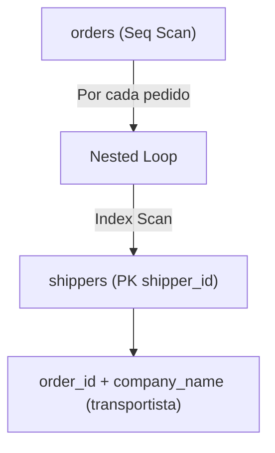

### 3. Código de Solución

```sql
SELECT
    o.order_id,
    o.ship_name,
    s.company_name AS transportista,
    o.freight
FROM orders o
INNER JOIN shippers s ON o.ship_via = s.shipper_id
ORDER BY o.freight DESC;
```

### 4. Criterio de Evaluación del Entrevistador

Evalúa si el candidato identifica correctamente que `ship_via` es la FK hacia `shippers`. Un error común es confundir nombres de columnas heredadas donde la FK no coincide literalmente con la PK.

---

## Ejercicio 37: Reporte de Pedidos con Cliente y Empleado Asignado (JOIN Triple)

### 1. Marco Conceptual del Optimizador

Dos JOINs consecutivos (`orders → customers` y `orders → employees`) son evaluados por el optimizador como un árbol de uniones. PostgreSQL puede elegir un orden diferente al sintáctico si las estadísticas lo justifican. Generalmente une primero `orders` con la tabla más pequeña (`employees`) y luego con `customers`, minimizando el tamaño del conjunto intermedio.

### 2. Diagrama de Flujo de Datos

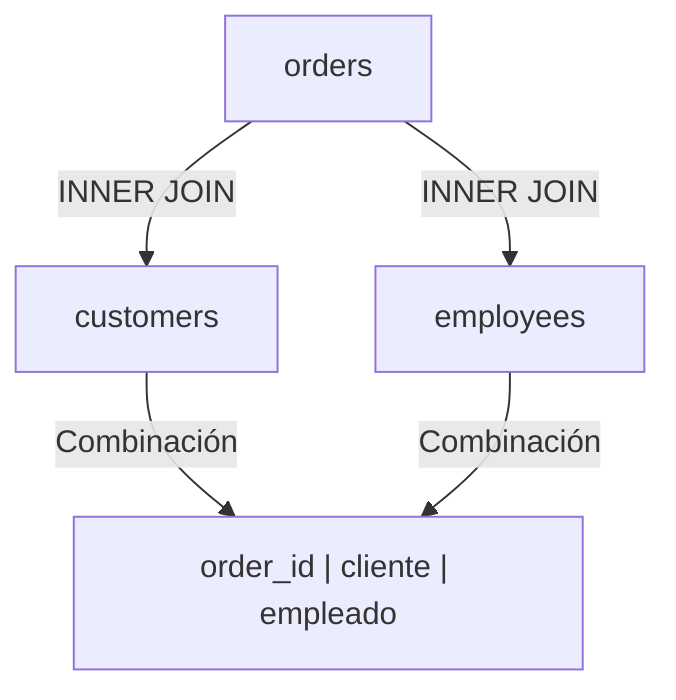

### 3. Código de Solución

```sql
SELECT
    o.order_id,
    o.order_date,
    c.company_name AS cliente,
    e.first_name || ' ' || e.last_name AS empleado
FROM orders o
INNER JOIN customers c ON o.customer_id = c.customer_id
INNER JOIN employees e ON o.employee_id = e.employee_id
ORDER BY o.order_date DESC
LIMIT 30;
```

### 4. Criterio de Evaluación del Entrevistador

Evalúa si el candidato puede estructurar consultas con dos uniones simultáneas. Un error común es perder el control de las cardinalidades y producir duplicados involuntarios.

---

## Ejercicio 38: Composición de Productos Vendidos con Categoría y Precio

### 1. Marco Conceptual del Optimizador

El optimizador encadena dos JOINs: `order_details → products → categories`. PostgreSQL evalúa el plan óptimo uniendo primero `order_details` con `products` (relación directa por `product_id`), y luego el conjunto resultante con `categories`. Cada JOIN reduce progresivamente la cardinalidad.

### 2. Diagrama de Flujo de Datos

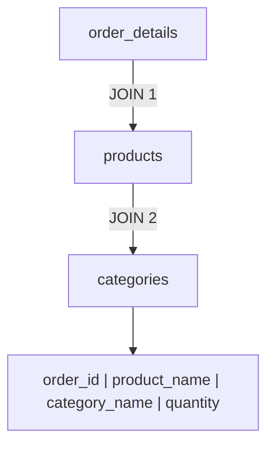

### 3. Código de Solución

```sql
SELECT
    od.order_id,
    p.product_name,
    c.category_name,
    od.quantity,
    od.unit_price
FROM order_details od
INNER JOIN products p ON od.product_id = p.product_id
INNER JOIN categories c ON p.category_id = c.category_id
WHERE od.quantity > 20
ORDER BY od.quantity DESC;
```

### 4. Criterio de Evaluación del Entrevistador

Mide la capacidad de navegar por una cadena de tres tablas con relaciones lógicas claras. El entrevistador observa si el candidato entiende el orden de los JOINs y su impacto en el rendimiento.

---

## Ejercicio 39: Vista Completa de Productos con Proveedor y Categoría (JOIN Triple)

### 1. Marco Conceptual del Optimizador

El optimizador resuelve tres JOINs: `products → suppliers` y `products → categories`. Con ambas tablas auxiliares siendo pequeñas, PostgreSQL carga ambas en `work_mem` como tablas hash y escanea `products` una sola vez, sondando ambas estructuras hash simultáneamente. Esto resulta en complejidad O(n) donde n es el número de productos.

### 2. Diagrama de Flujo de Datos

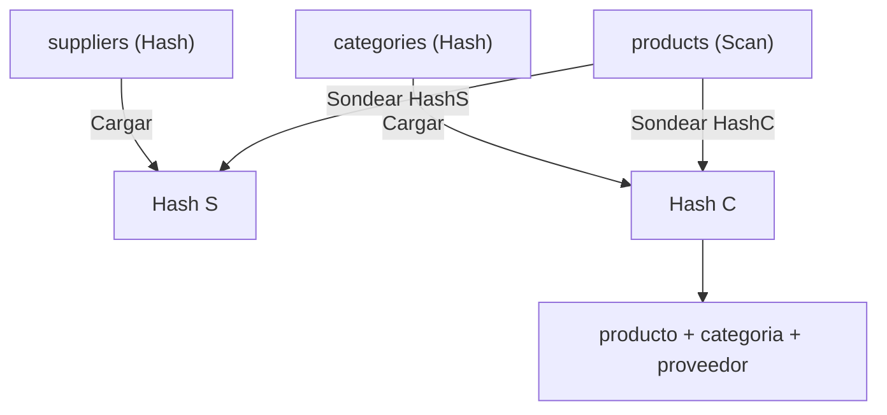

### 3. Código de Solución

```sql
SELECT
    p.product_id,
    p.product_name,
    c.category_name,
    s.company_name AS proveedor,
    p.unit_price
FROM products p
INNER JOIN categories c ON p.category_id = c.category_id
INNER JOIN suppliers s ON p.supplier_id = s.supplier_id
WHERE p.discontinued = 0
ORDER BY p.product_name;
```

### 4. Criterio de Evaluación del Entrevistador

Evalúa si el candidato puede componer una consulta que consolida tres dimensiones alrededor de una tabla de hechos. El entrevistador espera que se filtre por `discontinued = 0` antes de los JOINs (*Predicate Pushdown*).

---

## Ejercicio 40: Reporte Maestro de Órdenes con Cliente, Empleado y Transportista (4 JOINs)

### 1. Marco Conceptual del Optimizador

Cuatro JOINs encadenados: `orders → customers`, `orders → employees`, `orders → shippers`. El optimizador de PostgreSQL evalúa múltiples órdenes de join usando el optimizador genético (GEQO) cuando hay más de 8 tablas. Para 4 tablas, la búsqueda exhaustiva encuentra el plan óptimo, típicamente un *Hash Join* central con `orders` como tabla conductora.

### 2. Diagrama de Flujo de Datos

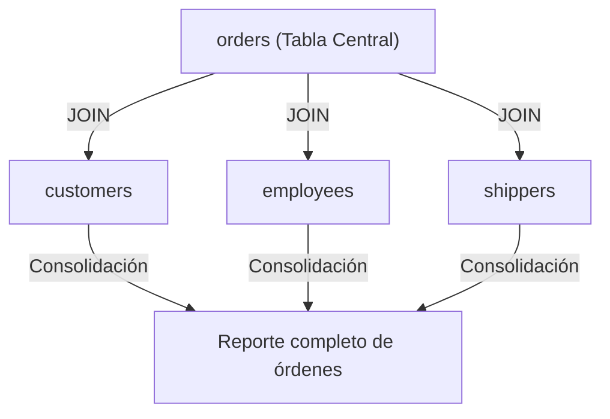

### 3. Código de Solución

```sql
SELECT
    o.order_id,
    o.order_date,
    c.company_name AS cliente,
    e.first_name || ' ' || e.last_name AS empleado,
    s.company_name AS transportista,
    o.freight
FROM orders o
INNER JOIN customers c ON o.customer_id = c.customer_id
INNER JOIN employees e ON o.employee_id = e.employee_id
INNER JOIN shippers s ON o.ship_via = s.shipper_id
ORDER BY o.order_date DESC
LIMIT 50;
```

### 4. Criterio de Evaluación del Entrevistador

Ejercicio integrador que evalúa la capacidad de construir un reporte empresarial con cuatro tablas. El candidato que mantiene la claridad y consistencia en los alias demuestra madurez técnica.

---

## Ejercicio 41: Todos los Clientes con sus Pedidos (LEFT JOIN)

### 1. Marco Conceptual del Optimizador

`LEFT JOIN customers c LEFT JOIN orders o ON c.customer_id = o.customer_id` preserva todas las filas de `customers`, incluso aquellas sin pedidos. El optimizador aplica un *Hash Left Join*: construye una tabla hash con `orders` indexada por `customer_id`, escanea `customers`, y para cada registro busca en el hash. Si no encuentra coincidencia, rellena las columnas de `orders` con `NULL`.

### 2. Diagrama de Flujo de Datos

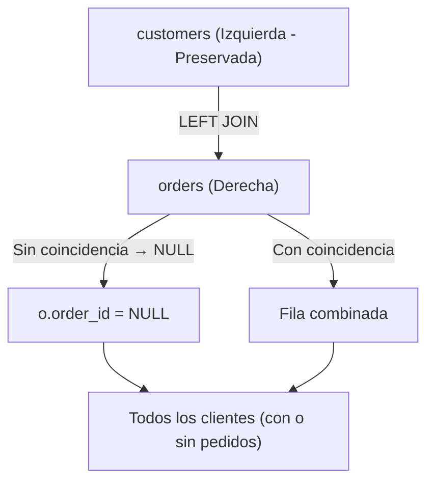

### 3. Código de Solución

```sql
SELECT
    c.customer_id,
    c.company_name,
    o.order_id,
    o.order_date
FROM customers c
LEFT JOIN orders o ON c.customer_id = o.customer_id
ORDER BY c.company_name;
```

### 4. Criterio de Evaluación del Entrevistador

Evalúa si el candidato comprende la diferencia fundamental entre `INNER JOIN` y `LEFT JOIN`. Un error común es usar `INNER JOIN` cuando se necesita preservar todos los registros de la tabla izquierda.

---

## Ejercicio 42: Todos los Productos del Catálogo con sus Ventas (LEFT JOIN)

### 1. Marco Conceptual del Optimizador

`LEFT JOIN products p LEFT JOIN order_details od ON p.product_id = od.product_id` preserva todos los productos. El optimizador aplica un *Hash Left Join* donde `products` es la tabla de origen. Si un producto nunca se ha vendido, las columnas de `order_details` aparecen como `NULL`. Este patrón permite detectar productos obsoletos.

### 2. Diagrama de Flujo de Datos

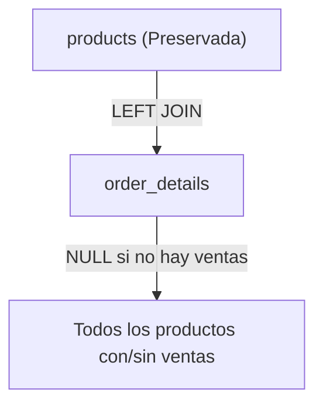

### 3. Código de Solución

```sql
SELECT
    p.product_id,
    p.product_name,
    p.unit_price,
    od.order_id,
    od.quantity
FROM products p
LEFT JOIN order_details od ON p.product_id = od.product_id
ORDER BY p.product_name, od.order_id;
```

### 4. Criterio de Evaluación del Entrevistador

Evalúa si el candidato conoce el patrón de *Outer Join* para auditoría de inventario. El entrevistador valora que identifique productos sin movimiento como oportunidades de negocio.

---

## Ejercicio 43: Todos los Empleados y los Pedidos que Han Procesado (LEFT JOIN)

### 1. Marco Conceptual del Optimizador

`LEFT JOIN employees e LEFT JOIN orders o ON e.employee_id = o.employee_id` preserva empleados incluso si no tienen pedidos. El optimizador aplica *Nested Loop Left Join* si `employees` es pequeña; cada empleado busca sus pedidos mediante un *Index Scan* en `orders(employee_id)`. Los empleados sin pedidos retornan `NULL` en las columnas de `orders`.

### 2. Diagrama de Flujo de Datos

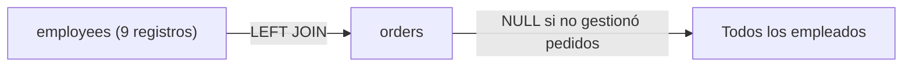

### 3. Código de Solución

```sql
SELECT
    e.employee_id,
    e.first_name || ' ' || e.last_name AS empleado,
    e.title,
    o.order_id,
    o.order_date
FROM employees e
LEFT JOIN orders o ON e.employee_id = o.employee_id
ORDER BY e.employee_id;
```

### 4. Criterio de Evaluación del Entrevistador

Evalúa si el candidato sabe que algunos empleados pueden no tener pedidos (por ejemplo, personal administrativo) y que `LEFT JOIN` los incluye. El entrevistador espera que se diferencie entre `LEFT` y `INNER` para este caso.

---

## Ejercicio 44: Clientes Inactivos (Sin Pedidos) para una Campaña de Reactivación

### 1. Marco Conceptual del Optimizador

El patrón *Anti-Join*: `LEFT JOIN` + `WHERE o.order_id IS NULL` identifica clientes sin pedidos. PostgreSQL optimiza esto como un *Hash Anti-Join*: construye un hash set con los `customer_id` que existen en `orders` y luego escanea `customers` descartando aquellos que están en el hash. Esto es mucho más eficiente que `NOT IN (SELECT customer_id FROM orders)`.

### 2. Diagrama de Flujo de Datos

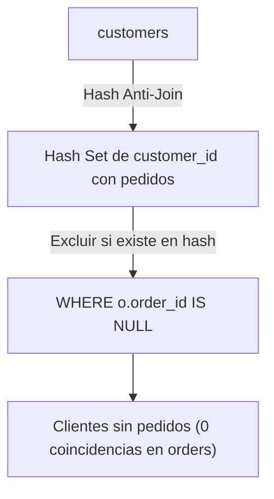

### 3. Código de Solución

```sql
SELECT
    c.customer_id,
    c.company_name,
    c.phone,
    c.country
FROM customers c
LEFT JOIN orders o ON c.customer_id = o.customer_id
WHERE o.order_id IS NULL;
```

### 4. Criterio de Evaluación del Entrevistador

Pregunta clásica de entrevista técnica. Los candidatos que escriben `WHERE customer_id NOT IN (SELECT customer_id FROM orders)` demuestran falta de conocimiento sobre el manejo de nulos en subconsultas y son descartados.

---

## Ejercicio 45: Productos Nunca Vendidos para una Auditoría de Inventario Muerto

### 1. Marco Conceptual del Optimizador

*Anti-Join* entre `products` y `order_details`. PostgreSQL detecta el patrón y ejecuta un *Merge Anti-Join* si ambas tablas están ordenadas por `product_id`, o un *Hash Anti-Join* en caso contrario. El motor evita escanear toda la tabla `order_details` para cada producto gracias al uso de la estructura hash en memoria.

### 2. Diagrama de Flujo de Datos

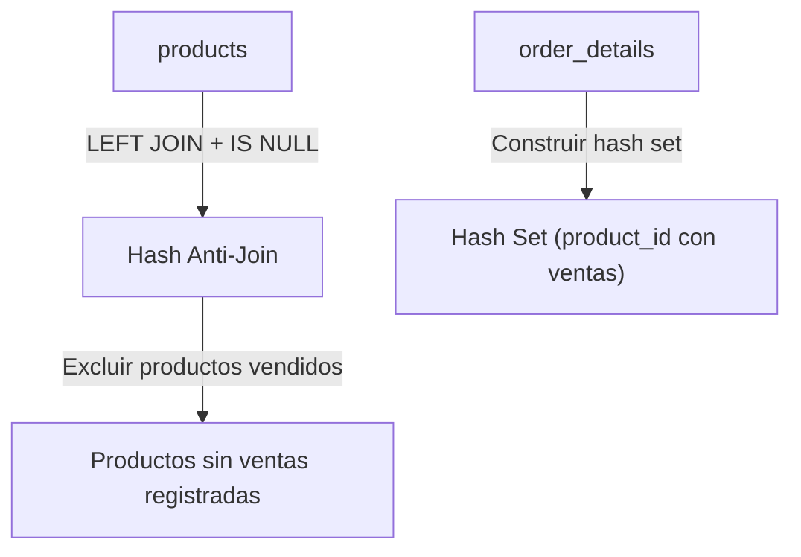

### 3. Código de Solución

```sql
SELECT
    p.product_id,
    p.product_name,
    p.unit_price,
    p.units_in_stock
FROM products p
LEFT JOIN order_details od ON p.product_id = od.product_id
WHERE od.product_id IS NULL;
```

### 4. Criterio de Evaluación del Entrevistador

Evalúa la capacidad de auditar el catálogo usando *Anti-Join*. El entrevistador descarta candidatos que usan subconsultas costosas o `NOT IN` con riesgo de nulos.

---

## Ejercicio 46: Jerarquía de Reportes en la Organización (SELF LEFT JOIN)

### 1. Marco Conceptual del Optimizador

`SELF JOIN` sobre `employees` usando la FK `reports_to` que apunta a `employee_id`. PostgreSQL crea dos instancias lógicas de la misma tabla física en memoria (alias `e` para subordinados, `m` para managers). El `LEFT JOIN` preserva al empleado raíz (Andrew Fuller, que reporta a NULL). El motor ejecuta un *Nested Loop* con *Index Scan* sobre la PK `employee_id`.

### 2. Diagrama de Flujo de Datos

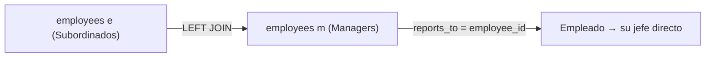

### 3. Código de Solución

```sql
SELECT
    e.employee_id,
    e.first_name || ' ' || e.last_name AS empleado,
    e.title AS cargo,
    m.first_name || ' ' || m.last_name AS reporta_a,
    m.title AS cargo_jefe
FROM employees e
LEFT JOIN employees m ON e.reports_to = m.employee_id
ORDER BY e.employee_id;
```

### 4. Criterio de Evaluación del Entrevistador

Evalúa la comprensión del *SELF JOIN* y el `LEFT JOIN` para preservar registros raíz. Un error común es usar `INNER JOIN`, que excluiría al presidente de la compañía.

---

## Ejercicio 47: Reporte Consolidado de Clientes con Pedidos y Empleados Asignados

### 1. Marco Conceptual del Optimizador

Se encadenan tres `LEFT JOINs`: `customers → orders → employees`. El optimizador preserva todos los clientes y aplica los JOINs secuencialmente. El orden de los JOINs es crítico: si un cliente tiene pedidos, también se muestra el empleado que lo gestionó. Si no, todo aparece como `NULL`.

### 2. Diagrama de Flujo de Datos

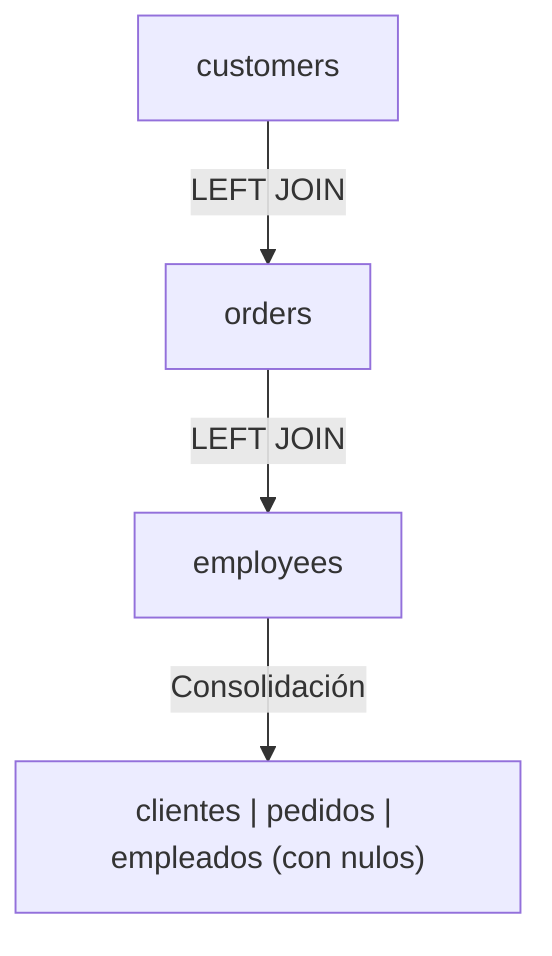

### 3. Código de Solución

```sql
SELECT
    c.company_name AS cliente,
    c.country,
    o.order_id,
    o.order_date,
    e.first_name || ' ' || e.last_name AS empleado
FROM customers c
LEFT JOIN orders o ON c.customer_id = o.customer_id
LEFT JOIN employees e ON o.employee_id = e.employee_id
ORDER BY c.company_name, o.order_date;
```

### 4. Criterio de Evaluación del Entrevistador

Evalúa la capacidad de construir reportes multi-tabla preservando la tabla maestra. El entrevistador observa si el candidato entiende que el segundo `LEFT JOIN` depende del primero.

---

## Ejercicio 48: Factura Proforma con Cliente, Productos y Cantidades (LEFT JOIN Multi-tabla)

### 1. Marco Conceptual del Optimizador

Cuatro tablas encadenadas con `LEFT JOIN`: `customers → orders → order_details → products`. El optimizador procesa esta cadena como un árbol de uniones externas. La presencia de múltiples `LEFT JOINs` restringe las opciones de reordenamiento del optimizador, ya que debe respetar la semántica de preservación de la tabla izquierda.

### 2. Diagrama de Flujo de Datos

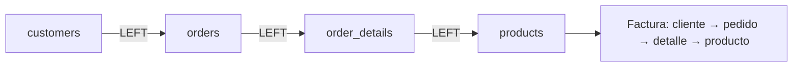

### 3. Código de Solución

```sql
SELECT
    c.company_name AS cliente,
    o.order_id,
    o.order_date,
    p.product_name,
    od.quantity,
    od.unit_price,
    ROUND((od.quantity * od.unit_price * (1 - od.discount))::numeric, 2) AS importe_neto
FROM customers c
LEFT JOIN orders o ON c.customer_id = o.customer_id
LEFT JOIN order_details od ON o.order_id = od.order_id
LEFT JOIN products p ON od.product_id = p.product_id
ORDER BY c.company_name, o.order_id;
```

### 4. Criterio de Evaluación del Entrevistador

Evalúa la capacidad de construir un pipeline completo de facturación con 4 tablas. El entrevistador valora que el candidato calcule el importe neto con descuento directamente en la consulta.

---

## Ejercicio 49: Proveedores con su Oferta de Productos y Ventas Generadas

### 1. Marco Conceptual del Optimizador

Se enlazan tres `LEFT JOINs`: `suppliers → products → order_details`. El optimizador preserva todos los proveedores. Si un proveedor no tiene productos, o si un producto no tiene ventas, las columnas correspondientes aparecen como `NULL`. El motor puede usar *Hash Left Join* para manejar esta cadena de manera eficiente.

### 2. Diagrama de Flujo de Datos

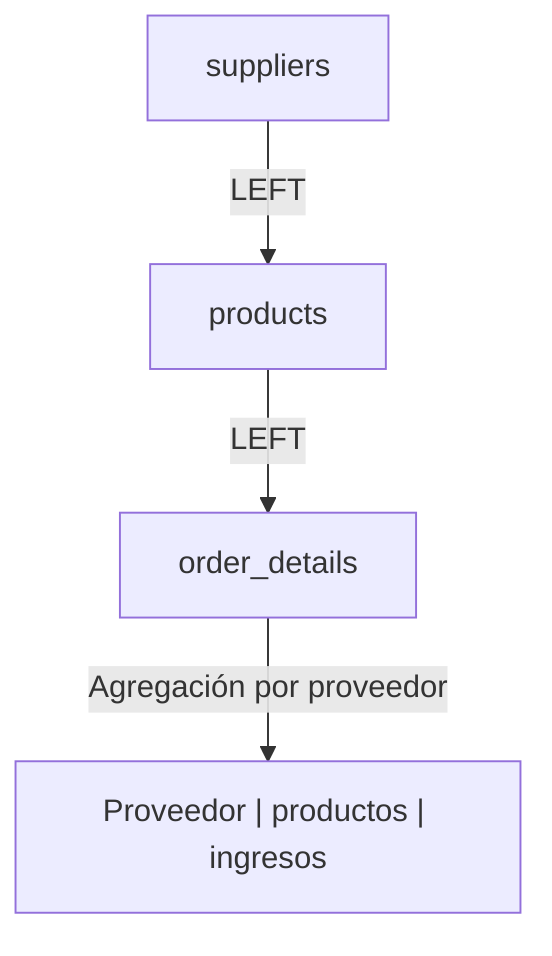

### 3. Código de Solución

```sql
SELECT
    s.company_name AS proveedor,
    s.country,
    p.product_name,
    SUM(od.quantity * od.unit_price * (1 - od.discount)) AS ingreso_generado
FROM suppliers s
LEFT JOIN products p ON s.supplier_id = p.supplier_id
LEFT JOIN order_details od ON p.product_id = od.product_id
GROUP BY s.company_name, s.country, p.product_name
ORDER BY s.company_name, ingreso_generado DESC NULLS LAST;
```

### 4. Criterio de Evaluación del Entrevistador

Evalúa la combinación de `LEFT JOIN` con `GROUP BY` y `NULLS LAST`. El entrevistador observa si el candidato maneja correctamente los nulos en la agregación y el ordenamiento.

---

## Ejercicio 50: Reporte Ejecutivo Consolidado de Toda la Cadena Comercial

### 1. Marco Conceptual del Optimizador

Consulta final que integra `employees`, `orders`, `customers` y `shippers` con `LEFT JOINs` para preservar todos los registros de cada entidad. El optimizador debe resolver un grafo de uniones externas, respetando la semántica de cada `LEFT JOIN`. PostgreSQL utiliza el optimizador genético (GEQO) para encontrar el orden de JOIN más eficiente cuando hay múltiples tablas.

### 2. Diagrama de Flujo de Datos

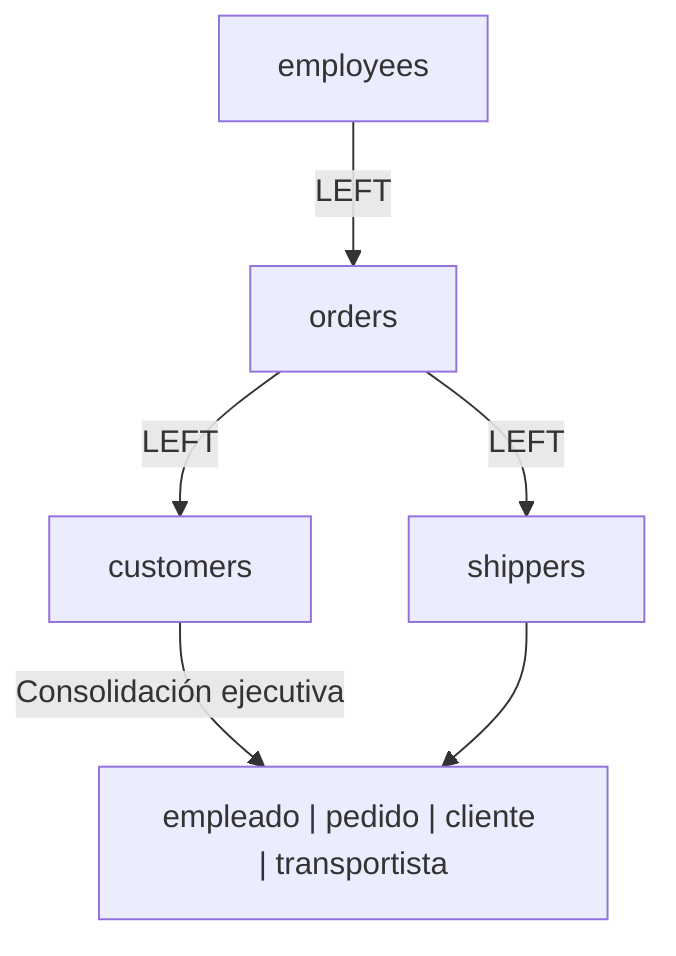

### 3. Código de Solución

```sql
SELECT
    e.first_name || ' ' || e.last_name AS empleado,
    e.title AS cargo_empleado,
    o.order_id,
    o.order_date,
    o.required_date,
    o.shipped_date,
    c.company_name AS cliente,
    c.country AS pais_cliente,
    s.company_name AS transportista,
    o.freight
FROM employees e
LEFT JOIN orders o ON e.employee_id = o.employee_id
LEFT JOIN customers c ON o.customer_id = c.customer_id
LEFT JOIN shippers s ON o.ship_via = s.shipper_id
ORDER BY o.order_date DESC NULLS LAST;
```

### 4. Criterio de Evaluación del Entrevistador

Ejercicio integrador final. El entrevistador evalúa la capacidad de construir un reporte ejecutivo completo que abarque toda la cadena de valor: fuerza de ventas, pedidos, clientes y logística. El candidato que completa este ejercicio con claridad demuestra dominio del nivel básico de SQL relacional.

---
