# 📚 Libro de Ejercicios SQL - Nivel 1: Básico

---

## Ejercicio 1: Proyección de la Fuerza de Ventas para una Auditoría de RRHH

### 1. Marco Conceptual del Optimizador

El motor de PostgreSQL ejecuta la cláusula `FROM` para localizar la tabla `employees` en el catálogo y mapear sus páginas físicas (bloques de 8 KB) en el heap. La proyección `SELECT` con columnas específicas reduce el ancho de la tupla (`tuple width`) en los buffers de `shared_buffers`. Al evitar `SELECT *`, se minimiza la transferencia de datos desde disco a memoria y se habilita la posibilidad de un *Index-Only Scan* si existiera un índice de cobertura.

### 2. Diagrama de Flujo de Datos


### 3. Código de Solución

```sql
SELECT
    employee_id,
    last_name,
    first_name,
    title
FROM employees;
```

### 4. Criterio de Evaluación del Entrevistador

Evalúa si el candidato conoce el costo de E/S de `SELECT *`. Un error grave es proyectar columnas innecesarias, saturando la caché y aumentando el tráfico de red entre la base de datos y la aplicación.

---

## Ejercicio 2: Segmentación de Productos Premium en un Retail

### 1. Marco Conceptual del Optimizador

El predicado `WHERE unit_price > 30` filtra las tuplas después de la fase `FROM`. PostgreSQL evalúa este filtro en la CPU durante un *Sequential Scan* o, si existe un índice B-Tree en `unit_price`, mediante un *Index Range Scan*. El optimizador utiliza las estadísticas de la columna (`n_distinct`, `most_common_vals`) para estimar la selectividad del predicado y elegir el plan más barato.

### 2. Diagrama de Flujo de Datos

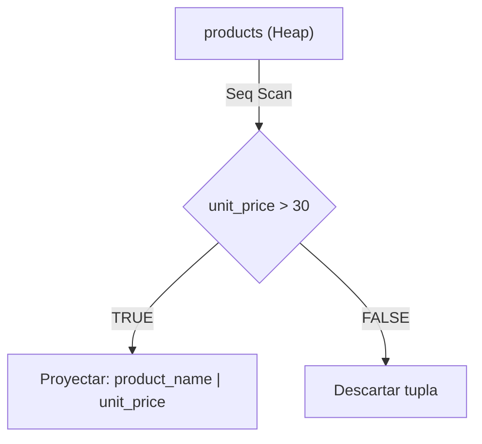

### 3. Código de Solución

```sql
SELECT
    product_name,
    unit_price
FROM products
WHERE unit_price > 30;
```

### 4. Criterio de Evaluación del Entrevistador

El entrevistador busca que el candidato entienda la diferencia entre filtrar en memoria vs. en disco. Un error común es no considerar la creación de un índice B-Tree para columnas usadas frecuentemente en filtros de rango.

---

## Ejercicio 3: Ordenamiento de Pedidos por Fecha de Despacho

### 1. Marco Conceptual del Optimizador

`ORDER BY order_date DESC` fuerza a PostgreSQL a ordenar el conjunto resultante después de la proyección. Si no existe un índice B-Tree en `order_date`, el motor asigna memoria en `work_mem` para realizar un *QuickSort* en memoria. Si el volumen de datos excede `work_mem`, el motor deriva el ordenamiento a disco usando *External Merge Sort*, degradando el rendimiento.

### 2. Diagrama de Flujo de Datos

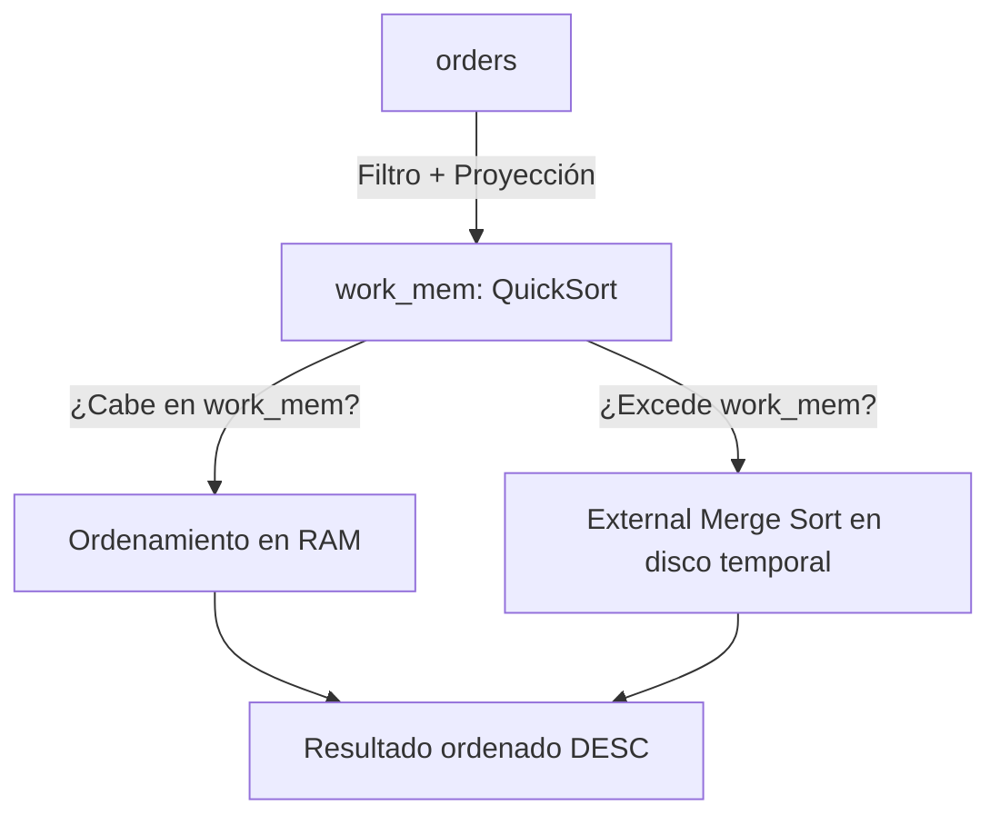

### 3. Código de Solución

```sql
SELECT
    order_id,
    customer_id,
    order_date
FROM orders
ORDER BY order_date DESC;
```

### 4. Criterio de Evaluación del Entrevistador

Mide la comprensión del uso de `work_mem` para ordenamiento. Los candidatos que asumen que `ORDER BY` es una operación de costo cero son descartados.

---

## Ejercicio 4: Ranking de Envíos Costosos con Nulos al Final

### 1. Marco Conceptual del Optimizador

La directiva `NULLS LAST` instruye a PostgreSQL a posicionar los valores nulos al final del conjunto ordenado, independientemente de la dirección `ASC` o `DESC`. Por defecto, PostgreSQL trata los nulos como valores más grandes (`NULLS LAST` en `ASC`, `NULLS FIRST` en `DESC`). Especificarlo explícitamente evita ambigüedades en reportes financieros.

### 2. Diagrama de Flujo de Datos

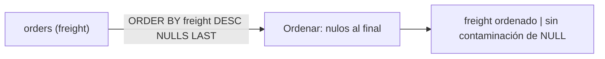

### 3. Código de Solución

```sql
SELECT
    order_id,
    ship_name,
    freight
FROM orders
ORDER BY freight DESC NULLS LAST;
```

### 4. Criterio de Evaluación del Entrevistador

El entrevistador verifica si el candidato conoce el tratamiento de nulos en ordenamiento. Un error común es ignorar que los nulos alteran el orden esperado del reporte.

---

## Ejercicio 5: Top 5 Productos Más Caros del Catálogo

### 1. Marco Conceptual del Optimizador

`LIMIT 5` combinado con `ORDER BY` activa el optimizador *Top-N Heap Sort* en PostgreSQL. En lugar de ordenar el conjunto completo, el motor mantiene una estructura de montículo (heap) de tamaño 5 en `work_mem`, insertando cada tupla y descartando la de menor prioridad. Esto reduce drásticamente el uso de memoria y evita el ordenamiento completo.

### 2. Diagrama de Flujo de Datos

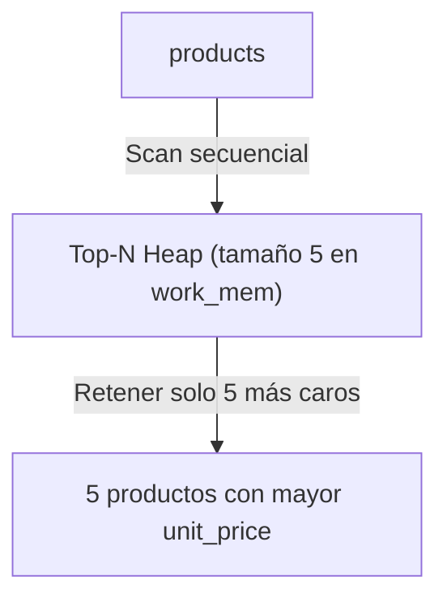

### 3. Código de Solución

```sql
SELECT
    product_name,
    unit_price
FROM products
ORDER BY unit_price DESC
LIMIT 5;
```

### 4. Criterio de Evaluación del Entrevistador

Evalúa el conocimiento del algoritmo *Top-N* y su diferencia con un ordenamiento completo seguido de `LIMIT`. Los candidatos que ignoran esta optimización planifican recursos de memoria de forma ineficiente.

---

## Ejercicio 6: Paginación de Pedidos para un Dashboard Comercial

### 1. Marco Conceptual del Optimizador

`LIMIT 10 OFFSET 20` fuerza al motor a generar y descartar internamente las primeras 20 tuplas ordenadas. El optimizador de PostgreSQL aplica *Top-N* solo si no hay `OFFSET`. Con `OFFSET`, el motor debe contar y saltar físicamente las filas antes de devolver las siguientes, lo que es ineficiente para valores altos de `OFFSET`.

### 2. Diagrama de Flujo de Datos

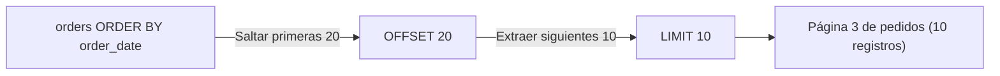

### 3. Código de Solución

```sql
SELECT
    order_id,
    order_date,
    customer_id
FROM orders
ORDER BY order_date ASC
LIMIT 10 OFFSET 20;
```

### 4. Criterio de Evaluación del Entrevistador

Mide si el candidato conoce el antipatrón de paginación basado en `OFFSET`. Para grandes volúmenes, el entrevistador espera que el candidato proponga *Keyset Pagination* (basada en cursores) como alternativa.

---

## Ejercicio 7: Filtrado Geográfico de Clientes para Campaña de Marketing

### 1. Marco Conceptual del Optimizador

La expresión `country IN ('Germany', 'UK', 'USA')` es reescrita internamente por el optimizador como `country = 'Germany' OR country = 'UK' OR country = 'USA'`. PostgreSQL evalúa la lista de constantes y, si existe un índice B-Tree en `country`, realiza múltiples *Index Scans* (Bitmap Index Scan) combinando los mapas de bits mediante OR.

### 2. Diagrama de Flujo de Datos

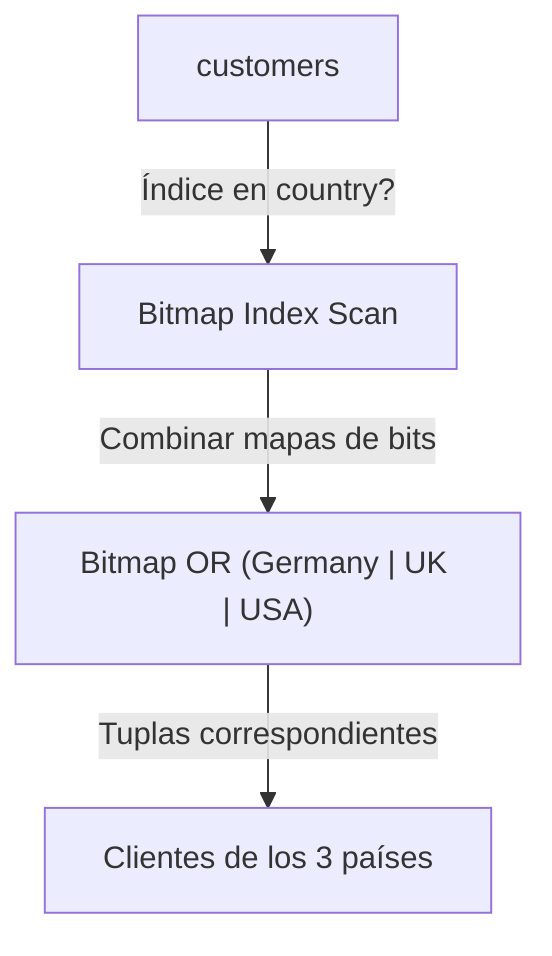

### 3. Código de Solución

```sql
SELECT
    customer_id,
    company_name,
    country
FROM customers
WHERE country IN ('Germany', 'UK', 'USA')
ORDER BY country, company_name;
```

### 4. Criterio de Evaluación del Entrevistador

Evalúa si el candidato comprende que `IN` con constantes es eficiente y utiliza *Bitmap Scans*. Un error es convertir `IN` en múltiples condiciones `OR` sin entender que el optimizador las trata igual.

---

## Ejercicio 8: Clasificación de Productos por Rango de Precios en un Supermercado

### 1. Marco Conceptual del Optimizador

`BETWEEN 15 AND 75` es reescrito como `unit_price >= 15 AND unit_price <= 75`. Con un índice B-Tree en `unit_price`, PostgreSQL ejecuta un *Index Range Scan*, localizando la primera hoja del índice con valor 15 y recorriendo las hojas enlazadas hasta alcanzar el valor 75. La complejidad es logarítmica en la búsqueda inicial y lineal en el recorrido.

### 2. Diagrama de Flujo de Datos

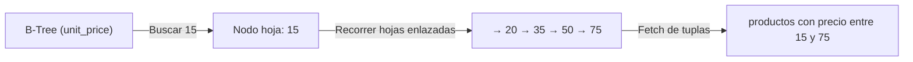

### 3. Código de Solución

```sql
SELECT
    product_id,
    product_name,
    unit_price
FROM products
WHERE unit_price BETWEEN 15 AND 75
ORDER BY unit_price;
```

### 4. Criterio de Evaluación del Entrevistador

Verifica si el candidato sabe que `BETWEEN` es inclusivo en ambos extremos. Un error común es asumir que los límites son excluyentes.

---

## Ejercicio 9: Detección de Pedidos Antes del Lanzamiento del Sistema ERP

### 1. Marco Conceptual del Optimizador

La comparación `order_date < '1997-01-01'` es un filtro de rango sobre una columna de tipo `date`. PostgreSQL almacena las fechas como enteros de 4 bytes (días desde la época 2000-01-01). La comparación se realiza a nivel de CPU como una operación entera. Si existe un índice B-Tree en `order_date`, el optimizador lo utiliza para un *Index Range Scan*.

### 2. Diagrama de Flujo de Datos

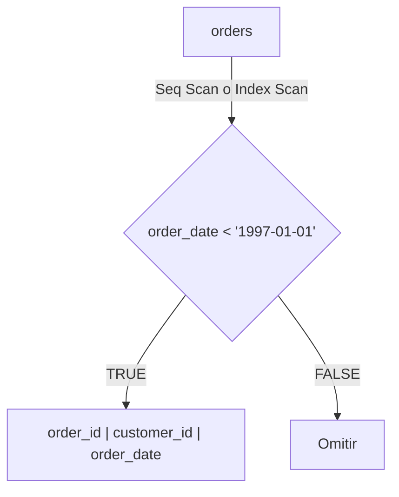

### 3. Código de Solución

```sql
SELECT
    order_id,
    customer_id,
    order_date
FROM orders
WHERE order_date < '1997-01-01'
ORDER BY order_date;
```

### 4. Criterio de Evaluación del Entrevistador

Evalúa el manejo de tipos de dato `date` y el uso de constantes literales en formato ISO 8601. Un error es usar formatos locales no estándar que requieren conversión implícita.

---

## Ejercicio 10: Reporte de Empleados con Mayor Antigüedad en la Empresa

### 1. Marco Conceptual del Optimizador

La combinación `WHERE hire_date >= '1993-01-01' ORDER BY hire_date ASC LIMIT 10` ejecuta un *Top-N Heap Sort* filtrado. El optimizador aplica primero el predicado de fecha, reduciendo el conjunto a ordenar, y luego mantiene solo las 10 fechas más tempranas. La presencia de un índice en `hire_date` permite un *Index Scan* directo sin necesidad de ordenamiento posterior.

### 2. Diagrama de Flujo de Datos

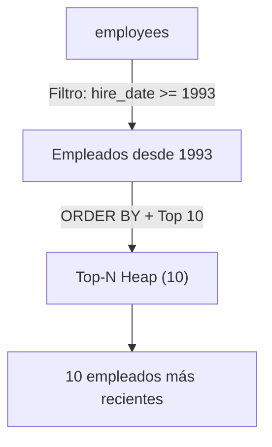

### 3. Código de Solución

```sql
SELECT
    employee_id,
    first_name || ' ' || last_name AS empleado,
    title,
    hire_date
FROM employees
WHERE hire_date >= '1993-01-01'
ORDER BY hire_date ASC
LIMIT 10;
```

### 4. Criterio de Evaluación del Entrevistador

Mide la capacidad de combinar filtro, ordenamiento y límite en una sola consulta. El entrevistador espera que el candidato entienda que el orden de las cláusulas sigue la precedencia lógica: FROM → WHERE → ORDER BY → LIMIT.

---

## Ejercicio 11: Búsqueda de Contactos con Cargo Comercial para una Base de Prospectos

### 1. Marco Conceptual del Optimizador

El operador `LIKE '%Sales%'` contiene un comodín inicial, lo que impide el uso de un índice B-Tree estándar. PostgreSQL fuerza un *Sequential Scan* sobre toda la tabla `customers`, evaluando el patrón en cada tupla mediante una expresión regular simplificada. Para optimizar esta búsqueda, sería necesario un índice GIN con el módulo `pg_trgm`.

### 2. Diagrama de Flujo de Datos

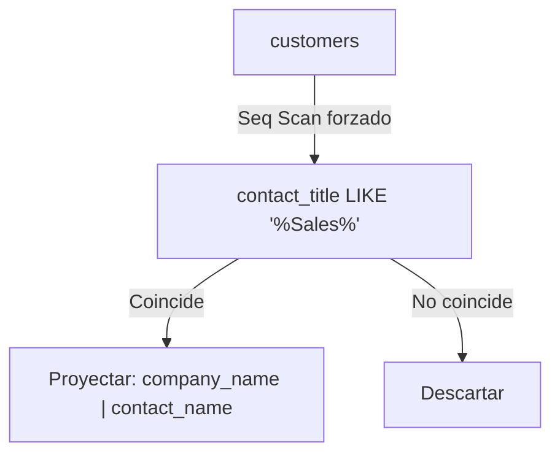

### 3. Código de Solución

```sql
SELECT
    company_name,
    contact_name,
    contact_title
FROM customers
WHERE contact_title LIKE '%Sales%'
ORDER BY company_name;
```

### 4. Criterio de Evaluación del Entrevistador

Evalúa si el candidato sabe que un comodín inicial (`%text`) deshabilita el índice B-Tree. Un candidato avanzado menciona `pg_trgm` como solución para búsquedas de texto parcial.

---

## Ejercicio 12: Productos que Empiezan con una Letra Específica para un Catálogo

### 1. Marco Conceptual del Optimizador

El patrón `LIKE 'C%'` tiene un comodín solo al final, lo que permite a PostgreSQL utilizar un *Index Range Scan* sobre un índice B-Tree en `product_name`. El motor busca en el índice el primer valor mayor o igual a `'C'` y menor que `'D'`, recorriendo las hojas del índice y accediendo al heap solo para las tuplas que cumplen.

### 2. Diagrama de Flujo de Datos

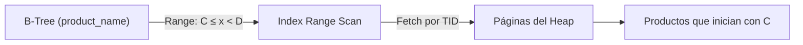

### 3. Código de Solución

```sql
SELECT
    product_id,
    product_name,
    unit_price
FROM products
WHERE product_name LIKE 'C%'
ORDER BY product_name;
```

### 4. Criterio de Evaluación del Entrevistador

Determina si el candidato distingue entre patrones con comodín al final (indexables) y patrones con comodín al inicio (no indexables). Error grave es no saber cuándo un `LIKE` puede usar índice.

---

## Ejercicio 13: Búsqueda Flexible de Cargos Administrativos con ILIKE

### 1. Marco Conceptual del Optimizador

`ILIKE '%manager%'` realiza una búsqueda case-insensitive. PostgreSQL implementa `ILIKE` como una llamada a la función `lower()` sobre ambos operandos antes de la comparación. Al igual que `LIKE` con comodín inicial, fuerza un *Sequential Scan*. La función `lower(product_name)` impide el uso de índices B-Tree a menos que exista un índice funcional `CREATE INDEX ON employees(LOWER(title))`.

### 2. Diagrama de Flujo de Datos

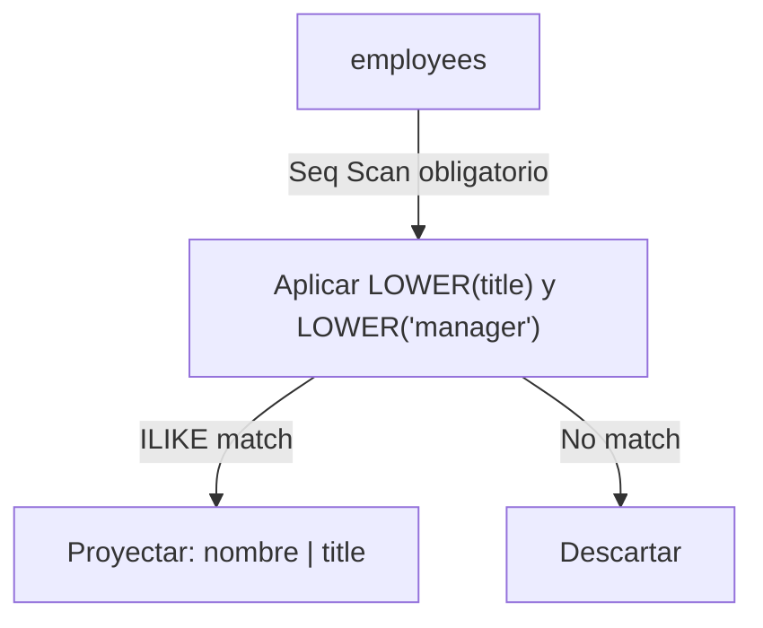

### 3. Código de Solución

```sql
SELECT
    employee_id,
    first_name || ' ' || last_name AS empleado,
    title
FROM employees
WHERE title ILIKE '%manager%';
```

### 4. Criterio de Evaluación del Entrevistador

Evalúa el conocimiento de `ILIKE` como extensión PostgreSQL para búsqueda sin distinción de mayúsculas. El entrevistador valora si el candidato propone índices funcionales como optimización.

---

## Ejercicio 14: Identificación de Clientes sin Región Asignada para un Proyecto de Limpieza de Datos

### 1. Marco Conceptual del Optimizador

`region IS NULL` evalúa el *null bitmap* de cada tupla en la cabecera del registro físico. PostgreSQL no necesita leer el valor completo de la columna; consulta directamente el mapa de bits de nulos en el encabezado de la tupla (HeapTupleHeaderData). Esto hace que la evaluación sea extremadamente rápida, independientemente del tamaño de la columna.

### 2. Diagrama de Flujo de Datos

```mermaid
flowchart LR
    Tuple["Tupla en shared_buffers"] -->|Leer Null Bitmap| Bitmap{"Bit de región activo?"}
    Bitmap -->|Sí (es NULL)| Accept["Incluir en resultados"]
    Bitmap -->|No (tiene valor)| Reject["Descartar"]
```

### 3. Código de Solución

```sql
SELECT
    customer_id,
    company_name,
    city,
    country
FROM customers
WHERE region IS NULL;
```

### 4. Criterio de Evaluación del Entrevistador

Pregunta clásica para verificar la comprensión de la lógica trivalente (TRUE / FALSE / UNKNOWN). Los candidatos que escriben `region = NULL` son descartados automáticamente por fallo conceptual fundamental.

---

## Ejercicio 15: Productos con Stock Físico Disponible para un Inventario

### 1. Marco Conceptual del Optimizador

`units_in_stock IS NOT NULL` filtra las tuplas donde la columna tiene un valor definido. Internamente, PostgreSQL verifica el *null bitmap* para confirmar que la columna tiene un valor almacenado. A diferencia de otros operadores, `IS NOT NULL` no puede utilizar un índice B-Tree de forma tradicional (aunque un índice parcial `WHERE units_in_stock IS NOT NULL` sí sería útil).

### 2. Diagrama de Flujo de Datos

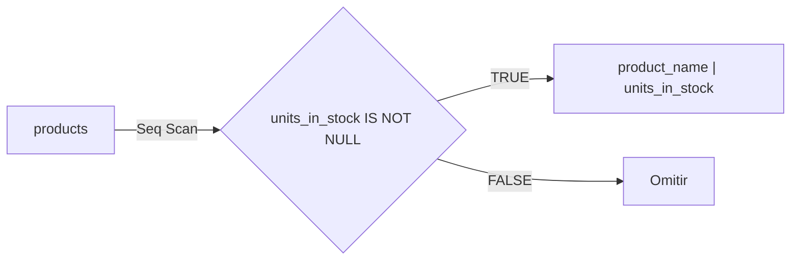

### 3. Código de Solución

```sql
SELECT
    product_name,
    units_in_stock
FROM products
WHERE units_in_stock IS NOT NULL
ORDER BY units_in_stock DESC;
```

### 4. Criterio de Evaluación del Entrevistador

Verifica que el candidato distingue entre `IS NOT NULL` y operadores de comparación. Un error común es usar `!= NULL` o `<> NULL`, que siempre retorna UNKNOWN y no filtra nada.

---

## Ejercicio 16: Campaña de Marketing para Clientes en USA o Canadá

### 1. Marco Conceptual del Optimizador

La condición `country = 'USA' OR country = 'Canada'` es evaluada por PostgreSQL usando cortocircuito lógico: si la primera condición es TRUE, la segunda no se evalúa. El optimizador puede convertir esta disyunción en un *BitmapOr* si existen índices, combinando los mapas de bits de ambos valores.

### 2. Diagrama de Flujo de Datos

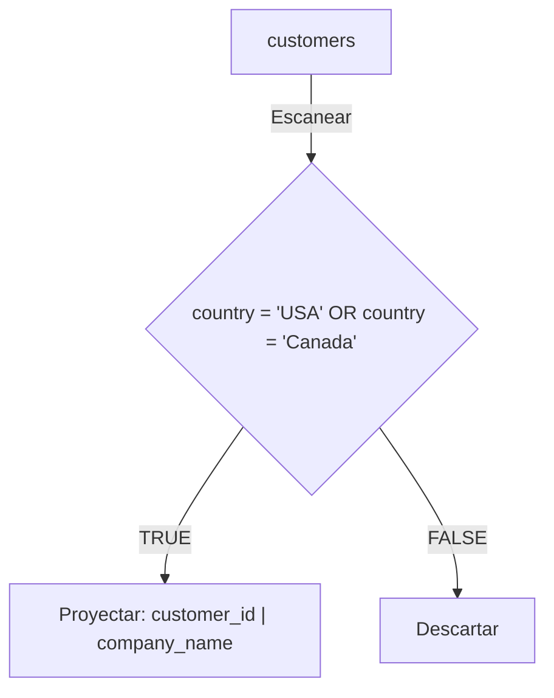

### 3. Código de Solución

```sql
SELECT
    customer_id,
    company_name,
    country,
    phone
FROM customers
WHERE country = 'USA'
   OR country = 'Canada'
ORDER BY country, company_name;
```

### 4. Criterio de Evaluación del Entrevistador

El entrevistador evalúa si el candidato conoce que `OR` puede ser menos eficiente que `IN` para listas cortas de valores constantes, y que PostgreSQL trata ambos de forma equivalente en el optimizador.

---

## Ejercicio 17: Productos No Descontinuados para un Catálogo Activo

### 1. Marco Conceptual del Optimizador

`NOT discontinued = 1` o `discontinued <> 1` evalua la negación lógica. PostgreSQL aplica el filtro invirtiendo el predicado. Si `discontinued` tiene un índice B-Tree, el motor puede usar un *Bitmap Index Scan* excluyendo el valor `1`. Sin embargo, la negación suele ser menos selectiva que la afirmación equivalente.

### 2. Diagrama de Flujo de Datos

```mermaid
flowchart TD
    P["products"] -->|Filtro| Not{"discontinued <> 1"}
    Not -->|TRUE (activo)| Accept["product_id | product_name"]
    Not -->|FALSE (descontinuado)| Reject["Descartar"]
```

### 3. Código de Solución

```sql
SELECT
    product_id,
    product_name,
    unit_price,
    units_in_stock
FROM products
WHERE discontinued <> 1
ORDER BY product_name;
```

### 4. Criterio de Evaluación del Entrevistador

Evalúa el uso correcto de `NOT` y `<>`. El entrevistador observa si el candidato comprende que filtrar por negación puede ser menos eficiente que filtrar por afirmación debido a la menor selectividad del predicado.

---

## Ejercicio 18: Productos con Alta Rotación y Stock Suficiente

### 1. Marco Conceptual del Optimizador

La combinación de predicados con `AND` (`unit_price > 20 AND units_in_stock > 50`) permite a PostgreSQL usar un *Index Scan* compuesto si existe un índice multicolumna en `(unit_price, units_in_stock)`. El motor evalúa primero el predicado más selectivo, minimizando el número de tuplas a verificar para el segundo predicado.

### 2. Diagrama de Flujo de Datos

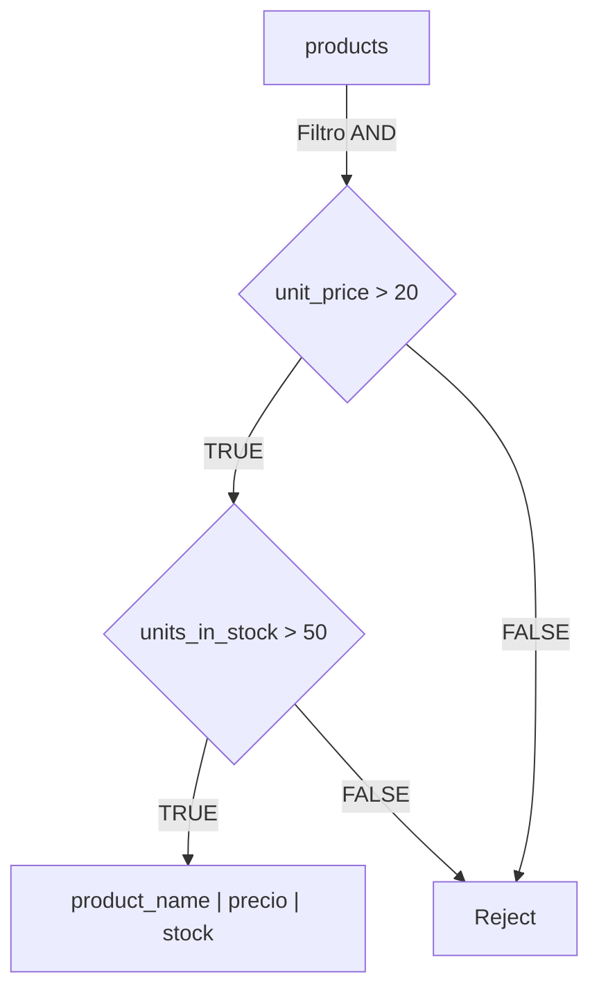

### 3. Código de Solución

```sql
SELECT
    product_name,
    unit_price,
    units_in_stock
FROM products
WHERE unit_price > 20
  AND units_in_stock > 50
ORDER BY unit_price DESC;
```

### 4. Criterio de Evaluación del Entrevistador

Mide la comprensión del orden de evaluación de predicados y cómo el optimizador selecciona el camino más restrictivo primero. El entrevistador valora propuestas de índices compuestos.

---

## Ejercicio 19: Pedidos Entregados Fuera de Plazo para un Reporte de Penalidades

### 1. Marco Conceptual del Optimizador

`shipped_date > required_date` combina la verificación de no nulo implícito (una fecha debe existir para ser comparada) con una comparación de rangos. PostgreSQL aplica un filtro de desigualdad sobre dos columnas de la misma tupla, evaluando tupla por tupla en la CPU. Si existen índices separados en ambas columnas, el optimizador podría usar un *Bitmap Scan* combinado.

### 2. Diagrama de Flujo de Datos

```mermaid
flowchart TD
    O["orders"] -->|Seq Scan| Compare{"shipped_date > required_date"}
    Compare -->|TRUE (retraso)| Accept["order_id | retraso en días"]
    Compare -->|FALSE (a tiempo)| Reject["Descartar"]
```

### 3. Código de Solución

```sql
SELECT
    order_id,
    customer_id,
    required_date,
    shipped_date
FROM orders
WHERE shipped_date > required_date
ORDER BY shipped_date;
```

### 4. Criterio de Evaluación del Entrevistador

Evalúa la capacidad de realizar comparaciones entre columnas de la misma fila. Un error común es no considerar que ambas columnas deben ser no nulas para que la comparación tenga sentido.

---

## Ejercicio 20: Empleados Contratados en los 90s Excluyendo a los de USA

### 1. Marco Conceptual del Optimizador

La combinación de `AND` y `NOT` se evalúa en orden ascendente de dificultad. PostgreSQL primero aplica el filtro de fecha (rangos indexables) y luego aplica la negación geográfica. Si existe un índice compuesto en `(hire_date, country)`, el motor lo utiliza para un *Index Scan* de rango con filtro adicional.

### 2. Diagrama de Flujo de Datos

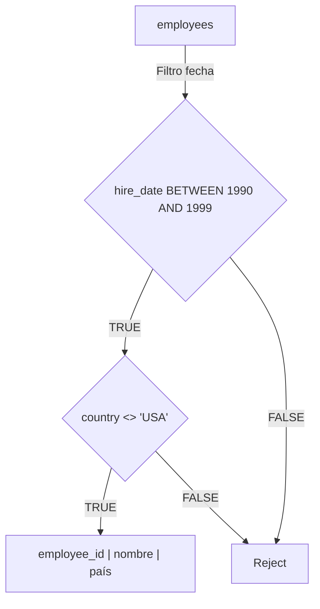

### 3. Código de Solución

```sql
SELECT
    employee_id,
    first_name || ' ' || last_name AS empleado,
    title,
    hire_date,
    country
FROM employees
WHERE hire_date BETWEEN '1990-01-01' AND '1999-12-31'
  AND country <> 'USA'
ORDER BY hire_date;
```

### 4. Criterio de Evaluación del Entrevistador

Evalúa la capacidad de combinar múltiples condiciones lógicas. El entrevistador observa si el candidato estructura los filtros correctamente usando `AND`, `OR`, y `NOT` con la precedencia lógica adecuada.

---

## Ejercicio 21: Países de Origen de Nuestros Clientes para Expansión Geográfica

### 1. Marco Conceptual del Optimizador

`DISTINCT country` elimina duplicados del conjunto de resultados. PostgreSQL implementa `DISTINCT` mediante *HashAggregate* (construye una tabla hash en `work_mem` con los valores únicos) o *Unique* (requiere que los datos estén preordenados). Para baja cardinalidad como `country`, *HashAggregate* es óptimo ya que la tabla hash cabe completamente en `work_mem`.

### 2. Diagrama de Flujo de Datos

```mermaid
flowchart LR
    C["customers (country)"] -->|Escanear todas las tuplas| Hash["HashAggregate en work_mem"]
    Hash -->|Clave única por país| Out["Lista de países sin repetición"]
```

### 3. Código de Solución

```sql
SELECT DISTINCT
    country
FROM customers
ORDER BY country;
```

### 4. Criterio de Evaluación del Entrevistador

Verifica si el candidato comprende que `DISTINCT` es una operación de agregación que requiere memoria. Un error es usar `DISTINCT` cuando se necesita `GROUP BY` con funciones agregadas.

---

## Ejercicio 22: Concentración de Clientes por País para un Análisis de Mercado

### 1. Marco Conceptual del Optimizador

`GROUP BY country` con `COUNT(*)` ejecuta una agregación. PostgreSQL selecciona entre *HashAggregate* (cada grupo se inserta en una tabla hash) y *GroupAggregate* (ordena primero y agrupa secuencialmente). Si `work_mem` es suficiente para la tabla hash, *HashAggregate* es O(n). En caso contrario, se fuerza un ordenamiento en disco.

### 2. Diagrama de Flujo de Datos

```mermaid
flowchart TD
    C["customers"] -->|Escanear| HashAgg["HashAggregate (country → COUNT)"]
    HashAgg -->|Emitir grupos| Out["país | total_clientes"]
```

### 3. Código de Solución

```sql
SELECT
    country,
    COUNT(*) AS total_clientes
FROM customers
GROUP BY country
ORDER BY total_clientes DESC;
```

### 4. Criterio de Evaluación del Entrevistador

Evalúa la comprensión de `GROUP BY` y la diferencia entre *HashAggregate* y *GroupAggregate*. Error grave es proyectar columnas no agregadas sin incluirlas en `GROUP BY`.

---

## Ejercicio 23: Valor Total del Inventario Almacenado para el Balance Financiero

### 1. Marco Conceptual del Optimizador

`SUM(unit_price * units_in_stock)` evalúa una expresión aritmética en cada tupla y acumula el resultado. PostgreSQL ejecuta un *Sequential Scan* sobre `products`, multiplicando dos columnas numéricas (numeric × smallint) en la CPU, y mantiene un acumulador de 128 bits para la suma. La precisión `numeric` evita errores de redondeo en operaciones financieras.

### 2. Diagrama de Flujo de Datos

```mermaid
flowchart LR
    P["products"] -->|Por cada tupla| Mult["unit_price × units_in_stock"]
    Mult -->|Acumular| Acc["Acumulador SUM"]
    Acc --> Out["Valorización total del inventario"]
```

### 3. Código de Solución

```sql
SELECT
    SUM(unit_price * units_in_stock) AS valorizacion_total
FROM products;
```

### 4. Criterio de Evaluación del Entrevistador

Evalúa la capacidad de realizar operaciones aritméticas dentro de funciones agregadas. El entrevistador valora que el candidato delegue cálculos masivos al motor de base de datos.

---

## Ejercicio 24: Precio Promedio del Catálogo para una Estrategia de Precios

### 1. Marco Conceptual del Optimizador

`AVG(unit_price)` mantiene dos variables de estado internas durante el escaneo: suma acumulada (`sum`) y contador de tuplas no nulas (`count`). Al finalizar el escaneo, divide `sum / count`. Los valores `NULL` en `unit_price` son ignorados automáticamente por la función `AVG` según el estándar ANSI SQL.

### 2. Diagrama de Flujo de Datos

```mermaid
flowchart TD
    P["products"] -->|Escanear y agregar| State["sum += unit_price | count += 1"]
    State -->|Fin de escaneo| Div["sum / count"]
    Div --> Out["Precio promedio del catálogo"]
```

### 3. Código de Solución

```sql
SELECT
    ROUND(AVG(unit_price)::numeric, 2) AS precio_promedio
FROM products;
```

### 4. Criterio de Evaluación del Entrevistador

Evalúa el manejo de valores nulos en agregaciones y el uso de `ROUND` para formateo financiero. El entrevistador verifica que el candidato sabe que `AVG` ignora nulos automáticamente.

---

## Ejercicio 25: Rango de Precios de Productos para una Auditoría de Catálogo

### 1. Marco Conceptual del Optimizador

`MIN(unit_price)` y `MAX(unit_price)` son agregaciones que, en lugar de escanear todas las tuplas, pueden beneficiarse de un índice B-Tree. PostgreSQL puede obtener el valor mínimo y máximo leyendo la primera y última hoja del índice respectivamente, sin tocar el heap. Esto reduce el costo de E/S de O(n) a O(log n).

### 2. Diagrama de Flujo de Datos

```mermaid
flowchart TD
    BTree["B-Tree (unit_price)"] -->|Primera hoja| Min["Mínimo: 2.50"]
    BTree -->|Última hoja| Max["Máximo: 263.50"]
    Min --> Out["Rango de precios del catálogo"]
    Max --> Out
```

### 3. Código de Solución

```sql
SELECT
    MIN(unit_price) AS precio_minimo,
    MAX(unit_price) AS precio_maximo,
    ROUND((MAX(unit_price) - MIN(unit_price))::numeric, 2) AS rango
FROM products;
```

### 4. Criterio de Evaluación del Entrevistador

Evalúa el conocimiento de que `MIN`/`MAX` pueden resolverse con un *Index Scan* sin leer todas las filas. El candidato destaca si menciona la optimización por índice B-Tree.

---

## Ejercicio 26: Ingreso Total Generado por Cada Producto (Cifra de Negocio)

### 1. Marco Conceptual del Optimizador

`SUM(quantity * unit_price * (1 - discount))` realiza una operación aritmética de tres términos sobre `order_details`. PostgreSQL escanea la tabla aplicando la expresión a cada tupla y acumulando el resultado. El tipo `numeric` garantiza precisión exacta en el cálculo financiero del descuento.

### 2. Diagrama de Flujo de Datos

```mermaid
flowchart LR
    OD["order_details"] -->|Por tupla| Calc["quantity × unit_price × (1 - discount)"]
    Calc -->|Agrupar por producto| Group["GROUP BY product_id"]
    Group -->|SUM acumulado| Out["Ingreso total por producto"]
```

### 3. Código de Solución

```sql
SELECT
    product_id,
    SUM(quantity * unit_price * (1 - discount)) AS ingreso_total
FROM order_details
GROUP BY product_id
ORDER BY ingreso_total DESC;
```

### 4. Criterio de Evaluación del Entrevistador

Evalúa si el candidato sabe calcular ingresos netos considerando descuentos directamente en SQL. Un error común es omitir el factor `(1 - discount)` y reportar ingresos brutos como netos.

---

## Ejercicio 27: Conteo de Pedidos con Flete Elevado Usando FILTER

### 1. Marco Conceptual del Optimizador

`COUNT(*) FILTER (WHERE freight > 200)` es una extensión PostgreSQL que permite agregación condicional sin subconsultas ni `CASE`. El motor evalúa el `FILTER` como una condición booleana durante la agregación: incrementa el contador solo si la condición es TRUE. Esto evita escanear la tabla múltiples veces.

### 2. Diagrama de Flujo de Datos

```mermaid
flowchart TD
    O["orders"] -->|Scan único| Agg["COUNT(*) con FILTER condicional"]
    Agg -->|Solo suma si freight > 200| Out["Total pedidos | pedidos con flete > 200"]
```

### 3. Código de Solución

```sql
SELECT
    COUNT(*) AS total_pedidos,
    COUNT(*) FILTER (WHERE freight > 200) AS pedidos_flete_elevado
FROM orders;
```

### 4. Criterio de Evaluación del Entrevistador

Evalúa si el candidato conoce `FILTER (WHERE ...)`, una característica PostgreSQL que permite agregación condicional eficiente. Una alternativa menos óptima es usar `CASE` dentro de `COUNT`.

---

## Ejercicio 28: Promedio de Flete por Año con FILTER Condicional

### 1. Marco Conceptual del Optimizador

`AVG(freight) FILTER (WHERE EXTRACT(YEAR FROM order_date) = 1997)` permite calcular promedios condicionales en un solo pase de la tabla. `EXTRACT(YEAR FROM order_date)` convierte la fecha a entero en la CPU. El motor mantiene múltiples estados de agregación simultáneamente (uno por cada combinación de `FILTER`).

### 2. Diagrama de Flujo de Datos

```mermaid
flowchart LR
    O["orders"] -->|Un solo escaneo| State["Estado SUM/COUNT por año"]
    State -->|Aislar 1997| Div["AVG 1997 = SUM(freight_1997) / COUNT_1997"]
    Div --> Out["Flete promedio del año 1997"]
```

### 3. Código de Solución

```sql
SELECT
    ROUND(AVG(freight) FILTER (WHERE EXTRACT(YEAR FROM order_date) = 1996)::numeric, 2) AS flete_promedio_1996,
    ROUND(AVG(freight) FILTER (WHERE EXTRACT(YEAR FROM order_date) = 1997)::numeric, 2) AS flete_promedio_1997,
    ROUND(AVG(freight) FILTER (WHERE EXTRACT(YEAR FROM order_date) = 1998)::numeric, 2) AS flete_promedio_1998
FROM orders;
```

### 4. Criterio de Evaluación del Entrevistador

Evalúa el uso avanzado de `FILTER` para generar múltiples agregaciones condicionales en una sola consulta. El entrevistador valora la eficiencia de un solo escaneo frente a múltiples consultas.

---

## Ejercicio 29: Cantidad de Territorios por Empleado Usando FILTER

### 1. Marco Conceptual del Optimizador

`COUNT(territory_id) FILTER (WHERE territory_id IS NOT NULL)` combina agregación con filtro condicional. PostgreSQL escanea `employee_territories` una sola vez, agrupa por `employee_id` aplicando el filtro, y emite el conteo. Si la tabla tiene un índice compuesto en `(employee_id, territory_id)`, el motor puede usar un *Index-Only Scan* para evitar leer el heap.

### 2. Diagrama de Flujo de Datos

```mermaid
flowchart TD
    ET["employee_territories"] -->|GROUP BY employee_id| Agg["COUNT con FILTER condicional"]
    Agg -->|Por empleado| Out["employee_id | total_territorios"]
```

### 3. Código de Solución

```sql
SELECT
    employee_id,
    COUNT(*) AS total_territorios,
    COUNT(*) FILTER (WHERE territory_id LIKE '0%') AS territorios_costa_este
FROM employee_territories
GROUP BY employee_id
ORDER BY total_territorios DESC;
```

### 4. Criterio de Evaluación del Entrevistador

Evalúa la capacidad de combinar `GROUP BY` con `FILTER` para obtener métricas segmentadas en una sola consulta. El entrevistador observa si el candidato entiende la eficiencia de un único escaneo.

---

## Ejercicio 30: Métricas de Precios por Categoría con FILTER

### 1. Marco Conceptual del Optimizador

La combinación de múltiples `FILTER` en una sola consulta permite calcular `COUNT`, `MIN`, `MAX`, `AVG` condicionales en un único escaneo de tabla. PostgreSQL ejecuta un *HashAggregate* sobre `category_id` y mantiene acumuladores separados para cada condición `FILTER`, maximizando la eficiencia del plan de ejecución.

### 2. Diagrama de Flujo de Datos

```mermaid
flowchart LR
    P["products"] -->|Un escaneo + HashAggregate| Filters["COUNT FILTER | AVG FILTER | MIN FILTER"]
    Filters -->|Por categoría| Out["category_id | stats condicionales"]
```

### 3. Código de Solución

```sql
SELECT
    category_id,
    COUNT(*) AS total_productos,
    COUNT(*) FILTER (WHERE unit_price > 50) AS productos_premium,
    ROUND(AVG(unit_price)::numeric, 2) AS precio_promedio,
    ROUND(AVG(unit_price) FILTER (WHERE units_in_stock > 0)::numeric, 2) AS precio_promedio_stock_disponible
FROM products
GROUP BY category_id
ORDER BY category_id;
```

### 4. Criterio de Evaluación del Entrevistador

Evalúa el dominio avanzado de agregación condicional. El entrevistador busca que el candidato demuestre eficiencia al consolidar múltiples métricas en una sola consulta en lugar de ejecutar consultas separadas.

---

## Ejercicio 31: Relación de Pedidos con Datos del Cliente para un Centro de Llamadas

### 1. Marco Conceptual del Optimizador

`INNER JOIN orders o ON o.customer_id = c.customer_id` cruza dos tablas por una clave foránea. El optimizador selecciona el algoritmo de unión basado en estadísticas: si `customers` es pequeña, usa *Hash Join* (construye tabla hash de customers en `work_mem`); si ambas son grandes, usa *Merge Join* tras ordenar por la clave. PostgreSQL estima cardinalidades usando el muestreo de `pg_class` y `pg_statistic`.

### 2. Diagrama de Flujo de Datos

```mermaid
flowchart TD
    C["customers (dim)"] -->|Hash Table en work_mem| HT["Hash (customer_id)"]
    O["orders (fact)"] -->|Sondear| HT
    HT -->|Coincidencia| Join["Filas combinadas"]
    Join --> Out["order_id | company_name | order_date"]
```

### 3. Código de Solución

```sql
SELECT
    o.order_id,
    o.order_date,
    c.company_name AS cliente,
    c.contact_name
FROM orders o
INNER JOIN customers c ON o.customer_id = c.customer_id
ORDER BY o.order_date DESC
LIMIT 20;
```

### 4. Criterio de Evaluación del Entrevistador

Evalúa la comprensión de los algoritmos de unión física (Hash Join vs Nested Loop vs Merge Join). El candidato que cree que los JOINs son siempre bucles anidados demuestra falta de conocimiento del optimizador.

---

## Ejercicio 32: Catálogo de Productos con su Categoría Comercial

### 1. Marco Conceptual del Optimizador

`INNER JOIN categories c ON p.category_id = c.category_id` cruza la tabla transaccional `products` con la dimensión `categories`. `category_id` es clave primaria indexada en `categories`, por lo que PostgreSQL usa un *Nested Loop Join* con un *Index Scan* en la PK de categories. La pequeña cardinalidad de `categories` (8 filas) hace que el índice quepa completamente en caché.

### 2. Diagrama de Flujo de Datos

```mermaid
flowchart TD
    P["products (Seq Scan)"] -->|Por cada producto| NL["Nested Loop"]
    NL -->|Index Scan en PK| C["categories (B-Tree)"]
    C -->|Tupla devuelta| Out["product_name + category_name"]
```

### 3. Código de Solución

```sql
SELECT
    p.product_id,
    p.product_name,
    c.category_name,
    c.description AS descripcion_categoria
FROM products p
INNER JOIN categories c ON p.category_id = c.category_id
ORDER BY p.product_name;
```

### 4. Criterio de Evaluación del Entrevistador

Verifica si el candidato comprende cómo las claves primarias indexadas aceleran los JOINs. Error grave: cruzar tablas en el código de la aplicación en lugar de usar JOINs SQL.

---

## Ejercicio 33: Pedidos Gestionados por Cada Empleado para una Evaluación de Desempeño

### 1. Marco Conceptual del Optimizador

`INNER JOIN employees e ON o.employee_id = e.employee_id` empareja `orders` (FK `employee_id`) con `employees` (PK `employee_id`). Dado que `employee_id` es `smallint`, la comparación es extremadamente rápida a nivel de CPU. El planificador puede elegir *Hash Join* si la tabla de empleados cabe en `work_mem`, o *Nested Loop* con *Index Scan* en la PK.

### 2. Diagrama de Flujo de Datos

```mermaid
flowchart LR
    O["orders (FK employee_id)"] -->|Cruzar por entero| Join["INNER JOIN"]
    E["employees (PK employee_id)"] --> Join
    Join --> Out["order_id + nombre_empleado"]
```

### 3. Código de Solución

```sql
SELECT
    o.order_id,
    o.order_date,
    e.first_name || ' ' || e.last_name AS empleado,
    e.title AS cargo
FROM orders o
INNER JOIN employees e ON o.employee_id = e.employee_id
ORDER BY o.order_date DESC;
```

### 4. Criterio de Evaluación del Entrevistador

Evalúa la capacidad de enlazar tablas usando alias consistentes y el impacto del tipo de dato en la velocidad de unión. Las uniones sobre claves alfanuméricas son más lentas que sobre enteros.

---

## Ejercicio 34: Detalle de Productos Comprados en Cada Pedido para Facturación

### 1. Marco Conceptual del Optimizador

El JOIN entre `order_details` y `products` utiliza la FK `product_id`. `order_details` es una tabla detalle con alta cardinalidad. PostgreSQL típicamente selecciona un *Hash Join* donde `products` (tabla pequeña) se carga como hash y `order_details` (tabla grande) se escanea secuencialmente para sondear el hash en tiempo O(1) por tupla.

### 2. Diagrama de Flujo de Datos

```mermaid
flowchart TD
    P["products (Hash)"] -->|Cargar en work_mem| HT["Hash Table (product_id)"]
    OD["order_details (Scan)"] -->|Sondear por product_id| HT
    HT -->|Hit| Join["Detalle + Nombre de producto"]
    Join --> Out["order_id | product_name | quantity"]
```

### 3. Código de Solución

```sql
SELECT
    od.order_id,
    p.product_name,
    od.quantity,
    od.unit_price,
    od.discount
FROM order_details od
INNER JOIN products p ON od.product_id = p.product_id
WHERE od.quantity > 50
ORDER BY od.quantity DESC;
```

### 4. Criterio de Evaluación del Entrevistador

Evalúa si el candidato sabe relacionar tablas detalle con tablas maestro usando JOINs. El entrevistador observa si el candidato entiende la direccionalidad del JOIN (muchos a uno).

---

## Ejercicio 35: Proveedores y sus Productos para una Negociación Comercial

### 1. Marco Conceptual del Optimizador

El JOIN entre `products` y `suppliers` cruza por `supplier_id`. La tabla `suppliers` es pequeña (~29 filas) y tiene un índice B-Tree en `supplier_id`. PostgreSQL elige un *Nested Loop Join* donde por cada producto busca rápidamente el proveedor en el índice, resultando en un plan de ejecución altamente eficiente.

### 2. Diagrama de Flujo de Datos

```mermaid
flowchart LR
    P["products"] -->|Nested Loop| NL["Búsqueda por supplier_id"]
    NL -->|Index Scan en PK| S["suppliers (B-Tree)"]
    S --> Out["product_name + company_name"]
```

### 3. Código de Solución

```sql
SELECT
    p.product_id,
    p.product_name,
    p.unit_price,
    s.company_name AS proveedor,
    s.country AS pais_proveedor
FROM products p
INNER JOIN suppliers s ON p.supplier_id = s.supplier_id
ORDER BY s.company_name, p.product_name;
```

### 4. Criterio de Evaluación del Entrevistador

Verifica si el candidato comprende cómo la cardinalidad de las tablas influye en la elección del algoritmo de JOIN. El entrevistador valora que se analice el plan de ejecución con `EXPLAIN`.

---

## Ejercicio 36: Pedidos con su Transportista Asignado para un Reporte Logístico

### 1. Marco Conceptual del Optimizador

`INNER JOIN shippers s ON o.ship_via = s.shipper_id` cruza `orders` con `shippers` (solo 3 registros). El optimizador de PostgreSQL trata esta tabla como una dimensión despreciable en costo y aplica un *Nested Loop Join*. Con el índice en la PK de `shippers`, cada búsqueda es O(log n) donde n = 3, es decir, casi instantánea.

### 2. Diagrama de Flujo de Datos

```mermaid
flowchart TD
    O["orders (Seq Scan)"] -->|Por cada pedido| NL["Nested Loop"]
    NL -->|Index Scan| S["shippers (PK shipper_id)"]
    S --> Out["order_id + company_name (transportista)"]
```

### 3. Código de Solución

```sql
SELECT
    o.order_id,
    o.ship_name,
    s.company_name AS transportista,
    o.freight
FROM orders o
INNER JOIN shippers s ON o.ship_via = s.shipper_id
ORDER BY o.freight DESC;
```

### 4. Criterio de Evaluación del Entrevistador

Evalúa si el candidato identifica correctamente que `ship_via` es la FK hacia `shippers`. Un error común es confundir nombres de columnas heredadas donde la FK no coincide literalmente con la PK.

---

## Ejercicio 37: Reporte de Pedidos con Cliente y Empleado Asignado (JOIN Triple)

### 1. Marco Conceptual del Optimizador

Dos JOINs consecutivos (`orders → customers` y `orders → employees`) son evaluados por el optimizador como un árbol de uniones. PostgreSQL puede elegir un orden diferente al sintáctico si las estadísticas lo justifican. Generalmente une primero `orders` con la tabla más pequeña (`employees`) y luego con `customers`, minimizando el tamaño del conjunto intermedio.

### 2. Diagrama de Flujo de Datos

```mermaid
flowchart TD
    O["orders"] -->|INNER JOIN| C["customers"]
    O -->|INNER JOIN| E["employees"]
    C & E -->|Combinación| Out["order_id | cliente | empleado"]
```

### 3. Código de Solución

```sql
SELECT
    o.order_id,
    o.order_date,
    c.company_name AS cliente,
    e.first_name || ' ' || e.last_name AS empleado
FROM orders o
INNER JOIN customers c ON o.customer_id = c.customer_id
INNER JOIN employees e ON o.employee_id = e.employee_id
ORDER BY o.order_date DESC
LIMIT 30;
```

### 4. Criterio de Evaluación del Entrevistador

Evalúa si el candidato puede estructurar consultas con dos uniones simultáneas. Un error común es perder el control de las cardinalidades y producir duplicados involuntarios.

---

## Ejercicio 38: Composición de Productos Vendidos con Categoría y Precio

### 1. Marco Conceptual del Optimizador

El optimizador encadena dos JOINs: `order_details → products → categories`. PostgreSQL evalúa el plan óptimo uniendo primero `order_details` con `products` (relación directa por `product_id`), y luego el conjunto resultante con `categories`. Cada JOIN reduce progresivamente la cardinalidad.

### 2. Diagrama de Flujo de Datos

```mermaid
flowchart TD
    OD["order_details"] -->|JOIN 1| P["products"]
    P -->|JOIN 2| C["categories"]
    C --> Out["order_id | product_name | category_name | quantity"]
```

### 3. Código de Solución

```sql
SELECT
    od.order_id,
    p.product_name,
    c.category_name,
    od.quantity,
    od.unit_price
FROM order_details od
INNER JOIN products p ON od.product_id = p.product_id
INNER JOIN categories c ON p.category_id = c.category_id
WHERE od.quantity > 20
ORDER BY od.quantity DESC;
```

### 4. Criterio de Evaluación del Entrevistador

Mide la capacidad de navegar por una cadena de tres tablas con relaciones lógicas claras. El entrevistador observa si el candidato entiende el orden de los JOINs y su impacto en el rendimiento.

---

## Ejercicio 39: Vista Completa de Productos con Proveedor y Categoría (JOIN Triple)

### 1. Marco Conceptual del Optimizador

El optimizador resuelve tres JOINs: `products → suppliers` y `products → categories`. Con ambas tablas auxiliares siendo pequeñas, PostgreSQL carga ambas en `work_mem` como tablas hash y escanea `products` una sola vez, sondando ambas estructuras hash simultáneamente. Esto resulta en complejidad O(n) donde n es el número de productos.

### 2. Diagrama de Flujo de Datos

```mermaid
flowchart TD
    S["suppliers (Hash)"] -->|Cargar| HashS["Hash S"]
    C["categories (Hash)"] -->|Cargar| HashC["Hash C"]
    P["products (Scan)"] -->|Sondear HashS| HashS
    P -->|Sondear HashC| HashC
    HashC --> Out["producto + categoria + proveedor"]
```

### 3. Código de Solución

```sql
SELECT
    p.product_id,
    p.product_name,
    c.category_name,
    s.company_name AS proveedor,
    p.unit_price
FROM products p
INNER JOIN categories c ON p.category_id = c.category_id
INNER JOIN suppliers s ON p.supplier_id = s.supplier_id
WHERE p.discontinued = 0
ORDER BY p.product_name;
```

### 4. Criterio de Evaluación del Entrevistador

Evalúa si el candidato puede componer una consulta que consolida tres dimensiones alrededor de una tabla de hechos. El entrevistador espera que se filtre por `discontinued = 0` antes de los JOINs (*Predicate Pushdown*).

---

## Ejercicio 40: Reporte Maestro de Órdenes con Cliente, Empleado y Transportista (4 JOINs)

### 1. Marco Conceptual del Optimizador

Cuatro JOINs encadenados: `orders → customers`, `orders → employees`, `orders → shippers`. El optimizador de PostgreSQL evalúa múltiples órdenes de join usando el optimizador genético (GEQO) cuando hay más de 8 tablas. Para 4 tablas, la búsqueda exhaustiva encuentra el plan óptimo, típicamente un *Hash Join* central con `orders` como tabla conductora.

### 2. Diagrama de Flujo de Datos

```mermaid
flowchart TD
    O["orders (Tabla Central)"] -->|JOIN| C["customers"]
    O -->|JOIN| E["employees"]
    O -->|JOIN| S["shippers"]
    C & E & S -->|Consolidación| Out["Reporte completo de órdenes"]
```

### 3. Código de Solución

```sql
SELECT
    o.order_id,
    o.order_date,
    c.company_name AS cliente,
    e.first_name || ' ' || e.last_name AS empleado,
    s.company_name AS transportista,
    o.freight
FROM orders o
INNER JOIN customers c ON o.customer_id = c.customer_id
INNER JOIN employees e ON o.employee_id = e.employee_id
INNER JOIN shippers s ON o.ship_via = s.shipper_id
ORDER BY o.order_date DESC
LIMIT 50;
```

### 4. Criterio de Evaluación del Entrevistador

Ejercicio integrador que evalúa la capacidad de construir un reporte empresarial con cuatro tablas. El candidato que mantiene la claridad y consistencia en los alias demuestra madurez técnica.

---

## Ejercicio 41: Todos los Clientes con sus Pedidos (LEFT JOIN)

### 1. Marco Conceptual del Optimizador

`LEFT JOIN customers c LEFT JOIN orders o ON c.customer_id = o.customer_id` preserva todas las filas de `customers`, incluso aquellas sin pedidos. El optimizador aplica un *Hash Left Join*: construye una tabla hash con `orders` indexada por `customer_id`, escanea `customers`, y para cada registro busca en el hash. Si no encuentra coincidencia, rellena las columnas de `orders` con `NULL`.

### 2. Diagrama de Flujo de Datos

```mermaid
flowchart TD
    C["customers (Izquierda - Preservada)"] -->|LEFT JOIN| O["orders (Derecha)"]
    O -->|Sin coincidencia → NULL| Null["o.order_id = NULL"]
    O -->|Con coincidencia| Match["Fila combinada"]
    Null --> Out["Todos los clientes (con o sin pedidos)"]
    Match --> Out
```

### 3. Código de Solución

```sql
SELECT
    c.customer_id,
    c.company_name,
    o.order_id,
    o.order_date
FROM customers c
LEFT JOIN orders o ON c.customer_id = o.customer_id
ORDER BY c.company_name;
```

### 4. Criterio de Evaluación del Entrevistador

Evalúa si el candidato comprende la diferencia fundamental entre `INNER JOIN` y `LEFT JOIN`. Un error común es usar `INNER JOIN` cuando se necesita preservar todos los registros de la tabla izquierda.

---

## Ejercicio 42: Todos los Productos del Catálogo con sus Ventas (LEFT JOIN)

### 1. Marco Conceptual del Optimizador

`LEFT JOIN products p LEFT JOIN order_details od ON p.product_id = od.product_id` preserva todos los productos. El optimizador aplica un *Hash Left Join* donde `products` es la tabla de origen. Si un producto nunca se ha vendido, las columnas de `order_details` aparecen como `NULL`. Este patrón permite detectar productos obsoletos.

### 2. Diagrama de Flujo de Datos

```mermaid
flowchart TD
    P["products (Preservada)"] -->|LEFT JOIN| OD["order_details"]
    OD -->|NULL si no hay ventas| Out["Todos los productos con/sin ventas"]
```

### 3. Código de Solución

```sql
SELECT
    p.product_id,
    p.product_name,
    p.unit_price,
    od.order_id,
    od.quantity
FROM products p
LEFT JOIN order_details od ON p.product_id = od.product_id
ORDER BY p.product_name, od.order_id;
```

### 4. Criterio de Evaluación del Entrevistador

Evalúa si el candidato conoce el patrón de *Outer Join* para auditoría de inventario. El entrevistador valora que identifique productos sin movimiento como oportunidades de negocio.

---

## Ejercicio 43: Todos los Empleados y los Pedidos que Han Procesado (LEFT JOIN)

### 1. Marco Conceptual del Optimizador

`LEFT JOIN employees e LEFT JOIN orders o ON e.employee_id = o.employee_id` preserva empleados incluso si no tienen pedidos. El optimizador aplica *Nested Loop Left Join* si `employees` es pequeña; cada empleado busca sus pedidos mediante un *Index Scan* en `orders(employee_id)`. Los empleados sin pedidos retornan `NULL` en las columnas de `orders`.

### 2. Diagrama de Flujo de Datos

```mermaid
flowchart LR
    E["employees (9 registros)"] -->|LEFT JOIN| O["orders"]
    O -->|NULL si no gestionó pedidos| Out["Todos los empleados"]
```

### 3. Código de Solución

```sql
SELECT
    e.employee_id,
    e.first_name || ' ' || e.last_name AS empleado,
    e.title,
    o.order_id,
    o.order_date
FROM employees e
LEFT JOIN orders o ON e.employee_id = o.employee_id
ORDER BY e.employee_id;
```

### 4. Criterio de Evaluación del Entrevistador

Evalúa si el candidato sabe que algunos empleados pueden no tener pedidos (por ejemplo, personal administrativo) y que `LEFT JOIN` los incluye. El entrevistador espera que se diferencie entre `LEFT` y `INNER` para este caso.

---

## Ejercicio 44: Clientes Inactivos (Sin Pedidos) para una Campaña de Reactivación

### 1. Marco Conceptual del Optimizador

El patrón *Anti-Join*: `LEFT JOIN` + `WHERE o.order_id IS NULL` identifica clientes sin pedidos. PostgreSQL optimiza esto como un *Hash Anti-Join*: construye un hash set con los `customer_id` que existen en `orders` y luego escanea `customers` descartando aquellos que están en el hash. Esto es mucho más eficiente que `NOT IN (SELECT customer_id FROM orders)`.

### 2. Diagrama de Flujo de Datos

```mermaid
flowchart TD
    C["customers"] -->|Hash Anti-Join| HASH["Hash Set de customer_id con pedidos"]
    HASH -->|Excluir si existe en hash| Filter["WHERE o.order_id IS NULL"]
    Filter --> Out["Clientes sin pedidos (0 coincidencias en orders)"]
```

### 3. Código de Solución

```sql
SELECT
    c.customer_id,
    c.company_name,
    c.phone,
    c.country
FROM customers c
LEFT JOIN orders o ON c.customer_id = o.customer_id
WHERE o.order_id IS NULL;
```

### 4. Criterio de Evaluación del Entrevistador

Pregunta clásica de entrevista técnica. Los candidatos que escriben `WHERE customer_id NOT IN (SELECT customer_id FROM orders)` demuestran falta de conocimiento sobre el manejo de nulos en subconsultas y son descartados.

---

## Ejercicio 45: Productos Nunca Vendidos para una Auditoría de Inventario Muerto

### 1. Marco Conceptual del Optimizador

*Anti-Join* entre `products` y `order_details`. PostgreSQL detecta el patrón y ejecuta un *Merge Anti-Join* si ambas tablas están ordenadas por `product_id`, o un *Hash Anti-Join* en caso contrario. El motor evita escanear toda la tabla `order_details` para cada producto gracias al uso de la estructura hash en memoria.

### 2. Diagrama de Flujo de Datos

```mermaid
flowchart TD
    P["products"] -->|LEFT JOIN + IS NULL| Anti["Hash Anti-Join"]
    OD["order_details"] -->|Construir hash set| HASH["Hash Set (product_id con ventas)"]
    Anti -->|Excluir productos vendidos| Out["Productos sin ventas registradas"]
```

### 3. Código de Solución

```sql
SELECT
    p.product_id,
    p.product_name,
    p.unit_price,
    p.units_in_stock
FROM products p
LEFT JOIN order_details od ON p.product_id = od.product_id
WHERE od.product_id IS NULL;
```

### 4. Criterio de Evaluación del Entrevistador

Evalúa la capacidad de auditar el catálogo usando *Anti-Join*. El entrevistador descarta candidatos que usan subconsultas costosas o `NOT IN` con riesgo de nulos.

---

## Ejercicio 46: Jerarquía de Reportes en la Organización (SELF LEFT JOIN)

### 1. Marco Conceptual del Optimizador

`SELF JOIN` sobre `employees` usando la FK `reports_to` que apunta a `employee_id`. PostgreSQL crea dos instancias lógicas de la misma tabla física en memoria (alias `e` para subordinados, `m` para managers). El `LEFT JOIN` preserva al empleado raíz (Andrew Fuller, que reporta a NULL). El motor ejecuta un *Nested Loop* con *Index Scan* sobre la PK `employee_id`.

### 2. Diagrama de Flujo de Datos

```mermaid
flowchart LR
    E["employees e (Subordinados)"] -->|LEFT JOIN| M["employees m (Managers)"]
    M -->|reports_to = employee_id| Out["Empleado → su jefe directo"]
```

### 3. Código de Solución

```sql
SELECT
    e.employee_id,
    e.first_name || ' ' || e.last_name AS empleado,
    e.title AS cargo,
    m.first_name || ' ' || m.last_name AS reporta_a,
    m.title AS cargo_jefe
FROM employees e
LEFT JOIN employees m ON e.reports_to = m.employee_id
ORDER BY e.employee_id;
```

### 4. Criterio de Evaluación del Entrevistador

Evalúa la comprensión del *SELF JOIN* y el `LEFT JOIN` para preservar registros raíz. Un error común es usar `INNER JOIN`, que excluiría al presidente de la compañía.

---

## Ejercicio 47: Reporte Consolidado de Clientes con Pedidos y Empleados Asignados

### 1. Marco Conceptual del Optimizador

Se encadenan tres `LEFT JOINs`: `customers → orders → employees`. El optimizador preserva todos los clientes y aplica los JOINs secuencialmente. El orden de los JOINs es crítico: si un cliente tiene pedidos, también se muestra el empleado que lo gestionó. Si no, todo aparece como `NULL`.

### 2. Diagrama de Flujo de Datos

```mermaid
flowchart TD
    C["customers"] -->|LEFT JOIN| O["orders"]
    O -->|LEFT JOIN| E["employees"]
    E -->|Consolidación| Out["clientes | pedidos | empleados (con nulos)"]
```

### 3. Código de Solución

```sql
SELECT
    c.company_name AS cliente,
    c.country,
    o.order_id,
    o.order_date,
    e.first_name || ' ' || e.last_name AS empleado
FROM customers c
LEFT JOIN orders o ON c.customer_id = o.customer_id
LEFT JOIN employees e ON o.employee_id = e.employee_id
ORDER BY c.company_name, o.order_date;
```

### 4. Criterio de Evaluación del Entrevistador

Evalúa la capacidad de construir reportes multi-tabla preservando la tabla maestra. El entrevistador observa si el candidato entiende que el segundo `LEFT JOIN` depende del primero.

---

## Ejercicio 48: Factura Proforma con Cliente, Productos y Cantidades (LEFT JOIN Multi-tabla)

### 1. Marco Conceptual del Optimizador

Cuatro tablas encadenadas con `LEFT JOIN`: `customers → orders → order_details → products`. El optimizador procesa esta cadena como un árbol de uniones externas. La presencia de múltiples `LEFT JOINs` restringe las opciones de reordenamiento del optimizador, ya que debe respetar la semántica de preservación de la tabla izquierda.

### 2. Diagrama de Flujo de Datos

```mermaid
flowchart LR
    C["customers"] -->|LEFT| O["orders"]
    O -->|LEFT| OD["order_details"]
    OD -->|LEFT| P["products"]
    P --> Out["Factura: cliente → pedido → detalle → producto"]
```

### 3. Código de Solución

```sql
SELECT
    c.company_name AS cliente,
    o.order_id,
    o.order_date,
    p.product_name,
    od.quantity,
    od.unit_price,
    ROUND((od.quantity * od.unit_price * (1 - od.discount))::numeric, 2) AS importe_neto
FROM customers c
LEFT JOIN orders o ON c.customer_id = o.customer_id
LEFT JOIN order_details od ON o.order_id = od.order_id
LEFT JOIN products p ON od.product_id = p.product_id
ORDER BY c.company_name, o.order_id;
```

### 4. Criterio de Evaluación del Entrevistador

Evalúa la capacidad de construir un pipeline completo de facturación con 4 tablas. El entrevistador valora que el candidato calcule el importe neto con descuento directamente en la consulta.

---

## Ejercicio 49: Proveedores con su Oferta de Productos y Ventas Generadas

### 1. Marco Conceptual del Optimizador

Se enlazan tres `LEFT JOINs`: `suppliers → products → order_details`. El optimizador preserva todos los proveedores. Si un proveedor no tiene productos, o si un producto no tiene ventas, las columnas correspondientes aparecen como `NULL`. El motor puede usar *Hash Left Join* para manejar esta cadena de manera eficiente.

### 2. Diagrama de Flujo de Datos

```mermaid
flowchart TD
    S["suppliers"] -->|LEFT| P["products"]
    P -->|LEFT| OD["order_details"]
    OD -->|Agregación por proveedor| Out["Proveedor | productos | ingresos"]
```

### 3. Código de Solución

```sql
SELECT
    s.company_name AS proveedor,
    s.country,
    p.product_name,
    SUM(od.quantity * od.unit_price * (1 - od.discount)) AS ingreso_generado
FROM suppliers s
LEFT JOIN products p ON s.supplier_id = p.supplier_id
LEFT JOIN order_details od ON p.product_id = od.product_id
GROUP BY s.company_name, s.country, p.product_name
ORDER BY s.company_name, ingreso_generado DESC NULLS LAST;
```

### 4. Criterio de Evaluación del Entrevistador

Evalúa la combinación de `LEFT JOIN` con `GROUP BY` y `NULLS LAST`. El entrevistador observa si el candidato maneja correctamente los nulos en la agregación y el ordenamiento.

---

## Ejercicio 50: Reporte Ejecutivo Consolidado de Toda la Cadena Comercial

### 1. Marco Conceptual del Optimizador

Consulta final que integra `employees`, `orders`, `customers` y `shippers` con `LEFT JOINs` para preservar todos los registros de cada entidad. El optimizador debe resolver un grafo de uniones externas, respetando la semántica de cada `LEFT JOIN`. PostgreSQL utiliza el optimizador genético (GEQO) para encontrar el orden de JOIN más eficiente cuando hay múltiples tablas.

### 2. Diagrama de Flujo de Datos

```mermaid
flowchart TD
    E["employees"] -->|LEFT| O["orders"]
    O -->|LEFT| C["customers"]
    O -->|LEFT| S["shippers"]
    C -->|Consolidación ejecutiva| Out["empleado | pedido | cliente | transportista"]
    S --> Out
```

### 3. Código de Solución

```sql
SELECT
    e.first_name || ' ' || e.last_name AS empleado,
    e.title AS cargo_empleado,
    o.order_id,
    o.order_date,
    o.required_date,
    o.shipped_date,
    c.company_name AS cliente,
    c.country AS pais_cliente,
    s.company_name AS transportista,
    o.freight
FROM employees e
LEFT JOIN orders o ON e.employee_id = o.employee_id
LEFT JOIN customers c ON o.customer_id = c.customer_id
LEFT JOIN shippers s ON o.ship_via = s.shipper_id
ORDER BY o.order_date DESC NULLS LAST;
```

### 4. Criterio de Evaluación del Entrevistador

Ejercicio integrador final. El entrevistador evalúa la capacidad de construir un reporte ejecutivo completo que abarque toda la cadena de valor: fuerza de ventas, pedidos, clientes y logística. El candidato que completa este ejercicio con claridad demuestra dominio del nivel básico de SQL relacional.

---
