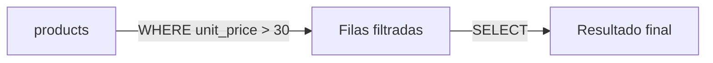
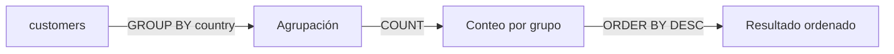
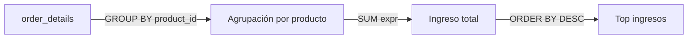
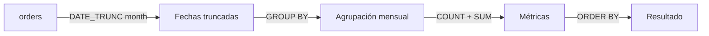
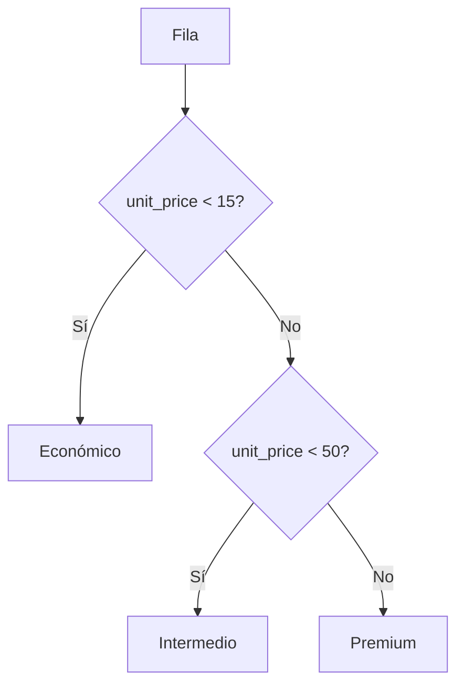
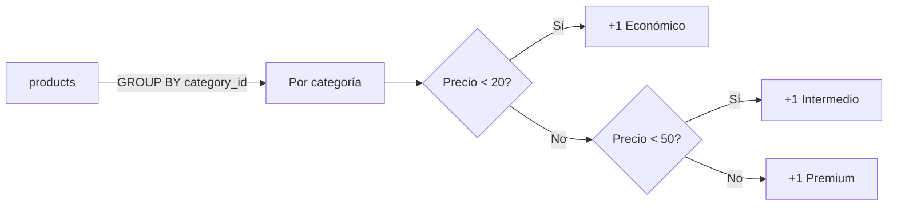
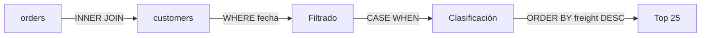

# Libro de Ejercicios SQL - Nivel 1: Básico

> Base de datos: Northwind (PostgreSQL 15+) | 50 ejercicios | Temas: SELECT, WHERE, ORDER BY, LIKE, NULL, GROUP BY, funciones de cadena, fecha, CASE WHEN

---

## Ejercicio 1: Proyección de la Fuerza de Ventas

### 🎓 Explicación del Profesor

**Analogía:** Imagina que tienes un formulario de empleado con 20 campos, pero solo necesitas copiar el nombre, apellido y cargo para un reporte. No vas a copiar todo el formulario, solo lo que necesitas.

**Concepto:** `SELECT` especifica qué columnas quieres ver. Evita `SELECT *` en producción: proyectar solo las columnas necesarias reduce la carga de memoria y el tráfico de red.

> 💡 **Tip del Profesor:** En tablas con 100+ columnas, `SELECT *` puede duplicar el tiempo de respuesta. El error más común es creer que `SELECT *` es más rápido (es más lento porque trae todo).

### Código de Solución

```sql
SELECT
    employee_id,
    last_name,
    first_name,
    title
FROM employees;
```

> 🛠️ **Nota del Ingeniero de Datos:** `SELECT *` fuerza al motor a leer todas las columnas del disco incluso si no las necesitas. En tablas anchas (100+ columnas), esto consume ancho de banda de red y memoria del buffer pool. Siempre proyecta solo las columnas requeridas.

---

## Ejercicio 2: Segmentación de Productos Premium

### 🎓 Explicación del Profesor

**Analogía:** Es como ir al supermercado y solo mirar los productos que cuestan más de $20. No te interesan los baratos.

**Concepto:** `WHERE` filtra filas antes de mostrar resultados. El filtro se aplica después de identificar la tabla en `FROM`.

> 💡 **Tip del Profesor:** `WHERE` se ejecuta antes que `SELECT`. PostgreSQL puede usar un índice en `unit_price` si existe.

### Código de Solución

```sql
SELECT
    product_name,
    unit_price
FROM products
WHERE unit_price > 30;
```

> 🛠️ **Nota del Ingeniero de Datos:** Si existe un índice B-Tree en `unit_price`, el optimizador realizará un Index Range Scan en lugar de un Seq Scan, reduciendo el tiempo de ejecución significativamente en tablas grandes.

### Diagrama de Flujo (Mermaid)


```mermaid
flowchart LR
    A[products] -->|WHERE unit_price > 30| B[Filas filtradas]
    B -->|SELECT| C[Resultado final]
```

---

## Ejercicio 3: Ordenamiento de Pedidos por Fecha

### 🎓 Explicación del Profesor

**Analogía:** Es como ordenar una pila de facturas de la más reciente a la más antigua para encontrar el último pedido.

**Concepto:** `ORDER BY` ordena los resultados. `ASC` (ascendente) es el defecto; `DESC` invierte el orden.

> 💡 **Tip del Profesor:** Ordenar es costoso en `work_mem`. En tablas grandes, limita con `LIMIT`. El error común es poner `DESC` en la columna equivocada.

### Código de Solución

```sql
SELECT
    order_id,
    customer_id,
    order_date
FROM orders
ORDER BY order_date DESC;
```

> 🛠️ **Nota del Ingeniero de Datos:** El ordenamiento requiere memorizar y ordenar todas las filas filtradas antes de entregar resultados. Sin `LIMIT`, PostgreSQL debe ordenar todo el conjunto. Siempre combina `ORDER BY` con `LIMIT` cuando solo necesitas los N primeros registros.

---

## Ejercicio 4: Ranking de Envíos Costosos (Manejo de Nulos)

### 🎓 Explicación del Profesor

**Analogía:** Es como ordenar notas de la más alta a la más baja, pero las notas sin calificar quieres que queden al final, no al principio.

**Concepto:** En PostgreSQL, los nulos se tratan como los valores más "grandes". `NULLS LAST` fuerza que aparezcan al final en orden DESC.

> 💡 **Tip del Profesor:** `NULLS LAST` no afecta el plan de ejecución; es solo presentación. El error común es olvidar `NULLS LAST` y ver nulos primero.

### Código de Solución

```sql
SELECT
    order_id,
    ship_name,
    freight
FROM orders
ORDER BY freight DESC NULLS LAST;
```

---

## Ejercicio 5: Top 5 Productos Más Caros

### 🎓 Explicación del Profesor

**Analogía:** Es como hacer un podio de los 5 más caros: primero los ordenas de mayor a menor, y solo te quedas con los primeros 5.

**Concepto:** Combinar `ORDER BY DESC` con `LIMIT N` obtiene los N valores más altos.

> 💡 **Tip del Profesor:** `LIMIT` es muy eficiente porque el optimizador deja de leer filas después de encontrar N. No uses `TOP 5` (sintaxis de SQL Server, no PostgreSQL).

### Código de Solución

```sql
SELECT
    product_name,
    unit_price
FROM products
ORDER BY unit_price DESC
LIMIT 5;
```

---

## Ejercicio 6: Paginación de Pedidos

### 🎓 Explicación del Profesor

**Analogía:** Es como ver la página 3 de un catálogo: te saltas las primeras 20 páginas y muestras las siguientes 10.

**Concepto:** `LIMIT` define cuántas filas traer; `OFFSET` define cuántas saltar. Se usa en dashboards y APIs REST.

> 💡 **Tip del Profesor:** `OFFSET` alto es lento en tablas grandes (lee y descarta filas). Alternativa: keyset pagination. Recuerda que OFFSET empieza en 0.

### Código de Solución

```sql
SELECT
    order_id,
    order_date,
    customer_id
FROM orders
ORDER BY order_date ASC
LIMIT 10 OFFSET 20;
```

> 🛠️ **Nota del Ingeniero de Datos:** `OFFSET` obliga al motor a leer y descartar las primeras N filas. Con OFFSET 1000, el motor lee 1010 filas y descarta las primeras 1000. Para paginación de alto volumen, usa keyset pagination (`WHERE id > ultimo_id_visto`).

---

## Ejercicio 7: Filtrado Geográfico de Clientes

### 🎓 Explicación del Profesor

**Analogía:** Es como pedir al sistema que solo te muestre clientes de "Latinoamérica", listando los países que incluyes.

**Concepto:** `IN (valor1, valor2, ...)` es equivalente a múltiples `OR` pero más limpio y a veces más rápido.

> 💡 **Tip del Profesor:** PostgreSQL expande `IN` a una serie de `OR` internamente, pero es más legible. No uses `IN` con una sola columna (innecesario, mejor usar `=`).

### Código de Solución

```sql
SELECT
    customer_id,
    company_name,
    country
FROM customers
WHERE country IN ('Germany', 'UK', 'USA')
ORDER BY country, company_name;
```

---

## Ejercicio 8: Rango de Precios de Productos

### 🎓 Explicación del Profesor

**Analogía:** Es como buscar productos en una tienda online con filtro de precio: "entre $15 y $75".

**Concepto:** `BETWEEN a AND b` es equivalente a `>= a AND <= b`. Es inclusivo: incluye los límites.

> 💡 **Tip del Profesor:** `BETWEEN` en columnas indexadas usa Index Range Scan. El error común es creer que BETWEEN es exclusivo (no lo es).

### Código de Solución

```sql
SELECT
    product_id,
    product_name,
    unit_price
FROM products
WHERE unit_price BETWEEN 15 AND 75
ORDER BY unit_price;
```

---

## Ejercicio 9: Pedidos Antiguos (Filtro de Fecha)

### 🎓 Explicación del Profesor

**Analogía:** Es como buscar documentos anteriores a una fecha específica para un archivado.

**Concepto:** Para filtrar fechas, usa formato ISO 8601 (`'YYYY-MM-DD'`). Esto evita errores de interpretación según la configuración regional.

> 💡 **Tip del Profesor:** Si tienes un índice en `order_date`, el filtro es muy rápido. No uses formato de fecha regional (ej. `'01/01/1997'`) que puede fallar.

### Código de Solución

```sql
SELECT
    order_id,
    customer_id,
    order_date
FROM orders
WHERE order_date < '1997-01-01'
ORDER BY order_date;
```

---

## Ejercicio 10: Empleados con Mayor Antigüedad

### 🎓 Explicación del Profesor

**Analogía:** Es como buscar los empleados que entraron antes de cierto año para un plan de beneficios.

**Concepto:** Combinamos concatenación de strings (`||`), filtros de fecha, ordenamiento y límite. La precedencia es: `FROM` -> `WHERE` -> `ORDER BY` -> `LIMIT`.

> 💡 **Tip del Profesor:** `||` es nativo de PostgreSQL; en MySQL usa `CONCAT()`. No uses `+` para concatenar (sintaxis de SQL Server).

### Código de Solución

```sql
SELECT
    employee_id,
    first_name || ' ' || last_name AS empleado,
    title,
    hire_date
FROM employees
WHERE hire_date >= '1993-01-01'
ORDER BY hire_date ASC
LIMIT 10;
```

---

## Ejercicio 11: Búsqueda de Contactos Comerciales

### 🎓 Explicación del Profesor

**Analogía:** Es como buscar en una agenda todos los contactos que tengan "Ventas" en su cargo.

**Concepto:** `LIKE` con `%` busca patrones de texto. `%` significa "cualquier secuencia de caracteres". Si el comodín va al inicio, no puede usar índices B-Tree.

> 💡 **Tip del Profesor:** `LIKE '%texto%'` fuerza Seq Scan. Para búsquedas frecuentes, usa `pg_trgm`. No olvides los `%` si no buscas coincidencia exacta.

### Código de Solución

```sql
SELECT
    company_name,
    contact_name,
    contact_title
FROM customers
WHERE contact_title LIKE '%Sales%'
ORDER BY company_name;
```

> 🛠️ **Nota del Ingeniero de Datos:** `LIKE '%texto%'` (comodín al inicio) impide el uso de índices B-Tree, forzando un Seq Scan completo de la tabla. Para búsquedas de texto frecuentes, considera crear un índice GIN con la extensión `pg_trgm` o usar `ILIKE` con un índice funcional `LOWER(contact_title)`.

---

## Ejercicio 12: Productos por Letra Inicial

### 🎓 Explicación del Profesor

**Analogía:** Es como buscar en un diccionario solo las palabras que empiezan con "C".

**Concepto:** `'C%'` (comodín solo al final) permite que PostgreSQL use Index Range Scan, mucho más rápido que `%C%`.

> 💡 **Tip del Profesor:** `'C%'` puede usar índice; `'%C%'` no puede. La posición del comodín afecta el rendimiento directamente.

### Código de Solución

```sql
SELECT
    product_id,
    product_name,
    unit_price
FROM products
WHERE product_name LIKE 'C%'
ORDER BY product_name;
```

---

## Ejercicio 13: Búsqueda Insensible a Mayúsculas (ILIKE)

### 🎓 Explicación del Profesor

**Analogía:** Es como buscar "manager" sin importar si lo escribieron "Manager", "MANAGER" o "manager".

**Concepto:** `ILIKE` (case-insensitive LIKE) es extensión PostgreSQL. Es ideal para búsquedas donde el usuario no sabe cómo se escribió el dato.

> 💡 **Tip del Profesor:** En MySQL, `LIKE` ya es case-insensitive (depende del collation). No uses `LOWER(title) LIKE '%manager%'` (funcional pero más verboso).

### Código de Solución

```sql
SELECT
    employee_id,
    first_name || ' ' || last_name AS empleado,
    title
FROM employees
WHERE title ILIKE '%manager%';
```

---

## Ejercicio 14: Clientes sin Región Asignada

### 🎓 Explicación del Profesor

**Analogía:** Es como buscar en una base de datos los registros que tienen un campo vacío, como un teléfono sin registrar.

**Concepto:** Para buscar valores nulos, **nunca** uses `= NULL`. Debes usar `IS NULL`. Esto es fundamental: NULL no es igual a nada, ni siquiera a sí mismo.

> 💡 **Tip del Profesor:** Los índices B-Tree generalmente excluyen NULLs. `WHERE region = NULL` siempre retorna vacío.

### Código de Solución

```sql
SELECT
    customer_id,
    company_name,
    city,
    country
FROM customers
WHERE region IS NULL;
```

> 🛠️ **Nota del Ingeniero de Datos:** `NULL` no es un valor, es la ausencia de valor. Por eso `= NULL` nunca funciona: cualquier comparación con NULL retorna `UNKNOWN`. PostgreSQL ofrece `IS NULL` e `IS NOT NULL` como los únicos operadores válidos para NULLs. Los índices B-Tree excluyen NULLs por defecto; si necesitas filtrar NULLs frecuentemente, considera un índice parcial.

---

## Ejercicio 15: Productos con Stock Disponible

### 🎓 Explicación del Profesor

**Analogía:** Es como buscar en un almacén los productos que tienen stock (no están vacíos).

**Concepto:** `IS NOT NULL` filtra registros que tienen contenido. Es la contraparte de `IS NULL`.

> 💡 **Tip del Profesor:** En Northwind, `units_in_stock` siempre tiene valor, pero es buena práctica. No uses `<> NULL` (siempre retorna vacío).

### Código de Solución

```sql
SELECT
    product_name,
    units_in_stock
FROM products
WHERE units_in_stock IS NOT NULL
ORDER BY units_in_stock DESC;
```

---

## Ejercicio 16: Campaña USA y Canadá

### 🎓 Explicación del Profesor

**Analogía:** Es como pedir al sistema que te muestre clientes de dos países específicos.

**Concepto:** `OR` permite combinar condiciones donde al menos una debe cumplirse. Si tienes muchos valores, es mejor usar `IN`.

> 💡 **Tip del Profesor:** `IN` es preferible a múltiples `OR` (más legible, mismo rendimiento). No escribas `country = 'USA' OR 'Canada'` (sintaxis inválida).

### Código de Solución

```sql
SELECT
    customer_id,
    company_name,
    country,
    phone
FROM customers
WHERE country = 'USA'
   OR country = 'Canada'
ORDER BY country, company_name;
```

---

## Ejercicio 17: Productos Activos (No Descontinuados)

### 🎓 Explicación del Profesor

**Analogía:** Es como filtrar un catálogo para mostrar solo los productos que todavía se venden.

**Concepto:** `<>` o `!=` significa "no es igual a". En Northwind, `discontinued` es integer: 0 = activo, 1 = descontinuado.

> 💡 **Tip del Profesor:** Si `discontinued` tiene un índice, el filtro es muy selectivo. `<> 1` es más explícito para "no descontinuado" que `= 0`.

### Código de Solución

```sql
SELECT
    product_id,
    product_name,
    unit_price,
    units_in_stock
FROM products
WHERE discontinued <> 1
ORDER BY product_name;
```

---

## Ejercicio 18: Productos de Alta Rotación y Precio

### 🎓 Explicación del Profesor

**Analogía:** Es como buscar productos que sean caros Y tengan mucho stock: las dos condiciones a la vez.

**Concepto:** `AND` requiere que **ambas** condiciones se cumplan simultáneamente.

> 💡 **Tip del Profesor:** El optimizador evalúa la condición más restrictiva primero. No uses `OR` cuando se necesita `AND` (resultado muy diferente).

### Código de Solución

```sql
SELECT
    product_name,
    unit_price,
    units_in_stock
FROM products
WHERE unit_price > 20
  AND units_in_stock > 50
ORDER BY unit_price DESC;
```

---

## Ejercicio 19: Pedidos con Retraso en Entrega

### 🎓 Explicación del Profesor

**Analogía:** Es como comparar dos fechas para saber si un pedido llegó tarde.

**Concepto:** SQL permite comparar dos columnas de la misma fila. Aquí comparamos `shipped_date` contra `required_date`.

> 💡 **Tip del Profesor:** Si ambas columnas tienen índice, PostgreSQL puede usar Merge Join. No compares fechas con horas cuando solo necesitas la fecha.

### Código de Solución

```sql
SELECT
    order_id,
    customer_id,
    required_date,
    shipped_date
FROM orders
WHERE shipped_date > required_date
ORDER BY shipped_date;
```

---

## Ejercicio 20: Empleados de los 90s (Fuera de USA)

### 🎓 Explicación del Profesor

**Analogía:** Es como buscar empleados de una década específica que no sean de un país determinado.

**Concepto:** Combinamos `BETWEEN` para el rango de fechas y `<>` para excluir el país. Practica la precedencia de operadores lógicos.

> 💡 **Tip del Profesor:** En tablas grandes, el orden de filtros importa (selectividad). No uses `BETWEEN '1990' AND '1999'` (formato incompleto).

### Código de Solución

```sql
SELECT
    employee_id,
    first_name || ' ' || last_name AS empleado,
    title,
    hire_date,
    country
FROM employees
WHERE hire_date BETWEEN '1990-01-01' AND '1999-12-31'
  AND country <> 'USA'
ORDER BY hire_date;
```

---

## Ejercicio 21: Países de Clientes (Sin Repeticiones)

### 🎓 Explicación del Profesor

**Analogía:** Es como sacar una lista de todos los países donde tenemos clientes, sin repetir ninguno.

**Concepto:** `DISTINCT` elimina filas duplicadas del resultado. Internamente, PostgreSQL usa un HashAggregate.

> 💡 **Tip del Profesor:** `DISTINCT` fuerza ordenamiento o hash; en tablas grandes es costoso. No uses `DISTINCT` sin necesidad (ya no hay duplicados).

### Código de Solución

```sql
SELECT DISTINCT
    country
FROM customers
ORDER BY country;
```

---

## Ejercicio 22: Conteo de Clientes por País

### 🎓 Explicación del Profesor

**Analogía:** Es como contar cuántos clientes hay en cada país y ordenar de mayor a menor.

**Concepto:** `GROUP BY` colapsa filas por una columna. `COUNT(*)` cuenta las filas de cada grupo.

> 💡 **Tip del Profesor:** PostgreSQL puede usar HashAggregate o GroupAggregate. No pongas una columna en SELECT que no esté en GROUP BY.

### Código de Solución

```sql
SELECT
    country,
    COUNT(*) AS total_clientes
FROM customers
GROUP BY country
ORDER BY total_clientes DESC;
```

> 🛠️ **Nota del Ingeniero de Datos:** Siempre combina `GROUP BY` con `ORDER BY` en reportes. Sin `GROUP BY`, PostgreSQL no agrupa; sin `ORDER BY`, el orden no está garantizado entre ejecuciones. El optimizador elige HashAggregate (memoria) o GroupAggregate (ordenamiento) según la cardinalidad.

### Diagrama de Flujo (Mermaid)


```mermaid
flowchart LR
    A[customers] -->|GROUP BY country| B[Agrupación]
    B -->|COUNT| B1[Conteo por grupo]
    B1 -->|ORDER BY DESC| C[Resultado ordenado]
```

---

## Ejercicio 23: Valor Total del Inventario

### 🎓 Explicación del Profesor

**Analogía:** Es como calcular cuánto vale todo el stock de una tienda: precio por unidad multiplicado por unidades en stock.

**Concepto:** `SUM` acumula valores. Puedes hacer operaciones aritméticas dentro de la función de agregación.

> 💡 **Tip del Profesor:** Agregaciones sobre columnas numéricas son muy eficientes. Olvidar que NULL propagado hace que SUM retorne NULL.

### Código de Solución

```sql
SELECT
    SUM(unit_price * units_in_stock) AS valorizacion_total
FROM products;
```

> 🛠️ **Nota del Ingeniero de Datos:** Si `unit_price` o `units_in_stock` contienen NULLs, el producto será NULL y `SUM` los ignorará. Usa `COALESCE` para evitar pérdidas de datos: `SUM(COALESCE(unit_price, 0) * COALESCE(units_in_stock, 0))`.

---

## Ejercicio 24: Precio Promedio del Catálogo

### 🎓 Explicación del Profesor

**Analogía:** Es como calcular el precio promedio de todos los productos de una tienda.

**Concepto:** `AVG` calcula la media aritmética. `ROUND` redondea. `AVG` ignora valores NULL automáticamente.

> 💡 **Tip del Profesor:** `::numeric` es necesario para que ROUND funcione correctamente. No olvides el casteo `::numeric` y obtenerás resultados con muchos decimales.

### Código de Solución

```sql
SELECT
    ROUND(AVG(unit_price)::numeric, 2) AS precio_promedio
FROM products;
```

---

## Ejercicio 25: Rango de Precios (Mínimo y Máximo)

### 🎓 Explicación del Profesor

**Analogía:** Es como saber cuál es el producto más barato y el más caro de un catálogo.

**Concepto:** `MIN` y `MAX` son funciones muy eficientes. Si la columna está indexada, PostgreSQL los encuentra casi instantáneamente.

> 💡 **Tip del Profesor:** En índices B-Tree, MIN/MAX son operaciones O(log n). No calcules el rango sin redondear (resultado con muchos decimales).

### Código de Solución

```sql
SELECT
    MIN(unit_price) AS precio_minimo,
    MAX(unit_price) AS precio_maximo,
    ROUND((MAX(unit_price) - MIN(unit_price))::numeric, 2) AS rango
FROM products;
```

---

## Ejercicio 26: Ingresos Netos por Producto

### 🎓 Explicación del Profesor

**Analogía:** Es como calcular cuánto dinero generó cada producto vendido, considerando descuentos.

**Concepto:** Fórmula: `Cantidad * Precio * (1 - Descuento)`. El descuento es un decimal (0.15 = 15%).

> 💡 **Tip del Profesor:** Para 2155 filas, HashAggregate es eficiente. No uses `1 - discount/100` (discount ya es decimal).

### Código de Solución

```sql
SELECT
    product_id,
    SUM(quantity * unit_price * (1 - discount)) AS ingreso_total
FROM order_details
GROUP BY product_id
ORDER BY ingreso_total DESC;
```

### Diagrama de Flujo (Mermaid)


```mermaid
flowchart LR
    A[order_details] -->|GROUP BY product_id| B[Agrupación por producto]
    B -->|SUM expr| C[Ingreso total]
    C -->|ORDER BY DESC| D[Top ingresos]
```

---

## Ejercicio 27: Pedidos con Flete Elevado (Uso de FILTER)

### 🎓 Explicación del Profesor

**Analogía:** Es como contar todos los pedidos, pero también quiero saber cuántos son "caros" de envío, en una sola consulta.

**Concepto:** `FILTER (WHERE ...)` es una joya de PostgreSQL. Permite conteos condicionales sin `CASE WHEN` complejos.

> 💡 **Tip del Profesor:** `FILTER` es más legible que `CASE WHEN` y tiene el mismo plan. No uses `WHERE` en lugar de `FILTER` (no funciona en COUNT).

### Código de Solución

```sql
SELECT
    COUNT(*) AS total_pedidos,
    COUNT(*) FILTER (WHERE freight > 200) AS pedidos_flete_elevado
FROM orders;
```

> 🛠️ **Nota del Ingeniero de Datos:** `FILTER` es una extensión PostgreSQL (no estándar SQL). Es más legible que `CASE WHEN COUNT(CASE WHEN ... THEN 1 END)` y el optimizador genera el mismo plan de ejecución. En MySQL, usa `SUM(CASE WHEN ... THEN 1 ELSE 0 END)` como alternativa.

---

## Ejercicio 28: Promedio de Flete por Año

### 🎓 Explicación del Profesor

**Analogía:** Es como calcular el promedio de gastos de envío por año, pero en una sola fila para comparar fácilmente.

**Concepto:** Combinamos `EXTRACT(YEAR FROM ...)` para obtener el año y `FILTER` para separar promedios por año.

> 💡 **Tip del Profesor:** PostgreSQL evalúa el filtro fila por fila en una sola pasada. No uses subconsultas separadas para cada año (3 scans en vez de 1).

### Código de Solución

```sql
SELECT
    ROUND(AVG(freight) FILTER (WHERE EXTRACT(YEAR FROM order_date) = 1996)::numeric, 2) AS flete_promedio_1996,
    ROUND(AVG(freight) FILTER (WHERE EXTRACT(YEAR FROM order_date) = 1997)::numeric, 2) AS flete_promedio_1997,
    ROUND(AVG(freight) FILTER (WHERE EXTRACT(YEAR FROM order_date) = 1998)::numeric, 2) AS flete_promedio_1998
FROM orders;
```

> 🛠️ **Nota del Ingeniero de Datos:** `EXTRACT(YEAR FROM ...)` es una función inmutable, pero aplicarla a cada fila puede impedir el uso de índices en `order_date`. Para pivoteo de alto volumen, considera pre-calcular el año en una columna generada indexada.

---

## Ejercicio 29: Territorios por Empleado

### 🎓 Explicación del Profesor

**Analogía:** Es como contar cuántos territorios tiene asignado cada vendedor, y destacar los que tienen territorios en la costa este.

**Concepto:** `GROUP BY` y `FILTER` simultáneamente permiten obtener métricas generales y segmentadas en un solo paso.

> 💡 **Tip del Profesor:** `LIKE '0%'` puede usar índice si existe. No saber que FILTER es exclusivo de PostgreSQL.

### Código de Solución

```sql
SELECT
    employee_id,
    COUNT(*) AS total_territorios,
    COUNT(*) FILTER (WHERE territory_id LIKE '0%') AS territorios_costa_este
FROM employee_territories
GROUP BY employee_id
ORDER BY total_territorios DESC;
```

---

## Ejercicio 30: Métricas de Precios por Categoría

### 🎓 Explicación del Profesor

**Analogía:** Es como generar un reporte estadístico de precios por tipo de producto: total, cuántos son caros, y promedio.

**Concepto:** Ejercicio de consolidación: múltiples funciones de agregación con FILTER sobre un GROUP BY.

> 💡 **Tip del Profesor:** En PostgreSQL 15+, FILTER es igual de rápido que CASE WHEN. No mezcles `FILTER` en `WHERE` (solo va en funciones de agregación).

### Código de Solución

```sql
SELECT
    category_id,
    COUNT(*) AS total_productos,
    COUNT(*) FILTER (WHERE unit_price > 50) AS productos_premium,
    ROUND(AVG(unit_price)::numeric, 2) AS precio_promedio,
    ROUND(AVG(unit_price) FILTER (WHERE units_in_stock > 0)::numeric, 2) AS precio_promedio_stock_disponible
FROM products
GROUP BY category_id
ORDER BY category_id;
```

> 🛠️ **Nota del Ingeniero de Datos:** `FILTER` y `CASE WHEN` dentro de agregaciones generan el mismo plan de ejecución. `FILTER` es preferible por legibilidad. Cuando necesites filtrar filas antes de la agregación, usa `WHERE`; para agregación condicional, usa `FILTER`.

---

## Ejercicio 31: Clientes por Ciudad y País (COUNT DISTINCT)

### 🎓 Explicación del Profesor

**Analogía:** Es como saber cuántos clientes hay en cada ciudad, sin contar dos veces al mismo cliente si aparece en varios registros.

**Concepto:** `COUNT(DISTINCT columna)` cuenta valores únicos. Sin DISTINCT, contaría todas las filas del grupo.

> 💡 **Tip del Profesor:** `COUNT(DISTINCT ...)` es más costoso que `COUNT(*)`. No olvides DISTINCT y contarás filas duplicadas.

### Código de Solución

```sql
SELECT
    country,
    city,
    COUNT(DISTINCT customer_id) AS total_clientes
FROM customers
GROUP BY country, city
HAVING COUNT(DISTINCT customer_id) > 1
ORDER BY total_clientes DESC;
```

---

## Ejercicio 32: Expresiones en SELECT (Cálculos Derivados)

### 🎓 Explicación del Profesor

**Analogía:** Es como calcular automáticamente el valor de un pedido: cantidad por precio unitario, sin modificar los datos originales.

**Concepto:** Puedes usar expresiones aritméticas directamente en SELECT. No modifican los datos; son cálculos en tiempo de consulta.

> 💡 **Tip del Profesor:** Las expresiones se evalúan en CPU, no en disco. No creas que la columna calculada se almacena (no, es temporal).

### Código de Solución

```sql
SELECT
    product_name,
    unit_price,
    units_in_stock,
    unit_price * units_in_stock AS valor_inventario,
    ROUND((unit_price * 1.10)::numeric, 2) AS precio_con_10_pct_aumento
FROM products
WHERE discontinued = 0
ORDER BY valor_inventario DESC;
```

---

## Ejercicio 33: Aliases Descriptivos

### 🎓 Explicación del Profesor

**Analogía:** Es como ponerle nombre bonito a las columnas de un reporte para que el gerente entienda qué significa cada número.

**Concepto:** `AS alias` renombra columnas temporalmente. Es obligatorio para columnas calculadas y recomendado siempre para legibilidad.

> 💡 **Tip del Profesor:** Los aliases no afectan el rendimiento; son solo presentación. No uses alias sin `AS` (funciona, pero es menos legible).

### Código de Solución

```sql
SELECT
    product_name AS "Nombre del Producto",
    unit_price AS "Precio Unitario ($)",
    units_in_stock AS "Unidades en Stock",
    category_id AS "ID Categoría"
FROM products
WHERE discontinued = 0
ORDER BY unit_price DESC;
```

---

## Ejercicio 34: Manejo de Nulos con COALESCE

### 🎓 Explicación del Profesor

**Analogía:** Es como decir "si no tienes precio, ponle cero" para que los cálculos no se rompan.

**Concepto:** `COALESCE(valor1, valor2)` retorna el primer valor no nulo. Es fundamental para evitar NULLs en cálculos.

> 💡 **Tip del Profesor:** COALESCE es una función pura; el optimizador la evalúa en CPU. No uses `IFNULL` (MySQL) en lugar de `COALESCE` (estándar SQL).

### Código de Solución

```sql
SELECT
    product_name,
    COALESCE(unit_price, 0) AS precio_seguro,
    COALESCE(units_in_stock, 0) AS stock_seguro,
    COALESCE(unit_price, 0) * COALESCE(units_in_stock, 0) AS valor_inventario
FROM products
ORDER BY valor_inventario DESC;
```

> 🛠️ **Nota del Ingeniero de Datos:** Siempre usa `COALESCE` al multiplicar o sumar columnas que pueden contener NULLs. Sin COALESCE, cualquier NULL en la operación propagará NULL al resultado final, perdiendo datos válidos.

---

## Ejercicio 35: Funciones de Cadena - LENGTH y UPPER

### 🎓 Explicación del Profesor

**Analogía:** Es como medir la longitud de un nombre y convertirlo todo a mayúsculas para un reporte formal.

**Concepto:** `LENGTH()` cuenta caracteres; `UPPER()` convierte a mayúsculas. Ambas son útiles para limpieza de datos.

> 💡 **Tip del Profesor:** Funciones en columnas impiden uso de índices (salvo índices funcionales). No uses `LEN()` (SQL Server) en lugar de `LENGTH()` (PostgreSQL).

### Código de Solución

```sql
SELECT
    product_name,
    LENGTH(product_name) AS longitud_nombre,
    UPPER(product_name) AS nombre_mayusculas,
    contact_name AS contacto
FROM products p
INNER JOIN suppliers s ON p.supplier_id = s.supplier_id
ORDER BY longitud_nombre DESC;
```

> 🛠️ **Nota del Ingeniero de Datos:** Aplicar `LENGTH()` o `UPPER()` a una columna impide el uso de índices B-Tree estándar. Si necesitas filtros frecuentes por longitud o case-insensitive, crea un índice funcional: `CREATE INDEX idx_upper_name ON products (UPPER(product_name))`.

---

## Ejercicio 36: Funciones de Cadena - LOWER y TRIM

### 🎓 Explicación del Profesor

**Analogía:** Es como limpiar texto: quitar espacios de más y convertir todo a minúsculas para comparar.

**Concepto:** `LOWER()` convierte a minúsculas; `TRIM()` elimina espacios al inicio y final. Útiles para estandarizar datos.

> 💡 **Tip del Profesor:** TRIM es O(n) donde n es la longitud del string. No notarás que algunos nombres tienen espacios extra al final.

### Código de Solución

```sql
SELECT
    company_name,
    LOWER(company_name) AS nombre_minusculas,
    TRIM(company_name) AS nombre_limpio,
    LENGTH(company_name) AS largo_original,
    LENGTH(TRIM(company_name)) AS largo_sin_espacios
FROM customers
WHERE country = 'Germany'
ORDER BY company_name;
```

---

## Ejercicio 37: Función SUBSTRING

### 🎓 Explicación del Profesor

**Analogía:** Es como extraer los primeros 3 caracteres de un código de producto para saber la categoría.

**Concepto:** `SUBSTRING(string, inicio, longitud)` extrae parte de un texto. La posición empieza en 1.

> 💡 **Tip del Profesor:** `LEFT(string, n)` es equivalente a `SUBSTRING(string FROM 1 FOR n)`. No empieces en posición 0 (SQL empieza en 1).

### Código de Solución

```sql
SELECT
    customer_id,
    company_name,
    SUBSTRING(customer_id FROM 1 FOR 2) AS prefijo_cliente,
    LEFT(customer_id, 1) AS primera_letra
FROM customers
ORDER BY customer_id;
```

---

## Ejercicio 38: Concatenación de Cadenas con ||

### 🎓 Explicación del Profesor

**Analogía:** Es como armar una dirección completa juntando calle, ciudad y país con guiones.

**Concepto:** `||` es el operador de concatenación estándar de PostgreSQL. Es más limpio que CONCAT() para pocos campos.

> 💡 **Tip del Profesor:** `||` es más rápido que `CONCAT()` en PostgreSQL. No uses `CONCAT()` sin saber que `||` es nativo.

### Código de Solución

```sql
SELECT
    first_name || ' ' || last_name AS nombre_completo,
    title || ' - ' || city AS cargo_ubicacion,
    COALESCE(region || ', ', '') || country AS ubicacion_completa
FROM employees
ORDER BY last_name;
```

---

## Ejercicio 39: Funciones de Fecha - EXTRACT

### 🎓 Explicación del Profesor

**Analogía:** Es como sacar el año, mes o día de una fecha para agrupar información.

**Concepto:** `EXTRACT(componente FROM fecha)` extrae partes de una fecha. Retorna un número.

> 💡 **Tip del Profesor:** `ISODOW` retorna 1=Lunes ... 7=Domingo (más intuitivo que `DOW`). No uses `DOW` (0=Domingo, confuso).

### Código de Solución

```sql
SELECT
    order_id,
    order_date,
    EXTRACT(YEAR FROM order_date) AS anio,
    EXTRACT(MONTH FROM order_date) AS mes,
    EXTRACT(DAY FROM order_date) AS dia,
    EXTRACT(ISODOW FROM order_date) AS dia_semana
FROM orders
WHERE order_date >= '1997-01-01'
ORDER BY order_date
LIMIT 10;
```

> 🛠️ **Nota del Ingeniero de Datos:** `EXTRACT` es una función inmutable, pero aplicarla a columnas puede impedir el uso de índices. Para consultas frecuentes, considera crear columnas generadas (generated columns) con el año/mes pre-calculado e indexadas.

---

## Ejercicio 40: Funciones de Fecha - DATE_TRUNC

### 🎓 Explicación del Profesor

**Analogía:** Es como redondear una fecha al mes o al año: "1997-03-15" se convierte en "1997-03-01".

**Concepto:** `DATE_TRUNC('unidad', fecha)` trunca la fecha a la unidad específica. Retorna timestamp.

> 💡 **Tip del Profesor:** `DATE_TRUNC` en columna indexada impide uso de índice. Olvidar que retorna timestamp (agrega horas: `1997-03-01 00:00:00`).

### Código de Solución

```sql
SELECT
    DATE_TRUNC('month', order_date) AS mes_truncado,
    COUNT(*) AS total_pedidos,
    ROUND(SUM(freight)::numeric, 2) AS total_flete
FROM orders
GROUP BY DATE_TRUNC('month', order_date)
ORDER BY mes_truncado;
```

### Diagrama de Flujo (Mermaid)


```mermaid
flowchart LR
    A[orders] -->|DATE_TRUNC month| B[Fechas truncadas]
    B -->|GROUP BY| C[Agrupación mensual]
    C -->|COUNT + SUM| D[Métricas]
    D -->|ORDER BY| E[Resultado]
```

---

## Ejercicio 41: Función AGE y Cálculo de Antigüedad

### 🎓 Explicación del Profesor

**Analogía:** Es como calcular cuántos años lleva un empleado en la empresa automáticamente.

**Concepto:** `AGE(fecha)` retorna la diferencia entre la fecha actual y la fecha proporcionada como intervalo.

> 💡 **Tip del Profesor:** `AGE()` es immutable; PostgreSQL puede cachear resultados. No calcules antiguedad como `EXTRACT(YEAR FROM CURRENT_DATE) - EXTRACT(YEAR FROM hire_date)` (ignora mes/día).

### Código de Solución

```sql
SELECT
    first_name || ' ' || last_name AS empleado,
    hire_date,
    AGE(CURRENT_DATE, hire_date) AS antiguedad_intervalo,
    EXTRACT(YEAR FROM AGE(hire_date)) AS anos_en_empresa,
    CASE
        WHEN EXTRACT(YEAR FROM AGE(hire_date)) >= 10 THEN 'Veterano'
        WHEN EXTRACT(YEAR FROM AGE(hire_date)) >= 5 THEN 'Experimentado'
        ELSE 'Nuevo'
    END AS categoria
FROM employees
ORDER BY hire_date;
```

---

## Ejercicio 42: CURRENT_DATE e INTERVALS

### 🎓 Explicación del Profesor

**Analogía:** Es como preguntar "qué fecha es hoy?" y "cuántos días son 3 meses?".

**Concepto:** `CURRENT_DATE` retorna la fecha actual. `INTERVAL` permite sumar/restar tiempo a fechas.

> 💡 **Tip del Profesor:** Operaciones con fechas son computacionales, no afectan plan de ejecución. No sumes días como números enteros sin INTERVAL.

### Código de Solución

```sql
SELECT
    CURRENT_DATE AS fecha_hoy,
    CURRENT_DATE - INTERVAL '30 days' AS hace_30_dias,
    CURRENT_DATE + INTERVAL '3 months' AS en_3_meses,
    AGE(CURRENT_DATE, '1997-01-01') AS tiempo_desde_northwind
;
```

---

## Ejercicio 43: TO_CHAR para Formateo de Fechas

### 🎓 Explicación del Profesor

**Analogía:** Es como ponerle formato bonito a una fecha: "15 de Marzo de 1997" en lugar de "1997-03-15".

**Concepto:** `TO_CHAR(fecha, formato)` convierte fecha a texto con formato personalizado.

> 💡 **Tip del Profesor:** `TO_CHAR` es para presentación; para filtros, usa formato ISO. No uses formato de MySQL (`DATE_FORMAT`) en lugar de `TO_CHAR`.

### Código de Solución

```sql
SELECT
    order_id,
    TO_CHAR(order_date, 'DD/MM/YYYY') AS fecha_corta,
    TO_CHAR(order_date, 'Day, DD de Month YYYY') AS fecha_larga,
    TO_CHAR(order_date, 'Month YYYY') AS mes_ano
FROM orders
WHERE order_date >= '1997-06-01'
ORDER BY order_date
LIMIT 10;
```

---

## Ejercicio 44: CASE WHEN Simple - Clasificación de Precios

### 🎓 Explicación del Profesor

**Analogía:** Es como poner etiquetas a los productos: "barato", "normal" o "caro" según su precio.

**Concepto:** `CASE WHEN condicion THEN resultado ... END` permite lógica condicional. Evalúa de arriba a abajo y retorna la primera coincidencia.

> 💡 **Tip del Profesor:** CASE se evalúa en CPU durante la proyección; sin impacto en disco. El orden de las condiciones importa (primera coincidencia gana).

### Código de Solución

```sql
SELECT
    product_name,
    unit_price,
    CASE
        WHEN unit_price < 15 THEN 'Económico'
        WHEN unit_price < 50 THEN 'Intermedio'
        ELSE 'Premium'
    END AS categoria_precio
FROM products
WHERE discontinued = 0
ORDER BY unit_price;
```

### Diagrama de Flujo (Mermaid)


```mermaid
flowchart TD
    A[Fila] --> B{unit_price < 15?}
    B -->|Sí| C[Económico]
    B -->|No| D{unit_price < 50?}
    D -->|Sí| E[Intermedio]
    D -->|No| F[Premium]
```

---

## Ejercicio 45: CASE WHEN en GROUP BY - Pivote Básico

### 🎓 Explicación del Profesor

**Analogía:** Es como separar productos en grupos por precio y contar cuántos hay en cada grupo, todo en una sola tabla.

**Concepto:** `CASE` dentro de `SUM` permite crear columnas condicionales. Es el patrón básico de pivoteo (filas a columnas).

> 💡 **Tip del Profesor:** Es más eficiente que hacer 3 consultas separadas. No uses `COUNT(CASE ...)` que cuenta NULLs también (usa `SUM` con 1/0).

### Código de Solución

```sql
SELECT
    category_id,
    COUNT(*) AS total_productos,
    SUM(CASE WHEN unit_price < 20 THEN 1 ELSE 0 END) AS economicos,
    SUM(CASE WHEN unit_price >= 20 AND unit_price < 50 THEN 1 ELSE 0 END) AS intermedios,
    SUM(CASE WHEN unit_price >= 50 THEN 1 ELSE 0 END) AS premium
FROM products
WHERE discontinued = 0
GROUP BY category_id
ORDER BY category_id;
```

### Diagrama de Flujo (Mermaid)


```mermaid
flowchart LR
    A[products] -->|GROUP BY category_id| B[Por categoría]
    B --> C{Precio < 20?}
    C -->|Sí| D[+1 Económico]
    C -->|No| E{Precio < 50?}
    E -->|Sí| F[+1 Intermedio]
    E -->|No| G[+1 Premium]
```

---

## Ejercicio 46: CASE WHEN con BETWEEN - Rangos de Fechas

### 🎓 Explicación del Profesor

**Analogía:** Es como clasificar pedidos por trimestre automáticamente.

**Concepto:** `CASE` con `BETWEEN` permite clasificar registros en rangos de fechas.

> 💡 **Tip del Profesor:** La expresión se evalúa por cada fila; en 830 pedidos es instantáneo. No uses `BETWEEN 1 AND 3` para meses sin saber que enero es 1.

### Código de Solución

```sql
SELECT
    order_id,
    order_date,
    EXTRACT(QUARTER FROM order_date) AS trimestre,
    CASE
        WHEN EXTRACT(MONTH FROM order_date) BETWEEN 1 AND 3 THEN 'Enero-Marzo'
        WHEN EXTRACT(MONTH FROM order_date) BETWEEN 4 AND 6 THEN 'Abril-Junio'
        WHEN EXTRACT(MONTH FROM order_date) BETWEEN 7 AND 9 THEN 'Julio-Septiembre'
        ELSE 'Octubre-Diciembre'
    END AS periodo,
    freight
FROM orders
WHERE EXTRACT(YEAR FROM order_date) = 1997
ORDER BY order_date;
```

> 🛠️ **Nota del Ingeniero de Datos:** `CASE WHEN` se evalúa por cada fila durante la proyección. Para volúmenes grandes (millones de filas), el costo es O(n) en CPU. No hay impacto en disco ni en índices, pero en resultados masivos considera pre-calcular clasificaciones en columnas generadas.

---

## Ejercicio 47: CASE WHEN en ORDER BY - Ordenamiento Personalizado

### 🎓 Explicación del Profesor

**Analogía:** Es como decir "primero muéstame los pedidos urgentes, luego los normales, y al final los lentos".

**Concepto:** `CASE` dentro de `ORDER BY` crea un orden personalizado que no sigue el orden alfabético ni numérico.

> 💡 **Tip del Profesor:** La expresión se evalúa antes del sort y se almacena como clave. No repitas el CASE en SELECT y ORDER BY (se evalúa dos veces).

### Código de Solución

```sql
SELECT
    order_id,
    customer_id,
    order_date,
    shipped_date,
    CASE
        WHEN shipped_date IS NULL THEN 1
        WHEN shipped_date <= required_date THEN 2
        ELSE 3
    END AS prioridad_envio,
    CASE
        WHEN shipped_date IS NULL THEN 'Pendiente'
        WHEN shipped_date <= required_date THEN 'A tiempo'
        ELSE 'Con retraso'
    END AS estado_envio
FROM orders
WHERE EXTRACT(YEAR FROM order_date) = 1997
ORDER BY
    CASE
        WHEN shipped_date IS NULL THEN 1
        WHEN shipped_date <= required_date THEN 2
        ELSE 3
    END,
    order_date;
```

---

## Ejercicio 48: CASE con NULL - Manejo de Valores Faltantes

### 🎓 Explicación del Profesor

**Analogía:** Es como decir "si no hay teléfono, muestra 'No registrado'; si hay, muestra el número".

**Concepto:** `CASE WHEN ... IS NULL` permite manejar valores faltantes de forma explícita y segura.

> 💡 **Tip del Profesor:** COALESCE es más conciso que CASE para casos simples. No uses `IFNULL` (MySQL) en lugar de `COALESCE` o `CASE`.

### Código de Solución

```sql
SELECT
    customer_id,
    company_name,
    CASE
        WHEN region IS NULL THEN 'Sin región'
        ELSE region
    END AS region_completa,
    CASE
        WHEN fax IS NOT NULL THEN fax
        WHEN phone IS NOT NULL THEN phone
        ELSE 'Sin contacto'
    END AS mejor_contacto
FROM customers
WHERE country = 'Germany'
ORDER BY company_name;
```

---

## Ejercicio 49: Ejercicio Integrador - Catálogo de Productos

### 🎓 Explicación del Profesor

**Analogía:** Es como generar un reporte completo de productos con toda la información que un gerente necesita ver.

**Concepto:** Combina todo lo aprendido: SELECT, WHERE, ORDER BY, expresiones, COALESCE, CASE, funciones de cadena.

> 💡 **Tip del Profesor:** Usar alias de tabla (`p.`) mejora legibilidad y evita ambigüedad. No mezcles conceptos de niveles diferentes en una sola consulta.

### Código de Solución

```sql
SELECT
    p.product_id,
    UPPER(p.product_name) AS nombre_producto,
    p.unit_price AS precio_actual,
    COALESCE(p.units_in_stock, 0) AS stock,
    COALESCE(p.unit_price, 0) * COALESCE(p.units_in_stock, 0) AS valor_inventario,
    LENGTH(p.product_name) AS largo_nombre,
    CASE
        WHEN p.discontinued = 0 THEN 'Activo'
        ELSE 'Descontinuado'
    END AS estado,
    CASE
        WHEN p.unit_price < 20 THEN 'Económico'
        WHEN p.unit_price < 50 THEN 'Normal'
        ELSE 'Premium'
    END AS categoria
FROM products p
WHERE p.discontinued = 0
ORDER BY p.unit_price DESC
LIMIT 20;
```

---

## Ejercicio 50: Ejercicio Integrador - Reporte de Pedidos

### 🎓 Explicación del Profesor

**Analogía:** Es como generar el reporte mensual de ventas para el gerente general: todo en una sola vista.

**Concepto:** Combina: SELECT con alias, WHERE con múltiples filtros, ORDER BY, LIMIT, expresiones aritméticas, COALESCE y CASE.

> 💡 **Tip del Profesor:** Este ejercicio usa INNER JOIN (introductorio); en nivel intermedio se profundiza. No manejar NULLs en `ship_country` con COALESCE.

### Código de Solución

```sql
SELECT
    o.order_id,
    o.order_date,
    c.company_name AS cliente,
    COALESCE(o.ship_country, 'No especificado') AS pais_destino,
    o.freight AS flete,
    ROUND(o.freight * 1.19, 2) AS flete_con_igv,
    CASE
        WHEN o.freight > 500 THEN 'Alto'
        WHEN o.freight > 100 THEN 'Medio'
        ELSE 'Bajo'
    END AS categoria_flete,
    CASE
        WHEN o.shipped_date IS NULL THEN 'Pendiente'
        WHEN o.shipped_date <= o.required_date THEN 'A tiempo'
        ELSE 'Retrasado'
    END AS estado_envio
FROM orders o
INNER JOIN customers c ON o.customer_id = c.customer_id
WHERE o.order_date >= '1997-01-01'
  AND o.order_date < '1998-01-01'
ORDER BY o.freight DESC
LIMIT 25;
```

> 🛠️ **Nota del Ingeniero de Datos:** `INNER JOIN` solo retorna filas con coincidencia en ambas tablas. Si necesitas todos los pedidos (aunque no tengan cliente), usa `LEFT JOIN`. El filtro `order_date >= '1997-01-01' AND order_date < '1998-01-01'` es seguro para índices; `BETWEEN '1997-01-01' AND '1997-12-31'` puede fallar si `order_date` tiene componente de hora.

### Diagrama de Flujo (Mermaid)


```mermaid
flowchart LR
    A[orders] -->|INNER JOIN| B[customers]
    B -->|WHERE fecha| C[Filtrado]
    C -->|CASE WHEN| D[Clasificación]
    D -->|ORDER BY freight DESC| E[Top 25]
```

---

## Resumen de Temas Cubiertos

| Ejercicios | Temas | Columnas clave |
|------------|-------|----------------|
| 1-6 | SELECT, WHERE, ORDER BY, LIMIT, OFFSET | employees, products, orders |
| 7-10 | IN, BETWEEN, filtros de fecha | customers, products, employees |
| 11-13 | LIKE, ILIKE, comodines de texto | customers, products, employees |
| 14-15 | IS NULL, IS NOT NULL | customers, products |
| 16-20 | OR, AND, desigualdad, comparaciones | customers, products, orders |
| 21-22 | DISTINCT, GROUP BY básico | customers |
| 23-26 | SUM, AVG, MIN, MAX, expresiones | products, order_details |
| 27-30 | FILTER, EXTRACT, GROUP BY + FILTER | orders, employee_territories, products |
| 31-34 | COUNT(DISTINCT), expresiones, aliases, COALESCE | customers, products |
| 35-38 | LENGTH, UPPER, LOWER, TRIM, SUBSTRING, \|\| | products, customers, employees |
| 39-43 | EXTRACT, DATE_TRUNC, AGE, CURRENT_DATE, TO_CHAR | orders, employees |
| 44-48 | CASE WHEN (simple, en GROUP BY, ORDER BY, NULL) | products, orders, customers |
| 49-50 | Ejercicios integradores | products, orders, customers |
