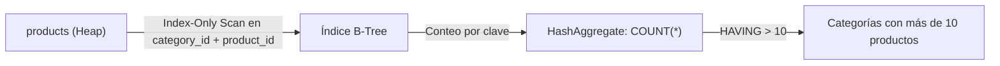
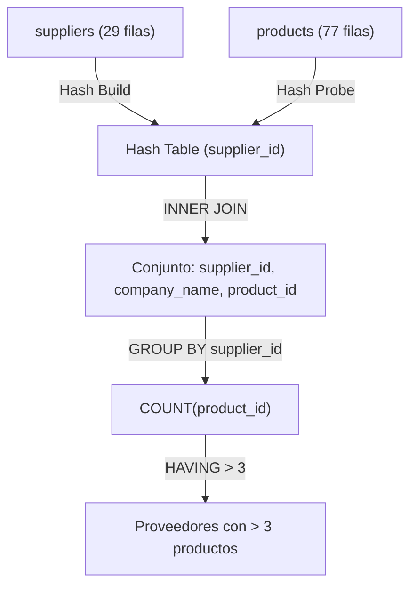
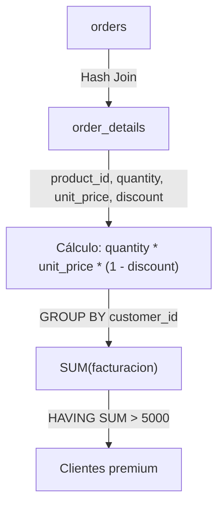
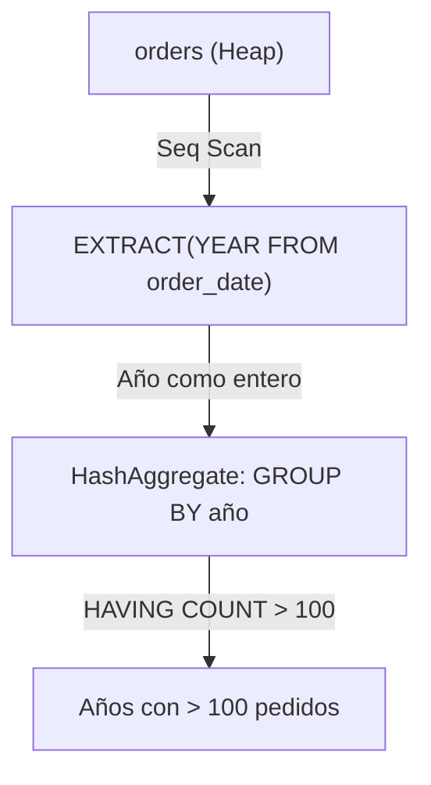
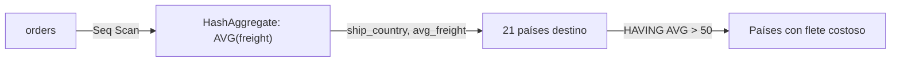
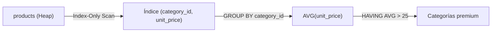
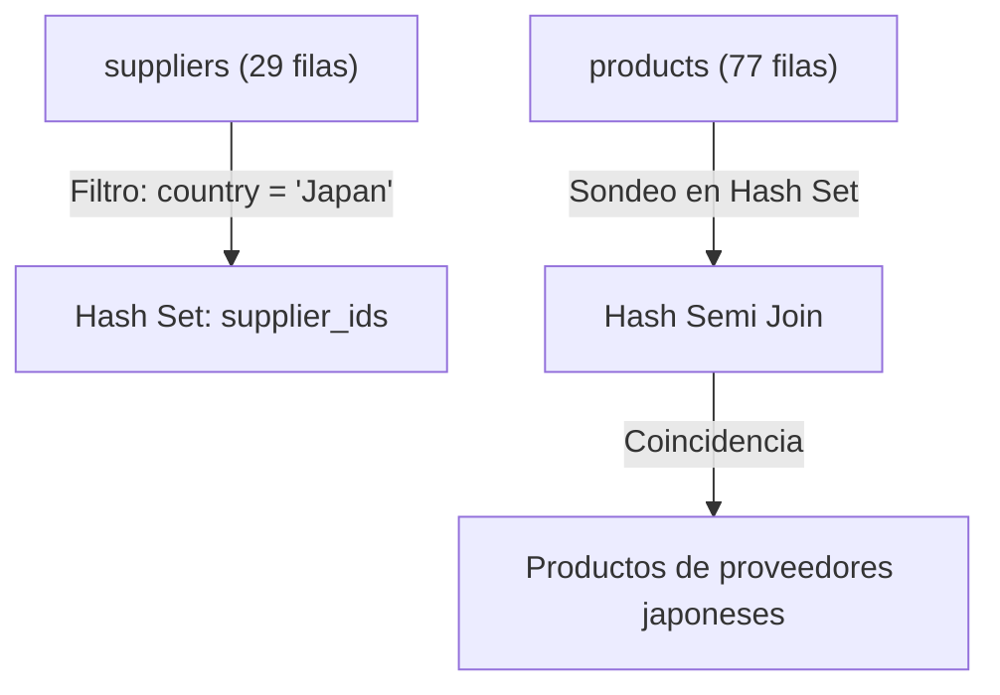
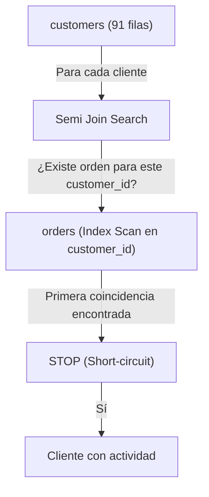
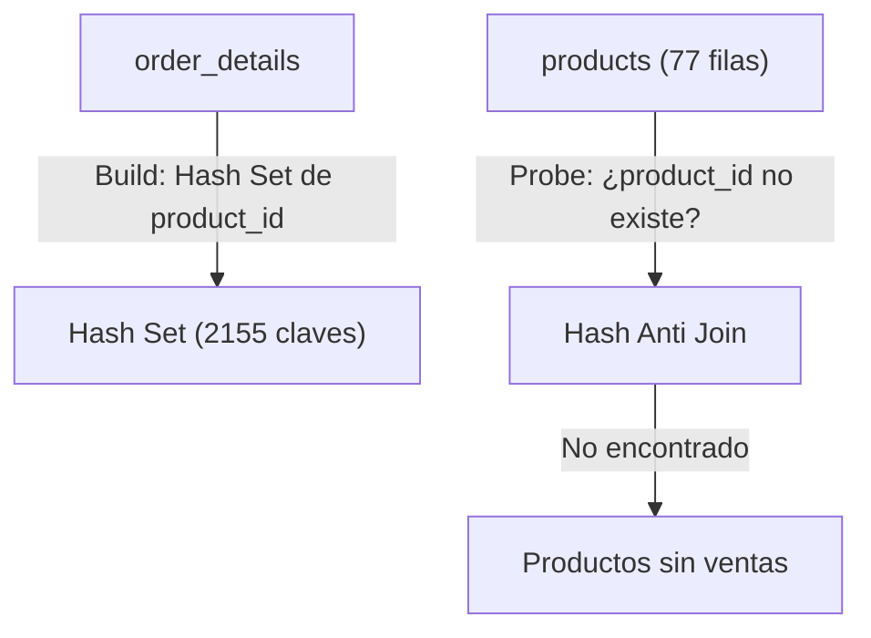
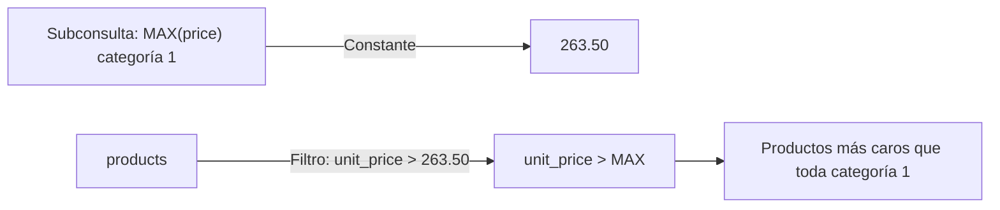

# Libro de Ejercicios SQL - Nivel 2: Intermedio

> Base de datos: Northwind (PostgreSQL 15+) | 50 ejercicios | Temas: GROUP BY avanzado, HAVING, Subconsultas, CASE, SELF JOIN, FULL JOIN

---

## Ejercicio 1: Concentracion de Clientes por Pais - Reporting Comercial

### Analogia
> **La analogia del supermercado:**
> Imagina que quieres saber cuantos clientes hay en cada pais, pero solo te interesan los paises con mas de 5 clientes. Es como contar personas por zona y quedarte solo con las zonas concurridas.

### 1. Marco Conceptual del Optimizador

La cláusula `GROUP BY country` fuerza a PostgreSQL a elegir entre dos algoritmos físicos de agregación: **HashAggregate** (construye una tabla hash en `work_mem` con clave `country`) o **GroupAggregate** (ordena primero por `country` y luego agrupa linealmente). Para una tabla de 91 filas con baja cardinalidad (≈21 países), HashAggregate es la estrategia óptima. El filtro posterior con `HAVING COUNT(*) > 5` descarta grupos enteros en la fase de post-agregación, reduciendo el conjunto antes de la proyección final.

### 2. Diagrama de Flujo de Datos

```mermaid
flowchart TD
    C["customers (91 filas)"] -->|Seq Scan / Lectura Heap| Agg["HashAggregate (work_mem)"]
    Agg -->|Clave: country, Acumulador: COUNT(*)| Groups["Grupos: 21 países"]
    Groups -->|HAVING COUNT(*) > 5| Filtered["Países con > 5 clientes"]
    Filtered -->|ORDER BY total DESC| Out["Reporte ordenado descendentemente"]
```

### 3. Código de Solución

```sql
SELECT 
    country,
    COUNT(*) AS total_clientes
FROM customers
GROUP BY country
HAVING COUNT(*) > 5
ORDER BY total_clientes DESC;
```

### 4. Criterio de Evaluación del Entrevistador

El entrevistador evalua si el candidato diferencia el momento de ejecucion de `WHERE` (pre-agregacion) vs `HAVING` (post-agregacion). Error grave: usar `WHERE COUNT(*) > 5`, que lanza `ERROR: aggregate function calls cannot be used in WHERE`.

### Tip del Profesor
- **Performance:** En PostgreSQL 15+, HAVING puede referenciar alias de SELECT (`HAVING total_clientes > 5`), pero no es portable a otros SGBD.
- **MySQL vs PostgreSQL:** MySQL permite HAVING sin GROUP BY (comportamiento no estandar). PostgreSQL es estricto.
- **Error comun:** Usar WHERE para filtrar agregaciones. Recuerda: WHERE filtra filas, HAVING filtra grupos.

---

## Ejercicio 2: Densidad de Productos por Categoria - Gestion de Catalogo

### Analogia
> **La analogia del armario:**
> Es como abrir tu armario y contar cuantas camisas hay de cada tipo (formal, casual, deporte), pero solo mostrar las categorias con mas de 10 prendas.

### 1. Marco Conceptual del Optimizador

`GROUP BY category_id` sobre la tabla `products` (77 filas, 8 categorías) fuerza una agregación por clave foránea. El optimizador lee secuencialmente la tabla, extrayendo `category_id` y `product_id` (tupla de ancho mínimo), y aplica HashAggregate. `HAVING COUNT(*) > 10` retiene solo categorías con alta densidad de SKUs. Si existe un índice en `products(category_id)`, PostgreSQL puede realizar un *Index-Only Scan* para leer solo la clave, evitando el Heap.

### 2. Diagrama de Flujo de Datos



### 3. Código de Solución

```sql
SELECT 
    category_id,
    COUNT(*) AS total_productos
FROM products
GROUP BY category_id
HAVING COUNT(*) > 10
ORDER BY total_productos DESC;
```

### 4. Criterio de Evaluación del Entrevistador

Mide si el candidato comprende que `GROUP BY` sobre FK indexadas permite Index-Only Scan (sin tocar el Heap). Candidatos junior ignoran esta optimizacion de cobertura.

### Tip del Profesor
- **Performance:** Si existe un indice compuesto en `(category_id, product_id)`, PostgreSQL puede hacer Index-Only Scan (sin leer el Heap).
- **Error comun:** Proyectar `category_name` sin incluirlo en GROUP BY ni hacer JOIN con categories.

---

## Ejercicio 3: Productividad de la Fuerza de Ventas - Empleados con Mayor Volumen

### Analogia
> **La analogia del equipo de ventas:**
> Es como querer saber que vendedores tienen mas de 80 pedidos cerrados. No te interesan los novatos; solo los que realmente mueven producto.

### 1. Marco Conceptual del Optimizador

La consulta agrupa `orders` por `employee_id` (830 filas, 9 empleados). El optimizador lee secuencialmente la tabla transaccional, proyecta solo `employee_id` y `order_id` (tupla angosta), y acumula el contador. `HAVING COUNT(order_id) > 80` filtra los 3 empleados top. El planificador puede optar por GroupAggregate si `orders` está físicamente ordenada por `employee_id`.

### 2. Diagrama de Flujo de Datos

```mermaid
flowchart TD
    O["orders (Seq Scan)"] -->|Proyecto employee_id, order_id| Agg["GroupAggregate / HashAggregate"]
    Agg -->|employee_id, COUNT(*)| Groups["9 grupos (uno por empleado)"]
    Groups -->|HAVING COUNT(*) > 80| Top["Empleados con > 80 pedidos"]
    Top -->|ORDER BY total DESC| Out["Ranking de productividad"]
```

### 3. Código de Solución

```sql
SELECT 
    employee_id,
    COUNT(order_id) AS total_pedidos
FROM orders
GROUP BY employee_id
HAVING COUNT(order_id) > 80
ORDER BY total_pedidos DESC;
```

### 4. Criterio de Evaluación del Entrevistador

Verifica que el candidato entienda el orden de procesamiento: `GROUP BY` colapsa filas, `HAVING` filtra grupos. Error: confundir `WHERE` por `HAVING` para filtrar agregaciones.

### Tip del Profesor
- **Performance:** Con 830 filas y 9 empleados, HashAggregate es instantaneo. En tablas de millones, considera indices en la columna agrupada.
- **Error comun:** No saber que COUNT(order_id) ignora NULLs mientras COUNT(*) no.

---

## Ejercicio 4: Cartera de Proveedores - Gestion de Abastecimiento

### Analogia
> **La analogia del mercado mayorista:**
> Es como preguntarle al gerente de compras: "que proveedores me tienen mas de 3 productos?". Quieres trabajar solo con proveedores que tengan catalogos amplios.

### 1. Marco Conceptual del Optimizador

Requiere un `INNER JOIN` entre `suppliers` y `products` antes de agrupar. PostgreSQL aplica Predicate Pushdown: primero une ambas tablas (Hash Join: `suppliers` es la tabla pequeña de 29 filas, se construye hash en `supplier_id`), luego agrupa por `supplier_id, company_name` y cuenta productos. `HAVING COUNT(p.product_id) > 3` retorna proveedores con cartera sustancial.

### 2. Diagrama de Flujo de Datos



### 3. Código de Solución

```sql
SELECT 
    s.supplier_id,
    s.company_name,
    COUNT(p.product_id) AS total_productos
FROM suppliers s
INNER JOIN products p ON s.supplier_id = p.supplier_id
GROUP BY s.supplier_id, s.company_name
HAVING COUNT(p.product_id) > 3
ORDER BY total_productos DESC;
```

### 4. Criterio de Evaluación del Entrevistador

Evalúa si el candidato sabe agrupar por columnas de la tabla padre después de un JOIN. Error común: olvidar incluir `s.company_name` en `GROUP BY` cuando está en `SELECT`.

### Tip del Profesor
- **Performance:** suppliers tiene solo 29 filas; el optimizador construye hash en memoria. En produccion, verifica que supplier_id este indexado.
- **MySQL vs PostgreSQL:** Ambos requieren que todas las columnas no agregadas esten en GROUP BY.

---

## Ejercicio 5: Clientes Premium por Facturacion - Segmentacion Comercial

### Analogia
> **La analogia de la tarjeta de credito:**
> Es como querer saber que clientes gastaron mas de $5,000 con nosotros. No te importa cuantos pedidos hicieron, sino cuanto dinero total dejaron.

### 1. Marco Conceptual del Optimizador

Consulta que une `orders` con `order_details` (830 × 2155 filas) para calcular facturación por cliente. El optimizador ejecuta un Hash Join entre ambas tablas (tabla intermedia aproximada de 2155 filas), agrupa por `customer_id` y suma `(quantity * unit_price * (1 - discount))`. `HAVING SUM(...) > 5000` filtra solo los clientes de alto valor. La expresión aritmética se evalúa en la CPU por cada tupla antes de la agregación.

### 2. Diagrama de Flujo de Datos



### 3. Código de Solución

```sql
SELECT 
    o.customer_id,
    ROUND(SUM(od.quantity * od.unit_price * (1 - od.discount))::numeric, 2) AS facturacion_total
FROM orders o
INNER JOIN order_details od ON o.order_id = od.order_id
GROUP BY o.customer_id
HAVING SUM(od.quantity * od.unit_price * (1 - od.discount)) > 5000
ORDER BY facturacion_total DESC;
```

### 4. Criterio de Evaluación del Entrevistador

Evalúa capacidad de expresión aritmética dentro de funciones agregadas. Error: duplicar la expresión en `SELECT` y `HAVING` sin considerar el impacto de reevaluación. PostgreSQL no cachea automáticamente la expresión entre cláusulas.

### Tip del Profesor
- **Performance:** La expresion `quantity * unit_price * (1 - discount)` se evalua por cada fila (2155 filas). En produccion, considera pre-calcular en una columna materializada.
- **Error comun:** Olvidar que `discount` es decimal (0.15 = 15%), no porcentaje entero.

---

## Ejercicio 6: Rotacion de Inventario - Productos Mas Vendidos por Cantidad

### Analogia
> **La analogia del supermercado:**
> Es como revisar que productos se venden mas por cantidad (no por dinero). Un producto barato puede ser el mas vendido aunque no genere mas ingresos.

### 1. Marco Conceptual del Optimizador

Agrupa `order_details` por `product_id`, sumando `quantity`. Con 2155 filas, el HashAggregate es eficiente. `HAVING SUM(quantity) > 200` descarta productos de baja rotación. El planificador proyecta solo `product_id` y `quantity` desde el Heap, minimizando el ancho de tupla en memoria.

### 2. Diagrama de Flujo de Datos

```mermaid
flowchart LR
    OD["order_details (Seq Scan)"] -->|Proyecto: product_id, quantity| Agg["HashAggregate (work_mem)"]
    Agg -->|SUM(quantity) GROUP BY product_id| Groups["77 grupos"]
    Groups -->|HAVING SUM > 200| Filtered["Productos alta rotación"]
    Filtered -->|ORDER BY total DESC| Out["Top ventas por cantidad"]
```

### 3. Código de Solución

```sql
SELECT 
    product_id,
    SUM(quantity) AS unidades_vendidas
FROM order_details
GROUP BY product_id
HAVING SUM(quantity) > 200
ORDER BY unidades_vendidas DESC;
```

### 4. Criterio de Evaluación del Entrevistador

Mide comprensión de agregación pura sobre tabla transaccional sin JOINs. Error: proyectar columnas como `product_name` sin incluir en `GROUP BY`.

### Tip del Profesor
- **Performance:** Con 2155 filas, HashAggregate es eficiente. Para tablas de millones, crea un indice en product_id.
- **Error comun:** Olvidar que SUM(quantity) retorna el total de unidades, no el total de dinero.

---

## Ejercicio 7: Estacionalidad de Ventas - Pedidos por Ano

### Analogia
> **La analogia del calendario escolar:**
> Es como querer saber cuantos examenes hubo en cada ano para planificar la carga de trabajo del profesor.

### 1. Marco Conceptual del Optimizador

`GROUP BY EXTRACT(YEAR FROM order_date)` fuerza la evaluación de la función `EXTRACT` sobre cada tupla de `orders` (830 filas). PostgreSQL convierte la fecha a un entero de año y agrupa sobre ese valor derivado. El optimizador no puede usar un índice B-Tree en `order_date` para Index-Only Scan porque la expresión no es idéntica a la columna subyacente (`order_date` vs `EXTRACT`). `HAVING COUNT(*) > 100` retiene años con alta actividad.

### 2. Diagrama de Flujo de Datos



### 3. Código de Solución

```sql
SELECT 
    EXTRACT(YEAR FROM order_date)::int AS anio,
    COUNT(*) AS total_pedidos
FROM orders
GROUP BY EXTRACT(YEAR FROM order_date)
HAVING COUNT(*) > 100
ORDER BY anio;
```

### 4. Criterio de Evaluación del Entrevistador

Evalúa si el candidato sabe agrupar por expresiones derivadas. PostgreSQL 15+ permite alias de `GROUP BY` (`GROUP BY anio`) siempre que no haya ambigüedad. Error: usar alias de SELECT en GROUP BY sin conocer la precedencia lógica.

### Tip del Profesor
- **Performance:** GROUP BY con EXTRACT impide uso de indice. Para consultas frecuentes, crea un indice funcional: `CREATE INDEX idx_orders_year ON orders(EXTRACT(YEAR FROM order_date))`.
- **MySQL vs PostgreSQL:** MySQL 8+ tambien permite GROUP BY con alias. PostgreSQL 15+ lo permite tambien.

---

## Ejercicio 8: Logistica Internacional - Paises con Flete Promedio Elevado

### Analogia
> **La analogia del delivery:**
> Es como querer saber en que paises el costo de envio es mas caro en promedio. Si envias a Uruguay y el flete promedio es $80, algo debes cambiar en tu estrategia logistica.

### 1. Marco Conceptual del Optimizador

`GROUP BY ship_country` sobre 830 pedidos. `AVG(freight)` calcula la media aritmética manteniendo dos variables de estado transitorias (suma acumulada y contador). `HAVING AVG(freight) > 50` filtra países con costo logístico alto. El planificador puede usar un índice en `ship_country` si existe para reducir el Heap Scan, aunque la tabla es pequeña.

### 2. Diagrama de Flujo de Datos



### 3. Código de Solución

```sql
SELECT 
    ship_country,
    ROUND(AVG(freight)::numeric, 2) AS flete_promedio,
    COUNT(*) AS total_pedidos
FROM orders
GROUP BY ship_country
HAVING AVG(freight) > 50
ORDER BY flete_promedio DESC;
```

### 4. Criterio de Evaluación del Entrevistador

Mide si el candidato maneja multiples agregaciones y redondeo. Error: asumir que `HAVING` puede referenciar alias de `SELECT` (`flete_promedio`) — en SQL estandar, `HAVING` se evalua antes que `SELECT`, por lo que debe repetir la expresion.

### Tip del Profesor
- **Performance:** AVG() y COUNT() se calculan en una sola pasada sobre los datos. No necesitas hacer dos consultas separadas.
- **Error comun:** Creer que puedes usar `HAVING flete_promedio > 50` (usando alias). En PostgreSQL 15+ funciona, pero no es portable.

---

## Ejercicio 9: Distribucion Geografica del Equipo - Ciudades con Multiples Empleados

### Analogia
> **La analogia de la oficina:**
> Es como querer saber en que ciudades hay mas de un empleado. Si Lima tiene 3 empleados y Cusco solo 1, solo Lima aparecera en el reporte.

### 1. Marco Conceptual del Optimizador

`GROUP BY city` sobre `employees` (9 filas). El Optimizador ejecuta un Seq Scan trivial y HashAggregate en `work_mem`. `HAVING COUNT(*) > 1` filtra ciudades con más de un empleado. La cardinalidad es tan baja que el plan es prácticamente instantáneo, pero el ejercicio refuerza el concepto de agrupamiento con filtro.

### 2. Diagrama de Flujo de Datos

```mermaid
flowchart TD
    E["employees (9 filas)"] -->|Seq Scan| Agg["HashAggregate"]
    Agg -->|GROUP BY city| Groups["Ciudades agrupadas"]
    Groups -->|HAVING COUNT(*) > 1| Out["Ciudades con 2+ empleados"]
```

### 3. Código de Solución

```sql
SELECT 
    city,
    COUNT(*) AS total_empleados
FROM employees
GROUP BY city
HAVING COUNT(*) > 1
ORDER BY total_empleados DESC;
```

### 4. Criterio de Evaluación del Entrevistador

Ejercicio conceptual. El entrevistador busca confirmar que el candidato no usa `WHERE` para filtrar agregaciones. Error: escribir `WHERE COUNT(*) > 1`.

### Tip del Profesor
- **Performance:** Con solo 9 filas, este ejercicio es trivial. En produccion con miles de empleados, crea un indice en city si haces esta consulta frecuentemente.
- **Error comun:** Confundir `HAVING COUNT(*) > 1` (mas de 1 empleado) con `HAVING COUNT(*) = 1` (solo 1 empleado).

---

## Ejercicio 10: Estrategia de Precios - Categorias con Precio Promedio Superior

### Analogia
> **La analogia del supermercado:**
> Es como querer saber que secciones del supermercado tienen precios promedio altos. Si la seccion de electronica promedia $200 y la de verduras $5, solo la electronica aparecera.

### 1. Marco Conceptual del Optimizador

`GROUP BY category_id` sobre `products`, calculando `AVG(unit_price)`. PostgreSQL debe leer la columna `unit_price` (numeric) y `category_id` (int). `HAVING AVG(unit_price) > 25` retiene categorías cuyo precio promedio excede 25. Si existe un índice compuesto en `(category_id, unit_price)`, el optimizador puede ejecutar un *Index-Only Scan* evitando la lectura del Heap.

### 2. Diagrama de Flujo de Datos



### 3. Código de Solución

```sql
SELECT 
    category_id,
    ROUND(AVG(unit_price)::numeric, 2) AS precio_promedio,
    COUNT(*) AS total_productos
FROM products
GROUP BY category_id
HAVING AVG(unit_price) > 25
ORDER BY precio_promedio DESC;
```

### 4. Criterio de Evaluación del Entrevistador

Evalúa si el candidato piensa en estrategias de indexación (índice de cobertura). Error: proyectar `category_name` sin incluirlo en `GROUP BY` ni usar JOIN.

### Tip del Profesor
- **Performance:** Si tienes un indice compuesto en `(category_id, unit_price)`, PostgreSQL puede hacer Index-Only Scan sin leer el Heap.
- **Error comun:** No saber que AVG(unit_price) ignora valores NULL automaticamente.

---

## Seccion 2: Subconsultas (Ejercicios 11-20)

---

## Ejercicio 11: Subconsulta Escalar - Producto Mas Caro del Catalogo

### Analogia
> Es como preguntar "cual es el producto mas caro de toda la tienda?" y luego mostrar su ficha completa. Primero calculas el precio maximo, y luego buscas quien tiene ese precio.

### 1. Marco Conceptual del Optimizador

La subconsulta escalar `(SELECT MAX(unit_price) FROM products)` se ejecuta una sola vez en la fase de iniciación de la consulta externa. PostgreSQL la trata como una constante paramétrica (el planificador la materializa como un `Result` node). El valor resultante se une implícitamente a cada fila de `products` sin costo adicional de E/S. La tabla se escanea dos veces: una para la subconsulta (Seq Scan con agregación) y otra para la externa.

### 2. Diagrama de Flujo de Datos

```mermaid
flowchart TD
    subgraph Subconsulta
        P1["products (Seq Scan)"] -->|MAX(unit_price)| MaxVal["Constante: 263.50"]
    end
    subgraph Consulta externa
        P2["products (Seq Scan 2)"] -->|Filtro: unit_price = MAX| Filter["unit_price = 263.50"]
        Filter --> Out["Producto más caro"]
    end
    MaxVal --> Filter
```

### 3. Código de Solución

```sql
SELECT 
    product_id,
    product_name,
    unit_price
FROM products
WHERE unit_price = (
    SELECT MAX(unit_price)
    FROM products
);
```

### 4. Criterio de Evaluación del Entrevistador

Mide si el candidato distingue subconsultas escalares (retornan 1 fila x 1 columna) de subconsultas de conjunto. Error: usar `=` con subconsulta que puede retornar multiples filas (lanzaria error).

### Tip del Profesor
- **Performance:** La subconsulta se ejecuta una sola vez como InitPlan. En productos con 77 filas es instantaneo, pero en tablas grandes considera usar LIMIT 1 con ORDER BY DESC.
- **Error comun:** Usar `IN` en lugar de `=` para subconsultas escalares (funciona, pero es menos explicito).

---

## Ejercicio 12: Subconsulta con IN - Productos de Proveedores Japoneses

### Analogia
> Es como decir "muestrame todos los productos que vengan de proveedores de Japon". Primero buscas que proveedores son japoneses, y luego filtraras los productos de esos proveedores.

### 1. Marco Conceptual del Optimizador

La subconsulta `SELECT supplier_id FROM suppliers WHERE country = 'Japan'` se ejecuta primero (materializada como tabla hash o resultado literal) y luego la externa usa `IN` para sondear. PostgreSQL transforma internamente `IN (subquery)` en un `Semi Join` (`Hash Semi Join`) si la subconsulta no es correlacionada, evitando duplicados. La tabla `suppliers` tiene 29 filas; el Hash Semi Join es óptimo.

### 2. Diagrama de Flujo de Datos



### 3. Código de Solución

```sql
SELECT 
    product_id,
    product_name,
    unit_price
FROM products
WHERE supplier_id IN (
    SELECT supplier_id
    FROM suppliers
    WHERE country = 'Japan'
)
ORDER BY product_name;
```

### 4. Criterio de Evaluación del Entrevistador

Evalúa comprensión de Semi Join. Error: usar `NOT IN (subquery)` con columnas anulables — si la subconsulta contiene `NULL`, `NOT IN` retorna 0 filas. Preferir `NOT EXISTS`.

### Tip del Profesor
- **Performance:** PostgreSQL transforma IN (subquery) en Hash Semi Join internamente. Es mas eficiente que hacer un JOIN y luego DISTINCT.
- **Error comun:** Usar NOT IN con subconsultas que pueden tener NULLs (resultado vacio inesperado).

---

## Ejercicio 13: Subconsulta Correlacionada - Productos sobre el Promedio de su Categoria

### Analogia
> Es como preguntar para cada producto: "este producto es mas caro que el promedio de los demas productos de su misma categoria?". No comparas contra el promedio general, sino contra el promedio de SU categoria.

### 1. Marco Conceptual del Optimizador

La subconsulta `SELECT AVG(p2.unit_price) FROM products p2 WHERE p2.category_id = p1.category_id` está correlacionada: hace referencia a `p1.category_id` de la consulta externa. PostgreSQL la ejecuta una vez **por cada fila** de la tabla externa (77 filas), resultando en un plan con `InitPlan` o `SubPlan`. Esto puede forzar un `Nested Loop` implícito con costo $O(N \times M)$. La subconsulta calcula `AVG` sobre el subconjunto de productos de la misma categoría.

### 2. Diagrama de Flujo de Datos

```mermaid
flowchart TD
    P1["products p1 (77 filas)"] -->|Para cada fila| Loop["SubPlan (correlacionado)"]
    Loop -->|Filtra p2.category_id = p1.category_id| P2["products p2 (Subconjunto por categoría)"]
    P2 -->|AVG(unit_price)| Avg["Promedio de la categoría"]
    Avg -->|¿p1.unit_price > AVG?| Check{"unit_price > promedio"}
    Check -->|Sí| Out["Producto sobre el promedio"]
```

### 3. Código de Solución

```sql
SELECT 
    product_name,
    unit_price,
    category_id
FROM products p1
WHERE unit_price > (
    SELECT AVG(unit_price)
    FROM products p2
    WHERE p2.category_id = p1.category_id
)
ORDER BY category_id, unit_price DESC;
```

### 4. Criterio de Evaluación del Entrevistador

¡Pregunta clásica de FAANG! Evalúa si el candidato comprende el costo cuadrático de las subconsultas correlacionadas vs alternativas (`LATERAL JOIN`, ventanas). Error: no entender que la subconsulta se ejecuta 77 veces.

### Tip del Profesor
- **Performance:** Una subconsulta correlacionada sobre 77 filas x 77 promedios = ~6000 operaciones. Un LATERAL JOIN o una window function AVG() OVER (PARTITION BY category_id) es mucho mas eficiente.
- **Alternativa:** `SELECT product_name, unit_price, AVG(unit_price) OVER (PARTITION BY category_id) AS avg_cat FROM products WHERE unit_price > AVG(unit_price) OVER (PARTITION BY category_id)` no funciona directamente, pero un CTE si.
- **Error comun:** No entender que la subconsulta se ejecuta N veces (una por cada fila externa).

---

## Ejercicio 14: Derived Table — Promedio de Ítems por Pedido

### Analogia
> **La analogia del salon de clases:**
> Imagina que primero calculas cuantos examenes rindió cada alumno, y luego sacas el promedio de esa lista. Primero obtienes un dato por alumno (derived table), y sobre ese resultado calculas el promedio general. Es como una consulta sobre otra consulta.

### 1. Marco Conceptual del Optimizador

La subconsulta en `FROM` (derived table) calcula `COUNT(product_id)` por `order_id` (2155 filas agrupadas en ≈830 grupos). PostgreSQL materializa este resultado como una tabla temporal en memoria. Luego la consulta externa calcula `AVG(total_productos)` sobre esa tabla virtual. El optimizador no puede propagar condiciones de filtro hacia la derived table porque no hay cláusula `WHERE` externa.

### 2. Diagrama de Flujo de Datos

```mermaid
flowchart TD
    OD["order_details (2155 filas)"] -->|GROUP BY order_id| Agg["COUNT(product_id) por pedido"]
    Agg -->|Materializar| DT["Derived Table (830 filas)"]
    DT -->|AVG(total_productos)| Out["Promedio de ítems por pedido"]
```

### 3. Código de Solución

```sql
SELECT 
    ROUND(AVG(total_productos)::numeric, 2) AS promedio_items_por_pedido
FROM (
    SELECT 
        order_id,
        COUNT(product_id) AS total_productos
    FROM order_details
    GROUP BY order_id
) AS pedido_counts;
```

### 4. Criterio de Evaluación del Entrevistador

Mide si el candidato domina las derived tables (subconsultas en FROM). Error: omitir el alias obligatorio (`AS pedido_counts`) — PostgreSQL lanzará `ERROR: subquery in FROM must have an alias`.

### Tip del Profesor
- **Performance:** Derived tables se materializan en memoria. En PostgreSQL 14+, el optimizador puede "push down" filtros externos hacia la derived table si la subconsulta no tiene `GROUP BY`, `LIMIT` ni `DISTINCT`.
- **Error comun:** Olvidar el alias de la derived table. En PostgreSQL es obligatorio; en MySQL también.

---

## Ejercicio 15: EXISTS — Clientes con Actividad Comercial (Semi Join)

### Analogia
> **La analogia de la lista de invitados:**
> Es como revisar una lista de invitados y preguntar: "esta persona esta en la lista?". Solo necesitas saber SI esta, no cuantas veces aparece ni que fecha se anoto. En cuanto la encuentras, dejas de buscar.

### 1. Marco Conceptual del Optimizador

`EXISTS` ejecuta un **Semi Join** lógico. PostgreSQL evaluará `EXISTS (SELECT 1 FROM orders o WHERE o.customer_id = c.customer_id)` y detendrá el escaneo interno en cuanto encuentre **la primera** coincidencia para cada cliente (short-circuit evaluation). Esto es radicalmente más eficiente que `IN` cuando la subconsulta puede retornar muchas filas. El `SELECT 1` es una convención: PostgreSQL ignora el contenido del SELECT dentro de EXISTS.

### 2. Diagrama de Flujo de Datos



### 3. Código de Solución

```sql
SELECT 
    customer_id,
    company_name,
    country
FROM customers c
WHERE EXISTS (
    SELECT 1
    FROM orders o
    WHERE o.customer_id = c.customer_id
)
ORDER BY company_name;
```

### 4. Criterio de Evaluación del Entrevistador

Evalúa si el candidato prefiere `EXISTS` sobre `IN` para consultas correlacionadas con posibles nulos. Error: escribir `SELECT *` dentro de `EXISTS` (ineficiente, aunque PostgreSQL lo ignore).

### Tip del Profesor
- **Performance:** EXISTS usa short-circuit: detiene la busqueda en la primera coincidencia. En tablas grandes, esto es significativamente mas rapido que IN que materializa todo el conjunto.
- **MySQL vs PostgreSQL:** Ambos soportan EXISTS con la misma semantica. MySQL a veces optimiza mal EXISTS en subconsultas simples.

---

## Ejercicio 16: NOT EXISTS — Productos Inactivos (Nunca Vendidos)

### Analogia
> **La analogia del examen:**
> Es como buscar alumnos que nunca presentaron un examen. Recorres la lista de alumnos y verificas que NO exista ningun registro de examen para cada uno. Los que no tienen ningun registro son los que buscas.

### 1. Marco Conceptual del Optimizador

`NOT EXISTS` implementa un **Anti Join** lógico: retorna todas las filas de la tabla izquierda que **no** tienen correspondencia en la derecha. PostgreSQL ejecuta un `Hash Anti Join`: construye un conjunto hash con los `product_id` de `order_details` (2155 filas) y luego escanea `products` (77 filas) verificando ausencia en el hash. Es inmune al problema de NULL que afecta a `NOT IN`.

### 2. Diagrama de Flujo de Datos



### 3. Código de Solución

```sql
SELECT 
    product_id,
    product_name,
    unit_price
FROM products p
WHERE NOT EXISTS (
    SELECT 1
    FROM order_details od
    WHERE od.product_id = p.product_id
);
```

### 4. Criterio de Evaluación del Entrevistador

¡Pregunta de seguridad! El entrevistador busca que el candidato evite `NOT IN (SELECT product_id FROM order_details)` porque `product_id` en `order_details` es parte de PK compuesta y no tiene NULLs (podría funcionar), pero la mejor práctica es usar `NOT EXISTS` siempre. Demostrar esta conciencia es señal de seniority.

### Tip del Profesor
- **Performance:** NOT EXISTS ejecuta un Anti Join con hash. NOT IN requiere materializar todo el conjunto y comparar fila por fila. NOT EXISTS es mas eficiente en la mayoria de casos.
- **Error comun:** NOT IN con subconsulta que contiene NULLs retorna 0 filas (resultado vacio inesperado). Ejemplo: `WHERE id NOT IN (1, 2, NULL)` nunca retorna filas porque `NOT IN` con NULL siempre es UNKNOWN.

---

## Ejercicio 17: ANY — Productos Más Caros que Cualquier Producto de Categoría 1

### Analogia
> **La analogia del concurso:**
> Es como preguntar: "hay algun producto que cueste mas que el producto mas barato de la tienda A?". No necesitas que supere a TODOS los de la tienda A, solo a al menos uno. Si superas al mas barato de alla, ya ganaste.

### 1. Marco Conceptual del Optimizador

`> ANY (subquery)` retorna `TRUE` si el valor de la izquierda es mayor que **al menos un** valor de la subconsulta. PostgreSQL ejecuta la subconsulta interna primero (productos de categoría 1), materializa los precios, y para cada producto externo evalúa la comparación. Internamente puede reescribirse como `unit_price > (SELECT MIN(unit_price) FROM products WHERE category_id = 1)` si el optimizador detecta la equivalencia semántica.

### 2. Diagrama de Flujo de Datos

```mermaid
flowchart LR
    SubQ["Subconsulta: precios categoría 1"] -->|Materializar lista| Set["Set de precios"]
    P["products (todas categorías)"] -->|Por cada producto: unit_price > ANY(set)| Eval["Evaluar > ANY"]
    Eval -->|TRUE| Out["Productos más caros que alguno de categoría 1"]
```

### 3. Código de Solución

```sql
SELECT 
    product_id,
    product_name,
    unit_price,
    category_id
FROM products
WHERE unit_price > ANY (
    SELECT unit_price
    FROM products
    WHERE category_id = 1
)
ORDER BY unit_price;
```

### 4. Criterio de Evaluación del Entrevistador

Mide comprensión de los cuantificadores lógicos. Error: confundir `ANY` con `ALL`. `> ANY` equivale a "mayor que el mínimo del conjunto".

### Tip del Profesor
- **Performance:** PostgreSQL puede reescribir `> ANY (subquery)` como `> (SELECT MIN(...) FROM ...)` internamente, lo que permite usar un indice en la subconsulta.
- **Error comun:** `= ANY` es equivalente a `IN`. Muchos desarrolladores no saben esta equivalencia.

---

## Ejercicio 18: ALL — Productos Más Caros que Todos los de Categoría 1

### Analogia
> **La analogia del campeonato:**
> Es como preguntar: "hay algun producto que cueste mas que el producto mas caro de la tienda A?". Aqui si necesitas superar a TODOS los de la tienda A, no basta con superar a uno solo.

### 1. Marco Conceptual del Optimizador

`> ALL (subquery)` retorna `TRUE` solo si el valor supera **todos** los valores de la subconsulta. PostgreSQL reescribe internamente como `unit_price > (SELECT MAX(unit_price) FROM products WHERE category_id = 1)`. La subconsulta se ejecuta una vez como `InitPlan`, produciendo una constante.

### 2. Diagrama de Flujo de Datos



### 3. Código de Solución

```sql
SELECT 
    product_id,
    product_name,
    unit_price,
    category_id
FROM products
WHERE unit_price > ALL (
    SELECT unit_price
    FROM products
    WHERE category_id = 1
)
ORDER BY unit_price;
```

### 4. Criterio de Evaluación del Entrevistador

Evalúa si el candidato distingue `ANY` vs `ALL`. Error común: pensar que `> ALL` requiere que la subconsulta retorne una sola fila.

### Tip del Profesor
- **Performance:** PostgreSQL reescribe `> ALL (subquery)` como `> (SELECT MAX(...) FROM ...)`. Esto produce una constante que se compara en una sola pasada.
- **Error comun:** `<> ALL` equivale a `NOT IN`. Mismo riesgo con NULLs.

---

## Ejercicio 19: Subconsulta Correlacionada en SELECT — Última Compra por Cliente

### Analogia
> **La analogia del expediente:**
> Es como tener una lista de clientes y para cada uno abrir su expediente personal para ver cuando fue la ultima vez que compraron. Recorres la lista de clientes uno por uno, y para cada uno buscas su ultima fecha de compra.

### 1. Marco Conceptual del Optimizador

La subconsulta escalar en `SELECT` calcula `MAX(order_date)` para cada cliente. Por cada fila de `customers` (91 filas), PostgreSQL ejecuta la subconsulta correlacionada sobre `orders` (830 filas) usando un `Index Scan` en `orders(customer_id)` para localizar la fecha máxima. Si no existe índice, el plan sería un Seq Scan de orders por cada cliente (91 × 830 = 75,530 operaciones de E/S).

### 2. Diagrama de Flujo de Datos

```mermaid
flowchart TD
    C["customers (91 filas)"] -->|Por cada fila| Init["SubPlan"]
    Init -->|Index Scan: customer_id = c.customer_id| O["orders (Index Scan)"]
    O -->|MAX(order_date)| MaxDate["Última fecha de compra"]
    MaxDate -->|Proyectar como columna| Out["customer_id, company_name, ultima_compra"]
```

### 3. Código de Solución

```sql
SELECT 
    customer_id,
    company_name,
    (
        SELECT MAX(order_date)
        FROM orders o
        WHERE o.customer_id = c.customer_id
    ) AS ultima_compra
FROM customers c
ORDER BY ultima_compra DESC NULLS LAST;
```

### 4. Criterio de Evaluación del Entrevistador

Mide si el candidato conoce el patrón de subconsulta escalar en SELECT para enriquecer reportes. Error: no manejar `NULLS LAST` para clientes sin pedidos.

### Tip del Profesor
- **Performance:** Con 91 clientes y 830 pedidos, el Index Scan en orders(customer_id) hace esto eficiente. Sin indice, serian 91 escaneos secuenciales de orders.
- **Alternativa:** Un LEFT JOIN LATERAL con LIMIT 1 es mas explicito y a menudo mas rapido para este patron.

---

## Ejercicio 20: Subconsulta Anidada — Top 5 Productos por Ingresos

### Analogia
> **La analogia del ranking escolar:**
> Es como calcular las calificaciones de cada alumno, ordenarlos de mayor a menor, quedarte con los 5 mejores, y luego mostrar sus nombres completos. Son tres pasos: calcular, filtrar, y mostrar.

### 1. Marco Conceptual del Optimizador

Consulta de tres niveles de anidación: la subconsulta más interna calcula ingresos por producto desde `order_details`; la intermedia ordena y limita a 5; la externa agrega el nombre del producto con un JOIN adicional. PostgreSQL ejecuta las subconsultas de adentro hacia afuera. La derived table `product_revenue` se materializa en memoria (77 filas, tabla pequeña).

### 2. Diagrama de Flujo de Datos

```mermaid
flowchart TD
    OD["order_details"] -->|SUM(quantity * unit_price * (1 - discount)) GROUP BY product_id| Rev["Ingresos por producto"]
    Rev -->|ORDER BY DESC LIMIT 5| Top5["Top 5 product_id"]
    Top5 -->|INNER JOIN products| P["products"]
    P --> Out["product_id, product_name, ingresos"]
```

### 3. Código de Solución

```sql
SELECT 
    p.product_id,
    p.product_name,
    r.ingresos_totales
FROM (
    SELECT 
        product_id,
        ROUND(SUM(quantity * unit_price * (1 - discount))::numeric, 2) AS ingresos_totales
    FROM order_details
    GROUP BY product_id
    ORDER BY ingresos_totales DESC
    LIMIT 5
) r
INNER JOIN products p ON r.product_id = p.product_id
ORDER BY r.ingresos_totales DESC;
```

### 4. Criterio de Evaluación del Entrevistador

Evalúa si el candidato estructura consultas anidadas de forma legible. Error: perder la cardinalidad al hacer JOIN después de LIMIT (funciona aquí porque LIMIT se aplica antes del JOIN). En PostgreSQL 15+, las derived tables con LIMIT se evalúan completamente antes del JOIN externo.

### Tip del Profesor
- **Performance:** Con LIMIT 5, el optimizador puede usar un Top-N Sort en memoria en lugar de ordenar toda la tabla.
- **Alternativa moderna:** En PostgreSQL 14+, puedes usar `LATERAL` para hacer el JOIN de forma mas eficiente si la derived table es costosa.

---

## Ejercicio 21: CASE Simple — Segmentación de Precios (Económico / Intermedio / Premium)

### Analogia
> **La analogia del semaforo:**
> Es como un semaforo que clasifica productos por precio: verde si es barato, amarillo si es normal, rojo si es caro. Revisas el precio de cada producto y le pones la etiqueta que corresponde.

### 1. Marco Conceptual del Optimizador

La expresión `CASE` se evalúa en la fase de proyección de tuplas (después de `WHERE`, antes de `ORDER BY`). PostgreSQL implementa `CASE` como una serie de comparaciones booleanas en CPU: la primera condición verdadera cortocircuita la evaluación. No hay impacto en el plan de acceso a disco; es puramente computacional en la capa de proyección.

### 2. Diagrama de Flujo de Datos

```mermaid
flowchart LR
    P["products (Seq Scan)"] -->|unit_price| Case{"CASE WHEN unit_price < 20 THEN 'Económico'\nWHEN unit_price <= 50 THEN 'Intermedio'\nELSE 'Premium'"}
    Case -->|Categoría calculada| Out["product_name, unit_price, categoria_costo"]
```

### 3. Código de Solución

```sql
SELECT 
    product_name,
    unit_price,
    CASE 
        WHEN unit_price < 20 THEN 'Económico'
        WHEN unit_price <= 50 THEN 'Intermedio'
        ELSE 'Premium'
    END AS categoria_costo
FROM products
ORDER BY unit_price;
```

### 4. Criterio de Evaluación del Entrevistador

Mide si el candidato conoce la sintaxis `CASE` searched (sin expresión después de `CASE`). Error: olvidar que `CASE` retorna la primera coincidencia y el orden de las cláusulas `WHEN` importa.

### Tip del Profesor
- **Performance:** CASE se evalua en la capa de proyeccion, no en la de acceso a disco. No afecta el plan de ejecucion.
- **Error comun:** Confundir `CASE simple` (`CASE columna WHEN valor`) con `CASE searched` (`CASE WHEN condicion`). Para multiples condiciones, searched es mas flexible.

---

## Ejercicio 22: CASE Searched — Zona Logística de Clientes

### Analogia
> **La analogia del mapa:**
> Es como colorear un mapa por regiones: si el pais esta en America del Norte, pintas de azul; si esta en Europa, de verde; y el resto de gris. Recorres cada cliente y le asignas su zona segun su pais.

### 1. Marco Conceptual del Optimizador

`CASE` searched evalúa condiciones booleanas arbitrarias. Similar al ejercicio anterior, la evaluación es puramente computacional en la capa de proyección. La función se aplica a cada una de las 91 filas de `customers`, con cortocircuito en la primera coincidencia. Las condiciones con `IN` son evaluadas como comparación de conjunto (el motor expande `IN` a una serie de `OR`).

### 2. Diagrama de Flujo de Datos

```mermaid
flowchart LR
    C["customers (91 filas)"] -->|country| Case{"CASE WHEN country IN ('USA','Canada','Mexico') THEN 'Norteamérica'\nWHEN country IN ('UK','Germany','France','Spain','Italy') THEN 'Europa'\nELSE 'Resto del Mundo'"}
    Case -->|zona_logistica| Out["company_name, country, zona_logistica"]
```

### 3. Código de Solución

```sql
SELECT 
    company_name,
    country,
    CASE
        WHEN country IN ('USA', 'Canada', 'Mexico') THEN 'Norteamérica'
        WHEN country IN ('UK', 'Germany', 'France', 'Spain', 'Italy') THEN 'Europa'
        ELSE 'Resto del Mundo'
    END AS zona_logistica
FROM customers
ORDER BY country;
```

### 4. Criterio de Evaluación del Entrevistador

Evalúa si el candidato usa `CASE` searched sin expresión después de `CASE`. Error: escribir `CASE country WHEN IN (...)` (sintaxis inválida). `CASE` simple no acepta `IN`.

### Tip del Profesor
- **Performance:** CASE searched con IN puede ser reescrito como multiples OR internamente. Para listas largas, considera usar una tabla temporal de referencia.
- **MySQL vs PostgreSQL:** Ambos soportan CASE searched con la misma sintaxis.

---

## Ejercicio 23: CASE + FILTER — Conteo Condicional por Zona Geográfica

### Analogia
> **La analogia del conteo manual:**
> Es como tener tres contadores en la mesa: uno para America, otro para Europa, y otro para el resto. Recorres la lista de clientes y sumas +1 al contador que corresponda segun el pais. Un solo recorrido, tres contadores.

### 1. Marco Conceptual del Optimizador

`COUNT(*) FILTER (WHERE ...)` es una extensión PostgreSQL que implementa agregación condicional sin subconsultas. Internamente, la función de ventana/agregación mantiene un contador que solo se incrementa cuando el `FILTER` es `TRUE`. El `FILTER` se evalúa tupla por tupla durante el escaneo, y la agregación acumula en una sola pasada sobre los datos. Esto evita escanear la tabla múltiples veces o usar costosos `CASE` dentro de `COUNT`.

### 2. Diagrama de Flujo de Datos

```mermaid
flowchart TD
    C["customers (Seq Scan)"] -->|Filtros condicionales| Filters["FILTER: country IN ('USA','Canada','Mexico')\nFILTER: country IN ('UK','Germany','France','Spain','Italy')\nFILTER: ELSE"]
    Filters -->|Tres contadores| Agg["COUNT(*) FILTER 1 | COUNT(*) FILTER 2 | COUNT(*) FILTER 3"]
    Agg --> Out["Norteamérica: 16 | Europa: 45 | Resto: 30"]
```

### 3. Código de Solución

```sql
SELECT
    COUNT(*) FILTER (
        WHERE country IN ('USA', 'Canada', 'Mexico')
    ) AS norteamerica,
    COUNT(*) FILTER (
        WHERE country IN ('UK', 'Germany', 'France', 'Spain', 'Italy')
    ) AS europa,
    COUNT(*) FILTER (
        WHERE country NOT IN ('USA', 'Canada', 'Mexico', 'UK', 'Germany', 'France', 'Spain', 'Italy')
    ) AS resto_del_mundo
FROM customers;
```

### 4. Criterio de Evaluación del Entrevistador

Mide si el candidato conoce `FILTER (WHERE ...)` como alternativa superior a `CASE WHEN ... THEN 1 END`. En PostgreSQL 15+, `FILTER` es más legible y tiene el mismo plan de ejecución optimizado. Error: usar múltiples subconsultas `SELECT (SELECT COUNT(*) FROM ... WHERE ...)` para cada categoría.

### Tip del Profesor
- **Performance:** FILTER es una extension PostgreSQL mas legible que COUNT(CASE WHEN ... THEN 1 END). Ambos producen el mismo plan de ejecucion.
- **MySQL vs PostgreSQL:** FILTER no esta soportado en MySQL. Usar CASEWHEN como alternativa portable.

---

## Ejercicio 24: CASE + SUM — Pivote de Ventas por Año en Columnas

### Analogia
> **La analogia del planilla de Excel:**
> Es como tener columnas separadas para 1996, 1997 y 1998, y para cada cliente ir sumando las ventas en la columna del año que corresponda. Transformas filas en columnas manualmente.

### 1. Marco Conceptual del Optimizador

`SUM(CASE WHEN ... THEN value ELSE 0 END)` implementa un pivote manual (filas a columnas). PostgreSQL evalúa el `CASE` para cada tupla de `order_details` JOIN `orders` (2155 filas), y la función `SUM` acumula selectivamente. El optimizador no puede indexar sobre la expresión condicional, por lo que el plan es un Hash Join seguido de HashAggregate con múltiples acumuladores.

### 2. Diagrama de Flujo de Datos

```mermaid
flowchart TD
    O["orders"] -->|INNER JOIN| OD["order_details"]
    OD -->|Cálculo por fila| Case{"CASE WHEN EXTRACT(YEAR FROM order_date) = 1996 THEN importe ELSE 0\nCASE WHEN EXTRACT(YEAR FROM order_date) = 1997 THEN importe ELSE 0\nCASE WHEN EXTRACT(YEAR FROM order_date) = 1998 THEN importe ELSE 0"}
    Case -->|GROUP BY customer_id| Agg["SUM(1996), SUM(1997), SUM(1998)"]
    Agg --> Out["customer_id, ventas_1996, ventas_1997, ventas_1998"]
```

### 3. Código de Solución

```sql
SELECT 
    o.customer_id,
    ROUND(SUM(CASE WHEN EXTRACT(YEAR FROM o.order_date) = 1996 
              THEN od.quantity * od.unit_price * (1 - od.discount) ELSE 0 END)::numeric, 2) AS ventas_1996,
    ROUND(SUM(CASE WHEN EXTRACT(YEAR FROM o.order_date) = 1997 
              THEN od.quantity * od.unit_price * (1 - od.discount) ELSE 0 END)::numeric, 2) AS ventas_1997,
    ROUND(SUM(CASE WHEN EXTRACT(YEAR FROM o.order_date) = 1998 
              THEN od.quantity * od.unit_price * (1 - od.discount) ELSE 0 END)::numeric, 2) AS ventas_1998
FROM orders o
INNER JOIN order_details od ON o.order_id = od.order_id
GROUP BY o.customer_id
ORDER BY o.customer_id;
```

### 4. Criterio de Evaluación del Entrevistador

Evalúa técnica de pivoteo sin `crosstab()`. Error: no usar `ELSE 0` — si no hay ventas en un año, `SUM(CASE ... END)` retorna `NULL` en lugar de `0`.

### Tip del Profesor
- **Performance:** El pivote manual con CASE + SUM funciona bien para pocos valores. Para muchos valores dinamicos, usa `crosstab()` de la extension `tablefunc`.
- **Error comun:** Olvidar ELSE 0 genera NULLs que complican reportes y calculos posteriores.

---

## Ejercicio 25: CASE para Antigüedad Laboral — Clasificación de Empleados

### Analogia
> **La analogia del podio olímpico:**
> Es como clasificar atletas por su experiencia: los que llevan mas de 30 años son veteranos (oro), 20-30 son seniors (plata), 10-20 son experimentados (bronce), y los nuevos son novatos. Mides la antigüedad y asignas la categoria.

### 1. Marco Conceptual del Optimizador

`CASE` con funciones de fecha (`AGE`, `EXTRACT`). `AGE(hire_date)` retorna un intervalo; `EXTRACT(YEAR FROM AGE(...))` extrae los años. La evaluación se realiza en la proyección sobre 9 filas. PostgreSQL optimiza la función `AGE` como immutable para el mismo valor de entrada, permitiendo cacheo de resultados.

### 2. Diagrama de Flujo de Datos

```mermaid
flowchart LR
    E["employees (Seq Scan)"] -->|hire_date| Age["EXTRACT(YEAR FROM AGE(hire_date))"]
    Age -->|Años de antigüedad| Case{"CASE WHEN >= 30 THEN 'Veterano'\nWHEN >= 20 THEN 'Senior'\nWHEN >= 10 THEN 'Experimentado'\nELSE 'Nuevo'"}
    Case --> Out["employee_id, nombre, antigüedad, categoria"]
```

### 3. Código de Solución

```sql
SELECT 
    employee_id,
    first_name || ' ' || last_name AS nombre_completo,
    EXTRACT(YEAR FROM AGE(hire_date))::int AS anios_antiguedad,
    CASE
        WHEN EXTRACT(YEAR FROM AGE(hire_date)) >= 30 THEN 'Veterano'
        WHEN EXTRACT(YEAR FROM AGE(hire_date)) >= 20 THEN 'Senior'
        WHEN EXTRACT(YEAR FROM AGE(hire_date)) >= 10 THEN 'Experimentado'
        ELSE 'Nuevo'
    END AS categoria_antiguedad
FROM employees
ORDER BY anios_antiguedad DESC;
```

### 4. Criterio de Evaluación del Entrevistador

Mide si el candidato usa `AGE()` correctamente. Error: calcular antigüedad como `2024 - EXTRACT(YEAR FROM hire_date)` — frágil y no usa funciones nativas de PostgreSQL.

### Tip del Profesor
- **Performance:** AGE() es inmutable y puede cachearse. Pero calcular EXTRACT(YEAR FROM AGE(hire_date)) dos veces (en SELECT y en ORDER BY) duplica el trabajo. Considera usar un CTE o alias.
- **Error comun:** Hardcodear el año actual en lugar de usar CURRENT_DATE.

---

## Ejercicio 26: CASE en ORDER BY — Priorización Personalizada de Países

### Analogia
> **La analogia de la cola de prioridad:**
> Es como cuando hay una fila de pacientes y el doctor decide atender primero a los de emergencia, luego a los graves, y al final a los leves. No es orden alphabetico ni por hora, sino por regla de negocio.

### 1. Marco Conceptual del Optimizador

`CASE` dentro de `ORDER BY` permite ordenamiento customizado. El motor evalúa el `CASE` para cada fila durante la fase de ordenamiento (después de `SELECT`). Si el conjunto es grande, la expresión se evalúa antes del sort y se almacena como clave de ordenamiento en `work_mem`. No hay impacto en el plan de acceso, pero la expresión puede aumentar la memoria requerida para el sort.

### 2. Diagrama de Flujo de Datos

```mermaid
flowchart LR
    C["customers (Seq Scan)"] -->|country| Case{"CASE WHEN country = 'USA' THEN 1\nWHEN country = 'Germany' THEN 2\nWHEN country = 'UK' THEN 3\nELSE 4"}
    Case -->|Clave de orden personalizada| Sort["ORDER BY CASE priority, country"]
    Sort --> Out["Clientes USA primero, luego Germany, luego UK, luego resto"]
```

### 3. Código de Solución

```sql
SELECT 
    customer_id,
    company_name,
    country
FROM customers
ORDER BY
    CASE
        WHEN country = 'USA' THEN 1
        WHEN country = 'Germany' THEN 2
        WHEN country = 'UK' THEN 3
        ELSE 4
    END,
    country;
```

### 4. Criterio de Evaluación del Entrevistador

Evalúa creatividad en `ORDER BY`. Útil para reportes donde ciertos mercados tienen prioridad visual. Error: no entender que `CASE` en `ORDER BY` puede referenciar columnas no incluidas en `SELECT`.

### Tip del Profesor
- **Performance:** CASE en ORDER BY puede impedir el uso de indices para el ordenamiento. En tablas grandes, puede ser mas eficiente calcular la columna en SELECT y ordenar por ella.
- **Error comun:** Creer que el alias de CASE en SELECT se puede usar en ORDER BY sin repetir la expresion.

---

## Ejercicio 27: CASE + FILTER Combinados — Reporte de Desempeño por Trimestre

### Analogia
> **La analogia del informe contable:**
> Es como armar un reporte trimestral donde para cada vendedor calculas sus ventas por trimestre, y ademas cuentas cuantos pedidos tuvieron descuento. Son dos metricas distintas en una sola consulta.

### 1. Marco Conceptual del Optimizador

Combinación de `FILTER` (para agregación condicional nativa) y `CASE` (para lógica compleja). PostgreSQL evalúa ambos en la misma pasada de agregación. `FILTER` es puramente una condición booleana que el acumulador verifica; `CASE` es una expresión evaluada antes de pasar el valor al acumulador.

### 2. Diagrama de Flujo de Datos

```mermaid
flowchart TD
    O["orders"] -->|INNER JOIN| OD["order_details"]
    OD -->|Para cada fila| Case{"CASE WHEN EXTRACT(QUARTER FROM order_date) = 1 THEN importe ELSE 0\n... para 4 trimestres"}
    Case -->|COUNT(*) FILTER (WHERE discount > 0)| Agg["SUM por trimestre, COUNT con descuento"]
    Agg -->|GROUP BY employee_id| Out["employee_id, Q1, Q2, Q3, Q4, pedidos_con_descuento"]
```

### 3. Código de Solución

```sql
SELECT 
    o.employee_id,
    ROUND(SUM(CASE WHEN EXTRACT(QUARTER FROM o.order_date) = 1 
              THEN od.quantity * od.unit_price * (1 - od.discount) ELSE 0 END)::numeric, 2) AS q1,
    ROUND(SUM(CASE WHEN EXTRACT(QUARTER FROM o.order_date) = 2 
              THEN od.quantity * od.unit_price * (1 - od.discount) ELSE 0 END)::numeric, 2) AS q2,
    ROUND(SUM(CASE WHEN EXTRACT(QUARTER FROM o.order_date) = 3 
              THEN od.quantity * od.unit_price * (1 - od.discount) ELSE 0 END)::numeric, 2) AS q3,
    ROUND(SUM(CASE WHEN EXTRACT(QUARTER FROM o.order_date) = 4 
              THEN od.quantity * od.unit_price * (1 - od.discount) ELSE 0 END)::numeric, 2) AS q4,
    COUNT(*) FILTER (WHERE od.discount > 0) AS pedidos_con_descuento
FROM orders o
INNER JOIN order_details od ON o.order_id = od.order_id
GROUP BY o.employee_id
ORDER BY o.employee_id;
```

### 4. Criterio de Evaluación del Entrevistador

Ejercicio integrador de `CASE` + `FILTER`. El entrevistador busca que el candidato distinga cuándo usar uno u otro: `FILTER` para agregación condicional nativa, `CASE` dentro de `SUM` para valores condicionales.

### Tip del Profesor
- **Performance:** FILTER es mas legible que CASE WHEN dentro de COUNT/SUM. Ambos producen el mismo plan, pero FILTER comunica mejor la intencion.
- **Error comun:** Mezclar CASE y FILTER sin necesidad. Usa FILTER para conteos y CASE para valores condicionales.

---

## Ejercicio 28: CASE en HAVING — Categorías con Alto Ratio de Productos Caros

### Analogia
> **La analogia del supermercado:**
> Es como querer saber que secciones del supermercado tienen mas del 50% de productos caros. Primero agrupas por seccion, cuentas los productos caros y el total, y luego filtras las secciones que cumplen el criterio.

### 1. Marco Conceptual del Optimizador

`CASE` dentro de `HAVING` permite filtrar grupos basados en agregaciones condicionales. El motor agrupa primero, calcula las agregaciones condicionales para cada grupo, y luego aplica `HAVING`. En este caso, `SUM(CASE WHEN unit_price > 30 THEN 1 ELSE 0 END)` cuenta productos caros por categoría, y `HAVING` retiene categorías con al menos 3 productos caros.

### 2. Diagrama de Flujo de Datos

```mermaid
flowchart TD
    P["products (Seq Scan)"] -->|GROUP BY category_id| Agg["SUM(CASE WHEN unit_price > 30 THEN 1 ELSE 0 END) AS productos_caros\nCOUNT(*) AS total"]
    Agg -->|HAVING productos_caros >= 3| Filtered["Categorías con >=3 productos > 30"]
    Filtered -->|Cociente: productos_caros / total| Out["category_id, ratio"]
```

### 3. Código de Solución

```sql
SELECT 
    category_id,
    COUNT(*) AS total_productos,
    SUM(CASE WHEN unit_price > 30 THEN 1 ELSE 0 END) AS productos_caros,
    ROUND(
        SUM(CASE WHEN unit_price > 30 THEN 1 ELSE 0 END)::numeric 
        / COUNT(*)::numeric * 100, 2
    ) AS porcentaje_caros
FROM products
GROUP BY category_id
HAVING SUM(CASE WHEN unit_price > 30 THEN 1 ELSE 0 END) >= 3
ORDER BY porcentaje_caros DESC;
```

### 4. Criterio de Evaluación del Entrevistador

Mide si el candidato usa `CASE` dentro de funciones agregadas en `HAVING`. Error: olvidar que `HAVING` se evalúa antes que `SELECT` (no puede referenciar alias `productos_caros` en PostgreSQL, aunque en algunos dialectos sí).

### Tip del Profesor
- **Performance:** SUM(CASE WHEN ...) es evaluado por el motor de agregacion. Es equivalente a COUNT(*) FILTER (WHERE ...) pero menos legible.
- **Error comun:** Usar alias de SELECT en HAVING. En PostgreSQL 15+ funciona, pero no es portable a versiones anteriores ni a otros SGBD.

---

## Ejercicio 29: CASE Anidado — Categorización Compleja de Descuentos

### Analogia
> **La analogia del arbol de decisiones:**
> Es como un doctor que primero pregunta: "tiene fiebre?". Si no, es resfriado comun. Si si, pregunta: "tiene tos?". Si no, es gripe leve. Si si, es neumonia. Cada pregunta te lleva por un camino diferente.

### 1. Marco Conceptual del Optimizador

`CASE` anidados se evalúan de adentro hacia afuera. Cada nivel de anidamiento agrega comparaciones booleanas adicionales. PostgreSQL evalúa el `CASE` más interno primero, y su resultado alimenta el `CASE` externo. No hay penalización significativa de rendimiento para anidamientos poco profundos (2-3 niveles) sobre conjuntos pequeños como 2155 filas.

### 2. Diagrama de Flujo de Datos

```mermaid
flowchart LR
    OD["order_details"] -->|discount| Inner{"CASE interno: \nWHEN discount = 0 THEN 'Sin descuento'\nWHEN discount <= 0.05 THEN 'Descuento bajo'\nWHEN discount <= 0.15 THEN 'Descuento medio'\nELSE 'Descuento alto'"}
    Inner -->|categoria_1| Outer{"CASE externo:\nWHEN 'Sin descuento' THEN 'Precio completo'\nWHEN 'Descuento bajo' THEN 'Mínima promoción'\nELSE 'En promoción'"}
    Outer --> Out["order_id, product_id, discount, clasificacion"]
```

### 3. Código de Solución

```sql
SELECT 
    order_id,
    product_id,
    discount,
    CASE
        WHEN discount = 0 THEN 'Precio completo'
        ELSE 
            CASE
                WHEN discount <= 0.05 THEN 'Mínima promoción'
                WHEN discount <= 0.15 THEN 'Promoción media'
                ELSE 'Alta promoción'
            END
    END AS tipo_descuento
FROM order_details
ORDER BY discount DESC;
```

### 4. Criterio de Evaluación del Entrevistador

Evalúa si el candidato puede estructurar lógica condicional compleja. Alternativa recomendada: usar `CASE` searched plano en lugar de anidado para legibilidad. Error: olvidar el `END` del CASE interno.

### Tip del Profesor
- **Performance:** CASE anidado con 2-3 niveles es eficiente. Niveles mas profundos dificultan el mantenimiento sin impacto significativo en rendimiento.
- **Alternativa:** Un CASE searched plano con rangos explicitos es mas legible y mantenible.

---

## Ejercicio 30: CASE con Agregación Múltiple — Reporte de Ventas por Región (Pivote)

### Analogia
> **La analogia del tablero de比分:**
> Es como tener un marcador donde anotas los puntos de cada equipo en columnas separadas. Recorres cada pedido y sumas el importe en la columna del pais de destino correspondiente.

### 1. Marco Conceptual del Optimizador

Este es un pivote manual completo: `SUM(CASE WHEN country IN (...) THEN importe END)` para cada región. La tabla `orders` se une con `order_details` (2155 filas), se agrupa por `employee_id`, y se calculan 4 acumuladores simultáneos en una sola pasada. El optimizador no puede usar índices en las expresiones CASE.

### 2. Diagrama de Flujo de Datos

```mermaid
flowchart TD
    O["orders"] -->|JOIN ship_country| OD["order_details"]
    OD -->|importe| Cases["4 acumuladores CASE"]
    Cases -->|GROUP BY employee_id| Agg["SUM(USA), SUM(Europa), SUM(Latam), SUM(Resto)"]
    Agg -->|ORDER BY employee_id| Out["employee_id, usa, europa, latam, resto"]
```

### 3. Código de Solución

```sql
SELECT 
    o.employee_id,
    ROUND(SUM(CASE WHEN o.ship_country IN ('USA', 'Canada', 'Mexico') 
              THEN od.quantity * od.unit_price * (1 - od.discount) ELSE 0 END)::numeric, 2) AS norteamerica,
    ROUND(SUM(CASE WHEN o.ship_country IN ('UK', 'Germany', 'France', 'Spain', 'Italy') 
              THEN od.quantity * od.unit_price * (1 - od.discount) ELSE 0 END)::numeric, 2) AS europa,
    ROUND(SUM(CASE WHEN o.ship_country IN ('Argentina', 'Brazil', 'Venezuela') 
              THEN od.quantity * od.unit_price * (1 - od.discount) ELSE 0 END)::numeric, 2) AS latam,
    ROUND(SUM(CASE WHEN o.ship_country NOT IN ('USA', 'Canada', 'Mexico', 'UK', 'Germany', 'France', 'Spain', 'Italy', 'Argentina', 'Brazil', 'Venezuela') 
              THEN od.quantity * od.unit_price * (1 - od.discount) ELSE 0 END)::numeric, 2) AS resto_mundo
FROM orders o
INNER JOIN order_details od ON o.order_id = od.order_id
GROUP BY o.employee_id
ORDER BY o.employee_id;
```

### 4. Criterio de Evaluación del Entrevistador

Evalúa habilidad de pivoteo manual. El entrevistador busca que el candidato reconozca cuándo esto es adecuado vs cuándo usar la extensión `tablefunc` con `crosstab()`. Error: no manejar clientes sin ventas en una región (resultado NULL vs 0).

### Tip del Profesor
- **Performance:** Pivote manual con CASE funciona para pocas columnas. Para columnas dinamicas, considera `crosstab()` o una vista materializada.
- **Error comun:** Olvidar ELSE 0 genera NULLs. Usar COALESCE o ELSE 0 siempre.

---

## Ejercicio 31: SELF JOIN — Organigrama Jerárquico de Empleados

### Analogia
> **La analogia del arbol genealogico:**
> Es como un arbol familiar donde cada persona tiene un padre. Cruzas la lista de personas dos veces: una para encontrar al empleado y otra para encontrar a su jefe. El resultado te muestra quien reporta a quien.

### 1. Marco Conceptual del Optimizador

El `SELF JOIN` crea dos instancias lógicas de la misma tabla física `employees` en el plan de ejecución. El optimizador asigna alias `e` (empleado) y `m` (manager) a dos instancias separadas en memoria. La condición `e.reports_to = m.employee_id` se resuelve mediante un `Hash Join` si no hay índice, o un `Nested Loop` con Index Scan si existe un índice en `reports_to`. Como la tabla tiene solo 9 filas, el plan es trivial.

### 2. Diagrama de Flujo de Datos

```mermaid
flowchart TD
    E["employees e (Subordinados)"] -->|e.reports_to = m.employee_id| Join["INNER JOIN (SELF)"]
    M["employees m (Managers)"] --> Join
    Join -->|Coincidencia| Out["empleado | cargo_empleado | manager | cargo_manager"]
```

### 3. Código de Solución

```sql
SELECT 
    e.employee_id,
    e.first_name || ' ' || e.last_name AS empleado,
    e.title AS cargo_empleado,
    m.first_name || ' ' || m.last_name AS manager,
    m.title AS cargo_manager
FROM employees e
INNER JOIN employees m ON e.reports_to = m.employee_id
ORDER BY e.employee_id;
```

### 4. Criterio de Evaluación del Entrevistador

Mide si el candidato comprende la auto-referenciación relacional. Error: usar `LEFT JOIN` aquí excluiría al Presidente (Andrew Fuller, `reports_to IS NULL`). Si se desea incluirlo, debe ser `LEFT JOIN`. La elección depende del requerimiento.

### Tip del Profesor
- **Performance:** Con solo 9 filas es trivial. En organigramas grandes, crea un indice en reports_to y considera usar Recursive CTE para jerarquias de multiples niveles.
- **Error comun:** No manejar NULLs en reports_to (el CEO no tiene jefe).

---

## Ejercicio 32: SELF JOIN — Empleados que Comparten el Mismo Manager

### Analogia
> **La analogia de los compañeros de cuarto:**
> Es como encontrar compañeros que comparten el mismo supervisor. Recorres la lista de empleados dos veces y buscas pares que tengan el mismo jefe pero sean personas distintas.

### 1. Marco Conceptual del Optimizador

SELF JOIN no-equitativo: `e1.reports_to = e2.reports_to AND e1.employee_id <> e2.employee_id`. El optimizador cruza la tabla consigo misma encontrando pares de empleados que reportan al mismo jefe. El plan es un `Nested Loop` sobre las 9 filas con filtro adicional de desigualdad. La tabla es tan pequeña que el plan es instantáneo.

### 2. Diagrama de Flujo de Datos

```mermaid
flowchart TD
    E1["employees e1"] -->|e1.reports_to = e2.reports_to| Cross["Cruce cruzado"]
    E2["employees e2"] --> Cross
    Cross -->|Filtro: e1.employee_id <> e2.employee_id| Filter["Excluir mismo empleado"]
    Filter -->|e1.employee_id < e2.employee_id| Dedup["Eliminar pares duplicados"]
    Dedup --> Out["e1 (colega) | e2 (colega) | manager_id"]
```

### 3. Código de Solución

```sql
SELECT 
    e1.employee_id AS empleado1_id,
    e1.first_name || ' ' || e1.last_name AS empleado1,
    e2.employee_id AS empleado2_id,
    e2.first_name || ' ' || e2.last_name AS empleado2,
    e1.reports_to AS manager_id
FROM employees e1
INNER JOIN employees e2 ON e1.reports_to = e2.reports_to
    AND e1.employee_id < e2.employee_id
ORDER BY e1.reports_to, e1.employee_id;
```

### 4. Criterio de Evaluación del Entrevistador

Evalúa si el candidato conoce el patrón de "pares únicos" usando `<` en lugar de `<>` para evitar duplicados simétricos. Error: usar `<>` que genera pares (A,B) y (B,A) duplicados.

### Tip del Profesor
- **Performance:** El patrón `e1.employee_id < e2.employee_id` reduce las combinaciones a la mitad y elimina duplicados en una sola operacion.
- **Error comun:** Olvidar la condicion de desigualdad y generar un producto cartesiano con filas duplicadas.

---

## Ejercicio 33: FULL OUTER JOIN — Empleados vs Territorios (Todos de Ambos Lados)

### Analogia
> **La analogia del padrino:**
> Es como un registro civil que muestra todos los matrimonios: los que se casaron (coincidencias), los solteros (empleados sin territorio), y los viudos (territorios sin empleado). Nadie se queda fuera.

### 1. Marco Conceptual del Optimizador

`FULL OUTER JOIN` preserva filas de ambas tablas. PostgreSQL implementa el `FULL OUTER JOIN` como la combinación de un `LEFT JOIN` y un `RIGHT JOIN` con `UNION`, o más eficientemente como un `Hash Join` con marcadores de presencia. Las filas sin correspondencia se rellenan con `NULL`. `employee_territories` es la tabla puente; al hacer FULL JOIN directo entre `employees` y `employee_territories`, se preservan empleados sin territorio y territorios sin empleado.

### 2. Diagrama de Flujo de Datos

```mermaid
flowchart TD
    E["employees"] -->|FULL OUTER JOIN| ET["employee_territories"]
    ET -->|Coincidencia| Match["filas emparejadas"]
    E -->|Sin coincidencia| LeftNull["Empleados sin territorio (NULLs a la derecha)"]
    ET -->|Sin coincidencia| RightNull["Territorios sin empleado (NULLs a la izquierda)"]
    Match & LeftNull & RightNull --> Out["Resultado FULL OUTER"]
```

### 3. Código de Solución

```sql
SELECT 
    e.employee_id,
    e.first_name || ' ' || e.last_name AS empleado,
    et.territory_id
FROM employees e
FULL OUTER JOIN employee_territories et ON e.employee_id = et.employee_id
ORDER BY e.employee_id NULLS LAST, et.territory_id NULLS LAST;
```

### 4. Criterio de Evaluación del Entrevistador

Mide si el candidato entiende la diferencia entre FULL y LEFT/RIGHT JOIN. Error: asumir que FULL JOIN siempre produce filas con NULLs en ambos lados (ambas tablas pueden tener todas las filas emparejadas).

### Tip del Profesor
- **Performance:** FULL OUTER JOIN es menos eficiente que LEFT/RIGHT JOIN porque requiere marcadores de presencia en ambas tablas. En PostgreSQL se implementa como la combinacion de LEFT y RIGHT JOIN.
- **MySQL vs PostgreSQL:** MySQL no soporta FULL OUTER JOIN. La alternativa es `LEFT JOIN UNION RIGHT JOIN`.

---

## Ejercicio 34: FULL OUTER JOIN — Clientes y Pedidos (Análisis Completo)

### Analogia
> **La analogia del padrón electoral:**
> Es como cruzar el padrón de votantes con los que efectivamente votaron. Quieres ver todos los votantes (aunque no votaron) y todos los votos (aunque el votante no esta en el padron). Es una auditoria completa de integridad.

### 1. Marco Conceptual del Optimizador

FULL OUTER JOIN entre `customers` (91 filas) y `orders` (830 filas). PostgreSQL construye un Hash Join con marcadores de presencia. Clientes sin pedidos aparecen con `NULL` en columnas de `orders`; pedidos huérfanos (sin cliente válido) aparecen con `NULL` en columnas de `customers`. Esto permite detectar inconsistencias de integridad referencial.

### 2. Diagrama de Flujo de Datos

```mermaid
flowchart LR
    C["customers"] -->|FULL JOIN| O["orders"]
    O -->|customer_id| Join["Hash Full Join"]
    Join --> Out["Todos los clientes (con/sin pedidos) + Pedidos huérfanos (si existen)"]
```

### 3. Código de Solución

```sql
SELECT 
    c.customer_id AS id_cliente,
    c.company_name,
    o.order_id,
    o.order_date
FROM customers c
FULL OUTER JOIN orders o ON c.customer_id = o.customer_id
ORDER BY c.customer_id NULLS LAST, o.order_id NULLS LAST;
```

### 4. Criterio de Evaluación del Entrevistador

Evalúa si el candidato usa FULL JOIN para auditoría de integridad referencial. Error: no usar `NULLS LAST` en `ORDER BY` — por defecto PostgreSQL ordena NULLs primero (dependiendo de la configuración).

### Tip del Profesor
- **Performance:** FULL JOIN entre tablas grandes es costoso. Para auditorias, considera LEFT JOIN y RIGHT JOIN por separado con UNION.
- **Error comun:** Asumir que la FK siempre garantiza integridad. FULL JOIN detecta registros huérfanos.

---

## Ejercicio 35: JOIN de 5 Tablas — Trazabilidad Completa de un Producto en un Pedido

### Analogia
> **La analogia del historial clinico:**
> Es como reconstruir el historial completo de un paciente: desde el pedido del medico, el producto indicado, la categoria terapeutica, el proveedor que lo fabrico, y la fecha del pedido. Son 5 fuentes de informacion que se cruzan.

### 1. Marco Conceptual del Optimizador

Consulta que une 5 tablas: `order_details` → `products` → `categories` → `suppliers` → `orders`. El optimizador usa algoritmos genéticos (GEQO) para determinar el orden óptimo de joins. Con 5 tablas pequeñas, el plan típico comienza JOINeando `order_details` con `products` (índice en PK), luego `categories` (índice en PK), luego `suppliers` (índice en PK), y finalmente `orders`. Cada JOIN reduce la cardinalidad del conjunto intermedio.

### 2. Diagrama de Flujo de Datos

```mermaid
flowchart TD
    OD["order_details"] -->|product_id| P["products"]
    P -->|category_id| C["categories"]
    P -->|supplier_id| S["suppliers"]
    OD -->|order_id| O["orders"]
    C & S & O --> Out["order_id | product_name | category_name | supplier_name | order_date"]
```

### 3. Código de Solución

```sql
SELECT 
    od.order_id,
    p.product_name,
    c.category_name,
    s.company_name AS proveedor,
    o.order_date,
    od.quantity,
    od.unit_price
FROM order_details od
INNER JOIN products p ON od.product_id = p.product_id
INNER JOIN categories c ON p.category_id = c.category_id
INNER JOIN suppliers s ON p.supplier_id = s.supplier_id
INNER JOIN orders o ON od.order_id = o.order_id
ORDER BY od.order_id, p.product_name;
```

### 4. Criterio de Evaluación del Entrevistador

Evalúa si el candidato mantiene legibilidad en JOINS múltiples. Error: perder filas por usar INNER JOIN cuando un LEFT JOIN sería necesario (p. ej., si un producto no tiene categoría).

### Tip del Profesor
- **Performance:** 5 JOINs sobre tablas pequenas con indices en PK/FK son instantaneos. En tablas grandes, el orden de los JOINs importa: empieza por las tablas mas filtradas.
- **Error comun:** Usar SELECT * en joins multiples genera columnas duplicadas de columnas con el mismo nombre.

---

## Ejercicio 36: JOIN de 4 Tablas — Reporte Logístico Completo

### Analogia
> **La analogia del manifiesto de carga:**
> Es como armar el manifiesto de un envio: necesitas saber que cliente pidio, quien lo atendio, quien lo transporto, y cuando se hizo. Son 4 fuentes de datos que se unen en un solo documento.

### 1. Marco Conceptual del Optimizador

4 tablas: `orders` → `customers`, `orders` → `employees`, `orders` → `shippers`. El optimizador usa `orders` como tabla central (tabla de hechos en esquema estrella). Como `customers` (91), `employees` (9), y `shippers` (3) son tablas pequeñas, el optimizador construye Hash Joins secuenciales, agregando cada tabla dimensión al conjunto intermedio. El plan es un `Nested Loop` con índices.

### 2. Diagrama de Flujo de Datos

```mermaid
flowchart TD
    O["orders (Tabla de hechos)"] -->|customer_id| C["customers"]
    O -->|employee_id| E["employees"]
    O -->|ship_via| S["shippers"]
    C & E & S -->|Hash Joins secuenciales| Out["Reporte consolidado de operaciones"]
```

### 3. Código de Solución

```sql
SELECT 
    o.order_id,
    o.order_date,
    c.company_name AS cliente,
    e.first_name || ' ' || e.last_name AS empleado,
    s.company_name AS transportista,
    o.freight
FROM orders o
INNER JOIN customers c ON o.customer_id = c.customer_id
INNER JOIN employees e ON o.employee_id = e.employee_id
INNER JOIN shippers s ON o.ship_via = s.shipper_id
ORDER BY o.order_date DESC
LIMIT 20;
```

### 4. Criterio de Evaluación del Entrevistador

Evalúa capacidad de construir reportes multi-tabla. Error: no usar alias descriptivos, haciendo el SQL críptico.

### Tip del Profesor
- **Performance:** orders es la tabla central (hechos) y las otras son dimensiones. El optimizador construye hashes de las tablas pequenas primero.
- **Error comun:** No limitar el resultado con LIMIT cuando el reporte puede retornar miles de filas.

---

## Ejercicio 37: RIGHT JOIN — Empleados y sus Pedidos (Preservando Empleados)

### Analogia
> **La analogia del espejo:**
> RIGHT JOIN es como un espejo de LEFT JOIN. Si giras la consulta, puedes ver los mismos datos. Es como escribir la misma frase al reves: el resultado es el mismo, solo cambia el orden de las palabras.

### 1. Marco Conceptual del Optimizador

`RIGHT JOIN` es la imagen espejo de `LEFT JOIN`. El parser de PostgreSQL reescribe internamente `RIGHT JOIN` como `LEFT JOIN` invirtiendo el orden de las tablas en el árbol sintáctico. `orders RIGHT JOIN employees` es equivalente a `employees LEFT JOIN orders`. Es una transformación puramente sintáctica: el optimizador genera el mismo plan físico independientemente.

### 2. Diagrama de Flujo de Datos

```mermaid
flowchart TD
    O["orders (izquierda en código)"] -->|RIGHT JOIN| E["employees (derecha — preservada)"]
    E -->|Parser reescribe como LEFT JOIN| Rewrite["employees LEFT JOIN orders"]
    Rewrite --> Out["Todos los empleados con/sin pedidos"]
```

### 3. Código de Solución

```sql
SELECT 
    e.employee_id,
    e.first_name || ' ' || e.last_name AS empleado,
    o.order_id,
    o.order_date
FROM orders o
RIGHT JOIN employees e ON o.employee_id = e.employee_id
ORDER BY e.employee_id;
```

### 4. Criterio de Evaluación del Entrevistador

El entrevistador busca que el candidato explique que `RIGHT JOIN` es sintácticamente redundante y que prefiere `LEFT JOIN` para legibilidad. Error: sugerir que RIGHT JOIN tiene mejor rendimiento que LEFT JOIN (falso, el plan es idéntico tras la reescritura).

### Tip del Profesor
- **Performance:** RIGHT JOIN y LEFT JOIN producen exactamente el mismo plan de ejecucion. PostgreSQL reescribe internamente uno como el otro.
- **Error comun:** Creer que RIGHT JOIN es mas rapido. Es preferible usar LEFT JOIN por convencion y legibilidad.

---

## Ejercicio 38: CROSS JOIN + Filtro — Combinaciones de Productos y Categorías

### Analogia
> **La analogia del menu de restaurante:**
> Es como combinar todos los platos con todas las bebidas para crear pares, pero luego te quedas solo con los platos que van bien con la bebida que eliges. Primero generas todas las combinaciones, y luego filtras las que tienen sentido.

### 1. Marco Conceptual del Optimizador

`CROSS JOIN` genera el producto cartesiano de dos tablas (77 × 8 = 616 filas). El optimizador implementa el CROSS JOIN como un `Nested Loop` sin condición de join. El filtro `WHERE p.category_id = c.category_id` transforma el CROSS JOIN en un INNER JOIN lógico. En PostgreSQL, escribir `FROM products p, categories c WHERE p.category_id = c.category_id` es equivalente a `CROSS JOIN` + `WHERE`. El optimizador trata ambas formulaciones de forma idéntica.

### 2. Diagrama de Flujo de Datos

```mermaid
flowchart TD
    P["products (77 filas)"] -->|CROSS JOIN| Cart["Producto Cartesiano (77 × 8 = 616 filas)"]
    C["categories (8 filas)"] --> Cart
    Cart -->|Filtro: p.category_id = c.category_id| Filter["Filtrar a 77 filas"]
    Filter --> Out["product_name, category_name"]
```

### 3. Código de Solución

```sql
SELECT 
    p.product_name,
    c.category_name,
    p.unit_price
FROM products p
CROSS JOIN categories c
WHERE p.category_id = c.category_id
ORDER BY c.category_name, p.product_name;
```

### 4. Criterio de Evaluación del Entrevistador

Mide si el candidato entiende que CROSS JOIN + WHERE es equivalente a INNER JOIN. Error: olvidar el filtro y generar un producto cartesiano masivo no intencional.

### Tip del Profesor
- **Performance:** PostgreSQL optimiza `CROSS JOIN + WHERE` a INNER JOIN internamente. El plan es identico.
- **Error comun:** Sin el WHERE, un CROSS JOIN genera N x M filas. Con 77 productos y 8 categorias serian 616 filas; con tablas grandes podrian ser millones.

---

## Ejercicio 39: JOIN con Condición Compuesta — Pedidos y Detalles con Filtro en ON

### Analogia
> **La analogia del filtro de agua:**
> Es como tener un filtro que no solo une dos tuberias, sino que ademas bloquea el agua sucia antes de que se mezcle. El filtro esta integrado en la union, no despues.

### 1. Marco Conceptual del Optimizador

La condición de JOIN puede incluir múltiples predicados más allá de la FK. `INNER JOIN order_details od ON o.order_id = od.order_id AND od.discount > 0` filtra los detalles con descuento **durante** la operación de JOIN, no después. El optimizador puede usar un `Hash Join` donde la tabla hash solo contiene filas con `discount > 0`, reduciendo el tamaño de la estructura hash en memoria.

### 2. Diagrama de Flujo de Datos

```mermaid
flowchart TD
    O["orders"] -->|Hash Join| HT["Hash Table (order_details con discount > 0)"]
    OD["order_details"] -->|Filtro: discount > 0 (durante build)| HT
    HT -->|Sondeo por order_id| Out["Pedidos con al menos un detalle con descuento"]
```

### 3. Código de Solución

```sql
SELECT 
    o.order_id,
    o.order_date,
    od.product_id,
    od.discount
FROM orders o
INNER JOIN order_details od ON o.order_id = od.order_id
    AND od.discount > 0
ORDER BY od.discount DESC;
```

### 4. Criterio de Evaluación del Entrevistador

Evalúa si el candidato distingue filtrar en `ON` vs `WHERE` para JOINs. En `INNER JOIN` no hay diferencia lógica (ambos producen mismo resultado), pero en `OUTER JOIN` la ubicación del filtro cambia el resultado. Error: pensar que siempre es lo mismo sin considerar el tipo de JOIN.

### Tip del Profesor
- **Performance:** Filtrar en ON permite al optimizador reducir el tamaño de la tabla hash antes del JOIN, lo que puede mejorar el rendimiento.
- **Error comun:** En LEFT JOIN, si pones el filtro en ON, las filas sin coincidencia aparecen con NULLs. Si lo pones en WHERE, esas filas desaparecen.

---

## Ejercicio 40: JOIN con LATERAL — Subconsulta por Fila para el Último Pedido de Cada Cliente

### Analogia
> **La analogia del asistente personal:**
> Es como tener un asistente que para cada cliente busca su ultimo pedido en la base de datos. No haces una busqueda general, sino que le pasas el nombre del cliente y el busca especificamente ese registro.

### 1. Marco Conceptual del Optimizador

`LATERAL` permite que la subconsulta en `FROM` referencie columnas de tablas precedentes en el mismo `FROM`. Es una alternativa a subconsultas correlacionadas. Para cada fila de `customers` (91 filas), PostgreSQL ejecuta la subconsulta lateral que obtiene el último pedido usando `ORDER BY order_date DESC LIMIT 1`. El plan es un `Nested Loop` con `Limit` — para cada cliente, un Index Scan en `orders(customer_id, order_date)` encuentra la última fecha instantáneamente.

### 2. Diagrama de Flujo de Datos

```mermaid
flowchart TD
    C["customers (91 filas)"] -->|Para cada fila| Loop["Nested Loop"]
    Loop -->|Index Scan: customer_id, ORDER BY order_date DESC LIMIT 1| O["orders (Index Scan)"]
    O -->|Último pedido| Out["customer_id, company_name, order_id, order_date"]
```

### 3. Código de Solución

```sql
SELECT 
    c.customer_id,
    c.company_name,
    ultimo_pedido.order_id,
    ultimo_pedido.order_date
FROM customers c
CROSS JOIN LATERAL (
    SELECT o.order_id, o.order_date
    FROM orders o
    WHERE o.customer_id = c.customer_id
    ORDER BY o.order_date DESC
    LIMIT 1
) ultimo_pedido
ORDER BY ultimo_pedido.order_date DESC;
```

### 4. Criterio de Evaluación del Entrevistador

¡Técnica avanzada! El entrevistador busca si el candidato conoce `LATERAL` como optimización sobre subconsultas correlacionadas. Nota: este JOIN excluye clientes sin pedidos (usa `INNER JOIN`). Para incluirlos, usar `LEFT JOIN LATERAL ... ON TRUE`.

### Tip del Profesor
- **Performance:** LATERAL con LIMIT 1 es mas eficiente que subconsulta correlacionada porque el optimizador puede aplicar el Sort + Limit por cada grupo.
- **Error comun:** Olvidar que CROSS JOIN LATERAL excluye filas sin coincidencia. Usar LEFT JOIN LATERAL ON TRUE para preservar todas las filas.

---

## Ejercicio 41: ROW_NUMBER — Ranking Secuencial de Productos por Precio

### Analogia
> **La analogia del dorsal de corredor:**
> Es como asignar numero de dorsal a corredores segun su tiempo de llegada: el mas rapido lleva el #1, el siguiente el #2, y asi sucesivamente. No hay empates, cada uno tiene un numero unico.

### 1. Marco Conceptual del Optimizador

`ROW_NUMBER() OVER (ORDER BY unit_price DESC)` asigna números secuenciales únicos (1, 2, 3, ...) basados en el orden descendente de `unit_price`. La función de ventana opera **después** de `WHERE`, `GROUP BY` y `HAVING`, pero **antes** de `ORDER BY` final y `LIMIT`. PostgreSQL evalúa la ventana en una fase separada del plan de ejecución (WindowAgg node), que ordena las filas en `work_mem` y aplica la numeración.

### 2. Diagrama de Flujo de Datos

```mermaid
flowchart LR
    P["products (Seq Scan)"] -->|Ordenar por unit_price DESC| Sort["Sort Node (work_mem)"]
    Sort -->|WindowAgg| Win["ROW_NUMBER() OVER (ORDER BY unit_price DESC)"]
    Win -->|Numeración secuencial| Out["product_name, unit_price, ranking_secuencial"]
```

### 3. Código de Solución

```sql
SELECT 
    product_name,
    unit_price,
    ROW_NUMBER() OVER (ORDER BY unit_price DESC) AS ranking_secuencial
FROM products
ORDER BY ranking_secuencial;
```

### 4. Criterio de Evaluación del Entrevistador

Mide comprensión básica de window functions. Error: creer que `ROW_NUMBER` garantiza un orden específico sin `ORDER BY` en la ventana. Error: confundir `ROW_NUMBER` con `RANK`.

### Tip del Profesor
- **Performance:** ROW_NUMBER es una de las window functions mas eficientes porque solo asigna numeros secuenciales sin resolver empates.
- **Error comun:** No usar ORDER BY dentro de OVER() genera un orden indefinido. ROW_NUMBER sin ORDER BY asigna numeros arbitrarios.

---

## Ejercicio 42: RANK y DENSE_RANK — Ranking con Empates por Categoría

### Analogia
> **La analogia del podio olimpico:**
> Si dos corredores llegan empatados en segundo lugar, RANK les da a ambos el puesto #2, y el siguiente pasa al #4 (salta el #3). DENSE_RANK les da el #2 al siguiente es el #3 (sin saltos). Como en la Olimpiada vs en un examen.

### 1. Marco Conceptual del Optimizador

`RANK() OVER (PARTITION BY category_id ORDER BY unit_price DESC)` y `DENSE_RANK()` difieren en el tratamiento de empates. `RANK` genera saltos después de un empate (1, 1, 3, ...), `DENSE_RANK` no (1, 1, 2, ...). El WindowAgg particiona las filas por `category_id`, ordena por precio dentro de cada partición, y asigna rangos. Las particiones se procesan secuencialmente en memoria; si hay muchas particiones, PostgreSQL puede derramar a disco.

### 2. Diagrama de Flujo de Datos

```mermaid
flowchart TD
    P["products"] -->|PARTITION BY category_id| Partition["Particiones por categoría"]
    Partition -->|ORDER BY unit_price DESC| Sort["Ordenar dentro de cada partición"]
    Sort -->|RANK() vs DENSE_RANK()| Win["WindowAgg"]
    Win -->|Con empates| Out["category_id, product_name, unit_price, rank, dense_rank"]
```

### 3. Código de Solución

```sql
SELECT 
    category_id,
    product_name,
    unit_price,
    RANK() OVER (PARTITION BY category_id ORDER BY unit_price DESC) AS rango_con_saltos,
    DENSE_RANK() OVER (PARTITION BY category_id ORDER BY unit_price DESC) AS rango_sin_saltos
FROM products
ORDER BY category_id, rango_con_saltos;
```

### 4. Criterio de Evaluación del Entrevistador

Pregunta clásica de entrevista técnica. El entrevistador busca que el candidato explique las diferencias entre `ROW_NUMBER`, `RANK` y `DENSE_RANK` con ejemplos concretos. Error: no entender que `RANK` salta números tras empates.

### Tip del Profesor
- **Performance:** RANK y DENSE_RANK requieren resolver empates, lo que puede ser mas costoso que ROW_NUMBER en conjuntos grandes.
- **Alternativa:** ROW_NUMBER + una columna adicional para desambiguar empates es la forma mas comun en produccion.

---

## Ejercicio 43: Top-N por Grupo — Los 3 Productos Más Caros de Cada Categoría

### Analogia
> **La analogia del top 3 de cada clase:**
> Es como sacar los 3 mejores alumnos de cada salon. Primero ordenas a los alumnos de cada salon por nota, y te quedas con los 3 primeros de cada uno. No puedes hacer esto con GROUP BY comun porque GROUP BY colapsa las filas.

### 1. Marco Conceptual del Optimizador

Para obtener el top-N por grupo, se usa una subconsulta con ventana que asigna `ROW_NUMBER()` por partición, y luego la externa filtra `WHERE rn <= 3`. PostgreSQL ejecuta primero el WindowAgg internamente (ordena por categoría y precio), numera las filas, y luego la consulta externa aplica el filtro. No hay un operador específico "Top-N por grupo" en el optimizador; se implementa como WindowAgg + Filter.

### 2. Diagrama de Flujo de Datos

```mermaid
flowchart TD
    P["products"] -->|PARTITION BY category_id ORDER BY unit_price DESC| Win["WindowAgg: ROW_NUMBER()"]
    Win -->|WHERE rn <= 3| Filter["Filtro externo"]
    Filter -->|Solo 3 por categoría| Out["Top 3 productos más caros por categoría"]
```

### 3. Código de Solución

```sql
WITH ranked_products AS (
    SELECT 
        category_id,
        product_id,
        product_name,
        unit_price,
        ROW_NUMBER() OVER (
            PARTITION BY category_id 
            ORDER BY unit_price DESC
        ) AS rn
    FROM products
)
SELECT 
    rp.category_id,
    c.category_name,
    rp.product_name,
    rp.unit_price,
    rp.rn
FROM ranked_products rp
INNER JOIN categories c ON rp.category_id = c.category_id
WHERE rp.rn <= 3
ORDER BY rp.category_id, rp.rn;
```

### 4. Criterio de Evaluación del Entrevistador

¡Pregunta clásica de top-N por grupo! El entrevistador evalúa si el candidato usa CTE con window function para resolver el patrón. Error: intentar usar `GROUP BY` + `LIMIT` (no funciona para top-N por grupo).

### Tip del Profesor
- **Performance:** En PostgreSQL 12+, el optimizador puede usar un "WindowAgg + Limit" mas eficiente que materializar todo el CTE. Para tablas grandes, crea un indice en (category_id, unit_price DESC).
- **Error comun:** Confundir top-N por grupo con MAX() por grupo. MAX() solo retorna un valor, no los N mas caros.

---

## Ejercicio 44: LAG — Diferencia entre Pedido Actual y Anterior del Mismo Cliente

### Analogia
> **La analogia del reloj de tiempo:**
> Es como poner un reloj al lado de cada cliente y medir cuantos dias pasaron desde su ultimo pedido. LAG te da el momento en que hizo el pedido anterior, y la resta te da los dias transcurridos.

### 1. Marco Conceptual del Optimizador

`LAG(order_date, 1) OVER (PARTITION BY customer_id ORDER BY order_date)` accede a la fila anterior dentro de la misma partición de cliente. El WindowAgg mantiene un buffer de una fila por partición para proporcionar el valor `LAG`. Si no hay fila anterior, retorna `NULL`. La diferencia de fechas se calcula con el operador de resta de PostgreSQL, que retorna un `interval`.

### 2. Diagrama de Flujo de Datos

```mermaid
flowchart TD
    O["orders"] -->|PARTITION BY customer_id ORDER BY order_date| Win["WindowAgg: LAG(order_date)"]
    Win -->|order_date - LAG = dias_entre_pedidos| Calc["Diferencia de fechas (interval)"]
    Calc --> Out["customer_id, order_id, order_date, order_date_anterior, dias_diferencia"]
```

### 3. Código de Solución

```sql
SELECT 
    customer_id,
    order_id,
    order_date,
    LAG(order_date, 1) OVER (
        PARTITION BY customer_id 
        ORDER BY order_date
    ) AS fecha_pedido_anterior,
    order_date - LAG(order_date, 1) OVER (
        PARTITION BY customer_id 
        ORDER BY order_date
    ) AS dias_entre_pedidos
FROM orders
ORDER BY customer_id, order_date;
```

### 4. Criterio de Evaluación del Entrevistador

Mide si el candidato conoce `LAG` para análisis temporal. Error: no considerar el `NULL` en el primer pedido de cada cliente (no hay fila anterior). El entrevistador valora si el candidato menciona que el resultado incluye NULLs para la primera fila.

### Tip del Profesor
- **Performance:** LAG y LEAD son window functions muy eficientes porque solo necesitan un buffer de 1 fila por particion.
- **Error comun:** Olvidar que LAG Retorna NULL para la primera fila de cada particion. Usar COALESCE si necesitas un valor por defecto.

---

## Ejercicio 45: LEAD — Detección de Próximo Pedido por Cliente

### Analogia
> **La analogia del calendario:**
> Es como mirar tu calendario y ver cuando es tu proxima cita. LEAD te da la fecha del siguiente pedido de cada cliente, como si leyeras el calendario hacia adelante.

### 1. Marco Conceptual del Optimizador

`LEAD(order_date, 1) OVER (PARTITION BY customer_id ORDER BY order_date)` proporciona la siguiente fecha de pedido para cada fila. Similar a `LAG`, pero mirando hacia adelante. El WindowAgg procesa las filas en orden y almacena en un buffer la fila siguiente. Si es la última fila de la partición, retorna `NULL`.

### 2. Diagrama de Flujo de Datos

```mermaid
flowchart LR
    O["orders"] -->|PARTITION BY customer_id ORDER BY order_date| Win["WindowAgg: LEAD(order_date)"]
    Win -->|order_date_actual | LEAD | lead_date| Out["customer_id, order_id, order_date, proximo_pedido"]
```

### 3. Código de Solución

```sql
SELECT 
    customer_id,
    order_id,
    order_date,
    LEAD(order_date, 1) OVER (
        PARTITION BY customer_id 
        ORDER BY order_date
    ) AS fecha_proximo_pedido
FROM orders
ORDER BY customer_id, order_date;
```

### 4. Criterio de Evaluación del Entrevistador

Evalúa si el candidato comprende `LEAD` vs `LAG`. Error: confundir la dirección — `LAG` mira atrás, `LEAD` mira adelante. Útil para calcular período entre compras consecutivas.

### Tip del Profesor
- **Performance:** LEAD con LIMIT en la ventana puede ser mas eficiente que subconsultas correlacionadas para encontrar el siguiente registro.
- **Error comun:** Confundir LEAD(order_date, 1) con LEAD(order_date, 2) que salta un registro intermedio.

---

## Ejercicio 46: SUM OVER — Acumulado de Ingresos Mes a Mes

### Analogia
> **La analogia del contador de ahorro:**
> Es como un alcancia donde cada mes sumas lo que ganaste. En enero tienes $100, en febrero sumas $150 y tienes $250 acumulados, en marzo sumas $200 y tienes $450. Es un total que nunca se reinicia.

### 1. Marco Conceptual del Optimizador

`SUM(ingresos_mes) OVER (ORDER BY periodo_mes ROWS BETWEEN UNBOUNDED PRECEDING AND CURRENT ROW)` calcula un acumulado histórico. El CTE `monthly_revenue` primero computa los ingresos mensuales (GROUP BY), luego la ventana suma acumulativamente. La cláusula `ROWS BETWEEN UNBOUNDED PRECEDING AND CURRENT ROW` define el frame desde el inicio hasta la fila actual. Si se omite, `SUM OVER` por defecto usa `RANGE BETWEEN UNBOUNDED PRECEDING AND CURRENT ROW`.

### 2. Diagrama de Flujo de Datos

```mermaid
flowchart TD
    O["orders"] -->|JOIN + GROUP BY mes| MR["CTE: monthly_revenue (ingresos por mes)"]
    MR -->|SUM OVER (ORDER BY mes)| Win["WindowAgg: SUM(frame: unbounded preceding → current row)"]
    Win -->|Acumulado| Out["periodo_mes, ingresos_mes, ingresos_acumulados"]
```

### 3. Código de Solución

```sql
WITH monthly_revenue AS (
    SELECT 
        TO_CHAR(o.order_date, 'YYYY-MM') AS periodo_mes,
        ROUND(SUM(od.quantity * od.unit_price * (1 - od.discount))::numeric, 2) AS ingresos_mes
    FROM orders o
    INNER JOIN order_details od ON o.order_id = od.order_id
    GROUP BY TO_CHAR(o.order_date, 'YYYY-MM')
)
SELECT 
    periodo_mes,
    ingresos_mes,
    ROUND(SUM(ingresos_mes) OVER (
        ORDER BY periodo_mes
        ROWS BETWEEN UNBOUNDED PRECEDING AND CURRENT ROW
    )::numeric, 2) AS ingresos_acumulados
FROM monthly_revenue
ORDER BY periodo_mes;
```

### 4. Criterio de Evaluación del Entrevistador

Mide si el candidato domina window frames. Error: no especificar `ROWS BETWEEN` y asumir el frame por defecto. En `SUM OVER` con `ORDER BY`, el frame default es `RANGE BETWEEN UNBOUNDED PRECEDING AND CURRENT ROW`, que puede dar resultados inesperados con empates en la columna de ordenamiento.

### Tip del Profesor
- **Performance:** ROWS BETWEEN es mas eficiente que RANGE BETWEEN porque procesa filas exactas en lugar de valores de rango.
- **Error comun:** Con RANGE (default), si dos filas tienen el mismo valor en ORDER BY, ambas reciben el mismo acumulado. ROWS BETWEEN evita esto.

---

## Ejercicio 47: AVG OVER — Precio del Producto vs Promedio de su Categoría

### Analogia
> **La analogia del examen del salon:**
> Es como calcular el promedio del salon y comparar cada alumno con ese promedio. Si el alumno tiene 9 y el promedio es 7, esta +2 puntos arriba. Sin agrupar, solo comparando cada uno individualmente.

### 1. Marco Conceptual del Optimizador

`AVG(unit_price) OVER (PARTITION BY category_id)` calcula el precio promedio de la categoría **sin colapsar filas**. A diferencia de `GROUP BY`, la ventana preserva cada producto individual. El WindowAgg calcula el promedio por partición y replica el mismo valor en todas las filas de esa partición. La diferencia `unit_price - AVG(...)` muestra la desviación de cada producto respecto al promedio de su categoría.

### 2. Diagrama de Flujo de Datos

```mermaid
flowchart LR
    P["products"] -->|PARTITION BY category_id| Win["WindowAgg: AVG(unit_price)"]
    Win -->|unit_price - avg_categoria| Calc["Desviación del promedio"]
    Calc --> Out["product_name, category_id, unit_price, promedio_categoria, desviacion"]
```

### 3. Código de Solución

```sql
SELECT 
    product_name,
    category_id,
    unit_price,
    ROUND(AVG(unit_price) OVER (PARTITION BY category_id)::numeric, 2) AS promedio_categoria,
    ROUND((unit_price - AVG(unit_price) OVER (PARTITION BY category_id))::numeric, 2) AS desviacion_promedio
FROM products
ORDER BY category_id, unit_price;
```

### 4. Criterio de Evaluación del Entrevistador

Evalúa si el candidato comprende que las window functions preservan el número de filas, a diferencia de `GROUP BY`. Error: creer que `AVG OVER` es lo mismo que `GROUP BY` (producen el mismo valor pero diferente cardinalidad).

### Tip del Profesor
- **Performance:** AVG OVER sin ORDER BY es muy eficiente porque solo necesita calcular el promedio por particion una vez.
- **Error comun:** Confundir AVG OVER (preserva filas) con GROUP BY (colapsa filas). Son conceptualmente diferentes.

---

## Ejercicio 48: FIRST_VALUE / LAST_VALUE — Producto Más Caro y Más Barato por Categoría

### Analogia
> **La analogia del libro de registros:**
> Es como abrir el libro de registros de una tienda y mirar el primer y ultimo producto que aparecen en cada seccion. FIRST_VALUE te da el primero que ves, LAST_VALUE el ultimo.

### 1. Marco Conceptual del Optimizador

`FIRST_VALUE(unit_price) OVER (PARTITION BY category_id ORDER BY unit_price DESC)` retorna el precio del primer producto en el frame (el más caro). `LAST_VALUE(unit_price) OVER (PARTITION BY category_id ORDER BY unit_price DESC ROWS BETWEEN UNBOUNDED PRECEDING AND UNBOUNDED FOLLOWING)` retorna el último (el más barato). Sin el frame `UNBOUNDED FOLLOWING`, `LAST_VALUE` solo vería hasta la fila actual.

### 2. Diagrama de Flujo de Datos

```mermaid
flowchart TD
    P["products"] -->|PARTITION BY category_id ORDER BY unit_price DESC| Win["WindowAgg: FIRST_VALUE + LAST_VALUE"]
    Win -->|Frame: UNBOUNDED PRECEDING TO UNBOUNDED FOLLOWING| Frame["Frame completo por partición"]
    Frame --> Out["category_id, product_name, unit_price, mas_caro, mas_barato"]
```

### 3. Código de Solución

```sql
SELECT 
    category_id,
    product_name,
    unit_price,
    FIRST_VALUE(product_name) OVER (
        PARTITION BY category_id 
        ORDER BY unit_price DESC
    ) AS producto_mas_caro,
    LAST_VALUE(unit_price) OVER (
        PARTITION BY category_id 
        ORDER BY unit_price DESC
        ROWS BETWEEN UNBOUNDED PRECEDING AND UNBOUNDED FOLLOWING
    ) AS precio_mas_barato
FROM products
ORDER BY category_id, unit_price DESC;
```

### 4. Criterio de Evaluación del Entrevistador

¡Trampa clásica! Si el candidato usa `LAST_VALUE` sin especificar `ROWS BETWEEN UNBOUNDED PRECEDING AND UNBOUNDED FOLLOWING`, el frame por defecto termina en `CURRENT ROW`, haciendo que `LAST_VALUE` sea igual a `unit_price` actual. El entrevistador busca que el candidato conozca el comportamiento del frame.

### Tip del Profesor
- **Performance:** FIRST_VALUE es mas eficiente que LAST_VALUE porque no requiere un frame completo. Para obtener el ultimo valor, a menudo es mejor ORDER BY ASC y usar FIRST_VALUE.
- **Error comun:** LAST_VALUE sin frame completo retorna el valor de la fila actual, no el ultimo de la particion.

---

## Ejercicio 49: NTILE — Clasificación de Clientes en Cuartiles por Nivel de Pedidos

### Analogia
> **La analogia de los grupos de examen:**
> Es como dividir a los alumnos en 4 grupos segun su nota: los mejores van al grupo 1, los siguientes al 2, y asi. NTILE divide el conjunto en N partes lo mas equitativas posible.

### 1. Marco Conceptual del Optimizador

`NTILE(4) OVER (ORDER BY total_pedidos DESC)` divide el conjunto ordenado en 4 grupos (cuartiles) lo más equitativamente posible. Si hay 91 clientes, NTILE asigna 23 filas a algunos cuartiles y 22 a otros. El WindowAgg necesita conocer el número total de filas para determinar el tamaño de cada bucket, por lo que puede requerir dos pasadas sobre los datos.

### 2. Diagrama de Flujo de Datos

```mermaid
flowchart TD
    C["customers"] -->|LEFT JOIN| O["orders"]
    O -->|GROUP BY customer_id| Agg["COUNT(order_id) por cliente"]
    Agg -->|NTILE(4) OVER (ORDER BY pedidos DESC)| Win["WindowAgg: NTILE"]
    Win -->|Cuartil 1 (top 25%)| Q1["Clientes Premium"]
    Win -->|Cuartil 2| Q2["Clientes Regulares"]
    Win -->|Cuartil 3| Q3["Clientes Ocasionales"]
    Win -->|Cuartil 4| Q4["Clientes Inactivos"]
```

### 3. Código de Solución

```sql
WITH customer_orders AS (
    SELECT 
        c.customer_id,
        c.company_name,
        COUNT(o.order_id) AS total_pedidos
    FROM customers c
    LEFT JOIN orders o ON c.customer_id = o.customer_id
    GROUP BY c.customer_id, c.company_name
)
SELECT 
    customer_id,
    company_name,
    total_pedidos,
    NTILE(4) OVER (ORDER BY total_pedidos DESC) AS cuartil
FROM customer_orders
ORDER BY cuartil, total_pedidos DESC;
```

### 4. Criterio de Evaluación del Entrevistador

Mide si el candidato conoce `NTILE` para segmentación de clientes (RFM). Error: asumir que NTILE divide exactamente (el número de filas puede no ser divisible exactamente por N).

### Tip del Profesor
- **Performance:** NTILE necesita conocer el total de filas antes de asignar buckets, lo que puede requerir dos pasadas sobre los datos.
- **Error comun:** NTILE no garantiza buckets de igual tamaño. Si hay 91 clientes y divides en 4, algunos tendran 23 y otros 22.

---

## Ejercicio 50: Window con FILTER — Suma Acumulada con Filtro Condicional

### Analogia
> **La analogia del contador de descuentos:**
> Es como tener un contador que solo suma cuando hay descuento. Si el producto no tiene descuento, el contador no se mueve. Es un acumulado que solo crece cuando se cumple la condicion.

### 1. Marco Conceptual del Optimizador

`SUM(quantity) FILTER (WHERE discount > 0) OVER (PARTITION BY product_id ORDER BY order_id)` combina dos conceptos avanzados: `FILTER` dentro de una window function. PostgreSQL aplica primero el filtro a cada fila dentro de la ventana; las filas que no cumplen la condición se excluyen del acumulador. El WindowAgg mantiene un acumulador que solo se actualiza cuando `discount > 0`. Esto permite calcular, por ejemplo, la suma acumulada de unidades vendidas **con descuento** para cada producto.

### 2. Diagrama de Flujo de Datos

```mermaid
flowchart TD
    OD["order_details"] -->|PARTITION BY product_id ORDER BY order_id| Win["WindowAgg"]
    Win -->|FILTER (WHERE discount > 0)| Filtered["Solo filas con descuento"]
    Filtered -->|SUM(quantity) ventana| Sum["Acumulado condicional"]
    Sum --> Out["order_id, product_id, quantity, discount, unidades_con_descuento_acum"]
```

### 3. Código de Solución

```sql
SELECT 
    order_id,
    product_id,
    quantity,
    discount,
    SUM(quantity) FILTER (WHERE discount > 0) OVER (
        PARTITION BY product_id 
        ORDER BY order_id
        ROWS BETWEEN UNBOUNDED PRECEDING AND CURRENT ROW
    ) AS unidades_con_descuento_acumuladas
FROM order_details
ORDER BY product_id, order_id;
```

### 4. Criterio de Evaluación del Entrevistador

Ejercicio cumbre del nivel intermedio. Evalúa dominio combinado de window functions + FILTER + frames. El entrevistador busca que el candidato demuestre que puede construir análisis condicionales avanzados sin subconsultas. Error: olvidar el frame `ROWS BETWEEN`, que en PostgreSQL es el valor por defecto para `SUM OVER` con `ORDER BY`, pero explicitarlo muestra mejor práctica.

### Tip del Profesor
- **Performance:** FILTER dentro de window functions es una extension PostgreSQL muy eficiente. Evita subconsultas y CASE dentro de la ventana.
- **MySQL vs PostgreSQL:** FILTER no esta soportado en MySQL. La alternativa portable es SUM(CASE WHEN ... THEN quantity ELSE 0 END) OVER (...).

---

## Seccion 3: Evaluacion Final
