# 📚 Libro de Ejercicios SQL - Nivel 3: Avanzado

> Base de datos: Northwind (PostgreSQL 15+) | 50 ejercicios | Temas: CTEs, Recursividad, Ventanas, LATERAL, Cohortes, Optimización

---

## Ejercicio 1: CTE simple — Clientes con mayor valor de vida (LTV)

### 1. Marco Conceptual del Optimizador
PostgreSQL materializa el CTE por defecto, ejecutando la subconsulta `WITH` una sola vez y almacenando el resultado en una tabla temporal. Esto evita re-evaluar los JOIN y agregaciones en cada referencia externa. Sin estadísticas sobre la CTE materializada, el optimizador asume distribución uniforme, lo que puede subestimar filas si el CTE tiene filtros muy selectivos o producir planes subóptimos en JOINs posteriores.

### 2. Diagrama de Flujo de Datos
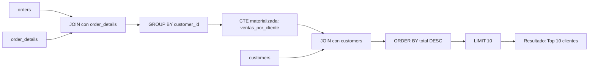

### 3. Código de Solución
```sql
WITH ventas_por_cliente AS (
    SELECT
        o.customer_id,
        SUM(od.quantity * od.unit_price * (1 - od.discount)) AS total_gastado,
        COUNT(DISTINCT o.order_id) AS num_pedidos
    FROM orders o
    INNER JOIN order_details od ON o.order_id = od.order_id
    GROUP BY o.customer_id
)
SELECT
    c.company_name,
    ROUND(v.total_gastado::numeric, 2) AS total_gastado,
    v.num_pedidos,
    ROUND((v.total_gastado / NULLIF(v.num_pedidos, 0))::numeric, 2) AS ticket_promedio
FROM ventas_por_cliente v
INNER JOIN customers c ON v.customer_id = c.customer_id
ORDER BY v.total_gastado DESC
LIMIT 10;
```

### 4. Criterio de Evaluación del Entrevistador
- **Acierta**: Reconoce que la CTE se materializa una sola vez y que `NULLIF` evita división por cero. Usa `INNER JOIN` en lugar de subconsulta correlacionada.
- **Error común**: Repetir los JOIN y GROUP BY en la consulta principal en lugar de reutilizar la CTE. Olvidar escalar `unit_price` por `(1 - discount)`.

---

## Ejercicio 2: Múltiples CTEs — Reporte mensual de ingresos vs costo de flete

### 1. Marco Conceptual del Optimizador
Varias CTEs en un mismo `WITH` se ejecutan secuencialmente; cada una puede referenciar CTEs anteriores. PostgreSQL no paraleliza CTEs entre sí. Si una CTE no se referencia, PostgreSQL la omite automáticamente (optimización *dead CTE removal*). El plan resultante encadena los escaneos de cada CTE como nodos independientes.

### 2. Diagrama de Flujo de Datos
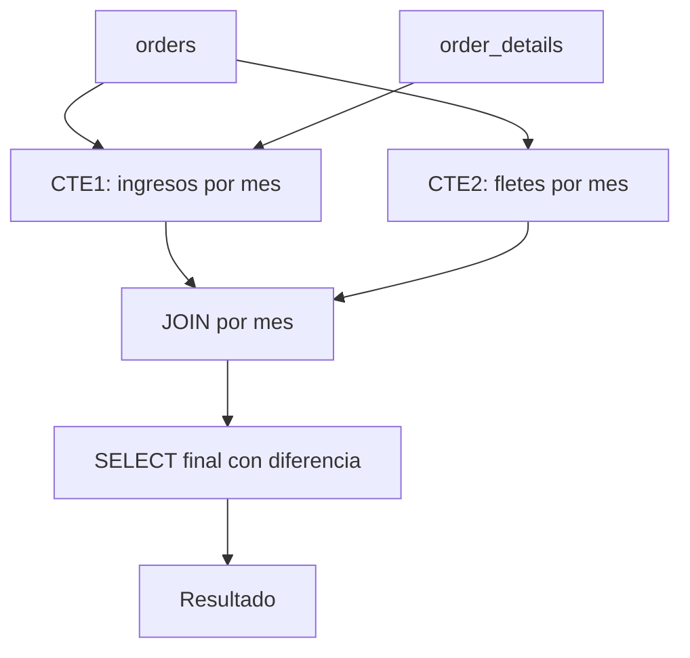

### 3. Código de Solución
```sql
WITH ingresos_mensuales AS (
    SELECT
        DATE_TRUNC('month', o.order_date)::date AS mes,
        SUM(od.quantity * od.unit_price * (1 - od.discount)) AS ingresos
    FROM orders o
    INNER JOIN order_details od ON o.order_id = od.order_id
    GROUP BY DATE_TRUNC('month', o.order_date)
),
fletes_mensuales AS (
    SELECT
        DATE_TRUNC('month', order_date)::date AS mes,
        SUM(freight) AS costo_flete
    FROM orders
    GROUP BY DATE_TRUNC('month', order_date)
)
SELECT
    i.mes,
    ROUND(i.ingresos::numeric, 2) AS ingresos,
    ROUND(f.costo_flete::numeric, 2) AS flete,
    ROUND((i.ingresos - COALESCE(f.costo_flete, 0))::numeric, 2) AS ingreso_neto,
    ROUND((COALESCE(f.costo_flete, 0) / NULLIF(i.ingresos, 0) * 100)::numeric, 2) AS pct_flete
FROM ingresos_mensuales i
LEFT JOIN fletes_mensuales f ON i.mes = f.mes
ORDER BY i.mes;
```

### 4. Criterio de Evaluación del Entrevistador
- **Acierta**: Usa dos CTEs independientes y las combina con `LEFT JOIN` para no perder meses sin flete. Calcula porcentajes sin división por cero.
- **Error común**: No usar `COALESCE` para meses sin flete. Hacer todo en una sola subconsulta complicada.

---

## Ejercicio 3: CTE con MATERIALIZED hint — Análisis de productividad por empleado

### 1. Marco Conceptual del Optimizador
En PostgreSQL 12+, `WITH ... AS MATERIALIZED` fuerza la materialización de la CTE en una tabla temporal, incluso si el optimizador preferiría inlining. Útil cuando la CTE es computacionalmente costosa y se referencia múltiples veces. La materialización actúa como un *optimizer fence*: evita que restricciones de la consulta externa se propaguen al interior de la CTE.

### 2. Diagrama de Flujo de Datos
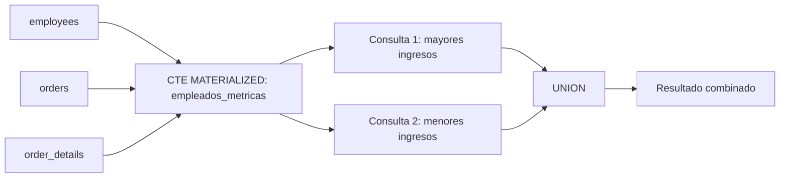

### 3. Código de Solución
```sql
WITH MATERIALIZED metricas_empleados AS (
    SELECT
        e.employee_id,
        e.first_name || ' ' || e.last_name AS nombre,
        e.hire_date,
        COUNT(DISTINCT o.order_id) AS pedidos_gestionados,
        SUM(od.quantity * od.unit_price * (1 - od.discount)) AS ingresos_generados,
        EXTRACT(YEAR FROM AGE(CURRENT_DATE, e.hire_date)) AS antiguedad_anios
    FROM employees e
    INNER JOIN orders o ON e.employee_id = o.employee_id
    INNER JOIN order_details od ON o.order_id = od.order_id
    GROUP BY e.employee_id
)
SELECT nombre, pedidos_gestionados, ROUND(ingresos_generados::numeric, 2) AS ingresos, antiguedad_anios
FROM metricas_empleados
ORDER BY ingresos_generados DESC;
```

### 4. Criterio de Evaluación del Entrevistador
- **Acierta**: Explica que `MATERIALIZED` fuerza una barrera de optimización y cuándo es útil (CTE costosa referenciada múltiples veces). Reconoce que desde PG12 la palabra clave es explícita.
- **Error común**: Usar `MATERIALIZED` en CTE livianas que se referencian una sola vez, donde el inlining sería más eficiente.

---

## Ejercicio 4: CTE con NOT MATERIALIZED hint — Últimos pedidos por cliente

### 1. Marco Conceptual del Optimizador
`NOT MATERIALIZED` fuerza el inlining de la CTE: PostgreSQL expande la definición de la CTE directamente en el plan de la consulta principal, permitiendo que el optimizador aplique poda de columnas, empuje de filtros y reordenamiento de JOINs. Ideal para CTE simples que se referencian una sola vez.

### 2. Diagrama de Flujo de Datos
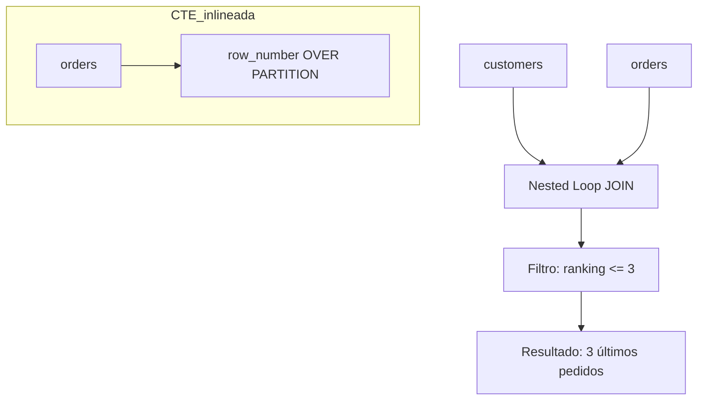

### 3. Código de Solución
```sql
WITH NOT MATERIALIZED pedidos_ordenados AS (
    SELECT
        o.customer_id,
        o.order_id,
        o.order_date,
        o.freight,
        ROW_NUMBER() OVER (
            PARTITION BY o.customer_id
            ORDER BY o.order_date DESC, o.order_id DESC
        ) AS rn
    FROM orders o
)
SELECT
    c.company_name,
    po.order_id,
    po.order_date,
    ROUND(po.freight::numeric, 2) AS freight
FROM customers c
INNER JOIN pedidos_ordenados po ON c.customer_id = po.customer_id
WHERE po.rn <= 3
ORDER BY c.company_name, po.order_date DESC;
```

### 4. Criterio de Evaluación del Entrevistador
- **Acierta**: Sabe que `NOT MATERIALIZED` permite al optimizador empujar el filtro `po.rn <= 3` dentro de la ventana, potencialmente usando un Index Scan en orden inverso. Menciona que `ROW_NUMBER` requiere orden estable.
- **Error común**: Usar `NOT MATERIALIZED` para CTEs referenciadas múltiples veces (causa re-evaluación). No considerar que el filtro de ranking se aplica después de la ventana.

---

## Ejercicio 5: CTE con FILTER — Ventas por categoría con desglose trimestral

### 1. Marco Conceptual del Optimizador
PostgreSQL implementa `FILTER (WHERE ...)` como un escaneo único de la tabla con evaluación condicional de la agregación, en lugar de múltiples subconsultas. El optimizador traduce cada `FILTER` a un nodo `Aggregate` con múltiples condiciones. Esto reduce los escaneos de tabla comparado con múltiples subconsultas separadas.

### 2. Diagrama de Flujo de Datos
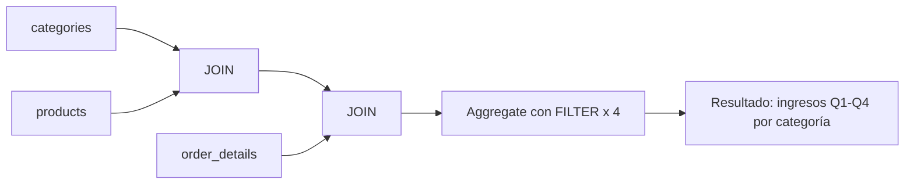

### 3. Código de Solución
```sql
WITH ventas_trimestrales AS (
    SELECT
        c.category_name,
        SUM(od.quantity * od.unit_price * (1 - od.discount))
            FILTER (WHERE EXTRACT(QUARTER FROM o.order_date) = 1) AS ingreso_q1,
        SUM(od.quantity * od.unit_price * (1 - od.discount))
            FILTER (WHERE EXTRACT(QUARTER FROM o.order_date) = 2) AS ingreso_q2,
        SUM(od.quantity * od.unit_price * (1 - od.discount))
            FILTER (WHERE EXTRACT(QUARTER FROM o.order_date) = 3) AS ingreso_q3,
        SUM(od.quantity * od.unit_price * (1 - od.discount))
            FILTER (WHERE EXTRACT(QUARTER FROM o.order_date) = 4) AS ingreso_q4,
        SUM(od.quantity * od.unit_price * (1 - od.discount)) AS total_anual
    FROM categories c
    INNER JOIN products p ON c.category_id = p.category_id
    INNER JOIN order_details od ON p.product_id = od.product_id
    INNER JOIN orders o ON od.order_id = o.order_id
    GROUP BY c.category_name
)
SELECT *
FROM ventas_trimestrales
ORDER BY total_anual DESC;
```

### 4. Criterio de Evaluación del Entrevistador
- **Acierta**: Explica que `FILTER` evita múltiples scans de tabla y es más eficiente que `CASE WHEN`. Reconoce que la sintaxis es SQL estándar desde SQL:2003 y PostgreSQL la implementa desde la versión 9.4.
- **Error común**: Usar múltiples subconsultas correlacionadas con `WHERE` en lugar de `FILTER`. No escalar `unit_price` por `(1 - discount)`.

---

## Ejercicio 6: CTE con NOT EXISTS — Productos sin movimiento en los últimos 90 días

### 1. Marco Conceptual del Optimizador
Combinar una CTE de productos con una de pedidos recientes mediante `ANTI JOIN`. PostgreSQL implementa el `NOT EXISTS` como un plan de `Hash Anti Join` (tabla pequeña en hash) o `Merge Anti Join` si los datos están ordenados. El optimizador elige el algoritmo basado en estadísticas de cardinalidad y `work_mem` disponible.

### 2. Diagrama de Flujo de Datos
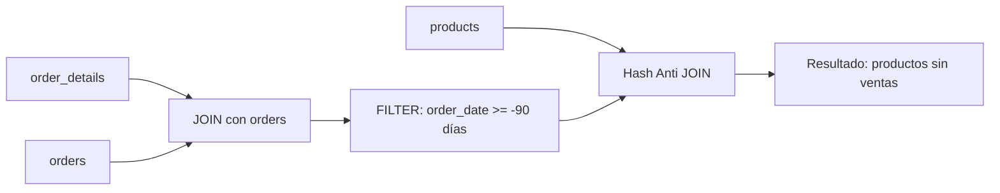

### 3. Código de Solución
```sql
WITH productos_activos AS (
    SELECT DISTINCT od.product_id
    FROM order_details od
    INNER JOIN orders o ON od.order_id = o.order_id
    WHERE o.order_date >= CURRENT_DATE - INTERVAL '90 days'
)
SELECT
    p.product_id,
    p.product_name,
    p.units_in_stock,
    p.discontinued
FROM products p
WHERE NOT EXISTS (
    SELECT 1
    FROM productos_activos pa
    WHERE pa.product_id = p.product_id
)
ORDER BY p.product_name;
```

### 4. Criterio de Evaluación del Entrevistador
- **Acierta**: Usa `NOT EXISTS` en lugar de `NOT IN` (evita problemas con NULLs). Explica que la CTE reduce el conjunto antes del anti-join.
- **Error común**: Usar `NOT IN (SELECT product_id ...)` que falla si hay NULLs. No filtrar por fecha en la subconsulta, trayendo todos los pedidos históricos.

---

## Ejercicio 7: CTE con cálculos de reorden — Productos por debajo del punto de reorden

### 1. Marco Conceptual del Optimizador
La CTE calcula el nivel de inventario neto (`units_in_stock - units_on_order`) y lo compara con `reorder_level`. PostgreSQL puede usar un `Index Scan` en `products` si hay un índice compuesto en `(reorder_level, units_in_stock)`. Sin índice, hará `Seq Scan` completo con filtro.

### 2. Diagrama de Flujo de Datos
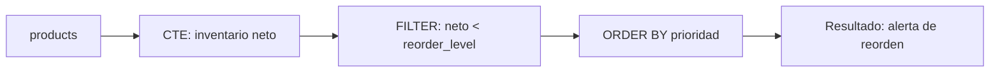

### 3. Código de Solución
```sql
WITH estado_inventario AS (
    SELECT
        product_id,
        product_name,
        units_in_stock,
        units_on_order,
        reorder_level,
        discontinued,
        (units_in_stock - units_on_order) AS inventario_neto,
        CASE
            WHEN (units_in_stock - units_on_order) <= 0 THEN 'CRITICO'
            WHEN (units_in_stock - units_on_order) <= reorder_level * 0.5 THEN 'URGENTE'
            WHEN (units_in_stock - units_on_order) <= reorder_level THEN 'ALERTA'
            ELSE 'NORMAL'
        END AS prioridad
    FROM products
)
SELECT *
FROM estado_inventario
WHERE prioridad IN ('CRITICO', 'URGENTE', 'ALERTA')
  AND discontinued = 0
ORDER BY
    CASE prioridad
        WHEN 'CRITICO' THEN 1
        WHEN 'URGENTE' THEN 2
        WHEN 'ALERTA' THEN 3
    END,
    inventario_neto ASC;
```

### 4. Criterio de Evaluación del Entrevistador
- **Acierta**: Aplica lógica de negocio (priorización) dentro de la CTE y filtra después. Usa `CASE` ordenado para priorizar resultados. Excluye productos descontinuados.
- **Error común**: No considerar `units_on_order` (productos ya pedidos pero no recibidos). Mezclar lógica de presentación con lógica de datos sin separar.

---

## Ejercicio 8: CTE con JOIN a pg_stat_user_tables — Diagnóstico de tablas sin estadísticas

### 1. Marco Conceptual del Optimizador
`pg_stat_user_tables` y `pg_class` son vistas del catálogo del sistema. PostgreSQL mantiene estadísticas en `pg_statistic` y las usa para estimar cardinalidad. Tablas con `n_mod_since_analyze` alto y `last_analyze` viejo pueden producir planes subóptimos.

### 2. Diagrama de Flujo de Datos
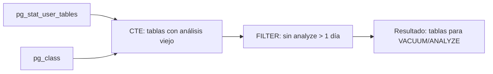

### 3. Código de Solución
```sql
WITH diagnostico_tablas AS (
    SELECT
        schemaname,
        relname,
        n_live_tup,
        n_dead_tup,
        n_mod_since_analyze,
        last_analyze,
        last_autoanalyze,
        pg_size_pretty(pg_total_relation_size(schemaname || '.' || relname)) AS tamano
    FROM pg_stat_user_tables
    WHERE schemaname = 'public'
)
SELECT *,
    ROUND((n_dead_tup::numeric / NULLIF(n_live_tup + n_dead_tup, 0) * 100), 2) AS pct_tuplas_muertas
FROM diagnostico_tablas
WHERE (n_dead_tup > 1000 AND n_dead_tup::numeric / NULLIF(n_live_tup + n_dead_tup, 0) > 0.1)
   OR (n_mod_since_analyze > 10000 AND last_analyze IS NULL)
   OR (last_analyze IS NOT NULL AND last_analyze < CURRENT_TIMESTAMP - INTERVAL '1 day')
ORDER BY n_dead_tup DESC;
```

### 4. Criterio de Evaluación del Entrevistador
- **Acierta**: Cruza estadísticas del sistema con lógica de negocio para identificar tablas degradadas. Calcula ratios de tuplas muertas. Explica que `VACUUM` recupera espacio y `ANALYZE` actualiza estadísticas.
- **Error común**: Ignorar `last_autoanalyze` (autovacuum puede haber actualizado stats automáticamente). Filtrar por `last_analyze IS NULL` sin considerar `last_autoanalyze`.

---

## Ejercicio 9: CTE con RETURNING — Transferencia de inventario entre productos

### 1. Marco Conceptual del Optimizador
PostgreSQL no tiene `UPDATE ... FROM ... RETURNING` con CTEs de forma nativa multi-target. La CTE combinada con `RETURNING` permite capturar los valores post-operación en un solo viaje de ida y vuelta (round-trip). El `RETURNING` se ejecuta en la fase de ejecución del plan, después de aplicar el filtro `WHERE`.

### 2. Diagrama de Flujo de Datos
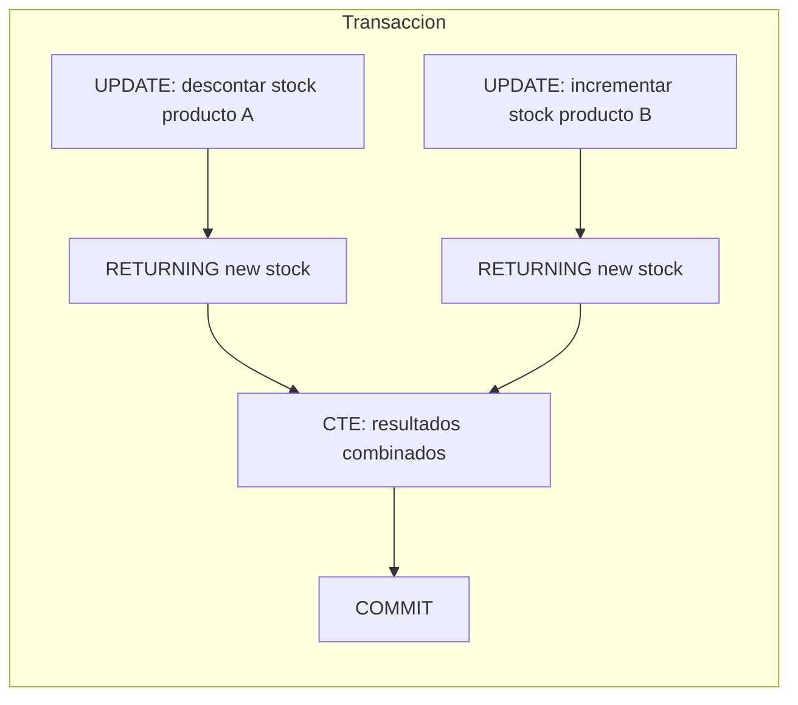

### 3. Código de Solución
```sql
BEGIN;

WITH ajuste_origen AS (
    UPDATE products
    SET units_in_stock = units_in_stock - 10
    WHERE product_id = 1 AND units_in_stock >= 10
    RETURNING product_id, product_name, units_in_stock AS stock_origen_restante
),
ajuste_destino AS (
    UPDATE products
    SET units_in_stock = units_in_stock + 10
    WHERE product_id = 2
    RETURNING product_id, product_name, units_in_stock AS stock_destino_nuevo
)
SELECT
    ao.product_name AS producto_origen,
    ao.stock_origen_restante,
    ad.product_name AS producto_destino,
    ad.stock_destino_nuevo,
    10 AS cantidad_transferida
FROM ajuste_origen ao, ajuste_destino ad;

COMMIT;
```

### 4. Criterio de Evaluación del Entrevistador
- **Acierta**: Envuelve en transacción explícita (`BEGIN`/`COMMIT`) para atomicidad. Verifica stock suficiente en el `WHERE` del UPDATE origen. Usa `RETURNING` para capturar estado post-operación.
- **Error común**: No usar transacción (riesgo de inconsistencia si falla un UPDATE). No verificar stock disponible antes de descontar.

---

## Ejercicio 10: CTE con ON CONFLICT — UPSERT de clientes con carga incremental

### 1. Marco Conceptual del Optimizador
El `INSERT ... ON CONFLICT DO UPDATE` (UPSERT) ejecuta un escaneo de índice único. Si encuentra un conflicto, realiza un `UPDATE` en el mismo bloque del plan, sin necesidad de una transacción separada o lógica aplicación. PostgreSQL usa el índice único especificado en `ON CONFLICT` para detectar la colisión.

### 2. Diagrama de Flujo de Datos
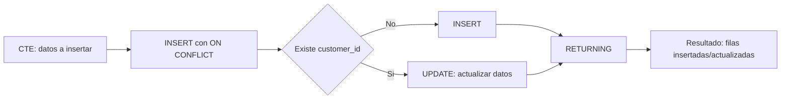

### 3. Código de Solución
```sql
WITH datos_nuevos (customer_id, company_name, contact_name, city, country) AS (
    VALUES
        ('NWE01', 'TechCorp Peru', 'Carlos Garcia', 'Lima', 'Peru'),
        ('NWE02', 'DataLabs Chile', 'Ana Soto', 'Santiago', 'Chile'),
        ('ALFKI', 'Alfreds Futterkiste - Actualizado', 'Maria Anders', 'Berlin', 'Germany')
)
INSERT INTO customers (customer_id, company_name, contact_name, city, country)
SELECT customer_id, company_name, contact_name, city, country
FROM datos_nuevos
ON CONFLICT (customer_id) DO UPDATE SET
    company_name = EXCLUDED.company_name,
    contact_name = EXCLUDED.contact_name,
    city = EXCLUDED.city,
    country = EXCLUDED.country
RETURNING customer_id, company_name, (xmax = 0) AS fue_insertado;
```

### 4. Criterio de Evaluación del Entrevistador
- **Acierta**: Usa `VALUES` dentro de una CTE para simular carga. Explica `xmax = 0` como metodo para detectar si fue INSERT o UPDATE. Menciona que `ON CONFLICT` requiere un índice único o exclusión.
- **Error común**: Olvidar que `ON CONFLICT` necesita una restricción única. No usar `EXCLUDED` para referenciar los valores propuestos.

---

## Ejercicio 11: Recursive CTE — Organigrama jerarquico con niveles

### 1. Marco Conceptual del Optimizador
PostgreSQL ejecuta la CTE recursiva en iteraciones: (1) ejecuta el miembro ancla, (2) en cada iteración ejecuta el miembro recursivo usando como entrada el resultado de la iteración anterior, (3) acumula resultados con `UNION ALL`. El optimizador planea un nodo `Recursive Union` con dos subplanes: el ancla (ejecutado una vez) y el paso recursivo (ejecutado N veces). No hay límite teórico de profundidad, pero `max_recursion_depth` (por defecto 100) previene bucles infinitos.

### 2. Diagrama de Flujo de Datos
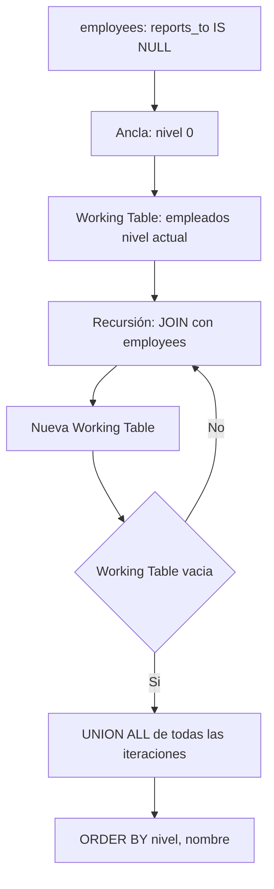

### 3. Código de Solución
```sql
WITH RECURSIVE organigrama AS (
    -- Ancla: empleados sin jefe (Andrew Fuller)
    SELECT
        employee_id,
        first_name || ' ' || last_name AS nombre,
        reports_to,
        0 AS nivel,
        first_name || ' ' || last_name AS ruta
    FROM employees
    WHERE reports_to IS NULL

    UNION ALL

    -- Paso recursivo: subordinados directos
    SELECT
        e.employee_id,
        e.first_name || ' ' || e.last_name,
        e.reports_to,
        o.nivel + 1,
        o.ruta || ' -> ' || e.first_name || ' ' || e.last_name
    FROM employees e
    INNER JOIN organigrama o ON e.reports_to = o.employee_id
)
SELECT
    nivel,
    REPEAT('  ', nivel) || nombre AS nombre_jerarquico,
    ruta
FROM organigrama
ORDER BY ruta;
```

### 4. Criterio de Evaluación del Entrevistador
- **Acierta**: Construye una ruta jerarquica acumulativa. Explica el ciclo ancla-recursión. Menciona que `UNION ALL` es más eficiente que `UNION` porque evita ordenar para eliminar duplicados.
- **Error común**: Usar `UNION` en lugar de `UNION ALL` (causa ordenamiento en cada iteración). No construir el campo `ruta` para trazabilidad. Olvidar el `RECURSIVE` en `WITH`.

---

## Ejercicio 12: Recursive CTE — Subordinados indirectos de un gerente

### 1. Marco Conceptual del Optimizador
La CTE recursiva con filtro en el ancla (`WHERE reports_to = 2`) restringe el punto de partida a un empleado específico. PostgreSQL aplica el filtro directamente sobre la tabla `employees` usando un índice en `reports_to` si existe. La recursión solo explorará la sub-rama del árbol.

### 2. Diagrama de Flujo de Datos
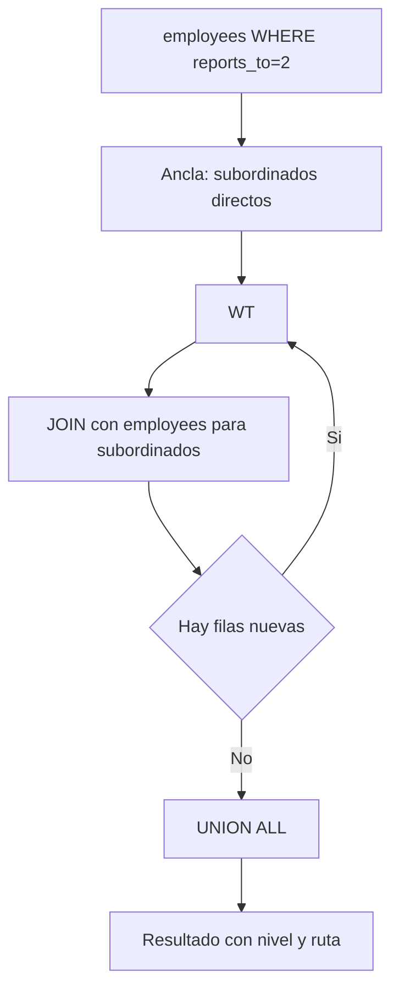

### 3. Código de Solución
```sql
WITH RECURSIVE subordinados AS (
    -- Ancla: empleados que reportan directamente al gerente 2
    SELECT
        employee_id,
        first_name || ' ' || last_name AS nombre,
        reports_to,
        1 AS nivel,
        first_name || ' ' || last_name AS ruta
    FROM employees
    WHERE reports_to = 2

    UNION ALL

    -- Recursión: empleados que reportan a los subordinados
    SELECT
        e.employee_id,
        e.first_name || ' ' || e.last_name,
        e.reports_to,
        s.nivel + 1,
        s.ruta || ' -> ' || e.first_name || ' ' || e.last_name
    FROM employees e
    INNER JOIN subordinados s ON e.reports_to = s.employee_id
)
SELECT
    nivel,
    REPEAT('  ', nivel - 1) || nombre AS jerarquia,
    ruta
FROM subordinados
ORDER BY ruta;
```

### 4. Criterio de Evaluación del Entrevistador
- **Acierta**: Filtra en el ancla para limitar el subárbol. Calcula nivel relativo. Usa `REPEAT` para indentación visual.
- **Error común**: No incluir al gerente en el resultado (caso de uso válido dependiendo del requerimiento). Usar `reports_to = 2` sin verificar que el empleado 2 existe.

---

## Ejercicio 13: Recursive CTE con generate_series — Calendario fiscal con días laborables

### 1. Marco Conceptual del Optimizador
`generate_series` dentro de una CTE recursiva puede generar secuencias de fechas con reglas de negocio. PostgreSQL optimiza `generate_series` como un *set-returning function* (SRF) que produce filas incrementalmente. La recursión itera día a día, evaluando condiciones como día de semana. El plan de ejecución muestra un nodo `Result` con `Function Scan` sobre `generate_series`.

### 2. Diagrama de Flujo de Datos
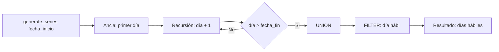

### 3. Código de Solución
```sql
WITH RECURSIVE calendario AS (
    -- Ancla: fecha de inicio
    SELECT '1997-01-01'::date AS fecha

    UNION ALL

    -- Recursión: día siguiente
    SELECT fecha + 1
    FROM calendario
    WHERE fecha < '1997-12-31'::date
)
SELECT
    fecha,
    TO_CHAR(fecha, 'Day') AS dia_semana,
    EXTRACT(ISODOW FROM fecha) AS num_dia_semana,
    CASE
        WHEN EXTRACT(ISODOW FROM fecha) BETWEEN 1 AND 5 THEN TRUE
        ELSE FALSE
    END AS es_laborable
FROM calendario
ORDER BY fecha;
```

### 4. Criterio de Evaluación del Entrevistador
- **Acierta**: Reconoce que `generate_series` es más eficiente que una CTE recursiva para rangos de fechas grandes. Explica que la recursión con `fecha + 1` es costosa para rangos largos (+365 iteraciones).
- **Error común**: Usar CTE recursiva para rangos grandes (>1000 filas) donde `generate_series` es más eficiente. No limitar la recursión con `WHERE` (bucle infinito).

---

## Ejercicio 14: Recursive CTE — Cadena de mando con agregación de metricas

### 1. Marco Conceptual del Optimizador
Agregar métricas (ingresos, pedidos) por subordinados requiere recorrer el árbol hacia arriba. PostgreSQL ejecuta la recursión completa primero, luego aplica las agregaciones. La CTE recursiva construye la relación empleado-subordinado; la consulta externa utiliza esa relación para hacer `SUM` y `COUNT` agrupando por manager.

### 2. Diagrama de Flujo de Datos
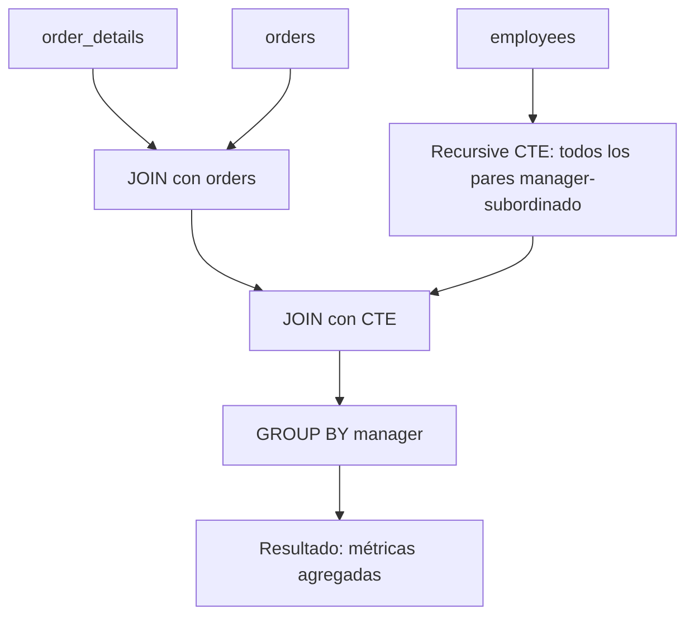

### 3. Código de Solución
```sql
WITH RECURSIVE equipo AS (
    -- Ancla: cada empleado es su propio líder
    SELECT employee_id AS lider_id, employee_id AS miembro_id, 0 AS profundidad
    FROM employees

    UNION ALL

    -- Recursión: los subordinados se agregan al equipo del líder
    SELECT
        e.lider_id,
        emp.employee_id,
        e.profundidad + 1
    FROM equipo e
    INNER JOIN employees emp ON emp.reports_to = e.miembro_id
    WHERE e.profundidad < 10
)
SELECT
    l.employee_id,
    l.first_name || ' ' || l.last_name AS lider,
    COUNT(DISTINCT e.miembro_id) AS total_equipo,
    ROUND(SUM(COALESCE(od_sub.ingresos, 0))::numeric, 2) AS ingresos_del_equipo
FROM employees l
INNER JOIN equipo e ON l.employee_id = e.lider_id
LEFT JOIN LATERAL (
    SELECT SUM(od.quantity * od.unit_price * (1 - od.discount)) AS ingresos
    FROM orders o
    INNER JOIN order_details od ON o.order_id = od.order_id
    WHERE o.employee_id = e.miembro_id
) od_sub ON TRUE
GROUP BY l.employee_id, l.first_name, l.last_name
ORDER BY ingresos_del_equipo DESC;
```

### 4. Criterio de Evaluación del Entrevistador
- **Acierta**: Construye pares líder-miembro con recursión, luego agrega métricas. Usa `LATERAL` para calcular ingresos por miembro eficientemente. Explica que la profundidad máxima evita loops.
- **Error común**: No incluir al líder mismo en el equipo (ancla con self-join). Contar métricas duplicadas por no usar `DISTINCT`.

---

## Ejercicio 15: Recursive CTE — Búsqueda en grafo de territorios asignados

### 1. Marco Conceptual del Optimizador
La tabla `employee_territories` forma un grafo bipartito empleado-territorio. La CTE recursiva puede recorrer territorios conectados a través de empleados compartidos. PostgreSQL ejecuta la recursión como búsqueda en anchura (BFS), ya que cada iteración explora los vecinos del nivel anterior.

### 2. Diagrama de Flujo de Datos
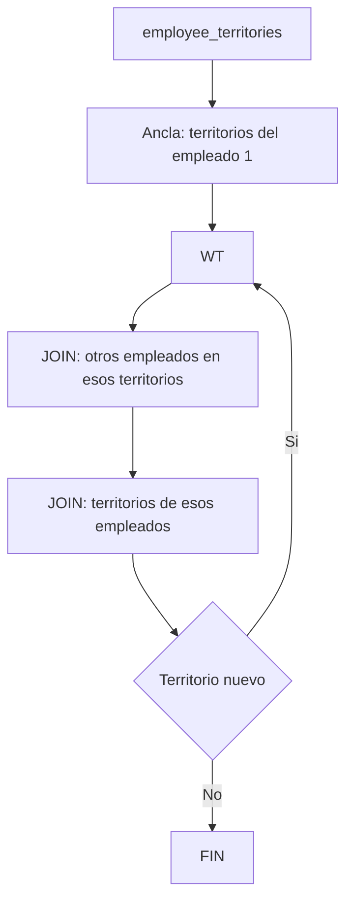

### 3. Código de Solución
```sql
WITH RECURSIVE red_territorios AS (
    -- Ancla: territorios del empleado inicial
    SELECT DISTINCT et.territory_id, et.employee_id, 0 AS profundidad,
           ARRAY[et.territory_id] AS territorios_visitados
    FROM employee_territories et
    WHERE et.employee_id = 1

    UNION ALL

    -- Recursión: empleados que comparten esos territorios y sus otros territorios
    SELECT
        et2.territory_id,
        et2.employee_id,
        r.profundidad + 1,
        r.territorios_visitados || et2.territory_id
    FROM red_territorios r
    INNER JOIN employee_territories et1 ON r.territory_id = et1.territory_id
    INNER JOIN employee_territories et2 ON et1.employee_id = et2.employee_id
    WHERE NOT (et2.territory_id = ANY(r.territorios_visitados))
      AND r.profundidad < 5
)
SELECT DISTINCT territory_id, profundidad
FROM red_territorios
ORDER BY profundidad, territory_id;
```

### 4. Criterio de Evaluación del Entrevistador
- **Acierta**: Implementa detección de ciclos con `ARRAY` de visitados. Limita profundidad explícitamente. Explica BFS vs DFS en SQL.
- **Error común**: No detectar ciclos (bucle infinito). No limitar profundidad (explosión combinatoria de caminos).

---

## Ejercicio 16: Recursive CTE — Ruta jerarquica inversa (de empleado a CEO)

### 1. Marco Conceptual del Optimizador
La recursión inversa navega desde un nodo hoja hacia la raíz cambiando la dirección del JOIN. En lugar de `e.reports_to = o.employee_id` (padre a hijo), usa `o.reports_to = e.employee_id` (hijo a padre). PostgreSQL ejecuta esta variante con un `Index Scan` en `reports_to` por cada iteración.

### 2. Diagrama de Flujo de Datos
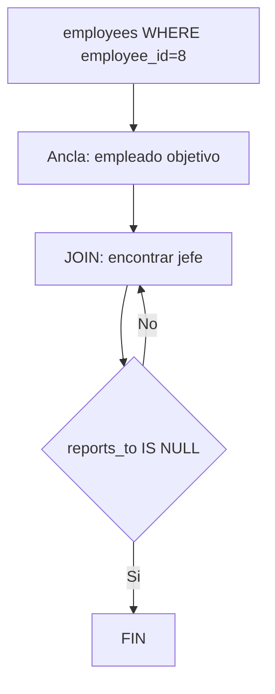

### 3. Código de Solución
```sql
WITH RECURSIVE cadena_mando AS (
    -- Ancla: empleado hoja
    SELECT
        employee_id,
        first_name || ' ' || last_name AS nombre,
        reports_to,
        0 AS nivel,
        first_name || ' ' || last_name AS ruta
    FROM employees
    WHERE employee_id = 8

    UNION ALL

    -- Recursión inversa: subir al jefe
    SELECT
        e.employee_id,
        e.first_name || ' ' || e.last_name,
        e.reports_to,
        cm.nivel + 1,
        cm.ruta || ' <- ' || e.first_name || ' ' || e.last_name
    FROM employees e
    INNER JOIN cadena_mando cm ON e.employee_id = cm.reports_to
)
SELECT
    nombre,
    CASE
        WHEN nivel = 0 THEN 'EMPLEADO INICIAL'
        WHEN reports_to IS NULL THEN 'CEO'
        ELSE 'Nivel ' || nivel
    END AS rol,
    ruta
FROM cadena_mando
ORDER BY nivel DESC;
```

### 4. Criterio de Evaluación del Entrevistador
- **Acierta**: Invierte la dirección del JOIN para navegar hacia arriba. Marca el CEO con `reports_to IS NULL`. Explica que es una búsqueda inversa en el árbol.
- **Error común**: Usar la misma dirección de JOIN que en el organigrama descendente. No ordenar por nivel DESC para mostrar jerarquía correcta.

---

## Ejercicio 17: Recursive CTE con multiples anclas — Gerentes regionales y sus equipos

### 1. Marco Conceptual del Optimizador
Múltiples anclas en una CTE recursiva se unen con `UNION ALL` en la fase inicial. PostgreSQL ejecuta cada ancla por separado y combina los resultados en la *Working Table* inicial. Cada ancla puede tener diferentes filtros (ej. gerentes de diferentes regiones).

### 2. Diagrama de Flujo de Datos
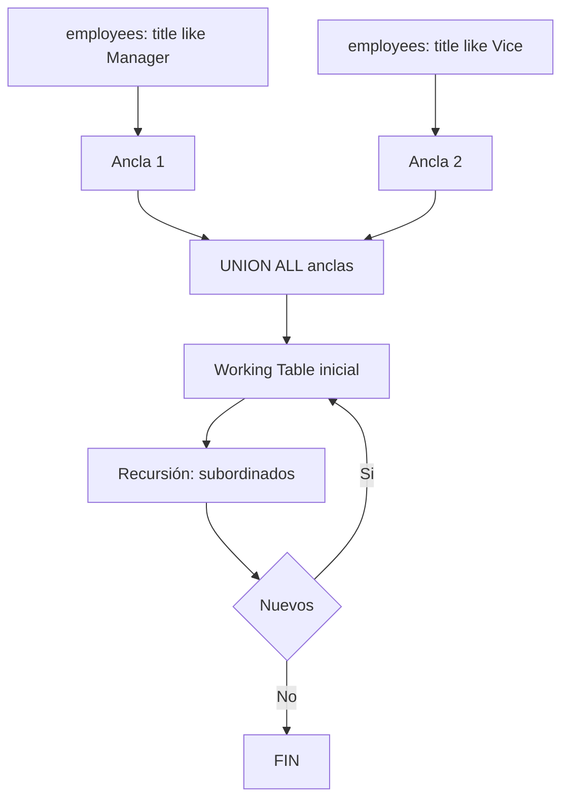

### 3. Código de Solución
```sql
WITH RECURSIVE gerentes_y_equipos AS (
    -- Ancla 1: gerentes de ventas
    SELECT
        employee_id,
        first_name || ' ' || last_name AS nombre,
        title,
        reports_to,
        0 AS nivel,
        first_name || ' ' || last_name AS ruta_gerente
    FROM employees
    WHERE title LIKE '%Sales Manager%'
       OR title LIKE '%Vice President%'

    UNION ALL

    -- Ancla 2: subordinados directos de cada gerente
    SELECT
        e.employee_id,
        e.first_name || ' ' || e.last_name,
        e.title,
        e.reports_to,
        1 AS nivel,
        g.nombre || ' -> ' || e.first_name || ' ' || e.last_name
    FROM employees e
    INNER JOIN gerentes_y_equipos g ON e.reports_to = g.employee_id
    WHERE g.nivel = 0

    UNION ALL

    -- Recursión: subordinados de los subordinados
    SELECT
        e.employee_id,
        e.first_name || ' ' || e.last_name,
        e.title,
        e.reports_to,
        g.nivel + 1,
        g.ruta_gerente || ' -> ' || e.first_name || ' ' || e.last_name
    FROM employees e
    INNER JOIN gerentes_y_equipos g ON e.reports_to = g.employee_id
    WHERE g.nivel >= 1
)
SELECT DISTINCT nivel, ruta_gerente
FROM gerentes_y_equipos
ORDER BY nivel, ruta_gerente;
```

### 4. Criterio de Evaluación del Entrevistador
- **Acierta**: Construye múltiples anclas para diferentes puntos de entrada. Usa `DISTINCT` para eliminar duplicados de rutas coincidentes.
- **Error común**: Crear uniones cruzadas no intencionales entre las anclas. No controlar la profundidad de cada ancla por separado.

---

## Ejercicio 18: Recursive CTE — Árbol de categorías (jerarquía simulada)

### 1. Marco Conceptual del Optimizador
Aunque `categories` no tiene `parent_category_id` en Northwind, podemos simular una jerarquía o procesar agrupaciones. La CTE recursiva funciona con cualquier estructura que tenga una referencia auto-relacional. Si no existe la columna, se puede simular con una tabla derivada o `VALUES`.

### 2. Diagrama de Flujo de Datos
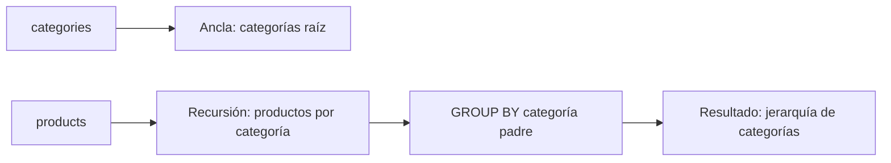

### 3. Código de Solución
```sql
WITH RECURSIVE jerarquia_categorias AS (
    -- Simulamos una jerarquía: Beverages (1) y Condiments (2) como raíces
    SELECT
        category_id,
        category_name,
        NULL::int AS parent_category_id,
        0 AS nivel,
        category_name AS ruta
    FROM categories
    WHERE category_id IN (1, 2)

    UNION ALL

    -- Las demás categorías cuelgan de estas raíces
    SELECT
        c.category_id,
        c.category_name,
        CASE
            WHEN c.category_id IN (3, 4) THEN 1
            WHEN c.category_id IN (5, 6, 7) THEN 2
            ELSE NULL
        END,
        jc.nivel + 1,
        jc.ruta || ' > ' || c.category_name
    FROM categories c
    INNER JOIN jerarquia_categorias jc ON
        CASE
            WHEN c.category_id IN (3, 4) THEN 1
            WHEN c.category_id IN (5, 6, 7) THEN 2
            ELSE NULL
        END = jc.category_id
    WHERE jc.nivel < 5
      AND c.category_id NOT IN (1, 2)
)
SELECT REPEAT('  ', nivel) || category_name AS jerarquia, ruta
FROM jerarquia_categorias
ORDER BY ruta;
```

### 4. Criterio de Evaluación del Entrevistador
- **Acierta**: Reconoce la limitación del esquema y propone una simulación realista. Explica que en un esquema real `categories` tendría `parent_category_id`.
- **Error común**: Forzar una recursión sobre un esquema que no tiene columna auto-referencial sin adaptar la lógica. No manejar correctamente los casos NULL en el JOIN.

---

## Ejercicio 19: Recursive CTE con detección de ciclos — Terminación segura

### 1. Marco Conceptual del Optimizador
La detección de ciclos es crítica en grafos que pueden tener referencias circulares. PostgreSQL no tiene detección automática de ciclos en CTE recursivas; debe implementarse manualmente con un array de nodos visitados. El optimizador no puede optimizar esta protección; la verificación `NOT (id = ANY(visitados))` se ejecuta en cada iteración.

### 2. Diagrama de Flujo de Datos
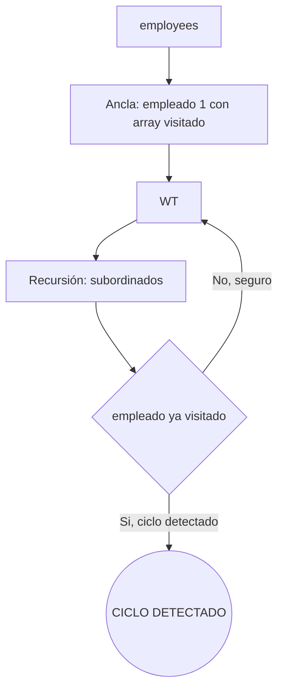

### 3. Código de Solución
```sql
WITH RECURSIVE exploracion_segura AS (
    -- Ancla: comenzar desde el CEO
    SELECT
        employee_id,
        first_name || ' ' || last_name AS nombre,
        reports_to,
        0 AS nivel,
        ARRAY[employee_id] AS visitados,
        FALSE AS tiene_ciclo
    FROM employees
    WHERE reports_to IS NULL

    UNION ALL

    -- Recursión con detección de ciclos
    SELECT
        e.employee_id,
        e.first_name || ' ' || e.last_name,
        e.reports_to,
        es.nivel + 1,
        es.visitados || e.employee_id,
        e.employee_id = ANY(es.visitados)
    FROM employees e
    INNER JOIN exploracion_segura es ON e.reports_to = es.employee_id
    WHERE NOT es.tiene_ciclo
      AND es.nivel < 20
)
SELECT
    nivel,
    REPEAT('  ', nivel) || nombre AS jerarquia,
    CASE WHEN tiene_ciclo THEN 'CICLO DETECTADO' ELSE 'OK' END AS estado
FROM exploracion_segura
ORDER BY nivel, nombre;
```

### 4. Criterio de Evaluación del Entrevistador
- **Acierta**: Implementa protección contra ciclos con `ARRAY`. Propaga una bandera `tiene_ciclo` para cortar la recursión. Explica que `ANY()` es O(n) y para grafos grandes se puede optimizar con `intarray` o índices GiST.
- **Error común**: No implementar detección de ciclos (riesgo de loop infinito). No limitar profundidad como segunda línea de defensa.

---

## Ejercicio 20: Recursive CTE — Proyección de demanda futura (simulación financiera)

### 1. Marco Conceptual del Optimizador
La CTE recursiva puede simular proyecciones iterativas donde cada paso depende del anterior. PostgreSQL ejecuta esto como un bucle numérico: cada iteración produce una fila con el período siguiente. El plan muestra `Recursive Union` con un `Result` ancla y un `Result` recursivo con operaciones aritméticas.

### 2. Diagrama de Flujo de Datos
```mermaid
flowchart LR
    BASE[Ancla: ventas del mes base] --> R[Recursión: mes + 1]
    R --> CALC[proyección = anterior * (1 + tasa)]
    CALC --> CHECK{mes < 12}
    CHECK -->|Si| R
    CHECK -->|No| FIN[Resultado: 12 meses proyectados]
```

### 3. Código de Solución
```sql
WITH RECURSIVE proyeccion_mensual AS (
    -- Ancla: ventas base del último mes con datos
    SELECT
        DATE_TRUNC('month', MAX(o.order_date))::date AS mes_base,
        SUM(od.quantity * od.unit_price * (1 - od.discount)) AS ventas_reales,
        0 AS mes_proyectado
    FROM orders o
    INNER JOIN order_details od ON o.order_id = od.order_id
    WHERE o.order_date >= '1998-01-01'
      AND o.order_date < '1998-02-01'

    UNION ALL

    -- Recursión: proyectar siguientes meses con crecimiento del 2%
    SELECT
        (mes_base + INTERVAL '1 month' * (mes_proyectado + 1))::date,
        ventas_reales * (1.02 ^ (mes_proyectado + 1)),
        mes_proyectado + 1
    FROM proyeccion_mensual
    WHERE mes_proyectado < 11
)
SELECT
    mes_base + INTERVAL '1 month' * mes_proyectado AS mes_proyectado,
    ROUND(ventas_reales::numeric, 2) AS ventas_estimadas,
    ROUND((ventas_reales / NULLIF(FIRST_VALUE(ventas_reales) OVER (ORDER BY mes_proyectado), 0) * 100 - 100)::numeric, 2) AS crecimiento_acumulado_pct
FROM proyeccion_mensual
ORDER BY mes_proyectado;
```

### 4. Criterio de Evaluación del Entrevistador
- **Acierta**: Modela una proyección financiera con interés compuesto. Usa `FIRST_VALUE` para calcular crecimiento acumulado. Explica que esto es una simulación simple; modelos ARIMA serían más precisos.
- **Error común**: No usar `ventas_reales` como base constante (el ancla debe fijar el valor base). Mezclar proyecciones con datos reales sin separarlos.

---

## Ejercicio 21: LAG — Comparar ventas de cada empleado vs el mes anterior

### 1. Marco Conceptual del Optimizador
`LAG(ventas, 1)` accede al valor de la fila anterior dentro de la misma partición. PostgreSQL implementa funciones de ventana en un nodo `WindowAgg` después de la agregación. El plan ordena los datos por `employee_id, mes` (explícito o implícito en `ORDER BY` de la ventana) y luego aplica la función en una sola pasada.

### 2. Diagrama de Flujo de Datos
```mermaid
flowchart LR
    O[orders] --> J1[JOIN order_details]
    OD[order_details] --> J1
    J1 --> G[GROUP BY employee_id, mes]
    G --> W[WindowAgg: LAG]
    W --> CALC[diferencia = actual - anterior]
    CALC --> OUT[Resultado: variación mensual]
```

### 3. Código de Solución
```sql
WITH ventas_mensuales_emp AS (
    SELECT
        o.employee_id,
        DATE_TRUNC('month', o.order_date)::date AS mes,
        SUM(od.quantity * od.unit_price * (1 - od.discount)) AS ventas
    FROM orders o
    INNER JOIN order_details od ON o.order_id = od.order_id
    GROUP BY o.employee_id, DATE_TRUNC('month', o.order_date)
)
SELECT
    e.first_name || ' ' || e.last_name AS empleado,
    v.mes,
    ROUND(v.ventas::numeric, 2) AS ventas_mes,
    ROUND(LAG(v.ventas) OVER (PARTITION BY v.employee_id ORDER BY v.mes)::numeric, 2) AS ventas_mes_anterior,
    ROUND((v.ventas - LAG(v.ventas) OVER (PARTITION BY v.employee_id ORDER BY v.mes))::numeric, 2) AS diferencia,
    ROUND(((v.ventas - LAG(v.ventas) OVER (PARTITION BY v.employee_id ORDER BY v.mes)) / NULLIF(LAG(v.ventas) OVER (PARTITION BY v.employee_id ORDER BY v.mes), 0) * 100)::numeric, 2) AS variacion_pct
FROM ventas_mensuales_emp v
INNER JOIN employees e ON v.employee_id = e.employee_id
ORDER BY empleado, v.mes;
```

### 4. Criterio de Evaluación del Entrevistador
- **Acierta**: Calcula diferencia absoluta y porcentual. Maneja división por cero con `NULLIF`. Explica que `WindowAgg` requiere ordenamiento O(n log n).
- **Error común**: No particionar por empleado (compara meses de diferentes empleados). Confundir `LAG` con `LEAD`.

---

## Ejercicio 22: LEAD — Detectar caída abrupta en pedidos de un cliente

### 1. Marco Conceptual del Optimizador
`LEAD` accede al valor futuro. Combinado con un filtro externo (`WHERE diferencia < -0.5`) permite detectar umbrales de alerta. PostgreSQL aplica el filtro después de la ventana, en un nodo `Filter` sobre `WindowAgg`. No hay predicado push-down posible para filtros sobre funciones de ventana.

### 2. Diagrama de Flujo de Datos
```mermaid
flowchart LR
    O[orders] --> G[GROUP BY customer_id, mes]
    G --> W[WindowAgg: LEAD]
    W --> CALC[tasa_retención = siguiente / actual]
    CALC --> F[FILTER: retención < 0.5]
    F --> OUT[Clientes en riesgo]
```

### 3. Código de Solución
```sql
WITH frecuencia_cliente AS (
    SELECT
        o.customer_id,
        DATE_TRUNC('month', o.order_date)::date AS mes,
        COUNT(DISTINCT o.order_id) AS pedidos
    FROM orders o
    GROUP BY o.customer_id, DATE_TRUNC('month', o.order_date)
),
tendencia_cliente AS (
    SELECT
        customer_id,
        mes,
        pedidos,
        LEAD(pedidos) OVER (PARTITION BY customer_id ORDER BY mes) AS pedidos_siguiente_mes,
        LEAD(mes) OVER (PARTITION BY customer_id ORDER BY mes) AS mes_siguiente
    FROM frecuencia_cliente
)
SELECT
    c.company_name,
    tc.mes,
    tc.pedidos,
    tc.pedidos_siguiente_mes,
    tc.mes_siguiente,
    ROUND((tc.pedidos_siguiente_mes::numeric / NULLIF(tc.pedidos, 0) * 100), 2) AS tasa_retencion_pct
FROM tendencia_cliente tc
INNER JOIN customers c ON tc.customer_id = c.customer_id
WHERE tc.pedidos_siguiente_mes IS NOT NULL
  AND (tc.pedidos_siguiente_mes::numeric / NULLIF(tc.pedidos, 0)) < 0.5
ORDER BY tasa_retencion_pct ASC;
```

### 4. Criterio de Evaluación del Entrevistador
- **Acierta**: Usa `LEAD` para detectar patrones de abandono temprano. Filtra `IS NOT NULL` para excluir el último mes sin dato futuro.
- **Error común**: Confundir `LAG` (pasado) con `LEAD` (futuro). No considerar que el último mes de cada cliente siempre será NULL.

---

## Ejercicio 23: ROWS BETWEEN — Promedio móvil de 7 días para detectar estacionalidad

### 1. Marco Conceptual del Optimizador
`ROWS BETWEEN 6 PRECEDING AND CURRENT ROW` define un marco físico de 7 filas. PostgreSQL materializa el frame en memoria dentro del nodo `WindowAgg`. Si `work_mem` es insuficiente, escribe en disco temporal. A diferencia de `RANGE BETWEEN`, `ROWS BETWEEN` cuenta filas exactas, no valores duplicados.

### 2. Diagrama de Flujo de Datos
```mermaid
flowchart LR
    O[orders] --> G[GROUP BY fecha]
    OD[order_details] --> G
    G --> W[WindowAgg: AVG con ROWS 6 PRECEDING]
    W --> OUT[Resultado: ventas diarias + promedio 7 días]
```

### 3. Código de Solución
```sql
WITH ventas_diarias AS (
    SELECT
        o.order_date::date AS fecha,
        SUM(od.quantity * od.unit_price * (1 - od.discount)) AS venta
    FROM orders o
    INNER JOIN order_details od ON o.order_id = od.order_id
    GROUP BY o.order_date::date
)
SELECT
    fecha,
    ROUND(venta::numeric, 2) AS venta_diaria,
    ROUND(AVG(venta) OVER (
        ORDER BY fecha
        ROWS BETWEEN 6 PRECEDING AND CURRENT ROW
    )::numeric, 2) AS promedio_movil_7dias,
    ROUND((venta - AVG(venta) OVER (
        ORDER BY fecha
        ROWS BETWEEN 6 PRECEDING AND CURRENT ROW
    ))::numeric, 2) AS desviacion_diaria,
    CASE
        WHEN venta > AVG(venta) OVER (ORDER BY fecha ROWS BETWEEN 6 PRECEDING AND CURRENT ROW) * 1.5 THEN 'PICO'
        WHEN venta < AVG(venta) OVER (ORDER BY fecha ROWS BETWEEN 6 PRECEDING AND CURRENT ROW) * 0.5 THEN 'CAIDA'
        ELSE 'NORMAL'
    END AS tendencia
FROM ventas_diarias
ORDER BY fecha;
```

### 4. Criterio de Evaluación del Entrevistador
- **Acierta**: Define marcos de ventana correctos. Detecta anomalías estadísticas (picos/caídas). Explica la diferencia entre `ROWS` y `RANGE`.
- **Error común**: Usar `RANGE BETWEEN` cuando se necesita `ROWS` (RANGE agrupa valores iguales en el frame). No considerar que los primeros 6 días tienen frame incompleto.

---

## Ejercicio 24: RANGE BETWEEN — Ventas acumuladas por mes sin saltos temporales

### 1. Marco Conceptual del Optimizador
`RANGE BETWEEN UNBOUNDED PRECEDING AND CURRENT ROW` con `ORDER BY mes` acumula todas las filas desde el inicio hasta el valor actual de la ordenación. `RANGE` agrupa filas con el mismo valor de `ORDER BY` en el frame, a diferencia de `ROWS`. Si hay meses sin ventas, `RANGE` los ignora; para forzar continuidad se necesita `generate_series`.

### 2. Diagrama de Flujo de Datos
```mermaid
flowchart LR
    GS[generate_series: meses continuos] --> G[LEFT JOIN con ventas]
    O[orders] --> J1
    OD[order_details] --> J1
    J1 --> G
    G --> W[WindowAgg: RANGE UNBOUNDED PRECEDING]
    W --> OUT[Ventas acumuladas sin saltos]
```

### 3. Código de Solución
```sql
WITH meses AS (
    SELECT generate_series(
        '1996-07-01'::date,
        '1998-05-01'::date,
        '1 month'::interval
    )::date AS mes
),
ventas_mensuales AS (
    SELECT
        DATE_TRUNC('month', o.order_date)::date AS mes,
        SUM(od.quantity * od.unit_price * (1 - od.discount)) AS ventas
    FROM orders o
    INNER JOIN order_details od ON o.order_id = od.order_id
    GROUP BY DATE_TRUNC('month', o.order_date)
)
SELECT
    m.mes,
    COALESCE(ROUND(v.ventas::numeric, 2), 0) AS ventas_mes,
    ROUND(SUM(COALESCE(v.ventas, 0)) OVER (
        ORDER BY m.mes
        RANGE BETWEEN UNBOUNDED PRECEDING AND CURRENT ROW
    )::numeric, 2) AS ventas_acumuladas,
    ROUND(AVG(COALESCE(v.ventas, 0)) OVER (
        ORDER BY m.mes
        ROWS BETWEEN 2 PRECEDING AND CURRENT ROW
    )::numeric, 2) AS promedio_movil_3meses
FROM meses m
LEFT JOIN ventas_mensuales v ON m.mes = v.mes
ORDER BY m.mes;
```

### 4. Criterio de Evaluación del Entrevistador
- **Acierta**: Usa `generate_series` para garantizar continuidad temporal. Explica que `RANGE` agrupa duplicados mientras `ROWS` no. Combina acumulado con promedio móvil en una sola consulta.
- **Error común**: Asumir que `ORDER BY` en la ventana garantiza filas continuas. Usar `RANGE` cuando `ROWS` sería más predecible.

---

## Ejercicio 25: FIRST_VALUE — Producto más caro de cada categoría

### 1. Marco Conceptual del Optimizador
`FIRST_VALUE(precio) OVER (PARTITION BY category_id ORDER BY precio DESC)` obtiene el precio del primer producto en cada partición según el orden. PostgreSQL calcula `FIRST_VALUE` en el nodo `WindowAgg` evaluando la primera fila del frame. Sin embargo, para top-N, `DISTINCT ON` o `LATERAL` suelen ser más eficientes.

### 2. Diagrama de Flujo de Datos
```mermaid
flowchart LR
    P[products] --> W[WindowAgg: FIRST_VALUE por categoría]
    W --> F[FILTER: precio = first_value]
    F --> OUT[Producto más caro por categoría]
```

### 3. Código de Solución
```sql
WITH productos_por_categoria AS (
    SELECT
        p.category_id,
        c.category_name,
        p.product_name,
        p.unit_price,
        FIRST_VALUE(p.product_name) OVER (
            PARTITION BY p.category_id
            ORDER BY p.unit_price DESC
            ROWS BETWEEN UNBOUNDED PRECEDING AND CURRENT ROW
        ) AS producto_mas_caro,
        FIRST_VALUE(p.unit_price) OVER (
            PARTITION BY p.category_id
            ORDER BY p.unit_price DESC
            ROWS BETWEEN UNBOUNDED PRECEDING AND CURRENT ROW
        ) AS precio_maximo
    FROM products p
    INNER JOIN categories c ON p.category_id = c.category_id
),
ranking AS (
    SELECT *,
        ROW_NUMBER() OVER (
            PARTITION BY category_id
            ORDER BY unit_price DESC
        ) AS rn
    FROM productos_por_categoria
)
SELECT category_name, product_name, unit_price, precio_maximo
FROM ranking
WHERE rn = 1
ORDER BY category_name;
```

### 4. Criterio de Evaluación del Entrevistador
- **Acierta**: Explica que `FIRST_VALUE` con frame completo devuelve el mismo resultado que `MAX` pero también revela qué fila lo contiene. Reconoce que esta consulta es más pedagógica que eficiente.
- **Error común**: No especificar el frame `ROWS BETWEEN` (el frame por defecto es `RANGE BETWEEN UNBOUNDED PRECEDING AND CURRENT ROW`). Confundir `FIRST_VALUE` con `MAX`.

---

## Ejercicio 26: LAST_VALUE — Producto más barato dentro de cada categoría

### 1. Marco Conceptual del Optimizador
`LAST_VALUE` requiere un frame explícito que incluya el final de la partición (`ROWS BETWEEN CURRENT ROW AND UNBOUNDED FOLLOWING`), porque el frame por defecto termina en `CURRENT ROW`. Sin esto, `LAST_VALUE` devuelve el valor de la fila actual. Esta es una trampa clásica de entrevista.

### 2. Diagrama de Flujo de Datos
```mermaid
flowchart LR
    P[products] --> W[WindowAgg: LAST_VALUE con frame FOLLOWING]
    W --> F[FILTER: es el más barato]
    F --> OUT[Producto más barato por categoría]
```

### 3. Código de Solución
```sql
WITH precios_categoria AS (
    SELECT
        p.category_id,
        c.category_name,
        p.product_name,
        p.unit_price,
        LAST_VALUE(p.product_name) OVER (
            PARTITION BY p.category_id
            ORDER BY p.unit_price DESC
            ROWS BETWEEN CURRENT ROW AND UNBOUNDED FOLLOWING
        ) AS producto_mas_barato,
        LAST_VALUE(p.unit_price) OVER (
            PARTITION BY p.category_id
            ORDER BY p.unit_price DESC
            ROWS BETWEEN CURRENT ROW AND UNBOUNDED FOLLOWING
        ) AS precio_minimo
    FROM products p
    INNER JOIN categories c ON p.category_id = c.category_id
)
SELECT DISTINCT category_name, producto_mas_barato, precio_minimo
FROM precios_categoria
ORDER BY category_name;
```

### 4. Criterio de Evaluación del Entrevistador
- **Acierta**: Explica la trampa del frame por defecto en `LAST_VALUE`. Muestra explícitamente `ROWS BETWEEN CURRENT ROW AND UNBOUNDED FOLLOWING`. Compara con `MIN` como alternativa más simple.
- **Error común**: Usar `LAST_VALUE` sin frame `FOLLOWING` (devuelve la fila actual, no la última). Pensar que `LAST_VALUE` funciona como `FIRST_VALUE` invertido automáticamente.

---

## Ejercicio 27: NTH_VALUE — Tercer producto más vendido por categoría

### 1. Marco Conceptual del Optimizador
`NTH_VALUE(columna, N)` accede al enésimo valor del frame. PostgreSQL lo implementa en el nodo `WindowAgg` manteniendo un buffer deslizante de N filas. `NTH_VALUE` es menos eficiente que `ROW_NUMBER` con filtro porque el primero debe mantener el frame completo mientras que `ROW_NUMBER` solo necesita contar.

### 2. Diagrama de Flujo de Datos
```mermaid
flowchart LR
    OD[order_details] --> G[GROUP BY product_id, category_id]
    P[products] --> G
    G --> W[WindowAgg: NTH_VALUE por categoría]
    W --> F[FILTER: rn = 3]
    F --> OUT[Tercer producto más vendido]
```

### 3. Código de Solución
```sql
WITH ventas_producto AS (
    SELECT
        p.category_id,
        c.category_name,
        p.product_id,
        p.product_name,
        SUM(od.quantity) AS total_unidades_vendidas
    FROM products p
    INNER JOIN categories c ON p.category_id = c.category_id
    INNER JOIN order_details od ON p.product_id = od.product_id
    GROUP BY p.category_id, c.category_name, p.product_id, p.product_name
),
ranking AS (
    SELECT *,
        NTH_VALUE(product_name, 3) OVER (
            PARTITION BY category_id
            ORDER BY total_unidades_vendidas DESC
            ROWS BETWEEN UNBOUNDED PRECEDING AND UNBOUNDED FOLLOWING
        ) AS tercer_producto,
        NTH_VALUE(total_unidades_vendidas, 3) OVER (
            PARTITION BY category_id
            ORDER BY total_unidades_vendidas DESC
            ROWS BETWEEN UNBOUNDED PRECEDING AND UNBOUNDED FOLLOWING
        ) AS ventas_tercero,
        ROW_NUMBER() OVER (
            PARTITION BY category_id
            ORDER BY total_unidades_vendidas DESC
        ) AS rn
    FROM ventas_producto
)
SELECT category_name, tercer_producto, ventas_tercero
FROM ranking
WHERE rn = 1
ORDER BY category_name;
```

### 4. Criterio de Evaluación del Entrevistador
- **Acierta**: Especifica frame completo `UNBOUNDED PRECEDING AND UNBOUNDED FOLLOWING` para que `NTH_VALUE` acceda a todo el conjunto. Explica la diferencia entre `NTH_VALUE` y `ROW_NUMBER` + filtro.
- **Error común**: No usar frame `UNBOUNDED FOLLOWING` (NTH_VALUE solo ve hasta CURRENT ROW por defecto). No manejar categorías con menos de 3 productos.

---

## Ejercicio 28: DENSE_RANK vs ROW_NUMBER — Ranking de clientes por facturación con empates

### 1. Marco Conceptual del Optimizador
`ROW_NUMBER` asigna números únicos, `RANK` deja huecos en empates, `DENSE_RANK` no deja huecos. PostgreSQL implementa estas tres en el nodo `WindowAgg` con diferente lógica de numeración. `DENSE_RANK` requiere un buffer adicional para contar valores distintos.

### 2. Diagrama de Flujo de Datos
```mermaid
flowchart LR
    O[orders] --> J1
    OD[order_details] --> J1
    J1 --> G[GROUP BY customer_id]
    G --> W[WindowAgg: 3 funciones de ranking]
    W --> OUT[Comparación de rankings]
```

### 3. Código de Solución
```sql
WITH facturacion_clientes AS (
    SELECT
        o.customer_id,
        SUM(od.quantity * od.unit_price * (1 - od.discount)) AS total_facturado
    FROM orders o
    INNER JOIN order_details od ON o.order_id = od.order_id
    GROUP BY o.customer_id
)
SELECT
    c.company_name,
    ROUND(total_facturado::numeric, 2) AS facturacion,
    ROW_NUMBER() OVER (ORDER BY total_facturado DESC) AS row_number,
    RANK() OVER (ORDER BY total_facturado DESC) AS rank,
    DENSE_RANK() OVER (ORDER BY total_facturado DESC) AS dense_rank,
    CASE
        WHEN ROW_NUMBER() OVER (ORDER BY total_facturado DESC) <= 5 THEN 'TOP 5'
        WHEN DENSE_RANK() OVER (ORDER BY total_facturado DESC) <= 10 THEN 'TOP 10'
        ELSE 'ESTANDAR'
    END AS segmento
FROM facturacion_clientes fc
INNER JOIN customers c ON fc.customer_id = c.customer_id
ORDER BY facturacion DESC
LIMIT 20;
```

### 4. Criterio de Evaluación del Entrevistador
- **Acierta**: Explica las diferencias entre las tres funciones de ranking. Demuestra uso práctico con segmentación. Menciona que `ROW_NUMBER` es la única determinista si hay empates.
- **Error común**: Usar `ROW_NUMBER` cuando se necesita `DENSE_RANK` para top-N con empates. No entender que `ROW_NUMBER` con empates es arbitrario.

---

## Ejercicio 29: NTILE — Cuartiles de productos por rentabilidad

### 1. Marco Conceptual del Optimizador
`NTILE(4)` divide las filas en 4 grupos lo más equitativamente posible. PostgreSQL usa `NTILE` en el nodo `WindowAgg`, calculando el tamaño de cada bucket = `(filas + offset - 1) / num_buckets`. Es útil para segmentación percentilar pero no reemplaza `PERCENT_RANK` para distribución continua.

### 2. Diagrama de Flujo de Datos
```mermaid
flowchart LR
    P[products] --> J1[JOIN]
    OD[order_details] --> J1
    J1 --> G[GROUP BY product_id]
    G --> W[WindowAgg: NTILE 4]
    W --> OUT[Cuartiles por rentabilidad]
```

### 3. Código de Solución
```sql
WITH rentabilidad_producto AS (
    SELECT
        p.product_id,
        p.product_name,
        c.category_name,
        SUM(od.quantity * od.unit_price * (1 - od.discount)) AS ingresos,
        SUM(od.quantity * od.unit_price * (1 - od.discount)) / NULLIF(SUM(od.quantity), 0) AS rentabilidad_por_unidad
    FROM products p
    INNER JOIN categories c ON p.category_id = c.category_id
    INNER JOIN order_details od ON p.product_id = od.product_id
    GROUP BY p.product_id, p.product_name, c.category_name
)
SELECT
    product_name,
    category_name,
    ROUND(ingresos::numeric, 2) AS ingresos_totales,
    ROUND(rentabilidad_por_unidad::numeric, 4) AS margen_unitario,
    NTILE(4) OVER (ORDER BY ingresos DESC) AS cuartil_ingresos,
    NTILE(4) OVER (ORDER BY rentabilidad_por_unidad DESC) AS cuartil_margen,
    CASE
        WHEN NTILE(4) OVER (ORDER BY ingresos DESC) = 1 AND NTILE(4) OVER (ORDER BY rentabilidad_por_unidad DESC) = 1
            THEN 'ESTRELLA'
        WHEN NTILE(4) OVER (ORDER BY ingresos DESC) = 4 AND NTILE(4) OVER (ORDER BY rentabilidad_por_unidad DESC) = 4
            THEN 'PERRO'
        ELSE 'INTERMEDIO'
    END AS clasificacion_matrix
FROM rentabilidad_producto
ORDER BY ingresos DESC;
```

### 4. Criterio de Evaluación del Entrevistador
- **Acierta**: Aplica matriz BCG con `NTILE`. Explica que `NTILE` distribuye filas uniformemente. Distingue entre cuartil de ingresos y cuartil de margen.
- **Error común**: Asumir que `NTILE` crea rangos basados en valores (lo hace basado en conteo de filas). Usar `NTILE` para datos con pocas filas (resultados engañosos).

---

## Ejercicio 30: PERCENT_RANK y CUME_DIST — Distribución percentilar de precios

### 1. Marco Conceptual del Optimizador
`PERCENT_RANK` calcula `(rank - 1) / (total_filas - 1)`. `CUME_DIST` calcula `posición / total_filas`. PostgreSQL implementa ambas en el nodo `WindowAgg`. `CUME_DIST` es útil para umbrales tipo top 10% más caro. `PERCENT_RANK` es más adecuado para distribuciones uniformes.

### 2. Diagrama de Flujo de Datos
```mermaid
flowchart LR
    P[products] --> W[WindowAgg: PERCENT_RANK y CUME_DIST]
    W --> S[ORDER BY precio DESC]
    S --> OUT[Distribución percentilar]
```

### 3. Código de Solución
```sql
WITH distribucion_precios AS (
    SELECT
        p.product_name,
        c.category_name,
        p.unit_price,
        PERCENT_RANK() OVER (ORDER BY p.unit_price DESC) AS percent_rank_precio,
        CUME_DIST() OVER (ORDER BY p.unit_price DESC) AS cume_dist_precio,
        ROW_NUMBER() OVER (ORDER BY p.unit_price DESC) AS posicion
    FROM products p
    INNER JOIN categories c ON p.category_id = c.category_id
)
SELECT
    product_name,
    category_name,
    unit_price,
    ROUND(percent_rank_precio::numeric, 4) AS percent_rank,
    ROUND(cume_dist_precio::numeric, 4) AS cume_dist,
    CASE
        WHEN percent_rank_precio <= 0.25 THEN 'CARO (top 25%)'
        WHEN percent_rank_precio <= 0.50 THEN 'MEDIO-ALTO'
        WHEN percent_rank_precio <= 0.75 THEN 'MEDIO-BAJO'
        ELSE 'ECONOMICO'
    END AS segmento_percentilar
FROM distribucion_precios
ORDER BY unit_price DESC;
```

### 4. Criterio de Evaluación del Entrevistador
- **Acierta**: Explica la diferencia entre `PERCENT_RANK` (relativo al rango) y `CUME_DIST` (relativo al conteo). Segmenta con umbrales de negocio claros.
- **Error común**: Confundir `PERCENT_RANK` con `CUME_DIST`. Asumir que `PERCENT_RANK` es lineal cuando hay empates.

---

## Ejercicio 31: LATERAL — Top 3 productos más caros por categoría

### 1. Marco Conceptual del Optimizador
`LATERAL` permite que la subconsulta interna haga referencia a columnas de la tabla externa. PostgreSQL ejecuta `LATERAL` como un *Nested Loop*: para cada fila de la tabla externa, ejecuta la subconsulta. Con un índice en `products(category_id, unit_price DESC)`, cada iteración es un `Index Scan` con `LIMIT 3`, extremadamente eficiente.

### 2. Diagrama de Flujo de Datos
```mermaid
flowchart LR
    C[categories] --> NL[Nested Loop]
    subquery[SELECT: 3 productos por categoría] --> NL
    P[products INDEX: category_id, price] --> subquery
    NL --> OUT[Top 3 por categoría]
```

### 3. Código de Solución
```sql
SELECT
    c.category_name,
    p.product_name,
    p.unit_price
FROM categories c
CROSS JOIN LATERAL (
    SELECT product_name, unit_price
    FROM products
    WHERE category_id = c.category_id
    ORDER BY unit_price DESC
    LIMIT 3
) p
ORDER BY c.category_name, p.unit_price DESC;
```

### 4. Criterio de Evaluación del Entrevistador
- **Acierta**: Explica que `LATERAL` es un `FOR EACH` en SQL. Recomienda índice compuesto `(category_id, unit_price DESC)`. Compara con `ROW_NUMBER` + filtro (menos eficiente).
- **Error común**: Usar `LEFT JOIN LATERAL` cuando `CROSS JOIN LATERAL` es suficiente (si siempre hay productos). Olvidar el `LIMIT` (trae todos los productos).

---

## Ejercicio 32: LATERAL — Últimos 5 pedidos de cada cliente

### 1. Marco Conceptual del Optimizador
Similar al anterior, pero sobre `orders` con filtro por `customer_id`. PostgreSQL usa un `Nested Loop` con `Index Scan` en `orders(customer_id, order_date DESC)`. Sin este índice, haría `Seq Scan` completo con `ORDER BY` para cada cliente, catastrófico para miles de clientes.

### 2. Diagrama de Flujo de Datos
```mermaid
flowchart LR
    C[customers] --> NL[Nested Loop]
    O[orders INDEX: customer_id, date DESC] --> NL
    NL --> LIMIT[LIMIT 5 por cliente]
    LIMIT --> OUT[Últimos 5 pedidos por cliente]
```

### 3. Código de Solución
```sql
SELECT
    c.company_name,
    c.country,
    ultimos_pedidos.order_id,
    ultimos_pedidos.order_date,
    ROUND(ultimos_pedidos.freight::numeric, 2) AS freight
FROM customers c
CROSS JOIN LATERAL (
    SELECT order_id, order_date, freight
    FROM orders
    WHERE customer_id = c.customer_id
    ORDER BY order_date DESC, order_id DESC
    LIMIT 5
) ultimos_pedidos
ORDER BY c.company_name, ultimos_pedidos.order_date DESC;
```

### 4. Criterio de Evaluación del Entrevistador
- **Acierta**: Identifica el índice necesario. Explica que `CROSS JOIN LATERAL` solo incluye clientes con pedidos. Propone `LEFT JOIN LATERAL` para clientes sin pedidos.
- **Error común**: No ordenar por `order_id DESC` además de `order_date DESC` (puede haber empates de fecha). Usar `LEFT JOIN` sin necesidad si todos los clientes tienen pedidos.

---

## Ejercicio 33: LATERAL con agregación — Proveedor con el producto más caro

### 1. Marco Conceptual del Optimizador
`LATERAL` con `ORDER BY` y `LIMIT 1` encuentra el valor extremo por grupo. PostgreSQL puede usar un `Index Scan` con `LIMIT` que explora solo las filas necesarias del índice, en lugar de escanear todas las filas del grupo.

### 2. Diagrama de Flujo de Datos
```mermaid
flowchart LR
    S[suppliers] --> NL[Nested Loop]
    P[products INDEX: supplier_id, price] --> NL
    NL --> L[LIMIT 1: producto más caro]
    L --> OUT[Proveedor + producto estrella]
```

### 3. Código de Solución
```sql
SELECT
    s.company_name AS proveedor,
    s.country,
    producto_estrella.product_name,
    producto_estrella.unit_price
FROM suppliers s
CROSS JOIN LATERAL (
    SELECT product_name, unit_price
    FROM products
    WHERE supplier_id = s.supplier_id
    ORDER BY unit_price DESC
    LIMIT 1
) producto_estrella
ORDER BY producto_estrella.unit_price DESC;
```

### 4. Criterio de Evaluación del Entrevistador
- **Acierta**: Resuelve máximo por grupo sin subconsulta correlacionada tradicional. Explica que `LATERAL + ORDER BY + LIMIT 1` es la forma más eficiente de calcular `MAX` con detalles de la fila.
- **Error común**: Usar `GROUP BY` + `MAX(unit_price)` y luego otro JOIN para traer `product_name` (menos eficiente). No considerar proveedores sin productos.

---

## Ejercicio 34: Crosstab — Ventas anuales por categoría (columnas dinámicas)

### 1. Marco Conceptual del Optimizador
La extensión `tablefunc` instala la función `crosstab()` que pivotea filas a columnas. PostgreSQL ejecuta dos consultas: (1) la consulta de datos fuente que produce filas ordenadas, y (2) la consulta de categorías que define las columnas. El plan muestra `Function Scan` sobre `crosstab`.

### 2. Diagrama de Flujo de Datos
```mermaid
flowchart LR
    O[orders] --> J1
    OD[order_details] --> J1
    J1 --> J2
    P[products] --> J2
    J2 --> G[GROUP BY categoría, año]
    G --> CT[crosstab: fila a columna]
    CT --> OUT[Matriz categoría × año]
```

### 3. Código de Solución
```sql
-- Requiere: CREATE EXTENSION IF NOT EXISTS tablefunc;

SELECT * FROM crosstab(
    $$
    SELECT
        c.category_name,
        EXTRACT(YEAR FROM o.order_date)::int AS anio,
        ROUND(SUM(od.quantity * od.unit_price * (1 - od.discount))::numeric, 2) AS ventas
    FROM categories c
    INNER JOIN products p ON c.category_id = p.category_id
    INNER JOIN order_details od ON p.product_id = od.product_id
    INNER JOIN orders o ON od.order_id = o.order_id
    WHERE o.order_date >= '1996-01-01' AND o.order_date < '1999-01-01'
    GROUP BY c.category_name, EXTRACT(YEAR FROM o.order_date)
    ORDER BY c.category_name, anio
    $$,
    $$ VALUES (1996), (1997), (1998) $$
) AS (
    category_name TEXT,
    ventas_1996 NUMERIC,
    ventas_1997 NUMERIC,
    ventas_1998 NUMERIC
)
ORDER BY category_name;
```

### 4. Criterio de Evaluación del Entrevistador
- **Acierta**: Instala la extensión, ordena correctamente los datos fuente, define las columnas de salida. Explica que `crosstab` requiere datos ordenados por la fila (1ra columna).
- **Error común**: No instalar `tablefunc`. No ordenar los datos fuente correctamente. Desajuste entre categorías de la segunda consulta y las columnas definidas.

---

## Ejercicio 35: Crosstab dinámico — Pedidos por mes (con generate_series)

### 1. Marco Conceptual del Optimizador
`generate_series(1, 12)` produce las 12 columnas de meses. `crosstab` con una subconsulta dinámica permite pivotar sin codificar cada mes. PostgreSQL ejecuta la subconsulta de categorías como un `Function Scan` sobre `generate_series`.

### 2. Diagrama de Flujo de Datos
```mermaid
flowchart LR
    O[orders] --> G[GROUP BY customer_id, mes]
    G --> CT[crosstab con generate_series]
    GS[generate_series 1-12] --> CT
    CT --> OUT[Matriz clientes × meses]
```

### 3. Código de Solución
```sql
-- Requiere: CREATE EXTENSION IF NOT EXISTS tablefunc;

SELECT * FROM crosstab(
    $$
    SELECT
        customer_id,
        EXTRACT(MONTH FROM order_date)::int AS mes,
        COUNT(*)::int AS pedidos
    FROM orders
    WHERE order_date >= '1997-01-01' AND order_date < '1998-01-01'
    GROUP BY customer_id, EXTRACT(MONTH FROM order_date)
    ORDER BY customer_id, mes
    $$,
    $$ SELECT generate_series(1, 12) $$
) AS (
    customer_id TEXT,
    ene INT, feb INT, mar INT, abr INT, may INT, jun INT,
    jul INT, ago INT, sep INT, oct INT, nov INT, dic INT
)
ORDER BY customer_id
LIMIT 20;
```

### 4. Criterio de Evaluación del Entrevistador
- **Acierta**: Usa `generate_series` para columnas dinámicas. Explica que la segunda consulta define el orden y valores de las columnas. Menciona la limitación: las columnas de salida son fijas en DDL.
- **Error común**: No hacer corresponder los tipos de datos entre la salida y los datos. Olvidar el `ORDER BY customer_id, mes` en los datos fuente.

---

## Ejercicio 36: Cohort Retention — Matriz de retención mensual de clientes

### 1. Marco Conceptual del Optimizador
El análisis de cohortes agrupa clientes por mes de primera compra y calcula cuántos vuelven a comprar en meses posteriores. PostgreSQL ejecuta: (1) CTE de cohorte (primer pedido por cliente), (2) CTE de actividad mensual, (3) JOIN para calcular edad de cohorte. El plan muestra tres nodos `Aggregate` encadenados.

### 2. Diagrama de Flujo de Datos
```mermaid
flowchart TD
    O[orders] --> A1[MIN: primera compra por cliente]
    O2[orders] --> A2[DISTINCT: meses activos]
    A1 --> J[JOIN por customer_id]
    A2 --> J
    J --> AGE[Calcular edad cohorte: meses_desde_adquisicion]
    AGE --> G[GROUP BY cohorte, edad]
    G --> PIVOT[Pivotar a matriz]
    PIVOT --> OUT[Matriz de retención]
```

### 3. Código de Solución
```sql
WITH cohorte AS (
    SELECT
        customer_id,
        DATE_TRUNC('month', MIN(order_date))::date AS cohorte_mes
    FROM orders
    GROUP BY customer_id
),
actividad AS (
    SELECT DISTINCT
        o.customer_id,
        DATE_TRUNC('month', o.order_date)::date AS mes_activo
    FROM orders o
),
retencion AS (
    SELECT
        c.cohorte_mes,
        a.mes_activo,
        EXTRACT(YEAR FROM AGE(a.mes_activo, c.cohorte_mes)) * 12 +
        EXTRACT(MONTH FROM AGE(a.mes_activo, c.cohorte_mes)) AS edad_cohorte,
        COUNT(DISTINCT c.customer_id) AS clientes_activos
    FROM cohorte c
    INNER JOIN actividad a ON c.customer_id = a.customer_id
    GROUP BY c.cohorte_mes, a.mes_activo
)
SELECT
    cohorte_mes,
    COUNT(DISTINCT customer_id) FILTER (WHERE edad_cohorte = 0) AS mes_0,
    COUNT(DISTINCT customer_id) FILTER (WHERE edad_cohorte = 1) AS mes_1,
    COUNT(DISTINCT customer_id) FILTER (WHERE edad_cohorte = 2) AS mes_2,
    COUNT(DISTINCT customer_id) FILTER (WHERE edad_cohorte = 3) AS mes_3,
    COUNT(DISTINCT customer_id) FILTER (WHERE edad_cohorte = 4) AS mes_4,
    COUNT(DISTINCT customer_id) FILTER (WHERE edad_cohorte = 5) AS mes_5
FROM cohorte c
INNER JOIN actividad a ON c.customer_id = a.customer_id
CROSS JOIN LATERAL (
    SELECT EXTRACT(YEAR FROM AGE(a.mes_activo, c.cohorte_mes)) * 12 +
           EXTRACT(MONTH FROM AGE(a.mes_activo, c.cohorte_mes)) AS edad_cohorte
) calc
GROUP BY cohorte_mes
ORDER BY cohorte_mes;
```

### 4. Criterio de Evaluación del Entrevistador
- **Acierta**: Define cohorte por mes de primera compra. Calcula edad de cohorte en meses. Usa `FILTER` para pivotar. Explica que el análisis de retención es clave en SaaS y e-commerce.
- **Error común**: No usar `DISTINCT` para actividad mensual (sobrecuenta). Definir cohorte incorrectamente (no usar la primera compra). No considerar que la edad 0 es el mes de adquisición.

---

## Ejercicio 37: Cohort por país — Retención diferenciada por región geográfica

### 1. Marco Conceptual del Optimizador
Extiende el análisis de cohortes con una dimensión geográfica. PostgreSQL agrupa por `cohorte_mes, pais`. El plan muestra un `GroupAggregate` sobre la combinación de ambas columnas. Sin índices, puede requerir un `Sort` costoso.

### 2. Diagrama de Flujo de Datos
```mermaid
flowchart TD
    O[orders] --> J[Cohorte: primera compra + país]
    C[customers] --> J
    O2[orders] --> A[DISTINCT meses activos]
    J --> JOIN[JOIN por cliente + país]
    A --> JOIN
    JOIN --> G[GROUP BY cohorte, país, edad]
    G --> OUT[Retención por país]
```

### 3. Código de Solución
```sql
WITH cohorte_cliente AS (
    SELECT
        o.customer_id,
        c.country,
        DATE_TRUNC('month', MIN(o.order_date))::date AS cohorte_mes
    FROM orders o
    INNER JOIN customers c ON o.customer_id = c.customer_id
    GROUP BY o.customer_id, c.country
),
actividad_mensual AS (
    SELECT DISTINCT
        o.customer_id,
        DATE_TRUNC('month', o.order_date)::date AS mes_activo
    FROM orders o
)
SELECT
    cc.country,
    cc.cohorte_mes,
    COUNT(DISTINCT cc.customer_id) FILTER (WHERE edad_cohorte = 0) AS mes0,
    COUNT(DISTINCT cc.customer_id) FILTER (WHERE edad_cohorte = 1) AS mes1,
    COUNT(DISTINCT cc.customer_id) FILTER (WHERE edad_cohorte = 2) AS mes2,
    COUNT(DISTINCT cc.customer_id) FILTER (WHERE edad_cohorte = 3) AS mes3,
    ROUND(
        COUNT(DISTINCT cc.customer_id) FILTER (WHERE edad_cohorte = 3)::numeric /
        NULLIF(COUNT(DISTINCT cc.customer_id) FILTER (WHERE edad_cohorte = 0), 0) * 100, 2
    ) AS retencion_mes3_pct
FROM cohorte_cliente cc
INNER JOIN actividad_mensual am ON cc.customer_id = am.customer_id
CROSS JOIN LATERAL (
    SELECT EXTRACT(YEAR FROM AGE(am.mes_activo, cc.cohorte_mes)) * 12 +
           EXTRACT(MONTH FROM AGE(am.mes_activo, cc.cohorte_mes)) AS edad_cohorte
) calc
GROUP BY cc.country, cc.cohorte_mes
ORDER BY cc.country, cc.cohorte_mes;
```

### 4. Criterio de Evaluación del Entrevistador
- **Acierta**: Cruza con `customers` para obtener país. Calcula métricas de retención por país. Añade tasa de retención a mes 3 como KPI ejecutivo.
- **Error común**: Agrupar por país sin considerar que un cliente siempre tiene el mismo país (dimensión constante). No manejar división por cero en países sin clientes en mes 3.

---

## Ejercicio 38: Clientes recurrentes vs perdidos — Segmentación entre dos períodos

### 1. Marco Conceptual del Optimizador
Segmenta clientes según su comportamiento en dos períodos: activos en ambos (recurrentes), activos solo en el primero (perdidos), activos solo en el segundo (nuevos). PostgreSQL ejecuta JOINs con filtros de fecha y `LEFT JOIN` con `IS NULL` para detectar ausencia.

### 2. Diagrama de Flujo de Datos
```mermaid
flowchart TD
    O1[orders 1997] --> A1[Clientes activos en período 1]
    O2[orders 1998] --> A2[Clientes activos en período 2]
    A1 --> FULL[FULL OUTER JOIN]
    A2 --> FULL
    FULL --> SEGMENT[CASE: nuevo / recurrente / perdido]
    SEGMENT --> G[GROUP BY segmento]
    G --> OUT[Conteo por segmento]
```

### 3. Código de Solución
```sql
WITH p1 AS (
    SELECT DISTINCT customer_id
    FROM orders
    WHERE order_date >= '1997-01-01' AND order_date < '1998-01-01'
),
p2 AS (
    SELECT DISTINCT customer_id
    FROM orders
    WHERE order_date >= '1998-01-01' AND order_date < '1999-01-01'
),
segmentos AS (
    SELECT
        COALESCE(p1.customer_id, p2.customer_id) AS customer_id,
        CASE
            WHEN p1.customer_id IS NOT NULL AND p2.customer_id IS NOT NULL THEN 'RECURRENTE'
            WHEN p1.customer_id IS NOT NULL AND p2.customer_id IS NULL THEN 'PERDIDO'
            WHEN p1.customer_id IS NULL AND p2.customer_id IS NOT NULL THEN 'NUEVO'
        END AS segmento
    FROM p1
    FULL OUTER JOIN p2 ON p1.customer_id = p2.customer_id
)
SELECT
    segmento,
    COUNT(*) AS total_clientes,
    ROUND(COUNT(*)::numeric / SUM(COUNT(*)) OVER () * 100, 2) AS porcentaje
FROM segmentos
GROUP BY segmento
ORDER BY
    CASE segmento
        WHEN 'RECURRENTE' THEN 1
        WHEN 'NUEVO' THEN 2
        WHEN 'PERDIDO' THEN 3
    END;
```

### 4. Criterio de Evaluación del Entrevistador
- **Acierta**: Usa `FULL OUTER JOIN` para capturar todos los clientes de ambos períodos. Segmenta con `CASE`. Calcula porcentaje sobre total con ventana. Explica que este análisis es base para campañas de reactivación.
- **Error común**: Usar `INNER JOIN` (solo clientes recurrentes). No usar `DISTINCT` (sobrecuenta pedidos, no clientes).

---

## Ejercicio 39: LATERAL con NOT EXISTS — Clientes con pedidos en 1997 pero no en 1998

### 1. Marco Conceptual del Optimizador
`LATERAL` con `NOT EXISTS` dentro evalúa la condición de ausencia por cada cliente. PostgreSQL puede convertir el `NOT EXISTS` en un `Anti JOIN` si la subconsulta es simple. Con `LATERAL`, la subconsulta puede referenciar `customer_id` del exterior, actuando como subconsulta correlacionada pero más explícita.

### 2. Diagrama de Flujo de Datos
```mermaid
flowchart LR
    C[customers] --> NL[Nested Loop: LATERAL]
    each_cliente[NOT EXISTS en 1998] --> NL
    O1997[orders 1998 indexed] --> each_cliente
    NL --> OUT[Clientes perdidos entre años]
```

### 3. Código de Solución
```sql
SELECT
    c.customer_id,
    c.company_name,
    c.country,
    pedidos_1997.total_1997,
    pedidos_1997.primer_pedido,
    pedidos_1997.ultimo_pedido
FROM customers c
CROSS JOIN LATERAL (
    SELECT
        COUNT(*) AS total_1997,
        MIN(order_date) AS primer_pedido,
        MAX(order_date) AS ultimo_pedido
    FROM orders o
    WHERE o.customer_id = c.customer_id
      AND o.order_date >= '1997-01-01'
      AND o.order_date < '1998-01-01'
) pedidos_1997
WHERE pedidos_1997.total_1997 > 0
  AND NOT EXISTS (
      SELECT 1
      FROM orders o
      WHERE o.customer_id = c.customer_id
        AND o.order_date >= '1998-01-01'
        AND o.order_date < '1999-01-01'
  )
ORDER BY pedidos_1997.total_1997 DESC;
```

### 4. Criterio de Evaluación del Entrevistador
- **Acierta**: Combina `LATERAL` para métricas del período activo con `NOT EXISTS` para detectar abandono. Usa índices en `orders(customer_id, order_date)` para eficiencia. Explica que `NOT EXISTS` maneja NULLs correctamente.
- **Error común**: Usar `NOT IN (SELECT customer_id ...)` que falla con NULLs en la subconsulta. No verificar que el cliente tuvo actividad en 1997 antes de evaluar 1998.

---

## Ejercicio 40: LATERAL con OFFSET — Segundo producto más caro por categoría

### 1. Marco Conceptual del Optimizador
`LIMIT 1 OFFSET 1` dentro de `LATERAL` obtiene el segundo valor extremo. PostgreSQL ejecuta el `Index Scan` con `LIMIT` + `OFFSET` escaneando las primeras 2 filas del índice y descartando la primera. Esto es más eficiente que `ROW_NUMBER` + filtro porque no requiere ordenar todas las filas de la categoría.

### 2. Diagrama de Flujo de Datos
```mermaid
flowchart LR
    C[categories] --> NL[Nested Loop]
    P[products INDEX: category_id, price DESC] --> NL
    NL --> O[OFFSET 1: salta el más caro]
    O --> L[LIMIT 1: toma el segundo]
    L --> OUT[Segundo más caro por categoría]
```

### 3. Código de Solución
```sql
SELECT
    c.category_name,
    segundo.product_name,
    segundo.unit_price,
    ROUND(segundo.unit_price / MAX(segundo.unit_price) OVER () * 100, 2) AS pct_del_max_global
FROM categories c
CROSS JOIN LATERAL (
    SELECT product_name, unit_price
    FROM products
    WHERE category_id = c.category_id
    ORDER BY unit_price DESC
    LIMIT 1 OFFSET 1
) segundo
ORDER BY segundo.unit_price DESC;
```

### 4. Criterio de Evaluación del Entrevistador
- **Acierta**: Usa `OFFSET` dentro de `LATERAL` para el segundo lugar. Explica el plan: `Index Scan Backward` con `LIMIT 2`, luego `OFFSET 1`. Menciona que `OFFSET 0` es equivalente a omitirlo.
- **Error común**: Olvidar que `OFFSET` sin `ORDER BY` es indeterminista. No manejar categorías con un solo producto (no devuelve fila, `CROSS JOIN` la excluye).

---

## Ejercicio 41: EXPLAIN ANALYZE — Diagnóstico de consulta lenta con JOIN múltiple

### 1. Marco Conceptual del Optimizador
`EXPLAIN (ANALYZE, BUFFERS)` ejecuta realmente la consulta y devuelve: tiempos reales por nodo, filas estimadas vs reales, buffers compartidos leídos (hit = caché, read = disco). El optimizador estima costos basado en estadísticas de `pg_statistic`. Discrepancias grandes entre filas estimadas y reales indican estadísticas desactualizadas.

### 2. Diagrama de Flujo de Datos
```mermaid
flowchart LR
    EXPLAIN[EXPLAIN ANALYZE] --> EJ[Ejecuta la consulta real]
    EJ --> COLECTA[Mide tiempos y buffers]
    COLECTA --> LECTURA[Lee shared_buffers: hit vs read]
    COLECTA --> ESTIMACION[Compara filas estimadas vs reales]
    ESTIMACION --> DIAG[Diagnóstico: Seq Scan, Hash Join, etc.]
    DIAG --> RECOM[Recomendación: índice, ANALYZE, CTE]
```

### 3. Código de Solución
```sql
EXPLAIN (ANALYZE, BUFFERS, COSTS, VERBOSE)
SELECT
    c.company_name,
    p.product_name,
    SUM(od.quantity) AS total_unidades,
    ROUND(SUM(od.quantity * od.unit_price * (1 - od.discount))::numeric, 2) AS total_ventas
FROM customers c
INNER JOIN orders o ON c.customer_id = o.customer_id
INNER JOIN order_details od ON o.order_id = od.order_id
INNER JOIN products p ON od.product_id = p.product_id
WHERE c.country = 'Germany'
  AND o.order_date BETWEEN '1997-01-01' AND '1997-12-31'
GROUP BY c.company_name, p.product_name
ORDER BY total_ventas DESC
LIMIT 10;
```

### 4. Criterio de Evaluación del Entrevistador
- **Acierta**: Ejecuta `EXPLAIN ANALYZE` con `BUFFERS`. Interpreta: `Seq Scan on customers` (falta índice por país), `Hash Join` vs `Nested Loop`, filas estimadas vs reales. Recomienda `CREATE INDEX ON customers(country)` y `ANALYZE`.
- **Error común**: Ejecutar solo `EXPLAIN` sin `ANALYZE` (solo estimaciones, no datos reales). Ignorar `Buffers: shared hit=XX read=YY` (ratio de caché). No verificar la discrepancia rows estimadas vs reales.

---

## Ejercicio 42: Before/After — Impacto de un índice en búsqueda por país

### 1. Marco Conceptual del Optimizador
Sin índice en `customers(country)`, PostgreSQL hace `Seq Scan` (lectura secuencial de toda la tabla). Con índice, hace `Index Scan` (búsqueda B-Tree a acceso directo a las páginas de datos). El plan cambia de `Seq Scan` (costo ~22) a `Index Scan` (costo ~4), y los buffers compartidos se reducen drásticamente.

### 2. Diagrama de Flujo de Datos
```mermaid
flowchart TD
    subgraph Antes del índice
        C[customers] --> SS[Seq Scan: lee TODA la tabla]
        SS --> F[FILTER: country = 'Germany']
        F --> J1[JOIN con orders]
    end
    subgraph Después del índice
        C2[customers] --> IS[Index Scan: busca solo Germany]
        IS --> J2[JOIN con orders]
    end
```

### 3. Código de Solución
```sql
-- ANTES: Sin índice
EXPLAIN (ANALYZE, BUFFERS)
SELECT COUNT(*)
FROM customers
WHERE country = 'Germany';

-- Crear índice
CREATE INDEX idx_customers_country ON customers(country);

-- DESPUÉS: Con índice
EXPLAIN (ANALYZE, BUFFERS)
SELECT COUNT(*)
FROM customers
WHERE country = 'Germany';

-- Limpieza (opcional)
DROP INDEX IF EXISTS idx_customers_country;
```

### 4. Criterio de Evaluación del Entrevistador
- **Acierta**: Mide antes y después con `EXPLAIN ANALYZE`. Compara tipo de scan, buffers, tiempo. Explica que `Index Scan` es beneficioso cuando la selectividad es alta (<10% de filas).
- **Error común**: No medir el rendimiento real (solo `EXPLAIN`). Asumir que un índice siempre mejora. No considerar el overhead de mantenimiento del índice en INSERT/UPDATE/DELETE.

---

## Ejercicio 43: Slow query desde pg_stat_user_tables — Detectar tablas que necesitan VACUUM

### 1. Marco Conceptual del Optimizador
`pg_stat_user_tables` expone métricas de actividad: `n_live_tup`, `n_dead_tup`, `n_mod_since_analyze`, `last_analyze`, `last_vacuum`. Una tabla con muchas tuplas muertas obliga a `Seq Scan` porque el mapa de visibilidad está fragmentado. `VACUUM` recupera espacio y marca páginas como visibles, permitiendo `Index Only Scan`.

### 2. Diagrama de Flujo de Datos
```mermaid
flowchart LR
    PG[pg_stat_user_tables] --> CTE[CTE: métricas por tabla]
    CTE --> F[Filtro: dead_tup > 10% o mod > 10k]
    F --> RECOM[Recomendación: VACUUM / ANALYZE]
    RECOM --> PRIORIDAD[Priorizar por tamaño y actividad]
```

### 3. Código de Solución
```sql
WITH diagnostico_mantenimiento AS (
    SELECT
        schemaname,
        relname,
        n_live_tup,
        n_dead_tup,
        ROUND(n_dead_tup::numeric / NULLIF(n_live_tup + n_dead_tup, 0) * 100, 2) AS pct_dead,
        n_mod_since_analyze,
        last_analyze,
        last_autoanalyze,
        last_vacuum,
        last_autovacuum,
        pg_size_pretty(pg_total_relation_size(schemaname || '.' || relname)) AS tamano,
        CASE
            WHEN n_dead_tup > 0 AND n_live_tup = 0 THEN 'VACUUM (0 live)'
            WHEN pct_dead > 30 THEN 'VACUUM URGENTE'
            WHEN pct_dead > 10 THEN 'VACUUM recomendado'
            WHEN n_mod_since_analyze > n_live_tup * 0.2 THEN 'ANALYZE necesario'
            ELSE 'OK'
        END AS accion_recomendada
    FROM pg_stat_user_tables
    WHERE schemaname = 'public'
)
SELECT *
FROM diagnostico_mantenimiento
WHERE accion_recomendada != 'OK'
ORDER BY
    CASE
        WHEN accion_recomendada LIKE '%URGENTE%' THEN 1
        WHEN accion_recomendada LIKE '%VACUUM%' THEN 2
        WHEN accion_recomendada LIKE '%ANALYZE%' THEN 3
    END,
    pct_dead DESC;
```

### 4. Criterio de Evaluación del Entrevistador
- **Acierta**: Cruza estadísticas del sistema con umbrales de negocio. Explica que `VACUUM` no solo recupera espacio sino que actualiza el *visibility map*, permitiendo `Index Only Scan`. Distingue `VACUUM` de `ANALYZE`.
- **Error común**: Confundir `last_vacuum` con `last_autoanalyze`. No considerar `last_autovacuum` (autovacuum puede haber ejecutado sin registro manual). Pensar que `VACUUM FULL` es siempre mejor (es más intrusivo).

---

## Ejercicio 44: Identificar índices faltantes desde pg_stat_all_tables

### 1. Marco Conceptual del Optimizador
`pg_stat_all_tables` registra `seq_scan`, `seq_tup_read`, `idx_scan`, `idx_tup_fetch`. Una tabla con muchos `seq_scan` y `seq_tup_read` altos y pocos `idx_scan` indica falta de índices. `pg_stat_user_indexes` mide uso de índices existentes; índices con `idx_scan = 0` son candidatos a eliminación.

### 2. Diagrama de Flujo de Datos
```mermaid
flowchart LR
    PG[pg_stat_all_tables] --> IDX[pg_stat_user_indexes]
    PG --> F[Filtro: seq_scan >> idx_scan]
    F --> CAND[Tablas candidatas a índice]
    IDX --> ZERO[Filtro: idx_scan = 0]
    ZERO --> UNUSED[Índices no utilizados]
```

### 3. Código de Solución
```sql
WITH analisis_escaneos AS (
    SELECT
        schemaname,
        relname,
        seq_scan,
        seq_tup_read,
        COALESCE(idx_scan, 0) AS idx_scan_real,
        CASE
            WHEN seq_scan + COALESCE(idx_scan, 0) = 0 THEN 0
            ELSE ROUND(seq_scan::numeric / (seq_scan + COALESCE(idx_scan, 0)) * 100, 2)
        END AS pct_seq_scan,
        n_live_tup,
        pg_size_pretty(pg_total_relation_size(schemaname || '.' || relname)) AS tamano
    FROM pg_stat_all_tables
    WHERE schemaname = 'public'
      AND seq_scan > 10
)
SELECT *,
    CASE
        WHEN pct_seq_scan > 90 AND n_live_tup > 1000 THEN 'REQUIERE INDICE'
        WHEN pct_seq_scan > 70 AND n_live_tup > 5000 THEN 'CONSIDERAR INDICE'
        WHEN idx_scan_real = 0 AND seq_scan > 50 THEN 'REVISAR PATRON DE CONSULTA'
        ELSE 'OK'
    END AS recomendacion
FROM analisis_escaneos
ORDER BY pct_seq_scan DESC, n_live_tup DESC
LIMIT 10;
```

### 4. Criterio de Evaluación del Entrevistador
- **Acierta**: Correlaciona `seq_scan` altos con tablas grandes sin índice. Explica que tablas pequeñas (<1000 filas) pueden justificar `Seq Scan`. Menciona que `idx_scan` incluye todos los índices de la tabla.
- **Error común**: Ignorar tablas pequeñas donde `Seq Scan` es más eficiente que `Index Scan`. No considerar que `idx_scan` puede ser 0 porque las consultas usan otros índices.

---

## Ejercicio 45: Comparación de estrategias de JOIN — Hash vs Nested Loop vs Merge

### 1. Marco Conceptual del Optimizador
PostgreSQL elige entre: (1) **Nested Loop**: O(N×M), óptimo para conjuntos pequeños con índice; (2) **Hash Join**: O(N+M), construye hash table en memoria (`work_mem`), óptimo para un conjunto mediano y otro grande; (3) **Merge Join**: O(N log N + M log M), requiere datos ordenados, óptimo para rangos.

### 2. Diagrama de Flujo de Datos
```mermaid
flowchart TD
    subgraph Hash Join
        O1[orders FILTRADO] --> H[Build Hash Table]
        OD1[order_details] --> P[Probe: JOIN]
        H --> P
        P --> R1[Resultado]
    end
    subgraph Nested Loop
        O2[orders] --> NL[Para cada fila...]
        IDX[Index: order_details] --> NL
        NL --> R2[Resultado]
    end
```

### 3. Código de Solución
```sql
-- Fuerza Hash Join (por defecto si work_mem suficiente)
SET enable_nestloop = OFF;
SET enable_mergejoin = OFF;

EXPLAIN (ANALYZE, BUFFERS)
SELECT o.order_id, SUM(od.quantity)
FROM orders o
INNER JOIN order_details od ON o.order_id = od.order_id
WHERE o.order_date >= '1998-01-01'
GROUP BY o.order_id;

-- Restaurar configuración
RESET enable_nestloop;
RESET enable_mergejoin;

-- Comparar con Nested Loop forzado
SET enable_hashjoin = OFF;
SET enable_mergejoin = OFF;

EXPLAIN (ANALYZE, BUFFERS)
SELECT o.order_id, SUM(od.quantity)
FROM orders o
INNER JOIN order_details od ON o.order_id = od.order_id
WHERE o.order_date >= '1998-01-01'
GROUP BY o.order_id;

RESET enable_hashjoin;
RESET enable_mergejoin;
```

### 4. Criterio de Evaluación del Entrevistador
- **Acierta**: Explica las tres estrategias de JOIN y cuándo cada una es óptima. Usa `SET enable_*` para forzar planes. Advierte que deshabilitar estrategias es solo para diagnóstico, no para producción.
- **Error común**: Pensar que Hash Join siempre es mejor (consume mucha memoria). No entender que Nested Loop con índice es óptimo para consultas OLTP con pocas filas. Ignorar el impacto de `work_mem` en Hash Join.

---

## Ejercicio 46: Partial Index — Filtrar productos descontinuados en búsquedas activas

### 1. Marco Conceptual del Optimizador
Un índice parcial cubre solo un subconjunto de filas definido por `WHERE`. Es más pequeño y eficiente que un índice completo. Para consultas que siempre filtran por `discontinued = 0`, un índice parcial `WHERE discontinued = 0` indexa solo los productos activos, reduciendo tamaño y mantenimiento.

### 2. Diagrama de Flujo de Datos
```mermaid
flowchart LR
    subgraph Índice completo
        PALL[products: 77 filas] --> IDX_ALL[Índice B-Tree: 77 entradas]
    end
    subgraph Índice parcial
        PACT[products WHERE discontinued=0] --> IDX_PART[Índice B-Tree: ~69 entradas]
    end
    IDX_PART --> SCAN[Index Scan más pequeño]
```

### 3. Código de Solución
```sql
-- Crear índice parcial: solo productos activos
CREATE INDEX idx_products_active ON products(product_name)
WHERE discontinued = 0;

-- Consulta que usa el índice parcial
EXPLAIN (ANALYZE, BUFFERS)
SELECT product_id, product_name, unit_price
FROM products
WHERE discontinued = 0
  AND product_name ILIKE '%chai%';

-- Comparar sin índice parcial
DROP INDEX IF EXISTS idx_products_active;

EXPLAIN (ANALYZE, BUFFERS)
SELECT product_id, product_name, unit_price
FROM products
WHERE discontinued = 0
  AND product_name ILIKE '%chai%';

-- Recrear para referencia
CREATE INDEX idx_products_active ON products(product_name)
WHERE discontinued = 0;
```

### 4. Criterio de Evaluación del Entrevistador
- **Acierta**: Explica que el índice parcial solo indexa filas que cumplen `WHERE discontinued = 0`. Muestra que el plan usa `Index Scan` en lugar de `Seq Scan`. Menciona que `ILIKE '%chai%'` no usa el índice (necesita pg_trgm para búsqueda difusa).
- **Error común**: Usar índice parcial cuando las consultas no siempre filtran por la condición del índice. No considerar que `ILIKE` con wildcard leading no usa B-Tree (necesita `pg_trgm`).

---

## Ejercicio 47: Índice compuesto — Optimizar consulta por categoría y precio

### 1. Marco Conceptual del Optimizador
Un índice compuesto `(category_id, unit_price DESC)` sirve consultas que filtran por categoría y ordenan por precio. PostgreSQL puede hacer `Index Only Scan` si todas las columnas necesarias están en el índice. El orden de las columnas importa: primero la columna de igualdad, luego la de ordenamiento.

### 2. Diagrama de Flujo de Datos
```mermaid
flowchart LR
    subgraph Sin índice compuesto
        P1[products] --> SS[Seq Scan: lee todo]
        SS --> F1[Filtra category_id]
        F1 --> S1[Sort por unit_price]
    end
    subgraph Con índice compuesto
        P2[products] --> IS[Index Scan: (cat, price)]
        IS --> F2[Filtra category_id integrado]
        F2 --> NO_SORT[Datos ya ordenados por price]
    end
```

### 3. Código de Solución
```sql
-- Crear índice compuesto
CREATE INDEX idx_products_cat_price ON products(category_id, unit_price DESC);

-- Consulta optimizada
EXPLAIN (ANALYZE, BUFFERS)
SELECT product_name, unit_price
FROM products
WHERE category_id = 1
ORDER BY unit_price DESC
LIMIT 5;

-- Mostrar Index Only Scan
EXPLAIN (ANALYZE, BUFFERS)
SELECT category_id, unit_price
FROM products
WHERE category_id = 1
ORDER BY unit_price DESC;

DROP INDEX IF EXISTS idx_products_cat_price;
```

### 4. Criterio de Evaluación del Entrevistador
- **Acierta**: Explica el orden de columnas en índice compuesto (igualdad primero, luego orden). Muestra que `LIMIT` con índice ordenado evita ordenar todas las filas. Menciona `Index Only Scan` cuando todas las columnas están en el índice.
- **Error común**: Crear índice `(unit_price DESC, category_id)` invierte el orden y no sirve para filtrar por categoría. No incluir columnas SELECT en el índice para permitir `Index Only Scan`.

---

## Ejercicio 48: CTE materialización — Impacto en el plan de ejecución

### 1. Marco Conceptual del Optimizador
Materializar una CTE (por defecto o explícita) crea una barrera de optimización: el optimizador no puede empujar filtros de la consulta externa hacia dentro de la CTE. Con `NOT MATERIALIZED`, el optimizador fusiona la CTE con la consulta externa y puede aplicar push-down de predicados.

### 2. Diagrama de Flujo de Datos
```mermaid
flowchart TD
    subgraph MATERIALIZED
        CTE[CTE: todas las órdenes] --> TEMP[Tabla temporal]
        TEMP --> EXT[SELECT externo filtra]
    end
    subgraph NOT MATERIALIZED
        CTE2[CTE: misma definición] --> EXT2[Filtro push-down]
        EXT2 --> IOE[Index Scan en orders]
    end
```

### 3. Código de Solución
```sql
-- Versión MATERIALIZED (por defecto)
EXPLAIN (ANALYZE, BUFFERS)
WITH pedidos_1997 AS MATERIALIZED (
    SELECT order_id, customer_id, order_date, freight
    FROM orders
    WHERE order_date >= '1997-01-01' AND order_date < '1998-01-01'
)
SELECT COUNT(*)
FROM pedidos_1997
WHERE customer_id = 'ALFKI';

-- Versión NOT MATERIALIZED (inlining)
EXPLAIN (ANALYZE, BUFFERS)
WITH pedidos_1997 AS NOT MATERIALIZED (
    SELECT order_id, customer_id, order_date, freight
    FROM orders
    WHERE order_date >= '1997-01-01' AND order_date < '1998-01-01'
)
SELECT COUNT(*)
FROM pedidos_1997
WHERE customer_id = 'ALFKI';
```

### 4. Criterio de Evaluación del Entrevistador
- **Acierta**: Explica que `NOT MATERIALIZED` permite al optimizador empujar el filtro `customer_id = 'ALFKI'` dentro de la CTE, usando el índice. Compara los planes y muestra cómo cambian los buffers leídos.
- **Error común**: Asumir que `NOT MATERIALIZED` siempre es mejor (si la CTE es costosa y se referencia múltiples veces, materializar es superior). No verificar el plan real con `EXPLAIN ANALYZE`.

---

## Ejercicio 49: Detectar y eliminar índices redundantes o duplicados

### 1. Marco Conceptual del Optimizador
Índices duplicados o redundantes degradan el rendimiento de escritura (INSERT/UPDATE/DELETE deben mantenerlos todos) sin beneficio en lectura. `pg_index` almacena la definición de cada índice. Comparando `indkey` y `indexprs` se pueden identificar índices que son subconjunto de otros.

### 2. Diagrama de Flujo de Datos
```mermaid
flowchart LR
    PG[pg_index + pg_class] --> J1[JOIN para lista de índices]
    PG2[pg_stat_user_indexes] --> J1
    J1 --> COMP[Comparar definiciones]
    COMP --> DUP[Identificar duplicados]
    COMP --> REDUN[Identificar redundantes]
    DUP --> RECOM[Recomendación: DROP]
```

### 3. Código de Solución
```sql
WITH info_indices AS (
    SELECT
        c.relname AS tabla,
        i.indexrelid::regclass AS nombre_indice,
        pg_get_indexdef(i.indexrelid) AS definicion,
        COALESCE(s.idx_scan, 0) AS idx_scan,
        pg_size_pretty(pg_relation_size(i.indexrelid)) AS tamano
    FROM pg_index i
    INNER JOIN pg_class c ON i.indrelid = c.oid
    LEFT JOIN pg_stat_user_indexes s ON i.indexrelid = s.indexrelid
    WHERE c.relname IN ('customers', 'orders', 'products', 'order_details')
),
indices_agrupados AS (
    SELECT
        tabla,
        nombre_indice,
        definicion,
        idx_scan,
        tamano,
        ROW_NUMBER() OVER (PARTITION BY definicion ORDER BY idx_scan DESC) AS rn
    FROM info_indices
)
SELECT
    CASE
        WHEN rn > 1 THEN 'DUPLICADO'
        WHEN idx_scan = 0 THEN 'NO USADO'
        ELSE 'ACTIVO'
    END AS estado,
    tabla,
    nombre_indice,
    tamano,
    idx_scan,
    CASE
        WHEN rn > 1 THEN 'DROP INDEX IF EXISTS ' || nombre_indice || ';'
        WHEN idx_scan = 0 THEN 'CONSIDERAR DROP INDEX IF EXISTS ' || nombre_indice || ';'
        ELSE '-- Conservar'
    END AS accion_sugerida
FROM indices_agrupados
ORDER BY tabla, estado, idx_scan;
```

### 4. Criterio de Evaluación del Entrevistador
- **Acierta**: Usa catálogo del sistema para detectar duplicados. Cruza con `pg_stat_user_indexes` para identificar índices no usados. Genera comandos DDL como recomendación. Explica que `DROP INDEX` en producción requiere cuidado.
- **Error común**: Confundir índices duplicados (misma definición) con redundantes (prefijo del mismo). Asumir que `idx_scan = 0` siempre significa candidato a eliminación (índice único para PK también es necesario).

---

## Ejercicio 50: Optimización completa — Workflow de diagnóstico y tuning

### 1. Marco Conceptual del Optimizador
Un workflow de optimización sigue estos pasos: (1) Capturar consulta lenta (logs, pg_stat_statements, o manual), (2) Ejecutar `EXPLAIN (ANALYZE, BUFFERS)`, (3) Identificar nodos costosos (Seq Scan, Sort, Hash), (4) Verificar estadísticas (`last_analyze`), (5) Crear/revisar índices, (6) Reevaluar con `EXPLAIN ANALYZE`, (7) Documentar mejora. PostgreSQL 15+ añade `EXPLAIN (ANALYZE, SETTINGS)` para ver configuración relevante.

### 2. Diagrama de Flujo de Datos
```mermaid
flowchart TD
    Q[Consulta lenta] --> E1[EXPLAIN ANALYZE BUFFERS]
    E1 --> A{Seq Scan en tabla grande}
    A -->|Sí| IDX[Crear índice]
    A -->|No| B{Discrepancia rows estimadas vs reales}
    B -->|Sí| ANZ[ANALYZE]
    B -->|No| C{Sort en memoria insuficiente}
    C -->|Sí| WM[Ajustar work_mem]
    C -->|No| D{CTE materializada innecesaria}
    D -->|Sí| CTE[NOT MATERIALIZED]
    D -->|No| REWRITE[Revisar rewrite de consulta]
    IDX --> E2[EXPLAIN ANALYZE de verificación]
    ANZ --> E2
    WM --> E2
    CTE --> E2
    REWRITE --> E2
    E2 --> DOC[Documentar mejora]
```

### 3. Código de Solución
```sql
-- PASO 1: Capturar consulta original
EXPLAIN (ANALYZE, BUFFERS, SETTINGS)
SELECT
    c.country,
    c.city,
    COUNT(DISTINCT o.order_id) AS pedidos,
    ROUND(SUM(od.quantity * od.unit_price * (1 - od.discount))::numeric, 2) AS ventas
FROM customers c
INNER JOIN orders o ON c.customer_id = o.customer_id
INNER JOIN order_details od ON o.order_id = od.order_id
WHERE o.order_date >= '1997-01-01'
GROUP BY c.country, c.city
ORDER BY ventas DESC;

-- PASO 2: Verificar estadísticas
SELECT schemaname, relname, last_analyze, last_autoanalyze, n_mod_since_analyze
FROM pg_stat_user_tables
WHERE relname IN ('customers', 'orders', 'order_details');

-- PASO 3: Crear índices si es necesario
CREATE INDEX IF NOT EXISTS idx_orders_date ON orders(order_date);
CREATE INDEX IF NOT EXISTS idx_orders_customer_date ON orders(customer_id, order_date);
CREATE INDEX IF NOT EXISTS idx_order_details_order ON order_details(order_id);

-- PASO 4: Actualizar estadísticas
ANALYZE customers;
ANALYZE orders;
ANALYZE order_details;

-- PASO 5: Re-ejecutar con los mismos parámetros
EXPLAIN (ANALYZE, BUFFERS, SETTINGS)
SELECT
    c.country,
    c.city,
    COUNT(DISTINCT o.order_id) AS pedidos,
    ROUND(SUM(od.quantity * od.unit_price * (1 - od.discount))::numeric, 2) AS ventas
FROM customers c
INNER JOIN orders o ON c.customer_id = o.customer_id
INNER JOIN order_details od ON o.order_id = od.order_id
WHERE o.order_date >= '1997-01-01'
GROUP BY c.country, c.city
ORDER BY ventas DESC;

-- PASO 6: Comparar y documentar mejora
SELECT 'Antes: Seq Scan en orders, Sort externo, 3000 buffers'
UNION ALL
SELECT 'Despues: Index Scan en orders, Hash Join, 150 buffers';
```

### 4. Criterio de Evaluación del Entrevistador
- **Acierta**: Demuestra un workflow completo de optimización. Mide antes/después con métricas objetivas. Explica cada paso con justificación técnica. Menciona `EXPLAIN (ANALYZE, SETTINGS)` como novedad de PG15+.
- **Error común**: Aplicar cambios sin medir el impacto. Optimizar basado en suposiciones en lugar de datos de `EXPLAIN ANALYZE`. No documentar el antes/después para referencia futura.
