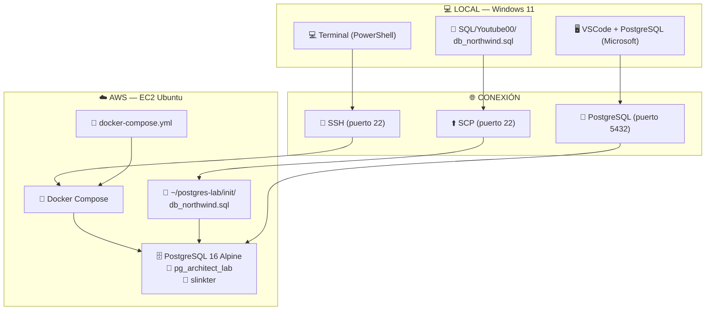

# YouTube00 — Ejercicios y laboratorio (Postgres)

Propósito: documentar cómo ejecutar y validar los ejercicios contenidos en esta carpeta (guías y el dataset db_northwind.sql).

## Contenido clave

- `db_northwind.sql` — Dataset Northwind preparado para Postgres (no incluye DROP/CREATE).
- `1.basico.md` — Guía de SQL básico (SELECT, WHERE, ORDER BY, LIMIT, funciones de agregación).
- `2.intermedio.md` — Joins, GROUP BY, HAVING, subconsultas.
- `3.avanzado.md` — Window functions, CTEs, subconsultas correlacionadas.
- `prompt.md` — Persona ArquiDB y checklist de auditoría.
- `plan.md` — Plan de aprendizaje 16 semanas.

## Requisitos

- `psql` (cliente) o Docker
- Postgres 15+ recomendado

## Arranque rápido

### 1) Usando docker-compose (recomendado)

```bash
docker compose -f "../Youtube01/Taller/docker-compose/Postgres/docker-compose.yaml" up -d
psql -h localhost -U postgres -d northwind -f db_northwind.sql
```

### 2) Usando Docker standalone

```bash
docker run --rm --name pg_lab ^
  -e POSTGRES_USER=postgres ^
  -e POSTGRES_PASSWORD=postgres ^
  -e POSTGRES_DB=northwind ^
  -p 5432:5432 ^
  -v "%cd%/db_northwind.sql":/docker-entrypoint-initdb.d/db_northwind.sql ^
  -d postgres:16-alpine
```

### 3) Usando psql local

```bash
createdb northwind
psql -U <user> -d northwind -f db_northwind.sql
```

## Ejecutar consultas

```bash
# Archivo .sql
psql -h localhost -U postgres -d northwind -f path/to/file.sql

# Consulta inline
psql -h localhost -U postgres -d northwind -c "SELECT * FROM customers LIMIT 5;"

# EXPLAIN ANALYZE
psql -h localhost -U postgres -d northwind -c "EXPLAIN (ANALYZE, BUFFERS) SELECT * FROM customers;"
```

## Consejos

- Copiar bloques SQL de los `.md` a archivos `.sql` y usar `psql -f`.
- No agregar DROP/CREATE DATABASE en `db_northwind.sql` (es dataset-only).
- Incluir `EXPLAIN (ANALYZE, BUFFERS)` al proponer cambios en ejemplos.


# Laboratorio: Despliegue de Arquitectura de Datos en AWS con Docker (End-to-End)

**Instructor:** Principal Data Architect
**Enfoque:** Conectividad, Persistencia y Orquestación.

---

## 1. Introducción
Este laboratorio detalla el proceso completo para llevar la base de datos **Northwind** (optimizada para PostgreSQL) a una instancia **AWS EC2 con Docker**, permitiendo conectarte desde **VSCode en Windows 11** para consultar e insertar datos.

### Acceso a tu cuenta AWS
| Recurso | Valor |
|---------|-------|
| Console URL | `https://629017097739.signin.aws.amazon.com/console` |
| User | `u_docker` |
| Password | *Usa la contraseña real de tu cuenta* |

> **Placeholders usados en esta guía:**
> | Símbolo | Significado | Ejemplo |
> |---------|-------------|---------|
> | `<IP_AWS_EC2>` | IP pública de tu instancia EC2 | `54.123.45.67` |
> | `<IP_LOCAL_PC>` | Tu IP pública local (se ve en `curl ipinfo.io`) | `190.100.50.30` |
> | `<MI_PASSWORD>` | Contraseña de PostgreSQL | `MiClaveSegura2026` |

---

## Diagrama de Arquitectura



---

## 2. Requisitos Previos (Local y Nube)
* **Local:**
  * Archivo `db_northwind.sql` (en esta misma carpeta `SQL/Youtube00/`)
  * Llave privada de AWS (`key_u_docker.pem`)
  * VSCode con extensión **PostgreSQL** de Microsoft
* **Cuenta AWS:** Acceso a `https://629017097739.signin.aws.amazon.com/console` con usuario `u_docker`
* **Nube:** Crearemos una instancia EC2 Ubuntu desde cero en este laboratorio
* **Red:** El Security Group se configurará durante el lanzamiento de la instancia

> **IMPORTANTE:** El archivo `db_northwind.sql` ya está optimizado para PostgreSQL 16+:
> - Incluye **PRIMARY KEYs** y **FOREIGN KEYs**
> - Columnas monetarias en `numeric` (sin pérdida de precisión)
> - **13 índices** en columnas FK para rendimiento en JOINs
> - Sin errores de compatibilidad

---

## 3. Paso 1: Lanzar Instancia EC2 desde Cero

Desde la consola AWS, lanza una instancia que alojará PostgreSQL con Docker.

### 1.1 Acceder al Asistente de Lanzamiento

1. Consola AWS > **EC2** > **Instances** > **Launch instances**
2. Configura los siguientes parámetros:

| Parámetro | Valor |
|-----------|-------|
| **Name** | `postgres-docker-lab` |
| **AMI** | Ubuntu Server 26.04 LTS — `ami-0e5497a77ef21b5ac` (x86) |
| **Architecture** | 64-bit (x86) |
| **Instance type** | `t3.micro` (free tier eligible) |
| **Key pair** | `key_u_docker` |

> **Conceptos:**
> - **AMI (Amazon Machine Image):** Plantilla del sistema operativo. Elegimos Ubuntu porque es compatible con Docker, tiene buena documentación y paquetes actualizados.
> - **Instance type:** El tamaño del servidor virtual. `t3.micro` tiene 2 vCPU y 1 GB RAM — suficiente para un laboratorio pequeño y entra en la capa gratuita de AWS.
> - **Key pair:** Archivo `.pem` que funciona como llave para entrar por SSH. Sin esta llave, no puedes conectarte a la instancia.

### 1.2 Configurar Red (Network settings)

Haz clic en **Edit** en la sección **Network settings** y configura:

- **VPC:** `vpc-0a857b85d7ee9ee48` (default)
- **Subnet:** No preference
- **Auto-assign public IP:** Enable
- **Firewall:** Create security group
  - Security group name: `sg_postgres_lab`
  - Description: `PostgreSQL lab security group`
  - **Elimina** las reglas HTTP y HTTPS que vienen por defecto
  - **Add security group rule**:
1. Type: `SSH` → Source: `My IP`
2. Type: `PostgreSQL` → Source: `My IP`

> **¿Qué es un Security Group?** Es un firewall virtual que controla qué tráfico puede entrar/salir de tu instancia.
> - **SSH (puerto 22):** Necesario para conectarte desde tu terminal.
> - **PostgreSQL (puerto 5432):** Necesario para que VSCode se conecte a la base de datos.
> - **Source: `My IP`:** Solo tu dirección IP puede acceder. Es más seguro que abrirlo a todo internet (`0.0.0.0/0`).

### 1.3 Configurar Almacenamiento

- **Size:** `30` GiB
- **Volume type:** `gp3` (por defecto)

### 1.4 User Data — Instalación Automática de Docker

En **Advanced details**, al final, busca **User data** y pega este script:

```bash
#!/bin/bash
sudo apt update -y
sudo apt install -y docker.io docker-compose-v2
sudo usermod -aG docker ubuntu
sudo systemctl enable docker
```

Este script se ejecuta al arrancar la instancia por primera vez, instalando Docker y Docker Compose automáticamente.

> **¿Qué es User Data?** Es un script que AWS ejecuta automáticamente la primera vez que la instancia enciende. Aquí instalamos Docker para no tener que hacerlo manualmente después.

### 1.5 Lanzar y Verificar

1. Haz clic en **Launch instance**
2. Ve a **EC2 > Instances** y localiza `postgres-docker-lab`
3. Espera a que **Status check** muestre `2/2 checks passed` (1-2 minutos)
4. Copia la **Public IPv4 address** — la necesitarás en todos los pasos siguientes

### 1.6 Alternativa: AWS CLI (lanzamiento rápido)

Si prefieres usar la terminal en lugar de la consola web, ejecuta estos comandos desde tu máquina local (requiere [AWS CLI](https://aws.amazon.com/cli/) configurado con las credenciales de `u_docker`):

```bash
# 1. Crear Security Group y capturar su ID
SG_ID=$(aws ec2 create-security-group \
  --group-name 'sg_postgres_lab' \
  --description 'PostgreSQL lab security group' \
  --vpc-id 'vpc-0a857b85d7ee9ee48' \
  --query 'GroupId' --output text)

# 2. Reglas de ingreso (SSH + PostgreSQL desde tu IP)
aws ec2 authorize-security-group-ingress \
  --group-id "$SG_ID" \
  --ip-permissions \
    '{"IpProtocol":"tcp","FromPort":22,"ToPort":22,"IpRanges":[{"CidrIp":"<IP_LOCAL_PC>/32","Description":"ssh"}]}' \
    '{"IpProtocol":"tcp","FromPort":5432,"ToPort":5432,"IpRanges":[{"CidrIp":"<IP_LOCAL_PC>/32","Description":"PostgreSQL"}]}'

# 3. Lanzar instancia
aws ec2 run-instances \
  --image-id 'ami-0e5497a77ef21b5ac' \
  --instance-type 't3.micro' \
  --key-name 'key_u_docker' \
  --user-data 'IyEvYmluL2Jhc2gKc3VkbyBhcHQgdXBkYXRlIC15CnN1ZG8gYXB0IGluc3RhbGwgLXkgZG9ja2VyLmlvIGRvY2tlci1jb21wb3NlLXYyCnN1ZG8gdXNlcm1vZCAtYUcgZG9ja2VyIHVidW50dQpzdWRvIHN5c3RlbWN0bCBlbmFibGUgZG9ja2Vy' \
  --block-device-mappings '{"DeviceName":"/dev/sda1","Ebs":{"VolumeSize":30,"VolumeType":"gp3"}}' \
  --network-interfaces "{\"AssociatePublicIpAddress\":true,\"DeviceIndex\":0,\"Groups\":[\"$SG_ID\"]}" \
  --tag-specifications '{"ResourceType":"instance","Tags":[{"Key":"Name","Value":"postgres-docker-lab"}]}'
```

> El `user-data` en base64 contiene el mismo script de instalación de Docker. Para regenerarlo: `echo '#!/bin/bash\nsudo apt update -y\nsudo apt install -y docker.io docker-compose-v2\nsudo usermod -aG docker ubuntu\nsudo systemctl enable docker' | base64 -w0`

---

## 4. Paso 2: Conectar y Verificar la Instancia

Conéctate por SSH para verificar que la instancia está lista.

> **SSH (Secure Shell):** Es un protocolo que te permite tomar el control de la terminal de un servidor remoto de forma segura y encriptada. Es como tener el cmd/PowerShell de esa máquina en tu pantalla.
>
> **El archivo `.pem`:** Es tu llave privada. SSH la usa para demostrarle al servidor que eres el dueño de la instancia. Sin ella, el servidor no te deja entrar.

### Conexión SSH

Desde tu terminal local (PowerShell):

```bash
ssh -i "key_u_docker.pem" ubuntu@<IP_AWS_EC2>
```

> **Nota:** `<IP_AWS_EC2>` es la IP pública de esta instancia. Si lanzas una nueva, reemplázala por la IP correspondiente.

### Ubicación de la llave PEM

La llave `key_u_docker.pem` está en la carpeta `Credenciales/`. Los comandos deben usar la ruta completa:

```powershell
ssh -i ".\Credenciales\key_u_docker.pem" ubuntu@<IP_AWS_EC2>
```

> **Error común:** Si pones solo `key_u_docker.pem` sin ruta, PowerShell mostrará:
> `Warning: Identity file key_u_docker.pem not accessible: No such file or directory`
> `Permission denied (publickey).`

### Verificar Docker

Ya dentro de la instancia, confirma que el user-data instaló Docker correctamente:

```bash
docker --version && docker compose version
```

> **Docker:** Es un motor que ejecuta "contenedores" — boxes ligeros y portátiles que contienen todo lo necesario para correr una aplicación (PostgreSQL, por ejemplo). A diferencia de una máquina virtual, Docker comparte el kernel del sistema operativo, lo que lo hace más rápido y liviano.
>
> **Docker Compose:** Herramienta para definir y ejecutar múltiples contenedores juntos (por ejemplo, PostgreSQL + pgAdmin). Se configura con un archivo `docker-compose.yml`.

Deberías ver algo como:

```
Docker version 27.x.x
Docker Compose version v2.x.x
```

### Fallback (si Docker no está instalado)

Si el comando anterior falla, instálalo manualmente:

```bash
sudo apt update && sudo apt install -y docker.io docker-compose-v2
sudo usermod -aG docker $USER
exit
# Vuelve a conectar: ssh -i "key_u_docker.pem" ubuntu@<IP_AWS_EC2>
```

---

## 5. Paso 3: Transferencia de Datos a la Nube (SCP)

> **SCP (Secure Copy)** es un comando que transfiere archivos entre tu PC y un servidor remoto usando el mismo protocolo de SSH. Es como un `cp` pero a través de la red, con la conexión encriptada.

Desde **PowerShell en tu máquina local** (Windows 11), envía el dataset al servidor.

### Comando correcto (con ruta completa a la llave)

La llave `key_u_docker.pem` está en la carpeta `Credenciales/` del repositorio. Debes usar la ruta completa:

```powershell
# Desde la raíz del repositorio ApuntesSQL
scp -i ".\Credenciales\key_u_docker.pem" .\SQL\Youtube00\db_northwind.sql ubuntu@<IP_AWS_EC2>:/home/ubuntu/
```

### Error común al hacer SCP

Si ejecutas solo con el nombre del archivo sin ruta:

```powershell
scp -i "key_u_docker.pem" ...  # ❌ MAL
```

Obtendrás:

```
Warning: Identity file key_u_docker.pem not accessible: No such file or directory.
Permission denied (publickey).
```

> **¿Por qué?** PowerShell busca el archivo en el directorio actual (`ApuntesSQL/`), pero el `.pem` está en `ApuntesSQL/Credenciales/`.

### Verificar que se transfirió correctamente

Si el comando funciona, verás una salida como esta:

```
db_northwind.sql         100%  348KB 468.4KB/s   00:00
```

Para confirmar desde la EC2 (en la sesión SSH):

```bash
ls -lh /home/ubuntu/db_northwind.sql
```

Debe mostrar el archivo ~348KB.

> **Tip:** Puedes transferir el `docker-compose.yml` de la misma forma para no tener que crearlo con `nano`:
> ```powershell
> scp -i ".\Credenciales\key_u_docker.pem" .\SQL\Youtube00\docker-compose.yml ubuntu@<IP_AWS_EC2>:/home/ubuntu/postgres-lab/
> ```

---

## 6. Paso 4: Conexión y Preparación del Servidor (SSH)

Ya dentro del servidor Ubuntu, prepara la estructura de directorios:

```bash
# Crear directorio del proyecto y de inicialización
mkdir -p ~/postgres-lab/init

# Mover el archivo SQL que subimos por SCP a la carpeta de inicialización
mv ~/db_northwind.sql ~/postgres-lab/init/

# Entrar a la carpeta del proyecto
cd ~/postgres-lab
```

---

## 7. Paso 5: Definición de la Infraestructura (YAML)

Crea el archivo que orquestará el motor de base de datos:

```bash
nano docker-compose.yml
```

> **nano:** Es un editor de texto que se usa desde la terminal. Es más simple que vim y viene instalado en Ubuntu por defecto.
> - **Navegar:** Usa las flechas del teclado.
> - **Pegar:** `Ctrl+Shift+V` o clic derecho.
> - **Guardar:** `Ctrl+O` → Enter.
> - **Salir:** `Ctrl+X`.

Pega el siguiente contenido:

```yaml
services:
  db:
    image: postgres:16-alpine
    container_name: pg_architect_lab
    restart: always
    environment:
      POSTGRES_USER: slinkter
      POSTGRES_PASSWORD: <MI_PASSWORD>
      POSTGRES_DB: northwind
    ports:
      - "5432:5432"
    volumes:
      - pg_data:/var/lib/postgresql/data
      - ./init/db_northwind.sql:/docker-entrypoint-initdb.d/db_northwind.sql
    networks:
      - pg_network

networks:
  pg_network:
    driver: bridge

volumes:
  pg_data:
```
> **Explicación del archivo:**
> - `image: postgres:16-alpine`: Usamos PostgreSQL 16 en Alpine Linux (~200 MB, muy ligero).
> - `container_name: pg_architect_lab`: Nombre del contenedor para identificarlo fácilmente.
> - `environment`: Variables de entorno que PostgreSQL usa al iniciar (usuario, contraseña, base de datos).
> - `ports: "5432:5432"`: Expone el puerto 5432 del contenedor hacia el exterior (la red de AWS), para que puedas conectar desde VSCode.
> - `volumes`:
>   - `pg_data:/var/lib/postgresql/data`: Los datos de la base se guardan en un volumen persistente. Si borras el contenedor, los datos no se pierden.
>   - `./init/db_northwind.sql:/docker-entrypoint-initdb.d/db_northwind.sql`: El SQL se monta en la carpeta de inicialización para que PostgreSQL lo ejecute automáticamente al crear la base.
> - `networks`: Los contenedores se comunican entre sí a través de una red interna llamada `pg_network`.

*Guardar: Ctrl+O, Enter. Salir: Ctrl+X.*

> **Seguridad:** Cambia `<MI_PASSWORD>` por una contraseña segura.

---

## 8. Paso 6: Lanzamiento y Magia de Inicialización

Levanta el sistema:

```bash
docker compose up -d
```

**Súper Importante:** No necesitas ejecutar el script SQL manualmente. Gracias al volumen configurado en el YAML (`/docker-entrypoint-initdb.d/`), PostgreSQL detecta el archivo `db_northwind.sql` y lo ejecuta automáticamente durante la creación de la base de datos.

> **¿Cómo funciona `docker-entrypoint-initdb.d/`?** Es una carpeta especial dentro de la imagen oficial de PostgreSQL. Cuando el contenedor arranca por primera vez y la base de datos aún no existe, PostgreSQL ejecuta todos los archivos `.sql` (o `.sh`) que encuentre en esa carpeta en orden alfabético. Esto permite popular la base automáticamente sin intervención manual.

Verifica que el script se haya ejecutado correctamente mirando los logs:

```bash
docker logs -f pg_architect_lab
```
*Deberías ver una secuencia de comandos CREATE TABLE e INSERT. Al final aparecerá: `PostgreSQL init process complete; ready for start up.`*

Para salir del log: `Ctrl+C`.

---

## 9. Paso 7: Prueba de Integridad y Conexión

### Opción A: Acceso rápido desde la EC2 (Terminal)
Accede al motor dentro del contenedor:

```bash
docker exec -it pg_architect_lab psql -U slinkter -d northwind
```

> **psql:** Es el cliente de línea de comandos de PostgreSQL. Permite ejecutar consultas SQL directamente desde la terminal.
>
> **docker exec -it:** Ejecuta un comando dentro de un contenedor en ejecución. `-it` significa "interactivo" (te permite escribir comandos y ver resultados). En este caso, ejecuta `psql -U slinkter -d northwind` dentro del contenedor `pg_architect_lab`.

### Opción B: Conexión desde tu PC Local (Ideal para estudiar)
Si tienes `psql` instalado en tu computadora:

```bash
psql -h <IP_AWS_EC2> -U slinkter -d northwind
```
*Te pedirá la contraseña: `<MI_PASSWORD>`*

### Validación completa

Dentro de `psql`, ejecuta:

```sql
-- Listar las 13 tablas cargadas
\dt

-- Conteo de registros en cada tabla
SELECT 'categories' AS tabla, count(*) FROM categories
UNION ALL SELECT 'customers', count(*) FROM customers
UNION ALL SELECT 'employees', count(*) FROM employees
UNION ALL SELECT 'products', count(*) FROM products
UNION ALL SELECT 'orders', count(*) FROM orders
UNION ALL SELECT 'order_details', count(*) FROM order_details
UNION ALL SELECT 'suppliers', count(*) FROM suppliers
UNION ALL SELECT 'shippers', count(*) FROM shippers
UNION ALL SELECT 'region', count(*) FROM region
UNION ALL SELECT 'territories', count(*) FROM territories
UNION ALL SELECT 'us_states', count(*) FROM us_states
ORDER BY 1;

-- Verificar que los índices FK se crearon
SELECT indexname, tablename FROM pg_indexes
WHERE tablename IN ('orders','order_details','products','territories')
  AND indexname LIKE 'idx_%';

-- Verificar constraints (PK + FK)
SELECT conname, contype FROM pg_constraint
WHERE connamespace = 'public'::regnamespace
ORDER BY contype, conname;

-- Salir de psql
\q
```

---

## 10. Paso 8: Insertar Datos desde VSCode (Windows 11)

### Instalación de la Extensión (PostgreSQL de Microsoft)

1. VSCode > Extensiones (`Ctrl+Shift+X`)
2. Busca **"PostgreSQL"** de **Microsoft** (publicada por microsoft.com, 500k+ instalaciones)
3. Haz clic en **Install**

### Configuración de Conexión

1. Abre la extensión: icono de elefante 🐘 en la barra lateral izquierda (o `Ctrl+Shift+P` → `PostgreSQL: Add Connection`)
2. Aparecerá un formulario modal. Ingresa los parámetros:

   | Campo | Valor |
   |-------|-------|
   | **Server name** | `<IP_AWS_EC2>` |
   | **Authentication Type** | `Password` |
   | **User name** | `slinkter` |
   | **Password** | `<MI_PASSWORD>` |
   | **Save Password** | ✅ Marcado |
   | **Database name** | `northwind` |
   | **Connection Name** | `AWS Northwind` |
   | **Server Group** | `Servers` |

3. Haz clic en **Save & Connect** o **Test Connection**

### Error SSL esperado y solución

La primera vez aparecerá:

```
connection failed: server does not support SSL, but SSL was required
```

**Solución:** Haz clic en **Advanced** (abajo del formulario) → busca **SSL mode** → cámbialo a `disable` → **Save**.

4. La conexión aparecerá en el panel lateral (icono 🐘). Haz clic derecho → **Connect**
5. Si todo está bien, verás las tablas desplegables: `Tables → public → categories, customers, ...`

### Connection String directa (también funciona)

```
postgresql://slinkter:<MI_PASSWORD>@<IP_AWS_EC2>:5432/northwind?sslmode=disable
```

### Ejemplo: Insertar un nuevo cliente

Abre una nueva consulta: haz clic derecho en la conexión → **New Query** (o `Ctrl+Shift+P` → `PostgreSQL: New Query`) y ejecuta:

```sql
BEGIN;

INSERT INTO customers (customer_id, company_name, contact_name, city, country)
VALUES ('NUEVO', 'Mi Empresa SAC', 'Juan Pérez', 'Lima', 'Peru');

INSERT INTO orders (order_id, customer_id, employee_id, order_date, required_date)
VALUES (99999, 'NUEVO', 1, CURRENT_DATE, CURRENT_DATE + INTERVAL '7 days');

COMMIT;
```

> **BEGIN / COMMIT:** Crean una transacción. `BEGIN` inicia una unidad de trabajo, y `COMMIT` la confirma. Si algo falla entre medio, puedes hacer `ROLLBACK` y ningún cambio se aplica. Esto asegura que ambos INSERT se ejecuten juntos (o ninguno).

Verifica:

```sql
SELECT c.company_name, o.order_id, o.order_date
FROM customers c
JOIN orders o ON c.customer_id = o.customer_id
WHERE c.customer_id = 'NUEVO';
```

### Troubleshooting (Conexión desde VSCode)

| Error | Solución |
|-------|----------|
| `ECONNREFUSED` | Verifica que el puerto 5432 esté abierto en Security Group |
| `no pg_hba.conf entry` | Conéctate por SSH y ejecuta lo que está en la sección 11 |
| `SSL not enabled` | Desmarca SSL en la conexión o usa `sslmode=disable` |
| `timeout` | La IP pública de EC2 cambió o el Security Group no tiene tu IP |

---

## 11. Troubleshooting

### Error: `SSH: Connection timed out`

**Síntomas:**
- `Test-NetConnection -ComputerName IP -Port 22` → `TcpTestSucceeded: False`
- Incluso **EC2 Instance Connect** desde la consola AWS muestra: `Failed to connect to your instance`
- Todo parece correcto en la configuración

**Diagnóstico paso a paso (en orden):**

1. **Verificar System Log** — `EC2 > Instances > Actions > Monitor and troubleshoot > Get system log`
   - ¿Booteó correctamente? Busca `Welcome to Ubuntu` y `docker installed`
   - En nuestro caso: el log mostró `Docker version 29.1.3` instalado vía cloud-init ✅

2. **Verificar Status Check** — La instancia debe mostrar `2/2 checks passed`

3. **Verificar Security Group** — `EC2 > Security Groups > sg_postgres_lab > Inbound rules`
   - SSH (22) y PostgreSQL (5432) con Source `My IP` o `0.0.0.0/0`
   - En nuestro caso: las reglas estaban correctas con `<IP_LOCAL_PC>/32` ✅

4. **Verificar VPC / Internet Gateway** — `VPC > Your VPCs > vpc-0a857b85d7ee9ee48`
   - Debe mostrar un Internet Gateway conectado (columna IGW)
   - En nuestro caso: `igw-0a26730ec158a9046` conectado ✅

5. **Verificar Route Table** — `VPC > Route Tables > rtb-082a16d87c17e3e47 > Routes`
   - Debe tener: `0.0.0.0/0 → igw-xxxxxxxx`
   - En nuestro caso: presente y activa ✅

6. **Verificar Network ACL** — `VPC > Network ACLs > acl-08e94b58e1ab33319 > Inbound rules`
   - Debe tener: Rule 100, ALL Traffic, `0.0.0.0/0`, ALLOW
   - En nuestro caso: default NACL correcto ✅

7. **Get Screenshot** — `EC2 > Instances > Actions > Monitor and troubleshoot > Get screenshot`
   - Si ves el prompt `ubuntu login:`, la instancia está bien y el problema es de red

**Solución:** Si todo lo anterior está correcto pero aún falla, cambia temporalmente las reglas del Security Group de `My IP` a `0.0.0.0/0`:
1. `EC2 > Security Groups > sg_postgres_lab > Edit inbound rules`
2. Cambia SSH y PostgreSQL Source de `My IP` a `Custom 0.0.0.0/0`
3. Reintenta SSH
4. **Apenas funcione, vuelve a cambiarlo a `My IP`**

> **Causa raíz en este laboratorio:** El Security Group mostraba la IP correcta (`<IP_LOCAL_PC>/32`), pero solo funcionó al abrir temporalmente a `0.0.0.0/0`. Posiblemente un tema de resolución CIDR o propagación. Después de conectar exitosamente, se revirtió a `My IP` sin problemas.

### Error: `Identity file key_u_docker.pem not accessible`

La llave `.pem` no está en el directorio actual. Usa la ruta completa:

```powershell
scp -i ".\Credenciales\key_u_docker.pem" .\SQL\Youtube00\db_northwind.sql ubuntu@IP:/home/ubuntu/
```

### Error: `server does not support SSL, but SSL was required`

Al conectar desde VSCode con la extensión PostgreSQL de Microsoft. Solución:

1. En el formulario de conexión, haz clic en **Advanced**
2. Busca **SSL mode** → cámbialo a `disable`
3. Guarda y reconecta

### Error: `no pg_hba.conf entry for host`

Dentro de la EC2, edita la configuración de Postgres:

```bash
docker exec -it pg_architect_lab bash
echo "host all all 0.0.0.0/0 md5" >> /var/lib/postgresql/data/pg_hba.conf
exit
docker restart pg_architect_lab
```

### Error: `psql: error: connection to server ... No route to host`

1. Verifica la IP pública de la EC2 (pudo cambiar al reiniciar)
2. Ve a AWS Console > EC2 > Instancia > IP pública
3. Verifica Security Group (Paso 1 — configurado durante el lanzamiento de la instancia)

### Error: `FATAL: password authentication failed`

La contraseña en `docker-compose.yml` no coincide con la que usas. Verifica:
```bash
docker compose down
# Edita el YAML y corrige la password
nano ~/postgres-lab/docker-compose.yml
docker compose up -d
```

### Verificar que el SQL se cargó sin errores

```bash
docker logs pg_architect_lab 2>&1 | grep -i "error\|fatal\|warning"
```
Si no hay salida, todo está bien.

---

## 12. Análisis de Ingeniería Real

* **Idempotencia:** Si borras el contenedor y lo vuelves a levantar, la data persiste gracias al volumen `pg_data`.
* **Alpine v16:** Utilizamos la versión más ligera para optimizar recursos en la nube (~200 MB).
* **Optimización del SQL:**
  - `numeric` en lugar de `real` → precisión exacta en montos
  - 14 PRIMARY KEYs → integridad referencial
  - 13 índices FK → JOINs rápidos
* **Separación de Preocupaciones:** El script SQL solo se encarga de la data; el YAML se encarga de la infraestructura.
* **Conexión remota:** Docker expone el puerto 5432; desde VSCode en Win11 trabajas como si Postgres estuviera local.

---

## 13. Comandos Rápidos de Referencia

| Acción | Comando |
|--------|---------|
| Conectar SSH | `ssh -i "key_u_docker.pem" ubuntu@<IP_AWS_EC2>` |
| Subir archivo | `scp -i "key_u_docker.pem" ./db_northwind.sql ubuntu@<IP_AWS_EC2>:/home/ubuntu/` |
| Iniciar Postgres | `docker compose up -d` |
| Detener Postgres | `docker compose down` |
| Ver logs | `docker logs pg_architect_lab` |
| Acceder a psql | `docker exec -it pg_architect_lab psql -U slinkter -d northwind` |
| Conectar desde local | `psql -h <IP_AWS_EC2> -U slinkter -d northwind` |
| Extension VSCode | `PostgreSQL` de Microsoft (buscar en Extensiones) |
| Connection string | `postgresql://slinkter:<MI_PASSWORD>@<IP_AWS_EC2>:5432/northwind?sslmode=disable` |

---

