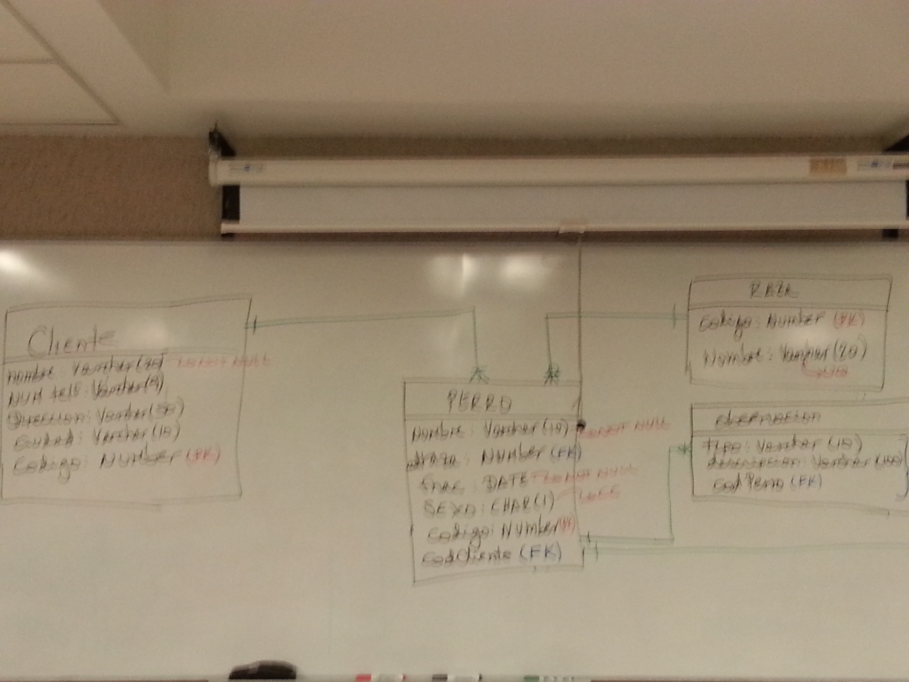
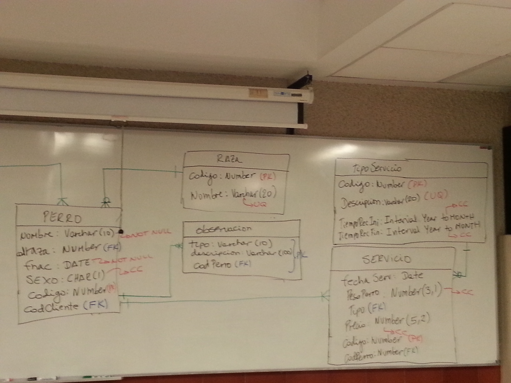
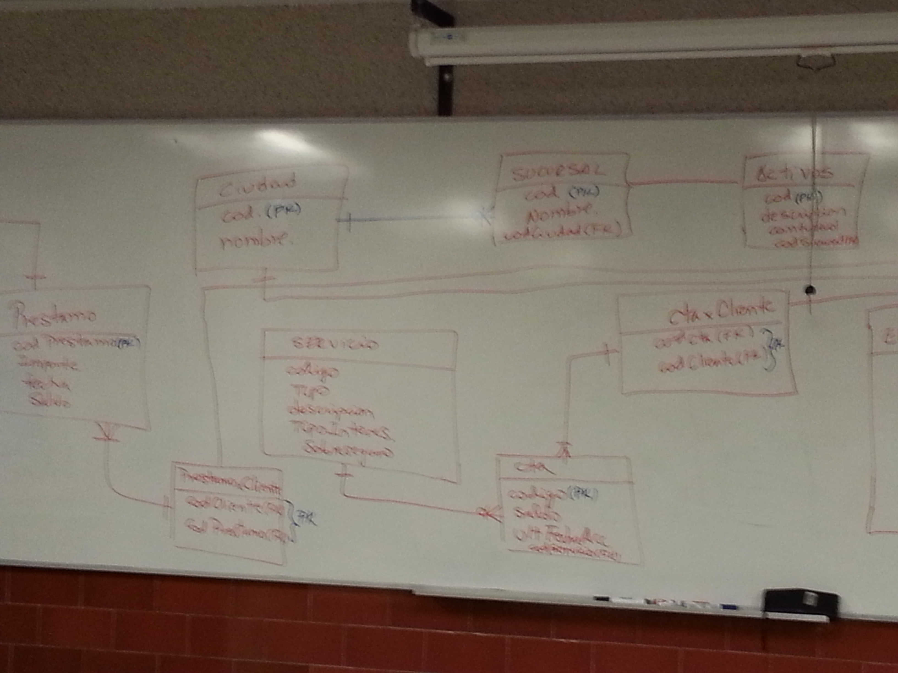
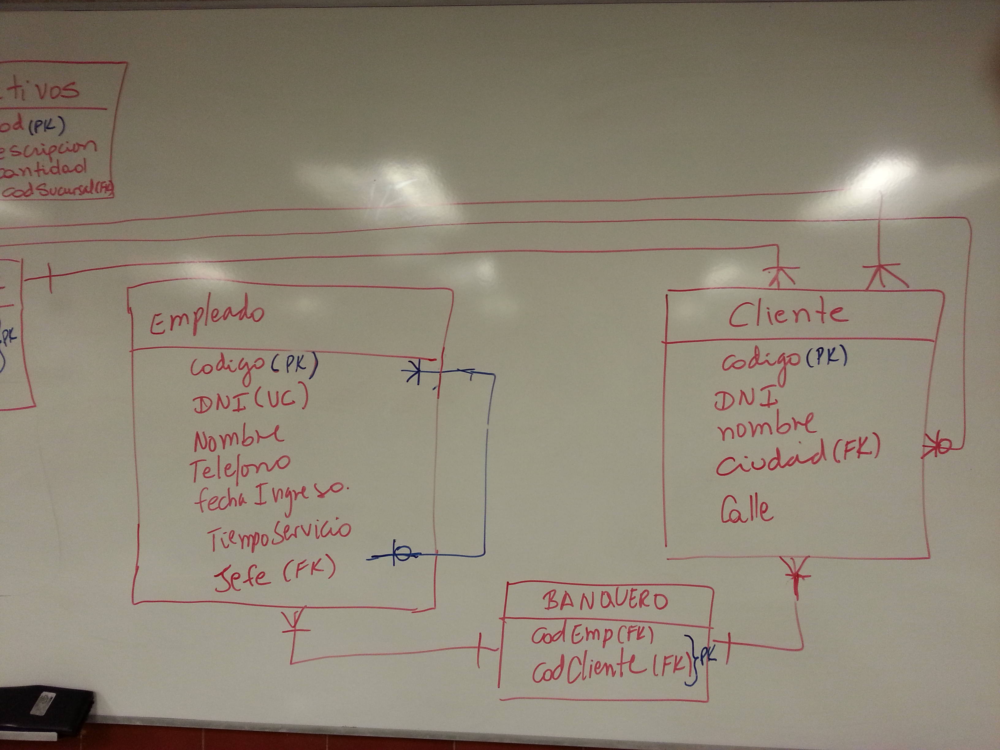
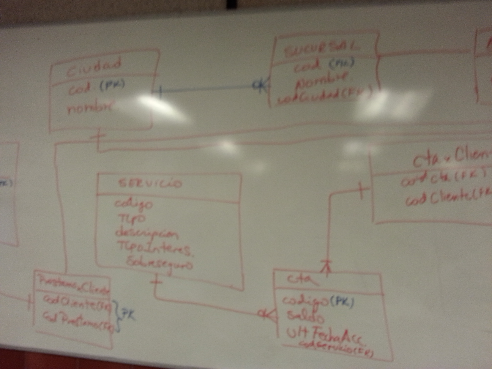
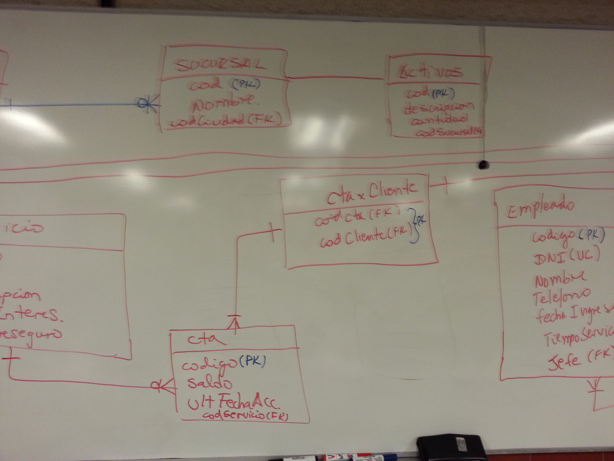
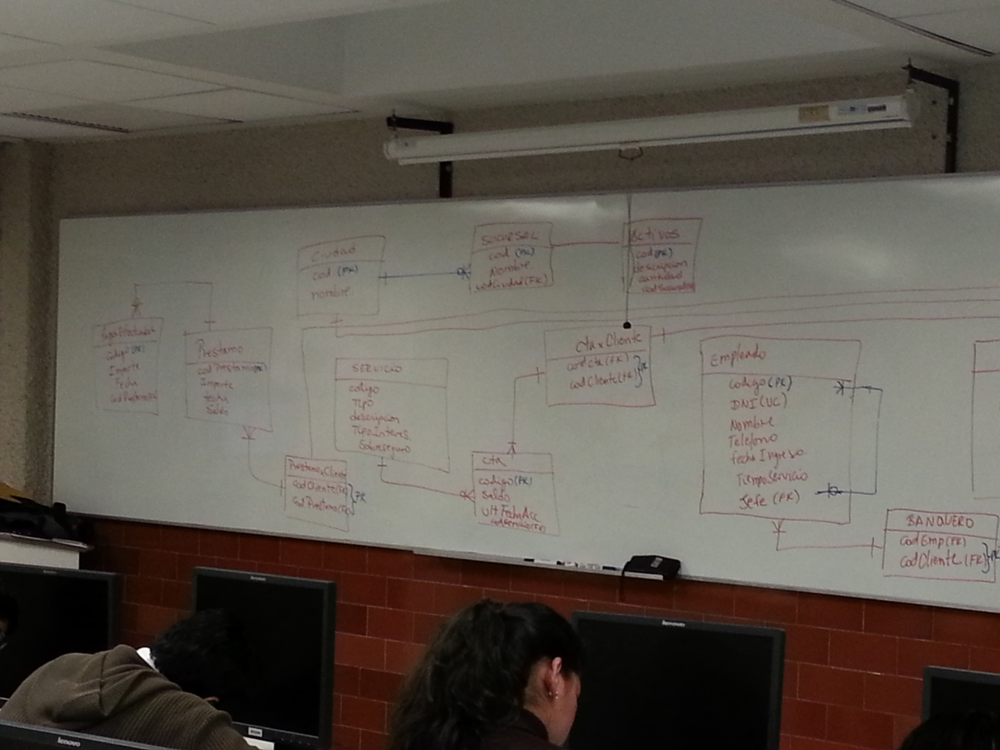

# Clase 03: Bases de Datos Relacionales

**Fecha:** Noviembre 18, 2025 (Inferido del periodo del curso)

---

## Notas Generales

### Modelo Relacional de Datos

El modelo relacional es el modelo de datos más extendido para la gestión de bases de datos. Fue propuesto por E.F. Codd en IBM en 1970. Se basa en el concepto matemático de relación, que se representa visualmente como una tabla.

**Conceptos Fundamentales:**
*   **Relación (Tabla):** Una estructura bidimensional compuesta por filas y columnas. Cada relación tiene un nombre único.
*   **Atributo (Columna/Campo):** Representa una característica o propiedad de la entidad que describe la tabla. Cada atributo tiene un nombre único dentro de la tabla y un dominio (tipo de dato).
*   **Tupla (Fila/Registro):** Una instancia de una relación, que representa un conjunto de valores para cada uno de los atributos de la tabla.
*   **Dominio:** El conjunto de valores permitidos para un atributo. Define el tipo de dato y las restricciones de valores.
*   **Grado:** El número de atributos (columnas) en una relación.
*   **Cardinalidad:** El número de tuplas (filas) en una relación.

### Claves en el Modelo Relacional

Las claves son atributos o conjuntos de atributos especiales que garantizan la integridad y permiten establecer relaciones entre tablas.

*   **Superclave:** Un atributo o conjunto de atributos que identifica de forma única una tupla en una relación.
*   **Clave Candidata:** Una superclave mínima, es decir, una superclave de la que no se puede eliminar ningún atributo sin perder su propiedad de unicidad.
*   **Clave Primaria (PK):** Una de las claves candidatas elegida por el diseñador de la base de datos para identificar de forma única cada tupla en una tabla. Sus valores no pueden ser nulos (`NOT NULL`) y deben ser únicos.
*   **Clave Foránea (FK):** Un atributo o conjunto de atributos en una tabla que hace referencia a la clave primaria de otra tabla. Establece la relación entre dos tablas y mantiene la integridad referencial. Una clave foránea puede contener valores nulos si la relación es opcional.

### Integridad Referencial

La integridad referencial es un sistema de reglas que los sistemas de gestión de bases de datos relacionales utilizan para asegurar que las relaciones entre tablas sean válidas y que los usuarios no borren ni cambien datos relacionados accidentalmente.

*   **Restricciones:** Asegura que cada valor de una clave foránea en la tabla secundaria (`hija`) coincida con un valor existente de la clave primaria en la tabla primaria (`padre`).
*   **Acciones en Cascada (ON DELETE/UPDATE):** Define cómo el SGBD debe actuar cuando se intenta modificar o eliminar una tupla en la tabla padre que tiene tuplas relacionadas en la tabla hija (ej. `CASCADE`, `SET NULL`, `RESTRICT`).

### Operaciones Relacionales (Álgebra Relacional)

Aunque los usuarios interactúan con SQL, el modelo relacional se basa en el álgebra relacional, que define las operaciones fundamentales para manipular las relaciones:

*   **Selección (σ):** Filtra filas de una tabla basándose en una condición.
*   **Proyección (π):** Selecciona columnas de una tabla.
*   **Unión (∪):** Combina dos tablas con esquemas compatibles.
*   **Diferencia (-):** Devuelve las tuplas de una tabla que no están en otra.
*   **Intersección (∩):** Devuelve las tuplas comunes a dos tablas.
*   **Producto Cartesiano (×):** Combina cada tupla de una tabla con cada tupla de otra.
*   **Join (⋈):** Combina tuplas de dos tablas basándose en una condición de igualdad entre atributos.

---

## Pistas y Keywords

*   **Modelo Relacional:** Basado en tablas y relaciones matemáticas.
*   **Relación (Tabla):** Entidad principal para almacenar datos.
*   **Atributo (Columna):** Característica de una entidad.
*   **Tupla (Fila):** Registro individual en una tabla.
*   **Dominio:** Conjunto de valores permitidos para un atributo.
*   **Clave Primaria (PK):** Identificador único de fila, `NOT NULL`.
*   **Clave Foránea (FK):** Establece relaciones, referencia a PK.
*   **Integridad Referencial:** Reglas para mantener relaciones válidas.
*   **Álgebra Relacional:** Operaciones fundamentales (`SELECT`, `PROJECT`, `JOIN`).

---

## Resumen Final Crítico

Las bases de datos relacionales son el pilar de la gestión de datos moderna, ofreciendo una estructura lógica y bien definida para almacenar y manipular la información. El modelo, basado en tablas y relaciones, junto con la rigurosa aplicación de claves (primarias y foráneas) y la integridad referencial, garantiza la consistencia, la coherencia y la capacidad de consulta de los datos. Comprender estos fundamentos es esencial para diseñar bases de datos eficientes, aplicar consultas SQL efectivas y asegurar la fiabilidad de los sistemas de información.

---

## Conexiones con Clases Anteriores y Siguientes

*   **Conexiones Anteriores:** Esta clase se basa en el conocimiento de los "Sistemas de Gestión de Base de Datos" (Clase 02), explicando el modelo específico que la mayoría de los SGBD utilizan. Los "Fundamentos de Administración de Información" (Clase 01) proporcionan el contexto general para la necesidad de organizar los datos de esta manera.
*   **Conexiones Siguientes:** Es la base conceptual para la "Administración de RDBMS" (Clase 04), la manipulación de datos con "DML y Consultas Simples" (Clase 05), y las "Consultas Avanzadas SQL" (Clase 10 y 11). También es indispensable para el "Modelamiento de Datos" (Clase 06, 07 y 09), donde se aplicarán los principios del diseño relacional.

---
**Nota:** El contenido de esta clase ha sido inferido del título del curso y conocimientos generales sobre la materia, dado que el archivo `.ppt` original no pudo ser procesado directamente.

