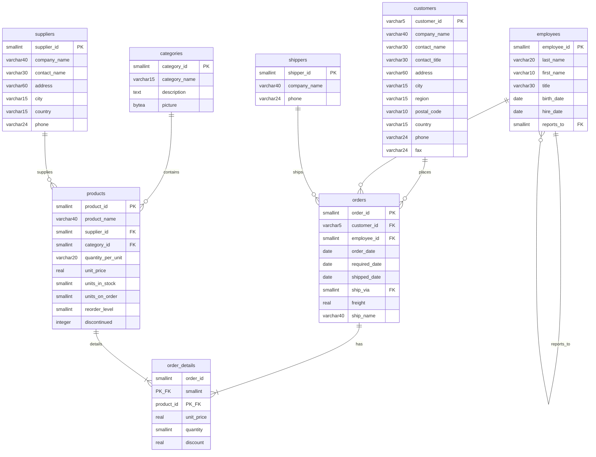

# Diagrama de Entidad-Relación de Northwind PostgreSQL (Formato Mermaid)

Este archivo contiene el código en formato Mermaid para generar un diagrama visual de la base de datos `Northwind` en PostgreSQL. Puedes copiar y pegar este bloque de código en un editor compatible con Mermaid para ver el gráfico.



# SQL Básico con PostgreSQL: Fundamentos Transaccionales

Esta sección cubre los pilares fundamentales de SQL orientados al motor **PostgreSQL** mediante el uso del dataset **Northwind**. Los ejercicios están diseñados para asimilar la sintaxis estándar y el comportamiento del motor al recuperar registros.

## 1. Recuperación Selectiva de Información (`SELECT`)

### Consultas Globales (`SELECT *`)

**Objetivo Académico:** Comprender la recuperación de la totalidad de atributos de una relación. Aunque útil en desarrollo, en arquitectura de alto rendimiento se debe evitar el uso de `*` para minimizar el tráfico de red e I/O innecesario.

1.  **Listar la totalidad de registros de la tabla de Clientes:**

    ```sql
    SELECT * FROM customers;
    ```

2.  **Ver todos los productos:**

    ```sql
    SELECT * FROM products;
    ```

3.  **Ver todos los empleados:**
    ```sql
    SELECT * FROM employees;
    ```

### Proyección de Atributos Específicos

**Objetivo Académico:** Optimizar la recuperación de datos solicitando únicamente los campos requeridos por la lógica de negocio.

4.  **Recuperar el contacto y teléfono de la tabla de clientes:**

    ```sql
    SELECT contact_name, phone FROM customers;
    ```

5.  **Proyectar nombre de producto y su respectivo valor unitario:**
    ```sql
    SELECT product_name, unit_price FROM products;
    ```

### Definición de Alias (`AS`)

**Objetivo Académico:** Facilitar la legibilidad de los resultados y estructurar la salida para su consumo por el backend o herramientas de reporte.

6.  **Mostrar el nombre del producto con el alias "nombre_producto":**
    ```sql
    SELECT product_name AS nombre_producto FROM products;
    ```

## 2. Restricción y Filtrado de Datos (`WHERE`)

### Operadores de Comparación Estándar

**Objetivo Académico:** Reducir el conjunto de resultados mediante predicados lógicos, fundamental para el rendimiento del Query Planner.

7.  **Encontrar todos los productos del proveedor con ID 1:**

    ```sql
    SELECT * FROM products WHERE supplier_id = 1;
    ```

8.  **Listar productos con un precio superior a $50:**

    ```sql
    SELECT * FROM products WHERE unit_price > 50;
    ```

9.  **Listar todos los pedidos que no fueron enviados por el transportista con ID 2:**
    ```sql
    SELECT * FROM orders WHERE ship_via != 2;
    ```

### `LIKE`

**Objetivo:** Buscar un patrón en una columna de texto.

10. **Encontrar clientes cuyo nombre de contacto empieza con 'A':**

    ```sql
    SELECT * FROM customers WHERE contact_name LIKE 'A%';
    ```

11. **Encontrar clientes cuyo país contiene la palabra 'land':**
    ```sql
    SELECT * FROM customers WHERE country LIKE '%land%';
    ```

### `IN`

**Objetivo:** Filtrar por una lista de valores posibles.

12. **Seleccionar clientes de 'Germany', 'France' o 'UK':**
    ```sql
    SELECT * FROM customers WHERE country IN ('Germany', 'France', 'UK');
    ```

### `BETWEEN`

**Objetivo:** Filtrar un rango de valores.

13. **Seleccionar productos con un precio entre $10 y $20:**
    ```sql
    SELECT * FROM products WHERE unit_price BETWEEN 10 AND 20;
    ```

### `IS NULL` / `IS NOT NULL`

**Objetivo:** Encontrar filas con valores nulos o no nulos.

14. **Encontrar clientes que no tienen especificada una región:**
    ```sql
    SELECT * FROM customers WHERE region IS NULL;
    ```

### Operadores Lógicos (`AND`, `OR`, `NOT`)

**Objetivo:** Combinar múltiples condiciones en un `WHERE`.

15. **Clientes de Alemania que viven en Berlin:**

    ```sql
    SELECT * FROM customers WHERE country = 'Germany' AND city = 'Berlin';
    ```

16. **Productos que están descontinuados O tienen 0 unidades en stock:**
    ```sql
    SELECT * FROM products WHERE discontinued = 1 OR units_in_stock = 0;
    ```

## 3. Ordenamiento de Resultados (`ORDER BY`)

**Objetivo:** Ordenar el conjunto de resultados por una o más columnas.

17. **Listar productos ordenados por precio, del más barato al más caro:**

    ```sql
    SELECT * FROM products ORDER BY unit_price ASC;
    ```

18. **Listar productos ordenados por precio, del más caro al más barato:**

    ```sql
    SELECT * FROM products ORDER BY unit_price DESC;
    ```

19. **Listar clientes ordenados por país y luego por nombre de contacto:**
    ```sql
    SELECT * FROM customers ORDER BY country, contact_name;
    ```

## 4. Limitación de Resultados (`LIMIT`)

**Objetivo:** Limitar el número de filas devueltas.

20. **Obtener los 5 productos más caros:**
    ```sql
    SELECT * FROM products ORDER BY unit_price DESC LIMIT 5;
    ```

## 5. Valores Únicos (`DISTINCT`)

**Objetivo:** Devolver solo valores diferentes en una columna.

21. **Listar los países únicos de los clientes:**
    ```sql
    SELECT DISTINCT country FROM customers;
    ```

## 6. Funciones de Agregación y Métricas de Datos

**Objetivo Académico:** Realizar cálculos aritméticos sobre un conjunto de filas para obtener resultados sumarizados.

### Conteo de Registros (`COUNT`)

22. **Contar el número total de clientes:**

    ```sql
    SELECT COUNT(*) FROM customers;
    ```

23. **Contar cuántos productos están descontinuados:**
    ```sql
    SELECT COUNT(*) FROM products WHERE discontinued = 1;
    ```

### `SUM`

**Objetivo:** Sumar los valores de una columna numérica.

24. **Calcular el valor total del inventario (unidades en stock \* precio):**
    ```sql
    SELECT SUM(units_in_stock * unit_price) AS total_inventory_value FROM products;
    ```

### `AVG`

**Objetivo:** Calcular el promedio de los valores de una columna.

25. **Calcular el precio promedio de los productos:**
    ```sql
    SELECT AVG(unit_price) FROM products;
    ```

### `MIN` y `MAX`

**Objetivo:** Obtener el valor mínimo y máximo de una columna.

26. **Encontrar el producto más barato y el más caro:**
    ```sql
    SELECT MIN(unit_price) AS cheapest, MAX(unit_price) AS most_expensive FROM products;
    ```

## 7. Agrupación de Datos (`GROUP BY`)

**Objetivo:** Agrupar filas que tienen los mismos valores en columnas específicas en filas de resumen.

27. **Contar cuántos clientes hay en cada país:**

    ```sql
    SELECT country, COUNT(*) AS number_of_customers FROM customers GROUP BY country;
    ```

28. **Calcular el precio promedio de productos por cada categoría:**

    ```sql
    SELECT category_id, AVG(unit_price) FROM products GROUP BY category_id;
    ```

29. **Obtener el número de pedidos gestionados por cada empleado:**
    ```sql
    SELECT employee_id, COUNT(order_id) AS total_orders FROM orders GROUP BY employee_id;
    ```

## 8. Relaciones entre Tablas (`JOIN`)

### Intersección de Conjuntos (`INNER JOIN`)

**Objetivo Académico:** Combinar tuplas de dos o más relaciones basadas en un predicado común (usualmente PK-FK), fundamental en la arquitectura relacional para reconstruir el modelo de negocio.

30. **Mostrar los productos y los nombres de sus proveedores:**

    ```sql
    SELECT p.product_name, s.contact_name AS supplier
    FROM products p
    INNER JOIN suppliers s ON p.supplier_id = s.supplier_id;
    ```

31. **Listar los pedidos con el nombre del cliente que los realizó:**

    ```sql
    SELECT o.order_id, c.contact_name
    FROM orders o
    INNER JOIN customers c ON o.customer_id = c.customer_id;
    ```

32. **Obtener detalles de un pedido (producto y cantidad) para el pedido 10248:**

    ```sql
    SELECT p.product_name, od.quantity
    FROM order_details od
    INNER JOIN products p ON od.product_id = p.product_id
    WHERE od.order_id = 10248;
    ```

33. **Ver qué empleado gestionó qué pedido:**

    ```sql
    SELECT o.order_id, e.first_name, e.last_name
    FROM orders o
    INNER JOIN employees e ON o.employee_id = e.employee_id;
    ```

34. **Listar los productos y la categoría a la que pertenecen:**
    ```sql
    SELECT p.product_name, c.category_name
    FROM products p
    INNER JOIN categories c ON p.category_id = c.category_id;
    ```
