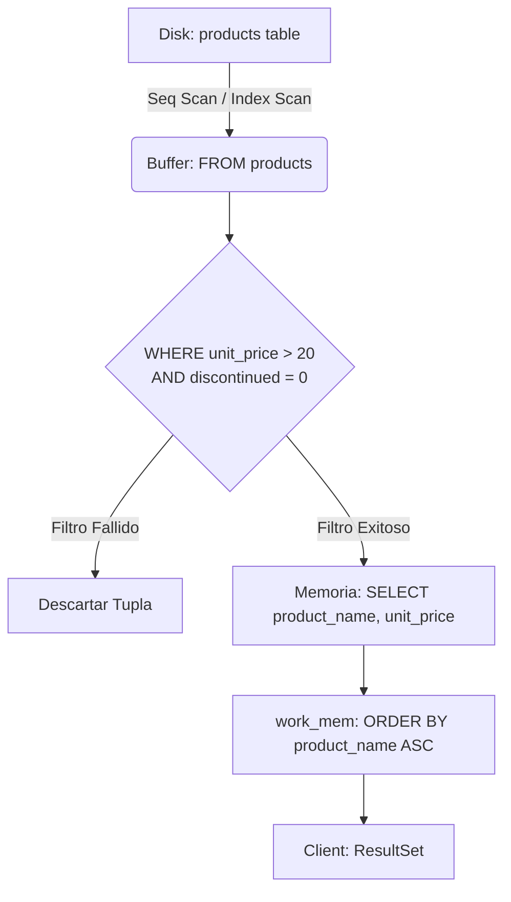
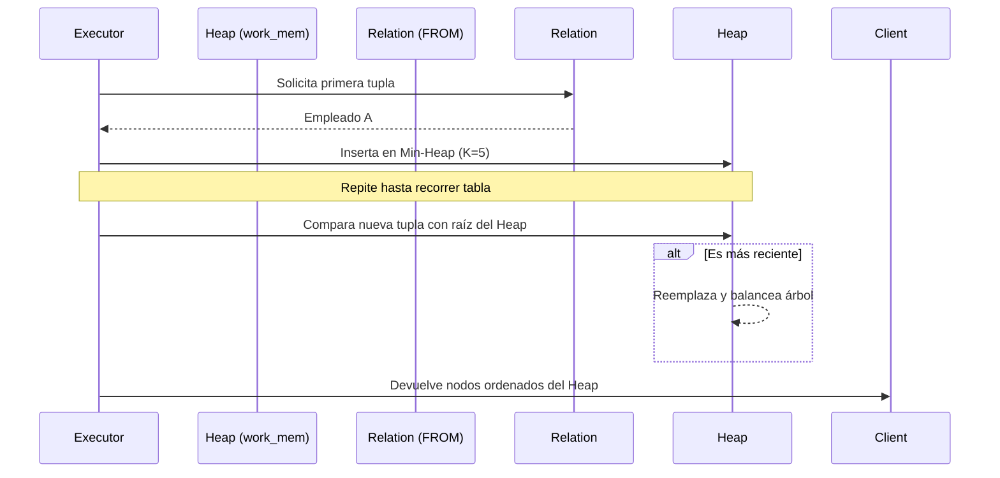
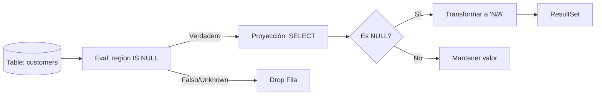

# Fase 1: SQL Básico y Mecánica de Motor de Base de Datos

Esta sección cubre la capa fundacional del procesamiento relacional en PostgreSQL. Nos enfocaremos en las fases iniciales del *Logical Query Processing* y cómo el motor planifica el escaneo de relaciones base (Heap Scans).

## Ejercicio 1: Extracción y Filtrado con Predicados Simples
**Enunciado de Negocio / Pregunta de Entrevista:** Extraiga todos los productos activos de la tabla `products` cuyo precio unitario sea mayor a $20, ordenados alfabéticamente por su nombre.

### 1. Marco Conceptual del Optimizador
En una consulta básica de filtrado, el optimizador de PostgreSQL evalúa la disponibilidad de índices (B-Tree) versus un *Sequential Scan* (Seq Scan). Si no existe un índice aplicable sobre la columna `unit_price`, el motor leerá cada página de 8KB (bloque) de la tabla desde el disco hacia los *shared buffers* (memoria), aplicando el filtro evaluando fila por fila. 

El orden lógico de operaciones es:
1. `FROM`: Identificar y acceder a la relación base.
2. `WHERE`: Aplicar el predicado para reducir el volumen de datos en memoria.
3. `SELECT`: Proyectar únicamente las columnas solicitadas.
4. `ORDER BY`: Ejecutar un algoritmo de ordenamiento (ej. *QuickSort* si cabe en `work_mem`, o *External Merge* en disco) sobre el set resultante.

### 2. Diagrama de Flujo de Datos

```mermaid
flowchart TD
    A[Disk: products table] -->|Seq Scan / Index Scan| B(Buffer: FROM products)
    B --> C{WHERE unit_price > 20 \n AND discontinued = 0}
    C -->|Filtro Fallido| D[Descartar Tupla]
    C -->|Filtro Exitoso| E[Memoria: SELECT product_name, unit_price]
    E --> F[work_mem: ORDER BY product_name ASC]
    F --> G[Client: ResultSet]
```

### 3. Solución SQL
```sql
SELECT 
    product_name,
    unit_price
FROM 
    products
WHERE 
    unit_price > 20
    AND discontinued = 0
ORDER BY 
    product_name ASC;
```

## Ejercicio 2: Paginación y Optimización de Sort Nodes
**Enunciado de Negocio / Pregunta de Entrevista:** ¿Cuáles son los 5 empleados contratados más recientemente? Devuelva sus nombres completos y fecha de contratación.

### 1. Marco Conceptual del Optimizador
Este ejercicio evalúa la combinación de ordenamiento y limitación. Al solicitar un `LIMIT 5` junto a un `ORDER BY`, PostgreSQL puede emplear una optimización conocida como *Top-N Heapsort*. En lugar de ordenar toda la tabla y luego cortar los primeros 5 registros, el motor mantiene un *min-heap* en memoria (limitado a 5 elementos). Esto reduce drásticamente el consumo de `work_mem` y el tiempo de CPU, transformando una complejidad `O(N log N)` en `O(N log K)`, donde `K = 5`.

### 2. Diagrama de Flujo de Datos

```mermaid
sequenceDiagram
    participant Executor
    participant Heap (work_mem)
    participant Relation (FROM)
    
    Executor->>Relation: Solicita primera tupla
    Relation-->>Executor: Empleado A
    Executor->>Heap: Inserta en Min-Heap (K=5)
    Note over Executor,Heap: Repite hasta recorrer tabla
    Executor->>Heap: Compara nueva tupla con raíz del Heap
    alt Es más reciente
        Heap-->>Heap: Reemplaza y balancea árbol
    end
    Executor->>Client: Devuelve nodos ordenados del Heap
```

### 3. Solución SQL
```sql
SELECT 
    first_name || ' ' || last_name AS full_name,
    hire_date
FROM 
    employees
ORDER BY 
    hire_date DESC
LIMIT 5;
```

## Ejercicio 3: Lógica Trivalente y Manejo de Ausencia de Datos (NULL)
**Enunciado de Negocio / Pregunta de Entrevista:** Identifique a los clientes (`customers`) que no tienen una región asignada. Formatee la salida para que, en lugar del valor NULL, se muestre la cadena 'N/A' en la región.

### 1. Marco Conceptual del Optimizador
El estándar ANSI SQL opera bajo una lógica trivalente (Verdadero, Falso, Desconocido). Comparar un `NULL` mediante el operador `=` siempre resultará en `UNKNOWN` (Desconocido), por lo que el predicado de filtro descartará la fila. Es imperativo utilizar la función `IS NULL`. Para el formateo en la proyección (SELECT), PostgreSQL evalúa funciones escalares como `COALESCE` durante la fase de transformación de salida, fila por fila. `COALESCE` cortocircuita y devuelve el primer argumento no nulo.

### 2. Diagrama de Flujo de Datos

```mermaid
flowchart LR
    A[(Table: customers)] --> B[Eval: region IS NULL]
    B -->|Verdadero| C[Proyección: SELECT]
    B -->|Falso/Unknown| D[Drop Fila]
    C --> E{Es NULL?}
    E -->|Sí| F[Transformar a 'N/A']
    E -->|No| G[Mantener valor]
    F --> H[ResultSet]
```

### 3. Solución SQL
```sql
SELECT 
    company_name,
    country,
    COALESCE(region, 'N/A') AS formatted_region
FROM 
    customers
WHERE 
    region IS NULL;
```
