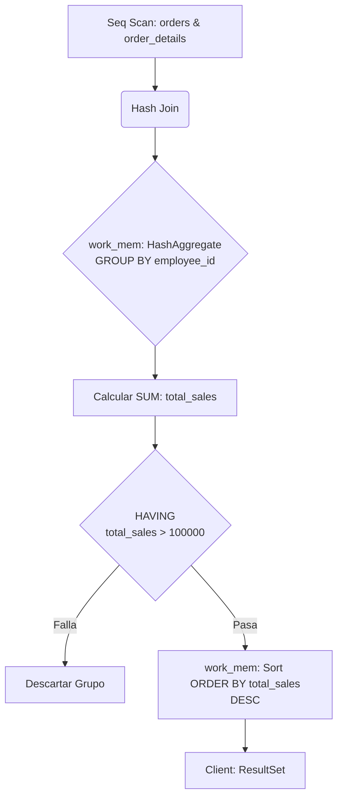
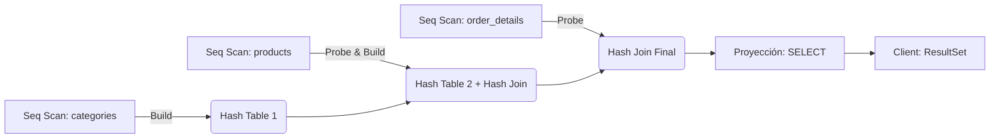
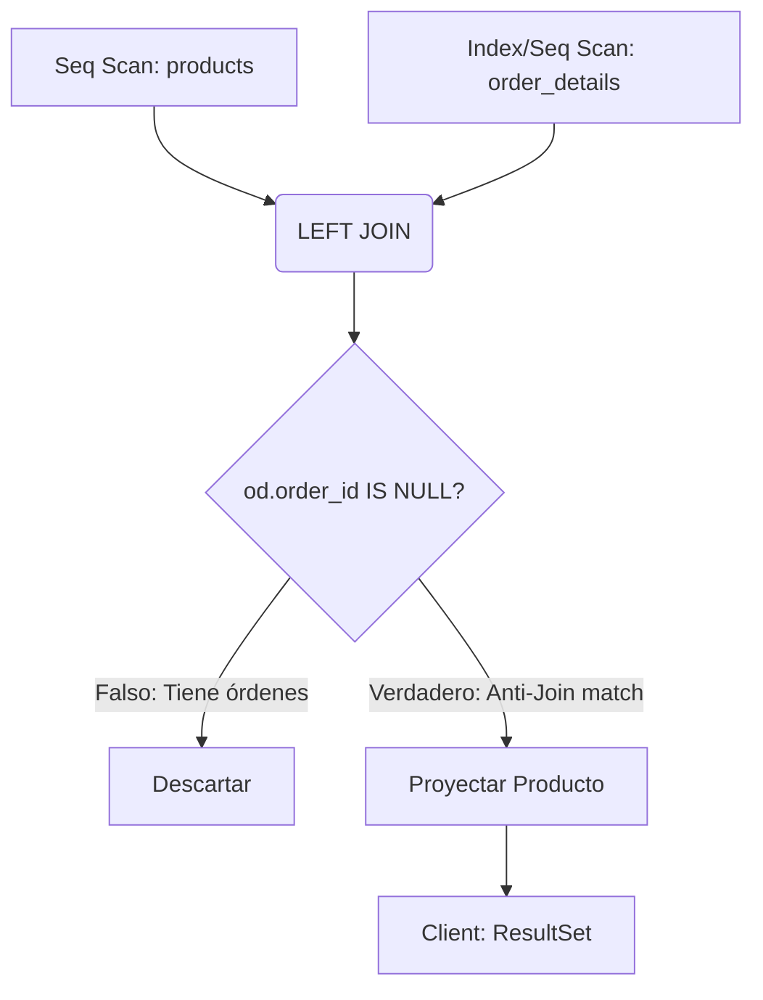

# Fase 2: SQL Intermedio, Agrupaciones y Estrategias de Join

Esta sección profundiza en las operaciones relacionales de proyección agrupada y combinación de conjuntos. El enfoque técnico recae sobre cómo el optimizador de PostgreSQL decide entre algoritmos de agregación y métodos de *Join* físicos según las estadísticas de cardinalidad.

## Ejercicio 1: Agrupación Estricta y Filtrado Post-Agregación
**Enunciado de Negocio / Pregunta de Entrevista:** Determine el monto total de ventas (sin descuento) por cada empleado, considerando únicamente a aquellos empleados cuyas ventas totales superen los $100,000. Ordene el resultado de mayor a menor.

### 1. Marco Conceptual del Optimizador
Al utilizar `GROUP BY`, PostgreSQL debe agrupar tuplas que comparten la misma clave de agrupación. El motor seleccionará entre un *HashAggregate* (construyendo una tabla hash en memoria si cabe en `work_mem`) o un *GroupAggregate* (que requiere que los datos estén previamente ordenados). La cláusula `HAVING` actúa como un filtro secundario aplicado *después* de la agregación, a diferencia de `WHERE`, que filtra *antes*. Si el volumen de grupos es pequeño, el *HashAggregate* es típicamente el plan elegido por su menor costo de I/O.

### 2. Diagrama de Flujo de Datos


### 3. Solución SQL
```sql
SELECT 
    o.employee_id,
    SUM(od.unit_price * od.quantity) AS total_sales
FROM 
    orders o
JOIN 
    order_details od ON o.order_id = od.order_id
GROUP BY 
    o.employee_id
HAVING 
    SUM(od.unit_price * od.quantity) > 100000
ORDER BY 
    total_sales DESC;
```

## Ejercicio 2: Combinación de Conjuntos Multitabla (Joins)
**Enunciado de Negocio / Pregunta de Entrevista:** Genere un reporte que muestre el ID de la orden, el nombre del producto, el nombre de la categoría y la cantidad vendida. Se requiere cruzar información de tres tablas principales.

### 1. Marco Conceptual del Optimizador
La resolución de múltiples *JOINs* requiere que el motor determine el orden óptimo de combinación (Join Tree). Para unir `order_details`, `products` y `categories`, el planificador evaluará estadísticas. Generalmente, elegirá un *Hash Join* si las tablas internas caben en memoria, construyendo un *Hash Table* sobre la relación más pequeña (ej. `categories` o `products`) y escaneando la más grande (`order_details`) para encontrar coincidencias. Si existen índices efectivos y alta selectividad, podría optar por un *Nested Loop Join*.

### 2. Diagrama de Flujo de Datos


### 3. Solución SQL
```sql
SELECT 
    od.order_id,
    p.product_name,
    c.category_name,
    od.quantity
FROM 
    order_details od
INNER JOIN 
    products p ON od.product_id = p.product_id
INNER JOIN 
    categories c ON p.category_id = c.category_id;
```

## Ejercicio 3: Anti-Joins y Detección de Ausencias
**Enunciado de Negocio / Pregunta de Entrevista:** Encuentre todos los productos que nunca han sido ordenados. Utilice una combinación externa.

### 1. Marco Conceptual del Optimizador
Para resolver consultas de exclusión o "ausencia de", el patrón clásico es un `LEFT JOIN` acoplado con una validación `IS NULL` sobre la llave foránea del lado derecho. A nivel de ejecución lógica, el motor procesa un *Anti-Join*. Un *Hash Anti Join* o *Merge Anti Join* es altamente eficiente, ya que el motor puede detener la búsqueda para un producto tan pronto como encuentra la primera orden asociada, descartando la tupla inmediatamente y emitiendo solo aquellas que jamás encontraron coincidencia.

### 2. Diagrama de Flujo de Datos


### 3. Solución SQL
```sql
SELECT 
    p.product_id,
    p.product_name
FROM 
    products p
LEFT JOIN 
    order_details od ON p.product_id = od.product_id
WHERE 
    od.order_id IS NULL;
```
