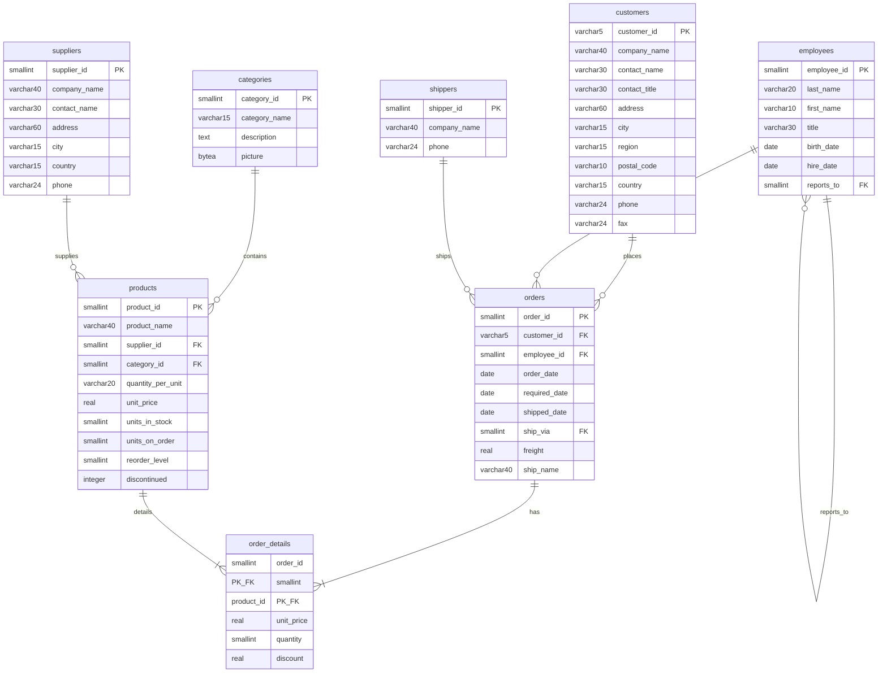

# Diagrama de Entidad-Relación de Northwind PostgreSQL (Formato Mermaid)

Este archivo contiene el código en formato Mermaid para generar un diagrama visual de la base de datos `Northwind` en PostgreSQL. Puedes copiar y pegar este bloque de código en un editor compatible con Mermaid para ver el gráfico.



# SQL Básico con PostgreSQL: Fundamentos Transaccionales

> **Visión del Principal Data Architect (Prompt):** Este nivel establece la base para escribir consultas eficientes. En sistemas críticos, un `SELECT *` mal usado puede означать leer innecesariamente miles de páginas de 8KB del disco.
>
> **Conexión con el Prompt:** Este material sigue el plan de transformación definido en `prompt.md` - aplicando la teoría de C.J. Date con implementación PostgreSQL 2026+.
>
> **Antes de empezar:** Revisa `01_Fundamentos/Clase_1.01_Fisica_del_Dato.md` para entender cómo PostgreSQL lee páginas de 8KB.

> **Conexión con Fundamentos:** Antes de ejecutar, revisa `01_Fundamentos/Clase_1.01_Fisica_del_Dato.md` para entender cómo PostgreSQL lee páginas de 8KB.
>
> Esta sección cubre los pilares fundamentales de SQL orientados al motor **PostgreSQL** mediante el uso del dataset **Northwind**. Los ejercicios están diseñados para asimilar la sintaxis estándar y el comportamiento del motor al recuperar registros.

## 1. Recuperación Selectiva de Información (`SELECT`)

> **Conexión con Física del Dato:** Cuando ejecutas `SELECT *`, PostgreSQL lee páginas completas de 8KB del disco. Si solo necesitas 2 columnas, es mejor proyectar solo esas columnas para reducir I/O. Ver `01_Fundamentos/Clase_1.01_Fisica_del_Dato.md`.

### Consultas Globales (`SELECT *`)

**Objetivo Académico:** Comprender la recuperación de la totalidad de atributos de una relación. Aunque útil en desarrollo, en arquitectura de alto rendimiento se debe evitar el uso de `*` para minimizar el tráfico de red e I/O innecesario.

1. **Listar la totalidad de registros de la tabla de Clientes:**

    ```sql
    SELECT * FROM customers;
    ```

2. **Ver todos los productos:**

    ```sql
    SELECT * FROM products;
    ```

3. **Ver todos los empleados:**

    ```sql
    SELECT * FROM employees;
    ```

### Proyección de Atributos Específicos

**Objetivo Académico:** Optimizar la recuperación de datos solicitando únicamente los campos requeridos por la lógica de negocio.

1. **Recuperar el contacto y teléfono de la tabla de clientes:**

    ```sql
    SELECT contact_name, phone FROM customers;
    ```

2. **Proyectar nombre de producto y su respectivo valor unitario:**

    ```sql
    SELECT product_name, unit_price FROM products;
    ```

### Definición de Alias (`AS`)

**Objetivo Académico:** Facilitar la legibilidad de los resultados y estructurar la salida para su consumo por el backend o herramientas de reporte.

1. **Mostrar el nombre del producto con el alias "nombre_producto":**

    ```sql
    SELECT product_name AS nombre_producto FROM products;
    ```

## 2. Restricción y Filtrado de Datos (`WHERE`)

### Operadores de Comparación Estándar

**Objetivo Académico:** Reducir el conjunto de resultados mediante predicados lógicos, fundamental para el rendimiento del Query Planner.

1. **Encontrar todos los productos del proveedor con ID 1:**

    ```sql
    SELECT * FROM products WHERE supplier_id = 1;
    ```

2. **Listar productos con un precio superior a $50:**

    ```sql
    SELECT * FROM products WHERE unit_price > 50;
    ```

3. **Listar todos los pedidos que no fueron enviados por el transportista con ID 2:**

    ```sql
    SELECT * FROM orders WHERE ship_via != 2;
    ```

### `LIKE`

> **PostgreSQL Tip:** Usa `ILIKE` para búsqueda case-insensitive. Para patrones complejos, considera `~` (regex) o `SIMILAR TO`.

1. **Encontrar clientes cuyo nombre de contacto empieza con 'A':**

    ```sql
    SELECT * FROM customers WHERE contact_name LIKE 'A%';
    ```

2. **Búsqueda insensitive (PostgreSQL):**

    ```sql
    SELECT * FROM customers WHERE contact_name ILIKE 'a%';
    ```

3. **Encontrar clientes cuyo país contiene la palabra 'land':**

    ```sql
    SELECT * FROM customers WHERE country LIKE '%land%';
    ```

### `IN`

**Objetivo:** Filtrar por una lista de valores posibles.

1. **Seleccionar clientes de 'Germany', 'France' o 'UK':**

    ```sql
    SELECT * FROM customers WHERE country IN ('Germany', 'France', 'UK');
    ```

### `BETWEEN`

> **PostgreSQL Tip:** `BETWEEN` es inclusivo (incluye ambos extremos). Para rangos de fechas, considera usar `>=` y `<` para evitar problemas con timezone.

1. **Seleccionar productos con un precio entre $10 y $20:**

    ```sql
    SELECT * FROM products WHERE unit_price BETWEEN 10 AND 20;
    -- Equivalente a: unit_price >= 10 AND unit_price <= 20
    ```

2. **Seleccionar pedidos de enero 1998 (BETWEEN con fechas):**

    ```sql
    SELECT * FROM orders WHERE order_date BETWEEN '1998-01-01' AND '1998-01-31';
    ```

### `IS NULL` / `IS NOT NULL`

> **PostgreSQL Tip:** En PostgreSQL, NULL no equals NULL retorna NULL (no true). Por eso usamos `IS NULL` en vez de `= NULL`.

1. **Encontrar clientes que no tienen especificada una región:**

    ```sql
    SELECT * FROM customers WHERE region IS NULL;
    ```

2. **Encontrar clientes que SÍ tienen región definida:**

    ```sql
    SELECT * FROM customers WHERE region IS NOT NULL;
    ```

### Operadores Lógicos (`AND`, `OR`, `NOT`)

> **PostgreSQL Tip:** `AND` tiene mayor precedencia que `OR`. Usa paréntesis para claridad.

1. **Clientes de Alemania que viven en Berlin:**

    ```sql
    SELECT * FROM customers WHERE country = 'Germany' AND city = 'Berlin';
    ```

2. **Productos que están descontinuados O tienen 0 unidades en stock:**

    ```sql
    SELECT * FROM products WHERE discontinued = 1 OR units_in_stock = 0;
    ```

3. **(Con paréntesis para claridad) Productos de categoria 1 con precio > 30:**

    ```sql
    SELECT * FROM products WHERE category_id = 1 AND (unit_price > 30 OR unit_price IS NULL);
    ```

## 3. Ordenamiento de Resultados (`ORDER BY`)

**Objetivo:** Ordenar el conjunto de resultados por una o más columnas.

1. **Listar productos ordenados por precio, del más barato al más caro:**

    ```sql
    SELECT * FROM products ORDER BY unit_price ASC;
    ```

2. **Listar productos ordenados por precio, del más caro al más barato:**

    ```sql
    SELECT * FROM products ORDER BY unit_price DESC;
    ```

3. **Listar clientes ordenados por país y luego por nombre de contacto:**

    ```sql
    SELECT * FROM customers ORDER BY country, contact_name;
    ```

## 4. Limitación de Resultados (`LIMIT`)

**Objetivo:** Limitar el número de filas devueltas.

1. **Obtener los 5 productos más caros:**

    ```sql
    SELECT * FROM products ORDER BY unit_price DESC LIMIT 5;
    ```

## 5. Valores Únicos (`DISTINCT`)

**Objetivo:** Devolver solo valores diferentes en una columna.

1. **Listar los países únicos de los clientes:**

    ```sql
    SELECT DISTINCT country FROM customers;
    ```

## 6. Funciones de Agregación y Métricas de Datos

**Objetivo Académico:** Realizar cálculos aritméticos sobre un conjunto de filas para obtener resultados sumarizados.

### Conteo de Registros (`COUNT`)

> **PostgreSQL Tip:** `COUNT(*)` es optimizado, pero para grandes tablas considera `COUNT(1)` o `COUNT(primary_key)` si tienes índices.

1. **Contar el número total de clientes:**

    ```sql
    SELECT COUNT(*) FROM customers;
    ```

2. **Contar cuántos productos están descontinuados:**

    ```sql
    SELECT COUNT(*) FROM products WHERE discontinued = 1;
    ```

### `SUM`

> **PostgreSQL Tip:** PostgreSQL usa `numeric` para precisión decimal exacta. `real` puede tener errores de punto flotante.

1. **Calcular el valor total del inventario (unidades en stock \* precio):**

    ```sql
    SELECT SUM(units_in_stock * unit_price) AS total_inventory_value FROM products;
    ```

### `AVG`

> **PostgreSQL Tip:** `AVG()` para `numeric` devuelve numeric exacto. Para `real`/`float`, devuelve float8.

1. **Calcular el precio promedio de los productos:**

    ```sql
    SELECT AVG(unit_price) FROM products;
    ```

### `MIN` y `MAX`

> **PostgreSQL Tip:** Estas funciones pueden usar índices BTREE para accelerate.

1. **Encontrar el producto más barato y el más caro:**

    ```sql
    SELECT MIN(unit_price) AS cheapest, MAX(unit_price) AS most_expensive FROM products;
    ```

## 7. Agrupación de Datos (`GROUP BY`)

> **PostgreSQL Tip:** Cuando usas `GROUP BY`, las columnas no agregadas deben ser dependientes funcionalmente del grupo. PostgreSQL es strict en esto - otras bases pueden permitirlo.

**Por qué funciona:** `country` determina unívocamente todos los registros en ese grupo.

1. **Contar cuántos clientes hay en cada país:**

    ```sql
    SELECT country, COUNT(*) AS number_of_customers 
    FROM customers 
    GROUP BY country;
    ```

2. **Calcular el precio promedio de productos por cada categoría (con nombre):**

    ```sql
    -- Error común: category_id sin agregar en SELECT sin estar en GROUP BY
    -- Esta query funciona porque category_id está en GROUP BY
    
    SELECT category_id, AVG(unit_price) AS avg_price 
    FROM products 
    GROUP BY category_id;
    ```

3. **Obtener el número de pedidos gestionados por cada empleado:**

    ```sql
    SELECT employee_id, COUNT(order_id) AS total_orders 
    FROM orders 
    GROUP BY employee_id;
    ```

4. **(Con JOIN) Precio promedio y count por nombre de categoría:**

    ```sql
    SELECT 
        c.category_name,
        ROUND(AVG(p.unit_price), 2) AS avg_price,
        COUNT(p.product_id) AS product_count
    FROM products p
    INNER JOIN categories c ON p.category_id = c.category_id
    GROUP BY c.category_name
    ORDER BY avg_price DESC;
    ```

## 9. Errores Comunes en GROUP BY

> **PostgreSQL Error:** "column must appear in the GROUP BY clause or be used in an aggregate function"

1. **INCORRECTO (generará error en PostgreSQL strict):**

    ```sql
    -- Este query lançará error en PostgreSQL
    SELECT city, COUNT(*) FROM customers GROUP BY country;
    -- ERROR: column "customers.city" must appear in the GROUP BY clause
    ```

2. **CORRECTO (agregar la columna al GROUP BY):**

    ```sql
    SELECT city, country, COUNT(*) 
    FROM customers 
    GROUP BY city, country;
    ```

3. **CORRECTO (usar aggregate en la columna extra):**

    ```sql
    -- Usamos STRING_AGG para obter una lista de países por ciudad
    SELECT 
        city, 
        STRING_AGG(country, ', ') AS countries,
        COUNT(*) AS customer_count
    FROM customers 
    GROUP BY city;
    ```

## 8. Relaciones entre Tablas (`JOIN`)

### Intersección de Conjuntos (`INNER JOIN`)

**Objetivo Académico:** Combinar tuplas de dos o más relaciones basadas en un predicado común (usualmente PK-FK), fundamental en la arquitectura relacional para reconstruir el modelo de negocio.

1. **Mostrar los productos y los nombres de sus proveedores:**

    ```sql
    SELECT p.product_name, s.contact_name AS supplier
    FROM products p
    INNER JOIN suppliers s ON p.supplier_id = s.supplier_id;
    ```

2. **Listar los pedidos con el nombre del cliente que los realizó:**

    ```sql
    SELECT o.order_id, c.contact_name
    FROM orders o
    INNER JOIN customers c ON o.customer_id = c.customer_id;
    ```

3. **Obtener detalles de un pedido (producto y cantidad) para el pedido 10248:**

    ```sql
    SELECT p.product_name, od.quantity
    FROM order_details od
    INNER JOIN products p ON od.product_id = p.product_id
    WHERE od.order_id = 10248;
    ```

4. **Ver qué empleado gestionó qué pedido:**

    ```sql
    SELECT o.order_id, e.first_name, e.last_name
    FROM orders o
    INNER JOIN employees e ON o.employee_id = e.employee_id;
    ```

5. **Listar los productos y la categoría a la que pertenecen:**

    ```sql
    SELECT p.product_name, c.category_name
    FROM products p
    INNER JOIN categories c ON p.category_id = c.category_id;
    ```
