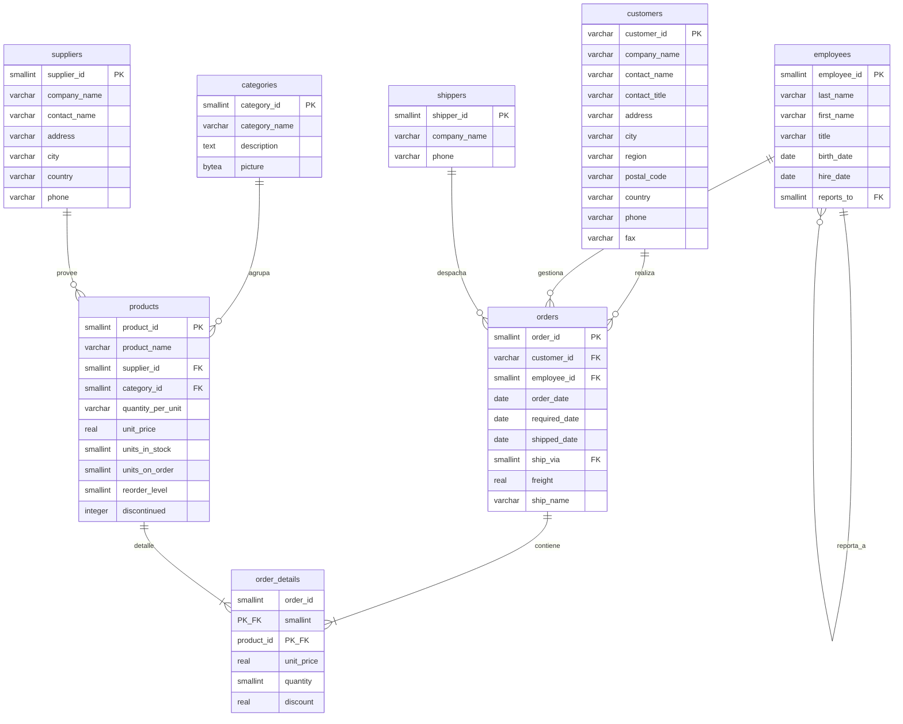

# 📚 Nivel 1: SQL Básico y Fundamentos Transaccionales (Base: Northwind)

## 📌 Índice de Navegación Académica
1. [Diagrama Entidad-Relación de Northwind](#diagrama-entidad-relación-de-northwind)
2. [Introducción: La Física del Dato en PostgreSQL](#introducción-la-física-del-dato-en-postgresql)
3. [Recuperación Selectiva de Información (`SELECT`)](#1-recuperación-selectiva-de-información-select)
   - [Consultas Globales (`SELECT *`)](#consultas-globales-select-)
   - [Proyección de Atributos Específicos](#proyección-de-atributos-específicos)
   - [Definición de Alias (`AS`)](#definición-de-alias-as)
4. [Restricción y Filtrado de Datos (`WHERE`)](#2-restricción-y-filtrado-de-datos-where)
   - [Operadores de Comparación Estándar](#operadores-de-comparación-estándar)
   - [Búsqueda por Patrones (`LIKE` / `ILIKE`)](#búsqueda-por-patrones-like--ilike)
   - [Pertenencia a Conjuntos (`IN`)](#pertenencia-a-conjuntos-in)
   - [Filtros por Rango (`BETWEEN`)](#filtros-por-rango-between)
   - [Manejo de Nulos (`IS NULL` / `IS NOT NULL`)](#manejo-de-nulos-is-null--is-not-null)
   - [Combinaciones Lógicas (`AND`, `OR`, `NOT`)](#combinaciones-lógicas-and-or-not)
5. [Ordenamiento de Registros (`ORDER BY`)](#3-ordenamiento-de-registros-order-by)
6. [Limitación de Resultados (`LIMIT` / `OFFSET`)](#4-limitación-de-resultados-limit)
7. [Valores Únicos y Teoría de Conjuntos (`DISTINCT`)](#5-valores-únicos-distinct)
8. [Funciones de Agregación y Métricas de Datos](#6-funciones-de-agregación-y-métricas-de-datos)
   - [Conteo de Registros (`COUNT`)](#conteo-de-registros-count)
   - [Suma de Valores (`SUM`)](#suma-de-valores-sum)
   - [Promedio y Precisión (`AVG`)](#promedio-y-precisión-avg)
   - [Valores Extremos (`MIN` / `MAX`)](#valores-extremos-min--max)
9. [Agrupamiento Básico (`GROUP BY`)](#7-agrupamiento-básico-group-by)
10. [Errores Comunes en Agrupaciones](#8-errores-comunes-en-group-by)
11. [Introducción a la Combinación de Relaciones (`INNER JOIN`)](#9-introducción-a-la-combinación-de-relaciones-inner-join)

---

## Diagrama Entidad-Relación de Northwind

A continuación se muestra el modelado relacional físico del dataset Northwind en PostgreSQL. Puedes renderizar este bloque en cualquier visor compatible con Mermaid.js.



---

## Introducción: La Física del Dato en PostgreSQL

> 🎓 **Perspectiva del Principal Data Architect:**
> En sistemas de producción de alto rendimiento (escala de terabytes o petabytes), la base de datos no es una "caja mágica". El motor PostgreSQL almacena los datos en disco organizados en **páginas físicas de 8KB**. Cada vez que ejecutas una consulta, el motor debe leer estas páginas desde el disco (E/S física) y subirlas a la memoria de PostgreSQL (`shared_buffers`). 
>
> Diseñar una consulta eficiente consiste en **minimizar el número de páginas de 8KB leídas del disco**. Un diseño relacional óptimo, fundamentado en la teoría clásica de C.J. Date, se traduce directamente en menos latencia de hardware y mayor concurrencia.

---

## 1. Recuperación Selectiva de Información (`SELECT`)

La recuperación de datos se fundamenta en la operación matemática de **Proyección** en el Álgebra Relacional.

$$\pi_{\text{atributos}}(\text{Relación})$$

### Consultas Globales (`SELECT *`)

**Teoría Relacional:** Recupera la totalidad de atributos (columnas) de una relación (tabla). 

$$\pi_{\text{todos\_los\_atributos}}(\text{customers})$$

> [!CAUTION]
> **Anotaciones del Príncipe de las Bases de Datos:**
> *¡Nunca uses `SELECT *` en código de producción!* Aunque es cómodo para desarrollo y exploraciones rápidas, en producción fuerza a PostgreSQL a realizar una **proyección completa de todas las columnas**, incluyendo campos de texto largo (`TEXT`, `VARCHAR`) o binarios (`BYTEA`). Esto incrementa innecesariamente el ancho de banda de red, consume memoria de CPU para el desempaquetado de tuplas y destruye la posibilidad de aplicar un *Index-Only Scan* (donde la consulta se resuelve leyendo únicamente el índice sin tocar las páginas de datos en el disco).

1. **Listar la totalidad de registros de la tabla de Clientes:**
   ```sql
   SELECT * FROM customers;
   ```

2. **Ver todos los productos del catálogo:**
   ```sql
   SELECT * FROM products;
   ```

3. **Ver todos los empleados registrados:**
   ```sql
   SELECT * FROM employees;
   ```

### Proyección de Atributos Específicos

**Teoría Relacional:** Especifica únicamente el subconjunto de atributos requerido para minimizar el tamaño de la tupla proyectada en memoria.

$$\pi_{\text{contact\_name, phone}}(\text{customers})$$

1. **Recuperar el nombre del contacto y teléfono de la tabla de clientes:**
   ```sql
   SELECT contact_name, phone FROM customers;
   ```

2. **Proyectar nombre de producto y su respectivo valor unitario:**
   ```sql
   SELECT product_name, unit_price FROM products;
   ```

### Definición de Alias (`AS`)

**Teoría Relacional:** Operación de **Renombramiento** ($\rho$), útil para dar semántica a columnas calculadas o para cumplir con los contratos de nombres exigidos por el *backend*.

$$\rho_{\text{nombre\_producto} \leftarrow \text{product\_name}}(\text{products})$$

1. **Mostrar el nombre del producto bajo el alias "nombre_producto":**
   ```sql
   SELECT product_name AS nombre_producto FROM products;
   ```

---

## 2. Restricción y Filtrado de Datos (`WHERE`)

El filtrado de tuplas corresponde a la operación de **Selección** ($\sigma$) en el Álgebra Relacional, la cual evalúa un predicado lógico sobre cada tupla de la relación.

$$\sigma_{\text{predicado}}(\text{Relación})$$

### Operadores de Comparación Estándar

Establecen restricciones lógicas sobre atributos numéricos o de texto.

1. **Encontrar todos los productos del proveedor con ID 1:**
   $$\sigma_{\text{supplier\_id} = 1}(\text{products})$$
   ```sql
   SELECT * FROM products WHERE supplier_id = 1;
   ```

2. **Listar productos con un precio unitario estrictamente superior a $50:**
   $$\sigma_{\text{unit\_price} > 50}(\text{products})$$
   ```sql
   SELECT * FROM products WHERE unit_price > 50;
   ```

3. **Listar pedidos que no fueron despachados por el transportista con ID 2:**
   ```sql
   SELECT * FROM orders WHERE ship_via != 2;
   ```

### Búsqueda por Patrones (`LIKE` / `ILIKE`)

> [!IMPORTANT]
> **Anotaciones del Príncipe de las Bases de Datos:**
> En PostgreSQL, el operador `LIKE` es estrictamente sensible a mayúsculas y minúsculas (case-sensitive). Si deseas realizar una búsqueda insensible, utiliza el operador nativo **`ILIKE`**.
> *Truco de Rendimiento:* Las búsquedas con comodines al inicio (`LIKE '%texto%'`) impiden que PostgreSQL utilice un índice B-Tree clásico, forzando un **Sequential Scan** (lectura completa de la tabla en disco). Si necesitas búsquedas con comodines al inicio de alto rendimiento, debes crear un índice especializado de clase de operador trigrama (`pg_trgm`) o usar búsqueda de texto completo (*Full Text Search*).

1. **Encontrar clientes cuyo nombre de contacto empieza estrictamente con 'A' (Case-Sensitive):**
   ```sql
   SELECT * FROM customers WHERE contact_name LIKE 'A%';
   ```

2. **Buscar clientes cuyo nombre empiece con 'a' o 'A' usando el operador nativo insensible:**
   ```sql
   SELECT * FROM customers WHERE contact_name ILIKE 'a%';
   ```

3. **Encontrar clientes cuyo país contenga la cadena 'land' (ej. Finland, Switzerland, Ireland):**
   ```sql
   SELECT * FROM customers WHERE country LIKE '%land%';
   ```

### Pertenencia a Conjuntos (`IN`)

Permite filtrar tuplas cuyo atributo coincida con algún elemento de una lista explícita.

$$\sigma_{\text{country} \in \{\text{'Germany'}, \text{'France'}, \text{'UK'}\}}(\text{customers})$$

1. **Seleccionar clientes localizados en 'Germany', 'France' o 'UK':**
   ```sql
   SELECT * FROM customers WHERE country IN ('Germany', 'France', 'UK');
   ```

### Filtros por Rango (`BETWEEN`)

Define un límite inferior y superior inclusivo.

$$\sigma_{10 \le \text{unit\_price} \le 20}(\text{products})$$

> [!WARNING]
> **Anotaciones del Príncipe de las Bases de Datos:**
> `BETWEEN` siempre es **inclusivo** en sus extremos. 
> Cuando trabajes con columnas de tipo fecha/hora (`TIMESTAMP` o `TIMESTAMPTZ`), evita usar `BETWEEN` ya que las horas y zonas horarias pueden hacer que omitas registros del último día. En su lugar, usa límites explícitos de comparación: `fecha >= '1998-01-01' AND fecha < '1998-02-01'`.

1. **Seleccionar productos cuyo precio unitario está en el rango de $10 a $20 (ambos inclusive):**
   ```sql
   SELECT * FROM products WHERE unit_price BETWEEN 10 AND 20;
   ```

2. **Seleccionar pedidos realizados durante el mes de enero de 1998:**
   ```sql
   SELECT * FROM orders WHERE order_date BETWEEN '1998-01-01' AND '1998-01-31';
   ```

### Manejo de Nulos (`IS NULL` / `IS NOT NULL`)

> [!CAUTION]
> **Anotaciones del Príncipe de las Bases de Datos:**
> En la lógica de tres valores de SQL (Verdadero, Falso, Desconocido), **`NULL` no es un valor, es la ausencia del mismo**. Por lo tanto, evaluar `WHERE columna = NULL` o `WHERE columna != NULL` es un error fatal; siempre devolverá `NULL` (desconocido) y no retornará registros. Para evaluar la nulidad de forma correcta, utiliza estrictamente los operadores semánticos **`IS NULL`** e **`IS NOT NULL`**.

1. **Encontrar clientes que no tienen registrada una región geográfica:**
   ```sql
   SELECT * FROM customers WHERE region IS NULL;
   ```

2. **Encontrar clientes que sí cuentan con una región geográfica definida:**
   ```sql
   SELECT * FROM customers WHERE region IS NOT NULL;
   ```

### Combinaciones Lógicas (`AND`, `OR`, `NOT`)

Permite estructurar predicados lógicos compuestos en la cláusula de selección.

> [!IMPORTANT]
> **Anotaciones del Príncipe de las Bases de Datos:**
> En SQL, el operador lógico `AND` tiene una **precedencia mayor** que el operador `OR`. Si mezclas ambos sin paréntesis, PostgreSQL evaluará primero los componentes conectados con `AND`, lo cual puede provocar resultados erróneos y brechas de seguridad. *¡Usa paréntesis siempre para agrupar tus criterios y clarificar la precedencia!*

1. **Obtener clientes de Alemania que residan específicamente en Berlín:**
   ```sql
   SELECT * FROM customers WHERE country = 'Germany' AND city = 'Berlin';
   ```

2. **Identificar productos descontinuados o aquellos que tengan stock en cero:**
   ```sql
   SELECT * FROM products WHERE discontinued = 1 OR units_in_stock = 0;
   ```

3. **Productos de la categoría 1 cuyo precio sea superior a $30 o no tengan precio registrado (agrupado de forma segura):**
   ```sql
   SELECT * FROM products WHERE category_id = 1 AND (unit_price > 30 OR unit_price IS NULL);
   ```

---

## 3. Ordenamiento de Registros (`ORDER BY`)

Modifica la presentación del conjunto de resultados (cursor) sin alterar las tuplas de la relación.

> [!WARNING]
> **Anotaciones del Príncipe de las Bases de Datos:**
> Por defecto en PostgreSQL, cuando ordenas de forma ascendente (`ASC`), los valores `NULL` se colocan al **final** (`NULLS LAST`). Cuando ordenas de forma descendente (`DESC`), los valores `NULL` se colocan al **inicio** (`NULLS FIRST`). Puedes alterar este comportamiento por defecto de forma explícita usando la sintaxis:
> `ORDER BY columna DESC NULLS LAST`

1. **Listar productos ordenados por precio, del menor al mayor:**
   ```sql
   SELECT * FROM products ORDER BY unit_price ASC;
   ```

2. **Listar productos ordenados por precio, del más costoso al más económico:**
   ```sql
   SELECT * FROM products ORDER BY unit_price DESC;
   ```

3. **Listar clientes ordenados alfabéticamente por país y, en caso de empate, por nombre de contacto:**
   ```sql
   SELECT * FROM customers ORDER BY country ASC, contact_name ASC;
   ```

---

## 4. Limitación de Resultados (`LIMIT`)

Sintaxis nativa de PostgreSQL para restringir el número máximo de tuplas devueltas al cliente.

> [!IMPORTANT]
> **Anotaciones del Príncipe de las Bases de Datos:**
> En sistemas de alta concurrencia, realizar un `LIMIT` sin una cláusula `ORDER BY` explícita es un grave error de diseño conceptual. Las bases de datos relacionales son conjuntos matemáticos desordenados por definición. Sin un `ORDER BY`, el orden físico de retorno depende del almacenamiento en disco y puede variar en cada ejecución.
> *Sintaxis ANSI:* Si buscas compatibilidad absoluta con SQL Estándar, puedes usar la sintaxis ANSI en lugar de `LIMIT`:
> `FETCH FIRST 5 ROWS ONLY`

1. **Obtener los 5 productos más caros de la tienda:**
   ```sql
   SELECT * FROM products ORDER BY unit_price DESC LIMIT 5;
   ```

---

## 5. Valores Únicos (`DISTINCT`)

Elimina duplicados lógicos en la proyección de atributos, actuando como una simplificación de conjuntos de la teoría relacional pura (donde no existen elementos duplicados).

1. **Listar los países únicos donde residen nuestros clientes:**
   ```sql
   SELECT DISTINCT country FROM customers;
   ```

---

## 6. Funciones de Agregación y Métricas de Datos

Las funciones de agregación procesan múltiples valores de entrada de un atributo y computan un único valor resumido.

### Conteo de Registros (`COUNT`)

> [!IMPORTANT]
> **Anotaciones del Príncipe de las Bases de Datos:**
> * `COUNT(*)` cuenta todas las tuplas de la relación, incluyendo aquellas que tengan valores nulos en sus atributos.
> * `COUNT(nombre_columna)` cuenta únicamente las tuplas donde la columna especificada **no sea NULL**.
> *Mito urbano desmentido:* En motores modernos como PostgreSQL, no existe diferencia de rendimiento entre `COUNT(*)`, `COUNT(1)` y `COUNT(id)`. Todos son optimizados idénticamente por el Query Planner. Prefiere `COUNT(*)` por legibilidad estándar.

1. **Obtener la cantidad total de clientes registrados en el sistema:**
   ```sql
   SELECT COUNT(*) AS total_clientes FROM customers;
   ```

2. **Contar cuántos productos se encuentran actualmente descontinuados:**
   ```sql
   SELECT COUNT(*) AS productos_descontinuados FROM products WHERE discontinued = 1;
   ```

### Suma de Valores (`SUM`)

Calcula la suma acumulada de atributos numéricos.

1. **Calcular el valor total en inventario (unidades disponibles multiplied by precio unitario):**
   ```sql
   SELECT SUM(units_in_stock * unit_price) AS valor_total_inventario FROM products;
   ```

### Promedio y Precisión (`AVG`)

Determina la media aritmética de un atributo numérico.

> [!WARNING]
> **Anotaciones del Príncipe de las Bases de Datos:**
> La función `AVG()` omite los valores `NULL` del promedio (no los cuenta ni para la suma ni para el denominador). Si necesitas tratarlos como cero, debes mapearlos explícitamente usando coalescencia: `AVG(COALESCE(columna, 0))`.
> Adicionalmente, el tipo `REAL` o `FLOAT` de PostgreSQL puede sufrir de imprecisión en aritmética decimal rápida. Para aplicaciones financieras estrictas de contabilidad de Northwind, se debe usar y castear a tipo **`NUMERIC` / `DECIMAL`**.

1. **Calcular el precio promedio de todos los productos:**
   ```sql
   SELECT AVG(unit_price) AS precio_promedio FROM products;
   ```

### Valores Extremos (`MIN` / `MAX`)

Identifican los límites inferior y superior de un atributo.

> [!TIP]
> **Anotaciones del Príncipe de las Bases de Datos:**
> Las funciones `MIN()` y `MAX()` se benefician directamente de los índices **B-Tree** existentes sobre las columnas. PostgreSQL optimiza esta consulta convirtiéndola internamente en un acceso directo al nodo extremo del árbol del índice en tiempo constante ($O(1)$), lo cual es infinitamente veloz.

1. **Obtener el precio del producto más barato y del más caro en una sola consulta:**
   ```sql
   SELECT MIN(unit_price) AS precio_minimo, MAX(unit_price) AS precio_maximo FROM products;
   ```

---

## 7. Agrupamiento Básico (`GROUP BY`)

Permite clasificar tuplas de una relación en conjuntos específicos basados en la coincidencia de uno o más atributos clave, aplicando funciones de agregación a cada grupo independiente.

> [!IMPORTANT]
> **Anotaciones del Príncipe de las Bases de Datos:**
> **La Regla de Oro del Agrupamiento:** 
> Cuando utilizas la cláusula `GROUP BY`, toda columna que proyectes en la lista del `SELECT` debe cumplir con una de estas dos condiciones obligatorias:
> 1. Estar presente dentro de la lista de columnas de la cláusula `GROUP BY`.
> 2. Estar contenida dentro de una función de agregación (como `SUM`, `COUNT`, `AVG`).
> Si violas esta regla, PostgreSQL bloqueará la consulta inmediatamente con un error de sintaxis de agrupamiento.

1. **Contar la cantidad de clientes registrados en cada país:**
   ```sql
   SELECT country, COUNT(*) AS cantidad_clientes 
   FROM customers 
   GROUP BY country;
   ```

2. **Calcular el precio unitario promedio por cada ID de categoría de producto:**
   ```sql
   SELECT category_id, AVG(unit_price) AS precio_promedio 
   FROM products 
   GROUP BY category_id;
   ```

3. **Calcular la cantidad total de pedidos procesados por cada empleado:**
   ```sql
   SELECT employee_id, COUNT(order_id) AS pedidos_gestionados 
   FROM orders 
   GROUP BY employee_id;
   ```

---

## 8. Errores Comunes en Agrupaciones

1. **Consulta Incorrecta (Generará error de compilación en PostgreSQL):**
   ```sql
   -- Esto lanzará un error porque 'city' no se encuentra en la cláusula GROUP BY ni está agregada.
   SELECT city, country, COUNT(*) 
   FROM customers 
   GROUP BY country;
   -- ERROR: column "customers.city" must appear in the GROUP BY clause or be used in an aggregate function
   ```

2. **Consulta Correcta (Incluyendo la columna en el GROUP BY):**
   ```sql
   -- Agrupamos correctamente por la combinación única de ambas columnas.
   SELECT city, country, COUNT(*) AS cantidad 
   FROM customers 
   GROUP BY city, country;
   ```

3. **Consulta Correcta Avanzada (Usando agregación de cadenas con `STRING_AGG`):**
   ```sql
   -- Usamos STRING_AGG para concatenar las ciudades pertenecientes a cada país en una sola celda
   SELECT 
       country, 
       STRING_AGG(city, ', ') AS ciudades_registradas,
       COUNT(*) AS cantidad_clientes
   FROM customers 
   GROUP BY country;
   ```

---

## 9. Introducción a la Combinación de Relaciones (`INNER JOIN`)

El `INNER JOIN` permite unificar la información distribuida en múltiples relaciones relacionales utilizando un predicado común (generalmente una restricción de Clave Primaria y Clave Foránea).

$$\text{Products} \bowtie_{\text{products.supplier\_id} = \text{suppliers.supplier\_id}} \text{Suppliers}$$

1. **Mostrar los nombres de los productos y la razón social de sus proveedores:**
   ```sql
   SELECT p.product_name, s.company_name AS proveedor
   FROM products p
   INNER JOIN suppliers s ON p.supplier_id = s.supplier_id;
   ```

2. **Listar todos los pedidos mostrando su ID y el nombre de contacto del cliente que realizó la compra:**
   ```sql
   SELECT o.order_id, c.contact_name AS cliente
   FROM orders o
   INNER JOIN customers c ON o.customer_id = c.customer_id;
   ```

3. **Obtener el nombre de los productos vendidos y la cantidad solicitada para el pedido número 10248:**
   ```sql
   SELECT p.product_name, od.quantity
   FROM order_details od
   INNER JOIN products p ON od.product_id = p.product_id
   WHERE od.order_id = 10248;
   ```

4. **Visualizar el ID del pedido junto al nombre y apellido del empleado que gestionó la transacción:**
   ```sql
   SELECT o.order_id, e.first_name || ' ' || e.last_name AS empleado_gestor
   FROM orders o
   INNER JOIN employees e ON o.employee_id = e.employee_id;
   ```
