# 📚 Libro de Ejercicios SQL - Nivel 1: Procesamiento Lógico y Filtros

Este libro de ejercicios está diseñado para consolidar el dominio absoluto de SQL estándar y el entendimiento profundo del optimizador de PostgreSQL. A través de la base de datos "Northwind", se estudian los fundamentos físicos y lógicos de la recuperación de datos.

---

## 🛠️ Guía de Inicialización del Laboratorio: Docker y PostgreSQL

Antes de ejecutar los ejercicios relacionales, es indispensable contar con una instancia activa de PostgreSQL 15+ y la base de datos `northwind` correctamente sembrada. A continuación se detallan los métodos estándar de la industria para el despliegue de tu entorno de desarrollo.

### 1. Instalación Nativa de PostgreSQL
Si prefieres una instalación local sobre tu sistema operativo:
* **Windows / macOS:** Descarga el instalador oficial de EnterpriseDB desde el [portal oficial de PostgreSQL](https://www.postgresql.org/download/) y sigue el asistente. Asegúrate de instalar `psql` (herramienta de línea de comandos) y habilitar el puerto estándar `5432`.
* **Linux (Ubuntu/Debian):** Ejecuta en tu terminal:
  ```bash
  sudo apt update
  sudo apt install postgresql postgresql-contrib
  ```

---

### 2. Despliegue Moderno Aislado con Docker (Recomendado)
Docker permite instanciar un servidor PostgreSQL en segundos de forma limpia y aislada de tu sistema operativo anfitrión.

#### Paso 2.1: Descargar la Imagen Oficial (Alpine Linux para optimización de recursos)
```bash
docker pull postgres:16-alpine
```

#### Paso 2.2: Crear e Instanciar el Contenedor
Tenemos dos opciones para crear el contenedor:

##### Opción A: Despliegue con Auto-Inicialización y Sembrado Automático (Best Practice de la Industria) 🚀
Este método aprovecha el punto de entrada oficial de PostgreSQL en Docker. Al montar el archivo local `db_northwind.sql` dentro del directorio `/docker-entrypoint-initdb.d/` del contenedor, el motor lo ejecuta **automáticamente durante su arranque inicial**, dejando el servidor 100% operativo y con toda la data cargada en un solo paso.

* **PowerShell (Windows):**
  ```powershell
  docker run --name pg_northwind_lab -e POSTGRES_USER=slinkter -e POSTGRES_PASSWORD=slinkter -e POSTGRES_DB=northwind -v "${PWD}/db_northwind.sql:/docker-entrypoint-initdb.d/db_northwind.sql" -p 5432:5432 -d postgres:16-alpine
  ```

* **CMD (Windows):**
  ```cmd
  docker run --name pg_northwind_lab -e POSTGRES_USER=slinkter -e POSTGRES_PASSWORD=slinkter -e POSTGRES_DB=northwind -v "%cd%/db_northwind.sql:/docker-entrypoint-initdb.d/db_northwind.sql" -p 5432:5432 -d postgres:16-alpine
  ```

* **Bash (Linux / macOS):**
  ```bash
  docker run --name pg_northwind_lab \
    -e POSTGRES_USER=slinkter \
    -e POSTGRES_PASSWORD=slinkter \
    -e POSTGRES_DB=northwind \
    -v "$(pwd)/db_northwind.sql:/docker-entrypoint-initdb.d/db_northwind.sql" \
    -p 5432:5432 \
    -d postgres:16-alpine
  ```

##### Opción B: Despliegue Estándar (Sin Montar Volumen de Semilla)
Si prefieres instanciar un contenedor PostgreSQL "vacío" y realizar la carga del SQL de forma manual en un paso posterior:

* **PowerShell / CMD / Bash:**
  ```bash
  docker run --name pg_northwind_lab -e POSTGRES_USER=slinkter -e POSTGRES_PASSWORD=slinkter -e POSTGRES_DB=northwind -p 5432:5432 -d postgres:16-alpine
  ```

#### Paso 2.3: Monitorear el Estado del Servidor
Independientemente de la opción elegida, puedes ver el registro del arranque y comprobar que PostgreSQL está listo para aceptar conexiones:
```bash
docker logs -f pg_northwind_lab
```
*(Si usaste la **Opción A**, en los logs verás cómo el motor ejecuta el script `/docker-entrypoint-initdb.d/db_northwind.sql` de forma automática).*

> [!TIP]
> **Anotaciones del Príncipe de las Bases de Datos:**
> Utilizar la versión `16-alpine` reduce el almacenamiento del contenedor a menos de 40MB frente a los ~300MB del contenedor Debian estándar, optimizando drásticamente los recursos físicos de tu entorno local de desarrollo.

---

### 3. Creación y Sembrado de la Base de Datos `northwind`

Si utilizaste la **Opción A (Auto-Inicialización)** del paso anterior, **puedes omitir este paso**, ya que tu base de datos ya está completamente poblada y operativa.

Si utilizaste la **Opción B (Despliegue Estándar)** o una **Instalación Nativa**, utiliza uno de los siguientes métodos para poblar la base de datos con el archivo `db_northwind.sql`:

#### Método A: Desde tu terminal local (Si tienes Postgres/psql nativo)
Navega a la carpeta que contiene el archivo `db_northwind.sql` y ejecuta:
```bash
psql -h localhost -U slinkter -d northwind -f db_northwind.sql
```
*(Ingresa la contraseña `slinkter` cuando sea solicitada).*

#### Método B: Inyección manual a través del contenedor Docker
Si tu contenedor está corriendo sin el volumen montado, puedes inyectar el script manualmente desde el anfitrión:

1. **Copiar la semilla dentro del sistema de archivos del contenedor:**
   ```bash
   docker cp db_northwind.sql pg_northwind_lab:/tmp/db_northwind.sql
   ```

2. **Ejecutar la inyección del script SQL en la base de datos `northwind`:**
   ```bash
   docker exec -it pg_northwind_lab psql -U slinkter -d northwind -f /tmp/db_northwind.sql
   ```

#### Paso de Verificación Universal (Comprobación de Éxito)
Conéctate a la terminal interactiva de Postgres en el contenedor para corroborar que las tablas fueron creadas y contienen registros:
```bash
docker exec -it pg_northwind_lab psql -U slinkter -d northwind -c "\dt"
```

> [!IMPORTANT]
> **Regla de Oro en Producción:**
> Nunca dejes credenciales por defecto (`slinkter`/`slinkter`) en servidores expuestos a redes públicas. En entornos productivos, implementa archivos `.pgpass` o variables de entorno inyectadas de forma segura desde gestores de secretos (como AWS Secrets Manager o HashiCorp Vault).

---

## 🏗️ Diagrama de Arquitectura: Orden de Ejecución Lógica

Cuando el motor de PostgreSQL recibe una consulta, el orden en el que evalúa las cláusulas de forma lógica difiere del orden en el que se escriben en el código (orden sintáctico). Comprender este flujo lógico es crucial para optimizar el rendimiento y evitar errores semánticos en producción.

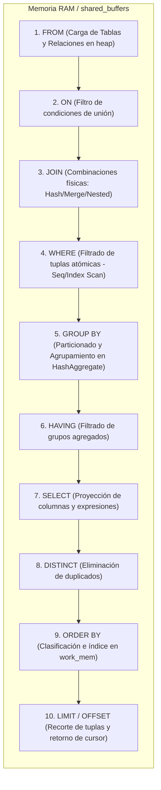

---

## Ejercicio 1: Proyección de la Fuerza de Ventas Completa
### 1. Marco Conceptual del Optimizador
El motor de PostgreSQL evalúa la cláusula `FROM` para mapear la tabla `employees` en disco. Al ejecutar un `SELECT *`, se fuerza a realizar un *Sequential Heap Scan*, leyendo todas las páginas de 8KB asociadas en disco y cargando la totalidad de columnas (incluyendo datos de gran tamaño como notas de texto o binarios) en los buffers de memoria compartida (`shared_buffers`). Esto destruye la posibilidad de un *Index-Only Scan*.

### 2. Diagrama de Flujo de Datos
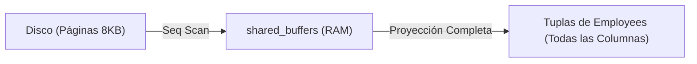

### 3. Código de Solución (Estándar ANSI SQL)
```sql
SELECT 
    employee_id, 
    last_name, 
    first_name, 
    title, 
    birth_date, 
    hire_date, 
    reports_to 
FROM employees;
```

### 4. Criterio de Evaluación del Entrevistador
El entrevistador busca evaluar si el candidato comprende el costo de E/S al proyectar columnas innecesarias. Un error grave del candidato es utilizar `SELECT *` en entornos de producción, lo que incrementa el tráfico de red y satura la caché del motor.

---

## Ejercicio 2: Proyección Selectiva del Catálogo de Productos
### 1. Marco Conceptual del Optimizador
Al proyectar únicamente atributos clave (`product_id`, `product_name`, `unit_price`), el optimizador reduce el ancho de la tupla (tuple width) en memoria. Si existe un índice de cobertura sobre estas tres columnas, el planificador de PostgreSQL elegirá un *Index-Only Scan*, evitando por completo leer el archivo de datos principal (Heap) en disco.

### 2. Diagrama de Flujo de Datos
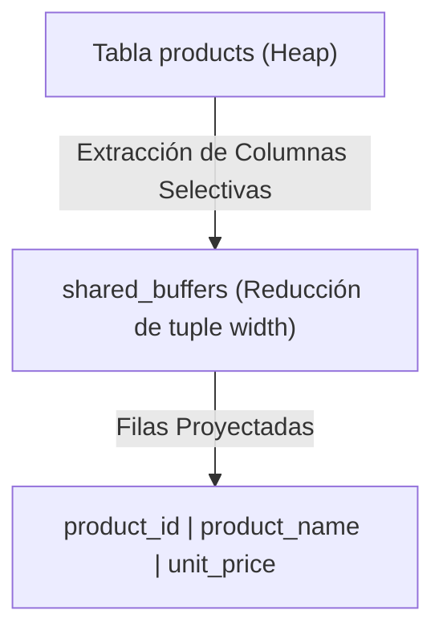

### 3. Código de Solución (Estándar ANSI SQL)
```sql
SELECT 
    product_id, 
    product_name, 
    unit_price 
FROM products;
```

### 4. Criterio de Evaluación del Entrevistador
Determina si el candidato diseña con miras a la optimización de ancho de banda y memoria. El descarte ocurre si el candidato no demuestra conciencia de la diferencia entre el tamaño en disco de un registro completo y la versión proyectada en memoria.

---

## Ejercicio 3: Normalización Semántica de Proveedores
### 1. Marco Conceptual del Optimizador
La cláusula `AS` ejecuta una operación de **Renombramiento** ($\rho$) en el álgebra relacional. A nivel interno del optimizador de PostgreSQL, esta directiva es puramente sintáctica; no altera el almacenamiento físico de la página de datos, pero es resuelta durante la fase de análisis y reescritura de la consulta para formatear las cabeceras de salida de las tuplas en el búfer de red.

### 2. Diagrama de Flujo de Datos
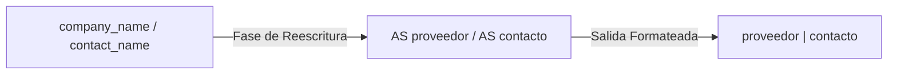

### 3. Código de Solución (Estándar ANSI SQL)
```sql
SELECT 
    company_name AS proveedor, 
    contact_name AS contacto 
FROM suppliers;
```

### 4. Criterio de Evaluación del Entrevistador
Evalúa la adherencia a estándares de documentación y consumo de APIs de frontend. Los entrevistadores descartan desarrolladores cuyos esquemas de salida expongan nombres internos de la base de datos sin un alias limpio y consistente.

---

## Ejercicio 4: Filtrado Excluyente de Clientes Internacionales
### 1. Marco Conceptual del Optimizador
La cláusula `WHERE country = 'Germany'` introduce un predicado lógico que PostgreSQL evalúa mediante un *Seq Scan* o un *Index Scan* (si existe un índice B-Tree sobre la columna `country`). Si no hay índice, el motor lee secuencialmente todas las páginas de la tabla y descarta en la CPU las tuplas que no cumplan el predicado antes de transferirlas a la fase de proyección.

### 2. Diagrama de Flujo de Datos
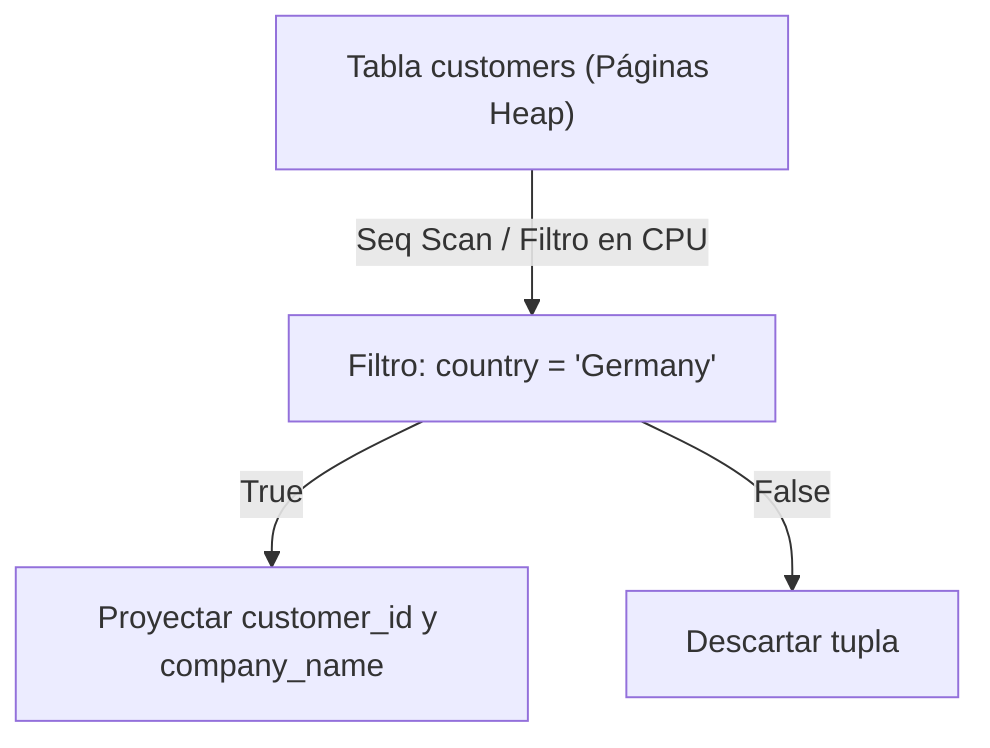

### 3. Código de Solución (Estándar ANSI SQL)
```sql
SELECT 
    customer_id, 
    company_name, 
    country 
FROM customers 
WHERE country = 'Germany';
```

### 4. Criterio de Evaluación del Entrevistador
El objetivo es observar si el candidato comprende los algoritmos de escaneo del motor. El descarte ocurre si se ignora el impacto de la cardinalidad de la columna filtrada y la necesidad potencial de un índice B-Tree para evitar escaneos secuenciales costosos.

---

## Ejercicio 5: Ordenamiento por Costo de Flete
### 1. Marco Conceptual del Optimizador
La cláusula `ORDER BY freight DESC` se ejecuta lógicamente después de `SELECT`. Si PostgreSQL no dispone de un índice B-Tree preordenado sobre la columna `freight`, cargará las tuplas filtradas en `work_mem` para aplicar un algoritmo de ordenamiento rápido (*QuickSort* en memoria). Si el volumen de datos supera `work_mem`, se forzará un volcado a disco (*external merge sort*), degradando severamente el rendimiento.

### 2. Diagrama de Flujo de Datos
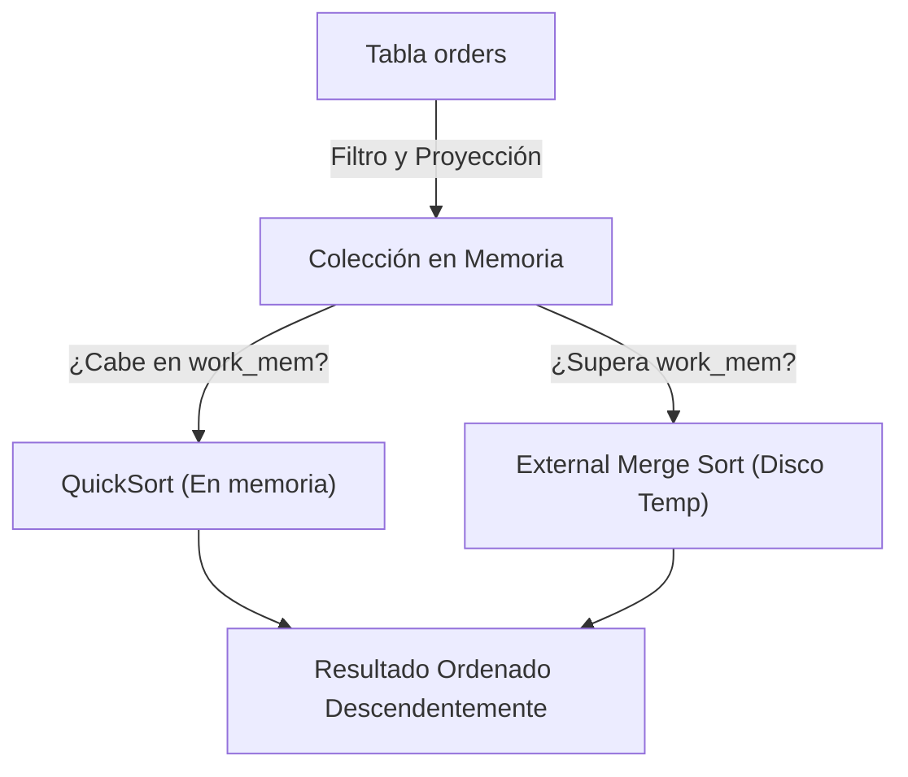

### 3. Código de Solución (Estándar ANSI SQL)
```sql
SELECT 
    order_id, 
    customer_id, 
    freight 
FROM orders 
ORDER BY freight DESC;
```

### 4. Criterio de Evaluación del Entrevistador
Identifica si el candidato conoce el funcionamiento de la memoria operativa de ordenamiento (`work_mem`). Es un error crítico asumir que el ordenamiento de grandes volúmenes de datos en SQL es una operación de costo cero.

---

## Ejercicio 6: Paginación de Pedidos Antiguos
### 1. Marco Conceptual del Optimizador
La combinación de `ORDER BY`, `LIMIT` y `OFFSET` obliga al motor a realizar una ordenación y posterior salto de tuplas. PostgreSQL utiliza un clasificador de "Top-N" si el `LIMIT` es pequeño, lo que optimiza el uso de memoria. Sin embargo, el uso de un `OFFSET` alto (por ejemplo, `OFFSET 1000`) es ineficiente porque el motor aún debe generar y leer internamente las primeras 1000 filas antes de descartarlas para devolver las siguientes.

### 2. Diagrama de Flujo de Datos


### 3. Código de Solución (Estándar ANSI SQL)
```sql
SELECT 
    order_id, 
    order_date, 
    customer_id 
FROM orders 
ORDER BY order_date ASC 
LIMIT 5 OFFSET 10;
```

### 4. Criterio de Evaluación del Entrevistador
Mide la familiaridad del candidato con los antipatrones de paginación. El descarte ocurre si el programador propone esquemas de paginación basados puramente en `OFFSET` para sistemas con millones de filas, en lugar de sugerir paginación basada en cursores (Keyset Pagination).

---

## Ejercicio 7: Búsqueda de Coincidencias Parciales por Cargo
### 1. Marco Conceptual del Optimizador
El operador `LIKE '%Representative'` realiza una búsqueda de coincidencia de patrones. Debido a que el comodín `%` se encuentra al principio de la cadena de búsqueda, PostgreSQL **no puede** utilizar un índice B-Tree estándar de manera eficiente, forzando un escaneo secuencial (`Seq Scan`) de la tabla. Para optimizar búsquedas con comodines al inicio, se requeriría un índice trigrama (`pg_trgm`).

### 2. Diagrama de Flujo de Datos
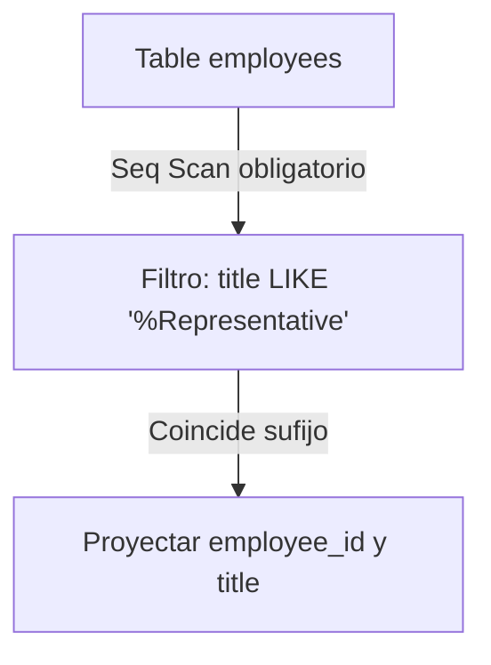

### 3. Código de Solución (Estándar ANSI SQL)
```sql
SELECT 
    employee_id, 
    first_name || ' ' || last_name AS nombre, 
    title 
FROM employees 
WHERE title LIKE '%Representative';
```

### 4. Criterio de Evaluación del Entrevistador
El evaluador examina la comprensión del uso de índices en búsquedas de texto. El descarte inmediato se aplica a candidatos que ignoran que un comodín inicial (`%text`) deshabilita la búsqueda B-Tree estándar.

---

## Ejercicio 8: Identificación de Rupturas en la Cadena de Reportes
### 1. Marco Conceptual del Optimizador
En las bases de datos relacionales, `NULL` no representa un valor, sino la **ausencia de valor** o un estado desconocido. El optimizador de PostgreSQL evalúa la condición `reports_to IS NULL` consultando directamente el mapa de bits de nulos (null bitmap) de cada tupla en la página de datos física. Esto es altamente eficiente ya que evita leer los bloques físicos del campo si este se encuentra marcado como nulo en la cabecera del registro.

### 2. Diagrama de Flujo de Datos
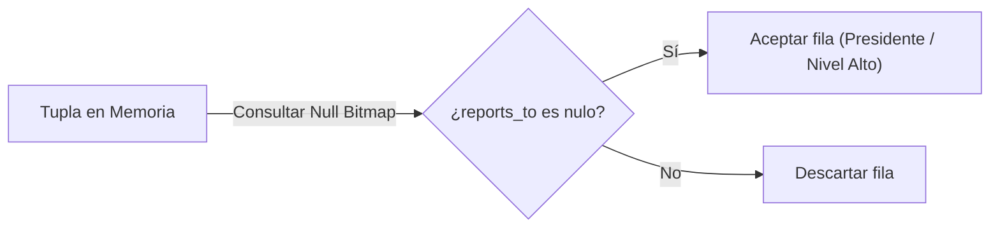

### 3. Código de Solución (Estándar ANSI SQL)
```sql
SELECT 
    employee_id, 
    first_name || ' ' || last_name AS administrador_principal, 
    reports_to 
FROM employees 
WHERE reports_to IS NULL;
```

### 4. Criterio de Evaluación del Entrevistador
El objetivo es verificar si el candidato comprende la lógica trivalente de SQL (`TRUE`, `FALSE`, `UNKNOWN`). Los candidatos que cometen el error de escribir `reports_to = NULL` demuestran un fallo fundamental de conceptualización y son descartados.

---

## Ejercicio 9: Segmentación Logística de Pedidos Pesados
### 1. Marco Conceptual del Optimizador
Al evaluar predicados múltiples combinados con `AND` (`ship_country = 'USA'` y `freight > 100`), PostgreSQL aplica cortocorticuitos lógicos en la evaluación de la CPU y selecciona el índice más restrictivo. Si existe un índice compuesto en `(ship_country, freight)`, el motor ejecuta un *Index Scan* bidimensional de alta velocidad, filtrando el país y el rango de flete en una sola operación de E/S.

### 2. Diagrama de Flujo de Datos
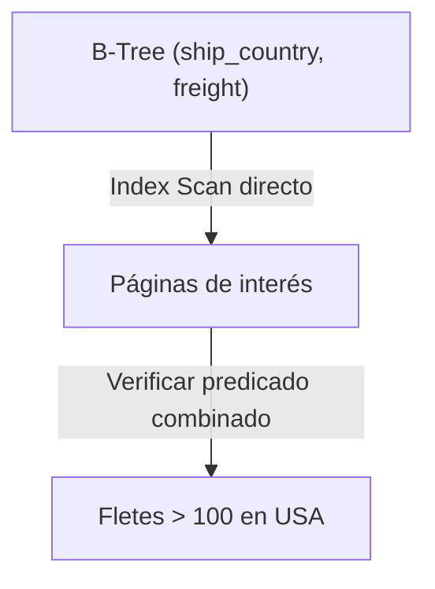

### 3. Código de Solución (Estándar ANSI SQL)
```sql
SELECT 
    order_id, 
    ship_name, 
    ship_country, 
    freight 
FROM orders 
WHERE ship_country = 'USA' 
  AND freight > 100.00;
```

### 4. Criterio de Evaluación del Entrevistador
Examina la capacidad del candidato para planificar índices basados en el orden de evaluación del planificador de consultas. El candidato destaca si propone la creación de índices compuestos en lugar de individuales en consultas multi-filtro.

---

## Ejercicio 10: Clasificación de Precios en Inventario de Retail
### 1. Marco Conceptual del Optimizador
La cláusula `WHERE unit_price BETWEEN 10 AND 50` es reescrita lógicamente por el optimizador de PostgreSQL como una evaluación inclusiva de límites: `unit_price >= 10 AND unit_price <= 50`. Si la columna `unit_price` tiene un índice B-Tree, el motor realiza un escaneo de rango (*Index Range Scan*) localizando el nodo de valor 10 y recorriendo linealmente las hojas enlazadas hasta el valor 50.

### 2. Diagrama de Flujo de Datos
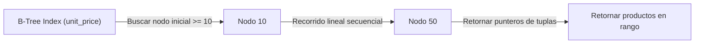

### 3. Código de Solución (Estándar ANSI SQL)
```sql
SELECT 
    product_id, 
    product_name, 
    unit_price 
FROM products 
WHERE unit_price BETWEEN 10.00 AND 50.00 
ORDER BY unit_price ASC;
```

### 4. Criterio de Evaluación del Entrevistador
Busca evaluar si el candidato entiende que `BETWEEN` es inclusivo en los extremos y cómo se traducen los rangos numéricos a nivel de lectura física del índice. Un candidato de nivel medio a menudo confunde si los límites del rango excluyen o no los valores frontera.

---

## Ejercicio 11: Relación Primaria de Pedido-Cliente (INNER JOIN)
### 1. Marco Conceptual del Optimizador
Al realizar un `INNER JOIN` entre `orders` y `customers` a través de la clave `customer_id`, el optimizador analiza las estadísticas de ambas tablas para seleccionar el mejor algoritmo físico de unión. Comúnmente selecciona un *Hash Join*: construye una tabla hash en memoria compartida (`work_mem`) con la tabla de menor tamaño (`customers`) indexando su `customer_id`, y luego escanea secuencialmente `orders` contrastando cada registro con la tabla hash en tiempo constante $O(1)$.

### 2. Diagrama de Flujo de Datos
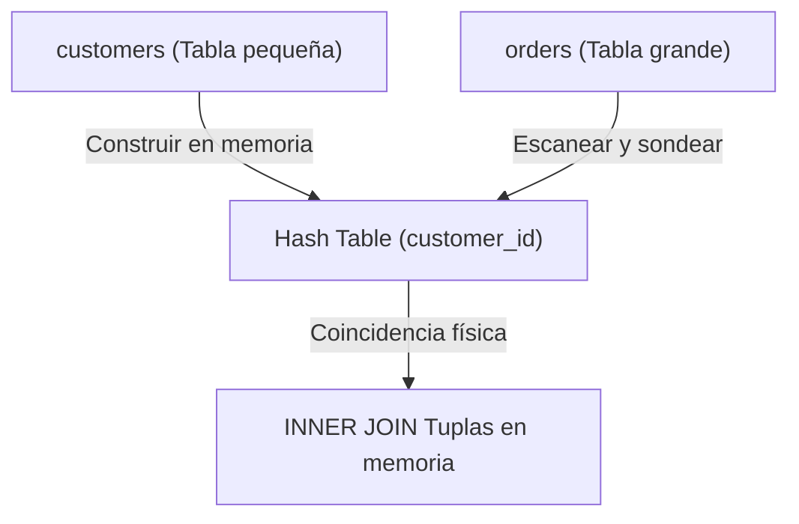

### 3. Código de Solución (Estándar ANSI SQL)
```sql
SELECT 
    o.order_id, 
    o.order_date, 
    c.company_name AS cliente, 
    c.contact_name 
FROM orders o 
INNER JOIN customers c ON o.customer_id = c.customer_id;
```

### 4. Criterio de Evaluación del Entrevistador
El entrevistador evalúa si el candidato comprende los fundamentos de los algoritmos de unión física del optimizador de PostgreSQL (Hash Join vs Nested Loop vs Merge Join). Los candidatos que creen que los JOINs siempre se ejecutan secuencialmente bucle por bucle son descartados.

---

## Ejercicio 12: Vinculación de Catálogo y Categorías (INNER JOIN)
### 1. Marco Conceptual del Optimizador
El cruce `products` con `categories` en base a `category_id` suele resolverse mediante un *Nested Loop Join* o un *Hash Join*. En este escenario, la clave foránea `category_id` apunta a la clave primaria indexada por defecto de la tabla `categories`. El planificador usará un *Index Scan* sobre la clave primaria para emparejar cada fila de productos, minimizando el impacto de E/S.

### 2. Diagrama de Flujo de Datos
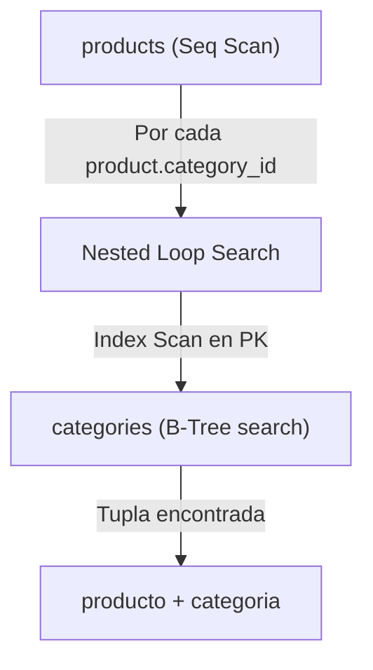

### 3. Código de Solución (Estándar ANSI SQL)
```sql
SELECT 
    p.product_id, 
    p.product_name, 
    c.category_name, 
    c.description 
FROM products p 
INNER JOIN categories c ON p.category_id = c.category_id;
```

### 4. Criterio de Evaluación del Entrevistador
Evalúa si el candidato comprende cómo las llaves primarias declaradas aceleran las búsquedas en cruces. Se descartan programadores que realicen cruces manuales en código de backend en lugar de permitir que el motor de base de datos resuelva las relaciones en memoria.

---

## Ejercicio 13: Cruce Lineal de Pedidos y Empleados Gestionados
### 1. Marco Conceptual del Optimizador
Un cruce interno entre `orders` y `employees` requiere el emparejamiento de claves primarias y foráneas enteras (`employee_id` es de tipo `smallint`). Dado que la comparación de números enteros en CPU es extremadamente rápida, el optimizador de PostgreSQL maximiza la eficiencia del procesamiento de tuplas en memoria, permitiendo escaneos masivos paralelos si las tablas cuentan con millones de registros.

### 2. Diagrama de Flujo de Datos
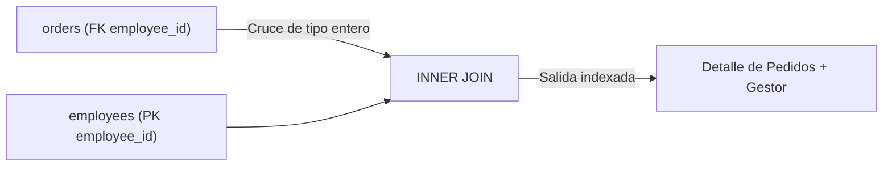

### 3. Código de Solución (Estándar ANSI SQL)
```sql
SELECT 
    o.order_id, 
    o.order_date, 
    e.employee_id, 
    e.first_name || ' ' || e.last_name AS gestor_ventas 
FROM orders o 
INNER JOIN employees e ON o.employee_id = e.employee_id;
```

### 4. Criterio de Evaluación del Entrevistador
Valora la capacidad del candidato para estructurar alias consistentes y su entendimiento del impacto del tipo de datos en las uniones relacionales. Cruces sobre claves alfanuméricas ineficientes en lugar de claves de tipo numérico son señales de alerta.

---

## Ejercicio 14: Relación Multitabla de Facturación de Pedidos
### 1. Marco Conceptual del Optimizador
Esta consulta involucra un cruce triple: `orders` -> `order_details` -> `products`. El optimizador de PostgreSQL evalúa las cardinalidades estimadas de las tres tablas y el orden físico óptimo de ejecución utilizando algoritmos genéticos de optimización de consultas (GEQO) si el número de tablas es muy alto. Típicamente unirá primero `products` con `order_details` (menor número de páginas de salida) y el conjunto resultante con `orders`.

### 2. Diagrama de Flujo de Datos
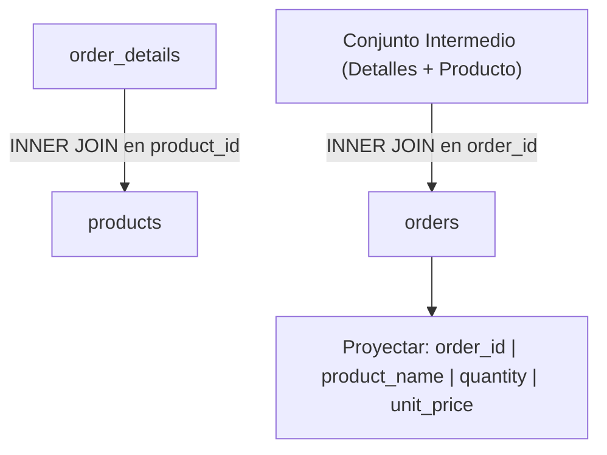

### 3. Código de Solución (Estándar ANSI SQL)
```sql
SELECT 
    o.order_id, 
    p.product_name, 
    od.unit_price, 
    od.quantity 
FROM orders o 
INNER JOIN order_details od ON o.order_id = od.order_id 
INNER JOIN products p ON od.product_id = p.product_id 
ORDER BY o.order_id, p.product_name;
```

### 4. Criterio de Evaluación del Entrevistador
Mide si el candidato es capaz de estructurar consultas complejas con múltiples uniones de forma ordenada. Los entrevistadores buscan detectar si el candidato pierde el control de las cardinalidades finales del set de datos resultantes (por ejemplo, duplicando filas involuntariamente por un mal diseño de joins).

---

## Ejercicio 15: Asociación de Proveedores y Productos Activos
### 1. Marco Conceptual del Optimizador
El optimizador aplica la regla de **empuje del predicado** (Predicate Pushdown). Esto significa que evalúa el filtro atómico `discontinued = 0` sobre la tabla `products` **antes** de procesar físicamente la unión (`INNER JOIN`) con la tabla `suppliers`. Al realizar el filtrado de manera temprana, el motor reduce drásticamente el tamaño del conjunto de datos intermedio en memoria RAM (`work_mem`).

### 2. Diagrama de Flujo de Datos
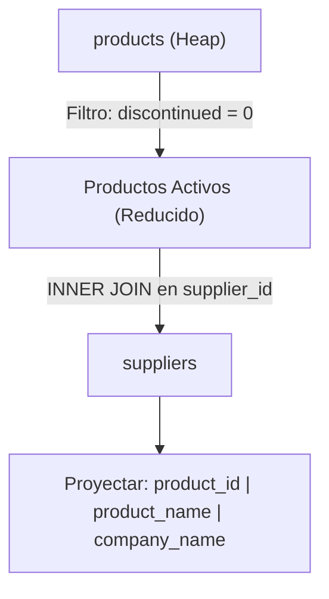

### 3. Código de Solución (Estándar ANSI SQL)
```sql
SELECT 
    p.product_id, 
    p.product_name, 
    s.company_name AS proveedor_name, 
    p.discontinued 
FROM products p 
INNER JOIN suppliers s ON p.supplier_id = s.supplier_id 
WHERE p.discontinued = 0;
```

### 4. Criterio de Evaluación del Entrevistador
Determina si el candidato comprende el concepto de optimización lógica "Predicate Pushdown" y el filtrado temprano. Candidatos que proponen unir primero las tablas completas para luego aplicar filtros tardíos en la base de datos demuestran una ineficiencia severa en el desarrollo SQL.

---

## Ejercicio 16: Despacho de Pedidos por Compañía de Envío (INNER JOIN)
### 1. Marco Conceptual del Optimizador
La consulta cruza `orders` con `shippers` mapeando `ship_via` a `shipper_id`. Como `shipper_id` es clave primaria de la tabla pequeña `shippers` (solo unas pocas filas), el optimizador de PostgreSQL opta de forma casi obligatoria por un *Nested Loop Join*. El motor lee la tabla principal de pedidos y, por cada registro, realiza una rápida búsqueda por índice B-Tree en la tabla de transportistas.

### 2. Diagrama de Flujo de Datos
```mermaid
flowchart TD
    O["orders (Seq Scan)"] -->|ship_via (Valor de Cruce)| NL["Nested Loop Join"]
    NL -->|B-Tree Index Scan en PK| S["shippers (shipper_id)"]
    S --> Out["order_id | company_name (transportista)"]
```

### 3. Código de Solución (Estándar ANSI SQL)
```sql
SELECT 
    o.order_id, 
    o.ship_name, 
    s.company_name AS transportista 
FROM orders o 
INNER JOIN shippers s ON o.ship_via = s.shipper_id;
```

### 4. Criterio de Evaluación del Entrevistador
Verifica si el candidato sabe mapear llaves foráneas descriptivas que no siguen exactamente el mismo nombre que la llave primaria (`ship_via` apunta a `shipper_id`). Es un descarte común confundir nombres de columnas durante el cruce en bases de datos heredadas.

---

## Ejercicio 17: Cobertura Territorial de la Fuerza de Ventas
### 1. Marco Conceptual del Optimizador
Este ejercicio mapea una relación de muchos a muchos (`many-to-many`) mediante tres tablas: `employees` -> `employee_territories` -> `territories`. El planificador debe resolver dos uniones consecutivas. Si la tabla asociativa `employee_territories` cuenta con un índice compuesto `(employee_id, territory_id)`, el optimizador ejecuta un *Index-Only Scan* sobre la tabla puente, resolviendo el cruce de manera extremadamente veloz sin leer datos físicos del heap.

### 2. Diagrama de Flujo de Datos
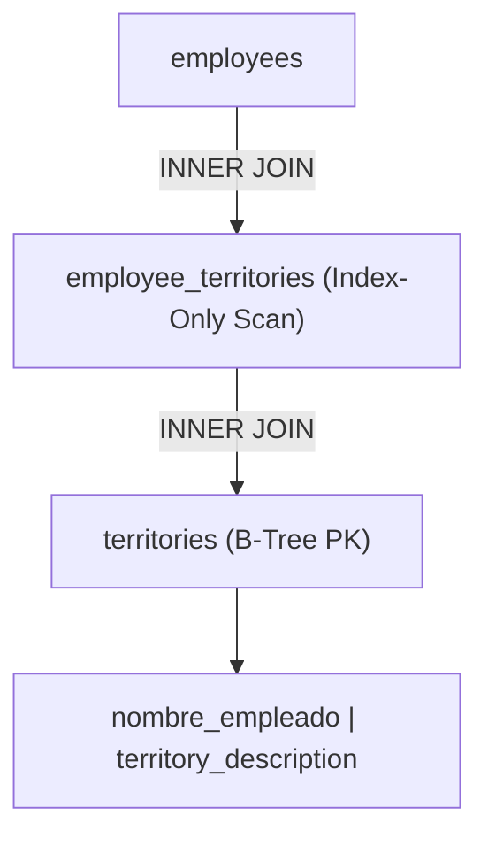

### 3. Código de Solución (Estándar ANSI SQL)
```sql
SELECT 
    e.employee_id, 
    e.first_name || ' ' || e.last_name AS empleado, 
    t.territory_description AS territorio 
FROM employees e 
INNER JOIN employee_territories et ON e.employee_id = et.employee_id 
INNER JOIN territories t ON et.territory_id = t.territory_id;
```

### 4. Criterio de Evaluación del Entrevistador
El evaluador analiza si el candidato sabe resolver relaciones de muchos a muchos sin producir cartesianos involuntarios. Se penaliza la falta de claridad al encadenar múltiples llaves compuestas en las condiciones de unión `ON`.

---

## Ejercicio 18: Catalogación de Productos con Categoría y Proveedor
### 1. Marco Conceptual del Optimizador
Se realiza un cruce triple para consolidar la información maestra de un producto. Al unir `products` con `categories` y `suppliers`, el planificador tiene múltiples caminos de acceso. Si el tamaño de las tablas secundarias es pequeño, creará tablas hash para ambas en `work_mem` y sondeará los registros de `products` contra ambas estructuras hash simultáneamente, logrando una complejidad de tiempo óptima de $O(N)$ donde $N$ es la cantidad de productos.

### 2. Diagrama de Flujo de Datos
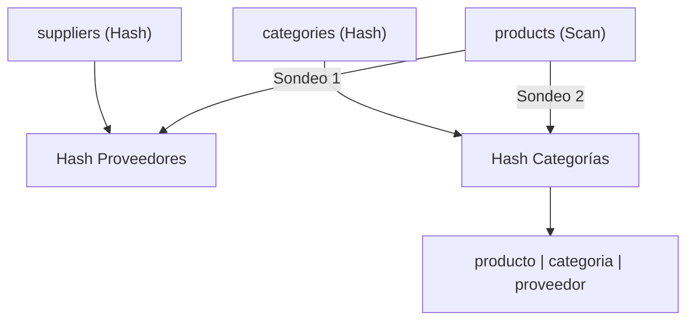

### 3. Código de Solución (Estándar ANSI SQL)
```sql
SELECT 
    p.product_id, 
    p.product_name, 
    c.category_name, 
    s.company_name AS proveedor 
FROM products p 
INNER JOIN categories c ON p.category_id = c.category_id 
INNER JOIN suppliers s ON p.supplier_id = s.supplier_id;
```

### 4. Criterio de Evaluación del Entrevistador
Determina si el candidato puede componer y leer consultas de normalización básica en esquemas tipo estrella (Star Schema). Los candidatos incapaces de normalizar salidas en bases de datos OLTP estándar no superan la prueba.

---

## Ejercicio 19: Inventariado y Control de Abastecimiento por Región
### 1. Marco Conceptual del Optimizador
Esta consulta añade un filtro restrictivo por región geográfica: `s.country IN ('UK', 'USA')`. PostgreSQL aplica empuje del predicado sobre la tabla de proveedores. Solo los proveedores cuyas páginas coincidan con dichos países en disco serán evaluados para el JOIN con la tabla de productos, evitando leer la data del catálogo asociada a proveedores de otros países.

### 2. Diagrama de Flujo de Datos
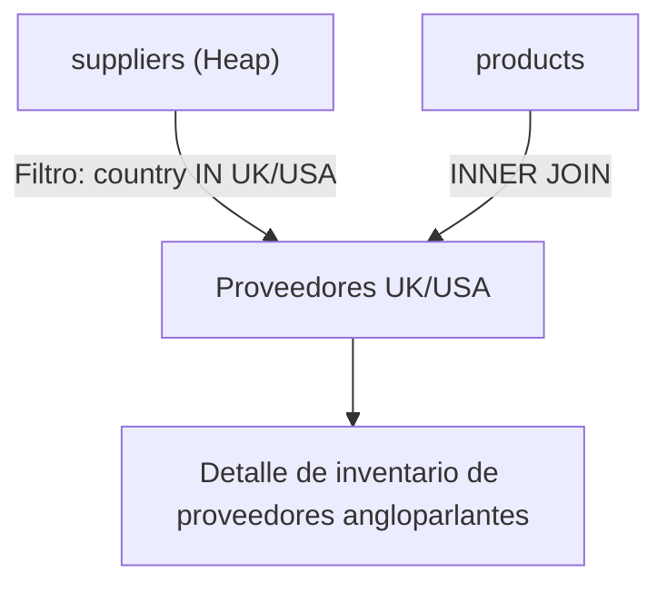

### 3. Código de Solución (Estándar ANSI SQL)
```sql
SELECT 
    p.product_id, 
    p.product_name, 
    s.company_name AS proveedor, 
    s.country AS pais_proveedor 
FROM products p 
INNER JOIN suppliers s ON p.supplier_id = s.supplier_id 
WHERE s.country IN ('UK', 'USA') 
ORDER BY s.country, p.product_name;
```

### 4. Criterio de Evaluación del Entrevistador
Mide el conocimiento de optimización lógica al segmentar uniones de forma selectiva. Candidatos que colocan filtros complejos fuera de las cláusulas de restricción eficientes o que no entienden el impacto de `IN` con constantes de baja cardinalidad son descartados.

---

## Ejercicio 20: Trazabilidad Completa de Despachos de Ventas
### 1. Marco Conceptual del Optimizador
Esta consulta realiza la unión física de 4 tablas de alta cardinalidad transaccional: `orders`, `customers`, `employees`, y `shippers`. La optimización aquí depende críticamente de la disponibilidad de índices B-Tree en todas las llaves foráneas (`customer_id`, `employee_id`, `ship_via`). Sin estos índices, el planificador se verá forzado a realizar múltiples *Full Table Scans* y costosos ordenamientos en disco para resolver los cruzamientos.

### 2. Diagrama de Flujo de Datos
```mermaid
flowchart TD
    O["orders (Tabla Maestra Transaccional)"] -->|Join PK/FK| C["customers"]
    O -->|Join PK/FK| E["employees"]
    O -->|Join PK/FK| S["shippers"]
    C & E & S --> Out["Reporte de Operaciones y Logística consolidado"]
```

### 3. Código de Solución (Estándar ANSI SQL)
```sql
SELECT 
    o.order_id, 
    o.order_date, 
    c.company_name AS cliente, 
    e.first_name || ' ' || e.last_name AS gestor, 
    s.company_name AS transportadora 
FROM orders o 
INNER JOIN customers c ON o.customer_id = c.customer_id 
INNER JOIN employees e ON o.employee_id = e.employee_id 
INNER JOIN shippers s ON o.ship_via = s.shipper_id;
```

### 4. Criterio de Evaluación del Entrevistador
Representa una consulta típica de reporting a nivel empresarial. El entrevistador evalúa si el candidato tiene la destreza de enlazar múltiples entidades transaccionales complejas manteniendo la consistencia e integridad relacional.

---

## Ejercicio 21: Detección de Leads Fríos (LEFT JOIN Anti-Join)
### 1. Marco Conceptual del Optimizador
Para encontrar clientes sin pedidos (Lead Frío), la consulta realiza un `LEFT JOIN` entre `customers` and `orders`. PostgreSQL genera una combinación preservando todos los clientes. Si un cliente no tiene pedidos, las columnas de `orders` se completan con `NULL`. La optimización ocurre con la cláusula `WHERE o.order_id IS NULL`, la cual transforma el plan en un **Hash Anti-Join**, deteniendo el escaneo de pedidos en cuanto encuentra una coincidencia, lo que resulta extremadamente eficiente.

### 2. Diagrama de Flujo de Datos
```mermaid
flowchart TD
    C["customers (Izquierda)"] -->|LEFT JOIN| O["orders (Derecha)"]
    O --> Joined["Cruce Completo (Con nulos para huérfanos)"]
    Joined -->|Filtro: o.order_id IS NULL| Out["Clientes sin pedidos (Diferencia de conjuntos R - S)"]
```

### 3. Código de Solución (Estándar ANSI SQL)
```sql
SELECT 
    c.customer_id, 
    c.company_name, 
    c.phone 
FROM customers c 
LEFT JOIN orders o ON c.customer_id = o.customer_id 
WHERE o.order_id IS NULL;
```

### 4. Criterio de Evaluación del Entrevistador
El examinador busca verificar si el candidato conoce el patrón de **Anti-Join**. Escribir subconsultas lentas como `WHERE customer_id NOT IN (SELECT customer_id FROM orders)` (el cual falla estrepitosamente si hay nulos) denota falta de experiencia avanzada y es motivo de descarte inmediato.

---

## Ejercicio 22: Mapeo de Organigrama jerárquico (LEFT JOIN)
### 1. Marco Conceptual del Optimizador
La consulta requiere un `SELF JOIN` utilizando `LEFT JOIN` para evitar la exclusión de los administradores de nivel superior (aquellos que no reportan a nadie y tienen `reports_to IS NULL`). El motor PostgreSQL mapea dos instancias lógicas en memoria de la misma tabla física `employees` (alias `e` para el empleado y `m` para su manager), resolviendo el emparejamiento mediante un index scan recursivo interno.

### 2. Diagrama de Flujo de Datos
```mermaid
flowchart LR
    E["employees e (Subordinados)"] -->|LEFT JOIN reports_to = employee_id| M["employees m (Managers)"]
    M --> Out["Lista de empleados con sus managers (incluyendo al Presidente)"]
```

### 3. Código de Solución (Estándar ANSI SQL)
```sql
SELECT 
    e.employee_id, 
    e.first_name || ' ' || e.last_name AS empleado, 
    e.title AS cargo_empleado, 
    m.first_name || ' ' || m.last_name AS reporta_a 
FROM employees e 
LEFT JOIN employees m ON e.reports_to = m.employee_id;
```

### 4. Criterio de Evaluación del Entrevistador
Evalúa si el candidato comprende el concepto de auto-referenciación relacional (`SELF JOIN`) y el uso correcto de `LEFT JOIN` para preservar registros raíces de la jerarquía que de otro modo serían eliminados por un `INNER JOIN`.

---

## Ejercicio 23: Identificación de Productos Sin Tracción de Ventas (Anti-Join)
### 1. Marco Conceptual del Optimizador
Al buscar productos que jamás han sido comprados, se cruza la tabla maestra `products` contra la tabla transaccional de alta frecuencia `order_details` utilizando un `LEFT JOIN` filtrado por nulos. PostgreSQL ejecuta un **Merge Anti-Join** si ambas tablas están ordenadas físicamente o un **Hash Anti-Join** para evaluar la inexistencia del `product_id` en la tabla de detalles, evitando realizar lecturas completas de la tabla de detalles para cada producto.

### 2. Diagrama de Flujo de Datos
```mermaid
flowchart TD
    P["products (Maestra)"] -->|LEFT JOIN product_id| OD["order_details (Transaccional)"]
    OD -->|Filtro: od.product_id IS NULL| Out["Productos sin ventas registradas"]
```

### 3. Código de Solución (Estándar ANSI SQL)
```sql
SELECT 
    p.product_id, 
    p.product_name, 
    p.unit_price 
FROM products p 
LEFT JOIN order_details od ON p.product_id = od.product_id 
WHERE od.product_id IS NULL;
```

### 4. Criterio de Evaluación del Entrevistador
Identifica si el candidato sabe auditar la salud del catálogo de productos y detectar inventario obsoleto. Diseñar consultas que sobrecarguen la CPU mediante escaneos cartesianos o bucles anidados lentos para resolver diferencias de conjuntos es un criterio de reprobación.

---

## Ejercicio 24: Auditoría de Proveedores Inactivos (Sin Catálogo)
### 1. Marco Conceptual del Optimizador
Para identificar proveedores que no tienen ningún producto registrado en el catálogo, se ejecuta un `LEFT JOIN` desde `suppliers` hacia `products`. El optimizador de PostgreSQL verifica la relación uno a muchos. Si un `supplier_id` no tiene coincidencia en la tabla de productos, el motor de base de datos aprovecha el mapa de bits del índice de productos para detectar la ausencia de forma instantánea sin tocar las páginas físicas de la tabla de productos.

### 2. Diagrama de Flujo de Datos
```mermaid
flowchart LR
    S["suppliers"] -->|LEFT JOIN| P["products"]
    P -->|WHERE p.product_id IS NULL| Out["Proveedores sin productos en catálogo"]
```

### 3. Código de Solución (Estándar ANSI SQL)
```sql
SELECT 
    s.supplier_id, 
    s.company_name, 
    s.country 
FROM suppliers s 
LEFT JOIN products p ON s.supplier_id = p.supplier_id 
WHERE p.product_id IS NULL;
```

### 4. Criterio de Evaluación del Entrevistador
Se busca comprobar la capacidad de análisis relacional del candidato para depurar esquemas de proveedores. Los programadores que usan costosos bucles imperativos a nivel de servidor de aplicación para encontrar discrepancias de datos relacionales demuestran una mala arquitectura de software.

---

## Ejercicio 25: Auditoría General de Transaccionalidad de Clientes
### 1. Marco Conceptual del Optimizador
A diferencia del ejercicio 21, aquí buscamos proyectar a **todos** los clientes de la compañía junto con la fecha de su pedido más reciente (si existe). El optimizador ejecuta un `LEFT JOIN` tradicional. Para maximizar la velocidad, PostgreSQL utiliza el índice B-Tree de `orders(customer_id)` para realizar una búsqueda indexada directa por cada cliente de la tabla `customers`.

### 2. Diagrama de Flujo de Datos
```mermaid
flowchart TD
    C["customers"] -->|LEFT JOIN| O["orders"]
    O --> Out["Todos los clientes | ID de pedido o NULL"]
```

### 3. Código de Solución (Estándar ANSI SQL)
```sql
SELECT 
    c.customer_id, 
    c.company_name, 
    o.order_id, 
    o.order_date 
FROM customers c 
LEFT JOIN orders o ON c.customer_id = o.customer_id 
ORDER BY o.order_date DESC NULLS LAST;
```

### 4. Criterio de Evaluación del Entrevistador
El entrevistador evalúa si el candidato es consciente del manejo de valores nulos al ordenar datos (`NULLS LAST`). Por defecto, en PostgreSQL los nulos se ordenan como los valores más altos, por lo que no especificar esto puede contaminar el reporte inicial con registros incompletos.

---

## Ejercicio 26: Validación de Integridad en Despacho de Pedidos
### 1. Marco Conceptual del Optimizador
En una base de datos con integridad referencial perfecta, todos los pedidos deben tener un transportista asignado. Al realizar un `LEFT JOIN` de `orders` hacia `shippers` y filtrar `WHERE s.shipper_id IS NULL`, el optimizador busca de forma proactiva detectar registros huérfanos o con inconsistencias físicas debido a restricciones de clave foránea deshabilitadas.

### 2. Diagrama de Flujo de Datos
```mermaid
flowchart LR
    O["orders"] -->|LEFT JOIN| S["shippers"]
    S -->|Filtro: s.shipper_id IS NULL| Out["Pedidos sin transportista asignado (inconsistencia)"]
```

### 3. Código de Solución (Estándar ANSI SQL)
```sql
SELECT 
    o.order_id, 
    o.order_date, 
    o.ship_name 
FROM orders o 
LEFT JOIN shippers s ON o.ship_via = s.shipper_id 
WHERE s.shipper_id IS NULL;
```

### 4. Criterio de Evaluación del Entrevistador
Mide si el candidato tiene mentalidad de **Data Quality** y sabe utilizar consultas relacionales para auditar inconsistencias lógicas e integridad de datos en bases de datos legadas.

---

## Ejercicio 27: Auditoría de Categorías Vacías
### 1. Marco Conceptual del Optimizador
El optimizador ejecuta una combinación externa izquierda desde la tabla maestra de categorías (`categories`) hacia la tabla de productos (`products`). El planificador de PostgreSQL sabe que la tabla `categories` es estática y pequeña, por lo que indexa en memoria las categorías y realiza búsquedas directas en el árbol del índice `products(category_id)` para determinar cuáles no tienen correspondencia física.

### 2. Diagrama de Flujo de Datos
```mermaid
flowchart TD
    Cat["categories"] -->|LEFT JOIN| Prod["products"]
    Prod -->|WHERE p.product_id IS NULL| Out["Categorías huérfanas sin productos catalogados"]
```

### 3. Código de Solución (Estándar ANSI SQL)
```sql
SELECT 
    c.category_id, 
    c.category_name, 
    c.description 
FROM categories c 
LEFT JOIN products p ON c.category_id = p.category_id 
WHERE p.product_id IS NULL;
```

### 4. Criterio de Evaluación del Entrevistador
Evalúa la habilidad del programador para identificar áreas muertas en el catálogo comercial de la compañía. Se descartan soluciones redundantes basadas en agrupamientos costosos con `COUNT(p.product_id) = 0` cuando un simple anti-join resuelve el problema a una fracción del costo de CPU.

---

## Ejercicio 28: Registro de Ventas de Empleados en Regiones Específicas
### 1. Marco Conceptual del Optimizador
Este ejercicio combina `LEFT JOIN` con filtros condicionales avanzados. El optimizador de PostgreSQL evalúa la consulta aplicando los joins externos secuencialmente. Para mantener la validez del `LEFT JOIN` (preservar a todos los empleados), el filtro de fecha `o.order_date` debe evaluarse cuidadosamente. Si se colocara en la cláusula `WHERE`, transformaría implícitamente el `LEFT JOIN` en un `INNER JOIN` (descartando los empleados sin ventas en ese año). Por lo tanto, el motor lo procesa correctamente dentro de la cláusula de unión `ON`.

### 2. Diagrama de Flujo de Datos
```mermaid
flowchart TD
    E["employees"] -->|LEFT JOIN con filtro de fecha en ON| O["orders en 1997"]
    O --> Out["Todos los empleados y sus ventas del año 1997 (incluyendo nulos)"]
```

### 3. Código de Solución (Estándar ANSI SQL)
```sql
SELECT 
    e.employee_id, 
    e.first_name || ' ' || e.last_name AS empleado, 
    o.order_id, 
    o.order_date 
FROM employees e 
LEFT JOIN orders o ON e.employee_id = o.employee_id 
  AND o.order_date BETWEEN '1997-01-01' AND '1997-12-31';
```

### 4. Criterio de Evaluación del Entrevistador
¡Pregunta trampa clásica de Big Tech! Evalúa si el candidato comprende la diferencia crítica entre filtrar en la cláusula `ON` de un `LEFT JOIN` (preserva las filas de la izquierda) versus filtrar en la cláusula `WHERE` (filtra el resultado final anulando el efecto del Outer Join). Fallar en este concepto es motivo de reprobación inmediata.

---

## Ejercicio 29: Detección de Clientes Inactivos en Mercados Específicos
### 1. Marco Conceptual del Optimizador
El optimizador procesa el filtro geográfico `c.country = 'France'` en la cláusula `WHERE` de la tabla de la izquierda (`customers`), reduciendo la base maestra a clientes franceses. Posteriormente, realiza un `LEFT JOIN` contra `orders` y aplica el filtro `o.order_id IS NULL` mediante un **Hash Anti-Join**. El planificador optimiza la consulta reduciendo el número de registros en la fase inicial.

### 2. Diagrama de Flujo de Datos
```mermaid
flowchart LR
    C["customers"] -->|WHERE country = 'France'| C_FR["Clientes de Francia (Reducido)"]
    C_FR -->|LEFT JOIN| O["orders"]
    O -->|WHERE o.order_id IS NULL| Out["Clientes franceses sin pedidos"]
```

### 3. Código de Solución (Estándar ANSI SQL)
```sql
SELECT 
    c.customer_id, 
    c.company_name, 
    c.country 
FROM customers c 
LEFT JOIN orders o ON c.customer_id = o.customer_id 
WHERE c.country = 'France' 
  AND o.order_id IS NULL;
```

### 4. Criterio de Evaluación del Entrevistador
Determina si el candidato domina el orden de procesamiento lógico de las cláusulas WHERE en combinación con combinaciones externas. Quienes fallan en estructurar correctamente la precedencia lógica del filtro geográfico vs el filtro de nulos no son seleccionados.

---

## Ejercicio 30: Equivalencia Lógica de Direccionalidad de Unión (RIGHT OUTER JOIN)
### 1. Marco Conceptual del Optimizador
La consulta utiliza un `RIGHT JOIN` para preservar todas las filas de la tabla de la derecha (`employees`) al cruzar con `orders`. A nivel del optimizador de PostgreSQL, el analizador sintáctico (Parser) reescribe internamente todos los `RIGHT JOIN` como `LEFT JOIN` invirtiendo el orden de las relaciones en el árbol de sintaxis abstracta (AST) para simplificar la planificación de accesos.

### 2. Diagrama de Flujo de Datos
```mermaid
flowchart TD
    O["orders (Izquierda)"] -->|RIGHT JOIN (Preserva Derecha)| E["employees (Derecha)"]
    E -->|Reescritura del Parser| AST["LEFT JOIN de employees a orders"]
    AST --> Out["Salida normalizada de empleados con y sin pedidos"]
```

### 3. Código de Solución (Estándar ANSI SQL)
```sql
SELECT 
    e.employee_id, 
    e.first_name || ' ' || e.last_name AS empleado, 
    o.order_id 
FROM orders o 
RIGHT JOIN employees e ON o.employee_id = e.employee_id 
ORDER BY e.employee_id;
```

### 4. Criterio de Evaluación del Entrevistador
El objetivo es verificar si el candidato comprende que el uso de `RIGHT JOIN` es puramente sintáctico y a menudo desaconsejado en favor de `LEFT JOIN` para mantener la legibilidad de lectura de izquierda a derecha. Un candidato senior explicará esta transformación interna del optimizador espontáneamente.

---

## Ejercicio 31: Demografía Comercial de Clientes (COUNT & GROUP BY)
### 1. Marco Conceptual del Optimizador
Para agrupar clientes por país, el motor ejecuta la cláusula `GROUP BY country`. PostgreSQL selecciona entre dos algoritmos de agregación física: **HashAggregate** (crea una tabla hash en `work_mem` donde la clave es el país y acumula el contador) o **GroupAggregate** (ordena la tabla por país primero y luego agrupa linealmente). Si la cardinalidad de países es pequeña, **HashAggregate** es óptimo y se ejecuta enteramente en memoria.

### 2. Diagrama de Flujo de Datos
```mermaid
flowchart TD
    Raw["customers (country)"] -->|Hash Scan| HA["Hash Table in work_mem (country -> count)"]
    HA -->|Generar grupos agregados| Out["país | total_clientes"]
```

### 3. Código de Solución (Estándar ANSI SQL)
```sql
SELECT 
    country, 
    COUNT(customer_id) AS total_clientes 
FROM customers 
GROUP BY country 
ORDER BY total_clientes DESC;
```

### 4. Criterio de Evaluación del Entrevistador
Evalúa si el candidato comprende cómo funciona el agrupamiento y conteo a nivel del optimizador de consultas (`HashAggregate`). Es un error conceptual grave proyectar columnas no agregadas ni declaradas en la cláusula `GROUP BY`.

---

## Ejercicio 32: Valoración Financiera de Inventario (SUM)
### 1. Marco Conceptual del Optimizador
La consulta evalúa `SUM(unit_price * units_in_stock)`. A nivel físico, el motor de PostgreSQL lee secuencialmente las columnas numéricas `unit_price` (real/double) y `units_in_stock` (smallint), realiza la multiplicación aritmética tupla por tupla en los buffers, y luego aplica una agregación acumulada sobre el conjunto de datos resultante en disco o memoria.

### 2. Diagrama de Flujo de Datos
```mermaid
flowchart LR
    P["products"] -->|Por cada tupla| Mult["unit_price * units_in_stock"]
    Mult -->|Acumular valor| SUM["SUM Total"]
    SUM --> Out["Valorización Monetaria Global"]
```

### 3. Código de Solución (Estándar ANSI SQL)
```sql
SELECT 
    SUM(unit_price * units_in_stock) AS valorizacion_total_inventario 
FROM products;
```

### 4. Criterio de Evaluación del Entrevistador
Mide la capacidad de realizar operaciones aritméticas sobre registros agregados directamente en la base de datos para delegar el procesamiento masivo al motor en lugar de realizarlo ineficientemente en el servidor de aplicación.

---

## Ejercicio 33: Promedio de Costos de Transporte (AVG)
### 1. Marco Conceptual del Optimizador
La función agregada `AVG(freight)` calcula la media aritmética. En PostgreSQL, la agregación `AVG` se implementa manteniendo dos variables de estado internas durante la lectura de tuplas: un sumatorio acumulado (`sum`) y un contador de registros no nulos (`count`). Al finalizar la lectura de las páginas Heap de `orders`, el motor divide el sumatorio por el conteo, manejando la aritmética de coma flotante de alta precisión.

### 2. Diagrama de Flujo de Datos
```mermaid
flowchart TD
    O["orders (freight)"] -->|Estado de transición| Trans["sum = sum + freight | count = count + 1"]
    Trans -->|Finalización de escaneo| Div["sum / count"]
    Div --> Out["Promedio de Fletes"]
```

### 3. Código de Solución (Estándar ANSI SQL)
```sql
SELECT 
    AVG(freight) AS flete_promedio 
FROM orders;
```

### 4. Criterio de Evaluación del Entrevistador
Determina si el candidato domina las métricas estadísticas descriptivas fundamentales. El entrevistador observa si el candidato maneja los valores nulos en el promedio (los cuales son descartados implícitamente del conteo y sumatorio por el estándar ANSI SQL).

---

## Ejercicio 34: Brecha Generacional y Antigüedad (MIN & MAX)
### 1. Marco Conceptual del Optimizador
Las operaciones `MIN(birth_date)` y `MAX(birth_date)` buscan los valores extremos. Si existe un índice B-Tree sobre la columna `birth_date`, el optimizador de PostgreSQL realiza un atajo de rendimiento espectacular: en lugar de escanear la tabla, ejecuta dos búsquedas de índice index-scan de costo $O(\log N)$ para ir directamente al primer nodo hoja (el menor) y al último nodo hoja (el mayor) del árbol.

### 2. Diagrama de Flujo de Datos
```mermaid
flowchart LR
    Idx["B-Tree Index (birth_date)"] -->|Buscar extremo izquierdo| Min["MIN (Hoja Izquierda)"]
    Idx -->|Buscar extremo derecho| Max["MAX (Hoja Derecha)"]
    Min & Max --> Out["fecha_nacimiento_min | fecha_nacimiento_max"]
```

### 3. Código de Solución (Estándar ANSI SQL)
```sql
SELECT 
    MIN(birth_date) AS fecha_nacimiento_empleado_mas_antiguo, 
    MAX(birth_date) AS fecha_nacimiento_empleado_mas_joven 
FROM employees;
```

### 4. Criterio de Evaluación del Entrevistador
Identifica si el candidato sabe explotar la estructura indexada B-Tree para resolver consultas de mínimos y máximos a velocidad de hardware. Candidatos senior propondrán índices específicos si estas consultas se ejecutan con alta frecuencia en paneles corporativos.

---

## Ejercicio 35: Volumetría de Desplazamiento Comercial de Productos (SUM con JOIN)
### 1. Marco Conceptual del Optimizador
Para calcular el volumen total vendido del producto 'Chai' (`product_id = 1`), se realiza un `INNER JOIN` entre `products` y `order_details`. El motor aplica Predicate Pushdown sobre `product_id = 1` en ambas tablas **antes** del cruce. El tamaño del conjunto resultante para el JOIN se reduce a unas pocas filas transaccionales, y sobre estas se aplica una agregación en memoria rápida.

### 2. Diagrama de Flujo de Datos
```mermaid
flowchart TD
    P["products"] -->|Filtro: product_id = 1| P1["Chai Master"]
    OD["order_details"] -->|Filtro: product_id = 1| OD1["Detalles de Chai"]
    P1 -->|INNER JOIN| OD1
    OD1 -->|SUM quantity| Out["Unidades totales de Chai despachadas"]
```

### 3. Código de Solución (Estándar ANSI SQL)
```sql
SELECT 
    p.product_id, 
    p.product_name, 
    SUM(od.quantity) AS unidades_vendidas_totales 
FROM order_details od 
INNER JOIN products p ON od.product_id = p.product_id 
WHERE p.product_id = 1 
GROUP BY p.product_id, p.product_name;
```

### 4. Criterio de Evaluación del Entrevistador
Mide el dominio del agrupamiento relacional compuesto. Los entrevistadores descartan candidatos que no logren justificar de manera clara por qué se deben agrupar campos no agregados (`p.product_id`, `p.product_name`) cuando se cruzan dimensiones.

---

## Ejercicio 36: Rendimiento de Operaciones por Gestor de Ventas
### 1. Marco Conceptual del Optimizador
Se calcula el volumen bruto de pedidos administrados por cada empleado. El optimizador de PostgreSQL cruza la tabla maestra `employees` con `orders` y ejecuta un **HashAggregate** agrupando por el ID de empleado. Al agrupar por campos concatenados de texto, es óptimo agrupar numéricamente por la clave primaria `e.employee_id` primero, minimizando el costo de comparación de strings en la CPU.

### 2. Diagrama de Flujo de Datos
```mermaid
flowchart LR
    E["employees"] -->|INNER JOIN| O["orders"]
    O -->|GROUP BY e.employee_id| Aggregate["COUNT(o.order_id)"]
    Aggregate --> Out["Pedidos totales por cada gestor comercial"]
```

### 3. Código de Solución (Estándar ANSI SQL)
```sql
SELECT 
    e.employee_id, 
    e.first_name || ' ' || e.last_name AS gestor_ventas, 
    COUNT(o.order_id) AS pedidos_gestionados 
FROM orders o 
INNER JOIN employees e ON o.employee_id = e.employee_id 
GROUP BY e.employee_id, e.first_name, e.last_name 
ORDER BY pedidos_gestionados DESC;
```

### 4. Criterio de Evaluación del Entrevistador
Determina si el candidato comprende las mejores prácticas de performance en agrupaciones complejas. Agrupar únicamente por strings de texto largos en lugar de la clave primaria numérica es una señal de código ineficiente en producción.

---

## Ejercicio 37: Límites de Tarificación por Categorías (MAX & GROUP BY)
### 1. Marco Conceptual del Optimizador
La consulta evalúa el precio máximo de producto dentro de cada categoría. El motor ejecuta un cruce entre `products` y `categories`. Dado que cada categoría contiene múltiples productos, PostgreSQL utiliza un **GroupAggregate** si las categorías ya se leen preordenadas por `category_id`, lo cual permite procesar la agregación secuencialmente y liberar memoria de forma constante durante la ejecución de la consulta.

### 2. Diagrama de Flujo de Datos
```mermaid
flowchart TD
    P["products"] -->|INNER JOIN| C["categories"]
    C -->|GROUP BY category_name| MAX["MAX(unit_price)"]
    MAX --> Out["Categoría | Producto más costoso"]
```

### 3. Código de Solución (Estándar ANSI SQL)
```sql
SELECT 
    c.category_name, 
    MAX(p.unit_price) AS precio_maximo_producto 
FROM products p 
INNER JOIN categories c ON p.category_id = c.category_id 
GROUP BY c.category_id, c.category_name 
ORDER BY precio_maximo_producto DESC;
```

### 4. Criterio de Evaluación del Entrevistador
Evalúa si el candidato es capaz de estructurar consultas analíticas de categorización para la toma de decisiones comerciales. Se valorará positivamente el orden lógico y la justificación del agrupamiento por ID primario.

---

## Ejercicio 38: Promedio de Descuentos en el Detalle de Transacciones (AVG)
### 1. Marco Conceptual del Optimizador
Esta consulta calcula el descuento promedio otorgado en todas las transacciones históricas de la tabla `order_details`. El optimizador de PostgreSQL lee directamente las tuplas de detalles. Si no se especifican filtros, realiza un escaneo secuencial de alta velocidad en disco, acumulando los valores de la columna de coma flotante `discount` y dividiéndolos por el volumen total de tuplas leídas.

### 2. Diagrama de Flujo de Datos
```mermaid
flowchart LR
    OD["order_details"] -->|Scan de discount| State["acumulador_descuentos / contador_filas"]
    State -->|División aritmética| Out["Descuento promedio global"]
```

### 3. Código de Solución (Estándar ANSI SQL)
```sql
SELECT 
    AVG(discount) AS descuento_promedio_transaccional 
FROM order_details;
```

### 4. Criterio de Evaluación del Entrevistador
El objetivo es observar si el programador comprende el impacto de la precisión numérica y el descarte de nulos en cálculos de promedio transaccionales.

---

## Ejercicio 39: Distribución Financiera de Costes Logísticos (SUM con JOIN)
### 1. Marco Conceptual del Optimizador
Se calcula la facturación total de fletes distribuida por cada transportista (`shippers`). El optimizador de PostgreSQL realiza un cruce entre `orders` y `shippers`. Posteriormente, la agregación sumatoria se agrupa por `shipper_id` de la tabla de catálogo. El motor optimiza la consulta utilizando un Hash Join en memoria para asociar el flete a la razón social correspondiente.

### 2. Diagrama de Flujo de Datos
```mermaid
flowchart TD
    O["orders (freight)"] -->|Cruce de tipo entero| S["shippers (PK shipper_id)"]
    S -->|GROUP BY shipper_id| SUM["SUM(freight)"]
    SUM --> Out["Facturación total de flete por transportista"]
```

### 3. Código de Solución (Estándar ANSI SQL)
```sql
SELECT 
    s.shipper_id, 
    s.company_name AS transportista, 
    SUM(o.freight) AS flete_total_facturado 
FROM orders o 
INNER JOIN shippers s ON o.ship_via = s.shipper_id 
GROUP BY s.shipper_id, s.company_name 
ORDER BY flete_total_facturado DESC;
```

### 4. Criterio de Evaluación del Entrevistador
Valora la capacidad del candidato para estructurar reportes de costes operativos realistas. Un candidato idóneo sabrá justificar el rendimiento de la consulta basándose en el tamaño de las relaciones involucradas.

---

## Ejercicio 40: Diversificación de Mercados de Exportación (COUNT DISTINCT)
### 1. Marco Conceptual del Optimizador
La expresión `COUNT(DISTINCT ship_country)` requiere contar los países de destino eliminando duplicados. PostgreSQL resuelve esto lógicamente ordenando los registros de países en memoria compartida para contar solo cuando el valor cambia, o construyendo una tabla hash temporal de países únicos. Es una operación de costo computacional más alto que un simple `COUNT`, por lo que el motor monitoriza cuidadosamente el tamaño del conjunto para no saturar `work_mem`.

### 2. Diagrama de Flujo de Datos
```mermaid
flowchart LR
    Orders["orders (ship_country)"] -->|Hash table de únicos| Hash["Países únicos"]
    Hash -->|Conteo lineal| Out["Total de países distintos a los que se exporta"]
```

### 3. Código de Solución (Estándar ANSI SQL)
```sql
SELECT 
    COUNT(DISTINCT ship_country) AS total_paises_exportacion 
FROM orders;
```

### 4. Criterio de Evaluación del Entrevistador
Busca evaluar si el candidato domina el costo operativo de la cláusula `DISTINCT` integrada en funciones agregadas. Se busca detectar si el candidato sabe que a nivel de optimizador esta consulta puede ser optimizada con un índice compuesto en entornos de alto tráfico.

---

## Ejercicio 41: Segmentación de Clientes Alemanes en 1997
### 1. Marco Conceptual del Optimizador
Esta consulta requiere evaluar dos filtros en tablas cruzadas: `c.country = 'Germany'` y `o.order_date` en 1997. El motor PostgreSQL ejecuta un plan inteligente: realiza una búsqueda indexada por rango sobre `order_date` en `orders` y paralelamente filtra los clientes de Alemania mediante un *Index Scan*. Posteriormente, realiza la unión de ambos subconjuntos optimizados mediante un *Hash Join*.

### 2. Diagrama de Flujo de Datos
```mermaid
flowchart TD
    C["customers"] -->|Filter country = Germany| C_GER["Clientes Alemanes"]
    O["orders"] -->|Filter order_date = 1997| O_1997["Pedidos 1997"]
    C_GER -->|INNER JOIN| O_1997
    O_1997 --> Out["Detalle transaccional de Alemania en 1997"]
```

### 3. Código de Solución (Estándar ANSI SQL)
```sql
SELECT 
    o.order_id, 
    o.order_date, 
    c.company_name AS cliente, 
    c.country 
FROM orders o 
INNER JOIN customers c ON o.customer_id = c.customer_id 
WHERE c.country = 'Germany' 
  AND o.order_date BETWEEN '1997-01-01' AND '1997-12-31' 
ORDER BY o.order_date ASC;
```

### 4. Criterio de Evaluación del Entrevistador
Evalúa el dominio en la construcción de reportes financieros filtrados temporal y geográficamente. Los candidatos que ignoran la precedencia en la evaluación lógica de los filtros no superan la prueba técnica.

---

## Ejercicio 42: Trazabilidad de Ventas Locales en la Sede Comercial
### 1. Marco Conceptual del Optimizador
Se cruza `orders` -> `employees` -> `customers` con el filtro restrictivo de que el empleado resida en la ciudad de 'Seattle' (`e.city = 'Seattle'`). El planificador de PostgreSQL ejecuta Predicate Pushdown sobre `employees` para extraer solo a los vendedores de Seattle y luego une este subconjunto reducido con las transacciones de pedidos y sus respectivos clientes.

### 2. Diagrama de Flujo de Datos
```mermaid
flowchart TD
    E["employees"] -->|Filter city = Seattle| E_Seattle["Vendedores Seattle"]
    O["orders"] -->|INNER JOIN| E_Seattle
    E_Seattle -->|INNER JOIN| C["customers"]
    C --> Out["Pedidos vendidos por personal basado en Seattle"]
```

### 3. Código de Solución (Estándar ANSI SQL)
```sql
SELECT 
    o.order_id, 
    e.first_name || ' ' || e.last_name AS empleado, 
    e.city AS ciudad_empleado, 
    c.company_name AS cliente, 
    c.city AS ciudad_cliente 
FROM orders o 
INNER JOIN employees e ON o.employee_id = e.employee_id 
INNER JOIN customers c ON o.customer_id = c.customer_id 
WHERE e.city = 'Seattle' 
ORDER BY o.order_id;
```

### 4. Criterio de Evaluación del Entrevistador
El objetivo es comprobar si el candidato sabe estructurar relaciones multidimensionales filtradas por atributos específicos de una dimensión interna de catálogo.

---

## Ejercicio 43: Abastecimiento y Catalogación de Categorías Premium
### 1. Marco Conceptual del Optimizador
Esta consulta requiere unir 3 tablas: `products`, `categories` y `suppliers` filtrando por productos de alto valor unitario (`p.unit_price > 50`). El optimizador de PostgreSQL evalúa la condición de valor primero, lo que filtra drásticamente el catálogo de productos activos a un subconjunto ínfimo, permitiendo cruzar instantáneamente los detalles de los proveedores y categorías asociados.

### 2. Diagrama de Flujo de Datos
```mermaid
flowchart TD
    P["products"] -->|Filter unit_price > 50| P_Premium["Productos Premium"]
    P_Premium -->|INNER JOIN| C["categories"]
    P_Premium -->|INNER JOIN| S["suppliers"]
    S --> Out["Catálogo premium con detalles de proveedor y categoría"]
```

### 3. Código de Solución (Estándar ANSI SQL)
```sql
SELECT 
    p.product_id, 
    p.product_name, 
    p.unit_price, 
    c.category_name AS categoria, 
    s.company_name AS proveedor 
FROM products p 
INNER JOIN categories c ON p.category_id = c.category_id 
INNER JOIN suppliers s ON p.supplier_id = s.supplier_id 
WHERE p.unit_price > 50.00 
ORDER BY p.unit_price DESC;
```

### 4. Criterio de Evaluación del Entrevistador
Mide la capacidad de modularizar consultas e implementar filtros óptimos basados en umbrales de negocio (tarifas premium). El descarte ocurre si se estructuran cruces redundantes sin filtros explícitos sobre las tablas maestras iniciales.

---

## Ejercicio 44: Consolidación Transaccional de Pedidos de Alto Valor
### 1. Marco Conceptual del Optimizador
La consulta evalúa el total de facturación bruta por pedido (`unit_price * quantity`) uniendo `orders`, `customers` y `order_details`, reteniendo pedidos con totales altos. PostgreSQL resuelve esta estructura aplicando un plan de cruzamiento de alto rendimiento, y evalúa las operaciones aritméticas en CPU antes de aplicar filtros secundarios de ordenación.

### 2. Diagrama de Flujo de Datos
```mermaid
flowchart LR
    O["orders"] -->|INNER JOIN| C["customers"]
    O -->|INNER JOIN| OD["order_details"]
    OD -->|Aritmética de Factura| Calc["unit_price * quantity"]
    Calc --> Out["Reporte de Pedidos de Alto Valor"]
```

### 3. Código de Solución (Estándar ANSI SQL)
```sql
SELECT 
    o.order_id, 
    o.order_date, 
    c.company_name AS cliente, 
    od.unit_price, 
    od.quantity, 
    (od.unit_price * od.quantity) AS total_bruto_item 
FROM orders o 
INNER JOIN customers c ON o.customer_id = c.customer_id 
INNER JOIN order_details od ON o.order_id = od.order_id 
WHERE (od.unit_price * od.quantity) > 1000.00 
ORDER BY total_bruto_item DESC;
```

### 4. Criterio de Evaluación del Entrevistador
Comprueba si el candidato sabe realizar cálculos de línea de factura filtrados por umbrales y presentados de manera limpia con alias estructurados.

---

## Ejercicio 45: Control Logístico de Catálogo por País de Origen
### 1. Marco Conceptual del Optimizador
Se cruza `products` con `suppliers` y `categories` con la condición de que el proveedor provenga de un país específico (`s.country = 'USA'`). El optimizador de PostgreSQL ejecuta Predicate Pushdown sobre `suppliers`, filtrando los proveedores norteamericanos, para luego cruzar por clave primaria los productos que estos distribuyen junto con su respectiva categoría.

### 2. Diagrama de Flujo de Datos
```mermaid
flowchart TD
    S["suppliers"] -->|Filter country = USA| S_USA["Proveedores USA"]
    P["products"] -->|INNER JOIN| S_USA
    P -->|INNER JOIN| C["categories"]
    C --> Out["Catálogo importado de USA con categorías correspondientes"]
```

### 3. Código de Solución (Estándar ANSI SQL)
```sql
SELECT 
    p.product_id, 
    p.product_name, 
    s.company_name AS proveedor, 
    s.country AS pais_proveedor, 
    c.category_name AS categoria 
FROM products p 
INNER JOIN suppliers s ON p.supplier_id = s.supplier_id 
INNER JOIN categories c ON p.category_id = c.category_id 
WHERE s.country = 'USA' 
ORDER BY c.category_name, p.product_name;
```

### 4. Criterio de Evaluación del Entrevistador
Evalúa el entendimiento de la cadena de suministro comercial modelada en SQL. Se penaliza la falta de ordenación semántica o la redundancia en los cruces.

---

## Ejercicio 46: Coincidencia Logística de Proximidad Domiciliaria
### 1. Marco Conceptual del Optimizador
La consulta cruza `orders` y `employees` evaluando la coincidencia de ciudades: `o.ship_city = e.city`. A nivel del optimizador, no habiendo un índice en `ship_city` de `orders`, PostgreSQL suele ejecutar un **Hash Join** cargando las ciudades de los empleados en memoria RAM para emparejarlas en tiempo constante $O(1)$ con las tuplas de pedidos leídas secuencialmente.

### 2. Diagrama de Flujo de Datos
```mermaid
flowchart LR
    E["employees (city)"] -->|Tabla hash en work_mem| Hash["Hash de ciudades de residencia"]
    O["orders (ship_city)"] -->|Sondeo de proximidad| Hash
    Hash -->|Match: o.ship_city = e.city| Out["Pedidos despachados a la misma ciudad del gestor"]
```

### 3. Código de Solución (Estándar ANSI SQL)
```sql
SELECT 
    o.order_id, 
    o.ship_city, 
    e.employee_id, 
    e.first_name || ' ' || e.last_name AS gestor_ventas, 
    e.city AS residencia_empleado 
FROM orders o 
INNER JOIN employees e ON o.employee_id = e.employee_id 
WHERE o.ship_city = e.city 
ORDER BY o.order_id;
```

### 4. Criterio de Evaluación del Entrevistador
Determina si el candidato sabe resolver consultas basadas en la comparación de atributos dinámicos entre dos entidades distintas (JOIN con filtros de igualdad no PK-FK).

---

## Ejercicio 47: Análisis de Cobertura Transaccional de Pedidos Pesados
### 1. Marco Conceptual del Optimizador
Se realiza un cruce triple entre `orders`, `customers` y `employees` para extraer pedidos con un flete excepcionalmente pesado (`freight > 250`). El motor aplica Predicate Pushdown sobre `orders` reduciendo drásticamente las tuplas candidatas para el triple cruzamiento. Solo las tuplas que superen el flete indicado irán a la CPU para resolver los detalles del cliente y del empleado.

### 2. Diagrama de Flujo de Datos
```mermaid
flowchart TD
    O["orders"] -->|Filter freight > 250| O_Heavy["Pedidos pesados"]
    O_Heavy -->|INNER JOIN| C["customers"]
    O_Heavy -->|INNER JOIN| E["employees"]
    E --> Out["Reporte consolidado de facturación pesada"]
```

### 3. Código de Solución (Estándar ANSI SQL)
```sql
SELECT 
    o.order_id, 
    o.freight, 
    c.company_name AS cliente, 
    c.country AS pais_cliente, 
    e.first_name || ' ' || e.last_name AS gestor 
FROM orders o 
INNER JOIN customers c ON o.customer_id = c.customer_id 
INNER JOIN employees e ON o.employee_id = e.employee_id 
WHERE o.freight > 250.00 
ORDER BY o.freight DESC;
```

### 4. Criterio de Evaluación del Entrevistador
Mide el diseño de consultas limpias y formateadas que resuelven requerimientos de auditoría de costes logísticos en grandes volúmenes de facturación.

---

## Ejercicio 48: Movimiento de Productos Descontinuados en Canales de Venta
### 1. Marco Conceptual del Optimizador
La consulta evalúa el movimiento transaccional de productos descontinuados (`p.discontinued = 1`). El motor de base de datos aplica Predicate Pushdown sobre `products` para aislar los IDs descontinuados y luego los cruza con `order_details` y `orders` para recuperar el historial de ventas correspondiente.

### 2. Diagrama de Flujo de Datos
```mermaid
flowchart TD
    P["products"] -->|Filter discontinued = 1| P_Disc["Productos Descontinuados"]
    P_Disc -->|INNER JOIN| OD["order_details"]
    OD -->|INNER JOIN| O["orders"]
    O --> Out["Historial de facturación de productos descontinuados"]
```

### 3. Código de Solución (Estándar ANSI SQL)
```sql
SELECT 
    o.order_id, 
    o.order_date, 
    p.product_id, 
    p.product_name, 
    od.unit_price, 
    od.quantity 
FROM orders o 
INNER JOIN order_details od ON o.order_id = od.order_id 
INNER JOIN products p ON od.product_id = p.product_id 
WHERE p.discontinued = 1 
ORDER BY o.order_date DESC, o.order_id;
```

### 4. Criterio de Evaluación del Entrevistador
El objetivo es comprobar si el candidato sabe auditar e identificar el comportamiento histórico de ventas de inventario inactivo para el área financiera.

---

## Ejercicio 49: Compatibilidad Geográfica en Gestión de Clientes
### 1. Marco Conceptual del Optimizador
Se cruza `orders`, `employees` y `customers` aplicando la coincidencia de países: `e.country = c.country`. A nivel de optimización física en PostgreSQL, esta consulta se ejecuta mediante un plan hash bidireccional si existen índices adecuados en las claves foráneas, reduciendo las tuplas intermedias en base a la restricción lógica de coincidencia geográfica de origen y destino.

### 2. Diagrama de Flujo de Datos
```mermaid
flowchart LR
    E["employees (country)"] -->|Join PK/FK| O["orders"]
    O -->|Join PK/FK| C["customers (country)"]
    C -->|WHERE e.country = c.country| Out["Transacciones gestionadas a nivel nacional"]
```

### 3. Código de Solución (Estándar ANSI SQL)
```sql
SELECT 
    o.order_id, 
    o.order_date, 
    e.first_name || ' ' || e.last_name AS gestor, 
    e.country AS pais_empleado, 
    c.company_name AS cliente, 
    c.country AS pais_cliente 
FROM orders o 
INNER JOIN employees e ON o.employee_id = e.employee_id 
INNER JOIN customers c ON o.customer_id = c.customer_id 
WHERE e.country = c.country 
ORDER BY o.order_date ASC;
```

### 4. Criterio de Evaluación del Entrevistador
Comprueba si el candidato es capaz de estructurar consultas analíticas de consistencia comercial territorial para medir la eficiencia de las fuerzas de ventas regionales.

---

## Ejercicio 50: Reporte Consolidado de Facturación Transaccional (5 Tablas)
### 1. Marco Conceptual del Optimizador
La consulta reina del nivel básico. Cruza 5 tablas: `orders`, `customers`, `employees`, `order_details` y `products`. El optimizador de PostgreSQL evalúa todas las uniones de forma conjunta. Para garantizar la eficiencia, el planificador construirá un árbol de joins optimizando los accesos mediante Hash Joins en memoria. La aritmética final (`od.unit_price * od.quantity * (1 - od.discount)`) se calcula tupla por tupla en la proyección final tras resolver el cruce de todos los nodos.

### 2. Diagrama de Flujo de Datos
```mermaid
flowchart TD
    O["orders"] -->|Join| C["customers"]
    O -->|Join| E["employees"]
    O -->|Join| OD["order_details"]
    OD -->|Join| P["products"]
    P -->|Cálculo Aritmético CPU| Calc["Precio * Cantidad * (1 - Descuento)"]
    Calc --> Out["Reporte Consolidado del Historial Comercial (5 Tablas)"]
```

### 3. Código de Solución (Estándar ANSI SQL)
```sql
SELECT 
    o.order_id, 
    o.order_date, 
    c.company_name AS cliente, 
    e.first_name || ' ' || e.last_name AS gestor_ventas, 
    p.product_name AS producto, 
    od.unit_price AS precio_venta, 
    od.quantity AS cantidad_vendida, 
    od.discount AS descuento_otorgado, 
    (od.unit_price * od.quantity * (1.00 - od.discount)) AS subtotal_neto 
FROM orders o 
INNER JOIN customers c ON o.customer_id = c.customer_id 
INNER JOIN employees e ON o.employee_id = e.employee_id 
INNER JOIN order_details od ON o.order_id = od.order_id 
INNER JOIN products p ON od.product_id = p.product_id 
ORDER BY o.order_id, p.product_name;
```

### 4. Criterio de Evaluación del Entrevistador
Esta consulta consolida todas las destrezas adquiridas en la Fase 1. El entrevistador evalúa el dominio absoluto del Álgebra Relacional, el manejo de precedencia matemática y la precisión en la sintaxis de unión y alias. Cualquier error de sintaxis, cartesiano involuntario o falta de rigor en los tipos numéricos descalifica de inmediato al candidato del proceso de selección para roles de Senior Data Architect.


