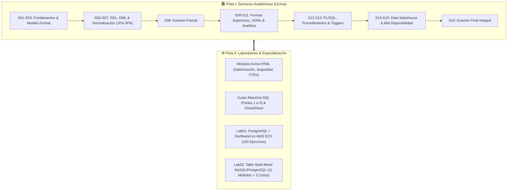
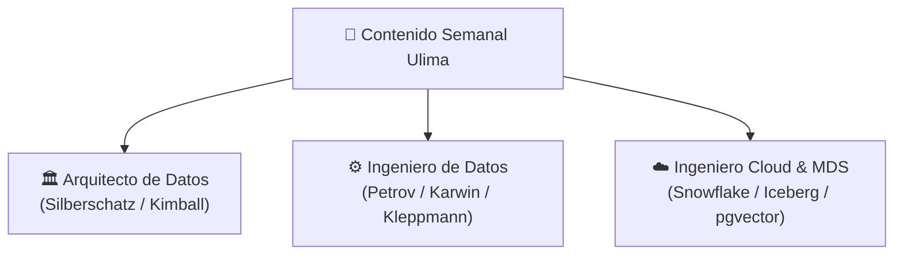
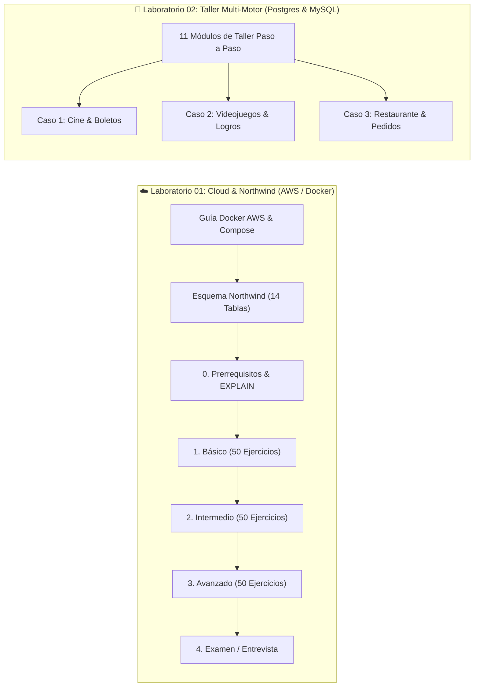
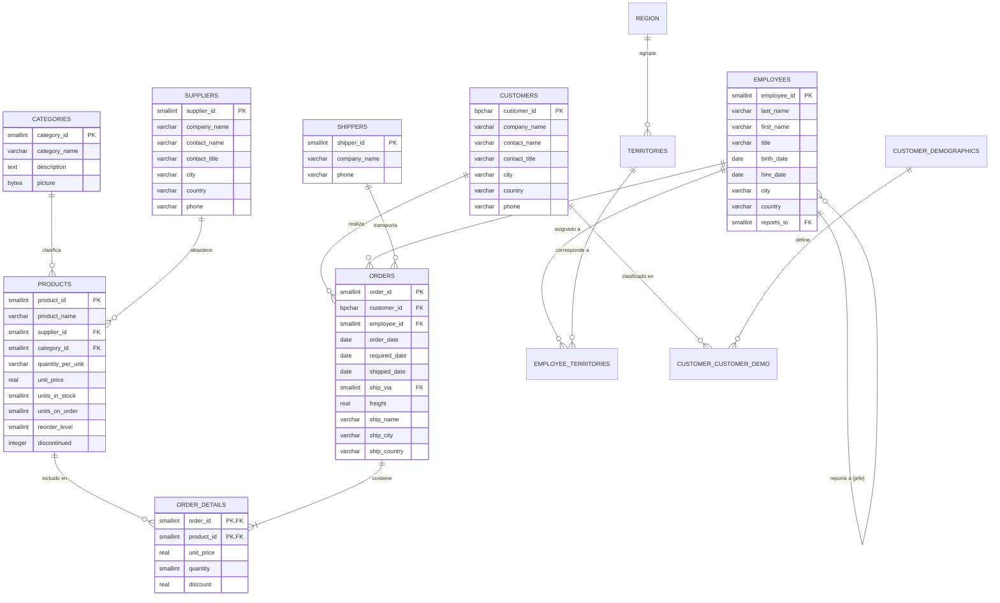

# 🏛️ INGENIERÍA DE DATOS & SQL MASTERCLASS
### *El Tratado Definitivo de Diseño Relacional, Optimización de Consultas, Arquitectura Cloud y Data Warehousing*

[](https://www.postgresql.org/)
[](https://www.mysql.com/)
[](https://www.docker.com/)
[](https://aws.amazon.com/)
[](https://dbeaver.io/)
[](ULima/Apuntes/index.html)

---

## 📋 Ficha Técnica y Metadatos de la Obra

| Parámetro | Especificación Técnica |
| :--- | :--- |
| **Título de la Obra** | *Ingeniería de Datos y SQL: De los Fundamentos Relacionales al Cloud Data Warehousing* |
| **Audiencia Objetivo** | Ingenieros de Datos, Administradores de Bases de Datos (DBA), Desarrolladores Backend y Arquitectos de Software |
| **Enfoque Pedagógico** | Sistema Cornell de Toma de Notas, Material Design 3 (M3) Interactivo y Aprendizaje Basado en Escenarios Reales |
| **Motores Soportados** | PostgreSQL 16+, MySQL 8.0+, Oracle Database (PL/SQL), Microsoft SQL Server 2012+ |
| **Infraestructura** | Docker Compose, AWS EC2 (Amazon Linux 2023 / Ubuntu), Entornos Locales Multi-motor |
| **Datasets Canónicos** | `Northwind Traders` (14 tablas relacionales), `Cineplex`, `GameHub Videojuegos`, `Gourmet Restaurant` |
| **Documentos Académicos** | [Sílabo Oficial PDF](ULima/Silabus.pdf) \| [Sílabo en Texto](ULima/Silabus.txt) |
| **Dashboard Web Central** | [Dashboard Académico HTML](ULima/Apuntes/index.html) \| [Máster SQL Lab02 HTML](Lab/Lab02/index.html) |

---

## 📖 Prólogo y Guía de Navegación del Repositorio

Bienvenido a la biblioteca integral de **Ingeniería de Datos y SQL**. Este repositorio está concebido y estructurado con el rigor de un libro de texto universitario avanzado y un manual de referencia editorial estilo *O'Reilly*.

El conocimiento está organizado en dos rutas sinérgicas:
1. **La Pista Académica y Teórica (ULima):** Un recorrido de 16 semanas académicas que abarca la formalidad del Álgebra Relacional, las Formas Normales (1FN a DKNF), el ciclo de vida de la información, programación procedimental y arquitecturas OLAP / Data Warehouse.
2. **La Pista de Práctica Industrial e Infraestructura Cloud (Labs 01 y 02):** Laboratorios contenerizados con Docker, despliegues en AWS EC2, un banco de más de 150 ejercicios graduales sobre el esquema *Northwind* y un taller práctico multi-motor para resolver problemas reales de negocio.



---

# 📚 TABLA DE CONTENIDOS MAESTRA

```
├── PARTE I: FUNDAMENTOS Y SEMANAS ACADÉMICAS (ULIMA)
│   ├── Semanas 01 a 07: Fundamentos, DDL/DML, DER y Normalización
│   ├── Semana 08: Examen Parcial
│   ├── Semanas 09 a 15: Formas Superiores, SQL Analítico, PL/SQL y Data Warehouse
│   └── Semana 16: Examen Final
├── PARTE II: MÓDULOS DE ESPECIALIZACIÓN Y MAESTRÍA
│   ├── Laboratorios Temáticos Especializados (HTML)
│   └── Guías Maestras de Estudio SQL Desde Cero (HTML)
├── PARTE III: LABORATORIOS Y PRÁCTICA APLICADA
│   ├── Lab01: PostgreSQL & Northwind Mastery en AWS EC2 (150 Ejercicios)
│   └── Lab02: Taller Multi-Motor y Casos de Negocio (PostgreSQL / MySQL)
├── PARTE IV: ANEXOS, PAPERS Y RECURSOS DE SOPORTE
│   ├── Papers Técnicos y Metodologías
│   ├── Solucionarios de Evaluaciones y Prácticas
│   ├── Scripts Dimensionales y Esquemas ER
│   └── Manifiestos de Infraestructura Docker
└── GUÍA DE INICIO RÁPIDO CON DOCKER & DBEAVER
```

---

## 🏛️ PARTE I: Fundamentos y Semanas Académicas (ULima)

Acceso directo al [Dashboard Interactivo del Curso](ULima/Apuntes/index.html), al [Sílabo Oficial en PDF](ULima/Silabus.pdf) y al [Sílabo en Texto](ULima/Silabus.txt).

```mermaid
gantt
    title Cronograma Académico del Tratado de Datos
    dateFormat  X
    axisFormat Sem %X
    section Fundamentos y Diseño
    S01 Fundamentos de Información    :0, 1
    S02 Arquitectura DBMS y ACID      :1, 2
    S03 Modelo Relacional & DDL       :2, 3
    S04 DDL Avanzado & Restricciones  :3, 4
    S05 DML y Consultas Simples       :4, 5
    S06 Modelamiento Conceptual DER   :5, 6
    S07 Normalización 1FN-3FN         :6, 7
    S08 Examen Parcial                :active, 7, 8
    section Avanzado y Data Warehouse
    S09 Formas Superiores (BCNF/4FN)  :8, 9
    S10 JOINs y Subconsultas          :9, 10
    S11 SQL Analítico y Agregación    :10, 11
    S12 Programación PL/SQL           :11, 12
    S13 Procedimientos y Triggers     :12, 13
    S14 Data Warehouse & OLAP         :13, 14
    S15 Alta Disponibilidad & NoSQL   :14, 15
    S16 Examen Final                  :crit, 15, 16
```



### 📑 Cuadro Sinóptico de Clases Semanales

| Semana | Tema Principal | Apunte Cornell (HTML) | Diapositivas de Clase | Transcripción de Clase |
| :---: | :--- | :---: | :---: | :---: |
| **Semana 00** | *Proceso de Desarrollo de Bases de Datos en la Empresa* | — | [Clase_00.pdf](ULima/Clases/Clase_00.pdf) | [Clase_00.txt](ULima/Clases/text/Clase_00.txt) |
| **Semana 01** | *Fundamentos de Administración de Información, SDLC y Enfoque DBMS* | [semana_01.html](ULima/Apuntes/semana_01.html) 🎯 *(50 Flashcards)* | [Clase_01.pdf](ULima/Clases/Clase_01.pdf) | [Clase_01.txt](ULima/Clases/text/Clase_01.txt) |
| **Semana 02** | *Arquitectura ANSI-SPARC 3 Niveles, Independencia de Datos y ACID* | [semana_02.html](ULima/Apuntes/semana_02.html) | [Clase_02.pdf](ULima/Clases/Clase_02.pdf) | [Clase_02.txt](ULima/Clases/text/Clase_02.txt) |
| **Semana 03** | *Modelo Relacional Formal, Restricciones de Integridad y DDL Básico* | [semana_03.html](ULima/Apuntes/semana_03.html) | [Clase_03.pdf](ULima/Clases/Clase_03.pdf) | [Clase_03.txt](ULima/Clases/text/Clase_03.txt) |
| **Semana 04** | *DDL Avanzado: Constraints, Secuencias, Vistas e Índices B-Tree* | [semana_04.html](ULima/Apuntes/semana_04.html) | [Clase_04.pdf](ULima/Clases/Clase_04.pdf) | [Clase_04.txt](ULima/Clases/text/Clase_04.txt) |
| **Semana 05** | *DML y Consultas Simples: INSERT, UPDATE, DELETE, SELECT y Filtros* | [semana_05.html](ULima/Apuntes/semana_05.html) | [Clase_05.pdf](ULima/Clases/Clase_05.pdf) | [Clase_05.txt](ULima/Clases/text/Clase_05.txt) |
| **Semana 06** | *Modelamiento Conceptual Entidad-Relación (DER/EER) y Cardinalidad* | [semana_06.html](ULima/Apuntes/semana_06.html) | [Clase_06.pdf](ULima/Clases/Clase_06.pdf) | [Clase_06.txt](ULima/Clases/text/Clase_06.txt) |
| **Semana 07** | *Normalización de Bases de Datos: 1FN, 2FN, 3FN y Anomalías de Modificación* | [semana_07.html](ULima/Apuntes/semana_07.html) | — | — |
| **Semana 08** | **EVALUACIÓN PARCIAL: Guía Maestra Teórica y Práctica con Solucionario** | [semana_08.html](ULima/Apuntes/semana_08.html) | — | — |
| **Semana 09** | *Formas Normales Superiores (BCNF, 4FN, 5FN, DKNF) y Desnormalización* | [semana_09.html](ULima/Apuntes/semana_09.html) | [Clase_09.pdf](ULima/Clases/Clase_09.pdf) | [Clase_09.txt](ULima/Clases/text/Clase_09.txt) |
| **Semana 10** | *Álgebra Relacional de JOINs (Inner/Left/Right/Full) y Subconsultas* | [semana_10.html](ULima/Apuntes/semana_10.html) | [Clase_10.pdf](ULima/Clases/Clase_10.pdf) | [Clase_10.txt](ULima/Clases/text/Clase_10.txt) |
| **Semana 11** | *SQL Analítico Avanzado: Window Functions, GROUP BY y HAVING* | [semana_11.html](ULima/Apuntes/semana_11.html) | [Clase_11.pdf](ULima/Clases/Clase_11.pdf) | [Clase_11.txt](ULima/Clases/text/Clase_11.txt) |
| **Semana 12** | *Programación en BD: Bloques Anónimos, Variables %TYPE/%ROWTYPE y Cursores* | [semana_12.html](ULima/Apuntes/semana_12.html) | [Clase_12.pdf](ULima/Clases/Clase_12.pdf) | [Clase_12.txt](ULima/Clases/text/Clase_12.txt) |
| **Semana 13** | *Procedimientos Almacenados, Funciones de Usuario, Triggers y Módulos* | [semana_13.html](ULima/Apuntes/semana_13.html) | — | — |
| **Semana 14** | *Data Warehouse, Esquema Estrella/Copo de Nieve y Cubos OLAP* | [semana_14.html](ULima/Apuntes/semana_14.html) | — | — |
| **Semana 15** | *Alta Disponibilidad (HA), AlwaysOn, Replicación, NoSQL y Lakehouse* | [semana_15.html](ULima/Apuntes/semana_15.html) | [Clase_15.pdf](ULima/Clases/Clase_15.pdf) | [Clase_15.txt](ULima/Clases/text/Clase_15.txt) |
| **Semana 16** | **EVALUACIÓN FINAL: Guía Maestra Integral con Solucionario Completo** | [semana_16.html](ULima/Apuntes/semana_16.html) | — | — |

---

### 💼 Integración de Perfiles Profesionales Senior y Literatura Canónica

Todas las semanas académicas (`semana_01.html` a `semana_16.html`) han sido enriquecidas con un marco de análisis profesional que cruza la teoría universitaria con las demandas técnicas de la industria contemporánea (2026):



| Rol Profesional | Enfoque de Dominio en el Curso | Textos y Referencias Canónicas Integradas |
| :--- | :--- | :--- |
| **🏛️ Arquitecto de Datos** | Modelado conceptual/lógico, ontología DIKW, gobernanza bajo DAMA-DMBOK, normalización formal (1FN-5FN/BCNF) y modelado dimensional (matrices de bus, dimensiones conformadas, SCD2). | *Database System Concepts* (Silberschatz, Korth, Sudarshan)<br/>*Fundamentals of Database Systems* (Elmasri & Navathe)<br/>*The Data Warehouse Toolkit* (Ralph Kimball & Margy Ross) |
| **⚙️ Ingeniero de Datos** | Anatomía física del motor (Buffer Pool, WAL ARIES, páginas de 8KB), control de concurrencia MVCC (`xmin`/`xmax`), algoritmos de JOIN (Hash Join, Merge Join), optimización de planes (`EXPLAIN ANALYZE`), antipatrones SQL y pipelines declarativos con dbt. | *Database Internals* (Alex Petrov)<br/>*SQL Antipatterns* (Bill Karwin)<br/>*Designing Data-Intensive Applications* (Martin Kleppmann)<br/>*PostgreSQL Internals* |
| **☁️ Ingeniero Cloud & MDS** | Modern Data Stack, almacenamiento desacoplado de cómputo (AWS S3, Snowflake, BigQuery), Data Lakehouses con formatos abiertos (*Apache Iceberg*, *Delta Lake*), Change Data Capture (*Debezium / Kafka*) y bases de datos vectoriales con `pgvector` para IA Generativa (2026). | *AWS Well-Architected Data Analytics Lens*<br/>*Snowflake Multi-Cluster Architecture*<br/>*Apache Iceberg Open Table Spec*<br/>*Modern Vector Search & RAG Best Practices* |

---

### 🎓 Balotario & Simulador de Exámenes Interactivo (Flashcards)

En [`semana_01.html`](ULima/Apuntes/semana_01.html#balotario-examenes) se encuentra integrado un **Banco de 50 Preguntas Típicas de Examen** con dinámica de auto-evaluación tipo Flashcard:
* **Filtros por Categoría en 1 Clic**: DIKW & Metadatos (10), Archivos vs DBMS (10), Arquitectura DBMS (10), SDLC & Roles (10), y Casos & Trampas Ulima (10).
* **Anatomía de Estudio Activo**:
  1. *Pregunta Directa*: Formulación conceptual estándar.
  2. *🔄 Reformulación / Paráfrasis del Profesor*: Escenario alternativo para evitar memorización mecánica.
  3. *✅ Respuesta Técnica Oficial*: Fundamento formal para alcanzar calificación sobresaliente.
  4. *⚠️ Trampa de Examen / Distractor*: Advertencia sobre las opciones engañosas donde se pierden puntos.
* **Despliegue Progresivo**: Semana 01 operativa (50 ítems). Siguiente fase: Semana 02 (Arquitectura ANSI/SPARC, Buffer Pool, ACID) y Semana 03 (Modelo Relacional, Reglas de Codd y DDL).

---

## 🔬 PARTE II: Módulos de Especialización y Maestría

Esta sección concentra guías monográficas interactivas y hojas de trucos diseñadas para profundizar en temas de alta complejidad técnica y rendimiento.

### 1. 🧪 Laboratorios Monográficos Especializados (HTML)

| Módulo | Documento | Ejes Temáticos Cubiertos |
| :--- | :---: | :--- |
| **Consultas Básicas y Filtros** | [extra_sql_consultas_basicas.html](ULima/Apuntes/extra_sql_consultas_basicas.html) | Filtrado avanzado con `WHERE`, operadores de coincidencia difusa `LIKE` / `ILIKE`, estructuras de control de flujo `CASE WHEN` y funciones escalares de texto. |
| **Catálogo de Funciones SQL** | [extra_sql_funciones.html](ULima/Apuntes/extra_sql_funciones.html) | Referencia enciclopédica de funciones nativas: temporales (`AGE`, `EXTRACT`, `DATE_TRUNC`), numéricas (`ROUND`, `CEIL`, `FLOOR`) y manipulación de strings (`COALESCE`, `CONCAT_WS`, `SPLIT_PART`). |
| **Vistas y CTEs (WITH)** | [extra_sql_vistas_ctes.html](ULima/Apuntes/extra_sql_vistas_ctes.html) | Modularización de consultas complejas mediante Expresiones de Tabla Común (`WITH`), Vistas Estándar, Vistas Temporales y Vistas Materializadas con refresco concurrente. |
| **Agrupamiento y Agregación** | [extra_sql_agrupamiento.html](ULima/Apuntes/extra_sql_agrupamiento.html) | Dominio de funciones de agregación (`COUNT`, `SUM`, `AVG`, `STDDEV`), agrupamientos multidimensionales con `GROUP BY`, cláusula de filtrado de agregados `HAVING` y extensiones `ROLLUP`/`CUBE`. |
| **PL/pgSQL Fundamental** | [extra_plpgsql_intro.html](ULima/Apuntes/extra_plpgsql_intro.html) | Arquitectura del motor procedimental en PostgreSQL, bloques `DO`, declaración de variables escalares y compuestas, estructuras de control (`IF-THEN-ELSE`, `LOOP`, `FOR IN`). |
| **PL/pgSQL Avanzado** | [extra_plpgsql_adv.html](ULima/Apuntes/extra_plpgsql_adv.html) | Manejo estructurado de excepciones (`EXCEPTION WHEN`), cursores explícitos y parametrizados, disparadores (`TRIGGERS`) con variables de contexto `:NEW` / `:OLD` y funciones generadoras de conjuntos (`RETURNS TABLE`). |
| **Optimización y EXPLAIN** | [extra_optimizacion.html](ULima/Apuntes/extra_optimizacion.html) | Ingeniería de rendimiento: lectura de planes de ejecución con `EXPLAIN (ANALYZE, BUFFERS)`, análisis de costos (`Seq Scan`, `Index Scan`, `Bitmap Heap Scan`), índices B-Tree, Hash, GIN y BRIN. |
| **Seguridad y RLS** | [extra_seguridad_adv.html](ULima/Apuntes/extra_seguridad_adv.html) | Seguridad empresarial: Row Level Security (RLS), roles y privilegios granulares (`GRANT`/`REVOKE`), encriptación de datos en reposo y tránsito, y auditoría de accesos. |

---

### 2. 🎓 Guías Maestras de Estudio SQL Desde Cero (Lab02)

Acceso al [Dashboard Maestro de SQL Desde Cero](Lab/Lab02/index.html) y a la [Hoja de Trucos Interactiva Definitiva (Cheat Sheet)](Lab/Lab02/CheatSheet_SQL.html).

| Tomo | Documento | Contenido y Alcance Pedagógico |
| :--- | :---: | :--- |
| **Cheat Sheet Definitiva** | [CheatSheet_SQL.html](Lab/Lab02/CheatSheet_SQL.html) | Hoja de trucos interactiva ultra-completa con sintaxis de DDL, DML, DQL, JOINs, funciones de agregación, variables de entorno y comandos Docker. |
| **Parte 1: Fundamentos y DDL** | [Guia_Estudio_Maestria_SQL_Parte1.html](Lab/Lab02/Guia_Estudio_Maestria_SQL_Parte1.html) | Introducción al paradigma relacional, motores DBMS, configuración de clientes (DBeaver, TablePlus), comandos `CREATE DATABASE`, `DROP DATABASE`, `CREATE TABLE` y restricciones de columna. |
| **Parte 2: Relaciones y DML** | [Guia_Estudio_Maestria_SQL_Parte2.html](Lab/Lab02/Guia_Estudio_Maestria_SQL_Parte2.html) | Integridad referencial (`FOREIGN KEY`), modificación estructural con `ALTER TABLE`, inserción masiva (`INSERT INTO`), manipulación de datos (`UPDATE`), borrado seguro (`DELETE`) y vaciado de tablas (`TRUNCATE`). |
| **Parte 3: DQL y Operaciones JOIN** | [Guia_Estudio_Maestria_SQL_Parte3.html](Lab/Lab02/Guia_Estudio_Maestria_SQL_Parte3.html) | Lenguaje de consulta de datos (`SELECT`), filtros booleanos, alias semánticos, funciones estadísticas (`SUM`, `AVG`, `COUNT`), y álgebra de conjuntos: `INNER JOIN`, `LEFT JOIN`, `RIGHT JOIN` y JOINs de 3+ tablas. |
| **Parte 4: Subconsultas y Backend** | [Guia_Estudio_Maestria_SQL_Parte4.html](Lab/Lab02/Guia_Estudio_Maestria_SQL_Parte4.html) | Subconsultas escalares y correlacionadas, cláusulas `GROUP BY` y `HAVING`, integración con Docker y `.env`, conexión con aplicaciones backend y catálogo de mejores prácticas de ingeniería. |

---

## 🛠️ PARTE III: Laboratorios y Práctica Aplicada



### 1. ☁️ Laboratorio 01: PostgreSQL & Northwind Mastery en AWS EC2

Este laboratorio implementa una infraestructura en la nube sobre AWS EC2 con PostgreSQL 16 y explota el esquema comercial canónico de *Northwind Traders* mediante una batería de **150 ejercicios graduales** diseñados bajo el estándar [STANDARD.md](Lab/Lab01/STANDARD.md).

* **Documentación Central del Laboratorio:** [Lab/Lab01/README.md](Lab/Lab01/README.md)
* **Estándar de Calidad y Resolución:** [Lab/Lab01/STANDARD.md](Lab/Lab01/STANDARD.md)
* **Manual de Despliegue en la Nube:** [Guia_Docker_AWS.md](Lab/Lab01/1.Guia/Guia_Docker_AWS.md) *(Amazon Linux 2023 / Ubuntu, Security Groups, SSH/SCP y Docker Engine)*
* **Manifiesto de Infraestructura:** [docker-compose.yml](Lab/Lab01/1.Guia/docker-compose.yml) \| [Variables de Entorno (.env.example)](Lab/Lab01/1.Guia/.env.example)
* **Script de Inicialización del Dataset:** [db_northwind.sql](Lab/Lab01/1.Guia/db_northwind.sql) *(Esquema canónico de 14 tablas con datos)*
* **Script de Validación Práctica:** [aws_ejercicio.sql](Lab/Lab01/2.Ejercicios/aws_ejercicio.sql)

#### 📚 Batería de Ejercicios Graduales (150 Problemas de Negocio)

| Nivel | Cuaderno de Trabajo | Contenido y Objetivos de Aprendizaje |
| :---: | :--- | :--- |
| **Fase 0** | [0.prerrequisitos.md](Lab/Lab01/2.Ejercicios/0.prerrequisitos.md) | Fundamentos de álgebra relacional, ciclo de ejecución de consultas, planes `EXPLAIN (ANALYZE, BUFFERS)`, propiedades ACID y comandos esenciales del cliente `psql`. |
| **Nivel 1** | [1.basico.md](Lab/Lab01/2.Ejercicios/1.basico.md) | **50 Ejercicios:** Selección y proyección (`SELECT`), filtros condicionales (`WHERE`, `AND`, `OR`, `NOT`), ordenamiento (`ORDER BY`), patrones `LIKE`, manejo de nulos (`IS NULL`), cálculos de fechas con `AGE()` y lógica condicional con `CASE WHEN`. |
| **Nivel 2** | [2.intermedio.md](Lab/Lab01/2.Ejercicios/2.intermedio.md) | **50 Ejercicios:** Agregación estadística (`COUNT`, `SUM`, `AVG`, `MIN`, `MAX`), agrupamiento por categorías con `GROUP BY`, filtros agregados con `HAVING`, y combinaciones de tablas: `INNER JOIN`, `LEFT JOIN`, `RIGHT JOIN`, `FULL OUTER JOIN` y `Self-Join` de jerarquías de empleados. |
| **Nivel 3** | [3.avanzado.md](Lab/Lab01/2.Ejercicios/3.avanzado.md) | **50 Ejercicios:** Subconsultas correlacionadas y anidadas, Expresiones de Tabla Comunes (`WITH` / CTEs), y funciones analíticas de ventana (`ROW_NUMBER()`, `RANK()`, `DENSE_RANK()`, `LAG()`, `LEAD()`, `NTILE()`). |
| **Nivel 4** | [4.examen_entrevista.md](Lab/Lab01/2.Ejercicios/4.examen_entrevista.md) | **Banco de Evaluación Técnica:** Preguntas de alta exigencia para entrevistas de Data Engineer / Senior SQL Developer, escenarios de resolución de cuellos de botella y optimización de consultas complejas. |

---

### 2. 🔀 Laboratorio 02: Taller Multi-Motor y Casos de Negocio

Un taller integral estructurado en 11 módulos progresivos compatibles con PostgreSQL y MySQL, complementado con tres esquemas de bases de datos aplicados al mundo real.

* **Documentación del Taller:** [Lab/Lab02/Taller/README.md](Lab/Lab02/Taller/README.md)
* **Script de Consultas del Taller:** [Lab/Lab02/sql/sql1.sql](Lab/Lab02/sql/sql1.sql)

#### 📖 Módulos del Taller Paso a Paso

| Módulo | Guía Práctica | Conceptos Demostrados |
| :---: | :--- | :--- |
| **01** | [01.instalaciones-necesarias.md](Lab/Lab02/Taller/01.instalaciones-necesarias.md) | Configuración de entorno local: Docker Desktop, DBeaver Community y TablePlus. |
| **02** | [02.create-drop-db-table.md](Lab/Lab02/Taller/02.create-drop-db-table.md) | Sintaxis DDL: Creación y eliminación segura de bases de datos y tablas relacionales. |
| **03** | [03.alter-table.md](Lab/Lab02/Taller/03.alter-table.md) | Modificación de esquemas: `ADD COLUMN`, `DROP COLUMN`, `MODIFY`/`ALTER COLUMN` y Constraints. |
| **04** | [04.insert-into-select.md](Lab/Lab02/Taller/04.insert-into-select.md) | Operaciones de carga: Inserción individual y masiva con `INSERT INTO ... VALUES` y `INSERT INTO ... SELECT`. |
| **05** | [05.update-delete-truncate.md](Lab/Lab02/Taller/05.update-delete-truncate.md) | Modificaciones y eliminaciones atómicas: `UPDATE`, `DELETE` con cláusula `WHERE` y `TRUNCATE TABLE`. |
| **06** | [06.select-where-order.md](Lab/Lab02/Taller/06.select-where-order.md) | Consultas con filtros: Cláusula `WHERE`, operadores de comparación, ordenamiento `ORDER BY` y límites `LIMIT`. |
| **07** | [07.funciones-agregacion.md](Lab/Lab02/Taller/07.funciones-agregacion.md) | Cálculos cuantitativos: `COUNT()`, `SUM()`, `AVG()`, `MIN()`, `MAX()` y alias descriptivos. |
| **08** | [08.inner-join.md](Lab/Lab02/Taller/08.inner-join.md) | Intersección relacional: Composición de múltiples entidades mediante `INNER JOIN` con condiciones `ON`. |
| **09** | [09.left-right-join.md](Lab/Lab02/Taller/09.left-right-join.md) | Inclusión no simétrica: `LEFT JOIN` y `RIGHT JOIN` para preservar registros sin correspondencia. |
| **10** | [10.subconsultas-group-having-coalesce.md](Lab/Lab02/Taller/10.subconsultas-group-having-coalesce.md) | Técnicas combinadas: Agrupamientos `GROUP BY`, condiciones `HAVING`, subconsultas anidadas y `COALESCE()`. |
| **11** | [11.buenas-practicas.md](Lab/Lab02/Taller/11.buenas-practicas.md) | Estándares profesionales: Nomenclatura normalizada, manejo seguro de transacciones y optimización de lectura. |

#### 🏢 Casos de Negocio Aplicados (Scripts SQL Completos)

| Caso de Estudio | Script SQL | Descripción del Dominio y Modelo |
| :--- | :---: | :--- |
| **Caso 1: Cine & Taquilla** | [ejemplo1-cine.sql](Lab/Lab02/Taller/ejemplo1-cine.sql) | Modelo para gestión de películas, salas de proyección, funciones, clientes y venta de boletos con cálculo de recaudación. |
| **Caso 2: Videojuegos & Logros** | [ejemplo2-videojuegos.sql](Lab/Lab02/Taller/ejemplo2-videojuegos.sql) | Esquema para catálogo de juegos, plataformas, desarrolladores, perfiles de jugadores y tracking de logros desbloqueados. |
| **Caso 3: Restaurantes & Pedidos** | [ejemplo3-restaurants.sql](Lab/Lab02/Taller/ejemplo3-restaurants.sql) | Sistema transaccional de restaurantes, cartas de menú, mesas, mozos, comandas de pedidos y facturación detallada. |

---

## 📑 PARTE IV: Anexos, Papers y Recursos de Soporte

Colección de documentos científicos, solucionarios oficiales, scripts dimensionales y diagramas de arquitectura.

### 1. 📄 Papers Técnicos y Metodologías Especializadas

* **Normalización Formal de Bases de Datos:** [NormalizacioBD.pdf](ULima/otros/NormalizacioBD.pdf) \| [Transcripción Texto](ULima/otros/NormalizacioBD.txt)
  * *Tratado formal de dependencias funcionales, descomposición sin pérdida de información, preservación de dependencias y algoritmos de normalización hasta la 3FN/BCNF.*
* **Ingeniería de Reglas de Negocio en Casos de Uso:** [Reglas de Negocio...pdf](ULima/otros/Reglas%20de%20Negocio%20separadas%20del%20enunciado%20del%20Caso%20de%20Uso.pdf) \| [Transcripción Texto](ULima/otros/Reglas%20de%20Negocio%20separadas%20del%20enunciado%20del%20Caso%20de%20Uso.txt)
  * *Metodología para aislar e implementar reglas de validación complejas y disparadores de negocio directamente en el motor de base de datos vs capa de aplicación.*
* **Restricciones en DML Paralelo (Enterprise RDBMS):** [Restrictions on Parallel DML.pdf](ULima/otros/Restrictions%20on%20Parallel%20DML.pdf) \| [Transcripción Texto](ULima/otros/Restrictions%20on%20Parallel%20DML.txt)
  * *Análisis de locks, control de concurrencia multiversión (MVCC), triggers y restricciones de integridad al ejecutar operaciones `INSERT`, `UPDATE` y `DELETE` en paralelo sobre grandes volúmenes.*
* **Taller de Alta Disponibilidad en SQL Server 2012:** [Taller_HA_MSSQL2012.pdf](ULima/otros/Taller_HA_MSSQL2012.pdf) \| [Transcripción Texto](ULima/otros/Taller_HA_MSSQL2012.txt)
  * *Configuración paso a paso de clústeres de conmutación por error (Failover Clustering), grupos de disponibilidad AlwaysOn, Database Mirroring y Log Shipping.*

### 2. 📝 Solucionarios Oficiales de Prácticas Calificadas

* **Solución de Práctica Calificada 03:** [Practica_03_Sol.pdf](ULima/otros/Practica_03_Sol.pdf) \| [Transcripción Texto](ULima/otros/Practica_03_Sol.txt)
  * *Resolución comentada de consultas avanzadas, agrupamientos complejos, subconsultas y lógica procedimental.*
* **Solución General de Práctica de Modelamiento:** [SolucionPractica.pdf](ULima/otros/SolucionPractica.pdf) \| [Transcripción Texto](ULima/otros/SolucionPractica.txt)
  * *Mapeo conceptual a relacional y resolución de enunciados de negocio.*

### 3. 📊 Script de Construcción Data Warehouse OLAP

* **Script DDL Dimensional y Metadatos CWM OLAP:** [Script_Ejemplo_Warehouse.txt](ULima/otros/Script_Ejemplo_Warehouse.txt)
  * *Implementación de un esquema estrella para Recursos Humanos compuesto por `FACT_RRHH`, `DIM_EMPLEADO`, `DIM_DEPARTAMENTO`, `DIM_TIEMPO` y definición de jerarquías dimensionales mediante `cwm_olap_dimension`.*

---

### 4. 🗺️ Diagrama Entidad-Relación Canónico: Northwind Traders

El esquema utilizado en el **Laboratorio 01** modela la operativa comercial internacional completa:



---

### 5. 🐳 Catálogo de Manifiestos Docker Compose

| Manifiesto | Ruta en Repositorio | Motor y Versión | Puertos | Características |
| :--- | :--- | :---: | :---: | :--- |
| **Postgres Cloud / Lab01** | [Lab/Lab01/1.Guia/docker-compose.yml](Lab/Lab01/1.Guia/docker-compose.yml) | PostgreSQL 16 Alpine | `5432:5432` | Healthcheck integrado, volumen `pgdata`, variables de entorno. |
| **Postgres Local / Lab02** | [Lab/Lab02/Taller/docker-compose/Postgres/docker-compose.yaml](Lab/Lab02/Taller/docker-compose/Postgres/docker-compose.yaml) | PostgreSQL 16 | `5432:5432` | Montaje directo de credenciales en YAML. |
| **Postgres Env / Lab02** | [Lab/Lab02/Taller/docker-compose/Postgresenv/docker-compose.yaml](Lab/Lab02/Taller/docker-compose/Postgresenv/docker-compose.yaml) | PostgreSQL 16 | `5432:5432` | Manifiesto parametrizado vía [.env.template](Lab/Lab02/Taller/docker-compose/Postgresenv/.env.template). |
| **MySQL Local / Lab02** | [Lab/Lab02/Taller/docker-compose/MySQL/docker-compose.yaml](Lab/Lab02/Taller/docker-compose/MySQL/docker-compose.yaml) | MySQL 8.0 | `3306:3306` | Montaje directo de credenciales en YAML. |
| **MySQL Env / Lab02** | [Lab/Lab02/Taller/docker-compose/MySQLenv/docker-compose.yaml](Lab/Lab02/Taller/docker-compose/MySQLenv/docker-compose.yaml) | MySQL 8.0 | `3306:3306` | Manifiesto parametrizado vía [.env.template](Lab/Lab02/Taller/docker-compose/MySQLenv/.env.template). |

---

## 🚀 Guía de Inicio Rápido con Docker & DBeaver

Sigue estos cuatro pasos para disponer de un clúster local de desarrollo con PostgreSQL y el dataset *Northwind* completamente cargado:

### 1. Desplegar el Contenedor PostgreSQL

Ejecuta el orquestador declarativo desde la raíz del proyecto:

```bash
# Iniciar contenedor PostgreSQL en segundo plano
docker compose -f "Lab/Lab01/1.Guia/docker-compose.yml" up -d
```

> [!NOTE]
> Si prefieres usar la configuración del Taller Lab02, ejecuta:
> ```bash
> docker compose -f "Lab/Lab02/Taller/docker-compose/Postgres/docker-compose.yaml" up -d
> ```

---

### 2. Cargar el Dataset Northwind

Una vez que el contenedor se encuentre en estado saludable (*healthy*), inyecta el script DDL/DML:

```bash
# Opción A: A través de docker exec directamente al contenedor
docker exec -i postgres-db psql -U postgres -d northwind < "Lab/Lab01/1.Guia/db_northwind.sql"

# Opción B: Mediante el cliente local psql conectado al puerto expuesto
psql -h localhost -p 5432 -U postgres -d northwind -f "Lab/Lab01/1.Guia/db_northwind.sql"
```

---

### 3. Verificar el Estado y la Cantidad de Registros

Comprueba la conectividad y confirma que las 14 tablas fueron creadas con éxito:

```bash
# Validar versión y conectividad
psql -h localhost -p 5432 -U postgres -d northwind -c "SELECT version();"

# Contar productos y órdenes cargadas
psql -h localhost -p 5432 -U postgres -d northwind -c "SELECT 'Products' AS Tabla, COUNT(*) FROM products UNION ALL SELECT 'Orders', COUNT(*) FROM orders;"
```

---

### 4. Conectar desde DBeaver Community / TablePlus

Configura una nueva conexión en tu cliente visual favorito con los siguientes parámetros:

```ini
[DBeaver / TablePlus Connection]
Driver Type = PostgreSQL
Host        = localhost
Port        = 5432
Database    = northwind
Username    = postgres
Password    = postgres
SSL Mode    = disable
```

> [!TIP]
> **Convenciones de Trabajo para Consultas de Alto Rendimiento:**
> 1. **Plan de Ejecución:** Para cualquier consulta compleja, antepón siempre `EXPLAIN (ANALYZE, BUFFERS, VERBOSE)` para inspeccionar el costo del optimizador de PostgreSQL.
> 2. **Transacciones Seguras:** Envuelve siempre sentencias destructivas en bloques explícitos:
>    ```sql
>    BEGIN;
>    DELETE FROM order_details WHERE discount > 0.25 RETURNING *;
>    -- Inspeccionar resultado antes de confirmar:
>    ROLLBACK; -- O COMMIT si el impacto fue el esperado
>    ```
> 3. **Dialecto y Extensiones:** Aprovecha constructos modernos de PostgreSQL como `ON CONFLICT DO NOTHING / UPDATE` (Upsert), tipos estructurados `JSONB`, agregación `STRING_AGG()` y operadores analíticos `OVER (PARTITION BY ...)`.

---

<div align="center">
    <sub>Diseñado con los más altos estándares editoriales universitarios y de ingeniería de datos. 2026.</sub>
</div>
