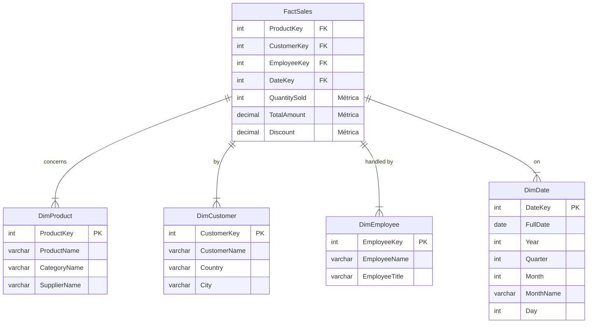

# Ampliando Conocimientos: Temas No Cubiertos en Profundidad

Este archivo profundiza en los temas que la base de datos `Northwind` y los 100 ejercicios de consulta no cubren completamente. Úsalo como una guía para tus siguientes pasos de estudio.

---

## 1. Programación en Base de Datos (Más allá de las Consultas `SELECT`)

Mientras que las consultas (`SELECT`) leen y recuperan datos, los lenguajes procedurales de las bases de datos te permiten **ejecutar lógica y acciones complejas directamente en el servidor de la base de datos**. Esto es crucial para la validación de datos, la automatización de tareas y la creación de APIs de datos seguras.

**Conceptos Clave:**

*   **Procedimientos Almacenados (Stored Procedures):** Son bloques de código reutilizables que pueden aceptar parámetros y realizar una serie de acciones (como `INSERT`, `UPDATE`, `DELETE`, y lógica condicional `IF/ELSE`). No necesitan devolver un valor.
*   **Funciones (Functions):** Similares a los procedimientos, pero **deben** devolver un valor único. Son útiles para cálculos que se necesitan repetir en varias consultas.
*   **Disparadores (Triggers):** Son un tipo especial de procedimiento que se ejecuta **automáticamente** en respuesta a un evento en una tabla (por ejemplo, `BEFORE INSERT`, `AFTER UPDATE`). Se usan para auditoría, validación compleja o mantener la integridad de los datos.

### Ejemplo Práctico: Obtener el total de pedidos de un cliente

#### A. En Oracle (PL/SQL) - *Para tu referencia*
```sql
-- Esto es solo un ejemplo de sintaxis en Oracle (PL/SQL)
CREATE OR REPLACE PROCEDURE get_customer_order_count (
    p_customer_id IN customers.customerid%TYPE,
    p_order_count OUT NUMBER
) AS
BEGIN
    SELECT COUNT(o.orderid)
    INTO p_order_count
    FROM orders o
    WHERE o.customerid = p_customer_id;
END;
/
```

#### B. En MySQL (El que estás usando)
Así es como se haría la misma tarea en MySQL. Nota el uso de `DELIMITER` para permitir el `;` dentro del procedimiento.

```sql
-- Sintaxis para MySQL
DELIMITER $$

CREATE PROCEDURE GetCustomerOrderCount(
    IN in_customer_id INT,
    OUT out_order_count INT
)
BEGIN
    SELECT COUNT(OrderID)
    INTO out_order_count
    FROM Orders
    WHERE CustomerID = in_customer_id;
END$$

DELIMITER ;

-- Cómo usarlo:
-- CALL GetCustomerOrderCount(1, @total_orders);
-- SELECT @total_orders;
```

---

## 2. Data Warehouse (OLAP) - El Mundo del Análisis

La base de datos `Northwind` es **OLTP (Online Transaction Processing)**: está optimizada para transacciones rápidas y del día a día. Un **Data Warehouse** es **OLAP (Online Analytical Processing)**, optimizado para análisis complejos y masivos de datos históricos.

**Conceptos Clave del Modelado Dimensional:**

La estructura más común en un Data Warehouse es el **esquema de estrella (star schema)**, que se compone de:

*   **Tabla de Hechos (Fact Table):** Es la tabla central. Contiene las **métricas** o **medidas** del negocio (ej: cantidad vendida, importe total) y claves foráneas que apuntan a las tablas de dimensión.
*   **Tablas de Dimensiones (Dimension Tables):** Describen el **contexto** de los hechos: quién, qué, dónde, cuándo, por qué. Contienen datos descriptivos que raramente cambian (ej: nombre del cliente, categoría del producto, fecha).

### Ejemplo: Un Esquema de Estrella Hipotético para Northwind

Si quisiéramos construir un Data Warehouse para `Northwind`, lo reestructuraríamos así:


**Ventajas de este modelo:**
*   **Rendimiento:** Las consultas son mucho más rápidas porque requieren menos `JOINs` y los datos están pre-agregados.
*   **Simplicidad:** Es mucho más fácil para los analistas de negocio entender y consultar este modelo que uno altamente normalizado como el de `Northwind`.

---

## 3. Administración de Bases de Datos (DBA)

El rol del Administrador de Bases de Datos (DBA) va mucho más allá de escribir consultas. Su objetivo es garantizar que la base de datos sea **segura, rápida y fiable**.

**Responsabilidades Clave:**

*   **Seguridad y Gestión de Acceso:**
    *   Crear y eliminar usuarios.
    *   Asignar permisos específicos sobre tablas o procedimientos usando `GRANT` y `REVOKE`. Por ejemplo, un usuario de marketing solo debería poder leer (`SELECT`) la tabla de clientes, no modificarla.
*   **Backup (Copias de Seguridad) y Recuperación:**
    *   Diseñar e implementar una estrategia de copias de seguridad (ej: copias completas semanales y copias incrementales diarias).
    *   Saber cómo restaurar la base de datos a un punto específico en el tiempo en caso de un fallo de hardware, un error humano o un ciberataque. En MySQL, una herramienta común es `mysqldump`.
*   **Monitorización y Optimización del Rendimiento:**
    *   **Gestión de Índices:** Crear índices en las columnas correctas para acelerar las consultas es una de las tareas más importantes. Un índice mal puesto o la falta de uno puede ralentizar drásticamente el sistema.
    *   **Análisis de Consultas Lentas (Slow Query Log):** Configurar la base de datos para que registre las consultas que tardan más de un cierto tiempo y analizarlas para optimizarlas.
    *   **Monitorización del Servidor:** Vigilar el uso de CPU, memoria RAM y espacio en disco del servidor de la base de datos.
*   **Alta Disponibilidad y Escalabilidad:**
    *   **Replicación:** Configurar una o más copias de la base de datos principal (maestro) en otros servidores (esclavos). Esto permite distribuir la carga de lectura y tener una copia lista para tomar el control si el servidor principal falla.
    *   **Clustering:** Agrupar varios servidores para que funcionen como una única base de datos, proporcionando alta disponibilidad y balanceo de carga.
