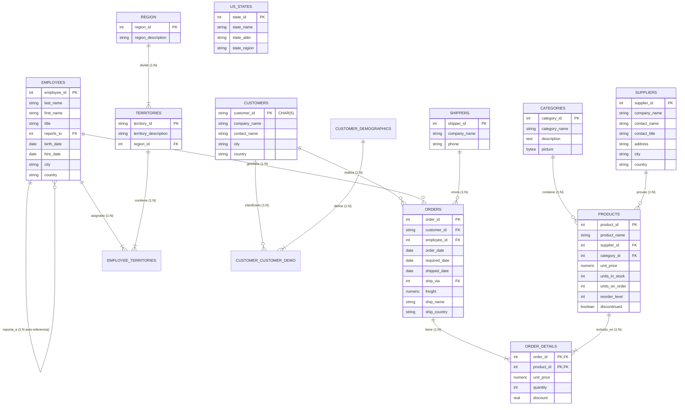

# Diagrama Entidad-Relación (ERD) — Base de Datos Northwind

Este documento detalla el esquema relacional de la base de datos **Northwind**, sus cardinalidades y las relaciones entre tablas utilizando el formato **Mermaid**.

---

## 📊 1. Diagrama ER Completo (Mermaid)

El siguiente diagrama muestra las entidades de Northwind, sus claves primarias (PK), foráneas (FK) y las relaciones con sus respectivas cardinalidades utilizando notación de pata de gallo (*crow's foot*).



---

## 🔑 2. Tipos de Relaciones y Cardinalidad en Northwind

### A. Relación de 1 a Varios (1:N)
Es la relación más común en bases de datos relacionales. Un registro en la tabla "padre" puede estar asociado a cero, uno o muchos registros en la tabla "hijo", pero un registro en la tabla "hijo" pertenece a uno y solo un registro del "padre".

*   **`CATEGORIES` ➔ `PRODUCTS` (1:N):**
    - **Concepto:** Una categoría de producto (por ejemplo, *Beverages*) puede albergar muchos productos diferentes (*Chai*, *Chang*). Sin embargo, un producto específico solo puede pertenecer a una única categoría.
    - **Clave Foránea:** `products.category_id` apunta a `categories.category_id`.
*   **`CUSTOMERS` ➔ `ORDERS` (1:N):**
    - **Concepto:** Un cliente puede realizar múltiples pedidos a lo largo del tiempo. Cada pedido individual pertenece a un único cliente.
    - **Clave Foránea:** `orders.customer_id` apunta a `customers.customer_id`.

### B. Relación de Varios a Varios (N:N)
Ocurre cuando múltiples registros de una tabla están asociados con múltiples registros de otra. En el modelo relacional, las relaciones N:N se implementan mediante una **tabla asociativa (o de unión)** que contiene claves foráneas hacia ambas tablas padre.

*   **`ORDERS` ➔ `PRODUCTS` (Relación N:N mediante `ORDER_DETAILS`):**
    - **Concepto:** Un pedido (*Order*) puede contener muchos productos diferentes. A su vez, un producto puede ser vendido en muchos pedidos distintos.
    - **Implementación:** La tabla `order_details` rompe esta relación N:N en dos relaciones 1:N:
        - `orders` (1) ➔ `order_details` (N)
        - `products` (1) ➔ `order_details` (N)
    - **Clave Primaria Compuesta:** La clave primaria de `order_details` es una combinación de `(order_id, product_id)`, asegurando que un mismo producto no se repita en el mismo pedido en líneas separadas.

### C. Relación de Auto-referencia (1:N Recursiva)
Ocurre cuando una tabla tiene una relación consigo misma.

*   **`EMPLOYEES` ➔ `EMPLOYEES` (1:N auto-referenciada):**
    - **Concepto:** Un empleado reporta a un supervisor o gerente (quien también es un empleado dentro de la misma tabla). Un gerente puede supervisar a muchos empleados (1:N).
    - **Clave Foránea:** `employees.reports_to` apunta a `employees.employee_id`. Si es `NULL`, indica que el empleado está en la cima de la jerarquía (por ejemplo, el Director General).

### D. Tabla de Catálogo Independiente (Sin relaciones explícitas)
*   **`US_STATES`:**
    - **Concepto:** Almacena estados, abreviaturas y regiones de EE.UU. Se comporta como un catálogo de referencia. Aunque los campos de dirección de otras tablas (como `customers.region` o `suppliers.region`) pueden contener datos que correspondan a esta tabla, en el esquema estándar de Northwind no se define una clave foránea explícita (FK) para simplificar la compatibilidad con direcciones internacionales.

---

## 🛠️ 3. DDL de Ejemplo en PostgreSQL para Validar Integridad

Para asegurar que estas relaciones se implementen físicamente con cardinalidades correctas y soporte para acciones en cascada, las restricciones se declaran de la siguiente forma en SQL:

```sql
-- Crear tabla padre
CREATE TABLE categories (
    category_id SERIAL PRIMARY KEY,
    category_name VARCHAR(15) NOT NULL,
    description TEXT
);

-- Crear tabla hijo con restricción FK (1:N)
CREATE TABLE products (
    product_id SERIAL PRIMARY KEY,
    product_name VARCHAR(40) NOT NULL,
    category_id INT,
    unit_price NUMERIC(10,2) DEFAULT 0,
    CONSTRAINT fk_products_categories 
        FOREIGN KEY (category_id) 
        REFERENCES categories(category_id)
        ON DELETE SET NULL
);

-- Crear tabla asociativa para relación N:N (Order_Details)
CREATE TABLE order_details (
    order_id INT,
    product_id INT,
    unit_price NUMERIC(10,2) NOT NULL,
    quantity SMALLINT NOT NULL CHECK (quantity > 0),
    PRIMARY KEY (order_id, product_id),
    FOREIGN KEY (order_id) REFERENCES orders(order_id) ON DELETE CASCADE,
    FOREIGN KEY (product_id) REFERENCES products(product_id) ON DELETE RESTRICT
);
```
